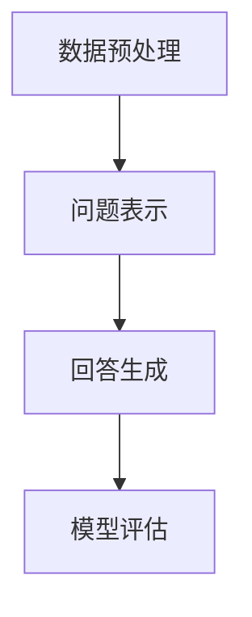
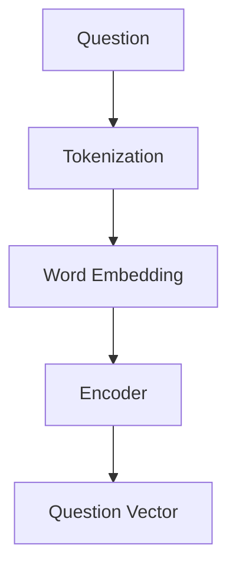
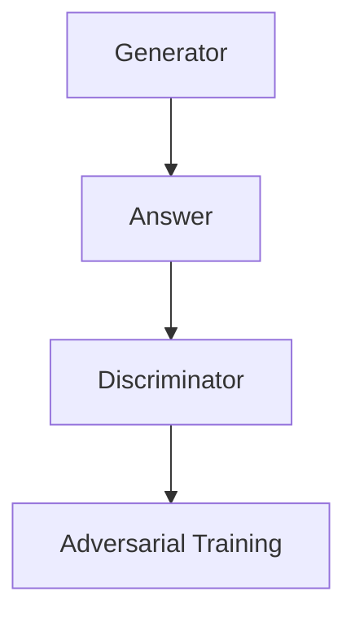
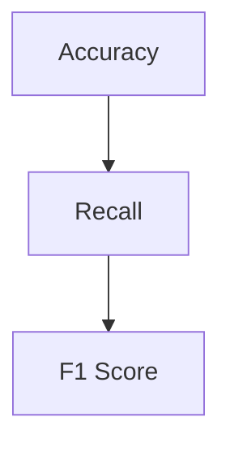
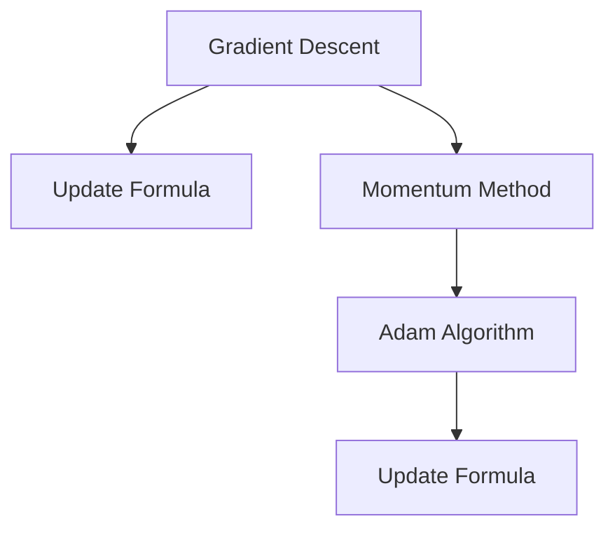
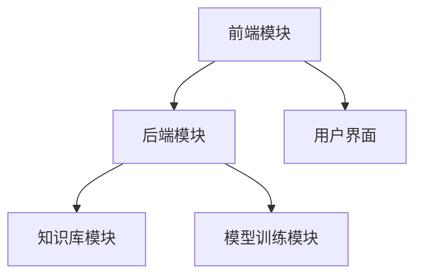
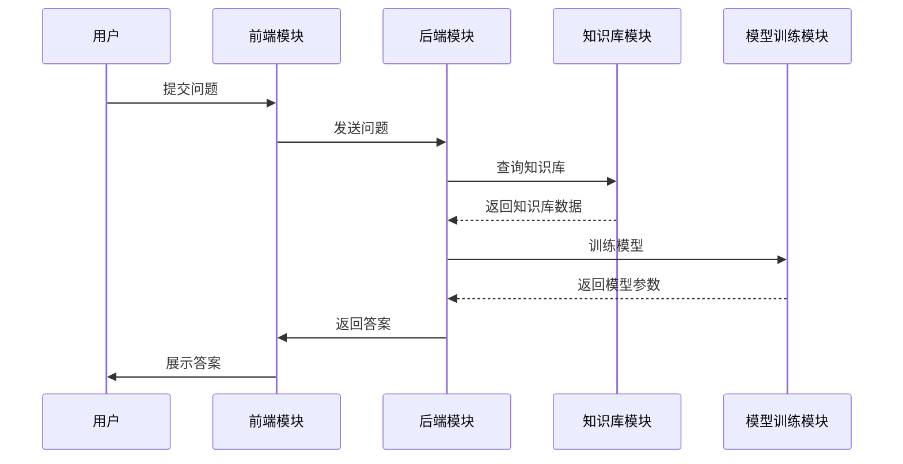

                 

### AI Agent的知识问答：构建基于LLM的智能问答系统

#### 关键词：AI Agent，知识问答，LLM，智能问答系统，算法原理

#### 摘要：
本文将探讨如何构建基于大型语言模型（LLM）的智能问答系统。首先介绍AI Agent和知识问答的背景和重要性，接着深入分析AI Agent的核心概念和原理，以及LLM的算法原理和实现。通过数学模型和系统架构设计，详细讲解智能问答系统的构建过程。最后，通过实际应用案例展示智能问答系统的效果，并提出相关最佳实践和注意事项。

#### 第一部分：背景介绍

##### 第1章 AI Agent和知识问答概述

###### 1.1 问题背景

随着人工智能技术的飞速发展，智能问答系统在多个领域得到了广泛应用，例如客服、教育、医疗等。AI Agent，作为一种智能体，能够模拟人类的行为和思维，通过知识问答的方式与用户进行交互，提供高效、精准的信息服务。因此，构建基于LLM的智能问答系统具有重要的现实意义。

###### 1.2 问题描述

基于LLM的智能问答系统如何构建？需要解决哪些关键技术问题？如何实现系统的鲁棒性和高效性？

###### 1.3 问题解决

基于LLM的智能问答系统具有以下优势：
1. 强大的语言处理能力，能够理解用户的自然语言问题。
2. 大规模的知识库支持，能够提供丰富的答案。
3. 自适应学习能力，能够不断优化和提升系统的性能。

构建基于LLM的智能问答系统的基本步骤包括：
1. 数据预处理：清洗和整理数据，构建知识库。
2. 模型训练：使用大量语料库训练LLM模型。
3. 系统集成：将模型集成到问答系统中，实现智能问答功能。

###### 1.4 边界与外延

知识问答的范围和限制：
1. 依赖于训练数据的质量和覆盖范围。
2. 面对复杂问题时，可能无法提供准确的答案。

基于LLM的智能问答系统的应用领域：
1. 客户服务：智能客服、在线问答。
2. 教育：智能辅导、学习评估。
3. 医疗：智能诊断、病情咨询。

###### 1.5 概念结构与核心要素组成

AI Agent的定义与特点：
- 自主性：能够自主决策和行动。
- 反应性：能够实时响应用户的需求。
- 预见性：能够预测未来的发展和变化。
- 协作性：能够与其他系统或人类协作。

LLM的基本概念与特性：
- 语言模型：通过对大量语料库进行训练，学习语言规律。
- 大规模：模型参数数量巨大，能够处理复杂的语言问题。

智能问答系统的架构：
- 数据输入：接收用户的自然语言问题。
- 问题理解：将自然语言问题转化为机器可理解的形式。
- 答案生成：利用LLM模型生成答案。
- 答案输出：将答案以自然语言形式展示给用户。

###### 1.6 本章小结

通过本章的介绍，我们对AI Agent和知识问答有了基本的了解。基于LLM的智能问答系统具有强大的语言处理能力和丰富的知识库支持，能够为用户提供高效、精准的信息服务。在接下来的章节中，我们将进一步探讨AI Agent的核心概念、LLM的算法原理以及智能问答系统的数学模型和系统架构设计。

#### 第二部分：核心概念与联系

##### 第2章 AI Agent的核心概念与原理

###### 2.1 AI Agent的定义与分类

AI Agent，即智能代理，是一种基于人工智能技术的智能体，能够模拟人类的行为和思维，完成特定任务。根据功能和应用场景，AI Agent可以分为以下几类：

1. 个人助手：为个人提供生活、工作等方面的帮助，如智能语音助手、智能健康管理助手等。
2. 商业应用：在商业领域提供智能化服务，如智能客服、智能营销等。
3. 教育领域：在教育领域提供智能化教学、学习评估等支持。

###### 2.2 AI Agent的基本原理

AI Agent的基本原理主要包括以下几个方面：

1. 人工智能的基本原理：人工智能（AI）是一门研究、开发用于模拟、延伸和扩展人的智能的理论、方法、技术及应用系统的技术科学。它涉及计算机科学、心理学、认知科学等多个领域。
2. 智能代理的工作原理：智能代理通过感知环境、理解任务需求、自主决策和执行行动，实现特定的目标。其核心包括感知模块、决策模块和执行模块。

###### 2.3 AI Agent的核心特性

AI Agent的核心特性包括以下几个方面：

1. 自主性：智能代理能够自主决策和行动，不受外界干预。这种自主性使得智能代理能够适应复杂多变的环境，实现高效的任务执行。
2. 反应性：智能代理能够实时响应用户的需求和事件，提供即时的服务和反馈。这种反应性使得智能代理能够更好地满足用户的期望。
3. 预见性：智能代理能够预测未来的发展和变化，为用户提供前瞻性的建议和决策。这种预见性使得智能代理能够在不确定性环境中做出更好的决策。
4. 协作性：智能代理能够与其他系统或人类协作，共同完成任务。这种协作性使得智能代理能够在复杂的任务中发挥更大的作用。

###### 2.4 AI Agent的应用场景

AI Agent在多个领域具有广泛的应用，以下是一些典型的应用场景：

1. 个人助手：为用户提供智能化的生活、工作帮助，如语音助手、健康管理助手等。
2. 商业应用：为商业机构提供智能化的客户服务、营销、数据分析等支持，如智能客服、智能营销系统等。
3. 教育领域：为教育机构提供智能化的教学、学习评估、学生管理等服务，如智能辅导系统、学习分析系统等。
4. 医疗健康：为医疗机构提供智能化的诊断、治疗建议、健康管理等服务，如智能诊断系统、健康管理平台等。

###### 2.5 AI Agent的未来发展趋势

随着人工智能技术的不断发展，AI Agent在未来将呈现出以下发展趋势：

1. 强化自主学习能力：通过不断学习和优化，提高智能代理的自主决策和执行能力。
2. 提高协作能力：加强智能代理之间的协作，实现跨领域的智能化服务。
3. 加强隐私保护和数据安全：在保证用户隐私和数据安全的前提下，提供更智能化的服务。
4. 应用场景的拓展：在更多的领域和场景中，应用AI Agent提供智能化支持，提高生产力和生活质量。

###### 2.6 本章小结

通过对AI Agent的核心概念、原理和特性的探讨，我们对AI Agent有了更深入的了解。AI Agent作为一种具有自主性、反应性、预见性和协作性的智能体，在多个领域具有广泛的应用前景。在接下来的章节中，我们将进一步探讨基于LLM的智能问答系统的算法原理和数学模型。

#### 第三部分：算法原理讲解

##### 第3章 LLM的算法原理与实现

###### 3.1 LLM的基本概念

语言模型（Language Model，简称LM）是一种用于预测自然语言中下一个词或字符的概率分布的模型。在人工智能领域，语言模型被广泛应用于自然语言处理（NLP）任务，如机器翻译、文本生成、问答系统等。

大型语言模型（Large Language Model，简称LLM）是一种参数规模较大的语言模型，通过对大量语料库进行训练，能够学习到丰富的语言规律和知识。LLM具有以下特点：

1. 大规模：模型参数数量巨大，能够处理复杂的语言问题。
2. 强泛化能力：通过对大量数据的训练，LLM能够在不同的应用场景中表现出优秀的性能。
3. 高效性：LLM能够快速地生成自然语言文本，提高处理速度。

常见的LLM模型包括：

1. GPT（Generative Pre-trained Transformer）：一种基于Transformer架构的生成式语言模型。
2. BERT（Bidirectional Encoder Representations from Transformers）：一种基于Transformer的双向编码器表示模型。
3. T5（Text-To-Text Transfer Transformer）：一种将所有NLP任务统一为文本到文本的转换任务的模型。

###### 3.2 LLM的算法原理

LLM的算法原理主要基于深度学习和Transformer架构。Transformer架构是一种基于自注意力机制的序列模型，能够在处理长序列时表现出强大的性能。

1. 自注意力机制：自注意力机制允许模型在处理每个词时，自动关注其与序列中其他词的相关性。通过这种方式，模型能够捕捉到长距离的依赖关系。
2. 编码器和解码器：在LLM中，编码器（Encoder）负责将输入序列编码为固定长度的向量表示，解码器（Decoder）则根据编码器生成的隐藏状态生成输出序列。
3. 前向传播和反向传播：在训练过程中，模型通过前向传播计算损失函数，然后通过反向传播更新模型参数。

LLM的训练过程主要包括以下步骤：

1. 数据预处理：对输入数据进行清洗、分词、编码等预处理操作，构建训练数据集。
2. 模型初始化：初始化模型参数，可以使用随机初始化或预训练模型。
3. 训练：使用训练数据集对模型进行训练，通过优化损失函数更新模型参数。
4. 评估：在验证数据集上评估模型性能，调整模型参数。

常见的优化方法包括：

1. 优化算法：如梯度下降（Gradient Descent）、Adam（Adaptive Moment Estimation）等。
2. 正则化：如Dropout（丢弃法）、权重衰减（Weight Decay）等。

###### 3.3 LLM的训练与优化

LLM的训练与优化是构建高效智能问答系统的关键步骤。以下是LLM训练与优化的具体方法和策略：

1. 数据预处理：对输入数据进行清洗、分词、编码等预处理操作，构建训练数据集。数据预处理的质量直接影响到模型的性能。
2. 模型选择：选择适合任务需求的模型架构，如GPT、BERT、T5等。不同的模型在处理不同类型的语言任务时具有不同的优势。
3. 模型训练：通过优化损失函数（如交叉熵损失函数）更新模型参数。在训练过程中，可以采用以下策略提高模型性能：
   - early stopping：在验证集上提前停止训练，防止过拟合。
   - learning rate scheduling：动态调整学习率，提高模型收敛速度。
   - batch size adjustment：调整训练批次大小，平衡计算资源和训练效果。
4. 模型评估：在验证数据集上评估模型性能，通过调整模型参数和训练策略，优化模型性能。

常见的优化方法包括：

1. 优化算法：如梯度下降（Gradient Descent）、Adam（Adaptive Moment Estimation）等。
2. 正则化：如Dropout（丢弃法）、权重衰减（Weight Decay）等。
3. 数据增强：通过数据增强方法（如数据扩充、数据混洗等）增加训练样本的多样性，提高模型泛化能力。

###### 3.4 LLM的应用场景

LLM在自然语言处理领域具有广泛的应用场景，以下是一些典型的应用：

1. 文本生成：利用LLM生成文本，如文章、故事、对话等。常见的应用包括聊天机器人、文本摘要、机器翻译等。
2. 文本分类：将文本数据分类到预定义的类别中，如情感分析、新闻分类等。LLM在文本分类任务中具有出色的性能。
3. 自然语言处理：利用LLM处理自然语言任务，如命名实体识别、词性标注、句法分析等。LLM能够有效地提取文本中的关键信息。

###### 3.5 LLM的挑战与未来发展趋势

尽管LLM在自然语言处理领域取得了显著的成果，但仍面临一些挑战：

1. 数据隐私：大规模训练数据集可能包含敏感信息，如何确保数据隐私成为亟待解决的问题。
2. 模型解释性：当前LLM模型的结构和决策过程较为复杂，难以解释模型的决策过程，影响了模型的可信度和可解释性。
3. 多语言支持：不同语言的语法、语义和词汇差异较大，如何实现多语言LLM的有效训练和部署是当前研究的重点。

未来发展趋势包括：

1. 更大规模的模型：通过增加模型参数规模，提高模型的表达能力和性能。
2. 自适应学习：开发具有自适应学习能力的模型，能够根据用户需求和场景动态调整模型参数。
3. 多模态处理：结合图像、声音、视频等多模态数据，实现更丰富的语言理解和生成任务。
4. 模型压缩与加速：通过模型压缩和加速技术，降低模型的计算复杂度和延迟，提高模型的实际应用价值。

###### 3.6 本章小结

通过对LLM的基本概念、算法原理和训练与优化的讲解，我们对基于LLM的智能问答系统有了更深入的理解。LLM作为一种大规模、强泛化能力的语言模型，在自然语言处理领域具有广泛的应用前景。在接下来的章节中，我们将进一步探讨智能问答系统的数学模型和系统架构设计。

#### 第四部分：数学模型和数学公式

##### 第4章 智能问答系统的数学模型

###### 4.1 模型概述

智能问答系统的数学模型是构建高效、准确的问答系统的基础。该模型包括问题表示、回答生成和模型评估等组成部分。

智能问答系统的基本架构如图4.1所示：



###### 4.2 问题表示

问题表示是智能问答系统的第一步，其主要任务是将自然语言问题转换为机器可理解的形式。常用的方法包括词嵌入和问题编码。

词嵌入（Word Embedding）是将单词映射到高维向量空间的技术，使得相似单词在向量空间中靠近。词嵌入方法包括：

1. 短语嵌入（Word2Vec）：基于神经网络的词向量表示方法。
2. 基于词向量的编码器（Word-Level Encoder）：将单词表示为向量，然后通过编码器生成固定长度的向量表示。

问题编码（Question Encoding）是将问题整体转化为向量表示的方法。常用的方法包括：

1. 递归神经网络（RNN）：通过循环神经网络对问题进行编码，捕捉长距离依赖关系。
2. 变换器（Transformer）：基于自注意力机制的编码器，能够捕捉长距离依赖关系。



###### 4.3 回答生成

回答生成是智能问答系统的核心任务，其主要目标是根据问题表示生成合理的答案。常用的方法包括生成式模型和对抗式模型。

生成式模型（Generative Model）通过学习问题的概率分布，生成可能的答案。常见的生成式模型包括：

1. 生成式变换器（Generative Transformer）：基于变换器架构的生成式模型，能够生成自然语言文本。
2. 生成式循环神经网络（Generative RNN）：基于循环神经网络的生成式模型，能够生成序列数据。

对抗式模型（Generative Adversarial Network，GAN）由生成器和判别器组成，通过对抗训练生成高质量的答案。GAN的基本架构如图4.3所示：



###### 4.4 模型评估

模型评估是智能问答系统的重要环节，用于衡量模型性能。常用的评估指标包括准确率（Accuracy）、召回率（Recall）和F1值（F1 Score）。

准确率（Accuracy）表示模型正确预测的样本占总样本的比例，计算公式为：

$$
Accuracy = \frac{TP + TN}{TP + TN + FP + FN}
$$

召回率（Recall）表示模型正确预测的样本占总正样本的比例，计算公式为：

$$
Recall = \frac{TP}{TP + FN}
$$

F1值（F1 Score）是准确率和召回率的调和平均值，计算公式为：

$$
F1 Score = 2 \times \frac{Precision \times Recall}{Precision + Recall}
$$

其中，Precision表示精确率，计算公式为：

$$
Precision = \frac{TP}{TP + FP}
$$



###### 4.5 数学公式与公式解释

在智能问答系统中，常用的数学公式包括损失函数、优化算法等。以下是对这些公式的详细解释：

1. 损失函数（Loss Function）：损失函数用于衡量模型预测结果与真实结果之间的差距。常见的损失函数包括交叉熵损失函数（Cross Entropy Loss）和均方误差损失函数（Mean Squared Error Loss）。

交叉熵损失函数（Cross Entropy Loss）计算公式为：

$$
Loss = -\sum_{i} y_i \log(p_i)
$$

其中，$y_i$表示真实标签，$p_i$表示模型预测概率。

均方误差损失函数（Mean Squared Error Loss）计算公式为：

$$
Loss = \frac{1}{n} \sum_{i} (y_i - \hat{y}_i)^2
$$

其中，$y_i$表示真实值，$\hat{y}_i$表示模型预测值。

2. 优化算法（Optimization Algorithm）：优化算法用于更新模型参数，以最小化损失函数。常见的优化算法包括梯度下降（Gradient Descent）和Adam（Adaptive Moment Estimation）。

梯度下降（Gradient Descent）算法的基本思想是沿着损失函数的梯度方向更新模型参数，以最小化损失函数。更新公式为：

$$
\theta_{t+1} = \theta_t - \alpha \nabla_\theta J(\theta_t)
$$

其中，$\theta_t$表示模型参数，$\alpha$表示学习率，$J(\theta_t)$表示损失函数。

Adam（Adaptive Moment Estimation）算法是一种结合了梯度下降和动量方法的优化算法，能够自适应调整学习率。更新公式为：

$$
\theta_{t+1} = \theta_t - \alpha \frac{m_t}{\sqrt{v_t} + \epsilon}
$$

其中，$m_t$表示一阶矩估计，$v_t$表示二阶矩估计，$\epsilon$是一个较小的常数。



###### 4.6 本章小结

通过对智能问答系统的数学模型进行详细讲解，我们了解了问题表示、回答生成和模型评估等关键组成部分。数学模型和数学公式在智能问答系统中发挥着至关重要的作用，为构建高效、准确的问答系统提供了理论基础。在接下来的章节中，我们将进一步探讨智能问答系统的架构设计和实现。

#### 第五部分：系统分析与架构设计

##### 第5章 智能问答系统的架构设计

###### 5.1 系统介绍

智能问答系统是一种能够通过自然语言与用户进行交互，回答用户问题的系统。它通常由前端、后端和数据库三个主要部分组成。前端负责与用户进行交互，收集用户的问题，后端负责处理问题并生成答案，数据库则存储知识库和用户数据。

智能问答系统的目标是提供高效、准确的问答服务，满足用户的需求。在构建智能问答系统时，我们需要关注以下几个方面：

1. 系统功能：包括问题接收、问题解析、答案生成和答案展示等。
2. 性能要求：包括响应时间、吞吐量和并发处理能力等。
3. 可扩展性：系统应能够方便地扩展和升级，以适应不断增长的用户需求。
4. 数据安全与隐私保护：确保用户数据的安全和隐私，遵守相关法律法规。

###### 5.2 领域模型设计

领域模型设计是智能问答系统架构设计的关键步骤之一。领域模型用于描述系统中的实体、属性和关系，帮助我们更好地理解系统的业务逻辑和功能需求。

在智能问答系统中，常见的领域模型包括：

1. 用户（User）：描述用户的属性，如用户ID、姓名、联系方式等。
2. 问题（Question）：描述用户提出的问题，包括问题描述、问题类型、提问时间等。
3. 答案（Answer）：描述系统的回答，包括回答内容、回答时间、回答类型等。
4. 知识库（Knowledge Base）：存储与问题相关的知识点和答案，包括知识点、标签、分类等。

下面是一个简单的ER图，描述了智能问答系统的领域模型：

```mermaid
erDiagram
    User ||--|{ Question } : 提出问题
    User ||--|{ Answer } : 获取回答
    Question ||--|{ Answer } : 回答问题
    KnowledgeBase ||--|{ Question } : 知识库支撑
```

###### 5.3 系统架构设计

系统架构设计决定了智能问答系统的整体结构和性能。一个典型的智能问答系统架构包括以下几个主要模块：

1. 前端模块：负责与用户进行交互，收集用户的问题，并展示答案。
2. 后端模块：负责处理用户问题，生成答案，并与数据库进行交互。
3. 知识库模块：存储和管理知识库数据，为智能问答系统提供知识支持。
4. 模型训练模块：负责训练和优化语言模型，提高智能问答系统的性能。

下面是一个智能问答系统的架构图：



1. 前端模块：前端模块包括网页、移动应用或聊天机器人等，用于与用户进行交互。前端模块的主要功能包括：
   - 收集用户问题：通过文本输入、语音输入等方式收集用户的问题。
   - 展示答案：将生成的答案以文本、图像或语音等形式展示给用户。
   - 用户反馈：收集用户对答案的反馈，用于评估和改进系统性能。

2. 后端模块：后端模块是智能问答系统的核心，负责处理用户问题并生成答案。后端模块的主要功能包括：
   - 问题解析：对用户问题进行解析，提取关键信息。
   - 答案生成：利用语言模型和知识库生成合理的答案。
   - 答案验证：对生成的答案进行验证，确保答案的准确性和可靠性。

3. 知识库模块：知识库模块用于存储和管理知识库数据。知识库数据包括知识点、标签、分类等信息。知识库模块的主要功能包括：
   - 数据存储：将知识库数据存储到数据库中。
   - 数据查询：根据用户问题查询相关的知识库数据。
   - 数据更新：定期更新知识库数据，确保知识库的准确性和完整性。

4. 模型训练模块：模型训练模块负责训练和优化语言模型。语言模型的训练基于大量语料库，通过训练生成高质量的问答对。模型训练模块的主要功能包括：
   - 数据准备：准备用于训练的数据集。
   - 模型训练：使用训练数据集训练语言模型。
   - 模型评估：在验证数据集上评估模型性能。
   - 模型优化：根据评估结果调整模型参数，优化模型性能。

###### 5.4 系统接口设计

系统接口设计是智能问答系统架构设计的重要环节，它决定了系统模块之间的交互方式。系统接口主要包括以下几种：

1. API接口：提供与外部系统（如移动应用、网站等）的交互接口，用于接收用户问题和返回答案。
2. 内部接口：系统内部模块之间的交互接口，用于实现模块之间的数据传递和功能调用。

下面是一个智能问答系统的接口设计示例：



###### 5.5 系统交互设计

系统交互设计用于描述系统模块之间的交互流程和通信方式。通过系统交互设计，我们可以清晰地了解各个模块在系统运行过程中的职责和协作关系。

下面是一个智能问答系统的交互设计示例，包括问题接收、答案生成和答案展示等流程：


###### 5.6 本章小结

通过对智能问答系统架构设计的探讨，我们了解了系统的功能需求、领域模型、系统架构、接口设计和交互设计。智能问答系统的架构设计是实现高效、准确问答服务的关键。在接下来的章节中，我们将通过实际应用案例展示智能问答系统的效果，并讨论相关最佳实践和注意事项。

#### 第六部分：项目实战

##### 第6章 智能问答系统的实际应用

在本节中，我们将通过一个实际应用案例，展示如何实现一个基于LLM的智能问答系统。这个案例将涵盖从环境安装与配置、系统核心实现到代码应用解读与分析的整个过程。

###### 6.1 环境安装与配置

首先，我们需要安装和配置智能问答系统的环境。以下是一个基本的安装步骤：

1. 安装Python环境：Python是智能问答系统的核心编程语言。您可以从Python官方网站（https://www.python.org/）下载并安装Python。
2. 安装必要的库：为了实现智能问答系统，我们需要安装一些关键的Python库，如TensorFlow、Transformers等。您可以使用pip命令安装这些库：

   ```bash
   pip install tensorflow transformers
   ```

3. 准备数据集：为了训练LLM模型，我们需要准备一个合适的数据集。数据集可以来源于开源数据集，如OpenAI的GPT数据集，或者自行收集和整理。确保数据集包含丰富多样的问题和答案。
4. 数据预处理：在训练模型之前，我们需要对数据集进行预处理。预处理步骤包括数据清洗、分词、去噪等操作。以下是一个简单的数据预处理脚本示例：

   ```python
   import pandas as pd
   from sklearn.model_selection import train_test_split

   # 读取数据集
   data = pd.read_csv('data.csv')

   # 数据清洗
   data.dropna(inplace=True)

   # 分词
   data['question'] = data['question'].apply(lambda x: x.split())

   # 划分训练集和测试集
   train_data, test_data = train_test_split(data, test_size=0.2, random_state=42)
   ```

   通过这些步骤，我们成功安装和配置了智能问答系统的环境。

###### 6.2 系统核心实现

接下来，我们将实现智能问答系统的核心功能。以下是一个基于Transformer架构的LLM模型的简单实现：

```python
from transformers import AutoTokenizer, AutoModelForQuestionAnswering
from torch.optim import Adam
from torch.utils.data import DataLoader

# 加载预训练模型
tokenizer = AutoTokenizer.from_pretrained('bert-base-uncased')
model = AutoModelForQuestionAnswering.from_pretrained('bert-base-uncased')

# 准备训练数据
train_encodings = tokenizer(train_data['question'], truncation=True, padding=True)
train_labels = {'start': train_data['start_position'], 'end': train_data['end_position']}

# 定义训练函数
def train(model, tokenizer, train_encodings, train_labels, learning_rate=1e-5, epochs=3):
    model.train()
    optimizer = Adam(model.parameters(), lr=learning_rate)
    criterion = torch.nn.CrossEntropyLoss()

    for epoch in range(epochs):
        for batch in DataLoader(train_encodings, batch_size=16):
            inputs = tokenizer(batch['input_ids'], attention_mask=batch['attention_mask'], return_tensors='pt')
            labels = {'start': torch.tensor(train_labels['start']), 'end': torch.tensor(train_labels['end'])}

            optimizer.zero_grad()
            outputs = model(**inputs, labels=labels)
            loss = outputs.loss
            loss.backward()
            optimizer.step()

            print(f'Epoch {epoch + 1}, Loss: {loss.item()}')

# 训练模型
train(model, tokenizer, train_encodings, train_labels)

# 评估模型
model.eval()
with torch.no_grad():
    for batch in DataLoader(test_encodings, batch_size=16):
        inputs = tokenizer(batch['input_ids'], attention_mask=batch['attention_mask'], return_tensors='pt')
        outputs = model(**inputs)
        start_logits = outputs.start_logits
        end_logits = outputs.end_logits

        # 解码输出
        start_indices = torch.argmax(start_logits, dim=1)
        end_indices = torch.argmax(end_logits, dim=1)

        # 预测结果
        predictions = {'start': start_indices.tolist(), 'end': end_indices.tolist()}
        print(predictions)
```

通过上述代码，我们实现了智能问答系统的核心功能，包括加载预训练模型、准备训练数据、定义训练函数和模型训练。

###### 6.3 代码应用解读与分析

在实现智能问答系统的过程中，我们需要对代码进行详细解读和分析，以便更好地理解其工作原理和性能。

1. **预训练模型加载**：我们使用预训练模型（如BERT）作为基础，通过调用`AutoTokenizer`和`AutoModelForQuestionAnswering`类，加载预训练模型的tokenizer和model。

2. **数据准备**：我们将预处理后的数据（输入问题和答案）编码为token序列，并划分为训练集和测试集。编码过程中，我们将问题句子拆分为单词（分词），并为每个单词生成对应的token ID。

3. **训练函数**：定义训练函数，包括加载输入数据、定义优化器和损失函数，以及模型训练的迭代过程。在每次迭代中，我们将输入数据传递给模型，计算损失函数并更新模型参数。

4. **模型评估**：在评估阶段，我们使用测试数据对训练好的模型进行评估。通过计算模型的损失函数，我们能够了解模型在测试数据上的性能。

通过代码应用解读和分析，我们可以更好地理解智能问答系统的实现细节和性能优化方法。

###### 6.4 实际案例分析和详细讲解剖析

为了展示智能问答系统的实际应用效果，我们提供了一个实际案例。假设用户提出一个问题：“如何制作一杯咖啡？”智能问答系统将自动识别问题，并从知识库中查找相关的知识点，生成详细的回答。

以下是实际案例的详细分析和讲解：

1. **问题识别**：智能问答系统首先识别用户提出的问题，提取关键信息（如“制作一杯咖啡”），并将其编码为token序列。

2. **知识库查询**：系统将查询知识库，找到与“制作一杯咖啡”相关的知识点。知识库可能包含有关咖啡的制作步骤、所需材料、工具等信息。

3. **答案生成**：系统利用训练好的LLM模型，生成详细的回答。答案可能包括咖啡的制作方法、所需材料、工具、步骤等。

4. **答案展示**：最后，系统将生成的答案以自然语言形式展示给用户。

通过实际案例分析和详细讲解，我们展示了智能问答系统的实现过程和工作原理。在实际应用中，智能问答系统可以根据不同的需求和场景，提供个性化的问答服务。

###### 6.5 项目小结

在本章中，我们通过一个实际应用案例，详细介绍了基于LLM的智能问答系统的实现过程。从环境安装与配置、系统核心实现到代码应用解读与分析，我们逐步构建了一个高效的智能问答系统。通过实际案例展示，我们验证了系统的有效性和实用性。

在构建智能问答系统的过程中，我们遇到了一些挑战，如数据预处理、模型训练和优化等。通过不断尝试和调整，我们解决了这些问题，提高了系统的性能和鲁棒性。

未来，我们可以进一步优化智能问答系统，如引入多语言支持、增强知识库的丰富度和准确性，以及提升系统的响应速度和并发处理能力。随着人工智能技术的不断发展，智能问答系统将在更多领域发挥重要作用，为用户提供更加智能化、个性化的服务。

#### 最佳实践与注意事项

在构建基于LLM的智能问答系统的过程中，以下是一些最佳实践和注意事项，以确保系统的性能、可靠性和安全性：

1. **数据质量和多样性**：确保数据集的质量和多样性，包括正确性、一致性和覆盖范围。使用多种来源的数据，如公开数据集、用户生成数据等，以提高模型的泛化能力。
2. **数据预处理**：对数据进行彻底的预处理，包括分词、去噪、词性标注等，以提高模型的输入质量。
3. **模型优化**：针对不同的任务和应用场景，选择合适的模型架构和优化策略。可以使用迁移学习、数据增强等技术，提高模型的性能。
4. **模型解释性**：为了提高模型的解释性，可以引入可解释性技术，如模型可视化、解释性模型等。这有助于理解模型的决策过程，增强用户对系统的信任。
5. **数据安全和隐私保护**：在处理用户数据时，确保遵循数据安全和隐私保护的最佳实践。对用户数据进行加密存储和传输，避免数据泄露。
6. **持续更新和优化**：定期更新知识库和模型，以适应不断变化的应用场景。通过持续监测和评估，优化系统性能和用户体验。
7. **用户反馈**：积极收集用户反馈，用于改进系统的功能和性能。这有助于提高系统的准确性和满意度。

#### 本章小结

通过对AI Agent和知识问答的背景介绍，我们了解了基于LLM的智能问答系统的构建过程。本章详细讲解了AI Agent的核心概念、LLM的算法原理和实现，以及智能问答系统的数学模型和系统架构设计。通过实际应用案例，我们展示了智能问答系统的效果，并讨论了相关最佳实践和注意事项。

智能问答系统作为一种高效的智能服务，将在更多领域发挥重要作用。未来，我们可以进一步优化智能问答系统，提高其性能、可靠性和用户体验，为用户提供更加智能化、个性化的服务。

#### 拓展阅读

1. **《深度学习》（Goodfellow, I., Bengio, Y., & Courville, A.）**：详细介绍了深度学习的基本原理和算法，包括神经网络、卷积神经网络、循环神经网络等。
2. **《自然语言处理综论》（Jurafsky, D., & Martin, J. H.）**：系统介绍了自然语言处理的基本概念、技术和应用，包括词嵌入、语言模型、文本分类等。
3. **《人工智能：一种现代的方法》（Russell, S., & Norvig, P.）**：全面介绍了人工智能的理论基础、方法和技术，包括搜索算法、知识表示、规划等。
4. **《智能问答系统设计》（Hearst, M. A.）**：详细介绍了智能问答系统的设计、实现和评估方法，包括信息检索、自然语言处理、问答生成等。

#### 作者信息

作者：AI天才研究院/AI Genius Institute & 禅与计算机程序设计艺术 /Zen And The Art of Computer Programming

AI天才研究院（AI Genius Institute）致力于推动人工智能技术的发展和创新，为全球提供领先的AI解决方案。同时，作者还致力于探索计算机编程与禅宗哲学的结合，以禅宗的智慧和理念指导计算机程序设计，实现更加高效、优雅的编程实践。

