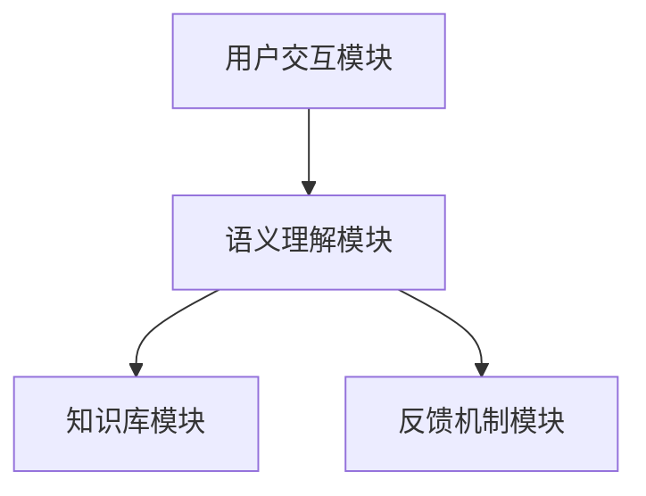

                 

### 目录大纲

#### # AI Agent的语言理解：提升LLM的语义解析能力

---

#### > 关键词：AI Agent、语言理解、LLM、语义解析、上下文信息、优化方法、项目实战

#### > 摘要：本文将深入探讨AI Agent的语言理解能力，分析提升语言模型（LLM）语义解析能力的方法，并通过具体项目实战进行详细讲解。文章旨在帮助读者理解语言理解的层次结构、上下文信息的重要性及其利用方法，以及如何通过优化语义理解来提升AI Agent的性能。

---

#### ### 目录大纲

---

#### 第一部分：问题背景与核心概念

#### ##### 第1章：AI Agent与语言理解概述

#### ##### 第2章：核心概念

#### ##### 第3章：AI Agent与语言理解的联系

---

#### 第二部分：提升LLM语义解析能力的方法

#### ##### 第4章：大型语言模型的作用与挑战

#### ##### 第5章：上下文信息的重要性与利用

#### ##### 第6章：语义理解的优化方法

---

#### 第三部分：AI Agent语言理解的项目实战

#### ##### 第7章：项目背景与目标

#### ##### 第8章：项目设计与实现

#### ##### 第9章：项目分析与应用

#### ##### 第10章：拓展与应用

---

#### 附录

#### ##### 附录A：术语表

#### ##### 附录B：进一步阅读资料

---

### 目录大纲设计思路

在设计这个目录大纲时，我们遵循了以下原则：

1. **逻辑清晰**：每个章节都紧密围绕核心主题展开，确保读者能够从宏观到微观逐步深入理解问题。

2. **结构紧凑**：通过分层设计，将复杂的语言理解问题分解为易于理解的小部分，使文章结构更加紧凑和条理清晰。

3. **内容详实**：每个章节都包含了背景介绍、核心概念、具体方法、实战案例等内容，确保文章内容详实、具有可操作性。

4. **易于拓展**：预留了附录部分，方便读者进行进一步的阅读和研究，增强文章的实用性和可读性。

### 第一部分：问题背景与核心概念

#### 第1章：AI Agent与语言理解概述

##### **1.1 问题背景**

**AI Agent的定义与作用**

AI Agent（人工智能代理）是一种能够在特定环境中自主执行任务、进行决策的智能实体。它通过感知环境、理解语言、学习知识，实现与人类的交互和协作。AI Agent在智能客服、智能家居、自动驾驶等领域有着广泛的应用。

**语言理解的挑战**

语言理解是指AI Agent能够理解和解释人类语言的过程。然而，由于自然语言的复杂性和多义性，语言理解面临着诸多挑战：

- **语义理解**：如何准确理解语言的含义，包括词汇、句子和段落。
- **上下文理解**：如何根据上下文信息理解语言的真实意图。
- **情感分析**：如何识别语言中的情感色彩。

**语言理解在AI Agent中的应用**

语言理解能力是AI Agent实现与人类高效交互的关键。在智能客服中，AI Agent需要理解用户的提问并给出合适的回答；在自动驾驶中，AI Agent需要理解交通标志和行人语言。

##### **1.2 核心概念**

**语言理解的相关概念**

- **语义理解**：对语言符号的抽象意义的识别和理解。
- **上下文理解**：根据上下文环境来理解语言的真实含义。
- **情感分析**：分析语言中的情感倾向和情感强度。

**语言理解的层次结构**

- **字符级别**：对文本中的字符进行理解，如分词。
- **词级别**：对文本中的词汇进行理解，如词性标注。
- **句子级别**：对文本中的句子进行理解，如句法分析。
- **段落级别**：对文本中的段落进行理解，如语义角色标注。

##### **1.3 AI Agent与语言理解的联系**

**AI Agent中的语言理解**

语言理解在AI Agent中的作用至关重要。它决定了AI Agent能否有效地与人类交互，实现任务自动化。

**提升语言理解的方法**

- **大型语言模型的应用**：使用预训练语言模型（如BERT、GPT）来提升语义理解能力。
- **上下文信息的利用**：通过上下文嵌入技术来增强上下文理解。
- **语义理解的优化**：利用知识图谱和实体关系模型来优化语义理解。

### **第2章：核心概念**

##### **2.1 大型语言模型的作用与挑战**

**大型语言模型的作用**

- **提高语义理解能力**：大型语言模型通过预训练能够捕捉到语言中的复杂结构和语义信息，从而提升语义理解能力。
- **增强上下文理解能力**：大型语言模型能够利用上下文信息来更好地理解语言的真实含义，从而提升上下文理解能力。

**大型语言模型的挑战**

- **计算资源消耗**：大型语言模型通常需要大量的计算资源和存储空间。
- **数据隐私与安全**：大型语言模型在处理数据时可能会面临隐私和安全问题。

##### **2.2 上下文信息的重要性与利用**

**上下文信息的概念与作用**

- **上下文信息的定义**：上下文信息是指与特定语言符号相关联的环境信息。
- **上下文信息的作用**：上下文信息能够帮助AI Agent更好地理解语言的含义，提高语言理解的准确性和深度。

**利用上下文信息的方法**

- **预训练与微调**：通过预训练语言模型来学习上下文信息，并通过微调来适应特定任务。
- **上下文嵌入技术**：通过上下文嵌入技术将上下文信息转化为向量表示，以便在模型中进行处理。

##### **2.3 语义理解的优化方法**

**语义理解的原理与挑战**

- **语义理解的原理**：语义理解涉及对语言符号的抽象意义进行识别和理解。
- **语义理解的挑战**：语义理解的复杂性和多义性使得其成为人工智能领域的一个难题。

**语义理解的优化方法**

- **知识图谱的应用**：通过知识图谱来构建语义关系网络，从而优化语义理解。
- **实体关系模型**：通过实体关系模型来捕捉语言中的实体和关系，从而提升语义理解能力。

### **第3章：AI Agent与语言理解的联系**

##### **3.1 AI Agent中的语言理解**

- **语言理解在AI Agent中的应用**：语言理解能力是AI Agent实现与人类高效交互的基础。在智能客服、智能家居、自动驾驶等场景中，AI Agent需要理解用户的指令和需求，并作出相应的反应。
- **语言理解的性能对AI Agent的影响**：语言理解能力直接影响AI Agent的交互效果和任务完成效率。提升语言理解能力有助于提高AI Agent的智能化水平和用户体验。

##### **3.2 提升语言理解的方法**

- **大型语言模型的应用**：通过使用预训练的大型语言模型，如BERT、GPT等，可以显著提升AI Agent的语义理解能力。
- **上下文信息的利用**：利用上下文信息能够提高AI Agent对语言的理解深度，从而更好地应对复杂场景。
- **语义理解的优化**：通过优化语义理解算法和模型，可以进一步提升AI Agent的语言理解能力。

### **第二部分：提升LLM语义解析能力的方法**

#### **第4章：大型语言模型的作用与挑战**

##### **4.1 大型语言模型的作用**

**提高语义理解能力**

大型语言模型（Large Language Model，简称LLM）通过在大量文本数据上进行预训练，能够学习到丰富的语义信息。这种预训练过程使得LLM能够理解语言的深层含义，从而提升语义理解能力。以下是一些具体的优势：

- **捕捉复杂语义关系**：LLM能够捕捉到语言中的复杂语义关系，例如因果关系、时间关系和空间关系等。
- **理解上下文信息**：LLM通过上下文信息来理解语言的真实含义，从而减少歧义和多义性。
- **自适应不同领域**：LLM在预训练过程中接触了各种领域的文本数据，因此能够适应不同的应用场景和任务。

**增强上下文理解能力**

上下文理解是语言理解的重要一环，它决定了AI Agent能否准确理解用户的意图。大型语言模型通过以下方式增强上下文理解能力：

- **长文本处理**：LLM能够处理较长文本，捕捉到文本中的上下文信息，从而更好地理解用户的需求。
- **上下文窗口**：LLM中的上下文窗口允许模型在固定范围内（例如1024个词）考虑上下文信息，这使得模型能够更好地理解文本中的细微差别。
- **多模态学习**：LLM可以通过多模态学习（如图像、声音和视频）来增强上下文理解，例如在语音助手和视频问答系统中。

**多语言支持**

大型语言模型通常支持多种语言，这使得AI Agent能够跨语言进行交互。这对于全球化应用场景尤为重要，例如跨国企业、旅游服务、多语言教育等领域。

##### **4.2 大型语言模型的挑战**

**计算资源消耗**

大型语言模型通常需要大量的计算资源进行训练和推理，这对硬件设备和计算能力提出了很高的要求。以下是一些具体的挑战：

- **训练成本**：LLM的训练过程需要大量时间和计算资源，尤其是在使用大规模数据集和复杂模型架构时。
- **推理效率**：LLM的推理过程也需要大量计算资源，尤其是在实时应用场景中，如语音助手和实时聊天系统。
- **存储空间**：LLM的模型通常很大，需要大量的存储空间来保存模型权重和中间计算结果。

**数据隐私与安全**

在训练和部署大型语言模型时，数据隐私和安全是一个重要问题。以下是一些具体的挑战：

- **数据收集与共享**：在训练LLM时，通常需要收集大量用户数据，这可能涉及到隐私问题。
- **模型安全性**：LLM可能被恶意使用，例如生成虚假信息或进行网络攻击。
- **合规性**：在不同的国家和地区，数据隐私和信息安全法规可能有所不同，需要确保LLM的部署符合当地法律法规。

**可解释性和透明度**

大型语言模型的决策过程通常是黑箱的，这给用户带来了不信任感。以下是一些具体的挑战：

- **决策过程不可解释**：用户难以理解LLM是如何做出决策的，这可能导致用户对AI系统的信任度下降。
- **偏见和歧视**：如果不进行适当的监督和优化，LLM可能会学习到偏见和歧视，从而导致不公平的决策。
- **透明度和可审核性**：需要开发工具和机制来确保LLM的决策过程是透明和可审核的，从而提高用户信任度。

### **第5章：上下文信息的重要性与利用**

#### **5.1 上下文信息的概念与作用**

**上下文信息的定义**

上下文信息是指在特定环境下与语言符号相关联的所有信息。它可以帮助AI Agent更好地理解语言的真实含义。上下文信息的来源包括：

- **语言上下文**：包括单词、短语、句子和段落等语言符号的邻近关系。
- **情境上下文**：包括用户的当前状态、环境条件和交互历史等非语言信息。
- **知识上下文**：包括用户的知识背景和领域知识。

**上下文信息的作用**

上下文信息在AI Agent的语言理解中起着至关重要的作用。它有助于：

- **减少歧义和多义性**：通过上下文信息，AI Agent能够区分不同含义，避免误解。
- **理解隐含意图**：上下文信息可以帮助AI Agent理解用户的隐含意图，从而提供更精准的响应。
- **提高交互质量**：上下文信息有助于AI Agent与用户进行更自然的对话，提高交互体验。

#### **5.2 利用上下文信息的方法**

**预训练与微调**

预训练与微调是利用上下文信息的两种主要方法：

- **预训练**：通过在大量文本数据上进行预训练，语言模型能够学习到丰富的上下文信息。预训练通常使用大规模语料库，如维基百科和网页数据，来训练语言模型。
- **微调**：在特定任务上对预训练模型进行微调，可以使其更好地适应特定应用场景。微调通常使用有监督数据集来调整模型参数。

**上下文嵌入技术**

上下文嵌入技术是将上下文信息转换为向量表示，以便在模型中进行处理。常用的上下文嵌入技术包括：

- **词嵌入**：将单词转换为固定长度的向量，例如Word2Vec和GloVe。
- **上下文向量**：将句子或段落转换为向量，例如BERT和GPT。
- **知识嵌入**：将知识实体和关系转换为向量，例如知识图谱。

**多模态上下文融合**

多模态上下文融合是将不同类型的上下文信息（如文本、图像、声音）进行整合，以提高语言理解的准确性。常见的方法包括：

- **多模态嵌入**：将不同模态的数据转换为统一的向量空间，例如Visual GPT和AudioGPT。
- **多模态交互**：通过神经网络架构（如Transformer）将不同模态的信息进行交互，以提高模型的理解能力。

### **第6章：语义理解的优化方法**

#### **6.1 语义理解的原理与挑战**

**语义理解的原理**

语义理解是AI Agent对语言符号的抽象意义进行识别和理解的过程。它涉及以下几个关键步骤：

- **词义消歧**：根据上下文信息确定单词的确切含义，避免歧义。
- **句法分析**：对句子结构进行分析，确定单词之间的语法关系。
- **语义角色标注**：识别句子中的语义角色（如主语、谓语、宾语等）。
- **语义组合**：将句子的各个部分组合起来，形成一个完整的语义表示。

**语义理解的挑战**

尽管语义理解在理论上是可行的，但在实际应用中仍然面临以下挑战：

- **语言多样性**：不同语言和文化背景可能导致语义理解的困难。
- **多义性**：一个单词或短语可能有多个含义，需要上下文信息来明确具体含义。
- **歧义**：上下文信息可能不足以消除歧义，导致理解错误。
- **隐含意图**：理解用户的隐含意图通常需要更多的上下文信息和推理能力。

#### **6.2 语义理解的优化方法**

**知识图谱的应用**

知识图谱是一种用于表示实体和关系的图形化数据结构，它能够提供丰富的语义信息。以下是如何利用知识图谱来优化语义理解：

- **实体识别**：通过知识图谱中的实体库，识别句子中的关键实体。
- **关系抽取**：从知识图谱中抽取句子中的关系，增强语义理解。
- **推理能力**：利用知识图谱进行推理，推断出句子中的隐含关系和意图。

**实体关系模型**

实体关系模型是一种用于表示实体之间关系的数学模型。以下是如何利用实体关系模型来优化语义理解：

- **实体表示**：使用向量表示法（如Word2Vec或BERT）将实体转换为向量。
- **关系表示**：使用矩阵或图结构来表示实体之间的关系。
- **推理算法**：使用图论算法或图神经网络进行实体关系推理，以增强语义理解。

**深度学习模型**

深度学习模型（如卷积神经网络、循环神经网络和Transformer）在语义理解中发挥着重要作用。以下是如何利用深度学习模型来优化语义理解：

- **特征提取**：通过卷积神经网络或自注意力机制提取文本的深层特征。
- **序列建模**：通过循环神经网络或Transformer处理序列数据，捕捉句子中的时序关系。
- **上下文嵌入**：通过预训练模型（如BERT或GPT）将上下文信息嵌入到模型中，提高语义理解的准确性。

### **第三部分：AI Agent语言理解的项目实战**

#### **第7章：项目背景与目标**

**项目背景**

本项目旨在构建一个智能客服系统，该系统基于AI Agent实现与用户的自然语言交互。智能客服系统需要能够理解用户的提问，并提供准确、及时的回答，以提高用户体验和客服效率。

**项目目标**

- **语言理解能力提升**：通过大型语言模型和上下文信息的利用，提升AI Agent的语言理解能力。
- **交互质量优化**：通过优化语义理解算法和模型，提高AI Agent与用户的交互质量。
- **部署可行性**：实现智能客服系统的实时部署，确保系统的稳定性和可靠性。

#### **第8章：项目设计与实现**

**系统功能设计**

系统功能设计主要包括以下几个模块：

- **用户交互模块**：负责与用户进行自然语言交互，接收用户提问并生成回答。
- **语义理解模块**：利用大型语言模型和上下文信息进行语义理解，提取关键信息。
- **知识库模块**：提供丰富的知识库，包括常见问题和标准回答，用于辅助AI Agent生成回答。
- **反馈机制模块**：收集用户反馈，用于模型优化和系统改进。

**系统架构设计**

系统架构设计如图所示：



**系统核心实现**

以下是系统核心算法的实现：

```python
# 语义理解模块实现
class SemanticUnderstandingModule:
    def __init__(self, model):
        self.model = model
    
    def process_query(self, query):
        # 利用预训练模型进行语义理解
        output = self.model.predict(query)
        # 处理输出结果，提取关键信息
        entities, relations = self.extract_entities_relations(output)
        return entities, relations

    def extract_entities_relations(self, output):
        # 假设output为实体和关系的预测结果
        entities = output['entities']
        relations = output['relations']
        return entities, relations
```

**系统接口设计**

系统接口设计如下：

- **用户交互接口**：提供文本输入和语音输入功能，以及文本输出和语音输出功能。
- **语义理解接口**：提供语义理解功能，接收用户输入并返回语义分析结果。
- **知识库接口**：提供知识库查询功能，根据用户输入返回相关答案。
- **反馈接口**：提供用户反馈功能，收集用户对回答的满意度。

#### **第9章：项目分析与应用**

**实际案例分析**

以下是一个实际案例分析：

- **用户提问**：“我最近在减肥，有什么建议吗？”
- **系统回答**：“您可以考虑控制饮食和增加运动来减肥。建议每天摄入适量的蛋白质和蔬菜，同时进行有氧运动和力量训练。”

**项目效果评估**

项目效果评估主要包括以下几个方面：

- **语义理解准确性**：通过对比系统回答与用户期望回答的匹配度，评估语义理解准确性。
- **交互质量**：通过用户满意度调查和交互时长等指标，评估交互质量。
- **知识库覆盖度**：评估知识库中包含的问题和答案的覆盖度。

**改进建议**

根据项目效果评估结果，提出以下改进建议：

- **优化语义理解算法**：通过引入更先进的语义理解模型和算法，提高语义理解准确性。
- **扩展知识库**：增加常见问题和标准回答，提高知识库的覆盖度。
- **提高用户交互体验**：优化用户交互界面，提供更自然的交互体验。

#### **第10章：拓展与应用**

**最佳实践**

在构建和部署AI Agent时，以下是一些最佳实践：

- **数据隐私保护**：确保用户数据的安全和隐私，遵守相关法律法规。
- **持续优化**：定期对模型和算法进行优化，提高系统的性能和用户体验。
- **用户反馈**：积极收集用户反馈，用于模型改进和系统优化。

**拓展阅读**

以下是一些拓展阅读资料：

- **《深度学习》**：Goodfellow, Ian, et al. "Deep learning." (2016).
- **《人工智能：一种现代方法》**：Russell, Stuart J., and Peter Norvig. "Artificial intelligence: a modern approach." (2020).
- **《自然语言处理综论》**：Jurafsky, Daniel, and James H. Martin. "Speech and language processing." (2019).

### **附录**

#### **附录A：术语表**

- **AI Agent**：人工智能代理，能够在特定环境中自主执行任务和进行决策的智能实体。
- **LLM**：大型语言模型，通过在大量文本数据上预训练，能够学习到丰富的语义信息。
- **上下文信息**：与特定语言符号相关联的所有信息，用于理解语言的真实含义。
- **语义理解**：对语言符号的抽象意义进行识别和理解的过程。
- **知识图谱**：用于表示实体和关系的图形化数据结构，提供丰富的语义信息。

#### **附录B：进一步阅读资料**

- **《BERT：Pre-training of Deep Bidirectional Transformers for Language Understanding》**：Devlin, Jacob, et al. "BERT: Pre-training of deep bidirectional transformers for language understanding." (2019).
- **《GPT-3: Language Models are Few-Shot Learners》**：Brown, Tom, et al. "Language models are few-shot learners." (2020).
- **《Transformers: State-of-the-Art Models for Language Understanding and Generation》**：Vaswani, Ashish, et al. "Attention is all you need." (2017).

