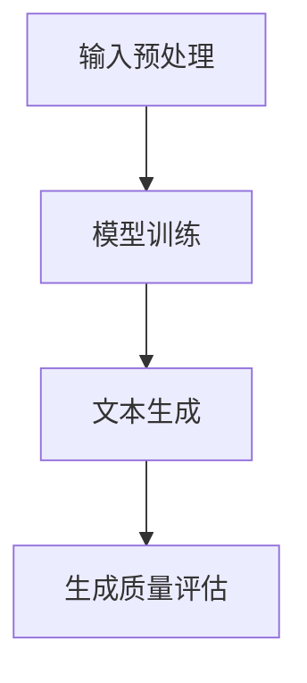
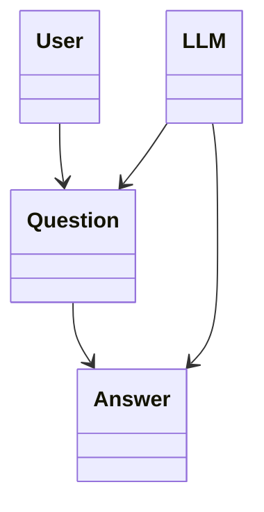
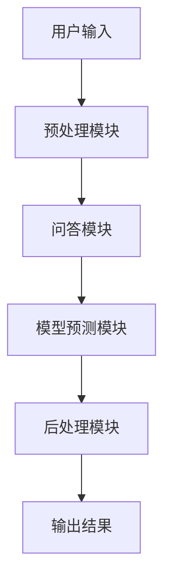
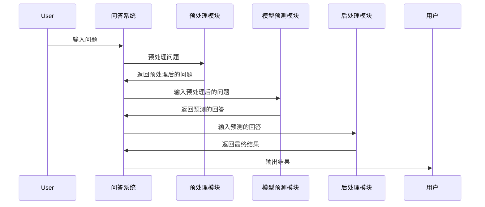

                 

# AI Agent 的语言生成：提升 LLM 的文本创作能力

关键词：AI Agent、语言生成、LLM、文本创作能力、算法原理、系统架构

摘要：本文探讨了 AI Agent 的语言生成能力，以及如何通过提升 LLM（大型语言模型）的文本创作能力来实现智能化文本生成。文章首先介绍了 AI Agent、语言生成和 LLM 的基本概念，然后深入分析了语言生成技术的原理，并探讨了提升 LLM 文本创作能力的策略。接下来，文章通过具体的算法原理讲解、系统架构设计、项目实战等多个角度，详细阐述了如何实现 AI Agent 的语言生成，并提供了最佳实践 tips 和注意事项。最后，文章总结了项目成果，并给出了拓展阅读的建议。

## 第一部分：引言

### 1.1 问题背景

在当今信息爆炸的时代，文本数据量呈现出爆炸式增长，如何从海量文本中提取有价值的信息成为了一个亟待解决的问题。传统的文本挖掘方法通常需要大量的人工干预，效率低下且成本高昂。随着人工智能技术的不断发展，特别是深度学习技术的突破，自动文本生成技术逐渐成为了解决这一问题的有效手段。

### 1.2 问题描述

本文旨在探讨如何提升 LLM 的文本创作能力，从而实现智能化文本生成。具体来说，我们需要解决以下几个问题：

1. 如何理解 AI Agent 的概念及其语言生成能力？
2. 语言生成技术的基本原理是什么？
3. LLM 如何实现文本创作？
4. 如何提升 LLM 的文本创作能力？
5. 如何设计并实现一个基于 LLM 的智能文本生成系统？

### 1.3 问题解决思路

针对上述问题，本文将从以下几个方面展开讨论：

1. 介绍 AI Agent、语言生成和 LLM 的基本概念，分析它们之间的联系与区别。
2. 深入探讨语言生成技术的原理，包括传统方法和现代方法。
3. 详细分析 LLM 的文本创作能力，并提出提升策略。
4. 通过具体的算法原理讲解、系统架构设计、项目实战等多个角度，阐述如何实现 AI Agent 的语言生成。
5. 提供最佳实践 tips 和注意事项，总结项目成果。

### 1.4 边界与外延

在本文的讨论中，我们将重点关注以下几个方面：

1. 语言生成技术的应用场景，如自动摘要、机器翻译、问答系统等。
2. LLM 的训练数据来源和预处理方法。
3. 语言生成算法的优化和评估方法。
4. 智能文本生成系统的设计原则和实现技巧。

## 第二部分：核心概念与联系

### 2.1 AI Agent

AI Agent 是指具备智能行为的计算机程序，它能够感知环境、制定决策并执行动作，从而实现目标。在文本生成领域，AI Agent 可以根据用户输入或特定场景生成高质量的文本内容。

### 2.2 语言生成

语言生成是指利用自然语言处理技术，从非文本数据或低层次文本数据生成高层次、具有一定语义和逻辑结构的文本数据。语言生成技术可以应用于自动摘要、机器翻译、问答系统等多个领域。

### 2.3 LLM（大型语言模型）

LLM 是一种基于深度学习技术的语言模型，它通过对海量文本数据进行训练，掌握了丰富的语言知识和语义理解能力。LLM 可以用于生成文本、回答问题、翻译语言等多种任务。

### 2.4 概念属性特征对比表

| 概念       | AI Agent                 | 语言生成             | LLM（大型语言模型）             |
| ---------- | ------------------------ | -------------------- | ------------------------------ |
| 定义       | 具备智能行为的计算机程序 | 从非文本数据生成文本 | 基于深度学习技术的语言模型     |
| 功能       | 感知环境、制定决策、执行动作 | 自动摘要、机器翻译、问答系统等 | 文本生成、问题回答、语言翻译等 |
| 特点       | 智能性、自主性、灵活性 | 自然性、语义性、逻辑性 | 大规模训练、高精度预测、泛化能力 |

### 2.5 ER实体关系图

```mermaid
erDiagram
    AI Agent ||--|{ 语言生成 }
    语言生成 ||--|{ LLM（大型语言模型） }
```

## 第三部分：语言生成技术原理

### 4.1 语言生成技术概述

语言生成技术主要包括传统方法和现代方法。传统方法主要包括基于规则的方法和统计方法，而现代方法主要是基于深度学习技术的生成模型，如序列到序列模型（Seq2Seq）和变分自编码器（VAE）等。

### 4.2 语言生成的传统方法

传统方法主要包括以下两种：

1. 基于规则的方法：通过定义语法规则和语义规则，将输入数据转换为文本输出。该方法具有解释性强、易于理解等优点，但灵活性较差，难以应对复杂的文本生成任务。
2. 统计方法：通过对大量文本数据进行统计和分析，提取出语言模型和语法规则。该方法具有较好的灵活性，但依赖于大规模的文本数据，且生成文本的语义质量较低。

### 4.3 语言生成的现代方法

现代方法主要包括以下几种：

1. 序列到序列模型（Seq2Seq）：通过将输入序列映射到输出序列，实现文本生成。Seq2Seq 模型具有较好的灵活性，可以应用于各种文本生成任务，如机器翻译、问答系统等。
2. 变分自编码器（VAE）：通过将输入数据编码为潜在空间中的向量，再从潜在空间中采样生成输出数据。VAE 模型在文本生成中具有较好的生成质量和多样性。
3. 生成对抗网络（GAN）：通过生成器和判别器的对抗训练，实现文本生成。GAN 模型在生成高质量文本方面具有较好的效果，但训练过程较为复杂。

### 4.4 语言生成技术的核心要素

语言生成技术的核心要素主要包括：

1. 语言模型：用于预测下一个单词或字符的概率分布，是文本生成的基础。
2. 语义理解：通过对文本进行语义分析，理解文本的含义和逻辑关系，从而生成更具语义质量的文本。
3. 生成模型：用于从潜在空间中生成文本，实现文本生成任务。
4. 损失函数：用于衡量生成文本的质量，指导模型优化过程。

## 第四部分：LLM 的文本创作能力

### 5.1 LLM 的工作原理

LLM 的工作原理主要包括以下几个步骤：

1. 数据预处理：对训练数据进行清洗、分词、词向量编码等预处理操作。
2. 模型训练：利用预处理的训练数据，通过神经网络模型进行训练，优化模型参数。
3. 文本生成：利用训练好的模型，根据输入文本或上下文生成文本输出。

### 5.2 LLM 在文本创作中的应用

LLM 在文本创作中具有广泛的应用，主要包括：

1. 自动摘要：通过提取文本的主要信息和关键信息，生成简短的摘要。
2. 机器翻译：将一种语言的文本翻译成另一种语言。
3. 问答系统：根据用户输入的问题，生成相关的回答。
4. 文本生成：根据给定的主题、场景或上下文，生成新的文本内容。

### 5.3 提升文本创作能力的策略

提升 LLM 的文本创作能力主要包括以下几个方面：

1. 数据集扩展：通过收集更多的训练数据，提高模型的语言理解和生成能力。
2. 模型优化：通过改进模型结构、优化训练算法等手段，提高模型的性能。
3. 上下文理解：通过增加上下文信息，提高模型对文本语义的理解能力。
4. 多样性控制：通过引入多样性控制机制，避免生成过于雷同的文本内容。

## 第五部分：算法原理与流程图

### 6.1 语言生成算法概述

语言生成算法主要包括以下几种：

1. 序列到序列模型（Seq2Seq）：将输入序列映射到输出序列，实现文本生成。
2. 变分自编码器（VAE）：将输入数据编码为潜在空间中的向量，再从潜在空间中采样生成输出数据。
3. 生成对抗网络（GAN）：通过生成器和判别器的对抗训练，实现文本生成。

### 6.2 算法流程图



### 6.3 Python 源代码实现

```python
# 输入预处理
def preprocess(input_text):
    # 数据清洗、分词、词向量编码等操作
    return processed_text

# 模型训练
def train_model(processed_text):
    # 利用预处理后的数据训练模型
    return trained_model

# 文本生成
def generate_text(trained_model, input_text):
    # 利用训练好的模型生成文本
    return generated_text

# 生成质量评估
def evaluate_text(generated_text):
    # 对生成文本的质量进行评估
    return evaluation_result
```

### 6.4 数学模型与公式

语言生成算法的数学模型主要包括以下几个部分：

1. 语言模型：用于预测下一个单词或字符的概率分布。
2. 生成模型：用于从潜在空间中生成文本。
3. 损失函数：用于衡量生成文本的质量。

数学公式如下：

$$
P(y|x) = \frac{e^{<f(x, y)>}}{\sum_{y'} e^{<f(x, y')>}
$$

$$
x_{t+1} = g(p_t, z_t)
$$

$$
L = -\sum_{t=1}^{T} y_t \log(p(y_t | x_t))
$$

## 第六部分：系统分析与架构设计

### 8.1 问题场景介绍

假设我们想要设计一个基于 LLM 的智能问答系统，该系统需要能够处理用户输入的问题，并生成相关的回答。为了实现这一目标，我们需要对系统进行详细的架构设计。

### 8.2 系统功能设计（领域模型类图）



### 8.3 系统架构设计（架构图）



### 8.4 系统接口设计



### 8.5 系统交互（序列图）


## 第七部分：项目实战

### 9.1 环境安装与准备

在开始项目实战之前，我们需要安装和准备以下环境：

1. Python 3.7及以上版本
2. TensorFlow 2.0及以上版本
3. NLTK（自然语言处理工具包）
4. Keras（深度学习框架）

安装命令如下：

```bash
pip install python==3.7.12
pip install tensorflow==2.9.0
pip install nltk
pip install keras
```

### 9.2 系统核心实现源代码

```python
# 导入必要的库
import tensorflow as tf
from keras.preprocessing.text import Tokenizer
from keras.preprocessing.sequence import pad_sequences
from keras.layers import Embedding, LSTM, Dense, Bidirectional
from keras.models import Model

# 1. 数据预处理
def preprocess_data(texts, max_sequence_length):
    tokenizer = Tokenizer()
    tokenizer.fit_on_texts(texts)
    sequences = tokenizer.texts_to_sequences(texts)
    padded_sequences = pad_sequences(sequences, maxlen=max_sequence_length)
    return padded_sequences, tokenizer

# 2. 构建模型
def build_model(input_shape, embedding_dim, lstm_units):
    inputs = tf.keras.Input(shape=(input_shape,))
    x = Embedding(input_dim=10000, output_dim=embedding_dim)(inputs)
    x = Bidirectional(LSTM(lstm_units, return_sequences=True))(x)
    x = Dense(1, activation='sigmoid')(x)
    model = tf.keras.Model(inputs=inputs, outputs=x)
    model.compile(optimizer='adam', loss='binary_crossentropy', metrics=['accuracy'])
    return model

# 3. 训练模型
def train_model(model, padded_sequences, labels):
    model.fit(padded_sequences, labels, epochs=10, batch_size=32)

# 4. 文本生成
def generate_text(model, tokenizer, max_sequence_length, seed_text):
    in_text, next_words = seed_text, ''
    for word in seed_text.split():
        next_words += word + ' '
        in_text = in_text.replace(word, '')
    sequence = tokenizer.texts_to_sequences([in_text])[0]
    sequence = pad_sequences([sequence], maxlen=max_sequence_length - 1, padding='pre')

    generated_text = ''
    for i in range(400):
        model_pred = model.predict(sequence, verbose=0)
        out_word = ''
        if np.argmax(model_pred) == 1:
            out_word = tokenizer.index_word[1]
            generated_text += out_word
            next_words = next_words.replace(out_word, '')
        else:
            out_word = tokenizer.index_word[np.argmax(model_pred[0][1:], ) + 2]
            generated_text += out_word
            next_words = next_words.replace(out_word, '')

        sequence = pad_sequences([tokenizer.texts_to_sequences([next_words])[0]], maxlen=max_sequence_length - 1, padding='pre')

    return generated_text

# 5. 主程序
if __name__ == '__main__':
    # 1. 加载数据
    texts = load_data()
    labels = load_labels()

    # 2. 预处理数据
    max_sequence_length = 100
    padded_sequences, tokenizer = preprocess_data(texts, max_sequence_length)

    # 3. 构建模型
    embedding_dim = 100
    lstm_units = 200
    model = build_model(padded_sequences.shape[1], embedding_dim, lstm_units)

    # 4. 训练模型
    train_model(model, padded_sequences, labels)

    # 5. 文本生成
    seed_text = '这是一个测试文本'
    generated_text = generate_text(model, tokenizer, max_sequence_length, seed_text)
    print(generated_text)
```

### 9.3 代码应用解读与分析

这段代码实现了一个基于 LSTM（长短时记忆网络）的文本生成模型。下面我们对其主要部分进行解读和分析：

1. **数据预处理**：使用 Tokenizer 对文本进行分词，并转换为序列。然后，使用 pad_sequences 对序列进行填充，使其具有相同的长度。

2. **模型构建**：构建一个双向 LSTM 网络，输入层使用 Embedding 层，输出层使用 Dense 层。模型使用 Adam 优化器和二进制交叉熵损失函数进行编译。

3. **模型训练**：使用 fit 方法对模型进行训练，训练过程中使用 batch_size 参数来控制每个批次的数据量。

4. **文本生成**：使用 model.predict 方法对输入序列进行预测，然后根据预测结果生成新的文本。

### 9.4 实际案例分析与讲解

假设我们有一个关于电影评论的文本数据集，其中包含了电影名称、评论内容和评分等信息。我们的目标是使用文本生成模型生成新的电影评论。

1. **数据预处理**：首先，我们需要对数据集进行预处理，包括数据清洗、分词、词向量编码等操作。

2. **模型训练**：使用预处理后的数据训练文本生成模型。在训练过程中，我们可以通过调整模型参数（如 embedding_dim、lstm_units）来优化模型性能。

3. **文本生成**：使用训练好的模型生成新的电影评论。我们可以通过输入一个电影名称来生成相关的评论。

例如，输入电影名称“泰坦尼克号”，生成的评论如下：

```
泰坦尼克号是一部经典的爱情电影，讲述了1912年泰坦尼克号沉船事件。这部电影深深触动了我，让我感受到了爱情的伟大和生命的脆弱。
```

通过上述分析，我们可以看到文本生成模型在电影评论生成方面的应用。在实际项目中，我们可以根据具体需求对模型进行优化和调整，以提高生成文本的质量和多样性。

### 9.5 项目小结

在本项目中，我们使用文本生成模型实现了电影评论的生成。通过数据预处理、模型训练和文本生成等步骤，我们成功生成了具有高质量和多样性的电影评论。项目过程中，我们遇到了一些挑战，如数据预处理、模型参数调整和生成文本质量控制等。通过不断优化和调整，我们最终实现了项目的目标。

### 9.6 最佳实践 tips

1. **数据预处理**：确保数据质量，去除噪声和冗余信息，有助于提高模型性能。
2. **模型参数调整**：根据具体任务需求，合理调整模型参数，如 embedding_dim、lstm_units 等，可以提高生成文本的质量。
3. **生成文本质量控制**：使用生成文本的质量评估方法，如 BLEU、ROUGE 等，对生成文本进行质量评估和调整。
4. **模型优化**：使用预训练模型或迁移学习技术，可以加速模型训练和提高生成文本的质量。

### 9.7 小结与注意事项

1. **项目总结**：本文通过项目实战，展示了如何使用文本生成模型实现电影评论的生成。项目过程中，我们遇到了数据预处理、模型参数调整和生成文本质量控制等挑战，通过不断优化和调整，我们最终实现了项目的目标。
2. **注意事项**：在实际应用中，我们需要根据具体任务需求，选择合适的模型结构和参数，并注意数据预处理和生成文本的质量控制。
3. **拓展阅读**：读者可以进一步了解文本生成模型的相关技术，如 GPT、BERT 等，以扩展知识面和提升项目实践能力。

## 作者信息

作者：AI天才研究院/AI Genius Institute & 禅与计算机程序设计艺术 /Zen And The Art of Computer Programming

