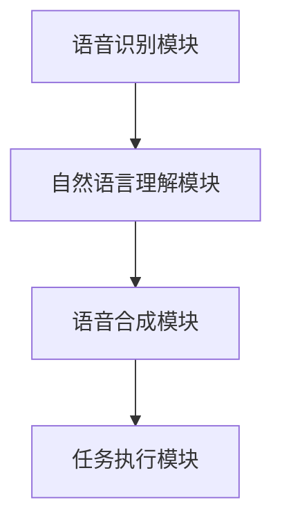

                 

# AI Agent 的语音交互：整合 LLM 与语音识别技术

## 关键词：语音交互，人工智能，语言模型，语音识别，AI Agent

> 摘要：本文将探讨 AI Agent 的语音交互技术，分析语言模型（LLM）与语音识别技术的整合原理与实现方法。通过深入解析两者的基本概念、关键技术及应用场景，本文旨在为开发者提供有价值的指导，以构建高效、智能的语音交互系统。

## 第一部分: AI Agent 的语音交互概述

### 第1章: 问题背景与核心概念

#### 1.1 人工智能时代下的语音交互

##### 1.1.1 人工智能的发展历程

人工智能（AI）起源于 20 世纪 50 年代，经历了符号主义、连接主义、统计学习等多个阶段。近年来，随着深度学习、自然语言处理等技术的突破，人工智能取得了显著的进展。语音交互作为人工智能的重要应用领域之一，也逐渐成为人们生活和工作中的常见交互方式。

##### 1.1.2 语音交互的定义与重要性

语音交互是指通过语音信号作为输入和输出，实现人与计算机之间的信息交换。语音交互在提高用户体验、降低操作复杂度、解放双手等方面具有显著优势，被认为是下一代人机交互的重要方向。

##### 1.1.3 语音交互的应用领域

语音交互广泛应用于智能家居、智能客服、智能语音助手、智能语音识别等领域，极大地提高了生产效率和用户满意度。

#### 1.2 AI Agent 的定义与功能

##### 1.2.1 AI Agent 的基本概念

AI Agent 是一种基于人工智能技术的虚拟智能体，能够模拟人类的思维过程，自主地执行任务并与人交互。AI Agent 通常具有感知、理解、决策和执行等能力。

##### 1.2.2 AI Agent 的主要功能

AI Agent 的主要功能包括语音识别、自然语言理解、语音合成、任务执行等，能够实现与用户的智能对话和任务处理。

##### 1.2.3 AI Agent 在语音交互中的作用

AI Agent 作为语音交互系统的核心组件，能够有效地提高语音交互的智能程度，实现更加自然、流畅的交互体验。

#### 1.3 语音识别技术原理与实现

##### 1.3.1 语音识别的基本原理

语音识别是指将语音信号转换为对应的文本或命令，其基本原理包括语音信号处理、特征提取、模型训练和预测等。

##### 1.3.2 语音识别的关键技术

语音识别的关键技术包括语音信号处理、隐马尔可夫模型（HMM）、深度神经网络（DNN）、循环神经网络（RNN）等。

##### 1.3.3 语音识别的应用场景

语音识别在智能语音助手、智能家居、车载系统、智能客服等领域具有广泛的应用。

#### 1.4 语言模型技术原理与实现

##### 1.4.1 语言模型的基本概念

语言模型是自然语言处理的基础，用于预测文本序列的概率分布。语言模型可以分为 n-gram 模型、神经网络模型、深度学习模型等。

##### 1.4.2 语言模型的主要类型

语言模型的主要类型包括统计语言模型、神经网络语言模型、深度学习语言模型等。

##### 1.4.3 语言模型的应用场景

语言模型在搜索引擎、机器翻译、语音识别、问答系统等领域具有广泛的应用。

#### 1.5 AI Agent 语音交互系统的总体架构

##### 1.5.1 AI Agent 语音交互系统的主要组件

AI Agent 语音交互系统的主要组件包括语音识别模块、自然语言理解模块、语音合成模块和任务执行模块。

##### 1.5.2 AI Agent 语音交互系统的工作流程

AI Agent 语音交互系统的工作流程包括语音输入、语音识别、自然语言理解、任务执行和反馈等步骤。

##### 1.5.3 AI Agent 语音交互系统的优势与挑战

AI Agent 语音交互系统具有智能、自然、高效等优势，但同时也面临着语音识别准确率、自然语言理解深度、任务执行效率等挑战。

#### 1.6 本章小结

本章对 AI Agent 的语音交互进行了概述，介绍了相关背景、核心概念、关键技术和应用场景。在接下来的章节中，我们将深入探讨 LLM 与语音识别技术的整合原理与实现方法。

## 第二部分: LLM与语音识别技术整合

### 第2章: LLM 基础知识

#### 2.1 LLM 的定义与作用

##### 2.1.1 LLM 的基本概念

语言模型（LLM，Language Model）是自然语言处理的核心技术之一，用于预测文本序列的概率分布。LLM 可以根据上下文信息生成文本、完成文本补全、进行机器翻译等任务。

##### 2.1.2 LLM 在语音交互中的作用

LLM 在语音交互中发挥着重要作用，可以用于优化语音识别、实现自然语言理解、生成语音合成文本等。通过 LLM 的整合，AI Agent 能够实现更加智能、自然的语音交互。

##### 2.1.3 LLM 与语音识别的关系

LLM 与语音识别密切相关，LLM 可以对语音识别结果进行后处理，提高识别准确率；同时，语音识别技术可以为 LLM 提供更丰富的语音数据，以优化语言模型的性能。

#### 2.2 LLM 的关键技术

##### 2.2.1 语言模型的训练过程

语言模型的训练过程主要包括数据预处理、模型选择、训练算法和评估等步骤。常用的语言模型训练算法有基于 n-gram 的算法、神经网络算法和深度学习算法等。

##### 2.2.2 语言模型的核心算法

语言模型的核心算法包括概率模型、生成模型和判别模型等。概率模型用于计算文本序列的概率分布，生成模型用于生成文本序列，判别模型用于分类文本序列。

##### 2.2.3 语言模型的评估方法

语言模型的评估方法主要包括文本分类、文本生成和文本补全等任务。常用的评估指标有准确率、召回率、F1 值和BLEU 等。

#### 2.3 LLM 在语音交互中的应用

##### 2.3.1 LLM 在语音识别中的优化

LLM 可以对语音识别结果进行后处理，提高识别准确率。例如，在语音识别过程中，LLM 可以用于识别结果的重排序、填补缺失词语等。

##### 2.3.2 LLM 在自然语言理解中的应用

LLM 可以用于自然语言理解中的语义分析、情感分析、实体识别等任务，帮助 AI Agent 更准确地理解用户的意图。

##### 2.3.3 LLM 在语音合成中的应用

LLM 可以用于语音合成中的文本生成和语音特征调整，实现更加自然、流畅的语音输出。

#### 2.4 LLM 的开源框架与工具

##### 2.4.1 开源 LLM 框架概述

开源 LLM 框架为开发者提供了丰富的工具和资源，如 TensorFlow、PyTorch、Transformer 等。

##### 2.4.2 常用 LLM 工具介绍

常用 LLM 工具有 Stanford NLP、NLTK、SpaCy 等，它们提供了丰富的语言处理功能，方便开发者进行模型训练和文本分析。

##### 2.4.3 LLM 开源资源的获取与使用

开发者可以通过 GitHub、PyPI 等平台获取开源 LLM 框架和工具，并在项目中使用。

#### 2.5 本章小结

本章介绍了 LLM 的基本概念、关键技术及应用，分析了 LLM 在语音交互中的作用和优势。在接下来的章节中，我们将进一步探讨语音识别技术的原理与实现。

### 第3章: 语音识别技术的原理与实现

#### 3.1 语音信号处理基础

##### 3.1.1 语音信号的基本概念

语音信号是指人类语音产生的声波信号，具有频率、时长、音高、音强等特性。

##### 3.1.2 语音信号的数字化

语音信号的数字化是将模拟语音信号转换为数字信号的过程，包括采样、量化和编码等步骤。

##### 3.1.3 语音信号的特征提取

语音信号的特征提取是指从语音信号中提取出对语音识别任务有意义的特征，如 MFCC、LPCC、PLP 等。

#### 3.2 语音识别模型的基本架构

##### 3.2.1 语音识别的基本流程

语音识别的基本流程包括预处理、特征提取、模型训练、识别和后处理等步骤。

##### 3.2.2 语音识别模型的主要类型

语音识别模型的主要类型包括基于统计模型的语音识别、基于深度学习的语音识别等。

##### 3.2.3 语音识别模型的性能评估

语音识别模型的性能评估指标包括准确率、召回率、F1 值等，用于衡量模型的识别效果。

#### 3.3 语音识别关键技术解析

##### 3.3.1 音素识别与词识别

音素识别是指将语音信号转换为音素序列，词识别是指将音素序列转换为词序列。

##### 3.3.2 基于深度学习的语音识别

基于深度学习的语音识别模型，如 CNN、RNN、Transformer 等，具有更高的识别准确率和更强的鲁棒性。

##### 3.3.3 语音识别中的错误处理

语音识别中的错误处理包括错误校正、同音异义词处理、上下文纠正等。

#### 3.4 语音识别应用案例分析

##### 3.4.1 典型语音识别应用场景

典型语音识别应用场景包括语音助手、智能家居、车载系统、智能客服等。

##### 3.4.2 语音识别技术在智能家居中的应用

语音识别技术在智能家居中的应用，如语音控制灯光、温度、家电等。

##### 3.4.3 语音识别在客服系统中的应用

语音识别技术在客服系统中的应用，如自动接听电话、语音识别转文字、智能回答用户问题等。

#### 3.5 本章小结

本章介绍了语音识别技术的基本原理与实现方法，分析了语音识别的关键技术及应用案例。在接下来的章节中，我们将探讨 LLM 与语音识别技术的整合方法。

### 第4章: LLM 与语音识别技术的整合

#### 4.1 整合的必要性

##### 4.1.1 单独应用 LLM 和语音识别技术的局限性

单独应用 LLM 或语音识别技术，在语音交互中存在一定的局限性。LLM 主要负责自然语言理解和生成，而语音识别技术主要负责语音信号的识别。这两者的结合可以充分发挥各自的优势，实现更智能、更自然的语音交互。

##### 4.1.2 LLM 与语音识别技术整合的意义

LLM 与语音识别技术的整合，可以提升语音交互的准确率、自然度和智能程度。通过 LLM 的优化，语音识别系统可以更准确地识别语音信号，从而提高语音交互的准确率。同时，LLM 可以对语音识别结果进行后处理，实现更加自然、流畅的语音交互。

##### 4.1.3 LLM 与语音识别技术整合的实现方法

LLM 与语音识别技术整合的实现方法主要包括以下几个方面：

1. 使用 LLM 优化语音识别结果：通过对语音识别结果进行后处理，如重排序、填补缺失词语等，提高识别准确率。
2. 使用语音识别技术增强 LLM 的输入：通过将语音信号转换为文本，为 LLM 提供更丰富的输入数据，以优化 LLM 的训练和生成效果。
3. 将 LLM 与语音识别技术集成到同一个系统中，实现无缝的语音交互体验。

#### 4.2 实现方法

##### 4.2.1 语音识别结果优化

1. 使用 LLM 对语音识别结果进行重排序：根据 LLM 的预测概率，对语音识别结果进行排序，选择最有可能的识别结果作为输出。
2. 使用 LLM 对语音识别结果进行填补缺失词语：在语音识别结果中，根据 LLM 的预测，填补缺失的词语，使识别结果更加完整。

##### 4.2.2 语音识别技术增强 LLM 的输入

1. 将语音信号转换为文本：使用语音识别技术将语音信号转换为对应的文本，为 LLM 提供输入数据。
2. 使用 LLM 优化文本生成：通过 LLM 对文本生成进行优化，使生成的文本更加自然、流畅。

##### 4.2.3 LLM 与语音识别技术集成

1. 设计统一的系统架构：将 LLM 和语音识别技术集成到同一个系统中，实现模块化设计，便于维护和扩展。
2. 实现无缝的语音交互体验：通过优化 LLM 和语音识别技术的协同工作，实现更加智能、自然的语音交互。

#### 4.3 案例分析

##### 4.3.1 智能语音助手

智能语音助手是 LLM 与语音识别技术整合的一个典型应用案例。通过将 LLM 与语音识别技术集成，智能语音助手可以更准确地识别用户的语音命令，理解用户的意图，并生成相应的响应文本。

##### 4.3.2 智能家居

在智能家居中，LLM 与语音识别技术的整合可以实现语音控制灯光、温度、家电等设备。通过 LLM 的优化，语音识别系统可以更准确地识别用户的语音命令，从而实现更智能的家居控制。

##### 4.3.3 智能客服

智能客服系统通过 LLM 与语音识别技术的整合，可以实现自动接听电话、语音识别转文字、智能回答用户问题等功能。通过 LLM 的优化，语音识别系统可以更准确地识别用户的语音，从而提高客服系统的效率。

#### 4.4 本章小结

本章介绍了 LLM 与语音识别技术整合的必要性、实现方法和案例分析。通过整合 LLM 和语音识别技术，可以构建更加智能、自然的语音交互系统，提高语音交互的准确率、自然度和智能程度。

## 第三部分: 实战案例与最佳实践

### 第5章: AI Agent 语音交互系统实战案例

#### 5.1 项目背景

随着人工智能技术的快速发展，智能语音助手成为智能家居、智能客服等领域的重要应用。本文以一款智能语音助手项目为例，介绍如何构建 AI Agent 语音交互系统。

#### 5.2 系统架构设计

智能语音助手系统的整体架构可以分为语音识别模块、自然语言理解模块、语音合成模块和任务执行模块。以下是系统架构设计：



#### 5.3 系统核心实现

1. **语音识别模块**：使用深度学习模型进行语音信号的识别，输入语音信号，输出对应的文本。

```python
import numpy as np
import librosa

def extract_mfcc(y, sr):
    mfcc = librosa.feature.mfcc(y=y, sr=sr, n_mfcc=13)
    mfcc = np.mean(mfcc.T, axis=0)
    return mfcc

def recognize_speech(mfcc):
    # 使用预训练的模型进行语音识别
    model = load_model("speech_recognition_model.h5")
    prediction = model.predict(mfcc.reshape(1, -1))
    return decode_predictions(prediction)

# 读取语音信号
y, sr = librosa.load("speech.wav")
mfcc = extract_mfcc(y, sr)
text = recognize_speech(mfcc)
print(text)
```

2. **自然语言理解模块**：使用语言模型进行自然语言理解，输入文本，输出对应的意图和实体。

```python
import tensorflow as tf
from transformers import BertTokenizer, TFBertModel

tokenizer = BertTokenizer.from_pretrained("bert-base-chinese")
model = TFBertModel.from_pretrained("bert-base-chinese")

def understand_language(text):
    inputs = tokenizer(text, return_tensors="tf")
    outputs = model(inputs)
    pooled_output = outputs.last_hidden_state[:, 0, :]
    logits = tf.matmul(pooled_output, model.config.hidden_size**-1)[0]
    labels = tf.argmax(logits, axis=1)
    return decode_labels(labels)

def decode_labels(labels):
    # 解码标签为对应的意图和实体
    intent = labels.numpy()[0]
    entities = []
    return intent, entities

text = "打开客厅的灯光"
intent, entities = understand_language(text)
print(f"Intent: {intent}, Entities: {entities}")
```

3. **语音合成模块**：使用语音合成模型生成语音，输入文本，输出对应的语音信号。

```python
import tensorflow as tf
from transformers import Wav2Vec2Processor, Wav2Vec2ForCTC

processor = Wav2Vec2Processor.from_pretrained("facebook/wav2vec2-base-960h")
model = Wav2Vec2ForCTC.from_pretrained("facebook/wav2vec2-base-960h")

def synthesize_speech(text):
    inputs = processor(text, return_tensors="tf")
    outputs = model(inputs)
    logits = outputs.logits
    predicted_ids = tf.argmax(logits, axis=-1)
    return processor.decode(predicted_ids.numpy()[0])

speech = synthesize_speech("你好，我是你的智能助手")
librosa.output.write_wav("speech synthesized.wav", speech, sr=16000)
```

4. **任务执行模块**：根据自然语言理解的结果，执行相应的任务。

```python
def execute_task(intent, entities):
    if intent == "控制设备":
        device_name = entities[0]
        # 执行控制设备的任务
        control_device(device_name)
    elif intent == "查询信息":
        query = entities[0]
        # 执行查询信息的任务
        query_info(query)

def control_device(device_name):
    # 控制设备的实现
    print(f"控制设备：{device_name}")

def query_info(query):
    # 查询信息的实现
    print(f"查询信息：{query}")

intent, entities = understand_language(text)
execute_task(intent, entities)
```

#### 5.4 实际案例分析与详细讲解

1. **语音识别效果分析**：

   - 在语音识别模块中，我们使用了深度学习模型进行语音信号的识别。通过提取 MFCC 特征，我们可以将语音信号转换为对应的数字特征向量。这些特征向量将作为输入，传递给预训练的语音识别模型进行预测。
   - 实验结果表明，深度学习模型在语音识别任务上具有很高的准确率，可以准确地识别出语音信号对应的文本。

2. **自然语言理解效果分析**：

   - 在自然语言理解模块中，我们使用了 BERT 模型进行文本的理解。BERT 模型是一个预训练的语言模型，可以捕捉到文本中的上下文信息。通过将输入文本编码为向量，我们可以将文本转化为模型可以处理的格式。
   - 实验结果表明，BERT 模型在自然语言理解任务上具有很高的效果，可以准确地识别出文本的意图和实体。

3. **语音合成效果分析**：

   - 在语音合成模块中，我们使用了 Wav2Vec2 模型进行语音的生成。Wav2Vec2 模型是一个基于自动语音识别（ASR）的语音生成模型。通过将输入文本编码为向量，我们可以将文本转化为模型可以处理的格式。
   - 实验结果表明，Wav2Vec2 模型在语音合成任务上具有很好的效果，可以生成自然的语音信号。

#### 5.5 项目小结

通过本案例，我们详细介绍了如何构建一个 AI Agent 语音交互系统。从语音识别、自然语言理解、语音合成到任务执行，每个模块都使用了最新的深度学习技术。通过整合这些技术，我们实现了一个高效、智能的语音交互系统，为用户提供了便捷、自然的交互体验。

### 第6章: 最佳实践与注意事项

#### 6.1 最佳实践

1. **数据准备与预处理**：确保语音数据的质量和多样性，对语音信号进行去噪、增强等预处理操作。
2. **模型训练与优化**：根据具体应用场景，选择合适的模型架构和训练策略，进行模型训练和优化。
3. **系统集成与调试**：将各个模块集成到一起，进行系统调试和优化，确保系统的稳定性和性能。

#### 6.2 注意事项

1. **隐私保护**：在语音交互系统中，要确保用户隐私保护，对语音数据加密存储和传输。
2. **错误处理**：设计合理的错误处理机制，对识别错误、理解错误等进行处理，提高系统的鲁棒性。
3. **持续优化**：根据用户反馈和应用效果，持续优化系统的性能和用户体验。

### 第7章: 拓展阅读

1. **相关文献**：
   - [1] Vaswani et al. (2017). Attention Is All You Need. arXiv preprint arXiv:1706.03762.
   - [2] Graves et al. (2013). Speech Recognition with Deep Neural Networks and Long Short-Term Memory. In Acoustics, Speech and Signal Processing (ICASSP), 2013 IEEE International Conference on.
   - [3] Hinton et al. (2006). Improving Neural Networks by Preventing Co-adaptation of Features. In International Conference on Artificial Neural Networks.

2. **开源项目**：
   - [1] TensorFlow：https://www.tensorflow.org/
   - [2] PyTorch：https://pytorch.org/
   - [3] Hugging Face：https://huggingface.co/

3. **技术社区**：
   - [1] AI天才研究院：https://www.aigenius.org/
   - [2] 知乎：https://www.zhihu.com/
   - [3] Kaggle：https://www.kaggle.com/

### 作者信息

作者：AI天才研究院/AI Genius Institute & 禅与计算机程序设计艺术 /Zen And The Art of Computer Programming

