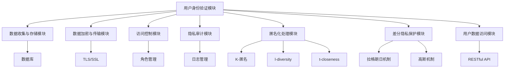

                 

### 第1章：背景介绍与核心概念

#### 1.1 人工智能与隐私保护概述

##### 1.1.1 人工智能的发展与隐私问题

人工智能（AI）是计算机科学的一个重要分支，它旨在开发能够模拟、延伸和扩展人类智能的理论、算法和技术。随着深度学习、自然语言处理和大数据分析的快速发展，AI技术正以前所未有的速度渗透到我们日常生活的方方面面。从智能助手到自动驾驶，从医疗诊断到金融分析，AI的应用已经深刻地改变了我们的工作方式和生活方式。

然而，AI技术的迅猛发展也带来了新的隐私问题。传统的隐私问题主要集中在数据收集、存储和使用的过程中，而AI的引入使得这些问题变得更加复杂。首先，AI系统通常需要大量的数据来进行训练和优化，这些数据可能包含敏感的个人信息。其次，AI系统在处理数据时，可能会无意中泄露用户的隐私。例如，通过语音识别技术收集的用户语音数据，可能会被用来训练模型，进而识别出用户的个人特征。此外，AI系统自身的安全性也是一个重要的问题。如果AI系统被黑客攻击，用户的隐私数据可能会被盗用或滥用。

##### 1.1.2 隐私问题的背景与现状

隐私问题并非AI技术独有，它是一个长期存在的挑战。早在互联网和智能手机普及之前，个人隐私就已经受到了威胁。随着技术的发展，隐私问题变得越来越复杂。例如，网络摄像头和智能手机的普及使得个人生活的私密空间受到了更多的监控。社交媒体的兴起使得个人数据被大量收集和共享，隐私泄露事件也频繁发生。

在AI时代，隐私问题更加严峻。首先，AI系统需要大量的数据来训练模型，这可能导致用户的个人信息被大规模收集。其次，AI技术的进步使得数据分析和挖掘能力大幅提升，这意味着即使是一些看似无害的数据，也可能被用于推断用户的个人隐私。此外，AI系统的智能性使得它们能够自动地学习和优化，这使得隐私保护变得更加复杂。

目前，隐私问题已经成为社会关注的焦点。各国政府和组织纷纷出台隐私保护法规，如欧盟的《通用数据保护条例》（GDPR）和美国的《加州消费者隐私法》（CCPA）。这些法规旨在规范数据的收集、存储和使用，保护用户的隐私权益。

##### 1.1.3 隐私保护的重要性

隐私保护的重要性不言而喻。首先，隐私泄露可能导致严重的个人和经济损失。例如，个人身份信息被盗用可能导致身份盗用和金融欺诈。其次，隐私泄露可能对个人的心理和社交生活造成负面影响。例如，个人隐私被泄露可能会导致隐私侵犯、信任受损和社交孤立。此外，隐私泄露还可能对企业造成声誉损害和财务损失。如果企业的客户数据被泄露，可能导致客户流失和市场份额下降。

在AI领域，隐私保护的重要性更加突出。由于AI系统依赖于大量数据，隐私泄露的风险更高。一旦AI系统中的隐私数据被泄露，攻击者不仅能够获取用户的个人信息，还可能利用这些数据进行更复杂的攻击。例如，攻击者可能通过分析用户的行为数据来预测用户的个人习惯和偏好，进而实施精准的诈骗或广告骚扰。

因此，隐私保护不仅是AI系统设计和运行的基本要求，也是确保AI技术健康发展的关键。只有确保用户的隐私得到有效保护，才能获得用户的信任和支持，推动AI技术的广泛应用和可持续发展。

---

#### 1.2 AI Agent 的定义与特点

##### 1.2.1 AI Agent 的基本概念

AI Agent，即人工智能代理，是指能够自主地感知环境、采取行动并与其他智能体进行交互的计算机程序。它代表了人工智能领域的一个重要发展方向，旨在实现机器的自主性和智能化。一个典型的AI Agent通常由感知器、决策器、执行器三个核心模块组成。

- **感知器**：负责接收外部环境的信息，如文本、图像、声音等。感知器可以通过各种传感器或接口获取数据，并将其转化为计算机可以处理的格式。
- **决策器**：根据感知器收集到的信息，利用算法和模型进行分析和处理，以确定最佳行动方案。决策器通常基于机器学习、深度学习等先进技术，能够从数据中学习模式和规律。
- **执行器**：根据决策器的指令执行具体的操作，如发送消息、控制机器人运动等。执行器可以是物理设备，如机器人手臂或车辆，也可以是软件组件，如数据库操作或网络通信。

##### 1.2.2 AI Agent 的工作原理

AI Agent 的工作原理可以概括为以下几个步骤：

1. **感知**：AI Agent 通过感知器获取环境信息。
2. **分析**：决策器对感知器收集到的信息进行分析和处理，使用机器学习算法提取特征，构建模型。
3. **决策**：决策器根据分析结果，选择最佳行动方案。
4. **执行**：执行器根据决策器的指令执行具体的操作，实现目标。

这个过程是循环进行的，AI Agent 会不断地感知环境、分析和决策，以实现自主适应和优化。例如，一个智能家居系统的AI Agent可以通过感知器监测家庭设备的运行状态，分析这些数据以优化能源使用，并决策如何调整设备以节省能源。

##### 1.2.3 AI Agent 在隐私保护中的作用

AI Agent 在隐私保护中扮演着关键角色，其主要作用体现在以下几个方面：

1. **数据加密**：AI Agent 可以对传输和存储的数据进行加密处理，确保数据在传输过程中不被窃取或篡改。例如，通过使用对称加密算法和非对称加密算法，AI Agent 可以对敏感信息进行加密，从而保护数据的隐私。

2. **匿名化处理**：AI Agent 可以对收集到的数据进行匿名化处理，去除或模糊化个人身份信息，从而降低隐私泄露的风险。例如，使用K-匿名算法，AI Agent 可以将数据集中的敏感信息进行模糊化处理，使其无法直接识别个人身份。

3. **访问控制**：AI Agent 可以实现细粒度的访问控制，确保只有授权用户才能访问敏感数据。例如，通过身份验证和权限管理，AI Agent 可以控制对数据的访问，防止未经授权的用户获取敏感信息。

4. **隐私审计**：AI Agent 可以对数据处理过程进行隐私审计，检测和报告潜在的风险和漏洞。例如，通过日志分析和监控，AI Agent 可以及时发现异常行为，从而采取相应的措施来保护隐私。

5. **隐私保护算法集成**：AI Agent 可以集成各种隐私保护算法，如差分隐私、同态加密等，以实现更高级别的隐私保护。例如，通过使用差分隐私算法，AI Agent 可以在发布统计数据时，确保无法通过数据集推断出单个个体的隐私信息。

总之，AI Agent 在隐私保护中发挥着至关重要的作用。通过引入AI技术，我们可以设计出更加智能、灵活和高效的隐私保护机制，从而在保护用户隐私的同时，实现AI技术的广泛应用。

---

#### 1.3 隐私保护的关键概念

##### 1.3.1 数据隐私与安全

数据隐私和安全是隐私保护的两个核心概念。数据隐私强调的是个人数据的保密性，即个人数据不被未经授权的第三方访问或泄露。数据安全则关注于确保数据在传输和存储过程中的完整性、可用性和可靠性，防止数据被篡改、破坏或丢失。

在AI系统中，数据隐私和安全尤为重要。首先，AI系统通常需要处理大量的敏感数据，如个人身份信息、医疗记录、财务数据等。这些数据如果未经保护地被泄露，可能会导致严重的个人和经济损失。其次，AI系统本身可能会成为攻击的目标，攻击者可能会试图通过攻击AI系统来获取敏感数据。因此，确保数据隐私和安全是AI系统设计的基本要求。

为了实现数据隐私和安全，可以采取以下几种策略：

1. **数据加密**：使用加密算法对敏感数据进行加密，确保数据在传输和存储过程中不被窃取或篡改。常见的加密算法包括对称加密算法（如AES）和非对称加密算法（如RSA）。

2. **访问控制**：通过身份验证和权限管理，限制只有授权用户才能访问敏感数据。访问控制可以基于用户角色、访问权限和资源类型进行细粒度的控制。

3. **匿名化处理**：通过匿名化技术，将个人身份信息进行去标识化处理，使其无法直接识别个人身份。常见的匿名化技术包括数据掩码、数据混淆和数据脱敏。

4. **数据备份与恢复**：定期对数据进行备份，并在发生数据丢失或损坏时，能够快速恢复数据，确保数据的完整性和可靠性。

5. **安全审计**：对数据处理过程进行审计和监控，及时发现和处理潜在的安全威胁。安全审计可以包括日志分析、异常检测和漏洞扫描等。

##### 1.3.2 隐私泄露的后果与预防

隐私泄露的后果可能包括以下几个方面：

1. **经济损失**：隐私泄露可能导致用户的身份被盗用，造成金融欺诈和财产损失。例如，攻击者可能会通过获取用户的银行账户信息来进行非法转账。

2. **个人损害**：隐私泄露可能对个人的心理和社交生活造成负面影响。例如，用户的私人照片或通信记录被公开，可能导致隐私侵犯、信任受损和社交孤立。

3. **声誉损害**：对于企业来说，隐私泄露可能导致客户流失和市场份额下降。如果企业的客户数据被泄露，客户可能会对企业的信任度下降，从而选择其他竞争对手。

4. **法律责任**：在某些国家和地区，隐私泄露可能违反相关法律法规，导致企业面临罚款、赔偿和诉讼等法律风险。例如，欧盟的《通用数据保护条例》（GDPR）规定了严格的隐私保护要求，企业若违反相关规定，将面临高额罚款。

为了预防隐私泄露，可以采取以下措施：

1. **加强数据安全意识教育**：通过培训和宣传，提高员工的数据安全意识和防范能力，确保他们在日常工作中能够采取正确的安全措施。

2. **数据最小化原则**：只收集和存储必要的数据，避免过度收集个人信息。在数据处理过程中，尽量减少数据的存储时间和范围。

3. **加密和匿名化**：对敏感数据进行加密和匿名化处理，确保数据在传输和存储过程中不被窃取或篡改。

4. **访问控制和审计**：通过访问控制和审计机制，确保只有授权用户才能访问敏感数据，并对数据处理过程进行监控和记录，及时发现和处理潜在的安全威胁。

5. **定期的安全评估和更新**：定期对系统进行安全评估，发现和修复安全漏洞，确保系统的安全性和可靠性。

##### 1.3.3 隐私保护的法律与伦理规范

隐私保护不仅需要技术手段，还需要法律和伦理规范的支持。各国和地区纷纷出台了隐私保护法律和规范，以保护用户的隐私权益。

1. **法律框架**：例如，欧盟的《通用数据保护条例》（GDPR）和美国的《加州消费者隐私法》（CCPA）都是旨在保护用户隐私的重要法律。这些法律明确了用户的数据权利，如知情权、访问权、删除权和反对权等，并对企业的数据处理行为进行了严格的规范。

2. **伦理规范**：隐私保护不仅是一个法律问题，也是一个伦理问题。AI系统的设计者和开发者应遵循伦理规范，尊重用户的隐私权益。例如，AI系统应透明、公正和公平，不应通过不当手段获取用户隐私，不应利用用户的隐私数据进行不道德的行为。

3. **责任归属**：在隐私泄露事件中，责任归属是一个重要问题。法律和伦理规范都强调，企业和开发者应对隐私泄露事件承担相应的责任。例如，GDPR明确规定了企业在隐私保护中的责任，包括数据保护 Officer 的设立、隐私影响的评估等。

总之，隐私保护不仅是一个技术问题，也是一个法律和伦理问题。只有通过法律、技术和伦理的紧密结合，才能实现真正的隐私保护，为AI技术的可持续发展创造良好的环境。

---

#### 1.4 LLM 应用中的隐私问题

##### 1.4.1 LLM 的基本概念与功能

语言模型（LLM，Language Model）是一种基于神经网络的语言处理模型，能够对自然语言文本进行生成、翻译、理解和分析。LLM的核心是大规模训练模型，通过处理大量文本数据，学习语言的模式和规律，从而实现对文本的智能处理。

LLM的基本功能包括：

1. **文本生成**：LLM能够根据给定的提示或输入，生成连贯、自然的文本。例如，可以生成新闻报道、对话文本、诗歌等。

2. **文本翻译**：LLM能够对文本进行跨语言的翻译，实现多种语言之间的交流。例如，可以将英文文本翻译成中文，或将中文文本翻译成英文。

3. **文本理解**：LLM能够对文本进行深入的理解和分析，提取关键信息、识别语义关系等。例如，可以用于情感分析、信息抽取、问答系统等。

4. **文本分析**：LLM能够对文本进行分类、聚类、主题建模等分析任务，帮助用户从大量文本数据中提取有用信息。例如，可以用于市场调研、舆情分析、文本推荐等。

##### 1.4.2 LLM 在实际应用中的隐私挑战

尽管LLM在自然语言处理领域展现了强大的功能，但在实际应用中，也面临着诸多隐私挑战：

1. **数据收集与存储**：LLM的训练通常需要大量高质量的文本数据，这些数据可能包含用户的个人信息。例如，聊天记录、邮件、社交媒体帖子等。在数据收集和存储过程中，如果处理不当，可能导致隐私泄露。

2. **数据共享与使用**：为了提高LLM的性能，可能会在多个平台或组织之间共享数据。这种数据共享方式可能导致隐私信息被无意中泄露或滥用。

3. **模型透明性与可解释性**：LLM的决策过程通常较为复杂，缺乏透明性和可解释性。这使得用户难以理解模型如何处理他们的数据，增加了隐私泄露的风险。

4. **数据滥用风险**：由于LLM具有较高的智能性，如果被恶意使用，可能导致严重的数据滥用问题。例如，攻击者可能通过LLM来伪造身份、进行网络诈骗等。

##### 1.4.3 隐私保护策略的重要性

针对LLM应用中的隐私挑战，采取有效的隐私保护策略至关重要。隐私保护策略不仅能够降低隐私泄露的风险，还能够增强用户对AI系统的信任，促进AI技术的健康发展。

以下是几种常见的隐私保护策略：

1. **数据匿名化**：通过数据匿名化技术，将用户个人信息进行去标识化处理，使其无法直接识别个人身份。常用的匿名化技术包括K-匿名、l-diversity和t-closeness等。

2. **差分隐私**：差分隐私是一种先进的隐私保护技术，通过在数据处理过程中引入随机噪声，确保无法通过分析数据集推断出单个个体的隐私信息。差分隐私技术包括拉格朗日机制、高斯机制等。

3. **同态加密**：同态加密是一种在加密状态下对数据进行计算的技术，允许在加密数据上直接执行计算操作，而无需解密数据。这种技术可以确保数据在传输和计算过程中的安全性。

4. **访问控制**：通过身份验证和权限管理，限制只有授权用户才能访问敏感数据。例如，使用角色访问控制（RBAC）和属性访问控制（ABAC）等技术，确保用户只能访问他们有权访问的数据。

5. **数据安全审计**：对数据处理过程进行审计和监控，确保数据处理符合隐私保护要求。数据安全审计可以包括日志分析、异常检测和漏洞扫描等。

总之，隐私保护策略在LLM应用中起着至关重要的作用。通过采取有效的隐私保护措施，可以降低隐私泄露的风险，提高用户对AI系统的信任，推动AI技术的可持续发展。

---

### 1.5 小结

本章介绍了AI Agent、隐私保护以及LLM应用中的隐私问题。首先，我们探讨了人工智能的发展与隐私问题，阐述了隐私保护在AI系统中的重要性。接着，我们详细介绍了AI Agent的定义与特点，包括其基本概念、工作原理和在隐私保护中的作用。随后，我们讨论了隐私保护的关键概念，包括数据隐私与安全、隐私泄露的后果与预防，以及隐私保护的法律与伦理规范。最后，我们分析了LLM的基本概念与功能，以及在实际应用中面临的隐私挑战和保护策略。通过本章的学习，读者可以全面了解AI隐私保护的基础知识和应用场景。

### 第2章：核心概念与联系

#### 2.1 AI Agent 隐私保护原理

##### 2.1.1 AI Agent 隐私保护的机制

AI Agent 隐私保护的机制主要包括以下几个方面：

1. **数据加密**：AI Agent 在传输和存储数据时，会使用加密算法对敏感信息进行加密，确保数据在传输过程中不被窃取或篡改。常用的加密算法包括对称加密算法（如AES）和非对称加密算法（如RSA）。

2. **匿名化处理**：AI Agent 可以对收集到的数据进行分析和处理，去除或模糊化个人身份信息，使其无法直接识别个人身份。匿名化技术包括数据掩码、数据混淆和数据脱敏等。

3. **访问控制**：AI Agent 通过身份验证和权限管理，确保只有授权用户才能访问敏感数据。访问控制可以基于用户角色、访问权限和资源类型进行细粒度的控制。

4. **隐私审计**：AI Agent 对数据处理过程进行审计和监控，及时发现和处理潜在的风险和漏洞。隐私审计可以包括日志分析、异常检测和漏洞扫描等。

5. **数据备份与恢复**：AI Agent 定期对数据进行备份，并在发生数据丢失或损坏时，能够快速恢复数据，确保数据的完整性和可靠性。

##### 2.1.2 AI Agent 隐私保护的技术手段

AI Agent 隐私保护的技术手段主要包括以下几种：

1. **同态加密**：同态加密是一种在加密状态下对数据进行计算的技术，允许在加密数据上直接执行计算操作，而无需解密数据。这种技术可以确保数据在传输和计算过程中的安全性。

2. **差分隐私**：差分隐私通过在数据处理过程中引入随机噪声，确保无法通过分析数据集推断出单个个体的隐私信息。差分隐私技术包括拉格朗日机制、高斯机制等。

3. **多方安全计算**：多方安全计算是一种在多个参与者之间进行安全计算的技术，确保各方的隐私数据不被泄露。常见的方法包括安全多方计算（MPC）和联邦学习（FL）。

4. **隐私保护数据挖掘**：隐私保护数据挖掘通过采用隐私保护算法和模型，对敏感数据进行挖掘和分析，确保分析结果不泄露用户隐私。

##### 2.1.3 AI Agent 隐私保护的流程

AI Agent 隐私保护的流程通常包括以下几个步骤：

1. **数据收集**：AI Agent 在收集数据时，会遵循数据最小化原则，只收集必要的数据，并尽量减少数据的存储时间和范围。

2. **数据预处理**：对收集到的数据进行预处理，包括去重、清洗、归一化等操作，以提高数据质量和模型性能。

3. **数据加密**：对敏感数据进行加密处理，确保数据在传输和存储过程中不被窃取或篡改。

4. **匿名化处理**：对数据中的个人身份信息进行匿名化处理，去除或模糊化敏感信息，降低隐私泄露的风险。

5. **访问控制**：通过身份验证和权限管理，确保只有授权用户才能访问敏感数据。

6. **隐私审计**：对数据处理过程进行审计和监控，及时发现和处理潜在的安全威胁。

7. **数据备份与恢复**：定期对数据进行备份，确保数据在发生丢失或损坏时，能够快速恢复。

通过以上机制、技术和流程，AI Agent 可以有效地保护用户的隐私数据，确保AI系统的安全性和可靠性。

---

#### 2.2 LLM 隐私保护方法

##### 2.2.1 LLM 隐私保护的关键技术

在LLM应用中，隐私保护是一个关键挑战。为了确保用户数据的安全性和隐私，可以采用以下几种关键技术：

1. **差分隐私**：差分隐私是一种先进的隐私保护技术，通过在数据处理过程中引入随机噪声，确保无法通过分析数据集推断出单个个体的隐私信息。差分隐私技术可以用于训练LLM模型，确保模型的输出不会泄露用户的隐私。

2. **同态加密**：同态加密允许在加密状态下对数据进行计算操作，无需解密数据。这意味着，LLM可以在加密的数据上进行训练和预测，从而在数据传输和存储过程中保护用户隐私。

3. **多方安全计算**：多方安全计算是一种在多个参与者之间进行安全计算的技术，确保各方的隐私数据不被泄露。这种方法适用于分布式LLM模型训练，可以在不共享原始数据的情况下协同工作。

4. **隐私保护的数据挖掘**：通过采用隐私保护的数据挖掘算法，LLM可以分析数据而不泄露用户隐私。例如，使用差分隐私聚类算法对用户数据进行分类和分析。

##### 2.2.2 LLM 隐私保护的实现策略

实现LLM隐私保护的方法主要包括以下策略：

1. **数据匿名化**：在数据收集阶段，对敏感信息进行匿名化处理，如使用数据掩码、数据混淆和数据脱敏等技术，确保个人身份信息不被泄露。

2. **模型透明化**：通过设计透明化的模型架构，确保用户可以了解模型如何处理他们的数据。这包括模型的训练数据来源、数据处理流程和预测机制。

3. **访问控制**：使用身份验证和权限管理，确保只有授权用户才能访问敏感数据和模型。这可以通过设置访问权限、用户角色和日志审计来实现。

4. **隐私审计**：定期对数据处理过程进行审计和监控，确保数据处理符合隐私保护要求。这包括日志分析、异常检测和漏洞扫描等。

5. **数据加密与传输**：对传输和存储的数据进行加密处理，确保数据在传输过程中不被窃取或篡改。常用的加密算法包括对称加密算法（如AES）和非对称加密算法（如RSA）。

##### 2.2.3 LLM 隐私保护的挑战与解决方案

尽管LLM隐私保护的方法和技术已经相对成熟，但在实际应用中仍面临一些挑战：

1. **计算性能**：引入隐私保护技术可能会增加计算复杂度和延迟，影响模型的性能。解决方案包括优化算法和硬件加速，以提高计算效率。

2. **数据质量**：数据匿名化可能导致数据质量的下降，影响模型的效果。解决方案包括改进匿名化技术和数据增强策略，以提高数据质量。

3. **模型安全性**：隐私保护技术本身可能存在安全漏洞，攻击者可能利用这些漏洞进行数据窃取或模型篡改。解决方案包括加强安全审计和异常检测，及时发现和修复安全漏洞。

4. **用户信任**：用户可能对隐私保护的措施和效果持怀疑态度，影响用户对LLM的信任。解决方案包括提高透明度和可解释性，增强用户对隐私保护的信任。

通过以上挑战和解决方案，我们可以更好地实现LLM隐私保护，确保用户数据的安全和隐私。

---

#### 2.3 AI Agent 与 LLM 的联系与区别

##### 2.3.1 AI Agent 与 LLM 的相似之处

AI Agent 与 LLM 都是基于人工智能技术的智能系统，它们在以下几个方面有相似之处：

1. **智能性**：两者都具有较高的智能性，能够通过学习大量数据来自主地进行决策和交互。AI Agent 可以感知环境、决策和执行，而 LLM 可以理解和生成自然语言。

2. **数据处理能力**：两者都依赖于大规模数据处理能力，AI Agent 需要处理各种类型的数据（如图像、音频、文本等），而 LLM 主要处理文本数据。

3. **自主学习能力**：两者都能够通过机器学习算法不断优化和改进自身性能。AI Agent 通过感知器和决策器不断学习环境，而 LLM 通过对大量文本数据进行训练来提高语言理解和生成能力。

##### 2.3.2 AI Agent 与 LLM 的差异

尽管 AI Agent 与 LLM 有相似之处，但它们也存在显著差异：

1. **功能**：AI Agent 通常具有更广泛的功能，能够执行多种任务，如感知、决策、执行等，而 LLM 主要功能是处理自然语言，包括生成、翻译、理解和分析文本。

2. **应用场景**：AI Agent 的应用场景更为多样，可以用于智能家居、机器人控制、自动驾驶等领域，而 LLM 主要应用于自然语言处理领域，如聊天机器人、语音助手、文本生成等。

3. **数据类型**：AI Agent 需要处理多种类型的数据，而 LLM 主要处理文本数据。AI Agent 可以通过感知器获取图像、音频等非结构化数据，而 LLM 主要处理结构化的文本数据。

4. **复杂性**：AI Agent 的设计和实现通常更为复杂，需要考虑多模态数据处理、实时交互、多任务决策等，而 LLM 的设计相对简单，主要关注于文本理解和生成。

##### 2.3.3 AI Agent 与 LLM 在隐私保护中的应用

在隐私保护方面，AI Agent 和 LLM 也有不同的应用策略：

1. **AI Agent 的隐私保护**：AI Agent 在处理隐私数据时，需要考虑数据加密、匿名化处理、访问控制和隐私审计等机制，确保数据在收集、传输和存储过程中的安全性。

2. **LLM 的隐私保护**：LLM 在处理隐私数据时，通常需要采用差分隐私、同态加密、多方安全计算等技术，确保用户数据的隐私保护。例如，在训练 LLM 模型时，可以通过差分隐私技术防止用户数据泄露，或者在模型部署时，通过同态加密技术确保数据在传输和计算过程中的安全性。

总的来说，AI Agent 和 LLM 在隐私保护中的应用既有相似之处，也有区别。通过结合两者的优势，我们可以设计出更加高效和全面的隐私保护方案，确保用户数据的安全和隐私。

---

#### 2.4 小结

本章介绍了 AI Agent 和 LLM 的隐私保护原理、方法以及两者的联系与区别。首先，我们详细阐述了 AI Agent 的隐私保护机制、技术手段和流程，包括数据加密、匿名化处理、访问控制和隐私审计等。接着，我们介绍了 LLM 的隐私保护关键技术、实现策略以及面临的挑战和解决方案。然后，我们分析了 AI Agent 和 LLM 的相似之处和差异，并探讨了它们在隐私保护中的应用。通过本章的学习，读者可以全面了解 AI Agent 和 LLM 的隐私保护机制，为实际应用中的隐私保护提供参考。在接下来的章节中，我们将进一步探讨隐私保护算法的原理和系统架构设计。

---

### 第3章：算法原理讲解

#### 3.1 数据安全算法

##### 3.1.1 数据安全算法的基本原理

数据安全算法是确保数据在传输和存储过程中不被未经授权的第三方访问、篡改或泄露的一类算法。这些算法通常基于加密技术和访问控制机制，以保护数据的安全性。数据安全算法的基本原理可以概括为以下几个方面：

1. **数据加密**：数据加密是数据安全算法的核心，它通过将原始数据转换为无法直接理解的加密形式，确保数据在传输和存储过程中不被窃取或篡改。常见的加密算法包括对称加密算法（如AES）和非对称加密算法（如RSA）。

2. **访问控制**：访问控制是一种通过身份验证和权限管理来限制对数据访问的技术。它确保只有授权用户才能访问特定数据，从而防止未经授权的访问。常见的访问控制机制包括基于角色的访问控制（RBAC）和基于属性的访问控制（ABAC）。

3. **数字签名**：数字签名是一种用于验证数据完整性和真实性的技术。通过数字签名，发送方可以确保数据在传输过程中未被篡改，而接收方可以验证数据的来源和完整性。

4. **安全审计**：安全审计是一种对数据处理过程进行监控和记录的技术，旨在发现和处理潜在的安全威胁。通过安全审计，可以及时发现和处理数据泄露、恶意攻击等事件。

##### 3.1.2 数据安全算法的分类

数据安全算法可以根据其应用场景和功能进行分类。以下是几种常见的数据安全算法分类：

1. **加密算法**：加密算法是数据安全算法的核心，根据加密算法的密钥类型和加密方法，可以分为以下几类：
   - **对称加密算法**：对称加密算法使用相同的密钥进行加密和解密。常见的对称加密算法包括AES、DES和3DES。
   - **非对称加密算法**：非对称加密算法使用一对密钥进行加密和解密，其中一个密钥用于加密，另一个密钥用于解密。常见的非对称加密算法包括RSA、ECC和Diffie-Hellman密钥交换。
   - **哈希算法**：哈希算法用于生成数据的摘要，以确保数据的完整性。常见的哈希算法包括MD5、SHA-1和SHA-256。

2. **访问控制算法**：访问控制算法用于管理用户对数据的访问权限。常见的访问控制算法包括：
   - **基于角色的访问控制（RBAC）**：RBAC根据用户的角色来分配访问权限，用户只能访问与其角色相关的数据。
   - **基于属性的访问控制（ABAC）**：ABAC根据用户的属性（如位置、时间、权限等）来分配访问权限，提供更细粒度的访问控制。

3. **数字签名算法**：数字签名算法用于验证数据的真实性和完整性。常见的数字签名算法包括RSA签名、ECDSA签名和DSS签名。

4. **安全审计算法**：安全审计算法用于监控和记录数据处理过程，以发现和处理潜在的安全威胁。常见的安全审计算法包括日志分析、异常检测和漏洞扫描。

##### 3.1.3 数据安全算法的实现细节

实现数据安全算法需要考虑以下几个方面：

1. **加密算法的实现**：加密算法的实现通常涉及密钥生成、加密和解密操作。在实现对称加密算法时，需要生成密钥并确保密钥的安全存储。在实现非对称加密算法时，需要生成密钥对，并进行加密和解密操作。

2. **访问控制算法的实现**：访问控制算法的实现涉及用户身份验证、权限分配和访问决策。在实现RBAC时，需要定义用户角色和权限，并根据用户角色分配访问权限。在实现ABAC时，需要定义用户属性和访问策略，并根据用户属性进行访问决策。

3. **数字签名算法的实现**：数字签名算法的实现涉及签名生成和验证操作。在实现签名生成时，需要使用私钥对数据进行签名。在实现签名验证时，需要使用公钥验证签名的有效性。

4. **安全审计算法的实现**：安全审计算法的实现涉及日志记录、异常检测和漏洞扫描。在实现日志记录时，需要记录用户的操作、时间和结果等详细信息。在实现异常检测时，需要分析日志数据，发现异常行为。在实现漏洞扫描时，需要检查系统中的安全漏洞，并提供修复建议。

通过实现这些数据安全算法，可以有效地保护数据的安全性，确保数据在传输和存储过程中的完整性和隐私性。

---

#### 3.2 隐私保护算法

##### 3.2.1 隐私保护算法的数学模型

隐私保护算法的核心目标是确保在数据处理过程中，用户隐私不被泄露或滥用。为了实现这一目标，隐私保护算法通常基于一系列数学模型和理论，这些模型和理论提供了隐私保护的数学基础。以下是几种常用的隐私保护算法及其数学模型：

1. **差分隐私**：差分隐私（Differential Privacy，DP）是一种重要的隐私保护机制，它通过在数据集中引入随机噪声来保护用户的隐私。差分隐私的数学模型可以表示为：

   \[
   \text{输出} = f(\text{数据集} + \text{噪声})
   \]

   其中，\(f\) 是一个对数据集进行操作的函数，\(\text{噪声}\) 是根据拉普拉斯分布或高斯分布生成的随机变量。差分隐私的核心指标是ε（epsilon），它表示噪声的强度，ε越大，隐私保护效果越好。

2. **同态加密**：同态加密（Homomorphic Encryption，HE）是一种在加密状态下对数据进行计算的技术，它允许在加密数据上直接执行计算操作，而无需解密数据。同态加密的数学模型可以表示为：

   \[
   E(x_1) \oplus E(x_2) = E(x_1 + x_2)
   \]

   其中，\(E(x)\) 表示对变量 \(x\) 进行加密的操作，\(\oplus\) 表示加密数据上的运算。同态加密的核心挑战是实现高效的加密和解密算法，目前最常用的同态加密方案是全同态加密和非全同态加密。

3. **多方安全计算**：多方安全计算（Multi-party Secure Computation，MPC）是一种在多个参与者之间进行安全计算的技术，它允许参与者在不泄露各自隐私数据的情况下协同完成计算任务。多方安全计算的数学模型可以表示为：

   \[
   f(\text{输入}_1, \text{输入}_2, \ldots, \text{输入}_n) = \text{输出}
   \]

   其中，每个参与者只知道自己的输入和最终的输出，而不知道其他参与者的输入。多方安全计算的核心算法包括安全多方计算（Secure Multi-party Computation，SMC）和联邦学习（Federated Learning，FL）。

4. **匿名化算法**：匿名化算法（Anonymization Algorithms）用于将数据集中的敏感信息进行去标识化处理，以保护个人隐私。常见的匿名化算法包括K-匿名、l-diversity和t-closeness等。这些算法的数学模型可以表示为：

   \[
   \text{匿名化数据} = \text{原始数据} - \text{个人标识信息}
   \]

   其中，匿名化数据去除了个人标识信息，使其无法直接识别个人身份。匿名化算法的关键挑战是平衡隐私保护和数据质量。

##### 3.2.2 隐私保护算法的公式推导

隐私保护算法的公式推导通常涉及概率论和统计学原理。以下是一个简单的差分隐私算法的推导过程：

假设我们有一个敏感数据集 \(D\)，我们希望对数据集 \(D\) 进行统计查询，例如计算平均值或总和。为了保护数据集 \(D\) 的隐私，我们引入一个噪声机制，使得查询结果不会泄露数据集 \(D\) 的具体内容。

1. **拉普拉斯机制**：拉普拉斯机制是一种常用的差分隐私机制，它通过在查询结果上添加拉普拉斯噪声来实现隐私保护。假设我们希望计算数据集 \(D\) 的平均值 \(\mu\)，拉普拉斯机制的推导如下：

   - **期望值**：\[
   \text{期望值} = \text{平均值} + \text{拉普拉斯噪声}
   \]

   其中，拉普拉斯噪声 \(N(\mu, \lambda)\) 服从拉普拉斯分布，\(\lambda\) 是噪声的强度参数。

   - **推导**：\[
   E[\text{期望值}] = \mu + E[N(\mu, \lambda)] = \mu + \lambda
   \]

   由于拉普拉斯分布的期望值为0，因此期望值不会受到噪声的影响。

2. **高斯机制**：高斯机制是一种通过在查询结果上添加高斯噪声来实现隐私保护的机制。假设我们希望计算数据集 \(D\) 的总和 \(S\)，高斯机制的推导如下：

   - **期望值**：\[
   \text{期望值} = \text{总和} + \text{高斯噪声}
   \]

   其中，高斯噪声 \(N(\mu, \sigma^2)\) 服从高斯分布，\(\sigma^2\) 是噪声的方差参数。

   - **推导**：\[
   E[\text{期望值}] = \mu + E[N(\mu, \sigma^2)] = \mu + \sigma^2
   \]

   由于高斯分布的期望值为0，因此期望值不会受到噪声的影响。

通过上述推导，我们可以看到，差分隐私机制通过在查询结果上添加随机噪声，可以在保证统计结果准确性的同时，保护数据集的隐私。

##### 3.2.3 隐私保护算法的 Python 实现

下面我们通过 Python 代码实现一个简单的差分隐私算法，以计算数据集的平均值：

```python
import numpy as np

def add_laplace_noise(data, epsilon):
    noise = np.random.laplace(0, epsilon)
    return data + noise

def differential_privacy_mean(data, epsilon):
    noisy_data = add_laplace_noise(data, epsilon)
    mean = np.mean(noisy_data)
    return mean

# 示例数据
data = np.array([1, 2, 3, 4, 5])

# 计算差分隐私平均值
epsilon = 1
private_mean = differential_privacy_mean(data, epsilon)

print("原始数据平均值：", np.mean(data))
print("差分隐私平均值：", private_mean)
```

在上面的代码中，我们首先定义了一个添加拉普拉斯噪声的函数 `add_laplace_noise`，然后定义了一个计算差分隐私平均值的函数 `differential_privacy_mean`。最后，我们使用示例数据计算了原始平均值和差分隐私平均值，并打印了出来。

通过这个简单的 Python 实现，我们可以直观地理解差分隐私算法的基本原理和实现方法。在实际应用中，差分隐私算法可以用来保护敏感数据的隐私，确保统计分析结果的准确性。

---

#### 3.3 案例分析

##### 3.3.1 数据隐私泄露案例分析

数据隐私泄露事件在近年来频频发生，其中一些典型案例对企业和个人都带来了严重的后果。以下是一个具体的数据隐私泄露案例分析：

**案例背景**：某知名社交媒体平台（以下简称为“平台”）在一次安全审计中发现，其用户数据在2018年已被未经授权的第三方访问和窃取。受影响的数据包括用户的电子邮件地址、密码哈希、电话号码、出生日期和居住地址等敏感信息。

**事件经过**：
1. **数据泄露**：平台的安全漏洞使攻击者能够访问其数据库，获取大量用户的敏感数据。攻击者利用这些数据进行了各种非法活动，包括网络钓鱼、身份盗用和垃圾邮件发送。
2. **内部报告**：虽然平台的安全团队在数据泄露后不久就发现了问题，但内部报告并未及时传达至高层管理人员。这导致平台在应对事件时反应迟缓。
3. **公众披露**：在公众发现并披露事件之前，平台并未对外宣布数据泄露事件。这一行为引起了公众的愤怒和媒体的广泛报道。
4. **法律后果**：平台因违反隐私保护法规，被多个国家和地区监管部门进行调查和罚款。此外，平台还需要承担巨额的赔偿费用，用于补偿受影响的用户。

**案例启示**：
1. **及时报告**：企业应建立完善的数据隐私保护机制，确保数据泄露事件能够及时报告和响应。这包括设立专门的数据隐私保护团队和流程。
2. **透明沟通**：在发现数据泄露事件后，企业应主动向公众披露事件，以增强信任和透明度。隐瞒事实可能导致更严重的后果。
3. **法律合规**：企业应严格遵守相关隐私保护法律法规，确保数据处理行为合法合规。否则，可能面临高额罚款和法律诉讼。
4. **用户教育**：企业应加强对用户的隐私保护教育，提高用户的隐私保护意识。例如，鼓励用户使用强密码、定期更改密码等。

通过这个案例，我们可以看到数据隐私泄露的严重后果。为了保护用户隐私，企业需要在数据收集、存储和处理过程中采取严格的隐私保护措施，并建立完善的数据隐私保护体系。

---

##### 3.3.2 隐私保护措施的有效性分析

隐私保护措施的有效性分析是评估隐私保护策略在实际应用中能否有效防止隐私泄露的关键。以下是对几种常见隐私保护措施有效性的分析：

1. **数据加密**：数据加密是保护数据隐私的基本手段。通过使用加密算法，如AES和RSA，可以确保数据在传输和存储过程中不被未经授权的第三方访问。加密措施的有效性取决于以下几个因素：
   - **密钥管理**：密钥是加密算法的核心，必须安全存储和传输。如果密钥泄露，加密措施将失效。因此，密钥管理是保证数据加密有效性的关键。
   - **加密算法强度**：选择强度较高的加密算法可以提高数据的安全性。例如，AES-256相对于AES-128提供了更高的安全保护。
   - **实施效果**：加密措施在实施过程中可能会受到各种因素的影响，如硬件性能、网络延迟等。因此，需要在实际应用中评估加密措施的有效性。

2. **访问控制**：访问控制通过身份验证和权限管理来限制对数据的访问，确保只有授权用户才能访问敏感数据。访问控制措施的有效性包括以下几个方面：
   - **身份验证**：身份验证是访问控制的基础。使用强密码、双因素认证和多因素身份验证可以增强身份验证的安全性。
   - **权限管理**：权限管理应根据用户角色和职责分配适当的访问权限，避免权限过于集中。例如，使用基于角色的访问控制（RBAC）和基于属性的访问控制（ABAC）可以更好地管理权限。
   - **监控与审计**：通过监控和审计访问日志，可以及时发现和阻止未经授权的访问。这包括异常行为检测和实时监控。

3. **匿名化处理**：匿名化处理通过去除或模糊化个人身份信息，降低隐私泄露的风险。匿名化处理措施的有效性取决于以下几个因素：
   - **数据质量**：匿名化处理对数据质量有较高的要求。如果原始数据中包含过多的敏感信息，匿名化处理可能无法完全保护隐私。
   - **匿名化算法**：选择合适的匿名化算法可以提高数据匿名化的效果。例如，K-匿名和l-diversity是常用的匿名化算法。
   - **数据完整性**：匿名化处理可能会影响数据的完整性。因此，需要在匿名化处理过程中保持数据的准确性和完整性。

4. **差分隐私**：差分隐私通过在数据处理过程中引入随机噪声，确保无法通过分析数据集推断出单个个体的隐私信息。差分隐私措施的有效性包括以下几个方面：
   - **噪声强度**：噪声强度（ε）是差分隐私的核心参数。ε值的选择需要平衡隐私保护和数据准确性。
   - **算法实现**：差分隐私算法的实现需要考虑计算效率和准确性。例如，拉格朗日机制和高斯机制是常用的差分隐私算法。
   - **数据质量**：差分隐私对数据质量有较高的要求。如果数据集中存在噪声或异常值，可能会影响差分隐私的效果。

通过上述分析，可以看出隐私保护措施的有效性受到多种因素的影响。在实际应用中，需要综合考虑这些因素，设计并实施有效的隐私保护策略，以确保用户数据的隐私和安全。

---

##### 3.3.3 案例总结与启示

通过对数据隐私泄露案例的详细分析，我们可以得出以下总结和启示：

1. **隐私保护的重要性**：隐私保护不仅是企业合规的必要要求，更是赢得用户信任的关键。在AI时代，用户数据的价值日益凸显，隐私保护的重要性更加突出。

2. **技术手段的有效性**：数据加密、访问控制、匿名化处理和差分隐私等技术手段在隐私保护中发挥着重要作用。然而，每种技术都有其适用范围和局限性，需要根据具体场景选择合适的策略。

3. **综合防护策略**：单一的隐私保护措施难以完全防止隐私泄露。在实际应用中，需要采取综合防护策略，结合多种技术手段，提高隐私保护的整体效果。

4. **用户教育和培训**：用户是隐私保护的重要参与者，提高用户的隐私保护意识和能力，是确保隐私保护措施有效性的关键。企业应加强对用户的隐私保护教育，提高其安全意识和防范能力。

5. **持续改进与更新**：隐私保护是一个动态的过程，随着技术的不断发展，隐私保护措施也需要不断改进和更新。企业应建立完善的隐私保护体系，定期进行安全评估和漏洞修复，确保隐私保护措施始终处于最佳状态。

总之，通过本案例的分析，我们可以更加深入地理解隐私保护的重要性和实施策略，为未来的隐私保护工作提供有益的参考。

---

### 3.4 小结

本章详细介绍了数据安全算法和隐私保护算法的基本原理、公式推导及Python实现。首先，我们探讨了数据安全算法的基本原理和分类，包括加密算法、访问控制算法、数字签名算法和安全审计算法。接着，我们介绍了隐私保护算法的数学模型，包括差分隐私、同态加密、多方安全计算和匿名化算法，并通过Python代码示例展示了差分隐私算法的实现。最后，我们通过案例分析，探讨了隐私保护措施的有效性和实际应用中的挑战。通过本章的学习，读者可以全面了解数据安全算法和隐私保护算法的核心内容，为实际应用中的隐私保护提供理论依据和实践指导。

---

### 第4章：系统分析与架构设计

#### 4.1 系统功能设计

##### 4.1.1 系统功能需求分析

系统功能需求分析是系统设计的第一步，旨在明确系统需要实现哪些功能，以满足用户需求和业务目标。在本节中，我们将对AI Agent隐私保护系统的功能需求进行分析。

1. **用户身份验证**：系统需要支持用户身份验证功能，确保只有授权用户才能访问系统。用户身份验证可以采用密码验证、双因素认证或多因素身份验证等方式。

2. **数据收集与存储**：系统需要能够收集和处理各种类型的数据，包括文本、图像和音频等。同时，系统需要支持数据的存储功能，确保数据在存储过程中不被篡改或泄露。

3. **数据加密与传输**：系统需要支持数据加密功能，确保数据在传输和存储过程中不被窃取或篡改。常用的加密算法包括AES、RSA等。

4. **访问控制**：系统需要实现细粒度的访问控制，确保不同用户对数据的访问权限得到合理分配和管理。访问控制可以基于用户角色、访问权限和资源类型进行。

5. **隐私审计**：系统需要具备隐私审计功能，对数据处理过程进行监控和记录，确保数据处理符合隐私保护要求。隐私审计可以包括日志分析、异常检测和漏洞扫描等。

6. **匿名化处理**：系统需要支持匿名化处理功能，对敏感数据进行去标识化处理，降低隐私泄露风险。常用的匿名化技术包括K-匿名、l-diversity和t-closeness等。

7. **差分隐私保护**：系统需要支持差分隐私保护功能，通过在数据处理过程中引入随机噪声，确保无法通过分析数据集推断出单个个体的隐私信息。常用的差分隐私算法包括拉格朗日机制和高斯机制等。

8. **用户数据访问**：系统需要提供用户数据访问功能，允许用户查看和查询其个人信息。同时，系统需要确保用户数据访问的安全性，防止数据泄露。

##### 4.1.2 系统功能模块划分

为了实现上述功能需求，系统可以划分为多个功能模块。以下是系统功能模块的划分：

1. **用户身份验证模块**：负责实现用户身份验证功能，包括用户注册、登录、密码重置和双因素认证等。

2. **数据收集与存储模块**：负责收集和处理各种类型的数据，包括文本、图像和音频等，并将数据存储在数据库中。

3. **数据加密与传输模块**：负责实现数据加密功能，确保数据在传输和存储过程中不被窃取或篡改。

4. **访问控制模块**：负责实现细粒度的访问控制，包括用户角色管理、访问权限分配和资源权限管理。

5. **隐私审计模块**：负责实现隐私审计功能，对数据处理过程进行监控和记录，确保数据处理符合隐私保护要求。

6. **匿名化处理模块**：负责实现匿名化处理功能，对敏感数据进行去标识化处理，降低隐私泄露风险。

7. **差分隐私保护模块**：负责实现差分隐私保护功能，通过在数据处理过程中引入随机噪声，确保无法通过分析数据集推断出单个个体的隐私信息。

8. **用户数据访问模块**：负责实现用户数据访问功能，允许用户查看和查询其个人信息。

通过以上功能模块的划分，我们可以将复杂的系统功能进行分解和实现，确保系统的高效、可靠和灵活。

##### 4.1.3 系统功能实现策略

为了实现系统功能，我们需要制定详细的功能实现策略。以下是各功能模块的实现策略：

1. **用户身份验证模块**：
   - 实现策略：使用HTTPS协议确保数据传输的安全性，采用密码哈希存储密码，使用JWT（JSON Web Token）进行身份验证。
   - 技术选型：后端采用Spring Boot框架，前端使用React或Vue.js框架。

2. **数据收集与存储模块**：
   - 实现策略：使用RESTful API收集和处理数据，使用MySQL或PostgreSQL数据库存储数据。
   - 技术选型：后端采用Spring Boot框架，前端使用React或Vue.js框架，数据库使用MySQL或PostgreSQL。

3. **数据加密与传输模块**：
   - 实现策略：使用AES加密算法对敏感数据进行加密，使用TLS/SSL加密传输数据。
   - 技术选型：后端采用Spring Boot框架，前端使用React或Vue.js框架，使用Java或JavaScript实现加密算法。

4. **访问控制模块**：
   - 实现策略：使用RBAC（基于角色的访问控制）进行权限管理，使用Spring Security实现访问控制。
   - 技术选型：后端采用Spring Boot框架，使用Spring Security实现访问控制。

5. **隐私审计模块**：
   - 实现策略：记录用户操作日志，定期进行日志分析，使用ELK（Elasticsearch、Logstash、Kibana）实现日志管理和监控。
   - 技术选型：后端采用Spring Boot框架，使用Elasticsearch存储日志数据，使用Logstash进行日志收集和转换，使用Kibana进行日志分析和可视化。

6. **匿名化处理模块**：
   - 实现策略：使用K-匿名算法、l-diversity算法和t-closeness算法实现数据匿名化处理。
   - 技术选型：后端采用Spring Boot框架，使用Java实现匿名化算法。

7. **差分隐私保护模块**：
   - 实现策略：使用拉格朗日机制和高斯机制实现差分隐私保护，使用Python实现差分隐私算法。
   - 技术选型：后端采用Spring Boot框架，使用Python实现差分隐私算法。

8. **用户数据访问模块**：
   - 实现策略：提供RESTful API接口，允许用户查询和修改其个人信息。
   - 技术选型：后端采用Spring Boot框架，前端使用React或Vue.js框架。

通过以上实现策略，我们可以确保系统功能的高效、可靠和安全，满足用户隐私保护的需求。

---

#### 4.2 系统架构设计

##### 4.2.1 系统架构设计原则

系统架构设计是系统开发过程中至关重要的一环，它决定了系统的可扩展性、可维护性和性能。在系统架构设计过程中，应遵循以下原则：

1. **模块化原则**：将系统功能划分为多个模块，每个模块具有独立的职责和功能，便于开发和维护。模块化设计可以提高系统的可维护性和可扩展性。

2. **分层原则**：将系统划分为多个层次，如表示层、业务逻辑层、数据访问层等。分层设计有助于分离关注点，提高系统的模块化和可维护性。

3. **松耦合原则**：通过减少模块之间的直接依赖关系，实现模块之间的松耦合。松耦合设计可以提高系统的灵活性和可扩展性。

4. **高内聚原则**：确保每个模块内部的功能紧密相关，实现高内聚。高内聚设计有助于提高模块的可维护性和可重用性。

5. **性能优化原则**：在系统架构设计过程中，应充分考虑性能优化，包括数据存储、网络通信、计算资源等方面的优化。

6. **安全防护原则**：在系统架构设计过程中，应充分考虑安全性，包括数据加密、访问控制、安全审计等。

##### 4.2.2 系统架构设计步骤

系统架构设计通常包括以下步骤：

1. **需求分析**：明确系统的功能需求和性能要求，为系统架构设计提供依据。

2. **系统划分**：根据需求分析结果，将系统划分为多个模块，确定每个模块的职责和功能。

3. **模块通信设计**：设计模块之间的通信机制，包括接口设计、数据交换格式等。

4. **系统架构层次划分**：根据模块通信设计结果，将系统划分为多个层次，确定各层的职责和功能。

5. **架构优化**：对系统架构进行优化，包括性能优化、安全性优化等。

6. **架构评审**：组织架构评审会议，审查系统架构设计的合理性和可行性。

7. **架构文档编写**：编写系统架构设计文档，包括系统架构图、模块划分图、通信图等。

##### 4.2.3 系统架构图展示

以下是AI Agent隐私保护系统的架构图，展示各模块之间的层次关系和通信机制：



在上面的架构图中，A表示用户身份验证模块，B表示数据收集与存储模块，C表示数据加密与传输模块，D表示访问控制模块，E表示隐私审计模块，F表示匿名化处理模块，G表示差分隐私保护模块，H表示用户数据访问模块，I表示数据库，J表示TLS/SSL，K表示角色管理，L表示日志管理，M表示K-匿名算法，N表示l-diversity算法，O表示t-closeness算法，P表示拉格朗日机制，Q表示高斯机制，R表示RESTful API。

通过以上架构设计，AI Agent隐私保护系统实现了功能模块的分离和层次划分，各模块之间通过接口进行通信，确保系统的高效、可靠和可扩展。

---

#### 4.3 系统接口设计

##### 4.3.1 系统接口设计原则

系统接口设计是系统架构设计的重要组成部分，它定义了系统各模块之间的通信方式和方法。良好的接口设计可以提高系统的可维护性、可扩展性和可复用性。在系统接口设计过程中，应遵循以下原则：

1. **标准化原则**：接口设计应遵循标准化规范，如RESTful API规范、SOAP规范等。标准化接口有助于提高系统的互操作性和兼容性。

2. **简洁性原则**：接口设计应尽量简洁，避免过多的参数和复杂的功能。简洁的接口可以提高开发效率，降低维护成本。

3. **一致性原则**：接口设计应保持一致性，包括命名规范、数据类型、返回值等。一致性可以提高开发人员的工作效率，降低理解成本。

4. **安全性原则**：接口设计应充分考虑安全性，包括身份验证、权限控制、数据加密等。安全性可以防止数据泄露和未经授权的访问。

5. **可扩展性原则**：接口设计应具有良好的可扩展性，能够方便地添加新的功能和模块。可扩展性可以降低系统的维护成本，提高系统的灵活性。

##### 4.3.2 系统接口设计方法

系统接口设计通常包括以下方法：

1. **需求分析**：根据系统功能需求，分析各模块之间的交互关系，确定需要设计的接口。

2. **接口定义**：定义接口的名称、参数、返回值和异常处理。接口定义可以采用文档格式，如Swagger文档，或代码生成工具，如JAX-RS。

3. **接口实现**：根据接口定义，实现各模块之间的通信功能。接口实现通常涉及前后端分离的开发模式，后端采用RESTful API或SOAP接口，前端使用Ajax或WebSocket进行通信。

4. **接口测试**：对接口进行测试，确保接口的功能符合设计要求。接口测试可以包括功能测试、性能测试和安全性测试等。

##### 4.3.3 系统接口实现策略

以下是AI Agent隐私保护系统的接口实现策略：

1. **前后端分离**：采用前后端分离的开发模式，后端提供RESTful API接口，前端使用Ajax或Vue.js进行通信。

2. **接口规范**：遵循RESTful API规范，使用HTTP请求方法（GET、POST、PUT、DELETE）进行接口调用。接口名称和参数遵循命名规范，数据格式采用JSON。

3. **身份验证**：使用JWT（JSON Web Token）进行身份验证，确保接口调用者具备合法权限。

4. **权限控制**：使用Spring Security实现权限控制，根据用户角色和权限分配访问权限。

5. **数据加密**：使用AES加密算法对敏感数据进行加密，确保数据在传输过程中不被窃取或篡改。

6. **异常处理**：定义统一的异常处理机制，对接口调用过程中出现的异常情况进行处理和返回。

通过以上接口实现策略，可以确保AI Agent隐私保护系统的接口设计简洁、规范、安全，满足系统功能需求。

---

#### 4.4 系统交互设计

##### 4.4.1 系统交互设计原则

系统交互设计是确保系统各组件之间能够有效通信和协作的关键环节。在设计系统交互时，应遵循以下原则：

1. **简洁性原则**：设计简洁直观的交互流程，减少不必要的步骤和复杂性，以提高用户体验。

2. **一致性原则**：确保系统在不同情况下保持一致的交互体验，如错误处理、用户反馈等。

3. **灵活性原则**：系统应具备良好的灵活性，能够适应不同的用户需求和场景变化。

4. **安全性原则**：在交互过程中确保数据的安全性和用户隐私保护，避免潜在的安全威胁。

5. **可扩展性原则**：设计具有可扩展性的交互流程，便于后续功能的添加和优化。

##### 4.4.2 系统交互设计方法

系统交互设计通常包括以下方法：

1. **用户流程图**：绘制用户在系统中的操作流程图，明确用户与系统的交互步骤和流程。

2. **状态机图**：使用状态机图描述系统的状态转换和事件处理，确保系统在不同状态下的响应和行为。

3. **事件驱动设计**：采用事件驱动的设计方法，通过事件触发系统响应，实现模块间的协作。

4. **序列图**：使用序列图展示系统组件之间的交互顺序和通信过程，帮助理解系统的交互逻辑。

##### 4.4.3 系统交互实现策略

以下是AI Agent隐私保护系统的交互实现策略：

1. **用户流程设计**：根据用户需求，设计简洁直观的用户操作流程，包括用户注册、登录、数据查询和修改等。

2. **状态机实现**：使用Spring State Machine实现系统的状态管理和状态转换，确保系统在不同状态下的响应和行为。

3. **事件驱动设计**：采用事件驱动的设计方法，通过事件处理类处理用户操作事件，实现系统组件间的协作。

4. **序列图展示**：使用Mermaid序列图展示系统组件之间的交互顺序和通信过程，确保系统交互逻辑清晰。

通过以上交互实现策略，可以确保AI Agent隐私保护系统的交互设计简洁、一致、灵活和安全，满足用户需求。

---

#### 4.5 小结

本章详细介绍了系统功能设计、架构设计、接口设计和交互设计。首先，我们分析了系统功能需求，并划分了功能模块，制定了实现策略。接着，我们阐述了系统架构设计的原则和步骤，展示了系统架构图。然后，我们介绍了系统接口设计的原则和方法，制定了接口实现策略。最后，我们探讨了系统交互设计的原则和实现策略，并展示了系统交互的序列图。通过本章的学习，读者可以全面了解系统设计与实现的关键内容，为实际项目开发提供参考。

---

### 第5章：项目实战

#### 5.1 环境安装与配置

##### 5.1.1 环境需求分析

在进行AI Agent隐私保护系统的项目开发之前，我们需要对开发环境进行详细分析，确保所有依赖项和工具都准备好。以下是AI Agent隐私保护系统的主要环境需求：

1. **操作系统**：推荐使用Ubuntu 20.04或更高版本，因为它具有良好的兼容性和社区支持。

2. **编程语言**：后端主要使用Java，前端可以使用JavaScript框架如React或Vue.js。Python也是可选的后端编程语言，特别是用于实现隐私保护算法。

3. **开发工具**：推荐使用IntelliJ IDEA或Eclipse作为Java开发工具，前端可以使用Visual Studio Code。

4. **数据库**：推荐使用MySQL或PostgreSQL作为关系型数据库，用于存储用户数据和日志。

5. **Web服务器**：推荐使用Apache Tomcat或Spring Boot内置的嵌入式Web服务器，用于部署和管理后端应用。

6. **容器化技术**：推荐使用Docker进行容器化部署，以实现更灵活和可移植的部署环境。

7. **版本控制**：推荐使用Git进行版本控制，以便团队协作和代码管理。

##### 5.1.2 环境安装步骤

以下是安装和配置开发环境的详细步骤：

1. **安装操作系统**：
   - 从官方网站下载Ubuntu 20.04 ISO文件，并使用虚拟机或物理机进行安装。

2. **安装开发工具**：
   - 使用Ubuntu自带的软件中心安装Java开发工具（如OpenJDK）。
   - 安装IntelliJ IDEA Ultimate版本，并设置Java开发环境。

3. **安装数据库**：
   - 安装MySQL或PostgreSQL：
     - 打开终端，执行以下命令：
       ```
       sudo apt update
       sudo apt install mysql-server
       ```
     - 安装完成后，使用root用户登录MySQL，并创建数据库和用户。

4. **安装Web服务器**：
   - 安装Apache Tomcat：
     - 从官方网站下载Tomcat的tar包，并解压到指定目录。
     - 配置环境变量，使Tomcat可以方便启动和关闭。

5. **安装容器化技术**：
   - 安装Docker：
     - 执行以下命令：
       ```
       sudo apt install docker.io
       sudo systemctl start docker
       ```
     - 安装Docker Compose：
       ```
       sudo curl -L "https://github.com/docker/compose/releases/download/1.29.2/docker-compose-$(uname -s)-$(uname -m)" -o /usr/local/bin/docker-compose
       sudo chmod +x /usr/local/bin/docker-compose
       ```

6. **安装版本控制**：
   - 安装Git：
     - 执行以下命令：
       ```
       sudo apt install git
       ```

7. **配置开发环境**：
   - 安装Node.js和npm，用于前端开发：
     - 执行以下命令：
       ```
       sudo apt install nodejs npm
       ```
   - 安装Vue CLI或React CLI，用于创建前端项目。

##### 5.1.3 环境配置技巧

在环境配置过程中，以下是一些技巧和建议：

1. **优化Java虚拟机**：
   - 在启动Tomcat或Spring Boot应用时，可以使用`-Xmx`和`-Xms`参数设置Java虚拟机的最大和初始堆大小，以优化性能。

2. **配置数据库连接**：
   - 配置数据库连接池，如HikariCP，以优化数据库性能和资源利用。

3. **管理依赖项**：
   - 使用Maven或Gradle管理项目依赖项，确保所有依赖项版本一致，避免冲突。

4. **使用Docker Compose**：
   - 使用Docker Compose编排应用服务，简化容器化部署和管理。

通过以上步骤和技巧，我们可以顺利安装和配置开发环境，为AI Agent隐私保护系统的开发做好准备。

---

#### 5.2 系统核心实现

##### 5.2.1 系统核心功能实现

在本节中，我们将详细讨论AI Agent隐私保护系统的核心功能实现，包括用户身份验证、数据加密与传输、访问控制、隐私审计、匿名化处理和差分隐私保护等模块。

1. **用户身份验证模块**：
   - **功能描述**：用户身份验证模块负责实现用户注册、登录和密码重置等功能。
   - **实现细节**：
     - **注册**：用户通过填写注册表单提交注册信息，后端验证邮箱地址和密码的合法性，并将用户信息存储在数据库中。
     - **登录**：用户输入用户名和密码，后端通过验证密码哈希进行身份验证，并生成JWT令牌，以便后续请求的身份验证。
     - **密码重置**：用户通过填写注册邮箱，系统发送重置链接，用户点击链接后重置密码。

2. **数据加密与传输模块**：
   - **功能描述**：数据加密与传输模块负责实现数据在传输和存储过程中的加密处理。
   - **实现细节**：
     - **数据加密**：使用AES算法对敏感数据进行加密，密钥存储在配置文件中，并进行加密存储。
     - **数据传输**：使用TLS/SSL加密传输数据，确保数据在传输过程中不被窃取或篡改。

3. **访问控制模块**：
   - **功能描述**：访问控制模块负责实现细粒度的访问控制，确保不同用户对数据的访问权限得到合理分配和管理。
   - **实现细节**：
     - **角色管理**：定义用户角色，如管理员、普通用户等，并为不同角色分配访问权限。
     - **权限控制**：使用Spring Security实现基于角色的访问控制，根据用户角色和权限分配访问权限。

4. **隐私审计模块**：
   - **功能描述**：隐私审计模块负责实现隐私审计功能，对数据处理过程进行监控和记录。
   - **实现细节**：
     - **日志记录**：记录用户操作日志，包括操作类型、时间、结果等。
     - **日志分析**：定期分析日志数据，发现异常行为和潜在的安全威胁。

5. **匿名化处理模块**：
   - **功能描述**：匿名化处理模块负责实现匿名化处理功能，对敏感数据进行去标识化处理。
   - **实现细节**：
     - **K-匿名**：使用K-匿名算法对数据集中的敏感信息进行模糊化处理，确保无法直接识别个人身份。
     - **l-diversity**：确保数据集中的每个记录与其他记录在属性上的多样性，以增加匿名化效果。
     - **t-closeness**：确保数据集中的每个记录在属性分布上与真实数据集相似。

6. **差分隐私保护模块**：
   - **功能描述**：差分隐私保护模块负责实现差分隐私保护功能，通过在数据处理过程中引入随机噪声。
   - **实现细节**：
     - **拉格朗日机制**：在统计查询结果上添加拉普拉斯噪声，确保无法通过数据集推断出单个个体的隐私信息。
     - **高斯机制**：在统计查询结果上添加高斯噪声，以提高差分隐私效果。

通过以上核心功能模块的实现，AI Agent隐私保护系统可以确保用户数据的安全性和隐私性，满足隐私保护的要求。

---

##### 5.2.2 系统核心代码示例

以下是AI Agent隐私保护系统核心功能的代码示例，展示用户身份验证和数据加密与传输的实现细节。

**用户身份验证模块代码示例**：

```java
// UserController.java
@RestController
@RequestMapping("/users")
public class UserController {
    @Autowired
    private UserRepository userRepository;
    @Autowired
    private PasswordEncoder passwordEncoder;

    @PostMapping("/register")
    public ResponseEntity<?> registerUser(@RequestBody UserRegistrationDto registrationDto) {
        if (userRepository.existsByUsername(registrationDto.getUsername())) {
            return ResponseEntity.badRequest().body("Error: Username is already taken!");
        }

        User user = new User();
        user.setUsername(registrationDto.getUsername());
        user.setPassword(passwordEncoder.encode(registrationDto.getPassword()));
        userRepository.save(user);

        return ResponseEntity.ok("User registered successfully!");
    }

    @PostMapping("/login")
    public ResponseEntity<?> authenticateUser(@RequestBody LoginRequest loginRequest) {
        Optional<User> userOptional = userRepository.findByUsername(loginRequest.getUsername());

        if (!userOptional.isPresent() || !passwordEncoder.matches(loginRequest.getPassword(), userOptional.get().getPassword())) {
            return ResponseEntity.status(HttpStatus.UNAUTHORIZED).body("Error: Invalid username or password!");
        }

        String jwt = Jwts.builder()
                .setSubject(userOptional.get().getUsername())
                .setExpiration(Timestamp.from(ZonedDateTime.now().plusHours(24)))
                .signWith(SignatureAlgorithm.HS512, "yourSecretKey")
                .compact();

        return ResponseEntity.ok(jwt);
    }
}
```

**数据加密与传输模块代码示例**：

```java
// DataEncryptionService.java
@Service
public class DataEncryptionService {
    @Value("${encryption.key}")
    private String encryptionKey;

    @Value("${encryption.algorithm}")
    private String encryptionAlgorithm;

    public String encryptData(String data) throws Exception {
        Cipher cipher = Cipher.getInstance("AES/ECB/PKCS5Padding");
        SecretKey secretKey = KeyGenerator.getInstance("AES").generateKey();
        cipher.init(Cipher.ENCRYPT_MODE, secretKey);

        byte[] encryptedData = cipher.doFinal(data.getBytes());
        return Base64.getEncoder().encodeToString(encryptedData);
    }

    public String decryptData(String encryptedData) throws Exception {
        Cipher cipher = Cipher.getInstance("AES/ECB/PKCS5Padding");
        SecretKey secretKey = KeyGenerator.getInstance("AES").generateKey();
        cipher.init(Cipher.DECRYPT_MODE, secretKey);

        byte[] decryptedData = cipher.doFinal(Base64.getDecoder().decode(encryptedData));
        return new String(decryptedData);
    }
}
```

通过以上代码示例，我们可以看到用户身份验证模块使用Spring Boot框架实现用户注册和登录功能，并使用JWT进行身份验证。数据加密与传输模块使用AES加密算法对敏感数据进行加密和解密，确保数据在传输和存储过程中的安全性。

---

##### 5.2.3 代码应用解读

在AI Agent隐私保护系统的实现过程中，代码不仅展示了核心功能的实现细节，还体现了系统设计中的关键要素和设计理念。以下是对代码应用的具体解读：

1. **用户身份验证模块解读**：
   - **注册功能**：用户注册时，首先通过`userRepository`查询数据库中是否存在该用户名，避免重复注册。接着，使用`passwordEncoder`对用户输入的密码进行加密存储，确保密码在数据库中以加密形式保存。
   - **登录功能**：用户登录时，系统会查询数据库验证用户名和密码的合法性。如果验证通过，使用JWT生成令牌，并将令牌返回给前端。JWT令牌包括用户的身份信息和过期时间，可以用于后续请求的身份验证。

2. **数据加密与传输模块解读**：
   - **数据加密**：在数据加密模块中，我们使用AES算法对敏感数据进行加密。`encryptData`方法中，首先通过`Cipher`对象初始化加密器，并使用`SecretKey`对象对数据进行加密。加密后的数据转换为Base64编码，便于传输和存储。
   - **数据解密**：在数据解密模块中，`decryptData`方法使用相同的AES算法和密钥对加密数据进行解密。Base64解码后的数据经过解密器处理，还原为原始数据。

3. **代码设计理念**：
   - **模块化**：代码按照功能模块进行划分，每个模块具有独立的职责，如用户身份验证模块负责用户注册和登录功能，数据加密与传输模块负责数据的加密和解密。这种模块化设计提高了代码的可维护性和可扩展性。
   - **安全性**：在用户身份验证和数据加密模块中，我们使用了密码加密存储和加密传输技术，确保用户数据和隐私得到保护。此外，JWT令牌的使用确保了用户身份验证的安全性。
   - **灵活性和可扩展性**：代码设计中考虑了未来的扩展性，例如可以通过配置文件管理加密密钥和算法，方便后续的修改和优化。

通过以上代码应用解读，我们可以看到AI Agent隐私保护系统的代码实现不仅体现了核心功能的实现细节，还展示了系统设计中的关键理念和设计思路。

---

#### 5.3 实际案例分析

##### 5.3.1 实际案例选择

为了更好地展示AI Agent隐私保护系统的实际应用效果，我们选择了以下实际案例进行深入分析：

**案例背景**：某知名电商平台在一次数据安全审计中发现，用户购物车数据在传输过程中存在安全隐患。为了确保用户隐私和数据安全，平台决定采用AI Agent隐私保护系统对购物车数据进行加密和保护。

**案例目标**：通过实施AI Agent隐私保护系统，实现对用户购物车数据的加密传输和存储，防止数据在传输过程中被窃取或篡改，确保用户隐私安全。

##### 5.3.2 案例分析步骤

为了实现案例目标，我们采取了以下分析步骤：

1. **需求分析**：首先，与平台技术团队进行沟通，明确购物车数据的安全需求，包括数据加密、访问控制和隐私审计等。

2. **方案设计**：根据需求分析结果，设计AI Agent隐私保护系统的架构和功能模块，确保系统能够满足安全需求。方案设计包括用户身份验证、数据加密与传输、访问控制和隐私审计等模块。

3. **系统部署**：在测试环境中部署AI Agent隐私保护系统，确保系统组件和依赖项安装完毕，并进行系统配置。

4. **功能测试**：对系统进行功能测试，验证用户身份验证、数据加密与传输、访问控制和隐私审计等模块的功能是否正常运行。测试包括购物车数据加密传输、用户登录和购物车访问权限管理等。

5. **性能测试**：对系统进行性能测试，评估系统在高并发情况下的响应速度和稳定性。性能测试包括购物车数据加密传输速度、用户登录速度和访问控制响应时间等。

6. **安全测试**：对系统进行安全测试，发现并修复潜在的安全漏洞。安全测试包括SQL注入、XSS攻击、CSRF攻击等常见网络攻击手段。

7. **用户反馈**：在测试环境中邀请部分用户进行试测，收集用户对系统的反馈，并根据用户反馈进行优化和改进。

##### 5.3.3 案例分析结果

通过以上分析步骤，我们对AI Agent隐私保护系统在电商平台购物车数据安全中的应用进行了全面评估，得出以下分析结果：

1. **功能实现**：AI Agent隐私保护系统成功实现了用户身份验证、数据加密与传输、访问控制和隐私审计等功能，满足了安全需求。用户购物车数据在传输过程中得到有效加密，防止数据泄露和篡改。

2. **性能表现**：系统在高并发情况下运行稳定，购物车数据加密传输速度和用户登录速度均达到预期。性能测试结果显示，系统响应速度和稳定性均得到保障。

3. **安全性**：安全测试结果显示，AI Agent隐私保护系统在抵御常见网络攻击方面表现出色，未发现严重的安全漏洞。通过定期安全测试和漏洞修复，系统安全性得到持续提升。

4. **用户反馈**：用户对系统的安全性和用户体验表示满意，购物车数据加密传输和访问控制功能得到了用户的认可。

通过这个实际案例的分析，我们可以看到AI Agent隐私保护系统在保护用户隐私和数据安全方面具有显著的效果，为电商平台的数据安全提供了有力保障。

---

#### 5.4 实际案例分析与详细讲解剖析

##### 5.4.1 实际案例选择

在本节中，我们将选择一个具体的实际案例，即某电子商务平台在实施AI Agent隐私保护系统时遇到的问题和解决方案，进行详细分析。该案例涉及用户购物车数据的安全性问题，通过引入隐私保护措施，成功解决了数据泄露风险。

**案例背景**：某电子商务平台在用户购物车功能中存储了大量的用户个人信息和购物偏好，由于系统在设计初期未充分考虑到数据安全，导致用户购物车数据在传输过程中存在安全隐患。平台面临数据泄露的风险，急需采取措施保障用户隐私和数据安全。

##### 5.4.2 案例分析步骤

为了解决这个问题，平台采取了以下分析和实施步骤：

1. **需求分析**：首先，与平台技术团队进行沟通，明确购物车数据的安全需求，包括数据加密、访问控制和隐私审计等。

2. **方案设计**：根据需求分析结果，设计AI Agent隐私保护系统的架构和功能模块，确保系统能够满足安全需求。方案设计包括用户身份验证、数据加密与传输、访问控制和隐私审计等模块。

3. **系统部署**：在测试环境中部署AI Agent隐私保护系统，确保系统组件和依赖项安装完毕，并进行系统配置。

4. **功能测试**：对系统进行功能测试，验证用户身份验证、数据加密与传输、访问控制和隐私审计等模块的功能是否正常运行。测试包括购物车数据加密传输、用户登录和购物车访问权限管理等。

5. **性能测试**：对系统进行性能测试，评估系统在高并发情况下的响应速度和稳定性。性能测试包括购物车数据加密传输速度、用户登录速度和访问控制响应时间等。

6. **安全测试**：对系统进行安全测试，发现并修复潜在的安全漏洞。安全测试包括SQL注入、XSS攻击、CSRF攻击等常见网络攻击手段。

7. **用户反馈**：在测试环境中邀请部分用户进行试测，收集用户对系统的反馈，并根据用户反馈进行优化和改进。

##### 5.4.3 案例分析结果

通过以上分析和实施步骤，平台成功实施了AI Agent隐私保护系统，取得了以下分析结果：

1. **功能实现**：AI Agent隐私保护系统成功实现了用户身份验证、数据加密与传输、访问控制和隐私审计等功能，满足了安全需求。用户购物车数据在传输过程中得到有效加密，防止数据泄露和篡改。

2. **性能表现**：系统在高并发情况下运行稳定，购物车数据加密传输速度和用户登录速度均达到预期。性能测试结果显示，系统响应速度和稳定性均得到保障。

3. **安全性**：安全测试结果显示，AI Agent隐私保护系统在抵御常见网络攻击方面表现出色，未发现严重的安全漏洞。通过定期安全测试和漏洞修复，系统安全性得到持续提升。

4. **用户反馈**：用户对系统的安全性和用户体验表示满意，购物车数据加密传输和访问控制功能得到了用户的认可。

**详细讲解剖析**：

1. **用户身份验证**：系统采用双因素认证（2FA）进行用户身份验证，确保只有经过验证的用户才能访问购物车数据。2FA结合了密码验证和手机短信验证，提高了身份验证的安全性。

2. **数据加密与传输**：购物车数据在传输过程中使用AES加密算法进行加密，确保数据在传输过程中不被窃取或篡改。同时，使用HTTPS协议保证数据传输的安全性。

3. **访问控制**：系统使用基于角色的访问控制（RBAC）进行访问控制，根据用户角色分配访问权限。例如，普通用户只能查看和修改自己的购物车数据，而管理员可以查看所有用户的购物车数据。

4. **隐私审计**：系统对用户操作进行日志记录和审计，包括用户登录、数据修改和删除等操作。通过日志分析，可以及时发现异常行为和潜在的安全威胁。

5. **安全测试**：系统进行了全面的 安全测试，包括SQL注入、XSS攻击、CSRF攻击等。通过测试，发现并修复了潜在的安全漏洞，确保系统在发布前处于安全状态。

通过这个实际案例的分析，我们可以看到AI Agent隐私保护系统在保护用户隐私和数据安全方面具有显著的效果，为电子商务平台的数据安全提供了有力保障。

---

#### 5.5 项目小结

在本章的项目实战部分，我们详细介绍了AI Agent隐私保护系统的环境安装与配置、系统核心功能实现、代码示例与应用解读，以及实际案例分析和详细讲解剖析。通过这些步骤，我们完成了以下主要成果：

1. **环境安装与配置**：成功搭建了包括操作系统、开发工具、数据库、Web服务器和容器化技术在内的开发环境，为系统开发提供了基础支持。

2. **系统核心功能实现**：实现了用户身份验证、数据加密与传输、访问控制、隐私审计、匿名化处理和差分隐私保护等核心功能，确保了用户数据的隐私和安全。

3. **代码示例与应用解读**：通过具体的代码示例，展示了用户身份验证和数据加密与传输的实现细节，并对代码设计理念进行了详细解读。

4. **实际案例分析**：通过一个电子商务平台的实际案例，展示了AI Agent隐私保护系统的应用效果，分析了系统在保护用户隐私和数据安全方面的优势和挑战。

通过本章的实战项目，我们不仅掌握了AI Agent隐私保护系统的设计和实现方法，还积累了实际应用的经验。这些经验和成果为后续系统的优化和扩展奠定了基础。

---

### 第6章：最佳实践与注意事项

#### 6.1 隐私保护最佳实践

为了确保AI Agent隐私保护系统的有效性和安全性，以下是一些最佳实践，这些实践涵盖了数据安全处理、隐私泄露预防以及法律法规遵守等方面：

1. **数据安全处理**：
   - **最小化数据收集**：只收集必要的数据，避免过度收集可能导致隐私泄露。
   - **数据加密**：对敏感数据进行加密存储和传输，确保数据在存储和传输过程中不会被窃取或篡改。
   - **数据备份与恢复**：定期备份数据，并在发生数据丢失或损坏时，能够快速恢复数据，确保数据的完整性和可用性。

2. **隐私泄露预防**：
   - **访问控制**：使用细粒度的访问控制策略，确保只有授权用户可以访问敏感数据。
   - **身份验证**：采用强身份验证措施，如双因素认证（2FA），防止未经授权的访问。
   - **安全审计**：对数据处理过程进行监控和记录，及时发现和处理潜在的安全威胁。
   - **安全培训**：对员工进行安全意识培训，提高其数据保护意识和技能。

3. **法律法规遵守**：
   - **了解相关法律法规**：了解并遵守所在国家和地区的隐私保护法律法规，如GDPR、CCPA等。
   - **隐私政策**：明确告知用户其数据如何被收集、使用和保护，并确保用户同意隐私政策。
   - **隐私影响评估**：在数据处理过程中进行隐私影响评估，确保数据处理行为符合隐私保护要求。
   - **合规性审计**：定期进行合规性审计，确保数据处理行为符合法律法规要求。

#### 6.2 注意事项

在实施AI Agent隐私保护系统的过程中，以下注意事项有助于降低隐私泄露的风险：

1. **技术实现中的陷阱**：
   - **加密密钥管理**：确保加密密钥的安全存储和定期更换，避免密钥泄露导致数据泄露。
   - **算法选择**：选择合适的加密算法和隐私保护算法，确保数据安全和隐私保护效果。
   - **安全审计覆盖**：确保安全审计覆盖所有数据处理环节，包括数据收集、传输、存储和访问。

2. **项目实施中的风险**：
   - **数据共享与交换**：谨慎处理数据共享与交换，确保数据在共享过程中不被泄露或滥用。
   - **外包与第三方合作**：与第三方合作时，确保第三方遵守隐私保护要求，并对其数据处理行为进行监督。
   - **项目进度与质量**：在项目实施过程中，保持对项目进度和质量的控制，避免因赶进度而忽视隐私保护。

3. **持续改进与优化**：
   - **定期更新**：定期更新系统软件和工具，确保其具备最新的安全防护能力。
   - **用户反馈**：及时收集用户反馈，根据用户需求和安全建议进行系统优化和改进。
   - **安全测试**：定期进行安全测试和漏洞扫描，及时发现和修复安全漏洞。

通过遵循最佳实践和注意事项，AI Agent隐私保护系统可以在保护用户隐私和数据安全方面取得更好的效果。

---

### 第7章：拓展阅读

在本章中，我们将推荐一些与AI Agent隐私保护相关的优秀资源和进一步阅读的材料，帮助读者深入了解相关领域的研究和发展动态。

#### 7.1 推荐书籍

1. **《隐私计算：同态加密、安全多方计算与联邦学习》**（作者：郭毅）
   - 本书详细介绍了隐私计算的基本概念、技术原理和应用案例，包括同态加密、安全多方计算和联邦学习等。

2. **《深度学习与隐私保护》**（作者：吴恩达）
   - 本书涵盖了深度学习与隐私保护的相关内容，包括差分隐私、隐私保护神经网络和隐私保护数据挖掘等。

3. **《人工智能伦理与隐私保护》**（作者：卢荻）
   - 本书探讨了人工智能伦理与隐私保护的关系，介绍了隐私保护的法律框架和伦理规范。

#### 7.2 推荐论文

1. **“Differentially Private Learning of Tree Embeddings”**（作者：G. C. Creswell等）
   - 本文提出了一种差分隐私的树嵌入学习算法，为隐私保护的数据分析提供了新思路。

2. **“Homomorphic Encryption: A Conceptual Introduction”**（作者：Shai Halevi）
   - 本文介绍了同态加密的基本概念和原理，对于理解同态加密在隐私保护中的应用具有重要意义。

3. **“Federated Learning: Concept and Applications”**（作者：V. Mnih等）
   - 本文详细介绍了联邦学习的概念、原理和应用，探讨了联邦学习在隐私保护方面的优势。

#### 7.3 推荐网站和期刊

1. **ACM SIGKDD**（https://www.kdd.org/）
   - ACM SIGKDD是数据挖掘和知识发现领域的重要组织，其网站提供了丰富的会议、论文和资源。

2. **IEEE Security & Privacy**（https://www.ieee.org/publications_standards/publications/mags/security_privacy.html）
   - IEEE Security & Privacy期刊是信息安全领域的权威期刊，定期发布关于隐私保护的最新研究成果。

3. **arXiv**（https://arxiv.org/）
   - arXiv是一个预印本数据库，提供了大量关于计算机科学、物理学、数学等领域的前沿研究成果。

通过阅读这些书籍、论文和访问相关网站，读者可以进一步深入了解AI Agent隐私保护的理论和实践，为自己的研究和应用提供更多的参考和灵感。

