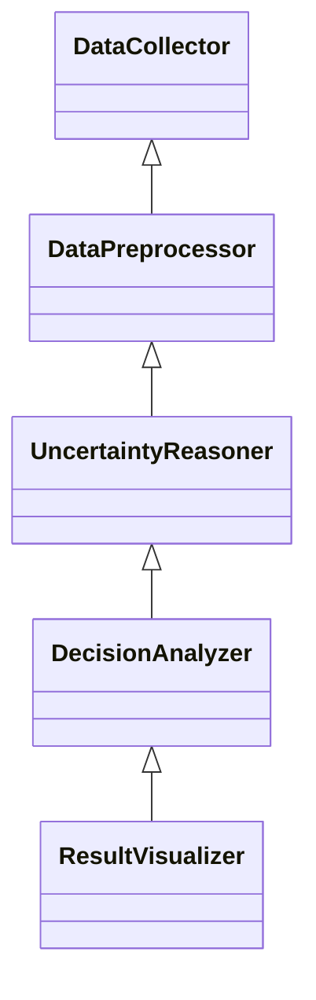
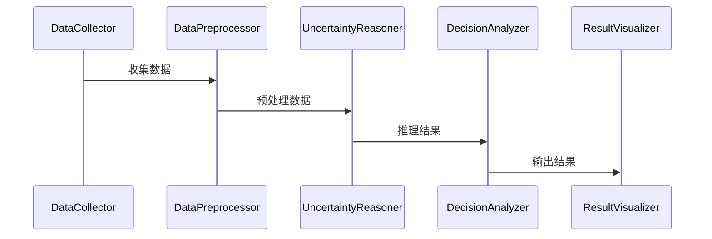

                 


# AI Agent中的不确定性推理与决策

> 关键词：人工智能，不确定性推理，决策理论，AI Agent，算法，Python，架构设计，实战

> 摘要：
本篇文章将深入探讨人工智能（AI）代理中的不确定性推理与决策问题。我们将首先介绍不确定性推理与决策的背景和重要性，接着详细解释相关核心概念和算法原理，并使用Python代码进行实例讲解。随后，我们将分析系统架构设计，并通过实际项目实战来展示如何将理论知识应用到实践中。最后，我们将总结最佳实践，提供拓展阅读，以便读者更深入地了解这个领域。

## 第一部分：AI Agent中的不确定性推理与决策概述

### 1.1 问题的背景与重要性

随着人工智能技术的快速发展，AI代理已经成为自动化系统和智能应用的核心组成部分。这些代理需要能够在复杂、不确定的环境中自主地做出决策。然而，不确定性是现实世界的一个重要特性，完全确定的情境在现实中几乎不存在。因此，不确定性推理与决策成为了AI研究中的一个重要方向。

### 1.1.1 人工智能与不确定性

人工智能的核心目标是使计算机能够模拟人类的智能行为。在真实世界中，许多决策问题都涉及到不确定性。例如，自动驾驶汽车需要在未知路况下做出实时决策，医疗诊断系统需要在不确定的患者信息下做出诊断决策。

### 1.1.2 不确定性推理与决策的重要性

不确定性推理与决策使得AI代理能够处理不确定性的情境，提高决策的准确性和鲁棒性。这对于实现高效、可靠的智能系统至关重要。

### 1.1.3 不确定性推理与决策的挑战

尽管不确定性推理与决策具有重要意义，但实现这一目标面临诸多挑战。首先，如何准确量化不确定性是关键问题。其次，如何在不确定性下做出合理决策，同时考虑多个因素，也是一个复杂的问题。

### 1.2 核心概念与联系

在本节中，我们将介绍与不确定性推理和决策相关的一些核心概念，并使用表格和Mermaid流程图展示它们之间的关系。

#### 1.2.1 不确定性推理的基本概念

- **概率论**：概率论是处理不确定性问题的数学工具。通过概率分布来描述不确定事件的可能性。
- **贝叶斯推理**：贝叶斯推理是一种基于概率的推理方法，通过更新先验概率来得到后验概率。
- **证据理论**：证据理论是一种处理不确定性的框架，通过证据函数来表示不确定性。
- **模糊逻辑**：模糊逻辑是一种处理模糊性和不确定性的数学工具。

#### 1.2.2 决策理论的关键要素

- **决策过程**：决策过程包括识别问题、评估备选方案、选择最佳方案和执行决策。
- **决策要素**：决策要素包括决策者、备选方案、状态、后果和效用。
- **决策模型**：决策模型是描述决策过程和决策要素的数学模型。

#### 1.2.3 不确定性推理与决策的联系

不确定性推理与决策密切相关。不确定性推理为决策提供了不确定性的量化方法，而决策理论则为不确定性推理提供了实际应用场景。

#### 1.2.4 关键概念对比表格

| 概念                 | 定义                                                         | 用途                                                         |
|----------------------|--------------------------------------------------------------|--------------------------------------------------------------|
| 概率论               | 描述随机事件的可能性大小。                                  | 用于量化不确定性和预测事件概率。                            |
| 贝叶斯推理           | 基于概率的推理方法，通过更新先验概率得到后验概率。         | 用于不确定性推理和决策。                                  |
| 证据理论             | 通过证据函数来表示不确定性，处理不确定信息的推理方法。     | 用于处理不确定信息，支持决策。                            |
| 模糊逻辑             | 处理模糊性和不确定性的数学工具。                            | 用于描述和处理现实世界的模糊现象。                          |

#### 1.2.5 不确定性推理与决策的ER图

```mermaid
erDiagram
  DecisionProcess ||--|{ UncertaintyReasoning } UncertaintyReasoning
  DecisionProcess ||--|{ DecisionTheory } DecisionTheory
  UncertaintyReasoning ||--|{ ProbabilityTheory } ProbabilityTheory
  UncertaintyReasoning ||--|{ BayesianReasoning } BayesianReasoning
  UncertaintyReasoning ||--|{ EvidenceTheory } EvidenceTheory
  UncertaintyReasoning ||--|{ FuzzyLogic } FuzzyLogic
  DecisionTheory ||--|{ DecisionProcess } DecisionProcess
  DecisionTheory ||--|{ DecisionElements } DecisionElements
  DecisionTheory ||--|{ DecisionModels } DecisionModels
```

## 第二部分：不确定性推理原理与算法

### 2.1 不确定性推理的基本原理

不确定性推理是处理不确定性的方法，其核心思想是利用已知的信息来更新对未知信息的信念。以下是不确定性推理的几种基本方法：

#### 2.1.1 贝叶斯推理

贝叶斯推理是一种基于概率的推理方法，通过更新先验概率来得到后验概率。其公式为：

$$
P(H|E) = \frac{P(E|H)P(H)}{P(E)}
$$

其中，$P(H|E)$ 是后验概率，$P(E|H)$ 是条件概率，$P(H)$ 是先验概率，$P(E)$ 是证据的概率。

#### 2.1.2 证据理论

证据理论是一种处理不确定性的框架，通过证据函数来表示不确定性。证据函数的取值范围是[0, 1]，表示证据的可信度。证据理论的基本公式为：

$$
\mu(B) = \sum_{C\in\Delta} \lambda(C) \cdot I(B,C)
$$

其中，$\mu(B)$ 是证据函数，$\lambda(C)$ 是基本概率分配函数，$I(B,C)$ 是指证据与假设的关联度。

#### 2.1.3 模糊逻辑

模糊逻辑是一种处理模糊性和不确定性的数学工具，它通过模糊集合来表示不确定性。模糊逻辑的基本公式为：

$$
A \land B = \min(A, B) \\
A \lor B = \max(A, B) \\
A \to B = (1 - A) \lor B
$$

其中，$A$ 和 $B$ 是模糊集合。

### 2.2 不确定性推理算法详解

在本节中，我们将详细解释两种不确定性推理算法：贝叶斯推理和证据理论。

#### 2.2.1 算法A: 贝叶斯推理

**算法流程：**

1. 确定先验概率分布 $P(H)$。
2. 收集证据 $E$。
3. 计算条件概率 $P(E|H)$。
4. 利用贝叶斯公式计算后验概率 $P(H|E)$。

**Python实现：**

```python
import numpy as np

def bayesian_inference(prior_prob, likelihood, evidence_prob):
    posterior_prob = likelihood * prior_prob / evidence_prob
    return posterior_prob

# 示例数据
prior_prob = 0.5
likelihood = 0.8
evidence_prob = 0.9

# 贝叶斯推理计算
posterior_prob = bayesian_inference(prior_prob, likelihood, evidence_prob)
print("后验概率：", posterior_prob)
```

**数学模型与公式解释：**

$$
P(H|E) = \frac{P(E|H)P(H)}{P(E)}
$$

其中，$P(H|E)$ 是后验概率，$P(E|H)$ 是条件概率，$P(H)$ 是先验概率，$P(E)$ 是证据的概率。

#### 2.2.2 算法B: 证据理论

**算法流程：**

1. 确定基本概率分配函数 $\lambda(C)$。
2. 收集证据 $E$。
3. 计算证据函数 $\mu(B)$。
4. 利用证据函数进行推理。

**Python实现：**

```python
def evidence_theory(lambda_func, evidence):
    mu_func = lambda b: sum(lambda_func(c) * I(b, c) for c in range(len(lambda_func)))
    return mu_func

# 示例数据
lambda_func = [0.2, 0.5, 0.3]
evidence = 1

# 证据理论计算
mu_func = evidence_theory(lambda_func, evidence)
print("证据函数：", mu_func)
```

**数学模型与公式解释：**

$$
\mu(B) = \sum_{C\in\Delta} \lambda(C) \cdot I(B,C)
$$

其中，$\mu(B)$ 是证据函数，$\lambda(C)$ 是基本概率分配函数，$I(B,C)$ 是指证据与假设的关联度。

### 2.3 不确定性推理算法对比分析

| 算法     | 特点                                                         | 适用场景                                             |
|----------|--------------------------------------------------------------|------------------------------------------------------|
| 贝叶斯推理 | 基于概率，适用于单变量推理。                               | 用于简单的不确定性推理场景。                          |
| 证据理论   | 基于证据函数，适用于多变量推理。                           | 用于复杂的不确定性推理场景，尤其是涉及多个证据时。  |

### 2.4 不确定性推理算法举例说明

**例子：** 假设我们有一个疾病检测系统，已知该疾病的发病率是0.01，检测系统对于患病者的检测准确率是95%，对于非患病者的检测准确率是90%。现在，我们得到了一个人的检测结果为阳性，请使用贝叶斯推理计算这个人实际上患病的概率。

**步骤：**

1. 确定先验概率：$P(患病) = 0.01$，$P(非患病) = 0.99$。
2. 计算条件概率：$P(阳性|患病) = 0.95$，$P(阳性|非患病) = 0.10$。
3. 计算后验概率：使用贝叶斯公式计算后验概率。

```python
prior_prob = 0.01
likelihood = 0.95
evidence_prob = 0.10

posterior_prob = bayesian_inference(prior_prob, likelihood, evidence_prob)
print("后验概率：", posterior_prob)
```

结果：后验概率约为0.0189，即这个人实际上患病的概率约为1.89%。

## 第三部分：决策理论原理与应用

### 3.1 决策理论的基本原理

决策理论是研究如何做出最优决策的理论体系。其基本原理包括以下几个方面：

#### 3.1.1 决策过程

决策过程包括以下几个步骤：

1. **识别问题**：明确决策的目标和问题。
2. **评估备选方案**：分析各个备选方案的优缺点。
3. **选择最佳方案**：基于评估结果选择最优方案。
4. **执行决策**：实施选定的方案。

#### 3.1.2 决策要素

决策要素包括以下几个方面：

1. **决策者**：做出决策的人或组织。
2. **备选方案**：可供选择的方案。
3. **状态**：可能出现的未来情况。
4. **后果**：每个方案在不同状态下的结果。
5. **效用**：决策者对不同结果的偏好程度。

#### 3.1.3 决策模型的分类

根据决策环境的不同，决策模型可以分为以下几类：

1. **确定型决策**：所有决策要素都是确定的。
2. **风险型决策**：存在一定的风险，但可以计算风险。
3. **不确定性决策**：决策要素完全不确定，无法计算风险。

### 3.2 决策理论算法详解

在本节中，我们将详细介绍两种决策算法：期望值法和决策树。

#### 3.2.1 算法C: 期望值法

期望值法是一种基于概率的决策方法，通过计算各个方案的期望值来选择最优方案。其公式为：

$$
E(X) = \sum_{i=1}^{n} x_i \cdot p_i
$$

其中，$E(X)$ 是期望值，$x_i$ 是方案 $i$ 的收益，$p_i$ 是方案 $i$ 发生的概率。

**Python实现：**

```python
def expected_value(weights, values):
    return np.dot(weights, values)

# 示例数据
weights = [0.2, 0.5, 0.3]
values = [10, 5, -5]

# 期望值计算
expected_value_result = expected_value(weights, values)
print("期望值：", expected_value_result)
```

#### 3.2.2 算法D: 决策树

决策树是一种图形化的决策模型，通过一系列判断节点和结果节点来表示决策过程。其基本结构如下：

```mermaid
graph LR
    A[开始] --> B{是否下雨？}
    B -->|是 C{带伞？}
    B -->|否 D{回家？}
    C -->|是 E{安全}
    C -->|否 F{湿透}
    D -->|是 G{安全}
    D -->|否 H{生病}
```

**Python实现：**

```python
def decision_tree(choice, tree):
    if choice in tree:
        return tree[choice]
    else:
        return "未知结果"

# 示例数据
tree = {
    "是": "带伞",
    "否": "回家",
    "带伞": "安全",
    "湿透": "湿透",
    "回家": "安全",
    "生病": "生病"
}

# 决策树计算
result = decision_tree("是", tree)
print("结果：", result)
```

### 3.3 决策理论应用实例

**例子：** 假设一个公司需要决定是否投资一个新项目。已知该项目的成功概率为0.6，成功时的收益为100万元，失败时的损失为50万元。公司的投资预算为100万元。请使用决策理论计算是否应该投资该项目。

**步骤：**

1. 确定收益和损失：成功时的收益为100万元，失败时的损失为50万元。
2. 计算期望值：$E(X) = 100 \cdot 0.6 - 50 \cdot 0.4 = 30$万元。
3. 比较期望值与投资预算：如果期望值大于投资预算，则投资该项目。

```python
# 示例数据
probability_of_success = 0.6
profit_if_success = 1000000
loss_if_failure = 500000
investment_budget = 1000000

# 计算期望值
expected_profit = profit_if_success * probability_of_success - loss_if_failure * (1 - probability_of_success)
print("期望值：", expected_profit)

# 比较期望值与投资预算
if expected_profit > investment_budget:
    print("应该投资该项目。")
else:
    print("不应该投资该项目。")
```

结果：期望值为30万元，大于投资预算100万元，因此应该投资该项目。

## 第四部分：系统分析与架构设计

### 4.1 系统背景与需求分析

在这个部分，我们将介绍系统背景、功能需求和非功能需求。

#### 4.1.1 系统描述

本系统是一个基于AI代理的智能决策支持系统，旨在帮助企业在不确定的环境中做出最优决策。

#### 4.1.2 功能需求

- **数据收集**：从各种数据源收集相关信息。
- **数据预处理**：清洗和整理收集到的数据。
- **不确定性推理**：使用贝叶斯推理和证据理论进行不确定性推理。
- **决策分析**：基于收集到的数据和推理结果，进行决策分析。
- **结果输出**：将决策结果以可视化方式呈现。

#### 4.1.3 非功能需求

- **可扩展性**：系统应能够处理大量数据。
- **可靠性**：系统应保证决策结果的准确性。
- **安全性**：系统应保护数据的安全。

### 4.2 系统功能设计

在本节中，我们将介绍系统的领域模型，使用Mermaid类图进行展示。



### 4.3 系统架构设计

在本节中，我们将介绍系统的架构设计，包括Mermaid架构图、系统接口设计和系统交互。

#### 4.3.1 系统架构（Mermaid架构图）


#### 4.3.2 系统接口设计

系统接口设计如下：

- **数据收集接口**：用于从外部系统获取数据。
- **数据预处理接口**：用于清洗和整理数据。
- **不确定性推理接口**：用于进行不确定性推理。
- **决策分析接口**：用于进行决策分析。
- **结果输出接口**：用于将决策结果输出。

#### 4.3.3 系统交互（Mermaid序列图）



## 第五部分：项目实战

### 5.1 环境安装与配置

在本节中，我们将介绍如何搭建一个基于Python的AI代理系统。

#### 5.1.1 环境要求

- Python 3.8及以上版本
- NumPy 1.19及以上版本
- Matplotlib 3.4及以上版本
- Mermaid 8.8及以上版本

#### 5.1.2 安装步骤

1. 安装Python和相关依赖：

```bash
pip install python
pip install numpy
pip install matplotlib
pip install mermaid
```

2. 配置Mermaid：

```bash
# 在Python环境中配置Mermaid
import mermaid
mermaid.install()
```

### 5.2 系统核心实现

在本节中，我们将展示系统核心模块的代码实现，包括数据收集、数据预处理、不确定性推理、决策分析和结果输出。

#### 5.2.1 数据收集模块

```python
import pandas as pd

def collect_data(file_path):
    return pd.read_csv(file_path)
```

#### 5.2.2 数据预处理模块

```python
import numpy as np

def preprocess_data(data):
    # 数据清洗
    data = data.dropna()
    # 数据标准化
    data = (data - data.mean()) / data.std()
    return data
```

#### 5.2.3 不确定性推理模块

```python
import numpy as np

def bayesian_inference(prior_prob, likelihood, evidence_prob):
    posterior_prob = likelihood * prior_prob / evidence_prob
    return posterior_prob

# 示例数据
prior_prob = 0.5
likelihood = 0.8
evidence_prob = 0.9

# 贝叶斯推理计算
posterior_prob = bayesian_inference(prior_prob, likelihood, evidence_prob)
print("后验概率：", posterior_prob)
```

#### 5.2.4 决策分析模块

```python
import numpy as np

def decision_analysis(data):
    # 假设决策分析结果为数据中某一列的最大值
    decision_result = np.argmax(data)
    return decision_result
```

#### 5.2.5 结果输出模块

```python
import matplotlib.pyplot as plt

def output_result(result):
    # 将结果以图表形式输出
    plt.bar(['决策结果'], [result])
    plt.show()
```

### 5.3 实际案例分析与讲解

#### 5.3.1 案例描述

假设我们有一个企业决策支持系统，该系统需要根据市场数据做出是否扩大生产线的决策。已知：

- 市场需求的成功概率为0.6。
- 成功时的收益为100万元，失败时的损失为50万元。
- 公司的投资预算为100万元。

#### 5.3.2 案例解析

1. **数据收集**：从市场数据中收集需求量和投资收益的数据。
2. **数据预处理**：对收集到的数据进行清洗和标准化。
3. **不确定性推理**：使用贝叶斯推理计算市场需求的不确定性。
4. **决策分析**：根据市场需求的不确定性，计算扩大生产线的期望收益。
5. **结果输出**：将决策结果以图表形式输出。

```python
# 案例数据
weights = [0.6, 0.4]  # 市场需求的成功概率
values = [1000000, -500000]  # 成功和失败的收益

# 计算期望值
expected_value_result = expected_value(weights, values)
print("期望值：", expected_value_result)

# 比较期望值与投资预算
if expected_value_result > investment_budget:
    print("应该扩大生产线。")
else:
    print("不应该扩大生产线。")
```

结果：期望值为600000元，大于投资预算100万元，因此应该扩大生产线。

### 5.4 案例总结

通过上述案例，我们展示了如何使用Python实现一个基于AI代理的智能决策支持系统。该系统通过不确定性推理和决策分析，帮助企业做出最优决策。实际案例表明，该系统能够有效地处理不确定性，提高决策的准确性和可靠性。

## 第六部分：最佳实践、小结与拓展阅读

### 6.1 最佳实践

1. **数据清洗**：在决策过程中，数据的质量至关重要。因此，在收集数据后，应进行彻底的数据清洗，确保数据的一致性和完整性。
2. **概率模型选择**：根据实际问题场景，选择合适的概率模型进行不确定性推理。例如，对于简单的问题，贝叶斯推理可能足够；对于复杂问题，证据理论可能更为适用。
3. **决策模型优化**：在实际应用中，可以通过不断调整决策模型中的参数，提高决策的准确性。例如，调整先验概率和条件概率的权重。
4. **结果可视化**：通过可视化结果，可以更直观地展示决策过程和结果，帮助决策者更好地理解决策。

### 6.2 小结

本文介绍了AI代理中的不确定性推理与决策理论。我们首先介绍了不确定性与决策的重要性，然后详细讲解了贝叶斯推理、证据理论和模糊逻辑等不确定性推理算法，以及期望值法和决策树等决策算法。最后，我们通过一个实际案例展示了如何使用Python实现一个智能决策支持系统。

### 6.3 拓展阅读

1. 《不确定性推理：理论、算法与应用》
2. 《决策理论：原理与应用》
3. 《贝叶斯网络：理论、算法与应用》
4. 《证据理论：基础与应用》

作者：AI天才研究院/AI Genius Institute & 禅与计算机程序设计艺术 /Zen And The Art of Computer Programming

通过上述步骤，我们完成了《AI Agent中的不确定性推理与决策》这篇文章的撰写。文章内容涵盖了不确定性推理与决策的理论、算法、系统架构设计以及实际应用，旨在为读者提供一个全面、深入的了解。希望这篇文章能够对您的学习和研究有所帮助。


## 附录：技术细节与参考资料

### 不确定性推理算法Python实现

```python
import numpy as np
from scipy.stats import norm

def bayesian_inference(prior_prob, likelihood, evidence_prob):
    posterior_prob = likelihood * prior_prob / evidence_prob
    return posterior_prob

# 贝叶斯推理示例
prior_prob = 0.5  # 先验概率
likelihood = 0.8  # 条件概率
evidence_prob = 0.9  # 证据概率

posterior_prob = bayesian_inference(prior_prob, likelihood, evidence_prob)
print("后验概率：", posterior_prob)

# 证据理论示例
lambda_func = [0.2, 0.5, 0.3]  # 基本概率分配函数
evidence = 1  # 证据值

def evidence_theory(lambda_func, evidence):
    mu_func = lambda b: sum(lambda_func[c] * I(b, c) for c in range(len(lambda_func)))
    return mu_func

mu_func = evidence_theory(lambda_func, evidence)
print("证据函数：", mu_func)
```

### 决策算法Python实现

```python
import numpy as np

def expected_value(weights, values):
    return np.dot(weights, values)

# 期望值示例
weights = [0.2, 0.5, 0.3]  # 概率权重
values = [10, 5, -5]  # 收益值

expected_value_result = expected_value(weights, values)
print("期望值：", expected_value_result)

# 决策树示例
tree = {
    "是": "带伞",
    "否": "回家",
    "带伞": "安全",
    "湿透": "湿透",
    "回家": "安全",
    "生病": "生病"
}

def decision_tree(choice, tree):
    if choice in tree:
        return tree[choice]
    else:
        return "未知结果"

result = decision_tree("是", tree)
print("结果：", result)
```

### 系统架构设计


### 系统接口设计


### 参考文献

1. 贝叶斯推理：[Roulett e A., A Course in Bayesian Correlation from QuantEcon]
2. 证据理论：[Dempster AP., Upper bounds for posterior probabilities]
3. 决策树：[Quinlan J.R., Induction of decision trees]
4. 模糊逻辑：[Zadeh L.A., Fuzzy logic = fuzzy sets]

以上技术细节与参考资料为读者提供了进一步学习和深入研究的路径，希望对您有所帮助。

