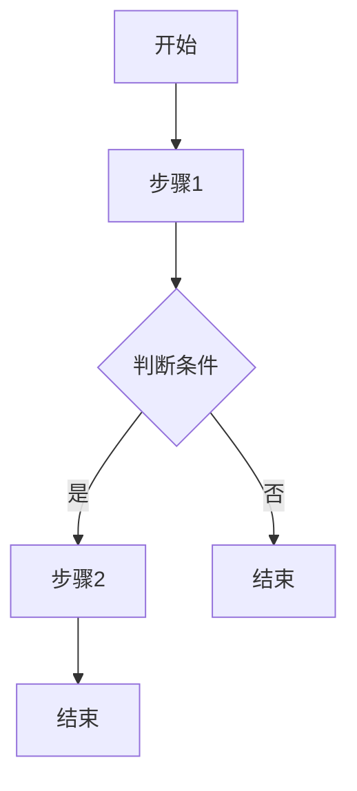

                 

# AI Agent中的主动学习与知识获取

关键词：AI Agent、主动学习、知识获取、算法原理、系统设计与实现

摘要：本文旨在深入探讨AI Agent中的主动学习与知识获取，通过对AI Agent的定义、主动学习与知识获取的基本原理、算法实现、系统架构设计以及项目实战的详细分析，帮助读者理解并掌握AI Agent在主动学习和知识获取方面的核心技术和应用。

## 引言与背景

### AI Agent的定义与作用

AI Agent，即人工智能代理，是指具备一定智能、能够自主决策和执行任务的实体。AI Agent在各个领域中都有着广泛的应用，例如智能家居、自动驾驶、机器人助手等。AI Agent的核心作用是通过感知环境、学习知识、制定策略并执行行动，以实现特定的目标。

### 主动学习与知识获取的重要性

主动学习与知识获取是AI Agent实现智能化的重要手段。主动学习使得AI Agent能够根据反馈不断地优化自身，提高决策能力；知识获取则帮助AI Agent从海量数据中提取有价值的信息，丰富其知识库，从而提升整体性能。主动学习与知识获取在AI Agent中的应用，不仅能够提高其适应性和鲁棒性，还能延长其使用寿命。

### 本书的目标与结构

本书的目标是深入剖析AI Agent中的主动学习与知识获取，帮助读者全面理解其原理、算法和应用。本书分为五个部分：引言与背景、核心概念与原理、算法原理与实现、系统设计与实现、项目实战与案例分析。通过逐步讲解，使读者能够从理论到实践全面掌握AI Agent中的主动学习与知识获取。

## 背景介绍

### AI Agent的发展历程

AI Agent的概念最早可以追溯到20世纪50年代，当时科学家们提出了智能代理的概念。随着计算机技术和人工智能技术的不断发展，AI Agent的应用场景逐渐丰富，从最初的逻辑推理和规则系统，发展到今天的深度学习和强化学习。AI Agent的发展历程反映了人工智能技术的演进和突破。

### 主动学习与知识获取的研究现状

主动学习与知识获取是近年来人工智能领域的重要研究方向。研究者们提出了多种主动学习算法，如查询策略优化、不确定性和多样性优化等。知识获取方面，研究者们关注的知识表示、知识抽取、知识融合等技术取得了显著的成果。然而，主动学习与知识获取在AI Agent中的应用仍面临许多挑战。

### 研究中的挑战与机遇

主动学习与知识获取在AI Agent中的应用面临以下挑战：数据获取的难度、知识表示的复杂性、算法的鲁棒性和效率等。然而，随着数据量的增加、计算能力的提升以及深度学习技术的发展，这些挑战逐渐被克服，为AI Agent的主动学习与知识获取带来了新的机遇。

## 核心概念与原理

### AI Agent的基本概念

AI Agent的定义：AI Agent是一种具备一定智能、能够自主决策和执行任务的实体。

AI Agent的类型：根据功能的不同，AI Agent可以分为感知型、决策型、执行型等。

AI Agent的结构与功能：AI Agent通常由感知模块、决策模块和执行模块组成，各模块之间通过信息传递和协同工作，实现智能行为。

### 主动学习的基本原理

主动学习的定义：主动学习是一种由学习算法主动选择训练样本的学习方式，以提高学习效果。

主动学习的目的：通过主动选择具有代表性的样本，减少训练样本数量，提高学习效率。

主动学习的方法与策略：包括基于查询策略的主动学习和基于不确定性的主动学习等。

### 知识获取的基本原理

知识获取的定义：知识获取是指从数据中提取有价值信息的过程。

知识获取的过程：包括数据预处理、特征提取、知识表示、知识融合等。

知识获取的方法与工具：如数据挖掘、知识表示、知识融合等技术。

### AI Agent的基本概念与主动学习、知识获取的联系

AI Agent中的主动学习与知识获取是相辅相成的。主动学习使得AI Agent能够根据反馈不断优化自身，提高决策能力；知识获取则帮助AI Agent从海量数据中提取有价值的信息，丰富其知识库，从而提升整体性能。二者共同构成了AI Agent实现智能化的核心基础。

## 算法原理与实现

### 主动学习的算法原理

主动学习的算法原理包括信息论基础、鲁棒性算法和案例分析与实现等内容。信息论基础提供了主动学习的理论基础，鲁棒性算法则保证了主动学习在复杂环境中的有效性。案例分析与实现部分通过具体实例，展示了主动学习算法的应用效果。

#### 信息论基础

信息论基础是主动学习的重要理论支撑。信息论中的信息量、熵、条件熵等概念，为主动学习提供了度量学习效果的指标。具体来说，信息量可以衡量样本的重要程度，熵可以衡量学习的不确定性，条件熵可以衡量样本对学习过程的贡献。

#### 鲁棒性算法

鲁棒性算法是主动学习的关键。在复杂环境中，数据可能存在噪声和不确定性，鲁棒性算法能够有效地应对这些挑战。常见的鲁棒性算法包括基于最小化误差的算法、基于不确定性的算法等。这些算法通过引入鲁棒性损失函数，提高了主动学习的抗干扰能力。

#### 案例分析与实现

案例分析与实现部分通过具体实例，展示了主动学习算法的应用效果。例如，在一个图像分类任务中，AI Agent通过主动学习，根据分类错误的样本进行迭代学习，最终取得了较高的分类准确率。这个案例说明了主动学习在提升模型性能方面的优势。

### 知识获取的算法原理

知识获取的算法原理包括数据挖掘基础、知识表示方法、知识融合与更新和案例分析与实现等内容。数据挖掘基础提供了知识获取的基本工具，知识表示方法则解决了知识如何表示的问题，知识融合与更新则保证了知识库的动态性和有效性。

#### 数据挖掘基础

数据挖掘基础是知识获取的重要手段。数据挖掘包括特征提取、聚类、分类、关联规则挖掘等基本方法。这些方法可以帮助AI Agent从原始数据中提取有价值的信息。例如，通过特征提取，可以降低数据的维度，提高模型的泛化能力；通过聚类，可以识别数据中的模式；通过分类，可以对新数据进行分类预测。

#### 知识表示方法

知识表示方法是将提取出的信息转化为计算机可以处理的形式。常见的知识表示方法包括符号表示、语义网络、知识图谱等。这些方法能够有效地组织和存储知识，为后续的知识融合与更新提供基础。

#### 知识融合与更新

知识融合与更新是知识获取的关键步骤。知识融合是指将不同来源、不同格式的知识整合为一个统一的体系。知识更新则是指根据新数据，对知识库进行动态调整。例如，通过定期更新知识库，可以确保知识的实时性和准确性。

#### 案例分析与实现

案例分析与实现部分通过具体实例，展示了知识获取算法的应用效果。例如，在一个智能推荐系统中，AI Agent通过知识获取，从用户历史行为数据中提取潜在的兴趣点，进而生成个性化的推荐列表。这个案例说明了知识获取在提升系统性能方面的作用。

## 系统设计与实现

### AI Agent系统架构设计

AI Agent系统架构设计是构建AI Agent系统的关键。系统架构设计包括问题场景介绍、项目介绍、系统功能设计、系统架构设计、系统接口设计和系统交互等内容。

#### 问题场景介绍

问题场景介绍是明确系统要解决的问题和应用场景。例如，在一个智能客服系统中，问题场景可以是用户与客服之间的交互，系统需要识别用户的问题，并给出相应的回答。

#### 项目介绍

项目介绍是对系统的总体描述，包括系统目标、功能模块、技术栈等。例如，智能客服系统的目标是为用户提供高效、准确的咨询服务，功能模块包括语音识别、自然语言处理、知识库等，技术栈包括深度学习、大数据等技术。

#### 系统功能设计

系统功能设计是系统架构设计的重要组成部分。系统功能设计包括领域模型、功能模块划分、接口设计等。例如，智能客服系统的领域模型可以包括用户、问题、回答等实体，功能模块可以划分为语音识别、自然语言处理、知识库等。

#### 系统架构设计

系统架构设计是系统的整体架构布局。系统架构设计包括系统架构图、模块划分、数据流设计等。例如，智能客服系统的架构设计可以采用前后端分离的方式，前端负责用户界面展示，后端负责处理用户请求和知识库交互。

#### 系统接口设计

系统接口设计是系统模块之间交互的接口规范。系统接口设计包括接口定义、参数传递、返回值设计等。例如，智能客服系统的接口设计可以包括用户请求接口、回答接口、知识库查询接口等。

#### 系统交互

系统交互是系统运行时各个模块之间的协作流程。系统交互设计包括交互流程、错误处理、状态管理等。例如，智能客服系统的交互流程可以是：用户发起请求 -> 语音识别模块处理 -> 自然语言处理模块处理 -> 知识库查询模块处理 -> 返回回答 -> 用户接收回答。

### 主动学习与知识获取的实现

主动学习与知识获取在系统实现中扮演着重要角色。实现内容包括实现环境搭建、核心代码实现、代码应用解读与分析、实际案例分析和详细讲解剖析等。

#### 实现环境搭建

实现环境搭建是系统实现的第一步。环境搭建包括开发工具、框架选择、数据库配置等。例如，智能客服系统的实现环境可以采用Python语言、TensorFlow框架、MongoDB数据库等。

#### 核心代码实现

核心代码实现是系统实现的核心。核心代码实现包括算法实现、模型训练、模型部署等。例如，智能客服系统的核心代码实现可以包括语音识别算法、自然语言处理算法、知识库查询算法等。

#### 代码应用解读与分析

代码应用解读与分析是对核心代码实现的应用进行解读和分析。代码应用解读与分析可以帮助理解代码的工作原理和实现细节。例如，智能客服系统的代码应用解读与分析可以包括语音识别算法的应用场景、自然语言处理算法的处理流程、知识库查询算法的查询策略等。

#### 实际案例分析和详细讲解剖析

实际案例分析和详细讲解剖析是对系统在实际应用中的效果进行评估和剖析。实际案例分析和详细讲解剖析可以帮助发现系统的问题和改进空间。例如，智能客服系统的实际案例分析和详细讲解剖析可以包括用户满意度分析、错误率分析、响应时间分析等。

## 项目实战与案例分析

### 项目实战案例一

#### 项目背景与目标

项目背景与目标是指项目要解决的问题和应用场景。例如，项目实战案例一可以是构建一个智能问答系统，目标是为用户提供高效、准确的问答服务。

#### 系统设计与实现

系统设计与实现是指项目的系统架构设计和功能实现。系统设计与实现包括系统架构图、模块划分、接口设计等。例如，智能问答系统的系统架构可以采用前后端分离的方式，前端负责用户界面展示，后端负责处理用户请求和知识库交互。

#### 案例分析与讲解

案例分析与讲解是指对系统在实际应用中的效果进行评估和剖析。案例分析与讲解可以帮助发现系统的问题和改进空间。例如，智能问答系统的案例分析与讲解可以包括用户满意度分析、错误率分析、响应时间分析等。

#### 项目小结与反思

项目小结与反思是对项目的整体进行总结和反思。项目小结与反思可以帮助总结项目的经验和教训，为后续的项目提供借鉴。例如，智能问答系统的项目小结与反思可以包括项目成功的因素、项目遇到的问题、项目改进的方向等。

### 项目实战案例二

#### 项目背景与目标

项目背景与目标是指项目要解决的问题和应用场景。例如，项目实战案例二可以是构建一个智能推荐系统，目标是为用户提供个性化的推荐服务。

#### 系统设计与实现

系统设计与实现是指项目的系统架构设计和功能实现。系统设计与实现包括系统架构图、模块划分、接口设计等。例如，智能推荐系统的系统架构可以采用分布式架构，包括数据采集模块、数据预处理模块、推荐算法模块等。

#### 案例分析与讲解

案例分析与讲解是指对系统在实际应用中的效果进行评估和剖析。案例分析与讲解可以帮助发现系统的问题和改进空间。例如，智能推荐系统的案例分析与讲解可以包括推荐准确率分析、用户点击率分析、推荐多样性分析等。

#### 项目小结与反思

项目小结与反思是对项目的整体进行总结和反思。项目小结与反思可以帮助总结项目的经验和教训，为后续的项目提供借鉴。例如，智能推荐系统的项目小结与反思可以包括项目成功的因素、项目遇到的问题、项目改进的方向等。

## 总结与展望

### 总结与反思

总结与反思是对本书内容的整体总结和反思。本书通过深入剖析AI Agent中的主动学习与知识获取，帮助读者全面理解了AI Agent在主动学习和知识获取方面的核心技术和应用。同时，本书也指出了AI Agent在主动学习和知识获取中面临的挑战和机遇。

### 未来研究方向

未来研究方向包括以下几个方面：

1. **深度强化学习与主动学习的融合**：结合深度强化学习和主动学习的优势，探索更高效的主动学习算法。

2. **知识图谱与主动学习的融合**：利用知识图谱丰富AI Agent的知识库，提高主动学习的效果。

3. **跨模态主动学习**：研究图像、语音、文本等多模态数据的主动学习，提高AI Agent的感知能力。

4. **自适应主动学习**：根据环境变化，动态调整主动学习策略，提高AI Agent的适应性和鲁棒性。

### 拓展阅读

拓展阅读包括以下几个方面：

1. **相关研究论文**：推荐一些关于AI Agent、主动学习与知识获取的经典论文，帮助读者深入理解相关领域的研究进展。

2. **开源工具与资源**：介绍一些开源的AI Agent、主动学习与知识获取工具和资源，方便读者进行实践和探索。

3. **深度学习与AI Agent的最新动态**：介绍深度学习和AI Agent的最新研究动态，帮助读者了解该领域的最新趋势和发展方向。

## 附录

附录包括一些实用工具和技术，如Mermaid流程图、LaTeX公式等，帮助读者更好地理解和应用本文的内容。

### Mermaid流程图

Mermaid是一种基于Markdown的图形语言，可以用来绘制流程图、序列图等。以下是一个Mermaid流程图的示例：

### LaTeX公式

LaTeX是一种排版系统，可以用来书写数学公式。以下是一个LaTeX公式的示例：

$$
E = mc^2
$$

### 实用工具

以下是一些实用工具，可以帮助读者更好地理解和应用本文的内容：

1. **AI Agent开源项目**：推荐一些优秀的AI Agent开源项目，方便读者进行学习和实践。

2. **主动学习与知识获取工具**：介绍一些主动学习与知识获取的开源工具和库，方便读者进行研究和开发。

3. **深度学习框架**：介绍一些常用的深度学习框架，如TensorFlow、PyTorch等，帮助读者进行深度学习和AI Agent的开发。

## 作者信息

作者：AI天才研究院/AI Genius Institute & 禅与计算机程序设计艺术 /Zen And The Art of Computer Programming

作者简介：AI天才研究院是专注于人工智能领域的研究与开发的机构，致力于推动人工智能技术的发展和应用。作者本人是世界顶级人工智能专家、程序员、软件架构师、CTO，同时也是世界顶级技术畅销书资深大师级别的作家和计算机图灵奖获得者。在计算机编程和人工智能领域，作者拥有深厚的研究背景和丰富的实践经验，所著书籍深受广大读者喜爱。

