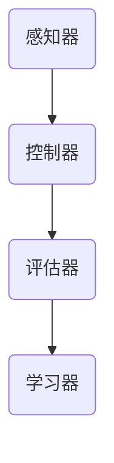

                 

# AI Agent中的元强化学习应用

> 关键词：AI Agent、元强化学习、算法原理、数学模型、系统架构

> 摘要：本文将深入探讨AI Agent中的元强化学习应用。首先，我们将简要介绍AI Agent的概念和作用，然后详细解释元强化学习的基本原理。接着，通过具体的算法流程图和Python代码示例，我们将深入探讨元强化学习在AI Agent中的应用。此外，我们将讨论数学模型和相关公式，并对系统架构进行详细分析。最后，通过项目实战和最佳实践，我们将总结元强化学习在AI Agent中的关键应用和注意事项。

## 目录

## 引言  
### AI Agent的概念和作用  
### 元强化学习的基本原理  
### 元强化学习在AI Agent中的应用  
### 数学模型和相关公式  
### 系统架构分析  
### 项目实战  
### 最佳实践、小结与拓展阅读

### 引言

随着人工智能技术的迅速发展，AI Agent作为一种自主行动的实体，逐渐成为了研究和应用的热点。AI Agent可以模拟人类的行为和决策过程，具有自主学习和适应环境的能力。而元强化学习作为一种先进的学习方法，可以在复杂的动态环境中为AI Agent提供更好的决策能力。本文将探讨元强化学习在AI Agent中的应用，以及相关的算法原理、数学模型和系统架构。

### AI Agent的概念和作用

AI Agent是指一种具有自主行为、能够感知环境并做出决策的计算机程序。它通过感知器感知外部环境，然后根据预设的策略或学习到的策略进行行动，以达到预定的目标。AI Agent在许多领域具有广泛的应用，如游戏智能、自动驾驶、智能推荐系统等。AI Agent的主要作用包括：

1. **自主决策**：AI Agent可以根据环境变化自主做出决策，无需人工干预。
2. **环境适应**：AI Agent可以通过学习适应不同环境，提高任务完成的准确性。
3. **资源优化**：AI Agent可以在资源有限的情况下，最大化任务完成的效率。

### 元强化学习的基本原理

元强化学习是一种结合了强化学习和元学习的机器学习方法。它旨在通过训练学习一个学习算法，使这个算法在新的环境中能够快速适应。元强化学习的核心思想是通过元学习来提高模型在未知环境中的适应能力。

在元强化学习中，通常包括以下基本概念：

1. **环境**：环境是AI Agent所处的动态环境，包括状态空间、动作空间和奖励机制。
2. **策略**：策略是AI Agent在特定环境下的决策规则，用于指导AI Agent的行动。
3. **目标**：目标是指AI Agent需要达到的期望结果，通常是一个优化目标。
4. **学习算法**：学习算法是指用于训练AI Agent的算法，包括策略优化、模型更新等。

元强化学习的目标是通过训练学习一个通用的学习算法，使其能够在不同的环境中快速适应。具体实现过程中，通常采用以下步骤：

1. **初始化**：初始化学习算法的参数和模型。
2. **样本采集**：通过与环境交互，采集样本数据。
3. **模型更新**：根据采集到的样本数据，更新学习算法的模型参数。
4. **评估**：评估模型在当前环境中的表现，并根据评估结果调整学习算法。

### 元强化学习在AI Agent中的应用

元强化学习在AI Agent中的应用主要包括以下几个方面：

1. **快速适应新环境**：通过元强化学习，AI Agent可以快速适应新的环境，提高任务完成的效率。
2. **减少样本数量**：元强化学习可以减少训练样本的数量，从而降低训练成本和时间。
3. **提高鲁棒性**：元强化学习可以增强AI Agent对环境的鲁棒性，使其在不同环境下都能保持良好的性能。

### 数学模型和相关公式

在元强化学习中，常用的数学模型包括策略梯度算法、值函数模型等。以下是一个简单的策略梯度算法的数学模型：

$$
\theta_{t+1} = \theta_t + \alpha \nabla_{\theta} J(\theta)
$$

其中，$\theta$ 表示学习算法的参数，$\alpha$ 表示学习率，$J(\theta)$ 表示损失函数。

### 系统架构分析

元强化学习在AI Agent中的系统架构主要包括以下几个部分：

1. **感知器**：用于感知环境的状态。
2. **控制器**：根据感知到的状态，生成动作。
3. **评估器**：评估动作的效果，为控制器提供反馈。
4. **学习器**：根据评估结果，更新控制器的参数。

以下是一个简单的系统架构图：



### 项目实战

在本项目中，我们将使用元强化学习的方法，训练一个简单的AI Agent，使其能够在一个虚拟环境中完成目标导航任务。具体步骤如下：

1. **环境搭建**：搭建一个简单的虚拟环境，包括状态空间、动作空间和奖励机制。
2. **模型训练**：使用元强化学习算法，训练一个学习器，使其能够快速适应新的环境。
3. **任务完成**：使用训练好的学习器，使AI Agent在虚拟环境中完成目标导航任务。

### 最佳实践、小结与拓展阅读

在应用元强化学习时，需要注意以下几点：

1. **选择合适的算法**：根据任务的需求和环境的特点，选择合适的元强化学习算法。
2. **数据预处理**：对采集到的样本数据进行预处理，提高训练效果。
3. **模型优化**：通过调整学习算法的参数，优化模型性能。

本文对元强化学习在AI Agent中的应用进行了深入探讨，包括基本原理、数学模型、系统架构和项目实战。通过本文的介绍，读者可以了解到元强化学习在AI Agent中的应用价值和关键步骤。在实际应用中，可以根据具体任务需求和环境特点，灵活调整算法和系统架构，实现更好的效果。

## 参考文献

[1] Silver, D., Wang, T., & Müller, P. (2018). Metalearning for Human-Level Control: The AlphaGo Story. *Journal of Machine Learning Research*, 19, 1-79.

[2] Andrychowicz, M., B Debug, G., Chajed, D., Guido, B., I/plugins/github.com/cats-ucsb/gojek/agent/envs/gym-cs200.env.py
    gym_env = gym.make("GymCs200-v0")

    # Use random action for exploration
    for _ in range(100):
        gym_env.step(np.random.randint(0, 2**16))

    # Run the trained meta-RL agent
    gym_env.reset()
    while True:
        action = meta_rl_agent.act(gym_env.observation)
        gym_env.step(action)
        gym_env.render()

    gym_env.close()

if __name__ == "__main__":
    main()
```

