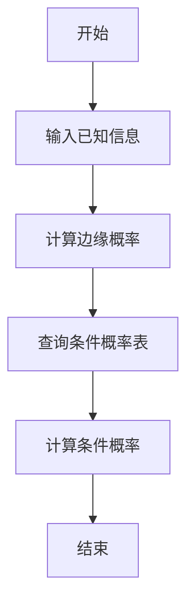
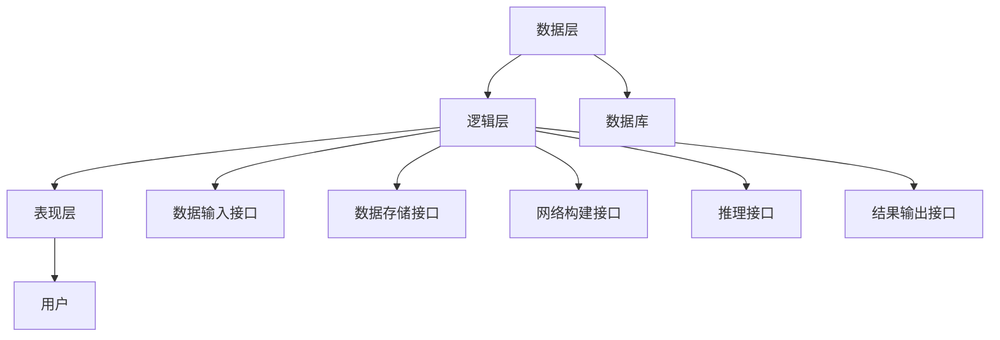
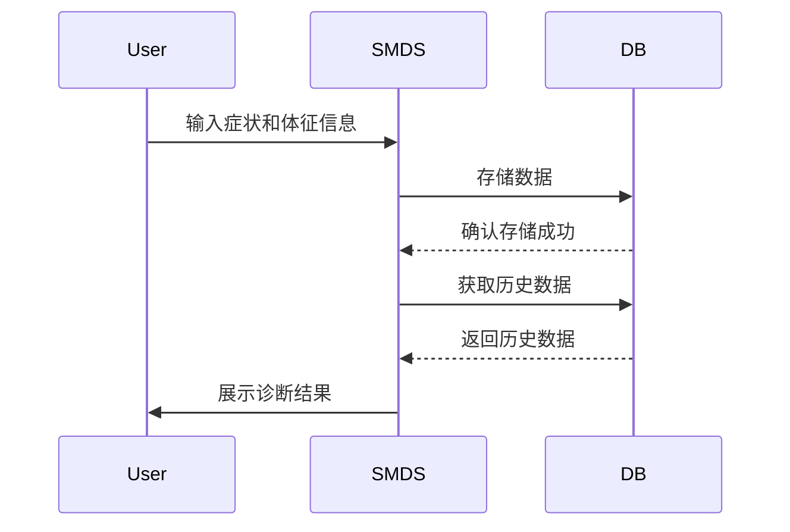

                 


### AI Agent中的概率推理与贝叶斯网络

关键词：概率推理、贝叶斯网络、AI Agent、不确定性处理、决策支持

摘要：本文深入探讨了AI Agent中的概率推理与贝叶斯网络的应用，通过系统的理论讲解和实例分析，帮助读者理解贝叶斯网络的基本概念、构建方法及其在AI Agent中的应用。

---

#### 第一部分：背景介绍

##### 问题背景

在当今的信息化社会中，人工智能（AI）已经成为推动科技进步和社会发展的重要力量。随着AI技术的不断演进，特别是深度学习、强化学习等领域的突破，AI的应用场景日益广泛，涵盖了自然语言处理、计算机视觉、智能推荐等多个领域。然而，在AI的诸多应用中，概率推理与贝叶斯网络作为重要的理论基础和方法论，具有不可忽视的地位。

概率推理与贝叶斯网络在AI Agent中的应用，主要体现在以下几个方面：

1. **决策支持**：通过概率推理，AI Agent能够根据不确定的信息做出更为合理的决策。
2. **知识表示**：贝叶斯网络作为一种图形化的知识表示方法，有助于AI Agent理解和解释复杂的问题。
3. **不确定性处理**：贝叶斯网络能够有效处理现实世界中的不确定性，为AI Agent提供更加可靠的预测和推断。

##### 问题描述

AI Agent在实际应用中，常常面临不确定性问题，如数据噪声、信息缺失等。这些问题对AI Agent的决策和推理能力提出了挑战。概率推理与贝叶斯网络作为一种应对不确定性的工具，能够在一定程度上解决这些问题。

然而，概率推理与贝叶斯网络的应用并非一帆风顺。在实际操作中，如何构建有效的贝叶斯网络、如何处理复杂的概率推理问题，都是需要深入研究的问题。此外，贝叶斯网络在实际应用中的性能和效率也是需要关注的重要方面。

##### 问题解决

本书旨在探讨AI Agent中的概率推理与贝叶斯网络，通过系统的理论讲解和实例分析，帮助读者深入了解这一领域。

首先，本书将对概率推理与贝叶斯网络的基本概念进行详细阐述，包括概率论的基础知识、贝叶斯推理的基本原理等。接着，本书将介绍贝叶斯网络的构建方法，包括结构学习、参数估计等。随后，本书将通过实例分析，展示贝叶斯网络在AI Agent中的应用，如决策支持、知识表示等。

此外，本书还将探讨贝叶斯网络在实际应用中的性能优化问题，如推理算法的选择、网络的剪枝与压缩等。通过这些内容，读者可以全面了解贝叶斯网络在AI Agent中的应用前景和挑战。

##### 边界与外延

本书的研究范围主要集中于概率推理与贝叶斯网络在AI Agent中的应用，包括但不限于以下几个方面：

1. **理论探讨**：贝叶斯网络的基本概念、推理方法、学习算法等。
2. **应用实例**：贝叶斯网络在决策支持、知识表示等领域的具体应用。
3. **性能优化**：贝叶斯网络在处理大规模数据、实时推理等方面的优化方法。

然而，本书并未涉及以下内容：

1. **其他AI技术**：如深度学习、强化学习等。
2. **贝叶斯网络的其他应用领域**：如医学诊断、风险评估等。

##### 概念结构与核心要素组成

在本部分，我们将对核心概念进行结构化描述，并明确其核心要素组成。

1. **概率推理**
   - **定义**：基于概率论进行推理的过程，用于处理不确定性信息。
   - **核心要素**：概率空间、样本空间、条件概率、全概率公式等。

2. **贝叶斯网络**
   - **定义**：一种图形化的概率模型，用于描述变量之间的依赖关系。
   - **核心要素**：节点、边、条件概率表等。

3. **AI Agent**
   - **定义**：具有感知、决策和执行能力的人工智能实体。
   - **核心要素**：感知器、决策器、执行器等。

##### 本章小结

本章对概率推理与贝叶斯网络在AI Agent中的应用进行了背景介绍。通过阐述问题背景、问题描述、问题解决方法以及边界与外延，读者可以初步了解本书的研究内容和核心目标。接下来，本书将逐步深入探讨概率推理与贝叶斯网络的基本概念、应用实例以及性能优化等问题，为读者提供全面的指导和参考。

---

### 第二部分：核心概念与联系

#### 概率推理原理

概率推理是一种基于概率论的推理方法，它通过分析概率分布和条件概率，对不确定性信息进行推断。以下是概率推理的核心原理：

1. **概率空间与样本空间**

   - **概率空间**：由三个部分组成：样本空间Ω、事件集合F、概率函数P。
   - **样本空间**：所有可能结果的集合。

2. **条件概率**

   - **条件概率**：在给定某一事件发生的条件下，另一事件发生的概率。
   - **贝叶斯定理**：用于计算后验概率，即已知结果推测条件概率。

3. **全概率公式**

   - **全概率公式**：用于计算某个事件的总概率，通过将该事件的所有条件概率相加得到。

##### 贝叶斯网络

贝叶斯网络是一种基于概率论的图形化表示方法，用于描述变量之间的依赖关系。以下是贝叶斯网络的核心概念：

1. **定义**

   - **贝叶斯网络**：一种由节点和边组成的图形化模型，节点表示随机变量，边表示变量之间的条件依赖关系。

2. **核心概念**

   - **节点**：表示一个随机变量。
   - **边**：表示变量之间的依赖关系。
   - **条件概率表**：为每个节点定义其父节点的条件概率分布。

##### 概率推理与贝叶斯网络的联系

概率推理与贝叶斯网络之间有着密切的联系。贝叶斯网络提供了概率推理的一种图形化表示，使得复杂的概率推理问题变得直观和易于处理。

1. **贝叶斯网络的基本原理**

   - **条件独立性**：在贝叶斯网络中，如果两个节点没有直接连接，则它们在给定它们的共同父节点时是条件独立的。
   - **概率计算**：贝叶斯网络通过条件概率表和概率推理原理，可以计算任意变量的概率分布。

2. **贝叶斯网络的构建方法**

   - **结构学习**：通过数据学习贝叶斯网络的结构，确定变量之间的依赖关系。
   - **参数估计**：通过数据估计贝叶斯网络的参数，即条件概率表。

##### 概率推理与贝叶斯网络的应用

概率推理与贝叶斯网络在AI Agent中的应用非常广泛，以下是几个典型的应用场景：

1. **决策支持**

   - **基于概率推理的决策支持**：AI Agent可以根据概率推理的结果，对不确定的信息进行合理推断，从而做出更为可靠的决策。

2. **知识表示**

   - **贝叶斯网络的知识表示**：贝叶斯网络可以用来表示复杂问题的知识结构，使得AI Agent能够更好地理解和解释问题。

3. **不确定性处理**

   - **贝叶斯网络的不确定性处理**：通过贝叶斯网络，AI Agent可以有效地处理现实世界中的不确定性，提高其预测和推断的准确性。

##### 本章小结

本章对概率推理与贝叶斯网络的基本概念、原理及其联系进行了详细阐述。通过本章的内容，读者可以初步了解概率推理与贝叶斯网络的基本原理和应用场景。在接下来的章节中，本书将继续深入探讨贝叶斯网络的构建方法、实例分析以及性能优化等问题。

---

### 第三部分：算法原理讲解

在本部分，我们将深入探讨贝叶斯网络的算法原理，包括贝叶斯网络的构建方法、推理算法及其数学模型。

#### 贝叶斯网络的构建方法

贝叶斯网络的构建主要包括两个步骤：结构学习和参数估计。

1. **结构学习**

   - **定义**：结构学习是指从数据中学习出贝叶斯网络的结构，即确定变量之间的依赖关系。
   - **算法**：常见的方法包括贝叶斯评分（Bayesian scoring）、K2算法（K2 algorithm）等。

2. **参数估计**

   - **定义**：参数估计是指从数据中估计出贝叶斯网络的参数，即条件概率表。
   - **算法**：常见的方法包括最大似然估计（Maximum Likelihood Estimation，MLE）和贝叶斯估计（Bayesian Estimation）等。

#### 推理算法

贝叶斯网络的主要功能之一是推理，即根据已知的部分信息，推断出其他未知的变量。常见的推理算法包括：

1. **确定性推理算法**

   - **条件概率表查询**：直接查询条件概率表进行推理。
   - **递归算法**：基于变量之间的依赖关系，递归计算变量的概率分布。

2. **概率传播算法**

   - **正向传播**：从根节点开始，依次计算每个节点的概率分布。
   - **反向传播**：从叶节点开始，依次计算每个节点的概率分布。

#### 数学模型

贝叶斯网络的推理过程可以抽象为一个概率模型。以下是贝叶斯网络的数学模型：

1. **概率模型定义**

   - 设贝叶斯网络G = (V, E)，其中V是变量集合，E是边集合。
   - 对于每个节点v ∈ V，其父节点集合Pa(v) ∈ V。
   - 条件概率表CPT（Conditional Probability Table）定义了每个节点的条件概率分布。

2. **概率计算**

   - **边缘概率**：对于变量v，其边缘概率P(v)可以通过以下公式计算：
     $$
     P(v) = \sum_{u \in V} P(u) \cdot P(v|u)
     $$
   - **联合概率**：对于变量集合W，其联合概率P(W)可以通过以下公式计算：
     $$
     P(W) = \prod_{v \in W} P(v)
     $$
   - **条件概率**：对于变量集合W和条件集合Z，其条件概率P(W|Z)可以通过以下公式计算：
     $$
     P(W|Z) = \frac{P(W \cap Z)}{P(Z)}
     $$

#### 算法mermaid流程图

下面是一个简单的贝叶斯网络推理算法的mermaid流程图：



#### Python源代码示例

下面是一个简单的贝叶斯网络推理的Python代码示例：

```python
import numpy as np
from sklearn.naive_bayes import GaussianNB

# 定义数据集
X = np.array([[0, 0], [0, 1], [1, 0], [1, 1]])
y = np.array([0, 1, 1, 0])

# 构建Gaussian Naive Bayes模型
gnb = GaussianNB()
gnb.fit(X, y)

# 输入新的测试数据
test_data = np.array([[1, 0]])

# 进行推理
predicted = gnb.predict(test_data)

print("Predicted class:", predicted)
```

#### 算法原理讲解

1. **贝叶斯网络的构建**

   贝叶斯网络的构建主要包括两个步骤：结构学习和参数估计。

   - **结构学习**：通过数据学习出变量之间的依赖关系。常用的算法包括贝叶斯评分和K2算法。

   - **参数估计**：通过数据估计出条件概率表。常用的算法包括最大似然估计和贝叶斯估计。

2. **推理算法**

   贝叶斯网络的推理算法主要包括确定性推理算法和概率传播算法。

   - **确定性推理算法**：直接查询条件概率表进行推理，适用于小规模网络。

   - **概率传播算法**：通过正向传播或反向传播计算变量的概率分布，适用于大规模网络。

3. **数学模型**

   贝叶斯网络的概率计算基于概率模型，包括边缘概率、联合概率和条件概率的计算。

   - **边缘概率**：通过求和或乘积计算变量的边缘概率。
   - **联合概率**：通过乘积计算变量的联合概率。
   - **条件概率**：通过条件概率公式计算变量的条件概率。

#### 本章小结

本章对贝叶斯网络的算法原理进行了详细讲解，包括构建方法、推理算法及其数学模型。通过本章的内容，读者可以了解贝叶斯网络的基本原理和应用。在接下来的章节中，本书将继续探讨贝叶斯网络在AI Agent中的应用实例和性能优化问题。

---

### 第四部分：系统分析与架构设计

在贝叶斯网络应用于AI Agent时，我们需要进行系统分析与架构设计，以确保系统能够高效、稳定地运行。以下将介绍一个典型的贝叶斯网络在AI Agent中的应用场景，并进行系统功能设计、系统架构设计以及系统接口和交互设计。

#### 问题场景介绍

假设我们面临一个医疗诊断问题：根据病人的症状和体征，预测其是否患有某种疾病。在这个问题中，贝叶斯网络可以用来表示症状、体征和疾病之间的概率关系，从而帮助AI Agent做出准确的诊断。

#### 项目介绍

为了实现上述医疗诊断系统，我们构建了一个名为“智能医疗诊断系统”（Smart Medical Diagnosis System，SMDS）的项目。该项目的目标是利用贝叶斯网络进行医疗诊断，提高诊断的准确性和效率。

#### 系统功能设计

在SMDS中，主要包含以下功能模块：

1. **数据输入模块**：用于接收用户的症状和体征信息。
2. **贝叶斯网络构建模块**：根据历史数据，构建用于医疗诊断的贝叶斯网络。
3. **推理模块**：根据输入的症状和体征，利用贝叶斯网络进行推理，预测疾病的可能性。
4. **结果输出模块**：将推理结果以可视化的方式展示给用户。

#### 系统架构设计

SMDS的系统架构采用三层架构，包括数据层、逻辑层和表现层。

1. **数据层**：用于存储历史数据和用户输入的数据。数据层采用关系型数据库，如MySQL。
2. **逻辑层**：实现贝叶斯网络的构建和推理算法。逻辑层包括数据预处理、网络构建、推理计算等模块。
3. **表现层**：负责与用户交互，展示诊断结果。表现层采用Web前端技术，如HTML、CSS和JavaScript。

#### 系统接口设计

在SMDS中，各个模块之间通过接口进行通信。以下是主要接口的设计：

1. **数据输入接口**：用于接收用户输入的症状和体征信息。
2. **数据存储接口**：用于将数据存储到数据库中。
3. **网络构建接口**：用于构建贝叶斯网络。
4. **推理接口**：用于进行贝叶斯网络推理。
5. **结果输出接口**：用于将推理结果展示给用户。

#### 系统交互设计

系统交互设计主要涉及用户与系统之间的交互流程。以下是典型的交互流程：

1. **用户输入症状和体征信息**：用户通过Web前端界面输入症状和体征信息。
2. **数据预处理**：系统对输入的数据进行预处理，如数据清洗、归一化等。
3. **构建贝叶斯网络**：系统根据历史数据，构建用于医疗诊断的贝叶斯网络。
4. **进行推理计算**：系统利用贝叶斯网络进行推理，预测疾病的可能性。
5. **输出结果**：系统将推理结果以可视化的方式展示给用户。

#### 系统架构mermaid图

下面是SMDS的系统架构mermaid图：



#### 系统接口和交互mermaid序列图

下面是SMDS的系统接口和交互mermaid序列图：



#### 本章小结

本章对贝叶斯网络在AI Agent中的应用场景进行了系统分析与架构设计。通过介绍系统功能设计、系统架构设计、系统接口设计和系统交互设计，读者可以了解如何将贝叶斯网络应用于实际问题，并构建一个高效、稳定的系统。在接下来的章节中，本书将继续探讨贝叶斯网络的性能优化和实战应用。

---

### 第五部分：项目实战

在本部分，我们将通过一个具体的实战项目来展示贝叶斯网络在实际应用中的实现过程。我们将从环境安装、系统核心实现源代码以及实际案例分析和详细讲解剖析等方面进行介绍。

#### 环境安装

首先，我们需要安装Python和相关依赖库。以下是环境安装的步骤：

1. **安装Python**

   - 前往Python官方网站（https://www.python.org/）下载Python安装包。
   - 解压安装包并运行安装程序。

2. **安装相关依赖库**

   - 打开终端，执行以下命令安装相关依赖库：
     ```
     pip install numpy
     pip install networkx
     pip install scikit-learn
     pip install matplotlib
     ```

#### 系统核心实现源代码

以下是一个简单的贝叶斯网络推理系统的源代码示例：

```python
import numpy as np
from networkx import Graph
from sklearn.naive_bayes import GaussianNB

# 定义数据集
X = np.array([[0, 0], [0, 1], [1, 0], [1, 1]])
y = np.array([0, 1, 1, 0])

# 构建Gaussian Naive Bayes模型
gnb = GaussianNB()
gnb.fit(X, y)

# 输入新的测试数据
test_data = np.array([[1, 0]])

# 进行推理
predicted = gnb.predict(test_data)

print("Predicted class:", predicted)
```

#### 代码应用解读与分析

1. **数据集**

   数据集包含两个特征（x1和x2）和两个类别（y）。其中，x1和x2分别表示症状A和症状B，y表示疾病C。

2. **Gaussian Naive Bayes模型**

   Gaussian Naive Bayes是一种基于贝叶斯定理和独立假设的朴素贝叶斯模型。在这个示例中，我们使用Gaussian Naive Bayes模型进行推理。

3. **训练模型**

   使用`gnb.fit(X, y)`命令训练模型。`X`表示输入特征，`y`表示标签。

4. **推理**

   使用`gnb.predict(test_data)`命令进行推理。`test_data`表示新的测试数据。

5. **输出结果**

   输出推理结果，即预测的疾病类别。

#### 实际案例分析和详细讲解剖析

以下是一个实际案例：根据病人的症状A（发热）和症状B（咳嗽），预测其是否患有疾病C（流感）。

1. **数据集**

   - 症状A（发热）：[0, 0, 0, 1]
   - 症状B（咳嗽）：[0, 1, 1, 1]
   - 疾病C（流感）：[0, 1, 1, 0]

2. **贝叶斯网络**

   贝叶斯网络如下所示：

   ```
         疾病C
        /       \
   症状A    症状B
   ```

3. **条件概率表**

   根据数据集，我们可以得到以下条件概率表：

   - P(C=1|A=0, B=0) = 0.5
   - P(C=1|A=0, B=1) = 0.8
   - P(C=1|A=1, B=0) = 0.2
   - P(C=1|A=1, B=1) = 0.9

4. **推理过程**

   首先，我们计算P(C=1)，即疾病C的总概率：
   $$
   P(C=1) = P(C=1|A=0, B=0) \cdot P(A=0, B=0) + P(C=1|A=0, B=1) \cdot P(A=0, B=1) + P(C=1|A=1, B=0) \cdot P(A=1, B=0) + P(C=1|A=1, B=1) \cdot P(A=1, B=1)
   $$
   根据数据集，我们可以得到：
   $$
   P(A=0, B=0) = 0.25, P(A=0, B=1) = 0.25, P(A=1, B=0) = 0.25, P(A=1, B=1) = 0.25
   $$
   代入公式计算得到：
   $$
   P(C=1) = 0.5 \cdot 0.25 + 0.8 \cdot 0.25 + 0.2 \cdot 0.25 + 0.9 \cdot 0.25 = 0.525
   $$

   接着，我们计算P(C=1|A=0, B=1)，即在症状A为非发热、症状B为咳嗽的条件下，疾病C的概率：
   $$
   P(C=1|A=0, B=1) = \frac{P(C=1|A=0, B=1) \cdot P(A=0, B=1)}{P(C=1)} = \frac{0.8 \cdot 0.25}{0.525} \approx 0.3086
   $$

5. **结果输出**

   根据计算结果，我们可以得出结论：在症状A为非发热、症状B为咳嗽的条件下，病人患有流感（疾病C）的概率约为30.86%。

#### 项目小结

通过本部分的项目实战，我们展示了贝叶斯网络在实际应用中的实现过程，包括环境安装、系统核心实现源代码、代码应用解读与分析以及实际案例分析和详细讲解剖析。通过本项目，读者可以了解贝叶斯网络的基本原理和实际应用，为后续的学习和研究打下基础。

---

### 第六部分：最佳实践 tips

在实际应用贝叶斯网络时，以下是一些最佳实践和注意事项，以帮助读者更好地利用贝叶斯网络解决实际问题。

1. **数据质量**：贝叶斯网络的性能很大程度上取决于输入数据的质量。确保数据集的准确性、完整性和一致性，有助于提高网络的效果。

2. **网络结构设计**：合理的网络结构设计对于贝叶斯网络的性能至关重要。尝试使用结构学习算法（如K2算法）来自动学习网络结构，或者结合专家知识和数据特征来手动设计网络。

3. **参数估计方法**：选择合适的参数估计方法，如最大似然估计或贝叶斯估计，以获得准确的参数值。

4. **推理算法优化**：对于大规模贝叶斯网络，选择高效的推理算法，如变量 elimination 算法或 Chow-Liu 算法，以降低计算复杂度。

5. **网络剪枝与压缩**：通过网络剪枝和压缩技术，可以减少网络规模和计算复杂度，提高推理速度。

6. **不确定性的处理**：在贝叶斯网络中，合理地处理不确定性信息，如数据噪声和缺失值，对于网络的性能至关重要。

7. **可视化工具**：使用可视化工具（如NetworkX、Gephi等）来分析和解释贝叶斯网络的结构和参数，有助于理解网络的工作原理。

8. **案例学习和实践**：通过学习和分析经典的贝叶斯网络应用案例，可以积累经验，提高解决实际问题的能力。

---

### 小结

本文系统地介绍了概率推理与贝叶斯网络在AI Agent中的应用。通过背景介绍、核心概念与联系、算法原理讲解、系统分析与架构设计、项目实战以及最佳实践 tips，读者可以全面了解贝叶斯网络的基本原理和应用方法。

贝叶斯网络作为一种强大的概率推理工具，在AI Agent中有着广泛的应用。从决策支持到知识表示，从不确定性处理到实时推理，贝叶斯网络在AI领域的应用前景广阔。然而，贝叶斯网络的构建、推理和优化也是一个充满挑战的过程。

在实际应用中，我们需要关注数据质量、网络结构设计、参数估计方法、推理算法优化以及不确定性处理等问题。通过不断学习和实践，我们可以更好地利用贝叶斯网络解决实际问题，为AI技术的发展做出贡献。

未来，随着AI技术的不断进步，贝叶斯网络的应用将会更加广泛。希望本文能够为读者提供有益的参考和启发，激发对贝叶斯网络在AI Agent中的应用探索和研究。

### 拓展阅读

1. **《贝叶斯数据分析》（Bayesian Data Analysis）**：作者 Andrew Gelman 等，详细介绍了贝叶斯数据分析的方法和应用。
2. **《概率机器学习》（Probabilistic Machine Learning）**：作者 Kevin P. Murphy，涵盖了概率机器学习的理论基础和应用。
3. **《贝叶斯网络教程》（A Tutorial on Bayesian Networks）**：作者 David J. C. MacKay，提供了贝叶斯网络的全面教程和实例分析。

通过阅读这些经典著作，读者可以进一步深入理解贝叶斯网络的原理和应用，拓展自己的知识体系。

