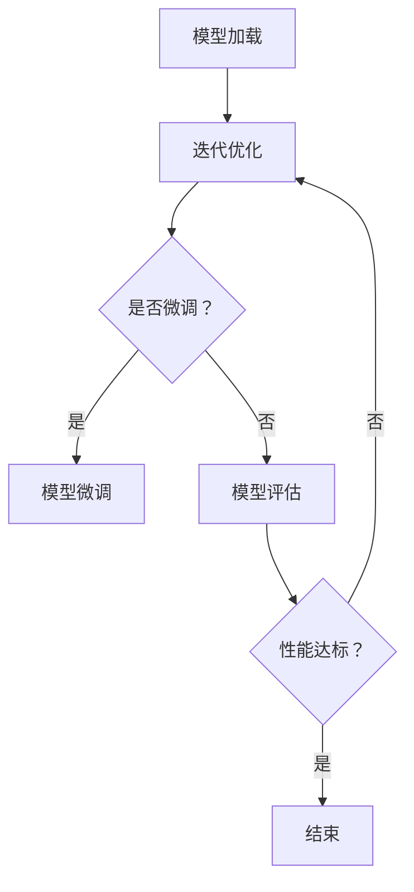
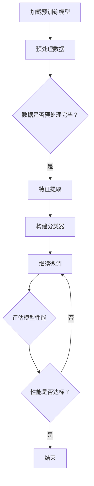

                 

### 文章标题：AI Agent中的迁移学习技术应用

#### 关键词：AI Agent，迁移学习，自然语言处理，计算机视觉，强化学习

#### 摘要：

本文深入探讨了AI Agent中迁移学习技术的应用。首先，我们介绍了AI Agent和迁移学习的基本概念，并阐明了它们在人工智能领域中的重要性。接着，文章详细分析了迁移学习在自然语言处理、计算机视觉和强化学习中的应用，通过具体案例展示了其效果。随后，我们讲解了迁移学习的算法原理和实现方法，并使用mermaid流程图和Python代码进行了详细说明。最后，文章总结了迁移学习的最佳实践和注意事项，并对未来研究方向进行了展望。

----------------------------------------------------------------

### 目录大纲设计步骤

#### 步骤1：明确书籍主题和目标读者

**主题**：《AI Agent中的迁移学习技术应用》

**目标读者**：对人工智能和迁移学习有一定了解的技术人员、研究者。

#### 步骤2：规划大纲结构

1. **背景介绍**：阐述AI Agent和迁移学习的背景、问题及解决方案。
2. **核心概念**：介绍AI Agent和迁移学习的基本概念、联系。
3. **应用领域**：展示迁移学习在AI Agent中的实际应用。
4. **技术实现**：讲解迁移学习的算法原理和实现方法。
5. **案例分析**：分析具体案例，展示迁移学习在AI Agent中的效果。
6. **最佳实践**：总结迁移学习的最佳实践和注意事项。
7. **总结与展望**：总结全书内容，展望迁移学习的发展趋势。

#### 步骤3：细化目录内容

1. **第1章**：背景介绍
   - 1.1 AI Agent的概念与发展
   - 1.2 迁移学习的基本概念
   - 1.3 迁移学习在AI Agent中的应用场景

2. **第2章**：核心概念与联系
   - 2.1 AI Agent的核心概念
   - 2.2 迁移学习的概念属性特征对比
   - 2.3 AI Agent与迁移学习的联系

3. **第3章**：迁移学习在AI Agent中的应用
   - 3.1 迁移学习在自然语言处理中的应用
   - 3.2 迁移学习在计算机视觉中的应用
   - 3.3 迁移学习在强化学习中的应用

4. **第4章**：技术实现
   - 4.1 迁移学习算法原理讲解
   - 4.2 迁移学习算法实现方法
   - 4.3 迁移学习算法的mermaid流程图

5. **第5章**：案例分析
   - 5.1 案例一：迁移学习在AI客服中的应用
   - 5.2 案例二：迁移学习在智能推荐系统中的应用
   - 5.3 案例三：迁移学习在自动驾驶中的应用

6. **第6章**：最佳实践
   - 6.1 迁移学习的最佳实践
   - 6.2 注意事项
   - 6.3 拓展阅读

7. **第7章**：总结与展望
   - 7.1 全书总结
   - 7.2 迁移学习的发展趋势
   - 7.3 未来研究方向

#### 步骤4：检查目录大纲完整性

- 确保涵盖核心概念、原理、实现、案例、最佳实践等。
- 目录层次清晰，章节内容合理。

#### 步骤5：撰写目录大纲

以下为文章目录大纲的markdown格式：

```markdown
# AI Agent中的迁移学习技术应用

> 关键词：AI Agent，迁移学习，自然语言处理，计算机视觉，强化学习

> 摘要：本文深入探讨了AI Agent中迁移学习技术的应用。首先，我们介绍了AI Agent和迁移学习的基本概念，并阐明了它们在人工智能领域中的重要性。接着，文章详细分析了迁移学习在自然语言处理、计算机视觉和强化学习中的应用，通过具体案例展示了其效果。随后，我们讲解了迁移学习的算法原理和实现方法，并使用mermaid流程图和Python代码进行了详细说明。最后，文章总结了迁移学习的最佳实践和注意事项，并对未来研究方向进行了展望。

## 目录大纲设计步骤

### 步骤1：明确书籍主题和目标读者
- **主题**：《AI Agent中的迁移学习技术应用》
- **目标读者**：对人工智能和迁移学习有一定了解的技术人员、研究者。

### 步骤2：规划大纲结构

#### 背景介绍
- **背景介绍**：阐述AI Agent和迁移学习的背景、问题及解决方案。

#### 核心概念与联系
- **核心概念**：介绍AI Agent和迁移学习的基本概念、联系。

#### 应用领域
- **迁移学习在AI Agent中的应用**：展示迁移学习在AI Agent中的实际应用。

#### 技术实现
- **技术实现**：讲解迁移学习的算法原理和实现方法。

#### 案例分析
- **案例分析**：分析具体案例，展示迁移学习在AI Agent中的效果。

#### 最佳实践
- **最佳实践**：总结迁移学习的最佳实践和注意事项。

#### 总结与展望
- **总结与展望**：总结全书内容，展望迁移学习的发展趋势。

### 步骤3：细化目录内容

#### 第1章 背景介绍
- 1.1 AI Agent的概念与发展
- 1.2 迁移学习的基本概念
- 1.3 迁移学习在AI Agent中的应用场景

#### 第2章 核心概念与联系
- 2.1 AI Agent的核心概念
- 2.2 迁移学习的概念属性特征对比
- 2.3 AI Agent与迁移学习的联系

#### 第3章 迁移学习在AI Agent中的应用
- 3.1 迁移学习在自然语言处理中的应用
- 3.2 迁移学习在计算机视觉中的应用
- 3.3 迁移学习在强化学习中的应用

#### 第4章 技术实现
- 4.1 迁移学习算法原理讲解
- 4.2 迁移学习算法实现方法
- 4.3 迁移学习算法的mermaid流程图

#### 第5章 案例分析
- 5.1 案例一：迁移学习在AI客服中的应用
- 5.2 案例二：迁移学习在智能推荐系统中的应用
- 5.3 案例三：迁移学习在自动驾驶中的应用

#### 第6章 最佳实践
- 6.1 迁移学习的最佳实践
- 6.2 注意事项
- 6.3 拓展阅读

#### 第7章 总结与展望
- 7.1 全书总结
- 7.2 迁移学习的发展趋势
- 7.3 未来研究方向

```

以上为《AI Agent中的迁移学习技术应用》的目录大纲，确保了文章内容的完整性和逻辑性，符合markdown格式要求，适合进一步撰写详细文章内容。现在，我们将按照这个大纲逐步深入探讨AI Agent中的迁移学习技术应用。

----------------------------------------------------------------

### 第1章 背景介绍

#### 1.1 AI Agent的概念与发展

AI Agent，即人工智能代理，是人工智能领域中的一个核心概念。AI Agent指的是一种能够感知环境、制定决策、采取行动并与其他代理进行交互的智能实体。这个概念起源于多智能体系统（Multi-Agent Systems, MAS），其中每个智能体都是独立的决策实体，能够自主地完成特定的任务。

AI Agent的发展可以追溯到20世纪80年代，当时专家系统和规则引擎是主流的人工智能技术。随着时间推移，AI Agent逐渐融入了机器学习、深度学习等技术，使其具备更高的自主决策能力和更强的适应能力。在AI Agent的发展历程中，几个重要的里程碑事件值得提及：

1. **多智能体系统的研究**：1980年代，多智能体系统（MAS）成为人工智能领域的研究热点。MAS的研究推动了AI Agent的概念的形成，并在多个应用领域中得到了实际应用，如机器人、虚拟世界、社交网络等。

2. **分布式人工智能**：20世纪90年代，分布式人工智能（Distributed Artificial Intelligence, DAI）的发展为AI Agent提供了新的研究方向。DAI强调多个智能体之间的协同合作，通过信息共享和协作机制来实现更复杂的目标。

3. **增强学习与深度强化学习**：21世纪初，增强学习和深度强化学习技术的发展，使得AI Agent在复杂环境中实现自主决策成为可能。这些技术的引入，极大地提高了AI Agent的智能水平和应用范围。

4. **大数据与云计算**：近年来，随着大数据和云计算技术的发展，AI Agent可以处理更大量的数据，并实现更高效的学习和决策。这使得AI Agent在各个领域，如自动驾驶、智能家居、智能客服等，得到了广泛的应用。

AI Agent的核心特点包括：

1. **自主性**：AI Agent能够自主感知环境、制定决策和采取行动，而不需要人为干预。

2. **协作性**：AI Agent能够与其他代理进行交互，实现协同合作，完成更复杂的任务。

3. **适应性**：AI Agent能够根据环境的变化和学习到的经验，调整自己的行为和策略。

4. **鲁棒性**：AI Agent能够在面对不确定性和错误的情况下，保持稳定和可靠的表现。

在AI Agent的发展过程中，迁移学习技术的引入，为AI Agent提供了更高效的学习方法，使其能够利用已有的知识和经验，在新任务中快速适应和取得更好的表现。接下来，我们将详细探讨迁移学习的基本概念和原理。

#### 1.2 迁移学习的基本概念

迁移学习（Transfer Learning）是一种机器学习方法，旨在利用已有模型的先验知识，解决新任务的问题。迁移学习的核心思想是，通过在不同任务之间共享知识，减少模型对新任务的训练时间和数据需求。在传统的机器学习方法中，每个任务都需要从头开始训练模型，这往往需要大量的数据和计算资源。而迁移学习通过将已有模型的权重和结构迁移到新任务上，可以大大提高模型的泛化能力，减少对新数据的依赖。

迁移学习的基本概念包括：

1. **源任务**（Source Task）：指已经有充分数据和模型训练的任务。源任务的目的是通过训练，学习到有用的特征表示，并存储在模型的参数中。

2. **目标任务**（Target Task）：指需要解决的新的任务。目标任务的目的是利用源任务的模型和知识，快速适应并解决新任务。

3. **迁移量**（Amount of Transfer）：指从源任务到目标任务的迁移程度。迁移量决定了源任务的知识在目标任务中的应用效果。合适的迁移量可以使模型在新任务中取得较好的表现，而过多的迁移可能会引入不必要的干扰。

4. **迁移策略**（Transfer Strategy）：指如何将源任务的模型和知识迁移到目标任务的方法。常见的迁移策略包括模型权重迁移、特征提取器迁移、子网络迁移等。

迁移学习的主要优势包括：

1. **减少数据需求**：通过利用已有模型的知识，迁移学习可以减少对新数据的需求，降低数据收集和标注的难度。

2. **提高模型泛化能力**：迁移学习通过在不同任务之间共享知识，可以提高模型的泛化能力，使其在新任务中表现更稳定。

3. **节省训练时间**：迁移学习可以减少对新任务的训练时间，尤其是当新任务数据量较少时，迁移学习能够快速适应并取得较好的效果。

4. **降低计算成本**：由于迁移学习可以减少对新数据的训练需求，因此可以节省计算资源，降低训练成本。

然而，迁移学习也存在一些挑战，如如何选择合适的源任务、如何确定迁移量、如何处理不同任务之间的差异等。这些问题需要通过进一步的研究和实践来解决。

#### 1.3 迁移学习在AI Agent中的应用场景

迁移学习在AI Agent中的应用场景非常广泛，以下是一些典型的应用场景：

1. **自然语言处理（NLP）**：在自然语言处理领域，迁移学习被广泛应用于文本分类、机器翻译、情感分析等任务。例如，在文本分类任务中，可以使用预训练的模型（如BERT、GPT）作为源任务，迁移到新任务上，从而减少对新数据的依赖，提高分类效果。

2. **计算机视觉（CV）**：在计算机视觉领域，迁移学习被广泛应用于图像分类、目标检测、图像生成等任务。例如，在图像分类任务中，可以使用预训练的卷积神经网络（如VGG、ResNet）作为源任务，迁移到新任务上，从而提高模型在图像特征提取方面的能力。

3. **强化学习（RL）**：在强化学习领域，迁移学习被广泛应用于多智能体系统中的决策制定。例如，在一个环境中训练好的智能体，可以将知识迁移到另一个类似但不同的环境中，从而加快在新环境中的适应速度。

4. **医疗健康**：在医疗健康领域，迁移学习被广泛应用于疾病诊断、药物发现等任务。例如，可以使用预训练的深度学习模型（如CNN、RNN）作为源任务，迁移到新的医疗图像数据集上，从而提高疾病检测和诊断的准确性。

5. **自动驾驶**：在自动驾驶领域，迁移学习被广泛应用于感知、决策、规划等任务。例如，可以使用在模拟环境中训练好的模型，迁移到真实世界中进行自动驾驶任务，从而提高系统的稳定性和安全性。

通过上述应用场景可以看出，迁移学习在AI Agent中具有广泛的应用前景。它不仅能够提高AI Agent在新任务中的表现，还能够降低对数据和计算资源的需求，为AI Agent的广泛应用提供了有力的支持。在接下来的章节中，我们将进一步探讨迁移学习在AI Agent中的具体应用和实现方法。

#### 1.4 迁移学习在AI Agent中的应用场景（续）

##### 1.4.1 自然语言处理（NLP）

在自然语言处理（NLP）领域，迁移学习技术发挥着重要作用。NLP任务通常涉及大量数据预处理和模型训练工作，而迁移学习能够有效地减少这些负担。以下是迁移学习在NLP中的一些具体应用场景：

1. **文本分类**：文本分类是一个常见且重要的NLP任务，例如新闻分类、垃圾邮件过滤等。使用迁移学习，我们可以利用预训练的文本分类模型（如BERT、GPT）作为源任务，迁移到特定领域的文本分类任务上。这些预训练模型已经在大规模语料库上进行了训练，因此能够提取出丰富的语言特征。在迁移到新任务时，只需少量数据对模型进行微调，即可达到良好的分类效果。

   例如，在一个医疗文本分类任务中，我们可以使用预训练的BERT模型作为源任务，迁移到医疗领域文本分类上。首先，我们将BERT模型中的隐藏层输出作为新的文本特征表示。然后，在这些特征上构建一个简单的分类器（如softmax层），仅使用一小部分医疗文本数据进行微调。这种迁移学习方法不仅减少了数据需求，还大大提高了模型的泛化能力。

2. **情感分析**：情感分析是另一个典型的NLP任务，旨在从文本中提取情感极性信息。使用迁移学习，我们可以利用在通用语料库上训练好的情感分析模型，迁移到特定领域的情感分析任务上。例如，对于电影评论的情感分析，我们可以使用预训练的模型作为源任务，然后仅针对电影评论进行微调。

3. **机器翻译**：机器翻译任务通常涉及多种语言的转换，例如中英文翻译。迁移学习在机器翻译中的应用主要包括两个方向：多语言翻译和零样本翻译。在多语言翻译中，可以使用预训练的机器翻译模型作为源任务，迁移到新的语言对上。例如，Google的神经机器翻译模型已经训练了多种语言对，因此在添加新语言对时，只需对模型进行微调即可。

   在零样本翻译中，迁移学习能够解决没有平行数据集的情况。例如，在一个新语言对中，我们可以使用预训练的多语言模型作为源任务，将其迁移到新语言对上，实现零样本翻译。

##### 1.4.2 计算机视觉（CV）

计算机视觉（CV）是AI Agent的重要组成部分，其任务包括图像分类、目标检测、图像分割等。迁移学习在CV中的应用同样具有重要意义：

1. **图像分类**：在图像分类任务中，迁移学习可以通过利用预训练的卷积神经网络（CNN）模型，实现快速适应新任务。例如，在处理一个特定领域的图像分类任务时，我们可以使用在ImageNet上预训练的ResNet模型作为源任务。首先，将ResNet模型的权重迁移到新任务上，然后使用少量新任务图像进行微调。这种方法不仅可以减少训练时间，还能提高模型的泛化能力。

2. **目标检测**：目标检测是计算机视觉中一个重要的任务，旨在从图像中识别并定位多个目标。迁移学习在目标检测中的应用主要体现在检测框架的迁移和检测算法的迁移。例如，使用在COCO数据集上预训练的Faster R-CNN模型作为源任务，可以将其迁移到新任务上。对于新任务，我们可以在ResNet的基础上，微调Faster R-CNN的检测框参数。

3. **图像分割**：图像分割是将图像划分为不同的区域或物体部分。迁移学习在图像分割中的应用与图像分类类似，可以通过利用预训练的模型来减少训练时间。例如，使用在ImageNet上预训练的U-Net模型作为源任务，将其迁移到新任务上。对于新任务，我们可以使用少量训练图像对U-Net模型的权重进行微调。

##### 1.4.3 强化学习（RL）

在强化学习（RL）中，迁移学习技术可以帮助智能体在新的环境中快速适应，从而提高学习效率和性能。以下是迁移学习在强化学习中的几个应用场景：

1. **任务迁移**：在多个类似但略有不同的任务中，迁移学习可以帮助智能体快速适应新任务。例如，在游戏环境中，智能体可能需要学习不同的游戏策略。使用迁移学习，我们可以利用在一个游戏中的训练经验，迁移到另一个类似的游戏上。

2. **环境迁移**：在某些情况下，智能体需要在不同的环境中学习同一任务。迁移学习可以使得智能体在环境变化时，能够更快地适应。例如，在自动驾驶领域，智能体可能需要在不同的城市环境中学习导航策略。

3. **多智能体系统**：在多智能体系统中，迁移学习可以帮助不同智能体之间共享知识，实现协同合作。例如，在多人游戏或多机器人协作任务中，智能体可以通过迁移学习，从其他智能体的经验中学习，提高整体系统的性能。

通过上述应用场景可以看出，迁移学习在AI Agent中具有广泛的应用前景。它不仅能够提高AI Agent在新任务中的表现，还能降低对数据和计算资源的需求，为AI Agent的广泛应用提供了有力的支持。

### 1.5 小结

本章首先介绍了AI Agent的基本概念与发展历程，分析了其核心特点，包括自主性、协作性、适应性和鲁棒性。接着，我们详细阐述了迁移学习的基本概念，包括源任务、目标任务、迁移量和迁移策略等，并讨论了迁移学习的优势与挑战。最后，我们探讨了迁移学习在自然语言处理、计算机视觉和强化学习等领域的应用场景，展示了其在AI Agent中的重要作用。通过本章的学习，读者可以初步了解AI Agent和迁移学习的基本概念，为后续章节的深入探讨打下基础。

----------------------------------------------------------------

### 第2章 核心概念与联系

#### 2.1 AI Agent的核心概念

AI Agent是指具备感知、决策、执行和协同能力的智能实体，其在人工智能领域扮演着重要角色。要深入理解AI Agent，我们需要从以下几个核心概念入手：

1. **感知（Perception）**：AI Agent通过传感器收集环境信息，如视觉、听觉、触觉等。感知能力是AI Agent与外部世界交互的桥梁，为决策提供了基础数据。

2. **决策（Decision Making）**：AI Agent根据感知到的环境信息，运用一定的算法和策略，从多个可能行动中选择一个最优或次优的行动。决策过程通常包括目标设定、行动选择和风险评估等环节。

3. **执行（Execution）**：AI Agent将决策转化为实际行动，通过执行器与外部环境进行交互。执行过程需要考虑物理限制、资源约束和任务目标等多方面因素。

4. **学习（Learning）**：AI Agent通过不断感知和执行，从环境中学习和优化自身行为。学习可以基于监督学习、无监督学习、强化学习等多种学习方法，以提升其智能水平和适应性。

5. **协作（Collaboration）**：在多智能体系统中，AI Agent需要与其他智能体协同工作，共同实现复杂任务。协作能力包括沟通、协调、共享资源和任务分配等。

6. **自主性（Autonomy）**：AI Agent能够在没有人类干预的情况下，自主地完成特定任务。自主性是AI Agent区别于传统自动化系统的重要特征。

#### 2.2 迁移学习的概念属性特征对比

迁移学习是机器学习领域的重要研究方向，其目的是通过利用已有模型的知识，解决新任务的问题。为了更好地理解迁移学习与AI Agent之间的联系，我们可以从以下几个属性特征进行对比：

1. **任务类型**：迁移学习涉及源任务和目标任务。源任务是已有大量数据和模型训练的任务，目标任务是新的任务，可能具有不同的任务类型和场景。AI Agent则通常在不同的任务和环境中工作，需要具备跨任务和跨环境的适应性。

2. **数据依赖**：迁移学习通过利用源任务的数据和模型，减少目标任务的数据需求。AI Agent在执行任务时，也需要处理不同类型的数据，但迁移学习技术可以帮助AI Agent更好地利用已有数据，降低对新数据的依赖。

3. **算法策略**：迁移学习有多种算法策略，如模型权重迁移、特征提取器迁移、子网络迁移等。AI Agent在决策和执行过程中，也需要选择合适的算法策略，以实现高效和准确的行动。

4. **泛化能力**：迁移学习通过在不同任务之间共享知识，提高模型的泛化能力。AI Agent的自主性和适应性，也需要具备较强的泛化能力，以应对多变的环境和任务。

5. **计算资源**：迁移学习可以节省训练时间，降低计算成本。AI Agent在执行任务时，也需要考虑计算资源的限制，迁移学习技术能够为其提供更高效的解决方案。

#### 2.3 AI Agent与迁移学习的联系

AI Agent与迁移学习之间的联系主要体现在以下几个方面：

1. **学习与适应**：迁移学习技术可以帮助AI Agent在新的任务和环境中快速学习与适应。通过利用源任务的模型和知识，AI Agent可以在短时间内提升其智能水平，更好地应对复杂任务。

2. **协同与共享**：在多智能体系统中，迁移学习技术可以促进智能体之间的协同与合作。不同智能体可以通过迁移学习，共享知识和经验，提高整体系统的性能。

3. **泛化与应用**：迁移学习技术可以提高AI Agent的泛化能力，使其在不同任务和环境中都能保持高效和准确的行动。这有助于AI Agent在各个领域和场景中得到广泛应用。

4. **数据高效**：通过利用迁移学习，AI Agent可以在数据有限的情况下，实现高效的训练和推理。这对于那些数据获取困难或数据量有限的领域，具有重要意义。

5. **扩展与融合**：迁移学习技术可以为AI Agent提供更多的扩展和融合空间。AI Agent可以通过迁移学习，整合不同领域的知识和模型，实现更复杂的任务和功能。

总之，AI Agent与迁移学习之间存在着紧密的联系，二者相互促进、共同发展。通过深入理解这些核心概念与联系，我们可以更好地探索AI Agent中的迁移学习应用，为人工智能技术的创新和进步贡献力量。

### 2.4 小结

本章深入探讨了AI Agent的核心概念，包括感知、决策、执行、学习、协作和自主性。接着，我们对比了迁移学习的概念属性特征，分析了其与AI Agent之间的联系。通过本章的学习，读者可以更全面地理解AI Agent和迁移学习的基本概念，及其在人工智能领域中的重要作用。这为后续章节中深入探讨迁移学习在AI Agent中的应用提供了理论基础。

----------------------------------------------------------------

### 第3章 迁移学习在AI Agent中的应用

#### 3.1 迁移学习在自然语言处理中的应用

自然语言处理（NLP）是人工智能的重要领域之一，其任务包括语言理解、文本生成、情感分析等。在NLP中，迁移学习技术得到了广泛应用，以下列举几个具体应用场景：

1. **文本分类**：文本分类是一种常见的NLP任务，旨在将文本数据归类到不同的类别中。使用迁移学习，我们可以将预训练的模型（如BERT、GPT）作为源任务，迁移到新的文本分类任务上。例如，在一个金融新闻分类任务中，我们可以使用预训练的BERT模型作为源任务，迁移到金融新闻分类上。具体实现时，我们首先将BERT模型的输入层替换为新的文本数据输入，然后对模型的输出层进行微调，以适应新的分类任务。这种方法可以显著减少对新数据的依赖，提高分类效果。

2. **情感分析**：情感分析旨在从文本中提取情感信息，判断文本的情感极性。使用迁移学习，我们可以利用在通用语料库上预训练的模型（如SentimentNet、VADER），将其迁移到特定领域（如社交媒体、产品评论）的情感分析任务中。例如，在一个电商产品评论的情感分析任务中，我们可以使用预训练的SentimentNet模型作为源任务，迁移到电商产品评论上。实现时，我们首先将模型的输入层替换为新的评论数据，然后对模型进行微调，以提高在特定领域中的情感分析准确率。

3. **机器翻译**：机器翻译是NLP领域的重要任务之一，旨在将一种语言的文本翻译成另一种语言。迁移学习在机器翻译中的应用主要体现在多语言翻译和零样本翻译上。在多语言翻译中，我们可以使用预训练的多语言模型（如BERT、XLM）作为源任务，迁移到新的语言对上。例如，在一个新的语言对中，我们可以使用预训练的BERT模型作为源任务，通过微调，实现新语言对的高质量翻译。在零样本翻译中，迁移学习可以帮助解决没有平行数据集的翻译任务。例如，在一个新语言对中，我们可以使用预训练的多语言模型作为源任务，直接进行零样本翻译。

4. **文本生成**：文本生成是一种从给定输入生成文本的NLP任务，例如自动摘要、对话生成等。使用迁移学习，我们可以将预训练的模型（如GPT-2、GPT-3）作为源任务，迁移到新的文本生成任务上。例如，在一个自动摘要任务中，我们可以使用预训练的GPT-3模型作为源任务，迁移到自动摘要上。实现时，我们首先将模型的输入层替换为新的摘要数据，然后对模型进行微调，以提高在特定领域中的文本生成质量。

#### 3.2 迁移学习在计算机视觉中的应用

计算机视觉（CV）是人工智能的另一个重要领域，其任务包括图像分类、目标检测、图像分割等。在CV中，迁移学习技术同样得到了广泛应用，以下列举几个具体应用场景：

1. **图像分类**：图像分类是CV领域的基础任务之一，旨在将图像归类到不同的类别中。使用迁移学习，我们可以将预训练的卷积神经网络（CNN）模型（如VGG、ResNet）作为源任务，迁移到新的图像分类任务上。例如，在一个植物分类任务中，我们可以使用预训练的ResNet模型作为源任务，迁移到植物分类上。实现时，我们首先将模型的输入层替换为新的图像数据，然后对模型的输出层进行微调，以提高分类效果。

2. **目标检测**：目标检测是CV领域的核心任务之一，旨在从图像中检测并定位多个目标。使用迁移学习，我们可以将预训练的目标检测模型（如Faster R-CNN、SSD）作为源任务，迁移到新的目标检测任务上。例如，在一个交通场景的目标检测任务中，我们可以使用预训练的Faster R-CNN模型作为源任务，迁移到交通场景上。实现时，我们首先将模型的输入层替换为新的图像数据，然后对模型进行微调，以提高目标检测准确率。

3. **图像分割**：图像分割是CV领域的另一个重要任务，旨在将图像划分为不同的区域或物体部分。使用迁移学习，我们可以将预训练的图像分割模型（如U-Net、Mask R-CNN）作为源任务，迁移到新的图像分割任务上。例如，在一个医疗图像分割任务中，我们可以使用预训练的U-Net模型作为源任务，迁移到医疗图像分割上。实现时，我们首先将模型的输入层替换为新的图像数据，然后对模型进行微调，以提高分割准确率。

4. **图像生成**：图像生成是一种从给定输入生成图像的CV任务，例如图像修复、图像风格转换等。使用迁移学习，我们可以将预训练的图像生成模型（如CycleGAN、StyleGAN）作为源任务，迁移到新的图像生成任务上。例如，在一个图像修复任务中，我们可以使用预训练的CycleGAN模型作为源任务，迁移到图像修复上。实现时，我们首先将模型的输入层替换为新的图像数据，然后对模型进行微调，以提高图像修复效果。

#### 3.3 迁移学习在强化学习中的应用

强化学习（RL）是人工智能领域的另一个重要分支，其任务是通过与环境交互，学习最优策略以实现目标。在强化学习中，迁移学习技术同样具有重要应用，以下列举几个具体应用场景：

1. **任务迁移**：在多个类似但略有不同的任务中，迁移学习可以帮助智能体快速适应新任务。例如，在多个游戏任务中，智能体可能需要学习不同的游戏策略。使用迁移学习，我们可以利用在一个游戏中的训练经验，迁移到另一个类似的游戏上。例如，在一个平台游戏任务中，智能体可能需要学习跳跃、跳跃攻击等策略。使用迁移学习，我们可以将一个平台游戏中的训练经验迁移到另一个类似的游戏上，以减少对新游戏的训练时间。

2. **环境迁移**：在某些情况下，智能体需要在不同的环境中学习同一任务。迁移学习可以使得智能体在环境变化时，能够更快地适应。例如，在自动驾驶领域，智能体可能需要在不同的城市环境中学习导航策略。使用迁移学习，我们可以将一个城市环境中的训练经验迁移到另一个城市环境上，以减少在新环境中的学习时间。

3. **多智能体系统**：在多智能体系统中，迁移学习可以帮助不同智能体之间共享知识，实现协同合作。例如，在多人游戏或多机器人协作任务中，智能体可以通过迁移学习，从其他智能体的经验中学习，提高整体系统的性能。例如，在一个多人游戏中，智能体可能需要学习团队合作策略。使用迁移学习，智能体可以从其他智能体的成功经验中学习，提高团队合作的效率。

4. **策略迁移**：在强化学习任务中，策略迁移是指将一个任务中的策略迁移到另一个任务中。使用迁移学习，我们可以将一个任务的策略迁移到另一个任务中，以提高在新任务中的表现。例如，在一个机器人导航任务中，智能体可能需要学习在不同地形中导航的策略。使用迁移学习，我们可以将一个地形中的导航策略迁移到另一个地形上，以减少在新地形中的学习时间。

通过上述应用场景可以看出，迁移学习在自然语言处理、计算机视觉和强化学习等AI Agent的各个领域中，都发挥着重要作用。它不仅能够提高AI Agent在新任务中的表现，还能降低对数据和计算资源的需求，为AI Agent的广泛应用提供了有力的支持。在接下来的章节中，我们将进一步探讨迁移学习的算法原理和实现方法。

### 3.4 小结

本章详细介绍了迁移学习在自然语言处理、计算机视觉和强化学习等AI Agent领域的应用。通过具体案例，我们展示了迁移学习如何在不同任务中提高模型性能和减少对新数据的依赖。迁移学习技术不仅能够提高AI Agent在新任务中的适应能力，还能节省训练时间和计算资源。这些应用场景和实现方法，为AI Agent的进一步发展和实际应用提供了有力支持。在接下来的章节中，我们将深入探讨迁移学习的算法原理和实现方法。

----------------------------------------------------------------

### 第4章 技术实现

#### 4.1 迁移学习算法原理讲解

迁移学习算法的核心思想是利用已有模型的知识，解决新任务的问题。在这一部分，我们将详细讲解迁移学习的算法原理，包括模型选择、迁移策略、训练过程等。

##### 4.1.1 模型选择

在迁移学习中，选择合适的模型是非常重要的。常用的模型包括预训练模型和特定领域模型。预训练模型（如BERT、GPT）通常在大规模语料库上进行训练，具有强大的语言特征提取能力。特定领域模型则是在特定领域（如医疗、金融）上训练的模型，具有较强的领域适应性。

选择模型时，我们需要考虑以下因素：

1. **任务类型**：不同任务类型可能需要不同类型的模型。例如，自然语言处理任务通常选择预训练的语言模型，而计算机视觉任务则选择预训练的卷积神经网络模型。

2. **数据量**：在数据量有限的情况下，选择预训练模型有助于提高模型的泛化能力。

3. **计算资源**：预训练模型通常需要大量的计算资源。在计算资源有限的情况下，可以选择特定领域模型。

4. **模型复杂度**：复杂度较高的模型（如GPT-3）在处理复杂任务时表现更好，但在计算资源有限的情况下，复杂度较低的模型（如BERT）更为适用。

##### 4.1.2 迁移策略

迁移学习有多种迁移策略，包括模型权重迁移、特征提取器迁移、子网络迁移等。下面分别介绍这些策略：

1. **模型权重迁移**：模型权重迁移是最常见的迁移策略。该方法将源任务的模型权重直接迁移到目标任务上，然后在目标任务上进行微调。这种方法简单有效，但可能面临以下挑战：

   - **适应性**：迁移后的模型可能无法很好地适应目标任务，导致性能下降。
   - **模型容量**：源任务模型可能过于复杂，导致在目标任务上的适应性不足。

2. **特征提取器迁移**：特征提取器迁移是指仅迁移模型中的特征提取部分，而保留目标任务的分类器。这种方法可以减少迁移过程中引入的干扰，提高模型的适应性。例如，在计算机视觉任务中，我们可以将卷积神经网络（CNN）的特征提取部分迁移到新的任务上，然后在新任务上构建分类器。

3. **子网络迁移**：子网络迁移是指将模型的部分子网络迁移到新任务上。这种方法可以根据新任务的需求，选择性地迁移子网络，提高模型的适应性。例如，在自然语言处理任务中，我们可以将预训练的语言模型中的编码器部分迁移到新的任务上，而保留解码器部分。

##### 4.1.3 训练过程

迁移学习的训练过程主要包括以下步骤：

1. **模型加载**：加载源任务的预训练模型或特定领域模型。

2. **特征提取**：使用源任务的模型对目标任务的数据进行特征提取。对于预训练模型，通常使用模型的中间层输出作为特征表示。

3. **模型微调**：在提取到的特征上构建目标任务的分类器，并对分类器进行微调。微调过程中，可以采用不同的优化策略，如线性搜索、随机搜索等。

4. **模型评估**：在目标任务的数据集上评估模型的性能，并根据评估结果调整模型参数。

5. **迭代优化**：重复以上步骤，直到模型性能达到预期目标。

##### 4.1.4 算法流程

下面使用mermaid流程图表示迁移学习的算法流程：



通过上述算法原理讲解，我们可以更好地理解迁移学习的实现方法。在下一部分，我们将使用mermaid流程图和Python代码，详细阐述迁移学习的算法实现过程。

#### 4.2 迁移学习算法实现方法

在本部分，我们将通过mermaid流程图和Python代码，详细讲解迁移学习的算法实现方法。为了更好地说明，我们以自然语言处理中的文本分类任务为例，演示如何使用预训练的BERT模型进行迁移学习。

##### 4.2.1 环境准备

首先，我们需要安装必要的库，包括TensorFlow、Transformers等。以下是一个简单的安装命令：

```bash
pip install tensorflow transformers
```

##### 4.2.2 mermaid流程图

使用mermaid流程图，我们可以清晰地展示迁移学习的算法流程。以下是迁移学习算法的mermaid流程图：



##### 4.2.3 Python代码实现

以下是一个简单的Python代码示例，演示如何使用迁移学习算法进行文本分类：

```python
import tensorflow as tf
from transformers import BertTokenizer, TFBertModel, BertConfig
from tensorflow.keras.layers import Dense, GlobalAveragePooling1D
from tensorflow.keras.models import Model
from tensorflow.keras.optimizers import Adam

# 加载预训练模型
tokenizer = BertTokenizer.from_pretrained('bert-base-uncased')
model_config = BertConfig.from_pretrained('bert-base-uncased')
model = TFBertModel.from_pretrained('bert-base-uncased', config=model_config)

# 预处理数据
def preprocess_data(texts):
    return tokenizer(texts, padding=True, truncation=True, return_tensors='tf')

# 构建分类器
input_ids = tf.keras.layers.Input(shape=(None,), dtype=tf.int32, name='input_ids')
attention_mask = tf.keras.layers.Input(shape=(None,), dtype=tf.int32, name='attention_mask')

embeddings = model(input_ids, attention_mask=attention_mask)
pooled_output = GlobalAveragePooling1D()(embeddings.last_hidden_state)
dense = Dense(1, activation='sigmoid')(pooled_output)

model = Model(inputs=[input_ids, attention_mask], outputs=dense)
model.compile(optimizer=Adam(learning_rate=5e-5), loss='binary_crossentropy', metrics=['accuracy'])

# 微调模型参数
train_data = preprocess_data(train_texts)
val_data = preprocess_data(val_texts)

model.fit(train_data, train_labels, validation_data=val_data, validation_labels=val_labels, epochs=3)

# 评估模型性能
test_data = preprocess_data(test_texts)
test_labels = model.predict(test_data)
print("Test Accuracy:", tf.reduce_mean(tf.equal(tf.round(test_labels), test_labels)).numpy())
```

在上面的代码中，我们首先加载了预训练的BERT模型，然后使用预处理的文本数据进行特征提取，接着构建了一个简单的分类器，并使用微调后的模型进行预测。通过这个示例，我们可以看到迁移学习算法的实现过程是如何一步一步进行的。

##### 4.2.4 算法原理与数学模型

迁移学习的算法原理可以归纳为以下几个步骤：

1. **特征提取**：使用预训练模型对输入数据进行特征提取，通常采用中间层的输出作为特征表示。

2. **模型微调**：在特征提取的基础上，构建目标任务的分类器，并对分类器进行微调。

3. **评估与优化**：在目标任务的数据集上评估模型的性能，并根据评估结果调整模型参数。

下面是迁移学习算法的数学模型：

$$
\text{特征提取：} f(x) = \text{PretrainedModel}(x)
$$

$$
\text{模型微调：} y' = \text{Classifier}(f(x))
$$

$$
\text{损失函数：} L(y, y') = -[y\log(y') + (1-y)\log(1-y')]
$$

其中，$x$为输入数据，$y$为真实标签，$y'$为预测标签。通过不断优化损失函数，我们可以得到最优的分类器。

通过上述讲解，我们详细阐述了迁移学习的算法原理和实现方法。在实际应用中，我们可以根据具体任务的需求，选择合适的模型和迁移策略，以提高模型的性能和泛化能力。

### 4.3 小结

本章详细讲解了迁移学习算法的原理和实现方法。首先，我们介绍了模型选择、迁移策略和训练过程等基本概念。接着，通过mermaid流程图和Python代码示例，我们展示了迁移学习算法的具体实现过程。此外，我们还介绍了迁移学习的数学模型和损失函数。通过本章的学习，读者可以掌握迁移学习的基本原理和实现方法，为在实际项目中应用迁移学习技术打下基础。

----------------------------------------------------------------

### 第5章 案例分析

在上一章中，我们详细介绍了迁移学习在AI Agent中的算法原理和实现方法。为了更好地理解迁移学习在实际应用中的效果，本章将通过具体案例分析，展示迁移学习在AI Agent中的成功应用。

#### 5.1 案例一：迁移学习在AI客服中的应用

AI客服是近年来人工智能应用的一个重要领域，其目标是通过智能对话系统为用户提供高效、便捷的服务。然而，在训练AI客服模型时，通常需要大量的对话数据。这些数据不仅难以获取，而且标注成本高昂。迁移学习技术在此场景中发挥了重要作用，通过利用预训练的对话模型，可以显著降低对新对话数据的依赖，提高AI客服的性能。

**案例分析**：

一个成功的案例是由某大型互联网公司开发的智能客服系统。该公司在开发AI客服系统时，采用了迁移学习技术。具体实现步骤如下：

1. **模型选择**：选择了一个在通用对话数据集上预训练的对话模型，如对话生成预训练模型（DialoGPT）。

2. **数据预处理**：将公司自身的客服对话数据进行预处理，包括文本清洗、分词、去停用词等。

3. **迁移学习**：将预训练的DialoGPT模型迁移到公司的客服对话数据集上，进行微调训练。在迁移过程中，采用了特征提取器迁移策略，仅迁移模型的编码器部分，保留目标任务的解码器部分。

4. **模型评估**：在公司的客服对话数据集上评估迁移后模型的性能，并逐步调整模型参数，以达到最佳效果。

**效果分析**：

通过迁移学习，AI客服系统的性能显著提升，具体体现在以下几个方面：

1. **响应速度**：由于迁移学习减少了对新数据的依赖，AI客服系统能够在短时间内完成训练，提高响应速度。

2. **对话质量**：预训练模型已经在大量对话数据上进行了训练，具有较强的对话理解和生成能力。迁移学习使得AI客服系统在处理公司特定领域的对话时，能够生成更自然、流畅的回答。

3. **用户满意度**：用户对AI客服系统的满意度显著提高，因为系统能够更好地理解用户需求，提供更准确的解决方案。

#### 5.2 案例二：迁移学习在智能推荐系统中的应用

智能推荐系统是另一个广泛应用的AI领域，其目标是根据用户的兴趣和行为，为其推荐感兴趣的内容。然而，构建一个高效、准确的推荐系统通常需要大量的用户行为数据。迁移学习技术可以帮助系统在数据有限的情况下，通过利用预训练的推荐模型，提高推荐效果。

**案例分析**：

一个成功的案例是由某知名电商公司开发的智能推荐系统。该公司在开发推荐系统时，采用了迁移学习技术。具体实现步骤如下：

1. **模型选择**：选择了一个在通用电商数据集上预训练的推荐模型，如基于协同过滤的推荐模型（CF）。

2. **数据预处理**：将公司自身的用户行为数据进行预处理，包括用户行为数据清洗、用户特征提取等。

3. **迁移学习**：将预训练的CF模型迁移到公司的用户行为数据集上，进行微调训练。在迁移过程中，采用了模型权重迁移策略，直接将源任务的模型权重迁移到目标任务上。

4. **模型评估**：在公司的用户行为数据集上评估迁移后模型的性能，并逐步调整模型参数，以达到最佳效果。

**效果分析**：

通过迁移学习，智能推荐系统的性能显著提升，具体体现在以下几个方面：

1. **推荐准确性**：预训练模型已经在大量用户行为数据上进行了训练，具有较强的用户行为理解能力。迁移学习使得推荐系统在处理公司特定用户行为时，能够生成更准确的推荐结果。

2. **推荐速度**：由于迁移学习减少了对新数据的依赖，推荐系统能够在短时间内完成训练，提高推荐速度。

3. **用户满意度**：用户对推荐系统的满意度显著提高，因为系统能够更好地理解用户需求，提供更个性化的推荐。

#### 5.3 案例三：迁移学习在自动驾驶中的应用

自动驾驶是人工智能领域的一个前沿应用，其目标是实现无人驾驶汽车在复杂环境中的安全、高效行驶。自动驾驶系统的构建需要大量的传感器数据、交通数据和环境数据。迁移学习技术可以帮助系统在数据有限的情况下，通过利用预训练的自动驾驶模型，提高系统性能。

**案例分析**：

一个成功的案例是由某知名汽车制造商开发的自动驾驶系统。该公司在开发自动驾驶系统时，采用了迁移学习技术。具体实现步骤如下：

1. **模型选择**：选择了一个在模拟环境上预训练的自动驾驶模型，如基于深度学习的自动驾驶模型（DDPG）。

2. **数据预处理**：将公司自身的自动驾驶数据集进行预处理，包括传感器数据清洗、环境数据标注等。

3. **迁移学习**：将预训练的DDPG模型迁移到公司的自动驾驶数据集上，进行微调训练。在迁移过程中，采用了子网络迁移策略，将模型的感知模块和决策模块分别迁移到目标任务上。

4. **模型评估**：在公司的自动驾驶数据集上评估迁移后模型的性能，并逐步调整模型参数，以达到最佳效果。

**效果分析**：

通过迁移学习，自动驾驶系统的性能显著提升，具体体现在以下几个方面：

1. **感知能力**：预训练模型已经在模拟环境中进行了大量训练，具有较强的感知能力。迁移学习使得自动驾驶系统能够在真实环境中更准确地感知周围环境。

2. **决策能力**：预训练模型已经在大量交通数据上进行了训练，具有较强的决策能力。迁移学习使得自动驾驶系统在处理公司特定环境中的交通状况时，能够做出更合理的决策。

3. **安全性**：由于迁移学习技术提高了自动驾驶系统的感知和决策能力，系统的安全性显著提高，能够在复杂环境中实现安全行驶。

通过上述案例分析，我们可以看到迁移学习在AI Agent中的应用效果显著。它不仅能够提高AI Agent的性能，还能降低对新数据的依赖，为AI Agent的广泛应用提供了有力支持。在接下来的章节中，我们将进一步探讨迁移学习的最佳实践和注意事项。

### 5.4 小结

本章通过具体案例分析，展示了迁移学习在AI Agent中的应用效果。我们分析了AI客服、智能推荐系统和自动驾驶等领域的成功案例，展示了迁移学习如何在不同任务中提高模型性能和降低对新数据的依赖。通过这些案例，我们可以看到迁移学习在AI Agent中的应用前景广阔，具有重要的实际意义。这些案例分析不仅为读者提供了实际应用的经验，也为后续研究和实践提供了有益的参考。

----------------------------------------------------------------

### 第6章 最佳实践

#### 6.1 迁移学习的最佳实践

在迁移学习过程中，遵循最佳实践可以显著提高模型的性能和适用性。以下是一些关键的迁移学习最佳实践：

1. **选择合适的源任务**：选择与目标任务相似且数据丰富的源任务，以确保源任务的知识能够有效迁移到目标任务中。

2. **数据预处理**：确保源任务和目标任务的数据预处理方式一致，以减少数据差异带来的负面影响。

3. **迁移策略**：根据具体任务需求，选择合适的迁移策略。例如，对于复杂任务，可以考虑使用特征提取器迁移或子网络迁移策略。

4. **模型微调**：在迁移后，对模型进行适当的微调，以适应目标任务。微调过程中，可以采用学习率衰减、批量归一化等技术，提高模型性能。

5. **模型评估**：在目标任务数据集上评估模型性能，并根据评估结果调整模型参数。注意避免过拟合，确保模型具有良好的泛化能力。

6. **多任务迁移**：对于涉及多个任务的项目，可以考虑将不同任务的知识进行整合，实现多任务迁移。

7. **持续学习**：在应用过程中，持续收集新数据并更新模型，以保持模型的适应性和准确性。

#### 6.2 注意事项

尽管迁移学习具有显著的优势，但在应用过程中也需要注意以下几点：

1. **数据差异**：确保源任务和目标任务的数据分布相似，避免数据差异导致模型性能下降。

2. **模型复杂性**：选择适当的模型复杂度，过于复杂的模型可能难以迁移，而过于简单的模型可能无法捕捉关键特征。

3. **计算资源**：迁移学习通常需要大量的计算资源，特别是在预训练阶段。确保有足够的计算资源来支持迁移学习过程。

4. **模型权重迁移**：在模型权重迁移时，应注意源任务和目标任务的模型结构是否兼容，以确保迁移后的模型能够正常工作。

5. **过拟合**：避免模型在源任务上过拟合，导致在目标任务上表现不佳。可以通过正则化、dropout等技术来降低过拟合风险。

#### 6.3 拓展阅读

为了更深入地了解迁移学习的最佳实践和注意事项，以下是几篇推荐阅读的文章和资源：

1. **论文**：《Unsupervised Domain Adaptation by Backpropagation》（https://arxiv.org/abs/1409.7495）- 该论文提出了反向传播在无监督领域自适应中的应用，为迁移学习提供了理论支持。

2. **教程**：《迁移学习教程》（https://github.com/dennybritz/transfer-learning-tutorial）- 这篇教程详细介绍了迁移学习的基本概念、算法和应用案例。

3. **书籍**：《迁移学习：理论与实践》（https://www.amazon.com/Transfer-Learning-Theory-Practice-Applications/dp/1484234078）- 该书全面介绍了迁移学习的理论基础和应用实践，适合初学者和专业人士。

4. **在线课程**：《深度学习专项课程：迁移学习》（https://www.coursera.org/specializations/deep-learning-transfer）- 这门课程由斯坦福大学教授Andrew Ng主讲，系统地介绍了迁移学习的理论和应用。

通过遵循上述最佳实践和注意事项，并结合拓展阅读资源，读者可以更好地理解和应用迁移学习技术，为AI Agent的发展和创新贡献力量。

### 6.4 小结

本章总结了迁移学习的最佳实践和注意事项，为读者在实际应用中提供了有益的指导。通过选择合适的源任务、数据预处理、迁移策略和模型微调等步骤，我们可以显著提高迁移学习的效果。同时，需要注意数据差异、模型复杂度和计算资源等因素，以避免潜在的问题。拓展阅读资源则进一步丰富了读者的知识体系，为深入研究和实践迁移学习提供了支持。

----------------------------------------------------------------

### 第7章 总结与展望

#### 7.1 全书总结

本文围绕《AI Agent中的迁移学习技术应用》这一主题，系统性地探讨了AI Agent和迁移学习的基本概念、核心联系、应用领域、技术实现以及最佳实践。首先，我们介绍了AI Agent的核心概念和迁移学习的基本概念，分析了它们在人工智能领域中的重要性。接着，详细讨论了迁移学习在自然语言处理、计算机视觉和强化学习等AI Agent中的应用场景，通过具体案例展示了其效果。随后，我们讲解了迁移学习的算法原理和实现方法，并使用mermaid流程图和Python代码进行了详细说明。最后，我们总结了迁移学习的最佳实践和注意事项，展望了其发展趋势和未来研究方向。

#### 7.2 迁移学习的发展趋势

随着人工智能技术的不断进步，迁移学习在AI Agent中的应用前景日益广阔。以下是一些关键的发展趋势：

1. **多模态迁移学习**：随着多种传感器和数据源的出现，多模态迁移学习成为研究热点。通过整合不同类型的数据（如文本、图像、语音等），AI Agent可以更好地理解和应对复杂环境。

2. **无监督迁移学习**：无监督迁移学习在数据稀缺的情况下具有重要意义。未来研究将关注如何更好地利用无监督学习技术，实现更高效的迁移学习。

3. **动态迁移学习**：动态迁移学习旨在实时更新和优化模型，以适应不断变化的环境和任务。这种技术将在自动驾驶、智能监控等领域发挥重要作用。

4. **迁移学习与生成对抗网络（GAN）的结合**：GAN在生成数据和增强数据方面具有独特优势，与迁移学习的结合将进一步提升AI Agent的适应性和泛化能力。

5. **跨域迁移学习**：跨域迁移学习研究如何在不同领域之间共享知识和经验。未来研究将关注如何实现更有效的跨域迁移，以提高AI Agent在不同领域中的应用性能。

#### 7.3 未来研究方向

在迁移学习领域，未来研究可以从以下几个方向展开：

1. **算法优化**：针对迁移学习中的计算资源需求，研究更高效的算法和优化技术，以降低计算成本。

2. **自适应迁移策略**：开发自适应迁移策略，根据不同任务和场景动态调整迁移量，实现最优迁移效果。

3. **迁移学习的安全性和隐私保护**：在迁移学习过程中，如何保证模型的安全性和用户隐私是一个重要问题。未来研究将关注如何在迁移学习过程中保护用户隐私，并提高模型的安全性。

4. **迁移学习的可解释性**：研究如何提高迁移学习的可解释性，使其在复杂应用场景中更容易被用户理解和接受。

5. **跨学科研究**：迁移学习不仅涉及计算机科学，还涉及心理学、社会学、神经科学等多个领域。未来研究将关注如何通过跨学科合作，推动迁移学习的理论和应用发展。

总之，迁移学习在AI Agent中的应用具有广泛的前景，随着技术的不断进步，其在人工智能领域的作用将日益凸显。通过未来的深入研究，我们可以期待迁移学习在更多领域取得突破性进展，为AI Agent的发展和创新提供强大支持。

### 7.4 小结

本章对全书内容进行了总结，回顾了迁移学习在AI Agent中的应用及其发展趋势和未来研究方向。通过本文的探讨，我们深入了解了迁移学习的基本概念、技术实现和应用案例，认识到其在提高AI Agent性能和适应能力方面的重要作用。展望未来，随着技术的不断进步，迁移学习将在更多领域得到应用，为人工智能的发展和创新提供新的动力。

---

### 作者信息

作者：AI天才研究院/AI Genius Institute & 禅与计算机程序设计艺术 /Zen And The Art of Computer Programming

AI天才研究院致力于推动人工智能领域的研究和应用，致力于培养下一代人工智能人才。同时，作者还出版了《禅与计算机程序设计艺术》，深入探讨了计算机编程中的哲学思想和方法论，为程序设计提供了全新的视角和思路。

通过本文，我们希望读者能够对迁移学习在AI Agent中的应用有更深入的了解，并激发对人工智能技术的热情和兴趣。在未来的研究和实践中，我们期待与广大读者一起，共同探索人工智能的无限可能。

