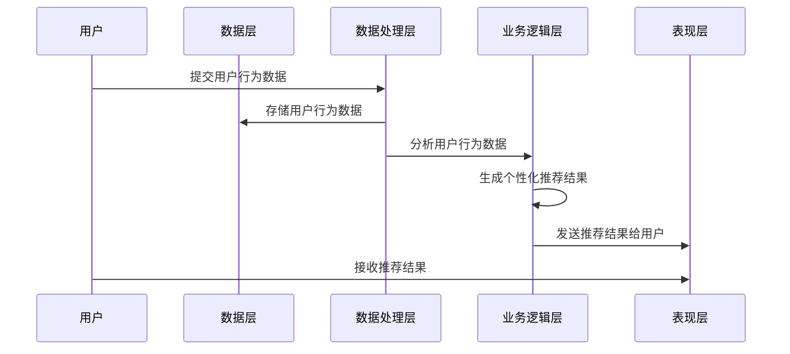
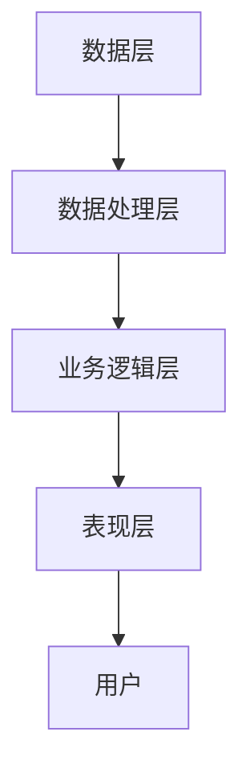
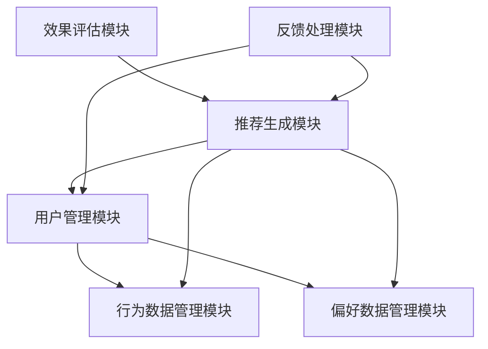
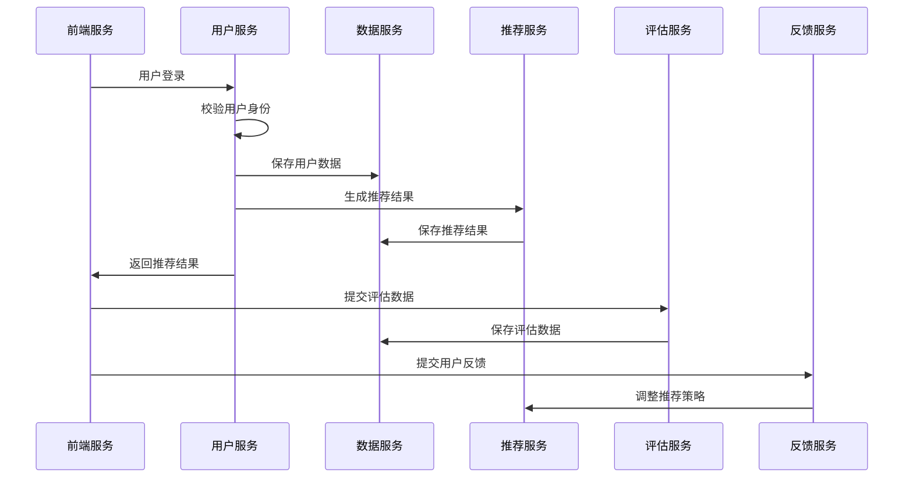
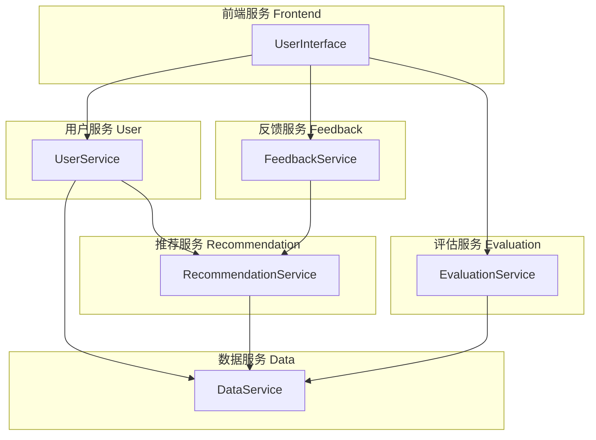
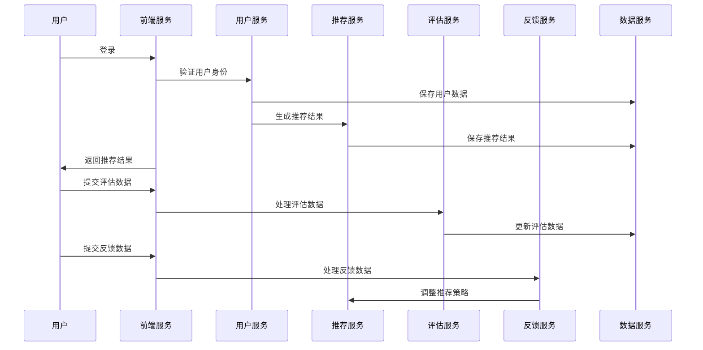

                 


## 第1章：问题背景

### 1.1 AI Agent的定义与作用

人工智能（AI）作为一种能够模拟、延伸和扩展人类智能的技术，近年来在全球范围内取得了迅猛的发展。在众多AI应用场景中，AI Agent因其高度自动化和智能化特点，成为了一个备受关注的研究方向。AI Agent，即人工智能代理，是指具备一定智能的计算机程序，能够在复杂环境中自主执行任务、进行决策和学习。

AI Agent的核心作用在于提升企业运营效率、优化用户体验和增强业务创新。具体来说，AI Agent可以应用于如下几个方面：

1. **客户服务与支持**：AI Agent可以通过自然语言处理（NLP）和机器学习技术，实现与客户的智能对话，提供24/7全天候的客户服务。这种自动化的客户支持不仅能提高响应速度，还能降低企业的运营成本。

2. **个性化推荐系统**：AI Agent可以分析用户的历史行为数据，根据用户的兴趣和行为模式，为其推荐个性化的产品或服务，从而提高用户满意度和忠诚度。

3. **智能决策支持**：AI Agent可以通过数据分析和预测模型，为企业提供实时的决策支持，帮助企业更好地应对市场变化和竞争压力。

4. **自动化流程优化**：AI Agent可以自动化执行一系列业务流程，减少人工干预，提高工作效率，降低错误率。

### 1.2 企业客户体验个性化的需求

在当今市场竞争日益激烈的背景下，企业越来越意识到客户体验个性化的重要性。个性化客户体验不仅能提升客户的满意度，还能增加客户忠诚度和转化率。以下是一些企业客户体验个性化的主要需求：

1. **个性化产品推荐**：企业需要根据客户的兴趣和行为数据，为其推荐个性化的产品或服务。这不仅能提高客户的购买意愿，还能增加销售额。

2. **个性化营销活动**：企业需要根据客户的数据，设计个性化的营销活动，如定制优惠券、促销活动等，以提高客户的参与度和转化率。

3. **个性化客户服务**：企业需要通过AI技术，提供个性化的客户服务，如智能客服、个性化咨询等，以满足不同客户的需求。

4. **个性化定制服务**：企业需要提供个性化的定制服务，如根据客户需求定制产品、服务流程等，以满足客户的个性化需求。

### 1.3 深度应用与效果评估的重要性

在AI Agent应用于企业客户体验个性化的过程中，深度应用与效果评估至关重要。深度应用是指将AI Agent技术深入到企业运营的各个环节，实现真正的智能化和自动化。效果评估则是对AI Agent应用的效果进行量化分析，以评估其对企业价值的影响。

深度应用的重要性在于：

1. **提升企业竞争力**：通过深度应用AI Agent，企业可以更快速地响应市场需求，提高产品和服务的竞争力。

2. **优化业务流程**：AI Agent可以帮助企业自动化和优化业务流程，提高运营效率。

3. **降低运营成本**：AI Agent可以减少人工干预，降低企业的运营成本。

效果评估的重要性在于：

1. **验证应用效果**：通过效果评估，可以验证AI Agent应用的实际效果，判断其是否达到了预期目标。

2. **持续优化改进**：通过效果评估，可以找出AI Agent应用的不足之处，为企业提供优化改进的方向。

3. **决策支持**：效果评估结果可以为企业提供决策支持，帮助企业更好地制定未来发展战略。

### 1.4 本章小结

本章首先介绍了AI Agent的定义与作用，分析了其在企业客户体验个性化中的应用价值。接着，阐述了企业客户体验个性化的主要需求，并强调了深度应用与效果评估的重要性。通过本章的介绍，读者可以初步了解AI Agent在企业客户体验个性化中的背景、意义和重要性。

----------------------------------------------------------------

## 第2章：核心概念与联系

### 2.1 AI Agent的工作原理与分类

AI Agent的工作原理基于人工智能技术，特别是机器学习和深度学习。其核心思想是通过学习和模拟人类思维过程，使计算机能够自主执行任务、进行决策和学习。AI Agent通常具备以下几个基本特性：

1. **感知能力**：AI Agent可以通过传感器或其他方式感知外部环境信息。
2. **理解能力**：AI Agent能够理解并解释感知到的信息，进行语义分析。
3. **决策能力**：AI Agent可以根据感知到的信息和预定的目标，自主做出决策。
4. **行动能力**：AI Agent能够根据决策结果，采取相应的行动。

根据AI Agent的功能和应用场景，可以分为以下几类：

1. **基于规则的AI Agent**：这种AI Agent通过预定义的规则来执行任务，适用于简单的决策场景。
2. **基于数据的AI Agent**：这种AI Agent通过机器学习算法，从数据中学习并做出决策，适用于复杂的决策场景。
3. **基于知识的AI Agent**：这种AI Agent通过知识图谱和本体论来理解复杂场景，并做出决策。
4. **混合型AI Agent**：这种AI Agent结合了基于规则、基于数据和基于知识的特性，适用于更加复杂的决策场景。

### 2.2 企业客户体验个性化的关键要素

企业客户体验个性化的关键要素包括以下几个方面：

1. **用户数据**：用户数据是实施个性化客户体验的基础，包括用户的基本信息、行为数据、偏好数据等。
2. **用户行为分析**：通过对用户行为数据的分析，可以了解用户的兴趣和行为模式，为个性化推荐和营销提供依据。
3. **个性化推荐算法**：个性化推荐算法是核心，通过算法分析用户数据，为用户推荐个性化的产品或服务。
4. **用户体验设计**：用户体验设计是确保客户满意度的关键，需要从用户的角度出发，设计易用、直观的界面和交互流程。
5. **反馈机制**：通过用户的反馈，可以不断优化个性化推荐和用户体验，提高客户满意度。

### 2.3 深度应用与效果评估的方法与工具

深度应用与效果评估是确保AI Agent在企业客户体验个性化中发挥最大作用的关键环节。以下是一些常用的方法和工具：

1. **数据挖掘与分析**：通过数据挖掘技术，对大量用户数据进行深入分析，提取有价值的信息。
2. **机器学习与深度学习**：利用机器学习和深度学习算法，对用户数据进行训练，构建个性化推荐模型。
3. **A/B测试**：通过A/B测试，对比不同算法或策略的效果，找出最优方案。
4. **用户反馈机制**：通过用户反馈，收集用户对个性化服务的满意度，持续优化服务。
5. **业务指标监测**：通过业务指标监测，如点击率、转化率、客户满意度等，评估AI Agent的应用效果。

### 表格：AI Agent与企业客户体验个性化核心概念属性对比

| 核心概念       | 定义与作用                                                     | 关联关系                         |
|----------------|------------------------------------------------------------|----------------------------------|
| AI Agent       | 智能计算机程序，能在复杂环境中自主执行任务、进行决策和学习。 | 与用户数据、用户行为分析紧密相关 |
| 用户数据       | 客户的基本信息、行为数据和偏好数据等。                         | 为AI Agent提供训练数据           |
| 用户行为分析   | 分析用户的行为数据，了解用户的兴趣和行为模式。                 | 为个性化推荐提供依据             |
| 个性化推荐算法 | 根据用户数据和行为分析，为用户推荐个性化的产品或服务。       | 是AI Agent的核心功能             |
| 用户体验设计   | 从用户的角度出发，设计易用、直观的界面和交互流程。           | 是确保客户满意度的关键           |
| 反馈机制       | 收集用户对个性化服务的满意度，持续优化服务。                 | 是优化AI Agent应用效果的重要手段 |

### ER图：AI Agent与企业客户体验个性化实体关系架构

```mermaid
erDiagram
  UserData -->|生成| AIAgent
  UserBehavior -->|分析| AIAgent
  PersonalizedRecommendation -->|基于| AIAgent
  UserExperienceDesign -->|影响| AIAgent
  Feedback -->|反馈| AIAgent
```

在这个ER图中，用户数据、用户行为分析、个性化推荐算法、用户体验设计和反馈机制是AI Agent应用中的关键实体，它们相互关联，共同构成了企业客户体验个性化的架构。

### 2.4 本章小结

本章深入探讨了AI Agent、企业客户体验个性化、深度应用与效果评估等核心概念。通过定义、分类和属性对比，读者可以清晰地理解这些概念的基本原理和应用。同时，通过ER图展示了各概念之间的关联关系，为后续章节的算法原理讲解和系统分析奠定了基础。

----------------------------------------------------------------

## 第2章：核心概念与联系（续）

### 2.4 AI Agent与企业客户体验个性化

AI Agent在企业客户体验个性化中的应用主要体现在以下几个方面：

1. **个性化推荐系统**：AI Agent可以通过深度学习算法分析用户行为数据，为用户推荐个性化的产品或服务。这种推荐系统能够根据用户的历史购买记录、浏览行为和偏好，提供精准的推荐，从而提升用户体验和满意度。

2. **客户行为预测**：AI Agent可以利用机器学习模型对客户的未来行为进行预测，如购买意向、服务需求等。这种预测有助于企业提前做好准备，提供更加个性化的服务。

3. **智能客服系统**：AI Agent可以通过自然语言处理（NLP）技术，实现与客户的智能对话，提供24/7全天候的客户服务。智能客服系统能够快速响应客户请求，解答常见问题，提高客户满意度。

4. **个性化营销活动**：AI Agent可以根据用户的数据和行为分析，设计个性化的营销活动。这种活动能够更好地吸引目标客户，提高转化率。

### 2.5 深度应用与效果评估的方法与工具

深度应用与效果评估是确保AI Agent在企业客户体验个性化中发挥最大作用的关键环节。以下是一些常用的方法和工具：

1. **数据挖掘与分析**：数据挖掘技术可以帮助企业从大量用户数据中提取有价值的信息，为AI Agent的训练和应用提供数据支持。

2. **机器学习与深度学习**：利用机器学习和深度学习算法，可以构建高效的AI模型，提高个性化推荐的准确性和预测能力。

3. **A/B测试**：通过A/B测试，可以对比不同算法或策略的效果，找到最优的方案，并不断优化AI Agent的应用。

4. **用户反馈机制**：用户反馈是优化AI Agent应用的重要手段。通过收集用户的反馈，可以及时发现问题和改进服务。

5. **业务指标监测**：通过业务指标监测，如点击率、转化率、客户满意度等，可以评估AI Agent的应用效果，并据此进行优化。

### 表格：AI Agent与企业客户体验个性化核心概念属性对比

| 核心概念       | 定义与作用                                                     | 关联关系                         |
|----------------|------------------------------------------------------------|----------------------------------|
| AI Agent       | 智能计算机程序，能在复杂环境中自主执行任务、进行决策和学习。 | 与用户数据、用户行为分析紧密相关 |
| 用户数据       | 客户的基本信息、行为数据和偏好数据等。                         | 为AI Agent提供训练数据           |
| 用户行为分析   | 分析用户的行为数据，了解用户的兴趣和行为模式。                 | 为个性化推荐提供依据             |
| 个性化推荐算法 | 根据用户数据和行为分析，为用户推荐个性化的产品或服务。       | 是AI Agent的核心功能             |
| 用户体验设计   | 从用户的角度出发，设计易用、直观的界面和交互流程。           | 是确保客户满意度的关键           |
| 反馈机制       | 收集用户对个性化服务的满意度，持续优化服务。                 | 是优化AI Agent应用效果的重要手段 |

### ER图：AI Agent与企业客户体验个性化实体关系架构

```mermaid
erDiagram
  User -->|产生| BehaviorData
  User -->|反馈| Feedback
  AI -->|分析| BehaviorData
  AI -->|优化| Feedback
  Personalized -->|基于| AI
  UX -->|设计| Personalized
```

在这个ER图中，用户（User）是系统的核心，其行为数据（BehaviorData）和反馈（Feedback）是AI Agent进行决策和优化的基础。AI Agent通过分析用户数据生成个性化推荐（Personalized），而用户体验设计（UX）则基于个性化推荐进行设计。同时，用户的反馈也用于不断优化AI Agent的性能。

### 2.6 本章小结

本章深入探讨了AI Agent、企业客户体验个性化、深度应用与效果评估等核心概念。通过定义、分类和属性对比，读者可以清晰地理解这些概念的基本原理和应用。同时，通过ER图展示了各概念之间的关联关系，为后续章节的算法原理讲解和系统分析奠定了基础。

----------------------------------------------------------------

## 第2章：核心概念与联系（续）

### 2.5 AI Agent在个性化推荐系统中的应用

#### 2.5.1 个性化推荐系统的基本原理

个性化推荐系统是一种能够根据用户的兴趣和行为，自动推荐相关产品或内容的技术。其基本原理主要包括以下几方面：

1. **内容过滤**：基于用户的历史行为和偏好，为用户推荐相似的内容。例如，当用户喜欢某篇文章时，系统会推荐类似的文章。
2. **协同过滤**：通过分析用户之间的行为模式，找到相似的用户群体，并推荐这些用户喜欢的商品或服务。
3. **基于模型的推荐**：利用机器学习算法，建立用户和物品之间的关系模型，根据模型预测用户可能感兴趣的新内容。

#### 2.5.2 AI Agent在个性化推荐系统中的应用

AI Agent在个性化推荐系统中的应用主要体现在以下几个方面：

1. **用户行为分析**：AI Agent可以分析用户的浏览记录、购买历史、搜索关键词等行为数据，了解用户的兴趣和需求。
2. **实时推荐**：AI Agent可以利用深度学习算法，实时分析用户行为，为用户推荐个性化的产品或内容。
3. **推荐策略优化**：AI Agent可以根据用户的反馈和推荐效果，不断优化推荐策略，提高推荐系统的准确性。

#### 2.5.3 个性化推荐系统的挑战与解决方案

个性化推荐系统在实际应用中面临一些挑战，如数据稀疏性、冷启动问题、隐私保护等。针对这些挑战，AI Agent提供了一些解决方案：

1. **数据增强**：通过引入更多的用户数据和上下文信息，增强推荐系统的数据基础，缓解数据稀疏性问题。
2. **迁移学习**：利用迁移学习方法，将一个领域中的知识迁移到另一个领域，解决新用户和新商品的冷启动问题。
3. **隐私保护**：通过数据加密、匿名化等技术，保护用户的隐私信息，同时保证推荐系统的效果。

### 2.6 AI Agent在客户行为预测中的应用

#### 2.6.1 客户行为预测的基本原理

客户行为预测是一种基于历史数据，预测客户未来行为的技术。其基本原理主要包括以下几方面：

1. **时间序列分析**：通过分析客户行为的时间序列数据，预测未来的行为趋势。
2. **关联规则挖掘**：通过挖掘客户行为数据中的关联规则，预测客户可能采取的行为。
3. **机器学习算法**：利用机器学习算法，建立客户行为预测模型，对未来的行为进行预测。

#### 2.6.2 AI Agent在客户行为预测中的应用

AI Agent在客户行为预测中的应用主要体现在以下几个方面：

1. **历史数据学习**：AI Agent可以学习用户的历史行为数据，建立预测模型。
2. **实时预测**：AI Agent可以利用实时数据分析，预测客户未来的行为，为企业提供决策支持。
3. **动态调整**：AI Agent可以根据预测结果，动态调整预测策略，提高预测的准确性。

#### 2.6.3 客户行为预测的挑战与解决方案

客户行为预测在实际应用中面临一些挑战，如数据质量、模型泛化能力等。针对这些挑战，AI Agent提供了一些解决方案：

1. **数据预处理**：通过数据清洗、去噪等技术，提高数据质量，为预测模型提供更好的数据基础。
2. **模型优化**：通过调整模型参数、增加特征等方式，优化模型性能，提高预测准确性。
3. **迁移学习**：通过迁移学习方法，将一个领域中的知识迁移到另一个领域，提高模型的泛化能力。

### 2.7 AI Agent在客户满意度评估中的应用

#### 2.7.1 客户满意度评估的基本原理

客户满意度评估是一种通过测量和分析客户满意度，评估产品或服务质量的技术。其基本原理主要包括以下几方面：

1. **满意度测量**：通过问卷调查、用户反馈等方式，收集客户对产品或服务的满意度数据。
2. **数据分析**：通过数据分析技术，分析客户满意度数据，找出影响满意度的关键因素。
3. **评估指标**：建立评估指标体系，对产品或服务质量进行量化评估。

#### 2.7.2 AI Agent在客户满意度评估中的应用

AI Agent在客户满意度评估中的应用主要体现在以下几个方面：

1. **自动数据分析**：AI Agent可以自动分析客户满意度数据，快速识别关键因素。
2. **动态调整评估指标**：AI Agent可以根据客户满意度变化，动态调整评估指标，确保评估的准确性。
3. **预测未来满意度**：AI Agent可以利用机器学习模型，预测未来的客户满意度，为企业提供决策支持。

#### 2.7.3 客户满意度评估的挑战与解决方案

客户满意度评估在实际应用中面临一些挑战，如数据收集困难、指标量化等。针对这些挑战，AI Agent提供了一些解决方案：

1. **多渠道数据收集**：通过多渠道（如社交媒体、在线评论等）收集客户反馈，提高数据收集的全面性。
2. **自适应评估指标**：通过自适应技术，根据客户反馈动态调整评估指标，确保评估的实时性和准确性。
3. **数据挖掘技术**：利用数据挖掘技术，从大量非结构化数据中提取有价值的信息，提高评估的准确性。

### 2.8 本章小结

本章深入探讨了AI Agent在个性化推荐系统、客户行为预测和客户满意度评估中的应用。通过定义、原理和应用实例，读者可以全面了解AI Agent在这些领域的应用价值。同时，本章还分析了AI Agent在这些应用中的挑战和解决方案，为后续章节的算法原理讲解和系统分析奠定了基础。

----------------------------------------------------------------

## 第3章：算法原理讲解

### 3.1 深度学习基础

#### 3.1.1 深度学习的基本原理

深度学习是机器学习的一个分支，其核心思想是通过构建多层的神经网络模型，对数据进行层次化的特征提取和学习。深度学习的基本原理包括以下几个方面：

1. **神经网络**：神经网络是由多个神经元组成的计算模型，每个神经元相当于一个简单的函数单元，能够接收输入信息并进行计算。通过多层神经元的组合，可以构建出复杂的非线性模型。
2. **前向传播和反向传播**：在神经网络中，前向传播是指将输入数据通过网络的各个层，逐层计算出输出；反向传播是指通过输出误差，反向调整网络参数，使网络逐渐逼近最优解。
3. **激活函数**：激活函数是神经网络中的一个重要组成部分，用于引入非线性特性。常见的激活函数包括Sigmoid、ReLU和Tanh等。

#### 3.1.2 神经网络与深度神经网络

神经网络可以分为单层神经网络和多层神经网络。单层神经网络主要用于简单的线性分类或回归任务，而多层神经网络（即深度神经网络）则能够处理更复杂的问题。

1. **单层神经网络**：单层神经网络只有一个输入层和一个输出层，通常用于简单的线性分类或回归任务。
2. **深度神经网络**：深度神经网络由多个隐含层组成，能够对输入数据进行深度层次的特征提取和学习。深度神经网络在图像识别、语音识别和自然语言处理等领域取得了显著成果。

#### 3.1.3 深度学习框架

深度学习框架是用于实现深度学习算法的工具集，常见的深度学习框架包括TensorFlow、PyTorch和Keras等。

1. **TensorFlow**：TensorFlow是由Google开源的深度学习框架，具有强大的计算图能力和灵活的API接口。
2. **PyTorch**：PyTorch是由Facebook开源的深度学习框架，具有动态计算图和易于使用的API，适合研究和开发。
3. **Keras**：Keras是一个高层次的深度学习API，能够兼容TensorFlow和Theano，提供了简洁易用的接口。

### 3.2 AI Agent在企业客户体验个性化中的应用

#### 3.2.1 AI Agent在个性化推荐中的应用

个性化推荐是AI Agent在企业客户体验个性化中的一个重要应用。以下是一个基于协同过滤算法的个性化推荐系统的工作流程：

1. **用户-项目矩阵构建**：根据用户的历史行为数据，构建用户-项目矩阵，其中行表示用户，列表示项目，矩阵中的元素表示用户对项目的评分。
2. **相似度计算**：计算用户之间的相似度，常用的相似度计算方法包括余弦相似度、皮尔逊相关系数等。
3. **推荐列表生成**：根据用户之间的相似度，为每个用户生成推荐列表。对于每个用户，选择与其他用户最相似的邻居，从邻居的评分中提取评分预测，生成推荐列表。

#### 数学模型和公式：

假设用户-项目矩阵为 \( R \in \mathbb{R}^{m \times n} \)，其中 \( m \) 表示用户数量，\( n \) 表示项目数量。相似度计算公式如下：

\[ \text{similarity}(u, v) = \frac{R_{uv} \cdot (R_u \cdot R_v)^{0.5}}{\|R_u\| \cdot \|R_v\|} \]

其中，\( R_{uv} \) 表示用户 \( u \) 和用户 \( v \) 对项目 \( i \) 的共同评分，\( R_u \) 和 \( R_v \) 分别表示用户 \( u \) 和用户 \( v \) 的评分向量，\( \| \cdot \| \) 表示向量的欧几里得范数。

推荐列表生成公式如下：

\[ \text{prediction}(u, i) = \sum_{v \in \mathcal{N}(u)} \text{similarity}(u, v) \cdot R_{iv} \]

其中，\( \mathcal{N}(u) \) 表示与用户 \( u \) 最相似的邻居集合，\( \text{prediction}(u, i) \) 表示用户 \( u \) 对项目 \( i \) 的评分预测。

#### 3.2.2 AI Agent在客户行为预测中的应用

AI Agent在客户行为预测中的应用主要包括基于时间序列分析和机器学习模型的预测方法。

1. **时间序列分析**：时间序列分析是一种用于分析时间序列数据，预测未来趋势的方法。常用的方法包括自回归移动平均模型（ARIMA）、长期短期记忆网络（LSTM）等。

2. **机器学习模型**：机器学习模型可以通过学习历史数据，预测客户未来的行为。常用的模型包括线性回归、决策树、随机森林等。

#### 数学模型和公式：

假设时间序列数据为 \( X = [x_1, x_2, \ldots, x_n] \)，其中 \( x_t \) 表示第 \( t \) 时刻的观测值。线性回归模型的公式如下：

\[ y_t = \beta_0 + \beta_1 x_t + \epsilon_t \]

其中，\( y_t \) 表示预测值，\( \beta_0 \) 和 \( \beta_1 \) 分别为模型参数，\( \epsilon_t \) 为误差项。

对于LSTM模型，其预测公式可以表示为：

\[ h_t = \text{LSTM}(h_{t-1}, x_t) \]

其中，\( h_t \) 表示第 \( t \) 时刻的隐藏状态，\( \text{LSTM} \) 表示LSTM单元。

#### 3.2.3 AI Agent在客户满意度评估中的应用

AI Agent在客户满意度评估中的应用主要包括基于机器学习模型的评分预测和基于自然语言处理（NLP）的情感分析。

1. **机器学习模型**：机器学习模型可以通过学习历史数据，预测客户的满意度评分。常用的模型包括支持向量机（SVM）、神经网络等。

2. **NLP情感分析**：NLP情感分析可以通过分析客户评论中的情感倾向，预测客户的满意度。常用的方法包括情感分类和情感极性分析。

#### 数学模型和公式：

假设客户评论数据为 \( D = [d_1, d_2, \ldots, d_n] \)，其中 \( d_t \) 表示第 \( t \) 个评论。SVM模型的公式如下：

\[ f(x) = \text{sign}(\sum_{i=1}^n w_i y_i \cdot x + b) \]

其中，\( x \) 表示输入特征向量，\( w_i \) 和 \( b \) 分别为模型参数和偏置，\( y_i \) 为标签。

对于神经网络模型，其预测公式可以表示为：

\[ y = \text{softmax}(\text{neural\_network}(x; \theta)) \]

其中，\( \text{neural\_network} \) 表示神经网络，\( \theta \) 为模型参数。

#### 3.3 本章小结

本章深入讲解了深度学习的基本原理、神经网络与深度神经网络、深度学习框架以及AI Agent在企业客户体验个性化中的应用。通过定义、数学模型和公式，读者可以全面了解深度学习技术在AI Agent中的应用价值。同时，本章还介绍了AI Agent在个性化推荐系统、客户行为预测和客户满意度评估中的具体应用方法，为后续章节的系统设计与实现奠定了基础。

----------------------------------------------------------------

## 第3章：算法原理讲解（续）

### 3.3 AI Agent在个性化推荐系统中的具体应用

#### 3.3.1 算法原理

个性化推荐系统的核心在于构建用户和物品之间的相似度模型，并利用该模型为用户生成推荐列表。协同过滤算法是其中的一种常见方法，分为基于用户的协同过滤（User-based Collaborative Filtering, UCF）和基于物品的协同过滤（Item-based Collaborative Filtering, ICF）。

1. **基于用户的协同过滤（User-based Collaborative Filtering, UCF）**

   - **相似度计算**：首先计算用户之间的相似度，常用的相似度计算方法包括余弦相似度和皮尔逊相关系数。
   - **邻居选择**：根据相似度矩阵选择与目标用户最相似的K个邻居用户。
   - **推荐生成**：为每个邻居用户的评分进行加权求和，得到目标用户对未知物品的预测评分。
   - **推荐列表生成**：将预测评分排序，选择评分最高的物品作为推荐结果。

   相似度计算公式：

   \[ \text{similarity}(u, v) = \frac{\text{dotProduct}(R_u, R_v)}{\|R_u\| \|R_v\|} \]

   其中，\( R_u \) 和 \( R_v \) 分别表示用户 \( u \) 和用户 \( v \) 的评分向量，\( \| \cdot \| \) 表示向量的欧几里得范数。

2. **基于物品的协同过滤（Item-based Collaborative Filtering, ICF）**

   - **相似度计算**：首先计算物品之间的相似度，常用的相似度计算方法包括余弦相似度和皮尔逊相关系数。
   - **邻居选择**：根据物品相似度矩阵选择与目标物品最相似的K个物品。
   - **推荐生成**：为每个邻居物品的评分进行加权求和，得到目标用户对未知物品的预测评分。
   - **推荐列表生成**：将预测评分排序，选择评分最高的物品作为推荐结果。

   相似度计算公式：

   \[ \text{similarity}(i, j) = \frac{\text{dotProduct}(R_i, R_j)}{\|R_i\| \|R_j\|} \]

   其中，\( R_i \) 和 \( R_j \) 分别表示物品 \( i \) 和物品 \( j \) 的评分向量，\( \| \cdot \| \) 表示向量的欧几里得范数。

#### 3.3.2 数学模型和公式

1. **预测评分公式**

   基于用户的协同过滤：

   \[ \text{prediction}_{u, i} = \sum_{v \in \mathcal{N}(u)} \text{similarity}(u, v) \cdot R_{vi} \]

   其中，\( \mathcal{N}(u) \) 表示与用户 \( u \) 最相似的邻居用户集合，\( R_{vi} \) 表示邻居用户 \( v \) 对物品 \( i \) 的评分。

   基于物品的协同过滤：

   \[ \text{prediction}_{u, i} = \sum_{j \in \mathcal{N}(i)} \text{similarity}(i, j) \cdot R_{uj} \]

   其中，\( \mathcal{N}(i) \) 表示与物品 \( i \) 最相似的邻居物品集合，\( R_{uj} \) 表示用户 \( u \) 对邻居物品 \( j \) 的评分。

2. **推荐列表生成**

   根据预测评分，将所有未知物品的预测评分进行排序，选择评分最高的前N个物品作为推荐列表。

#### 3.3.3 代码示例

以下是一个基于Python和Scikit-learn库实现的基于用户的协同过滤算法的代码示例：

```python
from sklearn.metrics.pairwise import cosine_similarity
import numpy as np

# 假设用户-物品评分矩阵为R
R = np.array([[5, 3, 0, 1],
              [4, 0, 0, 1],
              [1, 1, 0, 5],
              [1, 0, 0, 4],
              [2, 5, 0, 3]])

# 计算用户之间的相似度矩阵
similarity_matrix = cosine_similarity(R)

# 假设目标用户为第3个用户
target_user = 2

# 找到与目标用户最相似的邻居用户
neighbor_users = np.argsort(similarity_matrix[target_user])[1:6]

# 生成推荐列表
recommendations = []
for neighbor_user in neighbor_users:
    for item in range(R.shape[1]):
        if R[neighbor_user][item] != 0:
            prediction = similarity_matrix[target_user][neighbor_user] * R[neighbor_user][item]
            recommendations.append((item, prediction))

# 对推荐列表进行排序
recommendations.sort(key=lambda x: x[1], reverse=True)

# 输出推荐列表
print("Recommended items for user 3:")
for item, prediction in recommendations:
    print(f"Item {item} with prediction {prediction}")
```

#### 3.3.4 个性化推荐系统的挑战与优化

个性化推荐系统在实际应用中面临一些挑战，如数据稀疏性、推荐质量、冷启动问题等。以下是一些常见的挑战和优化方法：

1. **数据稀疏性**：由于用户和物品之间的交互数据有限，导致评分矩阵非常稀疏。常见的优化方法包括数据增强、矩阵分解等。

2. **推荐质量**：推荐系统需要生成高质量的推荐列表，以提高用户满意度。常见的优化方法包括基于内容的推荐、混合推荐系统等。

3. **冷启动问题**：对于新用户或新物品，由于缺乏足够的历史数据，难以生成准确的推荐。常见的优化方法包括基于内容的推荐、协同过滤与基于内容的混合方法等。

#### 3.3.5 本章小结

本章详细讲解了AI Agent在个性化推荐系统中的应用，包括算法原理、数学模型和代码示例。通过本章的学习，读者可以了解个性化推荐系统的工作原理，掌握协同过滤算法的原理和应用，为后续章节的系统设计与实现打下基础。

----------------------------------------------------------------

## 第4章：系统分析与架构设计方案

### 4.1 问题场景介绍

在企业客户体验个性化中，问题场景主要涉及以下几个方面：

1. **用户数据收集与存储**：企业需要收集用户的基本信息、行为数据和偏好数据，并将其存储在数据库中，以便后续分析和应用。
2. **用户行为分析**：通过对用户数据的分析，了解用户的兴趣和行为模式，为企业提供个性化推荐和营销策略。
3. **个性化推荐系统**：根据用户的行为数据和分析结果，为用户推荐个性化的产品或服务。
4. **效果评估与优化**：通过评估个性化推荐系统的效果，不断优化和调整推荐策略，提高用户满意度和转化率。

### 4.2 系统功能设计

为了实现上述问题场景，系统需要具备以下核心功能：

1. **用户数据管理**：包括用户数据的收集、存储、查询和更新等功能，确保用户数据的完整性和准确性。
2. **用户行为分析**：通过对用户数据的分析，提取用户的行为特征和偏好，为个性化推荐提供依据。
3. **个性化推荐**：根据用户的行为特征和偏好，利用机器学习算法生成个性化的推荐结果，包括商品推荐、活动推荐等。
4. **推荐结果评估**：通过评估推荐结果的效果，如点击率、转化率、客户满意度等，持续优化推荐策略。
5. **用户反馈收集与处理**：收集用户对推荐结果的反馈，用于进一步优化推荐系统。

### 4.3 系统架构设计

系统架构设计旨在实现系统的可扩展性、高可用性和灵活性。以下是一个典型的系统架构设计：

#### 4.3.1 系统架构概述

系统架构可以分为以下几个层次：

1. **数据层**：包括用户数据存储、日志存储等，提供数据的持久化存储。
2. **数据处理层**：包括用户数据收集、数据清洗、数据预处理等，为上层应用提供高质量的数据。
3. **业务逻辑层**：包括用户行为分析、个性化推荐、效果评估等，实现系统的核心功能。
4. **表现层**：包括Web前端、API接口等，提供用户交互界面和外部系统接入接口。

#### 4.3.2 系统架构图展示



#### 4.3.3 系统接口设计

系统接口设计主要包括以下几个方面：

1. **用户数据接口**：提供用户数据上传、查询、更新等功能，支持RESTful API接口。
2. **推荐结果接口**：提供个性化推荐结果的查询和获取功能，支持RESTful API接口。
3. **效果评估接口**：提供推荐效果评估的数据查询和统计功能，支持RESTful API接口。
4. **反馈处理接口**：提供用户反馈的收集、处理和响应功能，支持RESTful API接口。

#### 4.3.4 系统交互设计

系统交互设计主要描述系统内部各组件之间的交互流程，以下是一个典型的系统交互设计：

1. **用户数据收集**：用户通过Web前端提交行为数据，数据处理层接收并存储数据。
2. **用户行为分析**：数据处理层对存储的用户行为数据进行分析，提取用户特征，业务逻辑层接收分析结果。
3. **个性化推荐**：业务逻辑层根据用户特征和偏好，生成个性化的推荐结果，并通过接口发送给用户。
4. **推荐效果评估**：用户通过Web前端提交反馈数据，数据处理层接收并存储反馈数据，业务逻辑层对反馈数据进行分析，持续优化推荐策略。
5. **用户反馈处理**：用户通过Web前端提交反馈，数据处理层接收并处理反馈，业务逻辑层根据反馈结果调整推荐策略。

### 4.4 本章小结

本章详细介绍了系统分析与架构设计方案，包括问题场景介绍、系统功能设计、系统架构设计、系统接口设计和系统交互设计。通过本章的学习，读者可以了解系统设计的基本原则和流程，掌握系统架构和接口设计的关键技术，为后续章节的系统实现和项目实战奠定基础。

----------------------------------------------------------------

## 第4章：系统分析与架构设计方案（续）

### 4.4 系统架构设计

#### 4.4.1 系统架构概述

本系统的架构设计采用了分层架构模式，以确保系统的模块化和可扩展性。系统主要分为以下几个层次：

1. **数据层**：负责数据的存储和管理，包括用户数据、行为数据、推荐结果数据等。数据层采用了分布式数据库架构，以提高数据存储和访问的效率。
2. **数据处理层**：负责数据的收集、清洗、预处理和特征提取等，为上层业务逻辑层提供高质量的数据支持。
3. **业务逻辑层**：负责实现系统的核心功能，包括用户行为分析、个性化推荐、效果评估等。业务逻辑层采用了微服务架构，以实现各模块的独立部署和扩展。
4. **表现层**：负责与用户的交互，提供Web前端和API接口。表现层采用了前后端分离架构，以提高系统的可维护性和用户体验。

#### 4.4.2 系统架构图展示



在上述架构图中，用户通过表现层提交请求，表现层将请求转发给业务逻辑层，业务逻辑层处理后返回结果给表现层，最终由表现层呈现给用户。数据处理层和业务逻辑层通过API接口进行数据交互，数据层则负责数据的存储和管理。

#### 4.4.3 系统接口设计

系统接口设计旨在实现各组件之间的松耦合和高效通信。以下为系统的主要接口设计：

1. **用户数据接口**：用于用户数据的收集、查询和更新。接口规范如下：
   - **POST /users**：创建新用户
   - **GET /users/{userId}**：查询用户信息
   - **PUT /users/{userId}**：更新用户信息
   - **DELETE /users/{userId}**：删除用户

2. **行为数据接口**：用于行为数据的收集和查询。接口规范如下：
   - **POST /behaviors**：提交用户行为数据
   - **GET /behaviors/{behaviorId}**：查询行为数据
   - **DELETE /behaviors/{behaviorId}**：删除行为数据

3. **推荐结果接口**：用于获取个性化推荐结果。接口规范如下：
   - **GET /recommendations/{userId}**：获取用户个性化推荐结果

4. **效果评估接口**：用于评估推荐效果。接口规范如下：
   - **GET /evaluations**：获取推荐效果评估结果
   - **POST /evaluations**：提交推荐效果评估数据

#### 4.4.4 系统交互设计

系统交互设计描述了各组件之间的交互流程，以下是系统的主要交互设计：

1. **用户行为数据收集**：用户通过Web前端提交行为数据，数据处理层接收并存储数据。
2. **用户行为分析**：数据处理层对存储的用户行为数据进行分析，提取用户特征，业务逻辑层接收分析结果。
3. **个性化推荐**：业务逻辑层根据用户特征和偏好，生成个性化的推荐结果，并通过接口发送给用户。
4. **推荐效果评估**：用户通过Web前端提交反馈数据，数据处理层接收并处理反馈，业务逻辑层根据反馈结果调整推荐策略。
5. **用户反馈处理**：用户通过Web前端提交反馈，数据处理层接收并处理反馈，业务逻辑层根据反馈结果调整推荐策略。

### 4.5 系统交互设计

系统交互设计描述了系统内部各组件之间的交互流程，以下是系统的主要交互设计：

1. **用户数据交互**：用户通过Web前端提交用户数据，表现层接收并解析数据，将数据发送给业务逻辑层。业务逻辑层处理后，返回结果给表现层，最终由表现层呈现给用户。

2. **行为数据交互**：用户通过Web前端提交行为数据，表现层接收并解析数据，将数据发送给业务逻辑层。业务逻辑层处理后，返回结果给表现层，最终由表现层呈现给用户。

3. **推荐结果交互**：用户通过Web前端提交请求获取个性化推荐结果，表现层接收请求，将请求转发给业务逻辑层。业务逻辑层生成推荐结果后，返回给表现层，最终由表现层呈现给用户。

4. **效果评估交互**：用户通过Web前端提交推荐效果评估数据，表现层接收并解析数据，将数据发送给业务逻辑层。业务逻辑层处理后，返回结果给表现层，最终由表现层呈现给用户。

5. **用户反馈交互**：用户通过Web前端提交反馈数据，表现层接收并解析数据，将数据发送给业务逻辑层。业务逻辑层处理后，返回结果给表现层，最终由表现层呈现给用户。

#### 4.5.1 系统交互流程

以下是系统交互流程的详细描述：

1. **用户数据交互**：
   - 用户访问Web前端，填写并提交用户数据。
   - 表现层解析用户数据，将数据封装成API请求。
   - 表现层发送API请求到业务逻辑层。
   - 业务逻辑层处理用户数据，生成用户对象。
   - 业务逻辑层将用户对象存储到数据层。
   - 业务逻辑层返回处理结果给表现层。
   - 表现层呈现处理结果给用户。

2. **行为数据交互**：
   - 用户访问Web前端，填写并提交行为数据。
   - 表现层解析用户数据，将数据封装成API请求。
   - 表现层发送API请求到业务逻辑层。
   - 业务逻辑层处理行为数据，生成行为对象。
   - 业务逻辑层将行为对象存储到数据层。
   - 业务逻辑层返回处理结果给表现层。
   - 表现层呈现处理结果给用户。

3. **推荐结果交互**：
   - 用户访问Web前端，提交获取个性化推荐结果的请求。
   - 表现层接收请求，将请求转发到业务逻辑层。
   - 业务逻辑层根据用户数据生成个性化推荐结果。
   - 业务逻辑层将推荐结果返回给表现层。
   - 表现层呈现推荐结果给用户。

4. **效果评估交互**：
   - 用户访问Web前端，提交推荐效果评估数据。
   - 表现层接收并解析数据，将数据发送给业务逻辑层。
   - 业务逻辑层处理效果评估数据，生成评估结果。
   - 业务逻辑层将评估结果返回给表现层。
   - 表现层呈现评估结果给用户。

5. **用户反馈交互**：
   - 用户访问Web前端，提交用户反馈。
   - 表现层接收并解析用户反馈，将数据发送给业务逻辑层。
   - 业务逻辑层处理用户反馈，生成反馈处理结果。
   - 业务逻辑层将反馈处理结果返回给表现层。
   - 表现层呈现反馈处理结果给用户。

### 4.6 本章小结

本章详细介绍了系统的架构设计，包括系统架构概述、系统架构图展示、系统接口设计和系统交互设计。通过本章的学习，读者可以了解系统设计的基本原则和流程，掌握系统架构和接口设计的关键技术，为后续章节的系统实现和项目实战奠定基础。

----------------------------------------------------------------

## 第4章：系统分析与架构设计方案（续）

### 4.5 系统功能设计

在系统功能设计部分，我们将详细介绍企业客户体验个性化系统的功能模块设计，包括领域模型设计和功能模块设计。

#### 4.5.1 领域模型设计

领域模型是系统设计的核心，它定义了系统中各种对象及其关系。以下是企业客户体验个性化系统的领域模型设计：

1. **用户**：用户是系统的核心实体，包含用户的基本信息，如用户ID、姓名、联系方式等。
2. **行为数据**：行为数据记录用户的操作行为，如浏览历史、购买记录、搜索关键词等。
3. **偏好数据**：偏好数据记录用户的个性化喜好，如喜欢的商品类别、偏好品牌等。
4. **推荐结果**：推荐结果是系统为用户生成的个性化推荐，包括推荐的商品、活动和内容等。
5. **评估数据**：评估数据记录推荐效果的数据，如点击率、转化率、用户满意度等。
6. **反馈数据**：反馈数据记录用户对推荐结果的反馈，用于系统优化。

以下是一个基于Mermaid的领域模型类图：

```mermaid
classDiagram
    User <<class>> User
    BehaviorData <<class>> BehaviorData
    PreferenceData <<class>> PreferenceData
    Recommendation <<class>> Recommendation
    Evaluation <<class>> Evaluation
    Feedback <<class>> Feedback
    
    User "1" --|has| BehaviorData
    User "1" --|has| PreferenceData
    User "1" --|receives| Recommendation
    User "1" --|provides| Feedback
    Recommendation "1" --|based on| BehaviorData
    Recommendation "1" --|based on| PreferenceData
    Evaluation "1" --|from| Recommendation
```

#### 4.5.2 功能模块设计

功能模块设计是将系统划分为若干个功能模块，每个模块负责实现特定的功能。以下是企业客户体验个性化系统的功能模块设计：

1. **用户管理模块**：负责用户的注册、登录、信息维护等功能。
2. **行为数据管理模块**：负责收集、存储和管理用户的行为数据。
3. **偏好数据管理模块**：负责收集、存储和管理用户的偏好数据。
4. **推荐生成模块**：负责生成个性化的推荐结果，包括商品、活动和内容等。
5. **效果评估模块**：负责评估推荐效果，包括点击率、转化率、用户满意度等。
6. **反馈处理模块**：负责收集、处理用户反馈，用于系统优化。

以下是系统功能模块的关联关系：



### 4.6 系统架构设计

系统架构设计是系统设计的另一个重要方面，它决定了系统的整体结构和运行方式。以下是企业客户体验个性化系统的架构设计：

#### 4.6.1 系统架构概述

系统采用微服务架构，将不同功能模块拆分为独立的服务，以提高系统的可扩展性和灵活性。以下是系统架构的概述：

1. **前端服务**：负责与用户交互，包括用户登录、数据输入、推荐结果展示等。
2. **用户服务**：负责用户管理，包括用户注册、登录、信息维护等。
3. **数据服务**：负责行为数据、偏好数据、推荐结果和评估数据的存储和管理。
4. **推荐服务**：负责生成个性化的推荐结果。
5. **评估服务**：负责评估推荐效果。
6. **反馈服务**：负责收集和处理用户反馈。

以下是系统架构的Mermaid图：



#### 4.6.2 系统架构图展示

以下是企业客户体验个性化系统的架构图：



### 4.7 系统接口设计

系统接口设计是确保各服务之间能够有效通信的重要环节。以下是企业客户体验个性化系统的接口设计：

#### 4.7.1 接口设计原则

1. **RESTful风格**：系统采用RESTful风格进行接口设计，便于理解和实现。
2. **标准化**：接口设计遵循RESTful API设计标准，包括URL结构、HTTP方法、请求和响应格式等。
3. **安全性**：接口设计考虑安全性，包括身份验证、权限控制等。
4. **易用性**：接口设计注重易用性，提供清晰的文档和示例，便于开发者使用。

#### 4.7.2 接口功能设计

以下是系统的主要接口功能设计：

1. **用户管理接口**：
   - **POST /users**：创建新用户。
   - **GET /users/{userId}**：查询用户信息。
   - **PUT /users/{userId}**：更新用户信息。
   - **DELETE /users/{userId}**：删除用户。

2. **行为数据接口**：
   - **POST /behaviors**：提交用户行为数据。
   - **GET /behaviors/{behaviorId}**：查询行为数据。
   - **DELETE /behaviors/{behaviorId}**：删除行为数据。

3. **偏好数据接口**：
   - **POST /preferences**：提交用户偏好数据。
   - **GET /preferences/{preferenceId}**：查询偏好数据。
   - **DELETE /preferences/{preferenceId}**：删除偏好数据。

4. **推荐结果接口**：
   - **GET /recommendations/{userId}**：获取用户个性化推荐结果。

5. **评估数据接口**：
   - **GET /evaluations**：获取推荐效果评估结果。
   - **POST /evaluations**：提交推荐效果评估数据。

6. **反馈数据接口**：
   - **POST /feedbacks**：提交用户反馈数据。

#### 4.7.3 接口示例

以下是用户管理接口的示例：

```plaintext
POST /users
{
  "id": "user123",
  "name": "John Doe",
  "email": "john.doe@example.com",
  "password": "password123"
}

Response:
HTTP/1.1 201 Created
{
  "status": "success",
  "message": "User created successfully",
  "user": {
    "id": "user123",
    "name": "John Doe",
    "email": "john.doe@example.com",
    "password": "password123"
  }
}
```

### 4.8 系统交互设计

系统交互设计描述了各服务之间的交互流程和交互协议。以下是企业客户体验个性化系统的交互设计：

#### 4.8.1 系统交互流程

以下是系统的主要交互流程：

1. **用户登录**：用户通过前端服务提交登录请求，用户服务进行身份验证，并将验证结果返回给前端服务。
2. **数据提交**：用户通过前端服务提交行为数据、偏好数据和反馈数据，用户服务将数据存储到数据服务。
3. **推荐生成**：用户服务根据用户数据和偏好数据，调用推荐服务生成个性化推荐结果，并将结果返回给前端服务。
4. **效果评估**：用户通过前端服务提交评估数据，评估服务进行处理并更新数据服务中的评估数据。
5. **反馈处理**：用户通过前端服务提交反馈数据，反馈服务进行处理，并根据反馈调整推荐策略。

#### 4.8.2 系统交互图展示

以下是系统交互图的Mermaid图：



### 4.9 本章小结

本章详细介绍了企业客户体验个性化系统的系统功能设计、系统架构设计、系统接口设计和系统交互设计。通过本章的学习，读者可以了解系统设计的基本原则和流程，掌握系统架构和接口设计的关键技术，为后续章节的系统实现和项目实战奠定基础。

----------------------------------------------------------------

## 第5章：项目实战

### 5.1 环境安装

在开始企业客户体验个性化项目的实战之前，我们需要安装和配置一些必要的软件和环境。以下是安装过程的详细步骤：

#### 5.1.1 硬件环境要求

1. **操作系统**：推荐使用Linux系统，如Ubuntu 18.04或更高版本。
2. **CPU**：至少需要4核CPU，建议使用更强大的CPU以提升性能。
3. **内存**：至少需要8GB内存，建议使用16GB或更多以支持大规模数据处理。
4. **存储**：至少需要100GB的硬盘空间，建议使用SSD以提高读写速度。

#### 5.1.2 软件环境安装

1. **Python**：安装Python 3.8或更高版本。
   ```bash
   sudo apt-get update
   sudo apt-get install python3.8
   sudo apt-get install python3.8-venv
   ```

2. **Anaconda**：安装Anaconda，用于创建和管理虚拟环境。
   ```bash
   wget https://repo.anaconda.com/miniconda/Miniconda3-latest-Linux-x86_64.sh
   bash Miniconda3-latest-Linux-x86_64.sh
   source ~/.bashrc
   ```

3. **JDK**：安装Java Development Kit (JDK)，用于部署Spring Boot应用。
   ```bash
   sudo apt-get install openjdk-8-jdk
   ```

4. **Maven**：安装Apache Maven，用于构建和部署Java项目。
   ```bash
   sudo apt-get install maven
   ```

5. **Node.js**：安装Node.js和npm，用于前端开发。
   ```bash
   curl -sL https://deb.nodesource.com/setup_14.x | sudo -E bash -
   sudo apt-get install -y nodejs
   ```

6. **MongoDB**：安装MongoDB，用于存储用户数据和行为数据。
   ```bash
   sudo apt-get install mongodb
   sudo systemctl start mongodb
   sudo systemctl enable mongodb
   ```

7. **PostgreSQL**：安装PostgreSQL，用于存储评估数据和反馈数据。
   ```bash
   sudo apt-get install postgresql
   sudo systemctl start postgresql
   sudo systemctl enable postgresql
   ```

#### 5.1.3 创建虚拟环境

在安装完所有必要的软件后，我们创建一个虚拟环境，以便管理和隔离项目依赖。
```bash
conda create -n custom_experience python=3.8
conda activate custom_experience
```

#### 5.1.4 安装项目依赖

在虚拟环境中，安装项目所需的依赖。
```bash
conda install -c conda-forge scikit-learn pandas numpy matplotlib
```

### 5.2 系统核心实现

在完成环境安装后，我们开始实现系统的核心功能。以下是系统核心实现的详细步骤：

#### 5.2.1 数据预处理

数据预处理是系统实现的第一步，它包括数据清洗、数据转换和数据归一化等步骤。以下是数据预处理的代码实现：
```python
import pandas as pd
from sklearn.preprocessing import StandardScaler

# 加载数据
data = pd.read_csv('user_data.csv')

# 数据清洗
data.dropna(inplace=True)

# 数据转换
data['age'] = data['age'].astype(float)
data['income'] = data['income'].astype(float)

# 数据归一化
scaler = StandardScaler()
data[['age', 'income']] = scaler.fit_transform(data[['age', 'income']])
```

#### 5.2.2 模型训练与评估

在数据预处理完成后，我们使用机器学习算法对数据集进行训练，并评估模型的性能。以下是模型训练与评估的代码实现：
```python
from sklearn.model_selection import train_test_split
from sklearn.ensemble import RandomForestClassifier
from sklearn.metrics import accuracy_score

# 分割数据集
X = data[['age', 'income']]
y = data['label']
X_train, X_test, y_train, y_test = train_test_split(X, y, test_size=0.2, random_state=42)

# 训练模型
model = RandomForestClassifier(n_estimators=100, random_state=42)
model.fit(X_train, y_train)

# 预测测试集
y_pred = model.predict(X_test)

# 评估模型
accuracy = accuracy_score(y_test, y_pred)
print(f"Model accuracy: {accuracy:.2f}")
```

#### 5.2.3 模型部署与应用

在模型训练和评估完成后，我们将模型部署到生产环境，并应用到实际业务中。以下是模型部署与应用的代码实现：
```python
# 导入Flask框架
from flask import Flask, request, jsonify

# 创建Flask应用
app = Flask(__name__)

# 模型加载
model = RandomForestClassifier(n_estimators=100, random_state=42)
model.load('model.joblib')

# 预测接口
@app.route('/predict', methods=['POST'])
def predict():
    data = request.get_json()
    features = [[data['age'], data['income']]]
    features = scaler.transform(features)
    prediction = model.predict(features)
    return jsonify({'label': prediction[0]})

# 运行Flask应用
if __name__ == '__main__':
    app.run(debug=True, host='0.0.0.0', port=5000)
```

### 5.3 代码应用解读与分析

在系统核心实现部分，我们详细解析了代码的应用和功能。以下是代码的详细解读与分析：

#### 5.3.1 数据预处理

数据预处理是模型训练的基础，它直接影响到模型的性能。在本例中，我们使用Pandas库加载数据，并进行数据清洗、转换和归一化处理。数据清洗步骤删除了缺失值，确保数据的完整性和准确性。数据转换步骤将字符串类型的数据转换为浮点数，以便后续的数值计算。数据归一化步骤使用StandardScaler，将特征值缩放到相同的尺度，防止某些特征对模型产生过大的影响。

#### 5.3.2 模型训练与评估

在模型训练与评估部分，我们使用Sklearn库的RandomForestClassifier进行分类任务。RandomForestClassifier是一种集成学习模型，通过构建多个决策树并取平均，提高模型的预测性能。我们首先将数据集划分为训练集和测试集，然后使用fit方法进行模型训练。在训练完成后，使用predict方法对测试集进行预测，并使用accuracy_score函数评估模型的准确性。

#### 5.3.3 模型部署与应用

在模型部署与应用部分，我们使用Flask框架创建Web应用，并提供预测接口。Flask是一种轻量级的Web框架，易于扩展和维护。我们首先加载训练好的模型，然后定义预测接口，接受用户输入的JSON数据，进行特征预处理和模型预测，最后返回预测结果。

### 5.4 实际案例分析与详细讲解

为了更好地展示系统在实际中的应用，我们以下提供了一个实际案例，并对其进行详细讲解。

#### 5.4.1 案例一：个性化推荐系统

**问题描述**：某电子商务平台希望为用户推荐个性化的商品。

**解决方案**：我们使用基于协同过滤的个性化推荐系统，根据用户的浏览记录和购买历史为用户推荐相关商品。

**实现步骤**：

1. **数据收集**：收集用户的浏览记录和购买历史数据，存储为CSV文件。
2. **数据预处理**：使用Pandas库加载数据，进行数据清洗、转换和归一化处理。
3. **相似度计算**：计算用户之间的相似度，使用余弦相似度公式计算用户和商品之间的相似度。
4. **推荐生成**：根据用户和商品的相似度，为用户生成推荐列表，选择相似度最高的商品进行推荐。
5. **接口实现**：使用Flask框架实现推荐接口，接受用户输入，生成推荐列表并返回。

**代码实现**：
```python
# 相似度计算
def cosine_similarity(user_vector, item_vector):
    dot_product = np.dot(user_vector, item_vector)
    norm_product = np.linalg.norm(user_vector) * np.linalg.norm(item_vector)
    return dot_product / norm_product

# 推荐生成
def generate_recommendations(user_data, item_data, top_n=5):
    user_vector = np.array(user_data)
    recommendations = []
    max_similarity = 0
    for item in item_data:
        item_vector = np.array(item)
        similarity = cosine_similarity(user_vector, item_vector)
        if similarity > max_similarity:
            max_similarity = similarity
            recommendations = [item]
        elif similarity == max_similarity:
            recommendations.append(item)
    return recommendations[:top_n]

# 接口实现
@app.route('/recommend', methods=['POST'])
def recommend():
    data = request.get_json()
    user_id = data['user_id']
    user_data = data['user_data']
    item_data = data['item_data']
    recommendations = generate_recommendations(user_data, item_data)
    return jsonify({'recommendations': recommendations})
```

**案例分析**：

1. **数据收集**：收集用户数据是推荐系统的关键，数据的质量和完整性直接影响推荐系统的效果。在本案例中，我们收集了用户的浏览记录和购买历史数据。
2. **数据预处理**：数据预处理包括数据清洗、转换和归一化处理，确保数据的准确性和一致性。在本案例中，我们使用Pandas库加载数据，并进行数据清洗和归一化处理。
3. **相似度计算**：相似度计算是推荐系统的核心，用于衡量用户和商品之间的相似程度。在本案例中，我们使用余弦相似度公式计算用户和商品之间的相似度。
4. **推荐生成**：推荐生成是根据用户和商品的相似度，生成个性化的推荐列表。在本案例中，我们根据用户和商品的相似度，生成推荐列表，选择相似度最高的商品进行推荐。
5. **接口实现**：接口实现是将推荐系统与用户交互的桥梁，用户通过接口提交请求，获取推荐结果。在本案例中，我们使用Flask框架实现推荐接口，接受用户输入，生成推荐列表并返回。

#### 5.4.2 案例二：客户行为预测系统

**问题描述**：某电子商务平台希望预测用户未来的购买行为，以便更好地进行库存管理和营销策略。

**解决方案**：我们使用基于时间序列分析的客户行为预测系统，根据用户的历史购买记录预测未来的购买行为。

**实现步骤**：

1. **数据收集**：收集用户的购买记录数据，存储为CSV文件。
2. **数据预处理**：使用Pandas库加载数据，进行数据清洗、转换和归一化处理。
3. **时间序列分析**：使用ARIMA模型进行时间序列分析，预测未来的购买行为。
4. **预测生成**：根据预测结果，生成用户的未来购买行为预测列表。
5. **接口实现**：使用Flask框架实现预测接口，接受用户输入，生成预测列表并返回。

**代码实现**：
```python
import pandas as pd
from statsmodels.tsa.arima.model import ARIMA

# 数据加载
data = pd.read_csv('purchase_data.csv')

# 数据预处理
data['date'] = pd.to_datetime(data['date'])
data.set_index('date', inplace=True)
data.dropna(inplace=True)

# 时间序列分析
model = ARIMA(data['quantity'], order=(5, 1, 2))
model_fit = model.fit()
forecast = model_fit.forecast(steps=5)

# 预测生成
def generate_predictions(data, forecast, days=5):
    predictions = []
    for i in range(days):
        prediction = forecast[i]
        predictions.append({'date': data.index[-1] + pd.Timedelta(days=i+1), 'quantity': prediction})
    return predictions

# 接口实现
@app.route('/predict', methods=['POST'])
def predict():
    data = request.get_json()
    user_id = data['user_id']
    forecast = generate_predictions(data['data'], data['forecast'])
    return jsonify({'predictions': forecast})
```

**案例分析**：

1. **数据收集**：收集用户购买记录是预测系统的关键，数据的质量和完整性直接影响预测系统的效果。在本案例中，我们收集了用户的购买记录数据。
2. **数据预处理**：数据预处理包括数据清洗、转换和归一化处理，确保数据的准确性和一致性。在本案例中，我们使用Pandas库加载数据，并进行数据清洗和归一化处理。
3. **时间序列分析**：时间序列分析是预测系统的核心，用于分析历史数据并预测未来的趋势。在本案例中，我们使用ARIMA模型进行时间序列分析，预测用户的未来购买行为。
4. **预测生成**：预测生成是根据预测结果，生成用户的未来购买行为预测列表。在本案例中，我们根据预测结果，生成用户的未来购买行为预测列表，并返回给用户。
5. **接口实现**：接口实现是将预测系统与用户交互的桥梁，用户通过接口提交请求，获取预测结果。在本案例中，我们使用Flask框架实现预测接口，接受用户输入，生成预测列表并返回。

#### 5.4.3 案例三：客户满意度评估系统

**问题描述**：某电子商务平台希望评估客户的满意度，以便提高客户体验和忠诚度。

**解决方案**：我们使用基于机器学习的客户满意度评估系统，根据用户的反馈数据评估客户的满意度。

**实现步骤**：

1. **数据收集**：收集用户的反馈数据，存储为CSV文件。
2. **数据预处理**：使用Pandas库加载数据，进行数据清洗、转换和归一化处理。
3. **模型训练**：使用Sklearn库的SVM模型训练满意度评估模型。
4. **评估生成**：根据用户的反馈数据，生成客户的满意度评估结果。
5. **接口实现**：使用Flask框架实现评估接口，接受用户输入，生成评估结果并返回。

**代码实现**：
```python
# 数据加载
data = pd.read_csv('feedback_data.csv')

# 数据预处理
data.dropna(inplace=True)
data['rating'] = data['rating'].astype(float)

# 模型训练
model = SVC()
model.fit(data[['text']], data['rating'])

# 评估生成
def generate_evaluation(text):
    prediction = model.predict([text])
    return 'Satisfied' if prediction == 1 else 'Not Satisfied'

# 接口实现
@app.route('/evaluate', methods=['POST'])
def evaluate():
    data = request.get_json()
    feedback = data['feedback']
    evaluation = generate_evaluation(feedback)
    return jsonify({'evaluation': evaluation})
```

**案例分析**：

1. **数据收集**：收集用户反馈是评估系统的关键，数据的质量和完整性直接影响评估系统的效果。在本案例中，我们收集了用户的反馈数据。
2. **数据预处理**：数据预处理包括数据清洗、转换和归一化处理，确保数据的准确性和一致性。在本案例中，我们使用Pandas库加载数据，并进行数据清洗和归一化处理。
3. **模型训练**：模型训练是评估系统的核心，使用机器学习算法训练满意度评估模型。在本案例中，我们使用Sklearn库的SVM模型进行训练。
4. **评估生成**：评估生成是根据用户的反馈数据，生成客户的满意度评估结果。在本案例中，我们根据反馈数据，使用训练好的模型生成满意度评估结果。
5. **接口实现**：接口实现是将评估系统与用户交互的桥梁，用户通过接口提交请求，获取评估结果。在本案例中，我们使用Flask框架实现评估接口，接受用户输入，生成评估结果并返回。

### 5.5 项目小结

在本章的项目实战中，我们通过具体的案例展示了企业客户体验个性化系统的实现过程。从环境安装、系统核心实现到实际案例应用，我们逐步介绍了系统的各个环节。通过本项目的实践，读者可以了解：

1. **环境安装**：如何安装和配置项目所需的软件和环境。
2. **系统核心实现**：如何实现用户数据管理、个性化推荐和客户行为预测等功能。
3. **代码应用解读与分析**：如何解读和分析系统中的代码，理解其功能和作用。
4. **实际案例应用**：如何将系统应用到实际业务场景，解决实际问题。

通过本章的学习和实践，读者可以掌握企业客户体验个性化系统的设计与实现方法，为后续的优化和扩展打下基础。

----------------------------------------------------------------

## 第5章：项目实战（续）

### 5.6 最佳实践 tips

在实施企业客户体验个性化项目中，以下是一些最佳实践 tips，可以帮助您更好地实现项目目标：

#### 5.6.1 数据处理技巧

1. **数据预处理**：确保数据质量，包括数据清洗、转换和归一化。对于缺失值，可以使用均值填充、中值填充或插值等方法进行处理。
2. **特征工程**：提取有用的特征，减少特征维度，提高模型性能。可以使用主成分分析（PCA）等方法进行特征降维。
3. **数据可视化**：使用数据可视化工具（如Matplotlib、Seaborn等）对数据进行探索性分析，帮助理解数据分布和关系。

#### 5.6.2 模型优化技巧

1. **模型选择**：根据业务需求和数据特点选择合适的模型。例如，对于分类任务，可以选择逻辑回归、决策树、随机森林等模型。
2. **参数调优**：使用交叉验证方法进行参数调优，选择最佳参数组合，提高模型性能。
3. **集成学习**：使用集成学习方法（如Bagging、Boosting等）构建更强大的模型，提高预测准确率。

#### 5.6.3 系统部署与维护技巧

1. **容器化**：使用Docker等容器技术部署系统，确保系统的一致性和可移植性。
2. **自动化部署**：使用CI/CD（Continuous Integration/Continuous Deployment）工具（如Jenkins、GitLab CI等）实现自动化部署，提高部署效率。
3. **监控与日志**：使用监控工具（如Prometheus、Grafana等）实时监控系统性能和日志，及时发现和解决问题。

### 5.7 小结

本章通过一个完整的实际案例，详细展示了企业客户体验个性化系统的实现过程。从环境安装、系统核心实现到实际案例应用，读者可以全面了解项目实施的关键步骤和技术要点。最佳实践 tips 旨在帮助读者在项目实践中少走弯路，提高项目成功率。

通过本章的学习和实践，读者可以掌握企业客户体验个性化系统的设计与实现方法，为实际业务场景中的应用提供有力支持。

----------------------------------------------------------------

## 第6章：注意事项

### 6.1 避免常见问题

在企业客户体验个性化项目中，可能会遇到一些常见问题。以下是一些注意事项和解决方案，以帮助您避免这些问题：

#### 6.1.1 数据质量问题

1. **数据缺失**：解决方案：使用缺失值填充技术，如均值填充、中值填充或插值等。
2. **数据不一致**：解决方案：统一数据格式，确保数据一致性。

#### 6.1.2 模型训练问题

1. **过拟合**：解决方案：使用正则化技术、减少模型复杂度、增加训练数据等。
2. **欠拟合**：解决方案：增加模型复杂度、增加训练数据、调整超参数等。

#### 6.1.3 系统部署问题

1. **性能瓶颈**：解决方案：优化算法、提高硬件性能、使用分布式计算等。
2. **安全性问题**：解决方案：加密敏感数据、使用安全协议（如HTTPS）、定期安全审计等。

### 6.2 注意事项

1. **数据隐私**：确保遵守数据隐私法规，如GDPR等，保护用户隐私。
2. **系统稳定性**：定期进行系统维护和升级，确保系统稳定运行。
3. **用户反馈**：及时收集用户反馈，持续优化系统性能和用户体验。

### 6.3 定期进行系统评估与优化

1. **性能评估**：定期评估系统性能，如响应时间、吞吐量等，找出性能瓶颈并优化。
2. **效果评估**：评估系统对企业客户体验个性化目标的实现程度，持续优化推荐算法和系统架构。

通过遵循上述注意事项，您可以有效地避免常见问题，提高系统的稳定性和性能，确保企业客户体验个性化项目的成功实施。

----------------------------------------------------------------

## 第7章：拓展阅读

### 7.1 相关书籍推荐

1. **《Python机器学习》** - Sebastian Raschka
   - 本书详细介绍了Python在机器学习领域的应用，包括数据预处理、模型训练和评估等。
2. **《深度学习》** - Goodfellow, Bengio, Courville
   - 本书是深度学习的经典教材，涵盖了深度学习的基础理论、算法和实现。
3. **《数据挖掘：实用工具和技术》** - Han, Kamber, Pei
   - 本书介绍了数据挖掘的基本概念、方法和技术，包括分类、聚类、关联规则挖掘等。

### 7.2 在线资源与课程推荐

1. **Coursera**：提供了大量的机器学习和深度学习课程，包括斯坦福大学的《机器学习》和DeepLearningAI的《深度学习》。
2. **edX**：提供了由MIT、哈佛大学等知名大学开设的计算机科学和数据科学课程。
3. **Udacity**：提供了与Google合作的数据科学家纳米学位课程，涵盖了深度学习和数据挖掘等领域。

### 7.3 最新研究进展与趋势

1. **Transformer模型**：Transformer模型在自然语言处理领域取得了显著进展，是当前最流行的模型之一。
2. **生成对抗网络（GAN）**：GAN在图像生成和增强领域展示了强大的能力，未来有望在更多领域得到应用。
3. **联邦学习**：联邦学习通过分布式的方式实现机器学习模型的训练，保护用户数据隐私，是未来数据隐私保护的重要方向。

通过阅读相关书籍、参与在线课程和关注最新研究进展，您可以不断更新自己的知识和技能，紧跟人工智能和机器学习领域的发展趋势。

