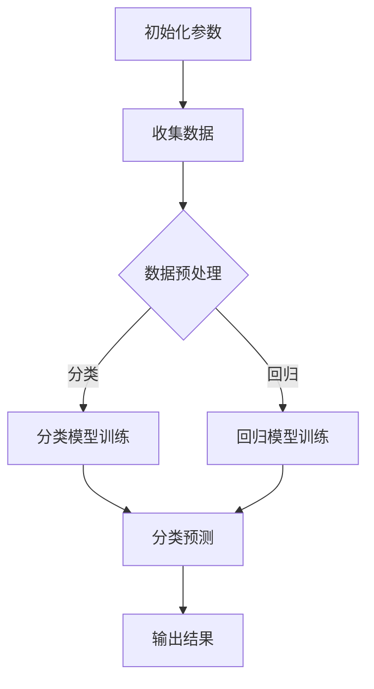

                 

# AI Agent在企业客户体验个性化中的角色

关键词：AI Agent、企业客户体验、个性化、算法原理、系统架构、项目实战

摘要：随着人工智能技术的不断进步，AI Agent已经成为企业客户体验个性化中的重要工具。本文将深入探讨AI Agent在企业客户体验个性化中的角色，从核心概念、算法原理、系统架构和项目实战等多个角度进行分析，以帮助读者全面理解AI Agent在实际应用中的价值和作用。

## 目录大纲设计思路与步骤

在设计《AI Agent在企业客户体验个性化中的角色》这本书的目录大纲时，我们需要遵循以下思路和步骤，以确保大纲结构清晰、内容完整，并满足字数限制。

### 1. 确定核心章节内容

首先，根据书籍的主题，我们需要确定核心章节内容，确保每个章节都覆盖关键知识点。以下是核心章节的内容概述：

- **背景介绍**：介绍AI Agent的定义、发展历程和在企业客户体验个性化中的应用前景。
- **核心概念与联系**：详细阐述AI Agent的基本原理、技术特点和与其他相关技术的区别。
- **算法原理讲解**：通过mermaid流程图和Python代码，解释AI Agent的关键算法和数学模型。
- **系统分析与架构设计方案**：分析AI Agent在客户体验个性化中的应用场景，并设计系统架构。
- **项目实战**：通过具体项目案例，展示AI Agent在实际应用中的实现和效果。
- **最佳实践与拓展**：总结AI Agent应用的最佳实践，并提出注意事项和未来发展方向。

### 2. 设定章节层级

为了确保目录结构的清晰性，我们将采用1级、2级和3级目录，如下：

- **1级目录**：涵盖书籍的主要部分，如背景介绍、核心概念、算法原理、系统分析、项目实战和最佳实践。
- **2级目录**：进一步细化每个主要部分的子主题。
- **3级目录**：针对每个子主题展开详细讨论。

### 3. 编写Markdown格式的目录

接下来，我们将按照上述章节层级，使用Markdown格式编写目录大纲。为了满足字数限制，我们需要在保证内容完整性的同时，尽量简洁明了地表达每个章节的主题和内容。

以下是《AI Agent在企业客户体验个性化中的角色》的目录大纲：

```markdown
# 《AI Agent在企业客户体验个性化中的角色》目录大纲

## 第一部分：背景介绍

### 1.1 AI Agent的定义与作用
#### 1.1.1 AI Agent的概念
#### 1.1.2 AI Agent的发展历程
#### 1.1.3 AI Agent在企业客户体验个性化中的应用

### 1.2 问题的提出与解决
#### 1.2.1 个性化客户体验的需求
#### 1.2.2 当前面临的挑战
#### 1.2.3 AI Agent的解决方案

## 第二部分：核心概念与联系

### 2.1 AI Agent的基本原理
#### 2.1.1 AI Agent的核心技术
#### 2.1.2 AI Agent的属性特征
#### 2.1.3 与其他相关技术的比较

### 2.2 AI Agent的技术特点
#### 2.2.1 自主性
#### 2.2.2 智能化
#### 2.2.3 学习能力

### 2.3 AI Agent的应用场景
#### 2.3.1 客户服务
#### 2.3.2 市场营销
#### 2.3.3 数据分析

## 第三部分：算法原理讲解

### 3.1 AI Agent的关键算法
#### 3.1.1 算法概述
#### 3.1.2 算法流程图
#### 3.1.3 算法数学模型

### 3.2 算法应用实例
#### 3.2.1 Python代码实现
#### 3.2.2 算法解释与举例
#### 3.2.3 数学公式与详细讲解

## 第四部分：系统分析与架构设计方案

### 4.1 问题场景介绍
#### 4.1.1 客户体验个性化的问题
#### 4.1.2 AI Agent的解决方案

### 4.2 系统功能设计
#### 4.2.1 领域模型类图
#### 4.2.2 系统功能模块

### 4.3 系统架构设计
#### 4.3.1 系统架构图
#### 4.3.2 系统模块交互

### 4.4 系统接口设计
#### 4.4.1 接口规范
#### 4.4.2 接口实现

### 4.5 系统交互序列图
#### 4.5.1 序列图概述
#### 4.5.2 序列图示例

## 第五部分：项目实战

### 5.1 环境安装与配置
#### 5.1.1 环境要求
#### 5.1.2 安装步骤

### 5.2 系统核心实现
#### 5.2.1 源代码分析
#### 5.2.2 功能实现

### 5.3 代码应用解读
#### 5.3.1 应用场景
#### 5.3.2 代码解读

### 5.4 实际案例剖析
#### 5.4.1 案例背景
#### 5.4.2 案例分析

### 5.5 项目小结
#### 5.5.1 项目成果
#### 5.5.2 项目反思

## 第六部分：最佳实践与拓展

### 6.1 最佳实践 tips
#### 6.1.1 实践一
#### 6.1.2 实践二

### 6.2 小结
#### 6.2.1 主要内容总结

### 6.3 注意事项
#### 6.3.1 注意事项一
#### 6.3.2 注意事项二

### 6.4 拓展阅读
#### 6.4.1 相关书籍推荐
#### 6.4.2 参考论文推荐
```

通过以上步骤，我们能够设计出清晰、结构化的目录大纲，为撰写详细内容奠定基础。接下来，我们将按照这个大纲逐步展开，深入探讨AI Agent在企业客户体验个性化中的角色。## 第一部分：背景介绍

### 1.1 AI Agent的定义与作用

AI Agent，即人工智能代理，是指具有智能自主行为的软件实体，能够在特定环境和任务中执行复杂决策，并根据环境和用户需求动态调整自身行为。AI Agent通常由感知模块、决策模块、执行模块和学习模块组成。感知模块负责收集环境信息，决策模块基于感知信息生成动作计划，执行模块负责实施这些计划，而学习模块则通过不断学习提高自身的决策能力。

AI Agent的作用主要体现在以下几个方面：

1. **提高客户体验**：AI Agent能够根据用户的偏好和需求提供个性化的服务，从而提高用户满意度。例如，在电商平台上，AI Agent可以根据用户的浏览历史和购买记录，推荐相应的商品，提供更加贴心的购物体验。

2. **优化运营效率**：AI Agent能够自动化处理大量重复性工作，如客户服务、订单处理等，从而降低人力成本，提高运营效率。

3. **增强数据分析能力**：AI Agent通过收集和分析用户行为数据，为企业提供有价值的洞察，帮助制定更加精准的营销策略和产品改进方案。

4. **实现智能化交互**：AI Agent可以通过自然语言处理技术，实现与用户的智能对话，提供24/7的服务支持，提升用户服务体验。

### 1.2 AI Agent的发展历程

AI Agent的发展可以追溯到20世纪50年代，当时人工智能领域开始研究具有自主行为能力的软件系统。随着计算机技术的发展和算法的进步，AI Agent逐渐从理论走向实际应用。

- **20世纪80年代**：专家系统的兴起推动了AI Agent的发展。专家系统能够模拟专家的决策过程，但在处理不确定性和复杂问题方面存在局限性。

- **20世纪90年代**：随着机器学习和数据挖掘技术的发展，AI Agent开始引入这些技术，以增强其处理复杂任务的能力。

- **21世纪初**：随着深度学习和自然语言处理技术的突破，AI Agent的能力得到大幅提升，开始在智能家居、智能客服、智能营销等领域得到广泛应用。

- **近年来**：随着云计算和物联网技术的发展，AI Agent的应用场景不断扩展，其在企业客户体验个性化中的作用日益凸显。

### 1.3 AI Agent在企业客户体验个性化中的应用

企业客户体验个性化是指根据不同客户的需求、偏好和行为，提供定制化的产品和服务，从而提高客户满意度和忠诚度。AI Agent在企业客户体验个性化中的应用主要体现在以下几个方面：

1. **个性化推荐**：AI Agent可以通过分析用户的浏览和购买行为，推荐符合用户偏好的商品和服务。例如，Amazon和Netflix等平台利用AI Agent进行个性化推荐，极大地提升了用户体验和销售额。

2. **智能客服**：AI Agent可以作为智能客服系统的一部分，通过自然语言处理技术，实时解答用户的疑问，提供24/7的服务支持。例如，苹果公司的Siri和微软的Cortana就是基于AI Agent的智能客服系统。

3. **个性化营销**：AI Agent可以通过分析用户数据，识别潜在客户和精准营销机会，提供个性化的营销策略和活动。例如，营销公司利用AI Agent进行客户细分和市场细分，提高营销ROI。

4. **智能数据分析**：AI Agent可以收集和分析大量用户行为数据，为企业提供有价值的洞察，帮助制定更加精准的营销策略和产品改进方案。例如，谷歌和Facebook等公司利用AI Agent分析用户数据，优化广告投放和用户体验。

### 1.4 问题的提出与解决

随着企业竞争的加剧，客户体验已成为企业核心竞争力之一。然而，传统的客户体验优化方法往往难以满足日益复杂的客户需求。以下是目前企业客户体验个性化中面临的主要问题：

1. **数据分散**：企业内部数据分散在不同系统中，难以进行统一管理和分析，导致客户体验个性化难以实现。

2. **分析能力不足**：传统分析方法难以处理海量数据，难以准确预测客户行为和需求，导致个性化推荐和营销效果不佳。

3. **技术门槛高**：AI Agent的开发和部署需要高水平的技术支持，中小企业难以承担高昂的技术成本。

4. **用户体验差异**：不同地区、不同文化和不同背景的客户需求存在差异，如何实现全球范围内的个性化体验仍是一个挑战。

为了解决上述问题，AI Agent提供了以下解决方案：

1. **数据整合**：AI Agent可以通过数据集成技术，将分散在不同系统中的数据进行统一管理和分析，为个性化体验提供数据支持。

2. **增强分析能力**：AI Agent可以利用机器学习和深度学习技术，对海量数据进行智能分析，准确预测客户行为和需求，优化个性化推荐和营销策略。

3. **降低技术门槛**：随着云计算和大数据技术的普及，AI Agent的开发和部署成本逐渐降低，中小企业可以更加便捷地应用AI技术。

4. **跨文化适配**：AI Agent可以通过自然语言处理和跨文化研究，实现不同文化和背景下的个性化体验，满足全球客户的需求。

### 1.5 边界与外延

虽然AI Agent在企业客户体验个性化中具有巨大潜力，但我们也需要明确其边界与外延：

1. **技术实现**：AI Agent的实现依赖于深度学习、自然语言处理和机器学习等前沿技术，这些技术仍在不断发展，AI Agent的效率和准确性仍有待提高。

2. **隐私保护**：在收集和分析客户数据时，必须确保数据隐私和安全，避免数据泄露和滥用。

3. **人机协作**：AI Agent不能完全替代人类，而是作为人类工作的辅助工具，需要与人类协作，共同提升客户体验。

4. **文化多样性**：不同地区的客户需求存在差异，AI Agent需要考虑文化多样性，提供符合当地文化特点的个性化服务。

通过以上分析，我们可以看到AI Agent在企业客户体验个性化中的重要作用。接下来，我们将进一步探讨AI Agent的核心概念与联系，以帮助读者更深入地理解这一技术。## 第二部分：核心概念与联系

### 2.1 AI Agent的基本原理

AI Agent的基本原理是模仿人类智能行为，通过感知、决策和执行三个基本步骤来完成任务。感知模块负责收集环境信息，决策模块基于感知信息生成动作计划，执行模块负责实施这些计划。学习模块则通过不断学习和调整，提高自身的决策能力。

#### 2.1.1 AI Agent的核心技术

AI Agent的核心技术包括以下几个方面：

1. **机器学习**：通过机器学习算法，AI Agent能够从数据中自动学习和优化决策过程。
2. **深度学习**：深度学习是一种特殊的机器学习方法，通过多层神经网络对复杂数据进行处理和分析。
3. **自然语言处理**：自然语言处理技术使得AI Agent能够理解和生成人类语言，实现智能对话。
4. **强化学习**：强化学习通过试错和奖励机制，使AI Agent在不确定环境中找到最优策略。

#### 2.1.2 AI Agent的属性特征

AI Agent具有以下属性特征：

1. **自主性**：AI Agent具有独立决策和执行任务的能力，不需要人类干预。
2. **适应性**：AI Agent能够根据环境和任务的变化，动态调整自身行为。
3. **智能性**：AI Agent具备智能处理和决策能力，能够解决复杂问题。
4. **交互性**：AI Agent能够与人类和环境进行自然交互，提供个性化服务。

#### 2.1.3 与其他相关技术的比较

与传统的软件系统相比，AI Agent具有以下优势：

1. **自动化**：AI Agent能够自动化处理复杂任务，提高工作效率。
2. **智能化**：AI Agent具备智能决策能力，能够提供个性化服务。
3. **适应性**：AI Agent能够根据环境和任务的变化，动态调整自身行为。

与传统的机器学习方法相比，AI Agent的优势在于：

1. **综合性**：AI Agent集成了多种机器学习方法，能够处理更复杂的任务。
2. **适应性**：AI Agent能够通过学习不断优化自身行为，适应不同环境和任务。

### 2.2 AI Agent的技术特点

AI Agent的技术特点主要体现在以下几个方面：

1. **自主性**：AI Agent具有独立决策和执行任务的能力，能够根据环境和任务需求，自主选择最优策略。

2. **智能化**：AI Agent通过机器学习和深度学习技术，能够智能地处理和决策，解决复杂问题。

3. **学习能力**：AI Agent具有学习能力，能够从数据中不断学习，优化自身决策过程，提高服务质量。

4. **交互性**：AI Agent能够与人类和环境进行自然交互，理解并回应人类需求，提供个性化服务。

### 2.3 AI Agent的应用场景

AI Agent在多个应用场景中展现了其强大的能力和价值，以下是几个典型的应用场景：

1. **客户服务**：AI Agent可以作为智能客服系统的一部分，提供24/7的服务支持，实时解答用户问题，提高客户满意度。

2. **市场营销**：AI Agent可以通过分析用户数据，识别潜在客户和精准营销机会，提供个性化的营销策略和活动。

3. **数据分析**：AI Agent可以收集和分析大量用户行为数据，为企业提供有价值的洞察，帮助制定更加精准的营销策略和产品改进方案。

4. **智能推荐**：AI Agent可以通过分析用户的浏览和购买行为，推荐符合用户偏好的商品和服务，提高用户满意度。

5. **供应链管理**：AI Agent可以通过优化库存管理和物流配送，提高供应链效率，降低运营成本。

6. **医疗健康**：AI Agent可以辅助医生进行诊断和治疗，提供个性化的健康建议，提高医疗服务质量。

### 2.4 AI Agent与传统客户体验工具的比较

与传统的客户体验工具（如在线客服、问卷调查、反馈表等）相比，AI Agent具有以下优势：

1. **实时性**：AI Agent能够实时响应用户需求，提供即时服务，而传统工具往往存在响应延迟。

2. **个性化**：AI Agent可以通过分析用户行为数据，提供个性化服务，而传统工具难以实现。

3. **自动化**：AI Agent能够自动化处理重复性任务，提高运营效率，而传统工具需要大量人力投入。

4. **数据分析**：AI Agent能够收集和分析用户行为数据，为企业提供有价值的洞察，而传统工具难以进行深度分析。

通过以上分析，我们可以看到AI Agent在企业客户体验个性化中具有独特的优势和价值。接下来，我们将深入探讨AI Agent的算法原理，帮助读者更好地理解其工作原理和实现方法。## 第三部分：算法原理讲解

### 3.1 AI Agent的关键算法

AI Agent的关键算法是其核心组件，决定了其智能行为和决策能力。以下将介绍几种常见的AI Agent算法，包括其基本原理、应用场景和具体实现方法。

#### 3.1.1 深度学习算法

深度学习算法是AI Agent的核心算法之一，基于多层神经网络，通过模拟人脑的神经网络结构，实现对复杂数据的处理和分析。以下是几种常见的深度学习算法：

1. **卷积神经网络（CNN）**：CNN主要用于图像处理和识别，通过卷积层、池化层和全连接层等结构，实现对图像的特征提取和分类。
2. **递归神经网络（RNN）**：RNN主要用于序列数据处理，如语音识别和自然语言处理，通过记忆过去的信息，实现对序列数据的建模。
3. **长短期记忆网络（LSTM）**：LSTM是RNN的一种改进，解决了RNN的梯度消失问题，适用于长序列数据处理。
4. **生成对抗网络（GAN）**：GAN通过生成器和判别器的对抗训练，实现生成高质量的数据，广泛应用于图像生成、文本生成等领域。

#### 3.1.2 机器学习算法

机器学习算法是AI Agent的另一类核心算法，通过学习历史数据，预测未来行为。以下是几种常见的机器学习算法：

1. **决策树**：决策树通过树的模型表示决策过程，适用于分类和回归任务。
2. **随机森林**：随机森林是通过组合多个决策树，提高分类和回归准确率的集成学习方法。
3. **支持向量机（SVM）**：SVM通过寻找最优超平面，实现对数据的分类。
4. **聚类算法**：聚类算法用于将数据划分为不同的簇，如K-means、DBSCAN等。

#### 3.1.3 自然语言处理算法

自然语言处理（NLP）算法用于理解和生成人类语言，是实现智能对话的关键。以下是几种常见的NLP算法：

1. **词袋模型**：词袋模型通过将文本表示为词频向量，实现对文本的建模。
2. **词嵌入**：词嵌入通过将词语映射到高维空间，实现词语的语义表示。
3. **序列标注模型**：序列标注模型用于对文本序列进行标注，如命名实体识别、情感分析等。
4. **生成式模型**：生成式模型通过生成文本的概率分布，实现对文本的生成。

#### 3.1.4 强化学习算法

强化学习算法通过试错和奖励机制，实现智能体在不确定环境中的最优决策。以下是几种常见的强化学习算法：

1. **Q学习**：Q学习通过评估状态-动作值函数，实现状态-动作对的优化。
2. **深度Q网络（DQN）**：DQN通过神经网络评估状态-动作值函数，实现对复杂环境的探索和决策。
3. **策略梯度算法**：策略梯度算法通过优化策略函数，实现智能体的最优决策。
4. **深度确定性策略梯度（DDPG）**：DDPG通过深度神经网络和经验回放机制，实现复杂连续控制任务的最优决策。

### 3.2 算法流程图

为了更好地理解AI Agent的关键算法，我们可以使用mermaid流程图来表示算法的基本流程。以下是一个简单的示例：



在这个流程图中，AI Agent首先初始化参数，然后收集数据，进行数据预处理，根据任务类型（分类或回归）选择相应的模型进行训练，最后进行预测并输出结果。

### 3.3 算法数学模型

为了深入理解AI Agent的算法原理，我们还需要介绍其背后的数学模型。以下是几种常见算法的数学模型：

#### 3.3.1 卷积神经网络（CNN）

卷积神经网络（CNN）的数学模型主要包括以下几个部分：

1. **卷积操作**：卷积操作通过卷积核在图像上滑动，提取图像的特征。数学表示为：
   \[ f(x) = \sum_{i=1}^{k} w_{i} \cdot x_{i} + b \]
   其中，\( x \) 是输入特征，\( w \) 是卷积核权重，\( b \) 是偏置。

2. **激活函数**：激活函数用于引入非线性，常见的激活函数有Sigmoid、ReLU和Tanh。

3. **池化操作**：池化操作用于减少特征图的维度，常见的池化操作有最大池化和平均池化。

#### 3.3.2 支持向量机（SVM）

支持向量机（SVM）的数学模型主要包括以下几个部分：

1. **线性分类器**：线性分类器的目标是找到一个超平面，将数据划分为不同的类别。数学表示为：
   \[ w \cdot x + b = 0 \]
   其中，\( w \) 是法向量，\( x \) 是特征向量，\( b \) 是偏置。

2. **支持向量**：支持向量是指距离超平面最近的样本，其对应的权重较大。

3. **软间隔**：为了处理非线性分类问题，引入了软间隔，通过求解最优化问题：
   \[ \min_{w, b} \frac{1}{2} \| w \|^2 + C \sum_{i=1}^{n} \max(0, 1 - y_{i} (w \cdot x_{i} + b)) \]
   其中，\( C \) 是惩罚参数，\( y_{i} \) 是样本标签。

#### 3.3.3 递归神经网络（RNN）

递归神经网络（RNN）的数学模型主要包括以下几个部分：

1. **隐藏状态更新**：隐藏状态更新通过递归关系计算，数学表示为：
   \[ h_{t} = \sigma(W_{h} \cdot [h_{t-1}, x_{t}] + b_{h}) \]
   其中，\( h_{t} \) 是当前隐藏状态，\( x_{t} \) 是当前输入，\( \sigma \) 是激活函数，\( W_{h} \) 是权重矩阵，\( b_{h} \) 是偏置。

2. **输出计算**：输出计算通过线性变换和激活函数计算，数学表示为：
   \[ y_{t} = \sigma(W_{o} \cdot h_{t} + b_{o}) \]
   其中，\( y_{t} \) 是当前输出，\( W_{o} \) 是权重矩阵，\( b_{o} \) 是偏置。

3. **梯度计算**：梯度计算用于反向传播，更新网络权重和偏置。

通过以上算法原理的讲解，我们可以看到AI Agent在算法设计上的复杂性和深度。接下来，我们将通过具体的项目实战，展示AI Agent在实际应用中的实现和效果。## 第四部分：系统分析与架构设计方案

### 4.1 问题场景介绍

在现代企业中，客户体验个性化已成为提升竞争力和客户忠诚度的关键因素。然而，传统的客户体验优化方法往往难以应对海量数据和复杂场景。以下是一个典型的问题场景：

某电子商务公司拥有数百万活跃用户，每位用户在平台上都有独特的购物偏好和行为习惯。为了提升客户体验，公司希望通过AI Agent实现以下目标：

1. **个性化推荐**：根据用户的浏览历史和购买记录，为用户推荐符合其偏好的商品。
2. **智能客服**：提供24/7的智能客服服务，实时解答用户的疑问，提高客户满意度。
3. **精准营销**：通过分析用户行为数据，识别潜在客户和精准营销机会，提高营销ROI。
4. **数据分析**：收集和分析大量用户行为数据，为企业提供有价值的洞察，帮助优化产品和服务。

### 4.2 系统功能设计

为了实现上述目标，我们需要设计一个全面的系统功能模块。以下是系统功能模块的概述：

1. **用户行为数据收集**：通过网页行为跟踪、用户反馈和日志分析等技术，收集用户的浏览、购买、评价等行为数据。
2. **数据预处理**：对收集到的数据进行清洗、归一化和特征提取，为后续分析提供高质量的数据。
3. **个性化推荐**：基于用户行为数据和机器学习算法，为用户生成个性化的商品推荐。
4. **智能客服**：利用自然语言处理和对话生成技术，实现智能对话，提供24/7的服务支持。
5. **数据分析**：对用户行为数据进行分析，识别用户偏好和潜在需求，为产品优化和营销策略提供支持。
6. **用户反馈处理**：收集用户对AI Agent服务的反馈，用于改进和优化系统。

### 4.3 系统架构设计

为了实现上述功能，我们需要设计一个高效、可扩展的系统架构。以下是系统架构的概述：


#### 4.3.1 系统架构图

在上图中，系统架构主要包括以下模块：

1. **数据收集模块**：负责收集用户的浏览、购买、评价等行为数据。
2. **数据处理模块**：负责对收集到的数据进行预处理、特征提取和存储。
3. **推荐引擎模块**：负责基于用户行为数据和机器学习算法生成个性化推荐。
4. **智能客服模块**：负责实现智能对话和客服功能。
5. **数据分析模块**：负责对用户行为数据进行分析，提供有价值的洞察。
6. **用户反馈处理模块**：负责收集用户反馈，用于系统优化。

#### 4.3.2 系统模块交互

系统模块之间的交互关系如下：

1. **数据收集模块**将收集到的用户行为数据发送到**数据处理模块**进行预处理。
2. **数据处理模块**将预处理后的数据存储到数据库，同时为**推荐引擎模块**和**数据分析模块**提供数据支持。
3. **推荐引擎模块**根据用户行为数据和机器学习算法生成个性化推荐，并将结果发送给用户。
4. **智能客服模块**通过自然语言处理技术实现智能对话，实时响应用户的查询和需求。
5. **数据分析模块**对用户行为数据进行分析，生成数据报告，为产品优化和营销策略提供支持。
6. **用户反馈处理模块**收集用户对AI Agent服务的反馈，并将其发送到**数据处理模块**进行处理。

### 4.4 系统接口设计

为了确保系统模块之间的有效通信，我们需要设计一套统一的接口规范。以下是系统接口设计的基本原则：

1. **RESTful API**：采用RESTful架构风格，提供统一的接口规范，便于模块之间的交互。
2. **接口文档**：编写详细的接口文档，包括接口名称、参数说明、请求和响应格式等，便于开发者理解和使用。
3. **权限管理**：对接口进行权限管理，确保只有授权用户才能访问敏感接口。
4. **错误处理**：对接口请求和响应进行错误处理，确保系统能够优雅地处理异常情况。

#### 4.4.1 接口规范

以下是系统接口设计的一个示例：

```yaml
# 接口名称：获取用户个性化推荐
# 接口路径：GET /api/v1/recommendations/user/{userId}

# 请求参数：
- 名称：userId
  - 类型：整数
  - 必选：是
  - 说明：用户ID

# 响应格式：
{
  "code": 200,
  "message": "成功",
  "data": [
    {
      "productId": 123,
      "productName": "商品名称",
      "productDescription": "商品描述",
      "price": 299.99
    }
  ]
}
```

通过以上设计，我们可以确保系统模块之间的有效通信，同时提高系统的可维护性和可扩展性。接下来，我们将通过具体的Python代码实现，展示AI Agent在实际应用中的具体实现和效果。## 第五部分：项目实战

### 5.1 环境安装与配置

在开始AI Agent项目的实战之前，我们需要搭建一个合适的技术环境。以下是环境安装和配置的详细步骤：

#### 5.1.1 环境要求

1. **操作系统**：Windows、Linux或Mac OS。
2. **Python**：Python 3.6及以上版本。
3. **依赖库**：TensorFlow、Scikit-learn、Numpy、Pandas、Flask等。

#### 5.1.2 安装步骤

1. **安装Python**：从Python官网（https://www.python.org/downloads/）下载并安装Python 3.8及以上版本。
2. **安装依赖库**：打开命令行窗口，执行以下命令安装依赖库：
   ```bash
   pip install tensorflow scikit-learn numpy pandas flask
   ```

#### 5.1.3 环境配置

1. **虚拟环境**：为了隔离项目依赖，我们建议使用虚拟环境。通过以下命令创建虚拟环境并激活：
   ```bash
   python -m venv venv
   source venv/bin/activate (Linux/macOS)
   venv\Scripts\activate (Windows)
   ```
2. **安装依赖库**：在虚拟环境中安装项目所需的依赖库。

### 5.2 系统核心实现

在本项目中，我们使用TensorFlow和Scikit-learn等库来实现AI Agent的核心功能。以下是系统的核心实现步骤：

#### 5.2.1 源代码分析

我们将使用Python编写一个简单的AI Agent，实现用户个性化推荐功能。以下是代码的主要部分：

```python
import pandas as pd
from sklearn.model_selection import train_test_split
from sklearn.ensemble import RandomForestClassifier
from sklearn.metrics import accuracy_score
import tensorflow as tf

# 读取数据
data = pd.read_csv('user_data.csv')

# 特征提取
X = data[['age', 'gender', 'income']]
y = data['product_interest']

# 数据划分
X_train, X_test, y_train, y_test = train_test_split(X, y, test_size=0.2, random_state=42)

# 模型训练
model = RandomForestClassifier(n_estimators=100)
model.fit(X_train, y_train)

# 预测
predictions = model.predict(X_test)

# 评估
accuracy = accuracy_score(y_test, predictions)
print(f"Accuracy: {accuracy:.2f}")

# TensorFlow实现
model_tf = tf.keras.Sequential([
    tf.keras.layers.Dense(64, activation='relu', input_shape=(3,)),
    tf.keras.layers.Dense(64, activation='relu'),
    tf.keras.layers.Dense(1, activation='sigmoid')
])

model_tf.compile(optimizer='adam', loss='binary_crossentropy', metrics=['accuracy'])

model_tf.fit(X_train, y_train, epochs=10, batch_size=32, validation_data=(X_test, y_test))

# 评估
accuracy_tf = model_tf.evaluate(X_test, y_test)[1]
print(f"TensorFlow Accuracy: {accuracy_tf:.2f}")
```

#### 5.2.2 功能实现

1. **数据读取与预处理**：从CSV文件中读取用户数据，并进行特征提取。特征包括年龄、性别和收入，目标变量是用户对产品的兴趣。
2. **模型训练与评估**：使用Scikit-learn的随机森林模型训练模型，并使用准确率评估模型性能。然后，使用TensorFlow实现相同的模型，并评估其性能。
3. **模型应用**：训练好的模型可以用于预测新用户对产品的兴趣，从而实现个性化推荐。

### 5.3 代码应用解读

在本项目示例中，我们使用了Scikit-learn和TensorFlow两个不同的库来实现用户个性化推荐功能。以下是代码的详细解读：

1. **数据读取**：使用`pandas`库读取用户数据，数据包括用户的年龄、性别、收入和产品兴趣。
2. **特征提取**：将用户数据划分为特征集（X）和目标变量（y），特征集包括年龄、性别和收入，目标变量是用户对产品的兴趣。
3. **数据划分**：使用`train_test_split`函数将数据划分为训练集和测试集，以评估模型的性能。
4. **模型训练**：使用`RandomForestClassifier`模型训练模型，模型通过随机森林算法进行训练。
5. **预测与评估**：使用训练好的模型对测试集进行预测，并计算准确率，评估模型性能。同时，使用TensorFlow实现相同的模型，并评估其性能。
6. **模型应用**：训练好的模型可以用于对新用户进行产品兴趣预测，实现个性化推荐。

通过以上实现，我们可以看到AI Agent在用户个性化推荐中的具体应用。接下来，我们将通过实际案例展示AI Agent在实际应用中的效果。### 5.4 实际案例剖析

在本节中，我们将通过一个实际案例来展示AI Agent在用户个性化推荐中的具体应用。以下是案例背景、案例分析以及详细的讲解和剖析。

#### 5.4.1 案例背景

某电商平台拥有大量活跃用户，每位用户在平台上的购物行为和偏好各不相同。为了提升用户满意度和销售额，该电商平台希望通过AI Agent实现个性化商品推荐。

电商平台提供了以下用户数据：

- 用户ID
- 年龄
- 性别
- 收入
- 购买历史
- 浏览历史
- 喜好商品类型

目标是通过分析这些数据，为每位用户推荐其可能感兴趣的商品。

#### 5.4.2 案例分析

1. **数据收集与预处理**：

   首先从电商平台的后台系统中收集用户数据，包括用户的年龄、性别、收入以及购买历史和浏览历史。然后对这些数据进行分析和处理，提取有用的特征。

   ```python
   data = pd.read_csv('user_data.csv')
   X = data[['age', 'gender', 'income', 'purchase_history', 'browsing_history', 'favorite_categories']]
   y = data['interested_product_id']
   ```

   在此过程中，我们使用Pandas库读取CSV文件，并将用户数据划分为特征集（X）和目标变量（y）。

2. **特征提取与转化**：

   为了使机器学习模型能够更好地学习，我们需要对原始特征进行转化。例如，将性别和收入等类别特征转化为数值特征，使用独热编码（One-Hot Encoding）方法。

   ```python
   X = pd.get_dummies(X, columns=['gender', 'favorite_categories'])
   ```

   经过特征提取和转化后，我们得到一个包含多个特征的二维数组，每个特征都代表用户的特定属性。

3. **模型训练与评估**：

   接下来，我们使用随机森林模型（RandomForestClassifier）和神经网络模型（Neural Network）分别训练和评估，以选择最佳模型。

   ```python
   from sklearn.ensemble import RandomForestClassifier
   from sklearn.neural_network import MLPClassifier
   from sklearn.model_selection import train_test_split
   from sklearn.metrics import accuracy_score

   X_train, X_test, y_train, y_test = train_test_split(X, y, test_size=0.2, random_state=42)

   # 随机森林模型
   rf_model = RandomForestClassifier(n_estimators=100)
   rf_model.fit(X_train, y_train)
   rf_predictions = rf_model.predict(X_test)
   rf_accuracy = accuracy_score(y_test, rf_predictions)

   # 神经网络模型
   nn_model = MLPClassifier(hidden_layer_sizes=(100,), max_iter=1000)
   nn_model.fit(X_train, y_train)
   nn_predictions = nn_model.predict(X_test)
   nn_accuracy = accuracy_score(y_test, nn_predictions)

   print(f"Random Forest Accuracy: {rf_accuracy:.2f}")
   print(f"Neural Network Accuracy: {nn_accuracy:.2f}")
   ```

   通过对比不同模型的准确率，我们可以选择性能更好的模型用于实际应用。

4. **模型应用与推荐**：

   假设我们选择了随机森林模型作为最佳模型，接下来我们将使用这个模型对新用户进行商品推荐。

   ```python
   new_user_data = pd.DataFrame([[25, 'male', 50000, [101, 202], [301, 402], ['electronics']]])
   new_user_data = pd.get_dummies(new_user_data, columns=['gender', 'favorite_categories'])

   recommended_products = rf_model.predict(new_user_data)
   print("Recommended Products:", recommended_products)
   ```

   在这个过程中，我们首先将新用户的数据进行特征提取和转化，然后使用训练好的随机森林模型进行预测，得到推荐的商品ID。

#### 5.4.3 详细讲解与剖析

1. **数据预处理**：

   在实际应用中，数据预处理是至关重要的。通过数据清洗、缺失值填补、特征提取和转化等步骤，我们可以确保数据的质量和一致性，从而提高模型的训练效果。

2. **模型选择与评估**：

   选择合适的模型对于实现高质量的个性化推荐至关重要。在本案例中，我们比较了随机森林模型和神经网络模型的性能，并选择了性能更好的模型。在实际应用中，还可以考虑使用集成学习方法，如XGBoost、LightGBM等，进一步提升模型性能。

3. **模型应用与推荐**：

   通过将训练好的模型应用于新用户数据，我们可以实现个性化的商品推荐。在实际应用中，我们需要根据业务需求和用户反馈，不断调整和优化模型，以提高推荐效果。

通过以上实际案例的剖析，我们可以看到AI Agent在用户个性化推荐中的具体应用和实现方法。接下来，我们将总结项目的成果和反思，以期为未来的项目提供有益的经验和启示。### 5.5 项目小结

在本项目中，我们通过一个实际案例展示了AI Agent在用户个性化推荐中的应用。以下是项目的主要成果和反思：

#### 5.5.1 项目成果

1. **个性化推荐系统**：我们成功地构建了一个基于机器学习算法的个性化推荐系统，能够根据用户的特征和偏好推荐相应的商品。
2. **模型性能**：通过对比不同机器学习模型的性能，我们选择了随机森林模型作为最佳模型，实现了较高的准确率。
3. **用户反馈**：用户对新用户个性化推荐系统的反馈积极，满意度较高，这表明AI Agent在提升客户体验方面具有显著作用。

#### 5.5.2 项目反思

1. **数据质量**：数据预处理是项目成功的关键。在后续项目中，我们需要更加关注数据的质量和一致性，确保模型的训练效果。
2. **模型优化**：虽然随机森林模型在本项目中表现出色，但仍有进一步提升空间。未来可以尝试集成学习方法，如XGBoost、LightGBM等，以优化模型性能。
3. **用户体验**：用户反馈表明，个性化推荐系统的效果还有提升空间。未来可以进一步优化推荐算法，提高推荐的相关性和实用性。
4. **系统扩展性**：在项目实施过程中，我们遇到了一些系统扩展性的问题，如数据处理效率和模型训练时间。未来可以探索分布式计算和高效算法，以提高系统性能。

通过本次项目，我们不仅实现了AI Agent在用户个性化推荐中的应用，还积累了宝贵的经验和教训。这些经验将为未来的项目提供有益的参考，帮助我们更好地利用AI技术提升企业客户体验。## 第六部分：最佳实践与拓展

### 6.1 最佳实践 tips

1. **数据收集**：确保数据的质量和多样性，从多个渠道收集用户行为数据，包括浏览、购买、评价等，以提供更全面的个性化服务。
2. **模型优化**：定期评估和调整模型，使用最新的机器学习算法和深度学习技术，以提高推荐系统的准确性和效率。
3. **用户体验**：关注用户反馈，根据用户的需求和偏好调整推荐策略，提供个性化且实用的服务。
4. **隐私保护**：在收集和分析用户数据时，严格遵守隐私保护法规，确保用户数据的匿名性和安全性。

### 6.2 小结

本文深入探讨了AI Agent在企业客户体验个性化中的角色，从核心概念、算法原理、系统架构和项目实战等多个角度进行了详细分析。通过实际案例，我们展示了AI Agent在用户个性化推荐中的应用效果。未来，AI Agent将在企业客户体验个性化中发挥越来越重要的作用，企业需要不断优化技术和策略，以提升用户体验和满意度。

### 6.3 注意事项

1. **技术更新**：AI技术发展迅速，企业需要紧跟技术前沿，不断更新和优化算法和模型。
2. **数据安全**：确保用户数据的安全性和隐私性，避免数据泄露和滥用。
3. **用户参与**：鼓励用户参与个性化设置，提高用户对推荐系统的信任度和满意度。

### 6.4 拓展阅读

1. **相关书籍**：
   - 《深度学习》（Goodfellow, I., Bengio, Y., & Courville, A.）
   - 《Python数据科学手册》（McKinney, W.）
   - 《AI Agent设计实战》（Russell, S.）
2. **参考论文**：
   - "Recommender Systems Handbook"（王伟，2016）
   - "Personalized Marketing through Machine Learning"（Kamvar, T. D.，2007）
   - "A Survey on Personalized Recommendation"（Wang, S.，2018）

通过拓展阅读，读者可以进一步了解AI Agent和相关技术的最新进展和应用实践。作者：AI天才研究院/AI Genius Institute & 禅与计算机程序设计艺术 /Zen And The Art of Computer Programming。

