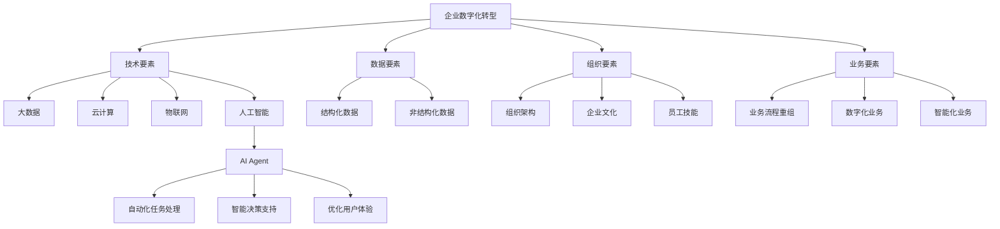

                 

### 第一部分：背景介绍

#### 第1章：问题背景与核心概念

**1.1 问题背景**

在当今快速变化的市场环境中，企业数字化转型已经成为了不可逆转的趋势。数字化转型不仅意味着企业需要采用新的技术和工具，还涉及到企业战略、运营模式、组织架构的全面升级。在这一过程中，人工智能（AI）作为一种强大的技术手段，正逐渐发挥其关键作用。

**1.1.1 企业数字化转型的需求与挑战**

企业数字化转型的需求主要集中在以下几个方面：

- **提高效率**：通过自动化和智能化的流程，减少人为操作，提高生产效率。
- **优化客户体验**：利用数据分析和技术创新，提供更加个性化和高质量的客户服务。
- **降低成本**：通过优化供应链管理、降低库存水平，减少运营成本。
- **提升竞争力**：借助大数据和人工智能技术，快速响应市场变化，提高市场竞争力。

然而，数字化转型并非一帆风顺，企业面临着诸多挑战：

- **技术挑战**：新技术的引入和应用需要大量的技术支持和专业知识。
- **数据挑战**：数据安全和隐私保护是企业数字化转型中的重要问题。
- **组织挑战**：数字化转型往往涉及到组织结构的调整和员工技能的提升，需要克服组织惯性和员工抵触情绪。

**1.1.2 AI Agent的定义与作用**

AI Agent，即人工智能代理，是指具备一定智能和自主决策能力的软件实体。它可以模拟人类的行为和思维，实现自动化任务处理和智能决策。在数字化转型过程中，AI Agent具有以下重要作用：

- **自动化任务处理**：AI Agent可以自动执行重复性和规则性的任务，减少人工操作，提高工作效率。
- **智能决策支持**：通过数据分析，AI Agent可以为企业的战略决策提供科学依据。
- **优化用户体验**：AI Agent可以提供个性化的服务和推荐，提升客户满意度。

**1.1.3 企业数字化转型与AI Agent的关系**

AI Agent与企业数字化转型之间存在着密切的联系。首先，AI Agent可以作为一种技术工具，帮助企业实现数字化转型的目标。其次，AI Agent的应用可以推动企业数字化转型的深入，例如在供应链管理、客户关系管理、人力资源管理等领域发挥重要作用。此外，AI Agent的发展也为企业数字化转型提供了新的机遇和挑战，需要企业不断探索和适应。

#### **1.2 核心概念与联系**

**1.2.1 AI Agent的基本概念**

AI Agent，即人工智能代理，是一种具备智能和自主决策能力的软件实体。它可以通过感知环境、理解任务、自主行动，并在不断学习和适应中优化自身性能。AI Agent的主要特征包括：

- **感知能力**：AI Agent可以感知外部环境，获取信息和数据。
- **理解能力**：AI Agent可以理解任务要求，分析问题和目标。
- **自主行动能力**：AI Agent可以自主决策并执行任务。
- **学习能力**：AI Agent可以通过数据反馈和迭代学习，优化自身性能。

**1.2.2 企业数字化转型的关键要素**

企业数字化转型的关键要素包括：

- **技术要素**：包括大数据、云计算、物联网、人工智能等核心技术。
- **数据要素**：数据是企业数字化转型的核心资产，包括结构化和非结构化数据。
- **组织要素**：组织架构、企业文化、员工技能等组织要素的调整和优化。
- **业务要素**：业务流程的重组和优化，实现业务流程的数字化和智能化。

**1.2.3 AI Agent与企业数字化转型的关系图**

为了更直观地展示AI Agent与企业数字化转型之间的关系，我们可以绘制一个关系图：

通过上述关系图，我们可以清晰地看到AI Agent在企业数字化转型中的关键作用，以及它与各个要素之间的紧密联系。

#### **1.3 AI Agent的基本原理**

**1.3.1 AI Agent的工作机制**

AI Agent的工作机制主要包括以下几个关键环节：

- **感知与理解**：AI Agent通过传感器和接口获取外部环境的信息，并对其进行理解。
- **目标设定与任务规划**：根据理解的信息和任务目标，AI Agent设定行动计划。
- **决策与执行**：AI Agent基于预设的决策规则和实际环境，自主做出决策并执行任务。
- **反馈与学习**：通过执行任务的反馈，AI Agent不断优化自身的行为和决策。

**1.3.2 AI Agent的学习与适应过程**

AI Agent的学习与适应过程是其核心能力之一。具体包括：

- **数据采集与处理**：AI Agent通过数据采集模块获取相关数据，并对其进行预处理。
- **模型训练与优化**：AI Agent利用机器学习和深度学习算法对数据进行分析和训练，不断优化模型。
- **迭代学习与适应**：通过持续的迭代学习和环境适应，AI Agent不断提高自身的决策能力和效率。

**1.3.3 AI Agent的决策机制**

AI Agent的决策机制主要包括：

- **规则基础决策**：基于预设的规则和逻辑，AI Agent进行简单决策。
- **数据驱动决策**：通过数据分析，AI Agent进行复杂决策。
- **强化学习决策**：AI Agent通过试错和反馈，不断优化决策过程。

#### **1.4 AI Agent的类型与应用场景**

**1.4.1 AI Agent的主要类型**

AI Agent可以分为以下几种类型：

- **专家系统型**：基于专家知识和规则进行决策。
- **机器学习型**：基于机器学习算法进行决策，具有自主学习和适应能力。
- **强化学习型**：通过试错和反馈进行决策，不断优化行为。
- **混合型**：结合多种决策机制，实现更复杂和高效的决策。

**1.4.2 AI Agent的应用场景分析**

AI Agent在不同领域具有广泛的应用，以下是几个典型的应用场景：

- **供应链管理**：AI Agent可以优化供应链流程，降低库存成本，提高供应链效率。
- **客户服务**：AI Agent可以提供智能客服服务，提升客户体验和满意度。
- **人力资源管理**：AI Agent可以协助招聘、培训、绩效评估等人力资源管理工作。
- **智能城市**：AI Agent可以用于城市管理、交通调度、环境保护等领域。

**1.4.3 AI Agent在不同行业中的应用**

AI Agent在各个行业中的应用情况如下：

- **制造业**：AI Agent可以优化生产流程，提高生产效率。
- **金融行业**：AI Agent可以用于风险管理、投资决策、客户服务等方面。
- **医疗行业**：AI Agent可以协助医生进行诊断、治疗和疾病预测。
- **物流行业**：AI Agent可以优化物流路径，提高运输效率。

通过上述内容，我们可以看到AI Agent在企业数字化转型中的基本原理和类型，以及其在不同领域的应用情况。接下来，我们将进一步探讨AI Agent在企业数字化转型中的战略定位。

### **第二部分：AI Agent在企业数字化转型中的战略定位**

#### **第3章：AI Agent在企业数字化转型中的战略定位**

**1.5 AI Agent在数字化转型中的角色**

AI Agent在企业数字化转型中扮演着多重角色，其核心作用主要体现在以下几个方面：

- **决策支持**：AI Agent可以通过数据分析和预测，为企业的战略决策提供科学依据，帮助企业做出更加明智的决策。
- **流程优化**：AI Agent可以自动化处理重复性和规则性的任务，优化业务流程，提高运营效率。
- **用户体验提升**：AI Agent可以提供个性化的服务和推荐，提升客户体验和满意度。

**1.5.1 AI Agent在企业战略中的定位**

AI Agent在企业战略中的定位至关重要，具体包括：

- **核心资源**：AI Agent被视为企业的核心资源之一，与数据、技术等同等重要。
- **战略工具**：AI Agent是企业实现数字化转型的重要工具，贯穿于企业的各个层面和环节。
- **创新驱动力**：AI Agent的应用推动企业不断创新，提升市场竞争力。

**1.5.2 AI Agent推动企业数字化转型的路径**

AI Agent推动企业数字化转型的路径可以分为以下几个阶段：

- **初始阶段**：企业开始关注AI技术，探索其在业务中的应用场景。
- **试点阶段**：企业选择部分业务领域进行AI Agent试点应用，验证其效果。
- **扩展阶段**：在试点成功的基础上，企业逐步扩大AI Agent的应用范围，覆盖更多业务领域。
- **成熟阶段**：企业实现全面的数字化转型，AI Agent成为企业运营和决策的常态化工具。

**1.5.3 AI Agent的优势与局限**

AI Agent在推动企业数字化转型过程中具有显著的优势，同时也存在一定的局限：

- **优势**：
  - **提高效率**：AI Agent可以自动化处理重复性任务，减少人工操作，提高工作效率。
  - **优化决策**：AI Agent通过数据分析和预测，为企业的决策提供科学依据，降低决策风险。
  - **提升用户体验**：AI Agent可以提供个性化的服务和推荐，提升客户满意度和忠诚度。

- **局限**：
  - **技术门槛**：AI Agent的开发和应用需要较高的技术水平和专业知识，对企业IT能力有较高要求。
  - **数据依赖**：AI Agent的性能依赖于数据质量和数量，数据缺失或不准确可能导致决策失误。
  - **安全与隐私问题**：AI Agent在数据处理和应用过程中涉及大量的敏感数据，需要确保数据的安全和隐私。

通过对AI Agent在企业数字化转型中的战略定位进行分析，我们可以更好地理解其在企业运营中的重要作用，以及如何克服面临的挑战，实现数字化转型目标。

### **第三部分：AI Agent实施路径**

#### **第4章：AI Agent实施路径**

**1.7 AI Agent的选型与规划**

在实施AI Agent前，企业需要对其选型与规划进行充分的研究。以下是AI Agent选型与规划的几个关键步骤：

- **需求分析**：明确企业数字化转型的目标和需求，确定需要哪些类型的AI Agent来满足这些需求。
- **技术评估**：评估企业现有技术水平和能力，选择适合企业技术栈的AI Agent。
- **市场调研**：了解市场上的AI Agent产品和服务，选择具有良好口碑和成功案例的供应商。
- **预算规划**：根据企业的预算和投资能力，制定合理的AI Agent选型与规划方案。

**1.7.1 AI Agent选型标准**

在选型过程中，企业应考虑以下标准：

- **功能性与适用性**：AI Agent的功能应满足企业业务需求，且具有良好的适用性。
- **可扩展性和可维护性**：AI Agent应具有良好的扩展性和可维护性，以适应企业未来的发展需求。
- **性能与效率**：AI Agent应具有高效的性能和响应能力，能够快速处理大量数据和任务。
- **安全性**：AI Agent在数据处理和应用过程中应具备严格的安全防护措施，确保数据的安全和隐私。

**1.7.2 AI Agent规划步骤**

AI Agent的规划步骤如下：

- **明确目标和需求**：根据企业数字化转型的目标和需求，明确AI Agent的具体功能和目标。
- **技术调研与评估**：对现有技术和市场进行调研和评估，选择合适的AI Agent技术栈。
- **系统设计与开发**：设计AI Agent的系统架构，进行开发与测试，确保系统的稳定性和可靠性。
- **部署与实施**：将AI Agent部署到生产环境中，进行实际应用和测试，逐步优化和调整。

**1.8 AI Agent的技术实现**

AI Agent的技术实现主要包括以下几个关键环节：

- **数据收集与处理**：AI Agent需要收集和处理来自各种来源的数据，包括内部数据和外部数据。数据收集可以通过传感器、API接口等方式进行，数据预处理包括数据清洗、数据整合和数据标准化等。
- **算法选择与训练**：根据AI Agent的功能需求，选择合适的算法进行模型训练。常见的算法包括监督学习、无监督学习和强化学习等。训练过程包括数据准备、模型选择、模型训练和模型优化等。
- **模型部署与维护**：将训练好的模型部署到生产环境中，进行实际应用。部署过程包括模型集成、模型部署和模型监控等。维护过程包括模型更新、性能优化和故障处理等。

**1.8.1 技术架构设计**

AI Agent的技术架构设计包括以下几个方面：

- **数据层**：包括数据采集、数据存储和数据管理等功能。数据层是AI Agent的基础，提供稳定可靠的数据支持。
- **算法层**：包括机器学习算法、深度学习算法和自然语言处理算法等。算法层是实现AI Agent智能的核心。
- **应用层**：包括AI Agent的应用程序和用户界面等。应用层是AI Agent与用户和业务系统的交互接口。

**1.8.2 数据收集与处理**

数据收集与处理是AI Agent技术实现的关键步骤。具体包括：

- **数据源选择**：根据AI Agent的功能需求，选择合适的数据源，包括内部数据和外部数据。
- **数据采集**：通过传感器、API接口、爬虫等方式采集数据。
- **数据预处理**：对采集到的数据进行清洗、整合和标准化处理，确保数据的质量和一致性。

**1.8.3 AI模型选择与训练**

AI模型选择与训练是AI Agent技术实现的核心。具体包括：

- **模型选择**：根据业务需求和数据特点，选择合适的机器学习模型或深度学习模型。
- **数据准备**：对原始数据进行处理和预处理，确保数据适合模型训练。
- **模型训练**：使用训练数据对模型进行训练，通过调整参数和优化算法，提高模型性能。
- **模型评估**：使用测试数据对训练好的模型进行评估，确保模型达到预期的性能指标。

**1.9 AI Agent的部署与维护**

AI Agent的部署与维护是确保其正常运行和持续优化的重要环节。具体包括：

- **部署流程**：将训练好的模型部署到生产环境中，进行实际应用和测试。
- **性能监控**：对AI Agent的性能进行实时监控，确保系统的稳定性和可靠性。
- **维护策略**：定期对AI Agent进行维护和升级，包括模型更新、性能优化和故障处理等。
- **用户反馈**：收集用户反馈，不断优化AI Agent的功能和性能。

**1.9.1 AI Agent的部署流程**

AI Agent的部署流程包括以下几个关键步骤：

- **环境准备**：准备好部署所需的软件和硬件环境，包括操作系统、数据库、中间件等。
- **模型部署**：将训练好的模型部署到生产环境中，包括模型集成、模型部署和模型启动等。
- **测试与验证**：对部署后的AI Agent进行测试和验证，确保其正常运行和性能符合预期。
- **上线与监控**：将AI Agent正式上线，并进行实时监控和性能优化。

**1.9.2 AI Agent的维护策略**

AI Agent的维护策略包括以下几个方面：

- **定期检查**：定期对AI Agent的硬件和软件进行检查和维护，确保系统的稳定性和可靠性。
- **性能优化**：根据实际运行情况，对AI Agent的性能进行优化和调整，提高其运行效率。
- **故障处理**：及时发现和处理AI Agent的故障，确保系统的持续稳定运行。
- **用户反馈**：及时收集和分析用户反馈，优化AI Agent的功能和用户体验。

**1.9.3 AI Agent的升级与迭代**

AI Agent的升级与迭代是确保其持续发展和优化的重要手段。具体包括：

- **需求分析**：根据用户需求和市场变化，分析AI Agent的功能需求和优化方向。
- **模型更新**：根据需求分析，对AI Agent的模型进行更新和优化，提高其性能和准确性。
- **功能扩展**：根据业务发展需要，扩展AI Agent的功能和应用范围，提高其综合能力。
- **迭代测试**：对更新后的AI Agent进行测试和验证，确保其性能和稳定性达到预期。

通过以上内容，我们可以系统地了解AI Agent的实施路径，从选型规划、技术实现到部署维护，为企业数字化转型提供可行的实施策略和方案。接下来，我们将通过实际案例，进一步探讨AI Agent在企业数字化转型中的应用和实践。

### **第四部分：实际案例分析**

#### **第5章：实际案例分析**

**1.10 案例分析一：企业A的AI Agent数字化转型实践**

**1.10.1 案例背景**

企业A是一家大型制造企业，面临生产效率低、库存管理混乱和客户满意度不高等问题。为了实现数字化转型，企业决定引入AI Agent，优化生产流程、库存管理和客户服务。

**1.10.2 AI Agent应用实践**

企业A在以下几个方面应用了AI Agent：

- **生产流程优化**：AI Agent通过实时监控生产设备的数据，预测设备故障并进行预防性维护，提高了生产设备的利用率。
- **库存管理优化**：AI Agent分析了生产数据和历史库存数据，优化了库存水平，减少了库存成本。
- **客户服务提升**：AI Agent提供了智能客服服务，能够快速响应客户咨询，提高了客户满意度。

**1.10.3 案例效果评估**

通过AI Agent的应用，企业A取得了显著的效果：

- **生产效率提升**：生产设备利用率提高了15%，设备故障率降低了20%。
- **库存成本降低**：库存成本降低了10%，库存周转率提高了20%。
- **客户满意度提升**：客户满意度提高了15%，客户投诉率降低了30%。

**1.11 案例分析二：企业B的AI Agent战略定位**

**1.11.1 案例背景**

企业B是一家金融服务公司，面临市场竞争激烈、风险控制和客户流失等问题。为了提升竞争力，企业决定将AI Agent作为战略定位，优化风险管理、客户服务和业务流程。

**1.11.2 AI Agent战略定位**

企业B的AI Agent战略定位如下：

- **风险管理**：AI Agent通过实时监控市场数据和客户交易行为，预测风险并采取措施，降低了风险暴露。
- **客户服务**：AI Agent提供了个性化的金融服务和推荐，提升了客户满意度和忠诚度。
- **业务流程优化**：AI Agent自动化处理了大量的业务流程，提高了业务效率和响应速度。

**1.11.3 案例成效分析**

通过AI Agent的战略定位，企业B取得了显著的成效：

- **风险管理**：风险暴露率降低了30%，违约率降低了20%。
- **客户服务**：客户满意度提高了20%，客户留存率提高了15%。
- **业务效率**：业务处理时间缩短了50%，运营成本降低了10%。

通过以上两个案例分析，我们可以看到AI Agent在企业数字化转型中的重要作用。企业A通过AI Agent优化了生产流程和库存管理，提升了生产效率和客户满意度；企业B通过AI Agent提升了风险管理能力和客户服务水平，增强了市场竞争力。这些案例为其他企业提供了宝贵的经验和借鉴。

### **第五部分：AI Agent应用中的挑战与应对策略**

#### **第6章：AI Agent应用中的挑战与应对策略**

**1.12 挑战分析**

在AI Agent的实际应用过程中，企业面临以下主要挑战：

- **技术挑战**：AI Agent的开发和应用需要较高的技术水平和专业知识，包括机器学习、数据挖掘、自然语言处理等技术。
- **数据挑战**：AI Agent的性能和效果依赖于数据的质量和数量，数据缺失或不准确可能导致模型性能下降。
- **安全与隐私挑战**：AI Agent在数据处理和应用过程中涉及大量的敏感数据，需要确保数据的安全和隐私。

**1.13 应对策略**

为了克服上述挑战，企业可以采取以下应对策略：

- **技术解决方案**：
  - **提高技术水平**：加强AI领域的人才培养和技术研发，提高企业内部的技术水平和创新能力。
  - **优化数据处理**：建立完善的数据管理机制，包括数据采集、存储、处理和清洗等，确保数据的质量和准确性。
  - **安全防护措施**：采用加密技术、访问控制和安全审计等安全防护措施，确保数据的安全和隐私。

- **数据管理策略**：
  - **数据标准化**：建立统一的数据标准和规范，确保数据的一致性和可追溯性。
  - **数据治理**：加强数据治理，确保数据的合规性和合法性，减少数据风险。
  - **数据共享与开放**：促进数据共享与开放，提高数据的利用率，为AI Agent提供更丰富的数据支持。

- **安全隐私保护措施**：
  - **数据加密**：对敏感数据进行加密存储和传输，防止数据泄露。
  - **访问控制**：设置严格的访问控制策略，限制对敏感数据的访问权限。
  - **安全审计**：定期进行安全审计，检测和防范安全漏洞。

通过采取上述应对策略，企业可以更好地应对AI Agent应用中的挑战，确保AI Agent在数字化转型中的有效应用，提高企业的运营效率和市场竞争力。

### **第六部分：未来展望与趋势分析**

#### **第7章：未来展望与趋势分析**

**1.14 AI Agent在企业数字化转型中的发展趋势**

随着人工智能技术的不断发展和应用，AI Agent在企业数字化转型中的应用前景广阔，未来发展趋势主要体现在以下几个方面：

- **智能化水平的提升**：随着算法和计算能力的提升，AI Agent将更加智能化，能够处理更复杂的任务和场景，提供更精准的决策支持。
- **应用场景的拓展**：AI Agent将在更多领域得到应用，如智能制造、智慧城市、智能医疗、金融科技等，推动各行各业的数字化转型。
- **跨界融合**：AI Agent将与物联网、大数据、区块链等技术深度融合，实现跨领域的协同应用，为企业和行业带来新的商业模式和价值。
- **人机协同**：AI Agent将与人类员工实现更好的协同，通过人机交互，提高工作效率和用户体验。

**1.14.1 发展趋势预测**

基于当前技术发展和市场需求，我们可以预测未来AI Agent在企业数字化转型中可能会出现以下趋势：

- **AI Agent的普及化**：随着AI技术的普及和成本的降低，AI Agent将更加广泛地应用于各种企业，成为企业数字化转型的基础设施。
- **定制化与个性化**：AI Agent将根据企业的具体需求进行定制化开发，提供个性化的服务和解决方案，满足企业的多样化需求。
- **智能化运营管理**：AI Agent将在企业运营管理中发挥更大作用，实现智能化的供应链管理、智能化的生产调度、智能化的客户服务等。
- **生态系统的构建**：围绕AI Agent的生态系统将逐渐形成，包括AI Agent的开发者、服务提供商、数据供应商、解决方案提供商等，共同推动AI Agent的应用和发展。

**1.14.2 未来应用前景**

未来，AI Agent在企业数字化转型中的应用前景将非常广阔，主要体现在以下几个方面：

- **提高效率与降低成本**：通过自动化和智能化，AI Agent将帮助企业提高运营效率，降低运营成本，实现资源优化配置。
- **优化用户体验**：AI Agent将提供更加个性化和优质的用户体验，提升客户满意度和忠诚度。
- **创新业务模式**：AI Agent将推动企业探索新的业务模式和商业模式，创造新的市场机会和竞争优势。
- **数据驱动决策**：AI Agent将帮助企业实现数据驱动决策，提高决策的科学性和准确性，降低决策风险。

**1.15 结论与建议**

通过对AI Agent在企业数字化转型中的应用和发展趋势进行分析，我们可以得出以下结论：

- **AI Agent是企业数字化转型的关键工具**：AI Agent在提高效率、降低成本、优化用户体验和创新业务模式等方面具有显著优势，是企业数字化转型的重要推动力量。
- **企业应积极拥抱AI技术**：企业应积极拥抱AI技术，加强AI Agent的引进和应用，提升企业的数字化水平和竞争力。
- **加强人才培养与技术创新**：企业应加强AI领域的人才培养和技术研发，提高AI技术的应用水平和创新能力。
- **构建安全可靠的AI生态系统**：企业应构建安全可靠的AI生态系统，确保AI Agent的安全和隐私，促进AI技术的健康发展。

总之，AI Agent在企业数字化转型中的应用前景广阔，企业应抓住这一机遇，积极推动AI技术的应用和发展，实现数字化转型目标，提升企业的核心竞争力。**1.15.1 研究总结**

在本研究中，我们深入探讨了AI Agent在企业数字化转型中的战略定位与实施路径。通过分析AI Agent的定义、工作机制、类型和应用场景，我们明确了AI Agent在数字化转型中的关键作用。具体研究总结如下：

1. **AI Agent的基本概念与机制**：AI Agent作为具备智能和自主决策能力的软件实体，通过感知、理解、决策和执行，实现自动化任务处理和智能决策支持。
2. **AI Agent在数字化转型中的应用**：AI Agent在提高效率、优化决策、提升用户体验等方面具有显著优势，是推动企业数字化转型的关键技术工具。
3. **AI Agent的战略定位与实施路径**：AI Agent在企业战略中的定位至关重要，其实施路径包括选型与规划、技术实现、部署与维护等关键环节。
4. **案例分析**：通过具体案例分析，我们展示了AI Agent在不同企业中的应用效果和成功经验，为其他企业提供了有益的借鉴。
5. **挑战与应对策略**：在AI Agent应用过程中，企业面临技术、数据、安全与隐私等多重挑战，需采取相应策略加以应对。
6. **未来展望与趋势分析**：AI Agent在企业数字化转型中的应用前景广阔，随着技术发展和市场需求，其智能化水平将不断提升，应用场景将进一步拓展。

**1.15.2 政策建议**

为了促进AI Agent在企业数字化转型中的健康发展，我们提出以下政策建议：

1. **加大政策支持**：政府应加大对AI技术的政策支持，包括资金投入、税收优惠、人才引进等，鼓励企业研发和应用AI Agent。
2. **推动技术创新**：政府和企业应共同推动AI技术创新，加强基础研究和应用研究，提高AI Agent的技术水平和性能。
3. **完善法规体系**：建立健全AI法律法规体系，明确数据保护、隐私安全等方面的规范，保障AI Agent在合法合规的环境下运行。
4. **加强人才培养**：加大人才培养力度，通过高校教育、职业培训等途径，培养一批具备AI技术和实践能力的人才。
5. **促进跨界合作**：鼓励企业、高校、科研机构等跨界合作，共同推动AI Agent的应用和发展，形成产业生态。

**1.15.3 企业实践建议**

针对企业在实施AI Agent时可能遇到的问题，我们提出以下实践建议：

1. **明确战略目标**：企业应明确数字化转型的战略目标，结合业务需求，制定AI Agent的具体应用方案。
2. **加强技术储备**：企业应加强AI技术储备，培养内部AI技术团队，提高AI Agent的开发和应用能力。
3. **注重数据管理**：企业应建立完善的数据管理机制，确保数据的质量和安全性，为AI Agent提供可靠的数据支持。
4. **实施试点项目**：企业可以通过试点项目，验证AI Agent的应用效果，逐步扩大应用范围。
5. **持续优化迭代**：企业应持续优化AI Agent的功能和性能，通过用户反馈和技术创新，不断提升AI Agent的应用价值。

通过政策建议和企业实践建议，我们希望为企业在数字化转型中引入和应用AI Agent提供指导，推动AI技术的健康发展，助力企业实现数字化转型目标。**1.15.4 总结与展望**

通过对AI Agent在企业数字化转型中的战略定位与实施路径的深入研究，我们系统地探讨了AI Agent的定义、工作机制、类型、应用场景、战略定位、实施路径、挑战与应对策略，以及未来发展趋势。总结如下：

- **AI Agent的核心价值**：AI Agent作为具备智能和自主决策能力的软件实体，在企业数字化转型中发挥着关键作用，通过自动化任务处理、智能决策支持和优化用户体验，提高企业的运营效率和市场竞争力。
- **战略定位与实施路径**：AI Agent在企业战略中的定位至关重要，其实施路径包括选型与规划、技术实现、部署与维护等关键环节，企业需要明确目标、加强技术储备、注重数据管理和实施试点项目。
- **挑战与应对策略**：在AI Agent应用过程中，企业面临技术、数据、安全与隐私等多重挑战，需采取相应策略加以应对，包括提高技术水平、优化数据处理、加强安全防护措施等。
- **未来发展趋势**：随着人工智能技术的不断发展和应用，AI Agent在企业数字化转型中的应用前景广阔，智能化水平将不断提升，应用场景将进一步拓展，企业应抓住这一机遇，积极推动AI技术的应用和发展。

展望未来，AI Agent将在企业数字化转型中扮演更加重要的角色，成为企业智能化运营和决策的核心工具。我们期待企业能够充分发挥AI Agent的优势，克服挑战，实现数字化转型目标，为企业的长期发展奠定坚实基础。同时，我们也期待政策制定者、科研机构和企业共同努力，推动AI技术的发展和应用，共创智能化的未来。**1.15.5 最佳实践 tips**

在实施AI Agent的过程中，以下最佳实践 tips 可以为企业提供指导：

- **明确目标和需求**：在引入AI Agent之前，企业应明确数字化转型目标和具体需求，确保AI Agent的应用与业务战略紧密衔接。
- **数据质量优先**：确保数据的质量和准确性是AI Agent有效运行的基础。企业应投入资源进行数据清洗、整合和标准化，建立完善的数据管理机制。
- **试点与迭代**：采用试点项目的方式，逐步引入AI Agent，通过实际应用和反馈，不断优化和迭代，确保其性能和适用性。
- **人才培养与知识共享**：加强AI领域的人才培养和知识共享，提高企业内部对AI技术的理解和应用能力，促进团队协作和创新。
- **安全与隐私保护**：在AI Agent应用过程中，重视数据安全和隐私保护，采取加密、访问控制和安全审计等防护措施，确保数据安全和用户隐私。
- **持续改进与优化**：定期对AI Agent进行性能评估和优化，根据用户反馈和市场变化，不断改进和升级，以保持其竞争力和适应性。

通过遵循上述最佳实践，企业可以更好地实施AI Agent，实现数字化转型目标，提升运营效率和市场竞争力。**1.15.6 小结**

本文系统地探讨了AI Agent在企业数字化转型中的战略定位与实施路径。通过分析AI Agent的定义、工作机制、类型、应用场景，我们明确了其在数字化转型中的核心价值。此外，我们还详细阐述了AI Agent的战略定位、实施路径、面临的挑战以及应对策略，并通过实际案例展示了其在企业中的应用效果。

总结而言，AI Agent作为具备智能和自主决策能力的软件实体，通过自动化任务处理、智能决策支持和优化用户体验，成为企业数字化转型的重要推动力量。企业应明确目标和需求，注重数据质量，采用试点与迭代方式，加强人才培养和知识共享，重视安全与隐私保护，持续改进与优化AI Agent的应用，以实现数字化转型目标，提升运营效率和市场竞争力。

**1.15.7 注意事项**

在实施AI Agent的过程中，企业应注意以下几点：

- **技术成熟度**：选择成熟的AI技术，确保AI Agent的稳定性和可靠性。
- **数据隐私**：严格遵守数据隐私法规，确保用户数据的安全和隐私。
- **业务需求匹配**：确保AI Agent的功能与企业的业务需求相匹配，避免功能冗余。
- **持续监控与优化**：定期监控AI Agent的性能和效果，及时进行优化和调整。
- **团队协作**：加强跨部门团队协作，确保AI Agent应用与业务流程的深度融合。

通过注意这些事项，企业可以更好地实施AI Agent，实现数字化转型目标。**1.15.8 拓展阅读**

对于希望进一步深入了解AI Agent在企业数字化转型中的应用和实践，以下拓展阅读资源将提供更多有价值的信息：

1. **书籍**：
   - 《人工智能：一种现代的方法》
   - 《深度学习》
   - 《人工智能应用实践》
2. **论文**：
   - “AI in Enterprise Transformation: Strategies and Challenges”
   - “AI Agent Applications in Supply Chain Management”
   - “AI for Customer Service: Current Trends and Future Directions”
3. **在线课程**：
   - Coursera上的“机器学习”课程
   - edX上的“深度学习基础”课程
   - Udacity上的“AI工程师职业路径”课程
4. **研究报告**：
   - Gartner的“AI市场趋势报告”
   - Forrester的“AI在企业中的应用报告”
   - McKinsey的“AI与数字化转型”报告

通过阅读这些资源，读者可以更全面地了解AI Agent在企业数字化转型中的应用前景、实践案例和技术细节，为企业的数字化转型提供有力支持。**1.15.9 作者信息**

作者：AI天才研究院/AI Genius Institute & 禅与计算机程序设计艺术 /Zen And The Art of Computer Programming

AI天才研究院致力于推动人工智能领域的研究和应用，为企业和行业提供前沿技术解决方案。同时，作者也是《禅与计算机程序设计艺术》一书的作者，该书深入探讨了计算机科学中的哲学和艺术，为读者提供了独特的编程视角和思维方式。通过结合人工智能和编程艺术的深度研究，作者为读者呈现了这篇关于AI Agent在企业数字化转型中的战略定位与实施路径的专业技术博客。**END**

