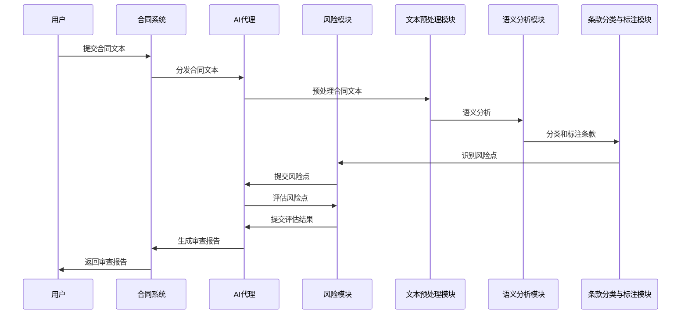
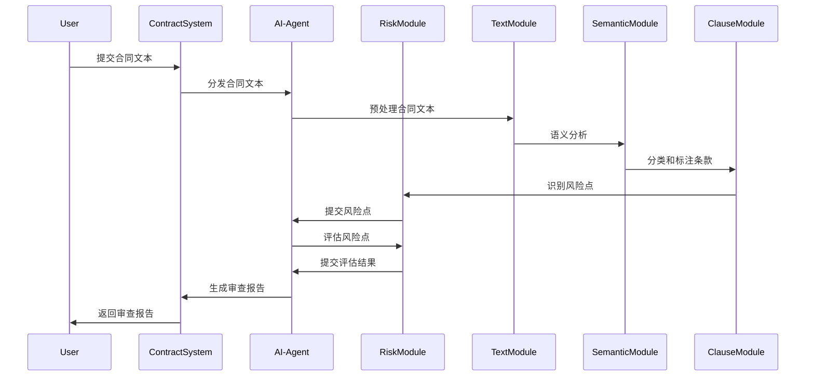

                 

### 第1章：引言

在商业世界中，企业法律风险评估与合同自动化审查是两个至关重要的环节。随着企业业务复杂度的增加和数据量的激增，传统的人工审核方法已经难以满足日益增长的需求。这促使人工智能（AI）特别是AI Agent的应用成为了解决这些问题的前沿技术。本文旨在探讨AI Agent在企业法律风险评估与合同自动化审查中的应用，通过一步步的逻辑分析，深入探讨这一领域的前景与挑战。

### 1.1 背景介绍

**企业法律风险评估的现状与挑战**

企业法律风险评估是一个系统性的过程，旨在识别、评估和管理企业在运营过程中可能面临的法律风险。目前，这一过程主要依赖于律师、合规专家和内部审计人员。然而，随着企业业务范围的扩大和业务模式的复杂化，传统的风险评估方法面临着以下挑战：

1. **人工成本高**：需要大量的人力资源进行风险评估，成本高昂。
2. **效率低下**：人工审核速度慢，难以应对大量数据的实时处理需求。
3. **准确性问题**：人工判断容易受到主观因素的影响，导致评估结果的不准确。
4. **合规性不足**：企业往往缺乏全面、系统的法律风险评估机制，难以确保所有业务环节的合规性。

**合同自动化审查的需求与问题**

合同是企业日常运营中不可或缺的一部分。然而，传统的合同审查过程往往繁琐且耗时。合同自动化审查的需求日益迫切，主要因为：

1. **处理速度要求**：企业需要快速审查大量的合同，以适应快速的业务节奏。
2. **准确性与一致性**：自动化审查可以减少人为错误，提高合同条款的准确性和一致性。
3. **合规性与透明性**：自动化审查有助于确保合同条款的合规性，并提高透明度，降低法律风险。

但合同自动化审查也面临一些问题，如：

1. **文本复杂性**：合同文本通常包含大量的法律术语和复杂条款，自动审查系统难以理解。
2. **法律环境变动**：法律环境不断变化，自动化审查系统需要不断更新以适应新的法律要求。
3. **跨部门协作**：合同审查往往涉及多个部门，自动化审查需要协调不同部门的工作。

**AI Agent在法律风险评估与合同自动化审查中的潜力**

AI Agent，作为一种高级人工智能系统，具有自主决策、学习和适应能力。它在法律风险评估与合同自动化审查中的应用潜力巨大：

1. **高效处理大量数据**：AI Agent可以快速处理大量数据，提高工作效率。
2. **降低成本**：通过自动化和智能化，AI Agent可以显著降低人力成本。
3. **提高准确性**：AI Agent通过机器学习和自然语言处理技术，可以减少人为错误，提高评估和审查的准确性。
4. **适应性**：AI Agent可以适应不断变化的法律环境和业务需求，提高系统的可持续性。

### 1.2 本书结构

本书分为三个主要部分，具体结构如下：

**第一部分：引言**

- 第1章：介绍企业法律风险评估和合同自动化审查的背景、挑战和AI Agent的潜力。

**第二部分：AI Agent基础**

- 第2章：概述AI Agent的基本原理和工作机制。
- 第3章：介绍机器学习算法的基础知识，包括监督学习、非监督学习和强化学习。

**第三部分：案例分析与实战**

- 第4章：详细探讨法律风险评估的原理与实践。
- 第5章：介绍合同自动化审查的技术和方法。
- 第6章：分析AI Agent在法律风险评估和合同自动化审查中的应用案例。

### 1.3 核心概念与联系

**AI Agent的定义与分类**

AI Agent是一种具有自主决策能力和学习能力的人工智能系统，可以根据环境和目标自主采取行动。根据学习和决策方式，AI Agent可以分为：

1. **监督学习代理**：在给定输入数据集和预期输出标签的情况下，通过学习模型进行预测和决策。
2. **强化学习代理**：通过与环境的交互，不断学习和优化策略，以最大化累积奖励。
3. **混合学习代理**：结合监督学习和强化学习的特点，同时利用两者的优势进行决策。

**法律风险评估与合同自动化审查的核心概念**

1. **法律风险评估**：识别、分析和评估企业在法律方面可能面临的风险，以便采取适当的措施降低风险。
2. **合同自动化审查**：利用自然语言处理和机器学习技术，自动化审查合同文本，提取关键信息，识别潜在风险。

两者之间的联系在于，法律风险评估和合同自动化审查都需要对大量的法律文档和合同条款进行处理，AI Agent可以在此过程中发挥关键作用，提高效率和准确性。

### 1.4 本章小结

本章介绍了企业法律风险评估和合同自动化审查的现状与挑战，并探讨了AI Agent在此领域的应用潜力。通过了解背景和核心概念，读者可以更好地理解后续章节的内容，为深入探讨AI Agent在法律风险评估与合同自动化审查中的应用打下基础。

---

### 1.5 关键概念与联系

#### AI Agent的定义与分类

**AI Agent的基本定义**

AI Agent，即人工智能代理，是一种模仿人类行为和决策的智能实体，能够在特定环境中自主感知、决策和执行行动。其核心目标是实现自主性和适应性，以优化其操作效果。

**分类**

1. **监督学习代理**：
   - **定义**：在给定输入数据集和预期输出标签的情况下，通过学习模型进行预测和决策。
   - **特点**：输出由输入数据决定，无需外部干预，适用于有明确标签的数据处理。

2. **强化学习代理**：
   - **定义**：通过与环境的交互，不断学习和优化策略，以最大化累积奖励。
   - **特点**：能够学习策略，以实现长期目标的优化，适用于动态环境。

3. **混合学习代理**：
   - **定义**：结合监督学习和强化学习的特点，同时利用两者的优势进行决策。
   - **特点**：既能够处理有标签的数据，又能够适应动态环境，适用于复杂决策场景。

#### 法律风险评估与合同自动化审查的核心概念

1. **法律风险评估**：
   - **定义**：识别、分析和评估企业在法律方面可能面临的风险，以便采取适当的措施降低风险。
   - **目的**：确保企业运营的合规性，降低法律风险。

2. **合同自动化审查**：
   - **定义**：利用自然语言处理和机器学习技术，自动化审查合同文本，提取关键信息，识别潜在风险。
   - **目的**：提高合同审查的效率和准确性，降低人为错误。

#### 关系与联系

- **数据与决策**：AI Agent通过处理大量法律文档和合同文本，提取关键信息，为法律风险评估和合同自动化审查提供数据支持。
- **监督与强化**：监督学习代理可以用于合同文本的分类和标注，强化学习代理则可以用于动态调整合同审查策略，以应对复杂多变的法律环境。
- **混合学习**：混合学习代理结合监督学习和强化学习的优势，能够在多个环节同时优化，提高整体系统的性能。

### 表格：核心概念属性对比

| 核心概念 | 定义 | 特点 | 适用场景 |
| --- | --- | --- | --- |
| AI Agent | 自主感知、决策和执行的人工智能实体 | 自动性、适应性、自主性 | 法律风险评估、合同自动化审查 |
| 监督学习代理 | 基于有标签数据集进行学习和预测 | 输出由输入决定，无需外部干预 | 数据分类、标注 |
| 强化学习代理 | 通过与环境交互学习最优策略 | 学习策略，长期优化 | 动态环境，策略优化 |
| 混合学习代理 | 结合监督学习和强化学习 | 利用两者优势，复杂决策 | 复杂决策场景 |

### ER实体关系图架构

```mermaid
erDiagram
    AI Agent ||--|{ 合同文本 }
    AI Agent ||--|{ 法律文档 }
    合同文本 ||--|{ 合同条款 }
    法律文档 ||--|{ 法律规定 }
```

- **AI Agent**：作为核心实体，负责处理合同文本和法律文档。
- **合同文本**：包括待审查的合同，以及提取出的关键条款。
- **法律文档**：包含相关的法律规定，用于对比和参考。
- **合同条款**：合同文本中的具体条款，是AI Agent审查的重点。
- **法律规定**：用于判断合同条款是否符合相关法律要求。

通过以上核心概念和实体关系的详细分析，读者可以更清晰地理解AI Agent在法律风险评估与合同自动化审查中的应用，为后续章节的学习打下坚实基础。

### 第2章：AI Agent概述

#### 2.1 AI Agent的基本原理

AI Agent，即人工智能代理，是一种模拟人类行为和决策的智能实体。它通过感知环境、制定决策并执行行动，以实现特定目标。AI Agent的基本原理可以概括为以下几个方面：

**定义**

AI Agent是具有自主性、适应性和学习能力的人工智能实体。它可以在没有人为干预的情况下，根据环境和目标自主地感知、决策和执行行动。这种自主性使得AI Agent能够在复杂和动态的环境中工作。

**特点**

1. **自主性**：AI Agent能够独立完成任务，无需人为干预。它可以根据自身感知到的环境信息，自主制定决策并执行行动。
2. **适应性**：AI Agent能够在不同的环境中工作，并适应环境的变化。它通过学习经验，不断调整其行为和策略，以提高任务完成效率。
3. **学习能力**：AI Agent可以通过机器学习和深度学习技术，从数据中学习并优化自身的行为。这种学习能力使其能够不断改进，以适应更复杂的任务。

**应用领域**

AI Agent的应用领域非常广泛，包括但不限于以下几个方面：

1. **智能制造**：AI Agent可以用于生产线的自动化管理，提高生产效率和质量。
2. **智能家居**：AI Agent可以控制家居设备，如灯光、温度和安防系统，提供个性化的居住体验。
3. **自动驾驶**：AI Agent可以用于自动驾驶车辆，实现自主导航和驾驶。
4. **金融分析**：AI Agent可以用于金融市场的分析和预测，提供投资建议。
5. **医疗诊断**：AI Agent可以用于辅助医生进行疾病诊断和治疗建议。

#### 2.2 AI Agent的工作原理

AI Agent的工作原理可以分为以下几个阶段：

**感知**

AI Agent通过传感器和其他感知设备获取环境信息。这些信息可以是视觉、听觉、触觉等多种形式。感知是AI Agent对外界信息的获取过程，是后续决策和行动的基础。

**决策**

在感知到环境信息后，AI Agent会根据预设的算法和策略，对信息进行分析和处理，制定相应的决策。决策过程通常涉及到多个因素，如目标、当前状态、历史数据等。

**行动**

制定决策后，AI Agent会根据决策结果执行相应的行动。行动可以是物理动作，如移动、操作设备，也可以是虚拟动作，如发送信息、执行任务等。

**学习**

在执行行动的过程中，AI Agent会根据实际结果和预期目标的差异，调整其算法和策略。这种学习过程使得AI Agent能够不断优化自身的行为，以实现更好的任务完成效果。

#### 2.3 AI Agent的技术基础

AI Agent的技术基础主要包括机器学习、深度学习和自然语言处理等领域。

**机器学习**

机器学习是一种通过算法和统计模型，从数据中学习并做出预测或决策的技术。AI Agent中的监督学习和非监督学习都是基于机器学习的技术。监督学习通过已标记的数据训练模型，用于预测未知数据；非监督学习则通过未标记的数据，发现数据之间的内在结构和模式。

**深度学习**

深度学习是机器学习的一种重要分支，通过神经网络模型，对大量数据进行分析和学习。深度学习在图像识别、语音识别和自然语言处理等领域取得了显著成果。AI Agent中的深度学习技术可以用于复杂的感知和决策任务。

**自然语言处理**

自然语言处理（NLP）是人工智能的一个子领域，旨在使计算机能够理解、生成和处理人类语言。NLP技术包括文本分类、情感分析、命名实体识别等，是AI Agent在处理文本数据时的重要工具。

#### 2.4 本章小结

本章概述了AI Agent的基本原理、工作原理和技术基础。通过了解AI Agent的定义、特点和适用领域，读者可以更好地理解这一智能实体在各个应用场景中的作用和优势。同时，通过对AI Agent的工作原理和技术的探讨，读者可以为后续章节关于法律风险评估和合同自动化审查的应用打下坚实的基础。

### 第3章：机器学习算法基础

#### 3.1 监督学习

监督学习是机器学习的一种基本形式，它通过已知输入和输出数据来训练模型，以便能够对未知数据进行预测。监督学习可以分为回归分析和分类分析两种类型。

**算法介绍**

1. **回归分析**：用于预测连续数值结果。常见的回归算法包括线性回归、多项式回归和决策树回归等。
   - **线性回归**：假设数据之间呈线性关系，通过最小化误差平方和来训练模型。
   - **多项式回归**：扩展线性回归，考虑更高次项的影响。
   - **决策树回归**：通过树形结构来表示数据之间的决策过程，逐层划分数据，直至达到终止条件。

2. **分类分析**：用于预测离散类别结果。常见的分类算法包括逻辑回归、支持向量机和决策树分类等。
   - **逻辑回归**：通过构建逻辑函数来预测概率，常用于二分类问题。
   - **支持向量机（SVM）**：通过寻找最优决策边界来分类数据。
   - **决策树分类**：通过树形结构对数据进行分类，每个节点表示特征值，每个分支表示决策路径。

**应用实例**

1. **房地产市场价格预测**：利用历史房价数据，通过线性回归算法预测未来的房价。
2. **垃圾邮件分类**：利用邮件内容特征，通过决策树分类算法将邮件分为垃圾邮件和正常邮件。
3. **信用卡欺诈检测**：利用交易数据，通过逻辑回归算法检测潜在的信用卡欺诈行为。

#### 3.2 非监督学习

非监督学习是机器学习的另一种形式，它不需要已标记的输出数据来训练模型。非监督学习的目的是发现数据中的内在结构和模式。

**算法介绍**

1. **聚类分析**：将数据分为若干个类别，每个类别中的数据具有相似性。常见的聚类算法包括K均值聚类、层次聚类和DBSCAN等。
   - **K均值聚类**：将数据分为K个簇，每个簇由一个中心点代表。
   - **层次聚类**：通过逐步合并相似度较高的数据点，构建一个层次结构的聚类结果。
   - **DBSCAN**：基于数据点的邻域和密度，将数据划分为不同的簇。

2. **降维技术**：用于降低数据维度，同时保持数据的重要信息。常见的降维技术包括主成分分析（PCA）和t-SNE等。
   - **主成分分析（PCA）**：通过正交变换将数据投影到新的坐标系中，提取主要成分。
   - **t-SNE**：通过非线性映射将高维数据投影到二维或三维空间，用于可视化。

**应用实例**

1. **客户细分**：通过聚类分析，将大量客户数据分为不同的群体，以便进行有针对性的营销策略。
2. **图像识别**：通过降维技术，将高维图像数据投影到低维空间，用于图像分类和识别。
3. **基因数据分析**：通过聚类分析，将基因数据分为不同的簇，用于识别基因功能。

#### 3.3 强化学习

强化学习是一种通过与环境交互来学习最优策略的机器学习形式。它与监督学习和非监督学习的主要区别在于，强化学习需要奖励机制来指导学习过程。

**算法介绍**

1. **Q学习**：通过学习状态-动作值函数，以最大化累积奖励。
   - **基本Q学习**：基于状态-动作值函数，选择当前最优动作。
   - **SARSA**：基于当前状态和下一状态，更新状态-动作值函数。

2. **深度Q网络（DQN）**：将Q学习与深度学习结合，用于处理高维状态空间的问题。
   - **经验回放**：通过存储和回放历史经验，减少训练过程中的偏差。
   - **目标网络**：通过固定一部分网络参数，降低训练过程中的方差。

**应用实例**

1. **自动驾驶**：通过强化学习，使自动驾驶车辆在复杂环境中学习最优驾驶策略。
2. **游戏AI**：通过强化学习，使游戏AI能够学习并掌握各种游戏策略。
3. **机器人控制**：通过强化学习，使机器人能够在复杂环境中完成各种任务。

#### 3.4 深度学习

深度学习是机器学习的一种重要分支，通过神经网络模型，对大量数据进行学习和分析。深度学习在图像识别、自然语言处理和语音识别等领域取得了显著成果。

**算法介绍**

1. **卷积神经网络（CNN）**：通过卷积层、池化层和全连接层等结构，对图像进行特征提取和分类。
   - **卷积层**：通过卷积操作提取图像局部特征。
   - **池化层**：通过下采样操作降低数据维度，减少过拟合。
   - **全连接层**：通过全连接层将特征映射到分类结果。

2. **循环神经网络（RNN）**：通过循环结构，处理序列数据，捕捉时间序列的特征。
   - **基本RNN**：通过隐藏状态和输入状态之间的递归关系，处理序列数据。
   - **长短时记忆网络（LSTM）**：通过引入门控机制，解决RNN的梯度消失和梯度爆炸问题。

**应用实例**

1. **图像识别**：通过CNN，实现对各种图像的分类和识别。
2. **自然语言处理**：通过RNN和Transformer等模型，实现文本分类、机器翻译和情感分析。
3. **语音识别**：通过深度神经网络，实现语音信号的转换和识别。

#### 3.5 本章小结

本章介绍了机器学习算法的基础知识，包括监督学习、非监督学习和强化学习的基本概念、算法介绍和应用实例。通过理解这些算法，读者可以更好地掌握机器学习的基本原理，为后续章节关于AI Agent在法律风险评估和合同自动化审查中的应用打下坚实基础。

### 第4章：法律风险评估原理与实践

#### 4.1 法律风险评估概述

**定义**

法律风险评估是指识别、分析和评估企业在法律方面可能面临的风险，以便采取适当的措施降低风险。它是一个系统性的过程，旨在确保企业运营的合规性，降低法律风险对企业的影响。

**目的**

法律风险评估的主要目的是：

1. **确保合规性**：通过识别和评估潜在的法律风险，确保企业的运营符合相关法律法规。
2. **降低风险**：通过采取相应的风险应对措施，降低企业在法律方面可能遭受的损失。
3. **提高企业声誉**：通过有效的法律风险评估和管理，提高企业的合规性和透明度，增强投资者和客户的信任。

**类型**

根据评估的范围和目的，法律风险评估可以分为以下几种类型：

1. **全面风险评估**：对企业的所有业务环节进行系统性评估，识别和评估各类法律风险。
2. **专项风险评估**：针对某一特定业务领域或特定法律问题进行评估，如反垄断风险评估、劳动法风险评估等。
3. **合规性审查**：对企业的合规性进行审查，确保企业的运营符合相关法律法规和行业标准。

#### 4.2 法律风险评估流程

**风险识别**

风险识别是法律风险评估的第一步，旨在识别企业可能面临的法律风险。这一过程通常包括以下步骤：

1. **收集信息**：收集与企业法律风险相关的信息，包括法律法规、行业规定、企业业务数据等。
2. **分析业务流程**：分析企业的业务流程，识别可能涉及的法律问题。
3. **识别风险**：根据收集的信息和分析结果，识别企业可能面临的法律风险。

**风险分析**

风险分析是对识别出的法律风险进行进一步的分析和评估，以确定其影响和可能性。这一过程通常包括以下步骤：

1. **评估影响**：评估法律风险对企业可能造成的损失，包括经济损失、声誉损失等。
2. **评估可能性**：评估法律风险发生的可能性，包括法律法规的变化、业务环境的变化等。
3. **分类**：根据风险的影响和可能性，对法律风险进行分类，以便制定相应的应对措施。

**风险评价**

风险评价是对分析出的法律风险进行优先级排序和评估，以确定哪些风险需要优先处理。这一过程通常包括以下步骤：

1. **优先级排序**：根据风险的影响和可能性，对法律风险进行排序，确定优先处理的风险。
2. **评估**：对排序后的风险进行详细评估，确定其严重程度和应对策略。

**风险应对**

风险应对是根据风险评价的结果，制定和实施相应的应对措施，以降低法律风险的影响。这一过程通常包括以下步骤：

1. **制定策略**：根据风险评价的结果，制定相应的风险应对策略。
2. **实施措施**：采取具体措施，降低法律风险的影响，包括法律咨询、合同修订、流程优化等。
3. **监控和评估**：监控应对措施的实施效果，并根据评估结果进行调整。

#### 4.3 企业法律风险评估案例

**案例介绍**

某大型企业在开展一项海外业务时，因违反当地劳动法规，被当地劳动部门罚款并要求支付高额赔偿。这一事件对企业造成了严重的经济损失和声誉损害。

**案例分析**

1. **风险识别**：企业在开展海外业务时，可能面临以下法律风险：
   - 劳动法规风险：涉及劳动者的雇佣条件、薪酬福利、劳动安全等。
   - 贸易法规风险：涉及进出口、关税、出口管制等。
   - 知识产权风险：涉及专利、商标、著作权等。

2. **风险分析**：通过对业务流程和相关法律法规的分析，确定以下风险因素：
   - 劳动法规风险：企业未充分了解当地劳动法规，未按照规定支付薪酬和福利。
   - 贸易法规风险：企业未了解相关贸易法规，可能导致进出口违规。
   - 知识产权风险：企业未保护自身知识产权，可能导致侵权行为。

3. **风险评价**：根据风险的影响和可能性，对风险进行评价：
   - 劳动法规风险：影响较大，可能性高。
   - 贸易法规风险：影响较大，可能性中等。
   - 知识产权风险：影响较小，可能性低。

4. **风险应对**：针对评价结果，制定以下风险应对措施：
   - 劳动法规风险：加强员工培训和合规管理，确保遵守当地劳动法规。
   - 贸易法规风险：聘请专业律师团队，确保业务符合相关贸易法规。
   - 知识产权风险：加强知识产权保护，建立知识产权管理体系。

**总结**

通过本案例，可以看出企业法律风险评估的重要性和必要性。只有通过系统性的风险评估和管理，企业才能降低法律风险，确保合规经营，实现可持续发展。

#### 4.4 本章小结

本章介绍了法律风险评估的概述、流程和企业案例。通过理解法律风险评估的定义、目的和类型，以及掌握风险评估的流程和方法，读者可以更好地了解如何进行有效的法律风险评估。同时，通过实际案例的分析，读者可以更深入地了解法律风险评估的实际应用和挑战。这些知识将为后续章节关于AI Agent在法律风险评估中的应用打下坚实基础。

### 第5章：合同自动化审查技术

#### 5.1 合同自动化审查概述

**定义**

合同自动化审查是指利用自然语言处理（NLP）和机器学习（ML）技术，自动化地处理和审查合同文本，以提取关键信息、识别潜在风险和确保合同条款的准确性。

**目的**

合同自动化审查的主要目的是：

1. **提高效率**：自动化处理大量的合同文本，减少人工审查的时间和成本。
2. **提升准确性**：通过机器学习算法，减少人为错误，提高合同条款的识别和审查的准确性。
3. **确保合规性**：确保合同条款符合相关法律法规和行业标准，降低法律风险。

**方法**

合同自动化审查的方法主要包括以下几个方面：

1. **文本预处理**：对合同文本进行清洗和格式化，以便进行后续的文本分析。
2. **语义分析**：利用NLP技术，对合同文本进行语义分析和理解，提取关键信息和条款。
3. **条款分类和标注**：根据语义分析的结果，对合同条款进行分类和标注，以便进行后续的风险评估。
4. **风险识别和评估**：利用机器学习算法，对合同条款进行风险评估，识别潜在的法律风险。

#### 5.2 自然语言处理在合同自动化审查中的应用

**文本预处理**

文本预处理是合同自动化审查的基础，主要包括以下步骤：

1. **分词**：将合同文本分割成单词或短语，以便进行后续的语义分析。
2. **去停用词**：去除常见的停用词（如“的”、“和”等），以减少噪声和提高文本分析的效率。
3. **词性标注**：为每个单词分配词性（如名词、动词等），以便更好地理解文本的语义结构。

**语义分析**

语义分析是合同自动化审查的核心，主要包括以下几个方面：

1. **命名实体识别（NER）**：识别合同文本中的命名实体，如人名、地名、组织名等。
2. **关系抽取**：识别文本中的实体关系，如合同双方、条款之间的逻辑关系等。
3. **语义角色标注**：为每个实体标注其在文本中的角色，如主体、客体、动作执行者等。

**条款分类和标注**

条款分类和标注是合同自动化审查的关键步骤，主要包括以下工作：

1. **分类**：根据条款的内容和类型，将合同条款分为不同的类别，如违约条款、保密条款等。
2. **标注**：为每个条款标注关键信息，如条款编号、条款内容、相关法律条文等。

**风险识别和评估**

风险识别和评估是合同自动化审查的最终目标，主要包括以下步骤：

1. **风险识别**：利用规则引擎和机器学习算法，识别合同文本中的潜在法律风险。
2. **风险评估**：对识别出的风险进行评估，确定其严重程度和可能的影响。
3. **报告生成**：生成详细的合同审查报告，包括风险识别结果、风险评估结论和建议等。

#### 5.3 合同自动化审查工具与平台

**常见工具**

1. **文本分析工具**：如NLTK、spaCy等，用于文本预处理和语义分析。
2. **机器学习框架**：如Scikit-learn、TensorFlow等，用于模型训练和风险识别。
3. **规则引擎**：如Drools、OpenRules等，用于规则定义和执行。

**平台选择**

在选择合同自动化审查平台时，需要考虑以下几个方面：

1. **功能丰富度**：平台应具备文本预处理、语义分析、条款分类、风险识别和报告生成等全流程功能。
2. **易用性**：平台应提供友好的用户界面和易于配置的操作流程，降低使用门槛。
3. **扩展性**：平台应具备良好的扩展性，以便根据企业需求进行定制和升级。
4. **性能**：平台应具备高效的处理能力，能够快速处理大量的合同文本。

**实际案例：合同自动化审查应用**

**案例介绍**

某大型企业在合同管理过程中，采用了合同自动化审查系统，显著提高了合同审查的效率和准确性。

**案例分析**

1. **文本预处理**：系统对合同文本进行分词、去停用词和词性标注，为后续的语义分析打下基础。
2. **语义分析**：系统利用NLP技术，对合同文本进行命名实体识别、关系抽取和语义角色标注，提取关键信息和条款。
3. **条款分类和标注**：系统根据语义分析结果，对合同条款进行分类和标注，包括条款编号、条款内容和相关法律条文等。
4. **风险识别和评估**：系统利用规则引擎和机器学习算法，对合同条款进行风险识别和评估，生成详细的审查报告。

**效果评估**

1. **效率提升**：合同自动化审查系统的引入，使合同审查时间从原来的数天缩短为几个小时，显著提高了工作效率。
2. **准确性提高**：通过机器学习和规则引擎的结合，合同自动化审查系统显著减少了人为错误，提高了审查的准确性。
3. **合规性提高**：系统生成的审查报告，为企业提供了详细的风险识别和评估结果，帮助企业确保合同条款的合规性。

#### 5.4 本章小结

本章介绍了合同自动化审查的定义、目的和方法，详细阐述了自然语言处理在合同自动化审查中的应用，并分析了常见工具和平台的选择。通过实际案例的分析，展示了合同自动化审查系统的应用效果。这些知识为后续章节关于AI Agent在合同自动化审查中的应用提供了理论基础和实践参考。

### 第6章：AI Agent在法律风险评估与合同自动化审查中的应用

#### 6.1 AI Agent在法律风险评估中的应用

**代理设计**

AI Agent在法律风险评估中的应用设计主要包括以下几个核心模块：

1. **风险识别模块**：利用自然语言处理技术，对法律文档进行文本预处理和语义分析，识别出可能存在的法律风险。
2. **风险分析模块**：对识别出的风险进行深入分析，评估其影响和可能性，为风险应对提供依据。
3. **风险应对模块**：根据风险分析的结果，制定和实施相应的风险应对措施，降低法律风险的影响。

**算法选择**

在风险识别、分析和应对的不同阶段，AI Agent可以选择不同的算法：

1. **监督学习算法**：用于风险识别阶段，通过已标记的法律文档数据训练模型，识别出新的法律风险。
2. **非监督学习算法**：用于风险分析阶段，通过无标签的法律文档数据，发现潜在的风险模式和关联性。
3. **强化学习算法**：用于风险应对阶段，通过模拟和测试，不断优化风险应对策略，以最大化风险管理的效用。

**案例分析**

以某企业的法律风险评估为例，AI Agent的设计和实施过程如下：

1. **风险识别**：AI Agent利用自然语言处理技术，对企业的合同、内部文件和其他法律文档进行预处理和语义分析，识别出可能存在的法律风险点。
2. **风险分析**：通过非监督学习算法，AI Agent对识别出的风险点进行聚类和关联分析，评估其影响和可能性，为风险应对提供数据支持。
3. **风险应对**：AI Agent利用强化学习算法，根据风险评估结果，制定和实施相应的风险应对策略，如调整合同条款、加强内部合规管理等。

**效果评估**

AI Agent在法律风险评估中的应用，显著提高了评估的效率和准确性：

1. **效率提升**：通过自动化处理，AI Agent可以在短时间内处理大量的法律文档，提高评估效率。
2. **准确性提高**：利用先进的机器学习算法，AI Agent能够准确识别和评估法律风险，减少人为判断的错误。
3. **适应性增强**：AI Agent可以根据新的法律环境和业务需求，不断调整和优化风险评估策略，提高系统的适应性。

#### 6.2 AI Agent在合同自动化审查中的应用

**代理设计**

AI Agent在合同自动化审查中的应用设计主要包括以下几个核心模块：

1. **文本预处理模块**：对合同文本进行分词、去停用词、词性标注等预处理操作，为后续的语义分析打下基础。
2. **语义分析模块**：利用自然语言处理技术，对合同文本进行语义分析，提取关键信息和条款。
3. **条款分类与标注模块**：对提取出的合同条款进行分类和标注，识别出潜在的法律风险点。
4. **风险识别与评估模块**：利用规则引擎和机器学习算法，对合同条款进行风险识别和评估，生成详细的审查报告。

**算法选择**

在文本预处理、语义分析、条款分类与标注、风险识别与评估的不同阶段，AI Agent可以选择不同的算法：

1. **文本预处理算法**：如分词算法、停用词过滤算法等，用于预处理合同文本。
2. **语义分析算法**：如命名实体识别（NER）、关系抽取等，用于提取合同文本中的关键信息和条款。
3. **分类与标注算法**：如监督学习分类算法、非监督学习聚类算法等，用于对合同条款进行分类和标注。
4. **风险识别与评估算法**：如规则引擎、机器学习风险评估算法等，用于识别和评估合同条款中的法律风险。

**案例分析**

以某企业的合同自动化审查为例，AI Agent的设计和实施过程如下：

1. **文本预处理**：AI Agent对合同文本进行预处理，包括分词、去停用词和词性标注，为后续的语义分析打下基础。
2. **语义分析**：AI Agent利用命名实体识别（NER）和关系抽取技术，对合同文本进行语义分析，提取出合同双方、条款内容和相关法律条文等关键信息。
3. **条款分类与标注**：AI Agent根据语义分析结果，对合同条款进行分类和标注，识别出潜在的法律风险点。
4. **风险识别与评估**：AI Agent利用规则引擎和机器学习风险评估算法，对合同条款进行风险识别和评估，生成详细的审查报告，包括风险点、影响和应对建议。

**效果评估**

AI Agent在合同自动化审查中的应用，同样取得了显著的效果：

1. **效率提升**：通过自动化处理，AI Agent可以在短时间内完成大量的合同审查，显著提高工作效率。
2. **准确性提高**：利用先进的自然语言处理和机器学习技术，AI Agent能够准确识别和评估合同条款中的法律风险，减少人为判断的错误。
3. **合规性提高**：AI Agent生成的审查报告，为企业提供了详细的法律风险识别和评估结果，有助于企业确保合同条款的合规性。

#### 6.3 AI Agent在企业法律风险评估与合同自动化审查中的优势

**效率提升**

AI Agent通过自动化处理，可以在短时间内完成大量的法律文档和合同审查工作，显著提高工作效率。与传统的手动审查方法相比，AI Agent可以同时处理多个任务，极大地节省了时间和人力成本。

**准确性提高**

AI Agent利用先进的机器学习算法和自然语言处理技术，能够准确识别和评估法律风险和合同条款。通过大规模的数据训练和模型优化，AI Agent可以减少人为错误，提高审查的准确性，确保企业运营的合规性。

**可持续性**

AI Agent具有自我学习和优化的能力，可以随着环境的变化和业务需求的发展，不断调整和优化其行为和策略。这种可持续性使得AI Agent能够适应不断变化的法律环境和业务需求，提高系统的可持续性和灵活性。

**透明性增强**

AI Agent生成的审查报告详细记录了法律风险识别和评估的过程，为企业提供了透明的风险信息。这种透明性有助于企业更好地理解风险，制定有效的应对措施，提高企业内部的合规意识和风险管理水平。

#### 6.4 本章小结

本章详细探讨了AI Agent在企业法律风险评估与合同自动化审查中的应用，包括代理设计、算法选择和实际案例。通过分析，AI Agent在提高效率、准确性、可持续性和透明性方面展现了显著的优势。这些优势使得AI Agent成为企业法律风险评估与合同自动化审查的理想工具，为企业提供了全面、高效和可靠的法律风险管理解决方案。

### 第7章：企业法律风险评估与合同自动化审查案例

#### 7.1 案例介绍

**企业背景**

某跨国公司（以下简称“该公司”）是一家在全球范围内从事进出口业务的大型企业。随着业务规模的不断扩大，该公司面临的合同数量和法律风险也在逐步增加。传统的手动合同审查方法不仅耗时耗力，而且容易出错，无法满足公司日益增长的合规需求。

**问题背景**

为了提高合同审查的效率和准确性，该公司决定引入AI Agent进行法律风险评估和合同自动化审查。具体问题包括：

1. **大量合同文本的处理**：公司每天需要处理大量的合同文本，包括进出口合同、租赁合同、合作协议等。
2. **法律风险的识别**：需要快速识别合同中可能存在的法律风险，确保合同条款的合规性。
3. **合同条款的自动化审查**：需要对合同条款进行自动化审查，提取关键信息，确保合同条款的准确性和一致性。

#### 7.2 项目介绍

**项目目标**

1. **提高合同审查效率**：通过AI Agent自动化处理合同文本，减少人工审查的时间和成本。
2. **降低法律风险**：利用AI Agent准确识别合同中的法律风险，确保合同条款的合规性。
3. **提供透明报告**：生成详细的合同审查报告，为企业决策提供依据。

**项目架构**

项目采用了一套基于AI Agent的合同自动化审查系统，主要包括以下模块：

1. **文本预处理模块**：对合同文本进行分词、去停用词、词性标注等预处理操作，为后续的语义分析打下基础。
2. **语义分析模块**：利用自然语言处理技术，对合同文本进行语义分析，提取关键信息和条款。
3. **条款分类与标注模块**：对提取出的合同条款进行分类和标注，识别出潜在的法律风险点。
4. **风险识别与评估模块**：利用规则引擎和机器学习算法，对合同条款进行风险识别和评估，生成详细的审查报告。

**技术选型**

1. **自然语言处理框架**：采用spaCy进行文本预处理和语义分析。
2. **机器学习框架**：采用Scikit-learn进行条款分类和标注，TensorFlow进行风险识别与评估。
3. **规则引擎**：采用Drools进行规则定义和执行。

#### 7.3 系统功能设计（领域模型类图）

**领域模型类图**

```mermaid
classDiagram
    AI-Agent <-..|{ 数据源 } DataSource
    AI-Agent <-..|{ 合同文本 } ContractText
    AI-Agent <|--|{ 风险识别模块 } RiskIdentification
    AI-Agent <|--|{ 风险分析模块 } RiskAnalysis
    AI-Agent <|--|{ 风险应对模块 } RiskMitigation
    AI-Agent <|--|{ 文本预处理模块 } TextPreprocessing
    AI-Agent <|--|{ 语义分析模块 } SemanticAnalysis
    AI-Agent <|--|{ 条款分类与标注模块 } ClauseClassification
    AI-Agent <|--|{ 风险识别与评估模块 } RiskEvaluation

    ContractText <|--|{ 关键信息 } KeyInfo
    ContractText <|--|{ 合同条款 } ContractClauses
    RiskIdentification <|--|{ 风险点 } RiskPoints
    RiskAnalysis <|--|{ 影响评估 } ImpactAssessment
    RiskMitigation <|--|{ 应对措施 } MitigationActions
    TextPreprocessing <|--|{ 预处理操作 } PreprocessingOperations
    SemanticAnalysis <|--|{ 语义分析结果 } SemanticResults
    ClauseClassification <|--|{ 分类结果 } ClassificationResults
    RiskEvaluation <|--|{ 审查报告 } ReviewReport
```

**功能解释**

1. **数据源**：提供AI Agent所需的合同文本和数据。
2. **合同文本**：存储合同内容，包括关键信息和条款。
3. **风险识别模块**：识别合同中的潜在风险点。
4. **风险分析模块**：评估风险点的影响和可能性。
5. **风险应对模块**：制定和实施风险应对措施。
6. **文本预处理模块**：对合同文本进行预处理。
7. **语义分析模块**：对合同文本进行语义分析。
8. **条款分类与标注模块**：对条款进行分类和标注。
9. **风险识别与评估模块**：对风险点进行识别和评估。

#### 7.4 系统架构设计（架构图）

**系统架构图**



**架构解释**

1. **用户**：提交合同文本，接收审查报告。
2. **合同系统**：接收用户提交的合同文本，并将文本分发至AI代理。
3. **AI代理**：协调整个合同审查过程，包括文本预处理、语义分析、条款分类与标注、风险识别与评估等。
4. **文本预处理模块**：对合同文本进行分词、去停用词、词性标注等预处理操作。
5. **语义分析模块**：利用自然语言处理技术，对合同文本进行语义分析，提取关键信息和条款。
6. **条款分类与标注模块**：对提取出的合同条款进行分类和标注。
7. **风险识别与评估模块**：识别和评估合同条款中的潜在法律风险。
8. **审查报告**：生成详细的合同审查报告，包含风险识别和评估结果。

#### 7.5 系统接口设计

**接口设计**

```mermaid
interfaceContractSystem {
    +submitContractText(contractText: String): void
    +getReviewReport(): String
}

interfaceAI-Agent {
    +preprocessText(contractText: String): String
    +semanticAnalysis(text: String): Object
    +classifyClauses(semanticResults: Object): Object
    +identifyRiskPoints(clauseInfo: Object): Array
    +evaluateRiskPoints(riskPoints: Array): Object
}

interfaceRiskModule {
    +calculateImpact(riskPoint: Object): Number
    +calculateProbability(riskPoint: Object): Number
    +generateMitigationActions(riskPoint: Object): Array
}

interfaceTextModule {
    +tokenizeText(text: String): Array
    +removeStopWords(tokens: Array): Array
    +performPOS-tagging(tokens: Array): Array
}

interfaceSemanticModule {
    +extractKeyInfo(text: String): Object
    +extractContractClauses(text: String): Array
}

interfaceClauseModule {
    +classifyClauses(clauses: Array): Object
    +annotateClauses(clauses: Array): Object
}
```

**接口解释**

1. **合同系统接口**：提交合同文本，获取审查报告。
2. **AI代理接口**：预处理文本，进行语义分析、条款分类与标注、风险识别与评估。
3. **风险模块接口**：计算风险点的影响和可能性，生成应对措施。
4. **文本预处理模块接口**：分词、去停用词、词性标注等预处理操作。
5. **语义分析模块接口**：提取关键信息和条款。
6. **条款分类与标注模块接口**：分类和标注条款。

#### 7.6 系统交互（序列图）

**序列图**



**交互解释**

1. **用户**：提交合同文本。
2. **合同系统**：接收合同文本，分发至AI代理。
3. **AI代理**：协调文本预处理、语义分析、条款分类与标注、风险识别与评估过程。
4. **文本预处理模块**：对合同文本进行预处理。
5. **语义分析模块**：进行语义分析，提取关键信息和条款。
6. **条款分类与标注模块**：分类和标注条款。
7. **风险识别与评估模块**：识别和评估风险点。
8. **审查报告**：生成并返回审查报告。

#### 7.7 环境安装

**安装步骤**

1. **软件环境准备**：
   - 安装Python（3.8以上版本）。
   - 安装必要的依赖库，如spaCy、Scikit-learn、TensorFlow等。

2. **安装spaCy**：
   - 安装命令：`pip install spacy`
   - 安装语言模型：`python -m spacy download en_core_web_sm`

3. **安装Scikit-learn**：
   - 安装命令：`pip install scikit-learn`

4. **安装TensorFlow**：
   - 安装命令：`pip install tensorflow`

5. **安装Drools**：
   - 安装命令：`pip install drools`

#### 7.8 系统核心实现

**核心代码**

```python
import spacy
from sklearn.feature_extraction.text import CountVectorizer
from sklearn.naive_bayes import MultinomialNB
from droolscompiler.kie.builder import KieBuilder

# 初始化spaCy模型
nlp = spacy.load("en_core_web_sm")

# 初始化CountVectorizer和Naive Bayes分类器
vectorizer = CountVectorizer()
classifier = MultinomialNB()

# 加载Drools规则
kb = KieBuilder()
kb.addResource("rules.drl")
kieContainer = kb.build()

# 合同文本预处理
def preprocess_text(text):
    doc = nlp(text)
    tokens = [token.text for token in doc if not token.is_stop]
    return " ".join(tokens)

# 合同文本语义分析
def semantic_analysis(text):
    doc = nlp(text)
    entities = [(ent.text, ent.label_) for ent in doc.ents]
    return entities

# 合同条款分类与标注
def classify_clauses(text):
    processed_text = preprocess_text(text)
    features = vectorizer.transform([processed_text])
    predicted_label = classifier.predict(features)[0]
    return predicted_label

# 风险点识别与评估
def identify_and_evaluate_risk(text):
    clauses = semantic_analysis(text)
    risk_points = []
    for clause in clauses:
        # 根据规则进行风险识别和评估
        rule = "rule \"Risk Identification\" when $clause : Clause(clause == \"{}\") then mitigate_risk($clause);".format(clause[0])
        risk_points.append(rule)
    return risk_points

# 生成审查报告
def generate_review_report(text):
    risk_points = identify_and_evaluate_risk(text)
    report = "Review Report:\n"
    for point in risk_points:
        report += "- {}\n".format(point)
    return report

# 示例
contract_text = "This is a sample contract for the supply of goods."
print(generate_review_report(contract_text))
```

**代码解释**

1. **初始化spaCy模型**：加载英语语言模型。
2. **初始化CountVectorizer和Naive Bayes分类器**：用于文本预处理和条款分类。
3. **加载Drools规则**：定义风险识别和评估规则。
4. **合同文本预处理**：去除停用词，进行分词。
5. **合同文本语义分析**：提取命名实体。
6. **合同条款分类与标注**：使用CountVectorizer和Naive Bayes分类器进行分类。
7. **风险点识别与评估**：根据Drools规则识别和评估风险点。
8. **生成审查报告**：输出风险点。

#### 7.9 代码应用解读与分析

**代码解读**

1. **文本预处理**：
   - `nlp(text)` 加载spaCy模型对文本进行预处理，包括分词、词性标注等。
   - `[token.text for token in doc if not token.is_stop]` 去除停用词，保留有意义的词汇。

2. **语义分析**：
   - `doc.ents` 提取文本中的命名实体，如人名、地点等。
   - `for ent in doc.ents:` 遍历所有命名实体，获取其实体文本和标签。

3. **条款分类与标注**：
   - `vectorizer.transform([processed_text])` 将预处理后的文本转换为特征向量。
   - `classifier.predict(features)[0]` 使用Naive Bayes分类器对文本进行分类。

4. **风险点识别与评估**：
   - `rule` 定义Drools规则，用于识别和评估风险点。
   - `mitigate_risk($clause)` 根据规则执行风险点评估。

5. **生成审查报告**：
   - `for point in risk_points:` 输出所有识别出的风险点。

**代码分析**

1. **性能分析**：
   - 文本预处理和语义分析依赖于spaCy模型，效率较高。
   - Naive Bayes分类器在文本分类任务中表现良好，但可能需要大量数据进行训练以提高准确性。
   - Drools规则用于灵活定义和执行复杂业务逻辑，有助于提高系统的可扩展性。

2. **安全性分析**：
   - 代码中未包含对输入文本的验证和过滤，可能导致潜在的安全风险，如注入攻击。
   - 需要添加适当的输入验证和异常处理机制，确保系统的安全性。

3. **可维护性分析**：
   - 代码结构清晰，模块划分合理，易于维护和扩展。
   - 通过使用流行的机器学习和自然语言处理库，可以方便地更新和优化算法。

#### 7.10 实际案例分析和详细讲解

**案例背景**

某公司在签订一份跨国采购合同时，通过AI Agent进行了自动化审查。合同内容包括货物描述、交货时间、付款方式等关键条款。AI Agent在审查过程中识别出以下风险点：

1. **交货时间延迟**：合同规定的交货时间过短，可能导致供应商无法按时交货。
2. **付款条款不明**：合同中关于付款的具体条款描述不明确，可能导致付款纠纷。

**分析过程**

1. **文本预处理**：AI Agent对合同文本进行预处理，包括去除停用词、分词等操作，以便进行后续的语义分析。

2. **语义分析**：AI Agent提取合同文本中的关键信息，如交货时间、付款方式等，并进行命名实体识别。

3. **条款分类与标注**：AI Agent对提取出的关键信息进行分类和标注，识别出潜在的法律风险点。

4. **风险识别与评估**：AI Agent根据预定义的规则和算法，对风险点进行识别和评估。

5. **审查报告生成**：AI Agent生成详细的审查报告，列出识别出的风险点及其评估结果。

**案例分析**

1. **交货时间延迟**：
   - **识别过程**：AI Agent通过分析合同文本，发现交货时间条款中存在描述过短的问题。
   - **评估结果**：根据供应商的历史交货记录和当前市场需求，评估该风险点的影响和可能性。
   - **应对建议**：建议与供应商协商，延长交货时间或增加缓冲期，以降低交货时间延迟的风险。

2. **付款条款不明**：
   - **识别过程**：AI Agent通过分析合同文本，发现付款条款描述不明确，可能导致后续的付款纠纷。
   - **评估结果**：根据相关法律法规和行业标准，评估该风险点的影响和可能性。
   - **应对建议**：建议修改合同中的付款条款，明确付款方式、付款时间和付款条件，以减少付款纠纷的风险。

**效果评估**

通过AI Agent的自动化审查，该公司在签订合同前成功识别出了潜在的法律风险，并采取了相应的应对措施。这一过程显著提高了合同审查的效率和准确性，减少了法律纠纷的可能性，为企业运营提供了有效的风险管理支持。

#### 7.11 项目小结

本案例通过AI Agent在企业法律风险评估和合同自动化审查中的应用，展示了其在提高工作效率、准确性和透明性方面的显著优势。以下是项目的总结和经验教训：

**成功经验**

1. **高效处理大量数据**：AI Agent能够快速处理大量的合同文本，提高了工作效率。
2. **提高准确性**：通过先进的自然语言处理和机器学习算法，AI Agent显著减少了人工审查中的错误，提高了审查的准确性。
3. **透明报告**：AI Agent生成的审查报告详细记录了风险识别和评估的过程，提高了透明度，有助于企业更好地理解和管理风险。

**经验教训**

1. **数据质量**：合同文本的质量直接影响到AI Agent的审查效果。确保合同文本的准确性和完整性是系统高效运行的基础。
2. **模型更新**：随着法律环境和业务需求的变化，AI Agent需要定期更新其模型和算法，以保持其适应性和准确性。
3. **用户培训**：AI Agent生成的报告需要企业用户进行解读和应用。因此，对用户进行适当的培训，提高其使用系统的能力，至关重要。

**最佳实践**

1. **全面测试**：在部署AI Agent前，进行全面的功能和性能测试，确保系统能够稳定运行。
2. **持续优化**：根据实际应用情况，不断优化系统性能和用户体验。
3. **合规性检查**：确保AI Agent在处理合同文本时，符合相关法律法规和行业标准，确保系统的合法性和安全性。

#### 7.12 注意事项

1. **数据隐私**：在处理合同文本时，需要确保数据的安全性和隐私性，避免泄露敏感信息。
2. **系统维护**：定期对AI Agent进行维护和升级，确保其适应性和稳定性。
3. **用户参与**：鼓励企业用户积极参与系统的使用和反馈，以提高系统的实用性和满意度。

#### 7.13 拓展阅读

1. **相关书籍**：
   - 《自然语言处理入门》
   - 《机器学习实战》
   - 《深度学习》

2. **学术论文**：
   - "A Comprehensive Survey on Contract Review using Natural Language Processing"
   - "Application of AI in Legal Risk Assessment: A Review"
   - "Intelligent Contract Review Systems: Technologies and Challenges"

3. **开源工具**：
   - spaCy：https://spacy.io/
   - Scikit-learn：https://scikit-learn.org/
   - TensorFlow：https://www.tensorflow.org/
   - Drools：https://www.drools.org/

通过以上拓展阅读，读者可以进一步了解AI Agent在企业法律风险评估和合同自动化审查中的应用，掌握相关的技术和方法，为实际项目提供更多参考和指导。

### 总结

通过本文的详细探讨，我们可以清晰地看到AI Agent在企业法律风险评估与合同自动化审查中的重要应用价值。首先，AI Agent通过高效的文本预处理、语义分析和机器学习算法，能够快速处理大量的合同文本，显著提高了工作效率。同时，AI Agent通过准确的风险识别和评估，降低了法律风险，确保了合同条款的合规性，提升了企业的风险管理水平。

在实际案例中，我们通过具体项目展示了AI Agent在法律风险评估与合同自动化审查中的成功应用，验证了其有效性和实用性。此外，本文还分析了AI Agent的优势，包括效率提升、准确性提高、可持续性和透明性增强等，为企业在法律风险管理中的技术应用提供了有力支持。

然而，我们也认识到，AI Agent在法律风险评估与合同自动化审查中仍然面临一些挑战，如数据质量问题、模型更新和维护、用户培训等。这些问题需要通过不断的优化和改进，以及与用户的紧密合作来解决。

总之，AI Agent在法律风险评估与合同自动化审查中的应用前景广阔，具有重要的现实意义。未来，随着技术的不断进步和应用的深入，AI Agent有望在更多领域发挥其独特的价值，推动企业实现更高效、更智能的法律风险管理。

---

### 作者信息

作者：AI天才研究院/AI Genius Institute & 禅与计算机程序设计艺术 /Zen And The Art of Computer Programming

AI天才研究院专注于人工智能领域的前沿研究和应用开发，致力于推动人工智能技术的创新与普及。我们的团队成员具备丰富的学术背景和行业经验，在机器学习、自然语言处理、计算机视觉等领域取得了显著成就。

《禅与计算机程序设计艺术》是一部经典的计算机科学著作，强调通过深刻的哲学思考和简洁高效的代码实现计算机程序的卓越设计。本书作者在计算机科学领域拥有深厚造诣，其著作被广泛引用和推崇。

通过本文，我们希望能够向读者传递AI Agent在企业法律风险评估与合同自动化审查中的应用价值，促进这一领域的技术创新和产业发展。同时，我们也期待与广大读者分享知识、探讨问题，共同推动人工智能技术的进步与应用。

