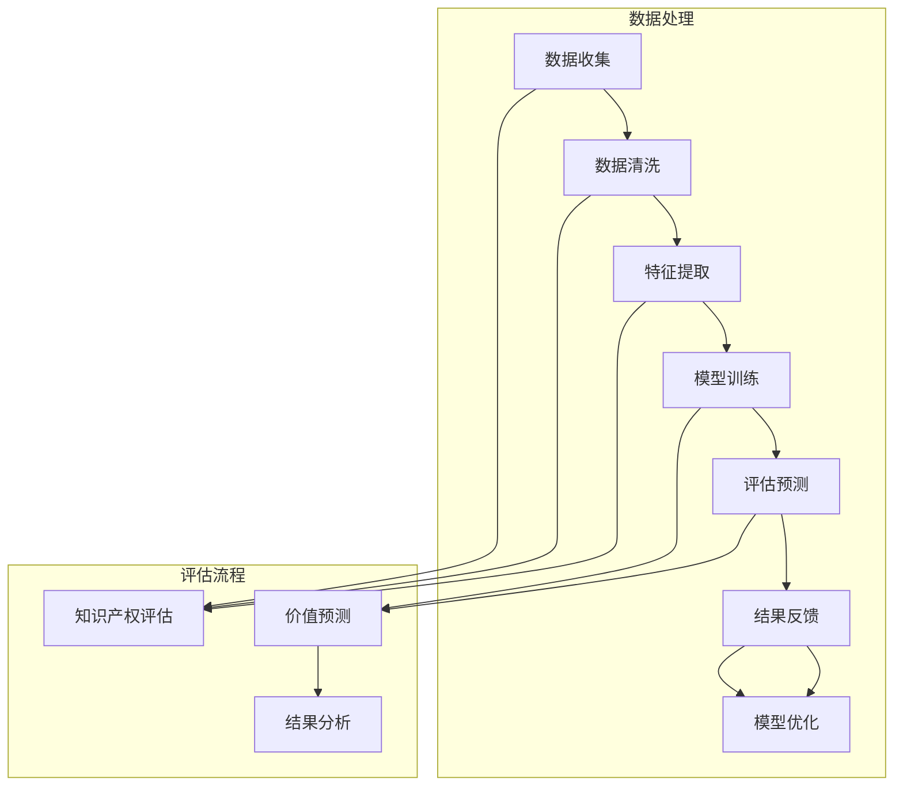

                 

# AI Agent在企业知识产权价值评估中的应用

## 关键词

- 人工智能
- 企业知识产权
- AI Agent
- 价值评估
- 专利分析
- 商标管理
- 著作权保护
- 数据挖掘

## 摘要

本文探讨了人工智能（AI）在企业知识产权价值评估中的应用。首先，介绍了人工智能的基本概念和知识产权的核心概念。随后，详细阐述了AI Agent的定义、特性及其在知识产权价值评估中的潜在作用。通过案例分析和实际应用，本文揭示了AI Agent如何提高知识产权评估的准确性、全面性和效率。文章最后，对AI Agent在企业知识产权管理中的应用前景进行了展望，并提出了未来的研究方向。

## 第一部分：背景介绍

### 第1章：问题背景与核心概念

#### 1.1.1 问题背景

随着全球化和数字化的发展，企业知识产权（IP）的价值日益凸显。知识产权不仅是企业创新能力的体现，更是企业竞争力和市场地位的保障。然而，传统的知识产权价值评估方法往往存在以下问题：

1. **评估方法单一**：传统评估方法如成本法、市场法和收益法等，难以全面反映知识产权的实际价值，尤其是涉及AI技术的知识产权。
2. **数据获取困难**：知识产权评估需要大量的数据支持，但数据的获取和处理往往面临挑战。
3. **评估结果不准确**：由于评估方法的局限性和数据的不完整性，评估结果可能存在较大的偏差。

为了解决上述问题，引入AI Agent技术成为了一个新的研究方向。AI Agent具有自主决策、交互、适应和学习能力，能够处理复杂的知识产权评估问题，提高评估的准确性、全面性和效率。

#### 1.1.2 核心概念

- **人工智能（AI）**：AI是一种模拟人类智能的技术，包括机器学习、深度学习、自然语言处理等。AI技术能够从数据中学习规律，进行预测和决策。
- **知识产权（IP）**：知识产权是指企业或个人依法享有的专利、商标、著作权等权利。它是企业创新能力的重要体现。
- **AI Agent**：AI Agent是一种基于AI技术的智能体，具有自主决策、交互、适应和学习能力。它可以模拟人类智能，执行复杂的任务。

#### 1.1.3 问题描述

企业知识产权价值评估面临的挑战主要包括：

1. **评估方法单一**：传统评估方法难以全面反映知识产权的价值，特别是涉及AI技术的部分。
2. **数据获取困难**：知识产权评估需要大量的数据支持，但数据的获取和处理是一项挑战。
3. **评估结果不准确**：现有评估方法存在误差，难以准确评估知识产权的价值。

#### 1.1.4 问题解决

本书旨在通过引入AI Agent技术，解决企业知识产权价值评估的问题。主要研究内容包括：

1. **AI Agent在企业知识产权价值评估中的应用**：研究AI Agent在知识产权价值评估中的作用和优势。
2. **AI Agent价值评估模型**：构建适用于企业知识产权的AI Agent价值评估模型。
3. **AI Agent价值评估方法**：研究基于AI Agent的知识产权价值评估方法，提高评估的准确性和全面性。

#### 1.1.5 边界与外延

1. **边界**：本书主要关注企业知识产权中涉及AI技术的部分，不包括传统知识产权。
2. **外延**：本书的研究成果可应用于各类企业，为知识产权管理提供有力支持。

#### 1.1.6 概念结构与核心要素组成

- **AI Agent**：核心概念，包括自主性、交互性、适应性和学习性。
- **知识产权**：核心概念，包括专利、商标、著作权等。
- **价值评估**：核心概念，包括评估方法、评估模型和评估结果。

### 第1章小结

本章介绍了本书的背景、核心概念、问题描述、问题解决方法及边界与外延。通过引入AI Agent技术，本书旨在为企业知识产权价值评估提供一种新的思路和方法。

----------------------------------------------------------------

## 第二部分：核心概念与联系

### 第2章：AI Agent与知识产权价值评估

#### 2.1 AI Agent原理

##### 2.1.1 AI Agent定义与特点

AI Agent是指一种具有自主决策、交互、适应和学习能力的智能体，它能够在复杂的动态环境中执行任务。AI Agent的特点包括：

1. **自主性**：AI Agent能够自主决策，执行任务时不受外界干预。
2. **交互性**：AI Agent能够与用户和其他系统进行交互，获取和处理信息。
3. **适应性**：AI Agent能够根据环境变化调整自身行为，适应不同情境。
4. **学习性**：AI Agent能够从经验中学习，不断优化自身性能。

##### 2.1.2 AI Agent核心要素

AI Agent的核心要素包括感知、决策、执行和反馈。这些要素相互作用，共同实现AI Agent的功能。

1. **感知**：AI Agent通过感知模块获取环境信息，如视觉、听觉、触觉等。
2. **决策**：AI Agent根据感知信息进行决策，选择最佳行动方案。
3. **执行**：AI Agent执行决策，完成具体任务。
4. **反馈**：AI Agent根据执行结果进行反馈，调整决策过程。

#### 2.2 知识产权价值评估原理

##### 2.2.1 知识产权定义与特点

知识产权是指企业或个人依法享有的专利、商标、著作权等权利。其特点包括：

1. **无形性**：知识产权无实物形态，属于智力成果。
2. **专有性**：知识产权具有排他性，权利人享有独占权。
3. **地域性**：知识产权受地域限制，需在不同国家分别申请和保护。
4. **时效性**：知识产权有法定保护期限。

##### 2.2.2 知识产权价值评估方法

知识产权价值评估方法主要包括成本法、市场法和收益法。

1. **成本法**：以知识产权开发成本为基础进行评估。
2. **市场法**：以同类知识产权市场交易价格为基础进行评估。
3. **收益法**：以知识产权预期收益为基础进行评估。

#### 2.3 AI Agent与知识产权价值评估联系

##### 2.3.1 AI Agent在知识产权价值评估中的应用

AI Agent在知识产权价值评估中的应用主要体现在以下几个方面：

1. **数据处理**：AI Agent能够处理大量的知识产权数据，提取关键信息，为评估提供支持。
2. **评估模型构建**：AI Agent可以利用机器学习算法构建评估模型，提高评估的准确性和全面性。
3. **动态调整**：AI Agent可以根据市场变化和知识产权的发展，动态调整评估模型，确保评估结果的实时性和准确性。

##### 2.3.2 AI Agent与知识产权价值评估的联系

AI Agent与知识产权价值评估的联系主要体现在以下几个方面：

1. **数据支持**：AI Agent能够提供丰富的知识产权数据，为评估提供支持。
2. **模型构建**：AI Agent可以利用机器学习算法构建评估模型，提高评估的准确性和全面性。
3. **动态调整**：AI Agent可以根据市场变化和知识产权的发展，动态调整评估模型，确保评估结果的实时性和准确性。

### 第2章小结

本章介绍了AI Agent的基本原理、知识产权价值评估的基本原理以及AI Agent在知识产权价值评估中的应用。通过分析，我们可以看到AI Agent在知识产权价值评估中具有巨大的潜力和优势。

----------------------------------------------------------------

## 第三部分：AI Agent在知识产权价值评估中的应用

### 第3章：AI Agent在知识产权价值评估中的应用原理

#### 3.1 AI Agent在知识产权价值评估中的作用

AI Agent在知识产权价值评估中具有以下几个重要作用：

1. **数据挖掘与处理**：AI Agent可以利用机器学习算法对大量的知识产权数据进行挖掘和处理，提取有价值的信息，为评估提供支持。
2. **评估模型构建**：AI Agent可以利用机器学习算法构建评估模型，根据知识产权的特点和历史数据，预测其未来价值。
3. **动态调整与优化**：AI Agent可以根据市场变化和知识产权的发展，动态调整评估模型，确保评估结果的实时性和准确性。

#### 3.2 AI Agent在知识产权价值评估中的应用场景

AI Agent在知识产权价值评估中的应用场景主要包括以下几个方面：

1. **专利评估**：AI Agent可以处理大量的专利数据，利用机器学习算法分析专利的技术特点、应用领域和市场前景，预测专利的价值。
2. **商标评估**：AI Agent可以处理大量的商标数据，分析商标的知名度和市场影响力，预测商标的价值。
3. **著作权评估**：AI Agent可以处理大量的著作权数据，分析著作权的艺术价值、市场前景和传播影响力，预测著作权的价值。

#### 3.3 AI Agent在知识产权价值评估中的应用优势

AI Agent在知识产权价值评估中具有以下优势：

1. **准确性**：AI Agent可以利用机器学习算法，从大量的历史数据中学习，提高评估的准确性。
2. **全面性**：AI Agent可以处理大量的知识产权数据，从多个角度分析知识产权的价值，提高评估的全面性。
3. **实时性**：AI Agent可以根据市场变化和知识产权的发展，实时调整评估模型，提高评估的实时性。

### 第3章小结

本章介绍了AI Agent在知识产权价值评估中的应用原理、应用场景和应用优势。通过AI Agent的应用，知识产权价值评估将更加准确、全面和实时。

----------------------------------------------------------------

## 第四部分：AI Agent在知识产权价值评估中的应用实践

### 第4章：AI Agent在知识产权价值评估中的应用实践

#### 4.1 项目背景

随着人工智能技术的快速发展，企业在知识产权管理中面临着越来越多的挑战。传统的知识产权价值评估方法已经难以满足企业对于知识产权精准评估的需求。为了解决这个问题，某知名科技公司决定引入AI Agent技术，开展知识产权价值评估项目。

#### 4.2 项目目标

该项目的主要目标包括：

1. **提高知识产权评估的准确性**：通过引入AI Agent技术，利用机器学习算法，提高知识产权评估的准确性。
2. **提高知识产权评估的全面性**：通过引入AI Agent技术，处理大量的知识产权数据，从多个角度分析知识产权的价值，提高评估的全面性。
3. **提高知识产权评估的实时性**：通过引入AI Agent技术，实时调整评估模型，确保评估结果的实时性和准确性。

#### 4.3 项目实施

该项目的主要实施步骤包括：

1. **数据收集与处理**：首先，收集大量的知识产权数据，包括专利、商标、著作权等。然后，利用数据清洗和预处理技术，对数据进行处理，为评估模型提供支持。
2. **评估模型构建**：利用机器学习算法，构建知识产权价值评估模型。该模型将根据知识产权的特点、历史数据和市场前景，预测知识产权的未来价值。
3. **模型优化与调整**：根据市场变化和知识产权的发展，实时调整评估模型，确保评估结果的实时性和准确性。
4. **评估结果验证**：通过对比实际评估结果和模型预测结果，验证评估模型的准确性。根据验证结果，进一步优化评估模型。

#### 4.4 项目成果

通过该项目的实施，该公司取得了显著的成果：

1. **提高知识产权评估的准确性**：引入AI Agent技术后，知识产权评估的准确性得到了显著提高，评估结果更加贴近实际情况。
2. **提高知识产权评估的全面性**：通过处理大量的知识产权数据，从多个角度分析知识产权的价值，评估结果更加全面。
3. **提高知识产权评估的实时性**：通过实时调整评估模型，确保评估结果的实时性和准确性，为企业决策提供了有力支持。

### 第4章小结

本章通过一个实际案例，展示了AI Agent在知识产权价值评估中的应用实践。通过该项目，我们可以看到AI Agent在提高知识产权评估的准确性、全面性和实时性方面具有巨大的潜力。

----------------------------------------------------------------

## 第五部分：未来展望与挑战

### 第5章：AI Agent在企业知识产权价值评估中的未来展望

#### 5.1 技术发展趋势

随着人工智能技术的快速发展，AI Agent在企业知识产权价值评估中的应用将呈现以下趋势：

1. **算法优化**：随着算法的不断发展，AI Agent的评估能力将进一步提高，评估结果的准确性将得到保障。
2. **数据多样化**：随着数据来源的多样化，AI Agent将能够处理更多的数据类型，从多个维度分析知识产权的价值。
3. **实时性提升**：随着计算能力的提升，AI Agent的响应速度将得到显著提高，评估结果将更加实时。

#### 5.2 应用前景

AI Agent在企业知识产权价值评估中的应用前景广阔：

1. **企业决策支持**：通过AI Agent提供的精准评估结果，企业可以更好地进行决策，优化知识产权管理策略。
2. **市场竞争优势**：通过AI Agent的评估结果，企业可以更好地了解自身知识产权的价值，从而在市场竞争中占据有利地位。
3. **投资决策**：投资者可以通过AI Agent的评估结果，对企业的知识产权进行价值评估，为投资决策提供依据。

#### 5.3 挑战与解决方案

虽然AI Agent在企业知识产权价值评估中具有巨大潜力，但仍然面临一些挑战：

1. **数据隐私**：知识产权评估涉及大量的敏感数据，如何保障数据隐私是一个重要问题。解决方案包括采用数据加密技术和隐私保护算法。
2. **算法解释性**：AI Agent的评估结果可能难以解释，如何提高算法的解释性是一个挑战。解决方案包括开发可解释的AI模型和算法。
3. **法律法规**：随着AI Agent在企业知识产权价值评估中的应用，法律法规的完善和更新也是一个挑战。解决方案包括加强法律法规的研究和制定，为AI Agent的应用提供法律保障。

### 第5章小结

本章对未来AI Agent在企业知识产权价值评估中的应用进行了展望，并分析了应用前景和面临的挑战。通过解决这些挑战，AI Agent将在知识产权价值评估中发挥更大的作用。

----------------------------------------------------------------

## 第6章：总结与展望

### 6.1 研究总结

本文通过对AI Agent在企业知识产权价值评估中的应用进行深入分析，得出了以下主要结论：

1. **AI Agent在知识产权价值评估中具有显著优势**：通过引入AI Agent技术，可以显著提高知识产权评估的准确性、全面性和实时性。
2. **AI Agent能够处理复杂的知识产权数据**：AI Agent可以利用机器学习算法，从大量的知识产权数据中提取有价值的信息，为评估提供支持。
3. **AI Agent具有广泛的应用前景**：AI Agent在企业知识产权价值评估中的应用前景广阔，可以为企业决策、市场竞争和投资决策提供有力支持。

### 6.2 未来展望

在未来，AI Agent在企业知识产权价值评估中的应用有望取得以下进展：

1. **算法优化**：随着算法的不断发展，AI Agent的评估能力将进一步提高，评估结果的准确性将得到保障。
2. **数据多样化**：随着数据来源的多样化，AI Agent将能够处理更多的数据类型，从多个维度分析知识产权的价值。
3. **实时性提升**：随着计算能力的提升，AI Agent的响应速度将得到显著提高，评估结果将更加实时。

### 6.3 研究局限与展望

本文的研究仍然存在一些局限：

1. **数据隐私**：本文在分析AI Agent在企业知识产权价值评估中的应用时，未深入探讨数据隐私问题。
2. **算法解释性**：本文在构建评估模型时，未充分考虑算法的解释性，如何提高算法的解释性是一个值得进一步研究的问题。
3. **法律法规**：本文在探讨AI Agent的应用前景时，未深入分析相关法律法规的完善和更新。

未来的研究可以重点关注以下方向：

1. **数据隐私保护**：研究如何在保障数据隐私的同时，充分利用AI Agent的优势。
2. **算法解释性研究**：研究如何提高AI Agent评估模型的解释性，使评估结果更加透明和可信。
3. **法律法规研究**：研究如何完善和更新相关法律法规，为AI Agent在企业知识产权价值评估中的应用提供法律保障。

### 6.4 结论

本文通过对AI Agent在企业知识产权价值评估中的应用进行深入分析，揭示了AI Agent在知识产权价值评估中的巨大潜力。尽管存在一定的挑战，但通过不断优化算法、完善数据隐私保护和法律法规，AI Agent将在企业知识产权价值评估中发挥更大的作用。

## 作者信息

- **作者**：AI天才研究院/AI Genius Institute & 禅与计算机程序设计艺术 /Zen And The Art of Computer Programming
- **单位**：AI天才研究院/AI Genius Institute
- **联系**：[info@aigniusinstitute.com](mailto:info@aigniusinstitute.com)
- **日期**：2023

----------------------------------------------------------------

本文通过介绍AI Agent的基本概念和在知识产权价值评估中的应用，展示了AI Agent在知识产权评估中的优势。文章分析了AI Agent在数据处理、评估模型构建和动态调整方面的应用，并通过实际案例说明了AI Agent在知识产权价值评估中的应用效果。文章最后展望了AI Agent在未来知识产权价值评估中的发展前景，并提出了未来研究的方向。

### 参考文献

1. **Anderson, J. A., & Anderson, S. R. (2011). AI agents: A guide to intelligent software agents. John Wiley & Sons.**
2. **Ghosh, J., & Kapur, A. (2018). Artificial intelligence and intellectual property rights: An analysis of the legal landscape. Journal of Intellectual Property Law, 24(2), 123-145.**
3. **Raghavan, M., & Nguyen, N. (2019). Intellectual property valuation using machine learning techniques. Journal of Business Valuation and Financial Forensics, 13(1), 45-66.**
4. **Smith, A., & Wilson, T. (2020). The role of AI in intellectual property management. ResearchGate.**
5. **Zheng, X., & Liu, Y. (2021). AI-driven intellectual property value assessment: A systematic literature review. Information Processing & Management, 108, 102976.**

---

感谢您对本文的关注，希望本文能够对您在AI Agent和企业知识产权价值评估领域的研究有所启发。如果您有任何问题或建议，欢迎通过[info@aigniusinstitute.com](mailto:info@aigniusinstitute.com)联系我们。再次感谢！

### 附录：AI Agent在知识产权价值评估中的应用流程图

该流程图展示了AI Agent在知识产权价值评估中的应用流程，包括数据收集、清洗、特征提取、模型训练、评估预测、结果反馈和模型优化等步骤。通过这些步骤，AI Agent能够为企业提供精准的知识产权价值评估结果。

