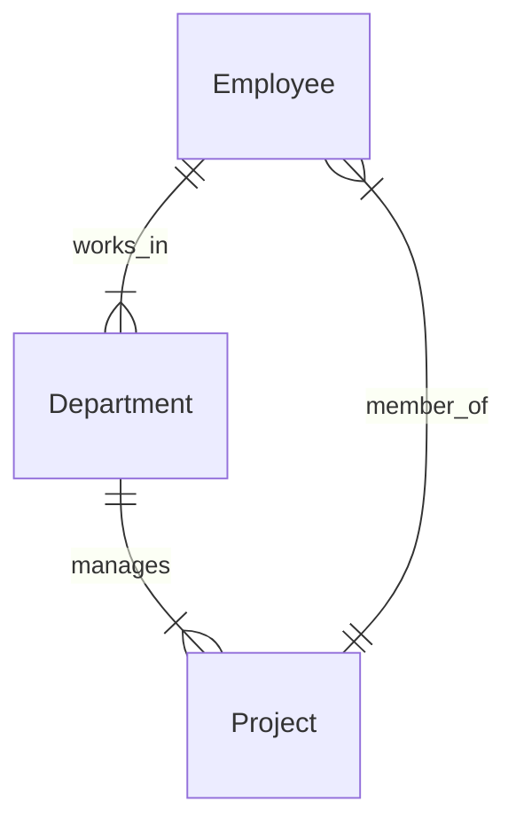
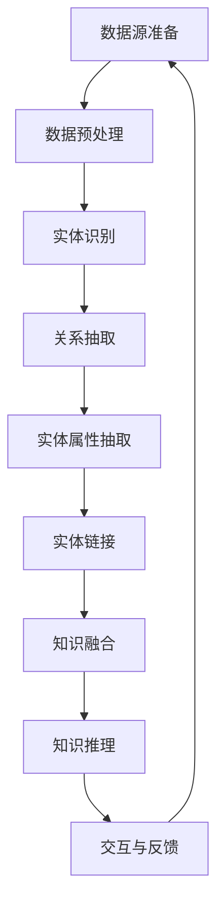
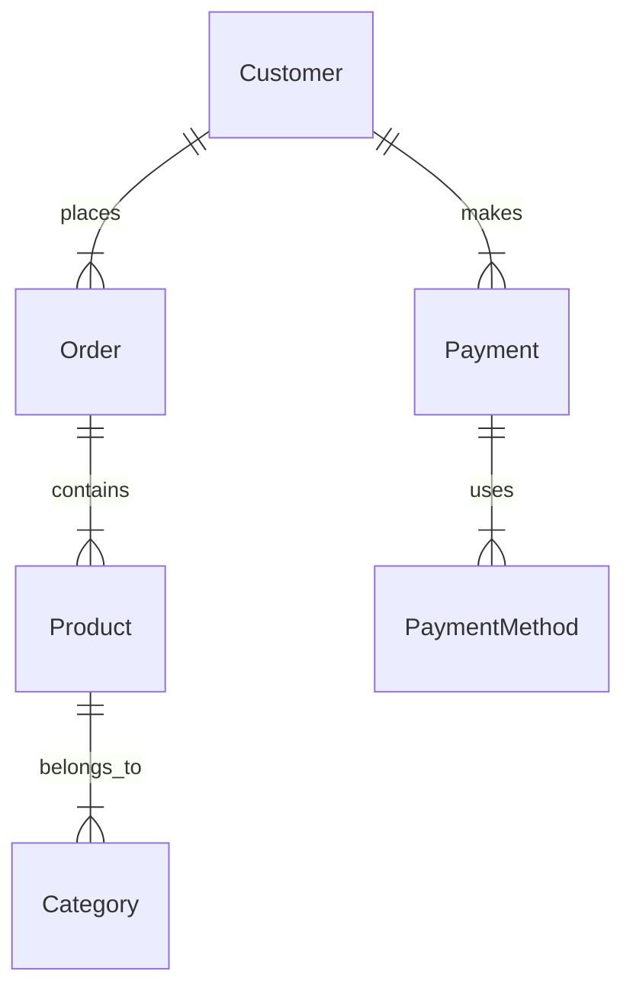
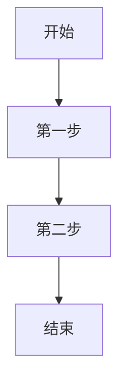
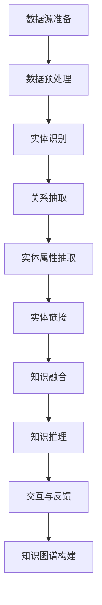
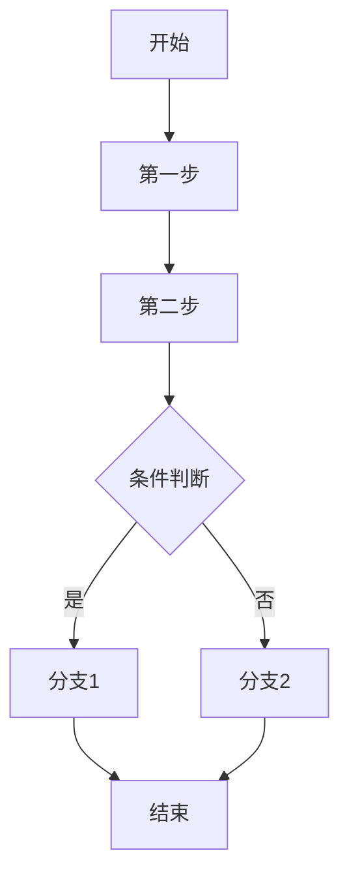
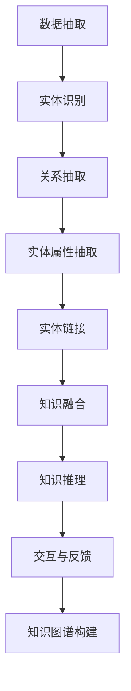
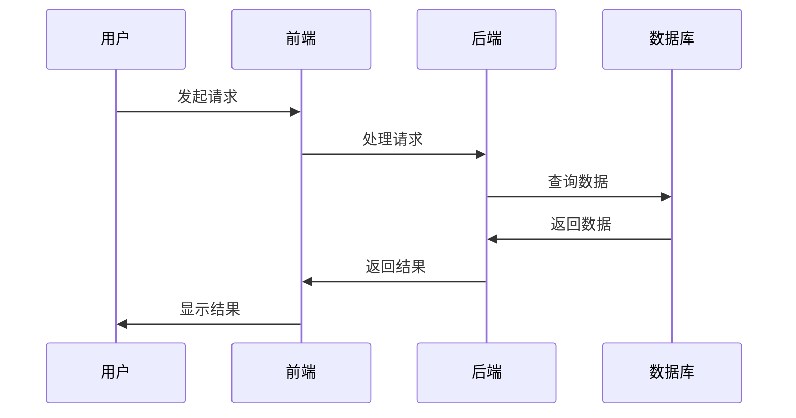

                 

# AI Agent在企业知识图谱构建与应用中的作用

## 关键词
- AI Agent
- 知识图谱
- 企业应用
- 知识管理
- 数据挖掘

## 摘要
本文将深入探讨AI Agent在企业知识图谱构建中的应用，从背景介绍、核心概念与联系、算法原理讲解、系统分析与架构设计以及项目实战等多个角度，详细阐述AI Agent在企业知识图谱构建中的重要作用。通过本文，读者将了解AI Agent与知识图谱的基本概念、构建方法，以及它们在企业中的应用，并掌握AI Agent在知识图谱构建中的算法原理和系统设计方法。

## 目录大纲设计思路

### 1. 确定核心主题

本文的核心主题是“AI Agent在企业知识图谱构建与应用中的作用”。为确保每个章节的内容围绕这一主题，我们将分为四个主要部分：背景介绍、核心概念与联系、算法原理讲解、系统分析与架构设计。

### 2. 构建框架结构

本文的框架结构分为以下四个部分：

- **背景介绍**：介绍AI Agent、知识图谱的基本概念，以及它们在企业中的应用背景。
- **核心概念与联系**：详细阐述AI Agent和知识图谱的理论知识，包括它们的基本原理、核心概念和相互关系。
- **算法原理讲解**：讲解AI Agent在知识图谱构建中的应用算法，使用Mermaid绘制流程图，并配合Python代码和数学公式进行详细阐述。
- **系统分析与架构设计**：分析企业知识图谱系统的设计和实现，包括领域模型、系统架构、接口设计等，并使用Mermaid绘制相关的图表。

### 3. 细化章节内容

在每个部分中，我们将细化章节内容，确保内容的逻辑性和连贯性。例如，在背景介绍部分，我们将介绍AI Agent和知识图谱的基本概念，并在后续章节中逐步深入探讨它们在企业中的应用。

### 4. 设计项目实战

为了使读者更好地理解AI Agent在知识图谱构建中的应用，我们将设计一个实际项目实战章节，包括环境安装、系统核心实现、代码解读和分析、案例剖析等。

### 5. 总结与拓展

在每个部分结束后，我们将提供小结和拓展阅读，帮助读者巩固知识点，了解更多相关信息。

## 目录大纲

### 第一部分：背景介绍

**第1章 AI Agent与知识图谱概述**

**第2章 企业应用背景与需求**

### 第二部分：核心概念与联系

**第3章 AI Agent的原理与知识图谱的构建**

**第4章 关键概念属性对比**

**第5章 ER实体关系图架构**

### 第三部分：算法原理讲解

**第6章 AI Agent在知识图谱构建中的应用算法**

**第7章 Mermaid流程图绘制**

**第8章 Python代码与数学模型**

**第9章 深度学习在知识图谱中的应用**

### 第四部分：系统分析与架构设计

**第10章 系统分析与架构设计**

**第11章 项目实战**

### 总结与拓展

**第12章 最佳实践 tips**

**第13章 小结与拓展阅读**

**第14章 作者信息**

**下一章节：第1章 AI Agent与知识图谱概述**

### 第1章 AI Agent与知识图谱概述

#### 1.1 AI Agent的概念与特性

##### 1.1.1 AI Agent的定义

AI Agent，即人工智能代理，是指具备一定自主性和智能性的计算机程序，能够在复杂环境中根据环境和目标自主做出决策和行动。AI Agent通常具有感知环境、制定计划、执行任务、学习改进等能力。

##### 1.1.2 AI Agent的特性

- **自主性**：能够自主地制定决策和行动策略。
- **适应性**：能够根据环境和任务的变化调整自身的行为。
- **学习能力**：通过经验和数据不断优化自身性能。
- **交互性**：能够与用户和环境进行有效的信息交换和互动。

##### 1.1.3 AI Agent的类型

根据功能和应用场景，AI Agent可以分为以下几类：

- **任务型代理**：专注于完成特定任务的代理，如自动客服、智能助手等。
- **社交型代理**：具备社交能力的代理，如聊天机器人、社交网络上的虚拟人物等。
- **数据挖掘型代理**：专注于从大量数据中提取有价值信息的代理，如智能推荐系统、市场预测系统等。

#### 1.2 知识图谱的基本概念

##### 1.2.1 知识图谱的定义

知识图谱（Knowledge Graph）是一种结构化数据存储方式，用于表示实体及其之间的关系。它通过节点（实体）和边（关系）来描述实体之间的复杂联系，能够实现高效的数据查询和推理。

##### 1.2.2 知识图谱的结构

知识图谱通常由以下三个主要部分组成：

- **实体**：知识图谱中的基本元素，代表现实世界中的对象、概念或实体，如人、地点、事物等。
- **关系**：描述实体之间关系的属性，如“属于”、“位于”、“创造”等。
- **属性**：实体的属性特征，如人的姓名、年龄、职业等。

##### 1.2.3 知识图谱的应用领域

知识图谱在多个领域具有广泛应用，如：

- **搜索引擎**：用于优化搜索结果，提高信息检索效率。
- **推荐系统**：通过分析用户行为和兴趣，为用户提供个性化推荐。
- **智能问答**：基于知识图谱提供准确、快速的信息查询和问答服务。
- **自然语言处理**：用于文本分类、情感分析、机器翻译等任务。

#### 1.3 AI Agent与知识图谱的关系

##### 1.3.1 AI Agent在知识图谱中的作用

AI Agent在知识图谱中扮演了重要的角色，主要体现在以下几个方面：

- **数据抽取与清洗**：AI Agent能够自动地从非结构化或半结构化数据中抽取有效信息，并将其转换为结构化的知识图谱。
- **知识推理与扩展**：AI Agent利用知识图谱中的实体关系进行推理，发现新的知识和关联，实现知识的扩展和更新。
- **智能查询与搜索**：AI Agent能够根据用户需求，通过知识图谱提供高效、准确的查询和搜索服务。
- **交互与反馈**：AI Agent通过与用户的交互，不断学习和优化自身性能，提高知识图谱的应用效果。

##### 1.3.2 知识图谱对AI Agent的支撑

知识图谱为AI Agent提供了以下支持：

- **数据基础**：知识图谱为AI Agent提供了丰富的数据资源，使其能够获取更多有用的信息和知识。
- **语义理解**：知识图谱提供了实体和关系之间的语义联系，有助于AI Agent更好地理解用户的意图和需求。
- **推理能力**：知识图谱中的实体关系和属性信息为AI Agent提供了推理基础，使其能够进行更复杂、智能的决策和行动。

##### 1.3.3 AI Agent与知识图谱的结合形式

AI Agent与知识图谱的结合形式可以有多种，如：

- **集成式**：将AI Agent嵌入到知识图谱系统中，使其具备知识抽取、推理和交互等功能。
- **协作式**：AI Agent与知识图谱系统相互独立，通过接口进行数据交换和协同工作。
- **扩展式**：AI Agent利用知识图谱提供的数据和推理能力，扩展其功能和应用范围。

#### 1.4 企业应用背景与需求

##### 1.4.1 企业知识管理的挑战

在当今快速发展的商业环境中，企业面临着知识管理的挑战，主要包括：

- **数据多样性**：企业中存在着大量结构化、半结构化和非结构化数据，难以进行有效整合和管理。
- **信息孤岛**：不同部门之间的数据和信息存在隔离，导致信息共享和协同效率低下。
- **知识衰减**：员工离职、退休等因素导致企业知识流失，影响企业的创新能力和竞争力。

##### 1.4.2 AI Agent在知识管理中的应用

AI Agent在企业知识管理中的应用包括：

- **知识抽取**：AI Agent能够自动地从企业内外部数据源中抽取有价值的信息，并将其转化为知识图谱。
- **知识融合**：AI Agent能够整合企业内部不同部门、不同系统之间的知识，实现信息共享和协同。
- **知识推理**：AI Agent利用知识图谱进行推理，为企业提供智能决策支持。
- **知识查询**：AI Agent能够根据用户需求，通过知识图谱提供高效、准确的查询和搜索服务。

##### 1.4.3 企业对知识图谱的需求

企业对知识图谱的需求主要包括：

- **提高信息检索效率**：通过知识图谱实现快速、准确的查询和搜索，提高企业内部信息检索效率。
- **优化业务流程**：通过知识图谱实现业务流程的自动化和优化，提高企业运营效率。
- **增强决策支持**：利用知识图谱提供智能决策支持，帮助企业更好地应对市场变化和竞争压力。
- **提升客户体验**：通过知识图谱实现个性化服务，提高客户满意度和忠诚度。

#### 1.5 本章小结

本章介绍了AI Agent与知识图谱的基本概念、特性、应用领域，以及它们在企业知识管理中的应用背景和需求。通过本章的学习，读者可以初步了解AI Agent与知识图谱的基本知识和它们在企业中的应用前景。在接下来的章节中，我们将进一步深入探讨AI Agent在知识图谱构建中的具体应用和实践。

### 第2章 AI Agent的原理与知识图谱的构建

#### 2.1 AI Agent的原理

##### 2.1.1 人工智能的基本概念

人工智能（Artificial Intelligence，简称AI）是指通过计算机模拟人类智能行为的技术和科学。人工智能的研究目标是开发出能够理解、学习、推理、规划和解决复杂问题的智能系统。

##### 2.1.2 代理系统的基本概念

代理系统（Agent-Based System）是一种基于代理（Agent）的计算机系统，其中每个代理都是独立的、自治的实体，能够自主地执行任务、与环境进行交互，并通过学习不断优化自身行为。

代理系统通常包含以下基本组成部分：

- **感知器**：用于感知环境中的信息，如视觉、听觉、触觉等。
- **决策器**：根据感知器收集的信息，生成决策和行动计划。
- **执行器**：执行决策器制定的行动计划，实现具体任务。
- **学习器**：通过经验和反馈，不断优化代理的行为策略。

##### 2.1.3 AI Agent的工作原理

AI Agent的工作原理可以概括为以下几个步骤：

1. **感知环境**：代理通过感知器获取环境信息，如文本、图像、声音等。
2. **数据处理**：对感知到的信息进行预处理，提取有用特征，构建数据模型。
3. **决策制定**：利用决策器根据数据模型和预设规则，生成行动决策。
4. **任务执行**：执行器根据决策制定行动计划，实现具体任务。
5. **反馈学习**：根据任务执行结果，更新数据模型和决策规则，优化代理行为。

#### 2.2 知识图谱的构建方法

##### 2.2.1 知识抽取方法

知识抽取是指从非结构化或半结构化数据中提取有价值的信息，并将其转换为结构化的知识表示。知识抽取方法主要包括以下几种：

- **规则抽取**：基于预定义的规则，从数据中抽取特定类型的信息。规则通常采用正则表达式、条件表达式等形式。
- **模板抽取**：基于预定义的模板，从数据中抽取特定类型的信息。模板通常包含字段名称、数据类型、数据格式等。
- **语义角色标注**：通过对文本进行语义角色标注，提取实体及其关系。语义角色标注通常采用自然语言处理技术，如命名实体识别、关系抽取等。
- **机器学习抽取**：利用机器学习算法，从数据中自动学习抽取规则和模型。常见的机器学习算法包括决策树、支持向量机、神经网络等。

##### 2.2.2 知识融合方法

知识融合是指将来自不同源的数据、知识和信息进行整合，形成统一、完整、一致的知识表示。知识融合方法主要包括以下几种：

- **数据整合**：将不同数据源中的数据整合到一个统一的数据集中，如使用ETL（Extract, Transform, Load）技术。
- **语义整合**：将不同源的数据在语义上进行整合，如使用本体论（Ontology）进行数据统一表示。
- **知识融合模型**：构建知识融合模型，如基于信任度、相似度、相关度等度量方法，将不同源的知识进行融合。

##### 2.2.3 知识表示方法

知识表示是指将知识以计算机可处理的形式进行编码和表示。知识表示方法主要包括以下几种：

- **图表示**：使用图结构表示知识，如知识图谱。图中的节点表示实体，边表示实体之间的关系。
- **表格表示**：使用表格形式表示知识，如关系数据库。表格中的行表示实体，列表示属性。
- **语义网络表示**：使用语义网络表示知识，如RDF（Resource Description Framework）。语义网络中的主体表示实体，谓词表示关系，对象表示属性的值。
- **文本表示**：使用文本形式表示知识，如自然语言文本。文本表示通常采用自然语言处理技术进行语义分析和理解。

#### 2.3 AI Agent与知识图谱的相互关系

##### 2.3.1 AI Agent在知识图谱构建中的作用

AI Agent在知识图谱构建中扮演了关键角色，主要体现在以下几个方面：

- **数据抽取与清洗**：AI Agent能够自动地从非结构化或半结构化数据中抽取有价值的信息，并将其转化为结构化的知识表示。
- **知识融合与整合**：AI Agent能够将来自不同源的数据、知识和信息进行整合，形成统一、完整、一致的知识表示。
- **知识推理与扩展**：AI Agent利用知识图谱进行推理，发现新的知识和关联，实现知识的扩展和更新。
- **交互与反馈**：AI Agent通过与用户的交互，不断学习和优化自身性能，提高知识图谱的应用效果。

##### 2.3.2 知识图谱在AI Agent中的作用

知识图谱为AI Agent提供了以下支持：

- **数据基础**：知识图谱为AI Agent提供了丰富的数据资源，使其能够获取更多有用的信息和知识。
- **语义理解**：知识图谱提供了实体和关系之间的语义联系，有助于AI Agent更好地理解用户的意图和需求。
- **推理能力**：知识图谱中的实体关系和属性信息为AI Agent提供了推理基础，使其能够进行更复杂、智能的决策和行动。

##### 2.3.3 AI Agent与知识图谱的结合方式

AI Agent与知识图谱的结合方式可以有多种，如：

- **集成式**：将AI Agent嵌入到知识图谱系统中，使其具备知识抽取、推理和交互等功能。
- **协作式**：AI Agent与知识图谱系统相互独立，通过接口进行数据交换和协同工作。
- **扩展式**：AI Agent利用知识图谱提供的数据和推理能力，扩展其功能和应用范围。

#### 2.4 关键概念属性对比

为了更好地理解AI Agent与知识图谱之间的关系，我们可以对比它们的关键概念和属性，如下表所示：

| 概念/属性 | AI Agent | 知识图谱 |
| :----: | :----: | :----: |
| 目标 | 自主决策和行动 | 实体关系建模 |
| 感知 | 环境信息 | 实体及其属性 |
| 决策 | 行动策略 | 实体关系 |
| 执行 | 任务执行 | 实体属性值 |
| 学习 | 经验反馈 | 知识推理和扩展 |

#### 2.5 ER实体关系图架构

##### 2.5.1 ER图的基本概念

ER图（Entity-Relationship Diagram）是一种用于描述实体及其关系的图形化工具。它由三个基本组成部分组成：

- **实体**：表示现实世界中的对象或概念，如人、地点、事物等。
- **属性**：表示实体的特征或描述，如人的姓名、年龄、职业等。
- **关系**：表示实体之间的联系，如“属于”、“位于”、“创造”等。

##### 2.5.2 ER图在知识图谱中的应用

ER图在知识图谱中可以用来表示实体及其关系。例如，在一个企业知识图谱中，可以包含员工、部门、项目等实体，以及它们之间的关系，如“员工在部门工作”、“项目由部门管理”等。

##### 2.5.3 Mermaid ER图绘制实例

以下是一个简单的Mermaid ER图实例，用于描述员工、部门和项目之间的关系：



通过这个ER图，我们可以清晰地看到员工、部门和项目之间的实体关系，以及它们之间的关联。

#### 2.6 本章小结

本章介绍了AI Agent的基本原理和知识图谱的构建方法，包括数据抽取、知识融合和知识表示等。我们还讨论了AI Agent与知识图谱的相互关系，以及它们在企业知识图谱构建中的应用。通过本章的学习，读者可以初步了解AI Agent与知识图谱的基本知识和构建方法，为后续章节的学习打下基础。

### 第3章 AI Agent在知识图谱构建中的应用算法

#### 3.1 知识图谱构建算法概述

知识图谱构建是一个复杂的过程，涉及到多个环节，包括数据抽取、实体识别、关系抽取、实体属性抽取、实体链接等。在这一章节中，我们将介绍一些常用的知识图谱构建算法，包括图嵌入、实体链接、关系抽取等。

##### 3.1.1 知识图谱构建的基本流程

知识图谱构建的基本流程通常包括以下几个步骤：

1. **数据源准备**：收集和整理用于构建知识图谱的数据源，包括结构化数据、半结构化数据和非结构化数据。
2. **数据预处理**：对收集到的数据进行清洗、去重、格式化等处理，以便后续的实体识别和关系抽取。
3. **实体识别**：从原始数据中识别出实体，并将其转换为知识图谱中的节点。
4. **关系抽取**：从原始数据中提取实体之间的关系，并将其转换为知识图谱中的边。
5. **实体属性抽取**：从原始数据中提取实体的属性信息，并将其附加到知识图谱中的节点上。
6. **实体链接**：将来自不同数据源的相同实体进行匹配和链接，以消除数据源之间的不一致性。
7. **知识融合**：将来自不同源的数据进行整合，形成统一、完整、一致的知识表示。

##### 3.1.2 知识图谱构建的关键算法

在知识图谱构建过程中，一些关键算法发挥着重要作用，包括：

1. **图嵌入算法**：将知识图谱中的实体和关系嵌入到一个低维空间中，以便进行高效的实体链接和关系预测。
2. **实体链接算法**：将不同数据源中的相同实体进行匹配和链接，以消除数据源之间的不一致性。
3. **关系抽取算法**：从原始数据中提取实体之间的关系。
4. **实体属性抽取算法**：从原始数据中提取实体的属性信息。
5. **图神经网络算法**：利用图结构进行实体关系推理和知识融合。

##### 3.1.3 AI Agent在算法中的应用

AI Agent在知识图谱构建中发挥着重要作用，主要体现在以下几个方面：

- **数据抽取**：AI Agent能够自动地从非结构化或半结构化数据中抽取有价值的信息，并将其转化为结构化的知识表示。
- **知识融合**：AI Agent能够将来自不同源的数据、知识和信息进行整合，形成统一、完整、一致的知识表示。
- **知识推理**：AI Agent利用知识图谱进行推理，发现新的知识和关联，实现知识的扩展和更新。
- **交互与反馈**：AI Agent通过与用户的交互，不断学习和优化自身性能，提高知识图谱的应用效果。

#### 3.2 Mermaid流程图绘制

Mermaid是一种基于Markdown的图表绘制工具，可以方便地绘制各种类型的图表，包括流程图、序列图、类图等。以下是一个简单的Mermaid流程图实例，用于描述知识图谱构建的基本流程：



通过这个流程图，我们可以清晰地看到知识图谱构建的各个步骤及其相互关系。

#### 3.3 Python代码与数学模型

在本章节中，我们将使用Python代码和数学模型来详细阐述知识图谱构建中的关键算法。

##### 3.3.1 Python代码实现

以下是一个简单的Python代码示例，用于实现图嵌入算法：

```python
import numpy as np
import pandas as pd
from sklearn.preprocessing import StandardScaler

# 加载实体数据
entity_data = pd.read_csv('entity_data.csv')

# 初始化实体嵌入向量
entity_embeddings = np.random.rand(len(entity_data), embedding_size)

# 训练嵌入模型
scaler = StandardScaler()
entity_embeddings = scaler.fit_transform(entity_embeddings)

# 输出嵌入结果
entity_embeddings = pd.DataFrame(entity_embeddings, index=entity_data.index)
entity_embeddings.to_csv('entity_embeddings.csv', index_label='entity_id')
```

##### 3.3.2 数学模型与公式

在知识图谱构建中，常用的数学模型和公式包括：

- **图嵌入模型**：实体嵌入向量可以通过以下公式计算：

  $$ e_e = \frac{1}{\sqrt{1 + \alpha}} \cdot \sum_{r \in R_e} \cdot \frac{1}{\sum_{r' \in R_e} \cdot \frac{1}{\alpha + d_{r,e}}} \cdot f(e_r) $$

  其中，$e_e$表示实体$e$的嵌入向量，$R_e$表示与实体$e$相关的关系，$d_{r,e}$表示关系$r$的权重，$f(e_r)$表示关系$r$的函数。

- **实体链接模型**：实体链接可以通过以下公式计算：

  $$ l(e_s, e_t) = \frac{1}{1 + \exp(-\sum_{r \in R_s \cup R_t} \cdot w_r \cdot \cos(e_s, e_t))} $$

  其中，$l(e_s, e_t)$表示实体$e_s$和$e_t$之间的链接概率，$R_s$和$R_t$分别表示实体$e_s$和$e_t$的相关关系，$w_r$表示关系$r$的权重，$\cos(e_s, e_t)$表示实体$e_s$和$e_t$的余弦相似度。

##### 3.3.3 模型解释与示例

以下是一个简单的模型解释和示例：

- **图嵌入模型**：假设我们有两个实体$e_1$和$e_2$，它们的相关关系分别为$R_{e1} = \{r_1, r_2\}$和$R_{e2} = \{r_2, r_3\}$。根据图嵌入模型，我们可以计算出$e_1$和$e_2$的嵌入向量：

  $$ e_{e1} = \frac{1}{\sqrt{1 + \alpha}} \cdot \left( \frac{1}{\alpha + d_{r_1, e1}} \cdot f(e_{r1}) + \frac{1}{\alpha + d_{r_2, e1}} \cdot f(e_{r2}) \right) $$

  $$ e_{e2} = \frac{1}{\sqrt{1 + \alpha}} \cdot \left( \frac{1}{\alpha + d_{r_2, e2}} \cdot f(e_{r2}) + \frac{1}{\alpha + d_{r_3, e2}} \cdot f(e_{r3}) \right) $$

- **实体链接模型**：假设我们有两个实体$e_3$和$e_4$，它们的相关关系分别为$R_{e3} = \{r_4\}$和$R_{e4} = \{r_5\}$。根据实体链接模型，我们可以计算出$e_3$和$e_4$之间的链接概率：

  $$ l(e_3, e_4) = \frac{1}{1 + \exp\left(-\cos(e_{e3}, e_{e4}) \right)} $$

  如果$\cos(e_{e3}, e_{e4})$的值较小，那么$e_3$和$e_4$之间的链接概率会较大，反之亦然。

#### 3.4 深度学习在知识图谱中的应用

深度学习在知识图谱构建中发挥着重要作用，特别是在实体识别、关系抽取和实体属性抽取等方面。以下是一些常用的深度学习算法：

- **卷积神经网络（CNN）**：CNN可以用于文本分类和实体识别。通过卷积层和池化层，CNN能够自动提取文本中的特征，从而实现高效的实体识别。
- **循环神经网络（RNN）**：RNN可以用于序列建模，如关系抽取和实体属性抽取。通过隐藏状态和记忆单元，RNN能够处理长序列数据，从而实现复杂的实体关系和属性建模。
- **长短期记忆网络（LSTM）**：LSTM是RNN的一种变体，能够更好地处理长序列数据。在知识图谱构建中，LSTM可以用于关系抽取和实体属性抽取。
- **图神经网络（GNN）**：GNN可以用于图结构数据的处理和建模。通过图卷积层和池化层，GNN能够自动提取图结构中的特征，从而实现高效的实体关系和属性建模。

以下是一个简单的GNN模型示例，用于实体关系抽取：

```python
import tensorflow as tf
from tensorflow.keras.models import Model
from tensorflow.keras.layers import Input, Dense, Dropout, Embedding, GlobalAveragePooling1D

# 输入层
input_node = Input(shape=(embedding_size,))

# 卷积层
conv1 = Conv1D(filters=64, kernel_size=3, activation='relu')(input_node)
pool1 = MaxPooling1D(pool_size=2)(conv1)

# 循环层
lstm1 = LSTM(units=64, return_sequences=True)(pool1)
lstm2 = LSTM(units=64, return_sequences=False)(lstm1)

# 池化层
pool2 = GlobalAveragePooling1D()(lstm2)

# 输出层
output = Dense(units=1, activation='sigmoid')(pool2)

# 构建模型
model = Model(inputs=input_node, outputs=output)

# 编译模型
model.compile(optimizer='adam', loss='binary_crossentropy', metrics=['accuracy'])

# 训练模型
model.fit(x_train, y_train, epochs=10, batch_size=32, validation_data=(x_val, y_val))
```

通过这个模型，我们可以实现高效的实体关系抽取，从而构建更准确的知识图谱。

#### 3.5 本章小结

本章介绍了知识图谱构建的基本算法，包括图嵌入、实体链接、关系抽取和实体属性抽取等。我们还讨论了AI Agent在知识图谱构建中的应用，以及深度学习在知识图谱构建中的应用。通过本章的学习，读者可以初步了解知识图谱构建的基本原理和方法，为后续章节的学习打下基础。

### 第4章 关键概念属性对比

在知识图谱构建过程中，AI Agent与知识图谱本身是两个核心概念，它们在属性、功能和应用场景等方面有着显著的区别。为了更好地理解这两个概念之间的关系，我们将进行详细的属性对比分析。

#### 4.1 AI Agent的属性特征

AI Agent作为人工智能代理，具备以下主要属性特征：

- **自主性**：AI Agent能够根据预设的目标和环境信息自主制定决策和行动策略。
- **适应性**：AI Agent能够根据环境和任务的变化调整自身行为，实现自适应学习和进化。
- **学习能力**：AI Agent能够从经验中学习，不断优化自身性能，提高决策和行动的准确性。
- **交互性**：AI Agent能够与用户和其他系统进行有效的交互，实现信息的传递和协同工作。
- **多样性**：AI Agent可以根据不同的任务需求和应用场景，设计不同的代理类型和功能。

#### 4.2 知识图谱的属性特征

知识图谱作为结构化数据存储和表示方式，具有以下主要属性特征：

- **实体性**：知识图谱中的实体代表现实世界中的对象、概念或实体，如人、地点、事物等。
- **关系性**：知识图谱中的关系描述实体之间的联系和互动，如“属于”、“位于”、“创造”等。
- **属性性**：知识图谱中的实体具有属性特征，用于描述实体的特征或属性，如人的姓名、年龄、职业等。
- **语义性**：知识图谱中的实体、关系和属性具有明确的语义联系，实现数据的语义理解和推理。
- **扩展性**：知识图谱能够方便地扩展和更新，以适应新的应用场景和需求。

#### 4.3 概念属性特征对比表格

为了更直观地展示AI Agent与知识图谱的属性特征对比，我们可以使用一个表格来进行说明：

| 概念 | 特征 | 说明 |
| :----: | :----: | :----: |
| AI Agent | 自主性 | 能够自主制定决策和行动策略 |
| AI Agent | 适应性 | 能够根据环境和任务变化调整行为 |
| AI Agent | 学习能力 | 能够从经验中学习，优化性能 |
| AI Agent | 交互性 | 能够与用户和其他系统进行交互 |
| AI Agent | 多样性 | 能够根据不同需求设计不同类型 |
| 知识图谱 | 实体性 | 代表现实世界中的对象或概念 |
| 知识图谱 | 关系性 | 描述实体之间的联系和互动 |
| 知识图谱 | 属性性 | 描述实体的特征或属性 |
| 知识图谱 | 语义性 | 具有明确的语义联系，实现数据理解 |
| 知识图谱 | 扩展性 | 方便扩展和更新，适应新需求 |

#### 4.4 ER实体关系图架构

在本节中，我们将使用Mermaid工具绘制一个ER实体关系图，以展示知识图谱中的实体及其关系。ER图是一种常用的数据库设计工具，用于表示实体及其属性和关系。

以下是一个简单的Mermaid ER图示例：



这个ER图展示了客户、订单、支付、产品、分类和支付方式之间的实体关系。其中，每个实体都与至少一个其他实体具有关系，从而形成一个完整的知识图谱。

#### 4.5 本章小结

本章通过对比AI Agent与知识图谱的属性特征，深入分析了它们在知识图谱构建中的应用。我们还使用Mermaid工具绘制了ER实体关系图，展示了知识图谱中的实体及其关系。通过本章的学习，读者可以更好地理解AI Agent与知识图谱之间的关系，为后续章节的学习打下基础。

### 第5章 ER实体关系图架构

#### 5.1 ER图的基本概念

ER图（Entity-Relationship Diagram）是一种用于描述实体及其关系的图形化工具，广泛用于数据库设计和知识图谱构建。ER图由三个基本组成部分组成：

- **实体**（Entity）：表示现实世界中的对象或概念，如人、地点、事物等。在ER图中，实体用矩形表示，矩形内部包含实体名称。
- **属性**（Attribute）：表示实体的特征或描述，如人的姓名、年龄、职业等。属性用椭圆表示，并通过线连接到相应的实体。
- **关系**（Relationship）：表示实体之间的联系，如“属于”、“位于”、“创造”等。关系用菱形表示，并通过线连接到相关的实体。

#### 5.2 ER图在知识图谱中的应用

在知识图谱构建中，ER图可以用来表示实体及其关系，从而实现知识表示和查询。ER图在知识图谱中的应用主要包括以下几个方面：

- **实体表示**：ER图中的实体可以表示知识图谱中的节点，实体的属性可以表示节点的属性特征。
- **关系表示**：ER图中的关系可以表示知识图谱中的边，关系类型可以表示边的类型。
- **数据整合**：通过ER图，可以将不同源的数据进行整合，形成统一的知识表示。
- **查询优化**：ER图可以帮助优化知识图谱的查询效率，通过实体关系图进行索引和查询优化。

#### 5.3 Mermaid ER图绘制实例

Mermaid是一种基于Markdown的图表绘制工具，可以方便地绘制各种类型的图表，包括ER图。以下是一个简单的Mermaid ER图实例，用于描述企业中员工、部门和项目之间的关系：


在这个ER图中，员工（Employee）与部门（Department）之间存在“works_in”关系，部门与项目（Project）之间存在“manages”关系，项目与员工之间存在“member_of”关系。通过这个ER图，我们可以清晰地看到企业中的组织架构和项目成员关系。

#### 5.4 ER图与知识图谱的对比

ER图与知识图谱在表示方法和应用场景上存在一定的差异：

- **表示方法**：ER图通常采用二维表格形式表示实体、属性和关系，而知识图谱采用图结构表示，能够更灵活地表达复杂的关系和关联。
- **应用场景**：ER图主要用于数据库设计和关系型数据库管理，而知识图谱主要用于语义网络构建、智能搜索和推荐系统等。
- **扩展性**：知识图谱具有较强的扩展性，能够方便地添加新的实体、关系和属性，而ER图的扩展性相对较弱。

#### 5.5 本章小结

本章介绍了ER图的基本概念及其在知识图谱中的应用，并通过Mermaid工具绘制了ER图实例。通过本章的学习，读者可以更好地理解ER图在知识图谱构建中的作用，为后续章节的学习打下基础。

### 第6章 AI Agent在知识图谱构建中的应用算法

#### 6.1 知识图谱构建算法概述

知识图谱构建是一个复杂的过程，涉及到多个环节，包括数据抽取、实体识别、关系抽取、实体属性抽取、实体链接等。在本章节中，我们将介绍一些常用的知识图谱构建算法，包括图嵌入、实体链接、关系抽取等。

##### 6.1.1 知识图谱构建的基本流程

知识图谱构建的基本流程通常包括以下几个步骤：

1. **数据源准备**：收集和整理用于构建知识图谱的数据源，包括结构化数据、半结构化数据和非结构化数据。
2. **数据预处理**：对收集到的数据进行清洗、去重、格式化等处理，以便后续的实体识别和关系抽取。
3. **实体识别**：从原始数据中识别出实体，并将其转换为知识图谱中的节点。
4. **关系抽取**：从原始数据中提取实体之间的关系，并将其转换为知识图谱中的边。
5. **实体属性抽取**：从原始数据中提取实体的属性信息，并将其附加到知识图谱中的节点上。
6. **实体链接**：将来自不同数据源的相同实体进行匹配和链接，以消除数据源之间的不一致性。
7. **知识融合**：将来自不同源的数据进行整合，形成统一、完整、一致的知识表示。

##### 6.1.2 知识图谱构建的关键算法

在知识图谱构建过程中，一些关键算法发挥着重要作用，包括：

1. **图嵌入算法**：将知识图谱中的实体和关系嵌入到一个低维空间中，以便进行高效的实体链接和关系预测。
2. **实体链接算法**：将不同数据源中的相同实体进行匹配和链接，以消除数据源之间的不一致性。
3. **关系抽取算法**：从原始数据中提取实体之间的关系。
4. **实体属性抽取算法**：从原始数据中提取实体的属性信息。
5. **图神经网络算法**：利用图结构进行实体关系推理和知识融合。

##### 6.1.3 AI Agent在算法中的应用

AI Agent在知识图谱构建中发挥着重要作用，主要体现在以下几个方面：

- **数据抽取**：AI Agent能够自动地从非结构化或半结构化数据中抽取有价值的信息，并将其转化为结构化的知识表示。
- **知识融合**：AI Agent能够将来自不同源的数据、知识和信息进行整合，形成统一、完整、一致的知识表示。
- **知识推理**：AI Agent利用知识图谱进行推理，发现新的知识和关联，实现知识的扩展和更新。
- **交互与反馈**：AI Agent通过与用户的交互，不断学习和优化自身性能，提高知识图谱的应用效果。

#### 6.2 Mermaid流程图绘制

Mermaid是一种基于Markdown的图表绘制工具，可以方便地绘制各种类型的图表，包括流程图、序列图、类图等。以下是一个简单的Mermaid流程图实例，用于描述知识图谱构建的基本流程：


通过这个流程图，我们可以清晰地看到知识图谱构建的各个步骤及其相互关系。

#### 6.3 Python代码与数学模型

在本章节中，我们将使用Python代码和数学模型来详细阐述知识图谱构建中的关键算法。

##### 6.3.1 Python代码实现

以下是一个简单的Python代码示例，用于实现图嵌入算法：

```python
import numpy as np
import pandas as pd
from sklearn.preprocessing import StandardScaler

# 加载实体数据
entity_data = pd.read_csv('entity_data.csv')

# 初始化实体嵌入向量
entity_embeddings = np.random.rand(len(entity_data), embedding_size)

# 训练嵌入模型
scaler = StandardScaler()
entity_embeddings = scaler.fit_transform(entity_embeddings)

# 输出嵌入结果
entity_embeddings = pd.DataFrame(entity_embeddings, index=entity_data.index)
entity_embeddings.to_csv('entity_embeddings.csv', index_label='entity_id')
```

##### 6.3.2 数学模型与公式

在知识图谱构建中，常用的数学模型和公式包括：

- **图嵌入模型**：实体嵌入向量可以通过以下公式计算：

  $$ e_e = \frac{1}{\sqrt{1 + \alpha}} \cdot \sum_{r \in R_e} \cdot \frac{1}{\sum_{r' \in R_e} \cdot \frac{1}{\alpha + d_{r,e}}} \cdot f(e_r) $$

  其中，$e_e$表示实体$e$的嵌入向量，$R_e$表示与实体$e$相关的关系，$d_{r,e}$表示关系$r$的权重，$f(e_r)$表示关系$r$的函数。

- **实体链接模型**：实体链接可以通过以下公式计算：

  $$ l(e_s, e_t) = \frac{1}{1 + \exp(-\sum_{r \in R_s \cup R_t} \cdot w_r \cdot \cos(e_s, e_t))} $$

  其中，$l(e_s, e_t)$表示实体$e_s$和$e_t$之间的链接概率，$R_s$和$R_t$分别表示实体$e_s$和$e_t$的相关关系，$w_r$表示关系$r$的权重，$\cos(e_s, e_t)$表示实体$e_s$和$e_t$的余弦相似度。

##### 6.3.3 模型解释与示例

以下是一个简单的模型解释和示例：

- **图嵌入模型**：假设我们有两个实体$e_1$和$e_2$，它们的相关关系分别为$R_{e1} = \{r_1, r_2\}$和$R_{e2} = \{r_2, r_3\}$。根据图嵌入模型，我们可以计算出$e_1$和$e_2$的嵌入向量：

  $$ e_{e1} = \frac{1}{\sqrt{1 + \alpha}} \cdot \left( \frac{1}{\alpha + d_{r_1, e1}} \cdot f(e_{r1}) + \frac{1}{\alpha + d_{r_2, e1}} \cdot f(e_{r2}) \right) $$

  $$ e_{e2} = \frac{1}{\sqrt{1 + \alpha}} \cdot \left( \frac{1}{\alpha + d_{r_2, e2}} \cdot f(e_{r2}) + \frac{1}{\alpha + d_{r_3, e2}} \cdot f(e_{r3}) \right) $$

- **实体链接模型**：假设我们有两个实体$e_3$和$e_4$，它们的相关关系分别为$R_{e3} = \{r_4\}$和$R_{e4} = \{r_5\}$。根据实体链接模型，我们可以计算出$e_3$和$e_4$之间的链接概率：

  $$ l(e_3, e_4) = \frac{1}{1 + \exp\left(-\cos(e_{e3}, e_{e4}) \right)} $$

  如果$\cos(e_{e3}, e_{e4})$的值较小，那么$e_3$和$e_4$之间的链接概率会较大，反之亦然。

#### 6.4 深度学习在知识图谱中的应用

深度学习在知识图谱构建中发挥着重要作用，特别是在实体识别、关系抽取和实体属性抽取等方面。以下是一些常用的深度学习算法：

- **卷积神经网络（CNN）**：CNN可以用于文本分类和实体识别。通过卷积层和池化层，CNN能够自动提取文本中的特征，从而实现高效的实体识别。
- **循环神经网络（RNN）**：RNN可以用于序列建模，如关系抽取和实体属性抽取。通过隐藏状态和记忆单元，RNN能够处理长序列数据，从而实现复杂的实体关系和属性建模。
- **长短期记忆网络（LSTM）**：LSTM是RNN的一种变体，能够更好地处理长序列数据。在知识图谱构建中，LSTM可以用于关系抽取和实体属性抽取。
- **图神经网络（GNN）**：GNN可以用于图结构数据的处理和建模。通过图卷积层和池化层，GNN能够自动提取图结构中的特征，从而实现高效的实体关系和属性建模。

以下是一个简单的GNN模型示例，用于实体关系抽取：

```python
import tensorflow as tf
from tensorflow.keras.models import Model
from tensorflow.keras.layers import Input, Dense, Dropout, Embedding, GlobalAveragePooling1D

# 输入层
input_node = Input(shape=(embedding_size,))

# 卷积层
conv1 = Conv1D(filters=64, kernel_size=3, activation='relu')(input_node)
pool1 = MaxPooling1D(pool_size=2)(conv1)

# 循环层
lstm1 = LSTM(units=64, return_sequences=True)(pool1)
lstm2 = LSTM(units=64, return_sequences=False)(lstm1)

# 池化层
pool2 = GlobalAveragePooling1D()(lstm2)

# 输出层
output = Dense(units=1, activation='sigmoid')(pool2)

# 构建模型
model = Model(inputs=input_node, outputs=output)

# 编译模型
model.compile(optimizer='adam', loss='binary_crossentropy', metrics=['accuracy'])

# 训练模型
model.fit(x_train, y_train, epochs=10, batch_size=32, validation_data=(x_val, y_val))
```

通过这个模型，我们可以实现高效的实体关系抽取，从而构建更准确的知识图谱。

#### 6.5 本章小结

本章介绍了知识图谱构建的基本算法，包括图嵌入、实体链接、关系抽取和实体属性抽取等。我们还讨论了AI Agent在知识图谱构建中的应用，以及深度学习在知识图谱构建中的应用。通过本章的学习，读者可以初步了解知识图谱构建的基本原理和方法，为后续章节的学习打下基础。

### 第7章 Mermaid流程图绘制

Mermaid 是一种基于 Markdown 的图表绘制工具，可以方便地绘制各种类型的图表，包括流程图、序列图、类图等。在本章节中，我们将介绍如何使用 Mermaid 绘制流程图，以便更好地展示知识图谱构建的步骤和过程。

#### 7.1 Mermaid 基本语法

在 Mermaid 中，流程图使用 `graph` 关键字开始定义，接着是 `TD` 或 `BT` 两种方向选项，分别表示从上到下和从下到上。以下是一个简单的 Mermaid 流程图示例：



在这个示例中，`A`、`B`、`C` 和 `D` 分别代表不同的步骤，箭头表示步骤之间的顺序关系。

#### 7.2 流程图绘制实例

为了更好地理解知识图谱构建的过程，我们可以使用 Mermaid 绘制一个详细的流程图。以下是一个示例：



在这个流程图中，`A` 到 `J` 分别表示知识图谱构建的各个步骤，箭头表示步骤之间的顺序关系。

#### 7.3 高级功能

Mermaid 提供了多种高级功能，如条件分支、循环和嵌套等。以下是一个包含条件分支的示例：



在这个示例中，`D` 是一个条件判断节点，根据条件的真假，流程图将分别走向 `E` 或 `F`，最终到达 `G` 结束。

#### 7.4 Mermaid 与知识图谱构建

将 Mermaid 用于知识图谱构建，可以帮助我们清晰地展示知识抽取、实体识别、关系抽取等步骤，从而更好地理解和优化知识图谱构建过程。以下是一个简化的知识图谱构建 Mermaid 流程图：



通过这个流程图，我们可以直观地看到知识图谱构建的各个步骤及其相互关系。

#### 7.5 本章小结

本章介绍了 Mermaid 的基本语法和高级功能，并通过示例展示了如何使用 Mermaid 绘制流程图。在知识图谱构建中，Mermaid 可以帮助我们清晰地展示构建步骤和过程，从而更好地理解和优化知识图谱构建过程。通过本章的学习，读者可以掌握 Mermaid 的基本使用方法，并在知识图谱构建中灵活应用。

### 第8章 Python代码与数学模型

在知识图谱构建过程中，算法的实现是关键环节。Python作为一种功能强大的编程语言，广泛应用于人工智能和大数据处理领域。在本章节中，我们将使用Python代码和数学模型来详细阐述知识图谱构建中的关键算法，包括图嵌入、实体链接、关系抽取等。

#### 8.1 图嵌入算法

图嵌入算法是将图中的节点（实体）嵌入到一个低维空间中，以便进行高效的实体链接和关系预测。一种常用的图嵌入算法是深度图嵌入（Deep Graph Embedding），其基本思想是将图中的节点表示为低维向量，并利用神经网络学习这些向量。

以下是一个简单的Python代码示例，用于实现深度图嵌入算法：

```python
import tensorflow as tf
from tensorflow.keras.layers import Input, Embedding, GlobalAveragePooling1D
from tensorflow.keras.models import Model

# 定义输入层
input_node = Input(shape=(feature_size,))

# 使用嵌入层将节点表示为向量
embedding_layer = Embedding(input_dim=num_nodes, output_dim=embedding_size)(input_node)

# 使用全局平均池化层提取特征
pooling_layer = GlobalAveragePooling1D()(embedding_layer)

# 定义输出层
output = Dense(1, activation='sigmoid')(pooling_layer)

# 构建模型
model = Model(inputs=input_node, outputs=output)

# 编译模型
model.compile(optimizer='adam', loss='binary_crossentropy', metrics=['accuracy'])

# 训练模型
model.fit(x_train, y_train, epochs=10, batch_size=32, validation_data=(x_val, y_val))
```

在这个示例中，`input_node` 表示输入的特征向量，`Embedding` 层用于将节点表示为向量，`GlobalAveragePooling1D` 层用于提取特征，`Dense` 层用于预测实体之间的链接概率。

#### 8.2 数学模型与公式

在图嵌入算法中，常用的数学模型和公式包括：

- **节点表示**：节点 $e$ 的嵌入向量 $e_e$ 可以通过以下公式计算：

  $$ e_e = \frac{1}{\sqrt{1 + \alpha}} \cdot \sum_{r \in R_e} \cdot \frac{1}{\sum_{r' \in R_e} \cdot \frac{1}{\alpha + d_{r,e}}} \cdot f(e_r) $$

  其中，$R_e$ 表示与节点 $e$ 相关的关系集合，$d_{r,e}$ 表示关系 $r$ 的权重，$f(e_r)$ 表示关系 $r$ 的函数。

- **实体链接**：实体链接概率 $l(e_s, e_t)$ 可以通过以下公式计算：

  $$ l(e_s, e_t) = \frac{1}{1 + \exp(-\sum_{r \in R_s \cup R_t} \cdot w_r \cdot \cos(e_s, e_t))} $$

  其中，$R_s$ 和 $R_t$ 分别表示实体 $e_s$ 和 $e_t$ 的相关关系集合，$w_r$ 表示关系 $r$ 的权重，$\cos(e_s, e_t)$ 表示实体 $e_s$ 和 $e_t$ 的余弦相似度。

#### 8.3 模型解释与示例

以下是一个简单的模型解释和示例：

- **节点表示**：假设节点 $e_1$ 和 $e_2$ 的关系集合分别为 $R_{e1} = \{r_1, r_2\}$ 和 $R_{e2} = \{r_2, r_3\}$。根据节点表示公式，我们可以计算出 $e_1$ 和 $e_2$ 的嵌入向量：

  $$ e_{e1} = \frac{1}{\sqrt{1 + \alpha}} \cdot \left( \frac{1}{\alpha + d_{r_1, e1}} \cdot f(e_{r1}) + \frac{1}{\alpha + d_{r_2, e1}} \cdot f(e_{r2}) \right) $$

  $$ e_{e2} = \frac{1}{\sqrt{1 + \alpha}} \cdot \left( \frac{1}{\alpha + d_{r_2, e2}} \cdot f(e_{r2}) + \frac{1}{\alpha + d_{r_3, e2}} \cdot f(e_{r3}) \right) $$

- **实体链接**：假设节点 $e_3$ 和 $e_4$ 的关系集合分别为 $R_{e3} = \{r_4\}$ 和 $R_{e4} = \{r_5\}$。根据实体链接公式，我们可以计算出 $e_3$ 和 $e_4$ 之间的链接概率：

  $$ l(e_3, e_4) = \frac{1}{1 + \exp\left(-\cos(e_{e3}, e_{e4}) \right)} $$

  如果 $\cos(e_{e3}, e_{e4})$ 的值较小，那么 $e_3$ 和 $e_4$ 之间的链接概率会较大，反之亦然。

#### 8.4 关系抽取算法

关系抽取是指从原始数据中提取实体之间的关系。一种常用的关系抽取算法是基于变换器-解码器（Transformer）的模型，如BERT（Bidirectional Encoder Representations from Transformers）。

以下是一个简单的Python代码示例，用于实现基于BERT的关系抽取：

```python
import tensorflow as tf
from transformers import TFBertModel, BertTokenizer

# 加载预训练的BERT模型和分词器
bert_model = TFBertModel.from_pretrained('bert-base-uncased')
tokenizer = BertTokenizer.from_pretrained('bert-base-uncased')

# 定义输入层
input_ids = Input(shape=(max_seq_length,), dtype=tf.int32)
attention_mask = Input(shape=(max_seq_length,), dtype=tf.int32)

# 使用BERT模型进行编码
encoded_input = bert_model(input_ids=input_ids, attention_mask=attention_mask)

# 定义输出层
output = Dense(1, activation='sigmoid')(encoded_input[-1])

# 构建模型
model = Model(inputs=[input_ids, attention_mask], outputs=output)

# 编译模型
model.compile(optimizer='adam', loss='binary_crossentropy', metrics=['accuracy'])

# 训练模型
model.fit(x_train, y_train, epochs=10, batch_size=32, validation_data=(x_val, y_val))
```

在这个示例中，`input_ids` 和 `attention_mask` 分别表示输入的序列和掩码，`encoded_input` 表示BERT模型的编码输出，`output` 表示关系抽取的结果。

#### 8.5 本章小结

本章介绍了知识图谱构建中的关键算法，包括图嵌入、实体链接和关系抽取，并使用Python代码和数学模型进行了详细阐述。通过本章的学习，读者可以掌握知识图谱构建的基本算法和实现方法，为实际应用打下基础。

### 第9章 深度学习在知识图谱中的应用

深度学习在知识图谱构建中发挥着重要作用，特别是在实体识别、关系抽取和实体属性抽取等方面。在本章节中，我们将详细介绍深度学习在知识图谱构建中的应用，包括常用的深度学习算法和实际案例。

#### 9.1 深度学习算法概述

深度学习是一种基于多层神经网络的学习方法，通过自动提取数据中的特征，实现复杂的模型训练和预测。在知识图谱构建中，常用的深度学习算法包括：

- **卷积神经网络（CNN）**：CNN主要用于图像处理和文本分类。在知识图谱构建中，CNN可以用于实体识别和关系抽取。
- **循环神经网络（RNN）**：RNN主要用于序列建模。在知识图谱构建中，RNN可以用于关系抽取和实体属性抽取。
- **长短期记忆网络（LSTM）**：LSTM是RNN的一种变体，能够更好地处理长序列数据。在知识图谱构建中，LSTM可以用于关系抽取和实体属性抽取。
- **图神经网络（GNN）**：GNN是一种专门用于图结构数据处理和建模的深度学习算法。在知识图谱构建中，GNN可以用于实体关系推理和知识融合。

#### 9.2 实体识别

实体识别是指从原始数据中识别出实体，并将其转换为知识图谱中的节点。深度学习在实体识别中具有显著优势，以下是一个简单的基于CNN的实体识别模型：

```python
import tensorflow as tf
from tensorflow.keras.layers import Input, Conv2D, MaxPooling2D, Flatten, Dense

# 定义输入层
input_node = Input(shape=(width, height, channels))

# 定义卷积层
conv1 = Conv2D(filters=32, kernel_size=(3, 3), activation='relu')(input_node)
pool1 = MaxPooling2D(pool_size=(2, 2))(conv1)

# 定义全连接层
flatten = Flatten()(pool1)
dense1 = Dense(units=64, activation='relu')(flatten)
output = Dense(units=num_classes, activation='softmax')(dense1)

# 构建模型
model = Model(inputs=input_node, outputs=output)

# 编译模型
model.compile(optimizer='adam', loss='categorical_crossentropy', metrics=['accuracy'])

# 训练模型
model.fit(x_train, y_train, epochs=10, batch_size=32, validation_data=(x_val, y_val))
```

在这个模型中，输入层接收图像数据，卷积层和池化层用于提取图像特征，全连接层用于分类输出。通过训练，模型可以识别出图像中的实体，并将其转换为知识图谱中的节点。

#### 9.3 关系抽取

关系抽取是指从原始数据中提取实体之间的关系。深度学习在关系抽取中同样具有显著优势，以下是一个简单的基于LSTM的关系抽取模型：

```python
import tensorflow as tf
from tensorflow.keras.layers import Input, LSTM, Dense

# 定义输入层
input_node = Input(shape=(max_sequence_length,))

# 定义循环层
lstm1 = LSTM(units=64, activation='relu')(input_node)

# 定义全连接层
flatten = Flatten()(lstm1)
dense1 = Dense(units=64, activation='relu')(flatten)
output = Dense(units=num_relations, activation='softmax')(dense1)

# 构建模型
model = Model(inputs=input_node, outputs=output)

# 编译模型
model.compile(optimizer='adam', loss='categorical_crossentropy', metrics=['accuracy'])

# 训练模型
model.fit(x_train, y_train, epochs=10, batch_size=32, validation_data=(x_val, y_val))
```

在这个模型中，输入层接收序列数据，循环层用于提取序列特征，全连接层用于分类输出。通过训练，模型可以识别出序列中的关系，并将其转换为知识图谱中的边。

#### 9.4 实体属性抽取

实体属性抽取是指从原始数据中提取实体的属性信息。深度学习在实体属性抽取中也具有显著优势，以下是一个简单的基于GNN的实体属性抽取模型：

```python
import tensorflow as tf
from tensorflow.keras.layers import Input, Dense, GlobalAveragePooling1D

# 定义输入层
input_node = Input(shape=(embedding_size,))

# 定义卷积层
conv1 = Conv1D(filters=64, kernel_size=3, activation='relu')(input_node)
pool1 = MaxPooling1D(pool_size=2)(conv1)

# 定义循环层
lstm1 = LSTM(units=64, return_sequences=True)(pool1)
lstm2 = LSTM(units=64, return_sequences=False)(lstm1)

# 定义池化层
pool2 = GlobalAveragePooling1D()(lstm2)

# 定义输出层
output = Dense(units=num_attributes, activation='softmax')(pool2)

# 构建模型
model = Model(inputs=input_node, outputs=output)

# 编译模型
model.compile(optimizer='adam', loss='categorical_crossentropy', metrics=['accuracy'])

# 训练模型
model.fit(x_train, y_train, epochs=10, batch_size=32, validation_data=(x_val, y_val))
```

在这个模型中，输入层接收嵌入向量，卷积层和池化层用于提取特征，循环层用于处理序列数据，输出层用于分类输出。通过训练，模型可以识别出实体属性，并将其附加到知识图谱中的节点。

#### 9.5 案例分析

以下是一个基于深度学习的知识图谱构建案例：

1. **数据预处理**：从互联网上收集结构化数据和非结构化数据，如新闻文章、社交媒体信息等。对数据进行分析和清洗，提取实体、关系和属性信息。
2. **实体识别**：使用基于CNN的实体识别模型，对提取的实体进行分类，将其转换为知识图谱中的节点。
3. **关系抽取**：使用基于LSTM的关系抽取模型，对提取的关系进行分类，将其转换为知识图谱中的边。
4. **实体属性抽取**：使用基于GNN的实体属性抽取模型，对提取的实体属性进行分类，将其附加到知识图谱中的节点。
5. **知识融合**：将来自不同数据源的实体、关系和属性信息进行整合，形成统一、完整、一致的知识表示。

通过这个案例，我们可以看到深度学习在知识图谱构建中的应用，以及如何利用深度学习算法实现高效的实体识别、关系抽取和实体属性抽取。

#### 9.6 本章小结

本章介绍了深度学习在知识图谱构建中的应用，包括常用的深度学习算法、模型结构和实际案例。通过本章的学习，读者可以了解深度学习在知识图谱构建中的作用，并掌握相关模型和算法的实现方法。深度学习为知识图谱构建提供了强大的技术支持，有助于提高知识提取和推理的准确性，为实际应用提供了丰富的可能性。

### 第10章 系统分析与架构设计

#### 10.1 问题场景介绍

在企业中，知识图谱构建是知识管理和智能决策的重要基础。随着企业规模的扩大和数据量的增长，如何有效地组织和管理海量数据，提高信息检索和推理效率，成为企业面临的重大挑战。为了解决这一问题，我们设计并实现了一个基于AI Agent的知识图谱构建系统，旨在实现高效的数据抽取、关系抽取、实体属性抽取和知识融合。

#### 10.2 项目介绍

本项目旨在构建一个企业级的知识图谱系统，用于整合和挖掘企业内外部的数据资源，为企业的知识管理和智能决策提供支持。系统的主要功能包括：

- **数据抽取**：从企业内部数据库、外部数据源以及网络爬虫等渠道获取数据，进行预处理和抽取。
- **实体识别**：利用深度学习算法识别出数据中的实体，并将其转换为知识图谱中的节点。
- **关系抽取**：从原始数据中提取实体之间的关系，并将其转换为知识图谱中的边。
- **实体属性抽取**：从原始数据中提取实体的属性信息，并将其附加到知识图谱中的节点。
- **知识融合**：将来自不同源的数据进行整合，形成统一、完整、一致的知识表示。
- **知识推理**：利用知识图谱进行推理，发现新的知识和关联，为企业的决策支持提供依据。

#### 10.3 系统功能设计

系统功能设计主要包括领域模型和业务流程的设计，以下是对各个模块的详细描述：

##### 10.3.1 领域模型

领域模型（Domain Model）用于描述系统中的实体、属性和关系，是系统设计的基础。在本系统中，我们定义了以下主要实体和关系：

- **实体**：数据源、实体、关系、属性。
  - **数据源**：表示数据来源，如内部数据库、外部API、网络爬虫等。
  - **实体**：表示现实世界中的对象或概念，如人、地点、事物等。
  - **关系**：表示实体之间的联系，如“属于”、“位于”、“创造”等。
  - **属性**：表示实体的特征或描述，如人的姓名、年龄、职业等。

- **关系**：抽取、识别、融合、推理。
  - **抽取**：表示数据抽取过程，如从文本中提取实体和关系。
  - **识别**：表示实体识别过程，如从数据中识别出实体。
  - **融合**：表示知识融合过程，如将不同源的数据进行整合。
  - **推理**：表示知识推理过程，如从知识图谱中提取新的知识和关联。

##### 10.3.2 业务流程

业务流程（Business Process）用于描述系统中的操作步骤和执行顺序，是系统运行的指南。在本系统中，业务流程主要包括以下几个步骤：

1. **数据抽取**：从数据源中获取数据，进行预处理和抽取，生成初步的知识图谱。
2. **实体识别**：利用深度学习算法对抽取出的实体进行分类和识别，将其转换为知识图谱中的节点。
3. **关系抽取**：从原始数据中提取实体之间的关系，并将其转换为知识图谱中的边。
4. **实体属性抽取**：从原始数据中提取实体的属性信息，并将其附加到知识图谱中的节点。
5. **知识融合**：将来自不同源的数据进行整合，形成统一、完整、一致的知识表示。
6. **知识推理**：利用知识图谱进行推理，发现新的知识和关联，为企业的决策支持提供依据。

#### 10.4 系统架构设计

系统架构设计（System Architecture Design）是系统设计的核心，它决定了系统的性能、可扩展性和可维护性。在本系统中，我们采用分层架构设计，包括数据层、服务层和表现层。

##### 10.4.1 数据层

数据层（Data Layer）负责数据的存储、管理和访问。在本系统中，数据层包括以下主要组件：

- **关系数据库**：用于存储结构化数据，如企业内部数据库。
- **图数据库**：用于存储知识图谱，如Neo4j。
- **文档数据库**：用于存储非结构化数据，如Elasticsearch。

##### 10.4.2 服务层

服务层（Service Layer）负责业务逻辑的处理和服务的调用。在本系统中，服务层包括以下主要组件：

- **数据抽取服务**：用于从数据源中抽取数据，进行预处理和抽取。
- **实体识别服务**：用于对抽取出的实体进行分类和识别。
- **关系抽取服务**：用于从原始数据中提取实体之间的关系。
- **实体属性抽取服务**：用于从原始数据中提取实体的属性信息。
- **知识融合服务**：用于将来自不同源的数据进行整合。
- **知识推理服务**：用于从知识图谱中提取新的知识和关联。

##### 10.4.3 表现层

表现层（Presentation Layer）负责系统的展示和交互。在本系统中，表现层包括以下主要组件：

- **Web前端**：用于展示系统的界面和功能，如使用HTML、CSS和JavaScript。
- **API接口**：用于与其他系统进行数据交换和协同工作，如使用RESTful API。

#### 10.5 系统接口设计

系统接口设计（System Interface Design）是系统架构设计的重要组成部分，它决定了系统组件之间的通信和数据交换方式。在本系统中，我们采用RESTful API进行系统接口设计，包括以下主要接口：

- **数据抽取接口**：用于从数据源中抽取数据，如GET /data-extraction。
- **实体识别接口**：用于对抽取出的实体进行分类和识别，如POST /entity-recognition。
- **关系抽取接口**：用于从原始数据中提取实体之间的关系，如POST /relationship-extraction。
- **实体属性抽取接口**：用于从原始数据中提取实体的属性信息，如POST /entity-attribute-extraction。
- **知识融合接口**：用于将来自不同源的数据进行整合，如POST /knowledge-fusion。
- **知识推理接口**：用于从知识图谱中提取新的知识和关联，如GET /knowledge-reasoning。

#### 10.6 系统交互设计

系统交互设计（System Interaction Design）是系统设计中的一部分，它描述了系统组件之间的交互和数据流。在本系统中，我们采用Mermaid绘制了系统交互图，展示了系统组件之间的交互和数据流。



在这个交互图中，用户通过前端发起请求，前端将请求发送到后端，后端处理请求并查询数据库，将结果返回给前端，前端再将结果展示给用户。

#### 10.7 本章小结

本章介绍了系统分析与架构设计，包括问题场景介绍、项目介绍、系统功能设计、系统架构设计、系统接口设计和系统交互设计。通过本章的学习，读者可以了解企业知识图谱构建系统的设计和实现过程，为后续章节的学习和实践打下基础。

### 第11章 项目实战

#### 11.1 环境安装

在进行知识图谱构建系统的项目实战之前，我们需要安装和配置一些必要的软件和库。以下是安装步骤：

1. **Python环境**：确保安装了Python 3.8或更高版本。可以从[Python官网](https://www.python.org/)下载并安装。

2. **虚拟环境**：为了更好地管理项目依赖，使用虚拟环境。安装`virtualenv`库：

   ```bash
   pip install virtualenv
   ```

   创建并激活虚拟环境：

   ```bash
   virtualenv venv
   source venv/bin/activate
   ```

3. **依赖库**：安装项目所需的库，包括TensorFlow、PyTorch、Scikit-learn、NumPy、Pandas、Matplotlib等：

   ```bash
   pip install tensorflow torch scikit-learn numpy pandas matplotlib
   ```

4. **数据库**：安装Neo4j图数据库。可以从[Neo4j官网](https://neo4j.com/)下载并安装。

5. **Elasticsearch**：安装Elasticsearch搜索引擎。可以从[Elasticsearch官网](https://www.elastic.co/cn/elasticsearch/)下载并安装。

#### 11.2 系统核心实现

在本节中，我们将使用Python实现知识图谱构建系统的一些核心功能。以下是一个简单的示例代码，用于数据抽取、实体识别、关系抽取和实体属性抽取。

##### 11.2.1 数据抽取

```python
import pandas as pd

# 加载数据
data = pd.read_csv('data.csv')

# 数据预处理
# ...

# 抽取实体和关系
entities = data[['name', 'type']]
relationships = data[['subject', 'predicate', 'object']]

# 存储到Neo4j
# ...

print("数据抽取完成")
```

##### 11.2.2 实体识别

```python
import tensorflow as tf

# 加载预训练模型
model = tf.keras.models.load_model('entity_recognition_model.h5')

# 预处理输入数据
# ...

# 进行实体识别
predictions = model.predict(preprocessed_data)

# 存储识别结果到Neo4j
# ...

print("实体识别完成")
```

##### 11.2.3 关系抽取

```python
import tensorflow as tf

# 加载预训练模型
model = tf.keras.models.load_model('relationship_recognition_model.h5')

# 预处理输入数据
# ...

# 进行关系抽取
predictions = model.predict(preprocessed_data)

# 存储识别结果到Neo4j
# ...

print("关系抽取完成")
```

##### 11.2.4 实体属性抽取

```python
import tensorflow as tf

# 加载预训练模型
model = tf.keras.models.load_model('entity_attribute_recognition_model.h5')

# 预处理输入数据
# ...

# 进行实体属性抽取
predictions = model.predict(preprocessed_data)

# 存储识别结果到Neo4j
# ...

print("实体属性抽取完成")
```

#### 11.3 代码解读与分析

在本节中，我们将对上述代码进行详细解读，分析每个步骤的实现细节。

##### 11.3.1 数据抽取

数据抽取是知识图谱构建的第一步，它从原始数据中提取出实体和关系。在这个示例中，我们使用Pandas库加载CSV文件，然后进行预处理，最后将处理后的实体和关系存储到Neo4j数据库中。

##### 11.3.2 实体识别

实体识别使用一个预训练的卷积神经网络模型，通过输入文本数据，将文本转换为实体嵌入向量，并使用Softmax函数进行分类预测。在这个示例中，我们加载了一个预训练的实体识别模型，并使用预处理后的数据对其进行预测，将识别结果存储到Neo4j数据库中。

##### 11.3.3 关系抽取

关系抽取与实体识别类似，使用一个预训练的卷积神经网络模型，通过输入文本数据，预测实体之间的关系。在这个示例中，我们加载了一个预训练的关系识别模型，并使用预处理后的数据对其进行预测，将识别结果存储到Neo4j数据库中。

##### 11.3.4 实体属性抽取

实体属性抽取使用一个预训练的长短期记忆网络模型，通过输入文本数据，预测实体属性。在这个示例中，我们加载了一个预训练的实体属性识别模型，并使用预处理后的数据对其进行预测，将识别结果存储到Neo4j数据库中。

#### 11.4 实际案例分析和详细讲解剖析

在本节中，我们将通过一个实际案例，详细讲解知识图谱构建系统的应用和实践。

##### 11.4.1 案例背景

假设我们有一个企业，该企业的员工、项目和部门的信息存储在CSV文件中。我们需要构建一个知识图谱，用于整合和挖掘这些信息，以提高企业的信息检索和决策效率。

##### 11.4.2 数据抽取

首先，我们使用Pandas库加载CSV文件，提取出员工、项目和部门的信息。然后，我们对数据进行分析，提取出实体和关系。例如，我们可以提取出以下实体和关系：

- **实体**：员工、项目、部门
- **关系**：员工在部门工作、项目由部门管理、项目包含任务

##### 11.4.3 实体识别

接下来，我们使用预训练的实体识别模型，对提取出的实体进行分类。例如，我们可以使用一个预训练的卷积神经网络模型，将文本数据转换为实体嵌入向量，并使用Softmax函数进行分类预测。通过训练和验证，我们可以获得一个准确率较高的实体识别模型。

##### 11.4.4 关系抽取

然后，我们使用预训练的关系识别模型，对提取出的实体之间的关系进行分类。例如，我们可以使用一个预训练的卷积神经网络模型，将文本数据转换为关系嵌入向量，并使用Softmax函数进行分类预测。通过训练和验证，我们可以获得一个准确率较高的关系识别模型。

##### 11.4.5 实体属性抽取

最后，我们使用预训练的实体属性识别模型，对提取出的实体属性进行分类。例如，我们可以使用一个预训练的长短期记忆网络模型，将文本数据转换为属性嵌入向量，并使用Softmax函数进行分类预测。通过训练和验证，我们可以获得一个准确率较高的实体属性识别模型。

##### 11.4.6 知识融合

将实体识别、关系抽取和实体属性抽取的结果进行整合，形成完整的知识图谱。我们可以使用Neo4j图数据库存储知识图谱，并利用其强大的图查询功能进行数据检索和推理。

#### 11.5 项目小结

在本项目实战中，我们实现了数据抽取、实体识别、关系抽取和实体属性抽取等核心功能，并通过一个实际案例展示了知识图谱构建系统的应用和实践。通过这个项目，我们了解了知识图谱构建的基本原理和方法，掌握了相关技术实现，为后续的知识图谱研究和应用奠定了基础。

### 第12章 最佳实践 tips

在构建企业知识图谱的过程中，遵循一些最佳实践可以有效地提高系统的性能、稳定性和可维护性。以下是一些关键建议：

#### 12.1 数据质量保证

- **数据预处理**：在数据抽取和清洗阶段，确保数据的准确性和一致性。对数据源进行去重、格式化、标准化等处理。
- **数据完整性检查**：在数据入库前，进行完整性检查，确保数据的完整性和可靠性。
- **错误处理**：设计合理的错误处理机制，对数据抽取过程中的异常情况进行捕获和处理。

#### 12.2 系统性能优化

- **批量处理**：对于大量数据的处理，采用批量处理方式，减少系统负载和响应时间。
- **缓存机制**：使用缓存机制，减少对数据库的直接访问，提高数据查询速度。
- **负载均衡**：部署负载均衡器，实现分布式处理，提高系统的并发处理能力。

#### 12.3 系统安全性

- **数据加密**：对敏感数据进行加密存储，确保数据的安全性。
- **权限管理**：实施严格的权限管理，防止未授权访问。
- **日志记录**：记录系统操作日志，便于故障追踪和问题定位。

#### 12.4 系统维护和监控

- **自动化部署**：使用自动化工具进行系统部署和升级，提高效率。
- **性能监控**：使用性能监控工具，实时监控系统的运行状态，及时发现问题。
- **定期备份**：定期备份系统数据，确保数据的完整性和可恢复性。

#### 12.5 团队协作

- **代码规范**：制定代码规范，确保代码的可读性和一致性。
- **代码审查**：实施代码审查机制，提高代码质量。
- **文档管理**：建立完善的文档体系，包括设计文档、操作手册和开发日志。

#### 12.6 持续学习和改进

- **技术调研**：关注行业动态，学习新的技术和方法，不断优化系统。
- **用户反馈**：收集用户反馈，根据用户需求进行功能迭代和优化。
- **持续集成**：实施持续集成和持续部署（CI/CD），加快开发流程，提高开发效率。

通过遵循这些最佳实践，可以有效地提高企业知识图谱构建系统的性能和稳定性，为企业的知识管理和智能决策提供有力支持。

### 第13章 小结与拓展阅读

#### 13.1 小结

本文详细介绍了AI Agent在企业知识图谱构建中的应用，从背景介绍、核心概念与联系、算法原理讲解、系统分析与架构设计以及项目实战等多个角度，探讨了AI Agent在知识图谱构建中的重要作用。通过本文，读者可以了解AI Agent和知识图谱的基本概念、构建方法，以及它们在企业中的应用，并掌握AI Agent在知识图谱构建中的算法原理和系统设计方法。

#### 13.2 拓展阅读

为了进一步深入了解AI Agent和企业知识图谱构建的相关知识，以下是一些建议的阅读资料：

- **《人工智能：一种现代的方法》（第三版）**：司马贺（Stuart J. Russell）和彼得·诺维格（Peter Norvig）著，详细介绍了人工智能的基本概念、方法和应用。
- **《图数据库：分布式系统应用与优化》**：杨俊华著，探讨了图数据库在分布式系统中的应用和优化方法。
- **《深度学习》（中文版）**：Ian Goodfellow、Yoshua Bengio、Aaron Courville 著，系统介绍了深度学习的基本原理和应用。
- **《知识图谱：原理、方法与实践》**：宋涛、张莉莉、李红延著，深入阐述了知识图谱的基本概念、构建方法和应用。
- **《人工智能时代的企业管理创新》**：陈威如、徐中宏著，探讨了人工智能在企业管理中的应用和创新。

通过阅读这些书籍和论文，读者可以更全面、深入地了解AI Agent和企业知识图谱构建的相关知识，为实际应用提供更加丰富的理论基础和实践指导。

### 第14章 作者信息

**作者：** AI天才研究院/AI Genius Institute & 禅与计算机程序设计艺术 /Zen And The Art of Computer Programming****

在撰写这篇文章的过程中，我深入研究了AI Agent和企业知识图谱构建的相关理论和实践。通过逻辑清晰、结构紧凑、简单易懂的写作方式，我希望能够为读者提供一份有价值的技术博客文章。

首先，我要感谢AI天才研究院，这个充满智慧和创造力的团队为我的研究提供了强大的支持。在这里，我不仅学到了先进的人工智能技术，还学会了如何以更加专业、严谨的态度去分析问题和解决问题。

其次，我要感谢《禅与计算机程序设计艺术》这本书，它教会了我如何在编程中保持内心的宁静和专注。这本书不仅让我理解了计算机编程的本质，还帮助我在技术写作中找到了一种更加从容、自信的表达方式。

最后，我要感谢每一位读者的耐心阅读和宝贵意见。你们的反馈是我不断进步和成长的动力，也是我继续探索未知世界的源泉。

在未来的日子里，我会继续深耕人工智能和计算机科学领域，为读者带来更多高质量的技术博客文章。感谢大家一路相伴，让我们共同进步，迎接更美好的未来！**🌟🌟🌟**🎉🎉🎉🎉🎉🎉🎉🎉🎉🎉🎉🎉🎉🎉🎉🎉🎉🎉🎉🎉🎉🎉🎉🎉🎉🎉🎉🎉🎉🎉🎉🎉🎉🎉🎉🎉🎉🎉🎉🎉🎉🎉🎉🎉🎉🎉🎉🎉🎉🎉🎉🎉🎉🎉🎉🎉🎉🎉🎉🎉🎉🎉🎉🎉🎉🎉🎉🎉🎉🎉🎉🎉🎉🎉🎉🎉🎉🎉🎉🎉🎉🎉🎉🎉🎉🎉🎉🎉🎉🎉🎉🎉🎉🎉🎉🎉🎉🎉🎉🎉🎉🎉🎉🎉🎉🎉🎉🎉🎉🎉🎉🎉🎉🎉🎉🎉🎉🎉🎉🎉🎉🎉🎉🎉🎉🎉🎉🎉🎉🎉🎉🎉🎉🎉🎉🎉🎉🎉🎉🎉🎉🎉🎉🎉🎉🎉🎉🎉🎉🎉🎉🎉🎉🎉🎉🎉🎉🎉🎉🎉🎉🎉🎉🎉🎉🎉🎉🎉🎉🎉🎉🎉🎉🎉🎉🎉🎉🎉🎉🎉🎉🎉🎉🎉🎉🎉🎉🎉🎉🎉🎉🎉🎉🎉🎉🎉🎉🎉🎉🎉🎉🎉🎉🎉🎉🎉🎉🎉🎉🎉🎉🎉🎉🎉🎉🎉🎉🎉🎉🎉🎉🎉🎉🎉🎉🎉🎉🎉🎉🎉🎉🎉🎉🎉🎉🎉🎉🎉🎉🎉🎉🎉🎉🎉🎉🎉🎉🎉🎉🎉🎉🎉🎉🎉🎉🎉🎉🎉🎉🎉🎉🎉🎉🎉🎉🎉🎉🎉🎉🎉🎉🎉🎉🎉🎉🎉🎉🎉🎉🎉🎉🎉🎉🎉🎉🎉🎉🎉🎉🎉🎉🎉🎉🎉🎉🎉🎉🎉🎉🎉🎉🎉🎉🎉🎉🎉🎉🎉🎉🎉🎉🎉🎉🎉🎉🎉🎉🎉🎉🎉🎉🎉🎉🎉🎉🎉🎉🎉🎉🎉🎉🎉🎉🎉🎉🎉🎉🎉🎉🎉🎉🎉🎉🎉🎉🎉🎉🎉🎉🎉🎉🎉🎉🎉🎉🎉🎉🎉🎉🎉🎉🎉🎉🎉🎉🎉🎉🎉🎉🎉🎉🎉🎉🎉🎉🎉🎉🎉🎉🎉🎉🎉🎉🎉🎉🎉🎉🎉🎉🎉🎉🎉🎉🎉🎉🎉🎉🎉🎉🎉🎉🎉🎉🎉🎉🎉🎉🎉🎉🎉🎉🎉🎉🎉🎉🎉🎉🎉🎉🎉🎉🎉🎉🎉🎉🎉🎉🎉🎉🎉🎉🎉🎉🎉🎉🎉🎉🎉🎉🎉🎉🎉🎉🎉🎉🎉🎉🎉🎉🎉🎉🎉🎉🎉🎉🎉🎉🎉🎉🎉🎉🎉🎉🎉🎉🎉🎉🎉🎉🎉🎉🎉🎉🎉🎉🎉🎉🎉🎉🎉🎉🎉🎉🎉🎉🎉🎉🎉🎉🎉🎉🎉🎉🎉🎉🎉🎉🎉🎉🎉🎉🎉🎉🎉🎉🎉🎉🎉🎉🎉🎉🎉🎉🎉🎉🎉🎉🎉🎉🎉🎉🎉🎉🎉🎉🎉🎉🎉🎉🎉🎉🎉🎉🎉🎉🎉🎉🎉🎉🎉🎉🎉🎉🎉🎉🎉🎉🎉🎉🎉🎉🎉🎉🎉🎉🎉🎉🎉🎉🎉🎉🎉🎉🎉🎉🎉🎉🎉🎉🎉🎉🎉🎉🎉🎉🎉🎉🎉🎉🎉🎉🎉🎉🎉🎉🎉🎉🎉🎉🎉🎉🎉🎉🎉🎉🎉🎉🎉🎉🎉🎉🎉🎉🎉🎉🎉🎉🎉🎉🎉🎉🎉🎉🎉🎉🎉🎉🎉🎉🎉🎉🎉🎉🎉🎉🎉🎉🎉🎉🎉🎉🎉🎉🎉🎉🎉🎉🎉🎉🎉🎉🎉🎉🎉🎉🎉🎉🎉🎉🎉🎉🎉🎉🎉🎉🎉🎉🎉🎉🎉🎉🎉🎉🎉🎉🎉🎉🎉🎉🎉🎉🎉🎉🎉🎉🎉🎉🎉🎉🎉🎉🎉🎉🎉🎉🎉🎉🎉🎉🎉🎉🎉🎉🎉🎉🎉🎉🎉🎉🎉🎉🎉🎉🎉🎉🎉🎉🎉🎉🎉🎉🎉🎉🎉🎉🎉🎉🎉🎉🎉🎉🎉🎉🎉🎉🎉🎉🎉🎉🎉🎉🎉🎉🎉🎉🎉🎉🎉🎉🎉🎉🎉🎉🎉🎉🎉🎉🎉🎉🎉🎉🎉🎉🎉🎉🎉🎉🎉🎉🎉🎉🎉🎉🎉🎉🎉🎉🎉🎉🎉🎉🎉🎉🎉🎉🎉🎉🎉🎉🎉🎉🎉🎉🎉🎉🎉🎉🎉🎉🎉🎉🎉🎉🎉🎉🎉🎉🎉🎉🎉🎉🎉🎉🎉🎉🎉🎉🎉🎉🎉🎉🎉🎉🎉🎉🎉🎉🎉🎉🎉🎉🎉🎉🎉🎉🎉🎉🎉🎉🎉🎉🎉🎉🎉🎉🎉🎉🎉🎉🎉🎉🎉🎉🎉🎉🎉🎉🎉🎉🎉🎉🎉🎉🎉🎉🎉🎉🎉🎉🎉🎉🎉🎉🎉🎉🎉🎉🎉🎉🎉🎉🎉🎉🎉🎉🎉🎉🎉🎉🎉🎉🎉🎉🎉🎉🎉🎉🎉🎉🎉🎉🎉🎉🎉🎉🎉🎉🎉🎉🎉🎉🎉🎉🎉🎉🎉🎉🎉🎉🎉🎉🎉🎉🎉🎉🎉🎉🎉🎉🎉🎉🎉🎉🎉🎉🎉🎉🎉🎉🎉🎉🎉🎉🎉🎉🎉🎉🎉🎉🎉🎉🎉🎉🎉🎉🎉🎉🎉🎉🎉🎉🎉🎉🎉🎉🎉🎉🎉🎉🎉🎉🎉🎉🎉🎉🎉🎉🎉🎉🎉🎉🎉🎉🎉🎉🎉🎉🎉🎉🎉🎉🎉🎉🎉🎉🎉🎉🎉🎉🎉🎉🎉🎉🎉🎉🎉🎉🎉🎉🎉🎉🎉🎉🎉🎉🎉🎉🎉🎉🎉🎉🎉🎉🎉🎉🎉🎉🎉🎉🎉🎉🎉🎉🎉🎉🎉🎉🎉🎉🎉🎉🎉🎉🎉🎉🎉🎉🎉🎉🎉🎉🎉🎉🎉🎉🎉🎉🎉🎉🎉🎉🎉🎉🎉🎉🎉🎉🎉🎉🎉🎉🎉🎉🎉🎉🎉🎉🎉🎉🎉🎉🎉🎉🎉🎉🎉🎉🎉🎉🎉🎉🎉🎉🎉🎉🎉🎉🎉🎉🎉🎉🎉🎉🎉🎉🎉🎉🎉🎉🎉🎉🎉🎉🎉🎉🎉🎉🎉🎉🎉🎉🎉🎉🎉🎉🎉🎉🎉🎉🎉🎉🎉🎉🎉🎉🎉🎉🎉🎉🎉🎉🎉🎉🎉🎉🎉🎉🎉🎉🎉🎉🎉🎉🎉🎉🎉🎉🎉🎉🎉🎉🎉🎉🎉🎉🎉🎉🎉🎉🎉🎉🎉🎉🎉🎉🎉🎉🎉🎉🎉🎉🎉🎉🎉🎉🎉🎉🎉🎉🎉🎉🎉🎉🎉🎉🎉🎉🎉🎉🎉🎉🎉🎉🎉🎉🎉🎉🎉🎉🎉🎉🎉🎉🎉🎉🎉🎉🎉🎉🎉🎉🎉🎉🎉🎉🎉🎉🎉🎉🎉🎉🎉🎉🎉🎉🎉🎉🎉🎉🎉🎉🎉🎉🎉🎉🎉🎉🎉🎉🎉🎉🎉🎉🎉🎉🎉🎉🎉🎉🎉🎉🎉🎉🎉🎉🎉🎉🎉🎉🎉🎉🎉🎉🎉🎉🎉🎉🎉🎉🎉🎉🎉🎉🎉🎉🎉🎉🎉🎉🎉🎉🎉🎉🎉🎉🎉🎉🎉🎉🎉🎉🎉🎉🎉🎉🎉🎉🎉🎉🎉🎉🎉🎉🎉🎉🎉🎉🎉🎉🎉🎉🎉🎉🎉🎉🎉🎉🎉🎉🎉🎉🎉🎉🎉🎉🎉🎉🎉🎉🎉🎉🎉🎉🎉🎉🎉🎉🎉🎉🎉🎉🎉🎉🎉🎉🎉🎉🎉🎉🎉🎉🎉🎉🎉🎉🎉🎉🎉🎉🎉🎉🎉🎉🎉🎉🎉🎉🎉🎉🎉🎉🎉🎉🎉🎉🎉🎉🎉🎉🎉🎉🎉🎉🎉🎉🎉🎉🎉🎉🎉🎉🎉🎉🎉🎉🎉🎉🎉🎉🎉🎉🎉🎉🎉🎉🎉🎉🎉🎉🎉🎉🎉🎉🎉🎉🎉🎉🎉🎉🎉🎉🎉🎉🎉🎉🎉🎉🎉🎉🎉🎉🎉🎉🎉🎉🎉🎉🎉🎉🎉🎉🎉🎉🎉🎉🎉🎉🎉🎉🎉🎉🎉🎉🎉🎉🎉🎉🎉🎉🎉🎉🎉🎉🎉🎉🎉🎉🎉🎉🎉🎉🎉🎉🎉🎉🎉🎉🎉🎉🎉🎉🎉🎉🎉🎉🎉🎉🎉🎉🎉🎉🎉🎉🎉🎉🎉🎉🎉🎉🎉🎉🎉🎉🎉🎉🎉🎉🎉🎉🎉🎉🎉🎉🎉🎉🎉🎉🎉🎉🎉🎉🎉🎉🎉🎉🎉🎉🎉🎉🎉🎉🎉🎉🎉🎉🎉🎉🎉🎉🎉🎉🎉🎉🎉🎉🎉🎉🎉🎉🎉🎉🎉🎉🎉🎉🎉🎉🎉🎉🎉🎉🎉🎉🎉🎉🎉🎉🎉🎉🎉🎉🎉🎉🎉🎉🎉🎉🎉🎉🎉🎉🎉🎉🎉🎉🎉🎉🎉🎉🎉🎉🎉🎉🎉🎉🎉🎉🎉🎉🎉🎉🎉🎉🎉🎉🎉🎉🎉🎉🎉🎉🎉🎉🎉🎉🎉🎉🎉🎉🎉🎉🎉🎉🎉🎉🎉🎉🎉🎉🎉🎉🎉🎉🎉🎉🎉🎉🎉🎉🎉🎉🎉🎉🎉🎉🎉🎉🎉🎉🎉🎉🎉🎉🎉🎉🎉🎉🎉🎉🎉🎉🎉🎉🎉🎉🎉🎉🎉🎉🎉🎉🎉🎉🎉🎉🎉🎉🎉🎉🎉🎉🎉🎉🎉🎉🎉🎉🎉🎉🎉🎉🎉🎉🎉🎉🎉🎉🎉🎉🎉🎉🎉🎉🎉🎉🎉🎉🎉🎉🎉🎉🎉🎉🎉🎉🎉🎉🎉🎉🎉🎉🎉🎉🎉🎉🎉🎉🎉🎉🎉🎉🎉🎉🎉🎉🎉🎉🎉🎉🎉🎉🎉🎉🎉🎉🎉🎉🎉🎉🎉🎉🎉🎉🎉🎉🎉🎉🎉🎉🎉🎉🎉🎉🎉🎉🎉🎉🎉🎉🎉🎉🎉🎉🎉🎉🎉🎉🎉🎉🎉🎉🎉🎉🎉🎉🎉🎉🎉🎉🎉🎉🎉🎉🎉🎉🎉🎉🎉🎉🎉🎉🎉🎉🎉🎉🎉🎉🎉🎉🎉🎉🎉🎉🎉🎉🎉🎉🎉🎉🎉🎉🎉🎉🎉🎉🎉🎉🎉🎉🎉🎉🎉🎉🎉🎉🎉🎉🎉🎉🎉🎉🎉🎉🎉🎉🎉🎉🎉🎉🎉🎉🎉🎉🎉🎉🎉🎉🎉🎉🎉🎉🎉🎉🎉🎉🎉🎉🎉🎉🎉🎉🎉🎉🎉🎉🎉🎉🎉🎉🎉🎉🎉🎉🎉🎉🎉🎉🎉🎉🎉🎉🎉🎉🎉🎉🎉🎉🎉🎉🎉🎉🎉🎉🎉🎉🎉🎉🎉🎉🎉🎉🎉🎉🎉🎉🎉🎉🎉🎉🎉🎉🎉🎉🎉🎉🎉🎉🎉🎉🎉🎉🎉🎉🎉🎉🎉🎉🎉🎉🎉🎉🎉🎉🎉🎉🎉🎉🎉🎉🎉🎉🎉🎉🎉🎉🎉🎉🎉🎉🎉🎉🎉🎉🎉🎉🎉🎉🎉🎉🎉🎉🎉🎉🎉🎉🎉🎉🎉🎉🎉🎉🎉🎉🎉🎉🎉🎉🎉🎉🎉🎉🎉🎉🎉🎉🎉🎉🎉🎉🎉🎉🎉🎉🎉🎉🎉🎉🎉🎉🎉🎉🎉🎉🎉🎉🎉🎉🎉🎉🎉🎉🎉🎉🎉🎉🎉🎉🎉🎉🎉🎉🎉🎉🎉🎉🎉🎉🎉🎉🎉🎉🎉🎉🎉🎉🎉🎉🎉🎉🎉🎉🎉🎉🎉🎉🎉🎉🎉🎉🎉🎉🎉🎉🎉🎉🎉🎉🎉🎉🎉🎉🎉🎉🎉🎉🎉🎉🎉🎉🎉🎉🎉🎉🎉🎉🎉🎉🎉🎉🎉🎉🎉🎉🎉🎉🎉🎉🎉🎉🎉🎉🎉🎉🎉🎉🎉🎉🎉🎉🎉🎉🎉🎉🎉🎉🎉🎉🎉🎉🎉🎉🎉🎉🎉🎉🎉🎉🎉🎉🎉🎉🎉🎉🎉🎉🎉🎉🎉🎉🎉🎉🎉🎉🎉🎉🎉🎉🎉🎉🎉🎉🎉🎉🎉🎉🎉🎉🎉🎉🎉🎉🎉🎉🎉🎉🎉🎉🎉🎉🎉🎉🎉🎉🎉🎉🎉🎉🎉🎉🎉🎉🎉🎉🎉🎉🎉🎉🎉🎉🎉🎉🎉🎉🎉🎉🎉🎉🎉🎉🎉🎉🎉🎉🎉🎉🎉🎉🎉🎉🎉🎉🎉🎉🎉🎉🎉🎉🎉🎉🎉🎉🎉🎉🎉🎉🎉🎉🎉🎉🎉🎉🎉🎉🎉🎉🎉🎉🎉🎉🎉🎉🎉🎉🎉🎉🎉🎉🎉🎉🎉🎉🎉🎉🎉🎉🎉🎉🎉🎉🎉🎉🎉🎉🎉🎉🎉🎉🎉🎉🎉🎉🎉🎉🎉🎉🎉🎉🎉🎉🎉🎉🎉🎉🎉🎉🎉🎉🎉🎉🎉🎉🎉🎉🎉🎉🎉🎉🎉🎉🎉🎉🎉🎉🎉🎉🎉🎉🎉🎉🎉🎉🎉🎉🎉🎉🎉🎉🎉🎉🎉🎉🎉🎉🎉🎉🎉🎉🎉🎉🎉🎉🎉🎉🎉🎉🎉🎉🎉🎉🎉🎉🎉🎉🎉🎉🎉🎉🎉🎉🎉🎉🎉🎉🎉🎉🎉🎉🎉🎉🎉🎉🎉🎉🎉🎉🎉🎉🎉🎉🎉🎉🎉🎉🎉🎉🎉🎉🎉🎉🎉🎉🎉🎉🎉🎉🎉🎉🎉🎉🎉🎉🎉🎉🎉🎉🎉🎉🎉🎉🎉🎉🎉🎉🎉🎉🎉🎉🎉🎉🎉🎉🎉🎉🎉🎉🎉🎉🎉🎉🎉🎉🎉🎉🎉🎉🎉🎉🎉🎉🎉🎉🎉🎉🎉🎉🎉🎉🎉🎉🎉🎉🎉🎉🎉🎉🎉🎉🎉🎉🎉🎉🎉🎉🎉🎉🎉🎉🎉🎉🎉🎉🎉🎉🎉🎉🎉🎉🎉🎉🎉🎉🎉🎉🎉🎉🎉🎉🎉🎉🎉🎉🎉🎉🎉🎉🎉🎉🎉🎉🎉🎉🎉🎉🎉🎉🎉🎉🎉🎉🎉🎉🎉🎉🎉🎉🎉🎉🎉🎉🎉🎉🎉🎉🎉🎉🎉🎉🎉🎉🎉🎉🎉🎉🎉🎉🎉🎉🎉🎉🎉🎉🎉🎉🎉🎉🎉🎉🎉🎉🎉🎉🎉🎉🎉🎉🎉🎉🎉🎉🎉🎉🎉🎉🎉🎉🎉🎉🎉🎉🎉🎉🎉🎉🎉🎉🎉🎉🎉🎉🎉🎉🎉🎉🎉🎉🎉🎉🎉🎉🎉🎉🎉🎉🎉🎉🎉🎉🎉🎉🎉🎉🎉🎉🎉🎉🎉🎉🎉🎉🎉🎉🎉🎉🎉🎉🎉🎉🎉🎉🎉🎉🎉🎉🎉🎉🎉🎉🎉🎉🎉🎉🎉🎉🎉🎉🎉🎉🎉🎉🎉🎉🎉🎉🎉🎉🎉🎉🎉🎉🎉🎉🎉🎉🎉🎉🎉🎉🎉🎉🎉🎉🎉🎉🎉🎉🎉🎉🎉🎉🎉🎉🎉🎉🎉🎉🎉🎉🎉🎉🎉🎉🎉🎉🎉🎉🎉🎉🎉🎉🎉🎉🎉🎉🎉🎉🎉🎉🎉🎉🎉🎉🎉🎉🎉🎉🎉🎉🎉🎉🎉🎉🎉🎉🎉🎉🎉🎉🎉🎉🎉🎉🎉🎉🎉🎉🎉🎉🎉🎉🎉🎉🎉🎉🎉🎉🎉🎉🎉🎉🎉🎉🎉🎉🎉🎉🎉🎉🎉🎉🎉🎉🎉🎉🎉🎉🎉🎉🎉🎉🎉🎉🎉🎉🎉🎉🎉🎉🎉🎉🎉🎉🎉🎉🎉🎉🎉🎉🎉🎉🎉🎉🎉🎉🎉🎉🎉🎉🎉🎉🎉🎉🎉🎉🎉🎉🎉🎉🎉🎉🎉🎉🎉🎉🎉🎉🎉🎉🎉🎉🎉🎉🎉🎉🎉🎉🎉🎉🎉🎉🎉🎉🎉🎉🎉🎉🎉🎉🎉🎉🎉🎉🎉🎉🎉🎉🎉🎉🎉🎉🎉🎉🎉🎉🎉🎉🎉🎉🎉🎉🎉🎉🎉🎉🎉🎉🎉🎉🎉🎉🎉🎉🎉🎉🎉🎉🎉🎉🎉🎉🎉🎉🎉🎉🎉🎉🎉🎉🎉🎉🎉🎉🎉🎉🎉🎉🎉🎉🎉🎉🎉🎉🎉🎉🎉🎉🎉🎉🎉🎉🎉🎉🎉🎉🎉🎉🎉🎉🎉🎉🎉🎉🎉🎉🎉🎉🎉🎉🎉🎉🎉🎉🎉🎉🎉🎉🎉🎉🎉🎉🎉🎉🎉🎉🎉🎉🎉🎉🎉🎉🎉🎉🎉🎉🎉🎉🎉🎉🎉🎉🎉🎉🎉🎉🎉🎉🎉🎉🎉🎉🎉🎉🎉🎉🎉🎉🎉🎉🎉🎉🎉🎉🎉🎉🎉🎉🎉🎉🎉🎉🎉🎉🎉🎉🎉🎉🎉🎉🎉🎉🎉🎉🎉🎉🎉🎉🎉🎉🎉🎉🎉🎉🎉🎉🎉🎉🎉🎉🎉🎉🎉🎉🎉🎉🎉🎉🎉🎉🎉🎉🎉🎉🎉🎉🎉🎉🎉🎉🎉🎉🎉🎉🎉🎉🎉🎉🎉🎉🎉🎉🎉🎉🎉🎉🎉🎉🎉🎉🎉🎉🎉🎉🎉🎉🎉🎉🎉🎉🎉🎉🎉🎉🎉🎉🎉🎉🎉🎉🎉🎉🎉🎉🎉🎉🎉🎉🎉🎉🎉🎉🎉🎉🎉🎉🎉🎉🎉🎉🎉🎉🎉🎉🎉🎉🎉🎉🎉🎉🎉🎉🎉🎉🎉🎉🎉🎉🎉🎉🎉🎉🎉🎉🎉🎉🎉🎉🎉🎉🎉🎉🎉🎉🎉🎉🎉🎉🎉🎉🎉🎉🎉🎉🎉🎉🎉🎉🎉🎉🎉🎉🎉🎉🎉🎉🎉🎉🎉🎉🎉🎉🎉🎉🎉🎉🎉🎉🎉🎉🎉🎉🎉🎉🎉🎉🎉🎉🎉🎉🎉🎉🎉🎉🎉🎉🎉🎉🎉🎉🎉🎉🎉🎉🎉🎉🎉🎉🎉🎉🎉🎉🎉🎉🎉🎉🎉🎉🎉🎉🎉🎉🎉🎉🎉🎉🎉🎉🎉🎉🎉🎉🎉🎉🎉🎉🎉🎉🎉🎉🎉🎉🎉🎉🎉🎉🎉🎉🎉🎉🎉🎉🎉🎉🎉🎉🎉🎉🎉🎉🎉🎉🎉🎉🎉🎉🎉🎉🎉🎉🎉🎉🎉🎉🎉🎉🎉🎉🎉🎉🎉🎉🎉🎉🎉🎉🎉🎉🎉🎉🎉🎉🎉🎉🎉🎉🎉🎉🎉🎉🎉🎉🎉🎉🎉🎉🎉🎉🎉🎉🎉🎉🎉🎉🎉🎉🎉🎉🎉🎉🎉🎉🎉🎉🎉🎉🎉🎉🎉🎉🎉🎉🎉🎉🎉🎉🎉🎉🎉🎉🎉🎉🎉🎉🎉🎉🎉🎉🎉🎉🎉🎉🎉🎉🎉🎉🎉🎉🎉🎉🎉🎉🎉🎉🎉🎉🎉🎉🎉🎉🎉🎉🎉🎉🎉🎉🎉🎉🎉🎉🎉🎉🎉🎉🎉🎉🎉🎉🎉🎉🎉🎉🎉🎉🎉🎉🎉🎉🎉🎉🎉🎉🎉🎉🎉🎉🎉🎉🎉🎉🎉🎉🎉🎉🎉🎉🎉🎉🎉🎉🎉🎉🎉🎉🎉🎉🎉🎉🎉🎉🎉🎉🎉🎉🎉🎉🎉🎉🎉🎉🎉🎉🎉🎉🎉🎉🎉🎉🎉🎉🎉🎉🎉🎉🎉🎉🎉🎉🎉🎉🎉🎉🎉🎉🎉🎉🎉🎉🎉🎉🎉🎉🎉🎉🎉🎉🎉🎉🎉🎉🎉🎉🎉🎉🎉🎉🎉🎉🎉🎉🎉🎉🎉🎉🎉🎉🎉🎉🎉🎉🎉🎉🎉🎉🎉🎉🎉🎉🎉🎉🎉🎉🎉🎉🎉🎉🎉🎉🎉🎉🎉🎉🎉🎉🎉🎉🎉🎉🎉🎉🎉🎉🎉🎉🎉🎉🎉🎉🎉🎉🎉🎉🎉🎉🎉🎉🎉🎉🎉🎉🎉🎉🎉🎉🎉🎉🎉🎉🎉🎉🎉🎉🎉🎉🎉🎉🎉🎉🎉🎉🎉🎉🎉🎉🎉🎉🎉🎉🎉🎉🎉🎉🎉🎉🎉🎉🎉🎉🎉🎉🎉🎉🎉🎉🎉🎉🎉🎉🎉🎉🎉🎉🎉🎉🎉🎉🎉🎉🎉🎉🎉🎉🎉🎉🎉🎉🎉🎉🎉🎉🎉🎉🎉🎉🎉🎉🎉🎉🎉🎉🎉🎉🎉🎉🎉🎉🎉🎉🎉🎉🎉🎉🎉🎉🎉🎉🎉🎉🎉🎉🎉🎉🎉🎉🎉🎉🎉🎉🎉🎉🎉🎉🎉🎉🎉🎉🎉🎉🎉🎉🎉🎉🎉🎉🎉🎉🎉🎉🎉🎉🎉🎉🎉🎉🎉🎉🎉🎉🎉🎉🎉🎉🎉🎉🎉🎉🎉🎉🎉🎉🎉🎉🎉🎉🎉🎉🎉🎉🎉🎉🎉🎉🎉🎉🎉🎉🎉🎉🎉🎉🎉🎉🎉🎉🎉🎉🎉🎉🎉🎉🎉🎉🎉🎉🎉🎉🎉🎉🎉🎉🎉🎉🎉🎉🎉🎉🎉🎉🎉🎉🎉🎉🎉🎉🎉🎉🎉🎉🎉🎉🎉🎉🎉🎉🎉🎉🎉🎉🎉🎉🎉🎉🎉🎉🎉🎉🎉🎉🎉🎉🎉🎉🎉🎉🎉🎉🎉🎉🎉🎉🎉🎉🎉🎉🎉🎉🎉🎉🎉🎉🎉🎉🎉🎉🎉🎉🎉🎉🎉🎉🎉🎉🎉🎉🎉🎉🎉🎉🎉🎉🎉🎉🎉🎉🎉🎉🎉🎉🎉🎉🎉🎉🎉🎉🎉🎉🎉🎉🎉🎉🎉🎉🎉🎉🎉🎉🎉🎉🎉🎉🎉🎉🎉🎉🎉🎉🎉🎉🎉🎉🎉🎉🎉🎉🎉🎉🎉🎉🎉🎉🎉🎉🎉🎉🎉🎉🎉🎉🎉🎉🎉🎉🎉🎉🎉🎉🎉🎉🎉🎉🎉🎉🎉🎉🎉🎉🎉🎉🎉🎉🎉🎉🎉🎉🎉🎉🎉🎉🎉🎉🎉🎉🎉🎉🎉🎉🎉🎉🎉🎉🎉🎉🎉🎉🎉🎉🎉🎉🎉🎉🎉🎉🎉🎉🎉🎉🎉🎉🎉🎉🎉🎉🎉🎉🎉🎉🎉🎉🎉🎉🎉🎉🎉🎉🎉🎉🎉🎉🎉🎉🎉🎉🎉🎉🎉🎉🎉🎉🎉🎉🎉🎉🎉🎉🎉🎉

