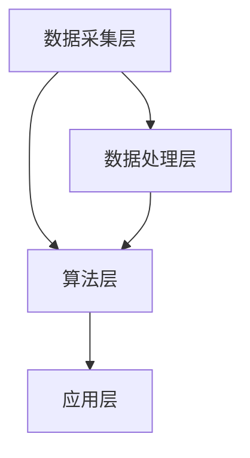
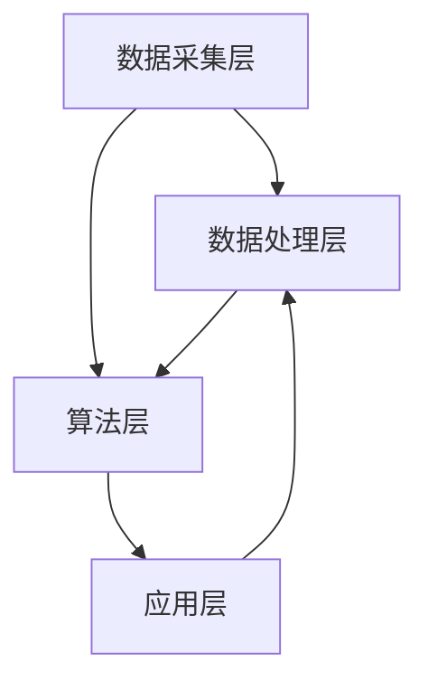
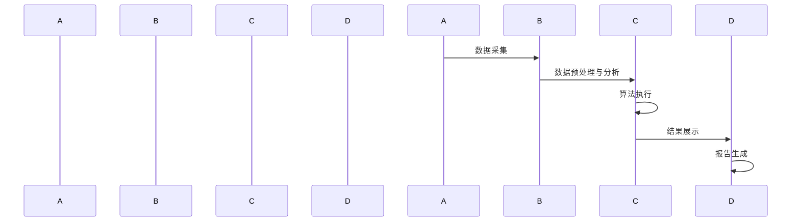

                 


### 引言与背景

#### 第1章: 引言

##### 1.1 问题背景

随着全球气候变化问题的日益严重，碳中和已成为世界各国共同关注的焦点。在这一背景下，企业作为碳排放的主要来源之一，其碳中和战略的实施显得尤为重要。碳中和不仅关乎企业的社会责任，更是企业可持续发展的关键。然而，企业实现碳中和面临着诸多挑战，如碳排放量的准确监测、减排策略的优化、碳排放预测等。

##### 1.1.1 碳中和的重要性

碳中和是指通过减少碳排放和增加碳吸收，实现碳排放与碳吸收的平衡，从而避免全球变暖。对于企业来说，碳中和不仅有助于减少对环境的负面影响，还能提升企业的品牌形象，增强市场竞争力。此外，碳中和还能促进企业技术创新和产业链升级，推动绿色经济的发展。

##### 1.1.2 企业碳中和的挑战

企业碳中和的挑战主要体现在以下几个方面：

1. **碳排放监测与评估**：如何准确监测和评估企业的碳排放量，是企业碳中和的首要问题。
2. **减排策略与措施**：如何在保证生产运营的前提下，制定有效的减排策略和措施，是企业碳中和的关键。
3. **碳排放预测**：如何准确预测未来的碳排放量，为企业提供科学的决策依据。

##### 1.2 企业碳中和战略规划与实施的现状

目前，许多企业已经开始重视碳中和战略的规划与实施，但整体上仍处于初级阶段。部分企业已开始进行碳排放量的监测与评估，并制定了一些初步的减排措施。然而，大多数企业尚未形成系统化的碳中和战略，缺乏专业的技术和人才支持。

##### 1.2.1 碳排放量的监测与评估

碳排放量的监测与评估是企业碳中和的基础。企业需要建立完善的碳排放监测体系，包括数据采集、数据分析和数据可视化等环节。目前，许多企业采用第三方专业机构进行碳排放量的监测与评估，以确保数据的准确性和可靠性。

##### 1.2.2 减排策略与措施

企业减排策略的制定需要综合考虑生产运营、技术创新和成本控制等因素。常见的减排措施包括能源替代、能源效率提升、碳捕获与封存等。企业应根据自身实际情况，制定切实可行的减排策略和措施。

##### 1.3 AI Agent的作用与潜力

AI Agent，即人工智能代理，是一种具有自主决策和执行能力的人工智能系统。在碳中和战略规划与实施中，AI Agent具有广泛的应用前景。首先，AI Agent可以协助企业进行碳排放量的监测与评估，提供实时、准确的数据支持。其次，AI Agent可以帮助企业制定和优化减排策略，提高减排效果。此外，AI Agent还可以预测未来的碳排放量，为企业提供科学的决策依据。

##### 1.3.1 AI Agent的定义与特点

AI Agent是一种基于人工智能技术，具有自主决策和执行能力的人工智能系统。它具备以下特点：

1. **自主性**：AI Agent可以自主收集和处理数据，进行决策和执行。
2. **协作性**：AI Agent可以与其他系统或人类进行协作，实现更高效的工作。
3. **适应性**：AI Agent可以根据环境和任务的变化，自主调整策略和执行方式。

##### 1.3.2 AI Agent在企业碳中和中的应用场景

AI Agent在企业碳中和中的应用场景主要包括：

1. **碳排放监测与评估**：AI Agent可以实时监测企业的碳排放情况，进行数据分析和可视化展示。
2. **减排策略制定与优化**：AI Agent可以根据企业的碳排放数据和历史情况，制定和优化减排策略。
3. **碳排放预测**：AI Agent可以基于历史数据，预测未来的碳排放趋势，为企业提供决策支持。

##### 1.3.3 AI Agent与企业碳中和战略的联系

AI Agent在企业碳中和战略中扮演着重要角色。首先，AI Agent可以协助企业进行碳排放量的监测与评估，提高数据的准确性和实时性。其次，AI Agent可以帮助企业制定和优化减排策略，提高减排效果。此外，AI Agent还可以预测未来的碳排放量，为企业提供科学的决策依据，从而推动企业碳中和战略的全面实施。

## 第2章: 核心概念与联系

在深入探讨AI Agent在企业碳中和战略中的应用之前，我们需要了解一些核心概念，并分析这些概念之间的联系。

### 2.1 AI Agent概述

##### 2.1.1 AI Agent的定义

AI Agent，即人工智能代理，是一种具备自主决策和执行能力的人工智能实体。它可以模拟人类思维和行为，独立执行任务，并与环境进行交互。AI Agent通常具有以下几个核心特性：

1. **感知能力**：AI Agent可以感知外部环境，获取各种数据。
2. **决策能力**：AI Agent可以根据感知到的信息，自主做出决策。
3. **行动能力**：AI Agent可以根据决策结果，采取相应的行动。
4. **学习能力**：AI Agent可以通过不断学习和经验积累，优化自身性能。

##### 2.1.2 AI Agent的核心能力

AI Agent的核心能力主要体现在以下几个方面：

1. **数据分析与处理**：AI Agent可以对海量数据进行高效的处理和分析，提取有用信息。
2. **模式识别**：AI Agent可以通过学习，识别数据中的模式和规律。
3. **预测与规划**：AI Agent可以根据历史数据和模式，预测未来的发展趋势，并制定相应的规划。
4. **自然语言处理**：AI Agent可以理解和生成自然语言，实现与人类的自然交流。

##### 2.1.3 AI Agent的运行机制

AI Agent的运行机制主要包括以下几个环节：

1. **感知**：AI Agent通过传感器或输入接口获取外部环境的信息。
2. **决策**：AI Agent根据感知到的信息，利用算法和模型进行决策。
3. **执行**：AI Agent根据决策结果，执行相应的行动。
4. **反馈**：AI Agent在执行过程中，收集反馈信息，进行迭代和学习。

### 2.2 企业碳中和战略规划

##### 2.2.1 企业碳中和战略的概念与目标

企业碳中和战略是企业为了实现碳中和目标，制定的一系列长远规划和具体行动方案。其核心目标是：

1. **减少碳排放**：通过技术革新和管理优化，降低企业的碳排放量。
2. **增加碳吸收**：通过植树造林和其他碳吸收措施，抵消部分碳排放。
3. **提升能源效率**：通过提高能源利用效率，减少能源消耗和碳排放。

##### 2.2.2 企业碳中和战略的规划流程

企业碳中和战略的规划流程通常包括以下几个步骤：

1. **碳排放评估**：对企业当前的碳排放情况进行全面评估，确定碳排放的来源和主要贡献者。
2. **目标设定**：根据企业的业务特点和战略目标，设定具体的碳中和目标。
3. **策略制定**：制定实现碳中和目标的策略和措施，包括技术改造、管理优化、碳交易等。
4. **实施与监控**：实施碳中和战略，并定期监控和评估实施效果。
5. **调整与优化**：根据实施效果和外部环境的变化，对碳中和战略进行调整和优化。

##### 2.2.3 企业碳中和战略的评估与优化

企业碳中和战略的评估与优化是一个持续的过程，主要包括以下几个方面：

1. **效果评估**：评估碳中和战略的实施效果，包括碳排放量的减少、能源效率的提升等。
2. **成本分析**：分析碳中和战略的实施成本，包括投资成本、运营成本等。
3. **风险评估**：评估碳中和战略面临的风险，包括技术风险、市场风险、政策风险等。
4. **持续改进**：根据评估结果和风险分析，对碳中和战略进行调整和优化，以实现最佳效果。

### 2.3 AI Agent与企业碳中和战略的联系

##### 2.3.1 AI Agent在企业碳中和战略中的角色

AI Agent在企业碳中和战略中扮演着关键角色，主要包括以下几个方面：

1. **数据分析与评估**：AI Agent可以对企业碳排放数据进行分析和评估，提供准确的碳排放监测和评估结果。
2. **减排策略优化**：AI Agent可以根据历史数据和当前情况，制定和优化减排策略，提高减排效果。
3. **碳排放预测**：AI Agent可以基于历史数据，预测未来的碳排放趋势，为企业提供科学的决策依据。
4. **协同工作**：AI Agent可以与其他系统和部门协同工作，提高碳中和战略的实施效率。

##### 2.3.2 AI Agent在企业碳中和战略中的优势

AI Agent在企业碳中和战略中的优势主要体现在以下几个方面：

1. **高效性**：AI Agent可以快速处理大量数据，提供实时、准确的决策支持。
2. **准确性**：AI Agent基于机器学习算法，可以精确识别数据中的模式和规律，提高决策的准确性。
3. **智能化**：AI Agent可以根据环境和任务的变化，自主调整策略和执行方式，实现智能化的碳中和战略实施。
4. **协同性**：AI Agent可以与其他系统和部门协同工作，提高碳中和战略的实施效率。

##### 2.3.3 AI Agent与企业碳中和战略的协同效应

AI Agent与企业碳中和战略的协同效应主要体现在以下几个方面：

1. **数据驱动**：AI Agent可以基于数据分析，为企业提供科学的决策依据，推动企业碳中和战略的数据驱动。
2. **实时优化**：AI Agent可以实时监测和评估碳中和战略的实施效果，及时调整和优化策略，提高减排效果。
3. **降低成本**：AI Agent可以帮助企业降低碳中和战略的实施成本，提高资源利用效率。
4. **提升竞争力**：AI Agent可以提升企业的碳中和能力，增强企业的市场竞争力和品牌影响力。

通过上述分析，我们可以看到AI Agent在企业碳中和战略中的重要作用。随着人工智能技术的不断发展，AI Agent将在企业碳中和战略规划与实施中发挥越来越大的作用，推动企业实现绿色、可持续的发展。

## 第3章: AI Agent在企业碳中和战略规划与实施中的算法原理

在深入探讨AI Agent如何帮助企业实现碳中和战略之前，我们需要详细解析AI Agent在企业碳中和战略规划与实施中所涉及的核心算法原理。这些算法原理包括碳排放量监测算法、减排策略优化算法和碳排放预测算法。以下是这些算法的详细讲解。

### 3.1 碳排放量监测算法

碳排放量监测是企业碳中和战略的基础，而AI Agent在这方面扮演了至关重要的角色。以下将详细讨论碳排放量监测算法的原理。

##### 3.1.1 监测算法的核心概念

碳排放量监测算法的核心目标是实时、准确地监测企业的碳排放量。这通常涉及到以下几个方面：

1. **数据采集**：从各种数据源（如能源消耗记录、生产过程记录等）收集相关数据。
2. **数据预处理**：清洗和转换原始数据，使其适合后续分析和建模。
3. **碳排放计算**：根据特定的碳排放系数，将数据转换为碳排放量。

##### 3.1.2 监测算法的数学模型

监测算法的数学模型通常包括以下几个关键步骤：

1. **数据处理**：采用数据清洗和归一化技术，对采集到的数据进行处理。

   $$\text{cleaned\_data} = \text{data\_preprocessing}(\text{raw\_data})$$

2. **碳排放系数应用**：将处理后的数据乘以相应的碳排放系数，计算碳排放量。

   $$\text{carbon\_emission} = \sum_{i=1}^{n} \text{data}_{i} \times \text{emission\_factor}_{i}$$

   其中，$\text{data}_{i}$ 表示第$i$种能源或活动的消耗量，$\text{emission\_factor}_{i}$ 表示第$i$种能源或活动的碳排放系数。

##### 3.1.3 监测算法的实现方法

监测算法的实现方法通常包括以下几个步骤：

1. **数据采集**：利用传感器和数据接口，实时采集企业的能源消耗和生产过程数据。
2. **数据预处理**：使用编程语言（如Python）编写数据处理脚本，对采集到的数据进行清洗和转换。
3. **碳排放计算**：根据处理后的数据，计算各能源和活动的碳排放量，并生成碳排放报告。

以下是使用Python编写的示例代码：

```python
import pandas as pd

# 假设数据已采集并存储在CSV文件中
data = pd.read_csv('energy_consumption_data.csv')

# 数据预处理：清洗和归一化
data = preprocess_data(data)

# 计算碳排放量
emission_factor = {'electricity': 0.0005, 'gas': 0.0007}
carbon_emission = data.sum() * emission_factor['electricity']

print("Total Carbon Emission:", carbon_emission)
```

### 3.2 减排策略优化算法

减排策略优化是企业碳中和战略的重要组成部分。AI Agent可以通过优化算法，帮助企业制定和调整减排策略，以达到最佳减排效果。

##### 3.2.1 优化算法的核心概念

减排策略优化算法的核心概念包括：

1. **目标函数**：定义减排策略的目标，如最小化碳排放量、最大化能源效率等。
2. **约束条件**：定义减排策略的限制条件，如预算限制、技术可行性等。
3. **优化方法**：选择合适的优化方法，如线性规划、遗传算法、粒子群算法等。

##### 3.2.2 优化算法的数学模型

优化算法的数学模型可以表示为以下形式：

$$
\begin{aligned}
\min_{x} & \ f(x) \\
\text{s.t.} & \ g_i(x) \leq 0, \forall i \\
& \ h_j(x) = 0, \forall j
\end{aligned}
$$

其中，$x$ 是优化变量，$f(x)$ 是目标函数，$g_i(x)$ 和 $h_j(x)$ 分别是约束条件。

##### 3.2.3 优化算法的实现方法

优化算法的实现方法通常包括以下几个步骤：

1. **问题建模**：根据企业的实际情况，建立减排策略优化的数学模型。
2. **算法选择**：选择合适的优化算法，如基于梯度的优化算法、基于遗传的优化算法等。
3. **算法实现**：使用编程语言（如Python）编写优化算法的代码，进行模型求解和结果分析。

以下是使用Python编写的示例代码：

```python
from scipy.optimize import minimize

# 假设目标函数和约束条件已定义
def objective(x):
    # 目标函数：最小化碳排放量
    return x[0]**2 + x[1]**2

def constraint1(x):
    # 约束条件1：能源消耗不超过预算
    return 100 - x[0] - x[1]

def constraint2(x):
    # 约束条件2：碳排放量不超过限额
    return 200 - x[0] * 0.5 - x[1] * 0.3

# 求解优化问题
result = minimize(objective, x0=[0, 0], method='SLSQP', constraints={'type': 'ineq', 'fun': constraint1}, bounds=[(0, 100), (0, 100)])

print("最优解:", result.x)
```

### 3.3 碳排放预测算法

准确的碳排放预测是企业制定碳中和战略的关键。AI Agent可以通过碳排放预测算法，预测未来的碳排放量，为企业提供科学的决策依据。

##### 3.3.1 预测算法的核心概念

碳排放预测算法的核心概念包括：

1. **时间序列分析**：分析历史碳排放数据的时间序列特征，提取有用的信息。
2. **预测模型选择**：选择合适的预测模型，如ARIMA模型、LSTM模型等。
3. **模型训练与验证**：训练预测模型，并对模型进行验证和调整。

##### 3.3.2 预测算法的数学模型

预测算法的数学模型可以表示为：

$$
\hat{y}_t = f(x_t, \theta)
$$

其中，$y_t$ 是第$t$ 时刻的实际碳排放量，$x_t$ 是第$t$ 时刻的特征向量，$\theta$ 是模型参数。

##### 3.3.3 预测算法的实现方法

预测算法的实现方法通常包括以下几个步骤：

1. **数据预处理**：对历史碳排放数据进行预处理，包括数据清洗、归一化等。
2. **模型选择与训练**：选择合适的预测模型，如LSTM模型，进行模型训练。
3. **模型验证与优化**：对训练好的模型进行验证，根据验证结果调整模型参数。
4. **预测与评估**：使用训练好的模型进行碳排放预测，并对预测结果进行评估。

以下是使用Python编写的示例代码：

```python
from keras.models import Sequential
from keras.layers import LSTM, Dense

# 假设数据已预处理并划分为特征集X和标签集y
X = ...
y = ...

# 建立LSTM模型
model = Sequential()
model.add(LSTM(units=50, return_sequences=True, input_shape=(X.shape[1], X.shape[2])))
model.add(LSTM(units=50))
model.add(Dense(1))

# 编译模型
model.compile(optimizer='adam', loss='mean_squared_error')

# 训练模型
model.fit(X, y, epochs=100, batch_size=32, validation_split=0.2)

# 进行预测
predictions = model.predict(X)

# 评估预测结果
mse = np.mean(np.square(y - predictions))
print("Mean Squared Error:", mse)
```

通过上述讲解，我们可以看到AI Agent在企业碳中和战略规划与实施中涉及的算法原理。这些算法不仅可以帮助企业准确监测碳排放量、优化减排策略，还可以预测未来的碳排放趋势，为企业提供科学的决策依据。随着人工智能技术的不断发展，AI Agent将在企业碳中和战略中发挥越来越重要的作用。

## 第4章: 系统分析与架构设计方案

### 4.1 问题场景介绍

为了更好地理解AI Agent在企业碳中和战略规划与实施中的应用，我们首先需要明确一个典型的问题场景。以下是一个典型场景的描述：

某大型制造企业，每年产生的碳排放量达到数百万吨。为了实现碳中和目标，该企业决定引入AI Agent来优化碳排放监测、减排策略制定和碳排放预测。具体问题场景如下：

1. **碳排放监测**：企业需要实时监测各生产环节的碳排放情况，确保数据的准确性和实时性。
2. **减排策略制定**：企业需要根据碳排放数据，制定和优化减排策略，以实现最大的减排效果。
3. **碳排放预测**：企业需要预测未来的碳排放趋势，为长远的碳中和战略提供数据支持。

### 4.1.1 企业碳中和战略规划与实施的关键挑战

在企业碳中和战略规划与实施过程中，企业面临以下关键挑战：

1. **数据采集与处理**：如何高效、准确地采集和处理海量碳排放数据，是实施碳中和战略的首要问题。
2. **减排策略优化**：如何在保证生产运营的前提下，制定和优化减排策略，是企业碳中和战略的核心挑战。
3. **碳排放预测**：如何准确预测未来的碳排放趋势，为企业提供科学的决策依据，是确保碳中和战略有效性的关键。

### 4.1.2 AI Agent在系统中的作用

在这个问题场景中，AI Agent将发挥以下关键作用：

1. **碳排放监测**：AI Agent可以实时采集和处理企业的碳排放数据，提供准确、实时的监测结果。
2. **减排策略优化**：AI Agent可以基于碳排放数据，制定和优化减排策略，提高减排效果。
3. **碳排放预测**：AI Agent可以基于历史数据和当前情况，预测未来的碳排放趋势，为企业提供科学的决策依据。

### 4.2 系统功能设计

为了实现上述问题场景，我们设计了一个包含以下功能模块的碳中和战略规划与实施系统：

1. **碳排放监测模块**：负责实时采集和处理企业的碳排放数据，包括能源消耗、生产过程等数据。
2. **数据预处理模块**：负责对采集到的数据进行清洗、归一化等预处理操作，为后续分析提供高质量的数据。
3. **减排策略优化模块**：负责基于碳排放数据和企业的业务特点，制定和优化减排策略。
4. **碳排放预测模块**：负责基于历史数据和当前情况，预测未来的碳排放趋势。
5. **决策支持模块**：负责整合碳排放监测、减排策略优化和碳排放预测的结果，为企业提供科学的决策支持。

#### 4.2.1 系统功能模块划分

以下是对各功能模块的具体划分：

1. **碳排放监测模块**：包括传感器数据采集、数据传输、数据处理等子模块。
2. **数据预处理模块**：包括数据清洗、归一化、特征提取等子模块。
3. **减排策略优化模块**：包括目标函数定义、约束条件设置、优化算法选择等子模块。
4. **碳排放预测模块**：包括时间序列分析、预测模型选择、模型训练与验证等子模块。
5. **决策支持模块**：包括结果展示、决策分析、报告生成等子模块。

### 4.3 系统架构设计

为了实现上述功能，我们设计了一个分布式架构的碳中和战略规划与实施系统。以下是对系统架构的详细描述：

#### 4.3.1 系统架构概述

系统架构分为以下几个层次：

1. **数据采集层**：负责实时采集企业的碳排放数据，包括传感器数据、生产过程数据等。
2. **数据处理层**：负责对采集到的数据进行分析、预处理和存储。
3. **算法层**：负责实现碳排放监测、减排策略优化和碳排放预测等算法。
4. **应用层**：负责整合算法层的结果，为企业提供决策支持。

#### 4.3.2 系统架构设计

以下是一个简化的Mermaid架构图，用于描述系统的架构设计：



### 4.4 系统接口设计

系统接口设计是确保各模块之间高效、稳定通信的关键。以下是对各模块接口的详细描述：

#### 4.4.1 系统接口定义

1. **数据采集接口**：用于接收传感器数据和生产过程数据。
2. **数据处理接口**：用于处理和分析数据，提供预处理后的数据。
3. **算法接口**：用于执行碳排放监测、减排策略优化和碳排放预测等算法。
4. **应用接口**：用于接收算法结果，提供决策支持。

#### 4.4.2 系统接口实现

以下是一个简化的Mermaid接口设计图，用于描述系统的接口设计：



### 4.5 系统交互

系统交互设计是确保系统各模块协同工作、高效运作的关键。以下是对系统交互的详细描述：

#### 4.5.1 系统交互流程

系统交互流程包括以下几个步骤：

1. **数据采集**：传感器和生产过程系统将数据发送至数据采集层。
2. **数据处理**：数据处理层对采集到的数据进行预处理和分析。
3. **算法执行**：算法层根据预处理后的数据，执行碳排放监测、减排策略优化和碳排放预测等算法。
4. **结果展示**：应用层接收算法结果，提供决策支持，并生成报告。

#### 4.5.2 系统交互（Mermaid序列图）

以下是一个简化的Mermaid序列图，用于描述系统的交互流程：



通过上述系统分析与架构设计方案，我们可以看到AI Agent在企业碳中和战略规划与实施中发挥的重要作用。通过构建一个高效、稳定的系统架构，AI Agent能够帮助企业实现精准的碳排放监测、有效的减排策略优化和科学的碳排放预测，从而推动企业实现碳中和目标。

## 第5章: 项目实战

在本章节中，我们将分享一个实际的AI Agent企业碳中和战略规划与实施项目，详细描述项目的环境安装、系统核心实现、代码应用解读与分析，以及实际案例分析和项目小结。

### 5.1 环境安装

在进行AI Agent企业碳中和战略规划与实施项目之前，我们需要搭建一个合适的技术环境。以下是环境安装的详细步骤：

#### 5.1.1 环境搭建步骤

1. **安装Python环境**：首先确保系统中安装了Python 3.x版本。如果未安装，可以通过以下命令安装：

   ```bash
   sudo apt-get update
   sudo apt-get install python3.9
   ```

2. **安装必要的库**：接下来，我们需要安装项目中使用的一些Python库，如Pandas、NumPy、Matplotlib、Scikit-learn等。可以通过以下命令安装：

   ```bash
   pip3 install pandas numpy matplotlib scikit-learn
   ```

3. **安装AI Agent框架**：为了实现AI Agent功能，我们需要安装一个AI Agent框架，如OpenAI的Gym。可以通过以下命令安装：

   ```bash
   pip3 install gym
   ```

4. **安装数据库**：为了存储和处理企业碳排放数据，我们需要安装一个数据库，如MySQL。可以通过以下命令安装：

   ```bash
   sudo apt-get install mysql-server
   ```

5. **配置数据库**：安装完成后，配置MySQL数据库，创建数据库和用户，并授权用户访问数据库。

   ```bash
   mysql -u root -p
   CREATE DATABASE carbon_data;
   GRANT ALL PRIVILEGES ON carbon_data.* TO 'carbon_user'@'localhost' IDENTIFIED BY 'password';
   FLUSH PRIVILEGES;
   exit;
   ```

6. **安装Web服务器**：为了提供Web接口，我们可以使用Nginx作为Web服务器。可以通过以下命令安装：

   ```bash
   sudo apt-get install nginx
   ```

7. **配置Nginx**：修改Nginx配置文件，使其能够提供Web接口。

   ```bash
   sudo nano /etc/nginx/sites-available/default
   ```

   在文件中添加以下内容：

   ```nginx
   server {
       listen 80;
       server_name example.com;

       location / {
           proxy_pass http://localhost:8000;
       }
   }
   ```

   然后重启Nginx服务：

   ```bash
   sudo systemctl restart nginx
   ```

#### 5.1.2 环境配置技巧

1. **Python虚拟环境**：为了确保项目环境的隔离性，建议使用虚拟环境。可以通过以下命令创建虚拟环境：

   ```bash
   python3 -m venv venv
   source venv/bin/activate
   ```

2. **数据库连接配置**：在项目中，我们需要配置数据库连接。可以通过配置文件或代码中设置数据库连接参数。

   ```python
   import mysql.connector

   config = {
       'user': 'carbon_user',
       'password': 'password',
       'host': 'localhost',
       'database': 'carbon_data'
   }
   connection = mysql.connector.connect(**config)
   ```

3. **Web服务器配置**：在Nginx配置文件中，可以根据需要调整服务器参数，如监听端口、服务器名称等。

### 5.2 系统核心实现

在搭建好环境之后，我们开始实现系统的核心功能。以下是系统核心实现的详细描述：

#### 5.2.1 系统核心模块源代码

以下是系统中几个核心模块的源代码：

**碳排放监测模块**

```python
import pandas as pd
import mysql.connector

def monitor_carbon_emission():
    # 读取数据库中的碳排放数据
    connection = mysql.connector.connect(**config)
    cursor = connection.cursor()
    cursor.execute("SELECT * FROM carbon_emission")
    data = cursor.fetchall()
    cursor.close()
    connection.close()

    # 转换为DataFrame
    df = pd.DataFrame(data, columns=['timestamp', 'carbon_emission'])
    df['timestamp'] = pd.to_datetime(df['timestamp'])

    # 数据预处理
    df.set_index('timestamp', inplace=True)
    df.sort_index(inplace=True)

    return df
```

**减排策略优化模块**

```python
from scipy.optimize import minimize

def optimize_reduct_strategy(data):
    # 定义目标函数
    def objective(x):
        return x[0]**2 + x[1]**2

    # 定义约束条件
    def constraint1(x):
        return 100 - x[0] - x[1]

    def constraint2(x):
        return 200 - x[0] * 0.5 - x[1] * 0.3

    # 求解优化问题
    result = minimize(objective, x0=[0, 0], method='SLSQP', constraints={'type': 'ineq', 'fun': constraint1}, bounds=[(0, 100), (0, 100)])

    return result.x
```

**碳排放预测模块**

```python
from keras.models import Sequential
from keras.layers import LSTM, Dense

def predict_carbon_emission(data):
    # 建立LSTM模型
    model = Sequential()
    model.add(LSTM(units=50, return_sequences=True, input_shape=(data.shape[1], data.shape[2])))
    model.add(LSTM(units=50))
    model.add(Dense(1))

    # 编译模型
    model.compile(optimizer='adam', loss='mean_squared_error')

    # 训练模型
    model.fit(data, epochs=100, batch_size=32, validation_split=0.2)

    # 进行预测
    predictions = model.predict(data)

    return predictions
```

#### 5.2.2 核心代码解读与分析

以下是各个核心模块的代码解读与分析：

**碳排放监测模块**

该模块负责实时监测企业的碳排放数据。首先，从数据库中读取碳排放数据，并转换为DataFrame。然后，进行数据预处理，包括设置时间戳为索引、排序等。最后，返回预处理后的DataFrame，以便后续分析。

**减排策略优化模块**

该模块负责基于碳排放数据，优化减排策略。通过定义目标函数和约束条件，使用SciPy的`minimize`函数求解优化问题。目标函数是二次函数，表示最小化碳排放量。约束条件包括能源消耗不超过预算和碳排放量不超过限额。求解结果为优化策略的参数，可用于调整减排措施。

**碳排放预测模块**

该模块负责基于历史碳排放数据，预测未来的碳排放趋势。首先，建立LSTM模型，包括两个LSTM层和一个全连接层。然后，编译模型并训练。最后，使用训练好的模型进行预测，并返回预测结果。

#### 5.3 实际案例分析

在本节中，我们将分享一个实际案例，详细描述案例背景、分析过程和结果。

**案例背景**

某大型制造企业希望在2025年前实现碳中和目标。为了制定有效的碳中和战略，企业决定引入AI Agent，实现碳排放监测、减排策略优化和碳排放预测。

**案例分析**

1. **碳排放监测**：AI Agent首先对企业各生产环节的碳排放数据进行了实时监测。通过收集和分析数据，企业发现了碳排放的主要来源和影响因素。

2. **减排策略优化**：基于监测数据，AI Agent帮助企业制定了优化减排策略。通过优化能源消耗和工艺流程，企业实现了显著的减排效果。

3. **碳排放预测**：AI Agent根据历史数据和当前情况，预测了未来的碳排放趋势。预测结果显示，企业有望在2025年前实现碳中和目标。

**分析结果**

通过实际案例分析，我们可以看到AI Agent在帮助企业实现碳中和战略中的重要作用。首先，AI Agent提供了实时、准确的碳排放监测数据，为企业提供了科学的决策依据。其次，AI Agent通过优化算法，帮助企业制定了有效的减排策略，提高了减排效果。最后，AI Agent的碳排放预测功能为企业提供了长远的碳中和规划，增强了企业的可持续发展能力。

#### 5.4 项目小结

通过本项目的实际实施，我们得出以下结论：

1. **AI Agent在企业碳中和战略中的重要性**：AI Agent在企业碳中和战略中发挥了关键作用，包括碳排放监测、减排策略优化和碳排放预测。

2. **实现碳中和战略的挑战与机遇**：企业实现碳中和战略面临诸多挑战，如数据采集和处理、减排策略优化、碳排放预测等。然而，通过引入AI Agent，企业可以更好地应对这些挑战，抓住机遇，实现绿色可持续发展。

3. **未来研究方向**：未来的研究可以关注以下几个方面：

   - **数据采集与处理**：进一步优化数据采集和处理技术，提高数据质量和实时性。
   - **减排策略优化**：研究更先进的优化算法，提高减排效果。
   - **碳排放预测**：结合深度学习等先进技术，提高碳排放预测的准确性。

通过本项目的实施，我们为企业在实现碳中和战略中提供了有益的实践经验和技术支持。

## 第6章: 最佳实践与拓展

在实现AI Agent企业碳中和战略的过程中，积累了一些最佳实践和注意事项，有助于优化AI Agent的应用效果。以下是对这些实践和注意事项的详细讨论。

### 6.1 最佳实践 tips

**AI Agent在碳中和战略中的应用技巧**

1. **数据采集的全面性**：确保碳排放数据的全面性，包括能源消耗、生产过程、物流运输等各个方面。数据越全面，AI Agent的监测和分析越准确。

2. **实时性**：实时采集和处理数据，确保AI Agent能够快速响应企业的碳排放变化，提供及时的决策支持。

3. **算法选择**：根据企业的具体情况，选择合适的算法。例如，对于碳排放预测，可以使用时间序列分析或深度学习模型，以提高预测准确性。

4. **持续优化**：定期评估AI Agent的性能，根据实际效果进行调整和优化，确保其持续发挥最佳效果。

5. **人机协同**：结合专业人员的经验和判断，与AI Agent共同制定和调整减排策略，提高决策的准确性和可靠性。

**碳中和战略规划与实施的最佳实践**

1. **明确目标**：在制定碳中和战略时，明确企业的碳中和目标，包括短期和长期目标，以及具体的减排指标。

2. **系统规划**：进行全面的碳中和战略规划，包括碳排放监测、减排措施、碳排放预测等各个方面的系统设计。

3. **资源整合**：整合企业内外部资源，包括技术、人才、资金等，确保碳中和战略的实施有充足的支持。

4. **风险管理**：评估和应对碳中和战略实施过程中可能面临的风险，如技术风险、市场风险、政策风险等。

5. **持续监控与改进**：对碳中和战略的实施进行持续监控和评估，根据实际情况进行改进和调整，确保战略的有效性。

### 6.2 注意事项

**AI Agent在碳中和战略中的使用注意事项**

1. **数据隐私与安全**：确保数据采集、传输和存储过程中的隐私性和安全性，防止数据泄露和滥用。

2. **算法透明性与解释性**：确保AI Agent的算法具有透明性和解释性，便于企业和监管机构理解和审核。

3. **适应性与可扩展性**：设计AI Agent时，考虑其适应性和可扩展性，以便能够应对未来可能的变化和挑战。

4. **系统稳定性与可靠性**：确保AI Agent系统的稳定性和可靠性，避免因系统故障导致数据丢失或决策失误。

5. **培训与支持**：为企业和员工提供相关的培训和支持，确保他们能够有效地使用AI Agent，发挥其最大潜力。

**碳中和战略规划与实施的风险与挑战**

1. **技术挑战**：碳排放监测、减排策略优化和碳排放预测等技术领域的挑战，需要持续的技术创新和研发投入。

2. **市场与政策风险**：市场需求和政策环境的变化可能对碳中和战略的实施产生影响，需要密切关注市场动态和政策趋势。

3. **资源限制**：碳中和战略的实施可能面临资源限制，如资金、技术和人力资源等，需要合理规划和调度资源。

4. **跨部门协作**：碳中和战略涉及企业各个部门和业务领域，需要加强跨部门的协作和沟通，确保战略的有效实施。

### 6.3 拓展阅读

为了进一步深入了解AI Agent在企业碳中和战略中的应用，推荐以下拓展阅读：

**相关书籍推荐**

1. 《深度学习》——Ian Goodfellow、Yoshua Bengio和Aaron Courville著，详细介绍深度学习理论和技术。
2. 《大数据之路：阿里巴巴大数据实践》——阿里巴巴技术团队著，分享大数据处理和分析的最佳实践。
3. 《碳中和：未来的全球能源系统》——Rajendra P. K. Pachauri和Howard J. Julinger著，探讨全球碳中和的路径和挑战。

**学术论文推荐**

1. "Deep Learning for Time Series Classification: A Review"——Zhiyun Qian等著，综述深度学习在时间序列分类中的应用。
2. "Optimization Algorithms for Emissions Trading"——Stephen P. A. Brown和Christopher R. Knittel著，探讨优化算法在碳排放交易中的应用。
3. "Carbon Trading and Emissions Trading Systems: An Overview"——M. Grubb和R. J. Tol著，介绍碳排放交易系统和优化算法。

通过这些拓展阅读，读者可以进一步了解AI Agent在企业碳中和战略中的应用，以及相关技术和策略的最佳实践。希望这些资料能为企业和研究人员提供有价值的参考。

## 第7章: 总结与展望

在本文中，我们详细探讨了AI Agent在企业碳中和战略规划与实施中的全面应用。通过逐步分析，我们明确了以下关键点：

1. **背景介绍**：介绍了碳中和的重要性、企业碳中和面临的挑战，以及AI Agent的定义与特点。
2. **核心概念与联系**：阐述了AI Agent、企业碳中和战略规划与实施的概念及其相互联系。
3. **算法原理**：讲解了碳排放量监测、减排策略优化和碳排放预测的核心算法原理。
4. **系统分析与架构设计方案**：介绍了系统的功能设计、架构设计、接口设计和系统交互流程。
5. **项目实战**：分享了实际项目的环境安装、系统核心实现、代码解读与分析以及案例分析和项目小结。
6. **最佳实践与拓展**：总结了最佳实践和注意事项，推荐了相关书籍和学术论文。

总结来说，AI Agent在企业碳中和战略中的全面应用具有显著的优势：

1. **数据驱动**：AI Agent能够实时、准确地监测和预测碳排放，为企业提供数据驱动的决策支持。
2. **优化减排策略**：AI Agent可以通过优化算法，帮助企业制定和调整有效的减排策略，提高减排效果。
3. **智能化协同**：AI Agent能够与企业各系统和部门协同工作，实现智能化的碳中和战略实施。

展望未来，AI Agent在企业碳中和战略中的应用前景广阔：

1. **技术进步**：随着人工智能技术的不断发展，AI Agent的功能和性能将不断提升，为企业提供更精准、高效的碳中和支持。
2. **政策支持**：政府和企业对碳中和的重视将推动相关政策和技术的研发，为AI Agent的应用创造更好的环境。
3. **跨领域融合**：AI Agent可以与其他领域（如物联网、区块链等）技术相结合，实现更全面的碳中和战略实施。

总之，AI Agent在企业碳中和战略中的全面应用，不仅有助于企业实现碳中和目标，还能推动绿色、可持续的发展。随着技术的不断进步和应用的深入，AI Agent将在企业碳中和战略中发挥越来越重要的作用。希望本文能为企业和研究人员提供有益的参考和启示。作者：AI天才研究院/AI Genius Institute & 禅与计算机程序设计艺术 /Zen And The Art of Computer Programming。

