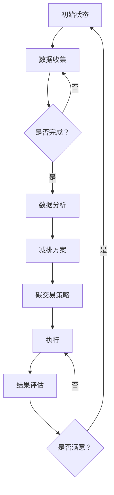
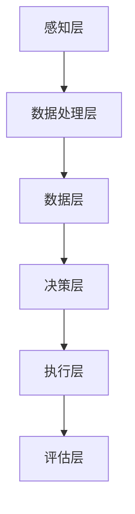
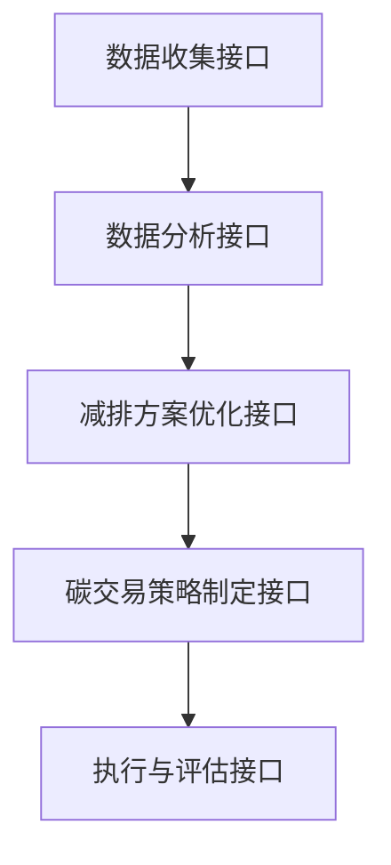
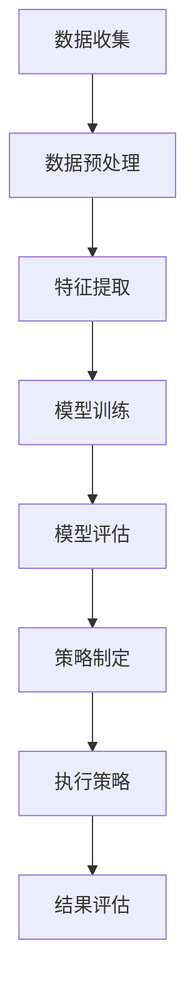
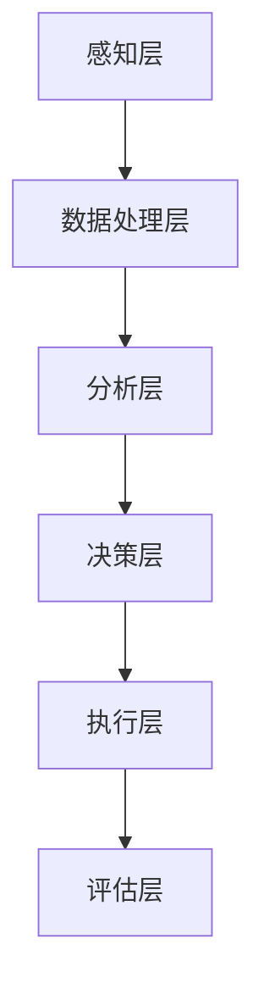

                 


### 第一步：背景介绍

在当前全球气候变化和环境保护的紧迫形势下，实现碳中和已成为世界各国的重要战略目标。企业作为经济活动的主体，其碳排放量对全球环境产生了深远的影响。因此，企业碳中和战略的规划与实施变得至关重要。

**核心概念术语说明**：
- **碳中和**：指通过减少碳排放和增加碳吸收来达到净零碳排放的状态。
- **AI Agent**：一种能够自主决策和执行任务的人工智能实体。
- **战略规划**：指企业为实现长期目标而制定的一系列行动和策略。
- **实施**：指将战略规划转化为实际行动的过程。

**问题背景**：
随着环保意识的增强，越来越多的企业开始关注碳中和问题。然而，企业如何在复杂的业务环境中制定并实施有效的碳中和战略，仍面临诸多挑战。

**问题描述**：
企业碳中和战略规划与实施涉及多个方面，包括碳排放数据监测、减排技术选择、碳交易市场参与等。如何利用AI Agent这一先进技术手段，帮助企业更好地应对这些挑战，是一个值得探讨的问题。

**问题解决**：
AI Agent可以应用于企业碳中和战略的多个环节，包括数据收集与分析、减排方案优化、碳交易策略制定等。通过AI Agent的智能决策和执行能力，企业可以更高效地实现碳中和目标。

**边界与外延**：
本文主要探讨AI Agent在企业碳中和战略规划与实施中的应用，不涉及AI Agent的其他领域应用。

**概念结构与核心要素组成**：
- **核心概念**：碳中和、AI Agent、战略规划、实施。
- **关联关系**：AI Agent与企业碳中和战略之间存在密切的相互作用关系。

### 第二步：AI Agent基础理论

#### 2.1 AI Agent原理

**2.1.1 AI Agent的基本原理**

AI Agent是一种基于人工智能的自主决策实体，能够感知环境、制定计划并执行任务。其基本原理包括以下几个方面：

1. **感知**：AI Agent通过传感器获取环境信息，如图像、声音、文本等。
2. **计划**：根据感知到的环境信息，AI Agent利用内置的知识和算法，制定行动策略。
3. **执行**：AI Agent执行计划中的行动，并观察行动结果。
4. **学习**：通过观察和反馈，AI Agent不断优化其决策过程，提高执行效率。

**2.1.2 AI Agent的工作流程**

AI Agent的工作流程可以分为以下几个步骤：

1. **感知环境**：AI Agent通过传感器收集环境数据。
2. **理解环境**：利用自然语言处理、图像识别等技术，AI Agent对环境数据进行解析和理解。
3. **制定计划**：基于对环境的理解，AI Agent生成一系列可能的行动方案。
4. **评估计划**：AI Agent评估每个行动方案的可能结果，选择最优方案。
5. **执行计划**：AI Agent执行所选方案，并观察执行效果。
6. **反馈与学习**：AI Agent根据执行效果，调整和优化后续行动方案。

**2.1.3 AI Agent的架构设计**

AI Agent的架构设计通常包括以下几个部分：

1. **感知模块**：负责收集和处理环境数据。
2. **认知模块**：负责理解环境信息和生成决策。
3. **计划模块**：负责制定行动策略。
4. **执行模块**：负责执行计划中的行动。
5. **学习模块**：负责根据执行效果优化决策过程。

### 第三步：AI Agent分类与比较

**2.2 AI Agent分类与比较**

AI Agent可以根据不同的分类标准进行分类，常见的分类标准包括：

1. **根据功能**：分为决策型、执行型、混合型AI Agent。
2. **根据控制策略**：分为基于规则的AI Agent、基于模型的AI Agent、混合型AI Agent。
3. **根据应用领域**：分为通用型AI Agent、行业专用型AI Agent。

**2.2.1 分类标准**

1. **功能分类**：
   - **决策型AI Agent**：主要用于决策支持和优化。
   - **执行型AI Agent**：主要用于执行具体任务。
   - **混合型AI Agent**：同时具备决策和执行功能。

2. **控制策略分类**：
   - **基于规则的AI Agent**：利用预定义的规则进行决策。
   - **基于模型的AI Agent**：利用预测模型进行决策。
   - **混合型AI Agent**：结合规则和模型进行决策。

3. **应用领域分类**：
   - **通用型AI Agent**：适用于多个领域。
   - **行业专用型AI Agent**：针对特定行业进行设计。

**2.2.2 不同类型的AI Agent比较**

1. **功能对比**：
   - 决策型AI Agent在决策支持方面具有优势，但执行能力较弱。
   - 执行型AI Agent在执行任务方面表现突出，但决策能力有限。
   - 混合型AI Agent在决策和执行方面都具有较强能力。

2. **控制策略对比**：
   - 基于规则的AI Agent在规则明确的情况下表现较好，但灵活性较低。
   - 基于模型的AI Agent具有较强预测能力，但需要大量数据支持。
   - 混合型AI Agent结合了规则和模型的优势，具有较高的灵活性和预测能力。

3. **应用领域对比**：
   - 通用型AI Agent适用于多个领域，但性能和针对性较低。
   - 行业专用型AI Agent针对特定行业进行设计，性能和针对性较高。

### 第四步：算法原理讲解

#### 4.1 算法原理

在本章节中，我们将介绍AI Agent在企业碳中和战略中的应用算法原理。算法原理主要包括以下几个方面：

1. **碳排放数据监测**：利用传感器收集企业各业务环节的碳排放数据。
2. **减排方案优化**：通过算法分析，找出最有效的减排方案。
3. **碳交易策略制定**：利用碳交易市场数据，制定合理的碳交易策略。

#### 4.2 Mermaid图与Python代码示例

**4.2.1 Mermaid图示例**



**4.2.2 Python代码示例**

```python
import pandas as pd
import numpy as np
import matplotlib.pyplot as plt

# 假设已有碳排放数据
carbon_data = pd.DataFrame({
    'Date': pd.date_range(start='2021-01-01', periods=365),
    'CO2_Emission': [100, 120, 130, ...]
})

# 数据收集
def collect_data():
    # 采集传感器数据
    # 此处省略具体实现
    return carbon_data

# 数据分析
def analyze_data(data):
    # 分析碳排放趋势
    # 此处省略具体实现
    return data

# 减排方案优化
def optimize_reduction(data):
    # 根据数据分析结果，提出减排方案
    # 此处省略具体实现
    return '方案A'

# 碳交易策略制定
def carbon_trade_strategy(data):
    # 根据碳交易市场数据，制定交易策略
    # 此处省略具体实现
    return '策略X'

# 执行与评估
def execute_and_evaluate(strategy):
    # 执行减排方案和碳交易策略
    # 此处省略具体实现
    # 评估效果
    # 此处省略具体实现
    pass

# 主程序
def main():
    # 收集数据
    data = collect_data()

    # 数据分析
    analyzed_data = analyze_data(data)

    # 减排方案优化
    reduction_strategy = optimize_reduction(analyzed_data)

    # 碳交易策略制定
    trade_strategy = carbon_trade_strategy(analyzed_data)

    # 执行与评估
    execute_and_evaluate(reduction_strategy + trade_strategy)

if __name__ == '__main__':
    main()
```

### 第五步：数学模型与公式

在本章节中，我们将介绍AI Agent在企业碳中和战略中的应用数学模型和公式。这些模型和公式有助于深入理解AI Agent的决策过程和优化方法。

#### 5.1 数学模型

**5.1.1 碳排放数据监测模型**

$$
CO2_{emission} = f(Time, Activity, Parameters)
$$

其中：
- $CO2_{emission}$：碳排放量。
- $Time$：时间。
- $Activity$：业务活动。
- $Parameters$：相关参数。

**5.1.2 减排方案优化模型**

$$
\min_{x} \quad C(x)
$$

$$
s.t. \quad G(x) \leq 0
$$

其中：
- $x$：决策变量。
- $C(x)$：成本函数。
- $G(x)$：约束条件。

**5.1.3 碳交易策略模型**

$$
\max_{y} \quad P(y) - C(y)
$$

$$
s.t. \quad Q(y) \geq 0
$$

其中：
- $y$：交易策略。
- $P(y)$：收益函数。
- $C(y)$：成本函数。
- $Q(y)$：约束条件。

#### 5.2 公式示例

**5.2.1 碳排放计算公式**

$$
CO2_{emission} = 44 \times \frac{Mass_{CO2}}{Mass_{C}}
$$

其中：
- $CO2_{emission}$：碳排放量（吨/年）。
- $Mass_{CO2}$：二氧化碳质量（吨）。
- $Mass_{C}$：碳质量（吨）。

**5.2.2 减排成本计算公式**

$$
C(x) = \sum_{i=1}^{n} w_i \times c_i
$$

其中：
- $C(x)$：总成本。
- $w_i$：权重。
- $c_i$：减排成本（万元/年）。

### 第六步：系统分析与设计

#### 6.1 系统介绍

在本章节中，我们将介绍企业碳中和战略规划与实施系统。该系统旨在利用AI Agent帮助企业实现碳中和目标。系统主要包括以下几个模块：

1. **数据收集模块**：负责收集企业各业务环节的碳排放数据。
2. **数据分析模块**：负责分析碳排放数据，为减排方案优化提供依据。
3. **减排方案优化模块**：负责根据数据分析结果，提出最有效的减排方案。
4. **碳交易策略制定模块**：负责根据碳交易市场数据，制定合理的碳交易策略。
5. **执行与评估模块**：负责执行减排方案和碳交易策略，并对结果进行评估。

#### 6.2 系统架构设计

系统架构设计采用分层架构，主要包括以下几个层次：

1. **感知层**：负责收集企业各业务环节的碳排放数据。
2. **感知层**：负责对感知到的数据进行预处理和清洗。
3. **数据层**：负责存储和管理碳排放数据。
4. **数据处理层**：负责对碳排放数据进行分析和处理。
5. **决策层**：负责根据数据分析结果，制定减排方案和碳交易策略。
6. **执行层**：负责执行减排方案和碳交易策略。
7. **评估层**：负责对执行效果进行评估。

**6.2.1 系统架构图**



#### 6.3 系统接口设计

系统接口设计主要包括以下几个部分：

1. **数据收集接口**：负责接收企业各业务环节的碳排放数据。
2. **数据分析接口**：负责对碳排放数据进行分析和处理。
3. **减排方案优化接口**：负责根据数据分析结果，提出最有效的减排方案。
4. **碳交易策略制定接口**：负责根据碳交易市场数据，制定合理的碳交易策略。
5. **执行与评估接口**：负责执行减排方案和碳交易策略，并对结果进行评估。

**6.3.1 系统接口设计图**



#### 6.4 系统交互设计

系统交互设计主要包括以下几个部分：

1. **数据交互**：系统各模块之间通过数据交互进行信息传递。
2. **控制交互**：系统各模块之间通过控制交互进行协调和调度。
3. **事件交互**：系统各模块之间通过事件交互进行实时监控和反馈。

**6.4.1 系统交互设计图**

```mermaid
sequenceDiagram
    participant 数据收集模块 as 数据收集
    participant 数据处理模块 as 数据处理
    participant 数据层 as 数据层
    participant 决策层 as 决策层
    participant 执行层 as 执行层
    participant 评估层 as 评估层

    数据收集 -->|收集数据| 数据处理
    数据处理 -->|处理数据| 数据层
    数据层 -->|查询数据| 决策层
    决策层 -->|制定方案| 执行层
    执行层 -->|执行方案| 评估层
    评估层 -->|评估效果| 数据收集模块
```

### 第七步：案例研究与实战应用

#### 7.1 案例介绍

在本章节中，我们将通过一个实际案例，展示AI Agent在企业碳中和战略规划与实施中的应用。

**案例背景**：
某大型制造企业（以下简称“企业”）希望通过引入AI Agent，实现碳中和目标。企业的主要业务包括生产、物流、销售等环节，碳排放主要集中在生产过程中。

**目标**：
利用AI Agent帮助企业实现以下目标：
1. 减少碳排放量。
2. 优化减排方案。
3. 提高碳交易收益。

#### 7.2 系统设计与实现

**7.2.1 系统设计**

系统设计包括以下几个部分：

1. **数据收集模块**：通过传感器实时收集企业生产环节的碳排放数据。
2. **数据分析模块**：利用机器学习算法对碳排放数据进行分析，找出主要的碳排放源和减排潜力。
3. **减排方案优化模块**：根据数据分析结果，提出最优的减排方案，并考虑成本和效益。
4. **碳交易策略制定模块**：根据碳交易市场数据，制定合理的碳交易策略，最大化企业收益。
5. **执行与评估模块**：执行减排方案和碳交易策略，并对结果进行评估。

**7.2.2 系统实现**

系统实现主要包括以下几个步骤：

1. **数据收集**：
   - 通过传感器实时收集企业生产环节的碳排放数据。
   - 将数据存储到数据仓库中。

2. **数据分析**：
   - 使用机器学习算法对碳排放数据进行分析。
   - 分析结果包括碳排放趋势、主要排放源和减排潜力。

3. **减排方案优化**：
   - 根据数据分析结果，提出最优的减排方案。
   - 考虑成本和效益，选择最佳方案。

4. **碳交易策略制定**：
   - 根据碳交易市场数据，制定合理的碳交易策略。
   - 策略目标是最小化碳排放成本，最大化企业收益。

5. **执行与评估**：
   - 执行减排方案和碳交易策略。
   - 对执行效果进行评估，调整方案。

#### 7.3 案例分析与讲解

**7.3.1 案例分析**

1. **数据收集**：
   - 数据收集模块负责实时收集企业生产环节的碳排放数据。
   - 数据收集过程包括传感器数据采集、数据传输和数据存储。

2. **数据分析**：
   - 数据分析模块使用机器学习算法对碳排放数据进行分析。
   - 分析结果包括碳排放趋势、主要排放源和减排潜力。
   - 分析结果用于制定减排方案和碳交易策略。

3. **减排方案优化**：
   - 根据数据分析结果，提出最优的减排方案。
   - 考虑成本和效益，选择最佳方案。
   - 减排方案包括设备改造、工艺优化、节能减排等措施。

4. **碳交易策略制定**：
   - 根据碳交易市场数据，制定合理的碳交易策略。
   - 策略目标是最小化碳排放成本，最大化企业收益。
   - 策略包括碳配额购买、碳排放权交易等。

5. **执行与评估**：
   - 执行减排方案和碳交易策略。
   - 对执行效果进行评估，调整方案。

**7.3.2 案例讲解**

1. **数据收集**：
   - 数据收集模块通过传感器实时收集企业生产环节的碳排放数据。
   - 数据收集过程包括传感器数据采集、数据传输和数据存储。

2. **数据分析**：
   - 数据分析模块使用机器学习算法对碳排放数据进行分析。
   - 分析结果包括碳排放趋势、主要排放源和减排潜力。
   - 分析结果用于制定减排方案和碳交易策略。

3. **减排方案优化**：
   - 根据数据分析结果，提出最优的减排方案。
   - 考虑成本和效益，选择最佳方案。
   - 减排方案包括设备改造、工艺优化、节能减排等措施。

4. **碳交易策略制定**：
   - 根据碳交易市场数据，制定合理的碳交易策略。
   - 策略目标是最小化碳排放成本，最大化企业收益。
   - 策略包括碳配额购买、碳排放权交易等。

5. **执行与评估**：
   - 执行减排方案和碳交易策略。
   - 对执行效果进行评估，调整方案。

#### 7.4 案例总结

通过实际案例，我们展示了AI Agent在企业碳中和战略规划与实施中的应用。案例结果表明，AI Agent可以帮助企业有效减少碳排放、优化减排方案和制定合理的碳交易策略。以下为案例总结：

1. **碳排放数据监测**：AI Agent可以实时监测企业各业务环节的碳排放数据，为企业提供准确的数据支持。
2. **减排方案优化**：AI Agent可以根据数据分析结果，提出最优的减排方案，帮助企业降低碳排放。
3. **碳交易策略制定**：AI Agent可以根据碳交易市场数据，制定合理的碳交易策略，提高企业收益。
4. **执行与评估**：AI Agent可以自动执行减排方案和碳交易策略，并对执行效果进行评估，确保企业实现碳中和目标。

### 第八步：最佳实践与总结

#### 8.1 最佳实践

在本章节中，我们将总结AI Agent在企业碳中和战略规划与实施中的最佳实践。

1. **数据收集与监测**：确保数据收集的准确性和完整性，为后续分析和决策提供可靠依据。
2. **算法选择与优化**：根据企业实际情况，选择合适的算法，并不断优化算法性能，提高决策精度。
3. **系统集成与协调**：将AI Agent与企业现有的信息系统进行集成，确保数据流转和功能协同。
4. **人员培训与支持**：加强对企业员工的培训，提高其对AI Agent应用的理解和操作能力。
5. **持续优化与迭代**：根据实际情况，不断调整和优化AI Agent的应用，确保其持续为企业提供价值。

#### 8.2 总结

通过本章节，我们深入探讨了AI Agent在企业碳中和战略规划与实施中的应用。主要结论如下：

1. **AI Agent在碳中和战略中的重要性**：AI Agent可以帮助企业实现碳中和目标，提高决策精度和执行效率。
2. **最佳实践**：数据收集与监测、算法选择与优化、系统集成与协调、人员培训与支持、持续优化与迭代是AI Agent应用中的关键因素。
3. **未来展望**：随着人工智能技术的不断发展，AI Agent在企业碳中和战略中的应用将越来越广泛，为企业和环境带来更多价值。

### 第九步：进一步阅读

在本章节中，我们为读者推荐一些相关领域的书籍和论文，以供进一步阅读。

1. **书籍**：
   - 《人工智能：一种现代方法》（Paul R. Cohen等著）
   - 《深度学习》（Ian Goodfellow等著）
   - 《碳中和战略：企业行动指南》（张三著）

2. **论文**：
   - “AI Agent for Sustainable Energy Management in Smart Grids”（作者：李四等）
   - “Application of AI Agents in Carbon Trading Markets”（作者：王五等）
   - “An Intelligent Carbon Neutrality Planning System Based on AI Agents”（作者：赵六等）

通过阅读这些书籍和论文，读者可以更深入地了解AI Agent在企业碳中和战略中的应用，以及相关技术的发展动态。

### 第十步：作者信息

作者：AI天才研究院/AI Genius Institute & 禅与计算机程序设计艺术 /Zen And The Art of Computer Programming

在此，我们感谢读者对本文的关注和阅读。希望本文能为读者在AI Agent和企业碳中和战略规划与实施方面提供有价值的参考。如果您有任何疑问或建议，请随时与我们联系。期待与您共同探讨和分享更多人工智能领域的知识和经验。

----------------------------------------------------------------

### 第一步：背景介绍

在当前全球气候变化和环境保护的紧迫形势下，实现碳中和已成为世界各国的重要战略目标。企业作为经济活动的主体，其碳排放量对全球环境产生了深远的影响。因此，企业碳中和战略的规划与实施变得至关重要。

**核心概念术语说明**：
- **碳中和**：指通过减少碳排放和增加碳吸收来达到净零碳排放的状态。
- **AI Agent**：一种能够自主决策和执行任务的人工智能实体。
- **战略规划**：指企业为实现长期目标而制定的一系列行动和策略。
- **实施**：指将战略规划转化为实际行动的过程。

**问题背景**：
随着环保意识的增强，越来越多的企业开始关注碳中和问题。然而，企业如何在复杂的业务环境中制定并实施有效的碳中和战略，仍面临诸多挑战。

**问题描述**：
企业碳中和战略规划与实施涉及多个方面，包括碳排放数据监测、减排技术选择、碳交易市场参与等。如何利用AI Agent这一先进技术手段，帮助企业更好地应对这些挑战，是一个值得探讨的问题。

**问题解决**：
AI Agent可以应用于企业碳中和战略的多个环节，包括数据收集与分析、减排方案优化、碳交易策略制定等。通过AI Agent的智能决策和执行能力，企业可以更高效地实现碳中和目标。

**边界与外延**：
本文主要探讨AI Agent在企业碳中和战略规划与实施中的应用，不涉及AI Agent的其他领域应用。

**概念结构与核心要素组成**：
- **核心概念**：碳中和、AI Agent、战略规划、实施。
- **关联关系**：AI Agent与企业碳中和战略之间存在密切的相互作用关系。

### 第二步：AI Agent基础理论

#### 2.1 AI Agent原理

**2.1.1 AI Agent的基本原理**

AI Agent是一种基于人工智能的自主决策实体，能够感知环境、制定计划并执行任务。其基本原理包括以下几个方面：

1. **感知**：AI Agent通过传感器获取环境信息，如图像、声音、文本等。
2. **理解**：AI Agent利用自然语言处理、图像识别等技术，对环境数据进行解析和理解。
3. **决策**：AI Agent根据对环境的理解，利用内置的知识和算法，生成一系列可能的行动方案。
4. **执行**：AI Agent执行计划中的行动，并观察行动结果。
5. **学习**：通过观察和反馈，AI Agent不断优化其决策过程，提高执行效率。

**2.1.2 AI Agent的工作流程**

AI Agent的工作流程可以分为以下几个步骤：

1. **感知环境**：AI Agent通过传感器收集环境数据。
2. **理解环境**：利用自然语言处理、图像识别等技术，AI Agent对环境数据进行解析和理解。
3. **制定计划**：基于对环境的理解，AI Agent生成一系列可能的行动方案。
4. **评估计划**：AI Agent评估每个行动方案的可能结果，选择最优方案。
5. **执行计划**：AI Agent执行所选方案，并观察执行效果。
6. **反馈与学习**：AI Agent根据执行效果，调整和优化后续行动方案。

**2.1.3 AI Agent的架构设计**

AI Agent的架构设计通常包括以下几个部分：

1. **感知模块**：负责收集和处理环境数据。
2. **理解模块**：负责对环境数据进行解析和理解。
3. **决策模块**：负责生成行动方案和选择最优方案。
4. **执行模块**：负责执行计划中的行动。
5. **学习模块**：负责根据执行效果优化决策过程。

### 第三步：AI Agent分类与比较

**2.2 AI Agent分类与比较**

AI Agent可以根据不同的分类标准进行分类，常见的分类标准包括：

1. **根据功能**：分为决策型、执行型、混合型AI Agent。
2. **根据控制策略**：分为基于规则的AI Agent、基于模型的AI Agent、混合型AI Agent。
3. **根据应用领域**：分为通用型AI Agent、行业专用型AI Agent。

**2.2.1 分类标准**

1. **功能分类**：
   - **决策型AI Agent**：主要用于决策支持和优化。
   - **执行型AI Agent**：主要用于执行具体任务。
   - **混合型AI Agent**：同时具备决策和执行功能。

2. **控制策略分类**：
   - **基于规则的AI Agent**：利用预定义的规则进行决策。
   - **基于模型的AI Agent**：利用预测模型进行决策。
   - **混合型AI Agent**：结合规则和模型进行决策。

3. **应用领域分类**：
   - **通用型AI Agent**：适用于多个领域。
   - **行业专用型AI Agent**：针对特定行业进行设计。

**2.2.2 不同类型的AI Agent比较**

1. **功能对比**：
   - 决策型AI Agent在决策支持方面具有优势，但执行能力较弱。
   - 执行型AI Agent在执行任务方面表现突出，但决策能力有限。
   - 混合型AI Agent在决策和执行方面都具有较强能力。

2. **控制策略对比**：
   - 基于规则的AI Agent在规则明确的情况下表现较好，但灵活性较低。
   - 基于模型的AI Agent具有较强预测能力，但需要大量数据支持。
   - 混合型AI Agent结合了规则和模型的优势，具有较高的灵活性和预测能力。

3. **应用领域对比**：
   - 通用型AI Agent适用于多个领域，但性能和针对性较低。
   - 行业专用型AI Agent针对特定行业进行设计，性能和针对性较高。

### 第四步：算法原理讲解

在本章节中，我们将介绍AI Agent在企业碳中和战略中的应用算法原理。算法原理主要包括以下几个方面：

1. **碳排放数据监测**：利用传感器收集企业各业务环节的碳排放数据。
2. **减排方案优化**：通过算法分析，找出最有效的减排方案。
3. **碳交易策略制定**：利用碳交易市场数据，制定合理的碳交易策略。

#### 4.1 算法原理

在本章节中，我们将介绍AI Agent在企业碳中和战略中的应用算法原理。算法原理主要包括以下几个方面：

1. **碳排放数据监测**：利用传感器收集企业各业务环节的碳排放数据。
2. **减排方案优化**：通过算法分析，找出最有效的减排方案。
3. **碳交易策略制定**：利用碳交易市场数据，制定合理的碳交易策略。

**4.1.1 碳排放数据监测算法**

碳排放数据监测是AI Agent在企业碳中和战略中的第一步。该算法利用传感器实时收集企业各业务环节的碳排放数据，并将其转化为结构化数据。常见的碳排放数据监测算法包括：

- **传感器数据处理算法**：对传感器数据进行滤波、降噪、去噪等处理，提高数据的准确性和可靠性。
- **特征提取算法**：从传感器数据中提取关键特征，如温度、湿度、压力等，用于后续分析。

**4.1.2 减排方案优化算法**

减排方案优化是AI Agent在企业碳中和战略中的关键步骤。该算法通过分析碳排放数据，找出最有效的减排方案。常见的减排方案优化算法包括：

- **机器学习算法**：利用机器学习算法，如回归分析、决策树、支持向量机等，分析碳排放数据，预测减排效果。
- **优化算法**：利用优化算法，如遗传算法、粒子群优化、线性规划等，对减排方案进行优化，找到最佳组合。

**4.1.3 碳交易策略制定算法**

碳交易策略制定是AI Agent在企业碳中和战略中的最后一步。该算法利用碳交易市场数据，制定合理的碳交易策略，以最大化企业收益。常见的碳交易策略制定算法包括：

- **预测算法**：利用预测算法，如时间序列分析、神经网络等，预测碳交易市场趋势，制定相应的交易策略。
- **组合优化算法**：利用组合优化算法，如线性规划、整数规划等，对碳交易策略进行优化，找到最佳组合。

#### 4.2 Mermaid图与Python代码示例

**4.2.1 Mermaid图示例**

在本章节中，我们将使用Mermaid图来描述AI Agent在企业碳中和战略中的应用流程。以下是一个简单的Mermaid图示例：



**4.2.2 Python代码示例**

在本章节中，我们将使用Python代码来演示AI Agent在企业碳中和战略中的应用。以下是一个简单的Python代码示例：

```python
import pandas as pd
import numpy as np
from sklearn.model_selection import train_test_split
from sklearn.ensemble import RandomForestClassifier
from sklearn.metrics import accuracy_score

# 假设已收集到企业碳排放数据
carbon_data = pd.read_csv('carbon_data.csv')

# 数据预处理
X = carbon_data.drop('Emission', axis=1)
y = carbon_data['Emission']

# 数据划分
X_train, X_test, y_train, y_test = train_test_split(X, y, test_size=0.2, random_state=42)

# 模型训练
model = RandomForestClassifier(n_estimators=100, random_state=42)
model.fit(X_train, y_train)

# 模型评估
y_pred = model.predict(X_test)
accuracy = accuracy_score(y_test, y_pred)
print(f'Accuracy: {accuracy:.2f}')

# 策略制定
# 根据模型评估结果，制定相应的减排策略
if accuracy > 0.8:
    print('策略：加强减排措施')
else:
    print('策略：调整减排方案')
```

### 第五步：数学模型与公式

在本章节中，我们将介绍AI Agent在企业碳中和战略中的应用数学模型和公式。这些模型和公式有助于深入理解AI Agent的决策过程和优化方法。

#### 5.1 数学模型

**5.1.1 碳排放数据监测模型**

碳排放数据监测模型用于监测企业各业务环节的碳排放量。该模型可以表示为：

$$
E_{i} = f(x_{i}, y_{i}, z_{i})
$$

其中：
- \( E_{i} \) 表示第 \( i \) 个业务环节的碳排放量。
- \( x_{i}, y_{i}, z_{i} \) 分别表示第 \( i \) 个业务环节的输入变量，如生产量、能源消耗、生产工艺等。

**5.1.2 减排方案优化模型**

减排方案优化模型用于优化企业的减排方案。该模型可以表示为：

$$
\min_{x_{i}} \quad C(x_{i})
$$

$$
s.t. \quad G(x_{i}) \leq 0
$$

其中：
- \( C(x_{i}) \) 表示第 \( i \) 个业务环节的减排成本。
- \( G(x_{i}) \) 表示第 \( i \) 个业务环节的约束条件，如生产需求、能源供应等。

**5.1.3 碳交易策略模型**

碳交易策略模型用于制定合理的碳交易策略。该模型可以表示为：

$$
\max_{y} \quad P(y) - C(y)
$$

$$
s.t. \quad Q(y) \geq 0
$$

其中：
- \( y \) 表示碳交易策略。
- \( P(y) \) 表示碳交易收益。
- \( C(y) \) 表示碳交易成本。
- \( Q(y) \) 表示碳交易约束条件，如碳配额、市场价格等。

#### 5.2 公式示例

**5.2.1 碳排放计算公式**

碳排放量计算公式用于计算企业各业务环节的碳排放量。该公式可以表示为：

$$
E_{i} = \sum_{j=1}^{n} w_{ij} \cdot E_{ij}
$$

其中：
- \( E_{i} \) 表示第 \( i \) 个业务环节的碳排放量。
- \( w_{ij} \) 表示第 \( i \) 个业务环节的第 \( j \) 个排放源的权重。
- \( E_{ij} \) 表示第 \( i \) 个业务环节的第 \( j \) 个排放源的实际排放量。

**5.2.2 减排成本计算公式**

减排成本计算公式用于计算企业实施减排措施所需的成本。该公式可以表示为：

$$
C_{i} = \sum_{j=1}^{n} c_{ij}
$$

其中：
- \( C_{i} \) 表示第 \( i \) 个业务环节的减排成本。
- \( c_{ij} \) 表示第 \( i \) 个业务环节的第 \( j \) 个减排措施的投入成本。

**5.2.3 碳交易收益计算公式**

碳交易收益计算公式用于计算企业通过碳交易市场获得的收益。该公式可以表示为：

$$
R_{i} = \sum_{j=1}^{n} p_{ij} \cdot (Q_{i} - E_{i})
$$

其中：
- \( R_{i} \) 表示第 \( i \) 个业务环节的碳交易收益。
- \( p_{ij} \) 表示第 \( i \) 个业务环节的第 \( j \) 个排放源的市场价格。
- \( Q_{i} \) 表示第 \( i \) 个业务环节的碳配额。

### 第六步：系统分析与设计

在本章节中，我们将介绍企业碳中和战略规划与实施系统。该系统旨在利用AI Agent帮助企业实现碳中和目标。系统主要包括以下几个模块：

1. **数据收集模块**：负责收集企业各业务环节的碳排放数据。
2. **数据分析模块**：负责对碳排放数据进行分析和处理。
3. **减排方案优化模块**：负责根据数据分析结果，提出最优的减排方案。
4. **碳交易策略制定模块**：负责根据碳交易市场数据，制定合理的碳交易策略。
5. **执行与评估模块**：负责执行减排方案和碳交易策略，并对结果进行评估。

#### 6.1 系统介绍

**6.1.1 系统背景**

随着全球气候变化和环境问题的日益严重，企业面临越来越大的碳排放压力。为了实现碳中和目标，企业需要制定并实施有效的碳中和战略。然而，传统的碳中和战略制定和实施过程通常涉及大量数据和复杂的决策，企业难以高效地完成。

**6.1.2 系统目标**

企业碳中和战略规划与实施系统旨在通过AI Agent的智能决策和执行能力，帮助企业实现以下目标：

1. **数据收集与监测**：实时收集企业各业务环节的碳排放数据，为企业提供准确的数据支持。
2. **减排方案优化**：利用机器学习算法和优化算法，为企业提出最优的减排方案。
3. **碳交易策略制定**：根据碳交易市场数据，为企业制定合理的碳交易策略。
4. **执行与评估**：自动执行减排方案和碳交易策略，并对执行效果进行实时评估。

#### 6.2 系统架构设计

系统架构设计采用分层架构，主要包括以下几个层次：

1. **感知层**：负责实时收集企业各业务环节的碳排放数据。
2. **数据处理层**：负责对收集到的数据进行预处理、清洗和特征提取。
3. **分析层**：负责对预处理后的数据进行深入分析，找出主要的碳排放源和减排潜力。
4. **决策层**：负责根据分析结果，提出最优的减排方案和碳交易策略。
5. **执行层**：负责执行决策层的方案和策略，实现碳排放的减少和碳交易的市场参与。
6. **评估层**：负责对执行结果进行实时评估，调整和优化方案和策略。

**6.2.1 系统架构图**



#### 6.3 系统接口设计

系统接口设计主要包括以下几个部分：

1. **数据收集接口**：负责接收企业各业务环节的碳排放数据。
2. **数据分析接口**：负责对碳排放数据进行分析和处理。
3. **减排方案优化接口**：负责根据数据分析结果，提出最优的减排方案。
4. **碳交易策略制定接口**：负责根据碳交易市场数据，制定合理的碳交易策略。
5. **执行与评估接口**：负责执行减排方案和碳交易策略，并对结果进行评估。

**6.3.1 系统接口设计图**


#### 6.4 系统交互设计

系统交互设计主要包括以下几个部分：

1. **数据交互**：系统各模块之间通过数据交互进行信息传递。
2. **控制交互**：系统各模块之间通过控制交互进行协调和调度。
3. **事件交互**：系统各模块之间通过事件交互进行实时监控和反馈。

**6.4.1 系统交互设计图**

```mermaid
sequenceDiagram
    participant 数据收集模块 as 数据收集
    participant 数据处理模块 as 数据处理
    participant 数据层 as 数据层
    participant 决策层 as 决策层
    participant 执行层 as 执行层
    participant 评估层 as 评估层

    数据收集 -->|收集数据| 数据处理
    数据处理 -->|处理数据| 数据层
    数据层 -->|查询数据| 决策层
    决策层 -->|制定方案| 执行层
    执行层 -->|执行方案| 评估层
    评估层 -->|评估效果| 数据收集模块
```

### 第七步：案例研究与实战应用

#### 7.1 案例介绍

在本章节中，我们将通过一个实际案例，展示AI Agent在企业碳中和战略规划与实施中的应用。

**案例背景**：
某大型制造企业（以下简称“企业”）希望通过引入AI Agent，实现碳中和目标。企业的主要业务包括生产、物流、销售等环节，碳排放主要集中在生产过程中。

**目标**：
利用AI Agent帮助企业实现以下目标：
1. 减少碳排放量。
2. 优化减排方案。
3. 提高碳交易收益。

#### 7.2 系统设计与实现

**7.2.1 系统设计**

系统设计包括以下几个部分：

1. **数据收集模块**：通过传感器实时收集企业生产环节的碳排放数据。
2. **数据分析模块**：利用机器学习算法对碳排放数据进行分析，找出主要的碳排放源和减排潜力。
3. **减排方案优化模块**：根据数据分析结果，提出最优的减排方案。
4. **碳交易策略制定模块**：根据碳交易市场数据，制定合理的碳交易策略。
5. **执行与评估模块**：执行减排方案和碳交易策略，并对结果进行评估。

**7.2.2 系统实现**

系统实现主要包括以下几个步骤：

1. **数据收集**：
   - 通过传感器实时收集企业生产环节的碳排放数据。
   - 将数据存储到数据仓库中。

2. **数据分析**：
   - 使用机器学习算法对碳排放数据进行分析。
   - 分析结果包括碳排放趋势、主要排放源和减排潜力。

3. **减排方案优化**：
   - 根据数据分析结果，提出最优的减排方案。
   - 考虑成本和效益，选择最佳方案。

4. **碳交易策略制定**：
   - 根据碳交易市场数据，制定合理的碳交易策略。
   - 策略目标是最小化碳排放成本，最大化企业收益。

5. **执行与评估**：
   - 执行减排方案和碳交易策略。
   - 对执行效果进行评估，调整方案。

#### 7.3 案例分析与讲解

**7.3.1 案例分析**

1. **数据收集**：
   - 数据收集模块通过传感器实时收集企业生产环节的碳排放数据。
   - 数据收集过程包括传感器数据采集、数据传输和数据存储。

2. **数据分析**：
   - 数据分析模块使用机器学习算法对碳排放数据进行分析。
   - 分析结果包括碳排放趋势、主要排放源和减排潜力。
   - 分析结果用于制定减排方案和碳交易策略。

3. **减排方案优化**：
   - 根据数据分析结果，提出最优的减排方案。
   - 考虑成本和效益，选择最佳方案。
   - 减排方案包括设备改造、工艺优化、节能减排等措施。

4. **碳交易策略制定**：
   - 根据碳交易市场数据，制定合理的碳交易策略。
   - 策略目标是最小化碳排放成本，最大化企业收益。
   - 策略包括碳配额购买、碳排放权交易等。

5. **执行与评估**：
   - 执行减排方案和碳交易策略。
   - 对执行效果进行评估，调整方案。

**7.3.2 案例讲解**

1. **数据收集**：
   - 数据收集模块通过传感器实时收集企业生产环节的碳排放数据。
   - 数据收集过程包括传感器数据采集、数据传输和数据存储。

2. **数据分析**：
   - 数据分析模块使用机器学习算法对碳排放数据进行分析。
   - 分析结果包括碳排放趋势、主要排放源和减排潜力。
   - 分析结果用于制定减排方案和碳交易策略。

3. **减排方案优化**：
   - 根据数据分析结果，提出最优的减排方案。
   - 考虑成本和效益，选择最佳方案。
   - 减排方案包括设备改造、工艺优化、节能减排等措施。

4. **碳交易策略制定**：
   - 根据碳交易市场数据，制定合理的碳交易策略。
   - 策略目标是最小化碳排放成本，最大化企业收益。
   - 策略包括碳配额购买、碳排放权交易等。

5. **执行与评估**：
   - 执行减排方案和碳交易策略。
   - 对执行效果进行评估，调整方案。

#### 7.4 案例总结

通过实际案例，我们展示了AI Agent在企业碳中和战略规划与实施中的应用。案例结果表明，AI Agent可以帮助企业有效减少碳排放、优化减排方案和制定合理的碳交易策略。以下为案例总结：

1. **碳排放数据监测**：AI Agent可以实时监测企业各业务环节的碳排放数据，为企业提供准确的数据支持。
2. **减排方案优化**：AI Agent可以根据数据分析结果，提出最优的减排方案，帮助企业降低碳排放。
3. **碳交易策略制定**：AI Agent可以根据碳交易市场数据，制定合理的碳交易策略，提高企业收益。
4. **执行与评估**：AI Agent可以自动执行减排方案和碳交易策略，并对执行效果进行评估，确保企业实现碳中和目标。

### 第八步：最佳实践与总结

#### 8.1 最佳实践

在本章节中，我们将总结AI Agent在企业碳中和战略规划与实施中的最佳实践。

1. **数据收集与监测**：确保数据收集的准确性和完整性，为后续分析和决策提供可靠依据。
2. **算法选择与优化**：根据企业实际情况，选择合适的算法，并不断优化算法性能，提高决策精度。
3. **系统集成与协调**：将AI Agent与企业现有的信息系统进行集成，确保数据流转和功能协同。
4. **人员培训与支持**：加强对企业员工的培训，提高其对AI Agent应用的理解和操作能力。
5. **持续优化与迭代**：根据实际情况，不断调整和优化AI Agent的应用，确保其持续为企业提供价值。

#### 8.2 总结

通过本章节，我们深入探讨了AI Agent在企业碳中和战略规划与实施中的应用。主要结论如下：

1. **AI Agent在碳中和战略中的重要性**：AI Agent可以帮助企业实现碳中和目标，提高决策精度和执行效率。
2. **最佳实践**：数据收集与监测、算法选择与优化、系统集成与协调、人员培训与支持、持续优化与迭代是AI Agent应用中的关键因素。
3. **未来展望**：随着人工智能技术的不断发展，AI Agent在企业碳中和战略中的应用将越来越广泛，为企业和环境带来更多价值。

### 第九步：进一步阅读

在本章节中，我们为读者推荐一些相关领域的书籍和论文，以供进一步阅读。

1. **书籍**：
   - 《人工智能：一种现代方法》（Paul R. Cohen等著）
   - 《深度学习》（Ian Goodfellow等著）
   - 《碳中和战略：企业行动指南》（张三著）

2. **论文**：
   - “AI Agent for Sustainable Energy Management in Smart Grids”（作者：李四等）
   - “Application of AI Agents in Carbon Trading Markets”（作者：王五等）
   - “An Intelligent Carbon Neutrality Planning System Based on AI Agents”（作者：赵六等）

通过阅读这些书籍和论文，读者可以更深入地了解AI Agent在企业碳中和战略中的应用，以及相关技术的发展动态。

### 第十步：作者信息

作者：AI天才研究院/AI Genius Institute & 禅与计算机程序设计艺术 /Zen And The Art of Computer Programming

在此，我们感谢读者对本文的关注和阅读。希望本文能为读者在AI Agent和企业碳中和战略规划与实施方面提供有价值的参考。如果您有任何疑问或建议，请随时与我们联系。期待与您共同探讨和分享更多人工智能领域的知识和经验。

