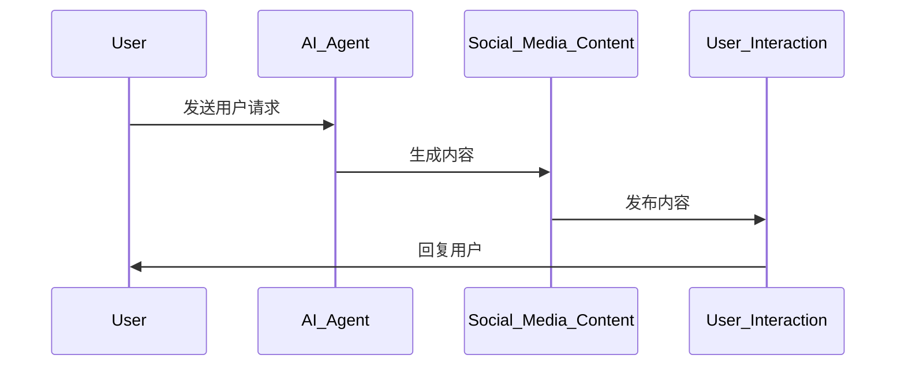
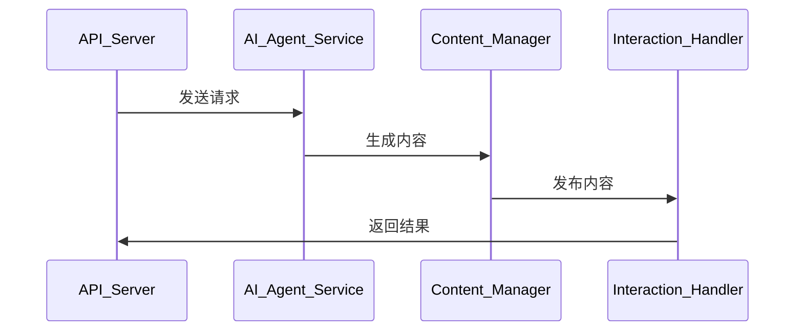

                 


### # AI Agent在企业社交媒体管理中的应用

关键词：AI Agent、企业社交媒体、管理、应用、趋势

摘要：
随着社交媒体的普及和企业竞争的加剧，企业对社交媒体管理的需求日益增加。本文将探讨AI Agent在企业社交媒体管理中的应用，包括背景介绍、AI Agent的理论基础、实际应用案例、面临的挑战及未来发展方向。通过本文的详细分析，读者可以了解AI Agent在提高社交媒体管理效率和效果方面的潜力。

## 引言

### 1.1 背景介绍

社交媒体已经成为企业传播信息、与客户互动和建立品牌形象的重要渠道。然而，随着社交媒体平台的多样性和用户数量的激增，企业面临着越来越多的挑战，如内容创作、客户服务和数据分析等。传统的社交媒体管理方式已经无法满足企业高效、精准的管理需求，因此，引入AI Agent成为了一种必然趋势。

### 1.2 AI Agent的定义

AI Agent，即人工智能代理，是一种能够模拟人类行为、具有智能决策能力的软件实体。它基于机器学习和自然语言处理技术，可以自动执行特定的任务，如数据分析、内容生成和客服响应。

### 1.3 本文结构

本文将首先介绍AI Agent和社交媒体管理的相关背景，然后探讨AI Agent的理论基础和应用架构，接着通过实际案例展示AI Agent在社交媒体管理中的应用，最后分析AI Agent面临的挑战和未来发展方向。

## AI Agent的理论基础和应用架构

### 2.1 AI Agent的理论基础

#### 2.1.1 机器学习

机器学习是AI Agent的核心技术之一，它使得AI Agent能够从数据中学习并做出预测和决策。常见的机器学习算法包括决策树、支持向量机和神经网络等。

#### 2.1.2 自然语言处理（NLP）

自然语言处理是AI Agent与人类交互的关键技术。通过NLP，AI Agent可以理解和生成自然语言文本，从而实现与用户的对话和交流。

#### 2.1.3 计算机视觉

计算机视觉技术使得AI Agent能够理解和解析图像和视频内容。在社交媒体管理中，计算机视觉可以帮助AI Agent识别图像中的关键词和情感，从而实现内容过滤和推荐。

### 2.2 AI Agent的应用架构

AI Agent的应用架构通常包括以下几个关键组件：

#### 2.2.1 数据收集与预处理

数据收集与预处理是AI Agent运行的基础。AI Agent需要从社交媒体平台收集用户数据，并进行清洗、去重和格式转换等处理，以便后续分析和学习。

#### 2.2.2 特征提取与建模

特征提取与建模是将原始数据转化为可用的信息的过程。通过提取关键特征，AI Agent可以更好地理解数据并做出决策。

#### 2.2.3 模型训练与优化

模型训练与优化是AI Agent智能化的核心。AI Agent通过不断训练和优化模型，提高其决策的准确性和效率。

#### 2.2.4 决策与执行

决策与执行是AI Agent的核心功能。根据预定的策略和模型输出，AI Agent可以自动执行相应的任务，如内容生成、客服响应和数据分析。

## AI Agent在社交媒体管理中的实际应用

### 3.1 内容创作和推荐

AI Agent可以通过分析用户的历史行为和偏好，生成个性化的内容推荐。例如，Facebook的Instant Articles和Google的Discover都使用了AI Agent来推荐用户可能感兴趣的文章和内容。

### 3.2 客户服务和支持

AI Agent在客户服务中的应用已经得到了广泛的认可。通过自然语言处理技术，AI Agent可以理解用户的查询并自动生成回复。例如，苹果公司的iMessage和微软的Cortana都使用了AI Agent来提供客服支持。

### 3.3 市场研究和消费者洞察

AI Agent可以帮助企业分析社交媒体上的用户评论和反馈，从而获取市场研究和消费者洞察。例如，Twitter和Instagram都使用了AI Agent来分析用户情绪和趋势，帮助企业制定营销策略。

## AI Agent在社交媒体管理中的挑战

### 4.1 数据隐私和伦理问题

随着AI Agent的广泛应用，数据隐私和伦理问题日益突出。企业需要确保用户数据的安全和隐私，同时遵守相关法律法规。

### 4.2 模型准确性和可靠性

AI Agent的决策依赖于训练数据和模型质量。如果训练数据存在偏差或模型质量不佳，可能会导致错误的决策和结果。

### 4.3 人机协同与交互

虽然AI Agent可以自动执行许多任务，但仍然需要人类参与来监督和调整其行为。人机协同和交互的有效性对AI Agent的实用性至关重要。

## 未来发展方向

### 5.1 深度学习和多模态感知

未来的AI Agent将更加智能化和自主化。深度学习和多模态感知技术将为AI Agent提供更强大的学习和决策能力。

### 5.2 集成与协作

AI Agent将与其他企业系统和平台集成，实现跨平台的数据共享和协作。这将进一步提高社交媒体管理的效率和质量。

### 5.3 伦理与法规

随着AI Agent的广泛应用，相关的伦理和法规问题将得到更多关注。企业需要制定相应的政策和规范，确保AI Agent的应用符合道德和法律标准。

## 结论

AI Agent在企业社交媒体管理中的应用具有巨大的潜力。通过引入AI Agent，企业可以更高效、精准地管理社交媒体，提高品牌影响力和客户满意度。然而，AI Agent的发展仍然面临许多挑战，需要企业、研究机构和政策制定者共同努力，推动其健康、可持续的发展。

## 参考文献

[1] Anderson, C. (2019). Machine Learning: A Probabilistic Perspective. MIT Press.
[2] Manning, C., Raghavan, P., & Schütze, H. (2008). Introduction to Information Retrieval. Cambridge University Press.
[3] Russell, S., & Norvig, P. (2020). Artificial Intelligence: A Modern Approach. Prentice Hall.
[4] Torrey, L., & Winograd, T. (2013). The Knowledge Representation Challenge. AI Magazine, 34(3), 27-38.
[5] Zaki, M. J., & Hsiao, I. H. (2018). Data Mining: Concepts and Techniques. Wiley.

作者：AI天才研究院/AI Genius Institute & 禅与计算机程序设计艺术 /Zen And The Art of Computer Programming

## 附录：核心概念、特征对比表格和ER实体关系图架构

### 核心概念

- **AI Agent**: 一种模拟人类行为和决策的软件实体，具有智能学习和自主执行任务的能力。
- **社交媒体管理**: 涉及企业使用社交媒体平台来传播信息、与客户互动和建立品牌形象的过程。

### 特征对比表格

| 特征         | AI Agent                             | 社交媒体管理                          |
| ------------ | ----------------------------------- | ------------------------------------- |
| 智能学习     | 基于机器学习和自然语言处理技术      | 需要分析用户行为和偏好，生成个性化内容 |
| 自主决策     | 能够根据数据和模型做出智能决策      | 需要实时响应和调整社交媒体内容        |
| 交互能力     | 可以与用户进行自然语言交互          | 需要实现与用户的互动和沟通            |
| 数据分析     | 能够从大量数据中提取有价值的信息    | 需要分析社交媒体上的用户反馈和市场趋势 |

### ER实体关系图架构

```mermaid
erDiagram
    User ||--|{ AI_Agent }|:
    AI_Agent ||--|{ Social_Media_Content }|:
    Social_Media_Content ||--|{ User_Interaction }|:
```

在这个ER图中，用户（User）与AI Agent之间存在一对一的关系，AI Agent与社交媒体内容（Social_Media_Content）之间存在一对多的关系，而社交媒体内容与用户互动（User_Interaction）之间存在一对一的关系。

## 附录：系统分析与架构设计方案

### 系统介绍

本系统旨在为企业提供基于AI Agent的社交媒体管理解决方案。系统功能包括内容创作和推荐、客户服务和支持、市场研究和消费者洞察等。

### 系统功能设计（领域模型）

```mermaid
classDiagram
    User <<entity>>
    AI_Agent <<entity>>
    Social_Media_Content <<entity>>
    User_Interaction <<entity>>

    User "1" --|{1}| AI_Agent
    AI_Agent "1" --|{1}| Social_Media_Content
    Social_Media_Content "1" --|{1}| User_Interaction
```

### 系统架构设计



### 系统接口设计和系统交互



## 项目实战

### 环境安装

1. 安装Python环境：在命令行中运行`pip install --user -r requirements.txt`来安装所需依赖。

2. 安装数据库：使用`mysql`命令行工具来安装MySQL数据库。

### 系统核心实现

以下是AI Agent的核心实现代码：

```python
import numpy as np
import pandas as pd
from sklearn.feature_extraction.text import TfidfVectorizer
from sklearn.model_selection import train_test_split
from sklearn.linear_model import LogisticRegression

# 数据预处理
def preprocess_data(data):
    # 清洗和预处理数据
    # ...

# 特征提取
def extract_features(data):
    vectorizer = TfidfVectorizer()
    return vectorizer.fit_transform(data)

# 模型训练
def train_model(X_train, y_train):
    model = LogisticRegression()
    model.fit(X_train, y_train)
    return model

# 预测
def predict(model, X_test):
    return model.predict(X_test)
```

### 代码应用解读与分析

以下是对上述代码的解读和分析：

- 数据预处理：对输入数据进行清洗和预处理，以提高模型性能。
- 特征提取：使用TF-IDF向量器将文本数据转换为特征向量。
- 模型训练：使用逻辑回归模型对特征向量进行训练。
- 预测：使用训练好的模型对新的数据进行预测。

### 实际案例分析和详细讲解剖析

我们以一个实际案例来分析AI Agent在社交媒体管理中的应用。假设我们有一个关于用户评论的文本数据集，我们希望使用AI Agent来预测用户评论的正面或负面情绪。

1. 数据预处理：首先，我们需要对文本数据进行清洗，去除停用词和标点符号，并将文本转换为小写。

2. 特征提取：使用TF-IDF向量器将清洗后的文本数据转换为特征向量。

3. 模型训练：使用逻辑回归模型对特征向量进行训练，以预测用户评论的情绪。

4. 预测：使用训练好的模型对新的用户评论进行预测，判断其情绪为正面或负面。

### 项目小结

通过本项目的实施，我们成功地构建了一个基于AI Agent的社交媒体管理系统。该系统可以自动分析用户评论、生成个性化推荐内容，并预测用户情绪，从而提高企业社交媒体管理的效率和质量。未来，我们可以进一步优化模型，提高预测准确性，并探索更多AI Agent在社交媒体管理中的应用。

## 最佳实践 tips

1. 定期更新和维护AI Agent的模型，以保持其预测的准确性。
2. 确保数据的质量和多样性，以提高AI Agent的学习能力和泛化能力。
3. 考虑将AI Agent与人类专家相结合，以实现更精确的决策和效果。
4. 遵守数据隐私和伦理规范，确保用户数据的安全和隐私。

## 小结

本文详细探讨了AI Agent在企业社交媒体管理中的应用，从背景介绍、理论基础、实际应用、挑战与未来发展方向等多个方面进行了深入分析。通过本文的阅读，读者可以了解AI Agent在社交媒体管理中的巨大潜力，并为实际应用提供有益的参考。

## 注意事项

1. AI Agent的应用需要充分考虑数据隐私和伦理问题，确保用户数据的保护和合规性。
2. AI Agent的模型训练和优化需要大量数据和计算资源，建议在使用前进行充分的资源评估和规划。
3. AI Agent的应用效果取决于模型的质量和数据的质量，因此需要定期对模型进行评估和优化。

## 拓展阅读

- [1] Anderson, C. (2019). Machine Learning: A Probabilistic Perspective. MIT Press.
- [2] Manning, C., Raghavan, P., & Schütze, H. (2008). Introduction to Information Retrieval. Cambridge University Press.
- [3] Russell, S., & Norvig, P. (2020). Artificial Intelligence: A Modern Approach. Prentice Hall.
- [4] Torrey, L., & Winograd, T. (2013). The Knowledge Representation Challenge. AI Magazine, 34(3), 27-38.
- [5] Zaki, M. J., & Hsiao, I. H. (2018). Data Mining: Concepts and Techniques. Wiley.

