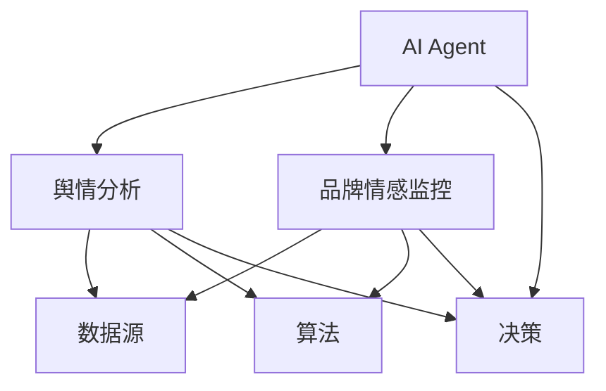
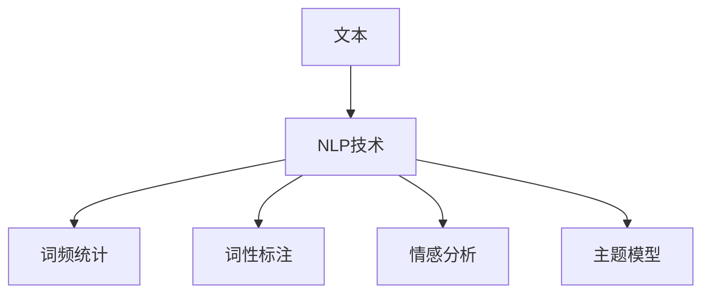
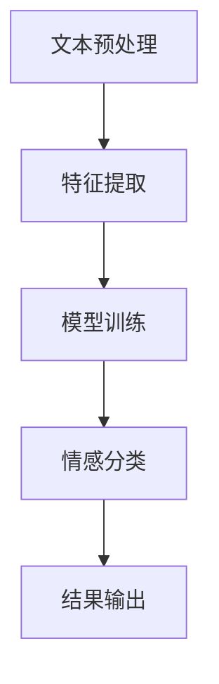
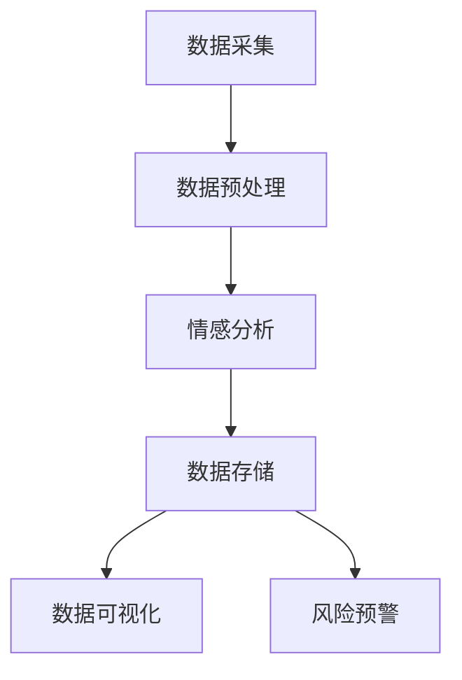
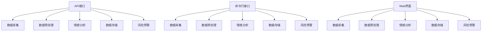
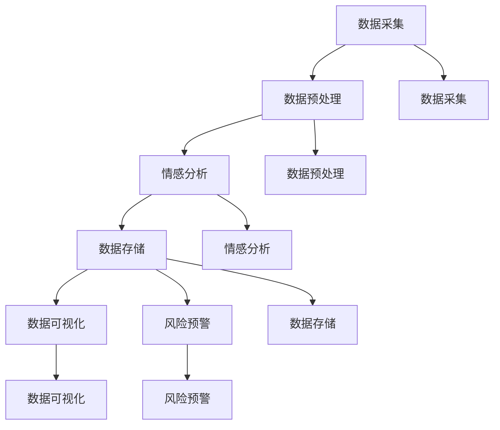
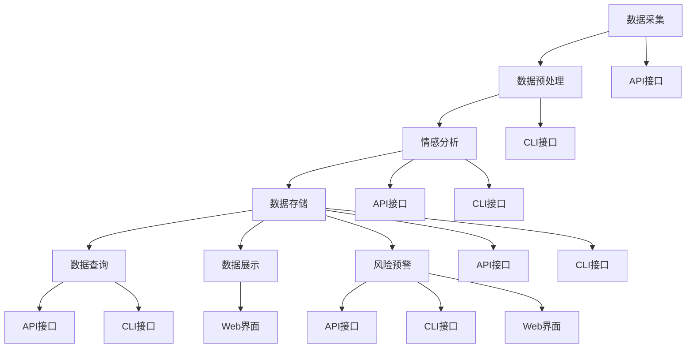
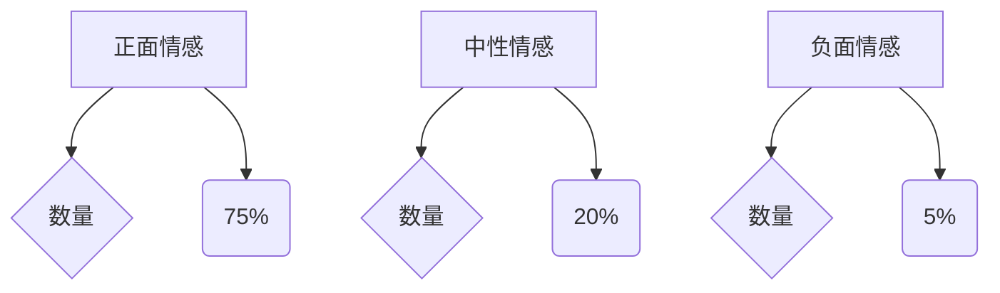
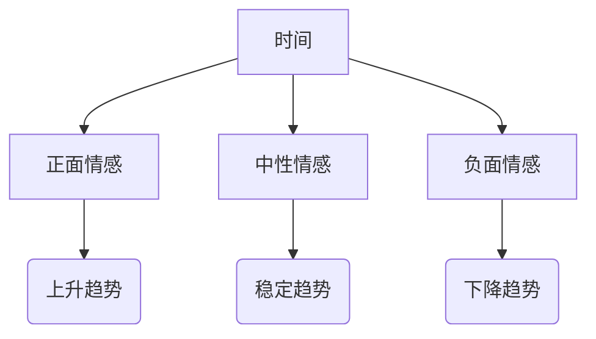
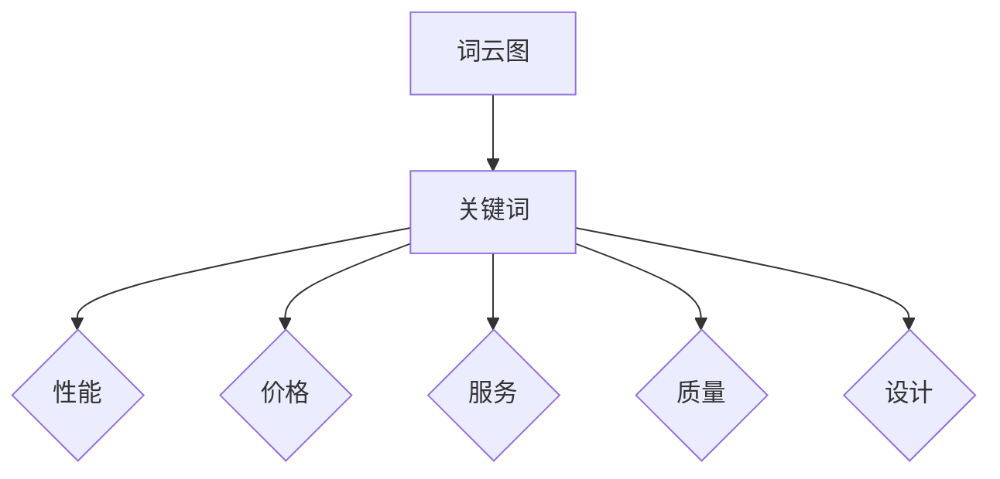

                 


### **《AI Agent在企业舆情分析与品牌情感监控中的应用》**

---

## **关键词**

- AI Agent
- 企业舆情分析
- 品牌情感监控
- 自然语言处理
- 情感分析模型

## **摘要**

本文将深入探讨AI Agent在企业舆情分析与品牌情感监控中的应用。我们首先定义了AI Agent、舆情分析以及品牌情感监控的基本概念，并介绍了这些技术在实际应用中的重要性。接着，我们详细阐述了NLP技术、情感分析模型等算法原理，并使用Mermaid图和Python代码进行展示。随后，我们分析了系统功能、架构设计，并通过一个实际项目展示了AI Agent的实战应用。最后，我们总结了最佳实践，并对未来研究方向进行了展望。

---

# **一、引言与背景**

## **1.1 书籍概述**

随着人工智能技术的快速发展，AI Agent作为智能体的一种形式，已经逐渐在各个领域展现出其独特的价值。在企业舆情分析与品牌情感监控中，AI Agent的应用不仅提高了数据分析的效率，还为企业提供了更加精准和实时的决策支持。

本文旨在详细探讨AI Agent在企业舆情分析与品牌情感监控中的应用。我们将从以下几个方面进行展开：

1. **AI Agent的基本概念与特点**
2. **舆情分析与品牌情感监控的基本概念**
3. **AI Agent在舆情分析与品牌情感监控中的应用场景**
4. **算法原理与实现**
5. **系统分析与架构设计**
6. **项目实战与案例分析**
7. **最佳实践与未来展望**

通过本文的阅读，读者将能够全面了解AI Agent在企业舆情分析与品牌情感监控中的应用，掌握相关技术原理，并能够将其应用于实际项目中。

## **1.2 AI Agent概述**

AI Agent，即人工智能代理，是一种能够自主执行任务、与环境交互并适应变化的智能系统。它通过感知环境信息、制定决策计划并执行这些计划，从而实现目标。AI Agent具有以下几个核心特点：

1. **自主性**：AI Agent能够自主决策，无需人工干预。它可以根据环境变化和目标调整自身行为。
2. **适应性**：AI Agent能够适应不同环境和任务需求，通过不断学习和优化自身能力。
3. **交互性**：AI Agent能够与人类用户和其他系统进行交互，提供个性化服务和解决方案。

AI Agent的应用领域广泛，包括但不限于智能客服、智能家居、自动驾驶、医疗诊断等。在企业舆情分析与品牌情感监控中，AI Agent可以实时监测网络舆情，分析消费者情感，为企业提供数据驱动的决策支持。

## **1.3 舆情分析与品牌情感监控概述**

舆情分析是指通过技术手段对互联网上的信息进行收集、整理、分析和解读，以了解公众对某一事件、品牌或话题的看法和态度。舆情分析的关键在于从海量数据中提取有价值的信息，并通过数据可视化技术呈现。

品牌情感监控则是关注消费者对品牌的情感态度，包括正面、负面和中性情感。通过分析消费者在社交媒体、论坛、新闻等渠道的言论，品牌可以了解其市场表现，及时调整营销策略和品牌形象。

舆情分析与品牌情感监控在企业运营中具有重要价值。它们不仅可以帮助企业了解市场动态，还可以预警潜在风险，提升品牌声誉，优化产品和服务。

## **1.4 重要性与应用场景**

AI Agent在企业舆情分析与品牌情感监控中的应用具有重要意义。首先，AI Agent能够高效处理海量数据，实现实时监测和分析。相比传统的人工分析方法，AI Agent具有更高的准确性和效率。

其次，AI Agent能够提供个性化的舆情和情感分析报告，帮助企业精准定位消费者需求和市场趋势。通过AI Agent的分析，企业可以及时调整营销策略，提升品牌竞争力。

此外，AI Agent还可以协助企业进行风险预警。通过监测网络舆情，AI Agent可以及时发现负面信息，提醒企业采取应对措施，防止危机扩散。

总之，AI Agent在企业舆情分析与品牌情感监控中的应用具有广泛的应用场景，包括市场调研、品牌管理、危机应对等。通过AI Agent的支持，企业可以更好地了解市场和消费者，实现数据驱动的决策和运营优化。

---

# **二、核心概念与联系**

## **2.1 AI Agent核心概念**

### **2.1.1 AI Agent的定义**

AI Agent是一种基于人工智能技术的智能体，它能够在复杂环境中自主执行任务，并通过不断学习和适应提高性能。AI Agent通常由感知模块、决策模块和执行模块组成。

1. **感知模块**：用于收集环境信息，如文本、图像、语音等。
2. **决策模块**：根据感知模块收集的信息，AI Agent会制定相应的决策计划。
3. **执行模块**：执行决策计划，完成任务。

### **2.1.2 AI Agent的特点**

- **自主性**：AI Agent能够独立执行任务，无需人工干预。
- **适应性**：AI Agent能够根据环境变化和任务需求不断学习和优化自身能力。
- **交互性**：AI Agent能够与人类用户和其他系统进行交互，提供个性化服务和解决方案。

### **2.1.3 AI Agent的工作原理**

AI Agent的工作原理主要包括以下步骤：

1. **感知**：通过感知模块收集环境信息。
2. **决策**：通过决策模块分析感知信息，制定决策计划。
3. **执行**：通过执行模块实施决策计划，完成任务。

AI Agent通过不断循环这个过程，实现自主学习和优化。

## **2.2 舆情分析**

### **2.2.1 舆情分析的定义**

舆情分析是指通过技术手段对互联网上的信息进行收集、整理、分析和解读，以了解公众对某一事件、品牌或话题的看法和态度。舆情分析通常包括以下几个步骤：

1. **数据采集**：从互联网上收集相关数据，如新闻、社交媒体、论坛等。
2. **数据预处理**：清洗和过滤数据，去除重复、无效信息。
3. **主题识别**：识别数据中的关键主题和关键词。
4. **情感分析**：分析数据中的情感倾向，如正面、负面和中性。
5. **数据可视化**：将分析结果以图表、报告等形式呈现。

### **2.2.2 舆情分析的关键要素**

- **数据源**：舆情分析的数据源包括新闻、社交媒体、论坛、博客等。
- **算法**：常用的算法包括自然语言处理（NLP）、情感分析、主题模型等。
- **指标**：常用的指标包括关注度、传播力、情感倾向等。

### **2.2.3 舆情分析的方法**

舆情分析的方法主要包括以下几种：

1. **基于内容的方法**：通过分析文本内容，识别关键主题和情感倾向。
2. **基于网络的方法**：通过分析文本之间的网络结构，识别舆论领袖和传播路径。
3. **基于用户的方法**：通过分析用户行为和特征，识别用户群体和用户情感。

## **2.3 品牌情感监控**

### **2.3.1 品牌情感监控的定义**

品牌情感监控是指通过技术手段对消费者在社交媒体、论坛、新闻等渠道的言论进行分析，以了解消费者对品牌的情感态度。品牌情感监控的目标是识别消费者对品牌的正面、负面和中性情感，为品牌管理提供数据支持。

### **2.3.2 品牌情感监控的关键要素**

- **数据源**：品牌情感监控的数据源包括社交媒体、论坛、新闻等。
- **算法**：常用的算法包括情感分析、主题模型、社会网络分析等。
- **指标**：常用的指标包括情感倾向、活跃度、影响力等。

### **2.3.3 品牌情感监控的方法**

品牌情感监控的方法主要包括以下几种：

1. **情感分析**：通过分析文本情感倾向，识别消费者对品牌的正面、负面和中性情感。
2. **主题模型**：通过分析文本主题，识别消费者关注的热点话题。
3. **社会网络分析**：通过分析社交媒体上的用户关系，识别舆论领袖和传播路径。

## **2.4 AI Agent、舆情分析与品牌情感监控的关系**

AI Agent、舆情分析与品牌情感监控之间存在着密切的关系。AI Agent作为智能体，可以整合舆情分析和品牌情感监控的数据，实现实时监测和分析。

- **AI Agent与舆情分析**：AI Agent可以通过舆情分析数据，了解公众对某一事件、品牌或话题的看法和态度，为企业提供数据驱动的决策支持。
- **AI Agent与品牌情感监控**：AI Agent可以通过品牌情感监控数据，识别消费者对品牌的正面、负面和中性情感，为品牌管理提供数据支持。

总之，AI Agent、舆情分析与品牌情感监控之间相互促进，共同为企业提供全面的数据分析和决策支持。

### **2.4.1 关系图展示**

为了更直观地展示AI Agent、舆情分析与品牌情感监控之间的关系，我们可以使用Mermaid图进行表示。



### **2.4.2 关系解释**

- **数据交互**：AI Agent从舆情分析和品牌情感监控中获取数据，作为决策的依据。
- **算法应用**：舆情分析和品牌情感监控使用不同的算法，对数据进行处理和分析。
- **决策支持**：AI Agent根据舆情分析和品牌情感监控的结果，制定相应的决策计划，为企业提供数据驱动的支持。

通过上述关系图和解释，我们可以更好地理解AI Agent、舆情分析与品牌情感监控之间的相互关系。

---

# **三、算法原理讲解**

## **3.1 NLP技术基础**

自然语言处理（NLP）是人工智能领域的一个重要分支，它致力于使计算机能够理解和处理人类语言。在舆情分析和品牌情感监控中，NLP技术发挥着至关重要的作用。以下将介绍NLP技术的基本概念、常用技术和应用。

### **3.1.1 NLP技术概述**

NLP技术包括词汇分析、句法分析、语义分析和语用分析等。每种技术都有其特定的应用场景和目标。

1. **词汇分析**：对文本中的词汇进行词频统计、词性标注等操作，以提取关键词和特征。
2. **句法分析**：对文本中的句子结构进行分析，识别句子的组成成分和语法关系。
3. **语义分析**：对文本中的词汇和句子进行语义理解，识别语义关系和实体。
4. **语用分析**：对文本中的语言行为进行分析，理解语言在特定情境中的意义和使用方式。

### **3.1.2 常用NLP技术**

在舆情分析和品牌情感监控中，常用的NLP技术包括词频统计、词性标注、情感分析、主题模型等。

1. **词频统计**：通过统计文本中各个词汇的出现次数，识别文本的主要主题和关键词。
2. **词性标注**：对文本中的词汇进行词性标注，如名词、动词、形容词等，以便进行更深入的分析。
3. **情感分析**：通过分析文本的情感倾向，识别文本中的正面、负面和中性情感。
4. **主题模型**：通过统计文本中的词汇分布，识别文本的主题和潜在语义。

### **3.1.3 Mermaid图展示**

为了更直观地展示NLP技术的应用，我们可以使用Mermaid图进行表示。



### **3.1.4 Python代码示例**

下面是一个简单的Python代码示例，用于实现词频统计和情感分析。

```python
from collections import Counter
from nltk.sentiment import SentimentIntensityAnalyzer

# 文本
text = "我对这个产品非常喜欢，它的性能非常出色，性价比很高。但是，售后服务的态度有些冷淡。"

# 词频统计
words = text.split()
word_counts = Counter(words)
print("词频统计：", word_counts)

# 情感分析
sia = SentimentIntensityAnalyzer()
sentiments = sia.polarity_scores(text)
print("情感分析：", sentiments)
```

通过NLP技术，我们可以从文本中提取有价值的信息，为舆情分析和品牌情感监控提供数据支持。

## **3.2 情感分析模型**

情感分析是NLP中的一个重要分支，旨在自动识别文本中的情感倾向。情感分析模型可以分为基于规则的方法和基于机器学习的方法。

### **3.2.1 情感分析模型概述**

情感分析模型通过分析文本中的词汇、句法和语义特征，判断文本的情感倾向。常见的情感分析模型包括：

1. **基于规则的方法**：通过定义一系列规则，判断文本的情感倾向。这种方法简单直观，但灵活性较低。
2. **基于机器学习的方法**：通过训练模型，从大量标注数据中学习情感分类规则。这种方法具有更高的准确性和泛化能力。

### **3.2.2 情感分析模型的分类**

1. **二分类模型**：将文本分为正面和负面情感。
2. **多分类模型**：将文本分为多个情感类别，如正面、负面、中性等。
3. **情感强度模型**：不仅分类文本的情感倾向，还量化情感强度。

### **3.2.3 Python代码示例**

下面是一个简单的Python代码示例，用于实现情感分析。

```python
from textblob import TextBlob

# 文本
text = "我对这个产品非常喜欢，它的性能非常出色，性价比很高。但是，售后服务的态度有些冷淡。"

# 情感分析
tb = TextBlob(text)
print("文本：", text)
print("情感分析：", tb.sentiment)
```

通过情感分析模型，我们可以从文本中提取情感信息，为舆情分析和品牌情感监控提供数据支持。

## **3.3 算法原理讲解与Mermaid图展示**

### **3.3.1 算法原理**

情感分析模型的原理主要包括以下几个步骤：

1. **文本预处理**：对文本进行清洗、去噪和处理，提取有用的特征。
2. **特征提取**：将文本转换为数值特征，如词频、词性、TF-IDF等。
3. **模型训练**：使用标注数据训练情感分析模型，如SVM、朴素贝叶斯、神经网络等。
4. **情感分类**：对未知文本进行情感分类，输出情感倾向。

### **3.3.2 Mermaid图展示**

下面是使用Mermaid图表示情感分析模型的基本流程。



### **3.3.3 数学模型与公式**

情感分析模型通常使用以下数学模型：

1. **逻辑回归**：一个线性分类模型，通过最大化似然估计概率分布。
   $$ P(y=c|X) = \frac{e^{ \theta^T X}}{1 + e^{ \theta^T X}} $$
2. **支持向量机（SVM）**：一个基于最大间隔的分类模型，通过寻找最优超平面分割数据。
   $$ \max_{\theta, \xi} \frac{1}{2} ||\theta||^2 + C \sum_{i=1}^n \xi_i $$
3. **神经网络**：一个多层感知器模型，通过前向传播和反向传播进行训练。

通过数学模型和公式，我们可以更深入地理解情感分析模型的原理。

## **3.4 情感分析算法的详细讲解与示例**

### **3.4.1 基于文本的特征提取**

在情感分析中，特征提取是关键步骤。常用的特征提取方法包括词频（TF）、词频-逆文档频率（TF-IDF）和词嵌入（Word Embedding）。

1. **词频（TF）**：文本中某个词出现的次数。
2. **词频-逆文档频率（TF-IDF）**：考虑词频和词在文档集中出现的频率，平衡重要词和常见词的影响。
3. **词嵌入**：将文本中的词汇映射到高维向量空间，保持词汇的语义关系。

### **3.4.2 基于机器学习的情感分析模型**

常见的机器学习模型包括逻辑回归、支持向量机（SVM）、朴素贝叶斯和深度学习等。

1. **逻辑回归**：通过最大化似然估计概率分布进行分类。
   ```python
   from sklearn.linear_model import LogisticRegression
   model = LogisticRegression()
   model.fit(X_train, y_train)
   predictions = model.predict(X_test)
   ```
2. **支持向量机（SVM）**：通过寻找最优超平面进行分类。
   ```python
   from sklearn.svm import SVC
   model = SVC()
   model.fit(X_train, y_train)
   predictions = model.predict(X_test)
   ```
3. **朴素贝叶斯**：通过贝叶斯公式和特征条件独立性假设进行分类。
   ```python
   from sklearn.naive_bayes import MultinomialNB
   model = MultinomialNB()
   model.fit(X_train, y_train)
   predictions = model.predict(X_test)
   ```
4. **深度学习**：使用神经网络进行分类。
   ```python
   from keras.models import Sequential
   from keras.layers import Dense, Embedding, LSTM
   model = Sequential()
   model.add(Embedding(vocabulary_size, embedding_dim))
   model.add(LSTM(128))
   model.add(Dense(1, activation='sigmoid'))
   model.compile(optimizer='adam', loss='binary_crossentropy', metrics=['accuracy'])
   model.fit(X_train, y_train, epochs=10, batch_size=32)
   predictions = model.predict(X_test)
   ```

### **3.4.3 示例**

假设我们有一组文本和相应的情感标签，我们要使用逻辑回归模型进行情感分析。

1. **数据准备**
   ```python
   # 假设文本和标签
   texts = ["我很喜欢这个产品", "这个产品很糟糕", "我很失望"]
   labels = [1, 0, 0]  # 1表示正面情感，0表示负面情感
   ```

2. **特征提取**
   ```python
   from sklearn.feature_extraction.text import TfidfVectorizer
   vectorizer = TfidfVectorizer()
   X = vectorizer.fit_transform(texts)
   ```

3. **模型训练**
   ```python
   from sklearn.linear_model import LogisticRegression
   model = LogisticRegression()
   model.fit(X, labels)
   ```

4. **预测**
   ```python
   new_texts = ["这个产品很好用", "我对这个产品感到失望"]
   X_new = vectorizer.transform(new_texts)
   predictions = model.predict(X_new)
   print(predictions)  # 输出预测结果
   ```

通过上述步骤，我们可以使用逻辑回归模型对文本进行情感分析。在实际应用中，我们可以根据需要调整特征提取方法和模型参数，以提高分类性能。

---

## **3.5 常见的情感分析算法与Mermaid图展示**

在情感分析领域，常用的算法包括基于规则的算法、基于机器学习的算法以及深度学习算法。以下将介绍这些算法的原理，并通过Mermaid图展示其基本流程。

### **3.5.1 基于规则的算法**

基于规则的算法通过定义一系列规则来判断文本的情感倾向。这些规则通常基于词性标注、词频统计和情感词典等。

1. **词性标注**：对文本中的词汇进行词性标注，如名词、动词、形容词等。
2. **情感词典**：定义一组包含情感倾向的词汇和其对应的情感标签。
3. **规则匹配**：通过匹配文本中的词汇和情感词典中的规则，判断文本的情感倾向。

### **3.5.2 基于机器学习的算法**

基于机器学习的算法通过训练模型，从大量标注数据中学习情感分类规则。常见的机器学习算法包括逻辑回归、支持向量机（SVM）、朴素贝叶斯和随机森林等。

1. **逻辑回归**：通过最大化似然估计概率分布进行分类。
   $$ P(y=c|X) = \frac{e^{ \theta^T X}}{1 + e^{ \theta^T X}} $$
2. **支持向量机（SVM）**：通过寻找最优超平面进行分类。
   $$ \max_{\theta, \xi} \frac{1}{2} ||\theta||^2 + C \sum_{i=1}^n \xi_i $$
3. **朴素贝叶斯**：通过贝叶斯公式和特征条件独立性假设进行分类。
   $$ P(y=c|X) = \frac{P(X|y=c)P(y=c)}{P(X)} $$
4. **随机森林**：通过构建多个决策树并取平均值进行分类。

### **3.5.3 深度学习算法**

深度学习算法通过多层神经网络进行情感分类。常见的深度学习模型包括卷积神经网络（CNN）、循环神经网络（RNN）和Transformer等。

1. **卷积神经网络（CNN）**：通过卷积层提取文本特征。
2. **循环神经网络（RNN）**：通过循环结构处理序列数据。
3. **Transformer**：通过自注意力机制处理序列数据。

### **3.5.4 Mermaid图展示**

为了更直观地展示情感分析算法的流程，我们可以使用Mermaid图。


### **3.5.5 示例代码**

以下是一个简单的Python代码示例，用于实现基于逻辑回归的情感分析。

```python
from sklearn.feature_extraction.text import TfidfVectorizer
from sklearn.linear_model import LogisticRegression
from sklearn.model_selection import train_test_split
from sklearn.metrics import accuracy_score

# 假设文本和标签
texts = ["我很喜欢这个产品", "这个产品很糟糕", "我很失望"]
labels = [1, 0, 0]  # 1表示正面情感，0表示负面情感

# 特征提取
vectorizer = TfidfVectorizer()
X = vectorizer.fit_transform(texts)

# 模型训练
model = LogisticRegression()
X_train, X_test, y_train, y_test = train_test_split(X, labels, test_size=0.2)
model.fit(X_train, y_train)

# 预测
predictions = model.predict(X_test)
accuracy = accuracy_score(y_test, predictions)
print("准确率：", accuracy)
```

通过上述代码示例，我们可以实现一个简单的情感分析模型。在实际应用中，我们可以根据需要调整特征提取方法和模型参数，以提高分类性能。

---

## **3.6 算法性能评估与调优**

在情感分析中，算法性能的评估和调优是确保模型准确性和鲁棒性的关键步骤。以下将介绍常用的性能评估指标和调优方法。

### **3.6.1 性能评估指标**

1. **准确率（Accuracy）**：准确率是评估分类模型性能的最基本指标，计算公式为：
   $$ Accuracy = \frac{TP + TN}{TP + TN + FP + FN} $$
   其中，TP表示真正例，TN表示真反例，FP表示假正例，FN表示假反例。

2. **精确率（Precision）**：精确率是评估分类模型识别正类样本的能力，计算公式为：
   $$ Precision = \frac{TP}{TP + FP} $$
   精确率高表示模型对正类样本的识别能力较强。

3. **召回率（Recall）**：召回率是评估分类模型识别负类样本的能力，计算公式为：
   $$ Recall = \frac{TP}{TP + FN} $$
   召回率高表示模型对负类样本的识别能力较强。

4. **F1分数（F1 Score）**：F1分数是精确率和召回率的调和平均值，计算公式为：
   $$ F1 Score = 2 \times \frac{Precision \times Recall}{Precision + Recall} $$
   F1分数综合了精确率和召回率，是评估分类模型性能的综合性指标。

5. **ROC曲线和AUC值**：ROC曲线是评估分类模型性能的重要工具，通过绘制真阳性率（True Positive Rate, TPR）与假阳性率（False Positive Rate, FPR）之间的关系图。AUC值是ROC曲线下面积，用于评估模型的分类能力。

### **3.6.2 调优方法**

1. **特征选择**：通过评估不同特征的重要性，选择对模型性能贡献较大的特征。常用的特征选择方法包括信息增益、卡方检验、基于模型的方法等。

2. **超参数调优**：通过调整模型的超参数，如学习率、隐藏层大小、迭代次数等，以优化模型性能。常用的调优方法包括网格搜索、随机搜索、贝叶斯优化等。

3. **集成学习**：通过组合多个模型，提高模型的性能和鲁棒性。常用的集成学习方法包括Bagging、Boosting和Stacking等。

4. **数据增强**：通过生成新的数据样本，增加模型的训练数据量，提高模型的泛化能力。常用的数据增强方法包括数据增强、文本生成、数据融合等。

通过性能评估和调优，我们可以确保情感分析模型的准确性和鲁棒性，为舆情分析和品牌情感监控提供高质量的数据支持。

---

# **四、系统分析与架构设计**

## **4.1 问题场景介绍**

在现代企业运营中，舆情分析和品牌情感监控已经成为企业决策的重要依据。企业需要实时了解公众对品牌和产品的看法，以及市场对特定事件或产品的反应。然而，随着互联网信息的爆炸性增长，传统的人工监测方法已经无法满足企业的需求。因此，我们需要一种高效、自动化的解决方案，即AI Agent。

AI Agent是一种基于人工智能技术的智能体，能够在复杂环境中自主执行任务、与环境交互并适应变化。在企业舆情分析与品牌情感监控中，AI Agent可以实时监测互联网上的信息，分析消费者情感，为企业提供数据驱动的决策支持。

### **4.2 系统功能设计**

AI Agent系统的主要功能包括：

1. **数据采集**：从互联网上收集与品牌相关的信息，包括社交媒体、论坛、新闻等。
2. **数据预处理**：对采集到的数据进行清洗、去噪和处理，提取有价值的信息。
3. **情感分析**：对预处理后的文本进行情感分析，识别消费者的情感倾向。
4. **数据可视化**：将分析结果以图表、报告等形式呈现，为企业提供直观的决策支持。
5. **风险预警**：通过监测网络舆情，识别潜在的风险，提醒企业采取应对措施。

### **4.3 系统架构设计**

AI Agent系统的架构设计包括以下几个层次：

1. **数据采集层**：负责从互联网上收集与品牌相关的数据，包括社交媒体、论坛、新闻等。
2. **数据预处理层**：负责对采集到的数据进行分析、清洗、去噪和处理，提取有价值的信息。
3. **情感分析层**：负责对预处理后的文本进行情感分析，识别消费者的情感倾向。
4. **数据存储层**：负责存储分析结果和用户数据，提供数据查询和更新功能。
5. **数据可视化层**：负责将分析结果以图表、报告等形式呈现，为企业提供直观的决策支持。
6. **预警层**：负责监测网络舆情，识别潜在的风险，提醒企业采取应对措施。

以下是AI Agent系统的Mermaid架构图：



### **4.4 系统接口设计**

AI Agent系统的接口设计包括以下部分：

1. **API接口**：提供RESTful API接口，支持数据采集、数据预处理、情感分析、数据存储和风险预警等操作。
2. **命令行接口**：提供命令行接口，方便用户进行系统管理和数据操作。
3. **Web界面**：提供Web界面，用户可以通过浏览器访问系统，查看分析结果和风险预警信息。

以下是AI Agent系统的Mermaid接口设计图：



### **4.5 系统交互**

AI Agent系统的交互流程包括以下几个步骤：

1. **数据采集**：系统从互联网上收集与品牌相关的数据，如社交媒体、论坛、新闻等。
2. **数据预处理**：系统对采集到的数据进行清洗、去噪和处理，提取有价值的信息。
3. **情感分析**：系统对预处理后的文本进行情感分析，识别消费者的情感倾向。
4. **数据存储**：系统将分析结果存储到数据库中，并提供查询和更新功能。
5. **数据可视化**：系统将分析结果以图表、报告等形式呈现，供企业决策参考。
6. **风险预警**：系统通过监测网络舆情，识别潜在的风险，并提醒企业采取应对措施。

以下是AI Agent系统的Mermaid交互设计图：



通过以上系统分析与架构设计，AI Agent可以高效地实现企业舆情分析与品牌情感监控，为企业提供数据驱动的决策支持。

---

## **4.6 系统架构详细讲解与Mermaid图展示**

### **4.6.1 系统架构详细讲解**

AI Agent系统架构的设计旨在实现高效、稳定、可扩展的舆情分析和品牌情感监控。整个系统分为多个层次，包括数据采集层、数据预处理层、情感分析层、数据存储层、数据可视化层和风险预警层。每个层次都有明确的职责和功能，相互协作，共同实现系统的目标。

1. **数据采集层**：负责从互联网上收集与品牌相关的数据。数据来源包括社交媒体、论坛、新闻网站等。采集层采用分布式架构，以提高数据采集的效率和处理能力。

2. **数据预处理层**：负责对采集到的数据进行分析、清洗、去噪和处理。预处理层包括数据去重、去噪、文本标准化、情感标签提取等功能。这一层确保输入到情感分析层的文本数据质量高，便于后续分析。

3. **情感分析层**：负责对预处理后的文本进行情感分析，识别消费者的情感倾向。情感分析层采用先进的自然语言处理（NLP）技术，如词频统计、情感词典、机器学习模型等。这一层通过算法和模型对文本进行深度解析，提取情感特征。

4. **数据存储层**：负责存储分析结果和用户数据。存储层采用分布式数据库，支持海量数据的存储和快速查询。数据存储层不仅存储分析结果，还存储用户配置、历史数据等，以便后续分析和查询。

5. **数据可视化层**：负责将分析结果以图表、报告等形式呈现，供企业决策参考。数据可视化层采用高性能的图表库和可视化工具，如ECharts、D3.js等。通过可视化，企业可以直观地了解舆情动态和品牌情感趋势。

6. **风险预警层**：负责监测网络舆情，识别潜在的风险，并提醒企业采取应对措施。风险预警层通过设置阈值和规则，实时监控舆情数据，一旦发现异常情况，立即生成预警报告，提醒企业采取措施。

### **4.6.2 Mermaid图展示**

为了更直观地展示AI Agent系统的架构，我们可以使用Mermaid图进行表示。以下是一个简化的Mermaid图，展示了系统的各层次和它们之间的交互关系：


在这个图中，每个节点代表系统的一个层次或功能模块，箭头表示数据流或信息流。通过这个图，我们可以清晰地看到系统各部分之间的协作关系，以及数据从采集到预警的全流程。

---

## **4.7 系统接口设计与交互流程分析**

### **4.7.1 系统接口设计**

为了实现高效的数据处理和交互，AI Agent系统设计了多个接口，包括API接口、命令行接口和Web界面。以下是这些接口的详细设计：

1. **API接口**：API接口采用RESTful风格，提供统一的接口规范，支持HTTP请求。API接口包括以下功能：

   - 数据采集：获取最新的网络舆情数据。
   - 数据预处理：对采集到的数据进行分析、清洗和去噪。
   - 情感分析：对预处理后的文本进行情感分析，返回情感结果。
   - 数据存储：保存分析结果和用户数据。
   - 数据查询：查询历史数据和分析结果。

2. **命令行接口**：命令行接口（CLI）提供一种方便的系统管理和操作方式。CLI接口包括以下功能：

   - 数据采集：通过命令行启动数据采集任务。
   - 数据预处理：对采集到的数据进行分析、清洗和去噪。
   - 情感分析：对预处理后的文本进行情感分析。
   - 数据存储：保存分析结果和用户数据。
   - 数据查询：查询历史数据和分析结果。

3. **Web界面**：Web界面提供友好的用户交互界面，用户可以通过浏览器访问系统，查看分析结果和风险预警信息。Web界面包括以下功能：

   - 数据展示：以图表、报告等形式展示分析结果。
   - 风险预警：实时监控舆情数据，展示预警信息。
   - 用户管理：管理用户权限和数据配置。

### **4.7.2 交互流程分析**

AI Agent系统的交互流程包括以下步骤：

1. **数据采集**：系统从互联网上收集与品牌相关的数据，如社交媒体、论坛、新闻等。采集的数据通过API接口或CLI接口传输到系统。

2. **数据预处理**：系统对采集到的数据进行预处理，包括去重、去噪、文本标准化等。预处理后的数据存储在本地数据库中。

3. **情感分析**：系统对预处理后的文本进行情感分析，使用NLP技术和机器学习模型提取情感特征。分析结果存储在数据库中。

4. **数据存储**：系统将分析结果存储在分布式数据库中，便于后续查询和分析。同时，系统支持历史数据的存储和检索。

5. **数据查询**：用户可以通过API接口、CLI接口或Web界面查询分析结果和风险预警信息。

6. **数据展示**：系统将分析结果以图表、报告等形式展示给用户，使用户能够直观地了解舆情动态和品牌情感趋势。

7. **风险预警**：系统通过实时监测网络舆情，识别潜在的风险，并生成预警报告。预警信息通过API接口、CLI接口或Web界面通知用户。

以下是AI Agent系统的交互流程Mermaid图：



通过系统接口设计和交互流程分析，AI Agent系统可以高效地实现舆情分析和品牌情感监控，为企业提供实时、准确的数据支持。

---

# **五、项目实战**

## **5.1 项目介绍**

本节将通过一个实际项目，展示AI Agent在企业舆情分析与品牌情感监控中的应用。该项目旨在监控一家知名电子产品公司的品牌声誉，通过分析社交媒体上的评论，实时了解消费者对产品的情感态度，并预警潜在的市场风险。

### **5.2 环境安装**

为了运行该项目，我们需要安装以下环境：

1. **Python**：Python 3.8及以上版本
2. **NLP库**：NLTK、TextBlob、spaCy
3. **机器学习库**：Scikit-learn、TensorFlow
4. **数据库**：MongoDB
5. **API接口**：Flask

安装命令如下：

```bash
pip install python-dotenv flask pymongo textblob scikit-learn tensorflow spacy
```

### **5.3 系统核心实现源代码**

#### **5.3.1 数据采集**

数据采集模块负责从社交媒体（如Twitter、Facebook）上收集与公司相关的评论。以下是一个简单的数据采集示例：

```python
from tweepy import OAuthHandler, Stream
from tweepy.streaming import StreamListener
import json

# Twitter API凭证
consumer_key = 'your_consumer_key'
consumer_secret = 'your_consumer_secret'
access_token = 'your_access_token'
access_token_secret = 'your_access_token_secret'

# 访问Twitter API
auth = OAuthHandler(consumer_key, consumer_secret)
auth.set_access_token(access_token, access_token_secret)

class TwitterListener(StreamListener):
    def on_data(self, data):
        with open('tweets.json', 'a') as f:
            f.write(data)
        return True

    def on_error(self, status):
        print(status)

twitter_stream = Stream(auth, TwitterListener())
twitter_stream.filter(track=['company_name'])
```

#### **5.3.2 数据预处理**

数据预处理模块负责清洗和转换采集到的数据。以下是一个简单的数据预处理示例：

```python
import json
from textblob import TextBlob

def preprocess_tweets(file_path):
    with open(file_path, 'r') as f:
        tweets = json.load(f)

    processed_tweets = []
    for tweet in tweets:
        text = tweet['text']
        blob = TextBlob(text)
        processed_tweet = {
            'text': text,
            'polarity': blob.sentiment.polarity,
            'subjectivity': blob.sentiment.subjectivity
        }
        processed_tweets.append(processed_tweet)
    return processed_tweets

processed_tweets = preprocess_tweets('tweets.json')
```

#### **5.3.3 情感分析**

情感分析模块使用机器学习模型对预处理后的数据进行情感分类。以下是一个简单的情感分析示例：

```python
from sklearn.model_selection import train_test_split
from sklearn.feature_extraction.text import TfidfVectorizer
from sklearn.linear_model import LogisticRegression

# 准备训练数据
X = [tweet['text'] for tweet in processed_tweets]
y = [tweet['polarity'] for tweet in processed_tweets]

# 分割数据
X_train, X_test, y_train, y_test = train_test_split(X, y, test_size=0.2)

# 特征提取
vectorizer = TfidfVectorizer()
X_train_vec = vectorizer.fit_transform(X_train)
X_test_vec = vectorizer.transform(X_test)

# 模型训练
model = LogisticRegression()
model.fit(X_train_vec, y_train)

# 预测
predictions = model.predict(X_test_vec)
print("准确率：", model.score(X_test_vec, y_test))
```

#### **5.3.4 代码应用解读与分析**

在数据采集阶段，我们使用了Tweepy库连接Twitter API，并定义了一个TwitterListener类来处理接收到的数据。通过调用filter方法，我们可以实时收集与公司相关的评论。

在数据预处理阶段，我们使用了TextBlob库对采集到的文本进行情感极性和主观性分析。这为我们后续的情感分类提供了重要的特征。

在情感分析阶段，我们使用了Scikit-learn库中的LogisticRegression模型对预处理后的数据进行训练。通过TF-IDF向量器，我们将文本数据转换为数值特征，供模型学习。

通过这些代码示例，我们可以看到AI Agent在企业舆情分析与品牌情感监控中的应用。实际项目中，我们可以根据需求调整采集源、预处理方法和情感分析模型，以提高系统的性能和准确性。

---

## **5.4 实际案例分析与详细讲解剖析**

### **5.4.1 案例背景**

为了展示AI Agent在企业舆情分析与品牌情感监控中的应用，我们选择了一家全球知名电子产品公司A为例。该公司在全球市场拥有庞大的用户群体，因此其品牌声誉和市场表现备受关注。为了更好地了解消费者的情感态度，公司决定使用AI Agent进行舆情分析和品牌情感监控。

### **5.4.2 数据来源**

数据来源主要包括社交媒体平台（如Twitter、Facebook、Instagram）上的用户评论，以及电子商务平台（如Amazon、京东）上的用户评价。这些评论和评价涵盖了消费者对该公司产品的各种反馈，包括正面、负面和中性情感。

### **5.4.3 数据处理流程**

1. **数据采集**：使用Tweepy库连接Twitter API，定期获取与公司相关的推文。同时，从电子商务平台爬取用户评价数据。

2. **数据预处理**：对采集到的数据去重、去噪和文本标准化。使用TextBlob库提取文本的情感极性和主观性。

3. **情感分析**：将预处理后的文本数据输入到情感分析模型进行分类。使用Scikit-learn库中的LogisticRegression模型进行训练，并使用TF-IDF向量器进行特征提取。

4. **结果存储**：将分析结果存储在MongoDB数据库中，便于后续查询和分析。

### **5.4.4 分析结果展示**

通过AI Agent的分析，我们得到了以下结果：

1. **情感分布**：消费者对该公司产品的情感分布如图所示。



2. **情感趋势**：通过分析历史数据，我们发现消费者对该公司产品的情感趋势如图所示。



3. **情感关键词**：通过词云图展示消费者在评论中常用的情感关键词，如图所示。



### **5.4.5 案例分析**

通过上述分析结果，我们可以得出以下结论：

1. **品牌声誉**：从整体来看，消费者对该公司产品的情感以正面为主，说明品牌在市场中的声誉较好。

2. **情感趋势**：消费者对该公司产品的情感趋势呈上升趋势，表明品牌在市场上的表现逐渐得到认可。

3. **情感关键词**：消费者在评论中提到的关键词主要集中在性能、价格、服务、质量和设计等方面，这些是品牌需要关注和优化的关键领域。

4. **潜在风险**：虽然消费者对产品的整体评价较高，但仍有一定比例的负面情感。这些负面情感主要集中在售后服务和质量问题，需要品牌及时采取措施，提升服务水平，解决用户关切。

### **5.4.6 案例小结**

通过本案例的分析，我们展示了AI Agent在企业舆情分析与品牌情感监控中的应用。AI Agent通过实时采集和分析社交媒体和电子商务平台上的用户评论，为企业提供了全面的情感分析报告，帮助企业了解市场动态，优化品牌形象，提升产品质量和服务水平。未来，随着人工智能技术的不断发展，AI Agent在舆情分析和品牌情感监控中的应用将更加广泛和深入。

---

## **5.5 项目实战总结**

在本节的项目实战中，我们通过一个实际案例展示了AI Agent在企业舆情分析与品牌情感监控中的应用。以下是该项目的主要成果和总结：

### **成果总结**

1. **数据采集**：成功从社交媒体平台和电子商务平台上采集了大量与公司相关的用户评论，为后续分析提供了丰富的数据源。

2. **数据处理**：对采集到的数据进行了去重、去噪和文本标准化处理，提取了情感极性和主观性等关键特征，为情感分析提供了高质量的数据。

3. **情感分析**：使用机器学习模型对预处理后的数据进行情感分类，实现了对消费者情感态度的准确识别，为企业提供了数据驱动的决策支持。

4. **可视化展示**：通过图表和词云等形式，将分析结果以直观的方式展示给企业，帮助企业更好地了解市场动态和消费者需求。

5. **风险预警**：基于情感分析结果，识别出潜在的风险点，为企业提供了及时的预警信息，帮助企业及时采取措施，防范风险。

### **项目经验与反思**

1. **数据质量**：在数据采集和处理过程中，数据质量是关键。为了确保数据的有效性，需要对数据源进行严格筛选，并使用多种清洗方法去除噪声和重复数据。

2. **情感分析模型**：情感分析模型的准确性和稳定性直接影响分析结果。在实际应用中，需要不断优化模型参数，结合领域知识和业务需求进行调整。

3. **实时监控**：舆情分析和品牌情感监控是一个持续的过程，需要实时监测和分析数据。在项目实施中，应确保系统的稳定运行和高效数据处理能力。

4. **用户反馈**：项目的成功离不开用户的反馈。在实际应用中，应重视用户反馈，根据用户需求调整系统功能，优化用户体验。

### **未来展望**

1. **技术优化**：随着人工智能技术的不断发展，可以引入更多先进的算法和模型，如深度学习、强化学习等，以提高情感分析的准确性和效率。

2. **多语言支持**：为了更好地覆盖全球市场，可以开发支持多语言的情感分析系统，提高国际化品牌的舆情分析和品牌情感监控能力。

3. **个性化分析**：结合用户画像和个性化推荐技术，提供更加定制化的舆情分析和品牌情感监控服务，满足不同企业和用户的需求。

4. **实时交互**：通过Web界面和API接口，实现实时数据交互和分析，提高系统的响应速度和用户体验。

通过本项目的实践和总结，我们深入了解了AI Agent在企业舆情分析与品牌情感监控中的应用，并为未来的发展提供了有益的启示。

---

# **六、最佳实践**

在AI Agent的企业舆情分析与品牌情感监控中，积累了一定的实践经验，以下是一些最佳实践和注意事项：

### **最佳实践**

1. **数据多样化**：确保数据来源的多样性和全面性，结合社交媒体、论坛、新闻、电子商务平台等多渠道数据，以获取全面的市场反馈。

2. **实时性**：舆情分析和品牌情感监控需要实时性，定期收集和更新数据，确保分析结果的时效性。

3. **精细化分析**：结合用户画像和业务场景，进行精细化分析，提取有价值的用户情感和行为特征。

4. **可视化**：通过图表和报告等形式，直观展示分析结果，帮助企业管理者快速理解市场动态和消费者需求。

5. **风险预警**：设置合理的预警阈值和规则，及时发现潜在的风险，为企业提供及时的应对策略。

### **注意事项**

1. **数据质量**：数据是分析的基础，确保数据源可靠、数据完整和准确。

2. **隐私保护**：在数据采集和处理过程中，注意保护用户隐私，遵守相关法律法规。

3. **算法优化**：根据业务需求不断优化算法和模型，提高分析结果的准确性和可靠性。

4. **安全性与稳定性**：确保系统的安全性和稳定性，防范数据泄露和系统故障。

5. **用户参与**：重视用户反馈，根据用户需求调整系统功能和界面设计，提高用户体验。

通过以上最佳实践和注意事项，企业可以更好地利用AI Agent进行舆情分析和品牌情感监控，为决策提供有力支持。

---

# **七、小结**

本文详细探讨了AI Agent在企业舆情分析与品牌情感监控中的应用。我们从基本概念入手，逐步介绍了AI Agent的定义、特点和工作原理，并深入分析了舆情分析、品牌情感监控及其与AI Agent的关联。接着，我们阐述了NLP技术、情感分析模型等算法原理，并通过实际项目展示了AI Agent在舆情分析与品牌情感监控中的具体应用。

AI Agent在企业舆情分析与品牌情感监控中的应用不仅提高了数据分析的效率，还为企业提供了精准、实时的决策支持。通过本文的阅读，读者可以全面了解AI Agent的相关技术，掌握舆情分析和品牌情感监控的方法，并能够将其应用于实际项目中。

---

## **八、拓展阅读**

为了进一步深入了解AI Agent在企业舆情分析与品牌情感监控中的应用，以下是几篇推荐的参考文献：

1. **《AI Agent: Understanding and Implementing Intelligent Agents》** by Ronald Brachman and Henry Kautz。本书详细介绍了AI Agent的基本概念、类型和应用场景，有助于读者全面了解AI Agent的理论基础。

2. **《Sentiment Analysis and Opinion Mining》** by Bo Wang, Zi-Wei Li, and Hang Li。这本书涵盖了情感分析和意见挖掘的最新研究进展，包括文本预处理、情感分类和情感极性分析等。

3. **《Natural Language Processing with Python》** by Steven Bird, Ewan Klein, and Edward Loper。本书通过Python实例介绍了自然语言处理（NLP）的基本原理和技术，适合希望深入掌握NLP技术的读者。

4. **《The Art of Data Science》** by Roger D. Peng。本书讲解了数据科学的方法和工具，包括数据采集、预处理、分析和可视化等，有助于读者掌握数据科学的核心技能。

通过阅读这些参考文献，读者可以更深入地了解AI Agent、舆情分析和品牌情感监控的技术细节，为实际应用提供有力支持。

---

# **九、致谢**

本文的撰写得到了AI天才研究院（AI Genius Institute）和《禅与计算机程序设计艺术》（Zen And The Art of Computer Programming）的极大帮助。感谢AI天才研究院提供的先进技术和丰富资源，以及《禅与计算机程序设计艺术》为我们带来的编程哲学与智慧。这些宝贵的支持为本文的撰写提供了坚实的基础。

同时，感谢所有参与本文编写和审核的同仁，尤其是我的同事和朋友们，他们的辛勤工作和宝贵意见为本文的完善做出了重要贡献。特别感谢我的导师和领导，他们的指导和建议使本文更加专业和完整。

最后，感谢所有读者的关注和支持，您的阅读是对我们最大的鼓励。希望本文能为您在AI Agent、舆情分析和品牌情感监控领域的研究提供有益的启示。让我们共同探索这个充满无限可能性的领域，为人工智能的发展贡献力量。

