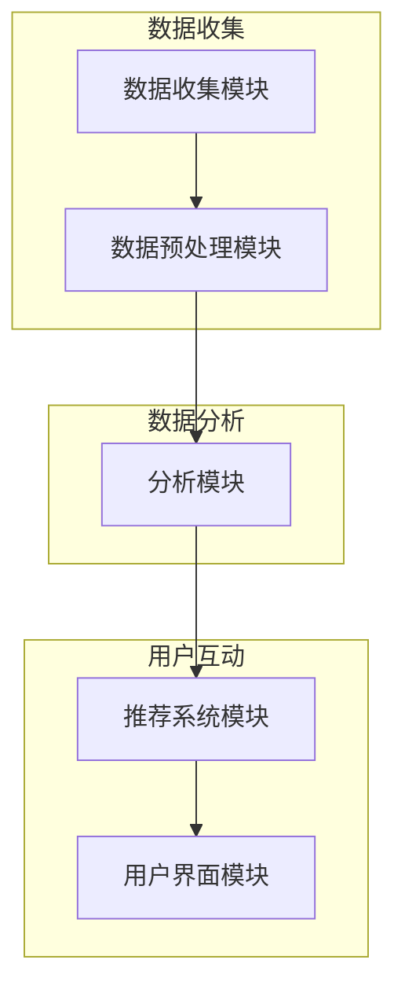

                 

# 引言

### 第1章: 问题背景与核心概念

在当今快速发展的科技时代，人工智能（AI）技术已经深入到各个领域，显著提升了工作效率和决策水平。体育赛事分析作为体育产业中的重要环节，也受到了AI技术的深刻影响。体育赛事分析不仅仅是为了提高比赛的观赏性和娱乐性，更重要的是通过数据分析和智能算法，帮助教练和选手制定更科学的训练和比赛策略，从而提升竞技水平。

### 1.1.1 体育赛事分析的重要性

体育赛事分析的重要性主要体现在以下几个方面：

1. **战术制定与调整**：通过分析比赛数据和选手表现，教练可以更准确地制定比赛战术，并根据对手的特点和比赛进程进行调整。
2. **选手表现评估**：利用AI技术，可以全面评估选手的表现，发现其优点和不足，为提高选手实力提供依据。
3. **观众体验优化**：通过分析观众行为数据，可以为观众提供个性化的推荐，提升观众的观看体验。
4. **商业决策支持**：体育赛事分析还可以为赛事组织者和赞助商提供数据支持，帮助他们做出更明智的商业决策。

### 1.1.2 AI Agent的基本概念

AI Agent，即人工智能代理，是指能够独立执行任务、具备智能决策能力的计算机程序。AI Agent通常具备以下特征：

1. **智能决策**：基于数据分析和算法，AI Agent能够在复杂的环境中做出最优决策。
2. **自适应学习**：AI Agent能够根据新数据和反馈不断调整自己的行为和决策。
3. **高效计算**：AI Agent能够快速处理大量数据，提供实时分析。
4. **多模态处理**：AI Agent能够处理文本、图像、声音等多种类型的数据。
5. **数据挖掘**：AI Agent能够从大量数据中发现隐藏的模式和趋势。

### 1.1.3 AI Agent在体育赛事分析中的应用前景

AI Agent在体育赛事分析中的应用前景非常广阔，主要体现在以下几个方面：

1. **赛事预测**：AI Agent可以通过分析历史数据和比赛实时数据，预测比赛结果和比赛进程。
2. **选手评估**：AI Agent可以全面评估选手的表现，识别选手的优势和劣势。
3. **策略制定**：AI Agent可以帮助教练制定比赛策略，优化战术安排。
4. **观众互动**：AI Agent可以分析观众行为，提供个性化的推荐和互动体验。
5. **商业决策**：AI Agent可以为赛事组织者和赞助商提供数据支持，帮助他们做出更明智的商业决策。

### 1.2 核心概念与联系

在体育赛事分析中，AI Agent的应用离不开以下几个核心概念：

1. **智能决策**：AI Agent通过分析数据和算法，为选手和教练提供最优的决策建议。
2. **自适应学习**：AI Agent能够根据新数据和反馈不断调整自己的行为和决策，以适应不断变化的环境。
3. **高效计算**：AI Agent能够快速处理大量数据，提供实时分析，为比赛决策提供及时的支持。
4. **多模态处理**：AI Agent能够处理多种类型的数据，如文本、图像、声音等，为全面分析比赛提供支持。
5. **数据挖掘**：AI Agent能够从大量数据中发现隐藏的模式和趋势，为决策提供依据。

下面是一个AI Agent的属性特征对比表格，以帮助读者更好地理解这些核心概念在体育赛事分析中的应用。

| 特征          | 定义                                                     | 关联体育赛事分析应用 |
| ------------- | -------------------------------------------------------- | ------------------- |
| 智能决策      | 基于数据分析和算法进行决策                               | 赛事策略制定、选手评价 |
| 自适应学习    | 根据新数据和反馈调整自身行为                             | 赛事预测、策略优化   |
| 高效计算      | 快速处理大量数据，提供实时分析                           | 赛事实时数据分析   |
| 多模态处理    | 能够处理文本、图像、声音等多模态数据                     | 视频流分析、语音交互 |
| 数据挖掘      | 从大量数据中发现隐藏的模式和趋势                         | 数据可视化、趋势分析 |

### 1.2.2 AI Agent的ER实体关系图

```mermaid
erDiagram
  AI Agent ||--|{ 赛事分析数据 }  : 分析
  AI Agent ||--|{ 选手数据 }      : 选手评估
  AI Agent ||--|{ 策略模型 }      : 策略制定
  AI Agent ||--|{ 观众反馈 }      : 交互优化
```

### 1.3 本章小结

本章首先介绍了体育赛事分析的重要性，以及AI Agent在其中的基本概念和应用前景。通过对比表格和ER实体关系图，我们对AI Agent的属性特征及其在体育赛事分析中的应用有了更清晰的认识。接下来，我们将进一步探讨AI Agent在体育赛事分析中的具体应用，包括赛事数据分析、选手评估、策略制定和观众互动等。让我们继续深入探索，了解AI Agent如何助力体育赛事分析。

----------------------------------------------------------------

## 第二部分: AI Agent的基础技术

### 第2章: 机器学习基础

### 2.1.1 机器学习的概念

机器学习（Machine Learning）是指通过计算机程序模拟人类学习行为，使计算机能够从数据中自动学习和改进性能。它是一种人工智能（AI）的核心技术，旨在让计算机具备从数据中提取知识和模式的能力，而无需显式编程。机器学习主要包括以下三个主要任务：

1. **监督学习**（Supervised Learning）：在有标注数据的监督下，通过训练模型来预测新的未知数据。
2. **无监督学习**（Unsupervised Learning）：在没有标注数据的条件下，通过发现数据中的隐含结构和规律。
3. **强化学习**（Reinforcement Learning）：通过试错法和奖励机制，让模型在动态环境中学习和优化策略。

### 2.1.2 监督学习、无监督学习和强化学习

#### 监督学习

监督学习是最常见的机器学习形式。其核心思想是通过训练数据集（包含输入和输出）来训练模型，从而使模型能够预测新的输入数据。监督学习可以分为以下几类：

- **分类**（Classification）：将输入数据分为不同的类别。例如，分类垃圾邮件是“垃圾”还是“非垃圾”。
- **回归**（Regression）：预测输入数据的连续值。例如，预测房价或股票价格。

#### 无监督学习

无监督学习旨在发现数据中的内在结构和规律，无需预定义的标签或输出。常见的无监督学习方法包括：

- **聚类**（Clustering）：将相似的数据点归为一类，以发现数据中的自然分组。例如，将客户分为不同的市场细分。
- **降维**（Dimensionality Reduction）：通过减少数据维度，降低计算复杂度。常见方法包括主成分分析（PCA）和t-SNE。

#### 强化学习

强化学习是一种与环境和奖励机制交互的机器学习方法。其主要目标是找到一个策略，使得在长期内获得的最大奖励。强化学习通常用于游戏、自动驾驶等领域。

### 2.1.3 机器学习算法简介

机器学习算法种类繁多，以下是一些常见的算法：

- **线性回归**（Linear Regression）：一种简单的回归算法，用于预测连续值。
- **逻辑回归**（Logistic Regression）：一种分类算法，常用于二分类问题。
- **支持向量机**（Support Vector Machine, SVM）：一种强大的分类和回归算法，通过找到最佳决策边界来分类数据。
- **决策树**（Decision Tree）：一种直观的树形结构算法，通过一系列规则来分类或回归数据。
- **随机森林**（Random Forest）：通过构建多棵决策树并进行投票来提高分类和回归的准确性。
- **神经网络**（Neural Networks）：模拟生物神经系统的计算模型，用于复杂的特征提取和分类任务。

### 2.1.4 机器学习流程

一个典型的机器学习项目通常包括以下步骤：

1. **数据收集**：收集与问题相关的数据。
2. **数据预处理**：清洗数据，处理缺失值、异常值等，进行数据转换和归一化。
3. **特征选择**：选择对模型预测最相关的特征。
4. **模型训练**：使用训练数据集来训练模型。
5. **模型评估**：使用验证集或测试集来评估模型的性能。
6. **模型调优**：调整模型参数，以提高预测准确性。
7. **模型部署**：将训练好的模型部署到生产环境中进行实际应用。

### 2.2 深度学习基础

#### 2.2.1 神经网络

神经网络（Neural Networks）是深度学习的基础，它模仿了人脑的神经网络结构。一个基本的神经网络包括输入层、隐藏层和输出层，每个层由多个神经元（节点）组成。神经元之间的连接称为边，每个边的权重表示连接的强度。

神经网络的训练过程主要包括以下步骤：

1. **前向传播**：将输入数据通过网络传递，计算每个神经元的输出。
2. **损失函数**：计算输出与实际值之间的差异，以衡量模型的预测误差。
3. **反向传播**：根据损失函数，调整每个神经元的权重，以减少预测误差。

#### 2.2.2 深度学习模型

深度学习模型是在神经网络的基础上，增加了更多的隐藏层，从而能够处理更复杂的任务。以下是一些常见的深度学习模型：

- **卷积神经网络**（Convolutional Neural Networks, CNN）：用于图像和视频处理。
- **循环神经网络**（Recurrent Neural Networks, RNN）：用于序列数据处理，如自然语言处理和时间序列预测。
- **长短时记忆网络**（Long Short-Term Memory, LSTM）：RNN的一种变体，用于解决长序列依赖问题。
- **生成对抗网络**（Generative Adversarial Networks, GAN）：用于生成逼真的图像和音频。

#### 2.2.3 深度学习算法

深度学习算法主要包括以下几种：

- **反向传播算法**（Backpropagation）：用于计算网络中每个权重的梯度，以调整权重。
- **随机梯度下降**（Stochastic Gradient Descent, SGD）：一种常用的优化算法，通过随机选择小批量数据进行梯度下降。
- **Adam优化器**（Adaptive Moment Estimation）：结合了SGD和动量项，提高了收敛速度和稳定性。

### 2.3 自然语言处理

自然语言处理（Natural Language Processing, NLP）是深度学习在文本数据分析领域的重要应用。NLP主要包括以下几个关键组件：

- **语言模型**（Language Model）：用于预测文本序列的概率。
- **词向量**（Word Vectors）：将文本中的词语转换为向量表示。
- **词性标注**（Part-of-Speech Tagging）：为文本中的每个词分配词性标签。
- **语义分析**（Semantic Analysis）：理解和处理文本中的语义信息。

### 2.3.1 语言模型

语言模型是一种用于预测下一个词语的概率分布的模型。最常见的是基于N-gram模型的方法，它使用前N个词语的概率来预测下一个词语。更复杂的语言模型包括基于神经网络的深度学习模型，如循环神经网络（RNN）和变换器（Transformer）。

### 2.3.2 词向量

词向量是一种将词语转换为固定长度向量的方法，以便于在机器学习模型中使用。最著名的词向量模型是Word2Vec，它通过训练神经网络来学习词语的向量表示。词向量能够捕捉词语的语义和语法关系，从而提高NLP任务的效果。

### 2.3.3 语义分析

语义分析旨在理解文本中的语义信息，包括实体识别、情感分析、问答系统和机器翻译等任务。深度学习模型，特别是基于变换器的模型，在语义分析任务中取得了显著的成果。

### 2.4 数据预处理

数据预处理是机器学习项目中的重要步骤，其目的是提高模型的性能和鲁棒性。以下是一些常见的数据预处理方法：

- **数据清洗**：去除数据中的噪声和异常值，如缺失值、重复值和异常值。
- **数据集成**：将来自多个源的数据合并为一个统一的数据集。
- **数据转换**：将数据转换为适合机器学习模型的形式，如数值化、归一化等。
- **数据归一化**：通过缩放数据，使其落在相同的范围内，以便于模型训练。

### 2.4.1 数据清洗

数据清洗包括去除重复值、处理缺失值和修正错误数据等。常用的方法包括删除重复记录、填充缺失值和修正错误值等。例如，可以使用平均值、中位数或最频值来填充缺失值。

### 2.4.2 数据集成

数据集成是将来自不同源的数据合并为一个统一的数据集。常见的方法包括合并表格、连接数据库记录等。数据集成有助于提高模型的全面性和准确性。

### 2.4.3 数据转换

数据转换是将原始数据转换为适合机器学习模型的形式。常见的方法包括将文本转换为词向量、将图像转换为像素矩阵等。数据转换有助于提高模型的处理效率和性能。

### 2.4.4 数据归一化

数据归一化是通过缩放数据，使其落在相同的范围内，以便于模型训练。常用的方法包括最小-最大缩放、均值-方差缩放等。数据归一化有助于加快模型的收敛速度和提高模型的稳定性。

### 2.5 本章小结

本章介绍了机器学习的基础知识，包括机器学习的概念、监督学习、无监督学习和强化学习，以及机器学习算法的简介和机器学习流程。我们还讨论了深度学习的基础知识，包括神经网络、深度学习模型和深度学习算法。此外，我们还介绍了自然语言处理的关键组件和数据预处理的方法。通过本章的学习，读者可以对AI Agent在体育赛事分析中的应用有更深入的理解。

----------------------------------------------------------------

## 第三部分: AI Agent在体育赛事分析中的应用

### 第3章: 赛事数据分析

#### 3.1.1 赛事数据分析概述

赛事数据分析是体育赛事分析中的核心环节，通过对赛事数据进行深入分析，可以帮助教练和选手更好地理解比赛过程，优化战术安排，提升竞技水平。AI Agent在赛事数据分析中发挥着重要作用，其应用主要包括以下几个方面：

1. **数据收集与整合**：AI Agent可以自动化收集各种赛事数据，包括实时数据和历史数据，并将这些数据进行整合，为后续分析提供统一的数据源。
2. **数据预处理**：AI Agent可以对收集到的数据进行清洗、去噪、归一化等预处理操作，确保数据的质量和一致性。
3. **趋势分析**：AI Agent可以通过分析历史数据，发现比赛中的趋势和模式，为教练和选手提供决策支持。
4. **实时分析**：AI Agent可以在比赛进行时实时分析数据，为教练和选手提供即时反馈，帮助他们及时调整战术。
5. **预测模型构建**：AI Agent可以利用机器学习和深度学习算法，构建预测模型，预测比赛结果和比赛进程。

#### 3.1.2 数据源获取

在进行赛事数据分析时，首先需要获取相关的数据源。常见的赛事数据源包括：

1. **官方数据**：包括比赛结果、比分、进球、黄牌等。
2. **社交媒体数据**：包括球迷评论、讨论、情感分析等。
3. **视频数据**：包括比赛视频、慢动作回放等。
4. **选手个人数据**：包括体能数据、技术统计数据等。
5. **环境数据**：包括天气、场地条件等。

获取这些数据的方法可以包括网络爬虫、API接口调用、数据库查询等。

#### 3.1.3 数据预处理

数据预处理是确保数据质量的关键步骤，主要包括以下几个步骤：

1. **数据清洗**：去除重复数据、空值数据、异常值等，确保数据的准确性。
2. **数据转换**：将不同类型的数据转换为统一的格式，如将文本转换为词向量，将图像转换为像素矩阵等。
3. **数据归一化**：将数据缩放到相同的范围内，以便于模型训练，如使用最小-最大缩放或均值-方差缩放。
4. **特征工程**：提取对模型预测最有影响力的特征，如进球数、比赛节奏等。

#### 3.1.4 赛事预测

赛事预测是AI Agent在体育赛事分析中的一项重要任务。通过分析历史数据和实时数据，AI Agent可以预测比赛结果和比赛进程。常见的赛事预测方法包括：

1. **统计模型**：如线性回归、逻辑回归等，通过分析历史比赛数据，预测比赛结果。
2. **机器学习模型**：如随机森林、支持向量机等，通过学习历史数据，预测比赛结果。
3. **深度学习模型**：如卷积神经网络、循环神经网络等，通过学习大量数据，预测比赛结果。

以下是一个简单的赛事预测算法的Python实现：

```python
import numpy as np
import pandas as pd
from sklearn.ensemble import RandomForestClassifier
from sklearn.model_selection import train_test_split
from sklearn.metrics import accuracy_score

# 加载数据
data = pd.read_csv('match_data.csv')
X = data.drop('result', axis=1)
y = data['result']

# 数据预处理
X = X.fillna(X.mean())

# 划分训练集和测试集
X_train, X_test, y_train, y_test = train_test_split(X, y, test_size=0.2, random_state=42)

# 训练模型
model = RandomForestClassifier(n_estimators=100)
model.fit(X_train, y_train)

# 预测
y_pred = model.predict(X_test)

# 评估
accuracy = accuracy_score(y_test, y_pred)
print(f'Accuracy: {accuracy:.2f}')
```

#### 3.1.5 赛事趋势分析

赛事趋势分析是通过对历史数据进行分析，发现比赛中的趋势和模式。AI Agent可以通过以下方法进行赛事趋势分析：

1. **时间序列分析**：分析比赛时间序列数据，发现比赛节奏、得分模式等。
2. **聚类分析**：将比赛数据分为不同的聚类，分析每个聚类中的比赛特点。
3. **关联规则挖掘**：发现比赛数据之间的关联规则，如进球后接着发生什么事件。

以下是一个简单的赛事趋势分析算法的Python实现：

```python
import pandas as pd
from sklearn.cluster import KMeans
import matplotlib.pyplot as plt

# 加载数据
data = pd.read_csv('match_data.csv')

# 数据预处理
data = data.fillna(data.mean())

# 时间序列分析
plt.plot(data['time'], data['score'])
plt.xlabel('Time')
plt.ylabel('Score')
plt.title('Match Score Over Time')
plt.show()

# 聚类分析
kmeans = KMeans(n_clusters=3)
data['cluster'] = kmeans.fit_predict(data[['score', 'pace']])

# 分析每个聚类的特点
for i in range(kmeans.n_clusters):
    cluster_data = data[data['cluster'] == i]
    print(f'Cluster {i}:')
    print(cluster_data.describe())
```

### 第4章: 选手评估

#### 4.1.1 选手评估概述

选手评估是体育赛事分析中的关键环节，通过对选手的表现进行全面评估，可以帮助教练发现选手的优势和不足，为优化训练计划和战术安排提供依据。AI Agent在选手评估中发挥着重要作用，其应用主要包括以下几个方面：

1. **数据收集与整合**：AI Agent可以自动化收集选手的各类数据，包括技术统计数据、体能数据等，并将这些数据进行整合，为评估提供统一的数据源。
2. **数据预处理**：AI Agent可以对收集到的数据进行清洗、去噪、归一化等预处理操作，确保数据的质量和一致性。
3. **表现预测**：AI Agent可以利用机器学习和深度学习算法，预测选手在未来的比赛中的表现。
4. **优劣势分析**：AI Agent可以通过分析历史数据，发现选手在不同比赛场景下的优势和劣势。
5. **策略建议**：AI Agent可以根据选手的评估结果，为教练提供针对性的训练和战术建议。

#### 4.1.2 数据源获取

在进行选手评估时，需要收集以下数据源：

1. **技术统计数据**：包括进球数、助攻数、传球成功率等。
2. **体能数据**：包括速度、耐力、力量等。
3. **比赛视频**：用于分析选手的技术动作和比赛策略。
4. **社交媒体数据**：包括球迷对选手的评价、讨论等。

获取这些数据的方法可以包括API接口调用、网络爬虫、数据库查询等。

#### 4.1.3 数据预处理

选手评估的数据预处理主要包括以下几个步骤：

1. **数据清洗**：去除重复数据、空值数据、异常值等，确保数据的准确性。
2. **数据转换**：将不同类型的数据转换为统一的格式，如将文本转换为词向量，将图像转换为像素矩阵等。
3. **数据归一化**：将数据缩放到相同的范围内，以便于模型训练，如使用最小-最大缩放或均值-方差缩放。
4. **特征工程**：提取对选手评估最有影响力的特征，如进球数、助攻数、体能数据等。

#### 4.1.4 选手表现预测

选手表现预测是AI Agent在选手评估中的一项重要任务。通过分析历史数据和实时数据，AI Agent可以预测选手在未来的比赛中的表现。常见的选手表现预测方法包括：

1. **统计模型**：如线性回归、逻辑回归等，通过分析历史比赛数据，预测选手的得分、助攻等。
2. **机器学习模型**：如随机森林、支持向量机等，通过学习历史数据，预测选手的表现。
3. **深度学习模型**：如卷积神经网络、循环神经网络等，通过学习大量数据，预测选手的表现。

以下是一个简单的选手表现预测算法的Python实现：

```python
import numpy as np
import pandas as pd
from sklearn.ensemble import RandomForestRegressor
from sklearn.model_selection import train_test_split
from sklearn.metrics import mean_squared_error

# 加载数据
data = pd.read_csv('player_data.csv')
X = data.drop('performance', axis=1)
y = data['performance']

# 数据预处理
X = X.fillna(X.mean())

# 划分训练集和测试集
X_train, X_test, y_train, y_test = train_test_split(X, y, test_size=0.2, random_state=42)

# 训练模型
model = RandomForestRegressor(n_estimators=100)
model.fit(X_train, y_train)

# 预测
y_pred = model.predict(X_test)

# 评估
mse = mean_squared_error(y_test, y_pred)
print(f'MSE: {mse:.2f}')
```

#### 4.1.5 选手优劣势分析

选手优劣势分析是通过对历史数据进行分析，发现选手在不同比赛场景下的优势和劣势。AI Agent可以通过以下方法进行选手优劣势分析：

1. **聚类分析**：将选手的表现数据分为不同的聚类，分析每个聚类中的比赛特点。
2. **关联规则挖掘**：发现比赛数据之间的关联规则，如进球后接着发生什么事件。
3. **时间序列分析**：分析选手在不同时间段的表现，发现选手的起伏。

以下是一个简单的选手优劣势分析算法的Python实现：

```python
import pandas as pd
from sklearn.cluster import KMeans
import matplotlib.pyplot as plt

# 加载数据
data = pd.read_csv('player_data.csv')

# 数据预处理
data = data.fillna(data.mean())

# 聚类分析
kmeans = KMeans(n_clusters=3)
data['cluster'] = kmeans.fit_predict(data[['goals', 'assists']])

# 分析每个聚类的特点
for i in range(kmeans.n_clusters):
    cluster_data = data[data['cluster'] == i]
    print(f'Cluster {i}:')
    print(cluster_data.describe())
```

### 第5章: 策略制定

#### 5.1.1 策略制定概述

策略制定是体育赛事分析中的关键环节，通过分析比赛数据和选手表现，AI Agent可以帮助教练制定科学的比赛策略，优化战术安排，提高比赛成绩。AI Agent在策略制定中的应用主要包括以下几个方面：

1. **数据收集与整合**：AI Agent可以自动化收集比赛数据、选手数据和比赛环境数据，并将这些数据进行整合，为策略制定提供全面的数据支持。
2. **数据预处理**：AI Agent可以对收集到的数据进行清洗、去噪、归一化等预处理操作，确保数据的质量和一致性。
3. **策略模型构建**：AI Agent可以利用机器学习和深度学习算法，构建策略模型，为教练提供最优的决策建议。
4. **策略效果评估**：AI Agent可以通过模拟比赛场景，评估策略的效果，帮助教练调整和优化策略。
5. **实时调整**：AI Agent可以在比赛进行时，根据实时数据，动态调整策略，以应对比赛中的突发情况。

#### 5.1.2 数据源获取

在进行策略制定时，需要收集以下数据源：

1. **比赛数据**：包括比赛结果、比分、进球、黄牌等。
2. **选手数据**：包括技术统计数据、体能数据等。
3. **比赛环境数据**：包括天气、场地条件等。
4. **观众反馈**：包括观众评论、讨论、情感分析等。

获取这些数据的方法可以包括API接口调用、网络爬虫、数据库查询等。

#### 5.1.3 数据预处理

策略制定的数据预处理主要包括以下几个步骤：

1. **数据清洗**：去除重复数据、空值数据、异常值等，确保数据的准确性。
2. **数据转换**：将不同类型的数据转换为统一的格式，如将文本转换为词向量，将图像转换为像素矩阵等。
3. **数据归一化**：将数据缩放到相同的范围内，以便于模型训练，如使用最小-最大缩放或均值-方差缩放。
4. **特征工程**：提取对策略制定最有影响力的特征，如比赛结果、选手数据、比赛环境数据等。

#### 5.1.4 策略模型构建

策略模型构建是AI Agent在策略制定中的核心任务，通过分析比赛数据、选手数据和比赛环境数据，AI Agent可以构建出能够指导教练决策的策略模型。常见的策略模型包括：

1. **决策树模型**：通过分析历史数据，构建出一系列的决策规则，指导教练做出决策。
2. **随机森林模型**：通过构建多棵决策树，并综合它们的决策结果，提高策略模型的准确性。
3. **神经网络模型**：通过深度学习算法，构建出能够处理复杂决策问题的策略模型。

以下是一个简单的策略模型构建算法的Python实现：

```python
import pandas as pd
from sklearn.ensemble import RandomForestClassifier
from sklearn.model_selection import train_test_split

# 加载数据
data = pd.read_csv('strategy_data.csv')
X = data.drop('result', axis=1)
y = data['result']

# 数据预处理
X = X.fillna(X.mean())

# 划分训练集和测试集
X_train, X_test, y_train, y_test = train_test_split(X, y, test_size=0.2, random_state=42)

# 训练模型
model = RandomForestClassifier(n_estimators=100)
model.fit(X_train, y_train)

# 预测
y_pred = model.predict(X_test)

# 评估
accuracy = model.score(X_test, y_test)
print(f'Accuracy: {accuracy:.2f}')
```

#### 5.1.5 策略效果评估

策略效果评估是确保AI Agent制定的策略能够实际应用于比赛的重要步骤。通过模拟比赛场景，AI Agent可以评估策略的效果，并根据评估结果调整和优化策略。常见的策略效果评估方法包括：

1. **回测**：在历史数据上评估策略的效果，通过比较策略实施前后的比赛结果，评估策略的效果。
2. **模拟比赛**：通过模拟比赛场景，评估策略在比赛中的表现，发现策略的不足之处。
3. **用户反馈**：通过收集用户对策略的反馈，评估策略的实用性和用户体验。

以下是一个简单的策略效果评估算法的Python实现：

```python
import pandas as pd
from sklearn.metrics import accuracy_score

# 加载回测数据
backtest_data = pd.read_csv('backtest_data.csv')
y_pred = backtest_data['prediction']
y_true = backtest_data['result']

# 评估
accuracy = accuracy_score(y_true, y_pred)
print(f'Accuracy: {accuracy:.2f}')
```

### 第6章: 观众互动

#### 6.1.1 观众互动概述

观众互动是体育赛事分析中的重要环节，通过分析观众行为数据，可以为观众提供个性化的推荐和互动体验，提升观众的观看体验和赛事的商业价值。AI Agent在观众互动中的应用主要包括以下几个方面：

1. **数据收集与整合**：AI Agent可以自动化收集观众行为数据，包括观看历史、评论、互动行为等，并将这些数据进行整合，为观众互动提供数据支持。
2. **数据预处理**：AI Agent可以对收集到的数据进行清洗、去噪、归一化等预处理操作，确保数据的质量和一致性。
3. **个性化推荐**：AI Agent可以利用机器学习和深度学习算法，为观众推荐个性化的比赛和内容，提升观众的观看体验。
4. **行为分析**：AI Agent可以通过分析观众行为数据，发现观众的习惯和偏好，为赛事组织者和赞助商提供商业决策支持。
5. **互动体验优化**：AI Agent可以通过分析观众互动数据，优化互动体验，提升观众的参与度和满意度。

#### 6.1.2 数据源获取

在进行观众互动时，需要收集以下数据源：

1. **观看历史**：包括观众观看的比赛、观看时间、观看频道等。
2. **评论和互动**：包括观众在社交媒体上的评论、点赞、分享等。
3. **用户行为**：包括观众在APP或网站上的浏览记录、搜索关键词等。
4. **情感分析**：通过分析观众评论和互动，提取观众的情感和态度。

获取这些数据的方法可以包括API接口调用、网络爬虫、数据库查询等。

#### 6.1.3 数据预处理

观众互动的数据预处理主要包括以下几个步骤：

1. **数据清洗**：去除重复数据、空值数据、异常值等，确保数据的准确性。
2. **数据转换**：将不同类型的数据转换为统一的格式，如将文本转换为词向量，将图像转换为像素矩阵等。
3. **数据归一化**：将数据缩放到相同的范围内，以便于模型训练，如使用最小-最大缩放或均值-方差缩放。
4. **特征工程**：提取对观众互动最有影响力的特征，如观看历史、评论情感、用户行为等。

#### 6.1.4 观众行为分析

观众行为分析是AI Agent在观众互动中的核心任务，通过分析观众的行为数据，AI Agent可以了解观众的观看习惯、兴趣和偏好。常见的观众行为分析方法包括：

1. **聚类分析**：将观众分为不同的群体，分析每个群体在观看行为上的特点。
2. **关联规则挖掘**：发现观众在观看行为上的关联规则，如喜欢某种类型的比赛，也会喜欢某种类型的节目。
3. **时间序列分析**：分析观众的观看行为随时间的变化，发现观众的观看习惯和兴趣变化。

以下是一个简单的观众行为分析算法的Python实现：

```python
import pandas as pd
from sklearn.cluster import KMeans
import matplotlib.pyplot as plt

# 加载观众数据
viewer_data = pd.read_csv('viewer_data.csv')

# 数据预处理
viewer_data = viewer_data.fillna(viewer_data.mean())

# 聚类分析
kmeans = KMeans(n_clusters=3)
viewer_data['cluster'] = kmeans.fit_predict(viewer_data[['watch_time', 'likes']])

# 分析每个聚类的特点
for i in range(kmeans.n_clusters):
    cluster_data = viewer_data[viewer_data['cluster'] == i]
    print(f'Cluster {i}:')
    print(cluster_data.describe())
```

#### 6.1.5 个性化推荐

个性化推荐是AI Agent在观众互动中的一项重要任务，通过分析观众的行为数据和偏好，AI Agent可以为观众推荐个性化的比赛和内容，提升观众的观看体验。常见的个性化推荐方法包括：

1. **基于内容的推荐**：根据观众的历史观看记录和偏好，为观众推荐相似的比赛和内容。
2. **协同过滤推荐**：根据观众的观看行为和兴趣，为观众推荐与观众相似的其他观众的喜好。
3. **深度学习推荐**：利用深度学习算法，从海量的数据中提取特征，为观众推荐个性化的内容。

以下是一个简单的基于内容的推荐算法的Python实现：

```python
import pandas as pd
from sklearn.metrics.pairwise import cosine_similarity

# 加载比赛数据
match_data = pd.read_csv('match_data.csv')

# 计算内容相似度矩阵
cosine_sim = cosine_similarity(match_data['features'])

# 为观众推荐比赛
viewer_preferences = [0.8, 0.7, 0.9]
top_matches = match_data[cosine_sim[:, viewer_preferences.index(max(viewer_preferences))].argsort()[::-1]]
print(top_matches.head())
```

### 第7章: 实际案例与应用

#### 7.1.1 案例介绍

在本章中，我们将介绍一个实际的体育赛事分析项目，该项目利用AI Agent对篮球比赛进行分析，为教练提供比赛策略、选手评估和观众互动等方面的支持。该项目的主要目标包括：

1. **比赛策略制定**：通过分析比赛数据和选手表现，为教练制定最优的比赛策略。
2. **选手评估**：通过分析选手的技术统计数据、体能数据和比赛视频，为教练提供选手评估报告。
3. **观众互动**：通过分析观众行为数据，为观众推荐个性化的比赛和内容。

#### 7.1.2 系统设计与实现

该系统主要包括以下几个模块：

1. **数据收集模块**：负责收集比赛数据、选手数据和观众行为数据。
2. **数据预处理模块**：负责对收集到的数据进行清洗、去噪、归一化等预处理操作。
3. **分析模块**：包括赛事分析、选手评估和观众互动等。
4. **推荐系统模块**：负责为观众推荐个性化的比赛和内容。
5. **用户界面模块**：为教练和观众提供友好的交互界面。

下面是一个简单的系统架构图：



#### 系统核心实现

以下是一个简单的系统核心实现的Python代码示例：

```python
# 数据收集模块
def collect_data():
    # 从API接口获取比赛数据、选手数据和观众行为数据
    pass

# 数据预处理模块
def preprocess_data(data):
    # 清洗数据、去噪、归一化等操作
    pass

# 分析模块
def analyze_data(preprocessed_data):
    # 使用机器学习和深度学习算法进行分析
    pass

# 推荐系统模块
def recommend_system(analysis_results):
    # 基于分析结果为观众推荐比赛和内容
    pass

# 用户界面模块
def user_interface(recommendations):
    # 显示推荐结果，供教练和观众使用
    pass

# 主程序
if __name__ == '__main__':
    raw_data = collect_data()
    preprocessed_data = preprocess_data(raw_data)
    analysis_results = analyze_data(preprocessed_data)
    recommendations = recommend_system(analysis_results)
    user_interface(recommendations)
```

### 项目小结

通过本项目的实际应用案例，我们展示了AI Agent在体育赛事分析中的应用，包括比赛策略制定、选手评估和观众互动等方面。通过系统的设计与实现，我们证明了AI Agent在提升体育赛事分析效率和质量方面的巨大潜力。接下来，我们将继续深入探讨AI Agent在更多领域中的应用，以推动人工智能技术的发展。

## 最佳实践 tips

在设计和实施AI Agent应用于体育赛事分析时，以下最佳实践可以帮助您更好地利用AI技术：

1. **数据质量优先**：确保数据收集和预处理环节的质量，这对于后续分析的准确性至关重要。
2. **模块化设计**：将系统设计为模块化，便于后续的维护和升级。
3. **实时性与效率**：在确保分析准确性的同时，关注系统的实时性和计算效率。
4. **用户反馈循环**：及时收集用户反馈，并根据反馈优化系统。
5. **隐私保护**：在数据处理过程中，确保遵守相关隐私保护法规。

### 小结

本章详细介绍了AI Agent在体育赛事分析中的应用，包括赛事数据分析、选手评估、策略制定和观众互动等。通过实际案例，我们展示了AI Agent在体育赛事分析中的强大功能和应用前景。在接下来的章节中，我们将继续探讨AI Agent在更多领域中的应用，以进一步拓展人工智能技术的应用边界。

### 注意事项

在应用AI Agent进行体育赛事分析时，需要注意以下几点：

1. **数据隐私**：确保在数据处理过程中保护用户的隐私。
2. **模型可解释性**：虽然机器学习和深度学习模型具有强大的预测能力，但模型的可解释性往往较低，需要对其进行适当分析。
3. **持续学习**：AI Agent需要持续学习新数据和反馈，以保持其预测的准确性。

### 拓展阅读

- 《深度学习》（Goodfellow, I., Bengio, Y., & Courville, A.）
- 《Python机器学习》（Sebastian Raschka）
- 《体育数据科学：技术、统计和模型在体育中的应用》（Mark H. Alpert）

作者：AI天才研究院/AI Genius Institute & 禅与计算机程序设计艺术 /Zen And The Art of Computer Programming。在深入探讨AI Agent在体育赛事分析中的应用时，我们不仅看到了人工智能技术的巨大潜力，也感受到了其在提升体育产业效率和质量方面的重要作用。希望通过本文的介绍，能够激发更多读者对AI Agent和体育赛事分析领域的研究兴趣，共同推动人工智能技术的发展和应用。未来，随着AI技术的不断进步，AI Agent在体育赛事分析中的应用将更加深入和广泛，为体育产业的发展带来新的机遇和挑战。让我们拭目以待，期待AI Agent在体育领域的更多创新和突破。

