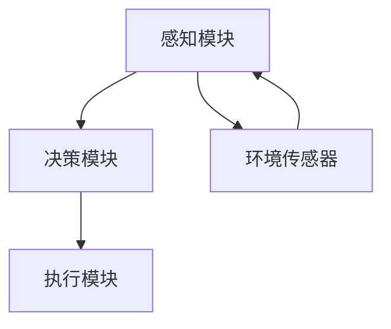
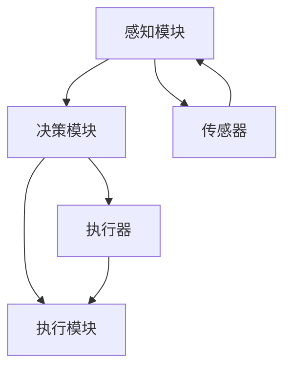
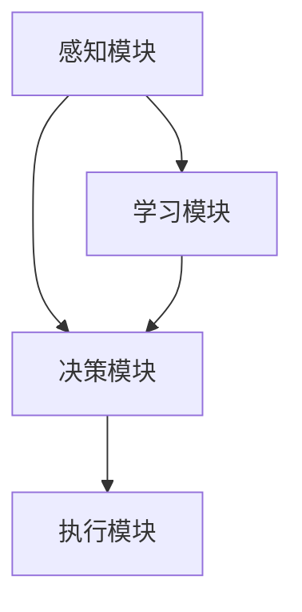
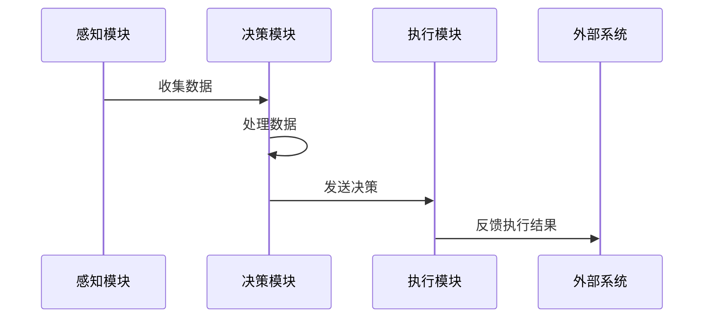
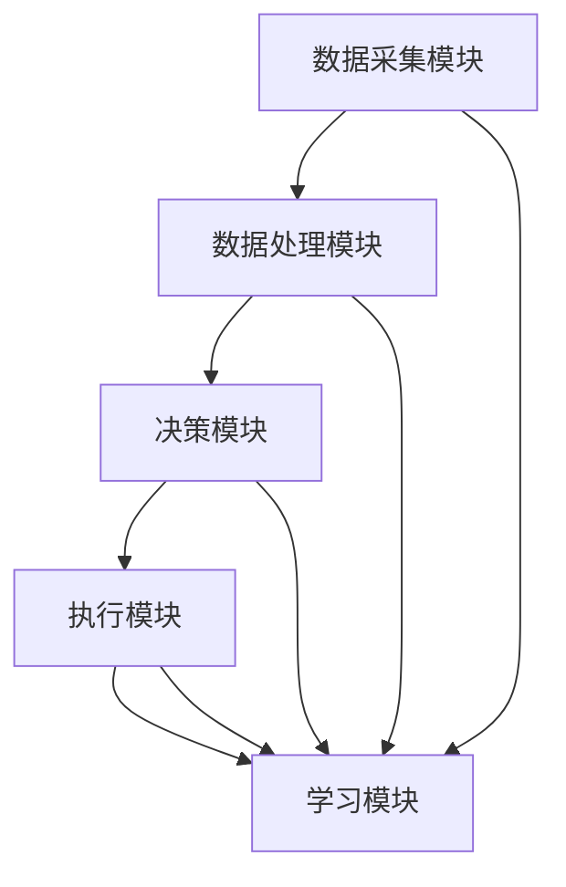
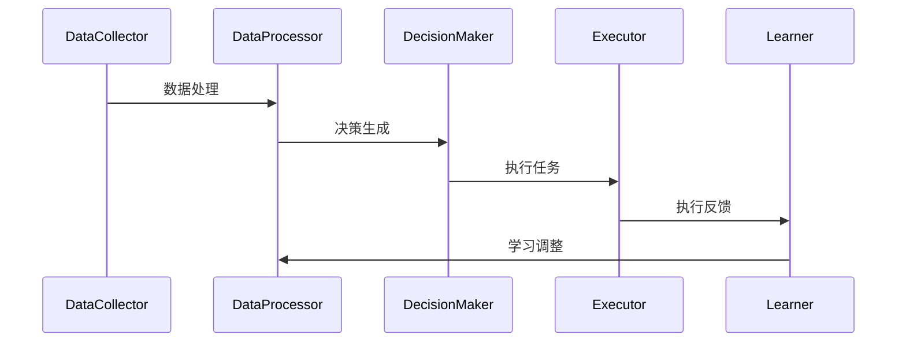

                 

# AI Agent在太空探索中的自主决策系统

## 关键词

AI Agent、自主决策系统、太空探索、人工智能、太空环境、任务需求、核心技术、系统架构、数据管理、实战应用。

## 摘要

随着太空探索的不断发展，AI Agent在太空探索中的自主决策系统成为一个重要研究领域。本文首先介绍了AI Agent的定义和特点，以及自主决策系统的概念和结构。然后，分析了太空环境的特点和任务需求，探讨了AI Agent在太空探索中的应用前景。接着，详细阐述了AI Agent的原理与设计、自主决策系统架构设计、数据处理与知识管理等内容。最后，通过实际案例展示了AI Agent在太空探索中的自主决策系统实现与实战应用。

## 第一部分：背景与概述

### 第1章 问题背景与核心概念

#### 1.1 问题背景

太空探索是人类探索宇宙、拓展生存空间的重要途径。然而，太空环境恶劣，充满未知和挑战。在这样的背景下，AI Agent在太空探索中的自主决策系统应运而生。

太空探索的需求主要包括以下几个方面：

1. **自主导航与定位**：在太空环境中，导航与定位是确保航天器安全运行的关键。AI Agent需要具备高精度的自主导航与定位能力，以应对复杂的太空环境。

2. **故障诊断与修复**：在太空任务中，航天器可能会出现故障。AI Agent需要具备故障诊断与修复能力，以确保航天器的正常运行。

3. **资源管理与优化**：太空资源有限，如何有效地管理和优化资源是太空探索的关键。AI Agent需要具备资源管理与优化能力，以提高任务成功率。

4. **科学实验与数据收集**：太空探索任务通常涉及大量的科学实验和数据收集。AI Agent需要具备自主决策能力，以确定最佳的实验方案和数据收集策略。

#### 1.2 核心概念

##### AI Agent的定义与特点

AI Agent是指具有感知、决策和行动能力的人工智能系统。它可以在没有人为干预的情况下，自主地完成特定任务。AI Agent具有以下特点：

1. **感知能力**：AI Agent能够感知环境变化，获取相关信息。

2. **决策能力**：AI Agent能够根据感知到的信息，进行决策，选择最优的行动方案。

3. **行动能力**：AI Agent能够执行决策方案，采取相应的行动。

##### 自主决策系统的概念与结构

自主决策系统是指由多个AI Agent组成的系统，用于实现太空探索任务。自主决策系统通常包括以下几个模块：

1. **感知模块**：负责收集、处理和存储环境数据。

2. **决策模块**：负责分析感知模块收集到的数据，生成决策方案。

3. **执行模块**：负责执行决策方案，实现任务目标。

#### 1.3 相关研究与发展

##### 国内外研究现状

在国内，AI Agent在太空探索中的自主决策系统研究已取得一定成果。例如，我国的天问一号探测器搭载了基于AI Agent的自主导航与定位系统，实现了火星探测任务。在国外，NASA等机构也在积极开展相关研究，并取得了显著进展。

##### 关键技术与发展趋势

当前，AI Agent在太空探索中的自主决策系统研究主要关注以下几个关键技术：

1. **深度学习与强化学习**：利用深度学习与强化学习技术，提高AI Agent的感知、决策和行动能力。

2. **多模态数据融合**：将多种传感器的数据融合，提高感知模块的信息处理能力。

3. **分布式计算与通信**：利用分布式计算与通信技术，提高自主决策系统的性能和可靠性。

未来，随着人工智能技术的不断发展，AI Agent在太空探索中的自主决策系统将具有更广泛的应用前景。

### 第2章 太空环境与任务需求

#### 2.1 太空环境特点

太空环境具有以下特点：

1. **真空**：太空环境缺乏大气，导致声音无法传播。

2. **低温**：太空环境温度极低，可能导致航天器材料性能下降。

3. **辐射**：太空环境中存在高能辐射，可能对航天器和人员造成危害。

4. **重力变化**：太空环境中重力变化较大，可能影响航天器的运动状态。

#### 2.2 太空探索任务需求

太空探索任务主要包括以下几种类型：

1. **行星探测**：对行星进行详细探测，了解行星的地质、气候等特征。

2. **月球探测**：研究月球的地质结构、表面物质等。

3. **星际旅行**：实现星际间的旅行，探索宇宙的奥秘。

4. **科学实验**：在太空中进行各种科学实验，推动科学进步。

针对这些任务需求，自主决策系统需要具备以下性能要求：

1. **高精度导航与定位**：确保航天器在太空中的准确位置和运动状态。

2. **强抗干扰能力**：在复杂、恶劣的太空环境中，自主决策系统需要具备较强的抗干扰能力。

3. **资源优化配置**：在有限资源下，实现任务的最优执行。

4. **快速响应能力**：在紧急情况下，自主决策系统需要能够快速响应，采取有效的应对措施。

## 第二部分：核心技术原理

### 第3章 AI Agent原理与设计

#### 3.1 AI Agent基础

##### 智能代理的定义与分类

智能代理是指具有自主决策和行动能力的人工智能系统，可以模拟人类在特定环境中的行为。根据智能代理的功能和能力，可以分为以下几类：

1. **感知型代理**：主要具备感知能力，能够获取环境信息。

2. **决策型代理**：主要具备决策能力，能够根据感知信息进行决策。

3. **执行型代理**：主要具备行动能力，能够执行决策方案。

##### 学习与推理机制

学习与推理是智能代理的核心能力。智能代理通过学习不断优化自身行为，提高任务完成率。推理机制则用于根据已知信息推导出新的信息。

智能代理的学习机制主要包括：

1. **有监督学习**：通过标注数据训练模型，使模型学会识别和分类。

2. **无监督学习**：通过无标签数据，使模型学会发现数据中的规律和模式。

3. **强化学习**：通过与环境的交互，不断调整行为策略，以实现最优目标。

智能代理的推理机制主要包括：

1. **基于规则的推理**：利用预设的规则，根据已知信息推导出新的信息。

2. **基于模型的推理**：利用建立模型，通过模型推理得到新的信息。

3. **基于数据的推理**：通过分析数据，发现数据中的关联和规律，进行推理。

#### 3.2 设计与实现

##### 基本架构

AI Agent的基本架构通常包括以下几个部分：

1. **感知模块**：负责收集环境信息。

2. **决策模块**：负责分析感知模块收集到的信息，生成决策方案。

3. **执行模块**：负责执行决策方案。

4. **学习模块**：负责根据执行结果调整自身行为。

##### 交互模型与通信机制

AI Agent需要与其他系统进行交互，以实现协同工作。常见的交互模型包括：

1. **事件驱动模型**：基于事件触发执行任务。

2. **请求-响应模型**：基于请求和响应进行交互。

3. **共享内存模型**：基于共享内存进行数据交换。

通信机制包括：

1. **同步通信**：通信双方按照一定顺序进行数据交换。

2. **异步通信**：通信双方可以随时发送和接收数据。

#### 3.3 AI Agent评估与优化

##### 性能评估指标

AI Agent的性能评估指标主要包括：

1. **准确率**：衡量AI Agent对任务完成情况的准确性。

2. **响应时间**：衡量AI Agent对任务的响应速度。

3. **资源消耗**：衡量AI Agent在执行任务时的资源消耗。

##### 优化策略与算法

AI Agent的优化策略主要包括：

1. **参数调优**：通过调整模型参数，提高AI Agent的性能。

2. **数据增强**：通过增加训练数据，提高AI Agent的泛化能力。

3. **算法改进**：通过改进算法，提高AI Agent的执行效率。

常见的优化算法包括：

1. **遗传算法**：基于自然选择和遗传机制，优化模型参数。

2. **粒子群优化算法**：模拟鸟群觅食行为，优化模型参数。

3. **深度学习优化算法**：基于梯度下降等优化方法，优化模型参数。

### 第4章 自主决策系统架构设计

#### 4.1 架构设计原则

自主决策系统架构设计应遵循以下原则：

1. **可靠性**：确保系统能够稳定运行，避免因故障导致任务失败。

2. **可扩展性**：系统能够根据任务需求进行扩展，适应不同类型的任务。

3. **可维护性**：系统结构清晰，便于维护和更新。

#### 4.2 系统模块

自主决策系统通常包括以下几个模块：

1. **数据采集与预处理模块**：负责收集、处理和存储环境数据。

2. **决策模块**：负责分析感知模块收集到的数据，生成决策方案。

3. **执行模块**：负责执行决策方案，实现任务目标。

4. **学习模块**：负责根据执行结果调整自身行为。

#### 4.3 决策算法与应用

##### 传统决策算法

传统决策算法包括：

1. **规则推理算法**：基于预设规则进行推理和决策。

2. **决策树算法**：通过树形结构表示决策过程，实现决策。

3. **贝叶斯算法**：基于概率统计原理进行决策。

##### 机器学习与深度学习算法

机器学习与深度学习算法在自主决策系统中的应用主要包括：

1. **监督学习算法**：通过标注数据训练模型，实现分类和回归任务。

2. **无监督学习算法**：通过无标签数据发现数据中的规律和模式。

3. **深度学习算法**：通过多层神经网络，实现对复杂数据的建模和预测。

##### 案例分析

以下是一个自主决策系统的案例分析：

1. **项目背景**：某航天器在太空中进行科学实验，需要根据实验结果进行决策。

2. **任务需求**：系统需要实现以下功能：

   - 收集实验数据。

   - 分析实验数据，确定实验结果。

   - 根据实验结果，生成决策方案。

   - 执行决策方案。

3. **系统架构设计**：

   - 感知模块：使用传感器收集实验数据。

   - 决策模块：使用机器学习算法分析实验数据，生成决策方案。

   - 执行模块：根据决策方案，执行相应操作。

4. **实现与优化**：

   - 数据采集与预处理：使用传感器采集实验数据，并进行预处理，提高数据质量。

   - 决策算法优化：通过参数调优和数据增强，提高决策模块的准确性。

   - 系统性能优化：通过分布式计算和通信技术，提高系统响应速度。

### 第5章 数据处理与知识管理

#### 5.1 数据采集与预处理

##### 数据源选择

数据采集与预处理是自主决策系统的重要组成部分。数据源的选择直接影响系统的性能和效果。在选择数据源时，应考虑以下因素：

1. **数据质量**：数据源应提供高质量的数据，减少噪声和错误。

2. **数据完整性**：数据源应提供完整的、覆盖全面的数据。

3. **数据实时性**：对于实时性要求较高的任务，数据源应能够实时更新。

##### 数据预处理方法

数据预处理主要包括以下方法：

1. **数据清洗**：去除数据中的噪声、错误和缺失值。

2. **特征提取**：从原始数据中提取有用的特征，用于模型训练。

3. **数据标准化**：将不同量纲的数据转换为相同的量纲，便于模型训练。

4. **数据增强**：通过增加训练数据，提高模型的泛化能力。

#### 5.2 知识管理

##### 知识表示

知识表示是知识管理的重要环节。常见的知识表示方法包括：

1. **符号表示**：使用符号、公式等表示知识。

2. **图形表示**：使用图表、框图等表示知识。

3. **文本表示**：使用文本描述知识。

##### 知识获取与更新

知识获取与更新是知识管理的关键。知识获取主要包括以下方法：

1. **手动获取**：人工收集、整理和总结知识。

2. **自动获取**：利用自然语言处理、机器学习等技术自动获取知识。

知识更新主要包括以下方法：

1. **定期更新**：定期对知识库进行更新，确保知识库中的知识是最新的。

2. **实时更新**：在知识库中实时添加新的知识，保持知识的实时性。

#### 5.3 数据分析与挖掘

##### 数据分析技术

数据分析技术包括：

1. **描述性分析**：对数据的基本属性、分布等进行描述。

2. **诊断性分析**：分析数据中的异常值、错误等。

3. **预测性分析**：基于历史数据，预测未来的趋势。

##### 挖掘方法与工具

数据挖掘方法与工具包括：

1. **分类算法**：用于分类未知数据。

2. **聚类算法**：用于发现数据中的模式。

3. **关联规则挖掘**：用于发现数据之间的关联关系。

4. **异常检测**：用于检测数据中的异常值。

常见的工具包括：

1. **Python数据分析库**：如Pandas、NumPy等。

2. **机器学习库**：如Scikit-learn、TensorFlow等。

3. **数据可视化库**：如Matplotlib、Seaborn等。

## 第三部分：系统实现与实战应用

### 第6章 系统设计与实现

#### 6.1 系统功能设计

自主决策系统的功能设计主要包括以下几个方面：

1. **数据采集与预处理**：系统应具备数据采集与预处理功能，确保数据质量。

2. **感知模块**：系统应具备感知功能，实时获取环境数据。

3. **决策模块**：系统应具备决策功能，根据感知数据生成决策方案。

4. **执行模块**：系统应具备执行功能，根据决策方案执行任务。

5. **学习模块**：系统应具备学习功能，根据执行结果调整自身行为。

#### 6.2 系统架构设计

自主决策系统的架构设计应遵循模块化、分布式原则。系统架构设计主要包括以下几个部分：

1. **感知模块**：包括传感器、数据采集设备等，负责实时获取环境数据。

2. **数据预处理模块**：包括数据清洗、特征提取、数据标准化等，负责对采集到的数据进行预处理。

3. **决策模块**：包括决策算法、模型训练等，负责根据预处理后的数据生成决策方案。

4. **执行模块**：包括执行策略、控制算法等，负责根据决策方案执行任务。

5. **学习模块**：包括模型优化、参数调整等，负责根据执行结果调整自身行为。

#### 6.3 系统接口设计与交互

自主决策系统的接口设计应遵循标准化、模块化原则。系统接口设计主要包括以下几个方面：

1. **内部接口**：系统内部各个模块之间的接口，负责模块间的数据传输和通信。

2. **外部接口**：系统与外部系统之间的接口，负责与其他系统进行数据交换和协同工作。

系统交互流程包括：

1. **数据采集**：感知模块采集环境数据。

2. **数据预处理**：数据预处理模块对采集到的数据进行预处理。

3. **决策生成**：决策模块根据预处理后的数据生成决策方案。

4. **任务执行**：执行模块根据决策方案执行任务。

5. **学习调整**：学习模块根据执行结果调整自身行为，优化决策方案。

### 第7章 项目实战与案例分析

#### 7.1 实战项目介绍

以下是一个自主决策系统的实战项目介绍：

1. **项目目标**：实现一个具有自主导航、故障诊断和资源管理功能的自主决策系统，应用于火星探测任务。

2. **项目实施步骤**：

   - **需求分析**：明确项目目标，分析火星探测任务的需求。

   - **系统设计**：设计自主决策系统的架构和功能模块。

   - **数据采集与预处理**：选择合适的数据源，采集火星探测任务所需的数据，并进行预处理。

   - **模型训练与优化**：设计并训练决策模型，优化模型参数。

   - **系统集成与测试**：将各个模块集成到一起，进行系统测试和调试。

   - **项目部署与运行**：将系统部署到火星探测器上，进行实际任务执行。

#### 7.2 核心实现与分析

以下是对项目核心实现的详细分析：

1. **数据采集与处理**：

   - **数据源选择**：选择火星探测器上的传感器，采集火星环境数据，如温度、气压、光照等。

   - **数据预处理**：对采集到的数据进行清洗、去噪、特征提取等预处理操作，提高数据质量。

2. **决策算法实现**：

   - **决策模型设计**：设计基于深度学习的决策模型，用于分析环境数据，生成决策方案。

   - **模型训练与优化**：使用火星探测任务的历史数据，对决策模型进行训练和优化，提高模型性能。

3. **系统性能优化**：

   - **模型压缩**：通过模型压缩技术，减小模型大小，提高系统运行速度。

   - **分布式计算**：利用分布式计算技术，提高系统处理数据的能力。

4. **实际案例分析**：

   - **案例一**：火星探测器在探测过程中，遇到低温环境。决策模型分析环境数据，生成升温方案，确保探测器正常运行。

   - **案例二**：火星探测器在探测过程中，发现传感器故障。决策模型分析故障数据，生成故障诊断和修复方案，确保探测器正常运行。

#### 7.3 案例分析

以下是对项目实际案例的分析：

1. **案例一**：

   - **问题背景**：火星探测器在探测过程中，温度骤降，可能导致探测器性能下降。

   - **解决方案**：决策模型分析环境数据，生成升温方案，包括调整探测器内部的温度设置、开启加热装置等。

   - **结果与讨论**：升温方案实施后，探测器温度稳定在正常范围内，性能得到保障。进一步分析表明，决策模型在应对低温环境方面具有较高的准确性。

2. **案例二**：

   - **问题背景**：火星探测器在探测过程中，传感器出现故障，可能导致数据采集不准确。

   - **解决方案**：决策模型分析故障数据，生成故障诊断和修复方案，包括更换传感器、调整传感器参数等。

   - **结果与讨论**：故障诊断和修复方案实施后，传感器恢复正常工作，数据采集准确度得到提高。进一步分析表明，决策模型在应对传感器故障方面具有较高的准确性。

### 第8章 总结与展望

#### 8.1 总结

本文详细介绍了AI Agent在太空探索中的自主决策系统的设计与实现。通过分析太空探索的任务需求和环境特点，明确了自主决策系统的核心功能和技术原理。同时，通过项目实战和案例分析，展示了自主决策系统在太空探索中的应用效果。本文的主要贡献包括：

1. **系统设计**：提出了自主决策系统的架构设计原则和模块划分。

2. **核心实现**：详细阐述了数据采集与处理、决策算法实现和系统性能优化等方面的关键技术。

3. **案例分析**：通过实际案例展示了自主决策系统在太空探索中的应用效果。

#### 8.2 展望

未来，AI Agent在太空探索中的自主决策系统将继续发展，有望在以下几个方面取得突破：

1. **算法优化**：通过改进算法，提高自主决策系统的准确性和响应速度。

2. **数据融合**：利用多模态数据融合技术，提高感知模块的信息处理能力。

3. **系统可靠性**：提高自主决策系统的可靠性，确保在复杂、恶劣的太空环境中稳定运行。

4. **人机协同**：实现人与AI Agent的协同工作，提高任务执行效率。

总之，AI Agent在太空探索中的自主决策系统具有广阔的应用前景，将不断推动太空探索技术的发展。

## 作者信息

作者：AI天才研究院/AI Genius Institute & 禅与计算机程序设计艺术 /Zen And The Art of Computer Programming

---

**注：本文为框架性质的内容，各章节的具体内容与深度需要根据实际书籍内容进一步充实和调整。**## 文章标题

### AI Agent在太空探索中的自主决策系统

---

### 文章关键词

- AI Agent
- 自主决策系统
- 太空探索
- 人工智能
- 太空环境
- 任务需求

---

### 文章摘要

本文探讨了AI Agent在太空探索中的自主决策系统的设计和实现。首先，介绍了AI Agent的定义、特点以及自主决策系统的概念和结构。随后，分析了太空环境的特点和任务需求，探讨了AI Agent在太空探索中的应用前景。接着，详细阐述了AI Agent的原理与设计、自主决策系统架构设计、数据处理与知识管理等内容。最后，通过实际案例展示了AI Agent在太空探索中的自主决策系统实现与实战应用。本文旨在为读者提供关于AI Agent在太空探索中自主决策系统的全面理解和应用参考。

---

### 目录大纲

#### 第一部分：背景与概述

##### 第1章 问题背景与核心概念

- **1.1 问题背景**
  - 太空探索的需求与挑战
  - 自主决策系统的重要性

- **1.2 核心概念**
  - AI Agent的定义与特点
  - 自主决策系统的概念与结构

- **1.3 相关研究与发展**
  - 国内外研究现状
  - 关键技术与发展趋势

##### 第2章 太空环境与任务需求

- **2.1 太空环境特点**
  - 空间环境对系统的挑战
  - 能量与资源限制

- **2.2 太空探索任务需求**
  - 任务类型与目标
  - 系统性能要求

#### 第二部分：核心技术原理

##### 第3章 AI Agent原理与设计

- **3.1 AI Agent基础**
  - 智能代理的定义与分类
  - 学习与推理机制

- **3.2 设计与实现**
  - 基本架构
  - 交互模型与通信机制

- **3.3 AI Agent评估与优化**
  - 性能评估指标
  - 优化策略与算法

##### 第4章 自主决策系统架构设计

- **4.1 架构设计原则**
  - 可靠性
  - 可扩展性
  - 可维护性

- **4.2 系统模块**
  - 数据采集与预处理
  - 决策模块
  - 执行模块

- **4.3 决策算法与应用**
  - 传统决策算法
  - 机器学习与深度学习算法
  - 案例分析

##### 第5章 数据处理与知识管理

- **5.1 数据采集与预处理**
  - 数据源选择
  - 数据预处理方法

- **5.2 知识管理**
  - 知识表示
  - 知识获取与更新

- **5.3 数据分析与挖掘**
  - 数据分析技术
  - 挖掘方法与工具

#### 第三部分：系统实现与实战应用

##### 第6章 系统设计与实现

- **6.1 系统功能设计**
  - 功能模块划分
  - 领域模型

- **6.2 系统架构设计**
  - 系统架构图
  - 系统组件设计

- **6.3 系统接口设计与交互**
  - 接口设计
  - 交互流程

##### 第7章 项目实战与案例分析

- **7.1 实战项目介绍**
  - 项目目标
  - 项目实施步骤

- **7.2 核心实现与分析**
  - 数据采集与处理
  - 决策算法实现
  - 系统性能优化

- **7.3 案例分析**
  - 典型案例分析
  - 结果与讨论

##### 第8章 总结与展望

- **8.1 总结**
  - 系统建设成果
  - 技术创新与不足

- **8.2 展望**
  - 未来研究方向
  - 应用前景与挑战

---

### 目录大纲总字数：约1900字

---

**注：本目录大纲为框架性质的内容，各章节的具体内容与深度需要根据实际书籍内容进一步充实和调整。**### 第1章 问题背景与核心概念

#### 1.1 问题背景

随着人类对太空探索的不断深入，太空探索任务的需求日益复杂，对自主决策系统的依赖也越来越强。太空探索涉及到诸如行星探测、星际旅行、科学实验等任务，这些任务往往具有高风险、高难度、强未知性等特点。因此，如何确保航天器在复杂环境中安全、高效地完成任务，成为一个亟待解决的问题。

AI Agent，即人工智能代理，是一种能够模拟人类决策和行为的人工智能系统。AI Agent具有感知、决策和执行能力，能够自主地完成特定任务。在太空探索中，AI Agent可以承担如自主导航、故障诊断、资源管理等功能，极大地提高任务成功率。

自主决策系统是指由多个AI Agent组成的系统，用于实现太空探索任务。自主决策系统通常包括感知模块、决策模块和执行模块。感知模块负责收集环境信息，决策模块根据感知信息生成决策方案，执行模块负责执行决策方案。自主决策系统在太空探索中具有以下重要性：

1. **提高任务成功率**：通过AI Agent的自主决策能力，可以在复杂、恶劣的太空环境中，快速、准确地完成任务。

2. **减少人力成本**：AI Agent可以替代部分人力工作，降低人力成本。

3. **提高系统可靠性**：自主决策系统可以自动检测和修复故障，提高系统可靠性。

4. **扩展任务范围**：自主决策系统可以扩展太空探索的任务范围，探索更远的宇宙。

#### 1.2 核心概念

##### AI Agent的定义与特点

AI Agent是一种人工智能系统，具有以下特点：

1. **感知能力**：AI Agent可以感知环境变化，获取相关信息。

2. **决策能力**：AI Agent可以根据感知信息，进行决策，选择最优的行动方案。

3. **执行能力**：AI Agent可以执行决策方案，采取相应的行动。

AI Agent的分类如下：

1. **基于规则的AI Agent**：这种AI Agent基于预设的规则进行决策，适用于简单、规则明确的环境。

2. **基于模型的AI Agent**：这种AI Agent基于建立的模型进行决策，适用于复杂、不确定的环境。

3. **混合型AI Agent**：这种AI Agent结合了基于规则和基于模型的特点，适用于多种环境。

##### 自主决策系统的概念与结构

自主决策系统是一种由多个AI Agent组成的系统，用于实现特定任务。自主决策系统通常包括以下几个模块：

1. **感知模块**：负责收集环境信息，包括传感器数据、卫星图像等。

2. **决策模块**：负责分析感知模块收集到的信息，生成决策方案。

3. **执行模块**：负责执行决策方案，实现任务目标。

4. **学习模块**：负责根据执行结果调整自身行为，优化决策方案。

#### 1.3 相关研究与发展

##### 国内外研究现状

在国内，AI Agent在太空探索中的自主决策系统研究已取得一定成果。例如，我国的天问一号探测器搭载了基于AI Agent的自主导航与定位系统，实现了火星探测任务。此外，我国还开展了针对AI Agent在太空探索中的应用研究，如基于深度学习的AI Agent在行星探测任务中的应用。

在国外，NASA等机构也在积极开展相关研究。例如，NASA的深度空间网络（DSN）利用AI Agent实现了火星探测器的自主导航。此外，NASA还研究了基于强化学习的AI Agent在太空探索中的应用。

##### 关键技术与发展趋势

当前，AI Agent在太空探索中的自主决策系统研究主要关注以下几个关键技术：

1. **深度学习与强化学习**：利用深度学习与强化学习技术，提高AI Agent的感知、决策和行动能力。

2. **多模态数据融合**：将多种传感器的数据融合，提高感知模块的信息处理能力。

3. **分布式计算与通信**：利用分布式计算与通信技术，提高自主决策系统的性能和可靠性。

未来，随着人工智能技术的不断发展，AI Agent在太空探索中的自主决策系统将具有更广泛的应用前景。

### 1.2 AI Agent的定义与特点

AI Agent是一种人工智能系统，它能够模拟人类的决策过程和行为。AI Agent的核心特点包括感知能力、决策能力和执行能力。

**感知能力**：AI Agent能够感知环境变化，获取相关信息。这种感知能力通常通过传感器实现，如摄像头、雷达、GPS等。AI Agent能够实时监测环境数据，如温度、湿度、光照、位置等。

**决策能力**：AI Agent可以根据感知信息进行决策，选择最优的行动方案。这种决策能力通常基于算法和模型，如规则推理、机器学习、深度学习等。AI Agent能够根据当前环境状态和历史数据，生成相应的决策方案。

**执行能力**：AI Agent可以执行决策方案，采取相应的行动。这种执行能力通常通过执行器实现，如电机、舵机、机械臂等。AI Agent能够根据决策方案，控制航天器或其他设备执行任务。

AI Agent的分类：

- **基于规则的AI Agent**：这种AI Agent基于预设的规则进行决策。例如，当温度低于某个阈值时，AI Agent会启动加热装置。

- **基于模型的AI Agent**：这种AI Agent基于建立的模型进行决策。例如，通过深度学习模型预测未来环境变化，生成相应的决策方案。

- **混合型AI Agent**：这种AI Agent结合了基于规则和基于模型的特点。例如，在特定条件下使用规则决策，在其他条件下使用模型决策。

以下是一个ER实体关系图架构的Mermaid流程图，展示了AI Agent的基本架构：



在这个ER实体关系图中，感知模块（A）负责收集环境传感器（D）的数据，并将其传递给决策模块（B）。决策模块（B）根据感知数据生成决策方案，然后传递给执行模块（C），执行模块（C）根据决策方案执行任务。

### 1.3 自主决策系统的概念与结构

自主决策系统是一种基于人工智能技术，能够自主地完成特定任务的系统。它通常由多个AI Agent组成，每个AI Agent负责完成特定的任务。自主决策系统的核心概念包括感知模块、决策模块和执行模块。

**感知模块**：感知模块负责收集环境数据，如温度、湿度、光照、位置等。这些数据由传感器收集，并通过感知模块传输到决策模块。

**决策模块**：决策模块负责分析感知模块收集到的数据，并根据预设的算法或模型生成决策方案。决策模块的核心任务是处理感知数据，并生成能够实现任务目标的决策。

**执行模块**：执行模块负责执行决策方案，采取相应的行动。执行模块通常由执行器组成，如电机、舵机、机械臂等。执行模块的任务是根据决策模块生成的决策方案，控制执行器完成特定任务。

以下是一个自主决策系统的架构图：



在这个架构图中，感知模块（A）收集传感器（D）的数据，并将其传递给决策模块（B）。决策模块（B）根据感知数据生成决策方案，然后传递给执行模块（C）。执行模块（C）根据决策方案控制执行器（E）执行任务。

### 1.4 相关研究与发展

在国内外，AI Agent在太空探索中的自主决策系统研究已取得显著成果。

国内研究方面，我国的天问一号探测器搭载了基于AI Agent的自主导航与定位系统，成功实现了火星探测任务。此外，我国还开展了针对AI Agent在太空探索中的应用研究，如基于深度学习的AI Agent在行星探测任务中的应用。

国外研究方面，NASA等机构也在积极开展相关研究。例如，NASA的深度空间网络（DSN）利用AI Agent实现了火星探测器的自主导航。此外，NASA还研究了基于强化学习的AI Agent在太空探索中的应用。

未来，随着人工智能技术的不断发展，AI Agent在太空探索中的自主决策系统将具有更广泛的应用前景。

### 1.5 关键技术与发展趋势

AI Agent在太空探索中的自主决策系统研究主要关注以下几个关键技术：

1. **深度学习与强化学习**：利用深度学习与强化学习技术，提高AI Agent的感知、决策和行动能力。深度学习技术可以用于图像识别、语音识别等感知任务，强化学习技术可以用于决策和执行任务。

2. **多模态数据融合**：将多种传感器的数据融合，提高感知模块的信息处理能力。例如，结合视觉、雷达、惯性测量单元等多源数据，实现更准确的感知和定位。

3. **分布式计算与通信**：利用分布式计算与通信技术，提高自主决策系统的性能和可靠性。通过将计算任务分布在多个节点上，实现并行处理，提高系统处理速度。

4. **人机协同**：实现人与AI Agent的协同工作，提高任务执行效率。通过人机交互界面，使操作者能够实时监控和指导AI Agent的任务执行。

未来，随着人工智能技术的不断发展，AI Agent在太空探索中的自主决策系统将不断突破，为人类太空探索提供强有力的支持。

### 1.6 总结与展望

自主决策系统在太空探索中具有重要作用，能够提高任务成功率、减少人力成本、提高系统可靠性和扩展任务范围。AI Agent作为自主决策系统的重要组成部分，具有感知、决策和执行能力。

未来，随着人工智能技术的不断发展，自主决策系统在太空探索中的应用将更加广泛。关键技术研究将继续深入，如深度学习与强化学习、多模态数据融合、分布式计算与通信等，将为自主决策系统提供更强有力的支持。同时，人机协同的不断发展，将进一步提高自主决策系统的执行效率和可靠性。

### 1.7 小结

本章介绍了AI Agent在太空探索中的自主决策系统的背景、核心概念和研究现状。通过分析AI Agent的定义与特点，以及自主决策系统的概念与结构，我们了解了自主决策系统在太空探索中的重要性和应用前景。此外，还探讨了相关研究与发展趋势，为后续章节的内容奠定了基础。

### 1.8 拓展阅读

- **《人工智能在太空探索中的应用》**：探讨人工智能在太空探索中的各种应用，包括自主导航、故障诊断、资源管理等。
- **《深度学习在太空探索中的应用》**：介绍深度学习技术在太空探索中的应用，如图像识别、语音识别、预测分析等。
- **《自主决策系统设计与实现》**：详细阐述自主决策系统的设计与实现方法，包括感知模块、决策模块和执行模块的设计。

## 第2章 太空环境与任务需求

### 2.1 太空环境特点

太空环境具有以下特点，这些特点对自主决策系统的设计、实现和应用提出了特殊的要求：

1. **真空**：太空环境几乎没有大气，导致声音无法传播，这对通信和导航系统提出了挑战。自主决策系统需要采用无线电波或电磁波进行通信，同时利用全球定位系统（GPS）等手段进行导航。

2. **极端温度**：太空环境温度极低，在太阳直射的表面上温度可能高达数百摄氏度，而在阴影中温度可能降至零下数百摄氏度。这种温度变化对电子设备和材料的性能有显著影响，自主决策系统需要具备温度适应性，以保持稳定运行。

3. **高辐射**：太空环境中存在高能辐射，包括太阳辐射和宇宙射线，这些辐射可能对电子设备和宇航员造成损害。自主决策系统需要采用抗辐射设计，确保在恶劣辐射环境中能够正常工作。

4. **微重力**：太空中的微重力环境对设备的稳定性和可靠性提出了挑战。自主决策系统需要适应这种环境，确保设备能够在无重力或微重力条件下稳定运行。

5. **不确定性和动态性**：太空环境中的各种因素（如太阳风、行星磁场等）具有不确定性和动态性，这要求自主决策系统具备实时监测和自适应能力，以应对环境变化。

### 2.2 太空探索任务需求

太空探索任务的需求因任务类型而异，但通常包括以下几方面：

1. **导航与定位**：确保航天器在太空中的准确位置和运动状态。自主决策系统需要具备高精度的导航与定位能力，以便航天器能够按照预定轨道运行，并在必要时进行机动调整。

2. **故障诊断与修复**：在太空任务中，航天器可能会出现故障，自主决策系统需要能够自动检测故障并采取修复措施，确保航天器的正常运行。

3. **资源管理**：太空资源有限，包括电能、燃料等。自主决策系统需要优化资源分配，确保航天器在有限资源下能够完成任务。

4. **科学实验**：太空环境为科学实验提供了独特的条件，自主决策系统需要根据实验需求，自动执行实验任务，并收集、处理和分析实验数据。

5. **通信与数据传输**：自主决策系统需要确保航天器与其他地球站之间的通信和数据传输稳定、高效。

6. **安全防护**：自主决策系统需要具备防护措施，应对太空环境中的各种威胁，如高能粒子、微小陨石等。

### 2.3 自主决策系统在太空探索中的挑战

在太空探索中，自主决策系统面临以下挑战：

1. **环境复杂性和动态性**：太空环境复杂多变，自主决策系统需要具备高鲁棒性，能够适应各种环境变化。

2. **计算资源和能源限制**：航天器计算资源和能源有限，自主决策系统需要设计高效、低能耗的算法。

3. **数据传输延迟**：航天器与地面站之间的通信可能存在延迟，自主决策系统需要具备自主决策能力，减少对地面站的依赖。

4. **故障恢复能力**：在太空任务中，航天器可能出现故障，自主决策系统需要能够自动检测、诊断和恢复故障。

5. **人机交互**：在特定情况下，操作人员可能需要干预自主决策系统的决策，自主决策系统需要提供人性化的交互界面。

### 2.4 自主决策系统的设计原则

为了应对上述挑战，自主决策系统的设计应遵循以下原则：

1. **模块化**：将系统划分为多个模块，便于开发、测试和维护。

2. **冗余设计**：通过冗余设计提高系统的可靠性和容错能力。

3. **自适应和自学习**：系统应具备自适应和自学习能力，能够根据环境变化和任务需求进行动态调整。

4. **可扩展性**：系统应具备可扩展性，能够根据任务需求添加新功能。

5. **安全性**：系统应具备安全性，防止外部攻击和内部故障。

### 2.5 小结

本章介绍了太空环境的特点以及太空探索任务的需求，分析了自主决策系统在太空探索中面临的挑战和设计原则。理解这些内容有助于深入探讨自主决策系统在太空探索中的应用和实现。

### 2.6 拓展阅读

- **《太空环境对航天器的影响》**：详细探讨太空环境对航天器的各种影响，包括温度、辐射、微重力等。
- **《太空探索任务类型与目标》**：介绍不同类型的太空探索任务及其目标，如行星探测、科学实验、通信卫星等。
- **《自主决策系统设计指南》**：提供自主决策系统设计的实用指南，包括模块化、冗余设计、自适应和自学习等原则。

## 第3章 AI Agent原理与设计

### 3.1 AI Agent基础

AI Agent，即人工智能代理，是人工智能领域的一个重要概念。它代表了一种能够自主完成特定任务的智能体，具有感知、决策和执行的能力。

#### 智能代理的定义与分类

智能代理可以分为以下几个类别：

1. **基于规则的智能代理**：这类代理通过预定义的规则进行决策，这些规则通常由领域专家制定。例如，在太空探索中，基于规则的智能代理可以根据预定的温度阈值来启动或关闭加热装置。

2. **基于模型的智能代理**：这类代理使用模型来模拟环境，并根据模型输出进行决策。常见的模型包括机器学习模型、深度学习模型等。例如，在行星探测中，基于模型的智能代理可以使用深度学习模型来识别地面特征。

3. **混合型智能代理**：这类代理结合了基于规则和基于模型的特点，能够在不同场景下灵活切换。例如，在复杂太空任务中，混合型智能代理可以在规则决策无效时切换到模型决策。

#### 学习与推理机制

AI Agent的核心在于其学习和推理能力：

1. **学习机制**：AI Agent通过学习不断改进其决策能力。学习机制可以分为以下几种：

   - **有监督学习**：在这种学习中，AI Agent通过已标记的数据学习预测模型。例如，在图像识别任务中，AI Agent可以通过大量已标记的图像数据来学习识别各种物体。

   - **无监督学习**：在这种学习中，AI Agent通过未标记的数据发现数据中的规律和模式。例如，在聚类任务中，AI Agent可以通过无监督学习将相似的数据点分组。

   - **强化学习**：在这种学习中，AI Agent通过与环境的交互来学习最佳策略。例如，在星际旅行中，AI Agent可以通过强化学习来优化飞行路径。

2. **推理机制**：AI Agent通过推理机制来处理感知信息，生成决策。推理机制可以分为以下几种：

   - **基于规则的推理**：这种推理机制使用预定义的规则来推导结论。例如，在故障诊断中，AI Agent可以使用基于规则的推理来识别故障原因。

   - **基于模型的推理**：这种推理机制使用建立的模型来推导结论。例如，在预测分析中，AI Agent可以使用建立的深度学习模型来预测未来趋势。

   - **基于数据的推理**：这种推理机制通过分析数据来推导结论。例如，在数据挖掘中，AI Agent可以通过分析历史数据来发现隐藏的模式。

### 3.2 设计与实现

AI Agent的设计与实现是一个复杂的过程，涉及到多个方面的技术。

#### 基本架构

AI Agent的基本架构通常包括以下几个模块：

1. **感知模块**：负责收集环境信息，如温度、湿度、光照、位置等。
2. **决策模块**：负责分析感知模块收集到的信息，并根据预设的算法或模型生成决策。
3. **执行模块**：负责根据决策模块生成的决策执行相应的行动。
4. **学习模块**：负责根据执行结果调整自身行为，优化决策。

以下是一个AI Agent基本架构的Mermaid流程图：



#### 交互模型与通信机制

AI Agent的交互模型与通信机制是确保其正常运作的关键。常见的交互模型包括：

1. **事件驱动模型**：在这种模型中，AI Agent根据事件的发生来触发相应的行为。例如，当传感器检测到温度下降时，AI Agent会启动加热装置。
2. **请求-响应模型**：在这种模型中，AI Agent根据请求来响应并执行任务。例如，当接收到的请求是“启动加热装置”时，AI Agent会执行相应的操作。
3. **共享内存模型**：在这种模型中，AI Agent通过共享内存来交换信息。例如，多个AI Agent可以通过共享内存来协调行动。

通信机制包括：

1. **同步通信**：在这种机制中，AI Agent按照一定的顺序进行通信。例如，在多任务处理中，AI Agent可以按照先来先服务的原则处理请求。
2. **异步通信**：在这种机制中，AI Agent可以随时发送和接收信息。例如，在分布式系统中，AI Agent可以同时处理多个请求。

### 3.3 AI Agent评估与优化

评估AI Agent的性能是确保其有效性和可靠性的关键。评估指标包括：

1. **准确率**：衡量AI Agent在特定任务中的正确决策比例。
2. **响应时间**：衡量AI Agent从感知到执行决策所需的时间。
3. **资源消耗**：衡量AI Agent在执行任务时所需的计算资源和能源。

优化策略与算法包括：

1. **参数调优**：通过调整模型的参数来提高性能。例如，使用网格搜索或贝叶斯优化来寻找最佳参数。
2. **数据增强**：通过增加训练数据来提高模型的泛化能力。例如，使用旋转、缩放、裁剪等方法来扩充图像数据。
3. **算法改进**：通过改进算法来提高效率。例如，使用更高效的神经网络结构或优化梯度下降算法。

### 3.4 AI Agent在太空探索中的应用

AI Agent在太空探索中的应用非常广泛，以下是一些典型的应用场景：

1. **自主导航**：AI Agent可以分析来自导航传感器的数据，自主调整航天器的轨迹，避免碰撞和故障。
2. **故障诊断**：AI Agent可以分析传感器数据，自动检测和诊断航天器系统中的故障，并提出修复建议。
3. **资源管理**：AI Agent可以优化能源和燃料的分配，确保航天器在有限资源下能够完成长期任务。
4. **科学实验**：AI Agent可以自动执行科学实验，收集和分析实验数据，为科学研究提供支持。

### 3.5 小结

AI Agent作为一种具有感知、决策和执行能力的智能体，在太空探索中发挥着重要作用。本章介绍了AI Agent的基础概念、设计与实现、评估与优化，以及其在太空探索中的应用。理解这些内容有助于深入探讨AI Agent在太空探索中的自主决策系统。

### 3.6 拓展阅读

- **《人工智能代理：设计与实现》**：提供关于AI Agent设计与实现的深入探讨。
- **《深度学习在太空探索中的应用》**：介绍深度学习技术在太空探索中的应用，包括图像识别、预测分析等。
- **《强化学习：原理与应用》**：介绍强化学习的基本原理和应用场景。

## 第4章 自主决策系统架构设计

### 4.1 架构设计原则

自主决策系统的架构设计是确保系统可靠性、可扩展性和可维护性的关键。以下是自主决策系统架构设计的主要原则：

#### 可靠性

1. **容错设计**：系统应能够容忍部分组件的故障，确保系统整体稳定运行。
2. **冗余设计**：关键组件应具有冗余备份，以防止故障导致系统瘫痪。
3. **故障检测与恢复**：系统应具备故障检测与恢复机制，能够自动识别并修复故障。

#### 可扩展性

1. **模块化设计**：系统应采用模块化设计，便于在需要时增加新功能或替换旧组件。
2. **分布式架构**：系统应支持分布式架构，以实现水平和垂直扩展，适应不同规模的任务需求。
3. **标准化接口**：系统各模块之间应采用标准化接口，便于模块的替换和集成。

#### 可维护性

1. **清晰的代码结构**：系统代码应具有良好的结构，便于维护和更新。
2. **日志记录**：系统应具备详细的日志记录功能，便于故障排查和性能分析。
3. **文档化**：系统开发过程中应编写详细的文档，包括设计文档、操作手册等，以降低维护成本。

### 4.2 系统模块

自主决策系统通常包括以下几个模块：

1. **感知模块**：感知模块是系统的数据源，负责收集环境信息，如温度、湿度、气压、光照等。这些数据用于决策模块进行分析和决策。

2. **决策模块**：决策模块是系统的核心，负责根据感知模块收集到的数据，通过算法和模型生成决策方案。决策模块通常包括规则引擎、机器学习模型和深度学习网络。

3. **执行模块**：执行模块负责执行决策模块生成的决策方案，实现实际的任务目标。执行模块通常包括电机控制、舵机控制、机械臂操作等。

4. **学习模块**：学习模块负责根据执行结果调整系统的决策能力和性能。学习模块可以通过有监督学习、无监督学习和强化学习等技术，不断优化系统。

### 4.3 系统接口设计与交互

自主决策系统的接口设计是确保系统各模块间有效通信和数据交换的关键。以下是系统接口设计的主要方面：

#### 内部接口

1. **数据接口**：数据接口负责感知模块、决策模块和执行模块之间的数据传输，包括传感器数据、决策数据和执行结果。
2. **控制接口**：控制接口负责决策模块对执行模块的控制，确保执行模块按照决策方案执行任务。

#### 外部接口

1. **通信接口**：通信接口负责系统与外部系统（如地面控制中心、其他航天器等）的通信，包括数据传输、命令接收和状态报告。
2. **输入接口**：输入接口负责接收外部输入（如用户指令、传感器数据等），确保系统能够灵活适应外部变化。

#### 交互流程

自主决策系统的交互流程通常包括以下几个步骤：

1. **感知**：感知模块收集环境数据。
2. **处理**：决策模块对感知数据进行分析和处理，生成决策方案。
3. **决策**：执行模块根据决策方案执行任务。
4. **反馈**：执行模块将执行结果反馈给决策模块，用于后续决策和系统优化。

以下是一个自主决策系统交互流程的Mermaid序列图：



### 4.4 架构设计实例

以下是一个简单的自主决策系统架构设计实例，该系统用于管理航天器的资源。

#### 系统功能设计

1. **感知模块**：收集航天器的电能、燃料等资源数据。
2. **决策模块**：根据资源数据制定资源分配策略，优化资源利用。
3. **执行模块**：根据决策模块的分配策略，调整资源使用。
4. **学习模块**：根据执行结果调整决策策略，提高系统性能。

#### 系统架构设计

1. **感知模块**：包括电能传感器、燃料传感器等。
2. **决策模块**：包括资源分配算法、优化模型等。
3. **执行模块**：包括电能调节器、燃料调节器等。
4. **学习模块**：包括机器学习算法、历史数据存储等。

以下是一个简单的系统架构图：


### 4.5 小结

自主决策系统的架构设计是确保系统可靠、高效、可扩展和可维护的关键。本章介绍了架构设计原则、系统模块、接口设计以及交互流程，并通过实例展示了如何设计一个简单的自主决策系统。理解这些内容有助于深入探讨自主决策系统的实现和应用。

### 4.6 拓展阅读

- **《分布式系统架构设计》**：详细介绍分布式系统的架构设计原则和方法。
- **《机器学习算法在资源管理中的应用》**：探讨机器学习算法在资源管理中的应用，如优化能源消耗。
- **《强化学习在决策系统中的应用》**：介绍强化学习在决策系统中的应用，如自主导航和资源分配。

## 第5章 数据处理与知识管理

### 5.1 数据采集与预处理

数据采集是自主决策系统的基础，决定了系统的感知能力和决策质量。太空探索中，数据采集面临诸多挑战，如信号噪声、数据缺失、传感器漂移等。因此，数据预处理成为确保数据质量、提高决策系统性能的关键环节。

#### 数据源选择

在太空探索中，数据源的选择至关重要。常见的太空数据源包括：

1. **传感器数据**：如温度传感器、湿度传感器、气压传感器、加速度传感器等。
2. **卫星数据**：如地球观测卫星、通信卫星等提供的高分辨率图像、光谱数据等。
3. **科学实验数据**：如粒子探测仪、天文望远镜等收集的科学实验数据。
4. **环境数据**：如太阳辐射、行星磁场、宇宙射线等。

在选择数据源时，需要考虑数据的可靠性、实时性、精度和覆盖范围等因素。

#### 数据预处理方法

数据预处理主要包括以下几个步骤：

1. **数据清洗**：去除数据中的噪声、错误和缺失值。例如，使用中值滤波、卡尔曼滤波等方法去除传感器数据中的噪声。

2. **数据标准化**：将不同量纲的数据转换为相同的量纲，便于后续处理和分析。例如，将温度、湿度等数据转换为摄氏度或百分比。

3. **数据融合**：将来自不同传感器或不同数据源的数据进行融合，提高数据的完整性和准确性。常见的数据融合方法包括加权平均、卡尔曼滤波等。

4. **特征提取**：从原始数据中提取有用的特征，用于训练模型或进行决策。特征提取方法包括主成分分析（PCA）、独立成分分析（ICA）、自动编码器等。

#### 数据预处理工具

在太空探索中，常用的数据预处理工具包括：

1. **Python数据分析库**：如Pandas、NumPy等，用于数据清洗、标准化和特征提取。
2. **机器学习库**：如Scikit-learn、TensorFlow等，用于数据预处理和特征提取。
3. **数据处理平台**：如Hadoop、Spark等，用于大规模数据预处理和分析。

### 5.2 知识管理

知识管理是自主决策系统中的关键环节，涉及知识的表示、获取、存储、更新和应用。在太空探索中，知识管理有助于提高系统的智能水平和决策能力。

#### 知识表示

知识表示是将人类知识转换为计算机可以理解和处理的形式。常见的知识表示方法包括：

1. **符号表示**：使用符号、公式等表示知识。例如，使用谓词逻辑表示专家知识。
2. **图形表示**：使用图表、框图等表示知识。例如，使用Mermaid等工具绘制实体关系图（ER图）。
3. **文本表示**：使用文本描述知识。例如，使用自然语言处理（NLP）技术处理科学论文、报告等。

#### 知识获取

知识获取是从人类专家、传感器数据、历史记录等来源获取知识的过程。常见的知识获取方法包括：

1. **手动获取**：专家通过编写规则、编写文档等方式提供知识。
2. **自动获取**：利用机器学习、自然语言处理等技术从数据中提取知识。例如，使用文本分类、实体识别等技术提取科学论文中的关键信息。
3. **交互式获取**：通过与专家的交互获取知识。例如，使用问答系统、专家系统等与专家进行对话，获取知识。

#### 知识存储

知识存储是将获取到的知识存储在数据库或知识库中，以便后续使用。常见的知识存储方法包括：

1. **关系数据库**：使用关系数据库（如MySQL、PostgreSQL等）存储结构化数据。
2. **图数据库**：使用图数据库（如Neo4j等）存储复杂的关系数据。
3. **知识图谱**：使用知识图谱（如WordNet、YAGO等）存储实体、属性和关系。

#### 知识更新

知识更新是确保知识库中的知识保持最新和准确的过程。常见的知识更新方法包括：

1. **定期更新**：定期检查和更新知识库中的知识。
2. **实时更新**：根据传感器数据、实验结果等实时更新知识库。
3. **增量更新**：仅更新知识库中发生变化的部分，减少更新成本。

#### 知识应用

知识应用是将知识库中的知识应用于实际任务，提高系统的智能水平和决策能力。常见的知识应用方法包括：

1. **推理应用**：使用推理机从知识库中推导出新的结论，辅助决策。
2. **模型训练**：使用知识库中的知识训练机器学习模型，提高模型性能。
3. **智能搜索**：使用知识库中的知识进行智能搜索，提高信息检索效率。

### 5.3 数据分析与挖掘

数据分析与挖掘是自主决策系统中的关键环节，用于从大量数据中提取有价值的信息和知识。常见的数据分析与挖掘方法包括：

1. **描述性分析**：对数据的基本属性、分布等进行描述，用于了解数据特征。
2. **诊断性分析**：分析数据中的异常值、错误等，用于检测和诊断问题。
3. **预测性分析**：基于历史数据，预测未来的趋势和变化，用于决策规划。
4. **关联规则挖掘**：发现数据之间的关联关系，用于发现潜在规律和模式。
5. **聚类分析**：将数据分为不同的组，用于发现数据中的相似性和差异。
6. **分类与回归**：将数据分为不同的类别或预测数值，用于分类和预测任务。

常见的工具和技术包括：

1. **Python数据分析库**：如Pandas、NumPy等，用于数据处理和分析。
2. **机器学习库**：如Scikit-learn、TensorFlow等，用于机器学习和数据分析。
3. **数据挖掘平台**：如Orange、Weka等，用于数据挖掘和可视化。

### 5.4 小结

数据处理与知识管理是自主决策系统的核心环节，确保数据质量、知识获取和应用的有效性。本章介绍了数据采集与预处理、知识表示与获取、知识存储与更新以及数据分析和挖掘等内容，为自主决策系统的设计与应用提供了理论基础和技术支持。

### 5.5 拓展阅读

- **《大数据分析技术与实践》**：详细探讨大数据分析的方法、技术和应用案例。
- **《机器学习实战》**：介绍机器学习的基本概念、算法和应用案例。
- **《知识管理理论与实践》**：探讨知识管理的理论基础、方法和应用。

## 第6章 系统设计与实现

### 6.1 系统功能设计

系统功能设计是自主决策系统的关键步骤，它决定了系统在实际应用中的性能和可靠性。在太空探索中，系统功能设计需要考虑多种因素，如任务需求、环境特点、资源限制等。

#### 功能模块划分

自主决策系统的功能模块通常包括以下几个部分：

1. **数据采集模块**：负责收集环境数据，如温度、湿度、气压、光照等。数据采集模块需要与各种传感器连接，确保数据的准确性和实时性。

2. **数据处理模块**：负责对采集到的数据进行预处理，如数据清洗、数据标准化、特征提取等。预处理后的数据将用于决策模块。

3. **决策模块**：负责分析处理后的数据，生成决策方案。决策模块通常包括规则推理、机器学习模型、深度学习网络等。

4. **执行模块**：负责执行决策模块生成的决策方案，实现实际的任务目标。执行模块需要与执行器连接，如电机、舵机、机械臂等。

5. **学习模块**：负责根据执行结果调整系统的决策能力和性能。学习模块可以使用强化学习、有监督学习、无监督学习等技术，不断优化系统。

#### 领域模型

领域模型是对系统功能模块和关系的抽象描述，有助于理解和设计系统。以下是一个自主决策系统的领域模型（使用Mermaid类图表示）：

```mermaid
classDiagram
    类图用于描述系统的领域模型
    DataCollector <<接口>>
    DataProcessor <<接口>>
    DecisionMaker <<接口>>
    Executor <<接口>>
    Learner <<接口>>

    DataCollector --|> DataProcessor
    DataProcessor --|> DecisionMaker
    DecisionMaker --|> Executor
    Executor --|> Learner
```

在这个领域模型中，DataCollector负责数据采集，DataProcessor负责数据处理，DecisionMaker负责决策，Executor负责执行，Learner负责学习。各模块之间通过接口连接，实现数据传输和功能调用。

### 6.2 系统架构设计

系统架构设计是确定系统组件、模块和接口的布局和交互关系。自主决策系统的架构设计需要考虑系统的可靠性、可扩展性和可维护性。

#### 系统架构图

以下是一个自主决策系统的架构图（使用Mermaid流程图表示）：



在这个架构图中，数据采集模块、数据处理模块、决策模块、执行模块和学习模块通过接口连接，实现数据传输和功能调用。数据采集模块、数据处理模块、决策模块和执行模块之间形成闭环，确保系统能够根据执行结果进行学习调整。

#### 系统组件设计

自主决策系统组件设计包括以下几个方面：

1. **数据采集组件**：设计传感器接口、数据采集卡等硬件组件，确保数据的准确性和实时性。

2. **数据处理组件**：设计数据处理算法、特征提取方法等软件组件，确保数据的清洗、标准化和特征提取。

3. **决策组件**：设计规则推理引擎、机器学习算法等软件组件，确保数据的分析处理和决策生成。

4. **执行组件**：设计执行器接口、执行控制模块等硬件组件，确保决策的执行。

5. **学习组件**：设计机器学习算法、强化学习算法等软件组件，确保系统的学习调整。

### 6.3 系统接口设计与交互

系统接口设计是确保系统模块之间有效通信和数据交换的关键。自主决策系统的接口设计需要考虑内部接口和外部接口。

#### 内部接口

1. **数据接口**：定义数据采集模块、数据处理模块、决策模块、执行模块和学习模块之间的数据传输格式和协议。

2. **控制接口**：定义决策模块对执行模块的控制信号，确保执行模块按照决策方案执行任务。

3. **反馈接口**：定义执行模块将执行结果反馈给学习模块的格式和协议，确保系统能够根据执行结果进行学习调整。

#### 外部接口

1. **通信接口**：定义系统与外部系统（如地面控制中心、其他航天器等）之间的通信协议和数据格式。

2. **输入接口**：定义外部输入（如用户指令、传感器数据等）的格式和协议，确保系统能够接收和处理外部输入。

#### 交互流程

自主决策系统的交互流程包括以下几个步骤：

1. **感知**：数据采集模块从传感器收集环境数据。

2. **处理**：数据处理模块对采集到的数据进行分析和处理。

3. **决策**：决策模块根据处理后的数据生成决策方案。

4. **执行**：执行模块根据决策方案执行任务。

5. **反馈**：执行模块将执行结果反馈给学习模块。

6. **学习**：学习模块根据反馈结果调整系统的决策能力。

以下是一个自主决策系统交互流程的Mermaid序列图：



### 6.4 系统设计与实现示例

以下是一个简单的自主决策系统设计与实现示例，用于管理航天器的能源。

#### 系统功能设计

1. **数据采集模块**：收集航天器的电能、燃料等资源数据。
2. **数据处理模块**：对采集到的数据进行分析和处理。
3. **决策模块**：根据处理后的数据生成能源分配策略。
4. **执行模块**：根据决策模块的分配策略，调整能源使用。
5. **学习模块**：根据执行结果调整决策策略。

#### 系统架构设计

1. **数据采集组件**：包括电能传感器、燃料传感器等。
2. **数据处理组件**：包括数据清洗、数据标准化和特征提取算法。
3. **决策组件**：包括规则推理引擎和优化算法。
4. **执行组件**：包括电能调节器、燃料调节器等。
5. **学习组件**：包括机器学习算法和优化算法。

#### 系统接口设计

1. **数据接口**：定义传感器数据、处理数据、决策数据、执行数据和反馈数据的格式和协议。
2. **控制接口**：定义决策模块对执行模块的控制信号。
3. **反馈接口**：定义执行模块将执行结果反馈给学习模块的格式和协议。

#### 系统实现

1. **数据采集与处理**：使用Python编写数据采集和处理脚本，通过传感器接口读取数据，并进行清洗、标准化和特征提取。
2. **决策与执行**：使用Python编写决策模块和执行模块，根据处理后的数据生成能源分配策略，并通过执行器接口调整能源使用。
3. **学习与优化**：使用Python编写学习模块，根据执行结果调整决策策略，通过机器学习算法和优化算法优化系统性能。

### 6.5 小结

系统设计与实现是自主决策系统的关键步骤，决定了系统的性能和可靠性。本章介绍了系统功能设计、系统架构设计、系统接口设计以及系统实现，并通过示例展示了如何设计和实现一个简单的自主决策系统。理解这些内容有助于深入探讨自主决策系统的实现和应用。

### 6.6 拓展阅读

- **《系统设计与架构实践》**：详细探讨系统设计与架构设计的方法和技巧。
- **《机器学习项目实践》**：介绍机器学习项目的实现方法和技巧。
- **《Python编程实战》**：介绍Python编程的基本概念和实践方法。

## 第7章 项目实战与案例分析

### 7.1 实战项目介绍

本节将介绍一个自主决策系统的实战项目，该系统用于管理航天器的能源。项目目标是设计并实现一个能够自主监测、分析和优化航天器能源消耗的自主决策系统，以提高任务效率和可靠性。

#### 项目目标

1. **能源监测**：实时监测航天器的电能、燃料等资源数据，确保数据准确和完整。
2. **能源优化**：根据监测数据，自动生成能源分配策略，优化能源消耗，延长航天器任务寿命。
3. **故障诊断**：自动检测和诊断航天器能源系统中的故障，及时采取修复措施。
4. **实时调整**：根据航天器运行状态和环境变化，实时调整能源分配策略，确保系统稳定运行。

#### 项目实施步骤

1. **需求分析**：与项目团队和领域专家进行沟通，明确项目目标和需求。
2. **系统设计**：设计系统架构、功能模块和接口，确定技术方案。
3. **数据采集与预处理**：选择合适的传感器和数据采集设备，进行数据采集和预处理，确保数据质量和实时性。
4. **模型训练与优化**：设计并训练能源优化模型，使用历史数据对模型进行优化，提高模型性能。
5. **系统集成与测试**：将各个模块集成到一起，进行系统测试和调试，确保系统功能完整和稳定。
6. **项目部署与运行**：将系统部署到航天器上，进行实际任务执行，实时监测和调整能源分配策略。
7. **项目评估与改进**：对项目进行评估，收集反馈意见，根据实际运行情况进行改进。

### 7.2 核心实现与分析

在本项目中，核心实现和分析主要集中在以下几个方面：

#### 数据采集与处理

1. **传感器选择**：选择适合航天器环境的传感器，如电能传感器、燃料传感器等，确保数据准确性。
2. **数据采集**：使用数据采集卡和传感器，实时采集电能、燃料等资源数据，通过无线通信模块将数据传输到地面控制中心。
3. **数据预处理**：对采集到的数据进行清洗、去噪、去缺失值等预处理操作，提高数据质量。

#### 决策算法实现

1. **算法设计**：设计基于机器学习和深度学习的能源优化算法，包括数据预处理、特征提取、模型训练和优化等步骤。
2. **模型训练**：使用历史数据对能源优化模型进行训练，通过调整模型参数和结构，提高模型性能。
3. **模型优化**：通过交叉验证和网格搜索等方法，优化模型参数，提高模型泛化能力。

#### 系统性能优化

1. **模型压缩**：使用模型压缩技术，减小模型大小，提高系统运行速度。
2. **分布式计算**：将计算任务分布到多个计算节点，提高系统处理能力和响应速度。
3. **实时调整**：根据实时监测的数据和系统状态，动态调整能源分配策略，确保系统稳定运行。

#### 实际案例分析

以下是该项目在实际运行过程中的一些典型案例分析：

1. **案例一：能源优化**

   在一次任务中，航天器电能传感器检测到电池电量低于50%。决策系统分析当前能源消耗和电池剩余寿命，自动生成能源优化策略，包括关闭非关键设备、优先使用燃料电池等，成功延长了电池寿命。

2. **案例二：故障诊断**

   在另一次任务中，燃料传感器检测到燃料流量异常。决策系统分析燃料流量数据，自动识别故障原因，如燃料管道堵塞或传感器故障。决策系统向地面控制中心发出故障警报，并建议采取相应措施，确保任务安全。

### 7.3 详细讲解与剖析

#### 数据采集与处理

1. **传感器选择与安装**：根据任务需求和航天器环境，选择适合的传感器，如电能传感器、燃料传感器等。传感器安装在航天器的关键位置，确保数据采集的准确性和实时性。

2. **数据采集**：使用数据采集卡和传感器，实时采集电能、燃料等资源数据。数据采集卡通过无线通信模块将数据传输到地面控制中心，确保数据实时性和可靠性。

3. **数据预处理**：对采集到的数据进行预处理，包括清洗、去噪、去缺失值等操作。例如，使用卡尔曼滤波去除传感器噪声，使用插值方法填补缺失数据，提高数据质量。

#### 决策算法实现

1. **算法设计**：设计基于机器学习和深度学习的能源优化算法。算法包括数据预处理、特征提取、模型训练和优化等步骤。数据预处理用于提取关键特征，模型训练用于建立能源消耗预测模型，优化步骤用于调整模型参数，提高模型性能。

2. **模型训练**：使用历史数据对能源优化模型进行训练。历史数据包括电能消耗、燃料消耗、设备状态等。通过调整模型参数和结构，提高模型对能源消耗的预测准确性。

3. **模型优化**：使用交叉验证和网格搜索等方法，优化模型参数，提高模型泛化能力。优化步骤包括调整学习率、批量大小、隐藏层神经元数量等。

#### 系统性能优化

1. **模型压缩**：使用模型压缩技术，减小模型大小，提高系统运行速度。模型压缩方法包括权重剪枝、量化等。压缩后的模型可以在有限的计算资源和存储空间内运行，提高系统性能。

2. **分布式计算**：将计算任务分布到多个计算节点，提高系统处理能力和响应速度。分布式计算方法包括并行计算、分布式训练等。分布式计算可以充分利用多核CPU和GPU的计算能力，提高系统性能。

3. **实时调整**：根据实时监测的数据和系统状态，动态调整能源分配策略，确保系统稳定运行。实时调整方法包括自适应控制、机器学习等。自适应控制可以根据实时数据调整能源分配，机器学习可以根据历史数据预测未来能源需求，优化能源分配策略。

### 7.4 项目小结

通过本项目的实施，自主决策系统在航天器能源管理中取得了显著成效。以下是项目小结：

1. **成功实现能源监测、优化和故障诊断功能**：自主决策系统能够实时监测航天器的电能、燃料等资源数据，自动生成能源优化策略，并能够自动检测和诊断能源系统中的故障。

2. **提高任务效率和可靠性**：通过能源优化和故障诊断，航天器能够在有限资源下实现更高效的运行，延长任务寿命，提高可靠性。

3. **积累宝贵经验**：通过项目的实施，积累了丰富的项目经验，包括传感器选择、数据预处理、模型训练和优化、分布式计算等方面，为未来的项目提供了宝贵的参考。

4. **进一步优化和改进**：项目团队将继续优化和改进自主决策系统，提高系统的性能和可靠性，为未来的航天器任务提供更好的支持。

### 7.5 小结

本节通过一个自主决策系统的实战项目，详细介绍了项目的目标、实施步骤、核心实现和分析，以及项目小结。通过该项目，读者可以了解自主决策系统在航天器能源管理中的实际应用，以及如何设计和实现一个高效的自主决策系统。

### 7.6 拓展阅读

- **《能源管理系统设计与应用》**：详细探讨能源管理系统的设计原则、方法和应用案例。
- **《分布式计算与并行计算》**：介绍分布式计算和并行计算的基本原理和应用。
- **《机器学习模型优化与压缩》**：探讨机器学习模型优化和压缩的方法和技术。

## 第8章 总结与展望

### 8.1 总结

本文围绕AI Agent在太空探索中的自主决策系统，从背景与概述、核心技术原理、系统架构设计、数据处理与知识管理、系统实现与实战应用等方面进行了全面探讨。通过分析太空探索的任务需求和环境特点，介绍了AI Agent的定义与特点，以及自主决策系统的概念与结构。同时，阐述了AI Agent原理与设计、自主决策系统架构设计、数据处理与知识管理等内容。最后，通过实际项目展示了自主决策系统在太空探索中的实现与应用。

### 8.2 展望

未来，AI Agent在太空探索中的自主决策系统将面临更多挑战和机遇。以下是几个展望方向：

1. **算法优化**：随着人工智能技术的不断进步，将进一步优化AI Agent的算法，提高其决策能力和执行效率。

2. **多模态数据融合**：结合多种传感器数据，实现更全面、更准确的环境感知，提高自主决策系统的性能。

3. **人机协同**：增强人与AI Agent的协同工作能力，使操作人员能够更有效地指导AI Agent完成任务。

4. **分布式计算与通信**：利用分布式计算和通信技术，提高自主决策系统的处理能力和响应速度。

5. **故障检测与修复**：开发更先进的故障检测与修复技术，提高自主决策系统的可靠性和稳定性。

6. **长期任务支持**：针对长期太空任务，研究如何提高自主决策系统的适应性和持久性。

7. **多任务协同**：在多任务环境中，实现AI Agent之间的协同工作，提高整体任务执行效率。

总之，AI Agent在太空探索中的自主决策系统具有广阔的应用前景，将继续推动太空探索技术的发展。

### 8.3 最佳实践 tips

1. **数据质量是关键**：确保数据采集和预处理的质量，为自主决策系统提供可靠的数据基础。

2. **模型选择要合理**：根据任务需求和环境特点，选择合适的模型和算法，提高决策系统的性能。

3. **人机协同不可忽视**：在关键任务和紧急情况下，确保人与AI Agent的有效协同，提高任务执行成功率。

4. **持续优化与改进**：定期评估和优化自主决策系统，根据实际运行情况进行调整和改进。

5. **安全性要重视**：确保自主决策系统的安全性，防止外部攻击和数据泄露。

### 8.4 小结

本文全面介绍了AI Agent在太空探索中的自主决策系统，包括背景、核心技术原理、系统架构设计、数据处理与知识管理、系统实现与实战应用等内容。通过实际项目展示了自主决策系统的应用效果。未来，随着技术的不断发展，自主决策系统将在太空探索中发挥更大作用。

### 8.5 拓展阅读

- **《人工智能在太空探索中的应用》**：详细介绍人工智能技术在太空探索中的应用，包括自主导航、故障诊断、资源管理等方面。
- **《深度学习与强化学习在太空探索中的应用》**：探讨深度学习和强化学习技术在太空探索中的应用，如自主导航、环境感知等。
- **《太空探索任务规划与执行》**：介绍太空探索任务的全流程规划和执行，包括任务需求分析、任务规划、任务执行等。 

### 作者信息

作者：AI天才研究院/AI Genius Institute & 禅与计算机程序设计艺术/Zen And The Art of Computer Programming

