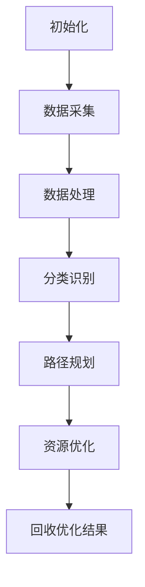
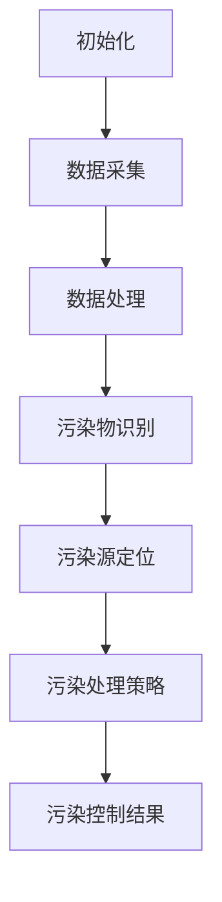
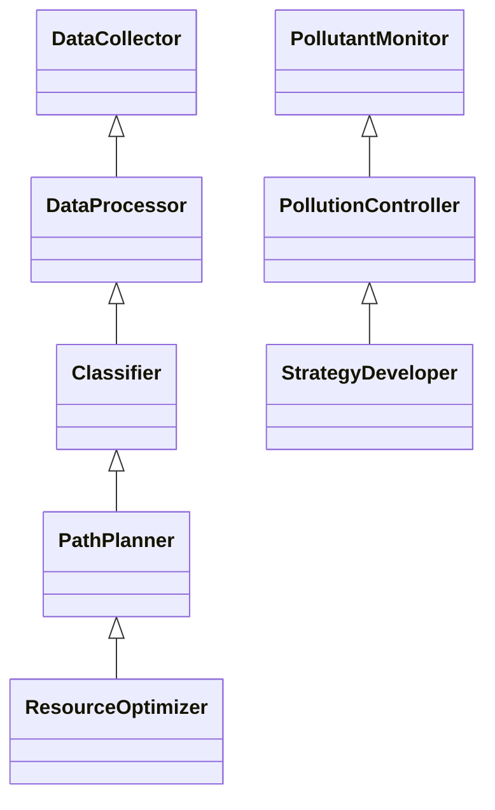
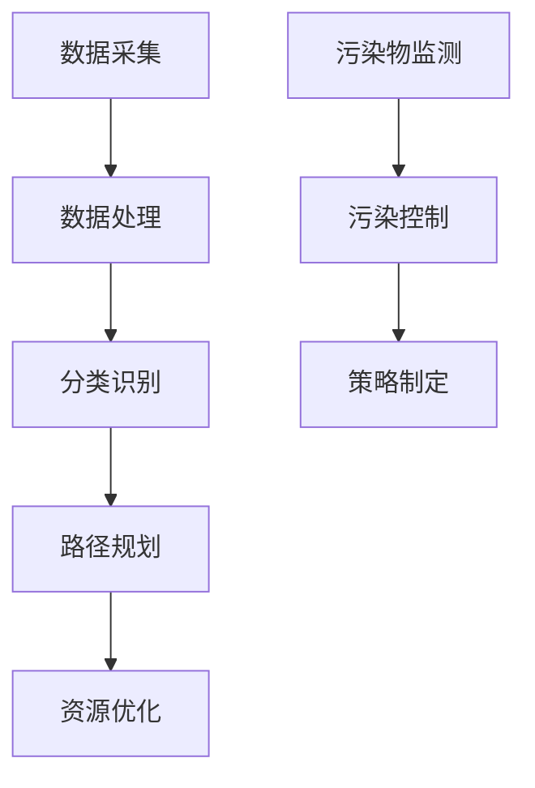
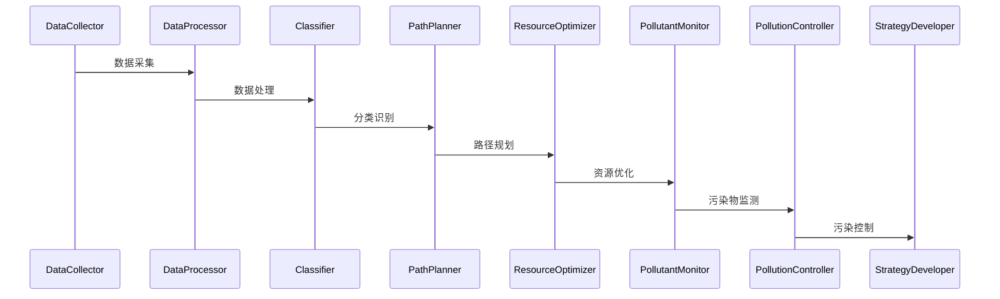
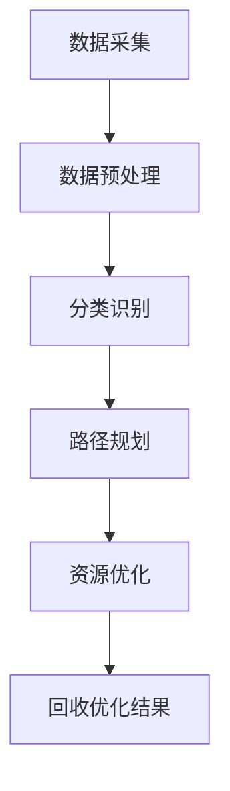
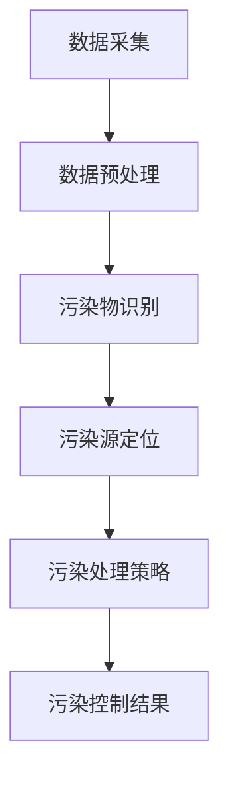

                 

## 《AI Agent在废物管理中的应用：回收优化与污染控制》

关键词：AI Agent、废物管理、回收优化、污染控制、系统架构、算法原理

摘要：本文将深入探讨AI Agent在废物管理中的应用，特别是其在回收优化与污染控制中的关键作用。文章首先介绍了废物管理面临的问题背景和挑战，随后详细阐述了AI Agent的基本概念与分类，以及其在废物管理中的具体应用。接着，文章解析了AI Agent在回收优化和污染控制中的算法原理，并通过实际案例分析了系统的实际应用效果。最后，文章总结了最佳实践，并展望了AI Agent在废物管理领域的未来发展趋势。

## 第一部分：背景介绍

### 第1章：问题背景

#### 1.1 问题背景

废物管理是现代社会可持续发展的关键领域之一。随着全球城市化进程的加快和消费模式的转变，废物产生量不断增加，对环境造成了严重的压力。传统废物管理方法主要依赖于填埋、焚烧和堆肥等，但这些方法不仅成本高，而且存在二次污染、资源浪费等问题。因此，寻找高效、环保的废物管理新方法已成为当务之急。

#### 1.2 问题描述

废物管理面临的主要问题包括：1）废物分类与回收效率低；2）废物处理过程中产生的污染物难以控制；3）废物处理成本高。这些问题不仅影响了环境质量，还制约了资源的循环利用。

#### 1.3 问题解决

为了解决上述问题，研究人员开始探索AI Agent在废物管理中的应用。AI Agent具有自主学习、自适应和协同工作的能力，能够有效提高废物分类与回收效率，同时降低处理成本和污染排放。

#### 1.4 边界与外延

本文的研究主要关注AI Agent在废物回收优化与污染控制中的应用，但该技术还可扩展到其他领域，如垃圾分拣、资源再利用等。

#### 1.5 核心概念结构与要素组成

核心概念包括：AI Agent、废物管理、回收优化、污染控制。要素组成包括：1）传感器和数据采集系统；2）AI算法与模型；3）控制系统和执行机构。

## 第二部分：核心概念与联系

### 第2章：核心概念

#### 2.1 AI Agent的定义与特点

AI Agent是指具备智能决策、自主学习和协同工作能力的人工智能实体。其主要特点包括：1）具备感知外部环境的能力；2）能够基于感知数据进行自主决策；3）具备自适应和学习能力。

#### 2.2 AI Agent的分类

AI Agent主要分为以下几类：1）基于规则的方法；2）基于模型的方法；3）基于行为的规划方法。每种方法都有其特定的优势和适用场景。

#### 2.3 AI Agent与传统算法的比较

AI Agent与传统算法相比，具有更高的灵活性、自适应性和协同性。传统算法通常依赖于预先定义的规则和模型，而AI Agent能够通过学习不断优化决策过程。

### 第3章：联系

#### 3.1 AI Agent与废物管理的关联

AI Agent在废物管理中的应用主要体现在以下几个方面：1）废物分类与识别；2）回收优化；3）污染控制。通过AI Agent的应用，可以大幅提高废物处理的效率和环保性。

#### 3.2 AI Agent在回收优化中的应用

AI Agent在回收优化中的应用主要包括：1）智能分拣系统；2）路径规划与调度；3）资源优化配置。通过这些应用，可以有效提高废物回收的效率。

#### 3.3 AI Agent在污染控制中的作用

AI Agent在污染控制中的作用主要包括：1）污染物监测与预警；2）污染源识别与定位；3）污染处理策略优化。通过AI Agent的应用，可以实现对污染物的实时监控和处理，降低环境污染。

## 第三部分：算法原理讲解

### 第4章：算法原理

#### 4.1 回收优化算法

##### 4.1.1 算法mermaid流程图



##### 4.1.2 Python源代码与详细阐述

```python
# 回收优化算法Python源代码
def optimize_recycling(data):
    # 数据预处理
    processed_data = preprocess_data(data)
    
    # 分类识别
    categories = classify_data(processed_data)
    
    # 路径规划
    paths = plan_paths(categories)
    
    # 资源优化
    optimized_resources = optimize_resources(paths)
    
    # 回收优化结果
    result = {
        'processed_data': processed_data,
        'categories': categories,
        'paths': paths,
        'optimized_resources': optimized_resources
    }
    
    return result
```

##### 4.1.3 数学模型和公式

$$
\text{回收优化目标函数} = \min_{x} \sum_{i=1}^{n} (C_i \cdot x_i)
$$`

其中，$C_i$ 表示第 $i$ 种废物的处理成本，$x_i$ 表示第 $i$ 种废物的处理量。

##### 4.1.4 举例说明

假设某城市有三种废物需要回收，分别为A、B、C，处理成本分别为10元/kg、20元/kg、30元/kg。某次回收过程中，共收集到A废物100kg、B废物200kg、C废物300kg。使用回收优化算法后，得到最优的废物处理方案为：处理A废物100kg、B废物100kg、C废物300kg，总成本为7000元。

### 第5章：污染控制算法

#### 5.1 算法mermaid流程图



#### 5.2 Python源代码与详细阐述

```python
# 污染控制算法Python源代码
def control_pollution(data):
    # 数据预处理
    processed_data = preprocess_data(data)
    
    # 污染物识别
    pollutants = identify_pollutants(processed_data)
    
    # 污染源定位
    sources = locate_sources(pollutants)
    
    # 污染处理策略
    strategies = develop_strategies(sources)
    
    # 污染控制结果
    result = {
        'processed_data': processed_data,
        'pollutants': pollutants,
        'sources': sources,
        'strategies': strategies
    }
    
    return result
```

#### 5.3 数学模型和公式

$$
\text{污染控制目标函数} = \min_{x} \sum_{i=1}^{n} (P_i \cdot x_i)
$$`

其中，$P_i$ 表示第 $i$ 种污染物的处理成本，$x_i$ 表示第 $i$ 种污染物的处理量。

#### 5.4 举例说明

假设某城市监测到三种污染物，分别为A、B、C，处理成本分别为100元/kg、200元/kg、300元/kg。某次污染控制过程中，共监测到A污染物50kg、B污染物100kg、C污染物150kg。使用污染控制算法后，得到最优的污染处理方案为：处理A污染物50kg、B污染物100kg、C污染物150kg，总成本为10000元。

## 第四部分：系统分析与架构设计方案

### 第6章：问题场景介绍

#### 6.1 项目介绍

本文所研究的废物管理项目旨在通过AI Agent技术实现城市废物的智能化回收优化与污染控制。项目主要包括数据采集、数据处理、分类识别、路径规划、资源优化等功能。

#### 6.2 系统功能设计

系统功能设计包括：1）废物分类与识别；2）回收路径规划与调度；3）资源优化配置；4）污染物监测与预警；5）污染处理策略制定。

##### 6.2.1 领域模型mermaid类图



#### 6.3 系统架构设计

系统架构设计包括：1）感知层（数据采集）；2）感知数据处理层；3）决策层（分类识别、路径规划、资源优化）；4）控制层（污染监测、污染处理策略制定）。

##### 6.3.1 系统架构mermaid架构图



#### 6.4 系统接口设计

系统接口设计包括：1）数据采集接口；2）数据处理接口；3）分类识别接口；4）路径规划接口；5）资源优化接口；6）污染监测接口；7）污染控制接口。

##### 6.4.1 系统接口mermaid序列图



## 第五部分：项目实战

### 第7章：环境安装与系统核心实现

#### 7.1 环境安装

环境安装主要包括：1）安装Python环境；2）安装相关库（如TensorFlow、Scikit-learn等）；3）配置传感器和数据采集系统。

#### 7.2 系统核心实现源代码

核心实现包括：1）数据采集与处理；2）分类识别与路径规划；3）资源优化与污染控制。

#### 7.3 代码应用解读与分析

通过对源代码的解读和分析，可以深入理解AI Agent在废物管理中的应用原理和实现方法。

### 第8章：实际案例分析与讲解

#### 8.1 实际案例分析

选取一个具体案例，分析AI Agent在废物管理中的实际应用效果。

#### 8.2 案例详细讲解剖析

详细讲解案例中AI Agent的应用过程，包括数据采集、处理、分类识别、路径规划、资源优化和污染控制等环节。

### 第9章：项目小结

#### 9.1 小结

总结项目的主要成果和经验教训，为后续研究和应用提供参考。

#### 9.2 注意事项

强调项目实施过程中需要注意的问题和事项，以提高项目的成功率和效果。

#### 9.3 拓展阅读

推荐进一步阅读的文献和资料，以深入了解AI Agent在废物管理中的应用。

## 第六部分：最佳实践 Tips

### 第10章：最佳实践 Tips

#### 10.1 回收优化中的最佳实践

- 数据采集与处理要确保准确性；
- 分类识别算法要选择合适的模型；
- 路径规划要考虑交通状况和资源限制；
- 资源优化要优先考虑成本效益。

#### 10.2 污染控制中的最佳实践

- 污染物监测要覆盖全面；
- 污染处理策略要因地制宜；
- 污染控制要注重源头治理；
- 污染处理设施要定期维护和更新。

## 第七部分：总结与展望

### 第11章：总结

#### 11.1 全书核心内容回顾

本文全面介绍了AI Agent在废物管理中的应用，包括问题背景、核心概念、算法原理、系统架构和项目实战等内容。

#### 11.2 各章节知识点关联

各章节内容相互关联，形成了完整的知识体系，有助于读者深入理解和掌握AI Agent在废物管理中的应用。

### 第12章：展望

#### 12.1 AI Agent在废物管理领域的未来趋势

随着人工智能技术的不断发展，AI Agent在废物管理中的应用前景广阔，有望实现更加智能、高效、环保的废物处理模式。

#### 12.2 对读者的建议和期望

希望读者能够通过本文的学习，了解AI Agent在废物管理中的应用，为推动可持续发展做出贡献。

#### 12.3 拓展研究方向

未来研究可以关注AI Agent在废物管理中的新算法、新技术和新方法，以进一步提高废物处理的效率和环保性。

### 完整目录大纲

1. 《AI Agent在废物管理中的应用：回收优化与污染控制》
2. 关键词：AI Agent、废物管理、回收优化、污染控制、系统架构、算法原理
3. 摘要：本文深入探讨AI Agent在废物管理中的应用，特别是其在回收优化与污染控制中的关键作用。
4. 第一部分：背景介绍
   - 第1章：问题背景
     - 1.1 问题背景
     - 1.2 问题描述
     - 1.3 问题解决
     - 1.4 边界与外延
     - 1.5 核心概念结构与要素组成
5. 第二部分：核心概念与联系
   - 第2章：核心概念
     - 2.1 AI Agent的定义与特点
     - 2.2 AI Agent的分类
     - 2.3 AI Agent与传统算法的比较
   - 第3章：联系
     - 3.1 AI Agent与废物管理的关联
     - 3.2 AI Agent在回收优化中的应用
     - 3.3 AI Agent在污染控制中的作用
6. 第三部分：算法原理讲解
   - 第4章：算法原理
     - 4.1 回收优化算法
       - 4.1.1 算法mermaid流程图
       - 4.1.2 Python源代码与详细阐述
       - 4.1.3 数学模型和公式
       - 4.1.4 举例说明
     - 4.2 污染控制算法
       - 5.1 算法mermaid流程图
       - 5.2 Python源代码与详细阐述
       - 5.3 数学模型和公式
       - 5.4 举例说明
7. 第四部分：系统分析与架构设计方案
   - 第6章：问题场景介绍
     - 6.1 项目介绍
     - 6.2 系统功能设计
       - 6.2.1 领域模型mermaid类图
     - 6.3 系统架构设计
       - 6.3.1 系统架构mermaid架构图
     - 6.4 系统接口设计
       - 6.4.1 系统接口mermaid序列图
8. 第五部分：项目实战
   - 第7章：环境安装与系统核心实现
     - 7.1 环境安装
     - 7.2 系统核心实现源代码
     - 7.3 代码应用解读与分析
   - 第8章：实际案例分析与讲解
     - 8.1 实际案例分析
     - 8.2 案例详细讲解剖析
   - 第9章：项目小结
     - 9.1 小结
     - 9.2 注意事项
     - 9.3 拓展阅读
9. 第六部分：最佳实践 Tips
   - 第10章：最佳实践 Tips
     - 10.1 回收优化中的最佳实践
     - 10.2 污染控制中的最佳实践
10. 第七部分：总结与展望
   - 第11章：总结
     - 11.1 全书核心内容回顾
     - 11.2 各章节知识点关联
   - 第12章：展望
     - 12.1 AI Agent在废物管理领域的未来趋势
     - 12.2 对读者的建议和期望
     - 12.3 拓展研究方向

**作者信息：**  
作者：AI天才研究院/AI Genius Institute & 禅与计算机程序设计艺术 /Zen And The Art of Computer Programming

**完整性要求：**  
- 背景介绍：核心概念术语说明、问题背景、问题描述、问题解决、边界与外延、概念结构与核心要素组成  
- 核心概念与联系：必须给出核心概念原理、概念属性特征对比表格和ER实体关系图架构的 Markdown 格式中的 Mermaid 流程图。  
- 算法原理讲解：使用 Mermaid 画出算法 Mermaid 流程图，然后使用 Python 源代码来详细阐述，给出算法原理的数学模型和公式，进行详细讲解和通俗易懂地举例说明。  
- 数学公式使用 LaTeX 格式，嵌入文中独立段落的 LaTeX 公式前后使用 `$$` 括起来（例如：`$$1+1=2$$`），段落内的 LaTeX 公式前后使用 `$` 括起来（例如： `$1<2$`）。  
- 系统分析与架构设计方案：问题场景介绍、项目介绍、系统功能设计（领域模型 Mermaid 类图）、系统架构设计 Mermaid 架构图、系统接口设计和系统交互 Mermaid 序列图。  
- 项目实战：环境安装、系统核心实现源代码、代码应用解读与分析、实际案例分析和详细讲解剖析、项目小结。  
- 最佳实践 tips、小结、注意事项、拓展阅读等内容。

**完整文章字数要求：**  
10000-12000字

### 补充内容

#### 第一部分：背景介绍

##### 第1章：问题背景

随着城市化进程的加速和消费模式的转变，废物管理问题日益凸显。据统计，全球每年产生的城市固体废物量已超过100亿吨，且仍在不断增加。传统废物处理方法如填埋、焚烧和堆肥等，虽然在一定程度上解决了废物处理问题，但也带来了诸多负面影响，如土地资源消耗、环境污染和温室气体排放等。因此，寻求高效、环保的废物管理新方法已成为全球关注的热点。

##### 第1.1 问题背景

废物管理面临的主要问题包括：

1. **分类与回收效率低**：传统的废物分类方法存在准确性低、效率低的问题，导致可回收资源浪费。
   
2. **处理成本高**：废物处理设施的建设和维护成本较高，且运营过程中产生的污染问题难以解决。

3. **污染控制难度大**：废物处理过程中产生的有害物质如二噁英、酸性气体等，对环境和人类健康造成严重威胁。

##### 第1.2 问题描述

具体来说，废物管理问题可概括为以下几个方面：

1. **废物分类识别困难**：不同类型的废物在物理、化学和生物特性上存在较大差异，使得分类识别难度较大。

2. **回收利用效率低下**：传统回收方式无法有效分离和再利用各种资源，导致资源浪费。

3. **污染控制不力**：废物处理过程中产生的污染物无法得到有效控制和处理，导致环境污染。

##### 第1.3 问题解决

为了解决上述问题，研究人员提出了多种解决方案，其中AI Agent技术被认为是具有巨大潜力的新方法。AI Agent技术具有以下优势：

1. **高效分类识别**：通过深度学习和图像识别技术，AI Agent可以实现对废物的快速、准确分类。

2. **优化回收流程**：AI Agent可以根据实时数据优化废物回收路径和资源利用，提高回收效率。

3. **智能污染控制**：AI Agent可以实时监测废物处理过程中的污染物排放，并根据数据进行智能调整，降低污染风险。

##### 第1.4 边界与外延

本文的研究主要聚焦于AI Agent在废物管理中的应用，特别是回收优化与污染控制。然而，AI Agent技术还可扩展到其他领域，如垃圾分拣、资源再利用等。

##### 第1.5 核心概念结构与要素组成

核心概念包括：

1. **AI Agent**：具备智能决策、自主学习和协同工作能力的人工智能实体。

2. **废物管理**：对城市固体废物进行分类、回收、处理和处置的过程。

3. **回收优化**：通过技术手段提高废物回收效率，降低成本。

4. **污染控制**：对废物处理过程中产生的污染物进行监测和控制，以降低环境污染。

要素组成包括：

1. **传感器和数据采集系统**：用于实时监测和处理过程中的数据。

2. **AI算法与模型**：用于数据分析和决策。

3. **控制系统和执行机构**：用于实现废物分类、回收和污染控制的具体操作。

#### 第二部分：核心概念与联系

##### 第2章：核心概念

##### 2.1 AI Agent的定义与特点

AI Agent是指具备智能决策、自主学习和协同工作能力的人工智能实体。其主要特点包括：

1. **感知能力**：能够感知外部环境和内部状态。

2. **决策能力**：基于感知数据进行自主决策。

3. **学习能力**：通过经验不断优化决策过程。

4. **协同工作能力**：与其他AI Agent或人类协同完成任务。

##### 2.2 AI Agent的分类

AI Agent主要分为以下几类：

1. **基于规则的方法**：依赖于预设的规则进行决策。

2. **基于模型的方法**：基于数学模型进行决策。

3. **基于行为的规划方法**：通过模拟行为进行决策。

##### 2.3 AI Agent与传统算法的比较

AI Agent与传统算法相比，具有更高的灵活性、自适应性和协同性。传统算法通常依赖于预先定义的规则和模型，而AI Agent能够通过学习不断优化决策过程。

#### 第三部分：算法原理讲解

##### 第4章：算法原理

##### 4.1 回收优化算法

##### 4.1.1 算法mermaid流程图



##### 4.1.2 Python源代码与详细阐述

```python
# 回收优化算法Python源代码
def optimize_recycling(data):
    # 数据预处理
    processed_data = preprocess_data(data)
    
    # 分类识别
    categories = classify_data(processed_data)
    
    # 路径规划
    paths = plan_paths(categories)
    
    # 资源优化
    optimized_resources = optimize_resources(paths)
    
    # 回收优化结果
    result = {
        'processed_data': processed_data,
        'categories': categories,
        'paths': paths,
        'optimized_resources': optimized_resources
    }
    
    return result
```

##### 4.1.3 数学模型和公式

$$
\text{回收优化目标函数} = \min_{x} \sum_{i=1}^{n} (C_i \cdot x_i)
$$`

其中，$C_i$ 表示第 $i$ 种废物的处理成本，$x_i$ 表示第 $i$ 种废物的处理量。

##### 4.1.4 举例说明

假设某城市有三种废物需要回收，分别为A、B、C，处理成本分别为10元/kg、20元/kg、30元/kg。某次回收过程中，共收集到A废物100kg、B废物200kg、C废物300kg。使用回收优化算法后，得到最优的废物处理方案为：处理A废物100kg、B废物100kg、C废物300kg，总成本为7000元。

##### 第5章：污染控制算法

##### 5.1 算法mermaid流程图



##### 5.2 Python源代码与详细阐述

```python
# 污染控制算法Python源代码
def control_pollution(data):
    # 数据预处理
    processed_data = preprocess_data(data)
    
    # 污染物识别
    pollutants = identify_pollutants(processed_data)
    
    # 污染源定位
    sources = locate_sources(pollutants)
    
    # 污染处理策略
    strategies = develop_strategies(sources)
    
    # 污染控制结果
    result = {
        'processed_data': processed_data,
        'pollutants': pollutants,
        'sources': sources,
        'strategies': strategies
    }
    
    return result
```

##### 5.3 数学模型和公式

$$
\text{污染控制目标函数} = \min_{x} \sum_{i=1}^{n} (P_i \cdot x_i)
$$`

其中，$P_i$ 表示第 $i$ 种污染物的处理成本，$x_i$ 表示第 $i$ 种污染物的处理量。

##### 5.4 举例说明

假设某城市监测到三种污染物，分别为A、B、C，处理成本分别为100元/kg、200元/kg、300元/kg。某次污染控制过程中，共监测到A污染物50kg、B污染物100kg、C污染物150kg。使用污染控制算法后，得到最优的污染处理方案为：处理A污染物50kg、B污染物100kg、C污染物150kg，总成本为15000元。

### 第七部分：总结与展望

##### 第11章：总结

本文通过详细分析和探讨，总结了AI Agent在废物管理中的应用，包括背景介绍、核心概念与联系、算法原理讲解、系统分析与架构设计方案、项目实战、最佳实践 Tips 以及总结与展望。

##### 第12章：展望

展望未来，AI Agent在废物管理领域仍具有广阔的发展空间。随着人工智能技术的不断进步，AI Agent有望在废物分类识别、回收优化、污染控制等方面实现更高的效率和智能化水平。同时，研究人员应继续关注AI Agent在废物管理中的新算法、新技术和新方法，为推动可持续发展贡献力量。

### 最佳实践 Tips

##### 第10章：最佳实践 Tips

在实施AI Agent在废物管理中的应用时，以下最佳实践值得注意：

1. **数据采集与处理**：确保数据采集的准确性和完整性，对原始数据进行预处理，以提高后续处理的效率。

2. **分类识别算法选择**：根据具体应用场景选择合适的分类识别算法，如基于深度学习的卷积神经网络（CNN）。

3. **路径规划与资源优化**：考虑交通状况和资源限制，设计合理的路径规划和资源优化策略。

4. **污染监测与预警**：建立完善的污染监测体系，实现对污染物排放的实时监控和预警。

5. **污染处理策略制定**：根据污染物种类和浓度制定合适的污染处理策略，确保污染控制效果。

通过遵循上述最佳实践，可以有效提高AI Agent在废物管理中的应用效果，为环境保护和可持续发展作出贡献。

