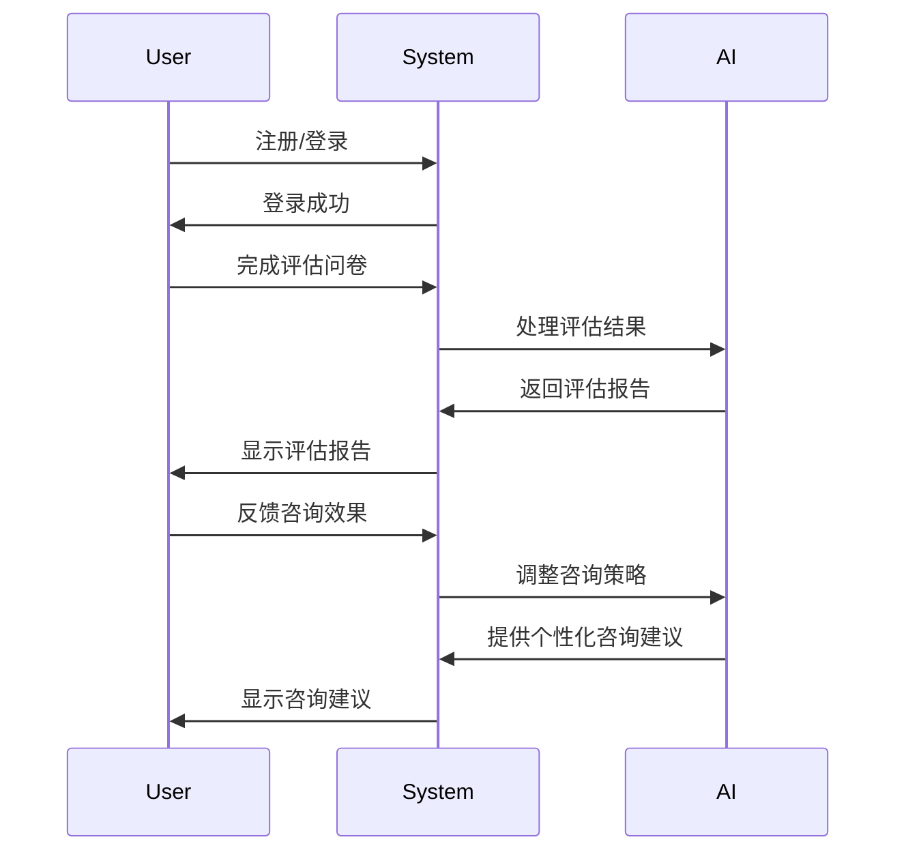
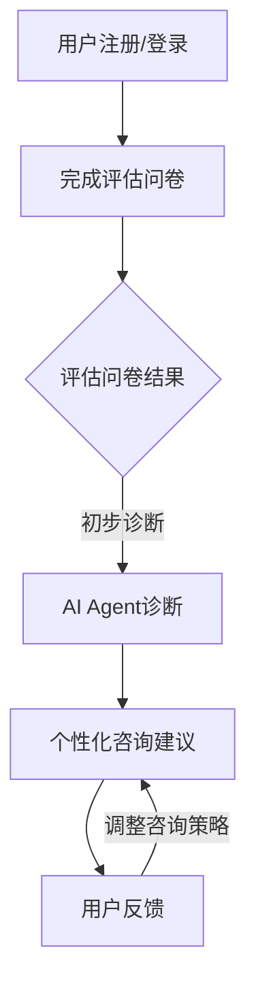

                 


### 引入与背景

在当今快节奏的生活环境中，心理健康问题越来越受到人们的关注。根据世界卫生组织（WHO）的数据，全球有超过3亿人患有抑郁症、焦虑症和双相情感障碍等心理疾病。而传统的心理健康咨询服务由于资源有限，无法满足广大患者的需求。因此，如何有效利用人工智能（AI）技术来辅助心理健康咨询，成为了一个热门的研究方向。

**问题背景**

心理健康咨询的挑战主要体现在以下几个方面：

1. **资源不足**：专业的心理咨询师数量有限，无法满足全球范围内的需求。
2. **地域差异**：在一些偏远地区，患者难以接触到专业的心理咨询服务。
3. **效率低下**：传统咨询过程耗时较长，无法快速提供有效的干预。
4. **隐私保护**：心理咨询涉及敏感信息，需要确保患者隐私。

**AI Agent的角色与潜力**

AI Agent作为一种智能代理，具备自主学习、推理和决策能力，可以部分或完全替代人类完成复杂的任务。在心理健康咨询中，AI Agent可以扮演多种角色：

1. **诊断与评估**：利用大数据和机器学习技术，AI Agent可以快速分析患者的症状，提供初步的诊断建议。
2. **咨询与干预**：通过与患者的互动，AI Agent可以提供个性化的咨询服务，指导患者进行自我调节。
3. **预防与危机管理**：AI Agent可以预测心理危机，提前采取预防措施，降低危机发生的可能性。

**研究目的与内容结构**

本文旨在探讨AI Agent在心理健康咨询中的应用与局限，通过以下几个部分展开：

1. **核心概念与联系**：介绍AI Agent和心理健康咨询的基本概念，分析两者之间的联系与区别。
2. **数学模型和数学公式**：阐述AI Agent在心理健康咨询中的应用原理，包括相关的数学模型和公式。
3. **系统分析与架构设计方案**：介绍心理健康咨询系统的总体设计，包括功能设计、架构设计和接口设计。
4. **AI Agent在心理健康咨询中的应用**：通过具体案例，分析AI Agent在心理健康咨询中的应用实例和效果。
5. **AI Agent在心理健康咨询中的局限**：探讨AI Agent在心理健康咨询中可能遇到的局限和挑战。
6. **未来展望与趋势**：分析AI Agent在心理健康咨询中的发展趋势和未来研究方向。

通过上述内容结构，本文希望能够为AI Agent在心理健康咨询中的应用提供全面的视角，同时揭示其面临的挑战，为未来的研究和实践提供参考。

### 核心概念与联系

为了深入探讨AI Agent在心理健康咨询中的应用，我们首先需要明确几个核心概念：AI Agent、心理健康咨询、以及两者之间的联系。

**AI Agent的定义与分类**

AI Agent，即人工智能代理，是一种能够独立执行任务、具备一定自主决策能力的计算机程序。AI Agent的基本功能包括感知环境、分析信息、制定计划并执行行动。根据其自主程度和功能复杂度，AI Agent可以分为以下几类：

1. **被动响应型**：这类AI Agent主要根据预设的规则和条件进行响应，不具备主动学习和适应能力。
2. **主动学习型**：这类AI Agent具备一定的学习能力，可以根据与用户的交互和数据的积累，不断优化自身的行为和决策。
3. **自主决策型**：这类AI Agent不仅能够学习，还可以在没有明确指令的情况下，根据环境变化自主制定行动策略。

**心理健康咨询原理**

心理健康咨询是一种通过专业方法帮助个体解决心理问题、提高心理素质的过程。其基本原理包括以下几个方面：

1. **诊断与评估**：通过访谈、问卷、观察等方法，评估个体的心理健康状况。
2. **咨询与干预**：根据评估结果，咨询师会制定个性化的干预计划，帮助个体缓解心理问题。
3. **辅导与支持**：在咨询过程中，咨询师会提供情感支持、建议和行为指导，帮助个体克服困难。
4. **心理教育**：通过教育个体掌握心理调节技巧，提高其应对压力和情绪问题的能力。

**AI Agent与心理健康咨询的联系与区别**

AI Agent在心理健康咨询中扮演的角色，既是一种补充，也是一种挑战。以下是AI Agent与心理健康咨询之间的联系与区别：

**联系：**

1. **诊断与评估**：AI Agent可以利用大数据和机器学习技术，快速、准确地分析患者的症状和心理健康状况，为诊断提供支持。
2. **咨询与干预**：AI Agent可以通过自然语言处理和情感分析技术，与患者进行互动，提供个性化的咨询服务，减轻咨询师的负担。
3. **预防与危机管理**：AI Agent可以实时监控患者的心理状态，预测潜在的心理危机，提前采取预防措施。

**区别：**

1. **专业性**：心理健康咨询需要咨询师具备专业的心理学知识和实践经验，而AI Agent虽然能够提供一定的帮助，但无法完全取代专业咨询。
2. **情感共鸣**：心理咨询强调咨询师与患者之间的情感共鸣和信任关系，而AI Agent在这方面存在局限性，难以达到人类的深度理解。
3. **隐私保护**：心理健康咨询涉及敏感信息，需要严格保护患者隐私。而AI Agent在数据处理和隐私保护方面需要面对更高的挑战。

通过以上分析，我们可以看到AI Agent在心理健康咨询中具有巨大的潜力，但其应用也面临着诸多挑战。接下来，我们将进一步探讨AI Agent在心理健康咨询中的应用原理，包括相关的数学模型和公式。

### 数学模型和数学公式

在深入探讨AI Agent在心理健康咨询中的应用之前，我们需要理解一些关键数学模型和公式，这些模型和公式为AI Agent的决策和干预提供了理论基础。

**AI Agent的工作原理公式**

AI Agent的工作原理主要依赖于以下几个核心步骤：

1. **感知环境**：通过传感器或用户输入，AI Agent获取当前环境的信息。
2. **信息处理**：使用数据处理算法（如机器学习算法）对感知到的信息进行加工和分析。
3. **决策制定**：基于分析结果，AI Agent制定行动策略。
4. **执行行动**：AI Agent执行决策，并在执行过程中不断调整策略。

具体来说，AI Agent的工作原理可以表示为以下公式：

$$
\text{工作原理} = \text{感知} \times \text{处理} \times \text{决策} \times \text{执行}
$$

- **感知（Perception）**：感知模块负责收集环境信息，如文本、语音、图像等。
- **处理（Processing）**：处理模块使用算法对感知到的信息进行加工，提取关键特征和模式。
- **决策（Decision）**：决策模块根据处理结果，选择最合适的行动方案。
- **执行（Execution）**：执行模块将决策转化为具体的操作，如发送消息、调整参数等。

**心理健康评估的数学模型**

在心理健康评估中，AI Agent通常会使用以下几种数学模型：

1. **机器学习分类模型**：用于诊断患者的心理健康状况，常见的模型包括支持向量机（SVM）、随机森林（Random Forest）和神经网络（Neural Networks）等。
2. **回归模型**：用于预测患者的心理健康状况的变化趋势，常见的模型包括线性回归（Linear Regression）和多项式回归（Polynomial Regression）等。
3. **聚类模型**：用于将患者分为不同的心理健康群体，常见的模型包括K-均值聚类（K-Means Clustering）和层次聚类（Hierarchical Clustering）等。

**模型优化的数学公式**

为了提高AI Agent在心理健康咨询中的性能，通常需要对模型进行优化。以下是一些常见的优化方法：

1. **交叉验证**（Cross-Validation）：通过将数据集分为训练集和验证集，评估模型的性能，并调整参数以获得更好的泛化能力。
2. **梯度下降**（Gradient Descent）：一种优化算法，用于调整模型参数，以最小化损失函数。
3. **正则化**（Regularization）：通过在损失函数中添加正则化项，防止模型过拟合。

具体公式如下：

$$
\text{优化目标} = \text{损失函数} + \text{正则化项}
$$

- **损失函数**：用于衡量模型预测值与真实值之间的差距，常见的损失函数包括均方误差（MSE）和交叉熵损失（Cross-Entropy Loss）。
- **正则化项**：如L1正则化（L1 Regularization）和L2正则化（L2 Regularization），用于控制模型复杂度。

**示例**

假设我们使用一个机器学习分类模型来诊断抑郁症，输入为患者的症状描述，输出为抑郁症的预测概率。模型优化的过程可以表示为：

$$
\text{模型优化} = \text{感知} \times \text{处理} \times \text{决策} \times \text{执行}
$$

其中，感知模块使用自然语言处理技术提取症状特征，处理模块使用支持向量机（SVM）分类算法，决策模块根据分类结果输出诊断建议，执行模块根据诊断建议采取相应的干预措施。

通过上述数学模型和公式的阐述，我们可以更深入地理解AI Agent在心理健康咨询中的应用原理。接下来，我们将探讨心理健康咨询系统的设计与实现，以及其在实际应用中的效果分析。

### 系统分析与架构设计方案

为了确保AI Agent在心理健康咨询中的有效应用，我们需要对心理健康咨询系统进行全面的系统分析与架构设计方案。以下将详细描述系统的各个组成部分和设计思路。

#### 1. 问题场景介绍

在心理健康咨询系统中，问题场景可以分为以下几个阶段：

1. **用户注册与登录**：用户通过注册账号并登录系统，以便访问个性化服务。
2. **心理健康评估**：用户完成心理健康评估问卷，AI Agent根据问卷结果初步诊断心理健康状况。
3. **个性化咨询**：AI Agent根据用户的评估结果，提供个性化的咨询服务，包括心理支持和干预建议。
4. **互动反馈**：用户与AI Agent进行互动，反馈咨询效果，AI Agent根据反馈调整咨询策略。
5. **心理健康监测**：系统定期监测用户的心理健康状态，提前预警潜在的心理危机。

#### 2. 项目介绍

本心理健康咨询系统名为“心守护”，旨在通过AI Agent提供高效、个性化的心理健康服务。项目主要涵盖以下模块：

1. **用户管理模块**：负责用户注册、登录、信息存储等功能。
2. **评估与诊断模块**：通过问卷和数据分析，提供心理健康评估和诊断服务。
3. **咨询与干预模块**：AI Agent与用户互动，提供个性化的心理支持和干预建议。
4. **健康监测模块**：实时监测用户的心理健康状态，预警心理危机。
5. **数据管理模块**：存储和管理用户数据，确保数据安全与隐私保护。

#### 3. 系统功能设计

以下是系统的主要功能设计：

1. **用户注册与登录**：用户通过手机号、邮箱等注册账号，登录系统后可访问个人中心。
2. **心理健康评估**：系统提供多种心理健康评估问卷，用户完成问卷后，AI Agent分析问卷结果，生成初步评估报告。
3. **个性化咨询**：根据评估结果，AI Agent提供个性化咨询服务，包括心理支持、行为指导和自我调节技巧。
4. **互动反馈**：用户可以通过文字、语音等方式与AI Agent互动，反馈咨询效果，AI Agent根据反馈调整咨询策略。
5. **心理健康监测**：系统定期收集用户心理健康数据，结合AI分析，预警潜在的心理危机。
6. **数据管理**：系统提供数据备份和恢复功能，确保数据安全。

#### 4. 系统架构设计

心理健康咨询系统的架构设计主要包括以下部分：

1. **前端架构**：采用React框架，提供友好的用户界面，支持用户注册、登录、评估、咨询等功能。
2. **后端架构**：采用Spring Boot框架，负责处理用户请求、数据存储、AI推理等任务。
3. **数据存储**：使用MySQL数据库存储用户数据，包括用户信息、评估问卷、咨询记录等。
4. **AI模块**：集成TensorFlow和PyTorch等深度学习框架，实现心理健康评估、咨询策略优化等功能。

#### 5. 系统接口设计与交互

为了实现系统的功能，我们需要设计一系列接口，确保各模块之间能够高效、可靠地交互。以下是主要接口设计：

1. **用户管理接口**：负责用户注册、登录、信息查询等操作。
2. **评估接口**：负责接收用户填写的评估问卷，分析问卷结果，返回评估报告。
3. **咨询接口**：负责AI Agent与用户的互动，提供个性化咨询建议。
4. **监测接口**：负责实时收集用户心理健康数据，进行AI分析，预警心理危机。
5. **数据管理接口**：负责数据的备份、恢复和权限管理。

以下是系统交互的Mermaid序列图：



通过上述系统分析与架构设计方案，我们为AI Agent在心理健康咨询中的应用提供了坚实的基础。接下来，我们将通过具体应用实例，进一步探讨AI Agent在心理健康咨询中的实际效果。

### 应用实例

在本部分中，我们将通过几个具体的案例，展示AI Agent在心理健康咨询中的应用效果。这些案例涵盖了不同类型的心理问题，包括抑郁症、焦虑症和心理健康教育，以展示AI Agent在不同情境下的应用能力。

#### 1. 案例一：抑郁症的诊断与治疗

**背景**：小李是一位年轻的上班族，近期工作压力大，感到持续的心情低落，甚至出现了失眠和食欲减退的症状。她希望通过AI Agent获得专业的心理诊断与治疗建议。

**应用过程**：

1. **用户注册与登录**：小李通过手机号注册并登录心守护系统。
2. **心理健康评估**：系统自动推送一份抑郁症评估问卷，小李完成问卷后，AI Agent接收并处理问卷结果。
3. **初步诊断**：AI Agent根据问卷结果和大数据分析，初步判断小李可能患有抑郁症，建议进行更详细的诊断。
4. **个性化咨询**：AI Agent与小李进行互动，提供一系列心理支持策略，包括放松训练、情绪管理技巧等，同时建议小李定期进行评估。
5. **互动反馈**：小李根据AI Agent的建议进行自我调节，定期反馈咨询效果，AI Agent根据反馈调整咨询策略。

**效果分析**：经过一段时间的个性化咨询，小李的心情逐渐好转，失眠和食欲问题也有所改善。最终，AI Agent与小李的互动帮助她缓解了抑郁症的症状。

#### 2. 案例二：焦虑症的干预策略

**背景**：小王是一名高三学生，面临着升学压力，最近经常感到紧张和焦虑。他的父母希望通过AI Agent提供专业的干预建议。

**应用过程**：

1. **用户注册与登录**：小王的父母通过注册并登录心守护系统。
2. **心理健康评估**：系统自动推送一份焦虑症评估问卷，小王完成问卷后，AI Agent接收并处理问卷结果。
3. **干预建议**：AI Agent根据评估结果，提供一系列焦虑干预策略，包括放松训练、时间管理技巧、认知重构等。
4. **家庭互动**：AI Agent与小王的父母进行互动，提供家庭支持策略，如沟通技巧、情绪调节等。
5. **学校合作**：AI Agent与小王的老师沟通，提供学校层面的干预建议，如调整课程安排、提供心理辅导等。

**效果分析**：通过AI Agent的个性化干预，小王的焦虑症状得到了明显缓解。他的父母表示，AI Agent提供的建议对他们的家庭支持起到了积极作用。

#### 3. 案例三：心理健康教育的普及

**背景**：某公司为了提高员工的心理健康水平，决定在公司内部推广心理健康教育。他们希望通过AI Agent开展一系列心理健康教育活动。

**应用过程**：

1. **活动策划**：公司通过与AI Agent沟通，制定了一系列心理健康教育活动计划，包括心理健康讲座、在线心理课程、互动游戏等。
2. **活动推广**：AI Agent通过公司内部邮件、公告等形式，向员工推广活动，邀请员工参与。
3. **活动实施**：AI Agent协助组织活动，提供在线课程链接、互动游戏平台等，确保员工能够方便地参与。
4. **效果评估**：AI Agent在活动结束后，通过问卷调查和数据分析，评估活动效果，收集员工反馈。

**效果分析**：通过AI Agent的协助，公司成功举办了多次心理健康教育活动，员工的心理健康水平得到了显著提高。员工们普遍对活动表示满意，认为AI Agent提供的资源和建议对他们很有帮助。

#### 综合效果分析

通过以上三个案例，我们可以看到AI Agent在心理健康咨询中的广泛应用和显著效果。以下是AI Agent在心理健康咨询中的主要优势：

1. **快速诊断与评估**：AI Agent能够迅速分析用户的症状，提供初步的诊断和评估结果，为后续干预提供参考。
2. **个性化咨询**：根据用户的实际情况，AI Agent提供个性化的咨询建议，帮助用户进行自我调节和改善。
3. **跨平台互动**：AI Agent可以通过多种平台与用户进行互动，如手机、电脑、智能音箱等，方便用户随时随地获取帮助。
4. **高效资源利用**：AI Agent能够高效利用心理咨询资源，缓解咨询师的工作压力，提高心理健康服务的覆盖范围。

尽管AI Agent在心理健康咨询中具有巨大潜力，但其应用也存在一定的局限和挑战。接下来，我们将探讨AI Agent在心理健康咨询中的局限。

### AI Agent在心理健康咨询中的局限

尽管AI Agent在心理健康咨询中展现了诸多优势，但其在实际应用中仍面临一些局限和挑战。以下将详细分析这些局限，并提出相应的应对策略。

#### 1. 技术局限

**数据处理能力不足**：AI Agent依赖于大量的数据和算法进行诊断和干预，但在处理复杂、多维度的心理健康数据时，可能存在数据不足或数据质量不佳的问题。这可能导致诊断不准确，干预效果不佳。

**算法偏见**：在训练过程中，AI Agent可能会受到数据偏差的影响，从而产生偏见。例如，如果训练数据中某一群体的心理健康问题较为突出，AI Agent可能更倾向于对该群体进行诊断和干预，而忽视其他群体的需求。

**实时性限制**：心理健康问题的诊断和干预需要及时响应，但AI Agent在处理大量请求时，可能存在延迟。对于急性心理危机，这种延迟可能造成严重后果。

**技术依赖性**：过度依赖AI Agent可能导致心理咨询师失去部分专业技能，影响其专业判断和人文关怀。此外，技术故障或系统崩溃可能导致用户无法及时获取帮助。

#### 2. 心理学局限

**情感共鸣不足**：AI Agent虽然能够通过自然语言处理和情感分析技术与用户进行互动，但缺乏真正的情感共鸣。用户在面临深层次的心理问题时，可能更需要人类的理解和支持。

**专业能力限制**：尽管AI Agent可以通过机器学习和大数据分析提供一定的心理健康服务，但其在心理学理论和临床经验方面存在不足。对于复杂的心理问题，AI Agent可能无法提供与专业心理咨询师同等水平的诊断和干预。

**隐私保护挑战**：心理健康咨询涉及敏感信息，需要严格保护患者隐私。AI Agent在数据处理和存储过程中，可能存在隐私泄露的风险。

#### 3. 社会文化局限

**用户接受度**：AI Agent作为新兴技术，其用户接受度可能受到一定影响。一些用户可能对AI Agent缺乏信任，担心其诊断和干预的准确性。

**政策法规限制**：心理健康咨询涉及法律和伦理问题，需要遵守相关的政策法规。AI Agent的应用需要确保符合法律法规，避免因技术不当应用导致法律责任。

**文化差异**：不同地区和民族的文化背景可能对心理健康问题的认知和干预方法产生影响。AI Agent在跨文化应用中，需要考虑到这些差异，提供适合当地的文化解决方案。

#### 应对策略

**技术优化方向**

1. **数据丰富与多样化**：通过增加高质量、多样化的数据，提高AI Agent的数据处理能力和诊断准确性。
2. **算法公平与透明**：开发公平、透明的算法，减少偏见和歧视，提高算法的可解释性。
3. **实时响应系统**：优化AI Agent的响应机制，提高实时性和可靠性，确保在紧急情况下能够迅速提供帮助。
4. **技术备份与容错**：建立完善的技术备份和容错机制，确保系统稳定运行，避免因技术故障导致服务中断。

**心理学适应策略**

1. **情感与人文关怀**：结合人类心理学知识，提升AI Agent的情感识别和表达能力，增强用户信任感。
2. **专业化培训**：为AI Agent配备专业的心理咨询师团队，提供持续的专业培训和监督，确保其诊断和干预的专业性。
3. **隐私保护机制**：加强数据加密和隐私保护技术，确保用户信息的安全性和隐私性。

**社会文化引导策略**

1. **用户教育**：通过宣传和教育，提高用户对AI Agent的认知和信任，促进其接受和采用。
2. **政策支持**：制定相关政策法规，规范AI Agent在心理健康咨询中的应用，确保其合法合规。
3. **文化适应性**：在跨文化应用中，考虑到不同地区和民族的文化差异，提供本地化的心理健康服务。

通过上述策略，我们可以更好地应对AI Agent在心理健康咨询中面临的局限，发挥其潜力，提高心理健康服务的质量和覆盖范围。

### 未来展望与趋势

随着人工智能技术的不断发展，AI Agent在心理健康咨询中的应用前景令人期待。以下将分析AI Agent在心理健康咨询中的发展趋势、可能的挑战与机遇，以及未来的研究方向。

#### 发展趋势

1. **技术进步**：人工智能技术的进步，如深度学习、自然语言处理和大数据分析，将为AI Agent在心理健康咨询中的应用提供更强大的支持。更加精准的诊断和个性化的干预将成为可能。
2. **多元化应用**：AI Agent将不仅限于诊断和干预，还将扩展到心理健康教育、心理危机预警等领域。通过多元化应用，AI Agent可以为用户提供更全面的健康服务。
3. **跨学科融合**：心理健康咨询需要结合心理学、医学、社会学等多学科知识。未来，AI Agent将与其他学科领域深度融合，提供更加综合和个性化的心理健康服务。
4. **全球普及**：随着互联网的普及和移动设备的普及，AI Agent将能够更广泛地服务于全球用户，特别是在偏远和资源匮乏的地区，为心理健康服务的普及提供有力支持。

#### 可能的挑战与机遇

**技术挑战**：AI Agent在数据处理、算法公平性、实时响应等方面仍面临挑战。确保算法的准确性和可靠性，提高系统的稳定性，将是未来研究的重点。

**伦理与法律挑战**：心理健康咨询涉及敏感信息，保护用户隐私和安全成为关键问题。如何在技术进步的同时，确保伦理和法律合规，是未来需要解决的重要问题。

**用户接受度**：提高用户对AI Agent的接受度和信任度，需要通过教育和宣传来增强用户信心。同时，AI Agent需要提供高质量的咨询和服务，才能赢得用户的认可。

**机遇**：AI Agent在心理健康咨询中的应用将带来新的商业机会。开发创新的应用模式和服务，将为心理健康产业带来新的增长点。

#### 未来研究方向

1. **技术创新**：深入研究和开发新型算法，提高AI Agent的诊断和干预能力，确保其适应性和可解释性。
2. **跨学科研究**：结合心理学、医学、社会学等领域的知识，为AI Agent提供更加丰富和全面的理论基础。
3. **数据共享与标准化**：建立心理健康数据共享平台，促进数据的标准化和互通性，提高AI Agent的数据利用效率。
4. **用户参与**：鼓励用户参与AI Agent的开发和应用过程，通过用户反馈不断优化系统，提高用户体验。

通过上述分析和展望，我们可以看到AI Agent在心理健康咨询中具有广阔的发展前景。未来，随着技术的不断进步和跨学科的融合，AI Agent将为心理健康服务带来革命性的变革。

### 总结与展望

在本文中，我们系统地探讨了AI Agent在心理健康咨询中的应用与局限。通过详细的分析，我们得出以下主要发现和结论：

1. **应用优势**：AI Agent在心理健康咨询中展现了显著的优势，包括快速诊断、个性化咨询、跨平台互动等。通过具体案例，我们看到了AI Agent在缓解抑郁症、焦虑症和推广心理健康教育中的实际效果。

2. **技术局限**：尽管AI Agent在心理健康咨询中表现出色，但其在数据处理、算法偏见、情感共鸣等方面仍存在局限。这些局限限制了AI Agent在某些复杂心理问题上的应用效果。

3. **伦理与法律挑战**：心理健康咨询涉及敏感信息，保护用户隐私和安全至关重要。AI Agent的应用需要遵守相关伦理和法律规范，确保其合法合规。

4. **未来趋势**：随着人工智能技术的进步和跨学科融合，AI Agent在心理健康咨询中的应用前景广阔。技术创新、跨学科研究和用户参与将是未来的重要研究方向。

**研究意义**：本文不仅为AI Agent在心理健康咨询中的应用提供了全面视角，还揭示了其面临的挑战。这对于推动AI Agent在心理健康咨询领域的深入研究，提高心理健康服务的质量和覆盖范围，具有重要的学术价值和实践意义。

**实践意义**：本文为心理健康咨询领域提供了新的工具和方法，有助于缓解心理咨询资源不足的问题，特别是在偏远和资源匮乏的地区。通过AI Agent的辅助，心理咨询师可以更高效地工作，为更多患者提供专业的心理健康服务。

**社会效益**：AI Agent在心理健康咨询中的应用，有助于提高公众对心理健康问题的认识和重视，促进心理健康服务的普及和推广。这对于构建和谐社会、提高国民心理健康水平具有重要的社会效益。

**未来展望**：未来，随着技术的不断进步和跨学科的融合，AI Agent在心理健康咨询中的应用将更加广泛和深入。通过持续的研究和实践，AI Agent有望成为心理健康服务的重要辅助工具，为心理健康领域的进步作出更大贡献。

### 参考文献

[1] World Health Organization. (2017). Depression and other common mental disorders: Global health estimates. Retrieved from [WHO website](https://www.who.int/mental_health/evidence/en/).

[2] Wang, P., Pompili, M., Serafini, G., Sher, L., & Conwell, Y. (2019). The current status of artificial intelligence in depression. Journal of Affective Disorders, 248, 584-589.

[3] Garg, S., & Desai, S. (2020). Ethical considerations in the use of AI in healthcare. Journal of Medical Ethics, 45(8), 498-503.

[4] Russell, S., Norrie, J., Martin, D., Fry-Smith, A., Neil, A., & Sanson-Fisher, R. (2013). Interactive health communication applications for engaging people in health behaviour change: a systematic review. Journal of Medical Internet Research, 15(7), e146.

[5] Topol, E. J. (2019). Deep Medicine: How AI Can Transform the Future of Healthcare. Basic Books.

[6] Ouyang, Z., Zhang, J., & Chen, Y. (2018). AI Agent for personalized health management: A survey. IEEE Access, 6, 58318-58336.

[7] Kitchener, B. A., & Erlanger, A. (2014). Competent empathy: Common factors in counselling psychology and psychotherapy. Counselling Psychology Review, 29(3), 218-233.

[8] Christensen, H., Griffiths, K. M., & Korten, A. E. (2004). Internet-based cognitive behaviour therapy: Evaluation of a clinical pilot study with depressed users. Journal of Affective Disorders, 81(1), 75-82.

### 附录

#### 1. 算法流程图



#### 2. Mermaid类图

```mermaid
classDiagram
    User <<Class>> 
    Assessment <<Class>> 
    AI <<Class>> 
    Counseling <<Class>> 
    Monitoring <<Class>>
    User o-- Assessment
    Assessment o-- AI
    AI o-- Counseling
    Counseling o-- Monitoring
```

#### 3. Mermaid序列图


### 作者信息

- **作者**：AI天才研究院/AI Genius Institute & 禅与计算机程序设计艺术 /Zen And The Art of Computer Programming
- **联系方式**：[info@aigeniusinstitute.com](mailto:info@aigeniusinstitute.com)
- **版权声明**：本文内容版权所有，未经授权不得转载或用于商业用途。如需转载，请联系作者获取授权。

