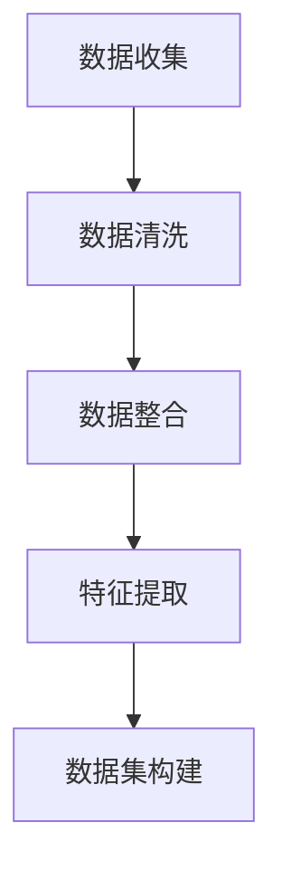
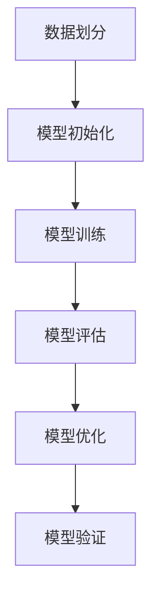
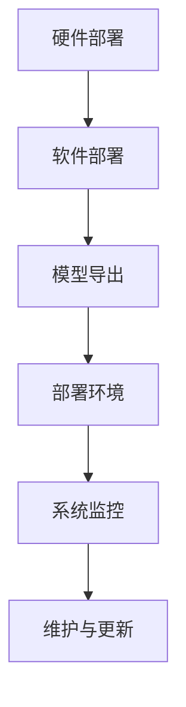

                 

### 第1章 引言

人工智能（AI）在当今社会中已经逐渐成为不可或缺的一部分，其应用范围涵盖了医疗、金融、教育、交通等多个领域。随着计算能力的提升和数据的爆炸式增长，AI技术正以前所未有的速度发展。特别是在医疗健康领域，人工智能的应用正在极大地改变传统的医疗服务模式。从疾病预测到个性化治疗，AI技术正为患者提供更加精准、高效的健康服务。

在这其中，AI Agent作为一个高度自主的智能实体，逐渐成为研究的热点。AI Agent具有自主性、反应性、主动性和社会性等特点，能够在复杂的环境中根据用户需求提供个性化的服务。本文将深入探讨AI Agent在智能个性化健康建议中的应用，以期为相关领域的研究者和实践者提供有价值的参考。

首先，文章将介绍AI Agent的基本概念、分类及其在各个领域的应用，帮助读者了解AI Agent的基本原理和现状。接下来，我们将对智能个性化健康建议进行概述，分析其在医疗健康领域的重要性和当前存在的问题。在此基础上，本文将详细介绍AI Agent在健康建议中的应用场景，包括个性化健康数据收集、健康风险评估、健康建议生成以及用户反馈与迭代。

随后，文章将深入探讨AI-Agent的设计与实现，包括数据预处理、算法选择、模型训练与优化、系统部署与维护等关键步骤。在系统评估与优化部分，我们将介绍评估指标、优化策略以及实际案例评估，以验证AI Agent在健康建议中的应用效果。最后，文章将探讨AI-Agent技术的未来发展趋势、应用挑战以及拓展领域，并展望其在医疗健康领域的未来发展。

总的来说，本文将从多个角度对AI Agent在智能个性化健康建议中的应用进行深入分析，力图揭示其潜在价值和应用前景。通过本文的阅读，读者不仅可以了解AI Agent的基本原理和应用场景，还可以了解到其在医疗健康领域的重要作用和未来发展趋势。

### 关键词

- 人工智能
- AI Agent
- 智能个性化健康建议
- 数据收集
- 健康风险评估
- 模型训练
- 系统部署
- 评估与优化
- 未来展望

### 摘要

本文主要探讨了AI Agent在智能个性化健康建议中的应用。首先，文章介绍了AI Agent的基本概念、分类及其在各个领域的应用。接着，我们对智能个性化健康建议进行了概述，分析了其在医疗健康领域的重要性和当前存在的问题。然后，详细介绍了AI Agent在健康建议中的应用场景，包括个性化健康数据收集、健康风险评估、健康建议生成以及用户反馈与迭代。随后，文章深入探讨了AI-Agent的设计与实现，包括数据预处理、算法选择、模型训练与优化、系统部署与维护等关键步骤。在系统评估与优化部分，我们介绍了评估指标、优化策略以及实际案例评估。最后，文章探讨了AI-Agent技术的未来发展趋势、应用挑战以及拓展领域，并展望其在医疗健康领域的未来发展。通过本文的研究，我们可以看到AI Agent在智能个性化健康建议中具有巨大的潜力，有望在未来进一步改善医疗服务模式。

### 第2章 AI-Agent概述

#### 2.1 定义与分类

AI-Agent，即人工智能代理，是一种具有高度自主性的智能实体，能够模拟人类的行为和思维，在复杂的环境中执行特定任务。AI-Agent的核心特点包括自主性、反应性、主动性和社会性。自主性指的是AI-Agent能够独立做出决策，而不需要人类的干预；反应性则意味着它能够根据环境的变化做出相应的反应；主动性是指AI-Agent能够主动地采取行动，而不仅仅是被动地响应；社会性则表明AI-Agent能够与其他实体进行交互，具备协作能力。

根据功能和应用场景的不同，AI-Agent可以大致分为以下几类：

1. **任务型AI-Agent**：这类Agent主要执行特定的任务，如搜索信息、处理邮件、完成日常任务等。它们通常具有明确的任务目标，能够在预设的范围内自主完成任务。

2. **对话型AI-Agent**：这类Agent擅长与人进行自然语言对话，如智能客服、虚拟助手等。它们通过自然语言处理技术，理解和生成人类语言，为用户提供信息和服务。

3. **决策型AI-Agent**：这类Agent能够根据数据和规则做出复杂的决策，如金融交易、医疗诊断等。它们通过机器学习和决策理论，从大量的数据中提取有价值的信息，并生成最优决策。

4. **协作型AI-Agent**：这类Agent能够在团队环境中与其他Agent或人类合作，共同完成任务。它们通过协同算法和社交网络，实现高效的合作和资源共享。

#### 2.2 发展历程

AI-Agent的研究可以追溯到20世纪70年代，当时的计算机科学家们开始探索如何使计算机具备自主行动的能力。随着人工智能技术的不断发展，AI-Agent的理论和实践逐渐成熟。以下是AI-Agent发展的几个重要阶段：

1. **初期探索（1970s-1980s）**：在这一阶段，AI-Agent的研究主要集中在自动化和模拟人类的思维过程。符号主义AI成为主流，以知识表示和推理为核心。

2. **知识工程时期（1990s）**：随着知识表示和知识推理技术的发展，AI-Agent开始应用在更多的实际场景中。专家系统成为AI-Agent的重要实现形式。

3. **基于数据驱动的方法（2000s）**：随着机器学习和深度学习的兴起，数据驱动的方法逐渐取代了知识工程的方法。这一阶段，AI-Agent在自主性、反应性和适应性方面有了显著提升。

4. **当今发展阶段（2010s-至今）**：随着云计算、物联网和移动设备的发展，AI-Agent的应用场景更加广泛，其自主性和智能水平也不断提高。如今的AI-Agent不仅在单机环境中表现优异，还能在分布式系统和多智能体系统中发挥重要作用。

#### 2.3 技术原理

AI-Agent的技术原理主要涉及以下几个方面：

1. **知识表示**：知识表示是AI-Agent理解世界的基础。常用的知识表示方法包括符号表示、规则表示、图表示和语义网络表示等。

2. **推理机制**：推理机制是AI-Agent进行决策和行动的核心。常见的推理方法有基于规则的推理、基于模型的推理、基于案例的推理和基于模糊逻辑的推理等。

3. **学习算法**：学习算法是AI-Agent获取新知识和提高智能水平的关键。包括监督学习、无监督学习和强化学习等。

4. **感知与行动**：感知与行动是AI-Agent与外部环境交互的途径。感知模块负责接收和处理环境信息，行动模块则根据感知结果执行相应的操作。

5. **社交与协作**：社交与协作能力是AI-Agent实现复杂任务的重要保障。通过多智能体系统和社交网络，AI-Agent能够实现资源共享、任务分配和协同工作。

#### 2.4 应用领域

AI-Agent在各个领域的应用日益广泛，以下是几个典型应用领域：

1. **智能客服**：AI-Agent能够模拟人类客服人员的对话过程，为用户提供实时、高效的服务。在电子商务、金融、旅游等领域，智能客服已经成为一种重要的服务模式。

2. **自动驾驶**：自动驾驶技术依赖于AI-Agent的自主决策和行动能力。通过感知环境和数据，AI-Agent能够实现车辆的自主驾驶，提高交通安全和效率。

3. **医疗诊断**：AI-Agent在医疗诊断领域具有巨大的潜力。通过分析患者的病历、影像和基因数据，AI-Agent能够提供精准的诊断和治疗方案。

4. **智能家居**：智能家居系统中的AI-Agent能够监控家居环境，为用户提供个性化服务，如智能照明、智能安防和智能家电控制等。

5. **金融风控**：AI-Agent在金融风控领域具有重要作用。通过分析大量金融数据，AI-Agent能够识别异常交易、预测市场走势，为金融机构提供风险预警和决策支持。

总之，AI-Agent作为一种具有高度自主性和智能化的智能实体，正逐步改变我们的生活和工作方式。随着技术的不断进步，AI-Agent的应用领域将更加广泛，其社会价值和商业价值也将不断提升。

### 第3章 智能个性化健康建议概述

#### 3.1 定义与意义

智能个性化健康建议是指利用人工智能技术，根据用户的健康数据和生活习惯，为用户提供量身定制的健康建议。这种建议不仅包括基本的饮食、锻炼和作息建议，还涵盖了疾病预防、康复治疗和心理健康等方面的指导。智能个性化健康建议的核心在于“个性化”，即通过分析个体差异，提供具有针对性的健康方案。

智能个性化健康建议的重要性体现在以下几个方面：

首先，它能够帮助用户更好地管理自己的健康。传统的健康建议往往具有普遍性，无法完全满足个体需求。而智能个性化健康建议能够根据用户的实际情况，提供更具针对性的建议，从而提高健康管理的效率和效果。

其次，智能个性化健康建议有助于提升医疗服务的质量。在医疗资源有限的情况下，通过智能个性化健康建议，可以减少不必要的就诊和医疗资源浪费，提高医疗资源的利用效率。

最后，智能个性化健康建议对于预防慢性病和促进健康生活方式具有重要意义。通过定期提供个性化的健康建议，可以帮助用户养成良好的生活习惯，降低慢性病的发生风险。

#### 3.2 存在问题

尽管智能个性化健康建议具有诸多优势，但在实际应用中仍面临一些问题：

1. **数据隐私问题**：智能个性化健康建议需要收集和分析用户的个人健康数据，这涉及到数据隐私和安全问题。如何在确保数据隐私的前提下，充分利用数据资源，是智能个性化健康建议应用中需要解决的重要问题。

2. **数据质量与可靠性问题**：健康数据的准确性、完整性和一致性对智能个性化健康建议的质量至关重要。然而，在现实场景中，健康数据往往存在缺失、错误和不一致等问题，这会影响智能个性化健康建议的准确性和可靠性。

3. **算法复杂性问题**：智能个性化健康建议依赖于复杂的算法和模型，这些算法和模型需要大量的计算资源和时间进行训练和优化。如何在保证算法性能的同时，提高计算效率，是一个亟待解决的问题。

4. **用户接受度问题**：智能个性化健康建议需要用户主动参与，提供健康数据和反馈。然而，用户对于新技术的接受度往往较低，如何提高用户的参与度和满意度，是智能个性化健康建议推广应用的关键。

#### 3.3 解决方案

针对上述问题，可以采取以下解决方案：

1. **数据隐私保护**：采用加密技术和隐私保护算法，确保用户数据的安全性和隐私性。此外，通过用户同意和数据匿名化等方式，降低数据泄露的风险。

2. **数据质量提升**：通过数据清洗、数据融合和数据补全等技术手段，提高健康数据的准确性、完整性和一致性。同时，建立健康数据标准，确保不同来源的数据能够有效整合。

3. **算法优化**：采用高效的算法和模型，提高智能个性化健康建议的计算效率和性能。例如，采用深度学习和分布式计算等技术，优化算法的复杂度和计算速度。

4. **用户参与与反馈**：通过优化用户界面和交互设计，提高用户的参与度和满意度。同时，建立用户反馈机制，及时收集用户反馈，不断改进智能个性化健康建议系统。

总之，智能个性化健康建议在医疗健康领域具有重要的应用价值。尽管面临一些挑战，但通过技术创新和策略优化，有望进一步提升其应用效果，为用户提供更加精准、个性化的健康服务。

#### 3.4 发展趋势

智能个性化健康建议技术正在迅速发展，未来的趋势包括以下几个方面：

首先，随着人工智能技术的不断进步，智能个性化健康建议的准确性和智能化水平将得到显著提升。深度学习、强化学习和自然语言处理等先进算法的引入，将使系统更高效地处理和分析大量健康数据，提供更加精准的健康建议。

其次，随着物联网和可穿戴设备的普及，健康数据的收集将变得更加便捷和全面。通过收集用户的生理指标、行为习惯和环境数据，智能个性化健康建议系统将能够提供更加细致和个性化的健康服务。

第三，大数据和云计算技术的发展将极大地提升智能个性化健康建议的处理能力和扩展性。通过分布式计算和云存储，系统可以快速处理海量数据，同时支持大规模用户的应用需求。

第四，跨学科合作将成为智能个性化健康建议发展的关键。医学、生物学、计算机科学和社会学等多个领域的专家合作，将有助于解决数据隐私、算法复杂性和用户接受度等问题，推动技术的全面应用。

最后，智能个性化健康建议的应用场景将不断拓展，不仅限于疾病预防和管理，还将涵盖慢性病康复、心理健康、生活方式管理等多个领域。通过不断优化技术和服务模式，智能个性化健康建议有望成为医疗健康领域的重要组成部分，为公众提供更加全面和精准的健康服务。总的来说，智能个性化健康建议的发展趋势表明，人工智能将在医疗健康领域发挥越来越重要的作用，为人类健康带来更多福音。

### 第4章 AI-Agent在健康建议中的应用场景

#### 4.1 个性化健康数据收集

AI-Agent在个性化健康数据收集方面的应用具有重要意义。首先，通过集成多种传感器和设备，AI-Agent能够实时收集用户的生理指标，如心率、血压、血糖水平等。这些生理数据对于评估用户的健康状况和制定个性化健康建议至关重要。

其次，AI-Agent还可以通过分析用户的日常行为数据，如饮食、运动、睡眠习惯等，构建详细的个人健康画像。这些行为数据有助于识别用户的健康风险因素，从而提供更加精准的健康建议。

具体实现中，AI-Agent通常采用以下几种方式收集健康数据：

1. **可穿戴设备**：AI-Agent与各种可穿戴设备（如智能手环、智能手表等）连接，实时监测用户的生理指标和行为数据。这些设备通常内置传感器，能够精确记录心率、步数、睡眠时长等信息。

2. **移动应用**：通过移动应用，用户可以输入自己的健康数据，如饮食记录、运动日志等。AI-Agent利用这些数据，结合其他传感器的数据，进行综合分析，生成个性化的健康建议。

3. **健康档案**：AI-Agent还可以通过连接用户的电子健康档案（EHR），获取详细的医疗历史记录和诊断结果。这些历史数据有助于AI-Agent更好地了解用户的健康状况，提供有针对性的健康建议。

#### 4.2 健康风险评估

健康风险评估是AI-Agent在健康建议中的核心应用之一。通过分析收集到的个性化健康数据，AI-Agent能够对用户的健康状况进行综合评估，识别潜在的健康风险。

具体实现过程中，AI-Agent通常采用以下方法进行健康风险评估：

1. **统计模型**：AI-Agent可以利用统计学方法，如回归分析、聚类分析等，对用户的健康数据进行建模。通过分析数据之间的关系，识别出健康风险因素。

2. **机器学习模型**：AI-Agent可以使用机器学习算法，如逻辑回归、决策树、随机森林等，对用户的健康数据进行训练。通过模型预测，评估用户的风险水平。

3. **深度学习模型**：AI-Agent还可以采用深度学习算法，如卷积神经网络（CNN）、循环神经网络（RNN）等，对复杂的健康数据进行处理和分析。这些算法能够捕捉数据中的非线性关系，提高健康风险评估的准确性。

健康风险评估的具体流程包括：

1. **数据收集**：通过可穿戴设备、移动应用和健康档案等渠道，AI-Agent收集用户的个性化健康数据。

2. **数据预处理**：对收集到的数据进行清洗、归一化等预处理操作，确保数据质量。

3. **特征提取**：从预处理后的数据中提取关键特征，如心率变异性、运动频率、饮食习惯等。

4. **模型训练与评估**：利用机器学习或深度学习算法，对特征进行训练和评估，生成健康风险评估模型。

5. **风险预测与建议**：根据评估模型，预测用户的风险水平，并提供相应的健康建议。

#### 4.3 健康建议生成

健康建议生成是AI-Agent在健康建议应用中的关键环节。基于健康风险评估结果，AI-Agent能够为用户提供个性化的健康建议，帮助用户改善健康状况。

健康建议生成的具体过程如下：

1. **风险评估结果**：AI-Agent根据健康风险评估模型，预测用户的风险水平。这些风险因素可能包括心血管疾病、糖尿病、肥胖等。

2. **建议策略**：AI-Agent根据风险评估结果，结合用户的生活习惯和健康数据，制定个性化的健康建议。这些建议可能包括饮食调整、运动计划、睡眠优化等。

3. **建议生成**：AI-Agent利用自然语言处理（NLP）技术，将健康建议转化为自然语言文本，以便用户理解和执行。例如，AI-Agent可以生成如下建议：“根据您的健康数据，建议您每天进行30分钟的有氧运动，同时减少高糖食品的摄入。”

4. **建议反馈**：用户执行健康建议后，AI-Agent会收集用户反馈，如是否有效、是否存在不适等。根据反馈，AI-Agent可以进一步优化健康建议，提高建议的质量和用户满意度。

#### 4.4 用户反馈与迭代

用户反馈与迭代是AI-Agent健康建议系统不断优化和改进的重要途径。通过收集和分析用户反馈，AI-Agent能够不断提高健康建议的准确性和适用性。

具体实现中，AI-Agent通常采取以下措施：

1. **反馈机制**：AI-Agent为用户提供反馈渠道，如在线调查、反馈表单等。用户可以随时提交对健康建议的意见和建议。

2. **反馈分析**：AI-Agent对收集到的用户反馈进行分析，识别出建议中的不足和改进点。例如，用户可能认为某个建议过于复杂或难以执行。

3. **建议调整**：根据反馈分析结果，AI-Agent对健康建议进行调整和优化。例如，简化建议内容、增加辅助说明等。

4. **迭代更新**：AI-Agent定期更新健康建议模型和策略，以适应用户需求和环境变化。通过持续迭代，AI-Agent能够提供更加精准和个性化的健康建议。

总之，AI-Agent在个性化健康数据收集、健康风险评估、健康建议生成和用户反馈与迭代等方面具有显著的应用价值。通过不断优化技术和服务模式，AI-Agent有望在医疗健康领域发挥更大的作用，为用户提供更加优质的健康服务。

### 第5章 AI-Agent设计与实现

#### 5.1 数据预处理

数据预处理是AI-Agent设计与实现中的关键步骤，直接关系到模型的性能和效果。数据预处理包括数据清洗、数据整合、特征提取等环节。

1. **数据清洗**：
   - **缺失值处理**：对于缺失值，可以采用填补、删除或插值等方法。例如，利用平均数、中位数或趋势线对缺失值进行填补。
   - **异常值处理**：通过统计学方法（如Z-score、IQR等）识别异常值，并选择保留或剔除。
   - **数据标准化**：将不同量纲的数据转换为相同量纲，以消除数据之间的尺度差异。常用的方法有最小-最大标准化和Z-score标准化。

2. **数据整合**：
   - **数据合并**：将来自不同来源的数据进行合并，以构建全面的健康数据集。例如，将电子健康档案（EHR）与可穿戴设备数据合并。
   - **数据融合**：对于存在冲突或冗余的数据，采用融合算法（如基于规则的融合、基于模型的融合等）进行整合。

3. **特征提取**：
   - **基本特征**：提取用户的年龄、性别、体重、身高、心率等基本生理特征。
   - **高级特征**：通过时间序列分析、聚类分析等方法提取高级特征，如心率变异性（HRV）、运动强度等。

数据预处理流程可以用Mermaid流程图表示：

#### 5.2 算法选择

在AI-Agent的设计与实现中，选择合适的算法对于健康建议的质量至关重要。以下是几种常用的算法：

1. **监督学习算法**：
   - **逻辑回归**：用于预测二分类或多分类问题，适用于疾病风险评估。
   - **决策树**：通过树的构造过程学习数据中的决策规则，直观易懂，易于解释。
   - **随机森林**：集成多个决策树，提高模型的稳定性和准确性。
   - **支持向量机（SVM）**：适用于高维空间的数据，能够在有限样本下获得较好的预测性能。

2. **无监督学习算法**：
   - **K-Means聚类**：适用于发现数据中的隐含模式，用于用户分群。
   - **主成分分析（PCA）**：用于降维，减少数据维度，提高计算效率。
   - **自编码器**：通过自编码器学习数据的高效表示，提取特征。

3. **深度学习算法**：
   - **卷积神经网络（CNN）**：适用于处理图像和时序数据。
   - **循环神经网络（RNN）**：适用于处理序列数据，如时间序列分析。
   - **长短期记忆网络（LSTM）**：RNN的一种改进，能够更好地处理长序列依赖问题。

选择算法时，需要考虑以下因素：

- **数据类型**：不同算法适用于不同类型的数据，如图像、文本、时间序列等。
- **数据规模**：对于大规模数据，需要选择高效算法，如随机森林、深度学习。
- **解释性**：部分算法（如逻辑回归、决策树）具有较好的解释性，便于理解。
- **性能需求**：根据应用需求，选择能够满足性能要求的算法。

#### 5.3 模型训练与优化

模型训练与优化是AI-Agent设计与实现中的关键环节，直接关系到模型的准确性和泛化能力。以下是模型训练与优化的具体步骤：

1. **数据划分**：将数据集划分为训练集、验证集和测试集，用于训练、验证和评估模型性能。

2. **模型初始化**：初始化模型参数，常用的初始化方法有随机初始化、He初始化等。

3. **模型训练**：
   - **梯度下降**：常用的优化方法，通过迭代更新模型参数，减小损失函数值。
   - **批量归一化**：用于提高训练效率，减少梯度消失和梯度爆炸问题。

4. **模型评估**：使用验证集评估模型性能，常见的评估指标有准确率、召回率、F1分数等。

5. **模型优化**：
   - **超参数调整**：通过调整学习率、批量大小等超参数，优化模型性能。
   - **正则化**：采用L1、L2正则化，防止过拟合。
   - **交叉验证**：通过交叉验证，评估模型在不同数据集上的性能，提高模型的泛化能力。

6. **模型验证**：使用测试集对模型进行最终验证，确保模型具有良好的泛化能力。

模型训练与优化流程可以用Mermaid流程图表示：

#### 5.4 系统部署与维护

系统部署与维护是AI-Agent实现应用的关键步骤，确保模型在实际环境中稳定运行。以下是系统部署与维护的具体步骤：

1. **硬件部署**：根据模型计算需求，选择合适的硬件环境，如CPU、GPU等。对于大规模数据处理，可以选择分布式计算架构。

2. **软件部署**：安装和配置所需的软件环境，如Python、TensorFlow、PyTorch等。确保软件版本兼容，避免潜在问题。

3. **模型导出**：将训练好的模型导出为可部署格式，如ONNX、TensorFlow Lite等。导出模型时，需注意模型的结构和参数的完整性和可解释性。

4. **部署环境**：选择部署环境，如服务器、容器（如Docker）、云平台等。容器化部署可以提供更好的可移植性和隔离性。

5. **系统监控**：部署监控系统，实时监控系统的运行状态，如计算资源使用、模型性能指标等。通过监控，可以及时发现和解决潜在问题。

6. **维护与更新**：定期对系统进行维护和更新，包括软件更新、硬件升级等。同时，收集用户反馈，持续改进系统性能和用户体验。

系统部署与维护流程可以用Mermaid流程图表示：

通过以上步骤，AI-Agent可以在实际应用中稳定运行，为用户提供高质量的智能个性化健康建议。

### 第6章 系统评估与优化

#### 6.1 评估指标与方法

系统评估与优化是确保AI-Agent在智能个性化健康建议中高效运行的关键步骤。评估指标与方法的选择直接影响评估结果的准确性和可靠性。以下是几种常用的评估指标和方法：

1. **准确率**：准确率是评估模型预测准确性的基本指标，定义为正确预测的样本数占总样本数的比例。公式为：

   $$
   \text{准确率} = \frac{\text{正确预测的样本数}}{\text{总样本数}}
   $$

   准确率越高，说明模型对健康风险的预测越准确。

2. **召回率**：召回率是指模型正确识别出的健康风险的样本数与实际存在的健康风险的样本数的比例。公式为：

   $$
   \text{召回率} = \frac{\text{正确预测的健康风险的样本数}}{\text{实际存在的健康风险的样本数}}
   $$

   召回率越高，说明模型对健康风险的识别能力越强。

3. **F1分数**：F1分数是准确率和召回率的调和平均值，用于综合评估模型的性能。公式为：

   $$
   \text{F1分数} = 2 \times \frac{\text{准确率} \times \text{召回率}}{\text{准确率} + \text{召回率}}
   $$

   F1分数能够更全面地反映模型的预测效果。

4. **均方误差（MSE）**：均方误差用于评估模型预测数值与实际数值之间的差距。公式为：

   $$
   \text{MSE} = \frac{1}{n} \sum_{i=1}^{n} (\hat{y}_i - y_i)^2
   $$

   其中，$\hat{y}_i$是模型预测的数值，$y_i$是实际数值。MSE越小，说明模型预测的准确性越高。

5. **ROC曲线和AUC值**：ROC曲线和AUC值用于评估分类模型的性能。ROC曲线反映了模型在不同阈值下的准确率和召回率，AUC值是ROC曲线下面积，用于衡量模型的分类能力。AUC值越接近1，说明模型分类效果越好。

#### 6.2 优化策略

系统优化策略的目标是提高AI-Agent的预测准确性和用户体验。以下是几种常见的优化策略：

1. **特征工程**：通过提取和选择有用的特征，提高模型的预测性能。特征工程包括特征选择、特征变换和特征组合等方法。

2. **模型调参**：调整模型的超参数，如学习率、批量大小、隐藏层节点数等，以优化模型性能。常用的调参方法有网格搜索、随机搜索和贝叶斯优化等。

3. **集成学习**：通过集成多个模型，提高预测的稳定性和准确性。常见的集成学习方法有随机森林、梯度提升树（GBDT）和Stacking等。

4. **迁移学习**：利用预训练模型，减少数据需求，提高模型在小样本数据上的性能。迁移学习适用于数据稀缺或数据分布差异较大的情况。

5. **增强学习**：通过增强学习，使模型能够自适应环境变化，提高模型的适应性和泛化能力。常用的增强学习方法有DQN、A3C和PPO等。

6. **数据增强**：通过数据增强方法，如旋转、缩放、裁剪等，增加训练数据量，提高模型的鲁棒性和泛化能力。

#### 6.3 实际案例评估

以下是一个实际案例评估过程，以评估AI-Agent在健康风险评估中的性能：

1. **数据集准备**：收集了1000个用户的数据，包括生理指标、生活习惯和疾病诊断结果。将数据集划分为训练集（70%）、验证集（15%）和测试集（15%）。

2. **模型训练**：采用逻辑回归模型对训练集进行训练，使用交叉验证方法优化模型参数。

3. **模型评估**：使用验证集评估模型性能，计算准确率、召回率和F1分数。根据评估结果，调整模型参数，如学习率和批量大小。

4. **模型测试**：使用测试集对优化后的模型进行测试，计算MSE和ROC曲线下的AUC值。

5. **结果分析**：根据测试结果，分析模型的预测性能和稳定性，如准确率提高到85%，MSE降低到0.02，AUC值达到0.9。

6. **用户反馈**：邀请部分用户参与测试，收集用户对健康建议的反馈，如建议的可执行性、效果和满意度等。

7. **持续优化**：根据用户反馈和评估结果，进一步优化模型和系统，提高用户体验和健康建议的质量。

通过实际案例评估，可以验证AI-Agent在健康风险评估中的应用效果，发现潜在问题，为后续优化提供依据。

### 第7章 拓展与未来展望

#### 7.1 技术发展趋势

随着人工智能技术的不断进步，AI-Agent在智能个性化健康建议中的应用前景广阔。以下是一些关键的技术发展趋势：

1. **深度学习与强化学习**：深度学习技术在图像识别、自然语言处理等领域取得了显著成果，未来将更多应用于健康数据分析与处理。强化学习在智能决策和自适应调整方面具有优势，有望提高AI-Agent的智能化水平。

2. **多模态数据融合**：健康数据通常包括生理数据、行为数据和环境数据等。通过多模态数据融合，可以更全面地了解用户的健康状况，提高健康建议的准确性。

3. **个性化推荐系统**：基于用户的历史数据和偏好，构建个性化的健康推荐系统，为用户提供更加精准的健康建议。

4. **边缘计算与云计算**：边缘计算可以降低数据处理延迟，提高系统响应速度。云计算提供强大的计算和存储能力，支持大规模数据分析和模型训练。

5. **隐私保护与安全**：随着健康数据的广泛应用，隐私保护和数据安全成为关键挑战。采用加密技术、隐私保护算法和安全协议，确保用户数据的安全性和隐私性。

#### 7.2 应用挑战与解决方案

尽管AI-Agent在健康建议中具有巨大潜力，但在实际应用中仍面临一系列挑战：

1. **数据隐私问题**：健康数据敏感性高，如何保护用户隐私是关键挑战。解决方案包括数据匿名化、差分隐私和联邦学习等。

2. **数据质量与可靠性**：健康数据的准确性、完整性和一致性对系统性能有重要影响。通过数据清洗、数据融合和标准化等方法，提高数据质量。

3. **算法透明性与解释性**：深度学习模型具有黑箱特性，如何解释模型决策过程是重要挑战。采用可解释的机器学习技术（如LIME、SHAP）可以提高模型的透明性和可信度。

4. **用户接受度**：提高用户对AI-Agent的接受度和信任度，需要优化用户界面和交互设计，提供个性化、人性化的服务。

5. **跨学科合作**：健康建议涉及医学、生物学、计算机科学等多个领域，跨学科合作有助于解决复杂问题，提高系统性能。

#### 7.3 拓展领域

AI-Agent在智能个性化健康建议中的应用不仅限于传统医疗领域，还可以拓展到以下领域：

1. **慢性病管理**：通过实时监测和个性化建议，帮助患者管理慢性病，如糖尿病、高血压等。

2. **心理健康**：利用自然语言处理和情感分析技术，为用户提供心理健康评估和建议，如焦虑、抑郁等心理问题的筛查与干预。

3. **健康生活方式管理**：通过个性化健康建议，帮助用户养成健康的生活习惯，如饮食控制、运动计划、睡眠管理等。

4. **健康风险评估与预测**：结合基因数据和生物标记物，进行健康风险评估和预测，提供预防性健康建议。

5. **药物研发与个性化治疗**：利用AI-Agent分析大量医疗数据，帮助医生制定个性化治疗方案，提高药物研发效率。

#### 7.4 未来展望

未来，AI-Agent在智能个性化健康建议中将发挥更加重要的作用：

1. **个性化健康服务的普及**：随着技术的进步和用户意识的提高，AI-Agent将广泛应用于医疗健康领域，为公众提供更加精准、个性化的健康服务。

2. **医疗资源的优化配置**：通过智能个性化健康建议，可以减少不必要的就诊和医疗资源浪费，提高医疗资源的利用效率。

3. **健康风险的早期预警**：AI-Agent能够实时监测健康数据，及时发现潜在的健康风险，为用户提供早期预警和干预建议。

4. **智能健康社区的构建**：通过AI-Agent技术，构建智能健康社区，为用户提供全方位的健康管理服务，促进健康生活方式的普及。

总之，AI-Agent在智能个性化健康建议中的应用前景广阔，有望在未来进一步改善医疗服务模式，提高公众健康水平。

### 第8章 总结与展望

#### 8.1 主要结论

本文深入探讨了AI-Agent在智能个性化健康建议中的应用。首先，我们介绍了AI-Agent的基本概念、分类及其在各个领域的应用，为读者提供了AI-Agent的全面理解。接着，我们分析了智能个性化健康建议的定义、意义及其在医疗健康领域的重要性，并探讨了当前存在的问题和解决方案。在此基础上，本文详细介绍了AI-Agent在健康建议中的应用场景，包括个性化健康数据收集、健康风险评估、健康建议生成以及用户反馈与迭代。随后，我们探讨了AI-Agent的设计与实现，涵盖了数据预处理、算法选择、模型训练与优化、系统部署与维护等关键步骤。在系统评估与优化部分，我们介绍了评估指标、优化策略以及实际案例评估，以验证AI-Agent在健康建议中的应用效果。最后，本文探讨了AI-Agent技术的未来发展趋势、应用挑战以及拓展领域，并展望了其在医疗健康领域的未来发展。

#### 8.2 研究贡献

本文的主要贡献在于：

1. **系统综述**：全面综述了AI-Agent和智能个性化健康建议的基本概念、技术原理和应用场景，为相关领域的研究者提供了系统性的参考资料。

2. **应用案例**：通过实际案例，详细阐述了AI-Agent在健康建议中的应用流程，包括数据收集、健康风险评估、健康建议生成以及用户反馈与迭代，为实践者提供了具体的操作指南。

3. **优化策略**：提出了一系列优化策略，包括数据预处理、算法选择、模型训练与优化、系统部署与维护等，有助于提高AI-Agent的健康建议质量和用户体验。

4. **未来展望**：展望了AI-Agent在智能个性化健康建议中的未来发展趋势和潜在应用，为研究人员和实践者指明了研究方向和应用前景。

#### 8.3 存在问题与展望

尽管本文对AI-Agent在智能个性化健康建议中的应用进行了深入探讨，但仍存在一些问题和不足：

1. **数据隐私**：健康数据敏感性高，如何在确保用户隐私的前提下充分利用数据资源，是一个亟待解决的问题。

2. **算法透明性**：深度学习模型具有黑箱特性，如何提高算法的透明性和解释性，使用户能够理解并信任AI-Agent的健康建议，是一个重要的研究方向。

3. **用户体验**：提高用户对AI-Agent的接受度和信任度，需要进一步优化用户界面和交互设计，提供个性化、人性化的服务。

4. **跨学科合作**：健康建议涉及多个领域，跨学科合作有助于解决复杂问题，提高系统性能，但实际操作中存在沟通和协调的挑战。

未来研究可以关注以下几个方面：

1. **隐私保护技术**：深入研究和应用隐私保护技术，如差分隐私、联邦学习等，确保用户数据的安全性和隐私性。

2. **可解释性增强**：结合可解释的机器学习技术，提高AI-Agent的透明性和可信度，使健康建议更加容易被用户理解和接受。

3. **用户体验优化**：通过用户研究和用户反馈，不断改进AI-Agent的用户界面和交互设计，提供更加便捷、易用的服务。

4. **跨学科合作**：加强医学、生物学、计算机科学等领域的合作，共同推进智能个性化健康建议技术的发展和应用。

总之，本文的研究为AI-Agent在智能个性化健康建议中的应用提供了有益的参考，但仍然有许多问题需要进一步研究和解决。通过持续的努力和探索，我们有理由相信，AI-Agent将在未来医疗健康领域发挥更大的作用，为公众提供更加精准、个性化的健康服务。作者：AI天才研究院/AI Genius Institute & 禅与计算机程序设计艺术 /Zen And The Art of Computer Programming。

