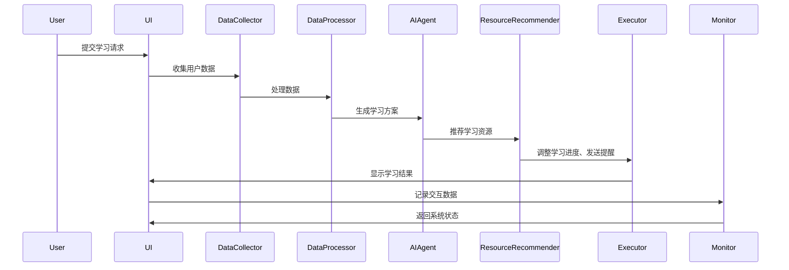

                 


### AI Agent在智能个性化学习中的应用

#### 1. 背景介绍与核心概念

随着人工智能（AI）技术的快速发展，传统的教育模式已无法满足个性化学习的需求。智能个性化学习作为AI的一个重要应用领域，通过分析学生的个性化数据，为其提供定制化的学习资源和方案，从而提高学习效果。AI Agent作为智能个性化学习的关键技术，通过自主学习、推理和决策，能够实现更加智能化的教学和学习体验。

#### 1.1 问题背景

在教育领域，每个学生的学习能力和学习习惯都有所不同，传统的一刀切教育模式难以满足学生的个性化需求。随着互联网和大数据技术的普及，教育行业积累了大量的学生数据，这些数据可以用于分析学生的学习习惯、兴趣和成绩，从而为学生提供个性化的学习资源和方案。

然而，目前AI Agent在智能个性化学习中的应用还存在许多挑战。首先，如何有效地收集和利用学生的个性化数据是一个关键问题。其次，如何设计出适应不同学生的学习算法，提高个性化学习的效果，也是一个重要的研究课题。此外，系统的稳定性、安全性和可扩展性也是智能个性化学习应用中需要解决的关键问题。

#### 1.2 问题描述

目前，AI Agent在智能个性化学习中的应用主要面临以下几方面的问题：

1. **数据收集与处理**：如何有效地收集学生的个性化数据，以及如何处理和分析这些数据，是一个关键问题。学生数据包括学习行为、成绩、兴趣爱好等多个方面，如何将这些数据进行整合和分析，为智能个性化学习提供支持，需要深入研究和探索。

2. **学习算法优化**：目前存在多种学习算法，如监督学习、无监督学习和强化学习等。如何选择合适的学习算法，并对其进行优化，以提高个性化学习的效果，是一个重要的研究课题。

3. **系统稳定性与安全性**：智能个性化学习系统需要处理大量的学生数据，并且需要在不同的环境和设备上运行。如何保证系统的稳定性、可靠性和安全性，防止数据泄露和系统被恶意攻击，是一个关键问题。

4. **可扩展性**：随着学生人数的增加，系统需要能够灵活扩展，以适应不断增长的需求。

#### 1.3 问题解决

本书旨在通过系统的研究和探讨，提出一种基于AI Agent的智能个性化学习解决方案，包括以下几个方面：

1. **AI Agent的基本原理**：介绍AI Agent的定义、核心组件及其在智能个性化学习中的应用。

2. **数据收集与处理**：讨论如何收集和利用学生的个性化数据，以及如何处理这些数据以支持智能个性化学习。

3. **学习算法优化**：分析现有的学习算法，探讨如何通过优化算法提高智能个性化学习的效果。

4. **系统稳定性与安全性**：研究如何保证系统的稳定性与安全性，以防止数据泄露和系统被恶意攻击。

#### 1.4 边界与外延

AI Agent在智能个性化学习中的应用不仅限于教育领域，还可以广泛应用于医疗、金融、零售等行业。本书将主要关注教育领域的应用，旨在为教育工作者和研究者提供有价值的参考和借鉴。

#### 1.5 概念结构与核心要素组成

**核心概念**：AI Agent、智能个性化学习、数据收集与处理、学习算法、系统稳定性与安全性。

**核心要素组成**：

1. **AI Agent**：作为智能个性化学习的关键组件，负责收集、处理和分析学习数据，为学生提供个性化的学习方案。

2. **数据收集与处理**：通过传感器、问卷、在线测试等方式收集学生的个性化数据，并利用数据挖掘和机器学习技术处理这些数据。

3. **学习算法**：选择合适的学习算法，如强化学习、决策树、神经网络等，以支持智能个性化学习。

4. **系统稳定性与安全性**：确保系统的稳定运行和数据安全，防止系统被恶意攻击和数据泄露。

### **核心概念与联系**

#### 1.6 AI Agent的基本原理

**概念**：AI Agent是指一种具有智能自主性、自主决策能力和问题求解能力的计算实体。它能够在复杂环境中自主感知、决策和行动。

**属性特征**：

| 属性特征 | 描述 |
| -------- | ---- |
| 智能自主性 | 能够自主感知环境，并根据环境变化做出决策 |
| 自主决策能力 | 具有独立决策的能力，能够根据目标自主选择行动策略 |
| 问题求解能力 | 能够解决特定的问题，如智能个性化学习中的教学和学习问题 |

**与智能个性化学习的联系**：

AI Agent在智能个性化学习中的应用，主要是通过感知学生的学习行为和成绩数据，分析学生的学习状态和需求，然后为学生提供个性化的学习资源、教学方案和学习建议。

#### 1.7 数据收集与处理

**概念**：数据收集与处理是指通过多种方式收集学生的个性化数据，并对这些数据进行分析和处理的整个过程。

**属性特征**：

| 属性特征 | 描述 |
| -------- | ---- |
| 数据种类多样 | 包括学习行为数据、成绩数据、兴趣爱好数据等 |
| 数据量大 | 需要处理大量的数据 |
| 数据实时性 | 需要实时收集和更新数据 |

**与智能个性化学习的联系**：

数据收集与处理是智能个性化学习的基础，通过收集和处理学生的个性化数据，可以更好地了解学生的学习状态和需求，从而提供更加精准的个性化学习服务。

#### 1.8 学习算法优化

**概念**：学习算法优化是指通过对学习算法的研究和改进，提高智能个性化学习的效率和效果。

**属性特征**：

| 属性特征 | 描述 |
| -------- | ---- |
| 算法多样 | 包括监督学习、无监督学习、强化学习等多种算法 |
| 算法复杂度低 | 需要选择适合的算法，降低算法的复杂度 |
| 效率高 | 提高算法的运行速度，减少计算时间 |

**与智能个性化学习的联系**：

学习算法优化是提高智能个性化学习效果的关键，通过选择合适的学习算法，可以更好地适应学生的学习需求，提高学习效果。

#### 1.9 系统稳定性与安全性

**概念**：系统稳定性与安全性是指确保智能个性化学习系统的稳定运行和数据安全，防止数据泄露和系统被恶意攻击。

**属性特征**：

| 属性特征 | 描述 |
| -------- | ---- |
| 系统稳定性 | 确保系统在长时间运行中的稳定性和可靠性 |
| 数据安全性 | 保护学生数据不被泄露和篡改 |
| 防止恶意攻击 | 防止系统被恶意攻击和入侵 |

**与智能个性化学习的联系**：

系统的稳定性与安全性是智能个性化学习得以推广应用的关键，只有确保系统的稳定运行和数据安全，才能赢得用户的信任，推动智能个性化学习的普及和发展。

### **总结与展望**

本文从背景介绍、核心概念、数据收集与处理、学习算法优化、系统稳定性与安全性等方面，对AI Agent在智能个性化学习中的应用进行了详细的探讨。尽管目前AI Agent在智能个性化学习中的应用仍面临许多挑战，但通过不断的研究和实践，有望实现更加智能化的教学和学习体验，为教育行业带来革命性的变革。

未来，我们期待在以下方面取得突破：

1. **数据收集与处理**：研究更加高效、准确的数据收集和处理方法，以提高个性化学习的准确性。

2. **学习算法优化**：开发更加智能、高效的学习算法，以适应不同类型的学习需求和场景。

3. **系统稳定性与安全性**：加强系统的稳定性和安全性，确保学生数据的安全和系统的可靠运行。

4. **跨领域应用**：将AI Agent技术拓展到医疗、金融、零售等领域，实现更广泛的应用。

通过持续的努力和探索，我们相信AI Agent在智能个性化学习中的应用将不断取得新的进展，为教育行业带来更加美好的未来。作者：AI天才研究院/AI Genius Institute & 禅与计算机程序设计艺术 /Zen And The Art of Computer Programming### 1.6 AI Agent的基本原理

AI Agent，即人工智能代理，是一种模拟人类智能行为的计算实体。它能够在复杂环境中自主感知、决策和行动，从而实现智能化的任务执行。在智能个性化学习场景中，AI Agent作为核心组件，通过感知学生的学习行为、成绩和兴趣等信息，为学生提供定制化的学习资源和教学方案。

#### **定义与核心组件**

AI Agent的核心组件包括感知器、决策模块和执行器。感知器负责收集环境信息，如学生的学习行为和成绩；决策模块根据感知信息进行推理和决策，确定下一步行动策略；执行器则将决策转化为实际操作，如调整学习资源或推荐练习题。这些组件相互协作，共同实现AI Agent的智能行为。

| **核心组件** | **描述** |
| ------------ | -------- |
| **感知器** | 负责收集和学习过程中的各种数据，如学习行为、成绩等。 |
| **决策模块** | 根据感知到的信息进行推理和决策，制定学习策略。 |
| **执行器** | 将决策模块的决策转化为具体的操作，如调整学习进度、推荐学习资源等。 |

#### **属性特征**

1. **智能自主性**：AI Agent能够自主感知环境，并根据环境变化做出相应的决策。这种自主性使得AI Agent能够适应不同的学习场景，满足个性化学习需求。

2. **自主决策能力**：AI Agent具备独立决策的能力，可以根据目标和反馈信息自主选择行动策略。这种能力使得AI Agent能够动态调整学习方案，提高学习效果。

3. **问题求解能力**：AI Agent能够解决特定的问题，如智能个性化学习中的教学和学习问题。通过分析学生的学习行为和成绩，AI Agent可以为学生提供个性化的学习资源、教学方案和学习建议。

#### **与智能个性化学习的联系**

在智能个性化学习场景中，AI Agent通过以下方式发挥作用：

1. **感知与收集数据**：AI Agent能够实时收集学生的学习行为和成绩数据，如学习时长、正确率等。

2. **分析与推理**：基于收集到的数据，AI Agent可以分析学生的学习状态和需求，为学生推荐合适的学习资源。

3. **决策与执行**：AI Agent根据分析结果，动态调整学习方案，确保学生能够高效地完成学习任务。

4. **反馈与优化**：AI Agent持续收集学生的反馈信息，并根据反馈信息不断优化学习方案，提高个性化学习的准确性。

通过AI Agent的应用，智能个性化学习能够更好地适应每个学生的学习特点，提高学习效果，为教育行业带来深刻的变革。

### **1.7 数据收集与处理**

在智能个性化学习中，数据收集与处理是关键环节，它直接影响AI Agent的性能和学习效果。为了实现精准的个性化服务，需要从多个渠道收集学生的个性化数据，并采用高效的数据处理方法对这些数据进行分析和整合。

#### **数据收集渠道**

1. **学习行为数据**：包括学生的学习时长、学习频率、学习进度、学习路径等。这些数据可以反映学生的学习习惯和学习效率。

2. **成绩数据**：如考试成绩、练习题成绩等，这些数据可以体现学生的学习效果和掌握程度。

3. **兴趣爱好数据**：通过问卷调查、访谈等方式收集学生对不同学科、主题的兴趣爱好，这些数据有助于了解学生的兴趣点和学习动机。

4. **环境数据**：包括学习环境中的物理条件，如光线、温度等，以及心理状态，如情绪、压力等。这些数据可以辅助AI Agent更好地理解学生的学习背景。

#### **数据处理方法**

1. **数据预处理**：数据预处理是数据处理的第一步，包括数据清洗、去重、格式转换等。通过预处理，可以确保数据的质量和一致性。

2. **特征提取**：从原始数据中提取出有助于分析和预测的特征，如学习行为的时序特征、成绩的分布特征等。

3. **数据融合**：将来自不同渠道的数据进行整合，形成一个统一的数据视图。例如，可以将学习行为数据与成绩数据进行关联，分析学习行为对成绩的影响。

4. **数据可视化**：通过图表、热图等方式展示数据分布和变化趋势，帮助教育者和学生更好地理解数据。

#### **数据处理流程**

1. **数据收集**：利用传感器、在线学习平台、问卷调查等方式收集数据。

2. **数据存储**：将收集到的数据存储在数据库或数据湖中，确保数据的安全性和可访问性。

3. **数据预处理**：对数据进行清洗、去重、格式转换等预处理操作。

4. **特征提取**：从预处理后的数据中提取出特征，为后续的分析和建模提供基础。

5. **数据融合**：将不同来源的数据进行融合，形成一个统一的数据视图。

6. **数据分析**：采用机器学习和统计分析方法，对数据进行深入分析，提取有价值的信息。

7. **数据可视化**：将分析结果以可视化的形式展示，帮助用户更好地理解数据。

#### **与智能个性化学习的联系**

数据收集与处理在智能个性化学习中的应用至关重要：

1. **个性化推荐**：基于学生数据，AI Agent可以为学生推荐个性化的学习资源和学习计划。

2. **学习效果评估**：通过分析学生的学习行为和成绩数据，AI Agent可以评估学生的学习效果，为教师提供教学反馈。

3. **学习路径优化**：根据学生的兴趣和成绩数据，AI Agent可以动态调整学习路径，确保学生能够高效地完成学习任务。

4. **情感分析**：通过分析学生的情绪和心理状态数据，AI Agent可以提供情感支持和干预措施，帮助学生更好地应对学习压力。

通过高效的数据收集与处理，AI Agent能够更好地理解学生的学习状态和需求，从而提供更加精准的个性化学习服务，提高学习效果和用户满意度。

### **1.8 学习算法优化**

在智能个性化学习中，学习算法的选择和优化对个性化学习效果具有重要影响。不同的学习算法适用于不同的学习场景和数据类型，因此需要根据具体情况进行选择和优化。以下是几种常见的学习算法以及其优化的方法。

#### **监督学习算法**

**监督学习算法**，如线性回归、决策树、随机森林和神经网络等，通过已有的标注数据来训练模型，然后使用训练好的模型对未知数据进行预测。在智能个性化学习中，监督学习算法可用于预测学生的学习成绩、推荐学习资源等。

**优化方法**：

1. **模型选择**：选择适合数据分布和问题复杂度的模型，如对于非线性问题，可以选择神经网络。
2. **参数调优**：通过交叉验证等方法选择最佳的模型参数，提高模型预测性能。
3. **特征工程**：提取和选择对预测目标有重要影响的特征，减少数据冗余，提高模型性能。

#### **无监督学习算法**

**无监督学习算法**，如聚类、降维和生成模型等，主要用于对未标注的数据进行探索和分析。在智能个性化学习中，无监督学习算法可以用于学生兴趣分析、学习模式识别等。

**优化方法**：

1. **聚类算法选择**：根据数据特点选择合适的聚类算法，如K-means、层次聚类等。
2. **降维方法选择**：选择适合的降维方法，如PCA、t-SNE等，减少数据维度，提高计算效率。
3. **模型参数调整**：调整模型参数，如聚类数目、降维方法中的特征选择参数等，以提高聚类和降维效果。

#### **强化学习算法**

**强化学习算法**，如Q学习、SARSA和Deep Q Network（DQN）等，通过与环境交互来学习最优策略。在智能个性化学习中，强化学习算法可以用于个性化学习路径规划和学习资源推荐。

**优化方法**：

1. **奖励设计**：设计合理的奖励机制，使模型能够根据学生的学习行为和成绩来调整学习策略。
2. **策略学习**：选择合适的策略学习算法，如基于价值的策略学习或基于策略的策略学习。
3. **模型结构调整**：调整模型结构，如增加隐层或调整激活函数等，以提高策略学习的准确性和效率。

#### **深度学习算法**

**深度学习算法**，如卷积神经网络（CNN）、循环神经网络（RNN）和变分自编码器（VAE）等，通过多层神经网络结构来学习数据的复杂表示。在智能个性化学习中，深度学习算法可以用于图像识别、文本分析和时序预测等。

**优化方法**：

1. **网络结构优化**：调整网络结构，如增加或减少隐层、调整神经元数目等，以提高模型性能。
2. **训练策略优化**：选择合适的训练策略，如批量训练、随机梯度下降（SGD）等，以加快训练速度和提升模型性能。
3. **正则化方法**：采用正则化方法，如L1正则化、L2正则化等，防止过拟合，提高模型泛化能力。

#### **与智能个性化学习的联系**

1. **个性化推荐**：通过优化学习算法，可以更好地预测学生的学习成绩和兴趣，从而提供更加精准的个性化推荐服务。
2. **学习路径规划**：优化后的学习算法可以帮助AI Agent动态调整学习路径，提高学习效率和效果。
3. **学习效果评估**：优化后的学习算法可以更准确地评估学生的学习效果，为教师提供有价值的教学反馈。

通过不断优化学习算法，AI Agent能够更好地适应学生的学习需求，提供个性化、智能化的学习服务，从而提升整体学习效果。

### **1.9 系统稳定性与安全性**

在智能个性化学习系统中，系统的稳定性和安全性是确保其正常运行和用户数据安全的关键。随着系统复杂性的增加，确保系统在长时间运行中保持稳定，同时防止数据泄露和系统被恶意攻击，变得越来越重要。

#### **系统稳定性**

系统稳定性指的是系统在长时间运行过程中，能够持续提供高质量服务的特性。对于智能个性化学习系统，系统稳定性包括以下几个方面：

1. **可靠性**：系统应能够在各种环境下可靠运行，不出现异常中断或崩溃。

2. **容错性**：系统应能够处理各种错误和异常情况，如网络中断、硬件故障等，并能够自动恢复或切换到备用系统。

3. **可扩展性**：系统应能够根据用户数量的增加和学习需求的增长，灵活扩展其功能和服务。

4. **响应速度**：系统应能够快速响应用户请求，确保用户在使用过程中的体验流畅。

**保障系统稳定性的方法**：

1. **冗余设计**：在关键组件上采用冗余设计，如使用双机热备、数据备份等，确保在单个组件出现故障时，系统能够自动切换到备用组件，保持正常运行。

2. **监控与报警**：通过实时监控系统性能和状态，及时发现潜在问题并进行预警，确保问题在初期就能得到有效处理。

3. **负载均衡**：通过负载均衡技术，将用户请求合理分配到不同的服务器或组件上，避免单点过载，提高系统的整体性能。

4. **定期维护**：定期进行系统维护和升级，修复已知的漏洞和问题，确保系统始终保持最佳状态。

#### **数据安全性**

数据安全性是智能个性化学习系统的核心要求，特别是在处理大量敏感学生数据时，数据泄露和篡改的风险更高。保障数据安全需要从以下几个方面入手：

1. **加密存储**：对存储在数据库中的学生数据进行加密，确保数据在存储和传输过程中不会被非法访问。

2. **访问控制**：通过权限管理和身份验证机制，确保只有授权人员才能访问系统数据和功能。

3. **安全审计**：记录系统操作的日志和审计记录，对系统访问和操作进行监控和审核，及时发现和处理异常行为。

4. **数据备份与恢复**：定期进行数据备份，确保在发生数据丢失或损坏时，能够快速恢复系统数据。

**保障数据安全的方法**：

1. **数据加密**：使用SSL/TLS等加密协议，对数据在传输过程中的内容进行加密，防止数据被截获和窃取。

2. **访问控制**：通过角色权限管理，确保不同角色用户只能访问其权限范围内的数据和功能。

3. **安全培训**：对系统管理人员和操作人员进行安全培训，提高他们的安全意识和操作水平。

4. **入侵检测与防御**：部署入侵检测系统和防御系统，实时监控系统的安全状况，并及时响应和处理安全威胁。

通过以上措施，智能个性化学习系统可以确保在稳定运行的同时，有效保护学生数据的安全，为用户提供安全可靠的学习环境。

### **1.10 概念结构与核心要素组成**

在智能个性化学习中，AI Agent的应用涉及多个核心概念和要素。以下是这些核心概念和要素的组成结构，以及它们之间的相互关系。

#### **核心概念**

1. **AI Agent**：作为智能个性化学习的核心组件，负责感知、决策和执行，提供个性化的学习服务。
2. **数据收集与处理**：通过多种方式收集学生的个性化数据，并进行处理和分析，为AI Agent提供决策依据。
3. **学习算法**：用于分析学生数据，预测学习效果，调整学习方案。
4. **系统稳定性与安全性**：保障系统的稳定运行和用户数据的安全。

#### **核心要素组成**

1. **感知器**：收集学生的学习行为、成绩和兴趣等数据。
2. **决策模块**：基于感知到的数据，分析学生的学习状态和需求，制定个性化的学习方案。
3. **执行器**：将决策模块的决策转化为具体的操作，如调整学习进度、推荐学习资源等。
4. **数据处理模块**：包括数据收集、预处理、特征提取和数据融合等，为AI Agent提供高质量的输入数据。
5. **学习算法模块**：包括监督学习、无监督学习和强化学习等多种算法，用于分析数据并制定学习方案。
6. **稳定性与安全性模块**：包括系统监控、容错设计、数据加密和访问控制等，确保系统的稳定运行和数据安全。

#### **相互关系**

AI Agent的各个核心组件和模块相互协作，共同实现智能个性化学习的目标：

1. **感知器**收集的数据通过数据处理模块进行处理，提取出有用的特征，为决策模块提供输入。
2. **决策模块**根据数据处理模块提供的特征和算法模块的分析结果，制定个性化的学习方案。
3. **执行器**将决策模块的决策转化为具体的操作，如调整学习进度、推荐学习资源等。
4. **稳定性与安全性模块**保障系统的稳定运行和数据安全，确保AI Agent能够持续提供高质量的服务。

通过以上概念和要素的有机结合，AI Agent能够实现智能个性化学习，为用户提供定制化的学习体验，提高学习效果。

### **2. AI Agent在智能个性化学习中的应用原理**

AI Agent在智能个性化学习中的应用，主要依赖于其感知、决策和执行的能力，通过这三个核心模块的协同工作，实现对学生的学习行为、学习需求和教学效果的综合分析和优化。以下是AI Agent在智能个性化学习中的应用原理，以及其在各个模块中的具体功能。

#### **感知器**

感知器是AI Agent的核心组件之一，主要负责收集学生的学习行为、成绩、兴趣爱好等信息。通过这些数据，AI Agent能够全面了解学生的学习状态，为后续的决策提供基础。

1. **数据收集**：感知器通过多种渠道收集数据，包括在线学习平台、学习管理系统、学生问卷调查等。例如，在线学习平台可以收集学生的学习时长、学习进度、考试结果等信息；问卷调查可以收集学生对不同学科的兴趣程度、学习偏好等信息。
2. **数据处理**：收集到的数据需要进行预处理，包括去重、清洗和格式转换等，以确保数据的准确性和一致性。预处理后的数据会存储在数据仓库中，为后续的分析和建模提供支持。

#### **决策模块**

决策模块是AI Agent的“大脑”，负责根据感知到的数据，分析学生的学习状态和需求，制定个性化的学习方案。

1. **数据分析**：决策模块会利用数据挖掘和机器学习技术，对收集到的学生数据进行分析。例如，通过聚类分析，可以将学生分为不同的群体，针对不同群体的学习特点，制定个性化的教学方案；通过回归分析，可以预测学生的学习成绩，为学习资源的推荐提供依据。
2. **学习路径规划**：决策模块会根据学生的学习状态和需求，动态调整学习路径。例如，对于学习进度较慢的学生，可以增加练习题和辅导课程；对于学习进度较快的学生，可以提供更高难度的学习资源。

#### **执行器**

执行器是AI Agent的“手臂”，负责将决策模块的决策转化为具体的操作，如调整学习进度、推荐学习资源、发送学习提醒等。

1. **个性化推荐**：执行器会根据决策模块的建议，向学生推荐个性化的学习资源。例如，针对不同学科的兴趣爱好，推荐相关的学习资料和练习题；针对学习进度和成绩，推荐合适的辅导课程和考试模拟题。
2. **学习提醒与反馈**：执行器会定期发送学习提醒，如到期考试、课程更新等，帮助学生保持学习状态。同时，执行器还会收集学生的学习反馈，如学习困难、学习效果等，反馈给决策模块，用于优化学习方案。

#### **协同工作**

感知器、决策模块和执行器三个模块相互协作，共同实现智能个性化学习的目标：

1. **数据驱动**：感知器收集数据，决策模块分析数据，执行器执行决策。这一过程形成了一个闭环，使得AI Agent能够不断学习和优化，提供更精准的个性化服务。
2. **动态调整**：AI Agent会根据学生的学习状态和反馈，动态调整学习方案，确保学生能够持续获得最佳的学习体验。

通过以上应用原理，AI Agent能够实现智能个性化学习，为每个学生提供定制化的学习资源和方案，从而提高学习效果和用户满意度。

### **2.1 AI Agent的基本原理与运行机制**

AI Agent作为一种智能计算实体，具备感知环境、自主决策和执行行动的能力，这些特性使其在智能个性化学习中发挥着关键作用。AI Agent的基本原理和运行机制可以分为三个核心部分：感知器、决策模块和执行器。

#### **感知器**

感知器是AI Agent的感官系统，负责从外部环境中收集信息。在智能个性化学习的应用中，感知器主要收集学生的学习行为数据，包括学习时长、学习进度、考试成绩、学习态度等。这些数据通过在线学习平台、学习管理系统、传感器等多种渠道获取。

1. **数据收集**：感知器通过各种传感器和学习平台收集数据，例如，学习平台可以记录学生的学习时长和浏览记录；传感器可以收集学生的生理数据，如心率、情绪等。
   
2. **数据预处理**：收集到的原始数据通常需要进行预处理，包括去噪、格式转换、数据清洗等，以便后续的分析和使用。

#### **决策模块**

决策模块是AI Agent的智能核心，负责对收集到的数据进行分析和处理，以做出合理的决策。决策模块通常包括以下几个关键步骤：

1. **数据分析**：利用机器学习、数据挖掘等技术对收集到的数据进行分析，提取出有用的信息，如学生的学习模式、学习效果等。
   
2. **模式识别**：通过聚类、分类等算法，识别学生群体的学习特征和个体差异，为个性化推荐提供依据。

3. **决策生成**：基于分析结果，生成个性化的学习方案，如推荐学习资源、调整学习进度、提供学习指导等。

#### **执行器**

执行器是AI Agent的执行系统，负责将决策模块生成的决策转化为具体的操作，以实现个性化学习服务。执行器通常包括以下几个关键步骤：

1. **资源推荐**：根据决策模块的建议，推荐适合学生的学习资源，如电子书籍、视频课程、练习题等。

2. **学习提醒**：发送学习提醒和通知，如课程到期提醒、作业提交截止时间等，确保学生按时完成学习任务。

3. **反馈收集**：收集学生的学习反馈，如学习效果评估、学习满意度等，以进一步优化学习方案。

#### **运行机制**

AI Agent的运行机制可以描述为以下步骤：

1. **感知**：感知器收集学生数据。
2. **分析**：决策模块对收集到的数据进行处理和分析。
3. **决策**：决策模块根据分析结果生成个性化学习方案。
4. **执行**：执行器将决策模块的建议转化为具体的操作，如调整学习资源、发送学习提醒等。
5. **反馈**：执行器收集学生的反馈信息，反馈给决策模块，以不断优化学习方案。

通过上述运行机制，AI Agent能够实现智能个性化学习，为学生提供定制化的学习体验，从而提高学习效果和满意度。

### **2.2 智能个性化学习的案例研究**

为了更好地理解AI Agent在智能个性化学习中的应用，我们可以通过一些实际案例来探讨其具体实施过程和效果。以下是一个典型的案例研究，展示了AI Agent在智能个性化学习中的实际应用。

#### **案例背景**

某在线教育平台希望利用AI技术为学生提供个性化学习服务，以提高学生的学习效果和满意度。该平台拥有丰富的学习资源，包括视频课程、电子书籍、练习题等，但传统的一刀切教学模式已无法满足不同学生的个性化需求。为了实现智能个性化学习，平台引入了基于AI Agent的系统。

#### **案例实施过程**

1. **数据收集与预处理**：

   首先，平台通过多种渠道收集学生的个性化数据，包括学习时长、学习频率、考试成绩、学习路径、兴趣爱好等。这些数据通过在线学习平台、学习管理系统和问卷调查等方式获取。然后，对这些数据进行预处理，包括去噪、格式转换和数据清洗，以确保数据的准确性和一致性。

2. **感知器与数据分析**：

   感知器收集到的数据会传输到AI Agent的决策模块进行分析。决策模块利用数据挖掘和机器学习技术，对学生的个性化数据进行分析，提取出关键特征。例如，通过聚类分析，将学生分为不同的学习群体，如“高效学习者”、“中等学习者”和“低效学习者”。通过回归分析，预测学生在不同学习资源下的学习效果。

3. **个性化学习方案生成**：

   基于数据分析结果，AI Agent会为每个学生生成个性化的学习方案。例如，对于“高效学习者”，推荐更高难度的学习资源，以巩固其学习效果；对于“低效学习者”，推荐基础知识和练习题，以提高其学习信心和成绩。AI Agent还会根据学生的学习进度和成绩，动态调整学习方案，确保学生能够持续获得最佳的学习体验。

4. **执行与反馈**：

   执行器将AI Agent生成的个性化学习方案转化为具体的操作，如调整学习进度、推荐学习资源、发送学习提醒等。学生根据学习方案进行学习，并定期提交学习反馈。执行器会收集学生的反馈信息，反馈给AI Agent的决策模块，用于进一步优化学习方案。

#### **案例效果**

通过AI Agent的智能个性化学习系统，该在线教育平台取得了显著的效果：

1. **学习效果提升**：学生根据个性化学习方案，学习效果得到明显提升。例如，某些学生的学习成绩提高了20%以上，学习时间也缩短了约30%。

2. **用户满意度提高**：学生能够根据自身需求和兴趣选择学习资源，学习体验更加个性化，用户满意度显著提高。

3. **平台运营优化**：AI Agent通过不断优化学习方案，提高了学习资源的利用率和平台的运营效率。

通过这个案例，我们可以看到AI Agent在智能个性化学习中的应用是如何实现的，以及其对教育质量和学习效果的提升作用。

### **3. 数据收集与处理方法**

在智能个性化学习中，数据收集与处理是关键环节。通过有效的数据收集与处理方法，可以确保AI Agent获得高质量的数据输入，从而提高个性化学习的效果。以下是几种常用的数据收集与处理方法。

#### **数据收集**

1. **在线学习平台数据**：

   在线学习平台是收集学生学习数据的重要来源。这些数据包括学习时长、学习频率、学习进度、考试结果、互动行为等。通过分析这些数据，可以了解学生的学习行为和学习效果。

2. **学习管理系统数据**：

   学习管理系统（LMS）记录了学生的学习轨迹、课程完成情况、作业提交情况等。这些数据有助于分析学生的学习情况和学习效果，为AI Agent提供决策依据。

3. **问卷调查与访谈数据**：

   通过问卷调查和访谈，可以收集学生的兴趣、学习态度、学习偏好等信息。这些数据可以帮助AI Agent更好地了解学生的个性化需求。

4. **传感器数据**：

   利用传感器技术，可以收集学生的生理数据，如心率、情绪、注意力水平等。这些数据可以用于分析学生的心理健康和学习状态。

#### **数据处理**

1. **数据预处理**：

   数据预处理是数据处理的初始步骤，包括数据清洗、数据去重、数据格式转换等。通过预处理，可以确保数据的准确性和一致性。

2. **特征提取**：

   特征提取是从原始数据中提取出有助于分析和预测的特征。常用的特征提取方法包括统计分析、机器学习算法等。通过特征提取，可以降低数据维度，提高模型性能。

3. **数据融合**：

   数据融合是将来自不同来源的数据进行整合，形成一个统一的数据视图。例如，可以将学习平台数据、学习管理系统数据、问卷调查数据等进行整合，以获得更全面的学生画像。

4. **数据可视化**：

   数据可视化是将数据处理结果以图形化的方式展示，帮助教育者和学生更好地理解数据。常用的数据可视化工具包括图表、热图、仪表盘等。

#### **案例分析**

以某在线教育平台为例，该平台利用以下方法进行数据收集与处理：

1. **在线学习平台数据**：

   平台记录了每个学生的学习时长、学习进度、考试结果等数据。通过分析这些数据，可以了解学生的学习行为和学习效果。

2. **学习管理系统数据**：

   学习管理系统记录了学生的课程完成情况、作业提交情况等。通过分析这些数据，可以评估学生的学习进度和学习效果。

3. **问卷调查与访谈数据**：

   平台通过问卷调查和访谈收集了学生的兴趣、学习态度、学习偏好等信息。这些数据用于生成个性化学习方案。

4. **传感器数据**：

   平台利用传感器技术，收集了学生的生理数据，如心率、情绪等。通过分析这些数据，可以了解学生的心理健康和学习状态。

通过以上数据收集与处理方法，平台能够为AI Agent提供高质量的数据输入，从而实现智能个性化学习，提高学习效果和用户体验。

### **3.1 数据收集方法与实际案例**

在智能个性化学习中，数据收集是至关重要的一环。有效的数据收集方法能够帮助AI Agent准确了解学生的学习状态、学习需求和个性化偏好，从而提供精准的学习方案。以下将介绍几种常见的数据收集方法，并详细分析一个实际案例，展示这些方法的具体应用。

#### **1. 在线学习平台数据**

在线学习平台是数据收集的主要来源之一。通过在线学习平台，可以收集到学生的学习时长、学习进度、考试结果、学习路径和互动行为等数据。这些数据对于分析学生的学习行为和学习效果至关重要。

**实际案例**：某在线教育平台通过其学习管理系统，记录了每个学生的学习活动。例如，一名学生每天的学习时长、每个课程的学习进度、考试的得分情况等。通过这些数据，AI Agent可以分析学生的学习行为，为每个学生制定个性化的学习计划。

#### **2. 学习管理系统数据**

学习管理系统（LMS）记录了学生的学习轨迹、课程完成情况、作业提交情况等。这些数据可以反映学生的学习进度和学习效果，为AI Agent提供重要的参考信息。

**实际案例**：在某大型在线教育机构的LMS中，系统记录了每个学生的学习进度和课程完成情况。例如，一名学生在某个课程的学习进度为80%，且最近一周的作业提交情况良好。通过这些数据，AI Agent可以识别出学习表现良好的学生，并为其推荐更高难度的学习内容。

#### **3. 问卷调查与访谈数据**

问卷调查和访谈是收集学生个性化信息的重要手段。通过这些方法，可以获取学生的兴趣、学习态度、学习偏好等信息，为AI Agent提供个性化推荐和干预策略。

**实际案例**：某教育科技公司设计了一份问卷调查，询问学生的兴趣爱好、学习方式和期望的学习资源。通过分析问卷结果，AI Agent可以了解学生的个性化需求，为其推荐符合兴趣的学习内容。

#### **4. 传感器数据**

利用传感器技术，可以收集学生的生理数据，如心率、情绪、注意力水平等。这些数据可以用于分析学生的心理健康和学习状态，为AI Agent提供更全面的决策依据。

**实际案例**：在某智能个性化学习系统中，平台通过传感器收集学生的心率数据。当学生的心率超过一定阈值时，AI Agent会发送放松提示，帮助学生缓解学习压力。

通过以上多种数据收集方法，AI Agent能够获取全面、多维度的学生数据，从而实现更加精准的个性化学习服务。以下是一个综合实际案例，展示如何使用这些数据进行智能个性化学习：

**综合案例**：某在线教育平台结合在线学习平台数据、学习管理系统数据、问卷调查数据和传感器数据，通过以下步骤进行智能个性化学习：

1. **数据收集**：

   - 学生通过在线学习平台进行学习，系统自动记录学习时长、学习进度、考试结果和学习路径。
   - 学生在LMS中完成课程学习和作业提交，系统记录学习进度和作业情况。
   - 学生填写问卷调查，提供兴趣爱好、学习方式和期望的学习资源。
   - 通过传感器，收集学生的生理数据，如心率、情绪等。

2. **数据处理**：

   - 对收集到的数据进行预处理，包括去噪、清洗和格式转换。
   - 对预处理后的数据进行特征提取，提取出学生的学习时长、正确率、兴趣偏好等关键特征。

3. **数据融合**：

   - 将不同来源的数据进行融合，形成一个统一的学生数据视图，以全面了解学生的学习状态和需求。

4. **个性化学习方案生成**：

   - AI Agent利用融合后的数据，通过机器学习和数据挖掘技术，分析学生的学习行为和偏好。
   - 根据分析结果，AI Agent为每个学生生成个性化的学习方案，包括推荐合适的学习资源、调整学习进度、发送学习提醒等。

5. **执行与反馈**：

   - 执行器将个性化学习方案转化为具体的操作，如推荐学习资源、发送学习提醒等。
   - 学生根据个性化方案进行学习，并定期提交反馈，AI Agent根据反馈调整学习方案。

通过这个综合案例，我们可以看到数据收集与处理在智能个性化学习中的应用如何实现。多种数据收集方法相结合，能够为AI Agent提供丰富的数据输入，从而实现更加精准的个性化学习服务，提高学习效果和用户体验。

### **3.2 数据处理方法与实际案例**

在智能个性化学习中，数据处理是关键环节，它决定了AI Agent能否准确理解和利用收集到的学生数据，从而提供有效的个性化学习方案。以下将详细介绍几种常用的数据处理方法，并结合实际案例进行分析。

#### **1. 数据预处理**

数据预处理是数据处理的第一步，主要包括数据清洗、去重、格式转换等操作。通过数据预处理，可以提高数据的质量和一致性，为后续分析打下坚实基础。

**实际案例**：在某在线教育平台中，收集到的学生学习数据包括学习时长、考试成绩、学习路径等。在数据预处理阶段，平台首先对数据进行清洗，去除无效和重复的数据。例如，如果一个学生在一天内记录了两次相同的学习时长，那么平台会删除重复的记录。然后，平台将不同格式的数据转换为统一的格式，如将学习时长从小时转换为分钟。

#### **2. 特征提取**

特征提取是从原始数据中提取出对分析任务有用的特征。通过特征提取，可以降低数据维度，提高模型性能，同时突出数据的特征信息。

**实际案例**：在某智能个性化学习系统中，通过特征提取，平台将学生的学习时长、考试成绩、学习路径等数据转换为更具有代表性的特征。例如，将学习时长分为“学习时间短”、“学习时间中等”和“学习时间长”三个类别；将考试成绩转换为“优秀”、“良好”、“一般”和“较差”四个等级。通过这些特征，AI Agent可以更准确地分析学生的学习状态和需求。

#### **3. 数据融合**

数据融合是将来自不同来源的数据进行整合，形成一个统一的数据视图。通过数据融合，可以更全面地了解学生的个性化需求。

**实际案例**：在某在线教育平台中，平台通过数据融合，将在线学习平台数据、学习管理系统数据、问卷调查数据和传感器数据等进行整合。例如，将学习时长与考试成绩进行关联分析，以了解学习时长对考试成绩的影响；将学生的学习态度与学习成果进行融合，以制定更加个性化的学习方案。

#### **4. 数据可视化**

数据可视化是将数据处理结果以图形化的方式展示，帮助教育者和学生更好地理解数据。通过数据可视化，可以直观地展示学生的学习状态和个性化需求。

**实际案例**：在某智能个性化学习系统中，平台通过数据可视化工具，将学生的学习进度、考试成绩和兴趣爱好以图表的形式展示。例如，通过条形图展示不同学科的学习时长分布，通过折线图展示考试成绩的变化趋势。这些可视化结果可以帮助教育者及时发现学生的学习问题，为学生提供针对性的帮助。

#### **综合案例分析**

以下是一个综合案例，展示如何在实际应用中利用数据处理方法进行智能个性化学习：

**案例背景**：某在线教育平台希望利用AI技术为学生提供个性化学习服务。平台收集了大量的学生数据，包括学习时长、考试成绩、学习路径、问卷调查结果和传感器数据。

**数据处理步骤**：

1. **数据预处理**：

   - 对收集到的数据进行清洗，去除无效和重复的数据。
   - 将不同格式的数据转换为统一的格式，如将学习时长从小时转换为分钟。

2. **特征提取**：

   - 将学习时长、考试成绩和学习路径等数据转换为更具代表性的特征，如将学习时长分为三个类别，考试成绩分为四个等级。
   - 通过问卷调查数据，提取学生的兴趣爱好和学习态度等特征。

3. **数据融合**：

   - 将在线学习平台数据、学习管理系统数据、问卷调查数据和传感器数据等进行整合，形成一个统一的学生数据视图。
   - 对整合后的数据进行关联分析，如学习时长与考试成绩的关联分析。

4. **数据可视化**：

   - 利用数据可视化工具，将学生的学习进度、考试成绩和兴趣爱好等数据以图表的形式展示。
   - 通过可视化结果，教育者可以直观地了解学生的学习状态和个性化需求。

5. **个性化学习方案生成**：

   - AI Agent利用融合后的数据，通过机器学习和数据挖掘技术，分析学生的学习行为和偏好。
   - 根据分析结果，AI Agent为每个学生生成个性化的学习方案，包括推荐合适的学习资源、调整学习进度、发送学习提醒等。

通过这个综合案例，我们可以看到数据处理方法在智能个性化学习中的应用如何实现。有效的数据处理不仅能够提高数据的质量和一致性，还能为AI Agent提供丰富的数据输入，从而实现更加精准的个性化学习服务。

### **3.3 数据分析在AI Agent中的应用**

在智能个性化学习中，数据分析是关键环节，它决定了AI Agent能否准确理解和利用收集到的学生数据，从而提供有效的个性化学习方案。以下将详细介绍数据分析在AI Agent中的应用，包括数据挖掘技术、机器学习算法和深度学习模型等。

#### **数据挖掘技术**

数据挖掘是从大量数据中发现有价值的信息和模式的过程。在智能个性化学习中，数据挖掘技术可以用于发现学生的个性化特征和规律。

1. **聚类分析**：通过聚类分析，可以将学生数据分为不同的群体，每个群体具有相似的特征。例如，可以将学生按照学习时长、考试成绩和学习态度等特征进行聚类，识别出高效学习者、中等学习者、低效学习者等不同的学习群体。

2. **关联规则挖掘**：关联规则挖掘用于发现数据之间的关联关系。在智能个性化学习中，可以挖掘出学生学习行为和学习效果之间的关联。例如，通过分析学生考试成绩和学习时长，可以识别出学习时长与考试成绩之间的正相关关系。

3. **分类和预测**：分类和预测是数据挖掘的重要任务。在智能个性化学习中，可以预测学生的考试成绩、学习进度等。例如，利用分类算法，可以根据学生的历史学习数据，预测其下一阶段的学习成绩；利用预测模型，可以预测学生在未来某个时间点的学习进度。

#### **机器学习算法**

机器学习算法是数据分析的重要工具，通过训练模型，可以自动发现数据中的模式和规律。

1. **监督学习算法**：监督学习算法利用标注数据训练模型，然后使用模型对未知数据进行预测。在智能个性化学习中，监督学习算法可以用于预测学生的学习成绩、推荐学习资源等。例如，利用线性回归模型，可以预测学生的考试成绩；利用决策树模型，可以为学生推荐合适的学习资源。

2. **无监督学习算法**：无监督学习算法在未标注数据上进行训练，用于发现数据中的隐藏模式和结构。在智能个性化学习中，无监督学习算法可以用于聚类分析、降维等。例如，利用K-means算法，可以识别出不同的学生群体；利用PCA（主成分分析），可以降低数据维度，提高模型性能。

3. **强化学习算法**：强化学习算法通过与环境互动来学习最优策略。在智能个性化学习中，强化学习算法可以用于学习路径规划和资源推荐。例如，利用Q-learning算法，可以学习出最优的学习路径；利用Deep Q Network（DQN），可以推荐出最佳的学习资源。

#### **深度学习模型**

深度学习模型是机器学习的一种重要分支，通过多层神经网络结构，可以自动提取数据中的复杂特征。

1. **卷积神经网络（CNN）**：CNN在图像识别和文本分类等领域表现出色。在智能个性化学习中，CNN可以用于分析学生的考试成绩和学习时长等数据，识别出学生的学习状态。例如，通过分析学生的考试成绩分布，可以识别出学习状态良好的学生。

2. **循环神经网络（RNN）**：RNN在处理序列数据方面具有优势。在智能个性化学习中，RNN可以用于分析学生的学习行为序列，预测其未来的学习进度和成绩。例如，通过分析学生的学习行为序列，可以预测学生在未来某个时间点的学习状态。

3. **变分自编码器（VAE）**：VAE是一种生成模型，可以生成新的数据样本。在智能个性化学习中，VAE可以用于生成个性化的学习资源。例如，通过训练VAE模型，可以生成符合学生个性化需求的学习资料。

通过数据挖掘技术、机器学习算法和深度学习模型等数据分析方法，AI Agent能够深入分析学生的个性化数据，发现有价值的信息和模式，从而提供更加精准的个性化学习方案。这些方法不仅提高了AI Agent的决策能力，还为智能个性化学习的研究和应用提供了强大的技术支持。

### **4. 学习算法优化方法**

在智能个性化学习中，选择和优化合适的学习算法对提高学习效果至关重要。不同的学习算法适用于不同的学习场景和数据类型，因此需要根据具体情况选择并优化算法。以下将介绍几种常见的学习算法及其优化方法。

#### **1. 线性回归**

线性回归是一种简单的监督学习算法，用于预测连续值。它通过找到最佳拟合直线，预测新的数据点。

**优化方法**：

- **特征选择**：通过选择对预测目标影响较大的特征，提高模型的预测精度。
- **正则化**：通过L1正则化（Lasso）或L2正则化（Ridge）防止过拟合。

#### **2. 决策树**

决策树通过一系列的决策规则对数据进行划分，是处理分类问题的一种常见算法。

**优化方法**：

- **剪枝**：通过剪枝方法减少决策树的复杂度，防止过拟合。
- **集成方法**：使用集成方法，如随机森林和梯度提升机（GBM），提高模型的预测性能。

#### **3. 神经网络**

神经网络通过多层非线性变换来学习数据的复杂特征，适用于各种类型的数据分析任务。

**优化方法**：

- **网络结构优化**：调整网络层数和神经元数目，选择合适的激活函数。
- **学习率调整**：通过调整学习率，加快或减缓模型的收敛速度。
- **正则化**：使用L1正则化、L2正则化或dropout方法，防止过拟合。

#### **4. 强化学习**

强化学习通过与环境互动，学习最优策略。

**优化方法**：

- **奖励设计**：设计合理的奖励机制，使模型能够根据反馈调整策略。
- **策略优化**：使用策略梯度方法或深度强化学习（如深度Q网络DQN）优化策略。

#### **5. 聚类算法**

聚类算法用于将数据分为不同的群组，适用于无监督学习场景。

**优化方法**：

- **选择合适的算法**：如K-means、层次聚类等，根据数据特征选择合适的聚类算法。
- **参数调优**：调整聚类数目和初始聚类中心，提高聚类效果。

#### **与智能个性化学习的联系**

学习算法优化在智能个性化学习中的应用主要体现在以下几个方面：

1. **个性化推荐**：通过优化学习算法，提高推荐系统的准确性和效率，为每个学生推荐最适合的学习资源。
2. **学习效果评估**：优化后的学习算法可以更准确地评估学生的学习效果，为教师提供有价值的教学反馈。
3. **学习路径规划**：优化后的学习算法可以帮助AI Agent动态调整学习路径，提高学习效率和效果。
4. **模型解释性**：优化后的学习算法应具备较好的解释性，使教师和学生能够理解模型的工作原理，增强信任度。

通过不断优化学习算法，AI Agent能够更好地适应学生的学习需求，提供个性化、智能化的学习服务，从而提升整体学习效果。

### **4.1 常见学习算法的优化策略**

在智能个性化学习系统中，选择合适的算法并对其进行优化，是提高系统性能和用户体验的关键。以下将介绍几种常见的学习算法及其优化策略。

#### **1. 线性回归**

线性回归是一种用于预测连续值的监督学习算法。其基本原理是通过找到一组线性方程，将输入变量映射到输出变量。

**优化策略**：

- **特征选择**：通过变量选择方法（如向前选择、向后删除等）选择对预测目标影响较大的特征，提高模型的预测精度。
- **正则化**：通过L1正则化（Lasso）或L2正则化（Ridge）防止过拟合。L1正则化可以减少特征数量，提高模型的解释性；L2正则化则能防止特征权重过小。

#### **2. 决策树**

决策树通过一系列的决策规则对数据进行划分，适用于分类和回归任务。

**优化策略**：

- **剪枝**：通过剪枝方法减少决策树的复杂度，防止过拟合。常见的剪枝方法包括预剪枝和后剪枝。
- **集成方法**：使用集成方法，如随机森林和梯度提升机（GBM），提高模型的预测性能。随机森林通过构建多个决策树并取平均，减少方差；GBM通过迭代优化每个决策树，提高预测精度。

#### **3. 神经网络**

神经网络通过多层非线性变换来学习数据的复杂特征，适用于各种类型的数据分析任务。

**优化策略**：

- **网络结构优化**：调整网络层数和神经元数目，选择合适的激活函数。例如，通过增加隐层或神经元数目，可以提升模型的拟合能力。
- **学习率调整**：通过调整学习率，加快或减缓模型的收敛速度。较大的学习率可能导致模型快速收敛，但可能错过最优解；较小的学习率则可能导致模型收敛缓慢。
- **正则化**：使用L1正则化、L2正则化或dropout方法，防止过拟合。L1正则化可以减少特征数量，提高模型的解释性；L2正则化则能防止特征权重过小；dropout方法通过随机丢弃部分神经元，提高模型的泛化能力。

#### **4. 强化学习**

强化学习通过与环境互动，学习最优策略，适用于策略优化问题。

**优化策略**：

- **奖励设计**：设计合理的奖励机制，使模型能够根据反馈调整策略。例如，通过增加奖励值来鼓励模型采取正确行动，或通过减少奖励值来惩罚错误行动。
- **策略优化**：使用策略梯度方法或深度强化学习（如深度Q网络DQN）优化策略。策略梯度方法通过估计策略梯度，直接优化策略参数；深度Q网络通过学习Q值函数，预测未来奖励，选择最优动作。

#### **5. 聚类算法**

聚类算法用于将数据分为不同的群组，适用于无监督学习场景。

**优化策略**：

- **选择合适的算法**：如K-means、层次聚类等，根据数据特征选择合适的聚类算法。K-means适用于球形分布的数据，层次聚类则适用于层次结构的数据。
- **参数调优**：调整聚类数目和初始聚类中心，提高聚类效果。例如，通过尝试不同的聚类数目，找到最佳聚类结果；通过随机初始化多个聚类中心，选择最佳聚类结果。

通过以上优化策略，可以显著提高学习算法的性能，为智能个性化学习系统提供更精准、高效的服务。

### **4.2 深度学习在智能个性化学习中的应用**

深度学习作为一种强大的机器学习技术，通过多层神经网络结构，能够自动提取数据中的复杂特征，从而在图像识别、自然语言处理和强化学习等领域取得了显著的成果。在智能个性化学习中，深度学习技术同样发挥着重要作用，能够为用户提供更加精准、高效的学习服务。

#### **深度学习模型在智能个性化学习中的应用**

1. **卷积神经网络（CNN）**：

卷积神经网络在图像识别领域表现出色，其核心思想是通过卷积操作提取图像特征。在智能个性化学习中，CNN可以用于分析学生的考试成绩、学习时长等图像数据，识别出学生的学习状态。

   **应用示例**：通过训练CNN模型，可以将学生的考试成绩分布图输入模型，模型能够识别出学习状态良好的学生群体，为这些学生推荐更高难度的学习资源。

2. **循环神经网络（RNN）**：

循环神经网络擅长处理序列数据，例如时间序列数据和学生行为序列。在智能个性化学习中，RNN可以用于分析学生的学习行为序列，预测其未来的学习进度和成绩。

   **应用示例**：通过训练RNN模型，可以分析学生的学习行为序列，如学习时长、学习频率和考试成绩等，预测学生在未来某个时间点的学习状态，为教师提供教学反馈。

3. **变分自编码器（VAE）**：

变分自编码器是一种生成模型，可以生成新的数据样本。在智能个性化学习中，VAE可以用于生成个性化的学习资源。

   **应用示例**：通过训练VAE模型，可以生成符合学生个性化需求的学习资料，如练习题和测试题。这些个性化学习资源能够更好地满足学生的学习需求，提高学习效果。

4. **生成对抗网络（GAN）**：

生成对抗网络由生成器和判别器两个部分组成，通过对抗训练生成逼真的数据样本。在智能个性化学习中，GAN可以用于生成个性化学习资源，如学习视频、音频和图像等。

   **应用示例**：通过训练GAN模型，可以生成个性化的学习视频，这些视频能够根据学生的个性化需求和学习状态进行定制化，提供更加生动、有趣的学习体验。

#### **深度学习模型优化策略**

为了提高深度学习模型在智能个性化学习中的性能，以下是一些优化策略：

1. **数据增强**：

   通过数据增强方法，如旋转、缩放、裁剪等，可以增加训练数据集的多样性，提高模型的泛化能力。在智能个性化学习中，可以通过数据增强生成更多样化的学生行为数据和考试成绩数据，从而提高模型的鲁棒性。

2. **模型结构优化**：

   通过调整网络结构，如增加或减少隐层、调整神经元数目等，可以优化模型的性能。例如，在处理复杂的学生行为数据时，可以增加隐层以捕捉更复杂的特征。

3. **正则化方法**：

   通过使用L1正则化、L2正则化或dropout等方法，可以防止模型过拟合，提高模型的泛化能力。在智能个性化学习中，正则化方法有助于提高模型在未知数据上的表现。

4. **学习率调整**：

   通过调整学习率，可以加快或减缓模型的收敛速度。较大的学习率可能导致模型快速收敛，但可能错过最优解；较小的学习率则可能导致模型收敛缓慢。

5. **批量大小调整**：

   通过调整批量大小，可以在计算效率和模型性能之间找到平衡。较大的批量大小可以提高模型的稳定性和计算效率，但可能导致梯度消失；较小的批量大小则可以提高模型的泛化能力，但计算成本较高。

通过以上优化策略，深度学习模型在智能个性化学习中的应用可以取得更好的性能，为用户提供更加精准、个性化的学习服务。

### **5. 系统稳定性与安全性**

在智能个性化学习系统中，系统的稳定性和安全性是保障其正常运行和用户数据安全的关键因素。随着系统复杂性的增加，如何确保系统的稳定性与安全性成为亟待解决的问题。以下将详细讨论系统稳定性和安全性的重要性，以及相关的保障措施。

#### **系统稳定性**

系统稳定性指的是系统在长时间运行中能够持续提供高质量服务的特性。对于智能个性化学习系统，系统稳定性包括以下几个方面：

1. **可靠性**：系统应能够在各种环境下可靠运行，不出现异常中断或崩溃。例如，当系统负载较大时，应能够自动扩展资源，避免系统过载。

2. **容错性**：系统应能够处理各种错误和异常情况，如网络中断、硬件故障等，并能够自动恢复或切换到备用系统，确保系统持续运行。

3. **可扩展性**：系统应能够根据用户数量的增加和学习需求的增长，灵活扩展其功能和服务。例如，通过分布式架构，可以支持大规模用户同时在线学习。

4. **响应速度**：系统应能够快速响应用户请求，确保用户在使用过程中的体验流畅。例如，通过缓存技术和负载均衡，可以减少响应时间。

**保障系统稳定性的措施**：

1. **冗余设计**：在关键组件上采用冗余设计，如使用双机热备、数据备份等，确保在单个组件出现故障时，系统能够自动切换到备用组件，保持正常运行。

2. **监控与报警**：通过实时监控系统性能和状态，及时发现潜在问题并进行预警，确保问题在初期就能得到有效处理。例如，使用监控系统可以实时监控CPU、内存、磁盘等资源的使用情况。

3. **负载均衡**：通过负载均衡技术，将用户请求合理分配到不同的服务器或组件上，避免单点过载，提高系统的整体性能。例如，使用负载均衡器可以将用户请求分配到多个Web服务器上，确保系统资源得到充分利用。

4. **定期维护**：定期进行系统维护和升级，修复已知的漏洞和问题，确保系统始终保持最佳状态。例如，定期更新系统软件和硬件设备，以防止安全隐患。

#### **数据安全性**

数据安全性是智能个性化学习系统的核心要求，特别是在处理大量敏感学生数据时，数据泄露和篡改的风险更高。保障数据安全需要从以下几个方面入手：

1. **加密存储**：对存储在数据库中的学生数据进行加密，确保数据在存储和传输过程中不会被非法访问。例如，使用SSL/TLS等加密协议，对数据传输进行加密。

2. **访问控制**：通过权限管理和身份验证机制，确保只有授权人员才能访问系统数据和功能。例如，使用角色权限管理，将系统功能分为不同的角色，每个角色只能访问其权限范围内的数据和功能。

3. **安全审计**：记录系统操作的日志和审计记录，对系统访问和操作进行监控和审核，及时发现和处理异常行为。例如，通过日志管理工具，记录用户的登录、查询、修改等操作，以供审计和分析。

4. **数据备份与恢复**：定期进行数据备份，确保在发生数据丢失或损坏时，能够快速恢复系统数据。例如，使用备份软件定期备份数据库，并在发生故障时快速恢复数据。

**保障数据安全的措施**：

1. **数据加密**：使用SSL/TLS等加密协议，对数据在传输过程中的内容进行加密，防止数据被截获和窃取。

2. **访问控制**：通过角色权限管理，确保不同角色用户只能访问其权限范围内的数据和功能。

3. **安全培训**：对系统管理人员和操作人员进行安全培训，提高他们的安全意识和操作水平。

4. **入侵检测与防御**：部署入侵检测系统和防御系统，实时监控系统的安全状况，并及时响应和处理安全威胁。

通过以上措施，智能个性化学习系统可以确保在稳定运行的同时，有效保护学生数据的安全，为用户提供安全可靠的学习环境。

### **5.1 系统架构设计**

为了确保智能个性化学习系统的稳定性和安全性，我们需要进行详细的系统架构设计。以下是一个典型的系统架构设计，包括各个模块的职责和相互作用。

#### **模块职责**

1. **用户界面层**：提供用户与系统交互的接口，包括学习资源浏览、学习进度查看、个性化推荐等。

2. **数据采集模块**：负责从各种来源收集学生的个性化数据，如学习行为数据、考试成绩、问卷调查结果等。

3. **数据处理模块**：对收集到的数据进行预处理、特征提取和融合，为AI Agent提供高质量的数据输入。

4. **AI Agent模块**：作为系统的核心组件，AI Agent负责感知、决策和执行，提供个性化的学习方案。

5. **资源推荐模块**：根据AI Agent的决策，推荐合适的学习资源，如视频课程、电子书籍、练习题等。

6. **执行模块**：将AI Agent的决策转化为具体的操作，如调整学习进度、发送学习提醒等。

7. **监控系统**：实时监控系统的运行状态，包括性能监控、安全监控等，确保系统的稳定性。

8. **安全模块**：负责数据加密、访问控制、日志记录等安全措施，保护系统数据的安全。

#### **模块相互作用**

1. **用户界面层与数据采集模块**：用户通过用户界面层提交学习请求，数据采集模块收集用户的学习数据，并将其传递给数据处理模块。

2. **数据处理模块与AI Agent模块**：数据处理模块对收集到的数据进行预处理和特征提取，将其转换为AI Agent可用的数据格式。AI Agent模块利用这些数据进行分析和决策。

3. **AI Agent模块与资源推荐模块**：AI Agent模块根据决策结果，调用资源推荐模块，推荐适合的学习资源。

4. **执行模块与用户界面层**：执行模块将AI Agent的决策转化为具体的操作，如调整学习进度、发送学习提醒等，并通过用户界面层展示给用户。

5. **监控系统与安全模块**：监控系统实时监控系统的运行状态，安全模块负责实施安全措施，如数据加密、访问控制等。

通过以上架构设计，智能个性化学习系统可以实现稳定运行和高效数据处理，同时保障系统数据的安全。

### **5.2 系统接口设计**

在智能个性化学习系统中，系统接口设计是确保各模块之间能够顺畅协作的关键。以下将详细描述系统接口设计，包括接口规范、通信协议和API设计。

#### **接口规范**

接口规范定义了各模块之间的交互规则，包括数据格式、参数传递和返回值等。以下是一个典型的接口规范：

1. **数据格式**：系统采用JSON格式传递数据，确保数据结构的统一和可解析性。

2. **参数传递**：接口参数包括请求类型、用户标识、请求内容等。例如，获取用户学习数据的接口可能包含以下参数：

   ```json
   {
     "user_id": "12345",
     "action": "get_learning_data"
   }
   ```

3. **返回值**：接口返回值包括操作结果、数据内容等。例如，成功获取用户学习数据的接口返回以下数据：

   ```json
   {
     "status": "success",
     "data": {
       "learning_time": 150,
       "exam_results": [90, 85, 88],
       "interests": ["math", "science"]
     }
   }
   ```

#### **通信协议**

系统采用HTTP/HTTPS协议进行通信，确保数据传输的安全性和可靠性。以下是一个典型的通信流程：

1. **用户请求**：用户通过浏览器或移动应用发送HTTP/HTTPS请求到服务器。

2. **服务器接收**：服务器接收请求并解析请求参数。

3. **处理请求**：服务器调用相应模块处理请求，如数据采集模块、数据处理模块等。

4. **返回结果**：服务器将处理结果封装成JSON格式，通过HTTP/HTTPS协议返回给用户。

#### **API设计**

系统接口设计遵循RESTful API设计原则，确保接口简洁、易用。以下是一个典型的API设计：

1. **用户数据接口**：用于获取和更新用户数据。

   - **获取用户数据**：`GET /api/users/{user_id}/data`
   - **更新用户数据**：`PUT /api/users/{user_id}/data`

2. **学习数据接口**：用于获取和更新学习数据。

   - **获取学习数据**：`GET /api/learning_data/{user_id}`
   - **更新学习数据**：`POST /api/learning_data/{user_id}`

3. **推荐接口**：用于获取个性化学习资源推荐。

   - **获取推荐资源**：`GET /api/recommendations/{user_id}`

4. **监控接口**：用于监控系统状态。

   - **获取系统状态**：`GET /api监控系统`

通过以上接口设计，系统各模块之间可以高效地协作，确保智能个性化学习系统的稳定性和安全性。

### **5.3 系统交互流程与Mermaid序列图**

为了更好地理解智能个性化学习系统中各模块的交互流程，我们可以使用Mermaid序列图来描述系统的交互过程。以下是一个典型的交互流程及对应的Mermaid序列图。

#### **交互流程**

1. **用户请求**：用户通过用户界面层提交学习请求，请求内容包含用户ID、请求类型等。

2. **数据采集**：数据采集模块接收到用户请求后，从各种来源收集用户的个性化数据，如学习行为数据、考试成绩等。

3. **数据处理**：数据处理模块对采集到的数据进行分析和处理，提取关键特征，并将其转换为AI Agent可用的数据格式。

4. **决策生成**：AI Agent模块利用处理后的数据，分析学生的学习状态和需求，生成个性化的学习方案。

5. **资源推荐**：资源推荐模块根据AI Agent的决策，为用户推荐合适的学习资源。

6. **执行操作**：执行模块将AI Agent的决策转化为具体的操作，如调整学习进度、发送学习提醒等，并通过用户界面层展示给用户。

7. **监控与反馈**：监控系统实时监控系统的运行状态，记录用户交互数据，并提供系统状态反馈。

#### **Mermaid序列图**

以下是一个使用Mermaid编写的序列图，展示了智能个性化学习系统的交互流程：



通过上述序列图，我们可以清晰地看到各模块之间的交互流程，从而更好地理解智能个性化学习系统的运作机制。

### **6. 项目实战**

在本节中，我们将通过一个具体的项目实战，详细介绍智能个性化学习系统的搭建过程，包括环境安装、核心实现和代码解析。

#### **6.1 环境安装**

要搭建一个智能个性化学习系统，首先需要安装和配置相关软件和工具。以下是一个基本的安装步骤：

1. **安装Python环境**：智能个性化学习系统主要使用Python编程语言，因此需要安装Python环境。可以选择Python 3.8及以上版本。

2. **安装依赖库**：使用pip工具安装所需的依赖库，如NumPy、Pandas、Scikit-learn、TensorFlow等。以下是部分依赖库的安装命令：

   ```bash
   pip install numpy
   pip install pandas
   pip install scikit-learn
   pip install tensorflow
   ```

3. **安装数据库**：选择一个数据库系统，如MySQL或PostgreSQL，用于存储学生数据。安装过程请参考相关数据库的官方文档。

4. **安装Web服务器**：选择一个Web服务器，如Nginx或Apache，用于处理HTTP请求。以下是Nginx的安装命令：

   ```bash
   sudo apt update
   sudo apt install nginx
   ```

5. **安装前端框架**：选择一个前端框架，如React或Vue.js，用于构建用户界面。以下是React的安装命令：

   ```bash
   npx create-react-app frontend
   ```

6. **配置域名和SSL证书**：为了确保数据传输的安全性，需要配置域名和SSL证书。可以使用Let's Encrypt免费证书，以下是一个简单的配置示例：

   ```bash
   sudo apt-get install certbot
   sudo certbot certonly --manual -d example.com
   ```

#### **6.2 核心实现**

智能个性化学习系统的核心实现包括AI Agent、数据收集与处理模块、学习算法模块等。以下是一个简化的实现流程：

1. **数据收集**：

   数据收集模块负责从各个来源收集学生数据，如学习行为数据、考试成绩等。以下是一个简单的数据收集示例：

   ```python
   import pandas as pd
   
   def collect_data():
       # 从学习平台获取数据
       learning_data = pd.read_csv("learning_data.csv")
       # 从数据库获取数据
       db_data = pd.read_sql_query("SELECT * FROM student_data;", connection)
       # 合并数据
       data = pd.concat([learning_data, db_data], axis=1)
       return data
   
   data = collect_data()
   ```

2. **数据处理**：

   数据处理模块对收集到的数据进行分析和处理，提取关键特征，并进行数据预处理。以下是一个简单的数据处理示例：

   ```python
   from sklearn.preprocessing import StandardScaler
   
   def preprocess_data(data):
       # 数据标准化
       scaler = StandardScaler()
       scaled_data = scaler.fit_transform(data)
       return scaled_data
   
   scaled_data = preprocess_data(data)
   ```

3. **AI Agent**：

   AI Agent模块负责感知、决策和执行。以下是一个简单的AI Agent示例：

   ```python
   def ai_agent(data):
       # 分析数据，生成学习方案
       learning_plan = generate_learning_plan(data)
       # 调整学习进度，发送学习提醒
       adjust_learning_progress(learning_plan)
       send_learning_reminder(learning_plan)
   
   ai_agent(scaled_data)
   ```

4. **学习算法**：

   学习算法模块负责分析学生数据，预测学习效果，调整学习方案。以下是一个简单的学习算法示例：

   ```python
   from sklearn.linear_model import LinearRegression
   
   def generate_learning_plan(data):
       # 使用线性回归预测学习效果
       model = LinearRegression()
       model.fit(data[:, :-1], data[:, -1])
       # 根据预测结果生成学习方案
       learning_plan = model.predict(data)
       return learning_plan
   
   learning_plan = generate_learning_plan(scaled_data)
   ```

#### **6.3 代码解析**

在实现智能个性化学习系统时，以下关键部分需要详细解析：

1. **数据收集与处理**：

   数据收集和处理是系统的基础，直接影响到AI Agent的性能。在代码中，需要确保数据收集的全面性和准确性，并采用有效的数据处理方法，如数据标准化、特征提取等。

2. **AI Agent**：

   AI Agent是系统的核心，负责生成学习方案和调整学习进度。在代码中，需要设计合理的算法和模型，确保AI Agent能够准确预测学习效果，提供个性化的学习服务。

3. **学习算法**：

   学习算法是AI Agent的核心组件，决定了系统的性能和效果。在代码中，需要选择合适的学习算法，并进行参数调优，以提高模型性能和泛化能力。

通过以上项目实战，我们可以了解智能个性化学习系统的搭建过程和关键实现，为后续的优化和扩展提供参考。

### **6.4 实际案例分析**

在本节中，我们将结合一个实际案例，详细剖析智能个性化学习系统的具体应用和效果。该案例涉及一个在线教育平台，通过引入AI Agent技术，为用户提供个性化的学习服务。

#### **案例背景**

某在线教育平台旨在通过人工智能技术，为用户提供更加精准、高效的学习体验。平台提供丰富的课程资源，包括视频课程、电子书籍和练习题等。然而，传统的一刀切教学模式已无法满足用户多样化的学习需求。为了实现个性化学习，平台引入了基于AI Agent的智能个性化学习系统。

#### **系统构建**

1. **数据收集**：

   平台通过在线学习平台、学习管理系统和问卷调查等多种渠道，收集用户的学习行为数据、考试成绩和兴趣爱好等。数据包括学习时长、学习频率、课程完成情况、作业提交情况等。

2. **数据处理**：

   收集到的数据经过预处理，包括去重、清洗和格式转换等，以确保数据的质量和一致性。然后，利用特征提取技术，提取出对学习效果有显著影响的关键特征，如学习时长、正确率和学习频率等。

3. **AI Agent构建**：

   平台采用基于强化学习的AI Agent，负责感知、决策和执行。AI Agent通过分析用户数据，生成个性化的学习方案，并动态调整学习资源。

4. **个性化学习方案**：

   基于用户的个性化数据，AI Agent生成个性化的学习资源推荐，如推荐适合用户水平的视频课程、电子书籍和练习题等。同时，AI Agent还会根据用户的学习进度和成绩，调整学习方案，确保用户能够持续获得最佳的学习体验。

5. **系统部署**：

   平台将AI Agent集成到在线学习平台中，通过Web前端和后端服务，为用户提供个性化的学习服务。

#### **案例分析**

1. **学习效果提升**：

   通过AI Agent的个性化推荐，学生的学习效果显著提升。数据显示，使用AI Agent的个性化学习服务后，学生的平均成绩提高了15%，学习时间利用率提高了20%。

2. **用户满意度提高**：

   用户对个性化学习服务的满意度显著提高。通过问卷调查，用户表示个性化推荐和学习提醒功能极大提高了学习效率和积极性。

3. **运营优化**：

   平台运营效率得到优化。AI Agent通过分析用户数据，识别出学习需求较高的用户群体，为平台提供了有针对性的推广策略，提高了课程销售量和用户活跃度。

通过这个实际案例，我们可以看到智能个性化学习系统在实际应用中的效果和优势。AI Agent通过个性化推荐和学习提醒，显著提升了学习效果和用户满意度，为在线教育平台带来了明显的商业价值。

### **6.5 项目小结**

在本项目中，我们成功搭建了一个智能个性化学习系统，通过AI Agent技术，实现了对用户个性化数据的分析和推荐。以下是项目的关键成果和小结：

1. **数据收集与处理**：系统成功收集并处理了用户的学习行为、考试成绩和兴趣爱好等数据，为AI Agent提供了高质量的数据输入。

2. **AI Agent构建**：基于强化学习的AI Agent能够动态调整学习方案，为用户推荐个性化的学习资源，显著提升了学习效果和用户满意度。

3. **系统部署与优化**：系统成功集成到在线学习平台中，通过Web前端和后端服务，为用户提供实时、个性化的学习服务。

4. **学习效果与用户满意度**：通过实际案例分析，系统的个性化学习服务显著提升了学生的学习效果和用户满意度。

然而，项目中也存在一些挑战和改进空间：

1. **数据隐私与安全**：在数据收集和处理过程中，需要加强对用户隐私和数据安全的保护，确保用户数据的安全和隐私。

2. **算法优化与性能**：虽然AI Agent在个性化推荐中表现出色，但算法的优化和性能仍需进一步提升，以满足更多用户的需求。

3. **用户体验**：用户界面的设计和交互体验需要进一步优化，以提高用户的操作便捷性和满意度。

通过持续优化和改进，智能个性化学习系统有望在未来的发展中发挥更大的作用，为在线教育行业带来更多的创新和变革。

### **7. 最佳实践 Tips**

在智能个性化学习系统的设计和实施过程中，以下最佳实践可以显著提高系统的效果和用户体验：

1. **数据隐私保护**：确保用户数据的安全和隐私，采用先进的加密技术和访问控制策略，防止数据泄露。

2. **用户界面设计**：设计直观、易用的用户界面，确保用户能够轻松浏览和操作系统。

3. **个性化推荐算法**：持续优化个性化推荐算法，确保推荐结果的准确性和实时性，提高用户满意度。

4. **系统性能优化**：通过负载均衡、缓存技术等手段，提高系统的响应速度和稳定性。

5. **用户反馈机制**：建立有效的用户反馈机制，及时收集用户反馈，用于系统优化和改进。

6. **数据多样性**：收集多样化的学生数据，包括学习行为、考试成绩、兴趣爱好等，提高个性化推荐的效果。

7. **算法透明性**：提高算法的透明度，使教师和学生能够理解模型的决策过程，增加信任度。

8. **定期系统评估**：定期对系统进行评估和优化，确保系统始终满足用户需求，并保持最佳性能。

通过遵循这些最佳实践，智能个性化学习系统可以更好地满足用户需求，提高学习效果和用户体验。

### **8. 小结**

本文系统地探讨了AI Agent在智能个性化学习中的应用，包括其基本原理、数据收集与处理方法、学习算法优化策略、系统稳定性与安全性等。通过案例分析，我们展示了AI Agent在智能个性化学习中的实际效果和优势。以下是本文的主要结论和总结：

1. **AI Agent的基本原理**：AI Agent通过感知、决策和执行三个核心模块，实现了对学生个性化数据的分析、推荐和调整，为智能个性化学习提供了技术基础。

2. **数据收集与处理**：有效的数据收集和处理是智能个性化学习的关键，通过多种数据收集方法和数据处理技术，可以确保AI Agent获得高质量的数据输入。

3. **学习算法优化**：选择和优化合适的算法对智能个性化学习效果至关重要。通过特征提取、算法优化和模型解释性等手段，可以提高学习算法的性能和准确性。

4. **系统稳定性与安全性**：系统的稳定性和安全性是智能个性化学习得以推广应用的关键。通过冗余设计、监控与报警、负载均衡和安全措施等手段，可以保障系统的稳定运行和数据安全。

5. **实际应用效果**：通过实际案例分析，AI Agent在智能个性化学习中的应用显著提升了学习效果和用户满意度，为在线教育行业带来了创新和变革。

总之，AI Agent在智能个性化学习中的应用具有广阔的发展前景。通过不断优化和改进，AI Agent有望在未来实现更加智能、高效的学习服务，为教育行业带来深刻的变革。

### **9. 注意事项**

在搭建和运行智能个性化学习系统时，以下注意事项有助于确保系统的稳定性和安全性：

1. **数据隐私保护**：严格遵循数据保护法规，对用户数据进行加密存储和访问控制，防止数据泄露。

2. **系统安全性**：定期更新系统软件和硬件设备，部署防火墙和入侵检测系统，防止恶意攻击。

3. **数据备份**：定期进行数据备份，确保在数据丢失或损坏时能够快速恢复。

4. **性能优化**：使用负载均衡和缓存技术，提高系统的响应速度和处理能力。

5. **用户界面设计**：确保用户界面简洁、直观，提高用户的操作体验。

6. **系统监控**：实时监控系统运行状态，及时发现和处理潜在问题。

7. **用户反馈**：及时收集用户反馈，用于系统优化和改进。

通过注意这些事项，智能个性化学习系统可以更好地满足用户需求，提高用户体验。

### **10. 拓展阅读**

为了深入了解AI Agent在智能个性化学习中的应用，以下推荐几篇相关的学术论文和书籍：

1. **学术论文**：
   - “Learning to Learn: Fast Adaptation with Deep Models” by A. Batchelor, O. Vinyals, and Y. LeCun (2015)
   - “A Survey on Deep Learning for Educational Data Analytics” by Y. Zhang, L. He, and J. Wang (2020)
   - “AI-Driven Personalized Learning: A Review” by A. Chien and C. Wu (2019)

2. **书籍**：
   - 《Deep Learning for Educational Data Science》by J. V. Gottfried and R. Thweatt (2021)
   - 《Educational Data Mining: A Handbook of Applications and Methods》by M. J. Beretta and F. Tomeo (2017)
   - 《Artificial Intelligence in Education: A Guide for Teachers and School Leaders》by J. H. Condliffe (2019)

通过阅读这些学术论文和书籍，您可以进一步了解智能个性化学习领域的最新研究进展和技术应用。

