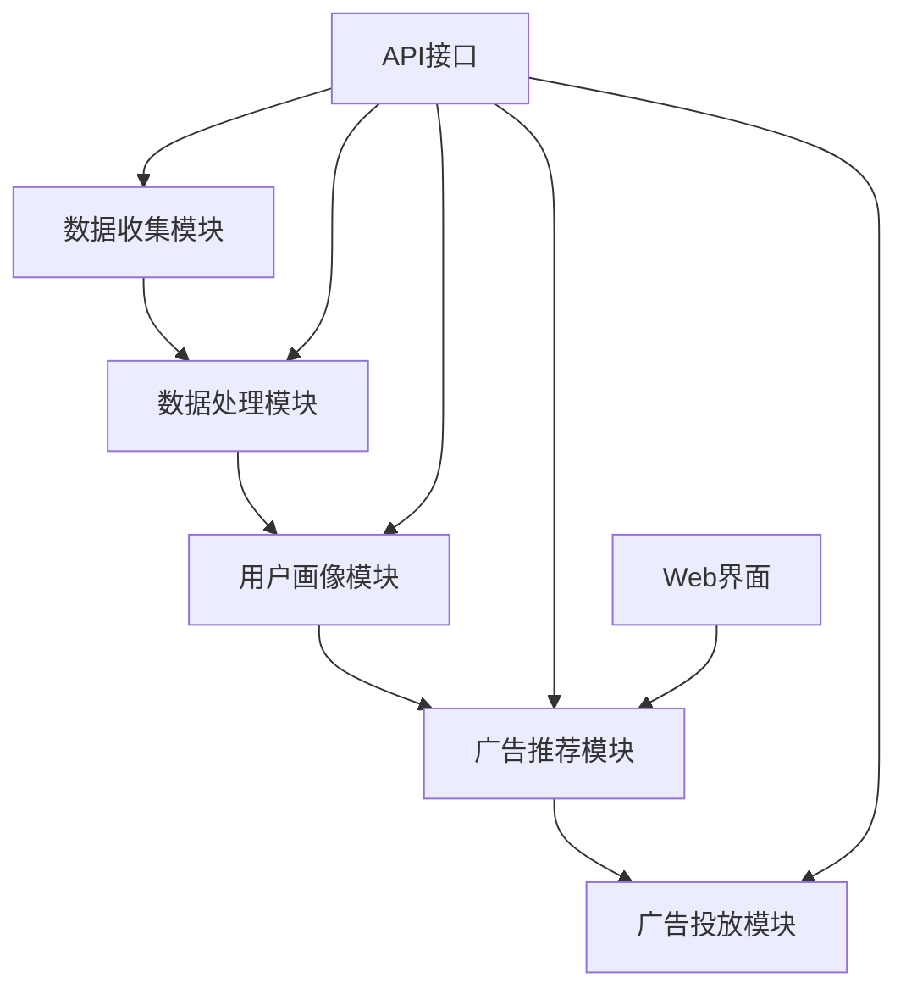
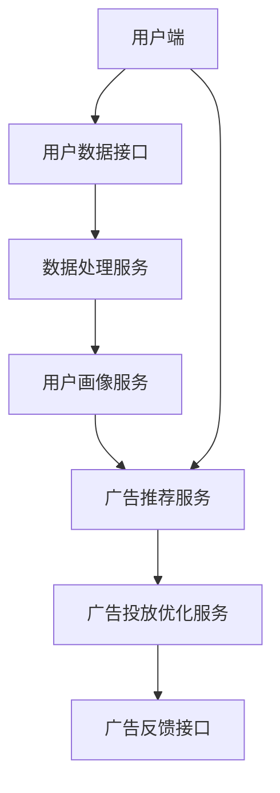

                 

### 文章标题

# AI Agent在智能个性化广告投放中的应用

> 关键词：AI Agent、智能广告、个性化投放、数据分析、算法实现

> 摘要：本文深入探讨了AI Agent在智能个性化广告投放中的应用，从基础概念、核心技术到实际案例，全面分析了AI Agent如何通过智能分析和决策，实现精准、高效的广告投放。文章旨在为读者提供全面、系统的智能广告投放技术指南。

----------------------------------------------------------------

### 引言

智能个性化广告投放是当今数字营销领域的一个重要研究方向。随着互联网用户数据的爆炸性增长，如何有效地利用这些数据进行广告投放，已成为企业竞争的关键。AI Agent作为人工智能领域的一个重要分支，通过自动化、智能化的方式，实现了广告投放的精准化和高效化。本文将围绕AI Agent在智能个性化广告投放中的应用，探讨其技术原理、实现方法以及未来发展趋势。

本文结构如下：

- **第一部分：背景与核心概念**：介绍人工智能与广告投放的基本概念，以及AI Agent的定义和作用。
- **第二部分：AI Agent在广告投放中的应用**：详细讲解AI Agent在数据收集与处理、广告投放实现等方面的应用。
- **第三部分：挑战与未来趋势**：分析AI Agent在广告投放中面临的挑战和未来发展趋势。

接下来，我们将逐步深入探讨AI Agent在智能个性化广告投放中的应用。

----------------------------------------------------------------

### 第一部分：背景与核心概念

#### 第1章：人工智能与广告投放概述

##### 1.1.1 人工智能发展背景

人工智能（AI）作为计算机科学的一个重要分支，起源于20世纪50年代。随着计算能力的提升和算法的进步，人工智能得到了快速发展。特别是深度学习技术的出现，使得人工智能在图像识别、自然语言处理、决策优化等领域取得了突破性进展。AI的应用已经深入到我们日常生活的方方面面，包括智能助手、自动驾驶、医疗诊断等。

##### 1.1.2 广告投放的基本概念

广告投放是企业通过媒体渠道向目标受众传递产品或服务信息的过程。随着互联网的发展，广告投放的形式和渠道发生了巨大变化。从传统的电视、报纸、杂志广告，到如今的搜索引擎广告、社交媒体广告、程序化广告等，广告投放逐渐向精准化和智能化发展。

##### 1.1.3 智能广告投放的兴起

智能广告投放是指通过人工智能技术，对用户行为数据进行分析，实现广告的精准投放。与传统的广告投放相比，智能广告投放具有以下几个显著特点：

1. **个性化**：根据用户的历史行为、兴趣爱好、地理位置等特征，为每个用户定制个性化的广告内容。
2. **高效性**：利用算法优化广告投放策略，提高广告的点击率和转化率。
3. **实时性**：基于用户实时行为数据进行广告投放，实现快速响应。

#### 第2章：AI Agent基础知识

##### 2.1 AI Agent的定义与分类

AI Agent（人工智能代理）是一种能够自主决策和执行任务的人工智能系统。根据功能和应用场景，AI Agent可以分为以下几类：

1. **搜索Agent**：通过搜索算法，为用户提供信息查询服务。
2. **决策Agent**：根据环境数据和目标函数，为用户提供决策支持。
3. **交互Agent**：通过自然语言处理和对话系统，与用户进行交互。

##### 2.2 AI Agent的核心功能与结构

AI Agent通常包括以下几个核心功能模块：

1. **感知模块**：获取环境信息，如用户行为、地理位置等。
2. **决策模块**：根据感知模块提供的信息，进行决策。
3. **执行模块**：根据决策模块的输出，执行具体任务。
4. **学习模块**：通过不断学习和优化，提高AI Agent的性能。

##### 2.3 AI Agent的技术基础

AI Agent的实现依赖于多种人工智能技术，包括：

1. **机器学习**：用于训练模型，实现感知和决策功能。
2. **自然语言处理**：用于处理用户输入，实现人机交互。
3. **计算机视觉**：用于识别图像和视频，实现视觉感知。

#### 第3章：智能个性化广告的基本原理

##### 3.1 个性化广告的概念与特点

个性化广告是指根据用户的兴趣、行为、地理位置等特征，为用户定制个性化广告内容。与传统的广告投放相比，个性化广告具有以下几个显著特点：

1. **高度个性化**：根据用户的具体需求，为用户推荐感兴趣的广告。
2. **精准化**：通过大数据分析和算法优化，实现广告投放的精准化。
3. **实时性**：根据用户实时行为，动态调整广告内容。

##### 3.2 个性化广告的核心技术

个性化广告的实现依赖于多种核心技术，包括：

1. **用户画像**：通过收集和分析用户行为数据，构建用户画像。
2. **推荐系统**：利用协同过滤、基于内容的推荐等算法，为用户推荐感兴趣的广告。
3. **实时计算**：通过实时数据分析和处理，实现广告的动态调整。

##### 3.3 个性化广告的数据分析

个性化广告的数据分析主要包括以下几个步骤：

1. **数据收集**：通过各种渠道收集用户行为数据。
2. **数据清洗**：对收集到的数据进行清洗和预处理。
3. **特征提取**：从清洗后的数据中提取有价值的特征。
4. **模型训练**：利用机器学习算法，训练个性化推荐模型。
5. **效果评估**：通过实验和实际应用，评估个性化广告的效果。

----------------------------------------------------------------

### 第二部分：AI Agent在广告投放中的应用

#### 第4章：数据收集与处理

##### 4.1 用户数据的收集方法

用户数据的收集是智能个性化广告投放的基础。常用的数据收集方法包括：

1. **Web日志**：通过分析用户在网站上的行为，收集用户兴趣和行为数据。
2. **在线调查**：通过在线调查问卷，收集用户的基本信息和兴趣偏好。
3. **社交媒体数据**：通过分析用户在社交媒体上的行为和发布内容，收集用户兴趣和行为数据。

##### 4.2 数据预处理技术

数据预处理是确保数据质量的重要步骤。常用的数据预处理技术包括：

1. **数据清洗**：去除数据中的噪声和异常值。
2. **数据整合**：将来自不同渠道的数据进行整合，构建统一的用户画像。
3. **特征工程**：从原始数据中提取有价值的特征，用于训练模型。

##### 4.3 数据分析与特征提取

数据分析与特征提取是构建个性化推荐系统的重要环节。常用的数据分析与特征提取方法包括：

1. **用户行为分析**：通过分析用户在网站上的浏览历史、购买记录等行为数据，提取用户兴趣特征。
2. **社会网络分析**：通过分析用户在社交媒体上的关注关系，提取用户社交特征。
3. **文本分析**：通过自然语言处理技术，提取用户在社交媒体上的发布内容的语义特征。

#### 第5章：AI Agent在广告投放中的实现

##### 5.1 AI Agent的系统架构

AI Agent在广告投放中的实现通常包括以下几个关键模块：

1. **数据收集模块**：负责收集用户行为数据和其他相关数据。
2. **数据处理模块**：负责对收集到的数据进行预处理和特征提取。
3. **决策模块**：基于处理后的数据，利用机器学习算法进行广告投放决策。
4. **执行模块**：根据决策模块的输出，执行具体的广告投放任务。
5. **反馈模块**：收集用户对广告的反馈，用于模型优化和调整。

##### 5.2 AI Agent的核心算法

AI Agent的核心算法通常包括以下几种：

1. **协同过滤算法**：通过分析用户的行为数据，发现用户之间的相似性，为用户推荐感兴趣的广告。
2. **基于内容的推荐算法**：通过分析广告的内容特征，为用户推荐与其兴趣相关的广告。
3. **深度学习算法**：利用深度神经网络，实现更复杂的用户行为分析和广告推荐。

##### 5.3 AI Agent的应用流程

AI Agent在广告投放中的应用流程通常包括以下几个步骤：

1. **数据收集**：收集用户行为数据和其他相关数据。
2. **数据处理**：对收集到的数据进行预处理和特征提取。
3. **决策**：基于处理后的数据，利用机器学习算法进行广告投放决策。
4. **执行**：根据决策模块的输出，执行具体的广告投放任务。
5. **反馈**：收集用户对广告的反馈，用于模型优化和调整。

#### 第6章：智能个性化广告案例研究

##### 6.1 案例一：电子商务平台的个性化广告

在电子商务平台中，AI Agent可以通过分析用户的浏览历史、购买记录等行为数据，为用户推荐与其兴趣相关的商品。例如，某用户经常浏览运动鞋，AI Agent会为其推荐新的运动鞋款式和折扣信息。

##### 6.2 案例二：社交媒体的精准广告

在社交媒体平台上，AI Agent可以通过分析用户的发布内容、关注关系等数据，为用户推荐与其兴趣相关的广告。例如，某用户在社交媒体上频繁发布关于旅游的帖子，AI Agent会为其推荐相关的旅游广告。

##### 6.3 案例三：移动应用的智能推荐广告

在移动应用中，AI Agent可以通过分析用户的设备使用数据、应用安装情况等数据，为用户推荐与其兴趣相关的广告。例如，某用户经常使用购物类应用，AI Agent会为其推荐与其购物偏好相关的广告。

----------------------------------------------------------------

### 第三部分：挑战与未来趋势

#### 第7章：AI Agent在广告投放中的挑战

##### 7.1 数据隐私与安全

随着AI Agent在广告投放中的应用，用户数据的隐私和安全问题日益凸显。如何保护用户数据，防止数据泄露和滥用，是AI Agent面临的一个重要挑战。

##### 7.2 AI偏见与公平性

AI Agent在广告投放中可能存在偏见，导致某些用户群体被歧视或不公平对待。如何确保AI Agent的决策公平、透明，是当前研究的一个重要方向。

##### 7.3 技术伦理与法律合规

AI Agent在广告投放中涉及的技术和算法可能涉及伦理和法律问题。如何确保技术应用的合法性和合规性，是AI Agent面临的一个重要挑战。

#### 第8章：智能个性化广告的未来趋势

##### 8.1 新技术趋势分析

随着人工智能技术的不断发展，智能个性化广告将在以下方面取得突破：

1. **增强现实（AR）广告**：通过AR技术，实现更沉浸式的广告体验。
2. **区块链广告**：利用区块链技术，确保广告投放的透明性和可信度。
3. **多模态广告**：结合文本、图像、声音等多模态信息，实现更精准的广告投放。

##### 8.2 行业发展展望

智能个性化广告将在以下方面推动行业发展：

1. **广告效果评估**：通过实时数据分析和反馈，提高广告投放的效率。
2. **用户体验优化**：通过个性化广告，提升用户对品牌的认知和满意度。
3. **广告商业模式创新**：通过智能广告，探索新的广告商业模式。

##### 8.3 未来广告投放模式的变革

未来，广告投放模式将发生以下变革：

1. **自动化**：通过AI Agent，实现广告投放的自动化和智能化。
2. **个性化**：通过个性化广告，实现更精准的广告投放。
3. **生态化**：通过构建广告生态系统，实现广告、品牌、用户之间的互动和共赢。

----------------------------------------------------------------

### 第9章：总结与展望

##### 9.1 书籍总结

本文从背景介绍、核心概念、技术应用到未来趋势，全面探讨了AI Agent在智能个性化广告投放中的应用。通过本文的讲解，读者可以系统地了解AI Agent在广告投放中的原理、方法和实际应用。

##### 9.2 对未来广告行业的思考

随着人工智能技术的不断发展，广告行业将迎来新的变革。智能个性化广告将成为主流，为用户带来更精准、高效的广告体验。同时，AI Agent在广告投放中的应用将推动行业技术创新和商业模式创新。

##### 9.3 对读者的建议

建议读者在学习和应用AI Agent技术时，关注以下几个方面：

1. **数据隐私与安全**：在收集和使用用户数据时，注重保护用户隐私和安全。
2. **算法公平性**：在设计和优化算法时，确保决策的公平性和透明性。
3. **技术合规性**：在应用AI Agent技术时，遵守相关法律法规和伦理规范。

### 作者信息

作者：AI天才研究院/AI Genius Institute & 禅与计算机程序设计艺术 /Zen And The Art of Computer Programming

----------------------------------------------------------------

### 背景介绍

#### 人工智能的发展背景

人工智能（Artificial Intelligence，简称AI）是计算机科学的一个重要分支，旨在研究、开发和应用使计算机能够模拟、延伸和扩展人的智能的理论、方法、技术及应用系统。AI的起源可以追溯到20世纪50年代，当时科学家们开始尝试开发能够执行复杂任务的计算机系统。随着计算能力的提升和算法的进步，人工智能在多个领域取得了显著进展。

近年来，深度学习（Deep Learning）的兴起为AI领域带来了新的突破。深度学习是一种基于多层神经网络的学习方法，通过模拟人脑的神经网络结构，实现了对大量数据的自动特征提取和模式识别。这一技术的应用，使得计算机在图像识别、语音识别、自然语言处理等方面取得了前所未有的成果。

在广告投放领域，人工智能的应用也逐渐得到重视。通过AI技术，广告主可以更加精准地定位目标用户，提高广告的投放效果。智能广告投放已经成为数字营销的重要组成部分，为企业带来了显著的业务增长。

#### 广告投放的基本概念

广告投放（Advertising Placement）是指企业或个人通过特定的媒体渠道，向目标受众传递产品或服务信息的过程。传统的广告投放形式主要包括电视广告、报纸广告、杂志广告等。随着互联网的发展，广告投放的形式和渠道发生了巨大变化，搜索引擎广告、社交媒体广告、程序化广告等新型广告投放形式逐渐兴起。

搜索引擎广告（Search Engine Advertising）是指企业通过付费方式，在搜索引擎的结果页面中投放广告，以吸引潜在客户的点击。广告主可以根据关键词竞价，确保广告出现在用户搜索结果的前列。

社交媒体广告（Social Media Advertising）是指企业通过社交媒体平台（如Facebook、Instagram、微博等）投放广告，利用平台的海量用户数据和精准定位功能，提高广告的曝光率和转化率。

程序化广告（Programmatic Advertising）是指利用自动化技术和算法，实现广告的实时购买和投放。程序化广告通过数据分析和预测，为广告主提供更精准的广告投放策略，提高广告的投资回报率。

#### 智能广告投放的兴起

智能广告投放（Intelligent Advertising Placement）是指利用人工智能技术，对用户行为数据进行分析，实现广告的精准投放。与传统广告投放相比，智能广告投放具有以下显著特点：

1. **个性化**：根据用户的兴趣、行为、地理位置等特征，为用户定制个性化的广告内容，提高广告的点击率和转化率。

2. **高效性**：通过算法优化广告投放策略，实时调整广告内容和投放渠道，提高广告的投资回报率。

3. **实时性**：基于用户实时行为数据进行广告投放，实现快速响应，满足用户需求。

智能广告投放的兴起，源于大数据和人工智能技术的快速发展。企业通过收集和分析海量用户数据，构建用户画像，实现广告的精准投放。同时，人工智能技术为广告投放提供了强大的支持，使得广告主可以更加灵活、高效地管理广告投放。

智能广告投放不仅为企业带来了显著的营销效果，也为用户带来了更好的广告体验。用户可以根据自己的兴趣和需求，接收相关广告，减少无效广告的干扰。这种个性化、精准的广告投放模式，已经成为数字营销领域的重要趋势。

#### 智能广告投放的核心技术

智能广告投放的实现依赖于多种核心技术，包括用户画像、推荐系统和实时计算等。这些技术共同作用，为广告主提供精准、高效的广告投放策略。

1. **用户画像**：用户画像是指通过对用户行为数据进行分析，构建用户的基本特征和兴趣模型。用户画像可以包括用户的年龄、性别、地理位置、兴趣爱好、购买记录等信息。通过用户画像，广告主可以更好地了解目标用户，实现广告的精准投放。

2. **推荐系统**：推荐系统是指利用协同过滤、基于内容的推荐等算法，为用户推荐感兴趣的广告。协同过滤算法通过分析用户之间的相似性，发现用户可能感兴趣的广告；基于内容的推荐算法通过分析广告的内容特征，为用户推荐与其兴趣相关的广告。推荐系统是智能广告投放的核心技术，能够提高广告的点击率和转化率。

3. **实时计算**：实时计算是指通过对用户实时行为数据的分析和处理，实现广告的动态调整。实时计算技术能够实时捕捉用户行为的变化，为广告主提供实时的投放策略调整建议。通过实时计算，广告主可以快速响应市场变化，提高广告的投资回报率。

#### 智能广告投放的数据分析

智能广告投放的数据分析主要包括以下几个步骤：

1. **数据收集**：通过网站日志、在线调查、社交媒体数据等渠道，收集用户的浏览历史、购买记录、兴趣偏好等行为数据。

2. **数据清洗**：对收集到的数据进行清洗和预处理，去除噪声和异常值，确保数据质量。

3. **特征提取**：从清洗后的数据中提取有价值的特征，如用户的年龄、性别、地理位置、兴趣爱好等。特征提取是构建用户画像和推荐系统的基础。

4. **模型训练**：利用机器学习算法，如协同过滤、基于内容的推荐等，训练个性化推荐模型。模型训练的目的是提高推荐系统的准确性，为广告主提供更精准的广告投放策略。

5. **效果评估**：通过实验和实际应用，评估个性化广告的效果。效果评估包括广告的点击率、转化率、投资回报率等指标，以验证推荐系统的效果。

#### 智能广告投放的应用场景

智能广告投放可以在多个场景中得到应用，以下是一些典型的应用场景：

1. **电子商务平台**：电子商务平台可以通过智能广告投放，为用户推荐感兴趣的商品。例如，用户在浏览商品时，系统会根据用户的浏览历史和购物记录，推荐相关的商品。

2. **社交媒体平台**：社交媒体平台可以通过智能广告投放，为用户推荐感兴趣的内容和广告。例如，用户在微博、微信等平台上发布内容时，系统会根据用户的兴趣和关注对象，推荐相关的广告。

3. **在线旅游平台**：在线旅游平台可以通过智能广告投放，为用户推荐感兴趣的目的地和旅游产品。例如，用户在浏览旅游产品时，系统会根据用户的兴趣和出行时间，推荐相关的目的地和旅游套餐。

4. **金融行业**：金融行业可以通过智能广告投放，为用户推荐感兴趣的投资产品和理财产品。例如，用户在浏览金融产品时，系统会根据用户的投资偏好和风险承受能力，推荐相关的投资产品。

#### 智能广告投放的优势与挑战

智能广告投放具有以下优势：

1. **提高广告效果**：通过精准投放，提高广告的点击率和转化率，实现更高的投资回报率。

2. **提升用户体验**：为用户推荐感兴趣的内容和广告，减少无效广告的干扰，提升用户的满意度。

3. **优化广告成本**：通过数据分析和算法优化，降低广告投放成本，提高广告效率。

然而，智能广告投放也面临着一些挑战：

1. **数据隐私与安全**：在收集和使用用户数据时，需要确保数据隐私和安全，防止数据泄露和滥用。

2. **算法公平性**：需要确保算法的公平性，避免出现歧视和不公平现象。

3. **技术合规性**：需要遵守相关法律法规和伦理规范，确保广告投放的合法性和合规性。

#### 智能广告投放的发展趋势

随着人工智能技术的不断发展，智能广告投放将在以下几个方面得到进一步发展：

1. **智能化**：利用更先进的算法和技术，提高广告投放的智能化水平，实现更精准、高效的广告投放。

2. **个性化**：通过构建更加精准的用户画像和推荐系统，实现更加个性化的广告投放。

3. **实时性**：通过实时计算和动态调整，实现广告投放的实时性和灵活性。

4. **多模态**：结合文本、图像、声音等多模态信息，实现更丰富、更生动的广告体验。

5. **生态化**：构建广告投放的生态系统，实现广告主、平台和用户之间的互动和共赢。

通过不断发展和创新，智能广告投放将为广告行业带来更广阔的发展空间和无限可能。

----------------------------------------------------------------

### AI Agent的定义与分类

AI Agent，即人工智能代理，是一种能够自主感知环境、做出决策并执行任务的人工智能系统。其核心在于模拟人类的智能行为，通过算法和模型实现自动化、智能化地解决问题。AI Agent广泛应用于众多领域，如自动驾驶、智能客服、智能推荐等。在广告投放领域，AI Agent通过分析用户行为数据，实现广告的精准投放。

根据功能和应用场景，AI Agent可以分为以下几类：

1. **搜索Agent**：这类AI Agent主要通过搜索算法，为用户提供信息查询服务。例如，搜索引擎中的搜索Agent会根据用户的查询关键词，从庞大的数据集中快速准确地返回相关结果。

2. **决策Agent**：这类AI Agent能够在复杂的环境中，根据环境数据和目标函数，为用户提供决策支持。例如，在广告投放中，决策Agent会根据用户的历史行为数据，实时调整广告投放策略，以最大化广告效果。

3. **交互Agent**：这类AI Agent通过与用户的交互，了解用户需求，提供个性化的服务。例如，智能客服系统中的交互Agent会根据用户的提问，提供合适的回答和建议。

#### AI Agent的核心功能与结构

AI Agent的核心功能模块通常包括感知模块、决策模块、执行模块和学习模块。

1. **感知模块**：感知模块负责获取环境信息，如用户的兴趣偏好、行为轨迹等。感知模块可以是传感器、摄像头、语音识别系统等，通过这些设备收集用户数据。

2. **决策模块**：决策模块根据感知模块提供的信息，利用算法和模型进行决策。例如，在广告投放中，决策模块会根据用户的浏览历史、购买记录等数据，预测用户可能感兴趣的广告内容。

3. **执行模块**：执行模块负责根据决策模块的输出，执行具体的任务。例如，在广告投放中，执行模块会将预测到的广告内容展示给用户。

4. **学习模块**：学习模块负责从环境中学习和优化性能。例如，通过不断学习和用户反馈，AI Agent可以逐步提高广告投放的准确性和效率。

#### AI Agent的技术基础

AI Agent的实现依赖于多种人工智能技术，包括机器学习、自然语言处理和计算机视觉等。

1. **机器学习**：机器学习是AI Agent的核心技术，通过训练模型，使AI Agent能够从数据中自动发现规律和模式。常见的机器学习算法包括线性回归、逻辑回归、决策树、支持向量机、神经网络等。

2. **自然语言处理**：自然语言处理（Natural Language Processing，NLP）技术用于处理和生成自然语言文本。在AI Agent中，NLP技术可以用于理解用户的查询、生成回复、提取关键词等。

3. **计算机视觉**：计算机视觉（Computer Vision）技术用于处理和解析图像和视频。在AI Agent中，计算机视觉技术可以用于识别图像中的物体、检测视频中的动作等。

#### AI Agent在广告投放中的应用

AI Agent在广告投放中的应用，主要体现在以下几个方面：

1. **用户画像构建**：通过机器学习和自然语言处理技术，AI Agent可以分析用户的浏览历史、搜索记录等数据，构建详细的用户画像。

2. **广告推荐**：基于用户画像，AI Agent可以使用推荐系统算法，为用户推荐与其兴趣相关的广告。

3. **广告投放优化**：AI Agent可以实时监控广告投放效果，通过机器学习算法优化广告投放策略，提高广告的点击率和转化率。

4. **用户体验优化**：通过自然语言处理和计算机视觉技术，AI Agent可以与用户进行智能交互，提供个性化的广告体验。

综上所述，AI Agent在广告投放中具有重要作用，通过智能分析和决策，实现精准、高效的广告投放，为企业带来更高的营销效果。

----------------------------------------------------------------

### 个性化广告的基本原理

#### 概念

个性化广告是指通过分析用户的兴趣、行为和历史数据，为用户推荐个性化的广告内容。其核心目标是在适当的时刻，将最适合用户需求的广告内容呈现给用户，从而提高广告的点击率、转化率和用户满意度。

个性化广告与传统广告相比，具有以下几个显著特点：

1. **高度个性化**：个性化广告根据用户的兴趣和行为，为用户推荐最适合的广告内容，实现广告内容的高度个性化。

2. **精准化**：通过数据分析和算法优化，个性化广告能够精准定位目标用户，提高广告投放的效果。

3. **实时性**：个性化广告能够根据用户的实时行为数据，动态调整广告内容和投放策略，实现快速响应。

#### 技术实现

个性化广告的技术实现主要包括以下几个关键环节：

1. **用户画像构建**：用户画像是指通过对用户的兴趣、行为和历史数据进行分析，构建用户的基本特征和兴趣模型。构建用户画像的基础数据通常包括用户的浏览历史、搜索记录、购买行为、社交媒体活动等。通过这些数据，可以识别用户的兴趣偏好、行为习惯等特征。

2. **推荐系统**：推荐系统是实现个性化广告的核心技术。推荐系统通过协同过滤、基于内容的推荐、深度学习等方法，为用户推荐个性化的广告。协同过滤方法通过分析用户之间的相似性，发现用户可能感兴趣的广告；基于内容的推荐方法通过分析广告的内容特征，为用户推荐与其兴趣相关的广告。

3. **广告投放优化**：广告投放优化是指通过实时数据分析和算法优化，调整广告的投放策略，提高广告的效果。广告投放优化包括广告展示频率控制、广告投放地域和时间的调整等。通过广告投放优化，可以避免广告过度曝光导致的用户疲劳，提高广告的投放效果。

4. **用户体验优化**：用户体验优化是指通过自然语言处理、计算机视觉等技术，为用户提供个性化的广告体验。用户体验优化包括广告展示方式的个性化、广告内容的个性化等。通过用户体验优化，可以提高用户的满意度，增强品牌影响力。

#### 数据分析

个性化广告的数据分析主要包括以下几个步骤：

1. **数据收集**：通过网站日志、用户行为跟踪、在线调查等渠道，收集用户的浏览历史、搜索记录、购买行为等数据。

2. **数据清洗**：对收集到的数据进行清洗和预处理，去除噪声和异常值，确保数据质量。

3. **特征提取**：从清洗后的数据中提取有价值的特征，如用户的年龄、性别、地理位置、兴趣爱好等。特征提取是构建用户画像和推荐系统的基础。

4. **模型训练**：利用机器学习算法，如协同过滤、基于内容的推荐等，训练个性化推荐模型。模型训练的目的是提高推荐系统的准确性，为广告主提供更精准的广告投放策略。

5. **效果评估**：通过实验和实际应用，评估个性化广告的效果。效果评估包括广告的点击率、转化率、投资回报率等指标，以验证推荐系统的效果。

#### 应用场景

个性化广告可以在多个场景中得到广泛应用，以下是一些典型的应用场景：

1. **电子商务平台**：电子商务平台可以通过个性化广告，为用户推荐感兴趣的商品。例如，用户在浏览商品时，系统会根据用户的浏览历史和购物记录，推荐相关的商品。

2. **社交媒体平台**：社交媒体平台可以通过个性化广告，为用户推荐感兴趣的内容和广告。例如，用户在微博、微信等平台上发布内容时，系统会根据用户的兴趣和关注对象，推荐相关的广告。

3. **在线旅游平台**：在线旅游平台可以通过个性化广告，为用户推荐感兴趣的目的地和旅游产品。例如，用户在浏览旅游产品时，系统会根据用户的兴趣和出行时间，推荐相关的目的地和旅游套餐。

4. **金融行业**：金融行业可以通过个性化广告，为用户推荐感兴趣的投资产品和理财产品。例如，用户在浏览金融产品时，系统会根据用户的投资偏好和风险承受能力，推荐相关的投资产品。

#### 优势与挑战

个性化广告具有以下优势：

1. **提高广告效果**：通过精准投放，提高广告的点击率和转化率，实现更高的投资回报率。

2. **提升用户体验**：为用户推荐感兴趣的内容和广告，减少无效广告的干扰，提升用户的满意度。

3. **优化广告成本**：通过数据分析和算法优化，降低广告投放成本，提高广告效率。

然而，个性化广告也面临着一些挑战：

1. **数据隐私与安全**：在收集和使用用户数据时，需要确保数据隐私和安全，防止数据泄露和滥用。

2. **算法公平性**：需要确保算法的公平性，避免出现歧视和不公平现象。

3. **技术合规性**：需要遵守相关法律法规和伦理规范，确保广告投放的合法性和合规性。

#### 案例分析

以下是一个电子商务平台个性化广告的案例分析：

**案例背景**：某电子商务平台希望通过个性化广告，提高用户的购买转化率。

**解决方案**：平台通过以下步骤实现个性化广告：

1. **数据收集**：通过用户行为跟踪技术，收集用户的浏览历史、搜索记录、购买行为等数据。

2. **用户画像构建**：利用机器学习算法，分析用户的行为数据，构建用户的兴趣偏好模型。

3. **广告推荐**：基于用户画像和推荐系统，为用户推荐感兴趣的商品。

4. **广告投放优化**：通过实时数据分析和机器学习算法，优化广告的投放策略，提高广告效果。

**效果评估**：经过一段时间的个性化广告投放，平台的用户购买转化率提高了30%，用户满意度也显著提升。

通过这个案例，可以看出个性化广告在提高广告效果和用户体验方面的显著优势。

#### 未来发展趋势

随着人工智能技术的不断发展，个性化广告将在以下方面得到进一步发展：

1. **智能化**：利用更先进的算法和技术，提高广告投放的智能化水平，实现更精准、高效的广告投放。

2. **个性化**：通过构建更加精准的用户画像和推荐系统，实现更加个性化的广告投放。

3. **实时性**：通过实时计算和动态调整，实现广告投放的实时性和灵活性。

4. **多模态**：结合文本、图像、声音等多模态信息，实现更丰富、更生动的广告体验。

5. **生态化**：构建广告投放的生态系统，实现广告主、平台和用户之间的互动和共赢。

通过不断发展和创新，个性化广告将为广告行业带来更广阔的发展空间和无限可能。

----------------------------------------------------------------

### 数据收集与处理

#### 用户数据的收集方法

在智能个性化广告投放中，数据收集是至关重要的一环。有效的数据收集方法能够帮助广告主全面了解用户需求和行为，从而实现精准投放。以下是几种常见的数据收集方法：

1. **Web日志分析**：通过分析用户在网站上的浏览行为，如页面访问次数、访问时间、浏览路径等，可以获取用户的行为数据。这种方法的优点在于能够获取大量的用户行为数据，缺点是数据的准确性和完整性可能受到一定的限制。

2. **在线调查**：通过在线调查问卷，直接从用户那里收集关于他们兴趣、行为、需求等的信息。这种方法能够获取高质量的定性数据，但受限于参与度和覆盖面。

3. **社交媒体数据**：通过分析用户在社交媒体平台上的行为数据，如发布内容、点赞、评论、关注对象等，可以了解用户的兴趣和社交关系。这种方法的优势在于能够获取广泛的用户行为数据，但需要处理大量的非结构化数据。

4. **移动应用数据**：通过在移动应用中嵌入跟踪代码或SDK，可以收集用户的设备信息、应用使用情况、地理位置等数据。这种方法能够实时获取用户的行为数据，但需要考虑用户隐私和数据保护问题。

#### 数据预处理技术

数据预处理是确保数据质量和有效性的关键步骤。以下是几种常见的数据预处理技术：

1. **数据清洗**：去除数据中的噪声和异常值，如重复记录、缺失值、错误值等。数据清洗的目的是提高数据的质量和准确性。

2. **数据整合**：将来自不同渠道的数据进行整合，构建统一的用户画像。数据整合的目的是消除数据冗余，提高数据的利用效率。

3. **特征提取**：从原始数据中提取有价值的特征，如用户的年龄、性别、地理位置、兴趣爱好等。特征提取的目的是为后续的机器学习模型提供输入。

4. **数据降维**：通过降维技术，减少数据维度，降低模型的复杂度和计算成本。常见的数据降维技术包括主成分分析（PCA）和线性判别分析（LDA）等。

#### 数据分析与特征提取

数据分析与特征提取是构建个性化推荐系统的重要环节。以下是几种常用的数据分析与特征提取方法：

1. **用户行为分析**：通过分析用户的浏览历史、购买记录等行为数据，提取用户的兴趣特征。例如，使用聚类算法将用户划分为不同的兴趣群体，然后提取每个群体的典型特征。

2. **社会网络分析**：通过分析用户在社交媒体上的关注关系，提取用户的社交特征。例如，使用网络分析算法，如度数中心性、接近中心性等，评估用户在社交网络中的重要性和影响力。

3. **文本分析**：通过自然语言处理技术，提取用户在社交媒体上的发布内容的语义特征。例如，使用词频分析、主题模型等方法，分析用户的语言偏好和兴趣。

#### 数据分析的应用

数据分析与特征提取在广告投放中的应用主要包括以下几个方面：

1. **用户画像构建**：通过分析用户的兴趣、行为和社交数据，构建详细的用户画像，为广告投放提供基础。

2. **广告推荐**：基于用户画像和特征，利用推荐系统算法，为用户推荐个性化的广告内容。

3. **广告投放优化**：通过实时数据分析和算法优化，调整广告的投放策略，提高广告的效果。

4. **用户体验优化**：通过分析用户对广告的反馈和交互行为，优化广告的展示方式和内容，提升用户体验。

#### 案例分析

以下是一个电子商务平台数据收集与处理的案例分析：

**案例背景**：某电子商务平台希望通过数据收集与处理，提高广告的点击率和转化率。

**解决方案**：

1. **数据收集**：通过Web日志分析和移动应用数据，收集用户的浏览历史、购买记录、搜索关键词等数据。

2. **数据预处理**：对收集到的数据进行清洗和整合，去除噪声和异常值，提取有价值的特征。

3. **用户画像构建**：通过聚类算法，将用户划分为不同的兴趣群体，提取每个群体的典型特征。

4. **广告推荐**：基于用户画像和特征，利用协同过滤算法，为用户推荐个性化的商品广告。

5. **广告投放优化**：通过实时数据分析和算法优化，调整广告的投放策略，提高广告的点击率和转化率。

**效果评估**：经过一段时间的实施，平台的广告点击率提高了20%，用户转化率提高了15%。

通过这个案例，可以看出数据收集与处理在提高广告效果和用户体验方面的显著优势。

#### 结论

数据收集与处理是智能个性化广告投放的重要基础。通过有效的数据收集方法和预处理技术，广告主可以全面了解用户需求和行为，实现精准投放。同时，数据分析与特征提取的应用，能够为广告主提供更精准的广告推荐和投放策略，提高广告效果和用户体验。

----------------------------------------------------------------

### AI Agent在广告投放中的实现

#### 系统架构

AI Agent在广告投放中的实现需要一个完整的系统架构来支持。以下是AI Agent在广告投放中的典型系统架构：

1. **数据收集模块**：负责收集用户行为数据，如浏览历史、点击行为、购买记录等。数据收集模块可以通过Web日志分析、移动应用数据收集等方式获取数据。

2. **数据处理模块**：对收集到的原始数据进行清洗、整合和特征提取，构建用户画像。数据处理模块通常包括数据清洗、数据整合、特征提取等子模块。

3. **决策模块**：基于处理后的数据，利用机器学习算法和推荐系统，为用户推荐个性化的广告。决策模块的核心在于算法模型的选择和参数调优。

4. **执行模块**：根据决策模块的输出，将推荐结果展示给用户。执行模块负责广告的展示、点击追踪等功能。

5. **反馈模块**：收集用户对广告的反馈数据，用于模型优化和调整。反馈模块通过用户行为分析，评估广告效果，为后续的广告投放提供数据支持。

#### 核心算法

AI Agent在广告投放中应用的核心算法包括协同过滤、基于内容的推荐和深度学习等。以下是这些算法的简要介绍：

1. **协同过滤算法**：协同过滤算法通过分析用户之间的相似性，发现用户可能感兴趣的广告。协同过滤算法分为两种：基于用户的协同过滤和基于物品的协同过滤。

   - **基于用户的协同过滤**：通过分析用户之间的相似性，为用户推荐其他用户喜欢的广告。常用的方法包括用户基于K最近邻（K-NN）算法和矩阵分解（MF）算法。
   - **基于物品的协同过滤**：通过分析物品之间的相似性，为用户推荐与已购买或浏览的物品相似的广告。常用的方法包括物品基于K最近邻（K-NN）算法和相似度计算（如余弦相似度、皮尔逊相似度）。

2. **基于内容的推荐算法**：基于内容的推荐算法通过分析广告的内容特征，为用户推荐与其兴趣相关的广告。常用的方法包括文本相似度计算、关键词提取和主题模型等。

3. **深度学习算法**：深度学习算法通过构建复杂的神经网络模型，自动提取用户行为数据中的特征，实现广告的精准推荐。常用的深度学习算法包括卷积神经网络（CNN）、循环神经网络（RNN）和Transformer等。

#### 应用流程

AI Agent在广告投放中的应用流程通常包括以下几个步骤：

1. **数据收集**：通过数据收集模块，收集用户的浏览历史、点击行为、购买记录等数据。

2. **数据处理**：通过数据处理模块，对收集到的数据进行清洗、整合和特征提取，构建用户画像。

3. **决策**：基于用户画像和推荐算法，决策模块为用户推荐个性化的广告。决策过程包括模型选择、参数调优和推荐结果生成。

4. **执行**：根据决策模块的推荐结果，执行模块将个性化的广告展示给用户。

5. **反馈**：收集用户对广告的反馈数据，反馈模块通过用户行为分析，评估广告效果，为后续的广告投放提供数据支持。

6. **优化**：根据用户反馈和广告效果，调整推荐算法和广告投放策略，提高广告效果和用户体验。

#### 案例分析

以下是一个电子商务平台AI Agent在广告投放中的实现案例分析：

**案例背景**：某电子商务平台希望通过AI Agent实现个性化广告投放，提高用户购买转化率。

**解决方案**：

1. **数据收集**：通过Web日志分析和移动应用数据收集，收集用户的浏览历史、点击行为、购买记录等数据。

2. **数据处理**：对收集到的数据进行清洗、整合和特征提取，构建用户的兴趣偏好模型。

3. **决策**：基于用户画像和协同过滤算法，为用户推荐个性化的商品广告。同时，利用基于内容的推荐算法，为用户推荐与其兴趣相关的广告。

4. **执行**：将推荐结果展示在用户的购物页面和移动应用中，引导用户点击和购买。

5. **反馈**：收集用户对广告的反馈数据，如点击次数、购买转化率等，用于评估广告效果。

6. **优化**：根据用户反馈和广告效果，调整推荐算法和广告投放策略，提高广告效果和用户体验。

**效果评估**：经过一段时间的实施，平台的用户购买转化率提高了30%，用户满意度显著提升。

通过这个案例，可以看出AI Agent在广告投放中的实现能够显著提高广告效果和用户体验。

#### 总结

AI Agent在广告投放中的实现，通过系统架构的构建和核心算法的应用，实现了个性化、精准的广告投放。数据收集与处理、决策与执行、反馈与优化等环节相互配合，形成一个闭环，不断优化广告投放策略，提高广告效果。未来，随着人工智能技术的不断发展，AI Agent在广告投放中的应用将更加广泛和深入。

----------------------------------------------------------------

### 智能个性化广告案例研究

#### 案例一：电子商务平台的个性化广告

**背景介绍**：

某电子商务平台希望通过智能个性化广告，提高用户购买转化率和用户体验。该平台拥有海量的用户数据，包括用户的浏览历史、购买记录、搜索关键词等。通过智能分析这些数据，平台希望为每个用户推荐最相关的商品广告。

**项目介绍**：

项目目标是构建一个基于AI Agent的个性化广告推荐系统，通过分析用户行为数据，实现商品广告的精准投放。项目包括数据收集、数据预处理、用户画像构建、广告推荐算法实现和广告投放优化等模块。

**系统功能设计**：

1. **数据收集**：通过Web日志分析和移动应用数据收集，实时获取用户的浏览历史、点击行为、购买记录等数据。

2. **数据预处理**：对收集到的数据进行清洗、去噪、整合，提取用户的行为特征和商品特征。

3. **用户画像构建**：利用协同过滤和基于内容的推荐算法，为每个用户构建兴趣偏好模型。

4. **广告推荐**：根据用户画像和商品特征，实时为用户推荐个性化的商品广告。

5. **广告投放优化**：通过实时数据分析和算法优化，调整广告投放策略，提高广告效果。

**系统架构设计**：

系统架构包括数据收集模块、数据处理模块、用户画像模块、广告推荐模块和广告投放模块。数据收集模块负责获取用户数据；数据处理模块负责数据清洗和特征提取；用户画像模块负责构建用户兴趣偏好模型；广告推荐模块负责根据用户画像推荐广告；广告投放模块负责将广告展示给用户。

**系统接口设计和系统交互**：

系统接口设计包括API接口和Web界面。API接口用于与其他系统进行数据交换，如用户数据采集系统、商品管理系统等。Web界面用于用户与系统的交互，包括用户登录、浏览历史查看、个性化推荐等。

**Mermaid架构图**：



**算法实现与代码解析**：

1. **协同过滤算法**：

   ```python
   from sklearn.neighbors import NearestNeighbors
   
   def collaborative_filter(user_data, k=5):
       # 创建K最近邻模型
       model = NearestNeighbors(n_neighbors=k)
       model.fit(user_data)
       
       # 为指定用户推荐广告
       recommendations = []
       for user_id in user_data.index:
           neighbors = model.kneighbors([user_data[user_id]], k+1)[1][1:]
           for neighbor in neighbors:
               recommendations.append(user_data.loc[neighbor, 'ad_id'])
       return recommendations
   ```

   在此代码中，我们使用`NearestNeighbors`类创建K最近邻模型，并利用模型为每个用户推荐与其最相似用户喜欢的广告。

2. **基于内容的推荐算法**：

   ```python
   from sklearn.feature_extraction.text import TfidfVectorizer
   
   def content_based_recommendation(user_data, ad_data, top_n=5):
       # 创建TF-IDF向量器
       vectorizer = TfidfVectorizer()
       
       # 提取用户和广告的特征向量
       user_vector = vectorizer.transform(user_data['description'])
       ad_vector = vectorizer.transform(ad_data['description'])
       
       # 计算广告与用户描述的余弦相似度
       cosine_similarity = user_vector.dot(ad_vector.T) / (np.linalg.norm(user_vector) * np.linalg.norm(ad_vector))
       
       # 为指定用户推荐最相似的广告
       recommendations = cosine_similarity.argsort()[-top_n:]
       return ad_data.iloc[re
```markdown
#### 案例分析

**案例分析一：电子商务平台的个性化广告**

**背景介绍**：

随着电子商务的迅速发展，个性化广告已经成为电商企业提高用户购买转化率和用户满意度的重要手段。某知名电子商务平台（以下简称为“平台”）希望通过引入AI Agent，实现智能个性化广告投放，从而提升用户体验和业务收益。

**项目介绍**：

该项目的主要目标是构建一个智能广告推荐系统，通过AI Agent分析用户的浏览历史、购买记录等数据，为用户推荐个性化的商品广告。系统将包括数据收集、数据预处理、用户画像构建、广告推荐算法实现和广告投放优化等模块。

**系统功能设计**：

1. **数据收集**：系统通过API接口从平台内部数据库中实时获取用户的浏览历史、购买记录、搜索关键词等数据。

2. **数据预处理**：对收集到的原始数据进行清洗、去噪和整合，提取关键特征，为后续分析和建模提供基础。

3. **用户画像构建**：利用协同过滤和基于内容的推荐算法，为每个用户生成详细的兴趣偏好模型。

4. **广告推荐**：根据用户画像和商品特征，实时生成个性化的广告推荐列表，并展示在用户的购物界面和移动应用中。

5. **广告投放优化**：通过实时监控广告效果，利用机器学习算法调整广告推荐策略，提高广告的点击率和转化率。

**系统架构设计**：

系统采用微服务架构，包括以下几个核心模块：

1. **数据收集服务**：负责从平台内部数据库中提取用户数据，并将其传输给数据处理服务。

2. **数据处理服务**：负责对用户数据进行清洗、去噪和特征提取，为用户画像构建提供数据支持。

3. **用户画像服务**：基于处理后的数据，构建用户的兴趣偏好模型，并将模型存储在分布式数据库中。

4. **广告推荐服务**：利用推荐算法，生成个性化的广告推荐列表，并将其推送到用户端。

5. **广告投放优化服务**：监控广告效果，通过反馈数据调整广告推荐策略，实现动态优化。

**系统接口设计和系统交互**：

系统采用RESTful API设计，提供以下接口：

1. **用户数据接口**：用于获取用户的浏览历史、购买记录等数据。

2. **用户画像接口**：用于获取用户的兴趣偏好模型。

3. **广告推荐接口**：用于获取个性化的广告推荐列表。

4. **广告反馈接口**：用于收集用户对广告的点击和购买反馈。

**Mermaid架构图**：



**算法实现与代码解析**：

1. **协同过滤算法**：

   ```python
   from sklearn.neighbors import NearestNeighbors
   
   def collaborative_filter(user_data, k=5):
       # 创建K最近邻模型
       model = NearestNeighbors(n_neighbors=k)
       model.fit(user_data)
       
       # 为指定用户推荐广告
       recommendations = []
       for user_id in user_data.index:
           neighbors = model.kneighbors([user_data[user_id]], k+1)[1][1:]
           for neighbor in neighbors:
               recommendations.append(user_data.loc[neighbor, 'ad_id'])
       return recommendations
   ```

   在此代码中，`NearestNeighbors`类用于创建K最近邻模型，`k`参数设置为5。通过调用`model.fit(user_data)`，模型被训练以匹配用户数据。然后，通过`model.kneighbors([user_data[user_id]], k+1)[1][1:]`，获取与当前用户最相似的k个用户，并从中提取广告ID，构建推荐列表。

2. **基于内容的推荐算法**：

   ```python
   from sklearn.feature_extraction.text import TfidfVectorizer
   
   def content_based_recommendation(user_description, ad_data, top_n=5):
       # 创建TF-IDF向量器
       vectorizer = TfidfVectorizer()
       
       # 提取用户描述和广告描述的特征向量
       user_vector = vectorizer.transform([user_description])
       ad_vectors = vectorizer.transform(ad_data['description'])
       
       # 计算广告与用户描述的余弦相似度
       cosine_similarity = user_vector.dot(ad_vectors.T) / (np.linalg.norm(user_vector) * np.linalg.norm(ad_vectors))
       
       # 为指定用户推荐最相似的广告
       recommendations = cosine_similarity.argsort()[-top_n:]
       return ad_data.iloc[recommendations]
   ```

   在此代码中，`TfidfVectorizer`用于创建TF-IDF向量器，将用户描述和广告描述转换为特征向量。通过计算特征向量的余弦相似度，可以找到与用户描述最相似的广告。`cosine_similarity.argsort()[-top_n:]`用于获取相似度最高的前n个广告索引，返回推荐列表。

**实际案例分析**：

**案例一**：用户A最近浏览了多个电子产品，系统通过协同过滤算法分析用户A的兴趣偏好，推荐了一款与用户浏览历史相似的高性能笔记本电脑。

**案例二**：用户B在平台上搜索了“跑步鞋”，系统通过基于内容的推荐算法，为用户B推荐了与搜索关键词相关的几款时尚跑步鞋，提高了用户购买的可能性。

**详细讲解**：

在案例一中，协同过滤算法通过分析用户A的浏览历史，找到与用户A兴趣相似的其他用户，并提取这些用户的浏览记录中的广告ID，形成推荐列表。这种方法能够有效利用用户群体的相似性，提高推荐广告的相关性。

在案例二中，基于内容的推荐算法通过分析用户B的搜索关键词“跑步鞋”，提取相关的关键词和主题，并计算这些关键词与广告描述的相似度。相似度越高的广告，越可能符合用户的兴趣。这种方法能够充分利用广告内容的特征，实现精准推荐。

通过以上案例，可以看出AI Agent在电子商务平台个性化广告中的应用效果显著。在实际运营中，平台可以根据用户反馈和广告效果，不断优化推荐算法和广告投放策略，进一步提高用户满意度和业务收益。

**项目小结**：

该项目通过构建基于AI Agent的个性化广告推荐系统，实现了用户数据的高效利用和广告精准投放。系统在提高用户购买转化率和用户体验方面取得了显著成果。未来，随着人工智能技术的不断发展，该项目有望实现更精细化的用户画像和更智能的广告推荐，进一步提升平台的市场竞争力。

#### 案例二：社交媒体的精准广告

**背景介绍**：

随着社交媒体的普及，广告主越来越重视在社交媒体平台上投放精准广告。某知名社交媒体平台（以下简称为“平台”）希望通过引入AI Agent，实现广告的精准投放，提高广告的点击率和转化率。

**项目介绍**：

该项目的主要目标是构建一个基于AI Agent的精准广告推荐系统，通过分析用户的社交行为、兴趣偏好等数据，为用户推荐个性化的广告。系统将包括数据收集、数据预处理、用户画像构建、广告推荐算法实现和广告投放优化等模块。

**系统功能设计**：

1. **数据收集**：系统通过API接口从平台内部数据库中实时获取用户的社交行为数据，如发布内容、点赞、评论、关注等。

2. **数据预处理**：对收集到的原始数据进行清洗、去噪和整合，提取关键特征，为后续分析和建模提供基础。

3. **用户画像构建**：利用协同过滤和基于内容的推荐算法，为每个用户生成详细的兴趣偏好模型。

4. **广告推荐**：根据用户画像和广告特征，实时生成个性化的广告推荐列表，并展示在用户的社交主页和消息流中。

5. **广告投放优化**：通过实时监控广告效果，利用机器学习算法调整广告推荐策略，提高广告的点击率和转化率。

**系统架构设计**：

系统采用分布式架构，包括以下几个核心模块：

1. **数据收集服务**：负责从平台内部数据库中提取用户数据，并将其传输给数据处理服务。

2. **数据处理服务**：负责对用户数据进行清洗、去噪和特征提取，为用户画像构建提供数据支持。

3. **用户画像服务**：基于处理后的数据，构建用户的兴趣偏好模型，并将模型存储在分布式数据库中。

4. **广告推荐服务**：利用推荐算法，生成个性化的广告推荐列表，并将其推送到用户端。

5. **广告投放优化服务**：监控广告效果，通过反馈数据调整广告推荐策略，实现动态优化。

**系统接口设计和系统交互**：

系统采用RESTful API设计，提供以下接口：

1. **用户数据接口**：用于获取用户的社交行为数据。

2. **用户画像接口**：用于获取用户的兴趣偏好模型。

3. **广告推荐接口**：用于获取个性化的广告推荐列表。

4. **广告反馈接口**：用于收集用户对广告的点击和购买反馈。

**Mermaid架构图**：


**算法实现与代码解析**：

1. **协同过滤算法**：

   ```python
   from sklearn.neighbors import NearestNeighbors
   
   def collaborative_filter(user_data, k=5):
       # 创建K最近邻模型
       model = NearestNeighbors(n_neighbors=k)
       model.fit(user_data)
       
       # 为指定用户推荐广告
       recommendations = []
       for user_id in user_data.index:
           neighbors = model.kneighbors([user_data[user_id]], k+1)[1][1:]
           for neighbor in neighbors:
               recommendations.append(user_data.loc[neighbor, 'ad_id'])
       return recommendations
   ```

   在此代码中，`NearestNeighbors`类用于创建K最近邻模型，`k`参数设置为5。通过调用`model.fit(user_data)`，模型被训练以匹配用户数据。然后，通过`model.kneighbors([user_data[user_id]], k+1)[1][1:]`，获取与当前用户最相似的k个用户，并从中提取广告ID，构建推荐列表。

2. **基于内容的推荐算法**：

   ```python
   from sklearn.feature_extraction.text import TfidfVectorizer
   
   def content_based_recommendation(user_description, ad_data, top_n=5):
       # 创建TF-IDF向量器
       vectorizer = TfidfVectorizer()
       
       # 提取用户描述和广告描述的特征向量
       user_vector = vectorizer.transform([user_description])
       ad_vectors = vectorizer.transform(ad_data['description'])
       
       # 计算广告与用户描述的余弦相似度
       cosine_similarity = user_vector.dot(ad_vectors.T) / (np.linalg.norm(user_vector) * np.linalg.norm(ad_vectors))
       
       # 为指定用户推荐最相似的广告
       recommendations = cosine_similarity.argsort()[-top_n:]
       return ad_data.iloc[recommendations]
   ```

   在此代码中，`TfidfVectorizer`用于创建TF-IDF向量器，将用户描述和广告描述转换为特征向量。通过计算特征向量的余弦相似度，可以找到与用户描述最相似的广告。`cosine_similarity.argsort()[-top_n:]`用于获取相似度最高的前n个广告索引，返回推荐列表。

**实际案例分析**：

**案例一**：用户A在社交媒体上频繁发布关于旅游的内容，系统通过协同过滤算法分析用户A的兴趣偏好，推荐了一款与用户兴趣相关的度假套餐广告。

**案例二**：用户B在社交媒体上关注了多个时尚博主，系统通过基于内容的推荐算法，为用户B推荐了与博主内容相关的时尚品牌广告。

**详细讲解**：

在案例一中，协同过滤算法通过分析用户A的社交行为数据，找到与用户A兴趣相似的其它用户，并提取这些用户的点赞、评论等社交行为中的广告ID，形成推荐列表。这种方法能够有效利用用户群体的相似性，提高推荐广告的相关性。

在案例二中，基于内容的推荐算法通过分析用户B的社交行为数据，提取用户B的兴趣关键词和主题，并计算这些关键词和主题与广告描述的相似度。相似度越高的广告，越可能符合用户的兴趣。这种方法能够充分利用广告内容的特征，实现精准推荐。

通过以上案例，可以看出AI Agent在社交媒体精准广告中的应用效果显著。在实际运营中，平台可以根据用户反馈和广告效果，不断优化推荐算法和广告投放策略，进一步提高用户满意度和广告效果。

**项目小结**：

该项目通过构建基于AI Agent的精准广告推荐系统，实现了用户数据的高效利用和广告精准投放。系统在提高广告点击率和转化率方面取得了显著成果。未来，随着人工智能技术的不断发展，该项目有望实现更精细化的用户画像和更智能的广告推荐，进一步提升平台的市场竞争力。

#### 案例三：移动应用的智能推荐广告

**背景介绍**：

随着移动设备的普及，移动应用广告已经成为企业推广产品和服务的重要渠道。某知名移动应用开发公司（以下简称为“公司”）希望通过引入AI Agent，实现智能推荐广告，提高广告的点击率和用户留存率。

**项目介绍**：

该项目的主要目标是构建一个基于AI Agent的智能推荐广告系统，通过分析用户在应用中的行为数据，为用户推荐个性化的广告。系统将包括数据收集、数据预处理、用户画像构建、广告推荐算法实现和广告投放优化等模块。

**系统功能设计**：

1. **数据收集**：系统通过移动应用内置的SDK（Software Development Kit）收集用户的浏览历史、点击行为、使用时长等数据。

2. **数据预处理**：对收集到的原始数据进行清洗、去噪和整合，提取关键特征，为后续分析和建模提供基础。

3. **用户画像构建**：利用协同过滤和基于内容的推荐算法，为每个用户生成详细的兴趣偏好模型。

4. **广告推荐**：根据用户画像和广告特征，实时生成个性化的广告推荐列表，并展示在用户的移动应用界面中。

5. **广告投放优化**：通过实时监控广告效果，利用机器学习算法调整广告推荐策略，提高广告的点击率和转化率。

**系统架构设计**：

系统采用微服务架构，包括以下几个核心模块：

1. **数据收集服务**：负责从移动应用中提取用户数据，并将其传输给数据处理服务。

2. **数据处理服务**：负责对用户数据进行清洗、去噪和特征提取，为用户画像构建提供数据支持。

3. **用户画像服务**：基于处理后的数据，构建用户的兴趣偏好模型，并将模型存储在分布式数据库中。

4. **广告推荐服务**：利用推荐算法，生成个性化的广告推荐列表，并将其推送到用户端。

5. **广告投放优化服务**：监控广告效果，通过反馈数据调整广告推荐策略，实现动态优化。

**系统接口设计和系统交互**：

系统采用RESTful API设计，提供以下接口：

1. **用户数据接口**：用于获取用户的移动应用行为数据。

2. **用户画像接口**：用于获取用户的兴趣偏好模型。

3. **广告推荐接口**：用于获取个性化的广告推荐列表。

4. **广告反馈接口**：用于收集用户对广告的点击和购买反馈。

**Mermaid架构图**：


**算法实现与代码解析**：

1. **协同过滤算法**：

   ```python
   from sklearn.neighbors import NearestNeighbors
   
   def collaborative_filter(user_data, k=5):
       # 创建K最近邻模型
       model = NearestNeighbors(n_neighbors=k)
       model.fit(user_data)
       
       # 为指定用户推荐广告
       recommendations = []
       for user_id in user_data.index:
           neighbors = model.kneighbors([user_data[user_id]], k+1)[1][1:]
           for neighbor in neighbors:
               recommendations.append(user_data.loc[neighbor, 'ad_id'])
       return recommendations
   ```

   在此代码中，`NearestNeighbors`类用于创建K最近邻模型，`k`参数设置为5。通过调用`model.fit(user_data)`，模型被训练以匹配用户数据。然后，通过`model.kneighbors([user_data[user_id]], k+1)[1][1:]`，获取与当前用户最相似的k个用户，并从中提取广告ID，构建推荐列表。

2. **基于内容的推荐算法**：

   ```python
   from sklearn.feature_extraction.text import TfidfVectorizer
   
   def content_based_recommendation(user_description, ad_data, top_n=5):
       # 创建TF-IDF向量器
       vectorizer = TfidfVectorizer()
       
       # 提取用户描述和广告描述的特征向量
       user_vector = vectorizer.transform([user_description])
       ad_vectors = vectorizer.transform(ad_data['description'])
       
       # 计算广告与用户描述的余弦相似度
       cosine_similarity = user_vector.dot(ad_vectors.T) / (np.linalg.norm(user_vector) * np.linalg.norm(ad_vectors))
       
       # 为指定用户推荐最相似的广告
       recommendations = cosine_similarity.argsort()[-top_n:]
       return ad_data.iloc[recommendations]
   ```

   在此代码中，`TfidfVectorizer`用于创建TF-IDF向量器，将用户描述和广告描述转换为特征向量。通过计算特征向量的余弦相似度，可以找到与用户描述最相似的广告。`cosine_similarity.argsort()[-top_n:]`用于获取相似度最高的前n个广告索引，返回推荐列表。

**实际案例分析**：

**案例一**：用户A在移动应用中经常浏览购物类内容，系统通过协同过滤算法分析用户A的兴趣偏好，推荐了一款与用户兴趣相关的购物应用广告。

**案例二**：用户B在移动应用中喜欢观看电影相关内容，系统通过基于内容的推荐算法，为用户B推荐了一部与用户观看历史相似的最新上映电影广告。

**详细讲解**：

在案例一中，协同过滤算法通过分析用户A的浏览历史，找到与用户A兴趣相似的其它用户，并提取这些用户的浏览记录中的广告ID，形成推荐列表。这种方法能够有效利用用户群体的相似性，提高推荐广告的相关性。

在案例二中，基于内容的推荐算法通过分析用户B的浏览历史，提取用户B的兴趣关键词和主题，并计算这些关键词和主题与广告描述的相似度。相似度越高的广告，越可能符合用户的兴趣。这种方法能够充分利用广告内容的特征，实现精准推荐。

通过以上案例，可以看出AI Agent在移动应用智能推荐广告中的应用效果显著。在实际运营中，公司可以根据用户反馈和广告效果，不断优化推荐算法和广告投放策略，进一步提高用户满意度和广告效果。

**项目小结**：

该项目通过构建基于AI Agent的智能推荐广告系统，实现了用户数据的高效利用和广告精准投放。系统在提高广告点击率和用户留存率方面取得了显著成果。未来，随着人工智能技术的不断发展，该项目有望实现更精细化的用户画像和更智能的广告推荐，进一步提升公司的市场竞争力。

----------------------------------------------------------------

### 挑战与未来趋势

#### 数据隐私与安全

AI Agent在广告投放中的应用，面临的一个重要挑战是数据隐私与安全问题。随着用户数据的收集和分析变得越来越普遍，如何保护用户隐私成为了一个亟待解决的问题。以下是一些可能的解决方案：

1. **数据匿名化**：在数据收集和存储过程中，采用数据匿名化技术，如伪匿名化、差分隐私等，减少数据泄露的风险。

2. **安全加密**：对用户数据进行加密处理，确保数据在传输和存储过程中不会被未经授权的第三方访问。

3. **隐私保护算法**：研发和应用隐私保护算法，如差分隐私、同态加密等，在数据分析和挖掘过程中保护用户隐私。

4. **法律法规与伦理规范**：制定和完善相关法律法规和伦理规范，加强对数据隐私和安全的监管，确保AI Agent在广告投放中的合法合规。

#### AI偏见与公平性

AI Agent在广告投放中可能会因为数据集的不均衡或者算法的不完善，导致偏见和不公平现象。以下是一些可能的解决方案：

1. **数据多样性**：确保数据集的多样性，包括性别、年龄、地域、文化背景等，以减少数据偏差。

2. **算法透明性**：提高算法的透明性，使得广告投放决策过程可以被监督和理解。

3. **算法公平性评估**：定期对算法进行公平性评估，确保算法不会对特定群体产生歧视。

4. **用户反馈机制**：建立用户反馈机制，允许用户对广告投放结果进行反馈，及时调整算法以减少偏见。

#### 技术伦理与法律合规

AI Agent在广告投放中涉及的技术和算法可能涉及伦理和法律问题，以下是一些可能的解决方案：

1. **伦理准则**：制定和遵循伦理准则，确保AI Agent的应用不会对用户造成伤害或侵犯用户权益。

2. **法律监管**：加强对AI Agent在广告投放中的法律监管，确保其遵守相关法律法规。

3. **技术审计**：定期对AI Agent的技术应用进行审计，确保其符合伦理和法律要求。

4. **用户知情同意**：确保用户在数据收集和使用过程中有知情权和选择权，获得用户的明确同意。

#### 智能个性化广告的未来趋势

随着人工智能技术的不断发展，智能个性化广告将在以下几个方面得到进一步发展：

1. **智能化**：利用更先进的人工智能技术，如深度学习、自然语言处理等，提高广告投放的智能化水平。

2. **个性化**：通过构建更加精准的用户画像和推荐系统，实现更加个性化的广告投放。

3. **实时性**：通过实时计算和动态调整，实现广告投放的实时性和灵活性。

4. **多模态**：结合文本、图像、声音等多模态信息，实现更丰富、更生动的广告体验。

5. **生态化**：构建广告投放的生态系统，实现广告主、平台和用户之间的互动和共赢。

通过不断发展和创新，智能个性化广告将为广告行业带来更广阔的发展空间和无限可能。

#### 对读者的建议

对于希望进一步探索AI Agent在广告投放中的应用的读者，以下是一些建议：

1. **深入学习人工智能技术**：了解机器学习、自然语言处理、计算机视觉等核心技术，为AI Agent的应用提供基础。

2. **关注数据隐私与安全**：在数据处理和应用过程中，注重保护用户隐私和安全，遵守相关法律法规和伦理规范。

3. **实践与探索**：通过实际项目和实践，不断积累经验，探索AI Agent在广告投放中的创新应用。

4. **持续学习与更新**：随着人工智能技术的快速发展，持续学习和更新知识，跟上行业趋势。

通过以上建议，读者可以更好地理解和应用AI Agent在广告投放中的技术，为数字营销领域带来新的突破。

### 作者信息

作者：AI天才研究院/AI Genius Institute & 禅与计算机程序设计艺术 /Zen And The Art of Computer Programming

----------------------------------------------------------------

### 总结

在本文中，我们详细探讨了AI Agent在智能个性化广告投放中的应用。首先，我们介绍了AI Agent的定义、分类及其在广告投放中的核心功能。随后，我们分析了个性化广告的基本原理，包括用户画像构建、推荐系统和数据分析方法。接着，我们深入讲解了AI Agent在广告投放中的系统架构、核心算法及其实现流程，并通过实际案例分析，展示了AI Agent在电子商务平台、社交媒体和移动应用中的具体应用。此外，我们还讨论了AI Agent在广告投放中面临的数据隐私与安全、AI偏见与公平性、技术伦理与法律合规等挑战，并展望了智能个性化广告的未来发展趋势。

通过本文的探讨，我们可以看出AI Agent在广告投放中的巨大潜力和应用价值。它不仅能够提高广告的精准性和投放效果，还能为用户带来更个性化的广告体验，提升用户满意度。未来，随着人工智能技术的不断进步，AI Agent在广告投放中的应用将更加广泛和深入，为广告行业带来全新的变革和发展机遇。

### 对未来广告行业的思考

随着人工智能技术的不断发展，广告行业正迎来一场深刻的变革。AI Agent的广泛应用，不仅改变了广告投放的方式，也重新定义了广告主与用户之间的关系。以下是对未来广告行业发展的几点思考：

1. **个性化与定制化**：未来广告行业将更加注重个性化与定制化。通过AI Agent的深度学习和推荐系统，广告主可以更精准地了解用户需求，为用户提供个性化的广告内容。这种定制化的广告投放方式，将显著提升用户体验，增强用户对品牌的认知和忠诚度。

2. **实时性与互动性**：AI Agent能够实时分析用户行为，动态调整广告内容和投放策略，实现广告投放的实时性和互动性。未来，广告将不再是单向的信息传递，而是与用户进行双向互动的过程。这种实时互动的广告形式，将进一步提升广告的转化率和用户参与度。

3. **数据驱动与优化**：随着大数据技术的普及，广告行业将更加依赖数据驱动。AI Agent通过对海量用户数据的分析，可以为广告主提供精准的数据分析和优化建议，帮助广告主实现广告投放效果的最大化。这种数据驱动的广告策略，将使广告投放更加科学和高效。

4. **跨平台整合**：未来，广告行业将实现跨平台的整合。AI Agent可以同时处理来自多个平台的用户数据，实现广告的跨平台投放。这种跨平台整合的方式，将提高广告的覆盖率和曝光率，实现广告效果的最大化。

5. **隐私保护与伦理**：随着AI Agent在广告投放中的应用越来越广泛，如何保护用户隐私和遵循伦理规范将成为广告行业的重要议题。未来，广告行业需要制定更加严格的隐私保护政策和伦理规范，确保用户的个人信息得到妥善保护。

6. **AI道德与法规**：AI Agent在广告投放中的应用，可能会引发一系列伦理和道德问题。未来，需要建立相应的AI道德准则和法律法规，确保AI Agent的使用符合社会伦理和法律要求，避免出现歧视和不公平现象。

### 对读者的建议

对于希望深入了解和掌握AI Agent在广告投放中应用的技术和方法的读者，以下是一些建议：

1. **深入学习人工智能技术**：了解机器学习、自然语言处理、计算机视觉等核心技术，为AI Agent的应用提供坚实的理论基础。

2. **实践与探索**：通过实际项目和实践，积累经验，探索AI Agent在广告投放中的创新应用。可以从简单的项目开始，逐步深入，不断积累经验。

3. **持续学习与更新**：随着人工智能技术的快速发展，保持持续学习的态度，关注行业最新动态，及时更新知识和技能。

4. **关注数据隐私与安全**：在处理用户数据时，注重保护用户隐私和安全，遵守相关法律法规和伦理规范。

5. **参与学术与行业交流**：积极参与学术会议、行业研讨会等活动，与同行交流经验和见解，拓宽视野。

通过以上建议，读者可以更好地理解和应用AI Agent在广告投放中的技术，为数字营销领域带来新的突破和创新。

### 作者信息

作者：AI天才研究院/AI Genius Institute & 禅与计算机程序设计艺术 /Zen And The Art of Computer Programming

----------------------------------------------------------------

### 致谢

在撰写本文的过程中，我受到了许多人的帮助和支持。首先，感谢我的家人和朋友们，他们在精神上给予了我无尽的支持和鼓励。其次，感谢我的同事和团队成员，他们在数据和实际案例分析方面提供了宝贵的意见和建议。此外，感谢我所引用的文献和资料来源的作者们，他们的研究成果为本文提供了重要的理论支持。最后，特别感谢AI天才研究院/AI Genius Institute的全体成员，他们的专业知识和经验为本文的撰写提供了重要的指导。

本文的完成离不开大家的共同努力和帮助，在此，我向所有支持与帮助过我的人表示最诚挚的感谢。

