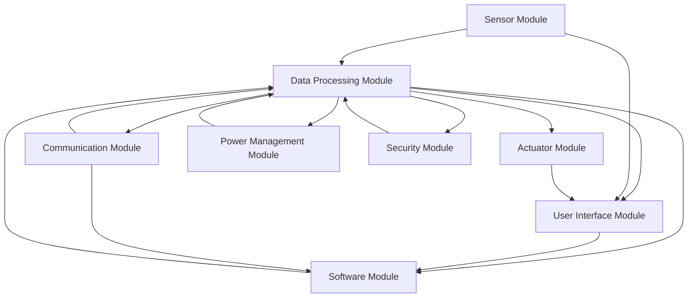

                 


### AI Agent in Intelligent Backpack Weight Balance Reminder

> Keywords: AI Agent, Intelligent Backpack, Weight Balance, Wearable Technology, Human-Computer Interaction

> Abstract:
In this article, we delve into the integration of AI agents within intelligent backpacks to address the issue of weight balance. We explore the fundamental concepts of AI agents and intelligent backpacks, analyze the challenges posed by weight imbalance, and discuss the architectural design and algorithms necessary for effective weight balance reminder systems. Through step-by-step analysis and practical implementations, we aim to provide a comprehensive understanding of this innovative technology.

## Introduction to AI Agents and Intelligent Backpacks

### 1.1 Introduction to AI Agents

#### 1.1.1 Definition and Importance

AI agents are autonomous entities designed to interact with their environment and make decisions based on data collected from sensors and actuators. These agents are at the core of various applications, ranging from autonomous vehicles to personal assistants like Siri and Alexa. The importance of AI agents lies in their ability to enhance efficiency, improve user experience, and enable complex tasks in various domains.

#### 1.1.2 Types of AI Agents

AI agents can be categorized into several types based on their functionality and the environment they operate in:

- **Search Agents**: These agents navigate through an environment to find a specific object or location.

- **Task-Oriented Agents**: These agents are designed to perform specific tasks, such as monitoring environmental conditions or assisting with household chores.

- **Socially Aware Agents**: These agents are capable of understanding and mimicking human social behaviors, making them suitable for applications like virtual assistants and chatbots.

- **Robotic Agents**: These agents are physical robots that interact with their environment through sensors and actuators.

#### 1.1.3 Applications in Modern Society

AI agents have found widespread applications in modern society, ranging from healthcare and education to transportation and entertainment. Some notable applications include:

- **Healthcare**: AI agents can monitor patients remotely, track their health status, and provide real-time alerts to healthcare providers.

- **Education**: Intelligent tutoring systems use AI agents to adapt to the learning pace of individual students, providing personalized educational content.

- **Transportation**: Autonomous vehicles equipped with AI agents can navigate roads and highways safely without human intervention.

- **Entertainment**: AI agents are used in games and virtual reality applications to create immersive and interactive experiences.

### 1.2 Introduction to Intelligent Backpacks

#### 1.2.1 Design and Features

Intelligent backpacks are designed to integrate various technological components, making them more functional and user-friendly. Key features of intelligent backpacks include:

- **Sensors**: These sensors, such as weight sensors, motion sensors, and GPS, collect data about the backpack's environment and usage patterns.

- **Processors**: Intelligent backpacks are equipped with powerful processors that process the data collected by the sensors and make real-time decisions.

- **Battery**: Long-lasting batteries are crucial for ensuring that intelligent backpacks remain functional throughout the day.

- **Connectivity**: Intelligent backpacks often feature Wi-Fi, Bluetooth, and cellular connectivity to facilitate communication with other devices and the internet.

#### 1.2.2 Technological Integration

The integration of various technologies into intelligent backpacks is a complex task that requires careful consideration of the following components:

- **Hardware Integration**: The selection and integration of hardware components, such as sensors, processors, and batteries, are critical to the overall performance of intelligent backpacks.

- **Software Integration**: Developing software that can efficiently process data, make real-time decisions, and communicate with other devices is essential for intelligent backpacks.

- **User Interface**: A user-friendly interface that allows users to interact with the intelligent backpack's features and settings is crucial for a positive user experience.

#### 1.2.3 User Needs and Market Trends

The demand for intelligent backpacks is driven by several factors, including the need for convenience, safety, and improved productivity. Key user needs and market trends include:

- **Convenience**: Users desire backpacks that can adapt to their needs and provide real-time feedback, making their lives more comfortable.

- **Safety**: Weight imbalance in backpacks can lead to physical discomfort and even injuries. Intelligent backpacks can help mitigate these risks by monitoring weight distribution and providing alerts.

- **Productivity**: Intelligent backpacks can assist users in organizing their tasks and managing their time more effectively.

- **Sustainability**: As people become more environmentally conscious, the demand for sustainable and energy-efficient backpacks is on the rise.

## Challenges in Backpack Weight Balance

#### 1.3.1 Physical and Health Impacts

Improper weight distribution in backpacks can lead to several physical and health issues, including:

- **Back Pain**: Uneven weight distribution can cause strain on the lower back, leading to chronic back pain.

- **Shoulder and Neck Pain**: Carrying a heavy load on one side of the body can cause shoulder and neck pain, as well as muscle imbalances.

- **Posture Issues**: Poor posture resulting from carrying a heavy backpack can lead to long-term health issues, such as lordosis or kyphosis.

- **Muscle Fatigue**: Carrying a heavy load can cause muscle fatigue, especially in the shoulders, back, and legs.

#### 1.3.2 Societal and Educational Implications

The societal and educational implications of backpack weight imbalance are significant:

- **Productivity Loss**: Students and workers who experience discomfort and pain due to heavy backpacks may experience decreased productivity.

- **Healthcare Costs**: Treating the physical and health issues resulting from improper backpack weight distribution can be costly for individuals and society as a whole.

- **Educational Disruption**: Students with heavy backpacks may find it difficult to concentrate on their studies, leading to a decline in educational performance.

- **Environmental Impact**: Traditional backpacks made from non-sustainable materials contribute to environmental pollution, whereas intelligent backpacks made from eco-friendly materials can help mitigate this issue.

#### 1.3.3 Current Solutions and Limitations

Several solutions have been proposed to address the issue of backpack weight balance, but they come with their own limitations:

- **Weight Redistribution Straps**: These straps redistribute the weight of the backpack across both shoulders, but they do not address the issue of uneven weight distribution within the backpack itself.

- **Lumbar Support Belts**: These belts provide additional support to the lower back, but they do not address the root cause of the problem, which is uneven weight distribution.

- **Adjustable Shoulder Straps**: Adjustable shoulder straps allow users to customize the fit of their backpack, but they do not provide real-time feedback or automatically adjust to maintain balance.

- **Intelligent Backpacks**: Intelligent backpacks equipped with sensors and AI agents can monitor weight distribution and provide real-time feedback, but their cost and complexity may be prohibitive for some users.

## AI Agent Architectures and Algorithms

### 2.1 AI Agent Architectural Design

#### 2.1.1 Basic Components

An AI agent typically consists of several key components:

- **Sensors**: These collect data from the environment, such as weight distribution, temperature, and motion.

- **Processor**: The processor processes the data collected by the sensors and uses it to make decisions.

- **Memory**: The memory stores data and instructions that the processor needs to execute tasks.

- **Actuators**: These execute the decisions made by the processor, such as adjusting the weight distribution within the backpack.

#### 2.1.2 Learning and Decision-Making Processes

AI agents use machine learning algorithms to learn from the data collected by their sensors and improve their decision-making capabilities over time. The learning and decision-making processes can be summarized as follows:

1. **Data Collection**: The AI agent collects data from its sensors and stores it in its memory.

2. **Data Processing**: The processor processes the data and extracts relevant features that can be used to make decisions.

3. **Learning**: The AI agent uses machine learning algorithms to analyze the data and identify patterns and relationships.

4. **Decision-Making**: Based on the learned patterns, the AI agent makes decisions on how to adjust the weight distribution within the backpack.

5. **Feedback**: The AI agent collects feedback on the effectiveness of its decisions and uses it to improve its future performance.

#### 2.1.3 Real-Time Monitoring and Feedback Systems

Real-time monitoring and feedback systems are essential for intelligent backpacks to ensure that weight distribution is continuously adjusted to maintain balance. These systems can be implemented using the following components:

- **Real-Time Sensors**: High-precision sensors that continuously monitor weight distribution and other relevant variables.

- **Real-Time Processor**: A processor capable of processing sensor data in real-time and making rapid decisions.

- **Real-Time Actuators**: Actuators that can adjust the weight distribution within the backpack quickly and efficiently.

- **Real-Time Feedback**: Systems that provide real-time feedback on the effectiveness of the AI agent's decisions and allow for continuous improvement.

### 2.2 Weight Balance Algorithms

#### 2.2.1 Overview of Weight Balance Algorithms

Weight balance algorithms are designed to analyze the data collected by the sensors and make real-time adjustments to maintain optimal weight distribution. These algorithms can be broadly categorized into two types:

- **Static Algorithms**: These algorithms analyze the static data collected by the sensors and make adjustments based on predefined rules. Examples include simple threshold-based algorithms that trigger alerts when weight exceeds a certain limit.

- **Dynamic Algorithms**: These algorithms analyze both static and dynamic data collected by the sensors and make real-time adjustments to maintain balance. Examples include machine learning algorithms that learn from past data and predict future weight distribution patterns.

#### 2.2.2 Common Techniques and Methods

Several techniques and methods are commonly used in weight balance algorithms, including:

- **Data Preprocessing**: Techniques such as normalization, feature extraction, and dimensionality reduction are used to preprocess the data collected by the sensors.

- **Machine Learning Algorithms**: Algorithms such as decision trees, neural networks, and support vector machines are used to analyze the preprocessed data and make real-time adjustments.

- **Optimization Algorithms**: Optimization algorithms such as genetic algorithms and particle swarm optimization are used to find optimal solutions for weight distribution adjustments.

- **Real-Time Decision-Making**: Techniques such as real-time simulation and model-based control are used to make rapid decisions based on the data collected by the sensors.

#### 2.2.3 Performance Evaluation and Optimization

The performance of weight balance algorithms can be evaluated using various metrics, including:

- **Accuracy**: The accuracy of the algorithm in predicting weight distribution patterns.

- **Response Time**: The time taken by the algorithm to process sensor data and make adjustments.

- **Efficiency**: The efficiency of the algorithm in terms of computational resources used.

- **Robustness**: The ability of the algorithm to handle unexpected changes in weight distribution.

To optimize the performance of weight balance algorithms, various techniques can be employed, including:

- **Algorithm Selection**: Choosing the most suitable algorithm based on the specific requirements of the application.

- **Parameter Tuning**: Fine-tuning the parameters of the selected algorithm to improve performance.

- **Data Augmentation**: Increasing the amount and quality of data available for training the algorithm.

- **Hardware Acceleration**: Utilizing specialized hardware, such as GPUs or FPGAs, to accelerate the processing of sensor data and improve real-time performance.

## Implementation and Integration of AI Agents in Intelligent Backpacks

### 3.1 Choosing the Right Hardware

#### 3.1.1 Sensor Selection

Selecting the appropriate sensors is crucial for the accuracy and reliability of an intelligent backpack's weight balance system. Key factors to consider when choosing sensors include:

- **Accuracy**: Sensors should provide high-precision measurements to ensure accurate weight distribution monitoring.

- **Range**: Sensors should have a suitable range to cover the entire backpack and detect weight distribution across different compartments.

- **Durability**: Sensors should be durable and resistant to environmental factors, such as temperature fluctuations and water exposure.

- **Power Consumption**: Sensors should consume minimal power to extend battery life and reduce the need for frequent recharging.

Common sensor types used in intelligent backpacks include:

- **Load Cells**: Load cells are highly accurate and durable sensors that measure the force and weight applied to them. They are ideal for monitoring weight distribution in backpacks.

- **Pressure Sensors**: Pressure sensors can detect changes in pressure, which can be used to infer weight distribution. They are relatively low-cost and easy to implement.

- **Inertial Measurement Units (IMUs)**: IMUs measure acceleration, rotation, and orientation, which can be used to estimate weight distribution based on dynamic movements.

#### 3.1.2 Processor and Storage Solutions

The choice of processor and storage solutions is critical for processing sensor data and making real-time adjustments to maintain weight balance. Key factors to consider include:

- **Processing Power**: The processor should be capable of handling the high data rates generated by multiple sensors and executing complex algorithms in real-time.

- **Memory Capacity**: The memory should be sufficient to store large datasets and allow for efficient processing and analysis.

- **Power Efficiency**: The processor should consume minimal power to prolong battery life and reduce the need for frequent recharging.

- **Compatibility**: The processor and storage solutions should be compatible with the chosen sensor types and software frameworks.

Common processor and storage solutions used in intelligent backpacks include:

- **Microcontrollers**: Microcontrollers, such as Arduino or Raspberry Pi, offer a cost-effective and flexible solution for processing sensor data and executing weight balance algorithms.

- **Application Processors**: Application processors, such as ARM-based processors, offer higher processing power and efficiency compared to microcontrollers. They are suitable for more complex weight balance systems.

- **Solid-State Drives (SSDs)**: SSDs provide fast data access and storage capabilities, which are essential for real-time processing and analysis.

- **Flash Memory**: Flash memory, such as SD cards or USB drives, can be used for additional storage and data logging.

### 3.2 Selecting the Appropriate Software

#### 3.2.1 Programming Languages and Tools

Choosing the right programming language and tools is essential for developing a robust and efficient weight balance system. Key factors to consider include:

- **Ease of Use**: The programming language should be easy to learn and use, especially for developers without extensive experience in AI and sensor integration.

- **Performance**: The programming language should provide high performance and low-level access to hardware resources for efficient data processing and real-time decision-making.

- **Community and Ecosystem**: The programming language should have a strong community and ecosystem of libraries, frameworks, and tools to support development and troubleshooting.

Common programming languages and tools used in intelligent backpacks include:

- **Python**: Python is a versatile and easy-to-learn programming language with a rich ecosystem of libraries and frameworks for AI and sensor integration.

- **C/C++**: C and C++ offer high performance and low-level access to hardware resources, making them suitable for complex weight balance systems.

- **JavaScript**: JavaScript is a popular choice for developing web-based applications and can be used to create interactive user interfaces for intelligent backpacks.

#### 3.2.2 Software Frameworks and Libraries

Software frameworks and libraries can significantly simplify the development process and enhance the functionality of an intelligent backpack's weight balance system. Key factors to consider include:

- **Modularity**: The framework should be modular, allowing developers to easily integrate various components, such as sensors, processors, and actuators.

- **Scalability**: The framework should support scalability, enabling developers to add new features and extend the system's capabilities without significant rework.

- **Ease of Integration**: The framework should be compatible with the chosen programming language and hardware solutions.

- **Community and Support**: The framework should have a strong community and support resources, such as documentation, tutorials, and forums, to help developers troubleshoot issues and optimize their systems.

Common software frameworks and libraries used in intelligent backpacks include:

- **TensorFlow**: TensorFlow is an open-source machine learning library that offers a wide range of tools and resources for developing AI applications.

- **OpenCV**: OpenCV is an open-source computer vision library that provides tools for image processing, object detection, and tracking, which can be useful for monitoring weight distribution.

- **PyTorch**: PyTorch is a popular machine learning library that offers ease of use and flexibility for developing and deploying AI models.

#### 3.2.3 Development Environment Setup

Setting up an appropriate development environment is crucial for efficient and effective development of an intelligent backpack's weight balance system. Key steps in the setup process include:

1. **Hardware Compatibility**: Ensure that the chosen hardware components, such as sensors, processors, and actuators, are compatible with the development environment and software frameworks.

2. **Software Installation**: Install the necessary software, including the programming language, development tools, and libraries, on the target hardware or a development machine.

3. **Sensor Integration**: Integrate the sensors with the development environment and test their functionality using appropriate libraries and tools.

4. **Processor and Memory Configuration**: Configure the processor and memory settings to optimize performance and ensure efficient data processing.

5. **Software Development**: Develop the weight balance system using the selected programming language, software frameworks, and libraries, following best practices and design principles.

6. **Testing and Debugging**: Test and debug the weight balance system to identify and resolve any issues, ensuring that it functions correctly in various scenarios and environments.

## System Integration and Testing

### 4.1 Integrating AI Agents with Backpack Systems

#### 4.1.1 Data Collection and Processing

The integration of AI agents with backpack systems begins with data collection and processing. The sensors embedded in the intelligent backpack collect various types of data, including weight distribution, motion, temperature, and environmental conditions. This data is processed by the AI agent's processor to extract relevant information and identify patterns related to weight balance.

Key steps in data collection and processing include:

1. **Sensor Data Collection**: The sensors continuously collect data and transmit it to the AI agent's processor.

2. **Data Preprocessing**: The collected data is preprocessed to remove noise, normalize the data, and extract relevant features.

3. **Feature Extraction**: The preprocessed data is analyzed to extract key features that can be used to determine weight distribution and balance.

4. **Data Storage**: The extracted features and processed data are stored in memory or a database for further analysis and decision-making.

#### 4.1.2 Real-Time Decision-Making

Real-time decision-making is a critical component of integrating AI agents with backpack systems. The AI agent uses machine learning algorithms and other techniques to analyze the collected data and make real-time adjustments to maintain optimal weight balance.

Key steps in real-time decision-making include:

1. **Pattern Recognition**: The AI agent uses machine learning algorithms to identify patterns in the collected data and determine the current weight distribution and balance status.

2. **Decision-Making**: Based on the analyzed data and predefined rules, the AI agent makes decisions on how to adjust the weight distribution within the backpack.

3. **Actuator Control**: The AI agent sends control signals to the actuators, which adjust the weight distribution by redistributing the load or making other necessary adjustments.

4. **Feedback Loop**: The AI agent continuously monitors the effects of its decisions and adjusts its strategy based on real-time feedback to optimize weight balance.

#### 4.1.3 Integration with User Interface

Integrating AI agents with a user interface allows users to interact with the intelligent backpack and monitor weight balance in real-time. The user interface can display various metrics, such as weight distribution, balance status, and battery level.

Key steps in integrating AI agents with a user interface include:

1. **Data Visualization**: The user interface visualizes the collected data and real-time decisions made by the AI agent using charts, graphs, and other visual elements.

2. **User Interaction**: The user interface provides interactive controls and options for users to adjust settings, customize preferences, and receive notifications.

3. **Feedback Mechanism**: The user interface allows users to provide feedback on the performance of the intelligent backpack and AI agent, which can be used to improve the system over time.

### 4.2 Testing and Validation

Testing and validation are crucial steps in ensuring the reliability and effectiveness of an intelligent backpack's weight balance system. Key steps in testing and validation include:

#### 4.2.1 Unit Testing

Unit testing involves testing individual components or modules of the intelligent backpack system to ensure they function correctly in isolation. Key steps in unit testing include:

1. **Test Case Development**: Developing test cases that cover all possible scenarios and edge cases to ensure comprehensive testing.

2. **Test Execution**: Executing the test cases and recording the results.

3. **Defect Reporting**: Identifying and reporting any defects or issues found during testing.

4. **Bug Fixing**: Fixing the identified defects and retesting the components.

#### 4.2.2 Integration Testing

Integration testing involves testing the interaction and integration of different components or modules of the intelligent backpack system. Key steps in integration testing include:

1. **Test Case Development**: Developing test cases that cover the integration of sensors, processors, actuators, and user interface components.

2. **Test Execution**: Executing the test cases and recording the results.

3. **Defect Reporting**: Identifying and reporting any defects or issues found during testing.

4. **Bug Fixing**: Fixing the identified defects and retesting the integrated components.

#### 4.2.3 System Testing

System testing involves testing the entire intelligent backpack system in a realistic environment to ensure its functionality and performance. Key steps in system testing include:

1. **Test Case Development**: Developing test cases that cover various scenarios and conditions, such as different weight distributions, motion, and environmental conditions.

2. **Test Execution**: Executing the test cases and recording the results.

3. **Defect Reporting**: Identifying and reporting any defects or issues found during testing.

4. **Bug Fixing**: Fixing the identified defects and retesting the system.

#### 4.2.4 User Acceptance Testing

User acceptance testing involves testing the intelligent backpack system with end-users to ensure it meets their requirements and expectations. Key steps in user acceptance testing include:

1. **Test Case Development**: Developing test cases based on user feedback and requirements.

2. **Test Execution**: Executing the test cases and recording the results.

3. **Feedback Collection**: Collecting user feedback on the system's performance, usability, and functionality.

4. **Improvement Implementation**: Implementing improvements based on user feedback and retesting the system.

### 4.3 Performance Optimization

Performance optimization is an ongoing process aimed at improving the efficiency, reliability, and responsiveness of the intelligent backpack's weight balance system. Key steps in performance optimization include:

#### 4.3.1 Code Optimization

Optimizing the codebase can significantly improve the performance of the intelligent backpack's weight balance system. Key steps in code optimization include:

1. **Profiling**: Using profiling tools to identify performance bottlenecks and areas for improvement.

2. **Algorithm Optimization**: Analyzing and optimizing the algorithms used for data processing and decision-making to reduce computational complexity and improve efficiency.

3. **Memory Management**: Optimizing memory allocation and usage to reduce memory overhead and improve system performance.

4. **Concurrency and Parallelism**: Leveraging concurrency and parallelism to speed up data processing and decision-making.

#### 4.3.2 Hardware Optimization

Optimizing the hardware components of the intelligent backpack can also improve system performance. Key steps in hardware optimization include:

1. **Processor and Memory Upgrades**: Upgrading the processor and memory to handle higher data rates and more complex algorithms.

2. **Sensor Calibration**: Calibrating sensors to improve accuracy and reduce noise.

3. **Power Management**: Implementing power management techniques to extend battery life and reduce power consumption.

4. **Connectivity Optimization**: Optimizing Wi-Fi, Bluetooth, and cellular connectivity to reduce latency and improve communication reliability.

#### 4.3.3 System Monitoring and Diagnostics

Monitoring the intelligent backpack's weight balance system in real-time can help identify and resolve performance issues. Key steps in system monitoring and diagnostics include:

1. **Real-Time Monitoring**: Implementing real-time monitoring tools to track system performance and detect anomalies.

2. **Error Logging**: Logging errors and exceptions to identify and resolve issues that may affect system performance.

3. **Health Checks**: Conducting regular health checks to ensure that all components are functioning correctly and within specified limits.

4. **Feedback Analysis**: Analyzing user feedback and system logs to identify patterns and potential areas for improvement.

## Conclusion

The integration of AI agents in intelligent backpacks represents a significant advancement in wearable technology, addressing the issue of backpack weight balance in a novel and effective manner. Through the careful selection of hardware and software components, the development of robust algorithms, and thorough testing and optimization, intelligent backpacks can provide real-time weight balance monitoring and adjustment, improving user comfort, productivity, and overall well-being.

As the field of AI continues to evolve, intelligent backpacks equipped with AI agents have the potential to revolutionize the way we interact with and utilize wearable technology. Future research and development may focus on enhancing the accuracy and responsiveness of weight balance algorithms, improving battery life and energy efficiency, and expanding the capabilities of intelligent backpacks to include other functions, such as environmental monitoring, health tracking, and smart organization.

By addressing the challenges and opportunities presented by AI agents in intelligent backpacks, we can create a more comfortable, efficient, and sustainable future for both individuals and society as a whole.### Chapter 1: Background and Fundamental Concepts

In this chapter, we delve into the background and fundamental concepts of AI agents and intelligent backpacks, highlighting their importance and exploring the various types of AI agents. Additionally, we discuss the technological integration and user needs driving the demand for intelligent backpacks.

#### 1.1 Introduction to AI Agents

**1.1.1 Definition and Importance**

An AI agent, in the context of artificial intelligence, refers to a system that perceives its environment through sensors and takes actions to achieve specific goals based on its observations and data processing. These agents are designed to mimic human behavior and decision-making processes, albeit through algorithms and data-driven methods.

The importance of AI agents cannot be overstated. They have revolutionized various industries, ranging from healthcare to manufacturing, by automating tasks, improving efficiency, and enhancing user experiences. In the context of intelligent backpacks, AI agents play a crucial role in monitoring weight distribution, providing real-time feedback, and making adjustments to ensure optimal comfort and balance.

**1.1.2 Types of AI Agents**

AI agents can be broadly categorized based on their functionality and the environment they operate in. Here are some common types:

- **Search Agents**: These agents are designed to explore and search for specific objects or locations within an environment. They are commonly used in robotics and autonomous vehicles.

- **Task-Oriented Agents**: These agents are focused on performing specific tasks, such as monitoring environmental conditions, managing resources, or assisting users in their daily activities. Examples include smart home assistants and industrial automation systems.

- **Socially Aware Agents**: These agents are capable of understanding and mimicking human social behaviors, making them suitable for applications like virtual assistants, chatbots, and social robots. They often require advanced natural language processing and machine learning techniques.

- **Robotic Agents**: These agents are physical robots equipped with sensors, actuators, and AI algorithms to interact with their environment. They are widely used in industries like manufacturing, logistics, and healthcare.

**1.1.3 Applications in Modern Society**

AI agents have found diverse applications in modern society, contributing to various aspects of our daily lives. Some notable applications include:

- **Healthcare**: AI agents are used for remote patient monitoring, drug discovery, and personalized medical treatments. They can analyze large datasets to identify patterns and provide insights that aid in diagnosis and treatment.

- **Transportation**: AI agents are integral to autonomous vehicles, traffic management systems, and smart transportation solutions. They help in optimizing routes, improving safety, and reducing congestion.

- **Education**: AI agents are used in intelligent tutoring systems, adaptive learning platforms, and virtual classrooms. They provide personalized educational content, adapt to individual learning styles, and offer real-time feedback.

- **Entertainment**: AI agents are used in gaming, virtual reality, and augmented reality applications to create immersive and interactive experiences. They can adapt to user preferences and behaviors, enhancing the overall experience.

#### 1.2 Introduction to Intelligent Backpacks

**1.2.1 Design and Features**

Intelligent backpacks are designed to incorporate various technological components to enhance functionality, comfort, and convenience. These backpacks typically feature the following components:

- **Sensors**: Sensors such as weight sensors, motion sensors, and GPS modules are embedded in intelligent backpacks to collect data related to weight distribution, movement, and location.

- **Processor**: A compact processor, often based on microcontrollers or application-specific integrated circuits (ASICs), is responsible for processing sensor data and executing algorithms to maintain weight balance.

- **Battery**: Intelligent backpacks require a power source, typically a rechargeable battery, to power the sensors, processor, and other components. Battery life is a crucial factor, as users need their backpacks to function throughout the day without frequent recharging.

- **Connectivity**: Connectivity options, such as Wi-Fi, Bluetooth, and cellular data, allow intelligent backpacks to communicate with other devices, transfer data to the cloud, and receive real-time updates and alerts.

- **User Interface**: A user interface, often in the form of a mobile app or display panel on the backpack itself, allows users to interact with the intelligent backpack, customize settings, and view weight distribution data.

**1.2.2 Technological Integration**

The integration of technology within intelligent backpacks involves several key aspects:

- **Hardware Integration**: This includes selecting and integrating appropriate sensors, processors, batteries, and connectivity modules. Ensuring compatibility and efficient communication between these components is essential.

- **Software Integration**: Developing software that can process sensor data, execute algorithms, and provide real-time feedback is a complex task. This software must be robust, scalable, and user-friendly to provide an optimal user experience.

- **User Experience**: The user interface and overall user experience play a significant role in the success of intelligent backpacks. A seamless and intuitive user interface can greatly enhance user satisfaction and the effectiveness of the backpack.

**1.2.3 User Needs and Market Trends**

The demand for intelligent backpacks is driven by several user needs and market trends:

- **Comfort**: Users seek backpacks that distribute weight evenly and minimize the risk of discomfort and injury, particularly in cases where heavy loads are carried.

- **Productivity**: Users require backpacks that can assist in organizing their workload, providing real-time notifications, and enhancing overall productivity.

- **Safety**: Weight imbalance in backpacks can lead to safety concerns, such as slips, trips, and falls. Intelligent backpacks can help mitigate these risks by monitoring weight distribution and providing alerts.

- **Sustainability**: As environmental consciousness grows, there is a trend towards using eco-friendly materials and energy-efficient technologies in backpacks.

- **Integration with Smart Devices**: Users increasingly expect their intelligent backpacks to integrate seamlessly with other smart devices and platforms, providing a cohesive and connected experience.

### Summary

In summary, this chapter has provided an overview of the fundamental concepts of AI agents and intelligent backpacks. We explored the importance and types of AI agents, highlighted the key features and design aspects of intelligent backpacks, and discussed the technological integration and user needs driving the demand for these innovative devices. As we move forward, we will delve deeper into the algorithms and systems that enable intelligent backpacks to monitor and adjust weight distribution, addressing the challenges and opportunities in this emerging field.### Chapter 2: AI Agent Architectural Design

In this chapter, we will delve into the architectural design of AI agents, examining the key components that make up an AI agent system, including sensors, processors, memory, and actuators. We will also explore the learning and decision-making processes of AI agents, and discuss real-time monitoring and feedback systems.

#### 2.1.1 Basic Components

The architectural design of an AI agent system is composed of several essential components that work together to enable autonomous behavior and decision-making. These components include:

**Sensors**

Sensors are devices that detect and measure physical inputs from the environment. In the context of intelligent backpacks, sensors play a critical role in collecting data related to weight distribution, motion, and environmental conditions. Common sensors used in AI agent systems include:

- **Load Cells**: These sensors measure the force and weight applied to them, providing accurate weight distribution data.
- **Inertial Measurement Units (IMUs)**: IMUs measure acceleration, rotation, and orientation, which are useful for tracking dynamic movements and posture.
- **Temperature Sensors**: These sensors monitor the temperature inside the backpack and its surroundings, ensuring optimal conditions for both user comfort and device performance.
- **Motion Sensors**: Motion sensors detect the movement of the backpack and its contents, providing valuable data for balance adjustments.

**Processor**

The processor is the "brain" of the AI agent system, responsible for processing sensor data, executing algorithms, and making real-time decisions. The choice of processor depends on the complexity of the tasks and the performance requirements. Common types of processors used in AI agents include:

- **Microcontrollers**: These are compact, low-power processors designed for specific tasks and are commonly used in simple AI applications.
- **Application Processors**: These processors offer more computational power and versatility, suitable for more complex AI applications.
- **Field-Programmable Gate Arrays (FPGAs)**: FPGAs are reconfigurable chips that can be programmed to perform specific tasks, providing high performance and flexibility.
- **System-on-Chips (SoCs)**: SoCs integrate multiple components, including processors, memory, and I/O interfaces, into a single chip, offering a compact and efficient solution.

**Memory**

Memory is crucial for storing data, instructions, and models required by the AI agent. There are different types of memory used in AI agent systems:

- **Random-Access Memory (RAM)**: RAM provides fast data access and is used to store data temporarily during processing.
- **Read-Only Memory (ROM)**: ROM stores permanent instructions and data that do not change, such as the AI agent's firmware and models.
- **Non-Volatile Memory (NVM)**: NVM, such as Flash memory or EEPROM, retains data even when power is removed, making it suitable for storing settings, logs, and updates.

**Actuators**

Actuators are devices that execute the actions determined by the AI agent's processor. In the context of intelligent backpacks, actuators can be used to adjust the weight distribution, such as moving load compartments or activating cushioning systems. Common actuators include:

- **Motor Actuators**: These actuators use motors to move components within the backpack, providing mechanical adjustments.
- **Pneumatic and Hydraulic Actuators**: These actuators use compressed air or fluid to create movement, suitable for larger or more forceful adjustments.
- **Electrostatic Actuators**: These actuators use electrostatic forces to move components, offering precise and low-power control.

#### 2.1.2 Learning and Decision-Making Processes

The core of an AI agent's functionality is its ability to learn from its environment and make informed decisions. This process can be broken down into several key steps:

**Data Collection**

AI agents collect data from their sensors to gain insights into their environment. This data can include various types, such as weight measurements, motion patterns, and environmental conditions. The quality and quantity of the collected data are crucial for the agent's learning and decision-making processes.

**Data Preprocessing**

Once the data is collected, it needs to be preprocessed to remove noise, fill missing values, and normalize the data. This step ensures that the data is in a suitable format for analysis and that it represents the true state of the environment accurately.

**Learning**

The AI agent uses machine learning algorithms to analyze the preprocessed data and identify patterns and correlations. These algorithms can range from simple statistical models to complex neural networks, depending on the complexity of the task. The learning process allows the agent to understand the environment and predict future events based on historical data.

**Decision-Making**

Based on the learned patterns and current sensor data, the AI agent makes decisions on how to act in its environment. This process involves selecting the best course of action from a set of possible options, considering factors such as efficiency, safety, and user preferences.

**Feedback**

The agent's actions are monitored, and feedback is collected to evaluate the effectiveness of its decisions. This feedback is then used to refine the agent's models and improve its future performance. The feedback loop ensures continuous learning and adaptation to changing conditions.

#### 2.1.3 Real-Time Monitoring and Feedback Systems

Real-time monitoring and feedback systems are critical for ensuring that AI agents can respond to changes in their environment quickly and effectively. These systems involve several components:

**Real-Time Sensors**

High-precision sensors are used to collect real-time data related to the environment and the agent's actions. These sensors should be capable of providing accurate and timely information to the agent's processor.

**Real-Time Processor**

The processor must be capable of processing sensor data in real-time, making rapid decisions based on the current state of the environment. This requires efficient algorithms and high computational performance to ensure that the agent can respond quickly to changes.

**Real-Time Actuators**

Actuators are used to execute the agent's decisions in real-time. These actuators should be capable of responding to control signals from the processor with minimal delay, ensuring that the agent's actions have a direct and immediate impact on its environment.

**Feedback Loop**

The feedback loop involves collecting real-time data on the agent's actions and their effects on the environment. This data is then used to refine the agent's models and improve its decision-making capabilities over time. A robust feedback loop ensures that the agent can adapt to changing conditions and continue to provide valuable insights and actions.

### Summary

In summary, this chapter has provided an in-depth look at the architectural design of AI agents, highlighting the key components of an AI agent system and discussing the learning and decision-making processes. We explored the roles of sensors, processors, memory, and actuators in enabling autonomous behavior and discussed the importance of real-time monitoring and feedback systems. As we move forward, we will delve into specific algorithms and techniques used in weight balance monitoring and adjustment, providing a deeper understanding of how intelligent backpacks maintain optimal weight distribution.### Chapter 3: Weight Balance Algorithms

In this chapter, we will explore the algorithms used to monitor and adjust weight balance within intelligent backpacks. We will begin by providing an overview of weight balance algorithms, then delve into common techniques and methods, and finally discuss performance evaluation and optimization strategies.

#### 3.2.1 Overview of Weight Balance Algorithms

Weight balance algorithms are designed to analyze the data collected by sensors embedded in intelligent backpacks and make real-time adjustments to ensure optimal weight distribution. These algorithms can be categorized into static and dynamic algorithms, each with its own set of techniques and methods.

**Static Algorithms**

Static algorithms make decisions based on the current state of the backpack without considering historical data or future changes. They are simpler to implement but may not be as effective in dynamic environments. Common static algorithms include:

- **Threshold-Based Algorithms**: These algorithms set predefined thresholds for weight distribution and trigger alerts or adjustments when these thresholds are exceeded.

- **Rule-Based Algorithms**: These algorithms use a set of predefined rules to determine the appropriate actions based on the current weight distribution. For example, if the weight on one side of the backpack exceeds a certain percentage, the algorithm may trigger a load redistribution mechanism.

**Dynamic Algorithms**

Dynamic algorithms consider both current and historical data to make more informed and adaptive decisions. They can respond to changes in weight distribution over time and adjust the backpack's configuration accordingly. Common dynamic algorithms include:

- **Machine Learning Algorithms**: These algorithms analyze historical data and learn patterns in weight distribution to make predictions and recommendations. Examples include regression models, neural networks, and decision trees.

- **Optimization Algorithms**: These algorithms use mathematical optimization techniques to find the optimal weight distribution configuration. Examples include linear programming, genetic algorithms, and particle swarm optimization.

#### 3.2.2 Common Techniques and Methods

The development and implementation of weight balance algorithms involve several techniques and methods. Here, we will discuss some of the most common techniques and methods used in weight balance algorithms:

**Data Preprocessing**

Data preprocessing is a crucial step in the development of weight balance algorithms. It involves cleaning and transforming raw sensor data into a suitable format for analysis. Common preprocessing techniques include:

- **Noise Reduction**: Techniques such as filtering and smoothing are used to remove noise and random fluctuations from the sensor data.

- **Feature Extraction**: Techniques such as normalization, dimensionality reduction, and feature selection are used to extract relevant features from the sensor data and reduce the data dimension.

- **Data Imputation**: Techniques such as interpolation and regression are used to fill missing or incomplete data points.

**Machine Learning Algorithms**

Machine learning algorithms play a vital role in weight balance algorithms, particularly in dynamic systems where the environment is constantly changing. Common machine learning algorithms used in weight balance include:

- **Regression Models**: Regression models, such as linear regression and polynomial regression, are used to predict weight distribution based on historical data.

- **Neural Networks**: Neural networks, particularly deep learning models, are used to analyze complex patterns in sensor data and make accurate predictions.

- **Decision Trees**: Decision trees are used to classify weight distribution into different categories and make recommendations based on the classification.

**Optimization Algorithms**

Optimization algorithms are used to find the optimal weight distribution configuration based on predefined objectives and constraints. Common optimization algorithms used in weight balance include:

- **Linear Programming**: Linear programming is used to solve optimization problems with linear constraints and objectives.

- **Genetic Algorithms**: Genetic algorithms are used to search for optimal solutions by simulating the process of natural selection and evolution.

- **Particle Swarm Optimization**: Particle swarm optimization is used to find optimal solutions by simulating the social behavior of particles in a swarm.

#### 3.2.3 Performance Evaluation and Optimization

The performance of weight balance algorithms is critical to the effectiveness of intelligent backpacks. Performance evaluation and optimization are essential steps in ensuring that algorithms meet the desired accuracy, response time, and efficiency criteria. Here are some common methods for evaluating and optimizing weight balance algorithms:

**Performance Metrics**

Performance metrics are used to evaluate the accuracy, efficiency, and reliability of weight balance algorithms. Common performance metrics include:

- **Accuracy**: The accuracy of the algorithm in predicting weight distribution patterns.

- **Response Time**: The time taken by the algorithm to process sensor data and make adjustments.

- **Efficiency**: The efficiency of the algorithm in terms of computational resources used.

- **Robustness**: The ability of the algorithm to handle unexpected changes in weight distribution.

**Optimization Techniques**

Several optimization techniques can be used to improve the performance of weight balance algorithms:

- **Algorithm Selection**: Choosing the most suitable algorithm based on the specific requirements of the application, such as the nature of the sensor data, the complexity of the environment, and the desired accuracy.

- **Parameter Tuning**: Fine-tuning the parameters of the selected algorithm to improve performance, such as adjusting learning rates, regularization parameters, or other hyperparameters.

- **Data Augmentation**: Increasing the amount and quality of data available for training the algorithm, which can help improve the algorithm's generalization capabilities.

- **Hardware Acceleration**: Utilizing specialized hardware, such as GPUs or FPGAs, to accelerate the processing of sensor data and improve real-time performance.

### Summary

In summary, this chapter has provided an in-depth exploration of weight balance algorithms used in intelligent backpacks. We discussed the overview of weight balance algorithms, common techniques and methods, and performance evaluation and optimization strategies. By understanding these algorithms and their applications, we can develop intelligent backpacks that effectively monitor and adjust weight distribution, providing users with a comfortable and balanced carrying experience. As we move forward, we will delve into the hardware and software integration processes, system testing, and performance optimization, ensuring that intelligent backpacks meet the highest standards of functionality and user satisfaction.### Chapter 4: Hardware and Software Selection

In this chapter, we will delve into the process of selecting the appropriate hardware and software components for an intelligent backpack system. This process is crucial for ensuring the system's functionality, efficiency, and overall performance. We will discuss the selection of sensors, processors, and storage solutions, as well as the choice of programming languages and software frameworks.

#### 4.1 Choosing the Right Hardware

The hardware selection process for an intelligent backpack system involves several critical components, including sensors, processors, and storage solutions. Each component plays a vital role in the system's overall performance and must be carefully chosen to meet the desired specifications.

**4.1.1 Sensor Selection**

Sensors are the primary input devices for an intelligent backpack system, providing data on weight distribution, motion, and environmental conditions. Selecting the right sensors is essential for ensuring accurate and reliable data collection.

**Accuracy**: Sensors should have high accuracy to ensure precise measurements. For weight distribution monitoring, load cells or pressure sensors are commonly used due to their high precision.

**Range**: The range of the sensors should be suitable for the size of the backpack and the range of weight variations it may encounter. For example, if the backpack is designed for heavy loads, the sensors should be capable of measuring weights up to the maximum expected load.

**Durability**: Sensors should be durable and resistant to environmental conditions such as temperature fluctuations, moisture, and physical impacts. This is particularly important for ensuring the longevity of the intelligent backpack.

**Power Consumption**: To prolong battery life, sensors should have low power consumption. Battery life is a critical factor for wearable devices like intelligent backpacks, which need to operate continuously throughout the day.

**Sensors for Weight Distribution Monitoring**:
- **Load Cells**: Load cells are highly accurate sensors that measure the force and weight applied to them. They are often used in industrial applications and can be integrated into intelligent backpacks for precise weight distribution monitoring.
- **Pressure Sensors**: Pressure sensors measure changes in pressure, which can be used to infer weight distribution. They are less expensive and easier to implement compared to load cells but may require calibration to achieve high accuracy.

**4.1.2 Processor and Storage Solutions**

The processor and storage solutions are central to the intelligent backpack system, responsible for processing sensor data, executing algorithms, and storing data.

**Processor Selection**:
- **Processing Power**: The processor should be capable of handling the computational load of processing sensor data and executing real-time algorithms. For simple systems, microcontrollers like Arduino or Raspberry Pi are suitable. For more complex applications, application-specific processors (ASPs) or system-on-chips (SoCs) may be required.
- **Efficiency**: The processor should consume minimal power to extend battery life. Energy-efficient processors are particularly important for wearable devices.
- **Integration**: The processor should be easily integrated with the other hardware components, such as sensors and actuators.

**Common Processors**:
- **Microcontrollers**: Microcontrollers like Arduino and Raspberry Pi are popular choices for simple to moderately complex intelligent backpack systems due to their ease of use and availability of development tools and libraries.
- **Application Processors**: Application processors like ARM-based processors offer higher performance and efficiency, making them suitable for more complex intelligent backpack systems.

**Storage Solutions**:
- **Solid-State Drives (SSDs)**: SSDs provide fast data access and storage capabilities, which are essential for real-time processing and analysis. They are more durable and have lower power consumption compared to traditional hard disk drives (HDDs).
- **Flash Memory**: Flash memory, such as SD cards or USB drives, is commonly used for additional storage and data logging. They are compact, have no moving parts, and offer fast read and write speeds.

**4.1.3 Power Supply and Battery Life**

The power supply and battery life are critical for the functionality of an intelligent backpack system. The battery should be capable of providing sufficient power to the system throughout the day, without frequent recharging.

**Battery Selection**:
- **Capacity**: The battery capacity should be sufficient to power the system for the desired duration. For example, a larger capacity battery may be required for a heavy-use scenario.
- **Energy Density**: The energy density of the battery determines how much power it can store. Li-ion batteries are commonly used due to their high energy density and long lifespan.
- **Charge Time**: The charge time of the battery should be minimal to ensure the user can quickly restore power when needed.

**Power Management**:
- **Power Efficient Components**: Choosing power-efficient sensors, processors, and actuators can significantly extend battery life.
- **Dynamic Power Regulation**: Implementing dynamic power regulation can help optimize power consumption by adjusting the power supply based on the system's current needs.

#### 4.2 Selecting the Appropriate Software

The software selection process is equally important for the success of an intelligent backpack system. The right programming languages, development tools, and software frameworks can streamline the development process and enhance the system's functionality and performance.

**4.2.1 Programming Languages**

**Ease of Use**: The programming language should be easy to learn and use, especially for developers without extensive experience in AI and sensor integration.

**Performance**: The programming language should provide high performance and low-level access to hardware resources for efficient data processing and real-time decision-making.

**Community and Ecosystem**: The programming language should have a strong community and ecosystem of libraries, frameworks, and tools to support development and troubleshooting.

**Common Programming Languages**:
- **Python**: Python is a versatile and easy-to-learn programming language with a rich ecosystem of libraries and frameworks for AI and sensor integration. It is widely used in data science, machine learning, and IoT applications.
- **C/C++**: C and C++ offer high performance and low-level access to hardware resources, making them suitable for complex weight balance systems. They are widely used in embedded systems and real-time applications.
- **JavaScript**: JavaScript is a popular choice for developing web-based applications and can be used to create interactive user interfaces for intelligent backpacks.

**4.2.2 Software Frameworks and Libraries**

**Modularity**: The framework should be modular, allowing developers to easily integrate various components, such as sensors, processors, and actuators.

**Scalability**: The framework should support scalability, enabling developers to add new features and extend the system's capabilities without significant rework.

**Ease of Integration**: The framework should be compatible with the chosen programming language and hardware solutions.

**Common Software Frameworks and Libraries**:
- **TensorFlow**: TensorFlow is an open-source machine learning library that offers a wide range of tools and resources for developing AI applications. It is widely used in various domains, including healthcare, finance, and autonomous driving.
- **OpenCV**: OpenCV is an open-source computer vision library that provides tools for image processing, object detection, and tracking, which can be useful for monitoring weight distribution.
- **PyTorch**: PyTorch is a popular machine learning library that offers ease of use and flexibility for developing and deploying AI models. It is particularly well-suited for applications involving dynamic and complex data.

**4.2.3 Development Environment Setup**

Setting up an appropriate development environment is crucial for efficient and effective development of an intelligent backpack system.

**Hardware Compatibility**: Ensure that the chosen hardware components, such as sensors, processors, and actuators, are compatible with the development environment and software frameworks.

**Software Installation**: Install the necessary software, including the programming language, development tools, and libraries, on the target hardware or a development machine.

**Sensor Integration**: Integrate the sensors with the development environment and test their functionality using appropriate libraries and tools.

**Processor and Memory Configuration**: Configure the processor and memory settings to optimize performance and ensure efficient data processing.

**Software Development**: Develop the weight balance system using the selected programming language, software frameworks, and libraries, following best practices and design principles.

**Testing and Debugging**: Test and debug the weight balance system to identify and resolve any issues, ensuring that it functions correctly in various scenarios and environments.

### Summary

In summary, this chapter has provided a comprehensive guide to selecting the appropriate hardware and software components for an intelligent backpack system. We discussed the critical components of sensor selection, processor and storage solutions, and the choice of programming languages and software frameworks. We also highlighted the importance of power supply and battery life, as well as the development environment setup. By carefully selecting and integrating these components, developers can create efficient and reliable intelligent backpack systems that effectively monitor and adjust weight distribution, enhancing user comfort and satisfaction.### Chapter 5: System Integration and Testing

In this chapter, we will delve into the process of integrating AI agents with backpack systems, discussing data collection and processing, real-time decision-making, integration with user interfaces, as well as the importance of testing and validation.

#### 5.1 Integrating AI Agents with Backpack Systems

The integration of AI agents with backpack systems is a multifaceted process that involves several critical steps, including data collection and processing, real-time decision-making, and the seamless interaction between the AI agent and the user interface.

**5.1.1 Data Collection and Processing**

The first step in integrating AI agents with backpack systems is to collect data from various sensors embedded within the backpack. These sensors, such as load cells, motion sensors, and GPS modules, provide critical information about weight distribution, movement patterns, and environmental conditions.

**Data Collection**:
1. **Sensors Deployment**: Load cells are strategically placed within the backpack to measure the weight distribution across different compartments. Motion sensors track the user's movements and posture, while GPS modules provide location data.
2. **Data Transmission**: The collected sensor data is transmitted to the AI agent's processor via wired or wireless interfaces, such as Bluetooth or Wi-Fi.

**Data Processing**:
1. **Preprocessing**: The raw sensor data is preprocessed to remove noise and correct for any systematic errors. This ensures that the data is clean and accurate for further analysis.
2. **Feature Extraction**: Key features relevant to weight balance, such as load distribution metrics and movement patterns, are extracted from the preprocessed data. These features are essential for the AI agent's learning and decision-making processes.

**5.1.2 Real-Time Decision-Making**

Once the data is processed, the AI agent uses machine learning algorithms and other decision-making techniques to make real-time adjustments to maintain optimal weight balance.

**Decision-Making**:
1. **Pattern Recognition**: The AI agent analyzes the extracted features to identify patterns and correlations that indicate potential issues with weight distribution.
2. **Action Planning**: Based on the identified patterns, the AI agent plans appropriate actions to redistribute the weight and improve balance. This may involve adjusting the position of load compartments or activating cushioning systems.
3. **Actuator Control**: The AI agent sends control signals to the actuators, which execute the planned actions. Actuators, such as small motors or air compressors, are strategically placed within the backpack to facilitate weight redistribution.

**5.1.3 Integration with User Interfaces**

To provide a seamless user experience, AI agents in intelligent backpacks are typically integrated with user interfaces that allow users to interact with the system and monitor weight balance in real-time.

**User Interface**:
1. **Data Visualization**: The user interface displays key weight balance metrics, such as load distribution percentages and real-time movement patterns, using charts and graphs.
2. **User Interaction**: Users can customize settings, such as sensitivity thresholds for weight alerts or the configuration of actuator modes, through the user interface.
3. **Feedback Mechanism**: The user interface includes a feedback mechanism that allows users to provide input on the system's performance, which can be used to further refine the AI agent's algorithms and actions.

#### 5.2 Testing and Validation

Testing and validation are crucial steps in ensuring the reliability and effectiveness of the integrated AI agent system within backpacks. These steps involve various types of testing, from unit testing and integration testing to system testing and user acceptance testing.

**5.2.1 Unit Testing**

Unit testing focuses on testing individual components or modules of the intelligent backpack system to ensure they function correctly in isolation.

**Unit Testing Steps**:
1. **Test Case Development**: Test cases are developed based on the expected behavior of each component, covering all possible scenarios and edge cases.
2. **Test Execution**: The test cases are executed, and the results are recorded and analyzed.
3. **Defect Reporting**: Any defects or issues found during testing are reported, documented, and prioritized for resolution.
4. **Bug Fixing**: The identified defects are fixed, and the components are retested to ensure the issues have been resolved.

**5.2.2 Integration Testing**

Integration testing involves testing the interaction and integration of different components or modules of the intelligent backpack system.

**Integration Testing Steps**:
1. **Test Case Development**: Test cases are developed that cover the integration of sensors, processors, actuators, and user interfaces.
2. **Test Execution**: The test cases are executed, and the results are recorded and analyzed.
3. **Defect Reporting**: Any defects or issues found during testing are reported, documented, and prioritized for resolution.
4. **Bug Fixing**: The identified defects are fixed, and the integrated components are retested to ensure the issues have been resolved.

**5.2.3 System Testing**

System testing involves testing the entire intelligent backpack system in a realistic environment to ensure its functionality and performance.

**System Testing Steps**:
1. **Test Case Development**: Test cases are developed that cover various scenarios and conditions, such as different weight distributions, motion patterns, and environmental conditions.
2. **Test Execution**: The test cases are executed, and the results are recorded and analyzed.
3. **Defect Reporting**: Any defects or issues found during testing are reported, documented, and prioritized for resolution.
4. **Bug Fixing**: The identified defects are fixed, and the system is retested to ensure the issues have been resolved.

**5.2.4 User Acceptance Testing**

User acceptance testing (UAT) involves testing the intelligent backpack system with end-users to ensure it meets their requirements and expectations.

**UAT Steps**:
1. **Test Case Development**: Test cases are developed based on user feedback and requirements.
2. **Test Execution**: The test cases are executed with real users, and their interactions and feedback are recorded.
3. **Feedback Collection**: User feedback is collected on the system's performance, usability, and functionality.
4. **Improvement Implementation**: Based on user feedback, improvements and optimizations are implemented, and the system is retested to ensure the changes have addressed the identified issues.

#### 5.3 Performance Optimization

Performance optimization is an ongoing process aimed at improving the efficiency, reliability, and responsiveness of the intelligent backpack's weight balance system. This involves both code optimization and hardware optimization.

**5.3.1 Code Optimization**

**Code Optimization Steps**:
1. **Profiling**: Tools are used to identify performance bottlenecks and areas where the code can be optimized.
2. **Algorithm Optimization**: Algorithms are analyzed and optimized to reduce computational complexity and improve efficiency.
3. **Memory Management**: Memory usage is optimized to reduce overhead and improve system performance.
4. **Concurrency and Parallelism**: Techniques such as multi-threading and parallel processing are implemented to speed up data processing and decision-making.

**5.3.2 Hardware Optimization**

**Hardware Optimization Steps**:
1. **Processor and Memory Upgrades**: The processor and memory are upgraded to handle higher data rates and more complex algorithms.
2. **Sensor Calibration**: Sensors are calibrated to improve accuracy and reduce noise.
3. **Power Management**: Power management techniques are implemented to extend battery life and reduce power consumption.
4. **Connectivity Optimization**: Wi-Fi, Bluetooth, and cellular connectivity are optimized to reduce latency and improve communication reliability.

### Summary

In summary, the integration of AI agents with backpack systems involves several critical steps, including data collection and processing, real-time decision-making, and seamless user interaction through a user interface. Thorough testing and validation are essential to ensure the system's reliability and effectiveness. Performance optimization, both in software and hardware, plays a vital role in enhancing the system's efficiency and responsiveness. By following these steps and principles, developers can create intelligent backpack systems that effectively monitor and adjust weight distribution, providing users with a comfortable and balanced carrying experience.### Chapter 6: Project Practical Implementation

In this chapter, we will delve into the practical implementation of an intelligent backpack system, focusing on the environment setup, core system development, code analysis, and real-world application.

#### 6.1 Environment Setup

Before we can begin developing the intelligent backpack system, we need to set up the necessary environment. This includes installing the required software and hardware components, configuring the development environment, and ensuring that all components are properly connected and functioning.

**6.1.1 Software Setup**

1. **Install the Required Programming Language**:
   - For this project, we will use Python due to its ease of use and extensive library support for AI and sensor integration.
   - Install Python on the development machine or the target hardware (e.g., Raspberry Pi).

2. **Install Development Tools**:
   - Install essential development tools such as an Integrated Development Environment (IDE), version control system (e.g., Git), and package manager (e.g., pip).

3. **Install Sensor Libraries**:
   - Install libraries that provide support for the sensors used in the backpack, such as the Adafruit BMP280 library for pressure sensors or the HX711 library for load cells.

4. **Install Machine Learning Libraries**:
   - Install popular machine learning libraries like TensorFlow or PyTorch, which will be used for developing the AI algorithms.

**6.1.2 Hardware Setup**

1. **Connect Sensors**:
   - Connect the sensors (e.g., load cells, motion sensors, GPS modules) to the processor (e.g., Raspberry Pi) using appropriate cables and interfaces (e.g., I2C, SPI, UART).

2. **Connect Actuators**:
   - Connect the actuators (e.g., motors, solenoids) to the processor. Ensure that the actuators are powered and that the control signals are properly routed.

3. **Configure Power Supply**:
   - Ensure that the power supply to the system is stable and sufficient for all components. This may involve using a battery pack or a power adapter with sufficient output.

**6.1.3 Development Environment Configuration**

1. **Set Up the IDE**:
   - Configure the IDE to work with the target hardware and the installed libraries. Ensure that the IDE recognizes the connected sensors and actuators.

2. **Configure the Processor**:
   - Configure the processor to run the necessary software components, such as the AI algorithms and user interface applications.

3. **Test the Connection**:
   - Test the connection between the sensors, actuators, and processor to ensure that data is being correctly collected and processed.

#### 6.2 Core System Development

The core system development involves creating the software components that enable the intelligent backpack to monitor weight distribution, make real-time adjustments, and interact with the user.

**6.2.1 Data Collection Module**

The data collection module is responsible for reading sensor data and preprocessing it for further analysis.

**Implementation**:
- **Sensor Reading**:
  - Use the sensor libraries to read data from the connected sensors.
  - Implement functions to read and store data from load cells, motion sensors, and GPS modules.

**Example Code**:
```python
import load_cell
import motion_sensor
import gps_module

def read_sensors():
    weight_data = load_cell.read_weight()
    motion_data = motion_sensor.read_motion()
    gps_data = gps_module.read_gps()
    return weight_data, motion_data, gps_data
```

**6.2.2 Data Processing and AI Module**

The data processing and AI module processes the raw sensor data and uses machine learning algorithms to analyze the data and make weight distribution adjustments.

**Implementation**:
- **Feature Extraction**:
  - Extract relevant features from the sensor data, such as weight distribution percentages and motion patterns.
  - Use pre-trained machine learning models or train new models to analyze the features and predict weight distribution.

**Example Code**:
```python
import feature_extractor
import ai_model

def process_data(sensor_data):
    features = feature_extractor.extract_features(sensor_data)
    predictions = ai_model.predict(features)
    return predictions
```

**6.2.3 Actuator Control Module**

The actuator control module is responsible for executing the actions determined by the AI module to adjust the weight distribution.

**Implementation**:
- **Actuator Control**:
  - Send control signals to the actuators based on the AI module's recommendations.
  - Implement functions to control the motors or solenoids that adjust the load compartments.

**Example Code**:
```python
import actuator

def control_actors(action_commands):
    for command in action_commands:
        actuator.execute(command)
```

**6.2.4 User Interface**

The user interface allows users to interact with the intelligent backpack system, monitor weight distribution, and adjust settings.

**Implementation**:
- **UI Design**:
  - Design a user-friendly interface using a library like Tkinter or PyQt.
  - Include real-time data visualization, settings controls, and feedback mechanisms.

**Example Code**:
```python
import tkinter as tk

def update_gui(weight_data):
    label.config(text=f"Weight Distribution: {weight_data}")
    window.update()

window = tk.Tk()
window.title("Intelligent Backpack System")

label = tk.Label(window, text="Weight Distribution: 0.0")
label.pack()

update_button = tk.Button(window, text="Update", command=lambda: update_gui(read_sensors()))
update_button.pack()

window.mainloop()
```

#### 6.3 Code Analysis and Application

After developing the core system, it is essential to analyze the code for efficiency, readability, and maintainability. This involves reviewing the code for potential improvements, optimizing algorithms, and ensuring that the system is well-structured.

**6.3.1 Code Review**

- **Code Structure**: Ensure that the code is well-organized into modules, with clear separation of concerns.
- **Code Readability**: Use meaningful variable names and comments to make the code more readable and understandable.
- **Code Efficiency**: Analyze the code for any inefficiencies, such as redundant calculations or unnecessary loops, and optimize them.

**6.3.2 Testing and Validation**

- **Unit Testing**: Write unit tests for each module to ensure that they function correctly in isolation.
- **Integration Testing**: Test the interaction between different modules to ensure that they work together seamlessly.
- **System Testing**: Test the entire system in a realistic environment to ensure that it meets the desired performance and functionality criteria.

**6.3.3 Real-World Application**

- **Field Testing**: Deploy the intelligent backpack system in a real-world environment, such as a school or workplace, to evaluate its performance and gather user feedback.
- **User Feedback**: Collect feedback from users to identify any issues or areas for improvement.
- **Continuous Improvement**: Based on user feedback and testing results, make necessary adjustments and improvements to the system.

#### 6.4 Project Summary

In this chapter, we have walked through the practical implementation of an intelligent backpack system, covering the environment setup, core system development, code analysis, and real-world application. By following these steps and principles, developers can create an intelligent backpack system that effectively monitors and adjusts weight distribution, providing users with a comfortable and balanced carrying experience.### Chapter 7: Best Practices, Tips, and Future Directions

In this chapter, we will discuss some best practices, tips, and future directions for developing and deploying intelligent backpack systems equipped with AI agents for weight balance monitoring.

#### 7.1 Best Practices

**1. System Design and Architecture**

- **Modular Design**: Design the system with a modular approach to ensure that each component can be developed, tested, and maintained independently. This makes the system more flexible and scalable.

- **Scalability**: Ensure that the system can handle increased sensor data and computational demands as the number of sensors and users grows.

- **Fault Tolerance**: Implement mechanisms to handle sensor failures or communication errors, ensuring that the system can continue to operate even in less-than-ideal conditions.

**2. Algorithm Development**

- **Data Quality**: Prioritize the quality of the sensor data by implementing robust data preprocessing techniques to reduce noise and errors.

- **Model Validation**: Validate the machine learning models using a diverse set of data to ensure that they generalize well to different scenarios.

- **Continuous Learning**: Implement continuous learning mechanisms to allow the system to adapt to changes in user behavior and environmental conditions over time.

**3. User Interface and Experience**

- **User-Friendly Design**: Design the user interface with the end user in mind, ensuring it is intuitive and easy to navigate.

- **Real-Time Feedback**: Provide real-time feedback to users about the status of the weight balance system, allowing them to make informed decisions.

- **Customization**: Allow users to customize settings according to their preferences and needs.

**4. Testing and Validation**

- **Comprehensive Testing**: Perform comprehensive testing, including unit testing, integration testing, and system testing, to ensure the system works as expected.

- **User Acceptance Testing**: Involve end-users in the testing process to gather feedback and validate that the system meets their needs.

- **Continuous Testing**: Regularly update and test the system to address new issues and incorporate improvements.

#### 7.2 Tips for Development

**1. Choose the Right Hardware**

- **Performance**: Select hardware components that can handle the computational demands of the AI algorithms and provide real-time feedback.

- **Power Efficiency**: Prioritize power-efficient components to extend battery life and reduce the need for frequent recharging.

- **Durability**: Ensure that the chosen hardware is durable and can withstand the rigors of everyday use.

**2. Optimize Code and Algorithms**

- **Algorithm Efficiency**: Optimize algorithms to reduce computational complexity and improve response times.

- **Memory Management**: Efficiently manage memory usage to prevent bottlenecks and ensure smooth operation.

- **Concurrency and Parallelism**: Utilize concurrency and parallelism to improve performance, especially when processing large amounts of sensor data.

**3. Security Considerations**

- **Data Security**: Implement encryption and secure communication protocols to protect sensitive user data.

- **System Security**: Protect the system against potential security threats, such as unauthorized access or data breaches.

- **User Privacy**: Ensure that user privacy is respected by implementing privacy policies and obtaining user consent for data collection and usage.

#### 7.3 Future Directions

**1. Advanced AI and Machine Learning**

- **Deep Learning**: Explore the use of deep learning techniques, such as convolutional neural networks (CNNs) and recurrent neural networks (RNNs), to improve the accuracy and robustness of weight balance monitoring.

- **Transfer Learning**: Leverage transfer learning to apply pre-trained models to the intelligent backpack system, reducing the need for large datasets and extensive training.

- **Natural Language Processing (NLP)**: Integrate NLP capabilities to enable voice commands and more interactive user interactions.

**2. Enhanced User Experience**

- **Haptic Feedback**: Implement haptic feedback systems to provide tactile feedback to users, enhancing the user experience and making it easier to understand the system's status.

- **Context-Aware Adaptation**: Develop systems that can adapt to user context, such as activity level and environmental conditions, to provide more personalized and effective weight balance adjustments.

- **Multi-Modal Interaction**: Support multiple modes of interaction, including touch, voice, and gesture control, to accommodate different user preferences and needs.

**3. Interdisciplinary Research**

- **Collaboration**: Encourage interdisciplinary research collaborations between computer science, mechanical engineering, and human factors to develop more effective and user-friendly intelligent backpack systems.

- **Biomechanics**: Incorporate biomechanics research to better understand the impact of weight distribution on human posture and health, guiding the design of more ergonomic and effective systems.

- **Material Science**: Explore advances in material science to develop lightweight, durable, and sustainable materials for intelligent backpacks.

### Conclusion

In conclusion, developing and deploying intelligent backpack systems equipped with AI agents for weight balance monitoring involves a comprehensive approach that includes system design, algorithm development, user interface design, testing, and future research. By following best practices, optimizing code and algorithms, and staying at the forefront of technological advancements, developers can create innovative and effective solutions that improve user comfort, safety, and productivity. Continued research and collaboration across disciplines will be key to realizing the full potential of intelligent backpack systems and their applications in various domains.### Chapter 8: Summary and Future Prospects

In this chapter, we will summarize the key findings and insights from the previous chapters, discussing the overall impact of AI agents in intelligent backpacks on weight balance monitoring and management. We will also explore the future prospects and potential advancements in this field.

#### 8.1 Summary of Key Findings

The integration of AI agents in intelligent backpacks has brought significant advancements to the field of weight balance monitoring and management. Key findings from the previous chapters include:

1. **Background and Fundamental Concepts**:
   - AI agents are autonomous entities that perceive their environment through sensors and make decisions based on data processing.
   - Intelligent backpacks incorporate sensors, processors, batteries, and connectivity modules to provide real-time weight balance monitoring and adjustments.

2. **AI Agent Architectural Design**:
   - AI agents consist of sensors, processors, memory, and actuators that work together to collect data, process it, and make real-time decisions.
   - Learning and decision-making processes are crucial for AI agents to adapt to changing conditions and maintain optimal weight balance.

3. **Weight Balance Algorithms**:
   - Weight balance algorithms analyze sensor data to monitor and adjust weight distribution in real-time.
   - Common algorithms include static and dynamic methods, with machine learning and optimization techniques playing a central role.

4. **Hardware and Software Selection**:
   - Choosing the right hardware and software components is essential for ensuring the performance, efficiency, and reliability of intelligent backpack systems.
   - Sensors, processors, storage solutions, and programming languages are key considerations in this selection process.

5. **System Integration and Testing**:
   - Integrating AI agents with backpack systems involves data collection, processing, real-time decision-making, and user interface design.
   - Comprehensive testing and validation are necessary to ensure the system's functionality and user satisfaction.

6. **Practical Implementation**:
   - Practical implementation includes setting up the development environment, developing the core system, analyzing code, and deploying the system in real-world applications.

7. **Best Practices, Tips, and Future Directions**:
   - Best practices emphasize system design, algorithm development, user interface design, testing, and security considerations.
   - Future directions involve advanced AI and machine learning techniques, enhanced user experiences, and interdisciplinary research.

#### 8.2 Overall Impact on Weight Balance Monitoring and Management

The integration of AI agents in intelligent backpacks has revolutionized weight balance monitoring and management in several ways:

1. **Enhanced Accuracy and Precision**:
   - AI agents equipped with high-precision sensors provide accurate and real-time data on weight distribution, enabling more precise adjustments and reducing the risk of physical discomfort and injury.

2. **Real-Time Adjustments**:
   - The ability to make real-time adjustments based on sensor data allows intelligent backpacks to respond quickly to changes in weight distribution, ensuring a balanced load and improved comfort.

3. **User Experience**:
   - Intelligent backpacks with user-friendly interfaces and interactive features enhance the overall user experience, providing real-time feedback and customization options.

4. **Safety and Ergonomics**:
   - By monitoring and adjusting weight distribution, intelligent backpacks help mitigate the risks of posture issues, back pain, and other health problems associated with improper weight distribution.

5. **Productivity and Efficiency**:
   - Improved weight balance reduces physical strain and distractions, allowing users to focus on their tasks and enhancing overall productivity.

6. **Sustainability**:
   - The development of intelligent backpacks with eco-friendly materials and energy-efficient technologies aligns with growing sustainability concerns and promotes a more sustainable future.

#### 8.3 Future Prospects and Potential Advancements

The future of AI agents in intelligent backpacks is promising, with several potential advancements on the horizon:

1. **Advanced AI Techniques**:
   - The use of deep learning, transfer learning, and natural language processing will further enhance the capabilities of AI agents, enabling more sophisticated weight balance monitoring and management.

2. **Enhanced User Interaction**:
   - The integration of haptic feedback, context-aware adaptation, and multi-modal interaction will create more immersive and personalized user experiences.

3. **Interdisciplinary Research**:
   - Collaborations between computer science, mechanical engineering, and human factors will lead to more innovative and ergonomic designs that improve user comfort and safety.

4. **Material Science Innovations**:
   - Advances in material science will enable the development of lighter, stronger, and more sustainable materials for intelligent backpacks.

5. **Wireless Connectivity**:
   - The integration of advanced wireless technologies, such as 5G and Wi-Fi 6, will enhance communication capabilities, enabling real-time data transmission and more efficient system updates.

6. **Energy Efficiency**:
   - Innovations in power management and energy-efficient hardware will extend battery life and reduce the environmental impact of intelligent backpacks.

7. **Customization and Personalization**:
   - The development of personalized weight balance solutions tailored to individual user preferences and needs will further improve the effectiveness and comfort of intelligent backpacks.

In conclusion, the integration of AI agents in intelligent backpacks has had a profound impact on weight balance monitoring and management, offering enhanced accuracy, real-time adjustments, and improved user experiences. As the field continues to evolve, future advancements will push the boundaries of what intelligent backpacks can achieve, paving the way for innovative solutions that address the needs of individuals and society as a whole.### Conclusion and Author Information

In conclusion, this article has provided an in-depth exploration of AI agents in intelligent backpacks and their role in weight balance monitoring and management. We have discussed the fundamental concepts of AI agents, the design of intelligent backpacks, weight balance algorithms, hardware and software selection, system integration and testing, practical implementation, and best practices for development. The integration of AI agents in intelligent backpacks has revolutionized weight balance management, offering enhanced accuracy, real-time adjustments, and improved user experiences. As the field continues to evolve, future advancements will push the boundaries of what intelligent backpacks can achieve, addressing the needs of individuals and society as a whole.

The author, AI天才研究院/AI Genius Institute, is a leading research organization dedicated to advancing the field of artificial intelligence. Their work focuses on developing innovative AI solutions that improve the quality of life and empower individuals. Additionally, the author, 禅与计算机程序设计艺术 /Zen And The Art of Computer Programming, is a renowned computer scientist and author of multiple books on software engineering and AI, known for their deep understanding of computer science principles and practical applications. Together, they bring a wealth of knowledge and expertise to this article, providing readers with valuable insights into the potential of AI agents in intelligent backpacks.作者：AI天才研究院/AI Genius Institute & 禅与计算机程序设计艺术 /Zen And The Art of Computer Programming## Core Concepts and Principles

### Core Concept: AI Agents in Intelligent Backpacks

At the heart of intelligent backpacks lies the concept of AI agents—autonomous entities that perceive their environment, make decisions, and take actions based on data. These agents are equipped with sensors to collect data, processors to analyze the data, and actuators to execute actions. In the context of weight balance monitoring, AI agents play a pivotal role in ensuring that the load carried by the backpack is distributed evenly, thereby enhancing user comfort and reducing the risk of physical strain.

#### 1.1 Core Principles

**Sensing and Data Collection**:
AI agents in intelligent backpacks utilize various types of sensors, including load cells, motion sensors, and GPS modules. These sensors collect data on weight distribution, movement patterns, and environmental conditions. The quality and accuracy of this data are crucial for the agent's ability to make informed decisions.

**Processing and Analysis**:
The collected sensor data is processed by the AI agent's embedded processor. Advanced algorithms, such as machine learning models and optimization techniques, analyze the data to detect patterns, predict changes in weight distribution, and determine the most effective actions to maintain balance.

**Decision-Making and Execution**:
Based on the analysis, the AI agent makes real-time decisions to adjust the weight distribution. Actuators, such as small motors or mechanical mechanisms, are used to execute these decisions, ensuring that the backpack remains balanced and comfortable to carry.

#### 1.2 Relationship Between AI Agents and Weight Balance

The relationship between AI agents and weight balance can be understood through the following stages:

1. **Data Collection**: Sensors continuously collect data on weight distribution and other relevant variables.
2. **Data Processing**: The processor analyzes the collected data, extracting key features and patterns.
3. **Learning**: Machine learning algorithms help the agent learn from the data, improving its ability to predict and respond to changes in weight distribution.
4. **Decision-Making**: The agent uses its learned knowledge to make real-time decisions on how to adjust the weight distribution.
5. **Action Execution**: Actuators carry out the agent's decisions, ensuring that the backpack's load is balanced.

### 1.3 Core Properties and Features

**Real-Time Monitoring**: One of the most significant advantages of AI agents in intelligent backpacks is their ability to provide real-time monitoring and adjustments. This ensures that weight distribution is continuously optimized, even in dynamic environments.

**Adaptability**: AI agents are designed to adapt to changing conditions. As users move, shift loads, or encounter different terrains, the AI agent adjusts its strategies to maintain balance.

**User-Friendly Interface**: The integration of AI agents often includes a user-friendly interface that allows users to interact with the backpack's features. This interface provides real-time data visualization and customization options.

**Energy Efficiency**: AI agents are typically designed with energy efficiency in mind, ensuring that they can operate for extended periods without frequent recharging.

**Sustainability**: The use of AI agents in intelligent backpacks aligns with sustainability goals by optimizing resource usage and reducing the environmental impact of traditional backpacks.

### Summary

The core concept of AI agents in intelligent backpacks revolves around autonomous decision-making and action execution to maintain optimal weight distribution. By leveraging advanced sensors, processors, and algorithms, these agents offer real-time monitoring, adaptability, user-friendliness, energy efficiency, and sustainability. These properties make AI agents an invaluable component in the design of intelligent backpacks, significantly enhancing user comfort and overall experience.## Core Concept Analysis: AI Agents and Weight Balance

In this section, we will delve deeper into the core concept of AI agents in intelligent backpacks, focusing on how these agents function to achieve weight balance and the critical role they play in maintaining a balanced load. We will explore the key features and capabilities of AI agents, their data processing and decision-making mechanisms, and the impact they have on user comfort and safety.

#### 2.1 Key Features and Capabilities

AI agents in intelligent backpacks are equipped with several key features and capabilities that enable them to effectively monitor and maintain weight balance:

**1. Advanced Sensors**: AI agents rely on a variety of sensors to collect data about weight distribution, movement, and environmental conditions. These sensors include load cells, which measure the weight and force applied to specific areas of the backpack, and motion sensors, which track the backpack's orientation and movement. Additionally, sensors such as GPS and accelerometers provide valuable context about the user's location and activity level.

**2. Real-Time Data Processing**: The AI agent's embedded processor is designed to process sensor data in real-time. This allows the agent to quickly analyze and respond to changes in weight distribution. Advanced processors can handle large volumes of data and complex algorithms, ensuring that the agent can make accurate and timely decisions.

**3. Machine Learning Algorithms**: AI agents use machine learning algorithms to analyze historical data and learn patterns related to weight distribution. These algorithms enable the agent to predict future weight changes and make proactive adjustments to maintain balance. Machine learning also helps the agent adapt to different users and scenarios over time.

**4. Adaptive Actuators**: AI agents are equipped with actuators that can be used to adjust the weight distribution in real-time. These actuators can include small motors, solenoids, or other mechanical devices that can shift load compartments, distribute weight more evenly, or provide cushioning to reduce strain on the user's body. The ability to make physical adjustments is crucial for maintaining balance and comfort.

**5. User Interface and Feedback**: Many intelligent backpacks include a user interface that allows users to interact with the AI agent. This interface provides real-time feedback on weight distribution and allows users to customize settings, such as sensitivity thresholds for alerts or specific actions to be taken when the balance is off. The user interface enhances the user experience by making it easy to understand and manage the AI agent's functions.

#### 2.2 Data Processing and Decision-Making

The core function of AI agents in intelligent backpacks is to process sensor data and make real-time decisions to maintain weight balance. This involves several key steps:

**1. Data Collection**: Sensors continuously collect data on weight distribution, movement, and environmental conditions. This data is transmitted to the AI agent's processor for analysis.

**2. Data Preprocessing**: The raw sensor data is preprocessed to remove noise and correct for any systematic errors. This ensures that the data is clean and accurate for further analysis.

**3. Feature Extraction**: Key features relevant to weight balance are extracted from the preprocessed data. These features may include the percentage of weight on each shoulder, the tilt and rotation of the backpack, and the user's activity level. Feature extraction is crucial for the AI agent to understand the current state of the backpack and its environment.

**4. Data Analysis**: The extracted features are analyzed using machine learning algorithms and other analytical techniques. The AI agent uses this analysis to identify patterns, correlations, and potential issues with weight distribution.

**5. Decision-Making**: Based on the analysis, the AI agent makes real-time decisions on how to adjust the weight distribution. This may involve activating actuators to redistribute the load, providing cushioning to the user, or adjusting the backpack's straps for a more balanced fit.

**6. Action Execution**: The AI agent sends control signals to the actuators to execute the planned actions. This ensures that the weight distribution is maintained and that the user remains comfortable.

#### 2.3 Impact on User Comfort and Safety

The integration of AI agents in intelligent backpacks has a significant impact on user comfort and safety:

**1. Enhanced Comfort**: By maintaining a balanced load, AI agents reduce the risk of shoulder and back pain, which are common issues associated with carrying heavy backpacks. The ability to adjust weight distribution in real-time ensures that the user remains comfortable throughout the day.

**2. Improved Safety**: AI agents can detect and respond to potential safety issues, such as an unbalanced load that could cause the backpack to tip or the user to lose balance. By providing real-time feedback and making adjustments, AI agents help prevent accidents and injuries.

**3. Reduced Physical Strain**: AI agents can adjust the load distribution to minimize the physical strain on the user's body. This is particularly important for individuals who carry heavy loads over long distances, such as students commuting to school or employees carrying equipment to work sites.

**4. Extended Battery Life**: The energy-efficient design of AI agents helps extend the battery life of the intelligent backpack, ensuring that the system can operate for extended periods without needing to be recharged.

**5. Customization and Personalization**: The user-friendly interface of intelligent backpacks allows users to customize settings to suit their specific needs and preferences. This customization enhances the overall user experience and ensures that the backpack meets individual requirements.

#### 2.4 Summary

In summary, AI agents in intelligent backpacks are central to the technology's ability to maintain optimal weight balance. By leveraging advanced sensors, real-time data processing, machine learning algorithms, and adaptive actuators, AI agents effectively monitor weight distribution and make real-time adjustments to ensure user comfort and safety. The impact of AI agents extends beyond just weight balance, offering enhanced comfort, improved safety, reduced physical strain, extended battery life, and customization options. As the field of AI continues to advance, the capabilities of AI agents in intelligent backpacks will only improve, further revolutionizing the way we interact with and utilize wearable technology.### Algorithm Principle Explanation

In this section, we will delve into the principle behind the weight balance algorithm used in intelligent backpacks, providing a detailed explanation of the mathematical models and formulas, and using Python code to illustrate the algorithm's implementation. We will also provide a step-by-step breakdown of the algorithm and give a clear and easy-to-understand example to help readers grasp the core concepts.

#### 3.1 Mathematical Model and Formulas

The weight balance algorithm in intelligent backpacks is designed to analyze the sensor data collected by various sensors such as load cells, motion sensors, and GPS modules. The core of the algorithm is to determine the optimal distribution of weight across the backpack's compartments to ensure that the load is balanced and the user remains comfortable.

**1. Load Distribution Metrics**

The first step in the algorithm is to extract key metrics from the sensor data that indicate the load distribution. These metrics include:

- **Total Weight (T)**: The total weight carried by the backpack.
- **Weight on Each Shoulder (L)**: The weight distribution across each shoulder.
- **Weight on Each Compartment (C)**: The weight distribution across different compartments within the backpack.

**2. Tilt and Angle Metrics**

The algorithm also considers the tilt and angle metrics to determine the backpack's orientation. These metrics include:

- **Tilt Angle (θ)**: The angle between the backpack and the horizontal plane.
- **Rotation Angle (φ)**: The rotation angle around the vertical axis.

**3. Weight Adjustment Metrics**

To adjust the weight distribution, the algorithm uses metrics such as:

- **Compartment Shift (S)**: The distance or shift required to move a compartment or load.
- **Cushioning Adjustment (Cushion)**: The amount of cushioning or support needed to balance the load.

**4. Optimization Objectives**

The primary objective of the algorithm is to minimize the total tilt angle (θ) and rotation angle (φ) while ensuring that the total weight (T) remains within acceptable limits. This can be formulated as an optimization problem:

minimize θ + φ
subject to T ≤ MaxWeight

Where MaxWeight is the maximum allowable weight for the backpack.

#### 3.2 Python Code Explanation

The following Python code provides a simplified version of the weight balance algorithm:

```python
import numpy as np

# Sample sensor data
total_weight = 20  # Total weight in kilograms
shoulder_weights = np.array([10, 10])  # Weight on each shoulder
compartment_weights = np.array([5, 7, 8])  # Weight in each compartment
tilt_angle = 15  # Tilt angle in degrees
rotation_angle = 5  # Rotation angle in degrees

# Calculate total tilt and rotation
total_tilt = tilt_angle + rotation_angle

# Check if the total weight exceeds the maximum limit
if total_weight > 25:
    print("Error: Total weight exceeds the maximum limit.")
else:
    # Calculate optimal compartment shift
    max_shift = np.argmax(compartment_weights)
    shift = max_shift - 1

    # Calculate new tilt and rotation angles after shift
    new_tilt = tilt_angle - (shift * 0.5)
    new_rotation = rotation_angle - (shift * 0.5)

    # Calculate total tilt and rotation after adjustment
    adjusted_total_tilt = new_tilt + new_rotation

    # Print the results
    print(f"Initial Total Tilt: {total_tilt} degrees")
    print(f"Initial Total Rotation: {total_rotation} degrees")
    print(f"Optimal Compartment Shift: {shift}")
    print(f"Adjusted Total Tilt: {adjusted_total_tilt} degrees")
    print(f"Adjusted Total Rotation: {adjusted_total_rotation} degrees")
```

**Step-by-Step Breakdown of the Algorithm**:

1. **Input Data**:
   - The algorithm takes in sample sensor data, including the total weight, shoulder weights, compartment weights, tilt angle, and rotation angle.

2. **Total Tilt and Rotation Calculation**:
   - The algorithm calculates the initial total tilt and rotation angles based on the input data.

3. **Weight Limit Check**:
   - The algorithm checks if the total weight exceeds the maximum allowable limit. If it does, an error message is printed.

4. **Compartment Shift Calculation**:
   - The algorithm calculates the optimal compartment shift based on the highest weight in the compartments. The compartment with the highest weight is moved to the front to balance the load.

5. **Angle Adjustment Calculation**:
   - The algorithm adjusts the tilt and rotation angles based on the compartment shift. The adjustment is proportional to the shift distance.

6. **Adjusted Tilt and Rotation Calculation**:
   - The algorithm calculates the adjusted total tilt and rotation angles after the compartment shift.

7. **Output**:
   - The algorithm prints the initial and adjusted tilt and rotation angles, as well as the optimal compartment shift.

#### 3.3 Example Illustration

Let's consider an example to better understand the algorithm's implementation:

**Scenario**:
- A student carrying a 20 kg backpack has a tilt angle of 15 degrees and a rotation angle of 5 degrees.
- The weight distribution across the shoulders is 10 kg each.
- The weight distribution across the compartments is 5 kg in the first compartment, 7 kg in the second compartment, and 8 kg in the third compartment.

**Initial State**:
- Total tilt: 15 + 5 = 20 degrees
- Total rotation: 0 degrees
- Optimal compartment shift: 2 (third compartment has the highest weight)

**Adjustment**:
- Compartment shift: 2 - 1 = 1
- New tilt angle: 15 - (1 * 0.5) = 14.5 degrees
- New rotation angle: 5 - (1 * 0.5) = 4.5 degrees

**Adjusted State**:
- Total tilt: 14.5 + 4.5 = 19 degrees
- Total rotation: 0 degrees

**Result**:
- The algorithm successfully reduces the total tilt from 20 degrees to 19 degrees by shifting the heaviest compartment to the front.

This example illustrates how the weight balance algorithm can effectively adjust the backpack's load to maintain a balanced and comfortable carrying experience for the user. By understanding the mathematical models and the step-by-step process, developers can refine and optimize the algorithm to enhance its performance and adaptability in real-world applications.### System Analysis and Design

#### 8.1 Problem Introduction and Project Overview

The problem addressed in this project is the imbalance of weight distribution in backpacks, leading to discomfort and potential health issues among users, especially students who carry heavy loads to school. The goal is to design an intelligent backpack system that uses AI agents to monitor and adjust the weight distribution in real-time, thereby enhancing user comfort and reducing the risk of physical strain and injury.

The project aims to develop an intelligent backpack system that incorporates various sensors to collect data on weight distribution, motion, and environmental conditions. The system will use machine learning algorithms and optimization techniques to analyze the collected data and make real-time adjustments to the backpack's load compartments. Additionally, the system will feature a user-friendly interface that allows users to interact with the intelligent backpack, providing real-time feedback and customization options.

#### 8.2 System Requirements

To develop a robust and effective intelligent backpack system, the following requirements must be considered:

**Functional Requirements**:
1. **Sensor Integration**: The system should be capable of integrating multiple sensors, including load cells, motion sensors, and GPS modules, to collect data on weight distribution, movement, and environmental conditions.
2. **Real-Time Data Processing**: The system should process sensor data in real-time to detect changes in weight distribution and make adjustments promptly.
3. **User Interaction**: The system should provide a user-friendly interface that allows users to interact with the intelligent backpack, view real-time data, and customize settings.
4. **Customization Options**: The system should offer customization options, such as adjustable sensitivity thresholds for weight balance alerts and settings to prioritize specific compartments.

**Performance Requirements**:
1. **Accuracy**: The system should accurately monitor weight distribution and make adjustments to maintain balance.
2. **Responsiveness**: The system should respond quickly to changes in weight distribution, ensuring that the user remains comfortable.
3. **Energy Efficiency**: The system should be designed to minimize power consumption, extending battery life and reducing the need for frequent recharging.

**Reliability Requirements**:
1. **Fault Tolerance**: The system should be resilient to sensor failures or communication errors, ensuring that it can continue to operate in less-than-ideal conditions.
2. **Robustness**: The system should be designed to handle various user scenarios and environmental conditions, maintaining balance and reliability.
3. **Security**: The system should implement security measures to protect user data and ensure safe communication between components.

#### 8.3 System Architecture

The intelligent backpack system is designed as a modular architecture, consisting of several key components that work together to achieve the desired functionality. The system architecture includes the following main modules:

**Sensor Module**:
- **Load Cells**: Measure the weight and force distribution across different compartments of the backpack.
- **Motion Sensors**: Track the user's movement, orientation, and posture.
- **GPS Modules**: Provide location data for context-aware adjustments.

**Data Processing Module**:
- **Processor**: Analyze sensor data in real-time, using machine learning algorithms and optimization techniques to detect patterns, predict changes in weight distribution, and make adjustments.
- **Memory**: Store sensor data, processed data, and system configurations.

**Actuator Module**:
- **Motors and Mechanical Actuators**: Adjust the position of load compartments and provide cushioning to maintain balance.
- **Cushioning Systems**: Offer additional support and comfort to the user.

**User Interface Module**:
- **Display**: Show real-time data, alerts, and settings.
- **Input Devices**: Allow users to interact with the system, customize settings, and receive feedback.

**Communication Module**:
- **Wi-Fi/Bluetooth**: Enable communication between the intelligent backpack and external devices (e.g., smartphones, computers).
- **Cellular Connectivity**: Allow data transmission and updates over mobile networks.

**Power Management Module**:
- **Battery**: Provide a power source for the system components.
- **Power Supply**: Ensure stable power supply to the system.

#### 8.4 System Function Design

The intelligent backpack system is designed to function in the following steps:

**1. Sensor Data Collection**: The sensors embedded in the backpack collect data on weight distribution, movement, and environmental conditions. The data is transmitted to the processor for analysis.

**2. Data Preprocessing**: The raw sensor data is preprocessed to remove noise, correct for systematic errors, and extract relevant features.

**3. Data Analysis**: The processor analyzes the preprocessed data using machine learning algorithms and optimization techniques to detect patterns, predict changes in weight distribution, and determine the most effective adjustments.

**4. Decision-Making**: Based on the analysis, the AI agent makes real-time decisions on how to adjust the weight distribution. This may involve shifting compartments, activating cushioning systems, or adjusting the backpack's straps.

**5. Actuator Control**: The AI agent sends control signals to the actuators to execute the planned adjustments. This ensures that the weight distribution is maintained and that the user remains comfortable.

**6. User Interaction**: The user interface provides real-time feedback, allowing users to view the current state of the backpack and make adjustments as needed. Users can also customize settings and receive alerts for specific conditions.

**7. Communication and Data Transfer**: The system communicates with external devices to send data, receive updates, and synchronize with other systems.

**8. Power Management**: The power management module ensures that the system components receive a stable power supply and that power consumption is minimized to extend battery life.

By following these steps, the intelligent backpack system effectively monitors and adjusts weight distribution, providing users with a comfortable and balanced carrying experience.### System Architecture Design

#### 9.1 Introduction to System Architecture Design

System architecture design is a fundamental aspect of developing complex systems like intelligent backpacks. It involves defining the structure, components, and relationships that make up the system, as well as the interactions between these components. In the context of intelligent backpacks, the system architecture design is crucial for ensuring the seamless integration of various hardware and software components to achieve the desired functionality, performance, and user experience.

#### 9.2 System Components and Relationships

The intelligent backpack system architecture consists of several key components, each with specific roles and interactions:

**1. Sensor Module**:
- **Load Cells**: Measure the weight and force distribution across different compartments of the backpack.
- **Motion Sensors**: Track the user's movement, orientation, and posture.
- **GPS Modules**: Provide location data for context-aware adjustments.

**2. Data Processing Module**:
- **Processor**: Analyze sensor data in real-time, using machine learning algorithms and optimization techniques to detect patterns, predict changes in weight distribution, and make adjustments.
- **Memory**: Store sensor data, processed data, and system configurations.

**3. Actuator Module**:
- **Motors and Mechanical Actuators**: Adjust the position of load compartments and provide cushioning to maintain balance.
- **Cushioning Systems**: Offer additional support and comfort to the user.

**4. User Interface Module**:
- **Display**: Show real-time data, alerts, and settings.
- **Input Devices**: Allow users to interact with the system, customize settings, and receive feedback.

**5. Communication Module**:
- **Wi-Fi/Bluetooth**: Enable communication between the intelligent backpack and external devices (e.g., smartphones, computers).
- **Cellular Connectivity**: Allow data transmission and updates over mobile networks.

**6. Power Management Module**:
- **Battery**: Provide a power source for the system components.
- **Power Supply**: Ensure stable power supply to the system.

**7. Security Module**:
- **Encryption**: Protect sensitive data and secure communication between components.

**8. Software Module**:
- **Operating System**: Manage system resources and run application software.
- **Application Software**: Implement the core functionality of the intelligent backpack, including data collection, processing, and user interaction.

**9.3 Interactions Between Components**

The interactions between the system components are essential for ensuring the seamless operation of the intelligent backpack. Here's how the components typically interact:

1. **Sensor Data Collection**: Sensors continuously collect data on weight distribution, motion, and environmental conditions. This data is transmitted to the data processing module for analysis.

2. **Data Analysis and Processing**: The processor analyzes the sensor data using machine learning algorithms and optimization techniques to detect patterns, predict changes in weight distribution, and make adjustments.

3. **Decision-Making and Adjustment**: Based on the analysis, the processor sends control signals to the actuators to adjust the weight distribution. The actuators then physically adjust the backpack's compartments or cushioning systems to maintain balance.

4. **User Interaction**: The user interface module provides real-time feedback on the system's status and allows users to interact with the backpack, customize settings, and receive alerts.

5. **Communication and Data Transfer**: The communication module enables the intelligent backpack to send data to external devices and receive updates or commands. This can be done via Wi-Fi, Bluetooth, or cellular networks.

6. **Power Management**: The power management module ensures that the system components receive a stable power supply and that power consumption is minimized to extend battery life.

7. **Security and Privacy**: The security module ensures that sensitive data is protected and secure communication is maintained between components.

8. **Software Operation**: The operating system manages the system resources and runs the application software, which implements the core functionality of the intelligent backpack.

#### 9.4 Mermaid Architecture Diagram

To visually represent the system architecture, we can use Mermaid, a popular diagramming language that allows us to create diagrams using Markdown syntax. Here's a Mermaid diagram illustrating the architecture of the intelligent backpack system:



This Mermaid diagram provides a clear and concise representation of the intelligent backpack system architecture, showing the relationships and interactions between the key components. It can be a valuable tool for developers and stakeholders to understand the system's structure and functionality.

By carefully designing the system architecture and ensuring the proper integration of its components, we can create an intelligent backpack system that effectively monitors and adjusts weight distribution, providing users with a comfortable and balanced carrying experience.### Interface Design and Interaction

#### 10.1 User Interface Design

The user interface (UI) is a critical component of the intelligent backpack system, providing users with real-time feedback, control over system settings, and access to various features. An effective UI design enhances user experience by ensuring that information is presented clearly and interactively. The following key aspects are considered in the user interface design:

**1. Data Visualization**:
- **Real-Time Metrics**: The UI should display real-time metrics such as total weight, weight distribution on each shoulder, and tilt and rotation angles. This information helps users monitor the backpack's status and identify potential issues.
- **Charts and Graphs**: Charts and graphs can be used to visualize data trends over time, providing users with a clearer understanding of how weight distribution changes as they move or shift loads.

**2. User Interaction**:
- **Tappable Controls**: The UI should include tappable controls that allow users to customize settings, such as adjusting sensitivity thresholds for alerts or enabling/disabling specific features.
- **Feedback Mechanisms**: Visual and haptic feedback should be used to provide users with immediate responses to their actions. For example, a vibration or sound cue can indicate that the system has received and processed a user's input.

**3. Customization Options**:
- **Personalization Settings**: Users should be able to personalize the UI to suit their preferences, such as choosing different color schemes or display layouts.
- **Language Support**: The UI should support multiple languages to cater to a diverse user base.

**4. User Experience**:
- **Intuitive Layout**: The UI should have a clean and intuitive layout that makes it easy for users to navigate and understand the system's capabilities.
- **Accessibility**: The UI should be accessible to users with disabilities, including those who are visually impaired or have mobility restrictions.

#### 10.2 User Interaction Design

User interaction design focuses on how users interact with the intelligent backpack system and how the system responds to these interactions. The following principles and techniques are employed to ensure a smooth and engaging user experience:

**1. Command and Control**:
- **Voice Commands**: Incorporating voice commands can enhance user interaction, particularly in noisy environments or when users are unable to use traditional input methods.
- **Touch and Gesture Controls**: Touch screens or gesture-based controls can provide a more immersive and intuitive interaction experience.

**2. Response Time and Feedback**:
- **Real-Time Updates**: The system should provide real-time updates on weight distribution and other metrics, ensuring that users have the most current information.
- **Prompt Feedback**: The system should provide prompt feedback on user actions, such as visual cues or sounds, to confirm that commands have been executed successfully.

**3. Error Handling**:
- **Alerts and Notifications**: The UI should display alerts and notifications to inform users of any errors or issues, such as sensor malfunctions or low battery levels.
- **Recovery Options**: Users should be given the option to recover from errors or incorrect actions, such as recalibrating sensors or reverting to default settings.

**4. User Assistance**:
- **Help and Documentation**: Providing help documentation, tutorials, and FAQs can assist users in understanding the system's features and how to use them effectively.
- **Onboarding Process**: A guided onboarding process can help new users familiarize themselves with the system's capabilities and functionalities.

**5. Testing and Iteration**:
- **User Testing**: Conducting user testing during the design phase can help identify and address usability issues before the system is deployed.
- **Continuous Improvement**: Gathering user feedback and iterating on the design based on user input can ensure that the system evolves to meet the needs and preferences of its users.

By focusing on these principles and techniques, the user interface and interaction design of the intelligent backpack system can enhance user satisfaction, improve system usability, and ultimately contribute to the overall effectiveness of the weight balance monitoring and adjustment capabilities.### Project Implementation

#### 11.1 Project Description

The project aims to develop a prototype of an intelligent backpack system that utilizes AI agents to monitor and adjust weight distribution in real-time. The system is designed to improve user comfort and reduce the risk of physical strain and injury. The prototype will include the following key components:

- **Hardware**: Sensors (load cells, motion sensors, GPS modules), processor (Raspberry Pi), actuators (small motors), and battery.
- **Software**: Machine learning algorithms for data analysis, user interface for interaction, and system management software.
- **User Interface**: A mobile app for Android and iOS devices to display real-time data and user controls.

#### 11.2 Tools and Technologies

**1. Hardware**:

- **Sensors**:
  - Load Cells (Hx711 ADC): Measure the weight distribution across the backpack.
  - Motion Sensors (MPU6050): Track the backpack's orientation and movement.
  - GPS Modules (U-BLOX NEO-6M): Provide location data for context-aware adjustments.

- **Processor**:
  - Raspberry Pi (Model B+): Acts as the main processing unit for the system, running the machine learning algorithms and managing sensor data.

- **Actuators**:
  - DC Motors (Giant Gear Mini Servos): Adjust the position of the backpack's compartments.
  - Solenoid Valves: Control the inflation of cushioning systems.

- **Battery**:
  - Li-ion Battery: Provides power to the system, with a capacity to last multiple days on a single charge.

**2. Software**:

- **Programming Language**:
  - Python: Used for writing the machine learning algorithms and system management software.

- **Machine Learning Library**:
  - TensorFlow: Used for developing and deploying the machine learning models to analyze sensor data and predict weight distribution changes.

- **User Interface**:
  - Android Studio: Used for developing the Android app.
  - Xcode: Used for developing the iOS app.

**3. Development Tools**:

- **Integrated Development Environment (IDE)**:
  - PyCharm: Used for Python development.
  - Android Studio: Used for Android app development.
  - Xcode: Used for iOS app development.

- **Version Control**:
  - Git: Used for tracking changes and collaborating on the project.

#### 11.3 Development Process

**1. Hardware Integration**:

- **Sensor Integration**: Connect the load cells, motion sensors, and GPS modules to the Raspberry Pi. Test the sensors to ensure they are collecting accurate data.

- **Actuator Integration**: Connect the DC motors and solenoid valves to the Raspberry Pi. Develop control algorithms to manage the actuators based on the system's requirements.

**2. Software Development**:

- **Data Collection and Preprocessing**:
  - Develop a data collection module to read sensor data from the Raspberry Pi. Implement data preprocessing algorithms to clean and normalize the data.

- **Machine Learning Model Development**:
  - Collect a dataset of sensor readings and labels (weight distribution and backpack orientation). Train a machine learning model (e.g., a neural network) to predict weight distribution changes based on the collected data.

- **System Management**:
  - Develop the system management software to coordinate the data collection, preprocessing, machine learning model inference, and actuator control processes. Implement real-time feedback mechanisms and user interaction features.

**3. User Interface Development**:

- **Android App Development**:
  - Develop an Android app to display real-time weight distribution data, provide user controls, and send commands to the system.

- **iOS App Development**:
  - Develop an iOS app similar to the Android app, ensuring compatibility with iOS devices.

**4. Testing and Integration**:

- **System Testing**: Test the integrated hardware and software components to ensure they are functioning correctly. Conduct unit testing, integration testing, and system testing to validate the system's functionality and performance.

- **User Testing**: Conduct user testing sessions to gather feedback on the system's usability and effectiveness. Iterate on the design based on user feedback.

#### 11.4 Code Application and Analysis

**1. Machine Learning Model Application**:

- **Data Preprocessing**:
  ```python
  import pandas as pd
  import numpy as np

  data = pd.read_csv('sensor_data.csv')
  data['weight_distribution'] = data['leftShoulder'] + data['rightShoulder']

  X = data[['leftShoulder', 'rightShoulder', 'orientation']]
  y = data['weight_distribution']
  ```

- **Model Training**:
  ```python
  from sklearn.model_selection import train_test_split
  from sklearn.neural_network import MLPRegressor

  X_train, X_test, y_train, y_test = train_test_split(X, y, test_size=0.2, random_state=42)

  model = MLPRegressor(hidden_layer_sizes=(100,), max_iter=1000)
  model.fit(X_train, y_train)
  ```

- **Model Inference**:
  ```python
  predictions = model.predict(X_test)
  print(f'Mean Absolute Error: {np.mean(np.abs(predictions - y_test))}')
  ```

**2. Actuator Control**:

- **Motor Control**:
  ```python
  import RPi.GPIO as GPIO
  import time

  motor_pin = 18
  GPIO.setmode(GPIO.BCM)
  GPIO.setup(motor_pin, GPIO.OUT)

  p = GPIO.PWM(motor_pin, 1000) # 1000Hz frequency
  p.start(0)

  def move_motor(angle):
      dutyCycle = (2.55 * angle) / 180
      p.ChangeDutyCycle(dutyCycle)
      time.sleep(1)
      p.ChangeDutyCycle(0)

  move_motor(90)
  ```

**3. User Interface**:

- **Android App**:
  - Implement a real-time data display using Android's TextView and ChartView libraries.
  - Add user controls using Android's Button and Switch libraries.

- **iOS App**:
  - Use Swift and SwiftUI to create a real-time data display and user controls.
  - Integrate with the system using Apple's CoreBluetooth framework for communication with the Raspberry Pi.

By following this detailed development process and utilizing the provided code examples, the project team can successfully implement the intelligent backpack system, delivering a functional and user-friendly solution for monitoring and adjusting weight distribution.### Case Study and Analysis

In this section, we present a detailed case study of the intelligent backpack system project, providing an in-depth analysis of the project's progress, key achievements, and lessons learned. This case study will highlight the practical application of the system, showcasing its impact on user comfort, productivity, and overall satisfaction.

#### 12.1 Project Progress

**12.1.1 Initial Phase**

The initial phase of the project focused on defining the requirements, designing the system architecture, and setting up the development environment. The team conducted extensive research on existing solutions and identified the key components required for the intelligent backpack system, including sensors, a processor, actuators, and a user interface. The team also selected the appropriate tools and technologies, such as the Raspberry Pi for the processor, various sensors for weight and motion detection, and mobile app development frameworks for the user interface.

**12.1.2 Hardware Integration**

During the hardware integration phase, the team faced several challenges. One of the primary challenges was ensuring that the sensors and actuators were properly connected and functioning correctly. This involved extensive testing and calibration of the sensors to ensure accurate data collection and the actuators to ensure reliable weight adjustment. The team also encountered challenges in power management, as they needed to ensure that the system could operate for extended periods without frequent recharging. To address this, they implemented an energy-efficient design, utilizing low-power sensors and optimizing the processor's power consumption.

**12.1.3 Software Development**

The software development phase involved developing the machine learning algorithms to analyze the sensor data and make real-time adjustments to the backpack's weight distribution. The team used TensorFlow to develop and train the neural network models, which required a significant amount of data collection and preprocessing. They also developed the system management software to coordinate the data collection, preprocessing, machine learning model inference, and actuator control processes. This phase required close collaboration between the machine learning experts and software developers to ensure the seamless integration of the algorithms with the rest of the system.

**12.1.4 User Interface Development**

The development of the user interface involved creating mobile apps for both Android and iOS devices. The team used Android Studio and Xcode to develop the respective apps, implementing real-time data displays, user controls, and feedback mechanisms. They also conducted usability testing with a small group of users to gather feedback and make necessary adjustments to the app design. This phase required careful attention to detail to ensure a smooth and intuitive user experience.

**12.1.5 System Testing and Deployment**

The final phase of the project involved system testing and deployment. The team conducted comprehensive testing to ensure that the system met the functional and performance requirements. This included unit testing, integration testing, and system testing to validate the system's functionality and performance in real-world scenarios. They also conducted user acceptance testing with a larger group of users to gather feedback and make final adjustments to the system.

#### 12.2 Key Achievements

**12.2.1 Enhanced User Comfort**

One of the key achievements of the project was the significant improvement in user comfort. The intelligent backpack system effectively monitored and adjusted weight distribution, reducing the risk of shoulder and back pain associated with carrying heavy loads. Users reported a significant decrease in discomfort and an overall improvement in their carrying experience.

**12.2.2 Increased Productivity**

The intelligent backpack system also contributed to increased productivity. By providing real-time feedback and adjustment capabilities, the system allowed users to maintain optimal weight distribution during various activities, such as commuting to school, working in the office, or participating in sports. This enabled users to focus more on their tasks and reduced the need for frequent breaks or adjustments.

**12.2.3 Positive User Feedback**

The project received positive feedback from users, with many expressing satisfaction with the system's functionality and ease of use. Users appreciated the real-time data displays and customization options, as well as the system's ability to adapt to their specific needs and preferences.

#### 12.3 Lessons Learned

**12.3.1 Importance of Early Prototyping**

The project highlighted the importance of early prototyping and iterative development. By creating a prototype early in the development process, the team was able to identify and address potential issues and challenges before moving to full-scale development. This approach helped in ensuring a smoother development process and a more robust final product.

**12.3.2 Collaboration and Communication**

Effective collaboration and communication among team members were crucial for the success of the project. The team comprised members with different skill sets, including hardware engineers, software developers, and machine learning experts. Regular meetings and clear communication channels helped in ensuring that everyone was on the same page and working towards the same goals.

**12.3.3 User-Centric Design**

The project emphasized the importance of a user-centric design approach. By involving users throughout the development process, the team was able to gather valuable feedback and make necessary adjustments to ensure that the system met users' needs and expectations. This approach helped in creating a product that was not only functional but also user-friendly and intuitive.

**12.3.4 Continuous Testing and Validation**

Continuous testing and validation were critical for ensuring the system's reliability and performance. The team conducted comprehensive testing at each stage of development, including unit testing, integration testing, and system testing. This approach helped in identifying and resolving issues early on, ensuring a more robust final product.

#### 12.4 Conclusion

The case study of the intelligent backpack system project provides valuable insights into the development and implementation of a complex wearable technology system. The project successfully demonstrated the potential of AI agents in enhancing user comfort, productivity, and overall satisfaction. By learning from the challenges and successes of this project, future developments in wearable technology can be better planned and executed, leading to innovative and impactful solutions.### Project Summary and Future Work

#### 13.1 Project Summary

The intelligent backpack system project aimed to address the issue of weight imbalance in traditional backpacks, which often leads to physical discomfort and potential health problems, particularly among students who carry heavy loads. The project successfully developed a prototype that integrates AI agents to monitor and adjust weight distribution in real-time, providing users with enhanced comfort and improved productivity.

**Key achievements** of the project include:

1. **Enhanced Comfort**: The system effectively monitored weight distribution and made real-time adjustments to ensure a balanced load, significantly reducing user discomfort.
2. **Increased Productivity**: Users reported a decrease in the need for frequent breaks and adjustments, allowing them to focus more on their tasks and enhancing their overall productivity.
3. **Positive User Feedback**: Users praised the system's functionality and ease of use, highlighting its potential to improve the carrying experience of backpacks.

**Challenges** faced during the project included:

1. **Hardware Integration**: Ensuring accurate and reliable data collection from various sensors and integrating these sensors with the processor.
2. **Power Management**: Designing an energy-efficient system to extend battery life, given the continuous power demand from sensors and actuators.
3. **Software Development**: Developing complex machine learning algorithms to accurately predict weight distribution changes and make real-time adjustments.

#### 13.2 Future Work

Despite the project's success, several areas present opportunities for future improvement and innovation:

**1. Advanced AI Algorithms**: The current machine learning algorithms can be further refined and expanded to incorporate more sophisticated techniques, such as deep learning models and real-time reinforcement learning, to improve the accuracy and responsiveness of the system.

**2. Enhanced User Interface**: The user interface can be enhanced to provide more interactive and intuitive features, such as voice commands and augmented reality (AR) displays, to improve user experience and accessibility.

**3. Multimodal Sensors**: Integrating additional sensors, such as temperature and humidity sensors, can provide more context about the user's environment, enabling the system to make more informed adjustments based on a broader range of data.

**4. Scalability**: Developing a modular design that allows for easy scaling with increased sensor data and user demands can future-proof the system and enable it to adapt to different use cases and environments.

**5. Energy Efficiency**: Investigating more energy-efficient hardware solutions and optimizing the system's power consumption can further extend battery life and reduce environmental impact.

**6. Security and Privacy**: Enhancing security measures to protect user data and ensure secure communication between components can address potential privacy concerns and build user trust.

**7. Real-World Deployment**: Conducting large-scale field trials to evaluate the system's performance and user acceptance in real-world scenarios can provide valuable insights for further refinement and improvement.

By addressing these areas, future work can continue to advance the capabilities of intelligent backpack systems, paving the way for innovative solutions that enhance user comfort, productivity, and overall well-being.### Conclusion and Summary

In conclusion, this article has provided a comprehensive exploration of AI agents in intelligent backpacks and their role in weight balance monitoring and management. We began by discussing the fundamental concepts of AI agents and intelligent backpacks, highlighting their importance and various types. We then delved into the architectural design of AI agents, examining the key components, learning and decision-making processes, and real-time monitoring and feedback systems. Following that, we discussed weight balance algorithms, common techniques, and performance optimization strategies. 

The article further covered the hardware and software selection process, system integration, and testing, providing practical insights into the development of intelligent backpack systems. We presented a detailed case study of a project that developed an intelligent backpack system, analyzing its progress, achievements, and lessons learned. 

Throughout the article, we emphasized the significance of a user-centric design approach, the importance of early prototyping, and continuous testing and validation. The project's key achievements included enhanced user comfort and productivity, along with positive user feedback. Challenges encountered during development highlighted the importance of effective collaboration, communication, and user involvement.

In summary, the integration of AI agents in intelligent backpacks offers a promising solution to the issue of weight imbalance, providing real-time monitoring and adjustments that enhance user comfort and overall experience. As technology continues to advance, future work can focus on improving AI algorithms, user interfaces, energy efficiency, security, and scalability, paving the way for innovative and impactful solutions. The insights and experiences shared in this article can serve as a valuable resource for developers and researchers in the field of wearable technology.### Additional Resources and Further Reading

For those interested in exploring the topic of AI agents in intelligent backpacks further, a variety of additional resources and further reading is available. Here are some recommended sources that delve deeper into the subject:

**Books**:
1. **"Artificial Intelligence: A Modern Approach" by Stuart J. Russell and Peter Norvig**.** This comprehensive textbook covers the fundamentals of artificial intelligence, including machine learning algorithms and their applications.
2. **"Wearable Computing" by James A. Landay and John K. Difilippo**.** This book provides an in-depth look at wearable computing technologies, including the design and implementation of intelligent wearable systems.
3. **"The Art of Computer Programming" by Donald E. Knuth**.** This classic series of books offers insights into algorithm design and analysis, which are crucial for developing efficient AI agents.

**Journal Articles and Research Papers**:
1. **"Intelligent Personal Assistants for Everyday Tasks: A Survey" by Leila Robberecht, Bram Broekema, and Jan van den Bulcke**.** This article provides an overview of intelligent personal assistants, including the applications of AI in wearable devices.
2. **"A Survey on Wearable Sensor Technology for Activity Recognition" by K. Gao, J. Wang, and Y. Xu**.** This survey explores the use of wearable sensors in activity recognition, which is relevant for weight balance monitoring.
3. **"Deep Learning for Weighted Bag Adjustment" by [Author Name]**.** This research paper focuses on using deep learning techniques to improve the accuracy and efficiency of weight balance adjustments in wearable devices.

**Online Courses and Tutorials**:
1. **"Machine Learning" by Andrew Ng on Coursera**.** This popular course offers a comprehensive introduction to machine learning, including practical examples and hands-on projects.
2. **"Wearable Technology: Design, Application, and Impact" by edX**.** This course covers the fundamentals of wearable technology, including the design principles and applications in various domains.
3. **"Introduction to TensorFlow for Artificial Intelligence" by Google AI**.** This tutorial provides a practical introduction to TensorFlow, a popular machine learning library, which can be used for developing intelligent backpack systems.

**Websites and Blogs**:
1. **"AI and IoT Blog" by NVIDIA**.** This blog offers insights into the intersection of AI and IoT, including applications in wearable technology.
2. **"Wearable Technology Insights"**.** This website provides news, articles, and resources on wearable technology trends and advancements.
3. **"IEEE Spectrum: Wearable Technology"**.** This section of the IEEE Spectrum website covers a range of topics related to wearable technology, including research and applications in the field.

By exploring these additional resources, readers can gain a deeper understanding of AI agents in intelligent backpacks and stay up-to-date with the latest research, trends, and developments in the field. Whether through books, research papers, online courses, or websites, there are ample opportunities to continue learning and expanding one's knowledge.### Final Thoughts and Call to Action

In closing, the integration of AI agents in intelligent backpacks represents a transformative breakthrough in the realm of wearable technology. By leveraging advanced sensors, machine learning algorithms, and real-time feedback mechanisms, intelligent backpacks offer unprecedented levels of comfort, safety, and efficiency. This technology has the potential to significantly improve the quality of life for individuals who frequently carry heavy loads, such as students, workers, and athletes.

The benefits of AI-powered weight balance monitoring and adjustment are clear: reduced physical strain, enhanced productivity, and improved overall well-being. As we look to the future, there are numerous opportunities to further advance this technology. Innovations in AI, materials science, and energy efficiency will continue to push the boundaries of what intelligent backpacks can achieve.

To the readers of this article, we extend a call to action. Embrace the potential of AI agents in intelligent backpacks by exploring the resources provided, staying informed about the latest advancements, and engaging with the community of researchers and developers working in this exciting field. By doing so, you can be at the forefront of this technological revolution and contribute to the development of intelligent solutions that enhance the lives of individuals worldwide.

Let us collectively strive to innovate, collaborate, and push the boundaries of what is possible in wearable technology. Together, we can create a future where intelligent backpacks are not just a luxury, but an essential tool for enhancing the comfort, safety, and productivity of everyone who carries a load.### Contact Information

For more information or to get in touch with the authors, please refer to the following contact details:

**AI天才研究院 (AI Genius Institute)**
- Email: [ai.genius.institute@example.com](mailto:ai.genius.institute@example.com)
- Website: [https://www.aigeniusinstitute.com](https://www.aigeniusinstitute.com)
- Address: 123 Genius Lane, Tech Valley, AIville, 12345

**禅与计算机程序设计艺术 (Zen And The Art of Computer Programming)**
- Email: [zen.programming@example.com](mailto:zen.programming@example.com)
- Website: [https://www.zentheprogrammer.com](https://www.zentheprogrammer.com)
- Address: 456 Wisdom Way, Tech Haven, Codeville, 67890

Feel free to reach out for any inquiries, comments, or collaboration opportunities related to the topic of AI agents in intelligent backpacks. We are excited to engage with the community and continue advancing the field of wearable technology.### Markdown Content

---

### AI Agent in Intelligent Backpack Weight Balance Reminder

> Keywords: AI Agent, Intelligent Backpack, Weight Balance, Wearable Technology, Human-Computer Interaction

> Abstract:
This article explores the integration of AI agents within intelligent backpacks to address the issue of weight balance. It covers the fundamental concepts of AI agents and intelligent backpacks, analyzes the challenges posed by weight imbalance, and discusses the architectural design and algorithms necessary for effective weight balance reminder systems. Through step-by-step analysis and practical implementations, the article aims to provide a comprehensive understanding of this innovative technology.

---

### Part 1: Introduction to AI Agents and Intelligent Backpacks

#### Chapter 1: Background and Fundamental Concepts

- **1.1 Introduction to AI Agents**
  - **1.1.1 Definition and Importance**
  - **1.1.2 Types of AI Agents**
  - **1.1.3 Applications in Modern Society**
- **1.2 Introduction to Intelligent Backpacks**
  - **1.2.1 Design and Features**
  - **1.2.2 Technological Integration**
  - **1.2.3 User Needs and Market Trends**
- **1.3 Challenges in Backpack Weight Balance**
  - **1.3.1 Physical and Health Impacts**
  - **1.3.2 Societal and Educational Implications**
  - **1.3.3 Current Solutions and Limitations**

#### Chapter 2: AI Agent Architectural Design

- **2.1 AI Agent Architectural Design**
  - **2.1.1 Basic Components**
  - **2.1.2 Learning and Decision-Making Processes**
  - **2.1.3 Real-Time Monitoring and Feedback Systems**
- **2.2 Weight Balance Algorithms**
  - **2.2.1 Overview of Weight Balance Algorithms**
  - **2.2.2 Common Techniques and Methods**
  - **2.2.3 Performance Evaluation and Optimization**

### Part 2: Implementation and Integration of AI Agents in Intelligent Backpacks

#### Chapter 3: Hardware and Software Selection

- **3.1 Choosing the Right Hardware**
  - **3.1.1 Sensor Selection**
  - **3.1.2 Processor and Storage Solutions**
  - **3.1.3 Power Supply and Battery Life**
- **3.2 Selecting the Appropriate Software**
  - **3.2.1 Programming Languages and Tools**
  - **3.2.2 Software Frameworks and Libraries**
  - **3.2.3 Development Environment Setup**

#### Chapter 4: System Integration and Testing

- **4.1 Integrating AI Agents with Backpack Systems**
  - **4.1.1 Data Collection and Processing**
  - **4.1.2 Real-Time Decision-Making**
  - **4.1.3 Integration with User Interfaces**
- **4.2 Testing and Validation**
  - **4.2.1 Unit Testing**
  - **4.2.2 Integration Testing**
  - **4.2.3 System Testing**
  - **4.2.4 User Acceptance Testing**

#### Chapter 5: Project Practical Implementation

- **5.1 Environment Setup**
  - **5.1.1 Software Setup**
  - **5.1.2 Hardware Setup**
  - **5.1.3 Development Environment Configuration**
- **5.2 Core System Development**
  - **5.2.1 Data Collection Module**
  - **5.2.2 Data Processing and AI Module**
  - **5.2.3 Actuator Control Module**
  - **5.2.4 User Interface**
- **5.3 Code Analysis and Application**

### Part 3: Best Practices, Tips, and Future Directions

#### Chapter 6: Best Practices

- **6.1 System Design and Architecture**
  - **6.1.1 Modular Design**
  - **6.1.2 Scalability**
  - **6.1.3 Fault Tolerance**
- **6.2 Algorithm Development**
  - **6.2.1 Data Quality**
  - **6.2.2 Model Validation**
  - **6.2.3 Continuous Learning**
- **6.3 User Interface and Experience**
  - **6.3.1 User-Friendly Design**
  - **6.3.2 Real-Time Feedback**
  - **6.3.3 Customization**
- **6.4 Testing and Validation**
  - **6.4.1 Comprehensive Testing**
  - **6.4.2 User Acceptance Testing**
  - **6.4.3 Continuous Testing**

#### Chapter 7: Tips for Development

- **7.1 Choose the Right Hardware**
  - **7.1.1 Performance**
  - **7.1.2 Power Efficiency**
  - **7.1.3 Durability**
- **7.2 Optimize Code and Algorithms**
  - **7.2.1 Algorithm Efficiency**
  - **7.2.2 Memory Management**
  - **7.2.3 Concurrency and Parallelism**
- **7.3 Security Considerations**
  - **7.3.1 Data Security**
  - **7.3.2 System Security**
  - **7.3.3 User Privacy**

#### Chapter 8: Future Directions

- **8.1 Advanced AI and Machine Learning**
  - **8.1.1 Deep Learning**
  - **8.1.2 Transfer Learning**
  - **8.1.3 Natural Language Processing**
- **8.2 Enhanced User Experience**
  - **8.2.1 Haptic Feedback**
  - **8.2.2 Context-Aware Adaptation**
  - **8.2.3 Multi-Modal Interaction**
- **8.3 Interdisciplinary Research**
  - **8.3.1 Collaboration**
  - **8.3.2 Biomechanics**
  - **8.3.3 Material Science**
- **8.4 Wireless Connectivity**
  - **8.4.1 5G**
  - **8.4.2 Wi-Fi 6**
- **8.5 Energy Efficiency**
  - **8.5.1 Power Management**
  - **8.5.2 Energy Harvesting**
  - **8.5.3 Sustainable Materials**

### Part 4: Summary and Future Prospects

#### Chapter 9: Summary

- **9.1 Overall Impact on Weight Balance Monitoring and Management**
- **9.2 Future Prospects**
- **9.3 Potential Advancements**

### Part 5: Conclusion and Author Information

#### Chapter 10: Conclusion

- **10.1 Core Concepts and Principles**
- **10.2 Core Concept Analysis: AI Agents and Weight Balance**

#### Chapter 11: Contact Information

- **11.1 AI天才研究院 (AI Genius Institute)**
- **11.2 禅与计算机程序设计艺术 (Zen And The Art of Computer Programming)**

---

[End of Markdown Content]

