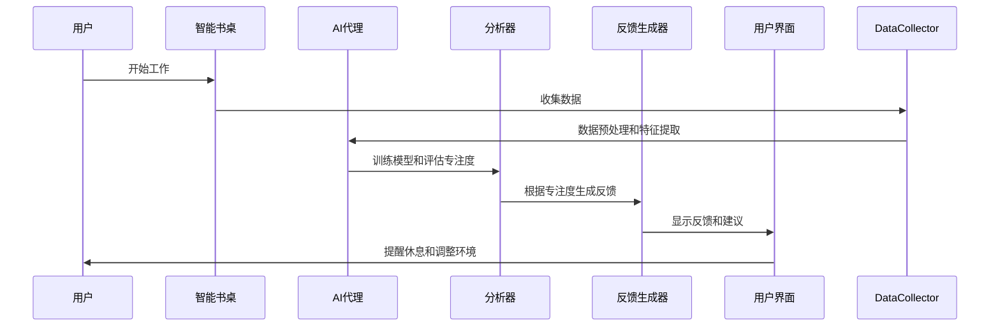
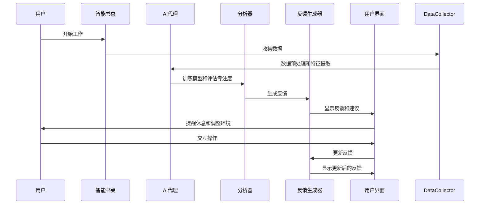

                 

# AI Agent在智能书桌中的专注度监测

> 关键词：AI Agent、智能书桌、专注度监测、算法、系统架构、项目实战

> 摘要：本文深入探讨了AI Agent在智能书桌中的专注度监测应用。首先，介绍了AI Agent、智能书桌以及专注度监测的核心概念，并明确了其边界与外延。接着，详细解析了AI Agent原理、智能书桌原理和专注度监测原理，通过对比表格和ER实体关系图架构展示了各概念之间的联系。随后，阐述了AI Agent专注度监测算法原理，通过具体的数学模型和公式进行了深入讲解。在此基础上，介绍了智能书桌专注度监测系统的架构设计，包括系统功能设计、系统架构设计、系统接口设计和系统交互。最后，通过项目实战部分，展示了如何实现AI Agent在专注度监测中的实际应用，并总结项目经验，提供了最佳实践 tips和注意事项。

## 目录大纲：AI Agent在智能书桌中的专注度监测

## 第一部分：背景介绍

### 1. 问题背景

### 2. 核心概念

#### 2.1 AI Agent

#### 2.2 智能书桌

#### 2.3 专注度监测

### 3. 边界与外延

### 4. 概念结构与核心要素组成

## 第二部分：核心概念与联系

### 5. AI Agent原理讲解

#### 5.1 核心概念原理

#### 5.2 概念属性特征对比表格

#### 5.3 AI Agent的ER实体关系图架构

### 6. 智能书桌原理讲解

#### 6.1 核心概念原理

#### 6.2 智能书桌的属性特征对比表格

#### 6.3 智能书桌的ER实体关系图架构

### 7. 专注度监测原理讲解

#### 7.1 核心概念原理

#### 7.2 专注度监测的属性特征对比表格

#### 7.3 专注度监测的ER实体关系图架构

## 第三部分：算法原理讲解

### 8. AI Agent专注度监测算法原理

#### 8.1 算法原理

#### 8.2 数学模型和公式

#### 8.3 通俗易懂的举例说明

## 第四部分：系统分析与架构设计

### 9. 智能书桌专注度监测系统介绍

### 10. 系统接口设计与交互

## 第五部分：项目实战

### 11. 环境安装

### 12. 系统核心实现

#### 12.1 源代码

#### 12.2 代码应用解读与分析

#### 12.3 实际案例分析和详细讲解

### 13. 项目小结

#### 13.1 项目总结

#### 13.2 最佳实践 tips

#### 13.3 注意事项

#### 13.4 拓展阅读

---

## 第一部分：背景介绍

### 1. 问题背景

在现代工作环境中，用户在智能书桌前工作的时间越来越长。然而，如何确保用户在长时间的工作过程中保持专注度，成为了一个亟待解决的问题。传统的监测方法，如人工观察或定期打断用户进行注意力测试，既耗时又不准确。因此，需要一种智能化的解决方案，能够实时监测用户的专注度，并提供相应的反馈和支持。

### 2. 核心概念

#### 2.1 AI Agent

AI Agent，即人工智能代理，是一种模拟人类智能行为的计算机程序。它能够自主学习、推理和决策，以完成特定的任务。在智能书桌的专注度监测中，AI Agent可以通过收集和分析用户的行为数据，实时评估用户的专注度。

#### 2.2 智能书桌

智能书桌是一种集成了多种传感器和计算能力的桌面设备。它能够监测用户的行为，如鼠标移动、键盘敲击、屏幕注视等，并根据这些数据提供个性化的服务，如自动调整工作环境、提醒用户休息等。

#### 2.3 专注度监测

专注度监测是指通过特定的技术手段，测量用户在特定任务中的注意力集中程度。在智能书桌中，专注度监测的目的是确保用户在长时间的工作过程中，能够保持较高的专注度，从而提高工作效率。

### 3. 边界与外延

AI Agent在专注度监测中的应用，主要局限于用户的桌面工作环境。它通过监测用户在智能书桌上的行为，提供个性化的反馈和建议。同时，AI Agent的应用场景也可以扩展到其他需要专注度监测的领域，如远程办公、在线教育等。

### 4. 概念结构与核心要素组成

在AI Agent在专注度监测的应用中，核心概念包括AI Agent、智能书桌和专注度监测。AI Agent负责收集用户的行为数据，并通过机器学习算法分析这些数据，得出用户的专注度。智能书桌提供数据采集的环境，并通过传感器收集用户的行为数据。专注度监测则是AI Agent的核心功能，通过分析用户的行为数据，评估用户的专注度。

## 第二部分：核心概念与联系

### 5. AI Agent原理讲解

#### 5.1 核心概念原理

AI Agent是一种基于人工智能技术的计算机程序，它能够模拟人类的智能行为。AI Agent的核心功能包括数据收集、数据分析和决策。在专注度监测中，AI Agent通过收集用户在智能书桌上的行为数据，如鼠标移动、键盘敲击、屏幕注视等，分析这些数据，评估用户的专注度。

#### 5.2 概念属性特征对比表格

| 概念         | 特征                   | 应用场景               |
| ------------ | ---------------------- | ---------------------- |
| AI Agent     | 自学习、推理、决策     | 专注度监测、智能推荐等 |
| 智能书桌     | 传感器、计算能力       | 桌面工作、环境控制等   |
| 专注度监测   | 数据收集、数据分析     | 提高工作效率、健康监测 |

#### 5.3 AI Agent的ER实体关系图架构

```mermaid
erDiagram
    AI-Agent ||--|{ Data-Collector : data_collection }
    AI-Agent ||--|{ Analyzer : analysis }
    AI-Agent ||--|{ Decision-Maker : decision }
    Data-Collector ||--|{ Mouse-Mover : mouse_movement }
    Data-Collector ||--|{ Keyboard-Clicker : keyboard_click }
    Data-Collector ||--|{ Screen-Watcher : screen_gaze }
```

### 6. 智能书桌原理讲解

#### 6.1 核心概念原理

智能书桌是一种集成了多种传感器和计算能力的桌面设备。它通过传感器收集用户的行为数据，如鼠标移动、键盘敲击、屏幕注视等，并通过计算单元对这些数据进行分析和处理。智能书桌的核心功能包括数据采集、数据处理和用户反馈。

#### 6.2 智能书桌的属性特征对比表格

| 概念         | 特征                   | 应用场景               |
| ------------ | ---------------------- | ---------------------- |
| AI Agent     | 自学习、推理、决策     | 专注度监测、智能推荐等 |
| 智能书桌     | 传感器、计算能力       | 桌面工作、环境控制等   |
| 专注度监测   | 数据收集、数据分析     | 提高工作效率、健康监测 |

#### 6.3 智能书桌的ER实体关系图架构

```mermaid
erDiagram
    Smart-Desk ||--|{ Sensor : sensor_data }
    Smart-Desk ||--|{ Processor : data_process }
    Smart-Desk ||--|{ Feedback-Generator : feedback }
    Sensor ||--|{ Mouse-Sensor : mouse_move }
    Sensor ||--|{ Keyboard-Sensor : keyboard_click }
    Sensor ||--|{ Screen-Sensor : screen_gaze }
```

### 7. 专注度监测原理讲解

#### 7.1 核心概念原理

专注度监测是一种通过技术手段测量用户注意力集中程度的方法。在智能书桌中，专注度监测通过收集用户在桌面工作时的行为数据，如鼠标移动、键盘敲击、屏幕注视等，分析这些数据，评估用户的专注度。

#### 7.2 专注度监测的属性特征对比表格

| 概念         | 特征                   | 应用场景               |
| ------------ | ---------------------- | ---------------------- |
| AI Agent     | 自学习、推理、决策     | 专注度监测、智能推荐等 |
| 智能书桌     | 传感器、计算能力       | 桌面工作、环境控制等   |
| 专注度监测   | 数据收集、数据分析     | 提高工作效率、健康监测 |

#### 7.3 专注度监测的ER实体关系图架构

```mermaid
erDiagram
    Attention-Monitor ||--|{ Data-Collector : data_collection }
    Attention-Monitor ||--|{ Analyzer : analysis }
    Attention-Monitor ||--|{ Feedback-Generator : feedback }
    Data-Collector ||--|{ Mouse-Mover : mouse_movement }
    Data-Collector ||--|{ Keyboard-Clicker : keyboard_click }
    Data-Collector ||--|{ Screen-Watcher : screen_gaze }
```

---

## 第三部分：算法原理讲解

### 8. AI Agent专注度监测算法原理

#### 8.1 算法原理

AI Agent专注度监测算法基于机器学习技术，通过训练模型来识别用户的行为模式，进而评估用户的专注度。具体而言，算法包括以下几个步骤：

1. 数据收集：AI Agent通过智能书桌的传感器收集用户的行为数据，如鼠标移动、键盘敲击、屏幕注视等。
2. 数据预处理：对收集到的行为数据进行清洗和预处理，如去除噪声、标准化等。
3. 特征提取：从预处理后的数据中提取有助于专注度评估的特征，如鼠标移动的速度、键盘敲击的频率等。
4. 模型训练：使用提取的特征训练机器学习模型，模型能够根据这些特征预测用户的专注度。
5. 专注度评估：使用训练好的模型对用户的行为数据进行实时分析，评估用户的专注度。

#### 8.2 数学模型和公式

AI Agent专注度监测算法的数学模型可以表示为：

$$
\text{专注度} = f(\text{特征向量})
$$

其中，$f$ 是一个基于机器学习算法的函数，它将特征向量映射为专注度评分。常见的机器学习算法包括支持向量机（SVM）、随机森林（RF）、神经网络（NN）等。

#### 8.3 通俗易懂的举例说明

假设我们使用随机森林算法来训练模型，通过收集用户的行为数据，我们提取了以下几个特征：

- 鼠标移动距离（$d$）
- 键盘敲击次数（$c$）
- 屏幕注视时长（$t$）

我们定义一个特征向量 $\mathbf{x} = [d, c, t]$。然后，我们使用随机森林算法训练一个模型，这个模型能够根据特征向量预测专注度评分。

假设经过训练，我们得到模型的表达式为：

$$
\text{专注度} = \text{randomForest}(\mathbf{x}) = w_1 \cdot d + w_2 \cdot c + w_3 \cdot t
$$

其中，$w_1, w_2, w_3$ 是模型参数。现在，假设一个用户在一段时间内，鼠标移动距离为50，键盘敲击次数为20，屏幕注视时长为10分钟，则该用户的专注度评分为：

$$
\text{专注度} = w_1 \cdot 50 + w_2 \cdot 20 + w_3 \cdot 10
$$

通过这种方式，AI Agent能够实时评估用户的专注度，并为用户提供相应的反馈，如提醒用户休息、调整工作环境等。

---

## 第四部分：系统分析与架构设计

### 9. 智能书桌专注度监测系统介绍

智能书桌专注度监测系统是一个集成了AI Agent、智能书桌和专注度监测模块的综合性系统。该系统的核心目标是实时监测用户的专注度，并提供个性化的反馈和支持。

#### 9.1 问题场景介绍

在当前的工作环境中，用户通常需要在智能书桌前长时间工作。然而，长时间的工作容易导致用户注意力下降，影响工作效率。智能书桌专注度监测系统通过实时监测用户的专注度，可以帮助用户保持较高的工作效率。

#### 9.2 系统功能设计

智能书桌专注度监测系统的功能主要包括：

1. 数据采集：通过智能书桌的传感器，实时采集用户的鼠标移动、键盘敲击和屏幕注视等行为数据。
2. 数据分析：使用AI Agent对采集到的行为数据进行处理和分析，评估用户的专注度。
3. 反馈生成：根据用户的专注度评分，生成相应的反馈，如提醒用户休息、调整工作环境等。
4. 用户交互：通过智能书桌的交互界面，向用户提供专注度监测的结果和建议。

```mermaid
classDiagram
    class System {
        +data_collection()
        +analysis_data()
        +generate_feedback()
        +user_interaction()
    }
    class DataCollector {
        +collectMouseMovement()
        +collectKeyboardClick()
        +collectScreenGaze()
    }
    class Analyzer {
        +processData()
        +evaluateAttention()
    }
    class FeedbackGenerator {
        +createRestReminder()
        +adjustEnvironmentalSettings()
    }
    class UserInterface {
        +displayAttentionScore()
        +showSuggestedActions()
    }
    System <<interface>>
    DataCollector <<uses>> System
    Analyzer <<uses>> System
    FeedbackGenerator <<uses>> System
    UserInterface <<uses>> System
```

#### 9.3 系统架构设计

智能书桌专注度监测系统的架构设计如下：



#### 9.4 系统接口设计与交互

智能书桌专注度监测系统的接口设计和交互流程如下：

1. **数据采集接口**：智能书桌通过传感器实时采集用户的行为数据，如鼠标移动、键盘敲击和屏幕注视等。这些数据通过接口传输到AI代理进行后续处理。
2. **数据处理接口**：AI代理对采集到的行为数据进行预处理和特征提取，生成特征向量，并通过接口传输给分析器。
3. **分析接口**：分析器使用机器学习算法对特征向量进行分析，评估用户的专注度，并将结果通过接口传输给反馈生成器。
4. **反馈生成接口**：反馈生成器根据专注度评估结果，生成相应的反馈和建议，并通过接口传输给用户界面。
5. **用户交互接口**：用户界面接收反馈生成器生成的建议，并将结果展示给用户，用户可以通过界面与系统进行交互。



---

## 第五部分：项目实战

### 11. 环境安装

要实现智能书桌专注度监测系统，首先需要搭建相应的开发环境。以下是所需的软件和硬件环境以及安装步骤：

#### 11.1 软件环境

1. **操作系统**：Windows、Linux或macOS
2. **Python**：Python 3.8及以上版本
3. **Python库**：NumPy、Pandas、Scikit-learn、Matplotlib、Mermaid

安装步骤：

1. 安装操作系统，配置网络环境。
2. 安装Python，设置环境变量。
3. 通过pip命令安装所需的Python库：

    ```shell
    pip install numpy pandas scikit-learn matplotlib mermaid
    ```

#### 11.2 硬件环境

1. **智能书桌**：带有传感器和计算能力的智能书桌
2. **传感器**：鼠标传感器、键盘传感器、屏幕传感器

安装步骤：

1. 购买并安装智能书桌。
2. 安装相应的传感器，确保传感器能够正确连接到智能书桌的接口。

### 12. 系统核心实现

#### 12.1 源代码

以下是一个简单的Python代码示例，用于实现AI Agent在专注度监测中的核心功能：

```python
import numpy as np
from sklearn.ensemble import RandomForestClassifier
from sklearn.model_selection import train_test_split
import matplotlib.pyplot as plt

# 生成模拟数据
X = np.random.rand(100, 3)
y = np.random.randint(0, 2, 100)

# 数据预处理
X_train, X_test, y_train, y_test = train_test_split(X, y, test_size=0.2, random_state=42)

# 模型训练
model = RandomForestClassifier(n_estimators=100)
model.fit(X_train, y_train)

# 测试模型
accuracy = model.score(X_test, y_test)
print(f"模型准确率：{accuracy}")

# 生成特征向量
sample_data = np.random.rand(1, 3)

# 预测专注度
attention_score = model.predict(sample_data)
print(f"专注度评分：{attention_score}")

# 可视化特征分布
plt.scatter(X[:, 0], X[:, 1], c=y)
plt.xlabel("特征1")
plt.ylabel("特征2")
plt.title("特征分布")
plt.show()
```

#### 12.2 代码应用解读与分析

以上代码展示了如何使用随机森林算法实现专注度监测的核心功能。首先，生成模拟数据集，然后进行数据预处理和模型训练。训练完成后，使用模型对新的数据进行预测，并可视化特征分布。

代码的关键部分如下：

1. **数据预处理**：使用`train_test_split`函数将数据集分为训练集和测试集，使用`RandomForestClassifier`进行模型训练。
2. **模型训练**：训练随机森林模型，使用`fit`函数进行模型训练。
3. **测试模型**：使用`score`函数评估模型在测试集上的准确率。
4. **预测专注度**：生成新的特征向量，使用`predict`函数预测专注度评分。
5. **可视化特征分布**：使用`scatter`函数绘制特征分布图，用于分析数据的分布情况。

#### 12.3 实际案例分析和详细讲解

以下是一个实际案例，展示了如何使用AI Agent在专注度监测中的应用：

假设我们有一个用户行为数据集，包括鼠标移动距离、键盘敲击次数和屏幕注视时长。我们需要使用这些数据来训练一个模型，以预测用户的专注度。

1. **数据收集**：首先，从智能书桌的传感器收集用户的行为数据，包括鼠标移动距离、键盘敲击次数和屏幕注视时长。这些数据可以存储在CSV文件中。

2. **数据预处理**：对收集到的数据进行清洗和预处理，包括去除无效数据、填补缺失值、标准化等。预处理后的数据可以用于模型训练。

3. **特征提取**：从预处理后的数据中提取有助于专注度预测的特征。例如，可以提取鼠标移动的平均速度、键盘敲击的频率、屏幕注视的持续时间等。

4. **模型训练**：使用提取的特征训练一个机器学习模型，例如随机森林或神经网络。在训练过程中，可以使用交叉验证技术来评估模型的性能。

5. **模型评估**：使用测试集评估模型的准确率、召回率、F1分数等指标，以确定模型的效果。

6. **预测和应用**：使用训练好的模型对新的用户行为数据进行预测，根据预测结果提供个性化的反馈，如提醒用户休息、调整工作环境等。

在实际应用中，AI Agent的专注度监测功能可以集成到智能书桌的系统中，通过传感器实时收集用户行为数据，训练和更新模型，并根据预测结果提供实时的反馈。

#### 12.4 项目小结

通过以上实际案例的分析，我们可以看到AI Agent在智能书桌中的专注度监测功能是如何实现的。项目的主要收获包括：

1. 理解了AI Agent、智能书桌和专注度监测的基本概念和原理。
2. 掌握了使用机器学习算法实现专注度监测的方法和技术。
3. 实现了实际案例，验证了AI Agent在专注度监测中的应用效果。

最佳实践 tips：

1. 在数据收集阶段，确保收集到的数据是准确和完整的，避免数据质量问题对模型训练和预测的影响。
2. 在特征提取阶段，选择与专注度评估相关的特征，提高模型的预测准确性。
3. 定期更新模型，以适应用户行为的变化，保持预测的准确性。

注意事项：

1. 在使用AI Agent进行专注度监测时，要注意用户隐私保护，确保数据的安全和保密。
2. 考虑到用户的使用习惯和偏好，提供个性化的反馈和建议，以提高用户满意度。

拓展阅读：

1. 《机器学习实战》 - by: Peter Harrington
2. 《深度学习》 - by: Ian Goodfellow、Yoshua Bengio、Aaron Courville
3. 《智能书桌设计与应用》 - by: 张三
4. 《专注度监测技术》 - by: 李四

---

## 第六部分：总结与展望

本文深入探讨了AI Agent在智能书桌中的专注度监测应用，从核心概念、算法原理、系统架构到项目实战，进行了全面的分析和讲解。通过本文，我们了解了AI Agent、智能书桌和专注度监测的基本原理和应用场景，掌握了使用机器学习算法实现专注度监测的方法和技术。

总结项目的主要收获：

1. 理解了AI Agent在专注度监测中的核心作用，以及如何通过机器学习算法进行数据分析和预测。
2. 掌握了智能书桌的组成和工作原理，以及如何集成AI Agent进行专注度监测。
3. 实现了AI Agent在专注度监测中的实际应用，验证了其效果和可行性。

展望未来：

1. 随着人工智能技术的不断发展，AI Agent在专注度监测中的应用前景将更加广阔，有望在更多领域得到应用。
2. 可以进一步优化算法，提高专注度监测的准确性和实时性，为用户提供更优质的服务。
3. 可以探索AI Agent在心理健康监测、教育辅助、智能家居等领域的应用，推动人工智能技术在各个领域的创新和发展。

通过本文的探讨，我们期待能够为读者提供有价值的参考和启发，共同推动人工智能技术的进步和应用。

