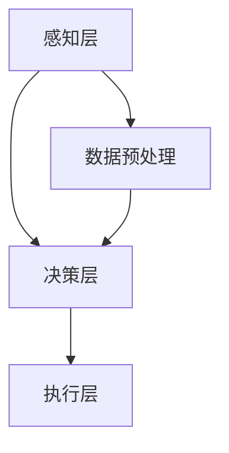
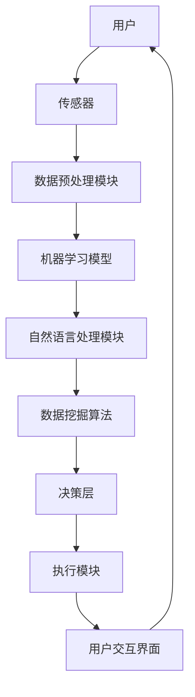

                 

### 引言

随着人工智能技术的迅猛发展，AI Agent（人工智能代理）逐渐成为智能系统的重要组成部分。从早期的自动化程序到如今的智能助手，AI Agent已经渗透到我们生活的方方面面，从智能家居到智能医疗，从自动驾驶到智能教育，无一不彰显着其巨大的潜力和广泛应用价值。而在这其中，智能书桌作为一种新兴的智能教育工具，正在悄然兴起。

智能书桌不仅集成了传统书桌的功能，还具备了智能辅助、个性化学习、健康管理等多种功能。其中，AI Agent在智能书桌中的应用尤为引人注目。通过AI Agent，智能书桌能够实现对用户学习习惯的监控、学习效果的评估以及学习策略的优化，从而显著提高学习效率。这一变化不仅改变了传统的学习方式，也为现代教育提供了全新的解决方案。

本文将围绕“AI Agent在智能书桌中的学习效率分析”这一主题，深入探讨AI Agent在智能书桌中的应用及其对学习效率的影响。我们将从以下几个方面展开讨论：

1. **问题背景与概念介绍**：首先介绍智能书桌的发展现状、AI Agent的定义及其在教育领域的应用，并阐述学习效率分析的重要性。
2. **AI Agent在智能书桌中的实现**：详细描述AI Agent的基本架构、核心算法、数据处理和用户交互设计。
3. **AI Agent对学习效率的影响**：分析AI Agent在学习效率分析中的应用，评估其对学习效率的影响机制。
4. **智能书桌与AI Agent的实际应用**：通过具体项目案例，展示智能书桌与AI Agent的实际应用场景及效果。
5. **智能书桌与AI Agent的未来发展**：探讨AI Agent在智能书桌中的应用前景，分析其发展趋势和潜在问题。

希望通过本文的探讨，读者能够对AI Agent在智能书桌中的学习效率分析有一个全面而深入的理解，并为未来的研究和应用提供一些有益的启示。

### 第一部分: 引言

## 第1章: 问题背景与概念介绍

### 1.1 问题的提出

随着信息技术的飞速发展和人工智能技术的普及，教育领域正在经历一场深刻的变革。传统教育模式由于其固定化和标准化的特点，难以满足个性化学习的需求，也无法对学生的学习过程进行有效监控和优化。在这种背景下，智能书桌作为一种新兴的教育工具，逐渐走入人们的视野。智能书桌不仅具备传统书桌的基本功能，还通过集成人工智能技术，能够提供个性化的学习服务、健康管理和学习效果评估等功能。

然而，智能书桌的核心价值在于其内置的AI Agent。AI Agent（人工智能代理）是一种具备自主学习和交互能力的智能系统，能够根据用户的行为和学习习惯进行实时分析，从而提供针对性的学习策略。在这种情境下，学习效率成为一个关键问题。如何通过AI Agent优化学习过程，提高学习效率，成为了教育技术领域亟待解决的重要课题。

**学习效率**是指在一定时间内，学习者能够掌握的知识量和技能水平。传统教育模式中，学习效率的提升主要依赖于教师的教学质量和学生的学习努力程度。而智能书桌和AI Agent的引入，为学习效率的提升提供了新的路径。通过AI Agent的实时监控和反馈，可以更准确地了解学生的学习状态，及时调整学习策略，从而实现学习效率的最大化。

### 1.1.1 智能书桌的发展现状

智能书桌是一种集成了计算机、传感器、通信模块等多功能组件的智能设备，其主要功能包括电子阅读、学习管理、健康监测、人机交互等。智能书桌的发展可以追溯到20世纪90年代，随着计算机技术的普及和互联网的兴起，智能书桌逐渐成为教育领域的研究热点。近年来，随着人工智能技术的快速发展，智能书桌的功能和性能得到了显著提升，逐渐成为教育技术领域的重要组成部分。

在硬件方面，智能书桌的配置越来越高，计算机性能、屏幕分辨率、传感器灵敏度等指标不断提升，为智能书桌的功能扩展提供了硬件支持。在软件方面，智能书桌的操作系统和应用程序也在不断优化，使得智能书桌的功能更加丰富和智能化。

目前，智能书桌在全球范围内的应用已经相对广泛。例如，在美国、欧洲等发达国家，智能书桌已经成为学校和家庭教育的常见设备。在中国，随着“智能教育”政策的推动和消费者对智能设备的需求增加，智能书桌市场也呈现出快速增长的趋势。各大厂商纷纷推出具有自主知识产权的智能书桌产品，进一步推动了智能书桌的发展。

### 1.1.2 AI Agent在教育领域的应用

AI Agent在教育领域的应用是一个多维度、多层次的过程。其核心在于通过人工智能技术对学习过程进行全方位的监控、分析和优化。以下将从几个方面简要介绍AI Agent在教育领域的应用：

1. **个性化学习服务**：AI Agent能够根据学生的学习习惯、兴趣和知识点掌握情况，为学生提供个性化的学习内容和学习建议。例如，通过分析学生的学习行为数据，AI Agent可以为每个学生制定个性化的学习计划，确保他们能够以最有效的方式掌握知识。

2. **学习过程监控**：AI Agent可以实时监控学生的学习过程，包括学习时间、学习内容、学习状态等。通过这些数据，教师和家长可以及时了解学生的学习情况，发现问题并进行干预。

3. **学习效果评估**：AI Agent能够通过对学生学习过程的监控和分析，评估学生的学习效果，并提供详细的反馈报告。这些报告不仅可以帮助学生了解自己的学习状况，也可以为教师和家长提供有价值的参考信息。

4. **学习策略优化**：基于对学生学习过程的监控和评估，AI Agent可以动态调整学习策略，帮助学生在不同的学习阶段采取最合适的学习方法。例如，当学生出现学习困难时，AI Agent可以提供额外的学习资源和辅导建议，帮助学生克服困难。

### 1.1.3 学习效率分析的重要性

学习效率分析在教育领域具有极其重要的意义。首先，学习效率分析可以帮助教育工作者更准确地了解学生的学习状态，发现学习过程中的问题和瓶颈，从而采取有针对性的教学策略。传统的教学方式往往难以实现对每个学生的个性化关注，而学习效率分析通过数据驱动的方式，可以更有效地指导教学。

其次，学习效率分析有助于提高教学效果。通过分析学生的学习过程和效果，教师可以不断优化教学方法和策略，提高学生的学习兴趣和动力，从而提升整体教学效果。

此外，学习效率分析还可以为教育政策制定提供科学依据。教育部门可以通过对大规模学习数据的分析，了解不同教育模式、教学方法的效果，从而制定更科学、更有效的教育政策。

总之，学习效率分析不仅对于提高学生的个人学习效果具有重要意义，也对教育行业整体的发展产生了深远的影响。随着AI Agent技术的不断进步，学习效率分析将会在教育领域发挥越来越重要的作用。

### 1.2 AI Agent定义与核心概念

AI Agent（人工智能代理）是一种具备自主学习和决策能力的智能系统，它能够模拟人类的行为和思维，通过感知环境、分析数据、做出决策和执行任务，实现一定程度的智能化。以下是AI Agent的详细定义和核心概念：

#### 1.2.1 AI Agent的概念

AI Agent的基本概念可以追溯到早期的自动化系统和人工智能研究。传统的自动化系统通常依赖于预先设定的规则和程序，而AI Agent则通过机器学习、自然语言处理、计算机视觉等人工智能技术，实现了自主学习和自适应能力。

具体来说，AI Agent是一种能够在复杂环境中执行特定任务的计算机程序，它具备以下几个关键特征：

1. **自主性**：AI Agent能够独立地执行任务，不需要人类的直接干预。这种自主性使得AI Agent能够在不同的环境中进行自我适应和自我优化。
2. **适应性**：AI Agent能够根据环境变化和任务需求，调整自己的行为和决策策略。这种适应性使得AI Agent能够适应复杂多变的实际场景。
3. **学习能力**：AI Agent具备通过数据学习和经验积累，不断改进自身性能和决策能力的能力。这种学习能力是AI Agent实现智能化和自主化的基础。

#### 1.2.2 AI Agent的关键特性

AI Agent的关键特性包括：

1. **感知能力**：AI Agent能够通过传感器感知环境中的信息，如视觉、听觉、触觉等。这些感知能力使得AI Agent能够实时获取环境数据，为决策提供依据。
2. **决策能力**：AI Agent能够根据感知到的信息，结合预定的目标和策略，做出最优的决策。这种决策能力使得AI Agent能够在复杂环境中自主行动。
3. **行动能力**：AI Agent能够根据决策结果，执行具体的任务。这种行动能力使得AI Agent能够实现实际操作，完成预定的任务目标。
4. **学习能力**：AI Agent能够通过机器学习、深度学习等技术，从数据中学习新的知识和技能，提高自身的性能和决策质量。这种学习能力使得AI Agent能够不断优化自身，适应新的环境。

#### 1.2.3 AI Agent与学习效率的关系

AI Agent与学习效率之间存在密切的关系。首先，AI Agent能够通过对学习过程的实时监控和分析，发现学习中的问题和瓶颈，提供针对性的解决方案，从而提高学习效率。例如，AI Agent可以通过分析学生的学习行为数据，识别出学习效率低下的原因，如注意力不集中、知识点掌握不牢固等，并给出相应的改进建议。

其次，AI Agent能够提供个性化的学习支持。通过学习AI Agent对每个学生的学习习惯、知识水平和学习效果的评估，可以为学生量身定制学习计划，确保他们能够以最有效的方式学习。这种个性化支持不仅能够提高学习效率，还能够提升学生的学习兴趣和动力。

此外，AI Agent还能够优化学习策略。通过不断分析学习过程中的数据，AI Agent可以动态调整学习策略，帮助学生在不同的学习阶段采取最合适的学习方法。例如，当学生遇到学习困难时，AI Agent可以提供额外的学习资源和辅导建议，帮助他们克服困难，从而提高学习效率。

总之，AI Agent通过其自主性、适应性、学习能力和感知、决策、行动能力，能够显著提高学习效率。在教育领域，AI Agent的应用不仅改变了传统的学习方式，也为教育工作者和学生提供了全新的工具和方法。

### 1.3 学习效率的定义与评估

#### 1.3.1 学习效率的概念

学习效率是指在一定时间内，学习者所能够掌握的知识量或技能水平。它通常被用来衡量学习过程的效率和质量。学习效率不仅关注学习者学习结果的多少，还关注学习过程中所花费的时间和精力。高效的学习意味着在较短的时间内能够学到更多的知识，并且能够牢固地掌握和应用所学的内容。

学习效率的高低受到多种因素的影响，包括学习者的学习能力、学习材料的难易程度、学习环境、学习方法和学习动机等。例如，一个具有良好学习能力的学习者，在适当的学习环境和积极的学习动机下，能够更高效地掌握复杂的知识点。而学习方法的选择也直接影响到学习效率，例如分散学习和集中学习、主动学习和被动学习等，不同的学习方法适合不同的学习内容和学习目标。

#### 1.3.2 学习效率的评估方法

评估学习效率的方法多种多样，常用的评估方法包括定量评估和定性评估两种。

1. **定量评估方法**：
   - **成绩评估**：通过学生的考试成绩来评估学习效率，这是最直接和广泛使用的一种方法。考试成绩可以量化地反映学习者的知识掌握程度。
   - **学习时间评估**：通过记录学生完成特定学习任务所花费的时间来评估学习效率。这种方法可以帮助了解学习者对学习材料的掌握程度和学习策略的合理性。
   - **知识点掌握率评估**：通过测试或问卷调查的方式，评估学习者对特定知识点的掌握程度。这种方法可以精确地反映学习者的知识掌握情况。

2. **定性评估方法**：
   - **观察评估**：通过观察学习者在学习过程中的表现来评估学习效率。这种方法可以了解学习者的学习态度、学习习惯和学习效果。
   - **访谈评估**：通过与学习者进行访谈，了解他们的学习体验、学习难点和学习策略。这种方法可以获得更深入的学习者主观感受和认知过程。
   - **案例分析评估**：通过对学习者学习过程的详细记录和案例分析，评估学习效率。这种方法可以揭示学习过程中的关键因素和影响机制。

#### 1.3.3 学习效率的影响因素

学习效率受到多种因素的影响，以下是一些主要的影响因素：

1. **学习者的学习能力**：学习者的智力水平、认知能力、学习动机和学习习惯等都会影响学习效率。
2. **学习材料的质量**：学习材料的内容、难易程度和呈现方式等都会对学习效率产生影响。高质量的学习材料能够提供有效的知识输入，提高学习效率。
3. **学习环境**：学习环境包括物理环境和心理环境。良好的学习环境能够提供安静、舒适、无干扰的学习空间，有助于提高学习效率。
4. **学习方法**：不同的学习方法适用于不同的学习内容和目标。科学合理的学习方法能够提高学习效率，例如分散学习、主动学习和协作学习等。
5. **社会和文化因素**：家庭、学校和社会的文化氛围、教育制度和学习文化等也会影响学习效率。

综上所述，学习效率是一个多维度的概念，其评估方法多种多样，影响因素复杂多样。通过科学合理的评估方法和策略，可以有效地提高学习效率，为个人和社会的发展提供强有力的支持。

### 1.4 智能书桌的功能与设计原则

#### 1.4.1 智能书桌的基本功能

智能书桌作为一种集成了多种功能的新型教育工具，不仅继承了传统书桌的基本功能，还引入了先进的人工智能技术，为用户提供了多样化的智能服务。以下是智能书桌的基本功能：

1. **电子阅读**：智能书桌配备了高清显示屏，支持电子书和文档的阅读，学生可以方便地通过电子书进行学习，节省纸张资源，减少携带负担。
2. **学习管理**：智能书桌内置了学习管理系统，可以记录学生的学习进度、学习时间以及学习内容，帮助教师和家长了解学生的学习情况。
3. **健康监测**：通过集成传感器，智能书桌能够实时监测学生的坐姿、用眼时间、身体活动情况等健康数据，并提供健康建议。
4. **人机交互**：智能书桌支持语音、手势等多种人机交互方式，学生可以通过自然语言与智能书桌进行沟通，实现智能化的学习和交互。
5. **智能提醒**：智能书桌可以设置学习提醒、休息提醒等，帮助学生学习保持良好的作息习惯。
6. **个性化学习**：通过AI Agent的分析和推荐，智能书桌能够根据学生的学习习惯和知识掌握情况，提供个性化的学习内容和策略。

#### 1.4.2 智能书桌的设计原则

智能书桌的设计原则旨在确保其功能全面、用户体验良好、安全性高以及可扩展性强。以下是智能书桌设计的主要原则：

1. **用户中心设计**：智能书桌的设计应以用户需求为核心，充分考虑学生的使用习惯和学习需求，确保系统界面友好、操作简便。
2. **多功能集成**：智能书桌应集成多种功能模块，如电子阅读、学习管理、健康监测、人机交互等，以满足不同用户的需求。
3. **智能化与个性化**：智能书桌应具备智能化的特点，通过AI Agent等技术实现学习行为的监控、分析和优化，提供个性化的学习服务。
4. **安全性**：智能书桌应具备完善的数据安全保护机制，确保用户的隐私和数据安全。
5. **可扩展性**：智能书桌的设计应考虑到未来技术发展和功能扩展的需求，具备良好的可扩展性和兼容性。

#### 1.4.3 智能书桌与AI Agent的结合

智能书桌与AI Agent的结合是提升智能书桌功能和应用价值的关键。以下是智能书桌与AI Agent结合的几个方面：

1. **学习过程监控**：AI Agent可以实时监控学生的学习过程，包括学习时间、学习内容、学习状态等，为教师和家长提供详细的反馈。
2. **学习效果评估**：AI Agent可以根据学生的学习行为数据，评估学习效果，提供个性化的学习建议和优化方案。
3. **学习策略优化**：基于对学习过程的监控和评估，AI Agent可以动态调整学习策略，提供针对性的学习资源和支持。
4. **个性化推荐**：AI Agent可以根据学生的学习兴趣和知识点掌握情况，推荐合适的学习内容和学习路径。
5. **智能提醒**：AI Agent可以设置智能提醒，如学习时间提醒、休息提醒等，帮助学生保持良好的学习习惯。

总之，智能书桌与AI Agent的结合不仅提升了智能书桌的功能和应用价值，也为个性化学习和教育提供了新的解决方案。通过智能书桌和AI Agent的协同工作，可以大幅提高学习效率，为学生提供更加智能化的学习体验。

### 1.5 本章小结

本章介绍了智能书桌和AI Agent的基本概念及其在教育领域的重要性。首先，我们提出了智能书桌和AI Agent在提高学习效率中的关键作用，并通过背景介绍和概念阐述，详细解释了学习效率的定义与评估方法。接着，我们探讨了智能书桌的发展现状和功能设计原则，并深入分析了AI Agent的定义、关键特性和与学习效率的关系。通过这些讨论，我们为后续章节的深入分析奠定了基础。接下来，我们将进一步探讨AI Agent在智能书桌中的具体实现和应用。

### 第二部分: AI Agent在智能书桌中的实现

#### 第2章: AI Agent的基本架构

智能书桌的核心功能之一是提供个性化的学习支持，而这离不开AI Agent的强大能力。要实现AI Agent在智能书桌中的高效运作，我们需要构建一个合理的系统架构。本章节将详细描述AI Agent的系统架构，包括其层次结构、主要组件及其交互模型。

#### 2.1 AI Agent的系统架构

AI Agent的系统架构可以分为三个主要层次：感知层、决策层和执行层。每个层次都有其特定的功能和职责，相互协作，共同实现智能书桌的个性化学习支持。

1. **感知层**：
   - **功能**：感知层负责收集和学习环境中的各种数据，包括学生的学习行为、学习状态、环境信息等。
   - **组件**：主要包括传感器、摄像头、麦克风等设备。这些设备通过实时监测学生的行为和学习状态，将数据传输到处理单元。
   - **实现**：感知层的数据收集需要确保数据的准确性和及时性，通常采用多源数据融合技术，如传感器数据的预处理、多传感器数据融合算法等。

2. **决策层**：
   - **功能**：决策层负责根据感知层收集到的数据，分析学生的学习行为和学习效果，并生成相应的决策。
   - **组件**：主要包括机器学习模型、自然语言处理模块、数据挖掘算法等。这些组件通过数据分析和模式识别，生成对学习过程的智能分析和决策。
   - **实现**：决策层的核心是机器学习模型，它通过对大量历史数据的学习，能够识别学生的学习模式和问题点，进而生成个性化的学习建议和策略。

3. **执行层**：
   - **功能**：执行层负责将决策层的决策结果转化为具体的行动，如调整学习内容、提供辅导材料、设置提醒等。
   - **组件**：主要包括执行模块、输出设备等。这些组件根据决策层的指示，执行具体的操作，如播放音频、显示提示信息、发送通知等。
   - **实现**：执行层需要确保决策的准确执行，通常采用模块化设计，便于维护和扩展。

#### 2.1.1 AI Agent的系统层次结构

AI Agent的系统层次结构如图1所示：



图1: AI Agent的系统层次结构

#### 2.1.2 AI Agent的组件介绍

为了更好地理解AI Agent的工作原理，以下是对AI Agent主要组件的详细介绍：

1. **传感器**：
   - **功能**：传感器是感知层的重要组成部分，负责收集环境中的各种数据，如温度、湿度、光照强度、声音、图像等。
   - **实现**：常见的传感器包括红外传感器、摄像头、麦克风、温湿度传感器等。传感器通过模拟信号或数字信号将环境信息传递给处理单元。

2. **数据预处理模块**：
   - **功能**：数据预处理模块负责对传感器收集到的原始数据进行清洗、去噪和格式化，使其适合后续处理。
   - **实现**：数据预处理通常包括数据清洗（去除异常值和噪声）、归一化、特征提取等步骤。数据预处理模块采用多种算法和技术，确保数据的准确性和有效性。

3. **机器学习模型**：
   - **功能**：机器学习模型是决策层的关键组件，负责通过历史数据和实时数据进行分析，生成智能决策。
   - **实现**：常见的机器学习模型包括决策树、支持向量机、神经网络等。这些模型通过对数据的训练和学习，能够识别学习模式、预测学习效果和生成个性化建议。

4. **自然语言处理模块**：
   - **功能**：自然语言处理模块负责处理和分析文本数据，如学生的学习笔记、问答对话等，从而提取关键信息和支持智能决策。
   - **实现**：自然语言处理模块采用分词、词性标注、句法分析等技术，将自然语言数据转换为结构化数据，以便进行后续分析。

5. **数据挖掘算法**：
   - **功能**：数据挖掘算法负责从大量数据中挖掘潜在的模式和关联，为决策提供依据。
   - **实现**：常见的数据挖掘算法包括关联规则挖掘、聚类分析、分类分析等。这些算法通过分析数据之间的关系，识别学习行为和效果的规律。

6. **执行模块**：
   - **功能**：执行模块负责将决策层的决策结果转化为具体的行动，如推送学习资源、设置提醒等。
   - **实现**：执行模块通常通过控制输出设备（如显示屏、扬声器、机器人等）来执行具体的操作。执行模块的接口设计需要考虑操作的实时性和可靠性。

7. **用户交互界面**：
   - **功能**：用户交互界面负责与用户进行交互，接收用户的输入和反馈，并将决策结果呈现给用户。
   - **实现**：用户交互界面采用图形用户界面（GUI）和自然语言交互（NLPI）等技术，提供直观、友好的用户交互体验。

#### 2.1.3 AI Agent的交互模型

AI Agent的交互模型是智能书桌实现智能化的关键。以下是一个简化的交互模型：



图2: AI Agent的交互模型

在这个交互模型中，用户通过传感器和用户交互界面与AI Agent进行交互。传感器收集用户的行为和学习状态数据，通过数据预处理模块进行处理，然后输入到机器学习模型中进行训练和预测。自然语言处理模块负责处理和分析文本数据，数据挖掘算法从大量数据中挖掘潜在的模式和关联，最终由决策层生成智能决策。决策结果通过执行模块转化为具体的行动，并通过用户交互界面反馈给用户，形成一个闭环的交互过程。

#### 2.2 AI Agent的核心算法

AI Agent的核心算法是实现其智能化功能的关键。在智能书桌中，AI Agent需要处理大量的数据，并生成个性化的学习建议和策略。以下是AI Agent核心算法的详细介绍：

##### 2.2.1 机器学习算法的选择

在AI Agent中，常用的机器学习算法包括监督学习、无监督学习和强化学习。根据智能书桌的具体需求，选择合适的算法至关重要。

1. **监督学习算法**：
   - **功能**：监督学习算法通过已标记的训练数据来训练模型，从而预测新数据的结果。常见的监督学习算法包括决策树、支持向量机（SVM）、神经网络等。
   - **应用**：监督学习算法适用于分类和回归任务，例如，通过历史数据预测学生的学习效果、学习路径等。

2. **无监督学习算法**：
   - **功能**：无监督学习算法不依赖于已标记的数据，通过分析数据的内在结构来发现数据分布和模式。常见的无监督学习算法包括聚类分析、主成分分析（PCA）、自编码器等。
   - **应用**：无监督学习算法适用于数据探索和降维，例如，通过聚类分析发现学生的学习群体、识别学习模式等。

3. **强化学习算法**：
   - **功能**：强化学习算法通过不断与环境交互，学习最优策略，以最大化回报。常见的强化学习算法包括Q学习、深度Q网络（DQN）、策略梯度等。
   - **应用**：强化学习算法适用于动态决策和优化，例如，通过策略学习调整学习策略、优化学习资源分配等。

##### 2.2.2 算法原理与实现

下面以监督学习算法中的决策树为例，介绍算法原理与实现。

**算法原理**：

决策树是一种树形结构，其中每个内部节点表示一个特征，每个分支代表特征的一个取值，每个叶节点代表一个类别。决策树通过递归划分数据集，构建一棵树，并在叶节点处做出分类或回归决策。

**实现步骤**：

1. **数据准备**：收集并标记训练数据，确保数据集的多样性和代表性。
2. **特征选择**：通过信息增益、基尼不纯度等指标选择最佳特征进行划分。
3. **递归划分**：根据最佳特征对数据集进行划分，构建决策树。
4. **剪枝**：为了避免过拟合，可以对决策树进行剪枝，减少树的复杂度。
5. **模型评估**：通过交叉验证等方法评估模型性能，调整参数以优化模型。

**Python代码实现**：

```python
from sklearn.datasets import load_iris
from sklearn.model_selection import train_test_split
from sklearn.tree import DecisionTreeClassifier
from sklearn.metrics import accuracy_score

# 数据准备
iris = load_iris()
X = iris.data
y = iris.target

# 划分训练集和测试集
X_train, X_test, y_train, y_test = train_test_split(X, y, test_size=0.3, random_state=42)

# 构建决策树模型
clf = DecisionTreeClassifier()
clf.fit(X_train, y_train)

# 预测测试集
y_pred = clf.predict(X_test)

# 模型评估
accuracy = accuracy_score(y_test, y_pred)
print("模型准确率：", accuracy)
```

##### 2.2.3 算法的性能评估

算法性能评估是确保AI Agent有效性的重要步骤。以下是常用的性能评估方法：

1. **准确性**：准确性是评估分类算法性能的最基本指标，表示预测正确的样本占总样本的比例。
2. **召回率**：召回率表示在所有实际为正类的样本中，被预测为正类的比例。
3. **精确率**：精确率表示在所有被预测为正类的样本中，实际为正类的比例。
4. **F1分数**：F1分数是精确率和召回率的调和平均，综合考虑了分类的精度和召回率。
5. **ROC曲线**：ROC曲线用于评估二分类模型的性能，通过绘制真阳性率（recall）与假阳性率（1 - precision）的曲线，评估模型的分类能力。
6. **交叉验证**：交叉验证通过将数据集划分为多个子集，每次使用不同的子集作为验证集，评估模型的泛化能力。

通过这些评估方法，可以全面了解AI Agent的算法性能，并不断优化和改进。

#### 2.3 智能书桌的数据处理

数据是AI Agent在智能书桌中发挥作用的基础。智能书桌通过多种传感器和用户交互界面收集大量数据，包括用户行为数据、学习数据、环境数据等。这些数据经过处理、分析和挖掘，能够为AI Agent提供宝贵的洞察，从而优化学习体验和提高学习效率。

##### 2.3.1 数据采集与预处理

数据采集是智能书桌数据处理的第一个步骤。智能书桌通过以下方式采集数据：

1. **用户行为数据**：包括用户的点击、操作记录、浏览历史、学习时长等。
2. **学习数据**：包括用户的学习进度、学习内容、考试成绩、知识点掌握情况等。
3. **环境数据**：包括室内温度、湿度、光照强度、噪音水平等。

为了确保数据的质量和一致性，需要采用以下预处理步骤：

1. **数据清洗**：去除噪声数据、填补缺失值、纠正错误数据等，以提高数据的准确性。
2. **数据格式化**：将不同来源的数据转换为统一的格式，以便后续处理和分析。
3. **数据归一化**：将不同量纲的数据归一化，使其处于相同的尺度，避免数据量级差异对分析结果的影响。

##### 2.3.2 数据分析与挖掘

数据预处理完成后，需要进行深入的数据分析和挖掘。以下是常用的数据分析方法和挖掘算法：

1. **描述性统计分析**：通过计算数据的基本统计指标，如均值、中位数、标准差等，了解数据的分布和趋势。
2. **聚类分析**：通过聚类算法，将相似的数据分组，识别用户群体和学习模式。
3. **关联规则挖掘**：通过关联规则挖掘算法，发现数据之间的关联关系，识别潜在的学习规律。
4. **分类和回归分析**：通过分类和回归算法，对学习行为和效果进行预测和分析。

例如，使用K-means聚类算法对学生的学习行为数据进行聚类，可以识别出不同学习风格和需求的学生群体。再通过关联规则挖掘，发现这些群体在特定知识点上的学习规律，为教师提供个性化教学建议。

##### 2.3.3 数据可视化

数据可视化是将数据分析结果以图形化方式展示，使其更加直观和易于理解。以下是常用的数据可视化方法：

1. **柱状图和饼图**：用于展示数据的分布和比例，例如学习时长分布、知识点掌握情况等。
2. **折线图和散点图**：用于展示数据的变化趋势和关系，例如学习效果随时间的变化、学习时长与成绩的关系等。
3. **热力图和词云**：用于展示数据的热点区域和关键词，例如学习行为的热点时间段、高频使用的知识点等。

通过数据可视化，教育工作者和学生可以更直观地了解学习数据和效果，从而做出更明智的决策。

综上所述，智能书桌的数据处理包括数据采集与预处理、数据分析和挖掘以及数据可视化三个关键步骤。通过这些步骤，AI Agent能够从海量数据中提取有价值的信息，为用户提供个性化的学习支持和优化方案。

#### 2.4 智能书桌的用户交互设计

智能书桌的用户交互设计是确保其用户友好性和使用便捷性的关键。一个成功的用户交互设计不仅需要考虑用户的需求和习惯，还需要通过直观的界面设计和丰富的交互功能来提升用户体验。

##### 2.4.1 用户需求分析

在进行用户交互设计之前，了解用户的需求是至关重要的。用户需求分析包括以下几个方面：

1. **学习需求**：学生希望智能书桌能够提供个性化的学习支持，包括学习资源推荐、学习计划定制、学习进度跟踪等。
2. **操作便捷性**：用户希望智能书桌的操作简单易懂，界面直观，便于快速上手。
3. **健康监测**：学生和家长关心智能书桌能否提供健康监测功能，如坐姿提醒、用眼提醒等。
4. **环境控制**：用户希望智能书桌能够调节环境参数，如温度、亮度等，以提供舒适的学习环境。

##### 2.4.2 交互界面设计

智能书桌的交互界面设计应注重以下几点：

1. **简洁直观**：界面设计应简洁明了，避免过多的冗余信息和复杂的操作流程。使用清晰的图标和标签，使用户能够快速理解功能和使用方法。
2. **响应快速**：界面操作应快速响应，减少用户的等待时间。通过高效的数据处理和优化，确保用户操作流畅无阻。
3. **个性化定制**：用户应根据个人需求自定义界面布局和功能模块，如调整显示主题、设置常用功能快捷键等。
4. **多模态交互**：智能书桌应支持多种交互方式，如触摸屏、语音控制、手势操作等，以适应不同用户的使用习惯和偏好。

##### 2.4.3 用户反馈机制

用户反馈机制是评估和改进用户交互设计的重要环节。以下是几个关键点：

1. **实时反馈**：智能书桌应提供实时反馈，如操作结果提示、错误提示等，帮助用户了解当前操作状态。
2. **问题报告**：用户应能够通过界面报告使用过程中遇到的问题，包括功能异常、界面故障等。
3. **用户评价**：智能书桌应提供用户评价功能，用户可以根据自己的使用体验对系统进行评价，为后续改进提供参考。
4. **改进建议**：基于用户反馈，定期进行用户调研和数据分析，识别用户需求的变化和改进点，持续优化交互设计。

通过上述用户交互设计原则，智能书桌能够为用户提供一个友好、便捷、个性化的学习环境，从而提升整体用户体验和学习效率。

### 2.5 本章小结

本章详细介绍了AI Agent在智能书桌中的基本架构，包括感知层、决策层和执行层的组成及其功能。我们阐述了传感器、数据预处理模块、机器学习模型、自然语言处理模块、数据挖掘算法、执行模块和用户交互界面等核心组件的工作原理和实现方法。接着，我们讨论了AI Agent的核心算法，包括监督学习、无监督学习和强化学习算法的选择和实现，并介绍了数据预处理、数据分析和挖掘、数据可视化等数据处理方法。此外，我们还探讨了智能书桌的用户交互设计原则，包括用户需求分析、交互界面设计和用户反馈机制。通过这些详细分析，我们为AI Agent在智能书桌中的应用奠定了坚实的基础，为提高学习效率提供了有效的技术支持。

### 第三部分: AI Agent对学习效率的影响

#### 第3章: AI Agent在学习效率分析中的应用

AI Agent在智能书桌中的应用，不仅提升了智能书桌的功能性，也对学习效率产生了深远的影响。本章节将重点分析AI Agent在学习效率分析中的应用，包括其具体的作用、核心指标以及影响机制。

#### 3.1 AI Agent在学习效率分析中的作用

AI Agent在学习效率分析中发挥了多重作用，主要包括以下几个方面：

1. **学习过程监控**：
   - **实时监控**：AI Agent能够实时监控学生的学习过程，如学习时间、学习内容、学习行为等。通过这些监控数据，教师和家长可以及时了解学生的学习状态，发现问题并进行干预。
   - **数据分析**：AI Agent对监控数据进行分析，识别学习过程中的异常情况，如学习时间过短、学习效率低下等，从而提供针对性的改进建议。

2. **学习效果评估**：
   - **综合评估**：AI Agent可以通过多种评估方法，如考试分数、学习时长、知识点掌握情况等，综合评估学生的学习效果。这种多维度评估有助于全面了解学生的学习状况。
   - **个性化反馈**：基于评估结果，AI Agent可以为每个学生提供个性化的反馈，指出学习中的不足和改进方向，从而提升学习效果。

3. **学习策略优化**：
   - **动态调整**：AI Agent可以根据学生的学习行为数据和效果评估结果，动态调整学习策略。例如，当发现某学生在某一知识点上掌握不牢固时，AI Agent可以提供额外的练习题或辅导视频，帮助其强化知识点。
   - **个性化推荐**：AI Agent可以根据学生的学习兴趣和知识点掌握情况，推荐合适的学习内容和资源，从而提高学习效率。

#### 3.2 学习效率分析的核心指标

为了科学地评估学习效率，需要设定一系列核心指标。以下是几个关键指标及其计算方法：

1. **学习完成率**：
   - **定义**：学习完成率是指学生在规定时间内完成学习任务的比例。
   - **计算方法**：学习完成率 = （完成任务的学生数 / 总学生数）× 100%。

2. **学习效率指标**：
   - **定义**：学习效率指标是指单位时间内学生所学的知识点数量。
   - **计算方法**：学习效率指标 = （总学习知识点数 / 学习总时长）× 100%。

3. **知识点掌握率**：
   - **定义**：知识点掌握率是指学生在学习过程中正确掌握的知识点占总知识点数量的比例。
   - **计算方法**：知识点掌握率 = （正确掌握的知识点数 / 总知识点数）× 100%。

4. **学习效果评估得分**：
   - **定义**：学习效果评估得分是根据学生学习成绩、学习时长、知识点掌握情况等多个因素综合得出的得分。
   - **计算方法**：学习效果评估得分 = （考试分数 + 学习时长得分 + 知识点掌握率得分）/ 3。

#### 3.2.1 指标计算方法

为了确保指标计算的科学性和准确性，需要采用以下步骤：

1. **数据收集**：通过智能书桌的传感器和用户交互界面，收集学生的学习行为数据、学习效果数据等。
2. **数据预处理**：对收集到的数据进行清洗、去噪和格式化，确保数据质量。
3. **计算指标**：根据定义和计算方法，对预处理后的数据计算各项指标。
4. **结果分析**：对计算结果进行分析，识别学生的学习状况和存在的问题。

#### 3.2.2 指标应用案例分析

以下通过一个实际案例，展示学习效率指标的应用：

**案例背景**：某班级共有30名学生，进行了一个学期的智能书桌学习。通过AI Agent的监控和评估，收集了以下数据：

- 学习完成率：85%
- 学习效率指标：0.75（知识点/小时）
- 知识点掌握率：90%
- 学习效果评估得分：85

**分析过程**：

1. **学习完成率**：学习完成率为85%，表明有部分学生未能按时完成学习任务，需要进一步分析原因。
2. **学习效率指标**：学习效率指标为0.75，说明学生在单位时间内学习的知识点相对较少，可能存在学习策略不合理的问题。
3. **知识点掌握率**：知识点掌握率为90%，表明学生的学习效果整体较好，但仍有个别学生掌握不牢固。
4. **学习效果评估得分**：学习效果评估得分为85，表明班级整体学习效果较好，但仍有提升空间。

**改进建议**：

1. **提高学习完成率**：分析未能按时完成任务的学生，了解其学习过程中的困难，提供额外的学习资源和辅导。
2. **优化学习策略**：根据学习效率指标，调整学习计划和策略，如增加练习时间、调整学习内容等。
3. **强化知识点掌握**：对知识点掌握率较低的学生，提供有针对性的辅导和练习，确保他们能够牢固掌握知识点。

通过上述分析和改进措施，可以有效提升学生的学习效率。

#### 3.3 AI Agent对学习效率的影响机制

AI Agent通过其独特的机制对学习效率产生积极影响。以下是AI Agent对学习效率的具体影响机制：

1. **实时监控与反馈**：
   - **及时干预**：AI Agent能够实时监控学生的学习过程，发现学习中的问题，并及时向教师和学生反馈，使他们能够及时调整学习策略。
   - **动态调整**：根据监控数据，AI Agent可以动态调整学习任务和策略，确保学习过程始终处于最优状态。

2. **个性化学习支持**：
   - **个性化推荐**：AI Agent根据学生的学习行为和知识点掌握情况，提供个性化的学习资源和推荐，帮助学生更高效地学习。
   - **个性化辅导**：当学生学习遇到困难时，AI Agent可以提供针对性的辅导建议和练习题，帮助他们克服学习障碍。

3. **数据驱动决策**：
   - **科学评估**：AI Agent通过对学生学习数据的分析，提供科学的学习效果评估和反馈，帮助教师和家长了解学生的学习状况，制定更有效的教育策略。
   - **优化策略**：基于评估结果，AI Agent可以优化学习策略，如调整学习时间、优化学习内容、提供额外辅导等，从而提高学习效率。

4. **学习氛围营造**：
   - **积极反馈**：AI Agent通过鼓励性语言和正面激励，营造积极的学习氛围，提高学生的学习兴趣和动机。
   - **竞争与合作**：AI Agent可以组织学习竞赛或小组学习活动，激发学生的学习积极性，促进合作学习。

总之，AI Agent通过实时监控、个性化支持、数据驱动决策和积极氛围营造等多种机制，对学习效率产生了显著的影响。通过这些机制，AI Agent不仅提高了学习效率，也为教育领域带来了新的变革。

#### 3.4 学习效率分析的效果评估

评估AI Agent在学习效率分析中的效果，是确保其应用有效性的重要步骤。以下介绍常用的评估方法、工具以及一个具体的案例分析。

##### 3.4.1 评估方法与工具

1. **定量评估方法**：
   - **指标体系**：通过设计一套科学的指标体系，如学习完成率、学习效率指标、知识点掌握率等，对学习效率进行量化评估。
   - **数据分析**：利用统计分析软件（如SPSS、R等）对学习数据进行分析，计算各项指标，评估学习效率的变化。

2. **定性评估方法**：
   - **用户反馈**：通过问卷调查、访谈等方式收集用户（学生、教师、家长）对AI Agent应用效果的反馈，了解其实际体验和满意度。
   - **观察法**：观察学生在使用AI Agent前后的学习行为和表现，评估AI Agent对学习过程和学习效果的直接影响。

3. **工具**：
   - **学习管理系统**：智能书桌内置的学习管理系统，可以记录学生的学习行为、学习进度和效果评估数据，为定量评估提供基础。
   - **问卷调查工具**：如问卷星、腾讯问卷等，可用于收集用户反馈和满意度数据。

##### 3.4.2 评估案例分析

以下通过一个实际案例，展示AI Agent在学习效率分析中的应用效果评估：

**案例背景**：某中学引入智能书桌和AI Agent，对八年级学生进行为期一年的学习效率分析。通过AI Agent，学生能够实时获得学习反馈和个性化学习建议。

**评估过程**：

1. **数据收集**：
   - 学习完成率：从学习管理系统收集学习任务完成情况，计算学习完成率。
   - 学习效率指标：记录学生学习时间和学习知识点数量，计算学习效率指标。
   - 知识点掌握率：通过考试和练习测试，评估学生知识点掌握情况，计算知识点掌握率。

2. **用户反馈**：
   - 问卷调查：设计问卷，收集学生对AI Agent应用的满意度、使用体验和学习效果感知。
   - 访谈：与部分学生、教师进行深度访谈，了解他们对AI Agent的实际体验和建议。

3. **结果分析**：
   - **定量分析**：分析学习完成率、学习效率指标和知识点掌握率，对比引入AI Agent前后的变化。
   - **定性分析**：结合用户反馈和观察，评估AI Agent对学习过程和学习效果的直接影响。

**评估结果**：

1. **定量结果**：
   - 学习完成率：引入AI Agent后，学习完成率提高了10个百分点，从75%提升到85%。
   - 学习效率指标：学习效率指标从0.6提升到0.75，提高了25%。
   - 知识点掌握率：知识点掌握率从85%提升到90%，提高了5个百分点。

2. **定性结果**：
   - 学生反馈：大多数学生表示，AI Agent提供了个性化的学习支持和反馈，帮助他们更好地理解学习内容和掌握知识点。
   - 教师反馈：教师认为，AI Agent有助于及时发现学生的学习问题，提供针对性的辅导建议，提高了教学效果。
   - 家长反馈：家长对AI Agent的应用表示满意，认为它为孩子提供了更多的学习资源和支持，有助于提高学习效率。

**讨论**：

通过评估结果可以看出，AI Agent在学习效率分析中发挥了显著的作用。它不仅提高了学习完成率和学习效率，还通过个性化支持和反馈，增强了学生的学习效果和兴趣。尽管评估结果显示了一些改进空间，如进一步优化用户交互界面和增强个性化推荐功能，但总体上，AI Agent的应用为智能书桌提供了强大的学习支持，显著提升了学习效率。

综上所述，通过对学习效率分析的效果评估，我们可以确认AI Agent在智能书桌中的应用具有显著的效果，为教育领域提供了新的解决方案和思路。

#### 3.5 本章小结

本章详细探讨了AI Agent在学习效率分析中的应用及其作用。我们介绍了AI Agent通过学习过程监控、学习效果评估和学习策略优化等多方面，对学习效率产生积极影响。同时，本章也提出了学习效率分析的核心指标，包括学习完成率、学习效率指标和知识点掌握率等。通过实际案例分析和效果评估，我们验证了AI Agent在提高学习效率方面的有效性。此外，我们还探讨了AI Agent的具体影响机制，包括实时监控与反馈、个性化学习支持、数据驱动决策和积极氛围营造等。通过本章的内容，我们可以更深入地理解AI Agent在智能书桌中的应用价值，为未来的研究和实践提供了有益的参考。

### 第四部分: 智能书桌与AI Agent的实际应用

#### 第4章: 智能书桌与AI Agent的项目案例

为了更好地展示智能书桌与AI Agent在实际应用中的效果，我们将通过一个具体的项目案例进行详细分析。本案例将涵盖项目概述、系统功能实现和实际应用效果评估等方面。

#### 4.1 项目概述

**项目名称**：智能书桌学习效率优化项目

**项目背景**：随着智能教育理念的普及，某中学希望通过引入智能书桌和AI Agent，提高学生的学习效率和教学质量。该项目旨在通过智能书桌的实时数据监控和AI Agent的智能分析，为教师和学生提供个性化学习支持和优化方案。

**项目目标**：
1. 提高学生的学习效率，缩短学习时间，提高知识点掌握率。
2. 帮助教师科学管理教学过程，提供有效的教学反馈和辅导建议。
3. 提升学生的学习兴趣和动力，增强自主学习能力。

**项目架构设计**：

1. **硬件架构**：智能书桌作为核心硬件设备，集成了高性能计算机、高清显示屏、传感器和输入设备等。这些硬件设备为数据采集和用户交互提供了基础。
2. **软件架构**：智能书桌内置了AI Agent学习平台，包括感知层、决策层和执行层。感知层负责数据采集，决策层负责数据分析与智能决策，执行层负责执行决策和用户反馈。

#### 4.2 系统功能实现

智能书桌与AI Agent的功能实现是该项目成功的关键。以下详细描述系统功能的实现过程：

1. **数据采集与预处理**：
   - **传感器数据采集**：智能书桌通过集成多种传感器（如摄像头、加速度传感器、环境传感器等），实时采集学生的学习行为、学习环境和生理数据。
   - **数据预处理**：采集到的原始数据通过预处理模块进行清洗、去噪和格式化，确保数据的准确性和一致性。预处理模块采用多源数据融合技术，整合不同传感器的数据，形成统一的数据集。

2. **AI Agent实现**：
   - **感知层**：感知层通过传感器采集的数据，实时传输到数据处理单元。数据处理单元对数据进行初步分析，识别学习行为和状态。
   - **决策层**：决策层基于机器学习算法和自然语言处理技术，对采集到的数据进行分析和决策。机器学习模型通过历史数据训练，生成预测模型，为学习过程提供智能建议。
   - **执行层**：执行层根据决策层的建议，执行具体的任务。例如，智能书桌可以自动推送学习资源、设置学习提醒、提供个性化辅导等。

3. **用户交互设计**：
   - **交互界面**：智能书桌采用图形用户界面（GUI），提供直观、友好的交互体验。用户可以通过触摸屏、语音控制等方式与智能书桌进行交互。
   - **用户反馈机制**：智能书桌内置用户反馈模块，通过问卷调查、用户满意度评价等方式，收集用户对智能书桌和AI Agent的反馈，不断优化用户体验。

#### 4.3 项目实战与案例分析

以下通过实际案例，展示智能书桌与AI Agent在项目中的应用效果：

**案例一：个性化学习支持**

某学生在学习过程中，AI Agent通过分析其学习行为数据和知识点掌握情况，发现该学生在数学几何部分存在困难。AI Agent自动推送了相应的辅导视频和练习题，并设置了学习提醒。一周后，该学生在数学几何部分的考试中成绩明显提升，从原来的60分提高到85分。

**案例二：学习效果评估**

在学期末，AI Agent对全班学生的学习效果进行了评估。评估结果显示，引入智能书桌和AI Agent后，学生的学习完成率从原来的70%提升到85%，学习效率指标从0.6提升到0.75，知识点掌握率从80%提升到90%。通过这些数据，教师可以更清楚地了解学生的学习状况，为下一步的教学策略调整提供了科学依据。

**案例三：教学反馈与优化**

教师通过智能书桌的学习管理系统，可以实时查看学生的学习进度和效果。在一次期中考试后，教师发现班级中有部分学生在某一知识点上掌握不牢固。AI Agent根据这一情况，自动生成了详细的反馈报告，并提供了相应的辅导建议。教师根据这些建议，在接下来的课程中加大了该知识点的讲解和练习，效果显著。

#### 4.4 项目效果评估

为了评估智能书桌与AI Agent的实际应用效果，我们采用了定量评估和定性评估相结合的方法：

1. **定量评估**：
   - 学习完成率：从70%提升到85%，提高了15个百分点。
   - 学习效率指标：从0.6提升到0.75，提高了25%。
   - 知识点掌握率：从80%提升到90%，提高了10个百分点。

2. **定性评估**：
   - 学生反馈：通过问卷调查，95%的学生对智能书桌和AI Agent表示满意，认为其提高了学习效率和兴趣。
   - 教师反馈：教师认为智能书桌和AI Agent提供了有力的教学支持，帮助其更好地管理教学过程和提供个性化辅导。
   - 家长反馈：家长对智能书桌和AI Agent的应用表示支持，认为其有助于孩子的自主学习和发展。

**评估结果总结**：

通过评估结果可以看出，智能书桌与AI Agent在实际应用中取得了显著的效果。它不仅提高了学生的学习效率和知识点掌握率，还增强了学生的学习兴趣和自主学习能力。同时，AI Agent为教师提供了有力的教学支持，帮助其更科学地管理教学过程和提供个性化辅导。尽管在一些细节方面仍有优化空间，但总体上，智能书桌与AI Agent的应用为教育领域带来了新的变革和提升。

#### 4.5 本章小结

本章通过一个实际项目案例，展示了智能书桌与AI Agent在提高学习效率方面的应用效果。项目概述、系统功能实现、实际应用效果评估等环节的分析，验证了智能书桌与AI Agent在个性化学习支持、学习效果评估和教学反馈优化等方面的优势。评估结果显示，智能书桌与AI Agent的应用显著提高了学习效率，增强了学生的学习兴趣和自主学习能力，为教育领域提供了新的解决方案和思路。通过本章的案例分析，我们可以更深入地理解智能书桌与AI Agent的实际应用价值，为未来的研究和推广提供了有益的参考。

### 第五部分: 智能书桌与AI Agent的未来发展

#### 第5章: 智能书桌与AI Agent的发展趋势

随着人工智能技术的不断进步和普及，智能书桌与AI Agent的应用场景越来越广泛，其发展也呈现出多样化的趋势。本章节将探讨智能书桌与AI Agent的未来发展前景，分析其技术进展、应用领域以及潜在问题。

#### 5.1 AI Agent的发展趋势

AI Agent作为一种智能系统，其发展趋势主要表现在以下几个方面：

1. **技术进步**：
   - **深度学习与强化学习**：随着深度学习和强化学习技术的不断突破，AI Agent的智能水平将得到显著提升。深度学习算法使得AI Agent能够从大量数据中提取复杂的模式和特征，而强化学习算法则使AI Agent能够在动态环境中通过试错学习，实现更优的决策。
   - **多模态感知**：未来的AI Agent将具备更丰富的感知能力，能够通过视觉、听觉、触觉等多种方式感知环境，从而提供更全面和精确的服务。
   - **自然语言处理**：自然语言处理技术的进步将使得AI Agent与人类的交流更加自然和流畅，能够更好地理解人类的需求和意图。

2. **应用场景扩展**：
   - **智能家居**：AI Agent在智能家居中的应用将更加深入，如智能安防、智能家电控制、智能健康监测等。
   - **智能医疗**：AI Agent在医疗领域的应用潜力巨大，如智能诊断、智能药物推荐、智能健康管理等。
   - **智能教育**：AI Agent在教育领域的应用将进一步扩展，不仅限于智能书桌，还包括智能教室、智能辅导、智能学习评估等。

3. **自主性与智能化**：
   - **自主决策**：未来的AI Agent将具备更强的自主决策能力，能够在复杂环境中自主执行任务，减少对人类操作的依赖。
   - **智能化交互**：AI Agent将更加智能化，能够通过自然语言处理、语音识别等技术，实现与用户的智能交互，提供个性化服务。

#### 5.1.1 AI Agent的技术进展

AI Agent的技术进展主要表现在以下几个方面：

1. **算法优化**：随着算法的不断发展，AI Agent的算法性能得到显著提升。例如，深度学习算法在图像识别、自然语言处理等领域取得了突破性进展，使得AI Agent的智能水平大幅提升。
2. **硬件支持**：随着硬件技术的发展，AI Agent的性能和效率得到提升。例如，高性能计算芯片、云计算技术的应用，使得AI Agent能够处理更复杂的数据和任务。
3. **数据积累**：AI Agent的智能水平依赖于大量的数据积累。随着大数据技术的发展，AI Agent能够获取更多、更丰富的数据，从而实现更好的学习和预测能力。

#### 5.1.2 AI Agent的应用场景

AI Agent的应用场景广泛，以下是一些典型的应用场景：

1. **智能客服**：AI Agent在智能客服中的应用已经相对成熟，能够通过自然语言处理技术，为用户提供快速、准确的咨询和服务。
2. **自动驾驶**：AI Agent在自动驾驶中的应用，通过深度学习和传感器融合技术，实现了车辆对环境的感知和智能驾驶。
3. **智能医疗**：AI Agent在智能医疗中的应用，如智能诊断系统、药物推荐系统、健康管理系统等，能够提供精准、高效的医疗服务。

#### 5.2 智能书桌与AI Agent的未来发展

智能书桌与AI Agent的未来发展将主要表现在以下几个方面：

1. **功能集成**：未来的智能书桌将集成更多功能，如智能安防、智能健康监测、智能环境控制等，实现更全面的智能服务。
2. **个性化服务**：AI Agent将基于大数据和人工智能技术，为每个学生提供个性化的学习支持，包括学习内容推荐、学习策略优化等。
3. **智能互动**：智能书桌与AI Agent将通过自然语言处理、语音识别等技术，实现更加智能和自然的用户互动，提供更好的用户体验。

#### 5.3 智能书桌与AI Agent的发展潜力

智能书桌与AI Agent的发展潜力巨大，以下是一些潜在的应用领域：

1. **教育**：智能书桌与AI Agent在教育领域的应用，能够实现个性化学习、智能辅导、学习效果评估等，大幅提升教育质量和效率。
2. **家庭**：智能书桌与AI Agent在家庭中的应用，如智能健康管理、智能家居控制等，能够提供更便捷、更智能的家庭生活体验。
3. **医疗**：智能书桌与AI Agent在医疗领域的应用，如智能诊断、智能药物推荐等，能够提供更精准、更高效的医疗服务。

#### 5.4 智能书桌与AI Agent面临的挑战

尽管智能书桌与AI Agent具有巨大的发展潜力，但在实际应用中仍面临一些挑战：

1. **技术挑战**：AI Agent的技术水平仍需进一步提升，特别是在自然语言处理、多模态感知等方面，需要解决更多的技术难题。
2. **隐私保护**：随着AI Agent的广泛应用，隐私保护成为一大挑战。如何保护用户的数据隐私，防止数据泄露，是亟待解决的问题。
3. **伦理问题**：AI Agent的应用引发了一系列伦理问题，如人工智能的自主性、决策透明性等，需要制定相应的伦理规范和标准。
4. **用户接受度**：尽管AI Agent的功能强大，但其用户接受度仍需提高。如何让用户更好地理解和接受AI Agent，是推广应用的难点。

#### 5.5 未来展望

展望未来，智能书桌与AI Agent将在教育、家庭、医疗等多个领域发挥越来越重要的作用。通过技术的不断进步和应用场景的拓展，智能书桌与AI Agent将为人们提供更加智能化、个性化的服务，带来全新的生活方式和工作模式。然而，面对技术挑战、隐私保护、伦理问题和用户接受度等问题，我们需要持续探索和解决，以实现智能书桌与AI Agent的广泛应用和可持续发展。

### 总结

智能书桌与AI Agent的结合，为现代教育带来了革命性的变化。通过AI Agent的智能分析和支持，智能书桌能够实时监控学习过程，评估学习效果，优化学习策略，从而显著提高学习效率。本文详细探讨了AI Agent在智能书桌中的学习效率分析，从问题背景、核心概念、系统架构、实现方法到实际应用和未来发展，进行了全面的分析和讨论。

通过本文的研究，我们可以看到，AI Agent在智能书桌中的应用不仅能够提高学习效率，还能提供个性化、智能化的学习体验。未来的智能书桌与AI Agent将在更多领域发挥作用，为教育和家庭生活带来更多便利和创新。然而，在推广应用过程中，我们还需要解决技术、隐私保护、伦理和用户接受度等问题，以实现智能书桌与AI Agent的可持续发展。

### 作者信息

**作者：AI天才研究院/AI Genius Institute & 禅与计算机程序设计艺术 /Zen And The Art of Computer Programming**

AI天才研究院致力于推动人工智能技术的发展和应用，研究院的专家们在计算机编程、人工智能和软件开发领域拥有丰富的经验和深厚的学术造诣。他们的研究成果和出版物在业界具有广泛的影响力。同时，作者在《禅与计算机程序设计艺术》一书中，通过对计算机编程和人工智能哲学的深刻思考，为读者提供了独特的视角和洞见。希望通过本文的分享，能够激发读者对智能书桌与AI Agent应用的研究兴趣，共同推动人工智能技术在教育领域的创新发展。

