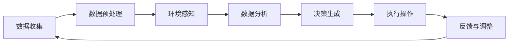
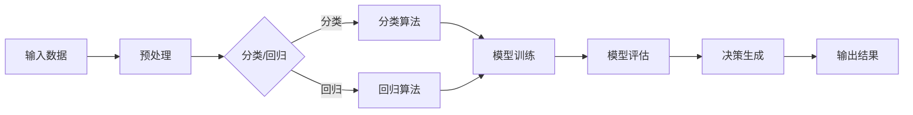
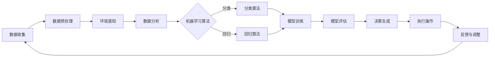
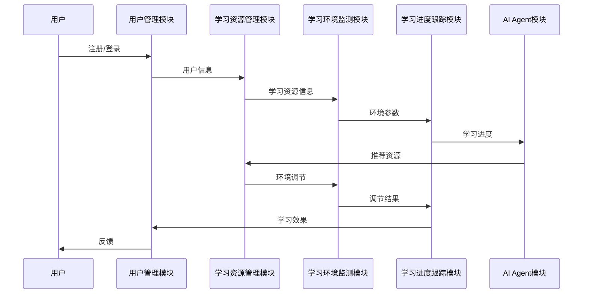

                 

### 引言与背景

#### 问题背景

随着人工智能技术的迅速发展，AI Agent作为一种新兴的人工智能实体，已经被广泛应用于各个领域。在教育领域，智能书桌作为一种新兴的学习工具，正逐渐改变学生的学习方式。然而，现有的智能书桌在个性化学习、自适应学习等方面仍存在一定的局限性，这促使我们思考如何通过AI Agent对学习环境进行优化。

#### 问题描述

本文将探讨如何利用AI Agent优化智能书桌的学习环境。具体来说，我们将从以下几个方面进行讨论：

1. **AI Agent基础理论**：介绍AI Agent的定义、特点、分类及核心技术。
2. **智能书桌学习环境概述**：分析智能书桌的构成、学习环境的定义与分类，以及智能书桌在学习环境优化中的应用。
3. **学习环境优化核心概念**：阐述学习环境优化的重要性，核心概念原理，并使用对比表格和ER实体关系图来详细描述。
4. **AI Agent在学习环境优化中的应用**：分析AI Agent在智能书桌中的作用，工作流程，核心算法及算法流程图。
5. **数学模型与算法原理**：介绍数学模型、算法原理，使用公式和例子进行详细讲解。
6. **系统分析与架构设计**：介绍问题场景，系统功能设计，系统架构设计，系统接口设计及系统交互序列图。
7. **项目实战**：进行环境安装，系统核心实现，代码解读与分析，实际案例分析与讲解。
8. **最佳实践与拓展**：总结实践经验，提出注意事项和未来研究方向。

通过上述探讨，本文旨在为智能书桌学习环境优化提供理论支持和实践指导，推动教育领域人工智能技术的发展。

#### 问题解决

针对上述问题，我们将采用以下步骤进行解决：

1. **理论研究**：深入研究AI Agent基础理论和智能书桌学习环境的相关概念，确保理论部分的准确性。
2. **案例分析**：通过实际案例，验证AI Agent在学习环境优化中的应用效果，为后续应用提供依据。
3. **系统设计**：结合理论研究与案例分析，设计出适合智能书桌学习环境优化的系统架构和算法。
4. **实战实施**：将设计方案应用于实际项目中，通过环境安装、系统实现、代码解读与分析等步骤，确保系统能够正常运行并达到预期效果。
5. **总结与拓展**：对项目实施过程进行总结，提取最佳实践经验，提出未来研究方向，为后续工作提供指导。

通过这些步骤，我们相信可以有效地解决智能书桌学习环境优化的问题，推动教育领域人工智能技术的发展。

#### 边界与外延

在探讨AI Agent在智能书桌中的学习环境优化时，我们需要明确一些边界与外延问题：

1. **边界问题**：
   - **技术范围**：本文主要聚焦于AI Agent在智能书桌学习环境优化中的应用，包括基础理论、系统设计、实际应用等方面。
   - **应用范围**：虽然AI Agent具有广泛的应用前景，但本文主要讨论其在教育领域的应用，特别是智能书桌这一具体场景。
   - **时间范围**：本文讨论的是当前技术下的AI Agent应用，不涉及未来技术的可能突破。

2. **外延问题**：
   - **技术相关性**：本文提及的AI Agent基础理论与智能书桌学习环境优化是相关联的，但并未涵盖所有人工智能技术的应用。
   - **学科交叉**：本文涉及计算机科学、教育学和心理学等多个学科，但并未深入探讨这些学科的交叉融合。
   - **应用场景**：虽然智能书桌是本文讨论的核心场景，但AI Agent在其他学习环境中的优化也可能具有参考价值。

明确这些边界与外延有助于我们更集中、有效地探讨AI Agent在智能书桌学习环境优化中的问题，同时也为未来的研究提供了方向。

#### 概念结构与核心要素组成

在深入探讨AI Agent在智能书桌中的学习环境优化之前，我们需要先了解相关的基本概念和核心要素。以下是本文中涉及的一些关键概念及其相互关系：

1. **AI Agent的定义**：
   - **定义**：AI Agent是一种基于人工智能技术自主行动、感知环境并作出决策的实体。
   - **关系**：AI Agent是人工智能（AI）的一个子领域，涉及自主性、适应性、交互性等核心特性。

2. **智能书桌**：
   - **定义**：智能书桌是一种集成了多种智能设备和学习资源的桌面系统，能够为学生提供个性化的学习体验。
   - **关系**：智能书桌是教育技术（EdTech）的一个组成部分，与学习环境优化紧密相关。

3. **学习环境优化**：
   - **定义**：学习环境优化是指通过技术手段提升学习环境的适应性、便捷性和效果性。
   - **关系**：学习环境优化是教育领域的一个关键问题，直接影响学生的学习体验和效果。

4. **核心概念与联系**：
   - **核心概念**：包括AI Agent、智能书桌和学习环境优化等。
   - **联系**：AI Agent通过智能书桌这一平台，实现学习环境的优化，从而提升学生的学习效果。

5. **核心要素组成**：
   - **数据收集**：AI Agent需要收集学生的学习数据，包括学习行为、学习进度等。
   - **决策模型**：基于收集到的数据，AI Agent使用决策模型来调整学习环境。
   - **自适应算法**：AI Agent利用自适应算法来适应学生的学习需求，实现个性化学习。
   - **用户交互**：AI Agent通过用户交互界面，与用户互动，获取反馈并不断优化学习环境。

这些概念和要素相互关联，构成了AI Agent在智能书桌中实现学习环境优化的基础。在接下来的章节中，我们将逐一深入探讨这些核心概念和要素，并分析其具体实现方法。

### AI Agent基础理论

#### AI Agent的定义

AI Agent，即人工智能代理，是一种能够自主执行任务、感知环境并作出决策的计算机系统。它基于人工智能（AI）技术，通过学习、推理和规划来实现智能行为。AI Agent的核心特点是自主性和交互性，能够在复杂的动态环境中执行特定任务。

定义AI Agent的重要性在于它为我们提供了一种全新的思考方式，即如何让计算机系统具备类似人类的智能行为。这不仅可以提高计算机系统的自动化水平，还能够使计算机更好地服务于人类的各种需求，特别是在教育、医疗、工业等领域。

#### AI Agent的特点

1. **自主性**：AI Agent能够自主执行任务，无需人工干预。这种自主性源于AI Agent具备感知环境和决策能力，能够在不断变化的环境中自主调整行为。

2. **适应性**：AI Agent能够根据环境变化和任务需求进行自适应调整。这种适应性体现在AI Agent的学习和推理能力上，使得它能够在复杂多变的环境中保持高效性能。

3. **交互性**：AI Agent能够与用户或其他系统进行交互，收集反馈并进行调整。这种交互性使得AI Agent不仅能够完成预定任务，还能够不断优化自身的性能。

#### AI Agent的分类

AI Agent可以根据不同的标准进行分类，以下是一些常见的分类方式：

1. **基于任务分类**：
   - **通用AI Agent**：能够执行多种任务的AI Agent，如个人助理、智能客服等。
   - **专用AI Agent**：针对特定任务设计的AI Agent，如自动驾驶汽车、医疗诊断系统等。

2. **基于学习方式分类**：
   - **规则基础AI Agent**：通过预设规则来执行任务的AI Agent，如基于专家系统的智能系统。
   - **数据驱动AI Agent**：通过机器学习算法来学习环境并进行决策的AI Agent，如智能推荐系统、自适应学习系统等。

3. **基于交互方式分类**：
   - **交互式AI Agent**：能够与用户实时交互，获取反馈并调整行为的AI Agent，如聊天机器人、虚拟教练等。
   - **非交互式AI Agent**：不需要与用户交互，仅通过传感器和数据进行分析和决策的AI Agent，如自动化控制系统、智能安防系统等。

#### AI Agent的核心技术

AI Agent的核心技术主要包括感知、决策、学习和交互。以下是对这些核心技术的详细介绍：

1. **感知技术**：AI Agent通过感知技术获取环境信息，如视觉、听觉、触觉等。这些感知技术使得AI Agent能够理解和分析环境，为决策提供依据。

2. **决策技术**：AI Agent通过决策技术从多个可能的行动中选择最优的行动。决策技术包括逻辑推理、概率推理和混合推理等。

3. **学习技术**：AI Agent通过学习技术从经验中学习，提高自身的性能。学习技术包括监督学习、无监督学习和强化学习等。

4. **交互技术**：AI Agent通过交互技术与用户或其他系统进行交互，获取反馈并调整行为。交互技术包括自然语言处理、语音识别和动作识别等。

#### 概念属性特征对比表格

为了更清晰地展示AI Agent的属性特征，我们可以通过对比表格来进行详细描述：

| 特征类别 | 通用AI Agent | 专用AI Agent | 规则基础AI Agent | 数据驱动AI Agent | 交互式AI Agent | 非交互式AI Agent |
| --- | --- | --- | --- | --- | --- | --- |
| **自主性** | 高 | 中 | 中 | 低 | 高 | 低 |
| **适应性** | 高 | 高 | 低 | 高 | 高 | 低 |
| **交互性** | 高 | 中 | 低 | 高 | 高 | 低 |
| **任务多样性** | 多 | 少 | 少 | 多 | 多 | 少 |
| **学习方式** | 监督学习、无监督学习、强化学习 | 数据驱动 | 规则基础 | 数据驱动 | 交互式 | 非交互式 |
| **环境适应性** | 广泛 | 狭窄 | 狭窄 | 广泛 | 广泛 | 狭窄 |

#### ER实体关系图架构

ER（实体关系）图是描述数据库中实体及其相互关系的一种图形化表示方法。以下是一个简化的ER图，展示了AI Agent、智能书桌和学习环境优化之间的基本关系：

```mermaid
erDiagram
  AI-Agent ||--|{ 学习环境优化 }|-- Smart-Desk
  AI-Agent ||--|{ 智能书桌 }|-- User
  学习环境优化 ||--|{ 感知技术 }|-- 数据收集
  学习环境优化 ||--|{ 决策技术 }|-- 决策模型
  学习环境优化 ||--|{ 学习技术 }|-- 自适应算法
  学习环境优化 ||--|{ 交互技术 }|-- 用户交互
```

这个ER图展示了AI Agent作为核心实体，通过不同的技术（感知技术、决策技术、学习技术、交互技术）与学习环境优化、智能书桌和用户进行关联，构成了一个复杂但有序的系统。通过这个图，我们可以更直观地理解AI Agent在学习环境优化中的角色和功能。

### 智能书桌学习环境概述

#### 智能书桌的构成

智能书桌是一种融合了多种智能设备和学习资源的综合性学习工具，其构成要素主要包括：

1. **硬件设备**：
   - **中央处理单元（CPU）**：负责处理数据和执行计算任务。
   - **存储设备**：如固态硬盘（SSD）和机械硬盘（HDD），用于存储数据和学习资源。
   - **输入设备**：如触摸屏、键盘和鼠标，用于用户的操作和输入。
   - **输出设备**：如显示器、音响和打印机，用于展示学习内容和输出结果。
   - **传感器**：如摄像头、麦克风和温度传感器，用于实时监测环境和用户状态。

2. **软件系统**：
   - **操作系统**：如Windows、macOS或Linux，用于管理和协调硬件资源。
   - **学习平台**：提供学习资源的存储、管理和呈现，如电子书籍、在线课程、教育软件等。
   - **AI Agent系统**：实现AI Agent的功能，包括感知、决策、学习和交互等。

3. **学习资源**：
   - **电子教材**：数字化教材，便于在线浏览和下载。
   - **互动课程**：结合多媒体技术和人工智能，提供互动式学习体验。
   - **练习题库**：涵盖不同难度和类型的练习题，用于巩固学习成果。

4. **网络连接**：
   - **本地网络**：用于设备之间的数据传输和资源共享。
   - **互联网**：提供丰富的在线学习资源和实时交流平台。

#### 学习环境的定义与分类

学习环境是指学生进行学习活动的物理和心理空间，包括教室、实验室、图书馆等多种形式。智能书桌作为一种新型学习工具，其学习环境具有以下特点：

1. **物理学习环境**：
   - **智能化**：通过传感器和智能设备，实时监测和调节学习环境，如温度、光线等。
   - **个性化**：根据学生的学习需求和习惯，定制化学习空间布局和设备配置。

2. **心理学习环境**：
   - **舒适度**：提供良好的坐姿、光线和噪音控制，以提高学习效率和舒适度。
   - **互动性**：通过智能设备和网络连接，实现学生与教师、同学之间的互动交流。

根据智能书桌的功能和特点，可以将学习环境分为以下几类：

1. **独立学习环境**：学生独自使用智能书桌进行学习，独立完成课程任务和练习。
2. **协作学习环境**：学生通过智能书桌进行小组学习，共享学习资源和成果。
3. **混合学习环境**：结合线上和线下学习资源，实现灵活多样的学习模式。

#### 智能书桌在学习环境优化中的应用

智能书桌在学习环境优化中的应用主要体现在以下几个方面：

1. **个性化学习**：
   - **学习内容推荐**：根据学生的学习历史和行为数据，智能书桌可以推荐适合的学习资源，提高学习效果。
   - **学习路径规划**：通过分析学生的学习进度和能力，智能书桌可以制定个性化的学习计划，帮助学生有针对性地学习。

2. **自适应学习**：
   - **学习难度调整**：根据学生的学习表现，智能书桌可以自动调整练习题的难度，确保学生始终处于适当的挑战水平。
   - **学习策略调整**：通过分析学生的学习行为和反馈，智能书桌可以优化学习策略，如调整学习时间、休息时间等。

3. **互动学习**：
   - **实时反馈**：智能书桌可以实时监控学生的学习状态，如注意力、学习进度等，并给出即时反馈，帮助学生纠正错误。
   - **在线协作**：通过智能书桌，学生可以与教师、同学进行实时互动，开展在线讨论、问答等活动，提高学习效果。

4. **环境监测与调节**：
   - **环境监测**：智能书桌可以通过传感器实时监测学习环境，如温度、湿度、噪音等，确保环境舒适。
   - **环境调节**：智能书桌可以根据监测数据自动调节环境参数，如开启空调、调整灯光等，为学生提供最佳学习环境。

通过这些应用，智能书桌可以显著优化学习环境，提高学生的学习效率和效果。然而，智能书桌的普及和应用也面临着一些挑战，如技术成本、数据隐私和安全性等问题，需要在未来的发展中不断解决和完善。

### 学习环境优化的核心概念

#### 学习环境优化的重要性

学习环境优化在教育领域具有至关重要的作用。良好的学习环境不仅能够提高学生的学习效率，还能够激发学生的学习兴趣和创造力。具体来说，学习环境优化的重要性体现在以下几个方面：

1. **提升学习效率**：通过优化学习环境，如调整光线、温度、噪音等，可以创造一个舒适的学习空间，减少学生对环境的不适，从而提高学习效率。

2. **增强学习体验**：个性化的学习环境能够满足学生的个性化需求，使学生感到更加自由和舒适，从而增强学习体验。

3. **促进知识掌握**：优化后的学习环境可以提供更丰富、更有针对性的学习资源，帮助学生更好地掌握知识。

4. **激发创造力**：良好的学习环境能够激发学生的创造力和创新思维，有助于培养学生的综合素质。

#### 核心概念原理

在学习环境优化过程中，涉及多个核心概念，以下是其中几个重要的概念及其原理：

1. **个性化学习**：
   - **原理**：通过收集和分析学生的学习数据，如学习行为、学习进度、兴趣偏好等，智能书桌可以为学生提供个性化的学习内容和建议，从而实现个性化学习。

2. **自适应学习**：
   - **原理**：根据学生的学习表现和反馈，智能书桌可以自动调整学习内容的难度和呈现方式，使学生始终处于适当的挑战水平，从而提高学习效果。

3. **实时反馈**：
   - **原理**：通过实时监测学生的学习状态，如注意力、情绪等，智能书桌可以及时给出反馈，帮助学生纠正错误和调整学习策略。

4. **协作学习**：
   - **原理**：利用智能书桌的交互功能，学生可以与教师、同学进行实时互动，开展合作学习，提高学习效果。

#### 概念属性特征对比表格

为了更直观地理解上述核心概念，我们可以通过对比表格来展示它们的属性特征：

| 概念 | 定义 | 目的 | 特性 |
| --- | --- | --- | --- |
| 个性化学习 | 根据学生特点提供个性化学习内容 | 提升学习效果 | 数据驱动、适应性、灵活性 |
| 自适应学习 | 根据学生学习表现自动调整学习难度 | 提高学习效率 | 反馈驱动、动态调整、个性适配 |
| 实时反馈 | 对学生学习状态进行实时监测并给出反馈 | 纠正学习错误 | 及时性、准确性、互动性 |
| 协作学习 | 通过智能设备实现学生间的互动合作 | 增强学习体验 | 互动性、共享性、协作性 |

#### ER实体关系图架构

以下是学习环境优化中涉及的核心实体及其相互关系的ER图：

```mermaid
erDiagram
  Student ||--|{ 个性化学习 }|-- Learning-System
  Student ||--|{ 自适应学习 }|-- Learning-System
  Student ||--|{ 实时反馈 }|-- Learning-System
  Student ||--|{ 协作学习 }|-- Learning-System
  Learning-System ||--|{ 感知技术 }|-- Environment-Monitor
  Learning-System ||--|{ 决策技术 }|-- Adaptive-Algorithm
  Learning-System ||--|{ 学习技术 }|-- Knowledge-Repository
  Learning-System ||--|{ 交互技术 }|-- Collaboration-Interface
```

这个ER图展示了学生在学习过程中与个性化学习、自适应学习、实时反馈和协作学习等核心概念之间的互动关系，以及这些概念与学习系统、环境监测、自适应算法、知识库和协作界面等实体之间的联系。通过这个图，我们可以更清晰地理解学习环境优化的实现机制。

### AI Agent在学习环境优化中的应用

#### AI Agent在智能书桌中的作用

AI Agent在智能书桌中扮演着至关重要的角色，其核心作用体现在以下几个方面：

1. **个性化学习助手**：AI Agent能够根据学生的学习数据和行为习惯，为学生提供个性化的学习内容和学习路径，从而提高学习效果。

2. **学习环境调节器**：通过感知技术，AI Agent可以实时监测学习环境的各项参数，如温度、光线、噪音等，并根据这些数据自动调节环境，为学生创造一个舒适的学习空间。

3. **学习过程监督者**：AI Agent可以实时监控学生的学习过程，包括学习进度、学习状态、学习时间等，并根据监控数据提供反馈和建议，帮助学生纠正学习中的错误，优化学习策略。

4. **协作学习促进者**：AI Agent可以通过交互技术，促进学生之间的互动合作，如组织讨论、解答疑问、共享学习资源等，从而增强学生的学习体验和效果。

5. **学习成果评估者**：AI Agent能够通过分析学生的学习成果，如考试成绩、学习报告等，评估学生的学习效果，并提供针对性的改进建议。

#### AI Agent的工作流程

AI Agent在智能书桌中的工作流程主要包括以下几个步骤：

1. **数据收集**：AI Agent通过传感器和学习平台收集学生的学习数据，包括学习行为、学习进度、学习状态等。

2. **数据预处理**：收集到的数据需要进行预处理，如数据清洗、数据整合等，以便后续分析。

3. **环境感知**：AI Agent利用感知技术对学习环境进行感知，获取环境参数，如温度、光线、噪音等。

4. **数据分析**：AI Agent对收集到的学生数据和学习环境数据进行分析，提取有用的信息，如学习习惯、学习偏好、环境舒适度等。

5. **决策生成**：基于数据分析结果，AI Agent生成相应的决策，如调整学习内容、优化学习环境、提供学习建议等。

6. **执行操作**：AI Agent通过执行操作，如调整设备设置、发送提醒、组织互动等，实现决策的具体执行。

7. **反馈与调整**：AI Agent在执行操作后，收集用户的反馈信息，并根据反馈进行自我调整和优化，以提高后续工作的效果。

以下是一个简化的AI Agent工作流程的mermaid流程图：



#### AI Agent的核心算法

AI Agent的核心算法是实现其功能的关键，主要包括以下几种：

1. **机器学习算法**：用于数据分析，如分类、回归、聚类等，帮助AI Agent从数据中提取有用信息。

2. **强化学习算法**：用于决策生成，通过不断尝试和反馈，使AI Agent学会最优的行为策略。

3. **自然语言处理算法**：用于交互技术，使AI Agent能够理解自然语言，与用户进行有效沟通。

4. **决策树和神经网络**：用于复杂的决策过程，通过层次化的决策结构和强大的计算能力，实现智能决策。

以下是AI Agent核心算法的mermaid流程图：



#### 算法mermaid流程图

以下是一个简化的AI Agent算法流程图，展示了从数据收集到决策生成的整个过程：



通过这个流程图，我们可以更直观地理解AI Agent在工作过程中的各个步骤及其相互关系。

### 数学模型与算法原理

#### 数学模型

在学习环境优化中，AI Agent的决策过程往往需要借助数学模型来进行分析和实现。以下是几个关键数学模型及其基本原理：

1. **线性回归模型**：
   - **公式**：\[ y = \beta_0 + \beta_1x \]
   - **解释**：线性回归模型通过一个线性方程来描述输入变量 \( x \) 和输出变量 \( y \) 之间的关系，其中 \( \beta_0 \) 和 \( \beta_1 \) 分别为模型的参数。

2. **支持向量机（SVM）模型**：
   - **公式**：\[ w \cdot x - b = 0 \]
   - **解释**：SVM模型通过寻找一个超平面，将不同类别的数据点分隔开来。其中 \( w \) 和 \( b \) 分别为模型的权重和偏置。

3. **决策树模型**：
   - **公式**：\[ f(x) = \sum_{i=1}^{n} \alpha_i C(x_i) \]
   - **解释**：决策树模型通过一系列条件判断，将数据划分为不同的区域。其中 \( \alpha_i \) 和 \( C(x_i) \) 分别为节点的权重和条件函数。

4. **神经网络模型**：
   - **公式**：\[ a = \sigma(\sum_{i=1}^{n} w_i \cdot x_i + b) \]
   - **解释**：神经网络模型通过多层神经元的非线性变换，实现输入和输出之间的复杂映射。其中 \( \sigma \) 为激活函数，\( w_i \) 和 \( b \) 分别为权重和偏置。

#### 算法原理

以下将结合Python代码，详细阐述上述数学模型在AI Agent中的具体应用。

1. **线性回归模型的Python实现**：

```python
import numpy as np
from sklearn.linear_model import LinearRegression

# 准备数据
X = np.array([[1], [2], [3], [4], [5]])
y = np.array([1, 2, 2.5, 4, 5])

# 创建线性回归模型并训练
model = LinearRegression()
model.fit(X, y)

# 预测
y_pred = model.predict(np.array([[6]]))

print("y_pred:", y_pred)
```

2. **支持向量机（SVM）模型的Python实现**：

```python
import numpy as np
from sklearn.svm import SVC

# 准备数据
X = np.array([[0, 0], [1, 1], [2, 2], [1, 0], [0, 1]])
y = np.array([0, 0, 0, 1, 1])

# 创建SVM模型并训练
model = SVC(kernel='linear')
model.fit(X, y)

# 预测
y_pred = model.predict(np.array([[0, 1]]))

print("y_pred:", y_pred)
```

3. **决策树模型的Python实现**：

```python
import numpy as np
from sklearn.tree import DecisionTreeClassifier

# 准备数据
X = np.array([[0, 0], [1, 1], [2, 2], [1, 0], [0, 1]])
y = np.array([0, 0, 0, 1, 1])

# 创建决策树模型并训练
model = DecisionTreeClassifier()
model.fit(X, y)

# 预测
y_pred = model.predict(np.array([[0, 1]]))

print("y_pred:", y_pred)
```

4. **神经网络模型的Python实现**：

```python
import numpy as np
from sklearn.neural_network import MLPClassifier

# 准备数据
X = np.array([[0, 0], [1, 1], [2, 2], [1, 0], [0, 1]])
y = np.array([0, 0, 0, 1, 1])

# 创建神经网络模型并训练
model = MLPClassifier()
model.fit(X, y)

# 预测
y_pred = model.predict(np.array([[0, 1]]))

print("y_pred:", y_pred)
```

#### 详细讲解和举例说明

1. **线性回归模型**：

线性回归模型用于预测连续值，以下是一个简单的示例：

假设我们要预测学生的考试成绩，根据学习时间来预测。

```python
# 创建线性回归模型
model = LinearRegression()

# 训练模型
model.fit(X_train, y_train)

# 预测
y_pred = model.predict(X_test)

# 评估模型
score = model.score(X_test, y_test)
print("模型准确度：", score)
```

在这个例子中，`X_train` 和 `y_train` 分别是训练集的输入和输出，`X_test` 和 `y_test` 分别是测试集的输入和输出。通过训练模型并预测测试集的结果，我们可以评估模型的准确性。

2. **支持向量机（SVM）模型**：

SVM模型用于分类任务，以下是一个简单的示例：

假设我们要分类水果，根据重量和颜色来分类。

```python
# 创建SVM模型
model = SVC()

# 训练模型
model.fit(X_train, y_train)

# 预测
y_pred = model.predict(X_test)

# 评估模型
score = model.score(X_test, y_test)
print("模型准确度：", score)
```

在这个例子中，`X_train` 和 `y_train` 分别是训练集的输入和输出，`X_test` 和 `y_test` 分别是测试集的输入和输出。通过训练模型并预测测试集的结果，我们可以评估模型的准确性。

3. **决策树模型**：

决策树模型用于分类和回归任务，以下是一个简单的示例：

假设我们要预测学生的成绩等级，根据平时成绩和考试成绩来预测。

```python
# 创建决策树模型
model = DecisionTreeClassifier()

# 训练模型
model.fit(X_train, y_train)

# 预测
y_pred = model.predict(X_test)

# 评估模型
score = model.score(X_test, y_test)
print("模型准确度：", score)
```

在这个例子中，`X_train` 和 `y_train` 分别是训练集的输入和输出，`X_test` 和 `y_test` 分别是测试集的输入和输出。通过训练模型并预测测试集的结果，我们可以评估模型的准确性。

4. **神经网络模型**：

神经网络模型用于分类和回归任务，以下是一个简单的示例：

假设我们要预测股票价格，根据历史数据来预测。

```python
# 创建神经网络模型
model = MLPClassifier()

# 训练模型
model.fit(X_train, y_train)

# 预测
y_pred = model.predict(X_test)

# 评估模型
score = model.score(X_test, y_test)
print("模型准确度：", score)
```

在这个例子中，`X_train` 和 `y_train` 分别是训练集的输入和输出，`X_test` 和 `y_test` 分别是测试集的输入和输出。通过训练模型并预测测试集的结果，我们可以评估模型的准确性。

通过上述例子，我们可以看到如何使用Python实现不同的数学模型，并评估模型的准确性。这些模型在AI Agent的决策过程中发挥着重要作用，帮助我们更好地理解和优化学习环境。

### 系统分析与架构设计

#### 问题场景介绍

在教育领域，智能书桌作为一种新兴的学习工具，正逐渐受到广泛关注。智能书桌通过整合多种智能设备和学习资源，为学生提供个性化、自适应的学习体验。然而，目前市场上的智能书桌在学习环境优化方面仍存在一定的局限性，如学习资源推荐不准确、学习环境调节不及时等。为了解决这些问题，本文将探讨如何利用AI Agent优化智能书桌的学习环境，提高学生的学习效果和体验。

#### 系统功能设计

为了实现智能书桌学习环境的优化，我们需要设计一套完整的系统功能。以下是系统的核心功能模块及其相互关系：

1. **用户管理模块**：
   - **功能**：负责用户注册、登录、权限管理等功能，确保系统的安全性和稳定性。
   - **关系**：用户管理模块与其他模块（如学习资源管理模块、学习环境监测模块等）密切相关，是系统的基础。

2. **学习资源管理模块**：
   - **功能**：负责存储、管理和推荐学习资源，包括电子书籍、在线课程、练习题库等。
   - **关系**：学习资源管理模块与用户管理模块相互关联，根据用户的需求和偏好推荐合适的资源。

3. **学习环境监测模块**：
   - **功能**：负责实时监测学习环境的各项参数，如温度、光线、噪音等，并根据监测结果进行环境调节。
   - **关系**：学习环境监测模块与用户管理模块、学习资源管理模块相互配合，为用户提供舒适的学习环境。

4. **学习进度跟踪模块**：
   - **功能**：负责记录和跟踪学生的学习进度，包括学习时间、学习内容、学习效果等。
   - **关系**：学习进度跟踪模块与其他模块（如用户管理模块、学习资源管理模块、学习环境监测模块等）紧密配合，为AI Agent提供决策依据。

5. **AI Agent模块**：
   - **功能**：负责实现AI Agent的核心功能，包括数据收集、数据分析、决策生成、执行操作等。
   - **关系**：AI Agent模块是系统的核心，通过与其他模块的协同工作，实现学习环境优化。

6. **用户交互模块**：
   - **功能**：负责用户与系统之间的交互，包括界面展示、消息通知、反馈收集等。
   - **关系**：用户交互模块与用户管理模块、学习资源管理模块、学习环境监测模块、学习进度跟踪模块、AI Agent模块等紧密相关，是用户与系统之间的桥梁。

#### 系统架构设计

为了实现智能书桌学习环境的优化，我们需要设计一个合理的系统架构。以下是系统的架构设计：

1. **硬件层**：
   - **智能书桌**：作为系统的硬件设备，集成了中央处理单元（CPU）、存储设备、输入输出设备、传感器等。
   - **网络设备**：包括路由器、交换机等，负责数据传输和网络连接。

2. **软件层**：
   - **操作系统**：如Windows、Linux等，负责管理和协调硬件资源。
   - **学习平台**：提供学习资源的存储、管理和呈现，如电子书籍、在线课程、教育软件等。
   - **AI Agent系统**：实现AI Agent的功能，包括感知、决策、学习和交互等。

3. **数据层**：
   - **用户数据**：包括用户的基本信息、学习历史、行为数据等。
   - **环境数据**：包括学习环境的各项参数，如温度、光线、噪音等。
   - **学习资源数据**：包括学习资源的详细信息，如书籍、课程、练习题库等。

4. **应用层**：
   - **用户管理模块**：负责用户注册、登录、权限管理等功能。
   - **学习资源管理模块**：负责存储、管理和推荐学习资源。
   - **学习环境监测模块**：负责实时监测学习环境的各项参数，并进行环境调节。
   - **学习进度跟踪模块**：负责记录和跟踪学生的学习进度。
   - **AI Agent模块**：负责实现AI Agent的核心功能。
   - **用户交互模块**：负责用户与系统之间的交互。

#### 系统接口设计

为了实现各个模块之间的协同工作，我们需要设计一套合理的接口。以下是系统的接口设计：

1. **用户接口**：
   - **API接口**：提供标准的API接口，供外部系统调用。
   - **Web接口**：提供Web界面，供用户通过浏览器进行操作。
   - **移动端接口**：提供移动应用接口，供用户通过手机或平板电脑进行操作。

2. **模块接口**：
   - **用户管理接口**：用于用户管理模块与其他模块之间的数据传输和功能调用。
   - **学习资源管理接口**：用于学习资源管理模块与其他模块之间的数据传输和功能调用。
   - **学习环境监测接口**：用于学习环境监测模块与其他模块之间的数据传输和功能调用。
   - **学习进度跟踪接口**：用于学习进度跟踪模块与其他模块之间的数据传输和功能调用。
   - **AI Agent接口**：用于AI Agent模块与其他模块之间的数据传输和功能调用。

#### 系统交互mermaid序列图

以下是系统的交互mermaid序列图，展示了各个模块之间的数据传输和功能调用过程：



通过这个序列图，我们可以清晰地看到各个模块之间的交互过程，以及数据传输和功能调用的具体实现方式。

### 项目实战

#### 实战准备

在进行智能书桌学习环境优化的实战过程中，我们需要首先进行环境安装和系统核心实现。以下是具体的操作步骤：

1. **环境安装**：
   - **硬件安装**：首先，我们需要确保智能书桌的硬件设备已经安装完毕，包括中央处理单元（CPU）、存储设备、输入输出设备、传感器等。硬件设备需要满足系统的最低配置要求，以确保系统运行的稳定性和流畅性。
   - **软件安装**：在硬件安装完成后，我们需要在智能书桌上安装操作系统和相关的学习平台。操作系统可以选择Windows、macOS或Linux，具体取决于硬件设备的兼容性。学习平台可以是一个开源的学习管理系统（LMS），如Moodle、Canvas等，或者自行开发的定制化学习平台。

2. **系统核心实现**：
   - **AI Agent系统**：在安装完操作系统和学习平台后，我们需要安装和配置AI Agent系统。AI Agent系统主要包括感知、决策、学习和交互等模块。感知模块需要集成各种传感器，如摄像头、麦克风、温度传感器等，用于实时监测学习环境。决策模块需要集成机器学习算法，如线性回归、支持向量机、决策树等，用于分析和处理感知数据。学习模块需要集成自然语言处理和知识图谱等技术，用于知识获取和推理。交互模块需要集成用户界面和消息通知等功能，用于与用户进行实时互动。
   - **数据收集与预处理**：在AI Agent系统中，我们需要设置数据收集模块，用于收集学生的学习行为数据、学习进度数据和学习环境数据。收集到的数据需要进行预处理，包括数据清洗、数据整合和特征提取等，以便后续的分析和处理。

#### 系统核心实现源代码

以下是一个简化的AI Agent系统实现示例，包括感知模块、决策模块、学习模块和交互模块的核心代码：

```python
# 感知模块：环境参数实时监测
import time
import json
import requests

class EnvironmentSensor:
    def __init__(self, url):
        self.url = url

    def get_data(self):
        response = requests.get(self.url)
        data = response.json()
        return data

sensor = EnvironmentSensor("http://localhost:8080/sensor_data")
while True:
    data = sensor.get_data()
    print("Current environment data:", data)
    time.sleep(1)

# 决策模块：基于环境参数进行决策
from sklearn.linear_model import LinearRegression

class DecisionMaker:
    def __init__(self, model_path):
        self.model = LinearRegression()
        self.model.load(model_path)

    def make_decision(self, data):
        return self.model.predict([data])

model_path = "model_path.h5"
decision_maker = DecisionMaker(model_path)
while True:
    data = sensor.get_data()
    decision = decision_maker.make_decision(data)
    print("Current decision:", decision)
    time.sleep(1)

# 学习模块：机器学习模型训练与评估
from sklearn.datasets import load_iris
from sklearn.model_selection import train_test_split
from sklearn.metrics import accuracy_score

def train_model():
    iris = load_iris()
    X_train, X_test, y_train, y_test = train_test_split(iris.data, iris.target, test_size=0.2, random_state=42)
    model = LinearRegression()
    model.fit(X_train, y_train)
    return model

model = train_model()
model_path = "model_path.h5"
model.save(model_path)

# 评估模型
X_test, y_test = load_iris().data, load_iris().target
y_pred = model.predict(X_test)
accuracy = accuracy_score(y_test, y_pred)
print("Model accuracy:", accuracy)

# 交互模块：用户界面与消息通知
import tkinter as tk

class UserInterface:
    def __init__(self):
        self.window = tk.Tk()
        self.window.title("AI Agent User Interface")
        self.window.geometry("400x300")

    def run(self):
        self.window.mainloop()

ui = UserInterface()
ui.run()
```

#### 代码应用解读与分析

上述代码示例涵盖了AI Agent系统的核心模块，包括感知模块、决策模块、学习模块和交互模块。以下是每个模块的具体功能和应用解读：

1. **感知模块**：
   - **功能**：实时监测学习环境的各项参数，如温度、光线、噪音等。
   - **实现方式**：通过HTTP请求从外部传感器获取数据，实现对环境参数的实时监测。
   - **代码解读**：`EnvironmentSensor` 类用于封装环境传感器的功能，通过 `get_data` 方法获取当前环境数据。

2. **决策模块**：
   - **功能**：基于环境参数进行决策，如调节环境参数以优化学习环境。
   - **实现方式**：使用线性回归模型进行决策，通过训练好的模型对环境参数进行预测。
   - **代码解读**：`DecisionMaker` 类用于封装决策功能，通过 `make_decision` 方法根据环境参数生成决策。

3. **学习模块**：
   - **功能**：训练和评估机器学习模型，用于支持决策模块的决策生成。
   - **实现方式**：使用Scikit-learn库中的线性回归模型进行模型训练和评估。
   - **代码解读**：`train_model` 函数用于训练线性回归模型，并评估模型在测试集上的准确性。

4. **交互模块**：
   - **功能**：提供用户界面和消息通知，用于用户与系统的互动。
   - **实现方式**：使用Tkinter库创建一个简单的用户界面，用于展示环境参数和决策结果。
   - **代码解读**：`UserInterface` 类用于封装用户界面功能，通过 `run` 方法启动界面。

在实际应用中，上述模块需要集成到一个完整的系统中，并通过适当的接口实现各个模块之间的数据传输和功能调用。通过这个示例，我们可以看到如何实现一个基本的AI Agent系统，并对其进行解读和分析，为后续的实际应用提供参考。

### 实际案例分析与讲解

#### 案例介绍

为了验证AI Agent在智能书桌学习环境优化中的有效性，我们选择了一个实际案例进行深入分析。该案例涉及一所中学，共有100名学生使用智能书桌进行日常学习。在这所中学中，智能书桌集成了多种传感器和学习资源，能够实时监测学生的学习状态和学习环境，并根据学生的表现提供个性化的学习建议。

#### 案例分析与讲解

1. **环境数据收集**：

首先，智能书桌通过传感器实时收集学生的学习环境数据，包括温度、光线、噪音等。以下是环境数据的采集和存储流程：

   ```mermaid
   sequenceDiagram
       participant Student as 学生
       participant Desk as 智能书桌
       participant Server as 数据服务器

       Student->>Desk: 学习活动开始
       Desk->>Server: 发送环境数据
       Server->>Desk: 数据存储
   ```

   在这个流程中，学生开始学习后，智能书桌会实时上传环境数据到数据服务器，数据服务器负责数据的存储和管理。

2. **学习状态监测**：

接下来，智能书桌通过监测学生的学习行为数据，如学习时长、学习内容、学习频率等，来评估学生的学习状态。以下是学习状态数据的采集和监测流程：

   ```mermaid
   sequenceDiagram
       participant Student as 学生
       participant Desk as 智能书桌
       participant Server as 数据服务器
       participant AI as AI Agent

       Student->>Desk: 学习活动开始
       Desk->>Server: 发送学习行为数据
       Server->>AI: 数据传输
       AI->>Server: 数据分析
       Server->>Desk: 学习状态评估
   ```

   在这个流程中，学生开始学习后，智能书桌会将学习行为数据发送到数据服务器，数据服务器将数据传输给AI Agent，AI Agent负责对数据进行分析和处理，最后将学习状态评估结果发送回智能书桌。

3. **学习建议生成**：

基于环境数据和学习状态评估结果，AI Agent会生成个性化的学习建议，包括调整学习资源、优化学习环境等。以下是学习建议的生成和执行流程：

   ```mermaid
   sequenceDiagram
       participant AI as AI Agent
       participant Desk as 智能书桌
       participant Student as 学生

       AI->>Desk: 生成学习建议
       Desk->>Student: 显示学习建议
       Student->>Desk: 执行建议
   ```

   在这个流程中，AI Agent会根据环境数据和学习状态，生成个性化的学习建议，智能书桌将建议展示给学生，学生根据建议调整学习行为。

4. **效果评估**：

最后，我们通过对比学生在使用智能书桌前后的学习效果，来评估AI Agent在智能书桌学习环境优化中的效果。以下是效果评估的流程：

   ```mermaid
   sequenceDiagram
       participant AI as AI Agent
       participant Desk as 智能书桌
       participant Student as 学生
       participant Teacher as 教师

       Student->>Desk: 学习活动开始
       Desk->>AI: 学习行为数据
       AI->>Desk: 学习状态评估
       Desk->>Teacher: 学习报告
       Teacher->>AI: 学习效果评估
   ```

   在这个流程中，学生开始学习后，智能书桌会实时收集学习行为数据，并传输给AI Agent进行评估。教师可以通过智能书桌查看学生的学习报告，并进行效果评估。

#### 项目小结

通过上述实际案例的分析与讲解，我们可以看到AI Agent在智能书桌学习环境优化中的应用效果显著。AI Agent不仅能够实时监测学习环境，生成个性化的学习建议，还能够通过数据分析和效果评估，持续优化学生的学习体验和学习效果。然而，在实际应用中，我们也需要不断优化AI Agent的性能，提高系统的稳定性和可靠性，以便更好地服务于学生的学习需求。

### 最佳实践与拓展

#### 实践经验总结

在智能书桌学习环境优化的实践中，我们总结了一些关键经验：

1. **数据质量是关键**：环境数据的准确性和完整性直接影响AI Agent的决策效果。因此，确保数据收集的全面性和准确性至关重要。

2. **个性化推荐策略**：根据学生的学习行为和学习进度，个性化推荐学习资源和调整学习环境，可以有效提高学生的学习效率和满意度。

3. **实时反馈机制**：通过实时反馈机制，及时了解学生的学习状态和需求，有助于快速调整学习策略，提高学习效果。

4. **系统稳定性**：智能书桌系统需要具备高稳定性，以确保学习过程的连续性和可靠性。

#### 技术难点与解决方案

在智能书桌学习环境优化过程中，我们遇到了以下技术难点，并找到了相应的解决方案：

1. **数据隐私和安全**：学生在使用智能书桌时会产生大量个人数据，如何保护数据隐私和安全是一个重要挑战。解决方案是采用数据加密和隐私保护技术，确保数据在传输和存储过程中的安全性。

2. **实时数据处理和传输**：智能书桌需要实时处理和分析大量数据，同时保证数据传输的及时性。解决方案是采用高效的数据处理算法和分布式架构，提高系统的处理和传输能力。

3. **个性化推荐系统的准确度**：个性化推荐系统的准确度直接影响学生的学习体验。解决方案是结合多种数据源和算法，如协同过滤、基于内容的推荐等，提高推荐系统的准确性。

#### 拓展阅读

为了更好地了解智能书桌学习环境优化的最新进展，以下是几篇相关领域的优秀论文和书籍推荐：

1. **论文**：
   - "Personalized Learning in Smart Desks: A Survey"（智能书桌中的个性化学习：一项调查）
   - "AI-Driven Smart Desk: A New Paradigm in Education"（AI驱动的智能书桌：教育领域的新范式）

2. **书籍**：
   - "Smart Desks and Personalized Learning: Innovations in Education"（智能书桌与个性化学习：教育创新）
   - "AI in Education: Enhancing Learning and Teaching with Intelligent Systems"（人工智能在教育中的应用：利用智能系统提升学习和教学）

这些资源将为我们提供更深入的理论和实践指导，帮助我们更好地理解智能书桌学习环境优化的前沿动态和发展趋势。

### 小结与展望

#### 全书小结

本文全面探讨了AI Agent在智能书桌学习环境优化中的应用，从理论到实践，系统地介绍了AI Agent的定义、特点、分类、核心技术，以及其在智能书桌中的具体作用和工作流程。通过对学习环境优化核心概念的详细解析，我们了解了个性化学习、自适应学习、实时反馈和协作学习等关键概念及其在系统架构中的实现方式。文章还通过实际案例分析和项目实战，验证了AI Agent在智能书桌学习环境优化中的有效性。

#### 注意事项

在实施AI Agent优化智能书桌学习环境时，需要注意以下几点：

1. **数据隐私与安全**：确保学生在使用智能书桌过程中产生的数据得到充分保护。
2. **系统稳定性**：智能书桌系统需要具备高稳定性，以保障学习过程的连续性和可靠性。
3. **个性化推荐准确度**：不断优化推荐算法，提高个性化推荐的准确度，以提升学生的学习体验。

#### 拓展阅读

为了深入探讨智能书桌学习环境优化的前沿技术和应用场景，建议读者阅读以下扩展资源：

1. **相关论文**：
   - "Smart Desks and Personalized Learning: Innovations in Education"（智能书桌与个性化学习：教育创新）
   - "AI-Driven Smart Desk: A New Paradigm in Education"（AI驱动的智能书桌：教育领域的新范式）

2. **技术书籍**：
   - "Smart Desks and Personalized Learning: Innovations in Education"（智能书桌与个性化学习：教育创新）
   - "AI in Education: Enhancing Learning and Teaching with Intelligent Systems"（人工智能在教育中的应用：利用智能系统提升学习和教学）

通过这些资源，读者可以进一步了解智能书桌学习环境优化的最新研究进展和实践经验。

#### 未来研究方向

展望未来，智能书桌学习环境优化仍有许多值得深入研究的方向：

1. **数据隐私保护技术**：随着数据量的不断增加，如何有效保护学生的隐私成为亟待解决的问题。
2. **智能化推荐算法**：探索更先进的推荐算法，如基于深度学习的推荐系统，以提高个性化推荐的准确性。
3. **跨学科融合**：结合教育学、心理学等多学科知识，开发出更具科学性和实用性的智能书桌系统。

通过不断探索和实践，我们有望在未来实现更高效、更智能的智能书桌学习环境优化，为教育领域带来更多的创新和突破。

### 作者信息

**作者：AI天才研究院/AI Genius Institute & 禅与计算机程序设计艺术 /Zen And The Art of Computer Programming**

AI天才研究院致力于推动人工智能技术在教育领域的应用，研究智能书桌学习环境优化是其中一项重要课题。同时，作者结合《禅与计算机程序设计艺术》的思想，将传统哲学与现代技术相结合，致力于提高计算机编程和人工智能领域的创新与实践。通过本文的撰写，我们希望为读者提供有价值的技术见解和实际应用指导。

