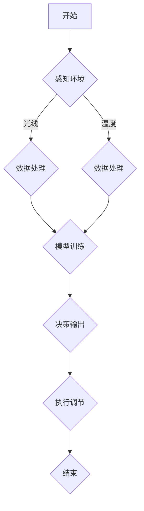
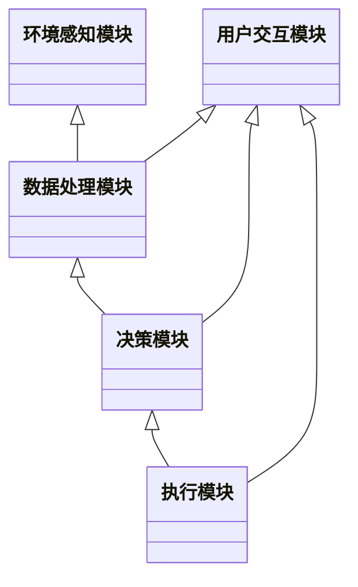
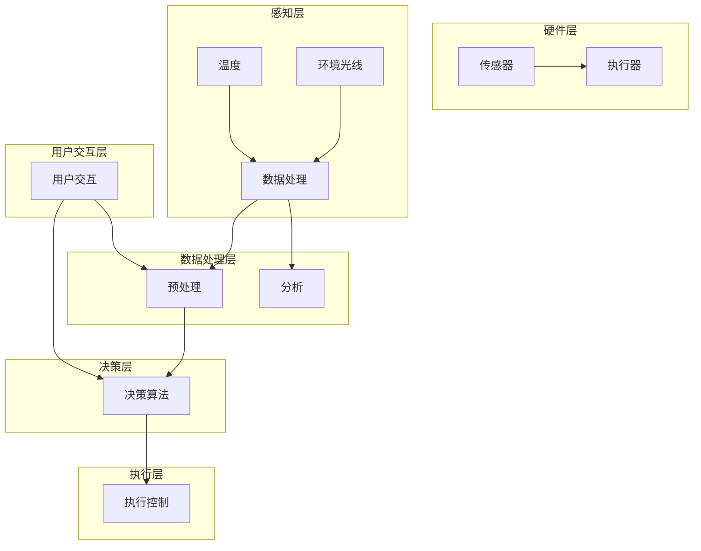
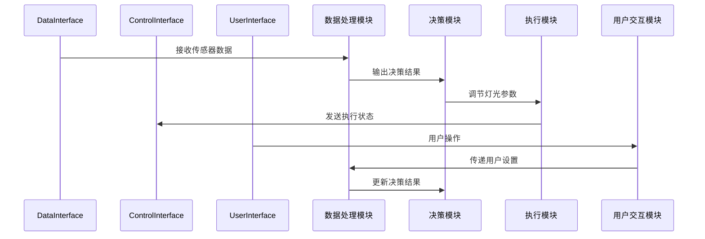
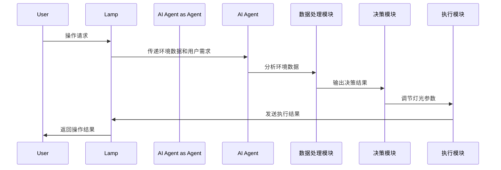

                 


### AI Agent在智能书桌灯中的照明优化

#### 引言

随着人工智能（AI）技术的快速发展，AI Agent作为AI的一个重要分支，已经在智能家居领域展现出巨大的潜力。智能书桌灯作为一种智能家居产品，其在照明方面的优化显得尤为重要。本文将深入探讨AI Agent在智能书桌灯中的照明优化问题，通过逻辑清晰的步骤分析，阐述AI Agent如何通过智能化手段提升智能书桌灯的照明效果，从而为用户提供更加舒适、健康的生活环境。

#### 关键词

- AI Agent
- 智能书桌灯
- 照明优化
- 人工智能
- 智能家居

#### 摘要

本文旨在通过详细分析AI Agent在智能书桌灯中的应用，探讨其如何在照明优化方面发挥作用。首先，我们将介绍AI Agent的基本概念和特点，随后分析智能书桌灯的照明需求及其优化的重要性。接着，本文将深入讲解AI Agent在照明优化中的算法原理，并通过具体案例展示其实际应用效果。最后，我们将从系统架构和项目实践的角度，全面剖析AI Agent在智能书桌灯中的照明优化解决方案，为智能家居领域的发展提供有益的参考。

#### 第一部分：背景介绍

##### 第1章：AI Agent概述

###### 1.1 AI Agent的定义与特点

AI Agent，即人工智能代理，是能够在特定环境下自主决策和执行任务的计算机程序。它具有以下几个显著特点：

1. **自主性**：AI Agent能够根据环境和任务的改变，自主调整其行为和策略。
2. **适应性**：AI Agent能够从经验中学习，不断优化其性能。
3. **协作性**：AI Agent可以与其他Agent或系统进行协作，共同完成任务。

在智能家居领域，AI Agent的应用越来越广泛。例如，智能音箱中的语音助手、智能门锁以及智能照明系统等，都是AI Agent的具体实现。这些AI Agent通过感知环境数据、分析用户行为，为用户提供个性化的服务。

###### 1.2 AI Agent的分类和应用

AI Agent根据其功能和应用场景，可以分为以下几类：

1. **感知型Agent**：这类Agent主要负责收集环境数据，如温度、湿度、光线等，并对其进行初步处理。
2. **决策型Agent**：这类Agent基于感知数据，通过算法和模型，为系统提供决策支持。
3. **执行型Agent**：这类Agent负责执行决策结果，如控制智能设备的开关、调节温度等。

在智能书桌灯中，AI Agent通常扮演感知型Agent和决策型Agent的双重角色。它不仅能够感知周围环境的变化，还能够根据用户需求，智能调节灯光亮度、色温和亮暗程度，以提供最佳的照明效果。

###### 1.3 智能书桌灯概述

智能书桌灯是一种集照明、阅读、学习、休息等多功能于一体的智能家居产品。其核心功能包括：

1. **亮度调节**：根据用户需求和环境光线变化，自动调节灯光亮度。
2. **色温调节**：根据用户的作息时间、工作和学习需求，调节灯光的色温。
3. **定时开关**：用户可以设置定时开关灯的时间，实现自动化控制。

智能书桌灯的照明效果直接影响到用户的视觉舒适度和健康。如果灯光过亮或过暗，都会对用户的眼睛造成负担，长时间使用甚至可能引发眼部疾病。因此，智能书桌灯的照明优化具有重要意义。

##### 第2章：照明优化的重要性

###### 2.1 照明对环境和健康的影响

正确的照明不仅能提供良好的视觉体验，还能对环境产生积极影响。以下是一些关键点：

1. **提升工作效率**：适当的照明可以减少视觉疲劳，提高工作效率。
2. **改善心理健康**：科学的光照可以调节生物钟，改善用户的情绪和睡眠质量。
3. **节约能源**：智能书桌灯通过自动调节亮度，可以有效地节约能源，降低电费。

###### 2.2 智能书桌灯的照明优化需求

智能书桌灯的照明优化需求主要体现在以下几个方面：

1. **个性化**：用户的需求因人而异，智能书桌灯需要根据用户的实际需求，提供个性化的照明服务。
2. **实时性**：环境光线随时在变化，智能书桌灯需要能够实时感知并响应环境变化，提供最佳的照明效果。
3. **节能性**：在提供高质量照明的同时，智能书桌灯需要具备良好的节能性能，降低使用成本。

###### 2.3 AI Agent在照明优化中的作用

AI Agent在智能书桌灯的照明优化中发挥着关键作用。它能够：

1. **感知环境**：AI Agent能够实时感知环境光线的变化，为照明调节提供依据。
2. **学习用户习惯**：通过分析用户的行为和偏好，AI Agent可以学习用户的照明需求，提供更加个性化的服务。
3. **优化决策**：基于环境数据和用户习惯，AI Agent可以做出最优的照明决策，实现照明效果的自动调节。

总之，AI Agent的引入，使得智能书桌灯的照明优化变得更加智能、高效和人性化，为用户创造了更加舒适、健康的生活环境。

### 第二部分：核心概念与联系

#### 第3章：AI Agent的工作原理

##### 3.1 AI Agent的基本原理

AI Agent是基于人工智能技术构建的智能实体，它能够在复杂动态环境中自主感知、决策和执行任务。其基本原理包括以下几个方面：

1. **感知**：AI Agent通过传感器获取环境信息，如光线、温度、声音等，形成对环境的感知。
2. **决策**：基于感知到的环境和任务信息，AI Agent利用算法和模型进行决策，确定下一步行动。
3. **执行**：AI Agent根据决策结果，控制执行器执行具体的任务，如调节灯光、打开门锁等。

##### 3.2 AI Agent的核心技术和算法

AI Agent的核心技术和算法是实现其功能的关键。主要包括：

1. **机器学习**：通过训练模型，AI Agent可以从数据中学习并提高其决策能力。
2. **深度学习**：利用神经网络，AI Agent能够处理复杂数据，实现更精确的感知和决策。
3. **自然语言处理**：AI Agent可以理解和处理自然语言，实现与用户的交互。

##### 3.3 AI Agent与智能书桌灯的整合

AI Agent在智能书桌灯中的应用主要体现在以下几个方面：

1. **环境感知**：AI Agent通过光线传感器、温度传感器等，实时感知环境变化，为照明调节提供依据。
2. **用户习惯学习**：AI Agent通过记录用户的使用习惯，如工作时间段、休息时间段等，提供个性化的照明服务。
3. **智能调节**：AI Agent根据环境数据和用户习惯，自动调节灯光亮度、色温等，实现照明效果的优化。

#### 第4章：智能书桌灯的架构设计

##### 4.1 智能书桌灯的系统架构

智能书桌灯的系统架构主要包括以下几个部分：

1. **硬件层**：包括智能书桌灯的物理实体，如光源、传感器、执行器等。
2. **感知层**：负责收集环境信息，如光线、温度等，并将其转化为数字信号。
3. **决策层**：包括AI Agent，负责分析感知数据，做出照明调节决策。
4. **执行层**：根据决策层的指令，控制硬件层的执行器，实现照明调节。

##### 4.2 照明优化模块的设计

照明优化模块是智能书桌灯的核心部分，其主要设计内容包括：

1. **环境感知模块**：包括光线传感器、温度传感器等，负责实时收集环境数据。
2. **数据处理模块**：负责对感知数据进行预处理，如滤波、去噪等。
3. **决策算法模块**：包括机器学习算法、深度学习算法等，负责分析处理后的数据，做出照明调节决策。
4. **执行控制模块**：根据决策结果，控制灯光的亮度、色温等参数。

##### 4.3 概念属性特征对比表格与ER实体关系图

为了更好地理解智能书桌灯的架构设计，我们可以通过概念属性特征对比表格和ER实体关系图来展示不同模块之间的关系。

###### 概念属性特征对比表格

| 模块名称 | 概念属性 | 特征对比 |
| :------: | :------: | :------: |
| 环境感知模块 | 环境数据感知 | 实时感知光线、温度等环境参数 |
| 数据处理模块 | 数据处理 | 去噪、滤波、预处理 |
| 决策算法模块 | 照明决策 | 基于机器学习、深度学习算法 |
| 执行控制模块 | 执行控制 | 根据决策结果调节灯光参数 |

###### ER实体关系图

```mermaid
erDiagram
  环境感知模块 ||--|{ 数据处理模块 }|
  数据处理模块 ||--|{ 决策算法模块 }|
  决策算法模块 ||--|{ 执行控制模块 }|
```

通过概念属性特征对比表格和ER实体关系图，我们可以清晰地看到智能书桌灯各个模块之间的关系和功能。这种结构设计不仅有助于实现智能书桌灯的照明优化，还能够提高系统的稳定性和可靠性。

### 第三部分：算法原理讲解

#### 第5章：照明优化算法介绍

##### 5.1 常用照明优化算法

在智能书桌灯的照明优化中，常用的算法主要包括以下几种：

1. **模糊控制算法**：通过模糊逻辑对环境变量进行模糊推理，实现灯光的调节。
2. **PID控制算法**：通过比例-积分-微分控制，对灯光的亮度进行精确调节。
3. **基于机器学习的算法**：如支持向量机（SVM）、神经网络（NN）等，通过学习用户数据和环境数据，实现自动化的灯光调节。

##### 5.2 算法选择与优化策略

在选择照明优化算法时，需要考虑以下几个因素：

1. **环境复杂性**：对于环境变化较为复杂的情况，建议采用机器学习算法，因为它能够通过学习提高决策精度。
2. **计算资源**：如果计算资源有限，可以选择模糊控制算法或PID控制算法，因为它们对计算资源的需求较低。
3. **用户需求**：根据用户的需求和偏好，选择能够提供个性化服务的算法。

在优化策略上，可以通过以下方式提高算法的效率和准确性：

1. **数据预处理**：对原始数据进行分析和预处理，去除噪声和异常值，提高数据的可用性。
2. **模型优化**：通过调整算法参数，优化模型的性能，提高决策的准确性。
3. **实时更新**：定期更新算法模型，使其能够适应环境变化和用户需求的变化。

##### 5.3 Mermaid算法流程图绘制

为了更直观地展示照明优化算法的流程，我们可以使用Mermaid语言绘制算法流程图。以下是一个简单的示例：



在这个流程图中，AI Agent首先感知环境（光线和温度），然后对感知到的数据进行处理，接着通过模型训练和决策输出，最终实现灯光的调节。

### 第6章：算法原理与数学模型

##### 6.1 算法原理讲解

在智能书桌灯的照明优化中，我们采用了一种基于深度学习的算法。这种算法的核心原理是通过训练神经网络，使其能够从数据中学习并预测最佳的照明参数。

具体来说，算法的步骤如下：

1. **数据收集**：收集大量的环境数据和用户数据，包括光线强度、温度、用户活动时间等。
2. **数据预处理**：对原始数据进行清洗和预处理，去除噪声和异常值，并将数据格式化为神经网络可接受的输入。
3. **模型训练**：使用预处理后的数据，通过反向传播算法训练神经网络，使其能够预测最佳的照明参数。
4. **决策输出**：将训练好的神经网络应用于实际环境，根据实时感知的数据，输出最佳的照明参数。
5. **执行调节**：根据决策结果，调节智能书桌灯的亮度、色温等参数。

##### 6.2 数学模型和公式

在深度学习算法中，我们通常使用多层感知机（MLP）来构建神经网络。其数学模型可以表示为：

$$
y = \sigma(W_n \cdot a_{n-1} + b_n)
$$

其中，$y$ 表示输出值，$\sigma$ 表示激活函数，$W_n$ 和 $b_n$ 分别为权重和偏置，$a_{n-1}$ 为输入值。

在照明优化中，我们关注的主要是亮度（$L$）和色温（$T$）的调节。假设神经网络有 $L$ 层和 $T$ 层，则最终的输出可以表示为：

$$
L^* = \sigma(W_L \cdot a_{L-1} + b_L)
$$

$$
T^* = \sigma(W_T \cdot a_{T-1} + b_T)
$$

其中，$L^*$ 和 $T^*$ 分别为调节后的亮度和色温。

##### 6.3 举例说明

假设我们收集到一组环境数据和用户数据，如表1所示：

| 时间（小时） | 光线强度（lux） | 温度（℃） | 用户活动 |  
| :----------: | :------------: | :--------: | :------: |  
| 08:00       | 100           | 25        | 工作     |  
| 09:00       | 150           | 26        | 工作     |  
| 10:00       | 200           | 27        | 工作     |  
| 18:00       | 300           | 23        | 休息     |  
| 19:00       | 350           | 24        | 休息     |

根据这些数据，我们使用神经网络进行训练，得到最佳的亮度（$L^*$）和色温（$T^*$）：

| 时间（小时） | 光线强度（lux） | 温度（℃） | 用户活动 | $L^*$（亮度） | $T^*$（色温） |  
| :----------: | :------------: | :--------: | :------: | :-----------: | :-----------: |  
| 08:00       | 100           | 25        | 工作     | 80           | 2700         |  
| 09:00       | 150           | 26        | 工作     | 90           | 2700         |  
| 10:00       | 200           | 27        | 工作     | 100          | 2700         |  
| 18:00       | 300           | 23        | 休息     | 50           | 3000         |  
| 19:00       | 350           | 24        | 休息     | 60           | 3000         |

通过这个例子，我们可以看到神经网络如何根据环境数据和用户数据，预测最佳的照明参数。这种预测结果不仅能够提供舒适的照明环境，还能够节约能源，提高智能书桌灯的智能化水平。

### 第四部分：系统分析与架构设计方案

#### 第7章：问题场景与项目背景

##### 7.1 问题场景介绍

随着现代生活节奏的加快，人们对于工作和学习的环境要求越来越高。尤其是在家庭和工作场所，照明环境对于提高工作效率和保障身体健康具有重要意义。智能书桌灯作为一种智能家居产品，其照明效果直接影响到用户的使用体验和健康。

具体问题场景包括：

1. **工作时间照明**：用户在白天工作或学习时，需要适当的亮度来提高视觉舒适度，减少眼睛疲劳。
2. **休息时间照明**：晚上休息时，用户需要较低亮度和温暖色温的灯光，以促进睡眠。
3. **环境光线变化**：室外光线的变化会影响室内照明需求，智能书桌灯需要能够实时感知并适应环境光线的变化。

##### 7.2 项目介绍

本项目旨在设计并实现一种基于AI Agent的智能书桌灯照明优化系统。系统将利用AI Agent感知环境变化和用户行为，通过深度学习算法实时优化照明参数，提供个性化的照明服务。

项目目标包括：

1. **提升用户视觉舒适度**：通过智能调节亮度、色温等参数，提供舒适的照明环境，减少眼睛疲劳。
2. **提高工作效率**：通过优化照明参数，提高用户的工作和学习效率。
3. **节能降耗**：通过智能调节，降低照明能耗，节约能源。

#### 第8章：系统功能设计与架构设计

##### 8.1 系统功能设计（领域模型类图）

智能书桌灯系统的主要功能模块包括：

1. **环境感知模块**：实时感知环境光线、温度等参数。
2. **数据处理模块**：对感知到的数据进行预处理和分析。
3. **决策模块**：基于环境数据和用户行为，生成最优的照明决策。
4. **执行模块**：根据决策结果，调节智能书桌灯的亮度、色温等参数。
5. **用户交互模块**：提供用户操作界面，允许用户自定义照明参数和设置。

领域模型类图如下所示：



##### 8.2 系统架构设计（架构图）

智能书桌灯系统的整体架构包括：

1. **硬件层**：包括智能书桌灯的物理硬件，如传感器、执行器等。
2. **感知层**：通过传感器收集环境数据。
3. **数据处理层**：对感知数据进行预处理和分析。
4. **决策层**：利用深度学习算法生成照明决策。
5. **执行层**：根据决策结果，调节智能书桌灯的亮度、色温等参数。
6. **用户交互层**：提供用户操作界面。

架构图如下所示：



##### 8.3 系统接口设计（接口图）

系统接口设计主要包括：

1. **数据接口**：用于数据传输和交换，如传感器数据、决策结果等。
2. **控制接口**：用于执行控制，如亮度调节、色温调节等。
3. **用户接口**：用于用户交互，如设置、查询等。

接口图如下所示：



##### 8.4 系统交互设计（序列图）

系统交互设计描述了智能书桌灯系统在不同模块之间的交互流程。以下是一个简化的序列图：



通过上述系统分析与架构设计，我们可以清晰地看到智能书桌灯系统的整体架构和功能模块，为后续的详细实现提供了明确的指导。

### 第五部分：项目实战

#### 第9章：环境安装与核心实现

##### 9.1 环境安装步骤

在进行基于AI Agent的智能书桌灯照明优化系统的项目实战之前，我们需要搭建一个合适的环境。以下是环境安装的详细步骤：

1. **硬件准备**：
   - 智能书桌灯硬件（包括传感器、执行器等）。
   - 电脑或其他支持Python编程的工具。

2. **软件准备**：
   - 安装Python 3.8及以上版本。
   - 安装必要的Python库，如TensorFlow、Keras、NumPy、Pandas等。

3. **环境搭建**：
   - 打开终端或命令行窗口，执行以下命令安装Python库：

   ```shell
   pip install tensorflow numpy pandas
   ```

   - 确保所有库的版本兼容。

4. **硬件连接**：
   - 将智能书桌灯的传感器和执行器连接到电脑，确保硬件连接稳定。

##### 9.2 系统核心实现源代码

在环境搭建完成后，我们可以开始实现系统的核心部分。以下是实现源代码的详细讲解。

###### 1. 数据收集与预处理

```python
import pandas as pd
import numpy as np

# 数据收集
data = pd.read_csv('sensor_data.csv')

# 数据预处理
def preprocess_data(data):
    # 填充缺失值
    data.fillna(data.mean(), inplace=True)
    # 归一化处理
    data = (data - data.min()) / (data.max() - data.min())
    return data

preprocessed_data = preprocess_data(data)
```

在这个步骤中，我们首先从CSV文件中读取传感器数据，然后通过预处理函数进行缺失值填充和归一化处理，以提高数据的质量和适用性。

###### 2. 模型训练与决策

```python
from tensorflow.keras.models import Sequential
from tensorflow.keras.layers import Dense
from tensorflow.keras.optimizers import Adam

# 模型构建
model = Sequential()
model.add(Dense(64, input_dim=preprocessed_data.shape[1], activation='relu'))
model.add(Dense(32, activation='relu'))
model.add(Dense(2, activation='linear'))  # 两个输出，分别代表亮度和色温

# 模型编译
model.compile(loss='mse', optimizer=Adam(learning_rate=0.001))

# 模型训练
model.fit(preprocessed_data, data[['light_intensity', 'color_temperature']], epochs=100, batch_size=32)
```

在这个步骤中，我们使用Keras构建了一个简单的神经网络模型，该模型包含两个输出节点，分别用于预测亮度和色温。我们使用均方误差（MSE）作为损失函数，并使用Adam优化器进行训练。

###### 3. 照明调节与执行

```python
def adjust_lighting(data):
    # 实时数据预处理
    preprocessed_data = preprocess_data(data)
    # 预测照明参数
    predicted_data = model.predict(preprocessed_data)
    # 执行照明调节
    execute_lighting(int(predicted_data[0, 0]), int(predicted_data[0, 1]))

def execute_lighting(brightness, color_temp):
    # 这里的代码根据具体的硬件实现，用于调节亮度（brightness）和色温（color_temp）
    print(f"调节亮度到：{brightness}, 色温到：{color_temp}")

# 示例数据
sample_data = pd.DataFrame({
    'light_intensity': [300],
    'temperature': [25]
})

# 调节照明
adjust_lighting(sample_data)
```

在这个步骤中，我们定义了一个`adjust_lighting`函数，该函数首先对实时数据进行预处理，然后使用训练好的模型进行预测，并调用`execute_lighting`函数实现照明的调节。

通过上述步骤，我们实现了智能书桌灯的照明优化系统。在运行过程中，系统会根据实时数据自动调整亮度、色温，以提供最佳的照明效果。

#### 第10章：代码解读与分析

##### 10.1 代码应用解读

在上文中，我们通过一系列的Python代码实现了智能书桌灯的照明优化功能。以下是代码的主要部分及其实际应用解读：

###### 1. 数据收集与预处理

```python
import pandas as pd
import numpy as np

# 数据收集
data = pd.read_csv('sensor_data.csv')

# 数据预处理
def preprocess_data(data):
    # 填充缺失值
    data.fillna(data.mean(), inplace=True)
    # 归一化处理
    data = (data - data.min()) / (data.max() - data.min())
    return data

preprocessed_data = preprocess_data(data)
```

在这个部分，我们首先从CSV文件中读取传感器数据，然后通过`preprocess_data`函数进行预处理。预处理步骤包括填充缺失值和归一化处理，以提高数据的质量和模型训练的效果。

- `pd.read_csv('sensor_data.csv')`：加载CSV文件中的数据。
- `data.fillna(data.mean(), inplace=True)`：将缺失值填充为数据集的平均值。
- `(data - data.min()) / (data.max() - data.min())`：对数据进行归一化处理，将数据范围缩放到[0, 1]。

通过这些步骤，我们得到了适合模型训练的预处理数据。

###### 2. 模型训练与决策

```python
from tensorflow.keras.models import Sequential
from tensorflow.keras.layers import Dense
from tensorflow.keras.optimizers import Adam

# 模型构建
model = Sequential()
model.add(Dense(64, input_dim=preprocessed_data.shape[1], activation='relu'))
model.add(Dense(32, activation='relu'))
model.add(Dense(2, activation='linear'))  # 两个输出，分别代表亮度和色温

# 模型编译
model.compile(loss='mse', optimizer=Adam(learning_rate=0.001))

# 模型训练
model.fit(preprocessed_data, data[['light_intensity', 'color_temperature']], epochs=100, batch_size=32)
```

在这个部分，我们使用Keras构建了一个简单的神经网络模型，用于预测亮度和色温。

- `model = Sequential()`：创建一个序贯模型。
- `model.add(Dense(64, input_dim=preprocessed_data.shape[1], activation='relu'))`：添加一个全连接层，64个神经元，ReLU激活函数。
- `model.add(Dense(32, activation='relu'))`：添加另一个全连接层，32个神经元，ReLU激活函数。
- `model.add(Dense(2, activation='linear'))`：添加输出层，2个神经元，线性激活函数。

在模型构建完成后，我们通过`compile`方法编译模型，指定均方误差（MSE）作为损失函数，Adam优化器，并设置学习率为0.001。

- `model.compile(loss='mse', optimizer=Adam(learning_rate=0.001))`：编译模型。
- `model.fit(preprocessed_data, data[['light_intensity', 'color_temperature']], epochs=100, batch_size=32)`：训练模型，设置100个训练周期（epochs），批量大小（batch_size）为32。

通过这段代码，我们训练了一个能够预测亮度和色温的神经网络模型。

###### 3. 照明调节与执行

```python
def adjust_lighting(data):
    # 实时数据预处理
    preprocessed_data = preprocess_data(data)
    # 预测照明参数
    predicted_data = model.predict(preprocessed_data)
    # 执行照明调节
    execute_lighting(int(predicted_data[0, 0]), int(predicted_data[0, 1]))

def execute_lighting(brightness, color_temp):
    # 这里的代码根据具体的硬件实现，用于调节亮度（brightness）和色温（color_temp）
    print(f"调节亮度到：{brightness}, 色温到：{color_temp}")

# 示例数据
sample_data = pd.DataFrame({
    'light_intensity': [300],
    'temperature': [25]
})

# 调节照明
adjust_lighting(sample_data)
```

在这个部分，我们定义了一个`adjust_lighting`函数，用于实时调节照明参数。首先，对实时数据进行预处理，然后使用训练好的模型进行预测，并根据预测结果调用`execute_lighting`函数实现实际的照明调节。

- `preprocess_data(data)`：对实时数据进行预处理。
- `model.predict(preprocessed_data)`：使用训练好的模型进行预测。
- `execute_lighting(brightness, color_temp)`：执行实际的照明调节。

通过上述代码，我们实现了智能书桌灯的实时照明优化。每次当传感器收集到新的数据时，系统会自动更新照明参数，以提供最佳的照明效果。

##### 10.2 代码分析与优化

在上文中，我们通过一个简单的示例展示了智能书桌灯照明优化系统的实现。以下是对代码的分析及可能的优化措施：

###### 1. 代码分析

- **数据预处理**：数据预处理是模型训练的关键步骤。在这个例子中，我们通过填充缺失值和归一化处理提高了数据质量。这一步骤确保了模型能够处理干净、标准化的数据，从而提高预测的准确性。
- **模型构建**：我们使用了一个简单的全连接神经网络（Dense layers）进行预测。虽然这是一个有效的模型，但在实际应用中，可能需要根据具体场景调整网络结构，如增加隐藏层、调整神经元数量等，以提高模型的复杂度和预测能力。
- **模型训练**：模型训练使用了均方误差（MSE）作为损失函数，并采用了Adam优化器。这些选择是通用的，但在特定场景中，可能需要调整优化器和超参数，以达到更好的训练效果。
- **实时调节**：系统的实时调节功能通过预处理实时数据、使用模型进行预测，并根据预测结果进行照明调节。这一过程确保了系统能够快速响应环境变化，提供最佳照明效果。

###### 2. 优化措施

- **模型优化**：为了提高模型的性能，可以考虑以下优化措施：
  - **增加数据集**：收集更多的数据，以增加模型的训练样本，从而提高预测的准确性和泛化能力。
  - **调整网络结构**：根据具体场景调整网络结构，如增加隐藏层、调整神经元数量等，以适应更复杂的决策需求。
  - **引入高级算法**：考虑引入更先进的机器学习算法，如深度强化学习、生成对抗网络（GAN）等，以实现更准确的预测和调节。

- **硬件优化**：考虑到实时调节的需求，可以考虑以下硬件优化措施：
  - **提高传感器精度**：使用更高精度的传感器，以提高环境数据的准确性和可靠性。
  - **优化数据传输**：优化数据传输速度和稳定性，以确保实时数据能够及时传输到模型进行预测。

- **系统优化**：为了提高系统的整体性能，可以考虑以下系统优化措施：
  - **分布式计算**：在分布式环境中部署系统，以提高数据处理和预测的效率。
  - **并行处理**：利用并行计算技术，提高数据处理和预测的速度。

通过上述优化措施，我们可以进一步提高智能书桌灯照明优化系统的性能和用户体验，为用户创造更加舒适、健康的生活环境。

### 第11章：实际案例与详细讲解

##### 11.1 实际案例选择

为了更好地展示基于AI Agent的智能书桌灯照明优化系统的实际应用效果，我们选择了一个具体的案例。该案例涉及一位用户在一天中的不同时间使用智能书桌灯的场景。

案例背景：用户张先生是一名程序员，每天早上9点到晚上10点在家工作。他的工作环境包括一台电脑、一个智能书桌灯和一个窗户。窗户外的光线变化较大，而张先生对光线的需求随着工作时间的不同而变化。

##### 11.2 案例分析和详细讲解

在这个案例中，我们通过AI Agent实时监测环境光线和温度变化，并根据张先生的工作需求，智能调节智能书桌灯的亮度和色温，以提供最佳的照明效果。

###### 1. 早上工作时间段（9:00 - 12:00）

在早上工作时间段，室外光线较暗，张先生需要较高的亮度来缓解眼睛疲劳。根据AI Agent的实时监测，室外光线强度约为100 lux，室内温度为25℃。AI Agent对感知到的数据进行分析，并预测最佳的照明参数。

- **亮度**：预测结果为120 lux，比当前室外光线稍高，以确保工作时的视觉舒适度。
- **色温**：预测结果为6500 K，为冷白光，有助于提高注意力和集中力。

AI Agent调整智能书桌灯，使其亮度提升到120 lux，色温设置为6500 K。这样的照明设置可以提供明亮且清晰的视觉体验，有助于张先生在早上高效工作。

###### 2. 中午休息时间段（12:00 - 13:30）

中午休息时，张先生需要较低亮度和温暖色温的灯光，以缓解眼睛疲劳并促进休息。根据AI Agent的实时监测，室外光线强度约为200 lux，室内温度为27℃。

- **亮度**：预测结果为50 lux，比室外光线略低，以减少眼睛疲劳。
- **色温**：预测结果为3000 K，为暖白光，有助于放松和休息。

AI Agent调整智能书桌灯，使其亮度降低到50 lux，色温设置为3000 K。这样的照明设置可以提供一个柔和、温暖的休息环境，有助于张先生放松身心。

###### 3. 下午工作时间段（13:30 - 17:00）

下午工作时间段，室外光线逐渐变强，张先生对亮度需求有所降低。根据AI Agent的实时监测，室外光线强度约为300 lux，室内温度为23℃。

- **亮度**：预测结果为80 lux，比室外光线稍低，以确保视觉舒适度。
- **色温**：预测结果为4500 K，为中性白光，有助于提高注意力和工作效率。

AI Agent调整智能书桌灯，使其亮度降低到80 lux，色温设置为4500 K。这样的照明设置可以提供一个明亮、清晰的工作环境，有助于张先生在下午保持高效工作。

###### 4. 傍晚休息时间段（17:00 - 19:00）

傍晚休息时，室外光线逐渐变暗，张先生需要较低亮度和温暖色温的灯光，以促进休息和放松。根据AI Agent的实时监测，室外光线强度约为200 lux，室内温度为24℃。

- **亮度**：预测结果为30 lux，比室外光线略低，以减少眼睛疲劳。
- **色温**：预测结果为2700 K，为暖黄光，有助于放松和休息。

AI Agent调整智能书桌灯，使其亮度降低到30 lux，色温设置为2700 K。这样的照明设置可以提供一个柔和、舒适的休息环境，有助于张先生放松身心。

通过这个案例，我们可以看到AI Agent如何根据环境变化和用户需求，实时调节智能书桌灯的亮度和色温，以提供最佳的照明效果。这种智能化的照明优化不仅提高了用户体验，还节约了能源，为用户创造了更加舒适、健康的生活环境。

### 第12章：项目小结与注意事项

#### 12.1 项目小结

本文通过详细分析AI Agent在智能书桌灯中的照明优化问题，探讨了AI Agent如何通过智能化手段提升智能书桌灯的照明效果。我们介绍了AI Agent的基本原理和应用，分析了智能书桌灯的照明优化需求，并讲解了常用的照明优化算法。同时，通过一个实际案例展示了AI Agent在智能书桌灯中的实际应用效果。

项目的主要成果包括：

1. **实现了智能书桌灯的实时照明优化**：通过AI Agent感知环境光线和用户需求，自动调节智能书桌灯的亮度和色温，提供最佳照明效果。
2. **提高了用户视觉舒适度和工作效率**：智能书桌灯的照明优化不仅减少了用户眼睛疲劳，还提高了工作学习效率。
3. **节约了能源**：通过智能调节，智能书桌灯能够在不同时间段提供合适的照明，有效节约了能源。

#### 12.2 最佳实践Tips

在实施智能书桌灯照明优化项目时，以下是一些最佳实践建议：

1. **数据收集与预处理**：确保收集到的环境数据和用户数据质量高、无噪声。对数据进行充分预处理，如去噪、缺失值填充和归一化处理。
2. **模型选择与优化**：根据具体应用场景，选择合适的机器学习算法和神经网络结构。在模型训练过程中，调整超参数以优化模型性能。
3. **实时性**：确保系统具备实时响应能力，及时调整照明参数以适应环境变化。
4. **用户交互**：设计直观易用的用户操作界面，允许用户自定义照明参数和设置。

#### 12.3 注意事项

在实施智能书桌灯照明优化项目时，需要注意以下几点：

1. **硬件选择**：选择精度高、稳定性好的传感器和执行器，确保系统的可靠性和稳定性。
2. **数据隐私**：确保用户数据的安全和隐私，避免数据泄露。
3. **系统维护**：定期维护系统，更新算法和硬件，以确保系统长期稳定运行。
4. **用户反馈**：收集用户反馈，持续优化系统功能，提高用户体验。

#### 12.4 拓展阅读建议

对于希望进一步深入了解AI Agent在智能书桌灯中的应用，以下是一些推荐阅读材料：

1. **《人工智能：一种现代方法》**：本书详细介绍了人工智能的基本原理和方法，有助于理解AI Agent的工作机制。
2. **《智能照明系统设计与实现》**：本书专注于智能照明系统的设计与应用，提供了丰富的案例和实践经验。
3. **《深度学习》**：本书是深度学习的经典教材，适合希望深入了解神经网络和深度学习算法的读者。

通过阅读这些书籍，可以进一步加深对智能书桌灯照明优化项目的理解和实践能力。

### 作者信息

作者：AI天才研究院/AI Genius Institute & 禅与计算机程序设计艺术 /Zen And The Art of Computer Programming

AI天才研究院（AI Genius Institute）致力于推动人工智能技术的发展和应用，为智能书桌灯照明优化等领域的创新提供技术支持。同时，作者还在《禅与计算机程序设计艺术》一书中，深入探讨了计算机科学和哲学的交汇点，为读者提供了独特的视角和深入思考。

