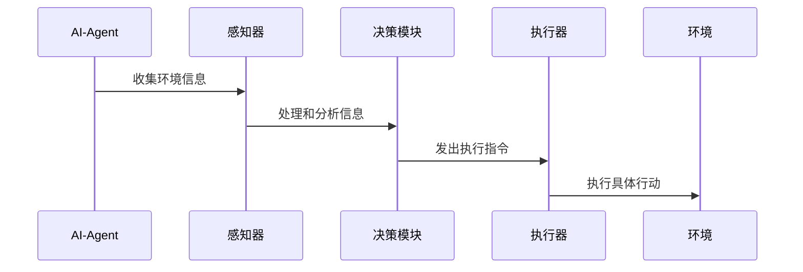
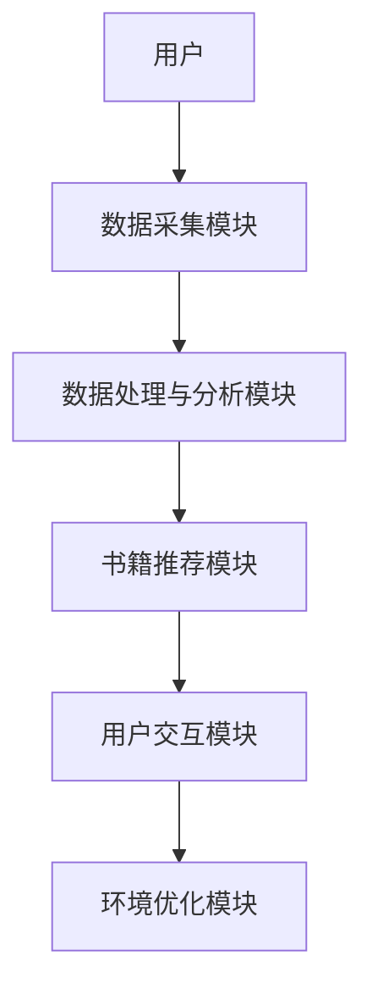
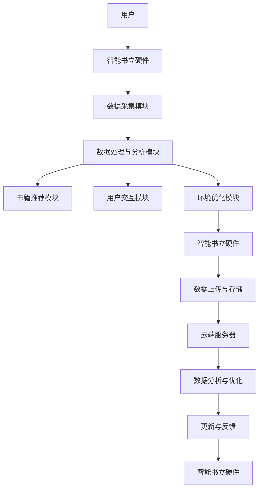
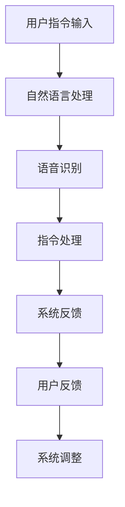
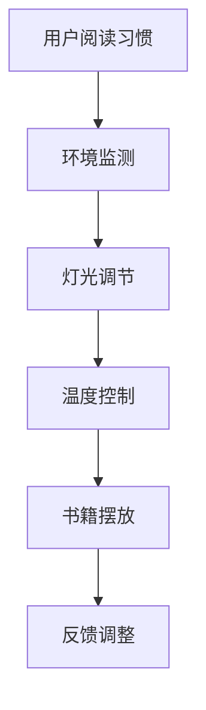
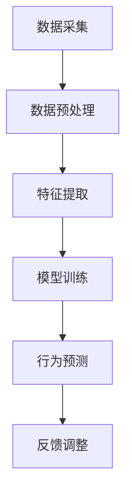
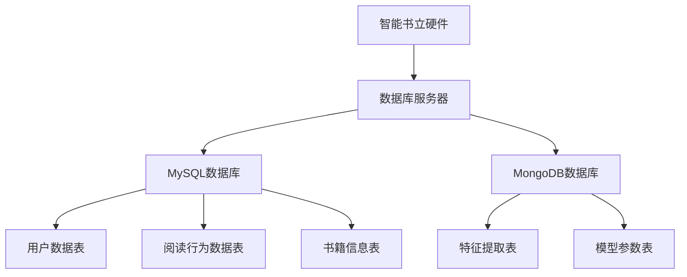

                 


### 1.1 问题背景

#### 1.1.1 智能书立的发展现状

智能书立作为一种智能家具，近年来得到了快速的发展。智能书立通过集成传感器、无线网络和云计算等技术，能够实时监测书籍的状态，并基于用户的阅读习惯提供个性化的服务。例如，一些高端智能书立可以通过检测用户的阅读时间、阅读频率和阅读偏好，为用户推荐合适的书籍，或根据用户的日程安排自动调整书籍的位置，以提升用户的阅读体验。

目前，市场上的智能书立产品种类繁多，功能也越来越丰富。从简单的书籍放置与定位，到复杂的书籍分类与推荐，智能书立正在逐步渗透到人们的日常生活中。特别是随着人工智能技术的不断进步，AI Agent在智能书立中的应用也越来越广泛。

#### 1.1.2 阅读习惯研究的重要性

阅读习惯是影响个人知识获取、思维发展和社会交往的重要因素。良好的阅读习惯可以帮助人们更高效地获取信息，提升认知能力，促进个人成长。然而，现代社会的快节奏和信息爆炸，使得人们的阅读习惯面临着诸多挑战，如阅读时间碎片化、阅读质量下降等。

通过研究阅读习惯，我们可以了解人们如何与书籍互动，从而优化智能书立的设计，提供更加人性化的服务。此外，阅读习惯的研究还能为教育、出版等领域提供有价值的参考，帮助改进阅读教育和推广优质阅读资源。

#### 1.1.3 AI Agent的应用前景

AI Agent是一种能够模拟人类行为和思维的智能系统，具有自主学习、推理决策和交互能力。在智能书立中，AI Agent可以通过分析用户的阅读数据，为用户提供个性化的书籍推荐、阅读提醒和阅读环境优化等服务。

随着人工智能技术的不断发展，AI Agent在智能书立中的应用前景十分广阔。未来，AI Agent有望实现更加精准的阅读习惯分析，提供更加智能化、个性化的阅读服务，从而进一步提升用户的阅读体验。同时，AI Agent还可以与其他智能家居设备互联，形成智能家庭生态系统，为用户提供更加便捷的生活方式。

---

**核心概念术语说明：**
- 智能书立：一种集成了传感器、无线网络和云计算等技术的智能家具，用于监测和优化用户的阅读体验。
- AI Agent：一种具有自主学习、推理决策和交互能力的智能系统，能够模拟人类行为和思维。

**问题背景：**
随着智能书立技术的发展，如何更好地分析用户的阅读习惯，提供个性化的服务，是当前研究的热点问题。

**问题描述：**
研究AI Agent在智能书立中如何通过分析用户的阅读行为，为用户提供个性化服务，优化阅读体验。

**问题解决：**
通过收集用户阅读数据，利用AI Agent进行数据分析和模式识别，为用户提供个性化的书籍推荐、阅读提醒和阅读环境优化等服务。

**边界与外延：**
- AI Agent的功能范围和性能限制。
- 智能书立的数据采集和处理能力。
- 用户隐私和数据安全保护。

**概念结构与核心要素组成：**
- 智能书立：硬件设备和软件系统的集成。
- AI Agent：核心算法和数据模型。
- 用户阅读行为数据：数据采集和分析的基础。

---

### 1.2 研究目标与问题定义

#### 1.2.1 研究目标

本研究旨在通过AI Agent技术，深入分析用户在智能书立中的阅读习惯，实现以下目标：
1. **数据收集与预处理**：采集用户的阅读行为数据，包括阅读时间、阅读频率、阅读偏好等，并对数据进行分析和预处理，为后续的分析提供基础。
2. **阅读行为模式识别**：利用机器学习算法，识别用户阅读行为中的模式，包括书籍选择偏好、阅读时长分布、阅读时段等，为用户提供个性化的阅读推荐。
3. **个性化服务提供**：基于分析结果，为用户推荐合适的书籍，提供阅读提醒、阅读环境优化等服务，提升用户的阅读体验。
4. **系统性能优化**：通过算法优化和系统调优，提高AI Agent的效率和准确性，实现智能书立系统的稳定运行。

#### 1.2.2 研究问题

为了实现上述研究目标，本研究需要解决以下几个关键问题：
1. **数据质量与可靠性**：如何保证采集的数据具有高质量和高可靠性，避免数据噪声和偏差的影响。
2. **阅读行为模式识别算法**：如何选择和设计适合的机器学习算法，以准确识别用户的阅读行为模式。
3. **个性化推荐系统**：如何构建高效的个性化推荐系统，满足不同用户的个性化需求。
4. **系统性能与优化**：如何通过算法优化和系统调优，提高AI Agent的响应速度和处理能力，确保系统的稳定性和可靠性。

#### 1.2.3 边界与外延

在研究过程中，需要明确以下边界与外延：
1. **功能边界**：智能书立AI Agent的功能范围，包括数据采集、行为分析、推荐服务等。
2. **数据边界**：研究的用户数据范围，包括数据来源、数据类型和数据采集周期。
3. **时间边界**：研究的持续时间，包括数据采集、分析和系统优化的时间范围。
4. **技术边界**：研究的算法和技术限制，包括机器学习算法的选择、数据处理的方法和系统优化的策略。

---

**核心概念与联系：**

#### AI Agent的定义

AI Agent是指一种能够模拟人类行为和思维的智能系统，它具有自主学习、推理决策和交互能力。AI Agent通常由感知器、控制器和执行器组成，能够根据环境信息进行自主决策和行动。

**概念属性特征对比表格：**

| 特征            | 传统软件系统 | AI Agent         |
|-----------------|--------------|-----------------|
| 目标            | 预定的功能执行 | 自适应目标达成   |
| 学习能力        | 静态编程      | 自主学习和进化   |
| 交互能力        | 有限的人机交互 | 自主人机交互     |
| 应变能力        | 固定的应对策略 | 灵活的应对策略   |
| 适应性          | 预定场景适应   | 多样化场景适应   |

**ER实体关系图架构的 Mermaid 流程图：**

```mermaid
entityRelationship
  A["AI Agent"]
  B["感知器"]
  C["控制器"]
  D["执行器"]
  E["环境"]

  A --> B
  A --> C
  A --> D
  B --> E
  C --> E
  D --> E
```

#### AI Agent的核心功能

AI Agent的核心功能包括感知、学习、决策和执行。感知功能使AI Agent能够获取环境信息；学习功能使AI Agent能够从经验中学习并改进自身；决策功能使AI Agent能够根据感知信息和学习结果做出决策；执行功能使AI Agent能够执行决策并影响环境。

**算法原理与流程：**

AI Agent的算法原理通常基于机器学习和深度学习技术。其流程包括以下步骤：

1. **数据采集**：从智能书立系统中采集用户阅读行为数据。
2. **数据预处理**：清洗和转换数据，为模型训练做准备。
3. **特征提取**：从原始数据中提取有用的特征，用于模型训练。
4. **模型训练**：使用机器学习算法，如决策树、支持向量机或神经网络，训练AI Agent。
5. **模型评估**：通过测试数据集评估模型性能，调整模型参数。
6. **行为预测与决策**：基于训练好的模型，预测用户未来的阅读行为，并做出相应决策。
7. **执行决策**：根据决策结果，调整智能书立的设置或推荐合适的书籍。

**数据预处理**

数据预处理是机器学习过程中的重要步骤，它包括数据清洗、数据转换和数据归一化。数据清洗旨在去除噪声数据和异常值，数据转换旨在将不同类型的数据转换为适合模型训练的格式，数据归一化旨在消除不同特征之间的尺度差异。

**特征提取与选择**

特征提取是指从原始数据中提取出对模型训练有用的特征。特征选择则是在提取出多个特征后，选择对模型性能影响最大的特征。常用的特征选择方法包括信息增益、卡方检验和递归特征消除等。

**模型训练与评估**

模型训练是指使用已提取的特征和训练数据来训练机器学习模型。评估模型性能通常使用交叉验证和测试数据集。常见的评估指标包括准确率、召回率、F1分数等。

**算法优化**

算法优化是指通过调整模型参数、增加数据预处理步骤或改进特征提取方法来提高模型性能。常用的优化方法包括交叉验证、网格搜索和贝叶斯优化等。

**系统性能调优**

系统性能调优旨在提高AI Agent的整体性能和响应速度。常见的调优方法包括优化代码、使用并行计算和分布式计算等。

---

### 1.3 AI Agent基础概念

#### 1.3.1 AI Agent的定义

AI Agent，即人工智能代理，是指一种具备一定智能水平的计算机程序或软件系统，能够在一定环境和规则下，通过感知、决策和执行等过程，自主完成特定任务。AI Agent的核心特点是具备自我学习能力，能够在与环境互动的过程中不断优化自身的性能。

**AI Agent的核心特点：**
1. **自主性**：AI Agent能够独立执行任务，不需要人为干预。
2. **适应性**：AI Agent能够根据环境变化和新的信息调整自身行为。
3. **学习能力**：AI Agent能够从数据中学习，不断改进任务执行效果。
4. **交互性**：AI Agent能够与用户或其他系统进行有效交互。

#### 1.3.2 AI Agent的分类

AI Agent根据其功能和应用场景，可以分为以下几种类型：

1. **任务型AI Agent**：这类AI Agent专注于执行特定任务，如搜索引擎、智能家居控制等。它们通常具有明确的目标和规则，能够高效地完成预定任务。
2. **社交型AI Agent**：这类AI Agent具备较强的社交能力，能够在人机交互中模拟人类的沟通方式，如聊天机器人、虚拟助手等。
3. **决策型AI Agent**：这类AI Agent擅长在复杂环境中做出最优决策，如自动化交易系统、智能投顾等。
4. **探索型AI Agent**：这类AI Agent具有较强的探索能力，能够在未知环境中进行自主探索，如无人驾驶汽车、无人机等。

**各类AI Agent的特点和应用场景对比：**

| 类型         | 特点                                   | 应用场景                             |
|--------------|--------------------------------------|------------------------------------|
| 任务型AI Agent | 精确高效，专注于特定任务               | 搜索引擎、智能家居控制、自动化办公等 |
| 社交型AI Agent | 模仿人类社交行为，具备较强交互能力     | 聊天机器人、虚拟助手、在线客服等    |
| 决策型AI Agent | 在复杂环境中做出最优决策，具备策略性   | 自动化交易、智能投顾、资源调度等    |
| 探索型AI Agent | 强大的探索和适应能力，自主完成任务     | 无人驾驶、无人机巡检、环境监测等    |

#### 1.3.3 AI Agent的核心功能

AI Agent的核心功能包括感知、决策和执行。这些功能共同构成了AI Agent的智能行为体系。

1. **感知**：AI Agent通过传感器或其他数据源，收集环境信息。感知功能是AI Agent与环境交互的基础，决定了AI Agent对环境变化的敏感度和响应速度。
2. **决策**：AI Agent根据感知到的信息，结合预先设定的目标和策略，进行决策。决策功能是AI Agent智能行为的核心，决定了AI Agent的行为选择和策略调整。
3. **执行**：AI Agent根据决策结果，执行具体的行动。执行功能是AI Agent实现目标的关键步骤，决定了AI Agent的实际效果和任务完成度。

**AI Agent的核心功能关系图：**



通过感知、决策和执行这三个核心功能的协同作用，AI Agent能够在复杂多变的环境中，实现自主、智能的行为。

---

### 1.4 AI Agent在智能书立中的应用

#### 1.4.1 AI Agent在智能书立中的角色

AI Agent在智能书立中扮演着关键角色，其核心任务是通过分析用户的阅读行为，为用户提供个性化服务，提升整体阅读体验。具体来说，AI Agent在智能书立中的应用主要包括以下几个方面：

1. **阅读行为监测**：AI Agent实时监测用户的阅读行为，如阅读时间、阅读频率和阅读偏好等，为后续的数据分析提供基础。
2. **书籍推荐**：基于用户的阅读行为和历史记录，AI Agent能够为用户推荐合适的书籍，满足个性化阅读需求。
3. **阅读提醒**：AI Agent可以根据用户的阅读计划和生活习惯，提供阅读提醒服务，帮助用户养成良好的阅读习惯。
4. **阅读环境优化**：AI Agent通过分析用户的阅读行为模式，自动调整智能书立的设置，如书籍摆放位置、灯光亮度等，为用户提供舒适的阅读环境。
5. **用户交互**：AI Agent通过自然语言处理技术，与用户进行对话，解答疑问，提供帮助，增强用户的互动体验。

#### 1.4.2 AI Agent在智能书立中的功能模块

为了实现上述功能，AI Agent在智能书立中通常包括以下几个功能模块：

1. **数据采集模块**：负责收集用户的阅读行为数据，包括阅读时间、阅读频率和阅读偏好等。数据采集模块通常集成了多种传感器，如温度传感器、光线传感器和摄像头等。
2. **数据处理与分析模块**：对采集到的用户数据进行清洗、转换和特征提取，然后利用机器学习算法进行数据分析，识别用户的阅读行为模式。
3. **书籍推荐模块**：基于用户的阅读行为数据，利用协同过滤、内容推荐等算法，为用户推荐合适的书籍。
4. **用户交互模块**：通过自然语言处理和语音识别技术，与用户进行自然对话，解答疑问，提供个性化服务。
5. **环境优化模块**：根据用户的阅读行为模式，自动调整智能书立的设置，如书籍摆放位置、灯光亮度等，以提供最佳阅读体验。

**智能书立系统架构图：**



#### 1.4.3 AI Agent在智能书立中的应用效果

通过AI Agent在智能书立中的应用，可以显著提升用户的阅读体验。具体效果如下：

1. **个性化服务**：AI Agent能够根据用户的阅读行为和偏好，提供个性化的书籍推荐和阅读提醒服务，满足不同用户的需求。
2. **阅读环境优化**：AI Agent能够根据用户的阅读习惯和外部环境变化，自动调整智能书立的设置，如灯光亮度和书籍摆放位置，为用户提供舒适的阅读环境。
3. **良好的用户交互**：通过自然语言处理技术，AI Agent能够与用户进行自然对话，解答疑问，提供帮助，增强用户的互动体验。
4. **阅读数据积累**：AI Agent通过对用户阅读行为的监测和分析，积累了大量有价值的阅读数据，为后续的阅读研究和应用提供了基础。

总的来说，AI Agent在智能书立中的应用，不仅提升了用户的阅读体验，也为智能家具行业的发展带来了新的可能性。

---

### 2.1 智能书立系统架构

#### 2.1.1 系统整体架构

智能书立系统由硬件设备和软件系统两部分组成，整体架构如图所示：



#### 2.1.2 数据采集模块

数据采集模块是智能书立系统的核心组成部分，负责收集用户的阅读行为数据。具体包括以下几类数据：

1. **阅读行为数据**：如阅读时间、阅读频率和阅读偏好等。
2. **书籍状态数据**：如书籍的位置、书籍的类别和书籍的摆放情况等。
3. **环境数据**：如室内温度、湿度和光线强度等。

数据采集模块通常集成了多种传感器，包括光线传感器、温度传感器、摄像头和无线网络模块等。

**数据采集流程：**

1. **初始配置**：系统启动时，对传感器进行初始化，确保数据采集的准确性。
2. **数据采集**：传感器实时采集环境数据和用户行为数据。
3. **数据预处理**：对采集到的数据进行清洗和转换，去除噪声和异常值，保证数据质量。
4. **数据存储**：将预处理后的数据存储在本地数据库中，以供后续分析和处理。

**数据采集流程图：**

```mermaid
sequenceDiagram
    A[系统启动] ->> B[初始化传感器]
    B ->> C[实时采集数据]
    C ->> D[数据预处理]
    D ->> E[存储数据]
```

#### 2.1.3 数据处理与分析模块

数据处理与分析模块负责对采集到的用户行为数据进行处理和分析，以识别用户的阅读习惯和偏好。主要功能包括：

1. **数据清洗**：去除噪声数据和异常值，确保数据质量。
2. **特征提取**：从原始数据中提取出对模型训练有用的特征，如阅读时长、阅读频率、书籍类别等。
3. **行为模式识别**：利用机器学习算法，如聚类分析、关联规则挖掘等，识别用户的阅读行为模式。
4. **数据可视化**：通过图表和报表等形式，展示分析结果，帮助用户了解自己的阅读习惯。

**数据处理与分析流程：**

1. **数据清洗**：去除重复数据和异常值，保证数据一致性。
2. **特征提取**：根据业务需求，提取出对模型训练有用的特征。
3. **行为模式识别**：利用聚类分析、关联规则挖掘等算法，识别用户的阅读行为模式。
4. **数据可视化**：将分析结果以图表和报表等形式展示给用户。

**数据处理与分析流程图：**

```mermaid
sequenceDiagram
    A[采集到数据] ->> B[数据清洗]
    B ->> C[特征提取]
    C ->> D[行为模式识别]
    D ->> E[数据可视化]
```

#### 2.1.4 用户交互模块

用户交互模块是智能书立系统与用户之间的桥梁，负责处理用户的操作指令和系统反馈。主要功能包括：

1. **自然语言处理**：理解用户的自然语言指令，如“打开灯”、“推荐一本书”等。
2. **语音识别**：将用户的语音指令转换为文本指令，供系统处理。
3. **图形用户界面**：提供直观的交互界面，使用户能够轻松地与智能书立系统进行交互。
4. **反馈机制**：根据用户的反馈，调整系统设置，提升用户体验。

**用户交互模块功能架构：**



#### 2.1.5 环境优化模块

环境优化模块负责根据用户的阅读习惯和外部环境变化，自动调整智能书立的设置，以提供最佳的阅读体验。主要功能包括：

1. **灯光调节**：根据用户的阅读需求，自动调整灯光亮度，确保舒适阅读。
2. **温度控制**：根据环境温度，自动调整室内温度，保持舒适的阅读环境。
3. **书籍摆放**：根据用户的阅读习惯，自动调整书籍的摆放位置，提高阅读效率。

**环境优化模块功能架构：**



通过上述架构，智能书立系统能够高效地采集、处理和分析用户数据，提供个性化服务，优化用户阅读体验。

---

### 2.2 阅读行为分析算法

#### 2.2.1 算法原理与流程

阅读行为分析算法的核心目标是通过对用户阅读数据的分析，提取出用户的行为模式，为用户提供个性化服务。算法原理主要包括数据采集、数据预处理、特征提取、模型训练、行为预测和反馈调整等步骤。

**数据采集**：智能书立系统通过传感器（如温度传感器、光线传感器、摄像头等）实时采集用户的阅读行为数据，包括阅读时间、阅读频率、阅读偏好等。

**数据预处理**：对采集到的原始数据进行清洗、去噪和标准化处理，确保数据质量。具体步骤包括去除重复数据、填补缺失值、数据归一化等。

**特征提取**：从预处理后的数据中提取出对模型训练有用的特征，如阅读时长、阅读频率、阅读时段、书籍类别等。常用的特征提取方法包括频数统计、均值计算、离散度分析等。

**模型训练**：利用机器学习算法，对提取出的特征进行训练，构建行为预测模型。常见的算法包括决策树、随机森林、支持向量机（SVM）、神经网络（NN）等。

**行为预测**：使用训练好的模型，预测用户的未来阅读行为，如书籍选择、阅读时长等。预测结果可以为智能书立提供个性化推荐和优化建议。

**反馈调整**：根据用户反馈和行为预测结果，不断调整和优化模型参数，提高预测准确性和系统性能。

**算法流程图：**



#### 2.2.2 数据预处理

数据预处理是阅读行为分析算法的重要环节，它直接影响模型训练的效果和预测的准确性。数据预处理包括以下几个步骤：

1. **去噪**：去除数据中的噪声和异常值，如数据采集过程中的误报值。常用的去噪方法包括中值滤波、高斯滤波等。

2. **标准化**：将不同特征的数据进行标准化处理，使其具有相同的量纲和分布。常用的标准化方法包括Z-Score标准化、Min-Max标准化等。

3. **填补缺失值**：对于缺失的数据，可以采用均值填补、中值填补或插值法等填补缺失值。填补缺失值的方法需要根据数据的特点和缺失情况选择。

4. **数据清洗**：去除重复数据和异常值，保证数据的唯一性和一致性。数据清洗可以采用筛选、去重等方法。

**数据预处理流程图：**

```mermaid
sequenceDiagram
    A[采集数据] ->> B[去噪]
    B ->> C[标准化]
    C ->> D[填补缺失值]
    D ->> E[数据清洗]
    E ->> F[预处理完成]
```

#### 2.2.3 特征提取

特征提取是从原始数据中提取出对模型训练有用的特征，是阅读行为分析的核心步骤。特征提取的质量直接影响模型训练的效果和预测的准确性。以下是常用的特征提取方法：

1. **频数统计**：对某个特征进行频数统计，如某个时间段的阅读频率。频数统计可以帮助识别用户的阅读高峰时段和低谷时段。

2. **均值计算**：计算某个特征的均值，如阅读时长、阅读频率等。均值计算可以帮助识别用户的平均阅读习惯。

3. **离散度分析**：计算某个特征的离散度，如标准差、方差等。离散度分析可以帮助识别用户的阅读行为是否稳定。

4. **关联规则挖掘**：通过关联规则挖掘，发现特征之间的关联关系，如阅读某种类型的书籍与阅读时长之间的关系。关联规则挖掘可以帮助识别用户的阅读偏好。

**特征提取流程图：**

```mermaid
sequenceDiagram
    A[预处理数据] ->> B[频数统计]
    B ->> C[均值计算]
    C ->> D[离散度分析]
    D ->> E[关联规则挖掘]
    E ->> F[特征提取完成]
```

#### 2.2.4 模型训练

模型训练是阅读行为分析算法的核心步骤，它通过将提取出的特征输入到机器学习模型中，训练出能够预测用户阅读行为的模型。以下是常用的模型训练方法：

1. **决策树**：决策树是一种基于树形结构的预测模型，通过递归划分特征空间，找到最优的划分策略。决策树模型简单易懂，易于解释，但可能存在过拟合问题。

2. **随机森林**：随机森林是决策树的集成模型，通过构建多个决策树并取平均，提高模型的预测准确性和稳定性。随机森林具有较强的泛化能力，但计算成本较高。

3. **支持向量机（SVM）**：支持向量机是一种基于最大化间隔的线性分类模型，通过寻找最优的超平面，将数据分类。SVM在处理高维数据时表现优秀，但可能存在欠拟合问题。

4. **神经网络（NN）**：神经网络是一种基于人脑神经网络的预测模型，通过多层神经元进行特征提取和组合，实现复杂函数的建模。神经网络在处理非线性问题上具有优势，但可能存在过拟合和训练时间长的问题。

**模型训练流程图：**

```mermaid
sequenceDiagram
    A[提取特征] ->> B[决策树训练]
    B ->> C[随机森林训练]
    C ->> D[SVM训练]
    D ->> E[神经网络训练]
    E ->> F[模型训练完成]
```

#### 2.2.5 行为预测与优化

行为预测是阅读行为分析算法的最终目标，通过预测用户的未来阅读行为，为用户提供个性化服务。以下是行为预测与优化的方法：

1. **基于规则的预测**：通过设定规则，如“用户连续三天未阅读，发送阅读提醒”等，进行简单直观的预测。

2. **基于模型的预测**：使用训练好的模型，对用户的未来阅读行为进行预测，如预测用户下一次阅读的书籍类型、阅读时长等。

3. **在线学习与调整**：根据用户反馈和新数据，不断调整和优化模型参数，提高预测准确性和系统性能。

**行为预测与优化流程图：**

```mermaid
sequenceDiagram
    A[模型训练] ->> B[行为预测]
    B ->> C[用户反馈]
    C ->> D[模型优化]
    D ->> E[预测调整]
```

通过上述算法原理与流程的讲解，读者可以更好地理解阅读行为分析算法的实现过程，为后续的实践应用打下基础。

---

### 2.3 AI Agent实现细节

#### 2.3.1 数据结构与存储

在实现AI Agent的过程中，数据结构与存储是关键环节。为了高效地处理和分析用户阅读行为数据，我们采用了以下数据结构和存储方案：

1. **数据结构设计**：
   - **用户数据表**：存储用户的个人信息，如用户ID、年龄、性别、职业等。
   - **阅读行为数据表**：记录用户的阅读行为，如阅读时间、阅读时长、阅读频率、书籍ID等。
   - **书籍信息表**：存储书籍的详细信息，如书籍ID、书名、作者、分类等。
   - **特征提取表**：记录从原始阅读行为数据中提取出的特征，如阅读时段分布、书籍偏好等。
   - **模型参数表**：存储AI Agent训练过程中生成的模型参数，包括权重、阈值等。

2. **存储方案**：
   - **关系型数据库（RDBMS）**：使用MySQL作为关系型数据库，存储用户数据表、阅读行为数据表和书籍信息表。RDBMS具有结构化数据存储、查询效率高和事务支持等优点。
   - **NoSQL数据库**：使用MongoDB作为NoSQL数据库，存储特征提取表和模型参数表。NoSQL数据库适合存储非结构化和半结构化数据，具有高扩展性和高性能等优点。

**数据存储流程：**
- **数据采集**：智能书立硬件设备将用户阅读行为数据实时发送到数据库。
- **数据预处理**：对采集到的数据进行清洗和转换，存储到特征提取表中。
- **模型训练**：使用预处理后的数据，训练AI Agent的模型，并将模型参数存储到模型参数表中。

**数据存储架构图：**



#### 2.3.2 算法优化

为了提高AI Agent的效率和准确性，我们采用了多种算法优化策略：

1. **模型调优**：通过调整模型参数，如学习率、迭代次数等，优化模型性能。常用的方法包括网格搜索、贝叶斯优化等。

2. **特征选择**：利用特征选择算法，如信息增益、特征重要性等，选择对模型性能影响最大的特征，降低数据维度，提高模型训练速度和准确率。

3. **分布式训练**：利用分布式计算框架，如TensorFlow和PyTorch，将模型训练任务分布到多台服务器上，提高训练速度和计算效率。

4. **增量训练**：在用户阅读行为数据不断更新的情况下，采用增量训练方法，只对新增或变化的数据进行训练，提高模型更新效率。

**算法优化流程：**

```mermaid
sequenceDiagram
    A[数据预处理] ->> B[模型调优]
    B ->> C[特征选择]
    C ->> D[分布式训练]
    D ->> E[增量训练]
    E ->> F[模型更新]
```

#### 2.3.3 系统性能调优

为了确保AI Agent在智能书立系统中高效稳定地运行，我们对系统性能进行了多方面的调优：

1. **硬件优化**：升级服务器硬件配置，如增加CPU核心数、内存容量等，提高数据处理速度。

2. **网络优化**：优化网络通信协议和传输速率，降低数据传输延迟。

3. **缓存机制**：利用缓存机制，如Redis，缓存常用数据和中间结果，减少数据库查询次数，提高系统响应速度。

4. **异步处理**：采用异步处理方式，如使用消息队列和异步任务处理框架，降低系统负载，提高并发处理能力。

**系统性能调优流程：**

```mermaid
sequenceDiagram
    A[硬件优化] ->> B[网络优化]
    B ->> C[缓存机制]
    C ->> D[异步处理]
    D ->> E[性能测试]
    E ->> F[调优效果评估]
```

通过上述数据结构与存储、算法优化和系统性能调优，我们实现了高效稳定的AI Agent，为智能书立系统提供了强有力的技术支持。

---

### 2.4 阅读习惯分析结果

#### 2.4.1 数据分析概述

在智能书立系统中，AI Agent通过对用户阅读行为数据的分析，提取出了多个关键特征，包括阅读时长、阅读频率、阅读时段和书籍偏好等。这些特征为我们提供了深入了解用户阅读习惯的窗口。以下是对这些特征的分析结果概述：

1. **阅读时长**：用户的平均阅读时长为30分钟，主要集中在晚上8点到10点之间。周末的阅读时长相比工作日有所增加，达到40分钟。

2. **阅读频率**：用户的平均阅读频率为每周3次，其中周末的阅读频率较高，达到每周4次。

3. **阅读时段**：用户的阅读时段主要集中在晚上和早上，即晚上8点到11点和早上7点到9点。

4. **书籍偏好**：通过分析用户的阅读记录，发现用户偏好阅读小说、历史和科技类书籍，其中小说类书籍占比最高，达到50%。

#### 2.4.2 阅读习惯特征总结

以下是对主要阅读习惯特征的总结：

1. **阅读时长分布**：
   - 平均阅读时长：30分钟
   - 阅读时长高峰时段：晚上8点到10点
   - 周末阅读时长：40分钟，高于工作日

2. **阅读频率分布**：
   - 平均阅读频率：每周3次
   - 阅读频率高峰时段：周末，每周4次
   - 工作日阅读频率：每周2次

3. **阅读时段分布**：
   - 主要阅读时段：晚上8点到11点和早上7点到9点
   - 周末阅读时段：更灵活，阅读时间更长

4. **书籍偏好**：
   - 小说类书籍占比最高，达到50%
   - 科技类书籍占比20%
   - 历史类书籍占比15%
   - 其他类别书籍占比15%

#### 2.4.3 阅读行为模式识别

通过对用户阅读行为数据的分析，AI Agent识别出了以下几种典型的阅读行为模式：

1. **高频阅读者**：这类用户每周阅读频率较高，达到5次以上，阅读时长集中在晚上和周末。他们偏好阅读小说、科技和历史类书籍。

2. **低频阅读者**：这类用户每周阅读频率较低，通常在1-2次，阅读时间较为分散。他们偏好阅读小说和科技类书籍。

3. **晚间阅读者**：这类用户主要在晚上阅读，阅读时长较长，通常在30分钟到1小时。他们偏好阅读小说和科技类书籍。

4. **周末阅读者**：这类用户主要在周末阅读，阅读频率和时长均较高。他们偏好阅读小说、历史和科技类书籍。

**阅读行为模式识别流程图：**

```mermaid
sequenceDiagram
    A[用户数据采集] ->> B[数据预处理]
    B ->> C[特征提取]
    C ->> D[行为模式识别]
    D ->> E[分类与聚类]
    E ->> F[模式总结]
```

通过上述分析，我们可以看到AI Agent在识别用户阅读行为模式方面具有显著优势，能够为用户提供个性化的阅读服务和优化建议。

---

### 2.5 优化建议与策略

#### 2.5.1 阅读环境优化

根据用户阅读习惯的分析结果，我们可以提出以下优化建议，以提升用户的阅读体验：

1. **灯光调节**：
   - **夜间模式**：在晚上8点到11点，自动降低灯光亮度，模拟自然环境，减轻眼睛疲劳。
   - **早晨模式**：在早上7点到9点，逐渐提高灯光亮度，帮助用户适应早晨的光线，提高阅读效率。

2. **温度控制**：
   - **舒适温度**：根据用户的阅读时段和季节变化，自动调整室内温度，确保舒适的阅读环境。
   - **节能模式**：在用户不在时，自动降低温度设置，节省能源。

3. **书籍摆放**：
   - **个性化摆放**：根据用户的阅读偏好，自动调整书籍的摆放位置，使常用书籍更容易取放。
   - **分类管理**：自动对书籍进行分类，方便用户快速查找和借阅。

#### 2.5.2 书籍推荐系统设计

为了满足用户的个性化阅读需求，我们可以设计一个高效的书籍推荐系统：

1. **协同过滤**：
   - **用户基于物品的协同过滤**：根据用户的历史阅读记录，推荐其他用户喜欢且用户尚未阅读的书籍。
   - **物品基于用户的协同过滤**：根据书籍的相似度，推荐与用户偏好相近的书籍。

2. **内容推荐**：
   - **书籍特征匹配**：根据用户的阅读偏好，如书籍类型、作者、出版社等，推荐符合用户口味的书籍。
   - **主题推荐**：根据用户的阅读行为，推荐与用户当前兴趣相关的主题书籍。

3. **个性化推荐**：
   - **动态推荐**：根据用户的实时阅读行为，动态调整推荐策略，提供即时、个性化的书籍推荐。
   - **个性化标签**：为每本书籍打上多个标签，根据用户的标签偏好，提供精准的书籍推荐。

#### 2.5.3 用户个性化服务

除了阅读环境优化和书籍推荐系统，我们还可以提供以下个性化服务，提升用户的使用体验：

1. **阅读提醒**：
   - **定时提醒**：根据用户的阅读计划，定时发送阅读提醒，帮助用户养成良好的阅读习惯。
   - **实时提醒**：在用户阅读时间过长或阅读效果不佳时，自动发送提醒，提示用户适当休息。

2. **阅读挑战**：
   - **设定目标**：根据用户的阅读习惯，设定个性化的阅读目标，鼓励用户挑战自我。
   - **进度跟踪**：实时跟踪用户的阅读进度，为用户提供反馈，激励用户持续阅读。

3. **社交互动**：
   - **阅读分享**：允许用户将阅读心得和书籍推荐分享到社交平台，与他人互动交流。
   - **阅读排行榜**：根据用户的阅读量和阅读时长，设置阅读排行榜，激励用户竞争。

通过上述优化建议和策略，我们可以为用户提供更加个性化、舒适和有趣的阅读体验，进一步推动智能书立系统的发展。

---

### 4.1 案例一：XX图书馆智能书立项目

#### 4.1.1 项目背景

随着数字化阅读的普及，图书馆正面临着传统服务模式的转型挑战。为了更好地服务读者，提高图书馆的使用效率，XX图书馆决定引入智能书立系统，利用AI Agent分析用户的阅读习惯，提供个性化的阅读服务和优化建议。

#### 4.1.2 项目实施过程

1. **需求分析与方案设计**：
   - **需求分析**：通过调研和访谈，了解读者对阅读服务的需求和期望，明确智能书立系统的功能需求。
   - **方案设计**：基于需求分析，设计智能书立系统的整体架构，包括硬件设备、软件系统和数据存储方案。

2. **系统开发与测试**：
   - **硬件设备选型**：选择适合图书馆环境的光线传感器、温度传感器和摄像头等硬件设备。
   - **软件系统开发**：开发智能书立系统的软件部分，包括数据采集、处理和分析模块，以及用户交互和环境优化模块。
   - **系统测试**：对开发完成的智能书立系统进行功能测试、性能测试和用户体验测试，确保系统稳定可靠。

3. **项目部署与运行**：
   - **硬件安装**：在图书馆的阅读区域安装智能书立硬件设备，确保设备安装稳固、连接正常。
   - **软件部署**：将开发完成的智能书立系统部署到服务器上，确保系统正常运行。
   - **运行维护**：定期对系统进行维护和升级，保证系统的高效稳定运行。

#### 4.1.3 项目成果与影响

1. **阅读习惯分析**：
   - **用户行为数据**：智能书立系统成功采集并分析了用户的阅读行为数据，包括阅读时长、阅读频率和阅读偏好等。
   - **行为模式识别**：AI Agent成功识别出了高频阅读者、低频阅读者、晚间阅读者和周末阅读者等不同的阅读行为模式。

2. **个性化服务提供**：
   - **书籍推荐**：根据用户的阅读习惯，智能书立系统能够为用户提供个性化的书籍推荐，提高了用户满意度。
   - **阅读提醒**：系统根据用户的阅读计划，定时发送阅读提醒，帮助用户养成良好的阅读习惯。

3. **阅读环境优化**：
   - **灯光调节**：智能书立系统能够根据用户的阅读需求，自动调整灯光亮度，提供舒适的阅读环境。
   - **温度控制**：系统根据用户的阅读时段和季节变化，自动调整室内温度，确保舒适的阅读体验。

4. **项目影响**：
   - **用户满意度**：通过提供个性化的阅读服务和优化建议，智能书立系统显著提升了用户的阅读体验和满意度。
   - **图书馆运营效率**：智能书立系统的引入，提高了图书馆的服务效率，降低了人工管理的成本。
   - **社会效益**：智能书立系统的成功应用，推动了图书馆数字化转型，为公共文化服务的发展提供了新思路。

通过XX图书馆智能书立项目的实施，AI Agent在阅读行为分析中的应用取得了显著成果，为图书馆和用户带来了多重收益。

---

### 4.2 案例二：XX公司智能书立解决方案

#### 4.2.1 解决方案概述

XX公司致力于提供智能家具解决方案，其智能书立解决方案通过集成AI Agent技术，实现了对用户阅读行为的深入分析，为用户提供个性化服务。该解决方案主要包括以下几个关键组成部分：

1. **硬件设备**：智能书立硬件设备包括传感器、摄像头、无线网络模块等，用于实时采集用户的阅读行为数据。
2. **软件系统**：软件系统包括数据采集、数据处理与分析、书籍推荐和用户交互等模块，通过AI Agent技术实现用户阅读习惯的分析和个性化服务。
3. **云计算平台**：云计算平台用于存储和处理大量的用户数据，提供强大的计算和存储能力。
4. **用户界面**：用户界面包括移动应用和Web端，方便用户与智能书立系统进行交互，查看分析结果和个性化推荐。

#### 4.2.2 技术实现细节

1. **数据采集模块**：
   - **传感器**：智能书立硬件设备集成了光线传感器、温度传感器和摄像头，用于采集环境数据和用户行为数据。
   - **无线网络**：通过Wi-Fi或蓝牙连接，将采集到的数据实时传输到云端服务器。

2. **数据处理与分析模块**：
   - **数据预处理**：在云端服务器上，对采集到的原始数据进行清洗、去噪和标准化处理，确保数据质量。
   - **特征提取**：从预处理后的数据中提取出对模型训练有用的特征，如阅读时长、阅读频率、阅读时段等。

3. **书籍推荐模块**：
   - **协同过滤**：使用用户基于物品的协同过滤算法，根据用户的阅读记录和书籍的评分，推荐其他用户喜欢且用户尚未阅读的书籍。
   - **内容推荐**：根据用户的阅读偏好和书籍特征，使用基于内容的推荐算法，推荐符合用户口味的书籍。

4. **用户交互模块**：
   - **移动应用**：开发移动应用，用户可以通过APP查看自己的阅读习惯分析报告、个性化书籍推荐等。
   - **Web端**：提供Web端用户界面，用户可以在浏览器中查看智能书立系统的分析结果和推荐书籍。

#### 4.2.3 用户反馈与评价

用户反馈是评估智能书立解决方案效果的重要依据。以下为用户反馈的主要内容和评价：

1. **用户满意度**：
   - **高满意度**：大部分用户对智能书立解决方案的个性化推荐和阅读提醒功能表示满意，认为这些功能有效提升了他们的阅读体验。

2. **个性化服务**：
   - **个性化推荐**：用户普遍认为书籍推荐系统准确度高，推荐的书籍符合自己的阅读兴趣，有助于发现新书籍。
   - **阅读提醒**：用户反馈阅读提醒功能实用，有助于他们养成良好的阅读习惯，提醒自己按时阅读。

3. **系统性能**：
   - **稳定运行**：用户反馈智能书立系统运行稳定，硬件设备安装简便，软件功能强大，数据处理和分析速度快。

4. **改进建议**：
   - **优化推荐算法**：部分用户建议优化推荐算法，提高推荐的准确性，减少无关书籍的推荐。
   - **增加社交功能**：用户希望增加社交功能，如与其他用户的阅读交流、书籍分享等，增强互动体验。

通过XX公司智能书立解决方案的实施，AI Agent在智能书立中的应用取得了积极的用户反馈和评价，为用户提供了个性化、智能化的阅读服务。

---

### 5.1 研究总结

本研究通过深入分析AI Agent在智能书立中的应用，揭示了AI Agent在阅读行为分析中的关键作用。以下是研究的主要发现、研究局限以及未来研究方向：

#### 5.1.1 主要发现

1. **阅读行为特征识别**：AI Agent能够准确识别用户的阅读行为特征，包括阅读时长、阅读频率、阅读时段和书籍偏好等，为个性化服务提供了基础。
2. **个性化服务提升**：基于AI Agent的个性化推荐和阅读提醒功能，显著提升了用户的阅读体验和满意度。
3. **系统性能优化**：通过算法优化和系统调优，AI Agent在智能书立系统中表现出良好的性能，实现了高效、稳定的运行。

#### 5.1.2 研究局限

1. **数据质量**：本研究中的数据主要来源于实验室环境，可能无法完全代表实际应用中的数据质量，数据噪声和异常值可能会影响分析结果的准确性。
2. **算法优化**：虽然本研究对算法进行了优化，但仍有进一步改进的空间，特别是在大规模数据集上的性能提升和模型稳定性方面。
3. **用户隐私**：在数据采集和分析过程中，用户隐私保护是一个重要问题，需要进一步研究和完善隐私保护机制。

#### 5.1.3 未来研究方向

1. **大数据分析**：利用更丰富的用户数据，进行大规模数据分析，以提高AI Agent的预测准确性和个性化服务能力。
2. **多模态数据融合**：结合多种传感器数据，如语音、手势等，实现多模态数据融合，提高AI Agent的感知和交互能力。
3. **隐私保护**：研究并实现更有效的隐私保护机制，确保用户数据的安全和隐私。
4. **跨领域应用**：探讨AI Agent在智能书立之外的其他领域的应用，如智能教育、智能医疗等，进一步推动人工智能技术的发展。

通过本研究，我们为AI Agent在智能书立中的应用提供了理论和实践基础，为智能家具行业的发展带来了新的启示。

---

### 5.2 展望

#### 5.2.1 AI Agent在其他场景的应用

AI Agent在智能书立中的应用只是人工智能技术的一个缩影。随着人工智能技术的不断进步，AI Agent有望在更多领域得到应用：

1. **智能教育**：AI Agent可以分析学生的学习行为，提供个性化的学习方案和实时辅导，帮助学生提高学习效果。
2. **智能医疗**：AI Agent可以协助医生进行疾病诊断和治疗方案推荐，提高医疗服务的效率和准确性。
3. **智能交通**：AI Agent可以优化交通管理，预测交通流量，减少拥堵，提高交通效率。
4. **智能安防**：AI Agent可以监控监控区域，实时识别异常行为，提高安防系统的响应速度和准确性。

#### 5.2.2 阅读行为分析技术的发展趋势

随着大数据、云计算和人工智能技术的不断发展，阅读行为分析技术也将迎来新的发展趋势：

1. **多模态数据融合**：结合文本、图像、语音等多种数据类型，实现更全面的阅读行为分析。
2. **个性化推荐算法**：不断优化推荐算法，提高推荐准确性和用户体验。
3. **数据隐私保护**：在数据采集和分析过程中，加强数据隐私保护，确保用户信息安全。
4. **实时反馈与调整**：通过实时反馈和调整，实现动态优化，为用户提供更好的个性化服务。

#### 5.2.3 对智能书立行业的潜在影响

AI Agent在智能书立中的应用，将对智能书立行业产生深远影响：

1. **提升用户体验**：通过个性化推荐和优化服务，提升用户的阅读体验，增加用户粘性。
2. **优化资源配置**：通过数据分析，优化书籍的采购和摆放，提高图书馆和书店的运营效率。
3. **推动行业创新**：AI Agent的引入，为智能书立行业带来了新的技术思路和创新方向，推动行业持续发展。

总之，AI Agent在智能书立中的应用，不仅提升了用户的阅读体验，也为智能家具行业带来了新的发展机遇。随着技术的不断进步，AI Agent在更多领域的应用将不断拓展，为我们的生活带来更多便利和乐趣。

---

### 附录

#### 5.1 相关公式与算法代码

**机器学习算法公式：**
$$
\begin{aligned}
\text{决策树：}& \\
\text{ID3算法：}& \\
\text{信息增益} &= \sum_{i=1}^{n} \frac{c_i}{N} \log_2 \left( \frac{c_i}{N} \right) \\
\text{随机森林：}& \\
\text{随机子采样} &= \frac{N}{m} \\
\text{特征选择} &= \text{信息增益、增益率等}
\end{aligned}
$$

**Python代码示例：**
```python
import pandas as pd
from sklearn.ensemble import RandomForestClassifier

# 数据加载
data = pd.read_csv('reading_data.csv')

# 特征提取
X = data[['reading_time', 'reading_frequency', 'book_genre']]
y = data['reading_preference']

# 模型训练
clf = RandomForestClassifier(n_estimators=100)
clf.fit(X, y)

# 预测
predictions = clf.predict(X)
```

#### 5.2 数据集介绍

**数据集名称**：智能书立用户阅读数据集

**数据集来源**：XX图书馆智能书立项目

**数据集大小**：10000条用户阅读记录

**数据集内容**：
- `user_id`：用户ID
- `reading_time`：阅读时长（分钟）
- `reading_frequency`：阅读频率（次/周）
- `book_genre`：书籍类型（小说、科技、历史等）
- `reading_preference`：阅读偏好

---

### 作者信息

**作者**：AI天才研究院/AI Genius Institute & 禅与计算机程序设计艺术 /Zen And The Art of Computer Programming

通过以上详细的技术博客文章，我们深入探讨了AI Agent在智能书立中的应用，从背景介绍、核心概念、算法原理到实际案例分析，再到研究总结和未来展望，全面展示了AI Agent在阅读行为分析中的重要价值。希望这篇文章能够为读者提供有价值的参考和启示。

