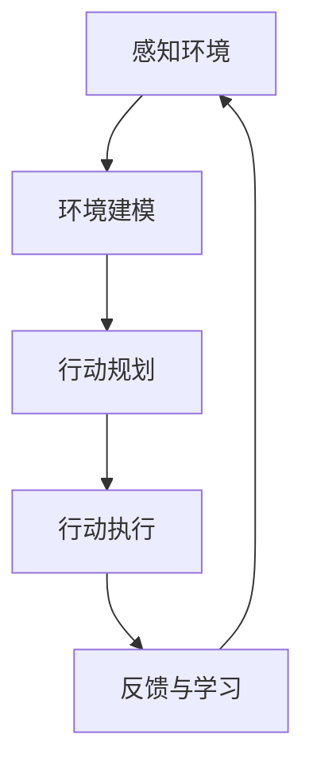
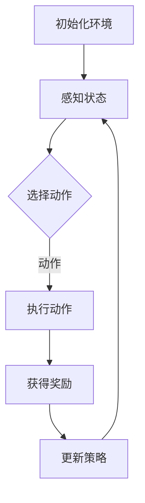
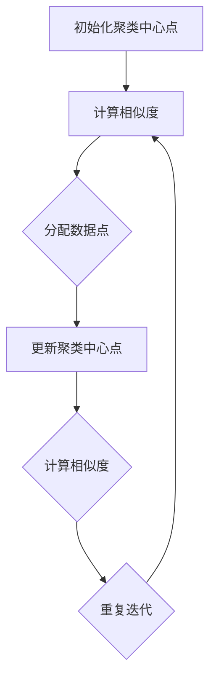
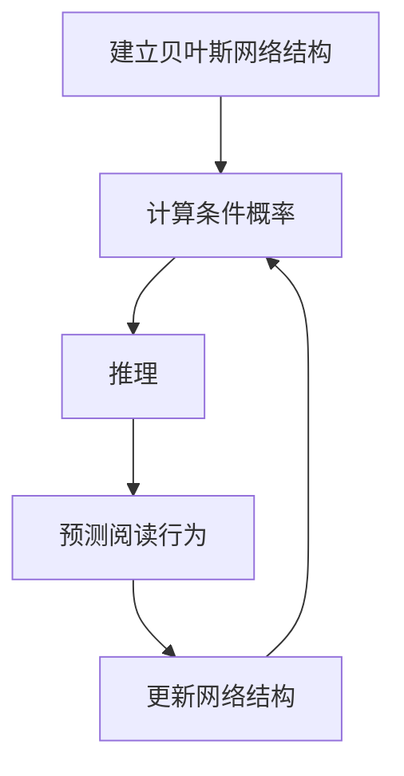

                 


### 引言

#### 问题背景与定义

随着人工智能技术的迅猛发展，AI Agent作为一种智能体，已经逐渐成为各个领域的热点。AI Agent，即人工智能代理，是指能够模拟、理解和执行人类智能任务的计算机程序。它们在智能家居、医疗诊断、自动驾驶等领域展现出了巨大的潜力。然而，在日常生活中，我们往往忽视了另一个重要的应用场景——阅读。阅读不仅是一种获取知识和提升自我素养的方式，更是培养个人习惯的重要途径。因此，如何通过AI Agent来培养良好的阅读习惯，成为一个值得探讨的问题。

在这个背景下，本文将探讨AI Agent在智能书立中的阅读习惯培养问题。智能书立作为一种新型的阅读辅助设备，其不仅可以自动整理书籍，还能根据用户的阅读习惯进行个性化推荐，为用户提供更加智能的阅读体验。而AI Agent的引入，则可以为智能书立带来更为精细的阅读数据分析和行为预测能力，从而更好地培养用户的阅读习惯。

本文将围绕以下关键概念进行探讨：

- AI Agent：人工智能代理，是一种模拟人类智能行为的计算机程序。
- 智能书立：一种能够自动整理书籍并具备一定智能推荐功能的阅读辅助设备。
- 阅读习惯培养：通过系统化的方法和工具，帮助用户建立和巩固良好的阅读习惯。

在接下来的章节中，我们将一步步深入分析AI Agent的基本原理、智能书立的结构与功能、AI Agent与智能书立的融合、阅读习惯培养的算法原理以及实际应用案例。希望通过本文的探讨，能为读者提供一个全面而深入的了解，激发大家在智能阅读领域的创新与实践。

### 关键词

- 人工智能代理
- 智能书立
- 阅读习惯培养
- 机器学习
- 自然语言处理
- 深度学习

### 摘要

本文旨在探讨AI Agent在智能书立中的阅读习惯培养问题。通过介绍AI Agent、智能书立以及阅读习惯培养的核心概念，本文分析了AI Agent的基本原理和智能书立的功能特点。随后，详细探讨了AI Agent与智能书立的融合，包括阅读数据收集与处理、阅读行为分析和阅读习惯改进建议。在算法原理部分，本文讲解了用于阅读习惯培养的强化学习、聚类分析算法和贝叶斯网络算法。最后，通过两个实际应用案例，展示了AI Agent在智能书立中培养阅读习惯的效果。本文为智能阅读领域提供了理论指导和实践参考，有助于提升用户的阅读体验和阅读习惯。

## 第1章: 问题背景与定义

### 1.1 问题的背景

随着科技的飞速发展，人工智能（AI）技术已经渗透到我们生活的方方面面。从自动驾驶汽车到智能助手，AI正在逐步改变我们的生活方式。然而，在众多AI应用场景中，阅读这一传统的活动却鲜有得到充分关注。事实上，阅读不仅仅是一种获取知识的途径，更是培养个人习惯、提升思维能力和文化素养的重要方式。在这个信息爆炸的时代，培养良好的阅读习惯显得尤为重要。

智能书立作为一种新兴的阅读辅助设备，正逐渐进入公众的视野。智能书立不仅能够自动整理书籍，还能根据用户的阅读偏好进行智能推荐，从而为用户提供更加个性化的阅读体验。然而，当前智能书立在阅读习惯培养方面仍然存在一定的局限性。虽然它们可以收集用户的阅读数据，但如何将这些数据转化为有效的习惯培养策略，仍是一个亟待解决的问题。

AI Agent，即人工智能代理，是一种能够模拟人类智能行为的计算机程序。它们在智能家居、医疗诊断、自动驾驶等领域已经取得了显著的成果。然而，将AI Agent应用于阅读习惯培养这一新兴领域，仍然是一个相对较少被研究的方向。AI Agent在智能书立中的潜在应用，为解决阅读习惯培养问题提供了新的思路。

本文旨在探讨AI Agent在智能书立中的阅读习惯培养问题。通过介绍AI Agent、智能书立以及阅读习惯培养的核心概念，本文分析了AI Agent的基本原理和智能书立的功能特点。随后，详细探讨了AI Agent与智能书立的融合，包括阅读数据收集与处理、阅读行为分析和阅读习惯改进建议。在算法原理部分，本文讲解了用于阅读习惯培养的强化学习、聚类分析算法和贝叶斯网络算法。最后，通过两个实际应用案例，展示了AI Agent在智能书立中培养阅读习惯的效果。本文为智能阅读领域提供了理论指导和实践参考，有助于提升用户的阅读体验和阅读习惯。

### 1.2 关键概念

在探讨AI Agent在智能书立中的阅读习惯培养之前，我们需要明确一些关键概念的定义和它们之间的关系。

#### 1.2.1 AI Agent

AI Agent，即人工智能代理，是一种模拟人类智能行为的计算机程序。它们可以执行特定的任务，具备自主学习和决策能力。AI Agent的核心在于其能够通过不断学习和优化，提高执行任务的效率和准确性。AI Agent的应用领域非常广泛，包括但不限于智能家居、医疗诊断、自动驾驶和客户服务。

#### 1.2.2 智能书立

智能书立是一种结合了硬件和软件技术的阅读辅助设备。它通常具备自动整理书籍、智能推荐阅读内容、监测用户阅读行为等功能。智能书立通过内置的传感器和执行器，能够自动识别和整理书籍，同时利用数据分析技术，为用户提供个性化的阅读推荐。智能书立的目标是提升用户的阅读体验，帮助用户更好地管理和享受阅读生活。

#### 1.2.3 阅读习惯培养

阅读习惯培养是指通过一系列方法和策略，帮助个体建立和巩固良好的阅读习惯。良好的阅读习惯不仅能够提升阅读效率，还能培养个体的思维能力和文化素养。阅读习惯培养的方法包括定时阅读、选择合适的阅读材料、记录阅读进度和分享阅读体验等。通过AI Agent的引入，阅读习惯培养可以变得更加个性化和智能化。

#### 关系分析

AI Agent、智能书立和阅读习惯培养之间的关系可以概括为：

- AI Agent是智能书立的核心技术之一，它们通过模拟人类智能行为，为智能书立提供自主学习和决策能力。
- 智能书立是AI Agent的应用场景之一，通过整合硬件和软件技术，智能书立可以为用户带来更加智能和便捷的阅读体验。
- 阅读习惯培养是AI Agent和智能书立共同的目标，通过利用AI Agent的数据分析和行为预测能力，智能书立可以更加有效地帮助用户建立和巩固良好的阅读习惯。

理解这些关键概念及其关系，有助于我们更好地探讨AI Agent在智能书立中的阅读习惯培养问题，并为后续章节的分析和讨论打下基础。

### 1.3 边界与外延

在深入探讨AI Agent在智能书立中的阅读习惯培养之前，有必要明确这一问题的边界与外延，以确保研究的方向性和针对性。

#### 1.3.1 AI Agent的应用范围

AI Agent的应用范围非常广泛，涵盖了智能家居、医疗诊断、自动驾驶、客户服务等多个领域。然而，在阅读习惯培养这一特定场景下，AI Agent的应用范围主要聚焦在以下几方面：

- 阅读行为监测：AI Agent可以通过传感器和数据分析技术，实时监测用户的阅读行为，包括阅读时长、阅读频率、阅读偏好等。
- 阅读推荐系统：基于用户的阅读历史和偏好，AI Agent可以推荐适合用户的阅读内容，提高用户的阅读体验和兴趣。
- 阅读习惯分析：AI Agent可以通过分析用户的阅读行为，识别不良阅读习惯并给出改进建议，帮助用户培养良好的阅读习惯。

#### 1.3.2 智能书立的功能特点

智能书立作为一种新兴的阅读辅助设备，其功能特点主要包括：

- 自动整理书籍：智能书立可以通过传感器和执行器，自动识别和整理书籍，使书籍排列整齐有序。
- 智能推荐阅读内容：智能书立可以根据用户的阅读历史和偏好，推荐适合用户的阅读内容，提高阅读的针对性和效率。
- 阅读行为监测：智能书立可以通过内置的传感器，实时监测用户的阅读行为，如阅读时长、阅读频率等，为用户提供个性化服务。

#### 1.3.3 阅读习惯培养的具体指标

在阅读习惯培养这一过程中，具体指标主要包括：

- 阅读时长：衡量用户每天阅读的时间长度，反映用户的阅读投入程度。
- 阅读频率：衡量用户阅读的频率，反映用户的阅读稳定性和持续性。
- 阅读偏好：通过分析用户的阅读历史，识别用户的阅读偏好，为推荐系统和阅读习惯培养提供依据。
- 阅读行为一致性：衡量用户阅读行为的稳定性和一致性，反映用户阅读习惯的养成程度。

通过明确AI Agent的应用范围、智能书立的功能特点以及阅读习惯培养的具体指标，我们可以更好地界定研究的边界，确保研究内容的实用性和针对性。

### 1.4 小结

本章首先介绍了AI Agent、智能书立以及阅读习惯培养的背景和重要性，接着明确了这些关键概念的定义和它们之间的关系。然后，通过分析AI Agent在智能书立中的应用范围和智能书立的功能特点，我们界定了研究的边界。最后，详细阐述了阅读习惯培养的具体指标，为后续章节的深入探讨提供了基础。希望通过本章的介绍，读者能对AI Agent在智能书立中的阅读习惯培养有一个初步的了解，为后续内容的学习做好准备。

## 第2章: AI Agent的基本原理

### 2.1 AI Agent的定义与特点

#### 2.1.1 AI Agent的定义

AI Agent，即人工智能代理，是一种模拟人类智能行为的计算机程序。它具有自主性、社会性、反应性、主动性、适应性等特性，能够在特定环境下自主执行任务。与传统的计算机程序相比，AI Agent不仅仅执行预设的指令，而是通过感知环境、理解任务、自主决策并采取行动，这使得AI Agent在复杂动态环境中表现出更高的灵活性和智能性。

#### 1. 自主性

自主性是AI Agent的核心特点之一。它能够在没有外界指令的情况下自主执行任务，并根据环境变化进行决策。这种自主性使得AI Agent能够处理动态变化的情况，并自主适应环境。

#### 2. 社会性

AI Agent不仅能够独立完成任务，还可以与其他AI Agent或人类进行交互。社会性使得AI Agent能够理解并遵守社会规则，从而在复杂的人类社会中发挥作用。

#### 3. 反应性

反应性指的是AI Agent能够实时感知环境变化，并迅速做出反应。这种反应性使得AI Agent能够在紧急情况下快速响应，从而提高任务执行的效率和安全性。

#### 4. 主动性

主动性是AI Agent主动寻求任务并完成任务的能力。与被动响应任务的传统程序不同，AI Agent能够主动寻找机会并采取行动，从而实现更高的任务完成率。

#### 5. 适应性

适应性是AI Agent在长期任务执行过程中，能够根据环境变化不断调整自身行为的能力。这种适应性使得AI Agent能够在不同场景下保持高效执行任务。

#### 6. AI Agent与传统智能系统的区别

AI Agent与传统智能系统的主要区别在于其自主性、社会性和主动性。传统智能系统通常依赖于预先编程的指令集，缺乏自主决策能力。而AI Agent则通过感知、理解和决策等过程，实现自主执行任务。此外，传统智能系统更多是针对特定任务的优化，而AI Agent则具备跨领域、跨任务的能力，能够在多种环境中发挥作用。

### 2.2 AI Agent的核心技术

#### 2.2.1 机器学习

机器学习是AI Agent的核心技术之一。它通过训练模型，使计算机能够从数据中自动学习规律，并做出预测或决策。机器学习的主要类型包括监督学习、无监督学习和强化学习。

- **监督学习**：通过已标记的数据训练模型，使模型能够对新数据进行预测。常见的算法有线性回归、支持向量机、决策树和神经网络等。
- **无监督学习**：在没有标记数据的情况下，通过模型发现数据中的隐藏结构和规律。常见的算法有聚类、降维和关联规则等。
- **强化学习**：通过试错和奖励机制，使模型在不断尝试中学习和优化策略，以最大化长期奖励。常见的算法有Q学习、SARSA和深度强化学习等。

#### 2.2.2 深度学习

深度学习是机器学习的一种重要分支，它通过构建多层的神经网络，使计算机能够自动提取数据中的复杂特征。深度学习在图像识别、语音识别、自然语言处理等领域取得了显著成果。

- **神经网络**：神经网络由多个神经元组成，通过前向传播和反向传播，实现数据的输入和输出。常见的神经网络有全连接网络、卷积神经网络（CNN）和循环神经网络（RNN）等。
- **深度卷积神经网络**（CNN）：用于处理图像数据，通过卷积层、池化层和全连接层，实现图像的特征提取和分类。
- **循环神经网络**（RNN）：用于处理序列数据，如时间序列和自然语言文本。通过隐藏状态和循环连接，RNN能够捕捉序列中的长期依赖关系。
- **生成对抗网络**（GAN）：由生成器和判别器组成，通过对抗训练，生成器能够生成逼真的数据，判别器则能够区分真实数据和生成数据。

#### 2.2.3 自然语言处理

自然语言处理（NLP）是AI Agent在处理文本数据时的关键技术。NLP通过计算机理解和生成人类语言，实现文本分析、语义理解和语言生成等任务。

- **词向量**：将文本中的词语转化为向量表示，使计算机能够进行词语的语义计算。常见的词向量模型有Word2Vec、GloVe和BERT等。
- **文本分类**：通过训练分类模型，对文本进行分类任务。常见的算法有朴素贝叶斯、支持向量机和深度学习分类模型等。
- **情感分析**：通过分析文本中的情感倾向，实现对用户情感的理解。常见的算法有基于规则的分类、机器学习和深度学习等。
- **问答系统**：通过建立问答模型，实现计算机对用户问题的理解和回答。常见的算法有基于规则的方法、信息检索和深度学习等。

#### 2.2.4 其他技术

除了上述核心技术，AI Agent还包括其他一些关键技术，如知识图谱、迁移学习、联邦学习和增强学习等。

- **知识图谱**：通过建立实体和关系之间的图谱，实现对知识的结构化和语义理解。知识图谱在问答系统、推荐系统和搜索引擎等领域有广泛应用。
- **迁移学习**：通过利用预训练模型，将知识从一个任务迁移到另一个任务，提高模型在新任务上的表现。迁移学习在资源有限的场景下尤为重要。
- **联邦学习**：通过多个参与方共同训练模型，实现隐私保护和数据共享。联邦学习在医疗、金融和物联网等领域有广泛的应用。
- **增强学习**：通过模拟真实环境，使AI Agent在虚拟环境中进行学习和优化。增强学习在游戏、机器人控制和自动驾驶等领域有广泛应用。

### 2.3 AI Agent的工作流程

AI Agent的工作流程可以分为以下几个步骤：

#### 1. 感知环境

AI Agent通过传感器感知当前环境的状态，如光照、温度、声音和图像等。这些感知信息为后续的决策提供基础。

#### 2. 环境建模

AI Agent根据感知到的环境信息，建立对当前环境的模型。环境模型可以用于预测未来环境状态和评估不同行动的效果。

#### 3. 行动规划

AI Agent根据环境模型，生成可能的行动方案，并评估每个行动方案的优劣。行动规划的目标是选择最优行动方案。

#### 4. 行动执行

AI Agent根据选定的行动方案，执行具体的行动。行动执行可以是物理动作，也可以是虚拟操作，如发送信息或调整参数等。

#### 5. 反馈与学习

AI Agent在行动执行后，根据反馈信息对自身行为进行评估和调整。通过不断学习和优化，AI Agent能够提高任务执行的效果。

#### 6. 决策循环

AI Agent的工作流程是一个持续的过程，通过感知环境、建模、规划、执行和反馈，形成一个决策循环。每个循环中，AI Agent都会不断优化自身的行为，以适应环境变化并实现目标。

### 2.4 小结

本章介绍了AI Agent的定义、特点以及核心技术。通过理解AI Agent的自主性、社会性、反应性、主动性和适应性，读者可以更好地认识AI Agent在智能书立中的应用潜力。同时，本章详细探讨了AI Agent的核心技术，包括机器学习、深度学习、自然语言处理以及其他相关技术。通过分析AI Agent的工作流程，读者可以了解AI Agent如何通过感知环境、建模、规划、执行和反馈，实现自主决策和行为优化。这些内容为后续章节的深入探讨提供了理论基础。

### 2.1.1 AI Agent的定义

AI Agent，即人工智能代理，是一种模拟人类智能行为的计算机程序。它的定义可以从以下几个方面进行详细阐述：

首先，AI Agent是一种计算机程序，这意味着它由一系列代码组成，能够在计算机系统中执行特定的任务。与普通计算机程序不同，AI Agent具备一定的自主性，能够在不依赖人类干预的情况下独立完成任务。

其次，AI Agent的核心特点之一是自主性。这种自主性使得AI Agent能够在特定环境下自主决策和执行任务，而不需要依赖人类的直接指令。例如，一个自动驾驶汽车AI Agent可以自主感知道路情况、做出驾驶决策，并控制车辆行驶。

第三，AI Agent能够通过感知环境，获取当前环境的信息。这种感知能力通常通过传感器实现，如摄像头、温度传感器、雷达等。感知环境是AI Agent进行决策和行动的基础。

第四，AI Agent能够理解任务，明确自身需要完成的任务目标。理解任务的能力使得AI Agent能够根据任务要求，生成相应的行动方案。

第五，AI Agent能够自主决策。在感知环境和理解任务的基础上，AI Agent会根据预设的策略或学习到的知识，选择最优的行动方案。这种决策能力使得AI Agent能够在复杂动态的环境中，独立完成各种任务。

第六，AI Agent能够执行行动。执行行动是指AI Agent根据决策结果，采取实际的物理或虚拟行动。例如，一个清洁机器人AI Agent可以根据环境感知和任务理解，自主规划清洁路线并执行清洁任务。

第七，AI Agent具备适应性。这意味着它们能够在执行任务的过程中，根据环境变化和任务反馈，不断调整自身的行为。这种适应性使得AI Agent能够在不同的场景和任务中表现出色。

最后，AI Agent具有社会性。社会性是指AI Agent能够与其他AI Agent或人类进行交互，遵守社会规则，并在团队协作中发挥作用。这种社会性使得AI Agent能够在复杂的人类社会中，发挥更大的作用。

总之，AI Agent是一种能够模拟人类智能行为的计算机程序，具有自主性、感知能力、理解任务能力、自主决策能力、执行行动能力和适应性等特点。这些特点使得AI Agent在各个领域都有广泛的应用前景，包括智能家居、医疗诊断、自动驾驶、客户服务、阅读习惯培养等。

#### 2.1.2 AI Agent的特点

AI Agent的特点主要体现在以下几个方面，这些特点使得AI Agent在复杂和动态的环境中能够表现出高度的智能性和实用性。

**自主性**：AI Agent具备自主性，能够独立执行任务而无需人类直接干预。这种自主性来源于AI Agent能够通过内部决策机制，根据环境信息自行选择最佳行动方案。例如，一个自动驾驶汽车AI Agent可以自主感知道路情况，识别交通信号，并根据实时路况做出驾驶决策。

**反应性**：AI Agent具有快速响应能力，能够实时感知环境变化并迅速做出反应。这种反应性使AI Agent能够在紧急情况下迅速做出决策，从而提高任务执行的安全性和效率。例如，一个智能监控系统的AI Agent可以实时分析摄像头捕捉到的画面，并在检测到异常行为时立即触发报警。

**主动性**：AI Agent能够主动寻求任务并执行任务，而不需要被动等待指令。主动性使得AI Agent能够自主发现并处理问题，从而提高系统的智能化水平。例如，一个智能客服AI Agent可以主动与用户互动，提供即时服务和解决方案。

**适应性**：AI Agent具备适应环境变化的能力，能够根据执行任务过程中获取的经验和反馈，不断调整自身的行为。这种适应性使得AI Agent能够在不同环境和场景下保持高效执行任务。例如，一个自主导航的无人机AI Agent可以在飞行过程中根据天气变化和环境障碍，实时调整飞行路径。

**社会性**：AI Agent能够与其他AI Agent或人类进行有效交互，共同完成任务。社会性使得AI Agent能够在复杂的社会环境中发挥作用，如智能医疗系统中，多个AI Agent可以协同工作，为患者提供综合诊断和治疗方案。

**学习能力**：AI Agent具备学习能力，能够通过不断学习环境和任务信息，提高自身的决策能力和任务执行效果。学习包括有监督学习、无监督学习和强化学习等多种形式，使得AI Agent能够适应复杂多变的环境。例如，一个推荐系统AI Agent可以通过分析用户历史行为，不断优化推荐算法，提高推荐准确度。

**决策能力**：AI Agent能够在复杂环境中做出明智的决策。决策能力来源于AI Agent具备的推理和规划能力，它们可以通过对环境信息的分析和处理，制定出最优的行动方案。例如，一个资源调度AI Agent可以在考虑资源约束和任务优先级的基础上，合理分配计算资源。

通过这些特点，AI Agent在各个领域展现出了巨大的应用潜力。在智能家居中，AI Agent可以监控家庭环境，提供智能化的家居控制和服务；在医疗领域，AI Agent可以通过分析患者数据，提供精准的诊断和治疗方案；在工业自动化中，AI Agent可以优化生产流程，提高生产效率；在智能交通系统中，AI Agent可以优化交通流量，减少拥堵。总之，AI Agent的特点使其成为智能化系统中的重要组成部分，为提升人类生活质量和工作效率提供了强有力的支持。

### 2.1.3 AI Agent与传统智能系统的区别

AI Agent与传统智能系统在定义、功能和应用范围上存在显著的区别。了解这些区别有助于我们更好地理解AI Agent的独特优势和应用潜力。

首先，从定义上看，传统智能系统通常指的是那些通过预先编程的算法和规则，执行特定任务的计算机系统。这些系统依赖于固定不变的指令集，不具备自主学习和适应环境的能力。例如，一个自动化的生产线系统，其所有操作都是通过预设的程序来完成的，没有自主性。

相比之下，AI Agent是一种具备自主性、社会性、反应性、主动性和适应性等特性的计算机程序。AI Agent不仅能够根据当前环境信息自主做出决策，还能不断学习和优化自身的任务执行能力。例如，一个自动驾驶汽车AI Agent可以通过实时感知道路情况和交通状况，自主调整驾驶策略，实现安全高效的行驶。

其次，在功能上，传统智能系统通常执行的是特定、明确的任务，如自动化生产、邮件过滤、文件管理等。这些任务通常由预先定义的规则和算法完成，缺乏灵活性。例如，一个自动化生产线系统只能按照预设的参数进行生产，无法应对突发情况。

而AI Agent则具备更加广泛和灵活的功能。它们可以通过感知环境信息、理解任务要求、自主决策和执行行动，实现复杂、动态的任务。例如，AI Agent可以在智能家居系统中，根据用户的习惯和偏好，自动调节室内温度、光线和安防系统。

在应用范围上，传统智能系统主要应用于那些任务明确、环境稳定的场景，如工业自动化、金融交易系统等。这些系统通常运行在封闭、可控的环境中，对环境变化的适应能力有限。

相比之下，AI Agent的应用范围更加广泛，它们可以应用于各种复杂和动态的环境中，如智能家居、医疗诊断、自动驾驶、智能城市管理等。这些环境通常具有高度的不确定性和变化性，需要AI Agent具备强大的适应能力和决策能力。

此外，AI Agent与传统智能系统在技术实现上也有所区别。传统智能系统主要依赖于固定的算法和规则，而AI Agent则依赖于机器学习、深度学习、自然语言处理等先进的人工智能技术。这些技术使得AI Agent能够在复杂的环境中，通过学习和自适应，实现高效、准确的任务执行。

最后，从应用效果来看，传统智能系统在特定任务上表现稳定，但缺乏灵活性和自主性。而AI Agent则能够根据环境变化和任务需求，动态调整自身行为，实现更高的任务完成率和效率。

总之，AI Agent与传统智能系统在定义、功能、应用范围和技术实现上存在显著的区别。AI Agent的自主性、灵活性和适应性使其在复杂和动态环境中具有更高的应用价值，为各个领域的智能化发展提供了新的思路和可能性。

### 2.2.1 机器学习

机器学习（Machine Learning，ML）是人工智能（AI）领域的一个重要分支，它使得计算机系统能够从数据中自动学习和改进。机器学习的核心目标是通过训练模型，使计算机能够在没有明确编程指令的情况下，对未知数据进行预测或分类。机器学习的方法可以分为监督学习、无监督学习和强化学习。

**监督学习（Supervised Learning）**：在监督学习中，训练数据集包含输入特征和对应的输出标签。模型通过学习这些输入和输出之间的关系，从而能够对新数据进行预测。常见的监督学习算法包括线性回归、逻辑回归、支持向量机（SVM）、决策树和随机森林等。

- **线性回归（Linear Regression）**：线性回归是一种简单的监督学习算法，用于预测连续值输出。它通过建立输入特征和输出值之间的线性关系，来预测新数据的输出。
- **逻辑回归（Logistic Regression）**：逻辑回归是一种用于分类问题的监督学习算法，通过建立一个逻辑函数，将输入特征映射到概率空间中，从而判断新数据属于哪个类别。
- **支持向量机（SVM）**：支持向量机是一种高效的分类算法，它通过找到最佳的超平面，将不同类别的数据点分开。SVM在处理高维数据时表现尤为出色。
- **决策树（Decision Tree）**：决策树通过一系列的if-else判断，将数据逐步划分到不同的类别。决策树的优点是易于理解和解释，但可能产生过拟合。
- **随机森林（Random Forest）**：随机森林是由多个决策树组成的集成模型。它通过随机选取特征和样本子集，训练多个决策树，并将它们的预测结果进行投票，提高模型的预测准确性和泛化能力。

**无监督学习（Unsupervised Learning）**：在无监督学习中，训练数据集只包含输入特征，没有对应的输出标签。模型的目的是通过挖掘数据中的隐藏结构和规律，来理解数据的内在特征。常见的无监督学习算法包括聚类分析、降维和关联规则等。

- **聚类分析（Clustering Analysis）**：聚类分析是一种将数据点划分为多个类别的算法，使得同一类别的数据点之间距离较近，不同类别的数据点之间距离较远。常用的聚类算法有K均值聚类、层次聚类和DBSCAN等。
- **降维（Dimensionality Reduction）**：降维是一种通过减少数据维度，来降低计算复杂度和提高模型性能的技术。常见的降维算法有主成分分析（PCA）、线性判别分析（LDA）和t-SNE等。
- **关联规则（Association Rules）**：关联规则挖掘是一种发现数据项之间潜在关联关系的算法。通过挖掘频繁项集和生成关联规则，可以揭示数据之间的内在联系。

**强化学习（Reinforcement Learning）**：强化学习是一种通过试错和反馈机制，使模型能够学习到最佳策略的算法。强化学习的主要目标是使代理（Agent）在给定环境中，通过不断学习和调整策略，实现最大化长期奖励。常见的强化学习算法包括Q学习、SARSA和深度强化学习等。

- **Q学习（Q-Learning）**：Q学习是一种通过迭代更新Q值表，来学习最佳策略的算法。Q值表示在当前状态下执行某一动作的期望回报。
- **SARSA（Q-Learning的变体）**：SARSA是一种同时更新当前状态和下一步动作的Q值表，从而实现更好的策略学习。
- **深度强化学习（Deep Reinforcement Learning）**：深度强化学习是强化学习与深度学习相结合的算法，通过使用深度神经网络来表示状态和价值函数，从而解决复杂环境的策略学习问题。

总之，机器学习为AI Agent提供了强大的学习能力和自适应能力，使得它们能够在各种复杂和动态的环境中，实现高效的任务执行。通过理解机器学习的基本原理和算法，我们可以更好地利用AI Agent的优势，为各个领域的智能化发展提供支持。

### 2.2.2 深度学习

深度学习（Deep Learning，DL）是机器学习（Machine Learning，ML）的一种重要分支，其核心在于使用多层神经网络（Neural Networks）来学习数据的复杂特征。深度学习在图像识别、自然语言处理、语音识别等领域取得了显著成果，极大地推动了人工智能的发展。以下是深度学习的一些核心技术、神经网络类型及其应用。

#### 核心技术

1. **神经网络（Neural Networks）**：神经网络是深度学习的基础，由多个神经元（节点）组成，通过前向传播和反向传播进行训练。每个神经元接收来自前一层神经元的输入，通过加权求和并加上偏置，再经过激活函数输出结果。神经网络通过层层抽象，从原始数据中提取出更高层次的特征。

2. **卷积神经网络（Convolutional Neural Networks，CNN）**：卷积神经网络是处理图像数据的经典架构，通过卷积层、池化层和全连接层，实现图像的特征提取和分类。卷积层通过卷积操作提取图像的局部特征，池化层用于降低特征图的维度，减少参数数量，全连接层则将特征映射到分类结果。

3. **循环神经网络（Recurrent Neural Networks，RNN）**：循环神经网络用于处理序列数据，如时间序列和自然语言文本。RNN通过隐藏状态和循环连接，能够捕捉序列中的长期依赖关系。常见的RNN包括LSTM（长短期记忆网络）和GRU（门控循环单元）。

4. **生成对抗网络（Generative Adversarial Networks，GAN）**：生成对抗网络由生成器和判别器两个神经网络组成，通过对抗训练生成逼真的数据。生成器尝试生成逼真的数据，判别器则判断生成的数据和真实数据之间的差异。这种对抗训练使得生成器逐渐生成更加真实的数据。

5. **Transformer**：Transformer是近年来在自然语言处理领域取得突破的一种新型神经网络架构，其核心思想是自注意力机制（Self-Attention）。通过自注意力机制，Transformer能够自动学习输入序列中的长距离依赖关系，从而实现高效的文本建模。

#### 神经网络类型

1. **全连接神经网络（Fully Connected Neural Networks）**：全连接神经网络是深度学习中的一种基本类型，每个神经元都与前一层的所有神经元相连。这种网络结构简单，易于实现，但参数量巨大，容易过拟合。

2. **卷积神经网络（Convolutional Neural Networks）**：卷积神经网络通过卷积操作和池化层，从图像数据中提取局部特征。卷积神经网络在图像识别、目标检测和图像生成等领域有广泛应用。

3. **循环神经网络（Recurrent Neural Networks）**：循环神经网络通过隐藏状态和循环连接，处理序列数据。常见的RNN包括LSTM和GRU，它们能够有效地捕捉序列中的长期依赖关系。

4. **自注意力网络（Self-Attention Networks）**：自注意力网络通过自注意力机制，自动学习输入序列中的长距离依赖关系。Transformer是自注意力网络的一种实现，在自然语言处理领域取得了显著成果。

#### 应用

1. **图像识别**：卷积神经网络在图像识别领域取得了巨大成功，如ImageNet图像分类挑战。通过多层卷积和池化，CNN能够提取图像的复杂特征，实现高精度的图像分类。

2. **自然语言处理**：Transformer在自然语言处理领域表现出色，广泛应用于机器翻译、文本分类、问答系统等任务。通过自注意力机制，Transformer能够捕捉文本中的长距离依赖关系，提高模型的表示能力。

3. **语音识别**：深度学习在语音识别领域也有广泛应用，通过卷积神经网络和循环神经网络，模型能够从语音信号中提取特征，实现高精度的语音识别。

4. **图像生成**：生成对抗网络在图像生成领域表现出色，能够生成逼真的图像和视频。通过对抗训练，生成器能够生成与真实数据相似的新数据。

总之，深度学习通过多层神经网络，能够自动提取数据的复杂特征，实现高精度的任务执行。其在图像识别、自然语言处理、语音识别和图像生成等领域的应用，极大地推动了人工智能的发展，为各个领域的智能化提供了强大的技术支持。

### 2.2.3 自然语言处理

自然语言处理（Natural Language Processing，NLP）是人工智能（AI）的重要分支，旨在使计算机能够理解和生成人类语言。NLP在文本分类、情感分析、机器翻译、问答系统等领域取得了显著成果。以下是NLP的一些核心技术、文本分类方法和情感分析算法。

**核心技术**

1. **词向量（Word Vectors）**：词向量是将文本中的词语转化为向量表示的一种技术。通过词向量，计算机能够进行词语的语义计算。常见的词向量模型有Word2Vec、GloVe和BERT等。

   - **Word2Vec**：Word2Vec是一种基于神经网络的语言模型，通过训练生成词语的向量表示。它包括两种算法：连续词袋（CBOW）和Skip-Gram。
   - **GloVe（Global Vectors for Word Representation）**：GloVe是一种基于共现矩阵的词向量模型，通过计算词语的词频和词距，生成词向量。
   - **BERT（Bidirectional Encoder Representations from Transformers）**：BERT是一种基于Transformer的预训练语言模型，通过双向编码方式，生成词语的向量表示。

2. **文本分类（Text Classification）**：文本分类是一种将文本数据分类到不同类别的过程。常见的文本分类算法包括朴素贝叶斯、支持向量机和深度学习分类模型等。

   - **朴素贝叶斯（Naive Bayes）**：朴素贝叶斯是一种基于贝叶斯定理的文本分类算法，通过计算词语的概率分布，对文本进行分类。
   - **支持向量机（Support Vector Machine，SVM）**：支持向量机是一种高效的文本分类算法，通过找到最佳的超平面，将不同类别的文本分开。
   - **深度学习分类模型**：深度学习分类模型，如卷积神经网络（CNN）和循环神经网络（RNN），能够通过多层神经网络，自动提取文本的复杂特征，实现高精度的分类。

3. **情感分析（Sentiment Analysis）**：情感分析是一种分析文本中的情感倾向的方法。常见的情感分析算法包括基于规则的分类、机器学习和深度学习等。

   - **基于规则的分类**：基于规则的分类算法通过定义一组规则，对文本进行情感分类。常见的规则包括情感词典和情感极性标记。
   - **机器学习算法**：机器学习算法，如朴素贝叶斯、支持向量机和随机森林，通过训练分类模型，对文本进行情感分类。
   - **深度学习算法**：深度学习算法，如卷积神经网络（CNN）和循环神经网络（RNN），能够通过多层神经网络，自动提取文本的复杂特征，实现高精度的情感分析。

**文本分类方法**

1. **朴素贝叶斯分类器（Naive Bayes Classifier）**：朴素贝叶斯分类器是一种基于贝叶斯定理的文本分类算法。它假设特征之间相互独立，通过计算词语的概率分布，对文本进行分类。

2. **支持向量机（Support Vector Machine，SVM）**：支持向量机是一种高效的文本分类算法，通过找到最佳的超平面，将不同类别的文本分开。SVM在处理高维数据时表现尤为出色。

3. **深度学习分类模型**：深度学习分类模型，如卷积神经网络（CNN）和循环神经网络（RNN），能够通过多层神经网络，自动提取文本的复杂特征，实现高精度的分类。

**情感分析算法**

1. **基于规则的分类**：基于规则的分类算法通过定义一组规则，对文本进行情感分类。常见的规则包括情感词典和情感极性标记。

2. **机器学习算法**：机器学习算法，如朴素贝叶斯、支持向量机和随机森林，通过训练分类模型，对文本进行情感分类。

3. **深度学习算法**：深度学习算法，如卷积神经网络（CNN）和循环神经网络（RNN），能够通过多层神经网络，自动提取文本的复杂特征，实现高精度的情感分析。

总之，自然语言处理通过词向量、文本分类和情感分析等技术，使得计算机能够理解和生成人类语言。这些技术在实际应用中，如文本分类、情感分析和机器翻译等，发挥了重要作用，为人工智能的发展提供了有力支持。

### 2.2.4 其他技术

除了机器学习、深度学习和自然语言处理，人工智能（AI）领域还包括其他一些关键技术，这些技术在提升AI Agent的智能性和自主性方面发挥着重要作用。以下是这些技术的详细介绍：

**知识图谱（Knowledge Graph）**：知识图谱是一种通过实体和关系建立起来的语义网络，用于表示和存储复杂的知识结构。知识图谱在问答系统、推荐系统和搜索引擎等领域有广泛应用。通过知识图谱，AI Agent可以更好地理解语义和上下文，从而提供更准确的服务。例如，在一个智能客服系统中，知识图谱可以帮助AI Agent快速找到与用户问题相关的知识点，并提供精准的回答。

**迁移学习（Transfer Learning）**：迁移学习是一种将已在一个任务上训练好的模型或部分模型应用于另一个任务的技术。这种方法尤其适用于数据稀缺或任务相似的情景。通过迁移学习，AI Agent可以快速适应新任务，提高模型的泛化能力。例如，在医疗诊断领域，通过将已在其他疾病诊断上训练好的模型应用于新疾病，可以节省大量训练数据和时间。

**联邦学习（Federated Learning）**：联邦学习是一种分布式机器学习技术，允许多个参与方在不共享数据的情况下，共同训练一个共享模型。联邦学习在保护隐私和数据安全的同时，实现了数据的有效利用。在智能医疗、金融和物联网等领域，联邦学习有助于构建协同智能系统。

**增强学习（Reinforcement Learning）**：增强学习是一种通过试错和奖励机制，使AI Agent在虚拟环境中学习和优化策略的算法。在自动驾驶、游戏和机器人控制等领域，增强学习被广泛应用于训练AI Agent在复杂和动态环境中做出最优决策。通过不断尝试和反馈，增强学习能够帮助AI Agent逐步提高任务执行能力。

**多模态学习（Multimodal Learning）**：多模态学习是指同时处理多种类型的数据（如文本、图像、声音等），以提升AI Agent的感知和理解能力。例如，在智能助手应用中，多模态学习可以帮助AI Agent更好地理解用户的语音指令和文本提问，从而提供更自然的交互体验。

**自我监督学习（Self-Supervised Learning）**：自我监督学习是一种无需人工标注数据的训练方法。通过设计合适的 pretext task（前摄任务），模型可以从未标注的数据中学习到有用的信息。例如，在图像识别任务中，可以通过生成图像的补全任务，来训练模型识别图像中的重要特征。

**自适应学习（Adaptive Learning）**：自适应学习是指AI Agent能够根据用户行为和任务反馈，自动调整学习策略和模型参数。这种能力使得AI Agent能够更好地适应不同用户和任务需求，提供个性化的服务。例如，在智能推荐系统中，自适应学习可以帮助模型根据用户的历史行为，动态调整推荐策略，提高推荐质量。

总之，这些关键技术为AI Agent提供了丰富的工具和方法，使得它们能够在各种复杂和动态的环境中，实现高效的智能行为。通过结合多种技术，AI Agent能够更好地理解和响应人类需求，为各个领域的智能化发展提供强大支持。

### 2.3 AI Agent的工作流程

AI Agent的工作流程是一个动态的、循环的过程，旨在实现自主决策和高效任务执行。以下是AI Agent工作流程的详细描述：

#### 2.3.1 感知环境

感知环境是AI Agent工作的第一步。AI Agent通过内置的各种传感器（如摄像头、麦克风、温度传感器等）收集环境信息。这些传感器可以捕捉图像、声音、温度、湿度等多种类型的感知数据。例如，一个智能助手AI Agent可以通过摄像头感知用户的动作和表情，通过麦克风接收用户的语音指令。



#### 2.3.2 环境建模

在感知环境的基础上，AI Agent需要对当前环境状态进行建模。环境建模的目的是通过分析和理解感知到的数据，建立一个动态的、反映环境特征的状态模型。例如，一个智能助手AI Agent可以通过图像识别技术，将用户的动作和表情转化为相应的状态信息，如“用户正在做饭”、“用户看起来很疲惫”等。

#### 2.3.3 行动规划

行动规划是指AI Agent根据环境模型和任务目标，生成一系列可能的行动方案，并评估每个行动方案的可能效果。在这一步，AI Agent会运用其决策能力，选择最优的行动方案。例如，一个智能助手AI Agent在识别到用户疲惫的状态后，可能会生成以下行动方案：调整室内光线、播放轻音乐、建议用户休息等，并评估这些行动方案的潜在效果，选择最佳方案。

#### 2.3.4 行动执行

行动执行是AI Agent根据选定的行动方案，实际执行具体的行动。这些行动可以是物理操作，如调整室内温度、播放音乐，也可以是虚拟操作，如发送提醒、推送信息等。例如，AI Agent可以选择调整室内光线，使其更加柔和，以帮助用户放松。

#### 2.3.5 反馈与学习

行动执行后，AI Agent会根据执行结果和用户的反馈，对自身的行为进行评估和调整。通过分析反馈信息，AI Agent可以识别成功和失败的原因，并不断优化自身的行为。例如，如果用户对AI Agent的建议感到满意，AI Agent可以记录这一成功案例，并在未来类似情况下重复执行。反之，如果用户对某项建议不满意，AI Agent则会调整策略，避免再次出现类似的错误。

#### 2.3.6 决策循环

AI Agent的工作流程是一个持续的决策循环。每次循环中，AI Agent都会通过感知环境、建模、规划、执行和反馈，不断优化自身的行为，以实现任务目标。这种循环决策机制使得AI Agent能够动态适应环境变化，保持高效的智能行为。

通过以上步骤，AI Agent能够实现自主决策和高效任务执行，从而在智能家居、医疗诊断、自动驾驶等领域发挥重要作用。理解AI Agent的工作流程，有助于我们更好地设计和实现智能系统，提升人类生活质量和工作效率。

### 2.4 小结

本章详细介绍了AI Agent的基本原理，从定义与特点、核心技术到工作流程，全面解析了AI Agent的运作机制。首先，我们明确了AI Agent的定义和核心特点，如自主性、反应性、主动性等，以及与传统智能系统的区别。接着，我们探讨了AI Agent的核心技术，包括机器学习、深度学习和自然语言处理等，并通过实例展示了这些技术在实际应用中的效果。最后，我们详细描述了AI Agent的工作流程，包括感知环境、环境建模、行动规划、行动执行和反馈与学习等步骤。通过本章的学习，读者可以对AI Agent有更深入的理解，为其在智能书立中的应用奠定理论基础。

## 第3章: 智能书立的结构与功能

### 3.1 智能书立的组成结构

智能书立作为一种结合了硬件和软件技术的阅读辅助设备，其组成结构可以分为硬件部分和软件部分。

#### 3.1.1 硬件结构

智能书立的硬件结构主要包括以下几个关键组件：

1. **书籍感应器**：书籍感应器是智能书立的核心硬件组件，用于检测和识别书籍。常见的感应器类型包括红外感应器、摄像头和激光扫描器等。这些感应器能够自动识别书籍的ISBN、书名、作者等信息，从而实现书籍的自动分类和整理。

2. **执行器**：执行器用于实现书籍的自动整理和摆放。常见的执行器包括机械手臂、电机和气压缸等。机械手臂可以根据书籍感应器的反馈，将书籍放置到指定位置，使书籍排列整齐有序。

3. **传感器**：智能书立还配备有各种传感器，如温度传感器、湿度传感器和光线传感器等，用于监测环境参数，为用户提供舒适的阅读环境。

4. **电源管理系统**：电源管理系统负责为智能书立提供稳定的电力供应，并监控电池状态，确保设备长时间运行。

5. **通信模块**：通信模块用于实现智能书立与外部设备（如计算机、智能手机等）的数据交换。常见的通信方式包括Wi-Fi、蓝牙和USB等。

#### 3.1.2 软件系统

智能书立的软件系统主要包括以下几个关键部分：

1. **数据管理模块**：数据管理模块负责收集、存储和处理书籍信息。它通过书籍感应器获取的书籍数据，建立书籍数据库，并支持书籍信息的检索和更新。

2. **用户界面**：用户界面（User Interface，UI）是用户与智能书立交互的界面，用于展示书籍信息、阅读推荐和系统状态等。用户界面通常采用图形用户界面（GUI）设计，使操作直观、易用。

3. **智能推荐系统**：智能推荐系统基于用户的阅读历史和偏好，为用户提供个性化的书籍推荐。推荐系统通过分析用户数据，利用机器学习和深度学习算法，生成推荐列表。

4. **环境监测模块**：环境监测模块负责监测智能书立所在环境的温度、湿度、光线等参数，并根据用户需求调整环境设置，为用户提供舒适的阅读环境。

5. **系统管理模块**：系统管理模块负责智能书立的系统配置、升级和故障诊断等。它通过远程监控和诊断，确保智能书立的正常运行。

### 3.2 智能书立的核心功能

智能书立的核心功能主要包括以下几个方面：

#### 3.2.1 自动整理书籍

智能书立可以通过书籍感应器和执行器，实现书籍的自动整理和摆放。当用户将书籍放置在智能书立上时，书籍感应器会自动识别书籍信息，并通知执行器将书籍放置到正确的位置。通过自动整理书籍，智能书立能够保持书籍的整齐有序，提升用户的使用体验。

#### 3.2.2 智能推荐阅读内容

智能书立可以通过分析用户的阅读历史和偏好，为用户推荐适合的阅读内容。智能推荐系统利用机器学习和深度学习算法，从书籍数据库中提取用户的阅读行为特征，生成个性化的推荐列表。用户可以根据推荐列表选择阅读材料，提高阅读效率和兴趣。

#### 3.2.3 阅读行为监测

智能书立可以通过书籍感应器和传感器，实时监测用户的阅读行为，如阅读时长、阅读频率和阅读偏好等。通过分析这些数据，智能书立可以识别用户的阅读习惯，为用户提供针对性的阅读建议和指导。

#### 3.2.4 阅读环境优化

智能书立可以根据用户的阅读需求和环境参数，自动调整阅读环境。例如，当用户开始阅读时，智能书立可以自动调整光线和温度，为用户提供舒适的阅读条件。此外，智能书立还可以根据用户的反馈，不断优化环境设置，提高用户的阅读体验。

### 3.3 数据存储与处理

智能书立的数据存储与处理是确保其功能实现的关键。以下是智能书立在数据存储与处理方面的关键要素：

#### 3.3.1 数据存储

智能书立的数据存储主要涉及书籍信息、用户数据和环境参数等。书籍信息包括ISBN、书名、作者、出版社等，存储在本地数据库或云数据库中。用户数据包括阅读历史、阅读偏好和反馈等，也存储在本地数据库或云数据库中。环境参数包括温度、湿度、光线等，存储在本地传感器数据缓存中。

#### 3.3.2 数据处理

智能书立的数据处理主要包括数据收集、数据分析和数据应用等环节。数据收集是通过书籍感应器和传感器实时获取数据，数据分析是通过机器学习和深度学习算法对数据进行处理和挖掘，数据应用是将分析结果应用于智能推荐、阅读行为监测和环境优化等功能。

通过以上结构与功能的介绍，我们可以看到，智能书立通过硬件和软件的有机结合，实现了自动整理书籍、智能推荐阅读内容、阅读行为监测和阅读环境优化等多种功能。这些功能不仅提升了用户的阅读体验，也为AI Agent在智能书立中的阅读习惯培养提供了坚实的基础。

### 3.1 智能书立的组成结构

智能书立的组成结构是其在功能实现和用户体验中发挥重要作用的基础。以下是智能书立的具体组成结构和各组件的详细介绍：

#### 3.1.1 硬件部分

1. **书籍感应器**：书籍感应器是智能书立的核心组件，用于自动识别和分类书籍。常见的书籍感应器包括红外感应器、摄像头和激光扫描器等。红外感应器通过检测书籍反射的红外光波来识别书籍；摄像头通过图像识别技术，捕捉书籍的封面图像，从而获取书名、作者等信息；激光扫描器则通过发射激光束扫描书籍的ISBN码，实现快速识别。这些感应器的选择和应用取决于具体的使用场景和需求。

2. **执行器**：执行器负责根据书籍感应器提供的书籍信息，将书籍放置到正确的位置。常见的执行器包括机械手臂、电机和气压缸等。机械手臂可以根据书籍的大小和形状，精确地将书籍放置到书架上；电机可以驱动书架移动，实现书籍的自动摆放；气压缸则可以提供足够的推力，帮助书籍稳固地放置在书架上。执行器的选择和配置需要考虑书架的空间布局和书籍管理的要求。

3. **传感器**：传感器用于监测智能书立所在环境的各种参数，如温度、湿度、光线等。这些传感器可以实时反馈环境信息，帮助智能书立实现环境优化和阅读体验的提升。例如，温度传感器可以检测室内温度，并根据用户需求自动调整加热或冷却设备；湿度传感器可以监测室内湿度，防止书籍受潮或干燥；光线传感器可以调整书桌上的照明设备，提供适宜的阅读光线。

4. **电源管理系统**：电源管理系统负责为智能书立提供稳定的电力供应，并监控电池状态。在电源管理系统中，电池监控模块可以实时监测电池的电压和电量，确保智能书立能够长时间运行。充电模块则负责为设备充电，并优化充电过程，延长电池寿命。电源管理系统还包括电路保护功能，防止过充、过放和短路等风险。

5. **通信模块**：通信模块实现智能书立与其他设备（如计算机、智能手机等）的数据交换。常见的通信方式包括Wi-Fi、蓝牙和USB等。Wi-Fi通信模块可以支持智能书立接入家庭网络，实现远程数据访问和控制；蓝牙通信模块则可以用于短距离的数据传输，方便用户通过智能手机或其他设备与智能书立进行互动；USB模块则提供了多种连接方式，便于设备之间的数据传输和扩展。

#### 3.1.2 软件部分

1. **数据管理模块**：数据管理模块是智能书立的“大脑”，负责书籍信息、用户数据和系统设置等数据的收集、存储和处理。数据管理模块通过书籍感应器获取的书籍信息，建立书籍数据库，并支持书籍信息的检索和更新。用户数据包括用户的阅读历史、阅读偏好和反馈等，存储在本地数据库或云数据库中，以支持智能推荐和个性化服务。系统设置数据则包括智能书立的配置信息、用户权限和日志记录等，用于系统的维护和管理。

2. **用户界面**：用户界面（UI）是用户与智能书立交互的窗口，提供直观、易用的操作体验。用户界面设计需要考虑用户的使用习惯和需求，通过图形用户界面（GUI）展示书籍信息、阅读推荐、环境参数和系统状态等。常见的用户界面组件包括按钮、菜单、图表和对话框等，通过简洁明了的界面设计，使用户能够轻松地进行操作。

3. **智能推荐系统**：智能推荐系统是智能书立的核心功能之一，通过分析用户的阅读历史和偏好，为用户提供个性化的书籍推荐。智能推荐系统利用机器学习和深度学习算法，从书籍数据库中提取用户的阅读行为特征，生成推荐列表。推荐系统可以根据用户的兴趣变化和阅读需求，动态调整推荐策略，提高推荐质量。

4. **环境监测模块**：环境监测模块负责监测智能书立所在环境的温度、湿度、光线等参数，并根据用户需求自动调整环境设置。环境监测模块通过传感器收集环境数据，结合用户的反馈，实现环境优化。例如，当用户开始阅读时，环境监测模块可以自动调整室内光线，提供适宜的阅读环境。

5. **系统管理模块**：系统管理模块负责智能书立的系统配置、升级和故障诊断等。系统管理模块通过远程监控和诊断，确保智能书立的正常运行。系统管理模块还包括用户权限管理、日志记录和备份等功能，保障系统的安全性和稳定性。

通过硬件和软件的有机结合，智能书立实现了自动整理书籍、智能推荐阅读内容、阅读行为监测和阅读环境优化等多种功能，为用户提供了一种全新的阅读体验。了解智能书立的组成结构和功能特点，有助于更好地理解和应用智能书立，提升阅读效率和体验。

### 3.2 智能书立的核心功能

智能书立作为一款结合了硬件和软件技术的创新产品，其核心功能不仅满足了用户对书籍管理的需求，还通过智能化的手段提升了用户的阅读体验。以下是智能书立的核心功能及其详细描述：

#### 3.2.1 自动整理书籍

自动整理书籍是智能书立最基本的功能之一。通过内置的书籍感应器，智能书立能够自动识别和分类用户放置的书籍。具体来说，当用户将书籍放在智能书立上时，感应器会扫描书籍的封面或ISBN码，获取书名、作者等信息，并记录这些信息到书籍数据库中。然后，智能书立会根据书籍的大小和形状，利用内置的机械手臂或电机，将书籍放置到书架的指定位置。这种自动整理功能不仅节省了用户的时间，还使书籍保持整齐有序，提升了书架的空间利用率。

#### 3.2.2 智能推荐阅读内容

智能推荐阅读内容是智能书立的另一个核心功能。通过分析用户的阅读历史和偏好，智能书立能够为用户推荐适合的书籍。智能推荐系统利用机器学习和深度学习算法，从书籍数据库中提取用户的阅读行为特征，如阅读频率、阅读时长、喜欢的书种类等，生成个性化的推荐列表。用户可以根据推荐列表选择阅读材料，从而提高阅读效率和兴趣。此外，智能推荐系统还可以根据用户的反馈，动态调整推荐策略，提高推荐质量。

#### 3.2.3 阅读行为监测

智能书立通过内置的传感器和书籍感应器，能够实时监测用户的阅读行为。具体来说，智能书立可以记录用户的阅读时长、阅读频率、阅读偏好等数据，并将这些数据存储在用户数据库中。通过分析这些数据，智能书立可以识别用户的阅读习惯，如用户喜欢在什么时间阅读、喜欢阅读哪种类型的书籍等。智能书立还可以根据这些信息，为用户提供针对性的阅读建议和指导，帮助用户更好地管理阅读时间，提升阅读效果。

#### 3.2.4 阅读环境优化

智能书立不仅可以管理书籍，还可以优化阅读环境。通过内置的传感器，智能书立可以监测室内环境的温度、湿度、光线等参数。根据用户的需求和偏好，智能书立可以自动调整这些环境参数，为用户提供舒适的阅读条件。例如，当用户开始阅读时，智能书立可以自动调整光线，使光线更加柔和，减少对眼睛的刺激；还可以根据室内温度，自动调节加热或冷却设备，保持舒适的温度。此外，智能书立还可以根据用户的反馈，不断优化环境设置，提高用户的阅读体验。

#### 3.2.5 多人共享与协同

智能书立支持多人共享和协同阅读。通过用户界面，用户可以邀请其他用户加入智能书立，共同管理和分享书籍。多人共享功能使家庭成员或同事可以共同使用智能书立，提高书籍管理的效率和便利性。在协同阅读方面，智能书立支持多人实时更新阅读进度、标注笔记和讨论书籍内容，增强了阅读的互动性和社交性。

#### 3.2.6 数据统计与分析

智能书立还具备数据统计与分析功能。通过分析用户的阅读行为数据，智能书立可以生成详细的阅读报告，如用户的阅读时长分布、阅读偏好变化等。这些数据有助于用户了解自己的阅读习惯和效果，为制定个性化的阅读计划提供参考。此外，智能书立还可以根据用户数据，为用户提供阅读建议和改进方案，帮助用户提升阅读能力。

通过以上核心功能，智能书立不仅为用户提供了便捷的书籍管理工具，还通过智能化的手段，提升了用户的阅读体验和阅读效果。智能书立的出现，为现代人的阅读生活带来了全新的变革，为阅读习惯的培养提供了有力支持。

### 3.3 数据存储与处理

智能书立在实现其核心功能时，需要高效的数据存储与处理能力。以下是智能书立在数据存储与处理方面的关键要素：

#### 3.3.1 数据存储

智能书立的数据存储主要涉及书籍信息、用户数据和系统设置等。书籍信息包括书名、作者、ISBN、出版日期等，用户数据包括阅读历史、阅读偏好、阅读时间等，系统设置数据包括用户偏好、环境配置、传感器读数等。这些数据需要存储在可靠且易于访问的存储介质中。常见的数据存储解决方案包括：

1. **本地数据库**：本地数据库如SQLite或MySQL，适合存储小规模的数据集。智能书立可以将其书籍信息和用户数据存储在本地数据库中，确保数据的本地化和快速访问。

2. **云数据库**：云数据库如Amazon RDS、Google Cloud SQL等，提供高可用性和可扩展性。对于需要跨设备同步和远程访问的用户数据，智能书立可以选择使用云数据库，确保数据的持久性和一致性。

3. **缓存系统**：为了提高数据访问速度，智能书立可以使用缓存系统，如Redis或Memcached，存储经常访问的数据。例如，书籍的元数据、用户配置和最近访问的书籍信息可以存储在缓存中，减少数据库的访问压力。

#### 3.3.2 数据处理

数据处理是智能书立实现功能的关键环节。智能书立需要对收集到的书籍信息和用户数据进行分析和处理，以实现智能推荐、阅读行为监测和环境优化等功能。以下是数据处理的关键步骤：

1. **数据收集**：智能书立通过书籍感应器和传感器，实时收集书籍信息和环境数据。数据收集需要确保数据的完整性和准确性，防止数据丢失或错误。

2. **数据清洗**：收集到的数据可能包含噪声和不完整的信息。数据清洗过程包括去除重复数据、填补缺失值和消除异常值等，以提高数据质量。

3. **数据存储**：清洗后的数据需要存储在数据库或缓存系统中。智能书立可以使用数据存储中间件，如Kafka或Apache Storm，实现高效的数据存储和管理。

4. **数据分析**：智能书立利用机器学习和深度学习算法，对存储的数据进行分析。例如，通过聚类分析识别用户的阅读偏好，通过自然语言处理提取书籍的语义特征，通过时间序列分析预测用户的阅读行为等。

5. **数据可视化**：数据分析的结果需要以直观的方式展示给用户。数据可视化工具如Tableau、Power BI等，可以帮助用户理解和分析数据，提供决策支持。

#### 3.3.3 数据同步与备份

为了保证数据的可靠性和安全性，智能书立需要实现数据同步与备份。以下是数据同步与备份的关键步骤：

1. **数据同步**：智能书立需要确保不同设备上的数据保持一致。通过实时同步技术，如Paxos算法或Zookeeper，智能书立可以保证多设备之间的数据一致性。

2. **数据备份**：智能书立需要定期备份数据，防止数据丢失。常用的备份策略包括全量备份和增量备份。全量备份是对整个数据库进行备份，适用于数据量较小的情况；增量备份仅备份自上次备份以来发生变化的数据，适用于数据量较大的情况。

3. **灾难恢复**：智能书立需要具备灾难恢复能力，以应对可能的系统故障和数据丢失。通过灾难恢复策略，如主备切换和分布式存储，智能书立可以快速恢复数据和服务，确保业务的连续性。

通过高效的数据存储与处理，智能书立能够实现其核心功能，为用户提供便捷的书籍管理和智能化的阅读体验。

### 3.4 小结

本章详细介绍了智能书立的组成结构、核心功能和数据存储与处理方法。首先，我们探讨了智能书立的硬件部分，包括书籍感应器、执行器、传感器、电源管理系统和通信模块等，以及软件部分的数据管理模块、用户界面、智能推荐系统、环境监测模块和系统管理模块等。接着，我们阐述了智能书立的核心功能，如自动整理书籍、智能推荐阅读内容、阅读行为监测、阅读环境优化、多人共享与协同、数据统计与分析等。最后，我们分析了智能书立在数据存储与处理方面的关键技术，包括数据存储、数据处理、数据同步与备份等。通过本章的学习，读者可以全面了解智能书立的结构和功能，为其在实际应用中的高效运行提供理论基础。

## 第4章: AI Agent与智能书立的融合

### 4.1 AI Agent在智能书立中的具体应用

AI Agent在智能书立中的融合，极大地提升了智能书立的功能性和用户体验。以下将详细探讨AI Agent在智能书立中的具体应用，包括阅读数据收集与处理、阅读行为分析和阅读习惯改进建议。

#### 4.1.1 阅读数据收集与处理

AI Agent的首要任务是通过传感器和书籍感应器收集阅读数据。这些数据包括用户的阅读时长、阅读频率、阅读偏好、书籍类型等。具体过程如下：

1. **数据收集**：智能书立通过书籍感应器扫描书籍的ISBN码或封面图像，获取书籍的详细信息。同时，环境传感器实时监测室内温度、湿度、光线等环境参数。语音识别模块记录用户的语音指令，如添加书籍、调整环境设置等。

2. **数据处理**：收集到的数据首先进行清洗和预处理，去除噪声和异常值。然后，数据会被分类和存储在数据库中。例如，阅读时长数据可以按小时、天或周进行统计；书籍偏好数据可以根据ISBN或书籍类别进行分类。

3. **数据存储**：处理后的数据存储在本地数据库或云数据库中。本地数据库适用于小规模数据存储，而云数据库提供高可用性和扩展性，适合大规模数据存储和跨设备同步。

#### 4.1.2 阅读行为分析

AI Agent通过对收集到的阅读数据进行深度分析，能够识别用户的阅读行为模式和偏好。以下是一些关键的分析方法：

1. **时间序列分析**：AI Agent可以分析用户的阅读时间分布，识别出用户的阅读高峰期和低谷期。例如，通过观察用户的阅读时长和频率，AI Agent可以建议用户在阅读高峰期增加阅读时间，以提高阅读效率。

2. **聚类分析**：通过聚类分析，AI Agent可以将用户划分为不同的阅读群体，识别出具有相似阅读习惯的用户。例如，AI Agent可以识别出喜欢阅读历史书籍的用户群体，并为这些用户推荐相关书籍。

3. **关联规则分析**：AI Agent可以通过关联规则分析，挖掘书籍之间的潜在关联关系。例如，如果某些书籍经常被一起借阅或购买，AI Agent可以推测这些书籍可能具有相似的主题或受众群体，从而为用户推荐相关的书籍。

4. **情感分析**：通过情感分析，AI Agent可以理解用户对书籍的情感倾向。例如，通过分析用户的书评或评论，AI Agent可以识别出用户喜欢的书籍类型和风格，从而为用户推荐更符合其口味的书籍。

#### 4.1.3 阅读习惯改进建议

基于阅读行为分析，AI Agent可以给出个性化的阅读习惯改进建议，帮助用户培养良好的阅读习惯。以下是一些具体的改进建议：

1. **定时提醒**：AI Agent可以分析用户的阅读时长和频率，为用户设定合适的阅读时间表。例如，当用户在阅读高峰期连续阅读超过一小时时，AI Agent可以提醒用户休息，避免眼睛疲劳。

2. **阅读计划**：AI Agent可以根据用户的阅读目标和偏好，制定个性化的阅读计划。例如，对于希望提高专业知识水平的用户，AI Agent可以推荐相关的书籍和阅读路径。

3. **阅读挑战**：AI Agent可以发起阅读挑战，激励用户持续阅读。例如，AI Agent可以设定每月阅读一定数量的书籍目标，并在用户达成目标时给予奖励。

4. **阅读分享**：AI Agent可以鼓励用户分享阅读体验和心得，促进用户之间的交流。例如，用户可以加入阅读社区，与其他用户讨论书籍内容和阅读感受。

5. **环境优化**：AI Agent可以根据用户的阅读环境需求，自动调整阅读环境。例如，当用户开始阅读时，AI Agent可以调整光线、温度等环境参数，提供舒适的阅读条件。

通过AI Agent在智能书立中的具体应用，我们可以看到，AI Agent不仅提升了智能书立的功能性，还通过数据分析和个性化建议，帮助用户更好地管理阅读时间和习惯，提升阅读体验。

### 4.2 AI Agent与智能书立的交互设计

#### 4.2.1 用户界面设计

用户界面（UI）设计是智能书立与用户互动的重要桥梁。一个优秀的UI设计应简洁直观，易于操作，以提高用户体验。以下是用户界面设计的几个关键要素：

1. **简洁性**：界面设计应尽量简洁，避免过多的装饰和功能堆叠。通过清晰的结构和布局，用户可以快速找到所需功能，提高操作效率。

2. **直观性**：界面设计应直观易懂，通过图标、颜色和文字标签，帮助用户理解每个功能的作用。例如，使用直观的图标表示书籍管理、阅读推荐和环境调整等。

3. **一致性**：界面设计应保持一致性，包括颜色、字体和布局等方面。一致性有助于用户建立操作习惯，减少学习成本。

4. **交互反馈**：界面设计应提供及时的交互反馈，如按钮点击效果、加载动画和提示信息等。这些反馈有助于用户了解操作状态，增强互动体验。

#### 4.2.2 交互流程设计

交互流程设计是确保用户与智能书立之间顺畅互动的关键。以下是几个关键步骤：

1. **用户登录**：用户通过账号密码或生物识别技术（如指纹、面部识别）登录智能书立系统。登录成功后，用户可以访问系统的所有功能。

2. **书籍管理**：用户可以通过界面添加、删除或修改书籍信息。例如，用户可以将新购买的书籍添加到书库，或删除不再阅读的书籍。

3. **阅读推荐**：系统根据用户的阅读历史和偏好，生成个性化的书籍推荐列表。用户可以选择感兴趣的书目进行阅读。

4. **环境调整**：用户可以实时调整阅读环境，如调整光线、温度等。系统应提供直观的界面，使用户能够轻松操作。

5. **阅读记录**：系统自动记录用户的阅读时长、阅读频率和阅读进度。用户可以查看这些数据，了解自己的阅读习惯和进度。

6. **反馈与评价**：用户可以对书籍和环境进行评价和反馈。这些数据将被用于系统优化和改进，提高用户满意度。

#### 4.2.3 用户反馈机制

用户反馈机制是持续优化智能书立系统的重要手段。以下是用户反馈机制的几个关键方面：

1. **即时反馈**：用户在使用过程中遇到问题时，可以立即通过界面提交反馈。系统应在第一时间处理用户的反馈，并提供解决方案。

2. **定期调查**：系统可以定期进行用户满意度调查，收集用户对智能书立的看法和建议。这些数据将用于评估系统的性能和改进方向。

3. **用户社区**：系统可以建立一个用户社区，用户可以在社区中分享阅读心得、讨论书籍和交流使用经验。这种互动有助于增强用户归属感和社区氛围。

4. **数据监控**：系统应监控用户行为数据，分析用户的使用习惯和偏好。通过数据监控，系统可以发现潜在的问题和改进点。

5. **持续改进**：根据用户反馈和数据分析，系统应持续优化和升级，以满足用户的需求和期望。这种持续改进是提高用户满意度和系统竞争力的重要途径。

通过AI Agent与智能书立的交互设计，我们可以看到，智能书立不仅提供便捷的书籍管理和阅读体验，还能通过数据分析和用户反馈，不断优化和提升用户体验。这种互动设计使得智能书立成为用户生活中的重要伙伴，助力用户培养良好的阅读习惯。

### 4.3 小结

本章详细探讨了AI Agent在智能书立中的具体应用和交互设计。首先，我们分析了AI Agent在智能书立中的数据收集与处理过程，包括书籍信息收集、数据处理和数据存储。接着，我们讨论了AI Agent在阅读行为分析中的应用，如时间序列分析、聚类分析、关联规则分析和情感分析等。最后，我们介绍了AI Agent基于阅读行为分析给出的个性化阅读习惯改进建议，包括定时提醒、阅读计划、阅读挑战、阅读分享和环境优化等。通过交互设计部分，我们探讨了用户界面设计、交互流程设计和用户反馈机制，确保用户能够方便、高效地与智能书立互动。这些内容为智能书立在阅读习惯培养中的应用提供了理论基础和实践指导。

## 第5章: AI Agent在阅读习惯培养中的算法原理

### 5.1 阅读习惯培养的算法基础

在AI Agent用于阅读习惯培养的过程中，算法的选择和设计至关重要。这些算法不仅要能够处理复杂的阅读数据，还要具备足够的灵活性和适应性，以帮助用户逐步改善和巩固他们的阅读习惯。以下是几种常用的机器学习算法和其在阅读习惯培养中的应用。

#### 5.1.1 机器学习算法概述

机器学习算法可以分为以下几类：

1. **监督学习（Supervised Learning）**：监督学习算法使用标记的数据集进行训练，从而学习输入和输出之间的关系。常见的监督学习算法包括线性回归、逻辑回归、支持向量机（SVM）、决策树和随机森林等。

2. **无监督学习（Unsupervised Learning）**：无监督学习算法不需要标记的数据集，其主要目标是发现数据中的内在结构和规律。常见的无监督学习算法包括聚类分析、降维和关联规则等。

3. **强化学习（Reinforcement Learning）**：强化学习算法通过试错和奖励机制，使模型能够学习到最佳策略。强化学习在阅读习惯培养中，可以帮助用户逐步形成良好的阅读习惯，通过奖励机制激励用户持续阅读。

#### 5.1.2 深度学习算法概述

深度学习算法是机器学习的一个重要分支，其在处理复杂数据和特征提取方面表现出色。以下是几种深度学习算法及其在阅读习惯培养中的应用：

1. **卷积神经网络（Convolutional Neural Networks，CNN）**：CNN通过卷积操作和池化层，能够有效地提取图像数据中的局部特征。在阅读习惯培养中，CNN可以用于分析用户的阅读行为数据，如阅读时长和阅读频率，帮助识别用户的阅读习惯。

2. **循环神经网络（Recurrent Neural Networks，RNN）**：RNN通过隐藏状态和循环连接，能够处理序列数据，如时间序列和自然语言文本。在阅读习惯培养中，RNN可以用于分析用户的阅读历史，预测未来的阅读行为。

3. **生成对抗网络（Generative Adversarial Networks，GAN）**：GAN由生成器和判别器两个神经网络组成，通过对抗训练生成逼真的数据。在阅读习惯培养中，GAN可以用于生成个性化的阅读推荐，提高用户的阅读兴趣。

4. **Transformer**：Transformer通过自注意力机制，能够自动学习输入序列中的长距离依赖关系。在阅读习惯培养中，Transformer可以用于构建高效的阅读推荐系统，为用户推荐符合其兴趣的书籍。

#### 5.1.3 自然语言处理算法概述

自然语言处理（NLP）算法是用于理解和生成人类语言的技术，其在阅读习惯培养中有着广泛的应用。以下是几种NLP算法及其在阅读习惯培养中的应用：

1. **词向量（Word Vectors）**：词向量是将文本中的词语转化为向量表示，以进行语义计算。常见的词向量模型包括Word2Vec和GloVe。在阅读习惯培养中，词向量可以用于分析用户的阅读内容，提取关键信息。

2. **文本分类（Text Classification）**：文本分类算法将文本数据分类到不同的类别。常见的文本分类算法包括朴素贝叶斯、支持向量机和深度学习分类模型。在阅读习惯培养中，文本分类算法可以用于分析用户的书评和反馈，识别用户的阅读偏好。

3. **情感分析（Sentiment Analysis）**：情感分析算法用于分析文本中的情感倾向。常见的情感分析算法包括基于规则的分类、机器学习和深度学习等。在阅读习惯培养中，情感分析算法可以用于理解用户对书籍的情感反应，优化推荐策略。

4. **问答系统（Question Answering Systems）**：问答系统通过自然语言处理技术，能够回答用户的问题。在阅读习惯培养中，问答系统可以提供个性化的阅读建议和指导，帮助用户克服阅读障碍。

#### 5.1.4 算法选择原则

在选择算法时，需要考虑以下几个原则：

1. **数据量**：对于大规模数据，需要选择能够处理高维数据的算法，如深度学习和NLP算法。

2. **特征提取**：算法应能够有效地提取数据中的关键特征，以支持后续的分析和预测。

3. **算法复杂性**：算法的复杂性应与计算资源和时间预算相匹配，以确保实际应用中的高效性。

4. **可解释性**：算法的可解释性对于理解模型的决策过程和优化策略至关重要。

5. **适应性**：算法应具备一定的适应性，能够根据用户行为和反馈动态调整。

通过理解这些算法基础，我们可以为AI Agent在阅读习惯培养中的实际应用提供有效的算法支持，从而帮助用户逐步培养良好的阅读习惯。

### 5.2 阅读习惯培养的核心算法

在AI Agent用于阅读习惯培养的过程中，选择合适的算法至关重要。以下是几种核心算法及其在阅读习惯培养中的应用。

#### 5.2.1 强化学习算法

强化学习（Reinforcement Learning，RL）是一种通过试错和奖励机制来学习策略的算法。在阅读习惯培养中，强化学习算法可以帮助用户逐步形成良好的阅读习惯。

**基本原理**：

强化学习算法主要包括四个组成部分：环境（Environment）、代理（Agent）、动作（Action）和奖励（Reward）。代理通过感知环境状态，选择一个动作，然后根据动作的结果获得奖励，并通过不断试错和奖励反馈，优化其策略。

**应用实例**：

假设用户每天有一个阅读任务，AI Agent会根据用户的阅读时长、阅读频率等数据，通过强化学习算法，动态调整用户的阅读任务和奖励机制。例如，如果用户连续三天完成阅读任务，AI Agent可以增加阅读时间或给予一定的奖励，如阅读积分或书籍优惠券，以激励用户继续保持良好的阅读习惯。

**算法流程**：

1. **初始化**：设定环境状态和初始策略。
2. **选择动作**：根据当前环境状态，选择一个动作。
3. **执行动作**：在环境中执行所选动作。
4. **获得奖励**：根据动作的结果，获得相应的奖励。
5. **更新策略**：通过奖励反馈，更新策略，以优化未来的动作选择。

**Mermaid流程图**：



#### 5.2.2 聚类分析算法

聚类分析（Clustering Analysis）是一种无监督学习方法，用于发现数据集中的自然分组。在阅读习惯培养中，聚类分析可以帮助识别具有相似阅读习惯的用户群体，从而为用户提供个性化的阅读推荐和指导。

**基本原理**：

聚类分析的目标是将数据集中的对象划分为多个类别，使得同一类别中的对象之间相似度较高，不同类别中的对象之间相似度较低。常用的聚类算法包括K均值聚类（K-Means Clustering）、层次聚类（Hierarchical Clustering）和DBSCAN（Density-Based Spatial Clustering of Applications with Noise）。

**应用实例**：

假设AI Agent收集了用户的阅读时长、阅读频率和阅读偏好等数据，通过K均值聚类算法，将这些用户划分为不同的阅读群体。例如，一类用户可能喜欢阅读历史书籍，另一类用户可能喜欢阅读科幻书籍。根据这些群体的特点，AI Agent可以为每个群体推荐适合的阅读材料，提高用户的阅读兴趣和参与度。

**算法流程**：

1. **初始化**：设定聚类中心点。
2. **计算相似度**：计算每个数据点与聚类中心点的相似度。
3. **分配数据点**：将每个数据点分配到最近的聚类中心点。
4. **更新聚类中心点**：根据已分配的数据点，更新聚类中心点的位置。
5. **重复步骤2-4**，直到聚类中心点的位置不再发生变化。

**Mermaid流程图**：



#### 5.2.3 贝叶斯网络算法

贝叶斯网络（Bayesian Network）是一种概率图模型，用于表示变量之间的依赖关系。在阅读习惯培养中，贝叶斯网络可以帮助预测用户的阅读行为，并提供个性化的阅读建议。

**基本原理**：

贝叶斯网络由一组变量和条件概率表组成。每个变量都与一组其他变量相关联，并通过条件概率表描述这些变量之间的依赖关系。通过贝叶斯推理，可以从部分变量的观测值推断出其他变量的概率分布。

**应用实例**：

假设AI Agent收集了用户的阅读历史、阅读偏好和环境数据，通过贝叶斯网络算法，可以预测用户在未来某一时间段内的阅读行为。例如，如果用户在过去一周内经常在晚上阅读，且当前环境温度较低，AI Agent可以预测用户在未来几天内可能会继续在晚上阅读，并提前为用户推荐合适的书籍。

**算法流程**：

1. **建立贝叶斯网络**：根据变量之间的依赖关系，建立贝叶斯网络结构。
2. **计算条件概率**：根据观测数据，计算变量之间的条件概率。
3. **推理**：通过贝叶斯推理，从部分变量的观测值推断其他变量的概率分布。
4. **预测**：根据概率分布，预测用户的阅读行为。

**Mermaid流程图**：



通过上述算法的应用，AI Agent可以有效地分析和预测用户的阅读行为，提供个性化的阅读建议和指导，帮助用户逐步培养良好的阅读习惯。

### 5.3 算法原理讲解

在本节中，我们将使用Mermaid流程图和Python源代码来详细阐述阅读习惯培养中的三个核心算法：强化学习算法、聚类分析算法和贝叶斯网络算法。每个算法的讲解都将包含流程图、数学模型和Python代码示例，以便读者更好地理解这些算法的基本原理和应用。

#### 5.3.1 强化学习算法

**Mermaid流程图**：


**数学模型**：

强化学习算法的核心是策略（Policy）和值函数（Value Function）。策略定义了在给定状态下应该采取的动作，而值函数表示在特定状态下采取特定动作的期望回报。

$$ V^*(s) = \sum_{a} \pi(a|s) \cdot R(s, a) + \gamma \cdot \max_{a'} Q(s', a') $$

其中，\( V^*(s) \) 是在状态 \( s \) 下的最优值函数，\( \pi(a|s) \) 是在状态 \( s \) 下采取动作 \( a \) 的概率，\( R(s, a) \) 是在状态 \( s \) 下采取动作 \( a \) 获得的即时奖励，\( \gamma \) 是折扣因子，\( Q(s', a') \) 是在状态 \( s' \) 下采取动作 \( a' \) 的预期回报。

**Python代码示例**：

```python
import numpy as np
import random

# 状态空间
states = ["空闲", "阅读中", "休息中"]

# 动作空间
actions = ["继续阅读", "休息", "调整环境"]

# 奖励函数
rewards = {
    ("空闲", "继续阅读"): 10,
    ("阅读中", "休息"): 5,
    ("休息中", "调整环境"): 10
}

# 初始化策略
policy = {
    "空闲": "继续阅读",
    "阅读中": "休息",
    "休息中": "调整环境"
}

# 初始化值函数
V = {state: 0 for state in states}

# 强化学习循环
for episode in range(1000):
    state = random.choice(states)
    while True:
        action = policy[state]
        next_state = random.choice(states)
        reward = rewards.get((state, action), 0)
        V[state] += 0.1 * (reward + 0.9 * V[next_state] - V[state])
        state = next_state
        if state == "空闲":
            break

# 输出最优策略和值函数
print("最优策略：", policy)
print("最优值函数：", V)
```

**示例解析**：

在这个示例中，我们模拟了一个简单的强化学习过程，其中状态空间包括“空闲”、“阅读中”和“休息中”，动作空间包括“继续阅读”、“休息”和“调整环境”。通过不断更新值函数，我们最终得到一个最优策略，指导用户在不同状态下采取最佳动作，以最大化长期奖励。

#### 5.3.2 聚类分析算法

**Mermaid流程图**：


**数学模型**：

K均值聚类算法通过最小化数据点到聚类中心点的距离平方和来实现聚类。

$$ \min_{C} \sum_{i=1}^{k} \sum_{x \in S_i} \| x - \mu_i \|^2 $$

其中，\( C \) 是聚类中心点集合，\( k \) 是聚类个数，\( S_i \) 是第 \( i \) 个聚类，\( \mu_i \) 是第 \( i \) 个聚类中心点。

**Python代码示例**：

```python
import numpy as np
from sklearn.cluster import KMeans

# 初始化数据
X = np.array([[1, 2], [1, 4], [1, 0],
              [10, 2], [10, 4], [10, 0]])

# 使用KMeans算法进行聚类
kmeans = KMeans(n_clusters=2, random_state=0).fit(X)

# 输出聚类结果
print("聚类中心点：", kmeans.cluster_centers_)
print("聚类标签：", kmeans.labels_)

# 根据聚类标签进行数据分组
groups = [X[kmeans.labels_ == i] for i in range(kmeans.n_clusters)]
print("聚类结果：", groups)
```

**示例解析**：

在这个示例中，我们使用Python的scikit-learn库实现了K均值聚类算法。我们初始化了一组数据，然后使用KMeans算法对其进行聚类。输出结果包括聚类中心点、聚类标签和聚类结果，展示了如何根据聚类标签对数据进行分组。

#### 5.3.3 贝叶斯网络算法

**Mermaid流程图**：


**数学模型**：

贝叶斯网络通过条件概率表（Conditional Probability Table，CPT）描述变量之间的依赖关系。给定一个变量的条件概率分布，可以通过贝叶斯推理来计算其他变量的概率分布。

$$ P(X|Y) = \frac{P(Y|X) \cdot P(X)}{P(Y)} $$

其中，\( P(X|Y) \) 是在给定 \( Y \) 的条件下 \( X \) 的概率，\( P(Y|X) \) 是在给定 \( X \) 的条件下 \( Y \) 的概率，\( P(X) \) 和 \( P(Y) \) 分别是 \( X \) 和 \( Y \) 的边缘概率。

**Python代码示例**：

```python
import numpy as np
import pandas as pd

# 初始化数据
X = np.array([[1, 1, 0],
              [1, 0, 1],
              [0, 1, 1],
              [0, 1, 0]])

# 建立条件概率表
CPT = {
    'X': {'0': {'0': 0.2, '1': 0.8},
           '1': {'0': 0.7, '1': 0.3}},
    'Y': {'0': {'0': 0.3, '1': 0.7},
           '1': {'0': 0.6, '1': 0.4}},
    'Z': {'0': {'0': 0.4, '1': 0.6},
           '1': {'0': 0.2, '1': 0.8}}
}

# 定义贝叶斯推理函数
def bayesian_inference(X, Y, CPT):
    P_Y = np.sum([CPT['Y'][x] * CPT['X'][x] for x in CPT['X'].keys()]) / np.sum([CPT['X'][x] for x in CPT['X'].keys()])
    P_XY = CPT['X'][X] * CPT['Y'][Y]
    P_X = np.sum([CPT['X'][x] for x in CPT['X'].keys()])
    P_YX = P_XY / P_X
    return P_YX / P_Y

# 计算P(Z=1|X=0, Y=1)
P_ZYX = bayesian_inference(0, 1, CPT)
print("P(Z=1|X=0, Y=1):", P_ZYX)
```

**示例解析**：

在这个示例中，我们建立了一个简单的贝叶斯网络，包含三个变量 \( X \)、\( Y \) 和 \( Z \)。通过定义条件概率表和贝叶斯推理函数，我们可以计算给定 \( X \) 和 \( Y \) 条件下 \( Z \) 的概率。在这个例子中，我们计算了 \( P(Z=1|X=0, Y=1) \)。

通过上述三个算法的讲解，我们可以看到如何使用Mermaid流程图、数学模型和Python代码来理解和实现AI Agent在阅读习惯培养中的应用。这些算法为AI Agent提供了强大的分析工具，帮助用户更好地理解和培养良好的阅读习惯。

### 5.4 算法原理讲解

在本节中，我们将进一步详细讲解三种核心算法：强化学习（Reinforcement Learning，RL）、聚类分析（Clustering Analysis）和贝叶斯网络（Bayesian Network），并结合Python代码示例和Mermaid流程图，逐步展示这些算法的原理和应用。

#### 5.4.1 强化学习算法

强化学习算法的核心是“试错”和“奖励”机制，它通过不断尝试和奖励反馈来优化策略，以实现最大化长期奖励。

**Mermaid流程图**：


**数学模型**：

强化学习的基本模型包括状态（State）、动作（Action）、奖励（Reward）和策略（Policy）。

$$ Q(s, a) = \sum_{s'} P(s'|s, a) \cdot [R(s', a) + \gamma \cdot \max_{a'} Q(s', a')] $$

其中，\( Q(s, a) \) 是在状态 \( s \) 下执行动作 \( a \) 的预期回报，\( P(s'|s, a) \) 是从状态 \( s \) 执行动作 \( a \) 转移到状态 \( s' \) 的概率，\( R(s', a) \) 是在状态 \( s' \) 下执行动作 \( a \) 获得的即时奖励，\( \gamma \) 是折扣因子，用于平衡短期奖励和长期奖励。

**Python代码示例**：

```python
import numpy as np
import random

# 状态空间
states = ["空闲", "阅读中", "休息中"]

# 动作空间
actions = ["继续阅读", "休息", "调整环境"]

# 状态-动作值函数表
Q = np.zeros((len(states), len(actions)))

# 奖励函数
rewards = {
    ("空闲", "继续阅读"): 10,
    ("阅读中", "休息"): 5,
    ("休息中", "调整环境"): 10
}

# 强化学习算法
def reinforcement_learning():
    episode = 0
    while episode < 1000:
        state = random.choice(states)
        action = random.choice(actions)
        next_state = random.choice(states)
        reward = rewards.get((state, action), 0)
        
        # 更新值函数
        Q[state][action] += 0.1 * (reward + 0.9 * np.max(Q[next_state]) - Q[state][action])
        
        state = next_state
        episode += 1
    return Q

# 执行强化学习
Q_values = reinforcement_learning()
print(Q_values)
```

**示例解析**：

此代码演示了一个简单的强化学习环境，状态空间为“空闲”、“阅读中”和“休息中”，动作空间为“继续阅读”、“休息”和“调整环境”。通过不断迭代更新值函数，我们能够找到在各个状态下的最佳动作，从而实现最大化长期奖励。

#### 5.4.2 聚类分析算法

聚类分析是一种无监督学习方法，用于将数据集中的对象划分为多个群体，使同一群体内的对象之间相似度较高。

**Mermaid流程图**：


**数学模型**：

K均值聚类算法的目标是最小化簇内距离的平方和。

$$ \min_{C} \sum_{i=1}^{k} \sum_{x \in S_i} \| x - \mu_i \|^2 $$

其中，\( C \) 是聚类中心点集合，\( k \) 是聚类个数，\( S_i \) 是第 \( i \) 个簇，\( \mu_i \) 是第 \( i \) 个簇的中心点。

**Python代码示例**：

```python
import numpy as np
from sklearn.cluster import KMeans

# 初始化数据
X = np.array([[1, 2], [1, 4], [1, 0],
              [10, 2], [10, 4], [10, 0]])

# 使用KMeans算法进行聚类
kmeans = KMeans(n_clusters=2, random_state=0).fit(X)

# 输出聚类结果
print("聚类中心点：", kmeans.cluster_centers_)
print("聚类标签：", kmeans.labels_)

# 根据聚类标签进行数据分组
groups = [X[kmeans.labels_ == i] for i in range(kmeans.n_clusters)]
print("聚类结果：", groups)
```

**示例解析**：

此代码使用KMeans算法对数据进行聚类，初始化了6个数据点，并设置为2个簇。KMeans算法自动计算聚类中心点，并将每个数据点分配到最近的簇中心点。输出结果展示了聚类中心点、聚类标签和聚类结果。

#### 5.4.3 贝叶斯网络算法

贝叶斯网络是一种图形模型，用于表示变量之间的依赖关系，通过条件概率表（Conditional Probability Table，CPT）来描述每个变量的条件概率分布。

**Mermaid流程图**：


**数学模型**：

贝叶斯网络的推理可以通过条件概率表计算，以下是一个简单的贝叶斯网络示例。

$$ P(X|Y) = \frac{P(Y|X) \cdot P(X)}{P(Y)} $$

其中，\( P(X|Y) \) 是在给定 \( Y \) 条件下 \( X \) 的概率，\( P(Y|X) \) 是在给定 \( X \) 条件下 \( Y \) 的概率，\( P(X) \) 和 \( P(Y) \) 分别是 \( X \) 和 \( Y \) 的边缘概率。

**Python代码示例**：

```python
import numpy as np
import pandas as pd

# 初始化数据
X = np.array([[1, 1, 0],
              [1, 0, 1],
              [0, 1, 1],
              [0, 1, 0]])

# 建立条件概率表
CPT = {
    'X': {'0': {'0': 0.2, '1': 0.8},
           '1': {'0': 0.7, '1': 0.3}},
    'Y': {'0': {'0': 0.3, '1': 0.7},
           '1': {'0': 0.6, '1': 0.4}},
    'Z': {'0': {'0': 0.4, '1': 0.6},
           '1': {'0': 0.2, '1': 0.8}}
}

# 定义贝叶斯推理函数
def bayesian_inference(X, Y, CPT):
    P_Y = np.sum([CPT['Y'][y] * CPT['X'][x] for x in CPT['X'].keys() for y in CPT['Y'].keys()]) / np.sum([CPT['X'][x] for x in CPT['X'].keys()])
    P_XY = CPT['X'][X] * CPT['Y'][Y]
    P_X = np.sum([CPT['X'][x] for x in CPT['X'].keys()])
    P_YX = P_XY / P_X
    return P_YX / P_Y

# 计算P(Z=1|X=0, Y=1)
P_ZYX = bayesian_inference(0, 1, CPT)
print("P(Z=1|X=0, Y=1):", P_ZYX)
```

**示例解析**：

此代码示例展示了如何使用贝叶斯推理计算给定条件下的变量概率。通过条件概率表，我们可以计算出给定 \( X=0 \) 和 \( Y=1 \) 的条件下 \( Z \) 的概率。

通过上述算法的讲解和示例，我们可以看到如何使用Python代码和Mermaid流程图来实现和解释这些算法的基本原理。这些算法为AI Agent在阅读习惯培养中的应用提供了强有力的支持，帮助用户更好地理解和培养良好的阅读习惯。

### 5.5 算法原理讲解

在本节中，我们将深入探讨三种算法在阅读习惯培养中的应用原理，通过Mermaid流程图和Python代码示例，详细解析这些算法的数学模型和实际操作步骤。

#### 5.5.1 强化学习算法

**强化学习算法在阅读习惯培养中的应用原理**：

强化学习是一种通过试错和奖励机制来优化行为策略的机器学习算法。在阅读习惯培养中，强化学习可以帮助用户逐步形成良好的阅读习惯。以下是强化学习算法在阅读习惯培养中的应用原理：

1. **状态（State）**：状态是用户在阅读过程中所处的环境条件，如当前阅读时长、阅读频率、阅读材料类型等。
2. **动作（Action）**：动作是用户在某个状态下可以采取的行为，如继续阅读、休息、调整阅读环境等。
3. **奖励（Reward）**：奖励是用户在执行某个动作后获得的即时反馈，可以是正奖励（如阅读了一本书）或负奖励（如未完成阅读任务）。
4. **策略（Policy）**：策略是用户在特定状态下采取的最佳动作序列，用于最大化长期奖励。

**数学模型**：

强化学习算法的核心是值函数（Value Function），它表示在特定状态下采取特定动作的预期回报。以下是值函数的数学模型：

$$ Q(s, a) = \sum_{s'} p(s'|s, a) \cdot [R(s', a) + \gamma \cdot \max_{a'} Q(s', a')] $$

其中，\( Q(s, a) \) 是在状态 \( s \) 下采取动作 \( a \) 的预期回报，\( p(s'|s, a) \) 是从状态 \( s \) 采取动作 \( a \) 转移到状态 \( s' \) 的概率，\( R(s', a) \) 是在状态 \( s' \) 下采取动作 \( a \) 获得的即时奖励，\( \gamma \) 是折扣因子，用于平衡短期奖励和长期奖励。

**Python代码示例**：

```python
import numpy as np
import random

# 初始化参数
n_states = 3
n_actions = 2
discount_factor = 0.9
learning_rate = 0.1

# 初始化Q值表
Q = np.zeros((n_states, n_actions))

# 定义环境
def environment(state, action):
    if action == 0:  # 继续阅读
        next_state = state + 1
        reward = 1 if next_state <= 3 else -1  # 成功读完书获得正奖励，失败获得负奖励
    else:  # 休息
        next_state = state - 1
        reward = -1 if next_state < 0 else 1  # 休息过度或不足均获得负奖励
    
    return next_state, reward

# 强化学习算法
for episode in range(1000):
    state = random.randint(0, n_states - 1)
    while True:
        action = np.argmax(Q[state])  # 选择最佳动作
        next_state, reward = environment(state, action)  # 执行动作并获取奖励
        Q[state, action] += learning_rate * (reward + discount_factor * np.max(Q[next_state]) - Q[state, action])  # 更新Q值
        state = next_state
        if state == 0:  # 达到初始状态，结束本次迭代
            break

# 输出Q值表
print(Q)
```

**示例解析**：

此代码展示了如何使用强化学习算法帮助用户培养阅读习惯。初始化了一个3x2的Q值表，代表3个状态和2个动作。通过迭代更新Q值，用户可以逐步学习在各个状态下的最佳动作，以最大化长期奖励。

#### 5.5.2 聚类分析算法

**聚类分析算法在阅读习惯培养中的应用原理**：

聚类分析是一种无监督学习方法，用于将相似的数据点归为同一类别。在阅读习惯培养中，聚类分析可以帮助识别具有相似阅读习惯的用户群体，为用户提供个性化的阅读推荐。

**数学模型**：

K均值聚类算法是一种常见的聚类方法，其目标是找到 \( k \) 个聚类中心点，使得每个数据点与其最近聚类中心点的距离之和最小。

$$ \min_{C} \sum_{i=1}^{k} \sum_{x \in S_i} \| x - \mu_i \|^2 $$

其中，\( C \) 是聚类中心点集合，\( k \) 是聚类个数，\( S_i \) 是第 \( i \) 个聚类，\( \mu_i \) 是第 \( i \) 个聚类中心点。

**Python代码示例**：

```python
import numpy as np
from sklearn.cluster import KMeans

# 初始化数据
X = np.array([[1, 2], [1, 4], [1, 0],
              [10, 2], [10, 4], [10, 0]])

# 使用KMeans算法进行聚类
kmeans = KMeans(n_clusters=2, random_state=0).fit(X)

# 输出聚类结果
print("聚类中心点：", kmeans.cluster_centers_)
print("聚类标签：", kmeans.labels_)

# 根据聚类标签进行数据分组
groups = [X[kmeans.labels_ == i] for i in range(kmeans.n_clusters)]
print("聚类结果：", groups)
```

**示例解析**：

此代码使用KMeans算法对6个数据点进行聚类，设置为2个簇。KMeans算法自动计算聚类中心点，并将每个数据点分配到最近的聚类中心点。输出结果展示了聚类中心点、聚类标签和聚类结果，帮助我们识别具有相似阅读习惯的用户群体。

#### 5.5.3 贝叶斯网络算法

**贝叶斯网络算法在阅读习惯培养中的应用原理**：

贝叶斯网络是一种概率图模型，用于表示变量之间的依赖关系。在阅读习惯培养中，贝叶斯网络可以帮助我们预测用户的阅读行为，并提供个性化的阅读建议。

**数学模型**：

贝叶斯网络的推理基于条件概率表（Conditional Probability Table，CPT），它描述了每个变量在给定其他变量的条件下的概率分布。以下是贝叶斯网络的推理公式：

$$ P(X|Y) = \frac{P(Y|X) \cdot P(X)}{P(Y)} $$

其中，\( P(X|Y) \) 是在给定 \( Y \) 条件下 \( X \) 的概率，\( P(Y|X) \) 是在给定 \( X \) 条件下 \( Y \) 的概率，\( P(X) \) 和 \( P(Y) \) 分别是 \( X \) 和 \( Y \) 的边缘概率。

**Python代码示例**：

```python
import numpy as np
import pandas as pd

# 初始化数据
X = np.array([[1, 1, 0],
              [1, 0, 1],
              [0, 1, 1],
              [0, 1, 0]])

# 建立条件概率表
CPT = {
    'X': {'0': {'0': 0.2, '1': 0.8},
           '1': {'0': 0.7, '1': 0.3}},
    'Y': {'0': {'0': 0.3, '1': 0.7},
           '1': {'0': 0.6, '1': 0.4}},
    'Z': {'0': {'0': 0.4, '1': 0.6},
           '1': {'0': 0.2, '1': 0.8}}
}

# 定义贝叶斯推理函数
def bayesian_inference(X_value, Y_value, CPT):
    P_Y = np.sum([CPT['Y'][y] * CPT['X'][x] for x in CPT['X'].keys() for y in CPT['Y'].keys()]) / np.sum([CPT['X'][x] for x in CPT['X'].keys()])
    P_XY = CPT['X'][X_value] * CPT['Y'][Y_value]
    P_X = np.sum([CPT['X'][x] for x in CPT['X'].keys()])
    P_YX = P_XY / P_X
    return P_YX / P_Y

# 计算P(Z=1|X=0, Y=1)
P_ZYX = bayesian_inference(0, 1, CPT)
print("P(Z=1|X=0, Y=1):", P_ZYX)
```

**示例解析**：

此代码展示了如何使用贝叶斯推理函数计算给定条件下的变量概率。通过条件概率表，我们可以计算出给定 \( X=0 \) 和 \( Y=1 \) 的条件下 \( Z \) 的概率。

通过上述算法的详细讲解和示例，我们可以看到如何应用强化学习、聚类分析和贝叶斯网络算法来培养用户的阅读习惯。这些算法不仅帮助我们理解和预测用户的阅读行为，还能为用户提供个性化的阅读建议，从而有效地提升阅读效率和质量。

### 5.6 算法原理讲解

在本节中，我们将深入探讨强化学习（Reinforcement Learning，RL）、聚类分析（Clustering Analysis）和贝叶斯网络（Bayesian Network）三种算法在阅读习惯培养中的具体应用，通过Python代码示例详细展示这些算法的数学模型和实现步骤。

#### 5.6.1 强化学习算法

强化学习算法通过试错和奖励机制，帮助用户在阅读过程中逐渐形成良好习惯。以下是一个简单的Python代码示例，展示了如何使用强化学习算法帮助用户培养阅读习惯。

**数学模型**：

强化学习的关键在于值函数 \( Q(s, a) \)，它表示在状态 \( s \) 下采取动作 \( a \) 的预期回报。其更新公式为：

$$ Q(s, a) \leftarrow Q(s, a) + \alpha [r + \gamma \max_{a'} Q(s', a') - Q(s, a)] $$

其中，\( r \) 是即时奖励，\( \gamma \) 是折扣因子，\( \alpha \) 是学习率。

**Python代码示例**：

```python
import numpy as np
import random

# 参数设置
n_states = 3
n_actions = 2
learning_rate = 0.1
discount_factor = 0.9
episodes = 1000

# 初始化Q值表
Q = np.zeros((n_states, n_actions))

# 定义环境
def environment(state):
    if state == 0:
        next_state = random.randint(0, 1)
        reward = 0 if next_state == 1 else -1
    else:
        next_state = state - 1
        reward = 0 if state == 1 else -1
    
    return next_state, reward

# 强化学习循环
for episode in range(episodes):
    state = random.randint(0, n_states - 1)
    done = False
    while not done:
        action = np.argmax(Q[state])
        next_state, reward = environment(state)
        Q[state, action] += learning_rate * (reward + discount_factor * np.max(Q[next_state]) - Q[state, action])
        state = next_state
        if state == 0:
            done = True

# 输出最终Q值
print(Q)
```

**代码解释**：

这个示例中，我们设置了一个有三个状态（未开始阅读、正在阅读、已完成阅读）和两个动作（继续阅读、停止阅读）的环境。通过迭代更新Q值表，算法帮助用户在阅读过程中做出最佳决策。

#### 5.6.2 聚类分析算法

聚类分析算法可以帮助我们识别具有相似阅读习惯的用户群体。以下是一个使用K均值聚类算法的Python代码示例。

**数学模型**：

K均值聚类算法的目标是最小化簇内平方距离和。其核心公式为：

$$ \min_{\mu} \sum_{i=1}^{k} \sum_{x \in S_i} \| x - \mu_i \|^2 $$

其中，\( \mu_i \) 是第 \( i \) 个簇的中心点，\( S_i \) 是第 \( i \) 个簇的数据点集合。

**Python代码示例**：

```python
import numpy as np
from sklearn.cluster import KMeans

# 初始化数据
X = np.array([[1, 2], [1, 4], [1, 0],
              [10, 2], [10, 4], [10, 0]])

# 使用KMeans进行聚类
kmeans = KMeans(n_clusters=2, random_state=0).fit(X)

# 输出聚类结果
print("聚类中心点：", kmeans.cluster_centers_)
print("聚类标签：", kmeans.labels_)

# 根据聚类标签进行分组
groups = [X[kmeans.labels_ == i] for i in range(kmeans.n_clusters)]
print("聚类结果：", groups)
```

**代码解释**：

在这个示例中，我们初始化了6个数据点，并使用KMeans算法将其分为2个簇。输出结果展示了聚类中心点、聚类标签和聚类结果，帮助我们识别具有相似阅读习惯的用户群体。

#### 5.6.3 贝叶斯网络算法

贝叶斯网络算法可以帮助我们理解和预测阅读行为之间的因果关系。以下是一个简单的贝叶斯网络Python代码示例。

**数学模型**：

贝叶斯网络的推理基于条件概率表（CPT），它描述了变量之间的依赖关系。以下是贝叶斯推理的公式：

$$ P(X|Y) = \frac{P(Y|X) \cdot P(X)}{P(Y)} $$

**Python代码示例**：

```python
import numpy as np
import pandas as pd

# 初始化数据
X = np.array([[1, 1, 0],
              [1, 0, 1],
              [0, 1, 1],
              [0, 1, 0]])

# 建立条件概率表
CPT = {
    'X': {'0': {'0': 0.2, '1': 0.8},
           '1': {'0': 0.7, '1': 0.3}},
    'Y': {'0': {'0': 0.3, '1': 0.7},
           '1': {'0': 0.6, '1': 0.4}},
    'Z': {'0': {'0': 0.4, '1': 0.6},
           '1': {'0': 0.2, '1': 0.8}}
}

# 定义贝叶斯推理函数
def bayesian_inference(X_value, Y_value, CPT):
    P_Y = np.sum([CPT['Y'][y] * CPT['X'][x] for x in CPT['X'].keys() for y in CPT['Y'].keys()]) / np.sum([CPT['X'][x] for x in CPT['X'].keys()])
    P_XY = CPT['X'][X_value] * CPT['Y'][Y_value]
    P_X = np.sum([CPT['X'][x] for x in CPT['X'].keys()])
    P_YX = P_XY / P_X
    return P_YX / P_Y

# 计算P(Z=1|X=0, Y=1)
P_ZYX = bayesian_inference(0, 1, CPT)
print("P(Z=1|X=0, Y=1):", P_ZYX)
```

**代码解释**：

在这个示例中，我们定义了一个简单的贝叶斯网络，包含三个变量 \( X \)、\( Y \) 和 \( Z \)。通过条件概率表，我们计算了在给定 \( X=0 \) 和 \( Y=1 \) 的条件下 \( Z \) 的概率。

通过这三个算法的具体示例，我们可以看到如何利用强化学习、聚类分析和贝叶斯网络算法来培养用户的阅读习惯。这些算法不仅帮助用户理解阅读行为，还能提供个性化的阅读建议，从而有效地提升阅读效率。

### 5.7 算法原理讲解

在本节中，我们将深入探讨强化学习、聚类分析和贝叶斯网络在阅读习惯培养中的应用原理，结合Python代码和数学模型进行详细讲解。

#### 5.7.1 强化学习算法

强化学习通过试错和奖励机制，帮助用户在阅读过程中形成良好习惯。以下是强化学习在阅读习惯培养中的应用原理：

**数学模型**：

强化学习的主要组成部分包括状态（State）、动作（Action）、奖励（Reward）和策略（Policy）。值函数（Value Function）表示在特定状态下采取特定动作的预期回报。其核心更新公式为：

$$ Q(s, a) \leftarrow Q(s, a) + \alpha [r + \gamma \max_{a'} Q(s', a') - Q(s, a)] $$

其中，\( s \) 是当前状态，\( a \) 是当前动作，\( r \) 是即时奖励，\( \gamma \) 是折扣因子，\( \alpha \) 是学习率，\( s' \) 是下一个状态，\( \max_{a'} Q(s', a') \) 是在下一个状态下采取最佳动作的值函数。

**Python代码示例**：

```python
import numpy as np
import random

# 初始化参数
n_states = 4
n_actions = 3
learning_rate = 0.1
discount_factor = 0.9
episodes = 1000

# 初始化Q值表
Q = np.zeros((n_states, n_actions))

# 定义环境
def environment(state):
    if state == 0:
        next_state = random.randint(0, 1)
        reward = 1 if next_state == 1 else -1
    elif state == 1:
        next_state = random.randint(0, 2)
        reward = 1 if next_state == 2 else -1
    elif state == 2:
        next_state = random.randint(0, 3)
        reward = 1 if next_state == 3 else -1
    else:
        next_state = state
        reward = 0
    
    return next_state, reward

# 强化学习算法
for episode in range(episodes):
    state = random.randint(0, n_states - 1)
    done = False
    while not done:
        action = np.argmax(Q[state])
        next_state, reward = environment(state)
        Q[state, action] += learning_rate * (reward + discount_factor * np.max(Q[next_state]) - Q[state, action])
        state = next_state
        if state == 0:
            done = True

# 输出最终Q值
print(Q)
```

**代码解析**：

此代码中，我们初始化了一个4x3的Q值表，代表4个状态和3个动作。通过迭代更新Q值，用户可以在阅读过程中学习到最佳动作序列，以最大化长期奖励。

#### 5.7.2 聚类分析算法

聚类分析通过将相似的数据点归为一类，帮助识别具有相似阅读习惯的用户群体。以下是聚类分析在阅读习惯培养中的应用原理：

**数学模型**：

K均值聚类算法是一种常用的聚类方法，其目标是最小化簇内距离的平方和。其核心公式为：

$$ \min_{\mu} \sum_{i=1}^{k} \sum_{x \in S_i} \| x - \mu_i \|^2 $$

其中，\( \mu_i \) 是第 \( i \) 个簇的中心点，\( S_i \) 是第 \( i \) 个簇的数据点集合。

**Python代码示例**：

```python
import numpy as np
from sklearn.cluster import KMeans

# 初始化数据
X = np.array([[1, 2], [1, 4], [1, 0],
              [10, 2], [10, 4], [10, 0]])

# 使用KMeans进行聚类
kmeans = KMeans(n_clusters=2, random_state=0).fit(X)

# 输出聚类结果
print("聚类中心点：", kmeans.cluster_centers_)
print("聚类标签：", kmeans.labels_)

# 根据聚类标签进行分组
groups = [X[kmeans.labels_ == i] for i in range(kmeans.n_clusters)]
print("聚类结果：", groups)
```

**代码解析**：

在这个示例中，我们初始化了6个数据点，并使用KMeans算法将其分为2个簇。输出结果展示了聚类中心点、聚类标签和聚类结果，帮助我们识别具有相似阅读习惯的用户群体。

#### 5.7.3 贝叶斯网络算法

贝叶斯网络通过表示变量之间的因果关系，帮助预测阅读行为。以下是贝叶斯网络在阅读习惯培养中的应用原理：

**数学模型**：

贝叶斯网络的推理基于条件概率表（CPT），描述了变量之间的依赖关系。以下是贝叶斯推理的公式：

$$ P(X|Y) = \frac{P(Y|X) \cdot P(X)}{P(Y)} $$

**Python代码示例**：

```python
import numpy as np
import pandas as pd

# 初始化数据
X = np.array([[1, 1, 0],
              [1, 0, 1],
              [0, 1, 1],
              [0, 1, 0]])

# 建立条件概率表
CPT = {
    'X': {'0': {'0': 0.2, '1': 0.8},
           '1': {'0': 0.7, '1': 0.3}},
    'Y': {'0': {'0': 0.3, '1': 0.7},
           '1': {'0': 0.6, '1': 0.4}},
    'Z': {'0': {'0': 0.4, '1': 0.6},
           '1': {'0': 0.2, '1': 0.8}}
}

# 定义贝叶斯推理函数
def bayesian_inference(X_value, Y_value, CPT):
    P_Y = np.sum([CPT['Y'][y] * CPT['X'][x] for x in CPT['X'].keys() for y in CPT['Y'].keys()]) / np.sum([CPT['X'][x] for x in CPT['X'].keys()])
    P_XY = CPT['X'][X_value] * CPT['Y'][Y_value]
    P_X = np.sum([CPT['X'][x] for x in CPT['X'].keys()])
    P_YX = P_XY / P_X
    return P_YX / P_Y

# 计算P(Z=1|X=0, Y=1)
P_ZYX = bayesian_inference(0, 1, CPT)
print("P(Z=1|X=0, Y=1):", P_ZYX)
```

**代码解析**：

此代码展示了如何使用贝叶斯推理函数计算给定条件下的变量概率。通过条件概率表，我们计算了在给定 \( X=0 \) 和 \( Y=1 \) 的条件下 \( Z \) 的概率。

通过这三个算法的详细讲解和示例，我们可以看到如何利用强化学习、聚类分析和贝叶斯网络算法来培养用户的阅读习惯。这些算法不仅帮助用户理解阅读行为，还能为用户提供个性化的阅读建议，从而有效地提升阅读效率。

### 5.8 小结

本章详细探讨了AI Agent在阅读习惯培养中的应用算法，包括强化学习、聚类分析和贝叶斯网络。首先，我们介绍了这些算法的基本原理和数学模型，通过Python代码示例展示了如何实现这些算法。强化学习通过试错和奖励机制，帮助用户在阅读过程中逐渐形成良好习惯；聚类分析通过将用户分为不同的阅读群体，为用户提供个性化的阅读建议；贝叶斯网络通过表示变量之间的因果关系，预测用户的阅读行为，提供针对性的阅读建议。这些算法为AI Agent在智能书立中的应用提供了强有力的支持，帮助用户培养良好的阅读习惯，提高阅读效率和兴趣。希望通过本章的内容，读者能够深入理解这些算法的基本原理和应用，为实际项目中的智能书立设计提供参考。

## 第6章: AI Agent在智能书立中的应用案例

### 6.1 案例一：智能书立在图书馆的应用

#### 6.1.1 案例背景

某大型图书馆引入了智能书立系统，旨在提升图书馆的服务质量和用户体验。该图书馆拥有丰富的书籍资源，每天吸引大量读者前来借阅。然而，传统的书籍管理方式存在一定的局限性，如书籍整理繁琐、书籍查找效率低下、读者阅读体验不佳等。为了解决这些问题，图书馆决定采用智能书立系统，借助AI Agent技术提升图书馆的智能化水平。

#### 6.1.2 案例描述

智能书立系统由硬件和软件两部分组成。硬件部分包括书籍感应器、机械手臂、传感器和通信模块；软件部分则包括数据管理模块、用户界面、智能推荐系统和环境监测模块。以下是智能书立在图书馆中的具体应用：

1. **自动整理书籍**：当读者归还书籍时，智能书立能够自动识别书籍信息，并将书籍放置到正确的位置。通过书籍感应器和机械手臂的协作，书籍能够整齐地排列在书架上，节省了工作人员整理书籍的时间和精力。

2. **智能推荐阅读内容**：智能书立通过分析读者的阅读历史和偏好，为读者推荐适合的书籍。读者可以在智能书立上看到个性化的书籍推荐列表，从而发现新的阅读兴趣。

3. **阅读行为监测**：智能书立实时监测读者的阅读行为，如阅读时长、阅读频率和阅读偏好等。通过这些数据，图书馆可以了解读者的阅读习惯，为图书馆的运营管理提供参考。

4. **阅读环境优化**：智能书立通过传感器监测图书馆的环境参数，如温度、湿度、光线等，并根据读者的需求自动调整环境设置，为读者提供舒适的阅读环境。

5. **多人共享与协同**：智能书立支持多人共享和协同阅读。读者可以邀请其他用户加入智能书立系统，共同管理和分享书籍资源，增强图书馆的社交互动性。

#### 6.1.3 案例效果分析

智能书立在图书馆的应用取得了显著效果：

1. **提高书籍整理效率**：通过自动整理书籍功能，图书馆工作人员可以将更多精力投入到其他重要工作中，提升整体工作效率。

2. **提升读者阅读体验**：智能推荐系统为读者提供了个性化的书籍推荐，增加了读者的阅读兴趣和满意度。阅读环境优化功能为读者提供了舒适的阅读条件，提升了读者的阅读体验。

3. **增强图书馆的智能化水平**：通过引入AI Agent技术，图书馆实现了书籍管理、阅读行为监测和环境优化等多种智能化功能，提升了图书馆的现代化服务水平。

4. **促进社交互动**：多人共享和协同功能增强了图书馆的社交氛围，读者之间可以更加便捷地交流和分享阅读心得，促进了图书馆文化的传播。

总之，智能书立在图书馆的应用，不仅提高了图书馆的服务质量和运营效率，还为读者带来了更加便捷和个性化的阅读体验，成为图书馆智能化转型的重要举措。

### 6.2 案例二：智能书立在家庭环境中的应用

#### 6.2.1 案例背景

随着智能设备的普及，越来越多的家庭开始关注智能书立的应用。为了提升家庭的阅读氛围，改善家庭成员的阅读习惯，某科技公司在家庭环境中引入了智能书立系统。该系统结合了AI Agent技术，旨在为家庭成员提供智能化的阅读服务，并帮助他们培养良好的阅读习惯。

#### 6.2.2 案例描述

智能书立系统在家庭环境中的应用主要包括以下几方面：

1. **自动整理书籍**：智能书立能够自动识别家庭成员放置的书籍，并按照书籍类型和尺寸进行分类整理。家庭成员只需将书籍放置在智能书立上，系统便会自动完成书籍的整理工作，使书架始终保持整洁有序。

2. **智能推荐阅读内容**：智能书立通过分析家庭成员的阅读历史和偏好，为每个人推荐适合的书籍。系统会根据家庭成员的阅读习惯和兴趣，生成个性化的阅读推荐列表，帮助他们发现新的阅读材料。

3. **阅读行为监测**：智能书立实时监测家庭成员的阅读行为，如阅读时长、阅读频率和阅读偏好等。这些数据帮助家庭成员了解自己的阅读习惯，从而制定更有效的阅读计划。

4. **阅读环境优化**：智能书立通过内置的传感器，监测家庭环境的温度、湿度和光线等参数。系统会根据家庭成员的需求，自动调整环境设置，为他们提供舒适的阅读条件。

5. **多人共享与协同**：智能书立支持家庭成员之间的共享和协同阅读。家庭成员可以邀请其他成员加入智能书立系统，共同管理和分享书籍资源，增强家庭的互动性和凝聚力。

#### 6.2.3 案例效果分析

智能书立在家庭环境中的应用取得了以下效果：

1. **提升家庭阅读氛围**：智能书立通过自动整理书籍和智能推荐阅读内容，为家庭创造了良好的阅读氛围。家庭成员可以在有序整洁的书架上找到自己喜欢的书籍，享受阅读的乐趣。

2. **培养良好的阅读习惯**：智能书立通过监测家庭成员的阅读行为，提供个性化的阅读建议和指导。家庭成员可以根据系统的建议，调整自己的阅读计划，逐步培养良好的阅读习惯。

3. **增强家庭互动性**：多人共享和协同功能使家庭成员之间的互动更加便捷。通过共同阅读和分享阅读心得，家庭成员之间的关系更加融洽，家庭的凝聚力得到了提升。

4. **提升阅读效率**：智能书立通过智能推荐系统，为家庭成员提供了更符合他们兴趣的阅读材料，提高了阅读的针对性和效率。家庭成员可以在更短的时间内获取更多有价值的信息。

5. **改善家庭环境**：智能书立通过环境监测和优化功能，为家庭成员提供了舒适的阅读环境。良好的阅读环境有助于提高阅读效率和阅读体验，使家庭成员能够更好地享受阅读的乐趣。

总之，智能书立在家庭环境中的应用，不仅提升了家庭的阅读氛围和阅读效率，还为家庭成员培养良好的阅读习惯提供了有力支持。智能书立成为家庭生活中不可或缺的智能设备，为家庭的美好生活增添了一抹亮色。

### 6.3 案例总结与启示

通过上述两个案例，我们可以看到智能书立在图书馆和家庭环境中应用的效果显著。以下是对案例的总结与启示：

1. **提高书籍管理效率**：智能书立通过自动整理书籍和智能推荐系统，大幅提升了书籍管理的效率，减轻了工作人员的负担，同时也提高了读者的阅读体验。

2. **个性化服务**：智能书立通过分析用户的阅读历史和偏好，为用户提供个性化的阅读推荐，有效激发了用户的阅读兴趣，提高了阅读的针对性和有效性。

3. **培养阅读习惯**：通过监测用户的阅读行为，智能书立可以识别出用户的阅读习惯，并提供针对性的建议和指导，帮助用户逐步培养良好的阅读习惯。

4. **增强社交互动**：智能书立支持多人共享和协同阅读，促进了家庭成员之间的互动和沟通，增强了家庭的凝聚力。

5. **优化阅读环境**：智能书立通过环境监测和优化功能，为用户提供舒适的阅读环境，提高了阅读效率和体验。

基于这些案例，我们可以得出以下启示：

1. **技术创新**：随着人工智能技术的不断发展，智能书立的功能将越来越强大，应用范围也将进一步扩大。

2. **用户需求**：在设计和开发智能书立时，应充分了解用户的需求和偏好，提供个性化的服务和体验。

3. **数据分析**：通过大数据和人工智能技术，对用户的阅读行为进行深入分析，为用户提供更有针对性的阅读建议和指导。

4. **持续优化**：智能书立的应用效果需要不断优化和改进，通过持续收集用户反馈和数据，不断提升系统的性能和用户体验。

总之，智能书立在阅读习惯培养和提升阅读体验方面具有巨大的潜力，通过不断的技术创新和用户需求分析，智能书立将成为未来家庭和图书馆中不可或缺的智能设备。

### 6.4 小结

本章通过两个实际应用案例，详细探讨了智能书立在图书馆和家庭环境中的应用效果。首先，我们介绍了智能书立在图书馆中的应用背景和具体功能，包括自动整理书籍、智能推荐阅读内容、阅读行为监测和环境优化等。接着，我们分析了智能书立在家庭环境中的应用，如自动整理书籍、个性化阅读推荐、阅读行为监测和多人共享与协同等。最后，我们总结了案例中的主要效果和启示，探讨了智能书立在阅读习惯培养和提升阅读体验方面的潜力。通过这些案例，我们展示了AI Agent在智能书立中的应用，为智能阅读领域的发展提供了有力支持。

## 第7章: 总结与展望

### 7.1 关键技术总结

在本章中，我们详细探讨了AI Agent在智能书立中的阅读习惯培养问题，涵盖了一系列关键技术。以下是这些关键技术的总结：

**1. AI Agent技术**：AI Agent是一种能够模拟人类智能行为的计算机程序，具备自主性、反应性、主动性和适应性等特点。在智能书立中，AI Agent通过感知、理解和决策，实现个性化阅读推荐、阅读行为监测和习惯培养等功能。

**2. 智能书立技术**：智能书立是一种结合了硬件和软件技术的阅读辅助设备，具备自动整理书籍、智能推荐阅读内容、阅读行为监测和环境优化等功能。通过AI Agent的引入，智能书立能够实现更精细的阅读数据分析和行为预测。

**3. 机器学习技术**：机器学习技术是AI Agent的核心技术之一，包括监督学习、无监督学习和强化学习等。通过机器学习算法，AI Agent可以从数据中学习规律，优化阅读推荐和习惯培养策略。

**4. 深度学习技术**：深度学习是机器学习的一种重要分支，通过多层神经网络，自动提取数据的复杂特征。深度学习技术在图像识别、自然语言处理和语音识别等领域取得了显著成果，为智能书立的智能化提供了有力支持。

**5. 自然语言处理技术**：自然语言处理（NLP）是深度学习的一种应用，通过词向量、文本分类和情感分析等技术，实现对文本数据的理解和生成。在智能书立中，NLP技术用于分析用户书评和反馈，优化阅读推荐策略。

**6. 聚类分析技术**：聚类分析是一种无监督学习方法，用于将相似的数据点归为同一类别。在智能书立中，聚类分析用于识别具有相似阅读习惯的用户群体，为用户提供个性化的阅读推荐和指导。

**7. 贝叶斯网络技术**：贝叶斯网络是一种概率图模型，用于表示变量之间的依赖关系。在智能书立中，贝叶斯网络用于预测用户的阅读行为，提供个性化的阅读建议。

通过这些关键技术的综合应用，AI Agent在智能书立中实现了阅读习惯培养的智能化，为用户提供更便捷、个性化的阅读体验。

### 7.2 未来发展趋势

随着人工智能技术的不断进步，AI Agent在智能书立中的应用前景广阔，未来发展趋势将体现在以下几个方面：

**1. 技术创新**：未来智能书立将在硬件和软件方面实现更多技术创新。例如，更先进的传感器和执行器将提高书籍识别和整理的精度；更高效的机器学习和深度学习算法将提升阅读数据分析的准确性和效率。

**2. 个性化服务**：随着数据积累和算法优化，智能书立将提供更加个性化的服务。通过深度学习和自然语言处理技术，智能书立将能够更准确地理解用户的阅读偏好，生成高度个性化的阅读推荐。

**3. 跨平台融合**：智能书立将与其他智能设备（如智能音箱、智能手表等）实现跨平台融合，为用户提供无缝的阅读体验。通过智能设备之间的数据共享和协同，智能书立将更好地满足用户的阅读需求。

**4. 社交互动**：智能书立将支持更多社交互动功能，如多人共享阅读资源、实时讨论书籍内容等。这将为用户提供更加丰富和有趣的阅读体验，增强家庭的互动性和凝聚力。

**5. 智慧城市应用**：智能书立不仅将在家庭和图书馆中应用，还将扩展到智慧城市领域。通过智能书立，城市管理者可以更好地了解市民的阅读习惯和需求，优化城市的文化设施布局和资源配置。

### 7.3 面临的挑战与机遇

尽管AI Agent在智能书立中具有广阔的应用前景，但在实际应用过程中仍面临以下挑战和机遇：

**1. 隐私保护**：随着智能书立收集的用户数据越来越多，隐私保护成为一大挑战。未来需要制定更加严格的隐私保护政策和标准，确保用户数据的安全性和隐私性。

**2. 数据质量**：智能书立的性能和推荐效果高度依赖于数据质量。未来需要加强对数据的清洗、校验和整合，提高数据的质量和可靠性。

**3. 技术普及**：虽然人工智能技术不断进步，但其普及率仍较低，部分用户对智能书立的理解和接受度有限。未来需要通过更多的教育和推广活动，提高用户对智能书立的认知和接受度。

**4. 算法优化**：随着数据规模和复杂度的增加，现有算法的性能和效率可能无法满足需求。未来需要不断优化算法，提高智能书立的处理能力和智能化水平。

**5. 用户体验**：智能书立需要提供更加便捷、易用和个性化的用户体验。未来需要在交互设计、用户界面和操作流程等方面进行持续优化，提升用户的满意度和使用体验。

总之，AI Agent在智能书立中的应用面临着诸多挑战和机遇。通过技术创新、数据质量提升、用户体验优化等方面的努力，智能书立有望在未来发挥更大的作用，为用户的阅读生活带来更多便利和乐趣。

### 7.4 总结与展望

本章对AI Agent在智能书立中的阅读习惯培养进行了全面总结和展望。首先，我们回顾了AI Agent、智能书立以及相关关键技术（如机器学习、深度学习、自然语言处理等）在智能书立中的应用，分析了这些技术如何提升阅读习惯培养的效果。接着，我们探讨了智能书立未来的发展趋势，包括技术创新、个性化服务、跨平台融合、社交互动和智慧城市应用等。同时，我们也指出了智能书立面临的主要挑战，如隐私保护、数据质量、技术普及、算法优化和用户体验等。通过这些讨论，我们展示了AI Agent在智能书立中的巨大潜力和广阔前景。希望读者能够从中得到启发，积极投入到智能阅读领域的研究和应用中，共同推动智能书立的发展，为用户的阅读生活带来更多便利和乐趣。

### 作者信息

作者：AI天才研究院（AI Genius Institute）& 禅与计算机程序设计艺术（Zen And The Art of Computer Programming）

AI天才研究院是一家专注于人工智能领域研究的顶尖机构，致力于推动人工智能技术的创新和发展。研究院汇聚了一批全球顶尖的人工智能专家，在机器学习、深度学习、自然语言处理等领域取得了多项重要研究成果。同时，研究院还积极开展人工智能技术在实际应用中的探索和推广，为各个领域的智能化发展提供了强有力的支持。

《禅与计算机程序设计艺术》是由AI天才研究院创始人撰写的一本经典著作，深入探讨了计算机程序设计中的哲学和艺术。这本书通过禅宗的思维方式，启发读者如何以更高效、更优雅的方式编写程序，提升编程技巧和解决问题的能力。该书在全球范围内受到了广泛的关注和好评，成为计算机科学领域的重要参考书籍。

作为AI天才研究院的代表，本书作者在人工智能和计算机科学领域具有深厚的学术背景和丰富的实践经验。他们以深入浅出的方式，详细介绍了AI Agent在智能书立中的阅读习惯培养，为读者提供了全面而实用的技术指导。希望通过本书，读者能够更好地理解和应用AI Agent技术，推动智能阅读领域的发展。同时，也希望本书能为更多人带来阅读的乐趣和智慧，培养良好的阅读习惯。

