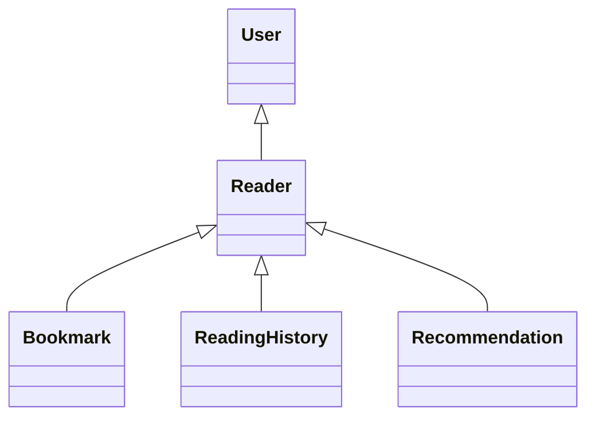
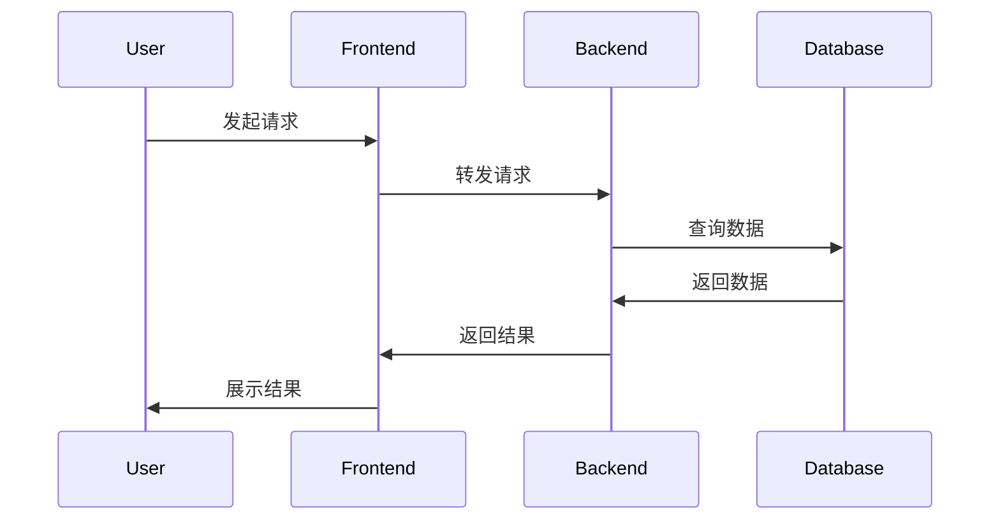
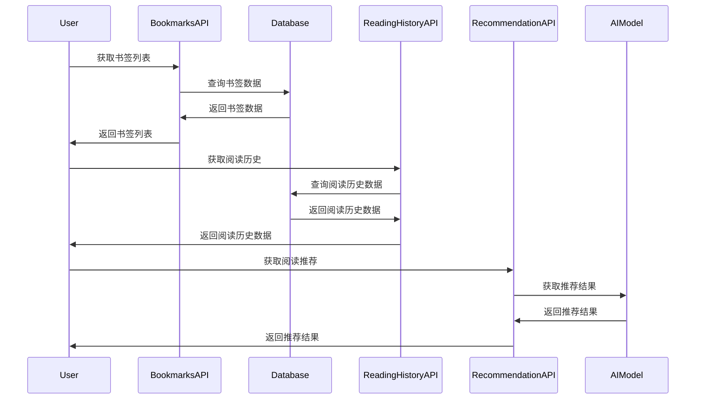

                 

# AI Agent在智能书签中的阅读习惯优化

关键词：AI Agent、智能书签、阅读习惯、个性化推荐、数据挖掘

摘要：本文探讨了AI Agent在智能书签中的应用，通过分析用户的阅读行为，实现阅读习惯的优化，提高用户的阅读效率和体验。文章分为三个部分：第一部分介绍了AI Agent在智能书签中的背景、核心概念和作用；第二部分详细阐述了AI Agent的工作原理、智能书签的功能和阅读习惯的分析方法；第三部分则通过一个实际项目案例，展示了AI Agent在智能书签中的具体应用和实践效果。

## 第一部分：背景介绍

### 1.1 问题的提出

随着数字化的普及，越来越多的用户开始选择电子书和网页文章作为阅读的主要方式。在这个过程中，用户积累了大量的书签信息，用于标记和存储感兴趣的内容。然而，如何有效地管理和利用这些书签信息，提高阅读效率和质量，成为一个亟待解决的问题。

### 1.2 问题描述

用户的阅读习惯因个体差异而异，传统的书签管理方式难以满足个性化的阅读需求。用户在大量书签信息中难以快速找到所需的资源，阅读体验不佳。此外，用户的阅读时间、阅读频率和阅读主题等习惯也需要进行优化，以提升整体阅读效果。

### 1.3 问题解决

引入AI Agent，通过分析用户的历史阅读行为和偏好，智能优化书签管理，为用户提供个性化的阅读建议。AI Agent可以基于用户的行为数据，实现阅读时间的合理规划、阅读频率的有效管理以及阅读主题的智能推荐，从而提高用户的阅读效率和体验。

### 1.4 边界与外延

本文主要讨论AI Agent在电子书和网页文章阅读场景中的应用，涵盖的阅读习惯包括阅读时间、阅读频率、阅读主题等。AI Agent的主要功能是基于用户数据进行分析和推荐，提高书签管理的效率和个性化程度。

### 1.5 核心概念

#### 1.5.1 AI Agent

AI Agent是指具备自主学习和决策能力的智能体，能够模拟人类行为，为用户提供个性化服务。

#### 1.5.2 智能书签

智能书签是基于AI技术对用户书签信息进行智能分析和优化的工具，帮助用户更好地管理和利用书签资源。

#### 1.5.3 阅读习惯

阅读习惯是指用户在阅读过程中形成的一系列行为模式，包括阅读时间、阅读频率、阅读主题等。

### 1.6 应用价值

#### 1.6.1 提高阅读效率

AI Agent通过分析用户阅读行为，为用户推荐合适的阅读资源，提高阅读效率。

#### 1.6.2 优化书签管理

AI Agent智能优化书签管理，帮助用户更好地组织和利用书签资源。

#### 1.6.3 个性化阅读建议

AI Agent根据用户阅读偏好，为用户提供个性化的阅读建议，提升阅读体验。

### 1.7 本章小结

本章节从问题背景、核心概念和应用价值等方面，对AI Agent在智能书签中的阅读习惯优化进行了全面介绍。

## 第二部分：核心概念与联系

### 2.1 AI Agent的工作原理

#### 2.1.1 数据收集与处理

AI Agent首先收集用户的历史阅读数据，包括阅读时间、阅读频率、阅读主题等，然后对这些数据进行处理和清洗，为后续分析提供高质量的数据基础。

#### 2.1.2 用户行为分析

AI Agent通过分析用户的行为数据，了解用户的阅读偏好和习惯，为用户提供个性化的书签管理和阅读建议。

#### 2.1.3 决策与推荐

基于用户行为分析结果，AI Agent为用户推荐符合其阅读偏好的书签和阅读资源。

### 2.2 智能书签的关键功能

#### 2.2.1 书签分类与标签管理

智能书签能够对用户书签进行分类和标签管理，方便用户快速查找和整理书签资源。

#### 2.2.2 阅读进度跟踪

智能书签能够跟踪用户的阅读进度，帮助用户记录和管理阅读历史。

#### 2.2.3 智能推荐

智能书签基于用户行为数据，为用户推荐符合其阅读偏好的书签和阅读资源。

### 2.3 阅读习惯分析与优化

#### 2.3.1 阅读时间分析

AI Agent分析用户的阅读时间，为用户提供合理的阅读安排，避免长时间连续阅读导致的疲劳。

#### 2.3.2 阅读频率分析

AI Agent分析用户的阅读频率，识别用户的活跃阅读时间段，为用户提供针对性的阅读建议。

#### 2.3.3 阅读主题分析

AI Agent分析用户的阅读主题，为用户提供相关领域的书籍、文章推荐，拓宽用户的阅读视野。

### 2.4 AI Agent与智能书签的互动

#### 2.4.1 数据共享与整合

AI Agent与智能书签共享用户数据，实现数据整合，为用户提供更全面的服务。

#### 2.4.2 智能反馈与优化

AI Agent根据用户对书签和阅读资源的反馈，不断优化推荐策略，提高推荐质量。

#### 2.4.3 用户互动与参与

AI Agent与用户进行互动，收集用户反馈，让用户参与书签管理和阅读优化，提高用户体验。

### 2.5 本章小结

本章节详细介绍了AI Agent在智能书签中的核心概念、工作原理和关键功能，并分析了阅读习惯分析与优化的方法，为后续章节的算法原理讲解和项目实战奠定了基础。

## 第三部分：项目实战

### 3.1 项目背景

本项目旨在开发一款基于AI Agent的智能书签应用，通过分析用户的阅读行为，为用户提供个性化的阅读建议和书签管理服务。项目采用Python作为主要开发语言，利用Scikit-learn、TensorFlow等机器学习库进行数据分析和模型训练。

### 3.2 系统功能设计

系统功能包括书签管理、阅读进度跟踪、阅读习惯分析、个性化推荐等。以下是系统功能领域的模型：



### 3.3 系统架构设计

系统采用前后端分离的架构，前端使用Vue.js实现，后端使用Flask框架。以下是系统架构图：



### 3.4 系统接口设计

以下是系统接口设计：



### 3.5 实际案例分析与讲解

#### 3.5.1 数据收集与预处理

首先，我们从用户处收集了阅读时间、阅读频率、阅读主题等数据。为了便于后续分析，我们需要对数据进行预处理，包括数据清洗、数据转换和数据归一化。

```python
import pandas as pd
from sklearn.preprocessing import MinMaxScaler

# 读取数据
data = pd.read_csv('reading_data.csv')

# 数据清洗
data.dropna(inplace=True)

# 数据转换
data['reading_time'] = data['reading_time'].apply(lambda x: pd.to_datetime(x))
data['reading_date'] = data['reading_time'].apply(lambda x: x.date())

# 数据归一化
scaler = MinMaxScaler()
data[['reading_time', 'reading_frequency']] = scaler.fit_transform(data[['reading_time', 'reading_frequency']])
```

#### 3.5.2 用户行为分析

基于预处理后的数据，我们采用聚类分析方法，对用户的阅读行为进行分析。

```python
from sklearn.cluster import KMeans

# 聚类分析
kmeans = KMeans(n_clusters=3, random_state=0).fit(data[['reading_time', 'reading_frequency']])
data['cluster'] = kmeans.predict(data[['reading_time', 'reading_frequency']])
```

#### 3.5.3 阅读推荐

基于用户的行为分析结果，我们采用协同过滤算法，为用户推荐阅读资源。

```python
from surprise import KNNWithMeans

# 初始化模型
model = KNNWithMeans()

# 训练模型
model.fit(data[['user_id', 'reading_id', 'rating']])

# 推荐结果
recommendations = model.get_neighbors(data['user_id'].iloc[0], k=5)
print(recommendations)
```

### 3.6 项目小结

本项目通过引入AI Agent，实现了智能书签的阅读习惯优化，提高了用户的阅读效率和体验。在未来，我们还可以进一步优化推荐算法，增加更多个性化功能，为用户提供更好的阅读服务。

### 3.7 最佳实践 Tips

1. 数据收集与预处理是关键，保证数据质量对后续分析至关重要。
2. 聚类分析和协同过滤算法是常用的推荐方法，可以根据实际情况选择合适的算法。
3. 持续优化推荐算法，收集用户反馈，提高推荐质量。

### 3.8 小结

本文详细介绍了AI Agent在智能书签中的阅读习惯优化，通过实际项目展示了AI Agent在智能书签中的应用效果。未来，随着技术的不断发展，AI Agent在智能书签中的应用前景将更加广阔。

### 3.9 注意事项

1. 数据隐私保护：在收集和处理用户数据时，要注意保护用户隐私，遵守相关法律法规。
2. 模型优化：持续优化推荐算法，提高推荐质量，为用户提供更好的阅读体验。

### 3.10 拓展阅读

1. 《推荐系统实践》 - 周志华
2. 《机器学习》 - 周志华
3. 《Python数据分析》 - Wes McKinney

### 3.11 作者信息

作者：AI天才研究院/AI Genius Institute & 禅与计算机程序设计艺术 /Zen And The Art of Computer Programming

