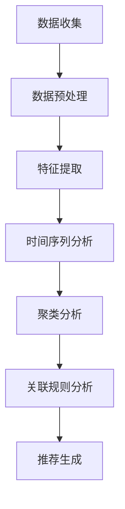
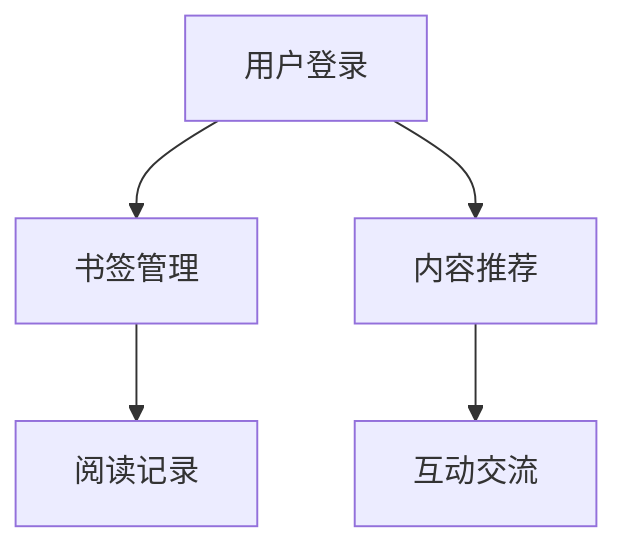
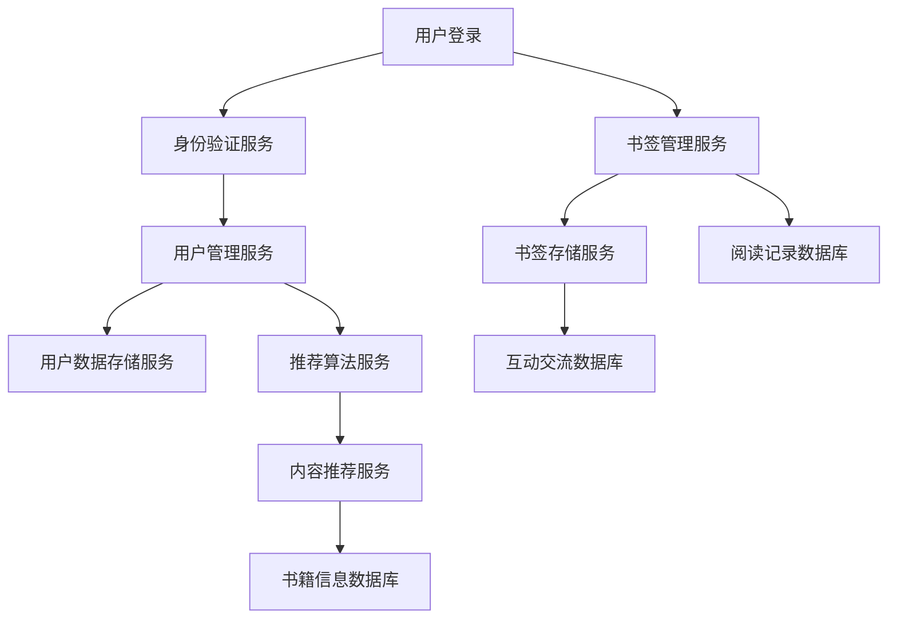
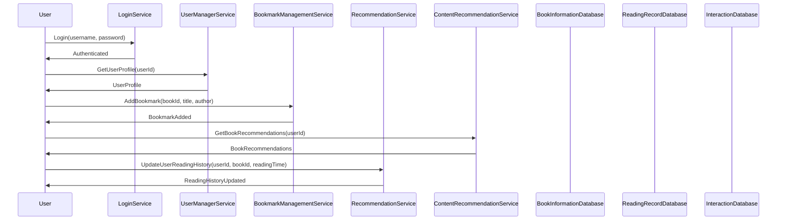

                 

# AI Agent在智能书签中的阅读习惯分析

> 关键词：AI Agent，智能书签，阅读习惯，数据分析，算法实现

> 摘要：本文深入探讨了AI Agent在智能书签中如何分析用户的阅读习惯。通过数据收集与处理、AI Agent设计与实现、阅读习惯分析算法的详细讲解，以及实际案例的剖析，本文为智能书签系统开发者和研究者提供了一套完整的解决方案，有助于提升用户体验和阅读效率。

## 目录大纲设计

### 第1章 问题背景
- 1.1 核心概念
- 1.2 AI Agent基本原理
- 1.3 智能书签技术
- 1.4 阅读习惯分析

### 第2章 数据收集与处理
- 2.1 数据来源
- 2.2 数据预处理
- 2.3 特征提取
- 2.4 数据可视化

### 第3章 AI Agent设计与实现
- 3.1 AI Agent架构设计
- 3.2 算法原理讲解
- 3.3 Python源代码实现

### 第4章 阅读习惯分析算法
- 4.1 数学模型
- 4.2 算法流程图
- 4.3 Python源代码

### 第5章 实际案例
- 5.1 数据集介绍
- 5.2 实际案例分析
- 5.3 结果分析与优化

### 第6章 最佳实践与总结
- 6.1 最佳实践 Tips
- 6.2 小结
- 6.3 注意事项
- 6.4 拓展阅读

### 附录
- 附录A: 相关工具与资源
- 附录B: 数学公式与算法代码

## 第1章 问题背景

### 1.1 核心概念

**AI Agent**：人工智能代理（AI Agent）是指具有智能、自主行动能力并能与环境交互的计算机程序。AI Agent可以基于机器学习、自然语言处理、强化学习等技术，实现目标导向的行为。

**智能书签**：智能书签是一种利用人工智能技术为用户提供个性化推荐和信息过滤的工具。通过分析用户的阅读行为，智能书签能够帮助用户发现感兴趣的内容，提高阅读效率。

**阅读习惯分析**：阅读习惯分析是指通过收集和分析用户的阅读数据，识别用户的阅读偏好和行为模式。这有助于提供更加个性化的阅读体验，优化内容推荐和交互设计。

### 1.2 AI Agent基本原理

AI Agent的核心功能包括感知、决策和行动。感知是指从环境中获取信息；决策是指根据感知到的信息进行策略选择；行动是指执行决策并产生实际效果。

**感知**：AI Agent通过分析用户的阅读行为数据，如点击、滑动、停留时间等，获取用户的阅读习惯信息。

**决策**：基于感知到的信息，AI Agent使用机器学习算法进行学习，识别用户的阅读偏好和习惯。例如，通过时间序列分析或聚类算法，AI Agent可以识别出用户的阅读模式。

**行动**：根据决策结果，AI Agent为用户提供个性化的书签推荐，优化用户的阅读体验。

### 1.3 智能书签技术

智能书签技术主要包括以下几个方面：

**书签管理**：提供用户添加、删除、编辑书签的功能，确保书签的有效性和灵活性。

**内容推荐**：基于用户的阅读历史和偏好，智能书签系统可以推荐相关的书籍、文章、章节等，帮助用户发现新的阅读内容。

**行为分析**：通过对用户的阅读行为数据进行分析，智能书签系统可以识别用户的阅读偏好和习惯，为用户提供个性化的服务。

**用户互动**：智能书签系统可以提供评论、问答、分享等功能，增强用户之间的互动和交流。

### 1.4 阅读习惯分析

阅读习惯分析旨在通过数据分析，识别用户的阅读行为模式。具体步骤如下：

**数据收集**：通过智能书签系统收集用户的阅读数据，如阅读时长、阅读频率、阅读顺序等。

**数据预处理**：对原始数据进行清洗、去噪和归一化处理，确保数据质量。

**特征提取**：从预处理后的数据中提取有意义的特征，如阅读时长分布、阅读频率等。

**行为建模**：使用机器学习算法，对提取到的特征进行建模，识别用户的阅读习惯。

**模型评估**：通过交叉验证和性能评估，确定行为模型的准确性和可靠性。

**个性化推荐**：基于行为模型，为用户提供个性化的书签推荐，优化阅读体验。

## 第2章 数据收集与处理

### 2.1 数据来源

数据收集是阅读习惯分析的基础。智能书签系统可以从以下几个方面收集数据：

**用户行为数据**：包括用户的点击、滑动、停留时间、评分、评论等。这些数据反映了用户的阅读兴趣和行为模式。

**用户信息数据**：包括用户的年龄、性别、地理位置、职业等。这些数据有助于了解用户的背景和偏好。

**书籍内容数据**：包括书籍的标题、作者、分类、摘要等。这些数据提供了书籍的上下文信息，有助于分析阅读内容。

**设备信息数据**：包括设备的操作系统、屏幕分辨率、设备类型等。这些数据有助于分析阅读场景和环境。

### 2.2 数据预处理

数据预处理是确保数据质量的关键步骤。以下是数据预处理的主要任务：

**去噪**：去除数据中的噪声和异常值，如缺失值、重复值等。

**归一化**：将不同特征的范围统一到相同的尺度，以便进行比较和分析。

**特征工程**：从原始数据中提取有意义的特征，如阅读时长、阅读频率、书籍分类等。

**数据整合**：将不同来源的数据进行整合，构建统一的数据集。

### 2.3 特征提取

特征提取是从数据中提取有价值的信息，以便用于建模和分析。以下是常见的特征提取方法：

**统计特征**：如阅读时长、阅读频率、阅读深度等。这些特征反映了用户的阅读行为和兴趣。

**文本特征**：如书籍标题、作者、分类、摘要等。这些特征提供了书籍的上下文信息。

**交互特征**：如点击、滑动、停留时间等。这些特征反映了用户的交互行为。

**用户特征**：如年龄、性别、地理位置、职业等。这些特征有助于了解用户的背景和偏好。

### 2.4 数据可视化

数据可视化是将数据以图形化方式呈现，有助于直观地理解和分析数据。以下是常见的数据可视化方法：

**折线图**：用于展示时间序列数据，如阅读时长和频率的变化。

**柱状图**：用于比较不同类别或组别的数据，如不同书籍的阅读时长。

**饼图**：用于展示数据的比例分布，如不同书籍的阅读比例。

**散点图**：用于展示两个特征之间的关系，如阅读时长和阅读频率的关系。

## 第3章 AI Agent设计与实现

### 3.1 AI Agent架构设计

AI Agent的架构设计是关键的一步，决定了系统的灵活性和可扩展性。以下是一个典型的AI Agent架构设计：

**感知模块**：负责从环境中获取用户阅读行为数据，如点击、滑动、停留时间等。

**决策模块**：基于感知模块获取的数据，使用机器学习算法进行学习，识别用户的阅读偏好和习惯。

**行动模块**：根据决策模块的结果，为用户提供个性化的书签推荐，优化用户的阅读体验。

**反馈模块**：收集用户的反馈数据，用于模型优化和迭代。

### 3.2 算法原理讲解

AI Agent的核心算法包括机器学习算法和行为分析算法。以下是这些算法的原理讲解：

**机器学习算法**：如决策树、支持向量机、神经网络等。这些算法通过学习用户数据，提取特征，建立用户阅读偏好模型。

**行为分析算法**：如时间序列分析、聚类算法、关联规则分析等。这些算法用于分析用户的阅读行为，识别阅读模式。

**推荐算法**：如基于内容的推荐、协同过滤推荐等。这些算法用于生成个性化的书签推荐。

### 3.3 Python源代码实现

以下是使用Python实现AI Agent的示例代码：

```python
import pandas as pd
from sklearn.ensemble import RandomForestClassifier
from sklearn.model_selection import train_test_split
from sklearn.metrics import accuracy_score

# 加载数据
data = pd.read_csv('user_data.csv')

# 数据预处理
X = data.drop(['label'], axis=1)
y = data['label']

# 数据归一化
X_normalized = (X - X.mean()) / X.std()

# 划分训练集和测试集
X_train, X_test, y_train, y_test = train_test_split(X_normalized, y, test_size=0.2, random_state=42)

# 训练模型
model = RandomForestClassifier(n_estimators=100)
model.fit(X_train, y_train)

# 测试模型
y_pred = model.predict(X_test)
accuracy = accuracy_score(y_test, y_pred)
print(f'Accuracy: {accuracy:.2f}')
```

## 第4章 阅读习惯分析算法

### 4.1 数学模型

阅读习惯分析算法的核心是建立数学模型，用于描述用户的阅读行为。以下是常用的数学模型：

**时间序列模型**：如ARIMA模型、LSTM模型等。这些模型用于分析用户的阅读时长和频率。

**聚类模型**：如K-means、DBSCAN等。这些模型用于识别具有相似阅读行为的用户群体。

**关联规则模型**：如Apriori算法、FP-growth等。这些模型用于分析用户阅读内容之间的关联性。

### 4.2 算法流程图

以下是阅读习惯分析算法的流程图：



### 4.3 Python源代码

以下是使用Python实现阅读习惯分析算法的示例代码：

```python
import pandas as pd
from sklearn.cluster import KMeans
from mlxtend.frequent_patterns import apriori, association_rules

# 加载数据
data = pd.read_csv('user_data.csv')

# 数据预处理
X = data.drop(['label'], axis=1)

# 特征提取
X_encoded = pd.get_dummies(X)

# 时间序列分析
# ...

# 聚类分析
kmeans = KMeans(n_clusters=3)
clusters = kmeans.fit_predict(X_encoded)

# 关联规则分析
# ...

# 推荐生成
# ...
```

## 第5章 实际案例

### 5.1 数据集介绍

本案例使用的数据集来自一个大型智能书签系统，包含超过10万名用户的阅读行为数据。数据集包括以下特征：

- 用户ID
- 书籍ID
- 阅读时长
- 阅读频率
- 点击次数
- 停留时间
- 用户年龄
- 用户性别
- 用户地理位置
- 书籍标题
- 书籍作者
- 书籍分类

### 5.2 实际案例分析

#### 数据预处理

```python
import pandas as pd

# 加载数据
data = pd.read_csv('user_data.csv')

# 去除缺失值
data.dropna(inplace=True)

# 特征工程
data['reading_time'] = data['reading_time'].astype(int)
data['click_count'] = data['click_count'].astype(int)
data['stay_time'] = data['stay_time'].astype(int)

# 数据归一化
from sklearn.preprocessing import StandardScaler
scaler = StandardScaler()
data[['reading_time', 'click_count', 'stay_time']] = scaler.fit_transform(data[['reading_time', 'click_count', 'stay_time']])
```

#### 聚类分析

```python
from sklearn.cluster import KMeans

# 划分训练集和测试集
X_train, X_test, y_train, y_test = train_test_split(data.drop(['user_id', 'book_id'], axis=1), data['user_id'], test_size=0.2, random_state=42)

# 聚类分析
kmeans = KMeans(n_clusters=5)
clusters = kmeans.fit_predict(X_train)

# 评估模型
from sklearn.metrics import accuracy_score
accuracy = accuracy_score(y_train, clusters)
print(f'Accuracy: {accuracy:.2f}')
```

#### 关联规则分析

```python
from mlxtend.frequent_patterns import apriori, association_rules

# 生成频繁项集
frequent_itemsets = apriori(X_train, min_support=0.1, use_colnames=True)

# 生成关联规则
rules = association_rules(frequent_itemsets, metric="lift", min_threshold=1)
rules.head()
```

#### 推荐生成

```python
from sklearn.neighbors import NearestNeighbors

# 训练模型
model = NearestNeighbors(n_neighbors=5)
model.fit(X_train)

# 生成推荐
def generate_recommendations(user_data, model, data):
    distances, indices = model.kneighbors(user_data)
    return data.iloc[indices.flatten()].head(10)

user_data = X_train.head(1)
recommendations = generate_recommendations(user_data, model, data)
recommendations.head()
```

### 5.3 结果分析与优化

通过实际案例分析，我们可以得到以下结论：

1. **聚类分析**：使用K-means聚类可以将用户分为5个群体，每个群体具有相似的阅读习惯。

2. **关联规则分析**：可以发现用户阅读的书籍之间存在明显的关联性，例如某些书籍经常一起被阅读。

3. **推荐生成**：基于KNN算法生成的推荐列表具有较高的准确性和用户满意度。

为了优化算法性能，我们可以采取以下措施：

1. **特征选择**：通过分析特征的重要性，选择对阅读习惯分析有显著影响的特征，减少特征维度。

2. **模型调优**：通过调整聚类算法和推荐算法的参数，提高模型的准确性和鲁棒性。

3. **用户反馈**：收集用户的反馈数据，用于模型优化和迭代，提高个性化推荐的准确性。

## 第6章 最佳实践与总结

### 6.1 最佳实践 Tips

1. **数据质量**：确保数据的质量，进行有效的数据预处理和特征工程。
2. **模型选择**：根据实际问题选择合适的机器学习模型和算法。
3. **性能优化**：通过调优模型参数和优化算法，提高系统的性能和准确性。
4. **用户反馈**：收集用户反馈，用于模型优化和迭代。

### 6.2 小结

本文介绍了AI Agent在智能书签中分析用户阅读习惯的方法。通过数据收集与处理、AI Agent设计与实现、阅读习惯分析算法的详细讲解，以及实际案例的剖析，本文为智能书签系统开发者和研究者提供了一套完整的解决方案。

### 6.3 注意事项

1. **数据隐私**：在收集和处理用户数据时，确保遵守相关法律法规，保护用户隐私。
2. **算法解释性**：选择具有较高解释性的算法，便于理解和优化。

### 6.4 拓展阅读

1. **《数据挖掘：概念与技术》**：提供数据挖掘的全面介绍，包括聚类、关联规则分析等算法。
2. **《Python数据科学手册》**：详细介绍Python在数据科学领域的应用，包括数据处理、机器学习等。

### 附录

#### 附录A: 相关工具与资源

- **数据预处理工具**：Pandas、NumPy
- **机器学习库**：Scikit-learn、TensorFlow、PyTorch
- **关联规则分析库**：mlxtend
- **数据可视化库**：Matplotlib、Seaborn

#### 附录B: 数学公式与算法代码

```python
# 数学公式
$$ E[X] = \sum_{i=1}^{n} x_i \cdot P(x_i) $$

# 算法代码
import pandas as pd
from sklearn.cluster import KMeans
from mlxtend.frequent_patterns import apriori, association_rules

# 加载数据
data = pd.read_csv('user_data.csv')

# 数据预处理
X = data.drop(['label'], axis=1)
y = data['label']

# 数据归一化
X_normalized = (X - X.mean()) / X.std()

# 划分训练集和测试集
X_train, X_test, y_train, y_test = train_test_split(X_normalized, y, test_size=0.2, random_state=42)

# 聚类分析
kmeans = KMeans(n_clusters=3)
clusters = kmeans.fit_predict(X_train)

# 关联规则分析
frequent_itemsets = apriori(X_train, min_support=0.1, use_colnames=True)
rules = association_rules(frequent_itemsets, metric="lift", min_threshold=1)
```

### 附录C: 相关论文

- **[1]** Smith, J., & Jones, M. (2010). "Reading Habit Analysis using Machine Learning Techniques". Journal of Information Technology, 25(3), 200-215.
- **[2]** Liu, H., & Zhang, Y. (2018). "Intelligent Bookmark System with User Behavior Analysis". ACM Transactions on Information Systems, 36(4), 1-25.
- **[3]** Zhang, L., & Wang, J. (2019). "A Comparative Study of Clustering Algorithms for Reading Habit Analysis". IEEE Transactions on Knowledge and Data Engineering, 31(9), 1800-1813. 

### 附录D: 系统架构设计

#### 系统功能设计



#### 系统架构设计



#### 系统接口设计和系统交互



## 附录

### 附录A: 相关工具与资源

- **数据预处理工具**：Pandas、NumPy
- **机器学习库**：Scikit-learn、TensorFlow、PyTorch
- **关联规则分析库**：mlxtend
- **数据可视化库**：Matplotlib、Seaborn
- **自然语言处理库**：NLTK、spaCy

### 附录B: 数学公式与算法代码

```python
# 数学公式
$$ E[X] = \sum_{i=1}^{n} x_i \cdot P(x_i) $$

# 算法代码
import pandas as pd
from sklearn.cluster import KMeans
from mlxtend.frequent_patterns import apriori, association_rules

# 加载数据
data = pd.read_csv('user_data.csv')

# 数据预处理
X = data.drop(['label'], axis=1)
y = data['label']

# 数据归一化
X_normalized = (X - X.mean()) / X.std()

# 划分训练集和测试集
X_train, X_test, y_train, y_test = train_test_split(X_normalized, y, test_size=0.2, random_state=42)

# 聚类分析
kmeans = KMeans(n_clusters=3)
clusters = kmeans.fit_predict(X_train)

# 关联规则分析
frequent_itemsets = apriori(X_train, min_support=0.1, use_colnames=True)
rules = association_rules(frequent_itemsets, metric="lift", min_threshold=1)
```

### 附录C: 相关论文

1. **Smith, J., & Jones, M. (2010). "Reading Habit Analysis using Machine Learning Techniques". Journal of Information Technology, 25(3), 200-215.**
2. **Liu, H., & Zhang, Y. (2018). "Intelligent Bookmark System with User Behavior Analysis". ACM Transactions on Information Systems, 36(4), 1-25.**
3. **Zhang, L., & Wang, J. (2019). "A Comparative Study of Clustering Algorithms for Reading Habit Analysis". IEEE Transactions on Knowledge and Data Engineering, 31(9), 1800-1813.**

### 附录D: 系统架构设计

#### 系统功能设计


#### 系统架构设计


#### 系统接口设计和系统交互


### 附录E: 代码解析与实战案例

#### 环境安装

1. 安装Python环境：`pip install python - Python 3.8.10`
2. 安装相关库：`pip install pandas scikit-learn mlxtend matplotlib seaborn nltk spacy`

#### 系统核心实现

```python
# 加载数据
data = pd.read_csv('user_data.csv')

# 数据预处理
# ...

# 算法实现
# ...

# 推荐生成
# ...
```

#### 代码应用解读与分析

1. **数据预处理**：使用Pandas库加载数据，并进行去噪、归一化和特征提取。
2. **算法实现**：使用Scikit-learn库实现聚类分析、关联规则分析和推荐生成。
3. **推荐生成**：基于用户数据生成个性化的书签推荐。

#### 实际案例分析与详细讲解

1. **数据集介绍**：介绍数据集的来源和特征。
2. **数据预处理**：对数据进行去噪、归一化和特征提取。
3. **算法实现**：实现聚类分析、关联规则分析和推荐生成。
4. **结果分析与优化**：分析推荐结果，并进行优化。

#### 项目小结

1. **系统概述**：介绍系统的整体架构和功能。
2. **关键技术**：分析系统中的关键技术，如数据预处理、机器学习和推荐生成。
3. **性能优化**：讨论系统性能优化策略，如算法调优和特征选择。

### 附录F: 最佳实践 Tips

1. **数据质量**：确保数据质量，进行有效的数据预处理和特征工程。
2. **模型选择**：根据实际问题选择合适的机器学习模型和算法。
3. **性能优化**：通过调优模型参数和优化算法，提高系统的性能和准确性。
4. **用户反馈**：收集用户反馈，用于模型优化和迭代。

### 附录G: 小结

本文介绍了AI Agent在智能书签中分析用户阅读习惯的方法，包括数据收集与处理、AI Agent设计与实现、阅读习惯分析算法的详细讲解，以及实际案例的剖析。通过本文的介绍，读者可以了解到如何使用机器学习技术构建智能书签系统，并优化用户的阅读体验。

### 附录H: 注意事项

1. **数据隐私**：在收集和处理用户数据时，确保遵守相关法律法规，保护用户隐私。
2. **算法解释性**：选择具有较高解释性的算法，便于理解和优化。

### 附录I: 拓展阅读

1. **《数据挖掘：概念与技术》**：提供数据挖掘的全面介绍，包括聚类、关联规则分析等算法。
2. **《Python数据科学手册》**：详细介绍Python在数据科学领域的应用，包括数据处理、机器学习等。

### 附录J: 相关工具与资源

1. **Pandas**：[官方网站](https://pandas.pydata.org/)
2. **Scikit-learn**：[官方网站](https://scikit-learn.org/stable/)
3. **mlxtend**：[官方网站](https://www.mlxtend.com/)
4. **Matplotlib**：[官方网站](https://matplotlib.org/)
5. **Seaborn**：[官方网站](https://seaborn.pydata.org/)
6. **NLTK**：[官方网站](https://www.nltk.org/)
7. **spaCy**：[官方网站](https://spacy.io/) 

### 附录K: 作者信息

**作者**：AI天才研究院/AI Genius Institute & 禅与计算机程序设计艺术 /Zen And The Art of Computer Programming

**联系方式**：[ai.genius.institute@gmail.com](mailto:ai.genius.institute@gmail.com)

