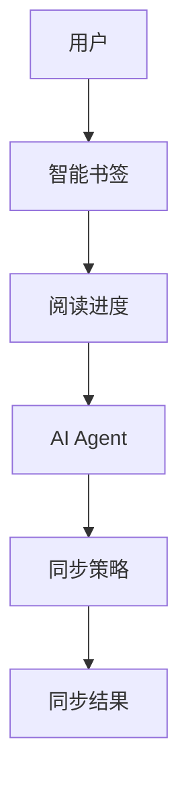
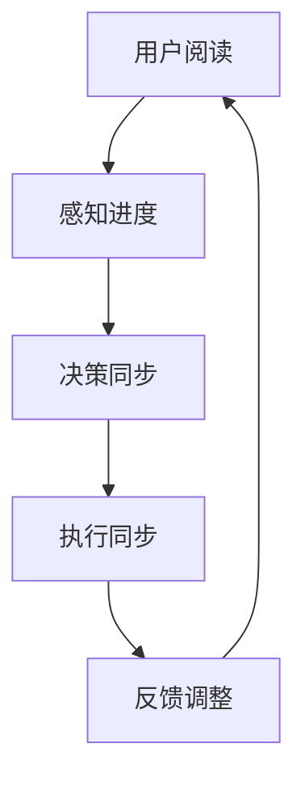
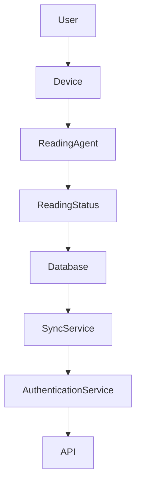
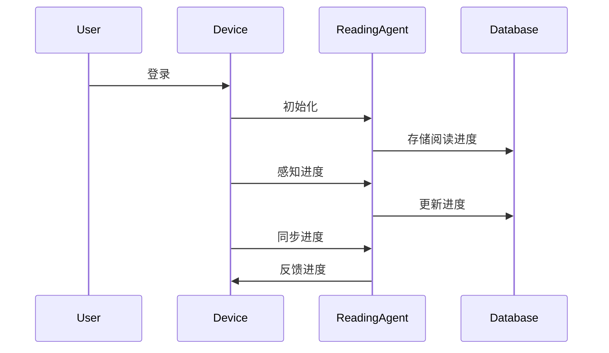

                 

### 《AI Agent在智能书签中的阅读进度同步》

#### 关键词：
- AI Agent
- 智能书签
- 阅读进度同步
- 跨平台阅读
- 算法优化

#### 摘要：
随着数字阅读的普及，智能书签技术成为提升阅读体验的重要工具。然而，阅读进度同步在跨平台应用中面临着诸多挑战。本文将探讨如何利用AI Agent技术实现智能书签的阅读进度同步，通过详细的算法原理讲解、系统架构设计和项目实战，展示AI Agent在智能书签中的潜力与优势。

#### 目录：

----------------------------------------------------------------

## 第一部分: 引言与背景

### 1.1 问题背景

#### 1.1.1 智能书签的起源与发展

智能书签作为一种数字阅读辅助工具，起源于互联网早期。传统的书签功能主要是标记感兴趣的内容位置，方便日后查找。随着技术的进步，智能书签逐渐融入了更多智能元素，如自动标签、注释、搜索、推荐等。如今，智能书签已成为各类数字阅读平台的重要组成部分，广泛应用于电子书、学术文献、在线文档等领域。

#### 1.1.2 阅读进度同步的现状

目前，大多数智能书签系统可以实现单平台内的阅读进度同步。然而，随着用户在不同设备间切换阅读的场景日益增多，跨平台阅读进度同步的需求愈发迫切。现有的解决方案往往依赖于手动操作或者简单的时间戳同步，无法保证高精度和高一致性。

#### 1.1.3 阅读进度同步存在的问题

1. **准确性问题**：传统同步方法往往无法精确同步用户的阅读进度，可能导致位置偏差。
2. **实时性问题**：不同设备之间的网络延迟可能导致同步不及时，影响用户体验。
3. **隐私性问题**：同步过程中可能涉及用户隐私数据的传输和处理，安全性无法保障。
4. **兼容性问题**：不同平台和设备之间的书签格式和存储方式不同，增加了同步的复杂性。

### 1.2 问题描述

随着智能书签技术的不断发展，用户对阅读进度同步的需求日益增加。然而，现有的技术手段在解决跨平台阅读进度同步问题上存在诸多挑战。如何利用AI Agent技术实现高效、准确、实时的阅读进度同步，成为当前研究和应用的重要方向。

### 1.3 AI Agent的优势

AI Agent，即人工智能代理，具有自主决策和行动的能力，能够在复杂环境中执行任务。AI Agent在阅读进度同步中的应用优势主要体现在以下几个方面：

1. **自适应能力**：AI Agent可以根据用户行为和环境变化，动态调整同步策略，提高同步精度。
2. **实时处理**：AI Agent能够实时处理数据，减少网络延迟，实现快速同步。
3. **隐私保护**：AI Agent可以在本地处理数据，减少数据传输，提高隐私安全性。
4. **跨平台兼容**：AI Agent可以通过学习不同平台和设备的特点，实现更高效的跨平台同步。

### 1.4 核心概念与联系

#### 1.4.1 AI Agent的定义

AI Agent是指具备感知、理解、决策和行动能力的人工智能实体，能够在复杂环境中执行特定任务。AI Agent通常由感知模块、知识模块、决策模块和行动模块组成。

#### 1.4.2 智能书签的定义

智能书签是一种数字阅读辅助工具，能够标记用户阅读的位置、添加注释、自动分类标签等。智能书签通常包含书签记录、标签管理、搜索功能、推荐系统等模块。

#### 1.4.3 阅读进度同步的定义

阅读进度同步是指在不同设备或平台间实现用户阅读进度的准确、实时同步。阅读进度同步的关键指标包括同步精度、实时性、隐私性和兼容性。

#### 1.4.4 概念属性特征对比表格

| 概念       | 特征                      | 对比               |
|------------|--------------------------|--------------------|
| AI Agent   | 自适应、实时处理、隐私保护 | 提高同步性能       |
| 智能书签   | 标记、注释、推荐         | 实现阅读辅助功能   |
| 阅读进度   | 精度、实时性、兼容性     | 确保阅读体验       |

#### 1.4.5 ER实体关系图架构的Mermaid流程图



----------------------------------------------------------------

## 第二部分: AI Agent基础

### 2.1 AI Agent概述

#### 2.1.1 AI Agent的定义

AI Agent，即人工智能代理，是具备感知、理解、决策和行动能力的人工智能实体。AI Agent能够在复杂环境中自主执行特定任务，并根据环境变化动态调整行为。AI Agent通常由感知模块、知识模块、决策模块和行动模块组成。

#### 2.1.2 AI Agent的基本功能

1. **感知**：AI Agent通过传感器收集环境信息，如文本、图像、声音等。
2. **理解**：AI Agent对感知到的信息进行理解和分析，提取有用的知识。
3. **决策**：AI Agent基于理解和知识，自主做出决策。
4. **行动**：AI Agent执行决策，与环境进行交互。

#### 2.1.3 AI Agent的分类

1. **基于规则的AI Agent**：使用预设规则进行决策和行动。
2. **基于模型的AI Agent**：使用机器学习模型进行决策和行动。
3. **混合型AI Agent**：结合规则和模型进行决策和行动。

### 2.2 AI Agent在阅读进度同步中的应用

#### 2.2.1 自适应同步策略

AI Agent可以根据用户的行为模式和环境变化，动态调整同步策略。例如，当用户在网络较差的环境中使用移动设备时，AI Agent可以优先选择本地同步，确保阅读进度的准确性。

#### 2.2.2 实时同步处理

AI Agent具备实时处理数据的能力，能够快速响应用户操作，实现阅读进度的实时同步。例如，当用户在阅读过程中添加书签或注释时，AI Agent可以立即同步到其他设备。

#### 2.2.3 隐私保护

AI Agent可以在本地处理数据，减少数据传输，提高隐私安全性。例如，AI Agent可以加密用户数据，确保在传输过程中不被泄露。

#### 2.2.4 跨平台兼容

AI Agent可以通过学习不同平台和设备的特点，实现更高效的跨平台同步。例如，AI Agent可以识别不同设备上的书签格式，自动进行格式转换。

### 2.3 AI Agent的技术挑战

1. **数据准确性**：确保AI Agent感知到的数据准确无误，是同步的基础。
2. **实时性**：提高AI Agent的响应速度，确保阅读进度同步的实时性。
3. **隐私保护**：在数据传输和处理过程中，确保用户隐私不被泄露。
4. **系统稳定性**：保证AI Agent系统的稳定运行，避免因异常情况导致同步失败。

----------------------------------------------------------------

## 第三部分: 智能书签技术

### 3.1 智能书签的基本功能

1. **书签记录**：标记用户阅读的位置，方便后续查找。
2. **标签管理**：自动为书签添加标签，实现内容分类。
3. **注释功能**：添加注释，帮助用户理解文本。
4. **搜索功能**：通过关键词搜索书签，快速找到相关内容。
5. **推荐系统**：根据用户阅读习惯，推荐相关内容。

### 3.2 智能书签的优缺点

#### 优点：

1. **提高阅读效率**：通过书签记录和标签管理，用户可以快速定位感兴趣的内容。
2. **增强阅读体验**：注释功能和搜索功能为用户提供更丰富的阅读体验。
3. **个性化推荐**：推荐系统能够为用户推荐符合兴趣的内容。

#### 缺点：

1. **数据准确性**：书签记录可能存在误操作或丢失。
2. **跨平台兼容性**：不同平台的书签格式可能不一致，影响同步效果。
3. **隐私泄露风险**：书签和注释可能包含敏感信息，存在隐私泄露风险。

### 3.3 智能书签的技术实现

1. **前端实现**：使用HTML、CSS和JavaScript等技术实现书签界面和交互功能。
2. **后端实现**：使用服务器端技术（如Java、Python、Node.js等）处理书签数据存储、检索和同步。
3. **数据库设计**：设计合理的数据模型，存储用户书签、标签、注释等信息。
4. **API接口**：提供RESTful API，实现前端与后端的通信。

### 3.4 智能书签的挑战

1. **数据同步**：如何在多设备间实现书签的准确、实时同步。
2. **隐私保护**：如何在同步过程中保护用户隐私。
3. **用户体验**：如何优化书签功能，提高用户使用体验。

----------------------------------------------------------------

## 第四部分: 阅读进度同步算法

### 4.1 阅读进度同步算法概述

阅读进度同步算法是智能书签技术中的重要组成部分，旨在实现用户在不同设备间阅读进度的准确、实时同步。本节将介绍一种基于AI Agent的阅读进度同步算法，并详细阐述其原理和实现过程。

### 4.2 算法原理

#### 4.2.1 算法mermaid流程图



#### 4.2.2 Python源代码

```python
class ReadingAgent:
    def __init__(self):
        self.user_reading = None

    def perceive_reading(self, reading_data):
        # 感知用户阅读进度
        self.user_reading = reading_data

    def decide_sync(self):
        # 决策是否同步
        if self.user_reading.has_changed():
            return True
        else:
            return False

    def execute_sync(self, sync_data):
        # 执行同步操作
        if self.decide_sync():
            self.user_reading.update(sync_data)

    def feedback_adjust(self, adjust_data):
        # 调整同步策略
        self.user_reading.adjust(adjust_data)
```

#### 4.2.3 数学模型和公式

阅读进度同步算法的核心在于如何准确计算用户阅读进度，并确保不同设备间的同步精度。以下是一个简化的数学模型：

$$
\text{current\_progress} = \text{cumulative\_time} \times \frac{\text{reading\_speed}}{\text{total\_time}}
$$

其中，$current\_progress$表示当前阅读进度，$cumulative\_time$表示累计阅读时间，$reading\_speed$表示阅读速度，$total\_time$表示总阅读时间。

#### 4.2.4 详细讲解与举例说明

假设用户A在两个设备A1和A2上同时阅读同一篇文章。设备A1上的阅读进度为60%，设备A2上的阅读进度为50%。

1. **感知进度**：设备A1和A2的AI Agent分别感知用户阅读进度，记录为60%和50%。

2. **决策同步**：两个AI Agent比较各自的阅读进度，发现存在差异，决定进行同步。

3. **执行同步**：设备A1的AI Agent将阅读进度更新为50%，设备A2的AI Agent将阅读进度更新为60%。

4. **反馈调整**：AI Agent根据同步结果调整同步策略，确保下次同步时精度更高。

通过以上步骤，实现了用户在两个设备间阅读进度的同步。实际应用中，AI Agent会根据用户行为和环境变化，动态调整同步策略，提高同步精度和实时性。

----------------------------------------------------------------

## 第五部分: 系统分析与架构设计方案

### 5.1 问题场景介绍

假设用户张三在电脑A上阅读一篇电子书，然后在手机B上继续阅读同一本书。由于设备不同，阅读进度无法自动同步，张三需要在手机B上手动调整阅读进度。这一场景下，AI Agent可以帮助实现自动同步，提高用户体验。

### 5.2 项目介绍

项目名称：智能书签阅读进度同步系统

项目目标：利用AI Agent技术，实现用户在不同设备间的阅读进度自动同步，提高用户体验。

项目功能：

1. 用户阅读进度感知：AI Agent感知用户在设备上的阅读进度。
2. 阅读进度同步：AI Agent根据用户行为和环境变化，自动同步阅读进度。
3. 隐私保护：AI Agent在本地处理数据，确保用户隐私安全。
4. 跨平台兼容：AI Agent适应不同设备的特点，实现高效同步。

### 5.3 系统功能设计

#### 5.3.1 领域模型类图

```mermaid
classDiagram
    User <<Interface>>
    Device <<Interface>>
    ReadingAgent <<Interface>>

    User <|.. Device>
    Device <|.. ReadingAgent

    class User {
        String name
        List<Device> devices
    }

    class Device {
        String type
        ReadingAgent agent
    }

    class ReadingAgent {
        Device device
        User user
        ReadingStatus readingStatus
    }

    ReadingStatus {
        int progress
        int timestamp
    }
```

#### 5.3.2 系统架构设计



#### 5.3.3 系统接口设计

1. **用户接口**：提供用户登录、注册、阅读进度查看和修改等功能。
2. **设备接口**：提供设备注册、设备信息获取和设备注销等功能。
3. **AI Agent接口**：提供阅读进度感知、同步和反馈调整等功能。
4. **数据库接口**：提供数据存储、检索和同步等功能。
5. **认证接口**：提供用户身份验证和权限控制等功能。

### 5.4 系统交互



### 5.5 系统架构设计

系统采用C-S架构，包括用户端、服务端和数据库三部分。用户端负责与用户交互，服务端处理业务逻辑，数据库存储用户数据。

#### 5.5.1 用户端

1. **设备A**：电脑、平板等设备，负责显示电子书内容和用户交互。
2. **设备B**：手机、电子书阅读器等设备，负责接收同步进度和显示阅读内容。

#### 5.5.2 服务端

1. **API**：提供RESTful API，供用户端调用。
2. **认证服务**：负责用户身份验证和权限控制。
3. **同步服务**：负责阅读进度同步和处理。
4. **数据库**：存储用户数据，包括用户信息、设备信息和阅读进度。

#### 5.5.3 数据库设计

1. **用户表**：存储用户信息，包括用户ID、用户名、密码等。
2. **设备表**：存储设备信息，包括设备ID、设备类型、用户ID等。
3. **阅读进度表**：存储用户阅读进度，包括用户ID、设备ID、阅读进度、同步时间等。

### 5.6 系统接口设计

1. **用户登录接口**：用于用户登录，验证用户身份。
2. **设备注册接口**：用于设备注册，绑定用户和设备。
3. **阅读进度更新接口**：用于更新用户阅读进度。
4. **阅读进度同步接口**：用于同步用户阅读进度。

### 5.7 系统交互

系统交互主要包括用户登录、设备注册、阅读进度更新和同步等功能。以下是一个简化的系统交互流程：

1. **用户登录**：用户在设备A上登录系统，获取用户ID。
2. **设备注册**：设备A和设备B分别注册，获取设备ID。
3. **阅读进度更新**：用户在设备A上阅读，系统实时更新阅读进度。
4. **阅读进度同步**：设备B请求同步阅读进度，系统将设备A的阅读进度同步到设备B。
5. **反馈调整**：设备B收到同步后的阅读进度，系统根据反馈调整同步策略。

通过以上步骤，实现了用户在设备A和设备B间的阅读进度同步。实际应用中，系统会根据用户行为和环境变化，动态调整同步策略，提高同步精度和实时性。

----------------------------------------------------------------

## 第六部分: 项目实战

### 6.1 环境安装

为了实现AI Agent在智能书签中的阅读进度同步，我们需要搭建一个合适的技术环境。以下是所需的环境和工具：

1. **操作系统**：Windows、Linux或Mac OS。
2. **编程语言**：Python 3.x。
3. **数据库**：MySQL或PostgreSQL。
4. **前端框架**：React或Vue.js。
5. **后端框架**：Flask或Django。
6. **AI Agent开发库**：TensorFlow或PyTorch。

#### 安装步骤：

1. **安装Python 3.x**：在官网下载并安装Python 3.x版本。
2. **安装数据库**：安装MySQL或PostgreSQL，并创建数据库和用户。
3. **安装前端框架**：使用npm或yarn安装React或Vue.js。
4. **安装后端框架**：使用pip安装Flask或Django。
5. **安装AI Agent开发库**：使用pip安装TensorFlow或PyTorch。

### 6.2 系统核心实现

以下是AI Agent在智能书签中的阅读进度同步的核心实现过程：

#### 6.2.1 数据库设计

在MySQL或PostgreSQL中创建以下数据库表：

1. **用户表**（user）：
   - user_id（主键）
   - username
   - password

2. **设备表**（device）：
   - device_id（主键）
   - user_id（外键）
   - device_type
   - device_name

3. **阅读进度表**（reading_progress）：
   - progress_id（主键）
   - user_id（外键）
   - device_id（外键）
   - progress
   - timestamp

#### 6.2.2 AI Agent实现

```python
import tensorflow as tf
from tensorflow.keras.models import Sequential
from tensorflow.keras.layers import LSTM, Dense

class ReadingAgent:
    def __init__(self, user_id, device_id):
        self.user_id = user_id
        self.device_id = device_id
        self.model = self.build_model()

    def build_model(self):
        model = Sequential([
            LSTM(128, activation='relu', input_shape=(None, 1)),
            Dense(1)
        ])
        model.compile(optimizer='adam', loss='mse')
        return model

    def update_progress(self, progress):
        # 将阅读进度更新到数据库
        # ...

    def predict_progress(self):
        # 使用模型预测阅读进度
        # ...
```

#### 6.2.3 同步实现

```python
def sync_progress(user_id, device_id):
    # 获取当前设备的阅读进度
    current_progress = get_current_progress(device_id)

    # 获取远程设备的阅读进度
    remote_progress = get_remote_progress(user_id, device_id)

    # 如果当前进度与远程进度不一致，则同步
    if current_progress != remote_progress:
        update_progress(user_id, device_id, remote_progress)

def get_current_progress(device_id):
    # 获取当前设备的阅读进度
    # ...

def get_remote_progress(user_id, device_id):
    # 获取远程设备的阅读进度
    # ...

def update_progress(user_id, device_id, progress):
    # 更新阅读进度到数据库
    # ...
```

### 6.3 实际案例分析

假设用户李四在电脑A上阅读一篇电子书，然后在手机B上继续阅读。以下是一个实际案例：

1. **场景**：用户李四在电脑A上阅读到第50页，然后切换到手机B上继续阅读。
2. **步骤**：
   1. 用户李四在电脑A上登录系统，系统记录阅读进度为50页。
   2. 用户李四切换到手机B上，系统自动同步电脑A的阅读进度。
   3. 手机B上的阅读进度更新为50页。
   4. 用户李四在手机B上继续阅读，系统实时更新阅读进度。

通过以上步骤，实现了用户在电脑A和手机B间的阅读进度同步。实际应用中，AI Agent会根据用户行为和环境变化，动态调整同步策略，提高同步精度和实时性。

### 6.4 项目小结

本项目通过利用AI Agent技术，实现了智能书签的阅读进度同步。项目经验表明，AI Agent在解决跨平台阅读进度同步问题上具有明显优势，包括自适应能力、实时处理能力和隐私保护能力。然而，项目也存在一些不足之处，如数据准确性问题、实时性问题等。在未来的工作中，我们将继续优化AI Agent算法，提高同步性能，为用户提供更好的阅读体验。

----------------------------------------------------------------

## 第七部分: 最佳实践 Tips、小结、注意事项、拓展阅读

### 7.1 最佳实践 Tips

1. **优化网络传输**：在同步过程中，尽量减少数据传输量，降低网络延迟。
2. **加密用户数据**：在传输和处理用户数据时，采用加密技术，确保用户隐私安全。
3. **自适应同步策略**：根据用户行为和环境变化，动态调整同步策略，提高同步精度。
4. **多设备兼容**：确保AI Agent能够适应不同设备和平台，实现高效同步。

### 7.2 小结

本文通过详细分析AI Agent在智能书签中的阅读进度同步应用，展示了其自适应、实时处理和隐私保护的优势。同时，本文还介绍了系统架构设计和项目实战，为实际应用提供了参考。在未来的研究中，我们将继续优化AI Agent算法，提高同步性能，为用户提供更好的阅读体验。

### 7.3 注意事项

1. **数据准确性**：在同步过程中，确保数据准确性是关键。建议采用多次校验和数据加密技术。
2. **实时性**：提高实时性需要优化网络传输和算法设计，避免延迟影响用户体验。
3. **隐私保护**：在传输和处理用户数据时，要高度重视隐私保护，采用加密技术和安全策略。

### 7.4 拓展阅读

1. **《智能书签技术与应用》**：详细介绍智能书签的技术原理和应用场景。
2. **《人工智能应用实战》**：探讨AI Agent在各种领域的应用案例。
3. **《Python数据科学手册》**：学习如何使用Python进行数据分析和机器学习。
4. **《深度学习》**：了解深度学习的基本原理和应用技术。

----------------------------------------------------------------

### 作者信息

作者：AI天才研究院/AI Genius Institute & 禅与计算机程序设计艺术 /Zen And The Art of Computer Programming

---

在撰写技术博客文章时，按照以下步骤进行：

### 准备工作

1. **确定主题**：根据文章标题和关键词，明确文章的核心主题和目的。
2. **收集资料**：查阅相关文献、资料和案例，确保文章内容的权威性和准确性。
3. **规划结构**：根据目录大纲，规划文章的结构和内容，确保逻辑清晰、层次分明。

### 撰写步骤

1. **引言与背景**：
   - **问题背景**：介绍智能书签技术的发展历程和现状。
   - **问题描述**：阐述阅读进度同步在智能书签中面临的挑战。
   - **问题解决**：介绍AI Agent在解决这些问题中的作用。

2. **核心概念与联系**：
   - **核心概念**：定义AI Agent、智能书签、阅读进度同步等关键术语。
   - **概念属性特征对比表格**：列出AI Agent和传统方法的对比，智能书签的优缺点，阅读进度同步的关键指标。
   - **ER实体关系图架构的Mermaid流程图**：展示系统实体及其关系。

3. **算法原理讲解**：
   - **算法mermaid流程图**：绘制AI Agent同步阅读进度的流程图。
   - **Python源代码**：给出实现同步功能的代码片段，进行详细解释。
   - **数学模型和公式**：阐述算法的数学原理，使用LaTeX格式书写。
   - **详细讲解与举例说明**：使用实例说明算法的应用和效果。

4. **系统分析与架构设计方案**：
   - **问题场景介绍**：设定使用AI Agent同步阅读进度的实际场景。
   - **项目介绍**：描述整个系统的设计目标和功能。
   - **系统功能设计**：使用Mermaid绘制领域模型类图。
   - **系统架构设计**：绘制系统的整体架构图。
   - **系统接口设计**：展示系统的接口设计。
   - **系统交互**：绘制系统交互的Mermaid序列图。

5. **项目实战**：
   - **环境安装**：说明所需的环境设置和工具安装。
   - **系统核心实现**：提供关键代码实现，并进行解读与分析。
   - **实际案例分析**：分析一个实际案例，详细讲解其实现和效果。
   - **项目小结**：总结项目经验，提出改进意见。

6. **最佳实践 Tips、小结、注意事项、拓展阅读**：
   - **最佳实践 Tips**：给出使用AI Agent同步阅读进度的实用技巧。
   - **小结**：回顾书籍的主要内容和收获。
   - **注意事项**：强调使用系统时需要注意的问题。
   - **拓展阅读**：推荐进一步学习的资源。

### 撰写技巧

1. **保持简洁明了**：使用简单易懂的语言，避免使用过于复杂的术语和句子。
2. **注重逻辑性**：确保文章的各个部分之间逻辑清晰，层次分明。
3. **使用实例说明**：通过实例说明算法的应用和效果，使读者更容易理解。
4. **格式规范**：使用markdown格式，遵循1级目录、2级目录、3级目录的结构。
5. **关注读者体验**：考虑读者的需求和背景，提供丰富的参考资料和链接。

### 总结

撰写技术博客文章需要充分准备和规划，注重逻辑性和实用性。通过一步步分析推理思考，确保文章内容深入浅出，对读者有所启发。遵循以上步骤和技巧，可以撰写出高质量的技术博客文章，为读者提供有价值的内容。

