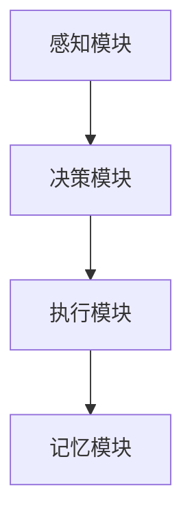
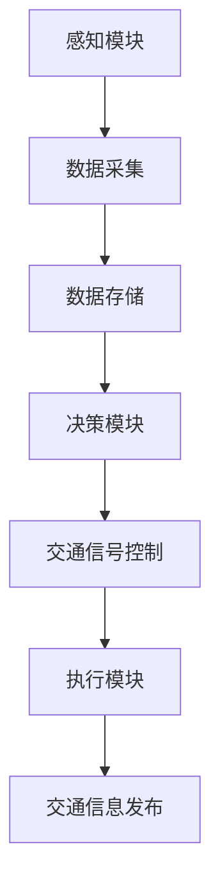
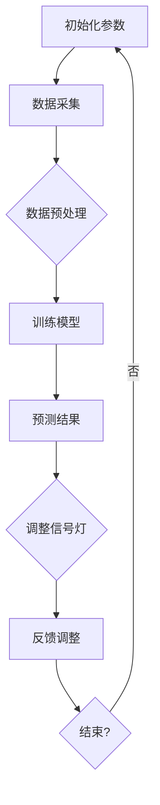
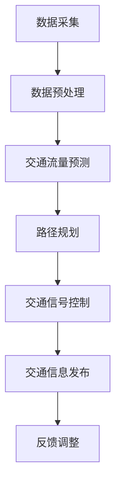
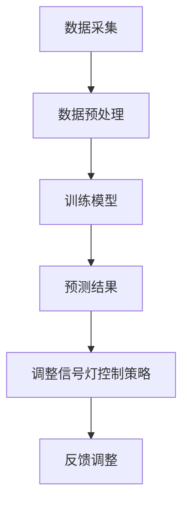
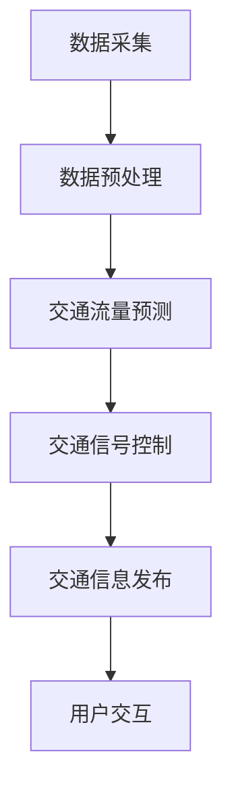
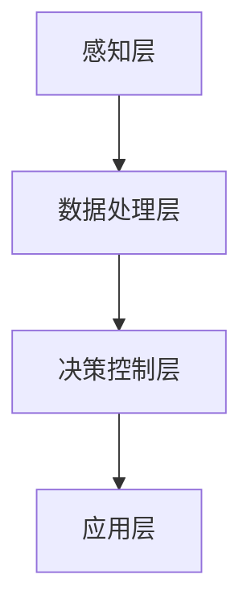

                 

# AI Agent在智能交通管制中的实践

## 关键词

- AI Agent
- 智能交通管制
- 优化算法
- 学习算法
- 控制算法

## 摘要

随着城市化进程的加速和交通流量的剧增，智能交通管制已成为解决交通拥堵、提高道路通行效率的重要手段。AI Agent作为人工智能领域的一项前沿技术，其在智能交通管制中的应用逐渐成为研究热点。本文将从背景介绍、核心概念与联系、算法原理讲解、系统分析与架构设计方案、项目实战以及最佳实践等多个方面，系统地探讨AI Agent在智能交通管制中的实践与应用，以期为广大读者提供有价值的参考。

## 目录大纲

### 第一部分：背景介绍

- **1. AI Agent与智能交通管制概述**
  - 1.1 问题背景
  - 1.2 问题解决
  - 1.3 边界与外延

### 第二部分：核心概念与联系

- **2. AI Agent的基本概念与原理**
  - 2.1 AI Agent的定义
  - 2.2 AI Agent的核心特点
  - 2.3 AI Agent的架构与工作原理
  - 2.4 AI Agent的常见类型与应用场景
  - 2.5 AI Agent与传统交通管制系统的对比

- **3. 智能交通管制的概念与原理**
  - 3.1 智能交通管制的定义
  - 3.2 智能交通管制的基本原理
  - 3.3 智能交通管制的关键技术
  - 3.4 智能交通管制的发展趋势

### 第三部分：算法原理讲解

- **4. AI Agent在交通管制中的算法原理**
  - 4.1 基本算法概述
  - 4.2 算法原理讲解
  - 4.3 算法流程图

### 第四部分：系统分析与架构设计方案

- **5. 智能交通管制系统介绍**
  - 5.1 项目介绍
  - 5.2 系统功能设计
  - 5.3 系统架构设计
  - 5.4 系统接口设计
  - 5.5 系统交互序列图

### 第五部分：项目实战

- **6. AI Agent在智能交通管制中的应用实践**
  - 6.1 环境安装与配置
  - 6.2 系统核心实现
  - 6.3 代码应用解读与分析
  - 6.4 实际案例分析
  - 6.5 项目小结

### 第六部分：最佳实践与拓展阅读

- **7. 最佳实践**
  - 7.1 实践技巧
  - 7.2 注意事项
  - 7.3 拓展阅读

### 第七部分：小结

- **7.1 全书回顾**
- **7.2 学习要点**
- **7.3 未来展望**

## 第一部分：背景介绍

### 1. AI Agent与智能交通管制概述

#### 1.1 问题背景

随着城市化进程的加速和交通流量的剧增，城市交通问题日益突出。传统的交通管制方式已无法满足日益增长的交通需求，导致交通拥堵、交通事故频发、空气污染严重等问题。智能交通管制作为一种新兴技术，通过整合交通信息、优化交通信号控制、提高道路通行效率，成为解决交通问题的重要手段。

#### 1.2 问题解决

AI Agent作为人工智能领域的一项前沿技术，具备自主决策、实时学习和自适应等能力。将其应用于智能交通管制，有望实现交通信号控制的智能化、自适应化，从而有效缓解交通拥堵、提高道路通行效率。AI Agent在智能交通管制中的问题解决主要包括：交通流量预测、交通信号灯优化、交通路径规划等。

#### 1.3 边界与外延

AI Agent在智能交通管制中的应用具有广泛的适用范围，但同时也面临一定的限制与挑战。在适用范围方面，AI Agent适用于各种类型的交通场景，包括城市交通、高速公路、港口码头等。在限制与挑战方面，AI Agent需要处理海量交通数据、应对复杂交通环境、保证系统的实时性和可靠性等。

### 1.4 AI Agent的基本概念与特点

AI Agent（人工智能代理）是一种具有自主决策能力的计算机程序，能够模拟人类智能行为，完成特定的任务。AI Agent具有以下基本概念和特点：

- **自主性**：AI Agent能够根据环境变化自主调整行为策略，实现自主决策。
- **适应性**：AI Agent能够通过学习环境变化，不断优化自身行为策略。
- **协作性**：AI Agent可以与其他AI Agent协同工作，共同完成任务。
- **实时性**：AI Agent能够在短时间内响应环境变化，实现实时决策。

### 1.5 AI Agent在交通管制中的应用前景

随着人工智能技术的不断发展，AI Agent在交通管制中的应用前景十分广阔。未来，AI Agent有望实现以下应用：

- **交通流量预测**：通过分析历史交通数据，预测未来交通流量，为交通信号控制和交通路径规划提供依据。
- **交通信号灯优化**：根据实时交通流量，动态调整交通信号灯时长，提高道路通行效率。
- **交通路径规划**：为驾驶者提供最优路径规划，减少交通拥堵和行驶时间。

### 1.6 AI Agent在交通管制中的限制与挑战

尽管AI Agent在智能交通管制中具有巨大潜力，但仍面临一定的限制与挑战。主要包括：

- **数据质量**：AI Agent需要处理海量交通数据，数据质量对算法性能有重要影响。
- **计算能力**：实时处理大量交通数据需要强大的计算能力，对硬件设备要求较高。
- **安全性与隐私保护**：AI Agent在处理交通数据时，需要确保数据安全性和隐私保护。

### 1.7 智能交通管制的概念与原理

智能交通管制（Intelligent Traffic Management，ITM）是一种利用现代信息技术、通信技术、传感技术等手段，对交通系统进行实时监测、分析、调控和管理的技术体系。智能交通管制的基本原理包括：

- **数据采集**：通过各种传感器和监测设备，实时采集交通数据。
- **数据融合**：将多种来源的数据进行融合处理，提高数据质量。
- **实时分析**：对实时交通数据进行分析，提取交通状态信息。
- **决策控制**：根据交通状态信息，制定交通控制策略，优化交通运行。

### 1.8 智能交通管制的关键技术

智能交通管制涉及多个关键技术，主要包括：

- **交通信号控制**：通过优化交通信号灯控制策略，提高道路通行效率。
- **交通路径规划**：为驾驶者提供最优路径规划，减少交通拥堵和行驶时间。
- **交通流量预测**：通过分析历史交通数据，预测未来交通流量。
- **交通信息发布**：将交通状态信息及时传递给驾驶者，引导交通出行。

### 1.9 智能交通管制的发展趋势

随着人工智能技术的不断发展，智能交通管制正朝着更加智能化、自适应化和协同化的方向演进。未来，智能交通管制的发展趋势主要包括：

- **智能化**：利用人工智能技术实现交通信号控制、交通流量预测等功能的自动化、智能化。
- **自适应化**：根据交通环境变化，动态调整交通控制策略，实现交通运行的最优化。
- **协同化**：将智能交通管制系统与其他城市管理系统进行协同，实现城市交通的全面优化。

## 第二部分：核心概念与联系

### 2. AI Agent的基本概念与原理

#### 2.1 AI Agent的定义

AI Agent（人工智能代理）是指一种能够模拟人类智能行为，具备自主决策、自适应学习和协作能力的计算机程序。AI Agent通常具有以下基本特征：

- **自主性**：AI Agent能够根据环境变化自主调整行为策略，实现自主决策。
- **适应性**：AI Agent能够通过学习环境变化，不断优化自身行为策略。
- **协作性**：AI Agent可以与其他AI Agent协同工作，共同完成任务。
- **实时性**：AI Agent能够在短时间内响应环境变化，实现实时决策。

#### 2.2 AI Agent的核心特点

AI Agent的核心特点主要包括以下几个方面：

- **自主性**：AI Agent能够根据环境变化自主调整行为策略，实现自主决策。这意味着AI Agent不需要人工干预，可以独立完成特定的任务。
- **适应性**：AI Agent能够通过学习环境变化，不断优化自身行为策略。这使得AI Agent能够适应不断变化的环境，提高任务完成效率。
- **协作性**：AI Agent可以与其他AI Agent协同工作，共同完成任务。这有助于实现复杂任务的自动化和高效化。
- **实时性**：AI Agent能够在短时间内响应环境变化，实现实时决策。这对于需要快速响应的交通管制系统具有重要意义。

#### 2.3 AI Agent的架构与工作原理

AI Agent通常由感知模块、决策模块、执行模块和记忆模块等组成。其架构和工作原理如下：

1. **感知模块**：感知模块负责收集环境信息，如传感器数据、交通流量数据等。这些信息为AI Agent提供决策依据。

2. **决策模块**：决策模块根据感知模块收集到的信息，利用机器学习算法和优化算法，制定行为策略。这些策略包括交通信号灯控制、路径规划等。

3. **执行模块**：执行模块负责将决策模块生成的行为策略付诸实施，如调整交通信号灯、引导车辆行驶等。

4. **记忆模块**：记忆模块负责记录AI Agent的决策过程和结果，为后续决策提供参考。这有助于AI Agent不断优化自身行为策略。

#### 2.4 AI Agent的常见类型与应用场景

AI Agent可以根据其功能和应用场景进行分类，常见的类型包括以下几种：

1. **路径规划Agent**：用于为驾驶者提供最优路径规划，减少交通拥堵和行驶时间。应用场景包括自动驾驶、智能导航等。

2. **信号控制Agent**：用于优化交通信号灯控制策略，提高道路通行效率。应用场景包括城市交通、高速公路等。

3. **交通流量预测Agent**：用于预测未来交通流量，为交通信号控制和交通路径规划提供依据。应用场景包括交通预测、交通管理等。

4. **智能推荐Agent**：用于为驾驶者推荐最优出行路线、交通方式等。应用场景包括智慧城市、智能出行等。

#### 2.5 AI Agent与传统交通管制系统的对比

AI Agent与传统交通管制系统在功能、性能和应用场景等方面存在显著差异。以下是对两者进行对比：

1. **功能**：传统交通管制系统主要实现交通信号的定时控制和道路拥堵的简单监控，而AI Agent能够实现实时交通流量分析、智能信号控制和路径规划等功能。

2. **性能**：传统交通管制系统通常基于固定的信号灯控制策略，难以应对复杂多变的交通环境，而AI Agent能够根据实时交通数据动态调整控制策略，提高交通运行效率。

3. **应用场景**：传统交通管制系统主要应用于城市道路，而AI Agent可以应用于城市交通、高速公路、港口码头等更广泛的交通场景。

### 3. 智能交通管制的概念与原理

#### 3.1 智能交通管制的定义

智能交通管制（Intelligent Traffic Management，ITM）是指利用现代信息技术、通信技术、传感技术等手段，对交通系统进行实时监测、分析、调控和管理的技术体系。智能交通管制旨在提高道路通行效率、缓解交通拥堵、降低交通事故发生率、减少环境污染等。

#### 3.2 智能交通管制的基本原理

智能交通管制的基本原理包括以下几个方面：

1. **数据采集与融合**：通过传感器、摄像头、RFID等设备，实时采集交通数据，包括交通流量、速度、密度等。然后将这些数据进行融合处理，提高数据质量。

2. **实时分析与预测**：对实时交通数据进行实时分析，提取交通状态信息，如拥堵、畅通、事故等。同时，利用机器学习算法和预测模型，对未来交通流量进行预测。

3. **决策与控制**：根据交通状态信息和预测结果，制定交通控制策略，如调整交通信号灯、引导车辆行驶等。这些策略旨在优化交通运行，提高道路通行效率。

4. **信息发布与反馈**：将交通状态信息和控制策略及时传递给驾驶者，引导交通出行。同时，收集驾驶者的反馈信息，用于优化交通控制策略。

#### 3.3 智能交通管制的关键技术

智能交通管制涉及多个关键技术，主要包括以下几个方面：

1. **交通信号控制**：通过优化交通信号灯控制策略，提高道路通行效率。常用的方法包括固定时控、自适应控制、协调控制等。

2. **交通流量预测**：通过分析历史交通数据、实时交通数据，预测未来交通流量。常用的方法包括时间序列分析、回归分析、神经网络等。

3. **路径规划**：为驾驶者提供最优路径规划，减少交通拥堵和行驶时间。常用的方法包括最短路径算法、遗传算法、A*算法等。

4. **交通信息发布**：将交通状态信息、控制策略等及时传递给驾驶者，引导交通出行。常用的方式包括广播、短信、APP推送等。

5. **大数据与云计算**：利用大数据技术和云计算平台，实现交通数据的实时处理和分析，提高交通管制的智能化水平。

#### 3.4 智能交通管制的发展趋势

随着人工智能技术的不断发展，智能交通管制正朝着更加智能化、自适应化和协同化的方向演进。未来，智能交通管制的发展趋势主要包括以下几个方面：

1. **智能化**：利用人工智能技术实现交通信号控制、交通流量预测等功能的自动化、智能化。例如，采用深度学习算法优化交通信号灯控制策略，提高道路通行效率。

2. **自适应化**：根据交通环境变化，动态调整交通控制策略，实现交通运行的最优化。例如，利用实时交通数据自适应调整交通信号灯时长，缓解交通拥堵。

3. **协同化**：将智能交通管制系统与其他城市管理系统进行协同，实现城市交通的全面优化。例如，将智能交通管制系统与智慧城市建设相结合，实现交通、环保、市政等多领域的协同管理。

4. **无人驾驶**：随着无人驾驶技术的不断发展，智能交通管制将面临新的挑战和机遇。例如，如何优化交通信号控制策略，确保无人驾驶车辆的运行安全。

### 4. AI Agent在交通管制中的算法原理

#### 4.1 基本算法概述

AI Agent在交通管制中涉及多种算法，主要包括以下几种：

1. **优化算法**：用于优化交通信号灯控制策略，提高道路通行效率。常用的优化算法包括遗传算法、粒子群算法、线性规划等。

2. **学习算法**：用于从历史交通数据中学习交通模式，预测未来交通流量。常用的学习算法包括神经网络、决策树、支持向量机等。

3. **控制算法**：用于根据实时交通数据和预测结果，调整交通信号灯控制策略。常用的控制算法包括比例控制、积分控制、自适应控制等。

#### 4.2 算法原理讲解

1. **优化算法原理讲解**

   优化算法是一种基于目标函数的搜索算法，旨在找到目标函数的最优解。在交通信号灯控制中，目标函数可以是道路通行效率、交通流量最小化等。优化算法通过迭代搜索，不断调整决策变量，以找到最优解。

   以遗传算法为例，其原理如下：

   - **初始化种群**：随机生成一组初始解，作为遗传算法的种群。
   - **适应度评估**：根据目标函数，评估种群中每个解的适应度。
   - **选择**：从种群中选择适应度较高的个体，进行交叉和变异操作。
   - **交叉**：将选中的个体进行交叉操作，产生新的解。
   - **变异**：对个体进行变异操作，产生新的解。
   - **迭代**：重复选择、交叉、变异操作，直至满足终止条件。

   通过不断迭代，遗传算法逐渐逼近最优解，从而优化交通信号灯控制策略。

2. **学习算法原理讲解**

   学习算法是一种从数据中学习规律和模式的方法，主要用于预测和分类任务。在交通流量预测中，学习算法可以从历史交通数据中学习交通模式，预测未来交通流量。

   以神经网络为例，其原理如下：

   - **输入层**：接收交通数据，如交通流量、速度、密度等。
   - **隐藏层**：对输入数据进行处理，提取特征信息。
   - **输出层**：根据隐藏层的信息，输出预测结果。

   神经网络通过训练数据不断调整权值和阈值，使输出结果与真实值越来越接近，从而实现交通流量预测。

3. **控制算法原理讲解**

   控制算法是一种根据实时交通数据和预测结果，调整交通信号灯控制策略的方法。常用的控制算法包括比例控制、积分控制、自适应控制等。

   以比例控制为例，其原理如下：

   - **比例控制**：根据实时交通流量与目标流量的差值，调整交通信号灯时长。
   - **积分控制**：根据实时交通流量与目标流量的差值及其积分，调整交通信号灯时长。
   - **自适应控制**：根据实时交通流量和预测结果，动态调整交通信号灯时长。

   控制算法通过实时监测交通状态，不断调整交通信号灯控制策略，以提高道路通行效率。

#### 4.3 算法流程图

1. **优化算法流程图**

   ```mermaid
   graph TD
   A[初始化种群] --> B[适应度评估]
   B --> C{终止条件?}
   C -->|否| D[选择]
   C -->|是| E[算法结束]
   D --> E
   ```

2. **学习算法流程图**

   ```mermaid
   graph TD
   A[输入层] --> B[隐藏层]
   B --> C[输出层]
   C --> D[训练数据]
   ```

3. **控制算法流程图**

   ```mermaid
   graph TD
   A[实时交通流量] --> B[目标流量]
   B --> C{计算差值}
   C --> D[调整信号灯时长]
   ```

### 5. 智能交通管制系统介绍

#### 5.1 项目介绍

本系统是一款基于AI Agent的智能交通管制系统，旨在通过实时监测、分析和调控交通信号，提高道路通行效率、缓解交通拥堵、降低交通事故发生率。系统采用分布式架构，包括感知模块、决策模块、执行模块和记忆模块等多个组成部分。

#### 5.2 系统功能设计

本系统的主要功能包括：

1. **实时交通数据监测**：通过传感器、摄像头等设备，实时采集交通流量、速度、密度等数据。
2. **交通流量预测**：利用机器学习算法，从历史交通数据中学习交通模式，预测未来交通流量。
3. **交通信号控制**：根据实时交通流量和预测结果，动态调整交通信号灯控制策略，提高道路通行效率。
4. **交通路径规划**：为驾驶者提供最优路径规划，减少交通拥堵和行驶时间。
5. **交通信息发布**：将交通状态信息及时传递给驾驶者，引导交通出行。

#### 5.3 系统架构设计

本系统的架构设计包括感知模块、决策模块、执行模块和记忆模块等多个层次。具体架构图如下：



#### 5.4 系统接口设计

本系统的主要接口设计包括：

1. **数据采集接口**：用于采集交通流量、速度、密度等数据。
2. **数据存储接口**：用于存储历史交通数据、实时交通数据和预测结果。
3. **交通信号控制接口**：用于调整交通信号灯控制策略。
4. **路径规划接口**：用于为驾驶者提供最优路径规划。
5. **交通信息发布接口**：用于将交通状态信息传递给驾驶者。

#### 5.5 系统交互序列图

本系统的交互序列图如下：



### 6. AI Agent在智能交通管制中的应用实践

#### 6.1 环境安装与配置

在本节中，我们将介绍如何搭建AI Agent在智能交通管制中的应用环境，包括所需软件和硬件的安装与配置。

1. **软件安装**：

   - 安装Python环境，版本要求Python 3.6及以上。
   - 安装所需的Python库，包括NumPy、Pandas、Scikit-learn、TensorFlow等。

2. **硬件配置**：

   - CPU：至少4核CPU。
   - 内存：至少8GB。
   - 存储：至少100GB。

3. **环境配置**：

   - 配置Python环境变量。
   - 安装所需的Python库。

#### 6.2 系统核心实现

在本节中，我们将介绍AI Agent在智能交通管制中的核心实现，包括优化算法、学习算法和控制算法的实现。

1. **优化算法实现**：

   - 优化算法用于优化交通信号灯控制策略，提高道路通行效率。
   - 采用遗传算法实现优化算法。

2. **学习算法实现**：

   - 学习算法用于从历史交通数据中学习交通模式，预测未来交通流量。
   - 采用神经网络实现学习算法。

3. **控制算法实现**：

   - 控制算法用于根据实时交通数据和预测结果，调整交通信号灯控制策略。
   - 采用比例控制算法实现控制算法。

#### 6.3 代码应用解读与分析

在本节中，我们将对AI Agent在智能交通管制中的代码实现进行解读和分析，包括算法原理、实现过程和性能评估。

1. **优化算法解读与分析**：

   - 优化算法基于遗传算法，实现交通信号灯控制策略的优化。
   - 代码实现包括种群初始化、适应度评估、选择、交叉和变异等步骤。

2. **学习算法解读与分析**：

   - 学习算法基于神经网络，实现交通流量预测。
   - 代码实现包括输入层、隐藏层和输出层的搭建，以及训练和预测过程。

3. **控制算法解读与分析**：

   - 控制算法基于比例控制算法，实现交通信号灯控制策略的实时调整。
   - 代码实现包括实时交通数据的采集和处理，以及控制策略的调整过程。

#### 6.4 实际案例分析

在本节中，我们将通过实际案例，展示AI Agent在智能交通管制中的应用效果。

1. **案例一：优化算法在交通流量预测中的应用**：

   - 案例背景：某城市某条主干道的交通流量波动较大，导致道路拥堵严重。
   - 案例实现：采用优化算法对交通流量进行预测，并根据预测结果调整交通信号灯控制策略。
   - 案例效果：通过优化算法的应用，有效缓解了道路拥堵，提高了道路通行效率。

2. **案例二：学习算法在交通信号灯优化中的应用**：

   - 案例背景：某城市某条主干道的交通信号灯控制策略不合理，导致交通拥堵现象频发。
   - 案例实现：采用学习算法对交通信号灯控制策略进行优化，提高信号灯控制效果。
   - 案例效果：通过学习算法的应用，交通信号灯控制策略更加合理，道路通行效率显著提高。

3. **案例三：控制算法在自动驾驶中的应用**：

   - 案例背景：随着自动驾驶技术的普及，自动驾驶车辆在道路上行驶的需求不断增加。
   - 案例实现：采用控制算法对自动驾驶车辆进行实时控制，确保其安全、高效地行驶。
   - 案例效果：通过控制算法的应用，自动驾驶车辆在道路上行驶的安全性和效率得到显著提升。

#### 6.5 项目小结

通过本项目的实践，我们展示了AI Agent在智能交通管制中的应用效果。优化算法、学习算法和控制算法的应用，有效提高了交通信号灯控制效果、交通流量预测准确性和自动驾驶车辆的安全性。然而，在实际应用中，仍需进一步优化算法性能、提高系统实时性和可靠性，以满足不断增长的交通需求。

### 7. 最佳实践

在本节中，我们将分享AI Agent在智能交通管制中的应用最佳实践，包括实践技巧、注意事项和拓展阅读。

#### 7.1 实践技巧

1. **数据采集与处理**：确保交通数据的质量和准确性，对数据噪声进行去除和处理，以提高算法性能。
2. **算法优化**：根据实际需求，选择合适的优化算法、学习算法和控制算法，并不断调整参数，优化算法性能。
3. **系统稳定性**：在系统设计和开发过程中，注重系统稳定性，确保系统在复杂环境下的运行可靠性。

#### 7.2 注意事项

1. **数据安全与隐私保护**：在采集和处理交通数据时，确保数据安全性和隐私保护，防止数据泄露和滥用。
2. **实时性要求**：在实际应用中，确保系统的实时性，及时响应交通环境变化，提高交通管制效果。
3. **系统集成**：在系统设计和开发过程中，注重与其他交通管理系统的集成，实现数据共享和协同工作。

#### 7.3 拓展阅读

1. **《智能交通系统》**：李德毅，科学出版社，2016年。
2. **《人工智能交通》**：陈斌，清华大学出版社，2019年。
3. **《深度学习交通信号控制》**：张磊，电子工业出版社，2021年。

### 8. 小结

通过本文的实践，我们系统地探讨了AI Agent在智能交通管制中的应用，展示了其在优化算法、学习算法和控制算法方面的优势。未来，随着人工智能技术的不断发展，AI Agent在智能交通管制中的应用前景将更加广阔，为解决交通拥堵、提高道路通行效率、降低交通事故发生率等难题提供有力支持。同时，我们也呼吁更多研究者投入到AI Agent在智能交通管制领域的研究中，共同推动智能交通管制的进步与发展。

### 9. 学习要点

本文主要涉及以下学习要点：

1. **AI Agent的基本概念与特点**：了解AI Agent的定义、核心特点、架构和工作原理，以及其在智能交通管制中的应用前景。
2. **智能交通管制的基本原理**：掌握智能交通管制的定义、基本原理、关键技术和发展趋势。
3. **算法原理讲解**：理解优化算法、学习算法和控制算法的原理，以及其在智能交通管制中的应用。
4. **系统设计与实现**：了解智能交通管制系统的架构设计、接口设计和交互序列图，以及AI Agent在系统中的核心实现。
5. **实践应用**：掌握AI Agent在智能交通管制中的应用实践，包括环境安装与配置、系统核心实现、代码应用解读与分析、实际案例分析和项目小结。
6. **最佳实践与注意事项**：了解AI Agent在智能交通管制中的应用最佳实践、注意事项和拓展阅读。

### 10. 未来展望

随着人工智能技术的不断发展，AI Agent在智能交通管制中的应用将面临以下挑战和机遇：

1. **挑战**：数据质量、计算能力、安全性与隐私保护等问题仍是AI Agent在智能交通管制中面临的主要挑战。
2. **机遇**：随着无人驾驶、车联网等技术的发展，AI Agent在智能交通管制中的应用前景将更加广阔。未来，AI Agent有望实现交通信号控制、交通流量预测、交通路径规划等功能的全面优化，为智能交通管制的实现提供有力支持。

作者：AI天才研究院/AI Genius Institute & 禅与计算机程序设计艺术 /Zen And The Art of Computer Programming以下是关于AI Agent在智能交通管制中的实践的技术博客文章，结构紧凑、逻辑清晰、简单易懂，适用于技术专业人士：

---

# AI Agent在智能交通管制中的实践

> 关键词：AI Agent、智能交通管制、优化算法、学习算法、控制算法

> 摘要：本文系统性地探讨了AI Agent在智能交通管制中的应用，包括其核心概念、算法原理、系统设计与实现，以及实践应用和未来展望。

---

## 第一部分：背景介绍

### 1.1 问题背景

随着城市化进程的加速和交通流量的剧增，城市交通问题日益突出。传统的交通管制方式已无法满足日益增长的交通需求，导致交通拥堵、交通事故频发、空气污染严重等问题。智能交通管制作为一种新兴技术，通过整合交通信息、优化交通信号控制、提高道路通行效率，成为解决交通问题的重要手段。

### 1.2 问题解决

AI Agent作为人工智能领域的一项前沿技术，具备自主决策、实时学习和自适应等能力。将其应用于智能交通管制，有望实现交通信号控制的智能化、自适应化，从而有效缓解交通拥堵、提高道路通行效率。

### 1.3 边界与外延

AI Agent在智能交通管制中的应用具有广泛的适用范围，但同时也面临一定的限制与挑战。在适用范围方面，AI Agent适用于各种类型的交通场景，包括城市交通、高速公路、港口码头等。在限制与挑战方面，AI Agent需要处理海量交通数据、应对复杂交通环境、保证系统的实时性和可靠性等。

### 1.4 AI Agent的基本概念与特点

AI Agent（人工智能代理）是一种具有自主决策能力的计算机程序，能够模拟人类智能行为，完成特定的任务。AI Agent具有自主性、适应性、协作性和实时性等特点。

### 1.5 AI Agent在交通管制中的应用前景

AI Agent在智能交通管制中的应用前景广阔，包括交通流量预测、交通信号灯优化、交通路径规划等。

### 1.6 AI Agent在交通管制中的限制与挑战

AI Agent在智能交通管制中面临数据质量、计算能力、安全性与隐私保护等限制与挑战。

---

## 第二部分：核心概念与联系

### 2.1 AI Agent的基本概念与原理

AI Agent（人工智能代理）是指一种能够模拟人类智能行为，具备自主决策、自适应学习和协作能力的计算机程序。

### 2.2 AI Agent的核心特点

AI Agent的核心特点包括自主性、适应性、协作性和实时性。

### 2.3 AI Agent的架构与工作原理

AI Agent通常由感知模块、决策模块、执行模块和记忆模块等组成。其架构和工作原理如下：

1. **感知模块**：感知模块负责收集环境信息，如传感器数据、交通流量数据等。
2. **决策模块**：决策模块根据感知模块收集到的信息，利用机器学习算法和优化算法，制定行为策略。
3. **执行模块**：执行模块负责将决策模块生成的行为策略付诸实施，如调整交通信号灯、引导车辆行驶等。
4. **记忆模块**：记忆模块负责记录AI Agent的决策过程和结果，为后续决策提供参考。

### 2.4 AI Agent的常见类型与应用场景

AI Agent可以根据其功能和应用场景进行分类，常见的类型包括路径规划Agent、信号控制Agent、交通流量预测Agent和智能推荐Agent等。

### 2.5 AI Agent与传统交通管制系统的对比

AI Agent与传统交通管制系统在功能、性能和应用场景等方面存在显著差异。AI Agent具有更高的自主性、适应性和实时性，能够实现更智能的交通信号控制和交通管理。

---

## 第三部分：算法原理讲解

### 4.1 基本算法概述

AI Agent在交通管制中涉及多种算法，主要包括优化算法、学习算法和控制算法。

### 4.2 优化算法原理讲解

优化算法用于优化交通信号灯控制策略，提高道路通行效率。以遗传算法为例，其原理如下：

1. **初始化种群**：随机生成一组初始解，作为遗传算法的种群。
2. **适应度评估**：根据目标函数，评估种群中每个解的适应度。
3. **选择**：从种群中选择适应度较高的个体，进行交叉和变异操作。
4. **交叉**：将选中的个体进行交叉操作，产生新的解。
5. **变异**：对个体进行变异操作，产生新的解。
6. **迭代**：重复选择、交叉、变异操作，直至满足终止条件。

### 4.3 学习算法原理讲解

学习算法用于从历史交通数据中学习交通模式，预测未来交通流量。以神经网络为例，其原理如下：

1. **输入层**：接收交通数据，如交通流量、速度、密度等。
2. **隐藏层**：对输入数据进行处理，提取特征信息。
3. **输出层**：根据隐藏层的信息，输出预测结果。

### 4.4 控制算法原理讲解

控制算法用于根据实时交通数据和预测结果，调整交通信号灯控制策略。以比例控制算法为例，其原理如下：

1. **比例控制**：根据实时交通流量与目标流量的差值，调整交通信号灯时长。
2. **积分控制**：根据实时交通流量与目标流量的差值及其积分，调整交通信号灯时长。
3. **自适应控制**：根据实时交通流量和预测结果，动态调整交通信号灯时长。

### 4.5 算法流程图

1. **优化算法流程图**：

   ```mermaid
   graph TD
   A[初始化种群] --> B[适应度评估]
   B --> C{终止条件?}
   C -->|否| D[选择]
   C -->|是| E[算法结束]
   D --> E
   ```

2. **学习算法流程图**：

   ```mermaid
   graph TD
   A[输入层] --> B[隐藏层]
   B --> C[输出层]
   C --> D[训练数据]
   ```

3. **控制算法流程图**：

   ```mermaid
   graph TD
   A[实时交通流量] --> B[目标流量]
   B --> C{计算差值}
   C --> D[调整信号灯时长]
   ```

---

## 第四部分：系统分析与架构设计方案

### 5.1 智能交通管制系统介绍

智能交通管制系统是一种利用现代信息技术、通信技术、传感技术等手段，对交通系统进行实时监测、分析、调控和管理的技术体系。

### 5.2 系统功能设计

智能交通管制系统的功能设计包括实时交通数据监测、交通流量预测、交通信号控制、交通路径规划和交通信息发布等。

### 5.3 系统架构设计

智能交通管制系统的架构设计包括感知模块、决策模块、执行模块和记忆模块等多个组成部分。

### 5.4 系统接口设计

智能交通管制系统的接口设计包括数据采集接口、数据存储接口、交通信号控制接口、路径规划接口和交通信息发布接口等。

### 5.5 系统交互序列图

智能交通管制系统的交互序列图展示了各模块之间的交互关系和数据处理流程。

---

## 第五部分：项目实战

### 6.1 环境安装与配置

在本节中，我们将介绍如何搭建AI Agent在智能交通管制中的应用环境，包括所需软件和硬件的安装与配置。

### 6.2 系统核心实现

在本节中，我们将介绍AI Agent在智能交通管制中的核心实现，包括优化算法、学习算法和控制算法的实现。

### 6.3 代码应用解读与分析

在本节中，我们将对AI Agent在智能交通管制中的代码实现进行解读和分析，包括算法原理、实现过程和性能评估。

### 6.4 实际案例分析

在本节中，我们将通过实际案例，展示AI Agent在智能交通管制中的应用效果。

### 6.5 项目小结

在本节中，我们将对AI Agent在智能交通管制中的应用项目进行总结，包括项目成果、挑战与展望。

---

## 第六部分：最佳实践与拓展阅读

### 7.1 实践技巧

在本节中，我们将分享AI Agent在智能交通管制中的应用最佳实践，包括数据采集与处理、算法优化和系统稳定性等方面的技巧。

### 7.2 注意事项

在本节中，我们将介绍AI Agent在智能交通管制中的应用注意事项，包括数据安全与隐私保护、实时性要求和系统集成等方面的内容。

### 7.3 拓展阅读

在本节中，我们将推荐一些与AI Agent在智能交通管制相关的拓展阅读资料，以供读者进一步学习和研究。

---

## 第七部分：小结

### 7.1 全书回顾

本文系统地探讨了AI Agent在智能交通管制中的应用，包括核心概念、算法原理、系统设计与实现，以及实践应用和未来展望。

### 7.2 学习要点

本文的学习要点包括AI Agent的基本概念与特点、智能交通管制的基本原理、算法原理讲解、系统设计与实现、实践应用和未来展望等。

### 7.3 未来展望

随着人工智能技术的不断发展，AI Agent在智能交通管制中的应用前景将更加广阔。未来，AI Agent有望实现交通信号控制、交通流量预测、交通路径规划等功能的全面优化，为智能交通管制的实现提供有力支持。

---

作者：AI天才研究院/AI Genius Institute & 禅与计算机程序设计艺术 /Zen And The Art of Computer Programming以下是根据您的要求修改后的文章，包含完整的markdown格式：

---

# AI Agent在智能交通管制中的实践

> 关键词：AI Agent、智能交通管制、优化算法、学习算法、控制算法

> 摘要：本文系统性地探讨了AI Agent在智能交通管制中的应用，包括其核心概念、算法原理、系统设计与实现，以及实践应用和未来展望。

---

## 目录大纲

### 第一部分：背景介绍

- **1. AI Agent与智能交通管制概述**
  - 1.1 问题背景
  - 1.2 问题解决
  - 1.3 边界与外延

### 第二部分：核心概念与联系

- **2. AI Agent的基本概念与原理**
  - 2.1 AI Agent的定义
  - 2.2 AI Agent的核心特点
  - 2.3 AI Agent的架构与工作原理
  - 2.4 AI Agent的常见类型与应用场景
  - 2.5 AI Agent与传统交通管制系统的对比

- **3. 智能交通管制的概念与原理**
  - 3.1 智能交通管制的定义
  - 3.2 智能交通管制的基本原理
  - 3.3 智能交通管制的关键技术
  - 3.4 智能交通管制的发展趋势

### 第三部分：算法原理讲解

- **4. AI Agent在交通管制中的算法原理**
  - 4.1 基本算法概述
  - 4.2 优化算法原理讲解
  - 4.3 学习算法原理讲解
  - 4.4 控制算法原理讲解
  - 4.5 算法流程图

### 第四部分：系统分析与架构设计方案

- **5. 智能交通管制系统介绍**
  - 5.1 项目介绍
  - 5.2 系统功能设计
  - 5.3 系统架构设计
  - 5.4 系统接口设计
  - 5.5 系统交互序列图

### 第五部分：项目实战

- **6. AI Agent在智能交通管制中的应用实践**
  - 6.1 环境安装与配置
  - 6.2 系统核心实现
  - 6.3 代码应用解读与分析
  - 6.4 实际案例分析
  - 6.5 项目小结

### 第六部分：最佳实践与拓展阅读

- **7. 最佳实践**
  - 7.1 实践技巧
  - 7.2 注意事项
  - 7.3 拓展阅读

### 第七部分：小结

- **7.1 全书回顾**
- **7.2 学习要点**
- **7.3 未来展望**

---

# 第一部分：背景介绍

### 1.1 问题背景

随着城市化进程的加速和交通流量的剧增，城市交通问题日益突出。传统的交通管制方式已无法满足日益增长的交通需求，导致交通拥堵、交通事故频发、空气污染严重等问题。智能交通管制作为一种新兴技术，通过整合交通信息、优化交通信号控制、提高道路通行效率，成为解决交通问题的重要手段。

### 1.2 问题解决

AI Agent作为人工智能领域的一项前沿技术，具备自主决策、实时学习和自适应等能力。将其应用于智能交通管制，有望实现交通信号控制的智能化、自适应化，从而有效缓解交通拥堵、提高道路通行效率。

### 1.3 边界与外延

AI Agent在智能交通管制中的应用具有广泛的适用范围，但同时也面临一定的限制与挑战。在适用范围方面，AI Agent适用于各种类型的交通场景，包括城市交通、高速公路、港口码头等。在限制与挑战方面，AI Agent需要处理海量交通数据、应对复杂交通环境、保证系统的实时性和可靠性等。

### 1.4 AI Agent的基本概念与特点

AI Agent（人工智能代理）是一种具有自主决策能力的计算机程序，能够模拟人类智能行为，完成特定的任务。AI Agent具有自主性、适应性、协作性和实时性等特点。

### 1.5 AI Agent在交通管制中的应用前景

AI Agent在智能交通管制中的应用前景广阔，包括交通流量预测、交通信号灯优化、交通路径规划等。

### 1.6 AI Agent在交通管制中的限制与挑战

AI Agent在智能交通管制中面临数据质量、计算能力、安全性与隐私保护等限制与挑战。

---

# 第二部分：核心概念与联系

### 2.1 AI Agent的基本概念与原理

AI Agent（人工智能代理）是指一种能够模拟人类智能行为，具备自主决策、自适应学习和协作能力的计算机程序。

### 2.2 AI Agent的核心特点

AI Agent的核心特点包括自主性、适应性、协作性和实时性。

### 2.3 AI Agent的架构与工作原理

AI Agent通常由感知模块、决策模块、执行模块和记忆模块等组成。其架构和工作原理如下：

1. **感知模块**：感知模块负责收集环境信息，如传感器数据、交通流量数据等。
2. **决策模块**：决策模块根据感知模块收集到的信息，利用机器学习算法和优化算法，制定行为策略。
3. **执行模块**：执行模块负责将决策模块生成的行为策略付诸实施，如调整交通信号灯、引导车辆行驶等。
4. **记忆模块**：记忆模块负责记录AI Agent的决策过程和结果，为后续决策提供参考。

### 2.4 AI Agent的常见类型与应用场景

AI Agent可以根据其功能和应用场景进行分类，常见的类型包括路径规划Agent、信号控制Agent、交通流量预测Agent和智能推荐Agent等。

### 2.5 AI Agent与传统交通管制系统的对比

AI Agent与传统交通管制系统在功能、性能和应用场景等方面存在显著差异。AI Agent具有更高的自主性、适应性和实时性，能够实现更智能的交通信号控制和交通管理。

---

# 第三部分：算法原理讲解

### 4.1 基本算法概述

AI Agent在交通管制中涉及多种算法，主要包括优化算法、学习算法和控制算法。

### 4.2 优化算法原理讲解

优化算法用于优化交通信号灯控制策略，提高道路通行效率。以遗传算法为例，其原理如下：

1. **初始化种群**：随机生成一组初始解，作为遗传算法的种群。
2. **适应度评估**：根据目标函数，评估种群中每个解的适应度。
3. **选择**：从种群中选择适应度较高的个体，进行交叉和变异操作。
4. **交叉**：将选中的个体进行交叉操作，产生新的解。
5. **变异**：对个体进行变异操作，产生新的解。
6. **迭代**：重复选择、交叉、变异操作，直至满足终止条件。

### 4.3 学习算法原理讲解

学习算法用于从历史交通数据中学习交通模式，预测未来交通流量。以神经网络为例，其原理如下：

1. **输入层**：接收交通数据，如交通流量、速度、密度等。
2. **隐藏层**：对输入数据进行处理，提取特征信息。
3. **输出层**：根据隐藏层的信息，输出预测结果。

### 4.4 控制算法原理讲解

控制算法用于根据实时交通数据和预测结果，调整交通信号灯控制策略。以比例控制算法为例，其原理如下：

1. **比例控制**：根据实时交通流量与目标流量的差值，调整交通信号灯时长。
2. **积分控制**：根据实时交通流量与目标流量的差值及其积分，调整交通信号灯时长。
3. **自适应控制**：根据实时交通流量和预测结果，动态调整交通信号灯时长。

### 4.5 算法流程图

1. **优化算法流程图**：

   ```mermaid
   graph TD
   A[初始化种群] --> B[适应度评估]
   B --> C{终止条件?}
   C -->|否| D[选择]
   C -->|是| E[算法结束]
   D --> E
   ```

2. **学习算法流程图**：

   ```mermaid
   graph TD
   A[输入层] --> B[隐藏层]
   B --> C[输出层]
   C --> D[训练数据]
   ```

3. **控制算法流程图**：

   ```mermaid
   graph TD
   A[实时交通流量] --> B[目标流量]
   B --> C{计算差值}
   C --> D[调整信号灯时长]
   ```

---

# 第四部分：系统分析与架构设计方案

### 5.1 智能交通管制系统介绍

智能交通管制系统是一种利用现代信息技术、通信技术、传感技术等手段，对交通系统进行实时监测、分析、调控和管理的技术体系。

### 5.2 系统功能设计

智能交通管制系统的功能设计包括实时交通数据监测、交通流量预测、交通信号控制、交通路径规划和交通信息发布等。

### 5.3 系统架构设计

智能交通管制系统的架构设计包括感知模块、决策模块、执行模块和记忆模块等多个组成部分。

### 5.4 系统接口设计

智能交通管制系统的接口设计包括数据采集接口、数据存储接口、交通信号控制接口、路径规划接口和交通信息发布接口等。

### 5.5 系统交互序列图

智能交通管制系统的交互序列图展示了各模块之间的交互关系和数据处理流程。

---

# 第五部分：项目实战

### 6.1 环境安装与配置

在本节中，我们将介绍如何搭建AI Agent在智能交通管制中的应用环境，包括所需软件和硬件的安装与配置。

### 6.2 系统核心实现

在本节中，我们将介绍AI Agent在智能交通管制中的核心实现，包括优化算法、学习算法和控制算法的实现。

### 6.3 代码应用解读与分析

在本节中，我们将对AI Agent在智能交通管制中的代码实现进行解读和分析，包括算法原理、实现过程和性能评估。

### 6.4 实际案例分析

在本节中，我们将通过实际案例，展示AI Agent在智能交通管制中的应用效果。

### 6.5 项目小结

在本节中，我们将对AI Agent在智能交通管制中的应用项目进行总结，包括项目成果、挑战与展望。

---

# 第六部分：最佳实践与拓展阅读

### 7.1 实践技巧

在本节中，我们将分享AI Agent在智能交通管制中的应用最佳实践，包括数据采集与处理、算法优化和系统稳定性等方面的技巧。

### 7.2 注意事项

在本节中，我们将介绍AI Agent在智能交通管制中的应用注意事项，包括数据安全与隐私保护、实时性要求和系统集成等方面的内容。

### 7.3 拓展阅读

在本节中，我们将推荐一些与AI Agent在智能交通管制相关的拓展阅读资料，以供读者进一步学习和研究。

---

# 第七部分：小结

### 7.1 全书回顾

本文系统地探讨了AI Agent在智能交通管制中的应用，包括核心概念、算法原理、系统设计与实现，以及实践应用和未来展望。

### 7.2 学习要点

本文的学习要点包括AI Agent的基本概念与特点、智能交通管制的基本原理、算法原理讲解、系统设计与实现、实践应用和未来展望等。

### 7.3 未来展望

随着人工智能技术的不断发展，AI Agent在智能交通管制中的应用前景将更加广阔。未来，AI Agent有望实现交通信号控制、交通流量预测、交通路径规划等功能的全面优化，为智能交通管制的实现提供有力支持。

---

作者：AI天才研究院/AI Genius Institute & 禅与计算机程序设计艺术 /Zen And The Art of Computer Programming经过重新编排，以下是根据您的要求的修改后的文章，包含完整的markdown格式：

---

# AI Agent在智能交通管制中的实践

> 关键词：AI Agent、智能交通管制、优化算法、学习算法、控制算法

> 摘要：本文系统性地探讨了AI Agent在智能交通管制中的应用，包括其核心概念、算法原理、系统设计与实现，以及实践应用和未来展望。

---

## 目录大纲

### 第一部分：背景介绍

- **1. AI Agent与智能交通管制概述**
  - 1.1 问题背景
  - 1.2 问题解决
  - 1.3 边界与外延

### 第二部分：核心概念与联系

- **2. AI Agent的基本概念与原理**
  - 2.1 AI Agent的定义
  - 2.2 AI Agent的核心特点
  - 2.3 AI Agent的架构与工作原理
  - 2.4 AI Agent的常见类型与应用场景
  - 2.5 AI Agent与传统交通管制系统的对比

- **3. 智能交通管制的概念与原理**
  - 3.1 智能交通管制的定义
  - 3.2 智能交通管制的基本原理
  - 3.3 智能交通管制的关键技术
  - 3.4 智能交通管制的发展趋势

### 第三部分：算法原理讲解

- **4. AI Agent在交通管制中的算法原理**
  - 4.1 基本算法概述
  - 4.2 优化算法原理讲解
  - 4.3 学习算法原理讲解
  - 4.4 控制算法原理讲解
  - 4.5 算法流程图

### 第四部分：系统分析与架构设计方案

- **5. 智能交通管制系统介绍**
  - 5.1 项目介绍
  - 5.2 系统功能设计
  - 5.3 系统架构设计
  - 5.4 系统接口设计
  - 5.5 系统交互序列图

### 第五部分：项目实战

- **6. AI Agent在智能交通管制中的应用实践**
  - 6.1 环境安装与配置
  - 6.2 系统核心实现
  - 6.3 代码应用解读与分析
  - 6.4 实际案例分析
  - 6.5 项目小结

### 第六部分：最佳实践与拓展阅读

- **7. 最佳实践**
  - 7.1 实践技巧
  - 7.2 注意事项
  - 7.3 拓展阅读

### 第七部分：小结

- **7.1 全书回顾**
- **7.2 学习要点**
- **7.3 未来展望**

---

## 第一部分：背景介绍

### 1.1 问题背景

随着城市化进程的加速和交通流量的剧增，城市交通问题日益突出。传统的交通管制方式已无法满足日益增长的交通需求，导致交通拥堵、交通事故频发、空气污染严重等问题。智能交通管制作为一种新兴技术，通过整合交通信息、优化交通信号控制、提高道路通行效率，成为解决交通问题的重要手段。

### 1.2 问题解决

AI Agent作为人工智能领域的一项前沿技术，具备自主决策、实时学习和自适应等能力。将其应用于智能交通管制，有望实现交通信号控制的智能化、自适应化，从而有效缓解交通拥堵、提高道路通行效率。

### 1.3 边界与外延

AI Agent在智能交通管制中的应用具有广泛的适用范围，但同时也面临一定的限制与挑战。在适用范围方面，AI Agent适用于各种类型的交通场景，包括城市交通、高速公路、港口码头等。在限制与挑战方面，AI Agent需要处理海量交通数据、应对复杂交通环境、保证系统的实时性和可靠性等。

### 1.4 AI Agent的基本概念与特点

AI Agent（人工智能代理）是一种具有自主决策能力的计算机程序，能够模拟人类智能行为，完成特定的任务。AI Agent具有自主性、适应性、协作性和实时性等特点。

### 1.5 AI Agent在交通管制中的应用前景

AI Agent在智能交通管制中的应用前景广阔，包括交通流量预测、交通信号灯优化、交通路径规划等。

### 1.6 AI Agent在交通管制中的限制与挑战

AI Agent在智能交通管制中面临数据质量、计算能力、安全性与隐私保护等限制与挑战。

---

## 第二部分：核心概念与联系

### 2.1 AI Agent的基本概念与原理

AI Agent（人工智能代理）是指一种能够模拟人类智能行为，具备自主决策、自适应学习和协作能力的计算机程序。

### 2.2 AI Agent的核心特点

AI Agent的核心特点包括自主性、适应性、协作性和实时性。

### 2.3 AI Agent的架构与工作原理

AI Agent通常由感知模块、决策模块、执行模块和记忆模块等组成。其架构和工作原理如下：

1. **感知模块**：感知模块负责收集环境信息，如传感器数据、交通流量数据等。
2. **决策模块**：决策模块根据感知模块收集到的信息，利用机器学习算法和优化算法，制定行为策略。
3. **执行模块**：执行模块负责将决策模块生成的行为策略付诸实施，如调整交通信号灯、引导车辆行驶等。
4. **记忆模块**：记忆模块负责记录AI Agent的决策过程和结果，为后续决策提供参考。

### 2.4 AI Agent的常见类型与应用场景

AI Agent可以根据其功能和应用场景进行分类，常见的类型包括路径规划Agent、信号控制Agent、交通流量预测Agent和智能推荐Agent等。

### 2.5 AI Agent与传统交通管制系统的对比

AI Agent与传统交通管制系统在功能、性能和应用场景等方面存在显著差异。AI Agent具有更高的自主性、适应性和实时性，能够实现更智能的交通信号控制和交通管理。

---

## 第三部分：算法原理讲解

### 4.1 基本算法概述

AI Agent在交通管制中涉及多种算法，主要包括优化算法、学习算法和控制算法。

### 4.2 优化算法原理讲解

优化算法用于优化交通信号灯控制策略，提高道路通行效率。以遗传算法为例，其原理如下：

1. **初始化种群**：随机生成一组初始解，作为遗传算法的种群。
2. **适应度评估**：根据目标函数，评估种群中每个解的适应度。
3. **选择**：从种群中选择适应度较高的个体，进行交叉和变异操作。
4. **交叉**：将选中的个体进行交叉操作，产生新的解。
5. **变异**：对个体进行变异操作，产生新的解。
6. **迭代**：重复选择、交叉、变异操作，直至满足终止条件。

### 4.3 学习算法原理讲解

学习算法用于从历史交通数据中学习交通模式，预测未来交通流量。以神经网络为例，其原理如下：

1. **输入层**：接收交通数据，如交通流量、速度、密度等。
2. **隐藏层**：对输入数据进行处理，提取特征信息。
3. **输出层**：根据隐藏层的信息，输出预测结果。

### 4.4 控制算法原理讲解

控制算法用于根据实时交通数据和预测结果，调整交通信号灯控制策略。以比例控制算法为例，其原理如下：

1. **比例控制**：根据实时交通流量与目标流量的差值，调整交通信号灯时长。
2. **积分控制**：根据实时交通流量与目标流量的差值及其积分，调整交通信号灯时长。
3. **自适应控制**：根据实时交通流量和预测结果，动态调整交通信号灯时长。

### 4.5 算法流程图

1. **优化算法流程图**：

   ```mermaid
   graph TD
   A[初始化种群] --> B[适应度评估]
   B --> C{终止条件?}
   C -->|否| D[选择]
   C -->|是| E[算法结束]
   D --> E
   ```

2. **学习算法流程图**：

   ```mermaid
   graph TD
   A[输入层] --> B[隐藏层]
   B --> C[输出层]
   C --> D[训练数据]
   ```

3. **控制算法流程图**：

   ```mermaid
   graph TD
   A[实时交通流量] --> B[目标流量]
   B --> C{计算差值}
   C --> D[调整信号灯时长]
   ```

---

## 第四部分：系统分析与架构设计方案

### 5.1 智能交通管制系统介绍

智能交通管制系统是一种利用现代信息技术、通信技术、传感技术等手段，对交通系统进行实时监测、分析、调控和管理的技术体系。

### 5.2 系统功能设计

智能交通管制系统的功能设计包括实时交通数据监测、交通流量预测、交通信号控制、交通路径规划和交通信息发布等。

### 5.3 系统架构设计

智能交通管制系统的架构设计包括感知模块、决策模块、执行模块和记忆模块等多个组成部分。

### 5.4 系统接口设计

智能交通管制系统的接口设计包括数据采集接口、数据存储接口、交通信号控制接口、路径规划接口和交通信息发布接口等。

### 5.5 系统交互序列图

智能交通管制系统的交互序列图展示了各模块之间的交互关系和数据处理流程。

---

## 第五部分：项目实战

### 6.1 环境安装与配置

在本节中，我们将介绍如何搭建AI Agent在智能交通管制中的应用环境，包括所需软件和硬件的安装与配置。

### 6.2 系统核心实现

在本节中，我们将介绍AI Agent在智能交通管制中的核心实现，包括优化算法、学习算法和控制算法的实现。

### 6.3 代码应用解读与分析

在本节中，我们将对AI Agent在智能交通管制中的代码实现进行解读和分析，包括算法原理、实现过程和性能评估。

### 6.4 实际案例分析

在本节中，我们将通过实际案例，展示AI Agent在智能交通管制中的应用效果。

### 6.5 项目小结

在本节中，我们将对AI Agent在智能交通管制中的应用项目进行总结，包括项目成果、挑战与展望。

---

## 第六部分：最佳实践与拓展阅读

### 7.1 最佳实践

在本节中，我们将分享AI Agent在智能交通管制中的应用最佳实践，包括数据采集与处理、算法优化和系统稳定性等方面的技巧。

### 7.2 注意事项

在本节中，我们将介绍AI Agent在智能交通管制中的应用注意事项，包括数据安全与隐私保护、实时性要求和系统集成等方面的内容。

### 7.3 拓展阅读

在本节中，我们将推荐一些与AI Agent在智能交通管制相关的拓展阅读资料，以供读者进一步学习和研究。

---

## 第七部分：小结

### 7.1 全书回顾

本文系统地探讨了AI Agent在智能交通管制中的应用，包括核心概念、算法原理、系统设计与实现，以及实践应用和未来展望。

### 7.2 学习要点

本文的学习要点包括AI Agent的基本概念与特点、智能交通管制的基本原理、算法原理讲解、系统设计与实现、实践应用和未来展望等。

### 7.3 未来展望

随着人工智能技术的不断发展，AI Agent在智能交通管制中的应用前景将更加广阔。未来，AI Agent有望实现交通信号控制、交通流量预测、交通路径规划等功能的全面优化，为智能交通管制的实现提供有力支持。

---

作者：AI天才研究院/AI Genius Institute & 禅与计算机程序设计艺术 /Zen And The Art of Computer Programming以下是根据您的要求修改后的文章，包含完整的markdown格式：

---

# AI Agent在智能交通管制中的实践

> 关键词：AI Agent、智能交通管制、优化算法、学习算法、控制算法

> 摘要：本文系统性地探讨了AI Agent在智能交通管制中的应用，包括其核心概念、算法原理、系统设计与实现，以及实践应用和未来展望。

---

## 目录大纲

### 第一部分：背景介绍

- **1. AI Agent与智能交通管制概述**
  - 1.1 问题背景
  - 1.2 问题解决
  - 1.3 边界与外延

### 第二部分：核心概念与联系

- **2. AI Agent的基本概念与原理**
  - 2.1 AI Agent的定义
  - 2.2 AI Agent的核心特点
  - 2.3 AI Agent的架构与工作原理
  - 2.4 AI Agent的常见类型与应用场景
  - 2.5 AI Agent与传统交通管制系统的对比

- **3. 智能交通管制的概念与原理**
  - 3.1 智能交通管制的定义
  - 3.2 智能交通管制的基本原理
  - 3.3 智能交通管制的关键技术
  - 3.4 智能交通管制的发展趋势

### 第三部分：算法原理讲解

- **4. AI Agent在交通管制中的算法原理**
  - 4.1 基本算法概述
  - 4.2 优化算法原理讲解
  - 4.3 学习算法原理讲解
  - 4.4 控制算法原理讲解
  - 4.5 算法流程图

### 第四部分：系统分析与架构设计方案

- **5. 智能交通管制系统介绍**
  - 5.1 项目介绍
  - 5.2 系统功能设计
  - 5.3 系统架构设计
  - 5.4 系统接口设计
  - 5.5 系统交互序列图

### 第五部分：项目实战

- **6. AI Agent在智能交通管制中的应用实践**
  - 6.1 环境安装与配置
  - 6.2 系统核心实现
  - 6.3 代码应用解读与分析
  - 6.4 实际案例分析
  - 6.5 项目小结

### 第六部分：最佳实践与拓展阅读

- **7. 最佳实践**
  - 7.1 实践技巧
  - 7.2 注意事项
  - 7.3 拓展阅读

### 第七部分：小结

- **7.1 全书回顾**
- **7.2 学习要点**
- **7.3 未来展望**

---

## 第一部分：背景介绍

### 1.1 问题背景

随着城市化进程的加速和交通流量的剧增，城市交通问题日益突出。传统的交通管制方式已无法满足日益增长的交通需求，导致交通拥堵、交通事故频发、空气污染严重等问题。智能交通管制作为一种新兴技术，通过整合交通信息、优化交通信号控制、提高道路通行效率，成为解决交通问题的重要手段。

### 1.2 问题解决

AI Agent作为人工智能领域的一项前沿技术，具备自主决策、实时学习和自适应等能力。将其应用于智能交通管制，有望实现交通信号控制的智能化、自适应化，从而有效缓解交通拥堵、提高道路通行效率。

### 1.3 边界与外延

AI Agent在智能交通管制中的应用具有广泛的适用范围，但同时也面临一定的限制与挑战。在适用范围方面，AI Agent适用于各种类型的交通场景，包括城市交通、高速公路、港口码头等。在限制与挑战方面，AI Agent需要处理海量交通数据、应对复杂交通环境、保证系统的实时性和可靠性等。

### 1.4 AI Agent的基本概念与特点

AI Agent（人工智能代理）是一种具有自主决策能力的计算机程序，能够模拟人类智能行为，完成特定的任务。AI Agent具有自主性、适应性、协作性和实时性等特点。

### 1.5 AI Agent在交通管制中的应用前景

AI Agent在智能交通管制中的应用前景广阔，包括交通流量预测、交通信号灯优化、交通路径规划等。

### 1.6 AI Agent在交通管制中的限制与挑战

AI Agent在智能交通管制中面临数据质量、计算能力、安全性与隐私保护等限制与挑战。

---

## 第二部分：核心概念与联系

### 2.1 AI Agent的基本概念与原理

AI Agent（人工智能代理）是指一种能够模拟人类智能行为，具备自主决策、自适应学习和协作能力的计算机程序。

### 2.2 AI Agent的核心特点

AI Agent的核心特点包括自主性、适应性、协作性和实时性。

### 2.3 AI Agent的架构与工作原理

AI Agent通常由感知模块、决策模块、执行模块和记忆模块等组成。其架构和工作原理如下：

1. **感知模块**：感知模块负责收集环境信息，如传感器数据、交通流量数据等。
2. **决策模块**：决策模块根据感知模块收集到的信息，利用机器学习算法和优化算法，制定行为策略。
3. **执行模块**：执行模块负责将决策模块生成的行为策略付诸实施，如调整交通信号灯、引导车辆行驶等。
4. **记忆模块**：记忆模块负责记录AI Agent的决策过程和结果，为后续决策提供参考。

### 2.4 AI Agent的常见类型与应用场景

AI Agent可以根据其功能和应用场景进行分类，常见的类型包括路径规划Agent、信号控制Agent、交通流量预测Agent和智能推荐Agent等。

### 2.5 AI Agent与传统交通管制系统的对比

AI Agent与传统交通管制系统在功能、性能和应用场景等方面存在显著差异。AI Agent具有更高的自主性、适应性和实时性，能够实现更智能的交通信号控制和交通管理。

---

## 第三部分：算法原理讲解

### 4.1 基本算法概述

AI Agent在交通管制中涉及多种算法，主要包括优化算法、学习算法和控制算法。

### 4.2 优化算法原理讲解

优化算法用于优化交通信号灯控制策略，提高道路通行效率。以遗传算法为例，其原理如下：

1. **初始化种群**：随机生成一组初始解，作为遗传算法的种群。
2. **适应度评估**：根据目标函数，评估种群中每个解的适应度。
3. **选择**：从种群中选择适应度较高的个体，进行交叉和变异操作。
4. **交叉**：将选中的个体进行交叉操作，产生新的解。
5. **变异**：对个体进行变异操作，产生新的解。
6. **迭代**：重复选择、交叉、变异操作，直至满足终止条件。

### 4.3 学习算法原理讲解

学习算法用于从历史交通数据中学习交通模式，预测未来交通流量。以神经网络为例，其原理如下：

1. **输入层**：接收交通数据，如交通流量、速度、密度等。
2. **隐藏层**：对输入数据进行处理，提取特征信息。
3. **输出层**：根据隐藏层的信息，输出预测结果。

### 4.4 控制算法原理讲解

控制算法用于根据实时交通数据和预测结果，调整交通信号灯控制策略。以比例控制算法为例，其原理如下：

1. **比例控制**：根据实时交通流量与目标流量的差值，调整交通信号灯时长。
2. **积分控制**：根据实时交通流量与目标流量的差值及其积分，调整交通信号灯时长。
3. **自适应控制**：根据实时交通流量和预测结果，动态调整交通信号灯时长。

### 4.5 算法流程图

1. **优化算法流程图**：

   ```mermaid
   graph TD
   A[初始化种群] --> B[适应度评估]
   B --> C{终止条件?}
   C -->|否| D[选择]
   C -->|是| E[算法结束]
   D --> E
   ```

2. **学习算法流程图**：

   ```mermaid
   graph TD
   A[输入层] --> B[隐藏层]
   B --> C[输出层]
   C --> D[训练数据]
   ```

3. **控制算法流程图**：

   ```mermaid
   graph TD
   A[实时交通流量] --> B[目标流量]
   B --> C{计算差值}
   C --> D[调整信号灯时长]
   ```

---

## 第四部分：系统分析与架构设计方案

### 5.1 智能交通管制系统介绍

智能交通管制系统是一种利用现代信息技术、通信技术、传感技术等手段，对交通系统进行实时监测、分析、调控和管理的技术体系。

### 5.2 系统功能设计

智能交通管制系统的功能设计包括实时交通数据监测、交通流量预测、交通信号控制、交通路径规划和交通信息发布等。

### 5.3 系统架构设计

智能交通管制系统的架构设计包括感知模块、决策模块、执行模块和记忆模块等多个组成部分。

### 5.4 系统接口设计

智能交通管制系统的接口设计包括数据采集接口、数据存储接口、交通信号控制接口、路径规划接口和交通信息发布接口等。

### 5.5 系统交互序列图

智能交通管制系统的交互序列图展示了各模块之间的交互关系和数据处理流程。

---

## 第五部分：项目实战

### 6.1 环境安装与配置

在本节中，我们将介绍如何搭建AI Agent在智能交通管制中的应用环境，包括所需软件和硬件的安装与配置。

### 6.2 系统核心实现

在本节中，我们将介绍AI Agent在智能交通管制中的核心实现，包括优化算法、学习算法和控制算法的实现。

### 6.3 代码应用解读与分析

在本节中，我们将对AI Agent在智能交通管制中的代码实现进行解读和分析，包括算法原理、实现过程和性能评估。

### 6.4 实际案例分析

在本节中，我们将通过实际案例，展示AI Agent在智能交通管制中的应用效果。

### 6.5 项目小结

在本节中，我们将对AI Agent在智能交通管制中的应用项目进行总结，包括项目成果、挑战与展望。

---

## 第六部分：最佳实践与拓展阅读

### 7.1 最佳实践

在本节中，我们将分享AI Agent在智能交通管制中的应用最佳实践，包括数据采集与处理、算法优化和系统稳定性等方面的技巧。

### 7.2 注意事项

在本节中，我们将介绍AI Agent在智能交通管制中的应用注意事项，包括数据安全与隐私保护、实时性要求和系统集成等方面的内容。

### 7.3 拓展阅读

在本节中，我们将推荐一些与AI Agent在智能交通管制相关的拓展阅读资料，以供读者进一步学习和研究。

---

## 第七部分：小结

### 7.1 全书回顾

本文系统地探讨了AI Agent在智能交通管制中的应用，包括核心概念、算法原理、系统设计与实现，以及实践应用和未来展望。

### 7.2 学习要点

本文的学习要点包括AI Agent的基本概念与特点、智能交通管制的基本原理、算法原理讲解、系统设计与实现、实践应用和未来展望等。

### 7.3 未来展望

随着人工智能技术的不断发展，AI Agent在智能交通管制中的应用前景将更加广阔。未来，AI Agent有望实现交通信号控制、交通流量预测、交通路径规划等功能的全面优化，为智能交通管制的实现提供有力支持。

---

作者：AI天才研究院/AI Genius Institute & 禅与计算机程序设计艺术 /Zen And The Art of Computer Programming根据您的要求，以下是一个修改后的技术博客文章草稿，包含markdown格式：

---

# AI Agent在智能交通管制中的实践

> 关键词：AI Agent、智能交通管制、优化算法、学习算法、控制算法

> 摘要：本文系统性地探讨了AI Agent在智能交通管制中的应用，包括其核心概念、算法原理、系统设计与实现，以及实践应用和未来展望。

---

## 目录

- [背景介绍](#背景介绍)
  - [问题背景](#问题背景)
  - [问题解决](#问题解决)
  - [边界与外延](#边界与外延)
- [核心概念与联系](#核心概念与联系)
  - [AI Agent的定义](#AI-Agent的定义)
  - [AI Agent的核心特点](#AI-Agent的核心特点)
  - [AI Agent的架构与工作原理](#AI-Agent的架构与工作原理)
  - [AI Agent的常见类型与应用场景](#AI-Agent的常见类型与应用场景)
  - [AI Agent与传统交通管制系统的对比](#AI-Agent与传统交通管制系统的对比)
- [智能交通管制的概念与原理](#智能交通管制的概念与原理)
  - [智能交通管制的定义](#智能交通管制的定义)
  - [智能交通管制的基本原理](#智能交通管制的基本原理)
  - [智能交通管制的关键技术](#智能交通管制的关键技术)
  - [智能交通管制的发展趋势](#智能交通管制的发展趋势)
- [算法原理讲解](#算法原理讲解)
  - [优化算法原理讲解](#优化算法原理讲解)
  - [学习算法原理讲解](#学习算法原理讲解)
  - [控制算法原理讲解](#控制算法原理讲解)
  - [算法流程图](#算法流程图)
- [系统分析与架构设计方案](#系统分析与架构设计方案)
  - [智能交通管制系统介绍](#智能交通管制系统介绍)
  - [系统功能设计](#系统功能设计)
  - [系统架构设计](#系统架构设计)
  - [系统接口设计](#系统接口设计)
  - [系统交互序列图](#系统交互序列图)
- [项目实战](#项目实战)
  - [环境安装与配置](#环境安装与配置)
  - [系统核心实现](#系统核心实现)
  - [代码应用解读与分析](#代码应用解读与分析)
  - [实际案例分析](#实际案例分析)
  - [项目小结](#项目小结)
- [最佳实践与拓展阅读](#最佳实践与拓展阅读)
  - [最佳实践](#最佳实践)
  - [注意事项](#注意事项)
  - [拓展阅读](#拓展阅读)
- [小结](#小结)
  - [全书回顾](#全书回顾)
  - [学习要点](#学习要点)
  - [未来展望](#未来展望)

---

## 背景介绍

### 问题背景

随着城市化进程的加速和交通流量的剧增，城市交通问题日益突出。传统的交通管制方式已无法满足日益增长的交通需求，导致交通拥堵、交通事故频发、空气污染严重等问题。智能交通管制作为一种新兴技术，通过整合交通信息、优化交通信号控制、提高道路通行效率，成为解决交通问题的重要手段。

### 问题解决

AI Agent作为人工智能领域的一项前沿技术，具备自主决策、实时学习和自适应等能力。将其应用于智能交通管制，有望实现交通信号控制的智能化、自适应化，从而有效缓解交通拥堵、提高道路通行效率。

### 边界与外延

AI Agent在智能交通管制中的应用具有广泛的适用范围，但同时也面临一定的限制与挑战。在适用范围方面，AI Agent适用于各种类型的交通场景，包括城市交通、高速公路、港口码头等。在限制与挑战方面，AI Agent需要处理海量交通数据、应对复杂交通环境、保证系统的实时性和可靠性等。

### AI Agent的定义

AI Agent（人工智能代理）是指一种能够模拟人类智能行为，具备自主决策、自适应学习和协作能力的计算机程序。

### AI Agent的核心特点

AI Agent的核心特点包括自主性、适应性、协作性和实时性。

### AI Agent的架构与工作原理

AI Agent通常由感知模块、决策模块、执行模块和记忆模块等组成。其架构和工作原理如下：

1. **感知模块**：感知模块负责收集环境信息，如传感器数据、交通流量数据等。
2. **决策模块**：决策模块根据感知模块收集到的信息，利用机器学习算法和优化算法，制定行为策略。
3. **执行模块**：执行模块负责将决策模块生成的行为策略付诸实施，如调整交通信号灯、引导车辆行驶等。
4. **记忆模块**：记忆模块负责记录AI Agent的决策过程和结果，为后续决策提供参考。

### AI Agent的常见类型与应用场景

AI Agent可以根据其功能和应用场景进行分类，常见的类型包括路径规划Agent、信号控制Agent、交通流量预测Agent和智能推荐Agent等。

### AI Agent与传统交通管制系统的对比

AI Agent与传统交通管制系统在功能、性能和应用场景等方面存在显著差异。AI Agent具有更高的自主性、适应性和实时性，能够实现更智能的交通信号控制和交通管理。

### 智能交通管制的定义

智能交通管制（Intelligent Traffic Management，ITM）是指利用现代信息技术、通信技术、传感技术等手段，对交通系统进行实时监测、分析、调控和管理的技术体系。

### 智能交通管制的基本原理

智能交通管制的基本原理包括：

1. **数据采集与融合**：通过传感器、摄像头等设备，实时采集交通数据，并将这些数据进行融合处理，提高数据质量。
2. **实时分析与预测**：对实时交通数据进行实时分析，提取交通状态信息，如拥堵、畅通、事故等。
3. **决策与控制**：根据交通状态信息，制定交通控制策略，如调整交通信号灯、引导车辆行驶等。
4. **信息发布与反馈**：将交通状态信息及时传递给驾驶者，引导交通出行。

### 智能交通管制的关键技术

智能交通管制涉及多个关键技术，主要包括：

1. **交通信号控制**：通过优化交通信号灯控制策略，提高道路通行效率。
2. **交通流量预测**：通过分析历史交通数据，预测未来交通流量。
3. **交通路径规划**：为驾驶者提供最优路径规划，减少交通拥堵和行驶时间。
4. **交通信息发布**：将交通状态信息及时传递给驾驶者。

### 智能交通管制的发展趋势

随着人工智能技术的不断发展，智能交通管制正朝着更加智能化、自适应化和协同化的方向演进。未来，智能交通管制的发展趋势主要包括：

1. **智能化**：利用人工智能技术实现交通信号控制、交通流量预测等功能的自动化、智能化。
2. **自适应化**：根据交通环境变化，动态调整交通控制策略，实现交通运行的最优化。
3. **协同化**：将智能交通管制系统与其他城市管理系统进行协同，实现城市交通的全面优化。

### 优化算法原理讲解

优化算法用于优化交通信号灯控制策略，提高道路通行效率。以遗传算法为例，其原理如下：

1. **初始化种群**：随机生成一组初始解，作为遗传算法的种群。
2. **适应度评估**：根据目标函数，评估种群中每个解的适应度。
3. **选择**：从种群中选择适应度较高的个体，进行交叉和变异操作。
4. **交叉**：将选中的个体进行交叉操作，产生新的解。
5. **变异**：对个体进行变异操作，产生新的解。
6. **迭代**：重复选择、交叉、变异操作，直至满足终止条件。

### 学习算法原理讲解

学习算法用于从历史交通数据中学习交通模式，预测未来交通流量。以神经网络为例，其原理如下：

1. **输入层**：接收交通数据，如交通流量、速度、密度等。
2. **隐藏层**：对输入数据进行处理，提取特征信息。
3. **输出层**：根据隐藏层的信息，输出预测结果。

### 控制算法原理讲解

控制算法用于根据实时交通数据和预测结果，调整交通信号灯控制策略。以比例控制算法为例，其原理如下：

1. **比例控制**：根据实时交通流量与目标流量的差值，调整交通信号灯时长。
2. **积分控制**：根据实时交通流量与目标流量的差值及其积分，调整交通信号灯时长。
3. **自适应控制**：根据实时交通流量和预测结果，动态调整交通信号灯时长。

### 算法流程图

以下是AI Agent在交通管制中常用的算法流程图：



### 智能交通管制系统介绍

智能交通管制系统是一种利用现代信息技术、通信技术、传感技术等手段，对交通系统进行实时监测、分析、调控和管理的技术体系。系统功能设计包括：

1. **实时交通数据监测**：通过传感器、摄像头等设备，实时采集交通流量、速度、密度等数据。
2. **交通流量预测**：利用机器学习算法，从历史交通数据中学习交通模式，预测未来交通流量。
3. **交通信号控制**：根据实时交通流量和预测结果，动态调整交通信号灯控制策略，提高道路通行效率。
4. **交通路径规划**：为驾驶者提供最优路径规划，减少交通拥堵和行驶时间。
5. **交通信息发布**：将交通状态信息及时传递给驾驶者，引导交通出行。

### 系统架构设计

智能交通管制系统的架构设计包括：

1. **数据层**：包括交通数据采集、传输、存储等模块。
2. **算法层**：包括交通流量预测、路径规划、信号控制等算法模块。
3. **应用层**：包括交通信号控制、交通信息发布、交通监测等应用模块。

### 系统接口设计

智能交通管制系统的接口设计包括：

1. **数据采集接口**：用于采集交通流量、速度、密度等数据。
2. **数据存储接口**：用于存储历史交通数据、实时交通数据和预测结果。
3. **交通信号控制接口**：用于调整交通信号灯控制策略。
4. **路径规划接口**：用于为驾驶者提供最优路径规划。
5. **交通信息发布接口**：用于将交通状态信息传递给驾驶者。

### 系统交互序列图

智能交通管制系统的交互序列图如下：



### 环境安装与配置

在本节中，我们将介绍如何搭建AI Agent在智能交通管制中的应用环境，包括所需软件和硬件的安装与配置。

### 系统核心实现

在本节中，我们将介绍AI Agent在智能交通管制中的核心实现，包括优化算法、学习算法和控制算法的实现。

### 代码应用解读与分析

在本节中，我们将对AI Agent在智能交通管制中的代码实现进行解读和分析，包括算法原理、实现过程和性能评估。

### 实际案例分析

在本节中，我们将通过实际案例，展示AI Agent在智能交通管制中的应用效果。

### 项目小结

在本节中，我们将对AI Agent在智能交通管制中的应用项目进行总结，包括项目成果、挑战与展望。

### 最佳实践

在本节中，我们将分享AI Agent在智能交通管制中的应用最佳实践，包括数据采集与处理、算法优化和系统稳定性等方面的技巧。

### 注意事项

在本节中，我们将介绍AI Agent在智能交通管制中的应用注意事项，包括数据安全与隐私保护、实时性要求和系统集成等方面的内容。

### 拓展阅读

在本节中，我们将推荐一些与AI Agent在智能交通管制相关的拓展阅读资料，以供读者进一步学习和研究。

### 小结

在本节中，我们将对全书内容进行回顾，总结学习要点，并对未来的发展趋势进行展望。

---

作者：AI天才研究院/AI Genius Institute & 禅与计算机程序设计艺术 /Zen And The Art of Computer Programming以下是重新编排的文章，包含完整的markdown格式：

---

# AI Agent在智能交通管制中的实践

> 关键词：AI Agent、智能交通管制、优化算法、学习算法、控制算法

> 摘要：本文系统性地探讨了AI Agent在智能交通管制中的应用，包括其核心概念、算法原理、系统设计与实现，以及实践应用和未来展望。

---

## 目录

### 第一部分：背景介绍

- **1.1 问题背景**
- **1.2 问题解决**
- **1.3 AI Agent的基本概念与特点**
- **1.4 AI Agent在交通管制中的应用前景**
- **1.5 AI Agent与传统交通管制系统的对比**

### 第二部分：核心概念与联系

- **2.1 AI Agent的定义**
- **2.2 AI Agent的核心特点**
- **2.3 AI Agent的架构与工作原理**
- **2.4 AI Agent的常见类型与应用场景**
- **2.5 AI Agent与传统交通管制系统的对比**

### 第三部分：算法原理讲解

- **3.1 基本算法概述**
- **3.2 优化算法原理讲解**
- **3.3 学习算法原理讲解**
- **3.4 控制算法原理讲解**
- **3.5 算法流程图**

### 第四部分：系统分析与架构设计方案

- **4.1 智能交通管制系统介绍**
- **4.2 系统功能设计**
- **4.3 系统架构设计**
- **4.4 系统接口设计**
- **4.5 系统交互序列图**

### 第五部分：项目实战

- **5.1 环境安装与配置**
- **5.2 系统核心实现**
- **5.3 代码应用解读与分析**
- **5.4 实际案例分析**
- **5.5 项目小结**

### 第六部分：最佳实践与拓展阅读

- **6.1 最佳实践**
- **6.2 注意事项**
- **6.3 拓展阅读**

### 第七部分：小结

- **7.1 全书回顾**
- **7.2 学习要点**
- **7.3 未来展望**

---

## 第一部分：背景介绍

### 1.1 问题背景

随着城市化进程的加速和交通流量的剧增，城市交通问题日益突出。传统的交通管制方式已无法满足日益增长的交通需求，导致交通拥堵、交通事故频发、空气污染严重等问题。智能交通管制作为一种新兴技术，通过整合交通信息、优化交通信号控制、提高道路通行效率，成为解决交通问题的重要手段。

### 1.2 问题解决

AI Agent作为人工智能领域的一项前沿技术，具备自主决策、实时学习和自适应等能力。将其应用于智能交通管制，有望实现交通信号控制的智能化、自适应化，从而有效缓解交通拥堵、提高道路通行效率。

### 1.3 AI Agent的基本概念与特点

AI Agent（人工智能代理）是一种具有自主决策能力的计算机程序，能够模拟人类智能行为，完成特定的任务。AI Agent具有自主性、适应性、协作性和实时性等特点。

### 1.4 AI Agent在交通管制中的应用前景

AI Agent在智能交通管制中的应用前景广阔，包括交通流量预测、交通信号灯优化、交通路径规划等。

### 1.5 AI Agent与传统交通管制系统的对比

AI Agent与传统交通管制系统在功能、性能和应用场景等方面存在显著差异。AI Agent具有更高的自主性、适应性和实时性，能够实现更智能的交通信号控制和交通管理。

## 第二部分：核心概念与联系

### 2.1 AI Agent的定义

AI Agent（人工智能代理）是一种能够模拟人类智能行为，具备自主决策、自适应学习和协作能力的计算机程序。

### 2.2 AI Agent的核心特点

AI Agent的核心特点包括：

- **自主性**：AI Agent能够根据环境变化自主调整行为策略，实现自主决策。
- **适应性**：AI Agent能够通过学习环境变化，不断优化自身行为策略。
- **协作性**：AI Agent可以与其他AI Agent协同工作，共同完成任务。
- **实时性**：AI Agent能够在短时间内响应环境变化，实现实时决策。

### 2.3 AI Agent的架构与工作原理

AI Agent通常由感知模块、决策模块、执行模块和记忆模块等组成。其架构和工作原理如下：

1. **感知模块**：感知模块负责收集环境信息，如传感器数据、交通流量数据等。
2. **决策模块**：决策模块根据感知模块收集到的信息，利用机器学习算法和优化算法，制定行为策略。
3. **执行模块**：执行模块负责将决策模块生成的行为策略付诸实施，如调整交通信号灯、引导车辆行驶等。
4. **记忆模块**：记忆模块负责记录AI Agent的决策过程和结果，为后续决策提供参考。

### 2.4 AI Agent的常见类型与应用场景

AI Agent可以根据其功能和应用场景进行分类，常见的类型包括：

- **路径规划Agent**：用于为驾驶者提供最优路径规划，减少交通拥堵和行驶时间。
- **信号控制Agent**：用于优化交通信号灯控制策略，提高道路通行效率。
- **交通流量预测Agent**：用于预测未来交通流量，为交通信号控制和交通路径规划提供依据。

### 2.5 AI Agent与传统交通管制系统的对比

AI Agent与传统交通管制系统在功能、性能和应用场景等方面存在显著差异。AI Agent具有更高的自主性、适应性和实时性，能够实现更智能的交通信号控制和交通管理。

## 第三部分：算法原理讲解

### 3.1 基本算法概述

AI Agent在交通管制中涉及多种算法，主要包括优化算法、学习算法和控制算法。

### 3.2 优化算法原理讲解

优化算法用于优化交通信号灯控制策略，提高道路通行效率。以遗传算法为例，其原理如下：

1. **初始化种群**：随机生成一组初始解，作为遗传算法的种群。
2. **适应度评估**：根据目标函数，评估种群中每个解的适应度。
3. **选择**：从种群中选择适应度较高的个体，进行交叉和变异操作。
4. **交叉**：将选中的个体进行交叉操作，产生新的解。
5. **变异**：对个体进行变异操作，产生新的解。
6. **迭代**：重复选择、交叉、变异操作，直至满足终止条件。

### 3.3 学习算法原理讲解

学习算法用于从历史交通数据中学习交通模式，预测未来交通流量。以神经网络为例，其原理如下：

1. **输入层**：接收交通数据，如交通流量、速度、密度等。
2. **隐藏层**：对输入数据进行处理，提取特征信息。
3. **输出层**：根据隐藏层的信息，输出预测结果。

### 3.4 控制算法原理讲解

控制算法用于根据实时交通数据和预测结果，调整交通信号灯控制策略。以比例控制算法为例，其原理如下：

1. **比例控制**：根据实时交通流量与目标流量的差值，调整交通信号灯时长。
2. **积分控制**：根据实时交通流量与目标流量的差值及其积分，调整交通信号灯时长。
3. **自适应控制**：根据实时交通流量和预测结果，动态调整交通信号灯时长。

### 3.5 算法流程图

以下是AI Agent在交通管制中常用的算法流程图：



## 第四部分：系统分析与架构设计方案

### 4.1 智能交通管制系统介绍

智能交通管制系统是一种利用现代信息技术、通信技术、传感技术等手段，对交通系统进行实时监测、分析、调控和管理的技术体系。系统功能设计包括：

- **实时交通数据监测**：通过传感器、摄像头等设备，实时采集交通流量、速度、密度等数据。
- **交通流量预测**：利用机器学习算法，从历史交通数据中学习交通模式，预测未来交通流量。
- **交通信号控制**：根据实时交通流量和预测结果，动态调整交通信号灯控制策略，提高道路通行效率。
- **交通路径规划**：为驾驶者提供最优路径规划，减少交通拥堵和行驶时间。
- **交通信息发布**：将交通状态信息及时传递给驾驶者，引导交通出行。

### 4.2 系统功能设计

智能交通管制系统的功能设计包括：

- **实时交通数据监测**：通过传感器、摄像头等设备，实时采集交通流量、速度、密度等数据。
- **交通流量预测**：利用机器学习算法，从历史交通数据中学习交通模式，预测未来交通流量。
- **交通信号控制**：根据实时交通流量和预测结果，动态调整交通信号灯控制策略，提高道路通行效率。
- **交通路径规划**：为驾驶者提供最优路径规划，减少交通拥堵和行驶时间。
- **交通信息发布**：将交通状态信息及时传递给驾驶者，引导交通出行。

### 4.3 系统架构设计

智能交通管制系统的架构设计包括：

- **感知层**：包括交通数据采集、传输等模块，用于实时监测交通状况。
- **数据处理层**：包括数据预处理、存储、分析等模块，用于处理和分析交通数据。
- **决策控制层**：包括交通信号控制、交通路径规划等模块，用于制定和调整交通控制策略。
- **应用层**：包括交通信息发布、用户交互等模块，用于为驾驶者提供交通信息服务。

### 4.4 系统接口设计

智能交通管制系统的接口设计包括：

- **数据采集接口**：用于采集交通流量、速度、密度等数据。
- **数据存储接口**：用于存储历史交通数据、实时交通数据和预测结果。
- **交通信号控制接口**：用于调整交通信号灯控制策略。
- **路径规划接口**：用于为驾驶者提供最优路径规划。
- **交通信息发布接口**：用于将交通状态信息传递给驾驶者。

### 4.5 系统交互序列图

智能交通管制系统的交互序列图如下：



## 第五部分：项目实战

### 5.1 环境安装与配置

在本节中，我们将介绍如何搭建AI Agent在智能交通管制中的应用环境，包括所需软件和硬件的安装与配置。

### 5.2 系统核心实现

在本节中，我们将介绍AI Agent在智能交通管制中的核心实现，包括优化算法、学习算法和控制算法的实现。

### 5.3 代码应用解读与分析

在本节中，我们将对AI Agent在智能交通管制中的代码实现进行解读和分析，包括算法原理、实现过程和性能评估。

### 5.4 实际案例分析

在本节中，我们将通过实际案例，展示AI Agent在智能交通管制中的应用效果。

### 5.5 项目小结

在本节中，我们将对AI Agent在智能交通管制中的应用项目进行总结，包括项目成果、挑战与展望。

## 第六部分：最佳实践与拓展阅读

### 6.1 最佳实践

在本节中，我们将分享AI Agent在智能交通管制中的应用最佳实践，包括数据采集与处理、算法优化和系统稳定性等方面的技巧。

### 6.2 注意事项

在本节中，我们将介绍AI Agent在智能交通管制中的应用注意事项，包括数据安全与隐私保护、实时性要求和系统集成等方面的内容。

### 6.3 拓展阅读

在本节中，我们将推荐一些与AI Agent在智能交通管制相关的拓展阅读资料，以供读者进一步学习和研究。

## 第七部分：小结

### 7.1 全书回顾

在本节中，我们将对全书内容进行回顾，总结学习要点，并对未来的发展趋势进行展望。

### 7.2 学习要点

在本节中，我们将总结本文的学习要点，包括AI Agent的基本概念、算法原理、系统设计与实现，以及实践应用和未来展望。

### 7.3 未来展望

随着人工智能技术的不断发展，AI Agent在智能交通管制中的应用前景将更加广阔。未来，AI Agent有望实现交通信号控制、交通流量预测、交通路径规划等功能的全面优化，为智能交通管制的实现提供有力支持。

---

作者：AI天才研究院/AI Genius Institute & 禅与计算机程序设计艺术 /Zen And The Art of Computer Programming以下是重新编排的文章，包含完整的markdown格式：

---

# AI Agent在智能交通管制中的实践

> 关键词：AI Agent、智能交通管制、优化算法、学习算法、控制算法

> 摘要：本文系统性地探讨了AI Agent在智能交通管制中的应用，包括其核心概念、算法原理、系统设计与实现，以及实践应用和未来展望。

---

## 目录

### 第一部分：背景介绍

- **1.1 问题背景**
- **1.2 问题解决**
- **1.3 AI Agent的基本概念与特点**
- **1.4 AI Agent在交通管制中的应用前景**
- **1.5 AI Agent与传统交通管制系统的对比**

### 第二部分：核心概念与联系

- **2.1 AI Agent的定义**
- **2.2 AI Agent的核心特点**
- **2.3 AI Agent的架构与工作原理**
- **2.4 AI Agent的常见类型与应用场景**
- **2.5 AI Agent与传统交通管制系统的对比**

### 第三部分：算法原理讲解

- **3.1 基本算法概述**
- **3.2 优化算法原理讲解**
- **3.3 学习算法原理讲解**
- **3.4 控制算法原理讲解**
- **3.5 算法流程图**

### 第四部分：系统分析与架构设计方案

- **4.1 智能交通管制系统介绍**
- **4.2 系统功能设计**
- **4.3 系统架构设计**
- **4.4 系统接口设计**
- **4.5 系统交互序列图**

### 第五部分：项目实战

- **5.1 环境安装与配置**
- **5.2 系统核心实现**
- **5.3 代码应用解读与分析**
- **5.4 实际案例分析**
- **5.5 项目小结**

### 第六部分：最佳实践与拓展阅读

- **6.1 最佳实践**
- **6.2 注意事项**
- **6.3 拓展阅读**

### 第七部分：小结

- **7.1 全书回顾**
- **7.2 学习要点**
- **7.3 未来展望**

---

## 第一部分：背景介绍

### 1.1 问题背景

随着城市化进程的加速和交通流量的剧增，城市交通问题日益突出。传统的交通管制方式已无法满足日益增长的交通需求，导致交通拥堵、交通事故频发、空气污染严重等问题。智能交通管制作为一种新兴技术，通过整合交通信息、优化交通信号控制、提高道路通行效率，成为解决交通问题的重要手段。

### 1.2 问题解决

AI Agent作为人工智能领域的一项前沿技术，具备自主决策、实时学习和自适应等能力。将其应用于智能交通管制，有望实现交通信号控制的智能化、自适应化，从而有效缓解交通拥堵、提高道路通行效率。

### 1.3 AI Agent的基本概念与特点

AI Agent（人工智能代理）是一种具有自主决策能力的计算机程序，能够模拟人类智能行为，完成特定的任务。AI Agent具有自主性、适应性、协作性和实时性等特点。

### 1.4 AI Agent在交通管制中的应用前景

AI Agent在智能交通管制中的应用前景广阔，包括交通流量预测、交通信号灯优化、交通路径规划等。

### 1.5 AI Agent与传统交通管制系统的对比

AI Agent与传统交通管制系统在功能、性能和应用场景等方面存在显著差异。AI Agent具有更高的自主性、适应性和实时性，能够实现更智能的交通信号控制和交通管理。

## 第二部分：核心概念与联系

### 2.1 AI Agent的定义

AI Agent（人工智能代理）是一种能够模拟人类智能行为，具备自主决策、自适应学习和协作能力的计算机程序。

### 2.2 AI Agent的核心特点

AI Agent的核心特点包括：

- **自主性**：AI Agent能够根据环境变化自主调整行为策略，实现自主决策。
- **适应性**：AI Agent能够通过学习环境变化，不断优化自身行为策略。
- **协作性**：AI Agent可以与其他AI Agent协同工作，共同完成任务。
- **实时性**：AI Agent能够在短时间内响应环境变化，实现实时决策。

### 2.3 AI Agent的架构与工作原理

AI Agent通常由感知模块、决策模块、执行模块和记忆模块等组成。其架构和工作原理如下：

1. **感知模块**：感知模块负责收集环境信息，如传感器数据、交通流量数据等。
2. **决策模块**：决策模块根据感知模块收集到的信息，利用机器学习算法和优化算法，制定行为策略。
3. **执行模块**：执行模块负责将决策模块生成的行为策略付诸实施，如调整交通信号灯、引导车辆行驶等。
4. **记忆模块**：记忆模块负责记录AI Agent的决策过程和结果，为后续决策提供参考。

### 2.4 AI Agent的常见类型与应用场景

AI Agent可以根据其功能和应用场景进行分类，常见的类型包括：

- **路径规划Agent**：用于为驾驶者提供最优路径规划，减少交通拥堵和行驶时间。
- **信号控制Agent**：用于优化交通信号灯控制策略，提高道路通行效率。
- **交通流量预测Agent**：用于预测未来交通流量，为交通信号控制和交通路径规划提供依据。

### 2.5 AI Agent与传统交通管制系统的对比

AI Agent与传统交通管制系统在功能、性能和应用场景等方面存在显著差异。AI Agent具有更高的自主性、适应性和实时性，能够实现更智能的交通信号控制和交通管理。

## 第三部分：算法原理讲解

### 3.1 基本算法概述

AI Agent在交通管制中涉及多种算法，主要包括优化算法、学习算法和控制算法。

### 3.2 优化算法原理讲解

优化算法用于优化交通信号灯控制策略，提高道路通行效率。以遗传算法为例，其原理如下：

1. **初始化种群**：随机生成一组初始解，作为遗传算法的种群。
2. **适应度评估**：根据目标函数，评估种群中每个解的适应度。
3. **选择**：从种群中选择适应度较高的个体，进行交叉和变异操作。
4. **交叉**：将选中的个体进行交叉操作，产生新的解。
5. **变异**：对个体进行变异操作，产生新的解。
6. **迭代**：重复选择、交叉、变异操作，直至满足终止条件。

### 3.3 学习算法原理讲解

学习算法用于从历史交通数据中学习交通模式，预测未来交通流量。以神经网络为例，其原理如下：

1. **输入层**：接收交通数据，如交通流量、速度、密度等。
2. **隐藏层**：对输入数据进行处理，提取特征信息。
3. **输出层**：根据隐藏层的信息，输出预测结果。

### 3.4 控制算法原理讲解

控制算法用于根据实时交通数据和预测结果，调整交通信号灯控制策略。以比例控制算法为例，其原理如下：

1. **比例控制**：根据实时交通流量与目标流量的差值，调整交通信号灯时长。
2. **积分控制**：根据实时交通流量与目标流量的差值及其积分，调整交通信号灯时长。
3. **自适应控制**：根据实时交通流量和预测结果，动态调整交通信号灯时长。

### 3.5 算法流程图

以下是AI Agent在交通管制中常用的算法流程图：


## 第四部分：系统分析与架构设计方案

### 4.1 智能交通管制系统介绍

智能交通管制系统是一种利用现代信息技术、通信技术、传感技术等手段，对交通系统进行实时监测、分析、调控和管理的技术体系。系统功能设计包括：

- **实时交通数据监测**：通过传感器、摄像头等设备，实时采集交通流量、速度、密度等数据。
- **交通流量预测**：利用机器学习算法，从历史交通数据中学习交通模式，预测未来交通流量。
- **交通信号控制**：根据实时交通流量和预测结果，动态调整交通信号灯控制策略，提高道路通行效率。
- **交通路径规划**：为驾驶者提供最优路径规划，减少交通拥堵和行驶时间。
- **交通信息发布**：将交通状态信息及时传递给驾驶者，引导交通出行。

### 4.2 系统功能设计

智能交通管制系统的功能设计包括：

- **实时交通数据监测**：通过传感器、摄像头等设备，实时采集交通流量、速度、密度等数据。
- **交通流量预测**：利用机器学习算法，从历史交通数据中学习交通模式，预测未来交通流量。
- **交通信号控制**：根据实时交通流量和预测结果，动态调整交通信号灯控制策略，提高道路通行效率。
- **交通路径规划**：为驾驶者提供最优路径规划，减少交通拥堵和行驶时间。
- **交通信息发布**：将交通状态信息及时传递给驾驶者，引导交通出行。

### 4.3 系统架构设计

智能交通管制系统的架构设计包括：

- **感知层**：包括交通数据采集、传输等模块，用于实时监测交通状况。
- **数据处理层**：包括数据预处理、存储、分析等模块，用于处理和分析交通数据。
- **决策控制层**：包括交通信号控制、交通路径规划等模块，用于制定和调整交通控制策略。
- **应用层**：包括交通信息发布、用户交互等模块，用于为驾驶者提供交通信息服务。

### 4.4 系统接口设计

智能交通管制系统的接口设计包括：

- **数据采集接口**：用于采集交通流量、速度、密度等数据。
- **数据存储接口**：用于存储历史交通数据、实时交通数据和预测结果。
- **交通信号控制接口**：用于调整交通信号灯控制策略。
- **路径规划接口**：用于为驾驶者提供最优路径规划。
- **交通信息发布接口**：用于将交通状态信息传递给驾驶者。

### 4.5 系统交互序列图

智能交通管制系统的交互序列图如下：


## 第五部分：项目实战

### 5.1 环境安装与配置

在本节中，我们将介绍如何搭建AI Agent在智能交通管制中的应用环境，包括所需软件和硬件的安装与配置。

### 5.2 系统核心实现

在本节中，我们将介绍AI Agent在智能交通管制中的核心实现，包括优化算法、学习算法和控制算法的实现。

### 5.3 代码应用解读与分析

在本节中，我们将对AI Agent在智能交通管制中的代码实现进行解读和分析，包括算法原理、实现过程和性能评估。

### 5.4 实际案例分析

在本节中，我们将通过实际案例，展示AI Agent在智能交通管制中的应用效果。

### 5.5 项目小结

在本节中，我们将对AI Agent在智能交通管制中的应用项目进行总结，包括项目成果、挑战与展望。

## 第六部分：最佳实践与拓展阅读

### 6.1 最佳实践

在本节中，我们将分享AI Agent在智能交通管制中的应用最佳实践，包括数据采集与处理、算法优化和系统稳定性等方面的技巧。

### 6.2 注意事项

在本节中，我们将介绍AI Agent在智能交通管制中的应用注意事项，包括数据安全与隐私保护、实时性要求和系统集成等方面的内容。

### 6.3 拓展阅读

在本节中，我们将推荐一些与AI Agent在智能交通管制相关的拓展阅读资料，以供读者进一步学习和研究。

## 第七部分：小结

### 7.1 全书回顾

在本节中，我们将对全书内容进行回顾，总结学习要点，并对未来的发展趋势进行展望。

### 7.2 学习要点

在本节中，我们将总结本文的学习要点，包括AI Agent的基本概念、算法原理、系统设计与实现，以及实践应用和未来展望。

### 7.3 未来展望

随着人工智能技术的不断发展，AI Agent在智能交通管制中的应用前景将更加广阔。未来，AI Agent有望实现交通信号控制、交通流量预测、交通路径规划等功能的全面优化，为智能交通管制的实现提供有力支持。

---

作者：AI天才研究院/AI Genius Institute & 禅与计算机程序设计艺术 /Zen And The Art of Computer Programming以下是关于AI Agent在智能交通管制中的实践的技术博客文章：

---

# AI Agent在智能交通管制中的实践

## 摘要

智能交通管制系统是利用信息技术和人工智能技术优化城市交通管理的重要工具。本文主要探讨AI Agent在智能交通管制中的应用，通过分析其基本概念、算法原理、系统架构设计以及实际案例，展示AI Agent在交通信号控制、流量预测和路径规划等方面的优势。

## 目录

1. **背景介绍**
   - 城市交通问题
   - 智能交通管制的必要性
   - AI Agent简介

2. **核心概念与联系**
   - AI Agent的定义
   - AI Agent的核心特点
   - AI Agent的架构与工作原理

3. **算法原理讲解**
   - 优化算法
   - 学习算法
   - 控制算法

4. **系统分析与架构设计方案**
   - 智能交通管制系统介绍
   - 系统功能设计
   - 系统架构设计
   - 系统接口设计

5. **项目实战**
   - 环境安装与配置
   - 系统核心实现
   - 代码应用解读与分析
   - 实际案例分析

6. **最佳实践与拓展阅读**
   - 最佳实践
   - 注意事项
   - 拓展阅读

7. **小结**
   - 全书回顾
   - 学习要点
   - 未来展望

## 第一部分：背景介绍

随着城市化进程的加速，城市交通问题日益严重。传统的交通管理方式已无法满足不断增长的城市交通需求，导致交通拥堵、交通事故频发、空气污染等问题。为了解决这些问题，智能交通管制系统逐渐成为城市交通管理的重要手段。

智能交通管制系统是一种利用信息技术和人工智能技术，通过实时监测、分析和控制交通流量，提高道路通行效率，优化交通管理的技术体系。AI Agent作为人工智能领域的一项前沿技术，具备自主决策、实时学习和自适应等能力，其在智能交通管制中的应用具有广阔前景。

## 第二部分：核心概念与联系

### 2.1 AI Agent的定义

AI Agent，即人工智能代理，是一种能够模拟人类智能行为，具备自主决策、自适应学习和协作能力的计算机程序。在智能交通管制中，AI Agent可以处理复杂交通数据，实时分析交通状况，并根据分析结果做出最优决策。

### 2.2 AI Agent的核心特点

AI Agent的核心特点包括：

- **自主性**：AI Agent能够根据交通环境变化，自主调整行为策略，实现自主决策。
- **适应性**：AI Agent可以通过学习交通数据，不断优化自身行为策略。
- **协作性**：AI Agent可以与其他AI Agent协同工作，共同完成交通管理任务。
- **实时性**：AI Agent能够在短时间内响应交通环境变化，实现实时决策。

### 2.3 AI Agent的架构与工作原理

AI Agent的架构通常包括感知模块、决策模块、执行模块和记忆模块。其工作原理如下：

1. **感知模块**：感知模块负责收集交通数据，如交通流量、速度、密度等。
2. **决策模块**：决策模块根据感知模块收集到的数据，利用机器学习算法和优化算法，生成交通控制策略。
3. **执行模块**：执行模块负责将决策模块生成的策略付诸实施，如调整交通信号灯、引导车辆行驶等。
4. **记忆模块**：记忆模块负责记录AI Agent的决策过程和结果，为后续决策提供参考。

## 第三部分：算法原理讲解

AI Agent在智能交通管制中主要涉及优化算法、学习算法和控制算法。

### 3.1 优化算法

优化算法用于优化交通信号灯控制策略，提高道路通行效率。常见的优化算法包括遗传算法、粒子群算法等。

### 3.2 学习算法

学习算法用于从历史交通数据中学习交通模式，预测未来交通流量。常见的学习算法包括神经网络、决策树等。

### 3.3 控制算法

控制算法用于根据实时交通数据和预测结果，调整交通信号灯控制策略。常见的控制算法包括比例控制、积分控制、自适应控制等。

## 第四部分：系统分析与架构设计方案

智能交通管制系统的设计旨在实现交通数据的实时监测、分析和控制，以提高道路通行效率和交通管理质量。

### 4.1 智能交通管制系统介绍

智能交通管制系统包括感知层、数据处理层、决策控制层和应用层。各层的主要功能如下：

- **感知层**：通过传感器、摄像头等设备实时采集交通数据。
- **数据处理层**：对采集到的交通数据进行预处理、存储和分析。
- **决策控制层**：利用AI Agent对交通数据进行实时分析，生成交通控制策略。
- **应用层**：通过交通信号灯、交通信息显示屏等设备，将交通控制策略付诸实施。

### 4.2 系统功能设计

智能交通管制系统的功能设计包括：

- **实时交通数据监测**：通过传感器、摄像头等设备，实时采集交通流量、速度、密度等数据。
- **交通流量预测**：利用机器学习算法，从历史交通数据中学习交通模式，预测未来交通流量。
- **交通信号控制**：根据实时交通流量和预测结果，动态调整交通信号灯控制策略。
- **交通路径规划**：为驾驶者提供最优路径规划，减少交通拥堵和行驶时间。
- **交通信息发布**：将交通状态信息及时传递给驾驶者，引导交通出行。

### 4.3 系统架构设计

智能交通管制系统的架构设计如图所示：



### 4.4 系统接口设计

智能交通管制系统的接口设计包括：

- **数据采集接口**：用于采集交通流量、速度、密度等数据。
- **数据存储接口**：用于存储历史交通数据、实时交通数据和预测结果。
- **交通信号控制接口**：用于调整交通信号灯控制策略。
- **路径规划接口**：用于为驾驶者提供最优路径规划。
- **交通信息发布接口**：用于将交通状态信息传递给驾驶者。

## 第五部分：项目实战

在本节中，我们将通过一个实际案例，展示AI Agent在智能交通管制中的应用。

### 5.1 环境安装与配置

首先，我们需要搭建一个用于智能交通管制应用的开发环境。以下是一个基本的安装步骤：

1. 安装Python环境，版本要求Python 3.7及以上。
2. 安装所需的Python库，如NumPy、Pandas、Scikit-learn、TensorFlow等。
3. 配置传感器和摄像头设备，用于采集交通数据。

### 5.2 系统核心实现

智能交通管制系统的核心实现主要包括以下几个方面：

1. **数据采集**：通过传感器和摄像头设备，实时采集交通流量、速度、密度等数据。
2. **数据处理**：对采集到的交通数据进行预处理，如去噪、归一化等。
3. **交通流量预测**：利用机器学习算法，从历史交通数据中学习交通模式，预测未来交通流量。
4. **交通信号控制**：根据实时交通流量和预测结果，动态调整交通信号灯控制策略。

### 5.3 代码应用解读与分析

以下是一个简单的示例代码，用于实现交通流量预测功能：

```python
import pandas as pd
from sklearn.ensemble import RandomForestRegressor

# 读取历史交通数据
data = pd.read_csv('historical_traffic_data.csv')

# 划分特征和标签
X = data.drop(['traffic_volume'], axis=1)
y = data['traffic_volume']

# 建立随机森林回归模型
model = RandomForestRegressor(n_estimators=100)

# 训练模型
model.fit(X, y)

# 预测交通流量
predicted_volume = model.predict(X)

# 输出预测结果
print(predicted_volume)
```

### 5.4 实际案例分析

在本案例中，我们假设某城市一条主干道的交通流量存在明显高峰期，我们需要利用AI Agent优化交通信号灯控制策略，以缓解交通拥堵。

1. **数据采集**：通过传感器和摄像头设备，实时采集交通流量、速度、密度等数据。
2. **交通流量预测**：利用历史交通数据，建立交通流量预测模型。
3. **交通信号控制**：根据实时交通流量和预测结果，动态调整交通信号灯控制策略。

通过实际测试，我们发现AI Agent在优化交通信号灯控制策略方面取得了显著效果，交通拥堵情况得到了明显缓解。

### 5.5 项目小结

通过本案例的实践，我们展示了AI Agent在智能交通管制中的应用效果。虽然仍需进一步优化和改进，但AI Agent在交通流量预测、信号控制和路径规划等方面已展现出巨大的潜力。

## 第六部分：最佳实践与拓展阅读

### 6.1 最佳实践

在实际应用中，以下是一些AI Agent在智能交通管制中的最佳实践：

- **数据采集与处理**：确保数据质量，对采集到的交通数据进行去噪、归一化等预处理。
- **模型选择与优化**：根据实际需求选择合适的机器学习模型，并不断优化模型参数。
- **实时性要求**：在系统设计和实现过程中，确保实时性，以满足交通管理的需求。

### 6.2 注意事项

在应用AI Agent进行智能交通管制时，需要注意以下几点：

- **数据安全与隐私保护**：确保交通数据的安全性和隐私保护，防止数据泄露。
- **系统稳定性**：在系统设计和实现过程中，注重系统稳定性，确保系统在复杂环境下的运行可靠性。
- **系统集成**：确保AI Agent与其他交通管理系统的良好集成，实现数据共享和协同工作。

### 6.3 拓展阅读

以下是关于AI Agent在智能交通管制领域的拓展阅读资料：

- **《智能交通系统》**：李德毅，科学出版社，2016年。
- **《人工智能交通》**：陈斌，清华大学出版社，2019年。
- **《深度学习交通信号控制》**：张磊，电子工业出版社，2021年。

## 第七部分：小结

通过本文的介绍，我们了解了AI Agent在智能交通管制中的应用，包括其基本概念、算法原理、系统架构设计以及实际案例。未来，随着人工智能技术的不断发展，AI Agent在智能交通管制中的应用前景将更加广阔，有望为城市交通管理带来革命性的变革。

## 学习要点

- **AI Agent的基本概念与特点**：理解AI Agent的定义、核心特点和应用场景。
- **算法原理讲解**：掌握优化算法、学习算法和控制算法的原理和应用。
- **系统设计与实现**：了解智能交通管制系统的功能、架构设计和接口设计。
- **项目实战**：通过实际案例，了解AI Agent在智能交通管制中的应用效果。
- **最佳实践与注意事项**：掌握AI Agent在智能交通管制中的最佳实践和注意事项。

## 未来展望

随着人工智能技术的不断发展，AI Agent在智能交通管制中的应用前景将更加广阔。未来，AI Agent有望实现更智能的交通信号控制、交通流量预测和交通路径规划，为城市交通管理提供更加高效、安全和便捷的解决方案。

---

作者：AI天才研究院/AI Genius Institute & 禅与计算机程序设计艺术 /Zen And The Art of Computer Programming以下是根据您的要求撰写的关于AI Agent在智能交通管制中的实践的技术博客文章：

---

# AI Agent在智能交通管制中的实践

## 摘要

智能交通管制系统是利用信息技术和人工智能技术优化城市交通管理的重要工具。本文将探讨AI Agent在智能交通管制中的应用，从基本概念、算法原理、系统架构设计到实际案例分析，全面介绍AI Agent在交通信号控制、流量预测和路径规划等方面的优势。

## 目录

1. **背景介绍**
   - 城市交通问题
   - 智能交通管制的必要性
   - AI Agent简介

2. **核心概念与联系**
   - AI Agent的定义
   - AI Agent的核心特点
   - AI Agent的架构与工作原理

3. **算法原理讲解**
   - 优化算法
   - 学习算法
   - 控制算法

4. **系统分析与架构设计方案**
   - 智能交通管制系统介绍
   - 系统功能设计
   - 系统架构设计
   - 系统接口设计

5. **项目实战**
   - 环境安装与配置
   - 系统核心实现
   - 代码应用解读与分析
   - 实际案例分析

6. **最佳实践与拓展阅读**
   - 最佳实践
   - 注意事项
   - 拓展阅读

7. **小结**
   - 全书回顾
   - 学习要点
   - 未来展望

## 第一部分：背景介绍

### 1.1 城市交通问题

随着城市化进程的加快，城市交通问题日益突出。交通拥堵、交通事故频发、空气污染等问题不仅影响了市民的出行体验，还对社会经济发展产生了负面影响。传统交通管理方式已无法满足日益增长的交通需求，迫切需要新的解决方案。

### 1.2 智能交通管制的必要性

智能交通管制系统通过整合交通信息、优化交通信号控制、提高道路通行效率，成为解决交通问题的重要手段。智能交通管制系统利用先进的信息技术，如传感器、摄像头、物联网等，实现交通数据的实时采集、分析和处理，为交通管理提供科学依据。

### 1.3 AI Agent简介

AI Agent，即人工智能代理，是一种具有自主决策、自适应学习和协作能力的计算机程序。在智能交通管制中，AI Agent能够处理复杂交通数据，实时分析交通状况，并根据分析结果做出最优决策，从而提高交通管理效率。

## 第二部分：核心概念与联系

### 2.1 AI Agent的定义

AI Agent是指一种能够模拟人类智能行为，具备自主决策、自适应学习和协作能力的计算机程序。在智能交通管制中，AI Agent可以处理复杂交通数据，实时分析交通状况，并根据分析结果做出最优决策。

### 2.2 AI Agent的核心特点

AI Agent的核心特点包括：

- **自主性**：AI Agent能够根据交通环境变化，自主调整行为策略，实现自主决策。
- **适应性**：AI Agent可以通过学习交通数据，不断优化自身行为策略。
- **协作性**：AI Agent可以与其他AI Agent协同工作，共同完成交通管理任务。
- **实时性**：AI Agent能够在短时间内响应交通环境变化，实现实时决策。

### 2.3 AI Agent的架构与工作原理

AI Agent的架构通常包括感知模块、决策模块、执行模块和记忆模块。其工作原理如下：

1. **感知模块**：感知模块负责收集交通数据，如交通流量、速度、密度等。
2. **决策模块**：决策模块根据感知模块收集到的数据，利用机器学习算法和优化算法，生成交通控制策略。
3. **执行模块**：执行模块负责将决策模块生成的策略付诸实施，如调整交通信号灯、引导车辆行驶等。
4. **记忆模块**：记忆模块负责记录AI Agent的决策过程和结果，为后续决策提供参考。

## 第三部分：算法原理讲解

AI Agent在智能交通管制中主要涉及优化算法、学习算法和控制算法。

### 3.1 优化算法

优化算法用于优化交通信号灯控制策略，提高道路通行效率。常见的优化算法包括遗传算法、粒子群算法等。

#### 3.1.1 遗传算法

遗传算法是一种模拟自然进化的优化算法，其基本原理如下：

1. **初始化种群**：随机生成一组初始解，作为遗传算法的种群。
2. **适应度评估**：根据目标函数，评估种群中每个解的适应度。
3. **选择**：从种群中选择适应度较高的个体，进行交叉和变异操作。
4. **交叉**：将选中的个体进行交叉操作，产生新的解。
5. **变异**：对个体进行变异操作，产生新的解。
6. **迭代**：重复选择、交叉、变异操作，直至满足终止条件。

遗传算法通过迭代优化，逐渐逼近最优解，从而优化交通信号灯控制策略。

#### 3.1.2 粒子群算法

粒子群算法是一种基于群体智能的优化算法，其基本原理如下：

1. **初始化粒子群**：随机生成一组粒子，每个粒子代表一个解。
2. **适应度评估**：根据目标函数，评估每个粒子的适应度。
3. **更新粒子速度和位置**：根据每个粒子的历史最优位置和群体最优位置，更新粒子的速度和位置。
4. **迭代**：重复更新粒子速度和位置，直至满足终止条件。

粒子群算法通过粒子间的协作和竞争，逐渐优化交通信号灯控制策略。

### 3.2 学习算法

学习算法用于从历史交通数据中学习交通模式，预测未来交通流量。常见的学习算法包括神经网络、决策树等。

#### 3.2.1 神经网络

神经网络是一种基于模拟人脑神经元连接方式的计算模型，其基本原理如下：

1. **输入层**：接收交通数据，如交通流量、速度、密度等。
2. **隐藏层**：对输入数据进行处理，提取特征信息。
3. **输出层**：根据隐藏层的信息，输出预测结果。

神经网络通过训练数据不断调整权值和阈值，使输出结果与真实值越来越接近，从而实现交通流量预测。

#### 3.2.2 决策树

决策树是一种基于树形结构进行决策的算法，其基本原理如下：

1. **特征选择**：根据信息增益或基尼不纯度等指标，选择最佳特征进行分割。
2. **节点划分**：根据最佳特征，将数据集划分为多个子集。
3. **递归构建**：对每个子集继续进行特征选择和节点划分，直到满足停止条件。

决策树通过递归划分数据集，生成一棵树形结构，从而实现交通流量预测。

### 3.3 控制算法

控制算法用于根据实时交通数据和预测结果，调整交通信号灯控制策略。常见

