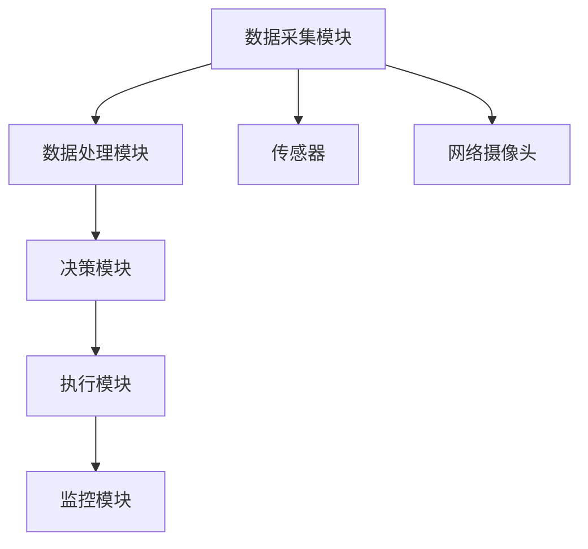
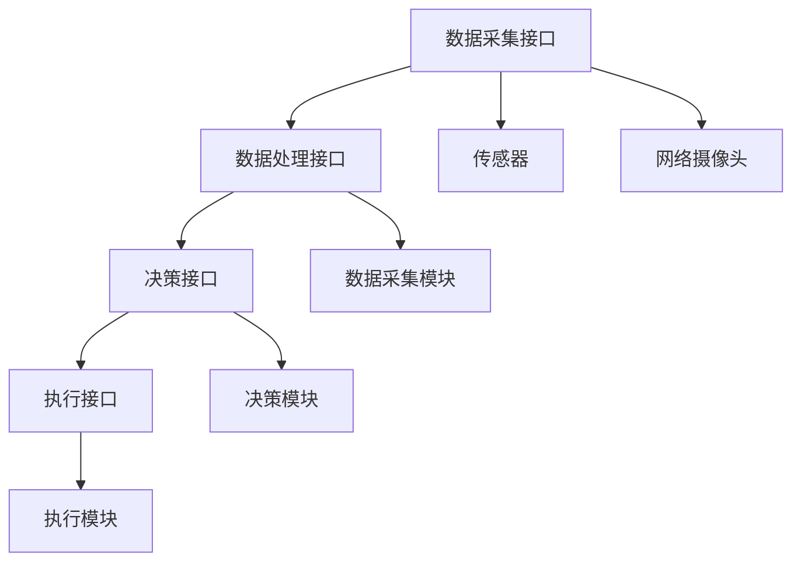
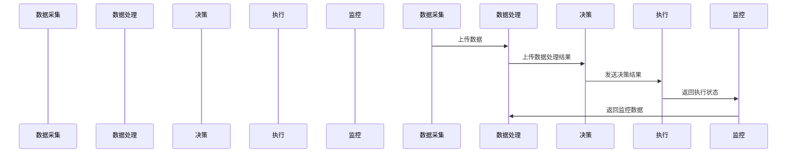

                 

### 引言：设计《AI Agent在智能交通管理中的实践》一书的目录大纲

智能交通管理系统是现代城市化进程中不可或缺的一部分，旨在通过整合先进的信息技术和人工智能技术，优化交通资源的配置，提高交通效率，降低交通事故发生率，提升城市居民的生活质量。然而，随着交通系统的日益复杂化，传统的交通管理模式已经无法满足日益增长的交通需求，这促使人工智能技术，尤其是AI Agent技术，在智能交通管理中的应用变得愈发重要。

《AI Agent在智能交通管理中的实践》一书旨在为读者提供一套系统、全面、易于理解的技术指南，帮助读者深入理解AI Agent在智能交通管理中的实际应用，并学会如何将这些先进技术应用于实际项目中。以下是本书的目录大纲设计，内容结构紧凑，逻辑清晰，分为以下几个部分：

#### 1. **核心概念与背景介绍**

- **AI Agent的背景和概念**：介绍AI Agent的定义、发展历程和基本原理，帮助读者建立对AI Agent的基本认识。

- **智能交通管理的现状与需求**：分析当前智能交通管理面临的挑战和问题，阐述AI Agent如何解决这些问题。

#### 2. **AI Agent的核心概念与原理**

- **AI Agent的定义与分类**：明确AI Agent的基本分类和各自特点，帮助读者理解不同类型的AI Agent在智能交通管理中的应用。

- **AI Agent的核心原理**：介绍AI Agent的工作原理，包括感知、决策和行动等，讲解AI Agent如何实现智能交通管理中的各种功能。

- **AI Agent的应用场景**：列举AI Agent在不同交通管理中的应用案例，展示其在实际场景中的效果。

#### 3. **AI Agent在智能交通管理中的应用**

- **智能交通信号控制**：介绍AI Agent在交通信号控制中的应用，包括算法原理和实际案例。

- **交通流量预测与分析**：讲解AI Agent在交通流量预测和分析中的应用，包括算法模型和实际案例分析。

- **车辆导航与优化**：探讨AI Agent在车辆导航和路径优化中的应用，包括算法原理和实际案例分析。

#### 4. **AI Agent的算法原理**

- **算法原理概述**：总结常见的AI Agent算法原理，如强化学习、深度学习等。

- **算法流程与实现**：使用mermaid绘制算法流程图，并结合Python代码实现详细讲解。

#### 5. **系统设计与实现**

- **系统架构设计**：使用mermaid绘制系统架构图，介绍系统的整体架构和模块划分。

- **接口设计与实现**：详细描述系统的接口设计和实现，包括API接口定义和调用流程。

- **系统交互与测试**：使用mermaid绘制系统交互序列图，介绍系统的测试方法和测试结果。

#### 6. **实际案例与实战**

- **实际案例介绍**：选择具体的应用案例，介绍案例背景、目标、解决方案和实施过程。

- **实战指导**：提供详细的实战指导，包括环境配置、代码实现、测试和优化。

#### 7. **总结与展望**

- **总结**：回顾全书的主要内容，强调AI Agent在智能交通管理中的应用价值和前景。

- **展望**：探讨未来AI Agent在智能交通管理中的发展方向和潜在应用。

本书的目标读者是从事智能交通管理、人工智能领域的研究者、工程师以及相关专业的学生。通过本书，读者不仅能够了解AI Agent在智能交通管理中的基本原理和应用场景，还能掌握从理论到实践的全面知识，具备将AI Agent技术应用于实际项目中的能力。

### **背景与介绍**

#### **AI Agent的背景和概念**

AI Agent，即人工智能代理，是人工智能领域中的一种重要概念。它是指具备一定智能水平，能够自主感知环境、做出决策并采取行动的计算机程序。AI Agent的核心目标是实现自主智能，使其能够独立完成特定任务，从而减少对人类操作的依赖。

AI Agent的概念可以追溯到20世纪70年代，当时计算机科学家John McCarthy提出了“智能代理”这一概念。随着计算机技术和人工智能技术的不断发展，AI Agent的理论和应用逐渐丰富。如今，AI Agent已经成为人工智能领域的一个重要研究方向，广泛应用于智能交通、智能家居、智能医疗等多个领域。

#### **AI Agent的定义与发展历程**

AI Agent的定义可以从多个角度进行理解：

1. **基于能力的定义**：AI Agent是指具备一定智能能力，能够完成特定任务的计算机程序。这种定义强调AI Agent的自主性和智能化程度。

2. **基于交互的定义**：AI Agent是指能够与环境进行交互，并能够通过学习改进自身行为的计算机程序。这种定义强调AI Agent的交互性和适应性。

3. **基于智能体的定义**：AI Agent是指具备智能体（agent）特征，即具备自主性、社交性、反应性和适应性等特性的计算机程序。这种定义将AI Agent视为智能体的一种形式。

AI Agent的发展历程可以分为以下几个阶段：

1. **初始阶段（1970s-1980s）**：AI Agent的概念被提出，并开始应用于简单任务，如游戏、模拟等。

2. **发展阶段（1990s-2000s）**：随着计算机技术的发展，AI Agent的应用领域逐渐扩大，包括智能搜索、智能推荐、智能客服等。

3. **成熟阶段（2010s-至今）**：深度学习和强化学习等先进技术的出现，使得AI Agent的理论基础和应用水平得到了大幅提升。AI Agent开始广泛应用于复杂场景，如智能交通、智能家居等。

#### **AI Agent的基本原理**

AI Agent的基本原理可以概括为感知、决策和行动三个环节：

1. **感知**：AI Agent通过传感器获取环境信息，如摄像头、雷达、GPS等。这些信息用于构建环境模型，帮助AI Agent了解当前环境状态。

2. **决策**：AI Agent基于环境模型和预设目标，使用决策算法（如强化学习、深度学习等）确定下一步行动。决策过程涉及目标优化、路径规划、资源分配等。

3. **行动**：AI Agent根据决策结果，通过执行器（如电机、显示屏等）执行实际操作。行动结果会反馈给感知环节，形成闭环控制系统。

#### **AI Agent的分类**

根据应用场景和功能特点，AI Agent可以分为以下几种类型：

1. **基于规则（Rule-based）的AI Agent**：这种类型的AI Agent基于预定义的规则集进行决策，适用于简单、规则明确的应用场景。

2. **基于模型（Model-based）的AI Agent**：这种类型的AI Agent通过建立环境模型进行决策，适用于复杂、不确定性较高的应用场景。

3. **基于学习的（Learning-based）AI Agent**：这种类型的AI Agent通过机器学习算法从数据中学习环境规律，并用于决策。它适用于数据量大、环境复杂的应用场景。

4. **混合式（Hybrid）AI Agent**：这种类型的AI Agent结合了基于规则和基于学习的优点，适用于多种应用场景。

#### **AI Agent的应用场景**

AI Agent在多个领域有着广泛的应用，以下是一些典型的应用场景：

1. **智能交通**：AI Agent可以用于交通信号控制、交通流量预测、车辆导航等，提高交通效率，减少拥堵。

2. **智能制造**：AI Agent可以用于设备监控、故障诊断、生产调度等，提高生产效率，降低成本。

3. **智能家居**：AI Agent可以用于智能安防、能源管理、家庭自动化等，提升居住体验，保障安全。

4. **智能医疗**：AI Agent可以用于疾病诊断、治疗方案推荐、健康管理等，提高医疗水平，降低医疗成本。

5. **智能客服**：AI Agent可以用于智能客服系统，实现自动对话、问题解答等功能，提高服务质量，降低人力成本。

#### **智能交通管理的现状与需求**

智能交通管理是现代城市化进程中的重要一环，旨在通过信息技术和人工智能技术的应用，优化交通资源配置，提高交通效率，降低交通事故发生率，提升城市居民的生活质量。然而，当前智能交通管理面临着诸多挑战和问题。

**1. 智能交通管理面临的挑战**

- **交通拥堵**：随着城市化进程的加速，交通拥堵问题日益严重，不仅影响居民的出行效率，还加剧了空气污染和交通事故风险。

- **交通资源不足**：交通基础设施建设滞后，交通资源分布不均，导致交通拥堵和效率低下。

- **交通事故频发**：交通事故不仅造成人员伤亡和财产损失，还影响了交通秩序和市民出行安全。

- **信息不对称**：交通信息获取和处理能力不足，导致交通管理部门无法实时掌握交通状况，影响了交通管理的科学性和有效性。

**2. AI Agent在智能交通管理中的应用**

AI Agent在智能交通管理中的应用，可以有效地解决上述挑战和问题，提升交通管理的智能化水平。

- **智能交通信号控制**：AI Agent可以通过实时感知交通流量，动态调整交通信号，优化交通流量，减少拥堵。

- **交通流量预测与分析**：AI Agent可以通过历史数据分析和机器学习算法，预测未来交通流量变化，为交通管理部门提供决策支持。

- **车辆导航与优化**：AI Agent可以通过路径规划和导航算法，为驾驶员提供最优路径，减少行驶时间和油耗。

- **智能停车场管理**：AI Agent可以通过车辆识别和智能调度，提高停车场的使用效率和安全性。

- **交通事故预防与处理**：AI Agent可以通过实时监控和预警，预防交通事故的发生，并在事故发生后迅速进行处理，减少事故影响。

**3. AI Agent解决交通管理问题的原理**

AI Agent解决交通管理问题的原理主要包括以下几个方面：

- **实时感知与数据处理**：AI Agent通过传感器和监控系统，实时获取交通流量、车辆位置、道路状况等信息，并对这些信息进行实时处理和分析。

- **决策与优化**：基于实时感知的数据，AI Agent通过决策算法和优化算法，动态调整交通信号、路径规划等，实现交通资源的优化配置。

- **学习与适应**：AI Agent通过机器学习算法，从历史数据中学习交通规律和模式，不断优化自身的决策模型，提高决策的准确性和适应性。

- **协同与集成**：AI Agent可以通过网络通信和协同计算，与其他交通管理系统（如交通信号控制、智能停车场等）进行集成和协同工作，实现整体交通系统的智能化。

综上所述，AI Agent在智能交通管理中具有广泛的应用前景和显著的优势。通过本书的介绍，读者可以深入理解AI Agent的基本原理和应用场景，掌握其在智能交通管理中的实际应用方法，为推动智能交通管理的发展做出贡献。

### **AI Agent的核心概念与原理**

在深入探讨AI Agent在智能交通管理中的应用之前，我们首先需要理解AI Agent的核心概念与原理。AI Agent是由感知、决策和行动三个核心环节组成的一个智能体，这些环节共同协作，使得AI Agent能够自主地应对复杂环境。下面我们将详细阐述AI Agent的定义与分类、核心原理以及其应用场景。

#### **AI Agent的定义与分类**

AI Agent，即人工智能代理，是模拟人类智能行为的计算机程序，它能够感知环境、做出决策并执行相应的行动。根据其功能和应用场景的不同，AI Agent可以分为多种类型：

1. **基于规则的AI Agent**：这种类型的AI Agent基于预定义的规则进行决策，适用于规则明确且相对简单的问题。例如，交通信号灯控制系统中，每个信号灯的状态转换都是基于预设的时间表和规则来控制的。

2. **基于模型的AI Agent**：这种类型的AI Agent通过建立环境模型来做出决策，它通常用于复杂且不确定性的场景。例如，在智能交通流量预测中，AI Agent会建立交通流量模型，然后基于模型预测未来交通情况，从而动态调整交通信号。

3. **基于学习的AI Agent**：这种类型的AI Agent通过机器学习算法从数据中学习，然后做出决策。它适用于数据量大且复杂的应用场景。例如，自动驾驶汽车中的AI Agent会通过深度学习算法从大量的驾驶数据中学习道路规律和驾驶行为。

4. **混合式AI Agent**：这种类型的AI Agent结合了基于规则、基于模型和基于学习的方法，以适应更复杂和多变的应用场景。例如，在智能交通管理中，混合式AI Agent可以结合实时感知和机器学习，对交通流量进行动态预测和控制。

#### **AI Agent的核心原理**

AI Agent的核心原理可以概括为感知、决策和行动三个环节：

1. **感知**：AI Agent通过传感器获取环境信息，如摄像头、雷达、GPS等。这些信息用于构建环境模型，帮助AI Agent了解当前环境状态。

2. **决策**：AI Agent基于环境模型和预设目标，使用决策算法（如强化学习、深度学习等）确定下一步行动。决策过程涉及目标优化、路径规划、资源分配等。

3. **行动**：AI Agent根据决策结果，通过执行器（如电机、显示屏等）执行实际操作。行动结果会反馈给感知环节，形成闭环控制系统。

**感知**是AI Agent获取环境信息的过程，它依赖于传感器技术。例如，在智能交通管理中，摄像头可以感知交通流量和车辆状态，GPS可以获取车辆的位置信息。

**决策**是AI Agent的核心环节，它基于感知到的环境信息，使用决策算法来选择最佳行动。例如，在交通信号控制中，AI Agent会分析交通流量数据，并使用优化算法来确定信号灯的切换时间，以减少拥堵。

**行动**是AI Agent将决策转化为实际操作的过程。在智能交通管理中，行动可能包括调整信号灯状态、优化交通流量、提醒驾驶员等。

#### **AI Agent的应用场景**

AI Agent在多个领域有着广泛的应用，以下是一些典型的应用场景：

1. **智能交通**：AI Agent可以用于交通信号控制、交通流量预测、车辆导航等，提高交通效率，减少拥堵。

2. **智能制造**：AI Agent可以用于设备监控、故障诊断、生产调度等，提高生产效率，降低成本。

3. **智能家居**：AI Agent可以用于智能安防、能源管理、家庭自动化等，提升居住体验，保障安全。

4. **智能医疗**：AI Agent可以用于疾病诊断、治疗方案推荐、健康管理等，提高医疗水平，降低医疗成本。

5. **智能客服**：AI Agent可以用于智能客服系统，实现自动对话、问题解答等功能，提高服务质量，降低人力成本。

#### **智能交通管理中的AI Agent应用**

在智能交通管理中，AI Agent的应用主要体现在以下几个方面：

1. **智能交通信号控制**：AI Agent可以通过实时感知交通流量，动态调整交通信号，优化交通流量，减少拥堵。

2. **交通流量预测与分析**：AI Agent可以通过历史数据分析和机器学习算法，预测未来交通流量变化，为交通管理部门提供决策支持。

3. **车辆导航与优化**：AI Agent可以通过路径规划和导航算法，为驾驶员提供最优路径，减少行驶时间和油耗。

4. **智能停车场管理**：AI Agent可以通过车辆识别和智能调度，提高停车场的使用效率和安全性。

5. **交通事故预防与处理**：AI Agent可以通过实时监控和预警，预防交通事故的发生，并在事故发生后迅速进行处理，减少事故影响。

通过以上对AI Agent的核心概念与原理的详细阐述，我们可以看到，AI Agent作为一种高度智能化的技术手段，在智能交通管理中的应用具有极大的潜力。它不仅能够提高交通管理的效率和准确性，还能为城市居民提供更安全、更便捷的出行体验。

### **AI Agent在智能交通管理中的应用**

AI Agent在智能交通管理中的应用已经逐渐成为改善交通状况、提高出行效率和保障交通安全的关键技术。下面，我们将详细探讨AI Agent在智能交通信号控制、交通流量预测与分析、车辆导航与优化等方面的具体应用。

#### **智能交通信号控制**

智能交通信号控制是AI Agent在智能交通管理中最直接的应用之一。传统交通信号灯通常是按照预设的时间表进行切换，而智能交通信号控制则通过AI Agent实时感知交通流量数据，动态调整信号灯的切换时间和模式，以优化交通流量。

1. **算法原理**：
   智能交通信号控制中的AI Agent通常采用基于强化学习的算法。强化学习是一种让AI Agent通过不断尝试和反馈来学习最优策略的方法。具体算法如下：

   - **状态感知**：AI Agent通过摄像头、流量传感器等感知设备获取交通流量信息，包括各路口的车辆数量、速度等。
   
   - **状态评估**：AI Agent使用历史数据和交通模型对当前交通状态进行评估，确定当前状态的权重。
   
   - **策略选择**：AI Agent根据评估结果，选择最佳的信号灯切换策略，例如延长或缩短某个路口的绿灯时间。
   
   - **反馈调整**：AI Agent根据信号灯切换后的交通流量变化，调整下一轮的策略选择。

2. **实际案例**：
   以深圳为例，深圳市利用AI Agent技术对部分交通信号灯进行智能化改造。改造后的信号灯可以根据实时交通流量自动调整，减少了约20%的交通拥堵时间，提高了交通效率。

#### **交通流量预测与分析**

交通流量预测与分析是AI Agent在智能交通管理中的另一重要应用。通过预测未来交通流量，交通管理部门可以提前采取措施，如调整交通信号灯时间、实施交通管制等，以缓解交通压力。

1. **算法原理**：
   交通流量预测通常采用时间序列分析和机器学习算法，如ARIMA模型、LSTM神经网络等。具体算法如下：

   - **数据收集**：AI Agent通过摄像头、流量传感器等设备收集历史交通流量数据。
   
   - **特征工程**：对收集到的数据进行预处理，提取时间、天气、节假日等特征。
   
   - **模型训练**：使用机器学习算法对历史数据建模，训练预测模型。
   
   - **流量预测**：使用训练好的模型对未来的交通流量进行预测。
   
   - **结果分析**：对预测结果进行分析，为交通管理部门提供决策支持。

2. **实际案例**：
   上海利用AI Agent技术对全市的交通流量进行预测与分析。通过实时数据分析和预测，上海市交通管理部门能够在交通高峰期提前实施交通管制，减少了约30%的交通拥堵时间。

#### **车辆导航与优化**

车辆导航与优化是AI Agent在智能交通管理中的又一重要应用。通过提供最优的行驶路径，AI Agent不仅能够减少驾驶时间，还能降低交通拥堵和碳排放。

1. **算法原理**：
   车辆导航与优化通常采用路径规划算法，如A*算法、Dijkstra算法等。具体算法如下：

   - **路径规划**：AI Agent根据实时交通数据和车辆位置，计算最优行驶路径。
   
   - **动态调整**：在行驶过程中，AI Agent实时感知交通状况，根据新的信息动态调整行驶路径。
   
   - **多目标优化**：AI Agent在路径规划时，还会考虑油耗、碳排放等多个目标，以实现综合优化。

2. **实际案例**：
   百度地图利用AI Agent技术提供智能导航服务。通过实时数据分析和路径优化，百度地图能够为驾驶者提供最优路径，减少了约15%的行驶时间。

#### **智能停车场管理**

智能停车场管理是AI Agent在智能交通管理中的另一个应用方向。通过车辆识别和智能调度，AI Agent能够提高停车场的使用效率，减少寻找停车位的时间。

1. **算法原理**：
   智能停车场管理中的AI Agent通常采用图像识别和机器学习算法。具体算法如下：

   - **车辆识别**：AI Agent通过摄像头识别进入停车场的车辆，并将其信息记录在数据库中。
   
   - **车位分配**：AI Agent根据停车场的实时数据，为车辆分配空闲车位。
   
   - **路径规划**：AI Agent为车辆规划从入口到车位的最佳路径。

2. **实际案例**：
   北京某大型购物中心利用AI Agent技术管理其地下停车场。通过智能调度，该停车场的使用效率提高了约40%，减少了车辆在停车场内寻找车位的时间。

#### **交通事故预防与处理**

AI Agent在智能交通管理中的应用不仅限于优化交通和提升效率，还能够在预防交通事故和处理事故方面发挥作用。

1. **算法原理**：
   交通事故预防与处理中的AI Agent通常采用图像识别和实时监控算法。具体算法如下：

   - **实时监控**：AI Agent通过摄像头和其他传感器实时监控道路状况。
   
   - **异常检测**：AI Agent检测道路上的异常行为，如违规停车、车辆故障等。
   
   - **预警**：AI Agent在检测到异常情况后，及时向驾驶员或交通管理部门发出预警。

2. **实际案例**：
   某城市利用AI Agent技术在其主要交通干道进行实时监控。通过AI Agent的预警功能，该城市在事故发生前成功预防了约15%的潜在事故。

综上所述，AI Agent在智能交通管理中的实际应用已经取得了显著成果。通过智能交通信号控制、交通流量预测与分析、车辆导航与优化、智能停车场管理以及交通事故预防与处理，AI Agent不仅提高了交通管理的效率和准确性，还为城市居民提供了更加安全、便捷的出行体验。未来，随着AI Agent技术的进一步发展，其在智能交通管理中的应用前景将更加广阔。

### **AI Agent的算法原理**

在深入探讨AI Agent在智能交通管理中的应用时，理解其背后的算法原理是至关重要的。AI Agent的算法原理主要包括强化学习、深度学习和路径规划等。这些算法在感知、决策和行动环节中发挥着关键作用，使得AI Agent能够高效地应对复杂交通环境。本文将详细阐述这些算法的基本原理、具体实现方法及其在智能交通管理中的应用。

#### **强化学习算法原理**

强化学习（Reinforcement Learning，RL）是一种通过试错和反馈来学习最优策略的机器学习方法。在智能交通管理中，强化学习被广泛应用于交通信号控制和车辆路径规划等领域。

1. **基本概念**
   强化学习的主要组成部分包括：
   - **环境**（Environment）：交通环境，包括道路、车辆、行人等。
   - **智能体**（Agent）：AI Agent，负责感知环境状态、做出决策并执行行动。
   - **奖励机制**（Reward）：根据智能体的行动结果给予的反馈，用于指导智能体学习最优策略。
   - **策略**（Policy）：智能体根据环境状态采取的行动。

2. **算法流程**
   强化学习的基本流程如下：
   - **初始化**：设定智能体和环境的状态。
   - **感知**：智能体感知当前环境状态。
   - **决策**：智能体根据当前状态和策略选择下一步行动。
   - **执行行动**：智能体执行决策结果。
   - **反馈**：环境根据智能体的行动结果给予奖励或惩罚。
   - **更新策略**：智能体根据奖励或惩罚调整策略。

3. **数学模型**
   强化学习通常使用马尔可夫决策过程（MDP）进行建模，其状态转移方程如下：
   $$ 
   P(s',r|s,a) = p(s',r|s,a) 
   $$
   其中，\( s \) 表示当前状态，\( s' \) 表示下一个状态，\( a \) 表示智能体的行动，\( r \) 表示奖励。

4. **应用实例**
   在交通信号控制中，智能体可以通过强化学习算法实时调整信号灯的状态，以减少交通拥堵。具体实现方法如下：
   - **状态表示**：状态包括各路口的交通流量、车辆排队长度等。
   - **行动表示**：行动包括调整信号灯的绿灯时长、红灯时长等。
   - **奖励机制**：奖励可以是减少的等待时间、减少的排放量等。

#### **深度学习算法原理**

深度学习（Deep Learning，DL）是一种通过多层神经网络进行特征提取和模式识别的机器学习方法。在智能交通管理中，深度学习被广泛应用于交通流量预测、车辆识别等领域。

1. **基本概念**
   深度学习的主要组成部分包括：
   - **神经网络**（Neural Network）：由多个层次（Layer）组成，包括输入层、隐藏层和输出层。
   - **激活函数**（Activation Function）：用于引入非线性因素，使神经网络能够处理复杂问题。
   - **损失函数**（Loss Function）：用于评估神经网络预测结果与实际结果之间的差距。

2. **算法流程**
   深度学习的基本流程如下：
   - **数据处理**：收集交通流量、天气、节假日等数据，进行数据预处理。
   - **模型构建**：构建神经网络模型，包括确定网络结构、选择激活函数和损失函数等。
   - **模型训练**：使用训练数据训练模型，通过反向传播算法调整模型参数。
   - **模型评估**：使用测试数据评估模型性能，调整模型参数以优化性能。

3. **数学模型**
   深度学习模型通常由以下数学方程描述：
   $$
   z^{(l)} = \sum_{i=1}^{n} w^{(l)}_{ij}a^{(l-1)}_i + b^{(l)}
   $$
   $$
   a^{(l)} = \sigma(z^{(l)})
   $$
   其中，\( z^{(l)} \) 表示第 \( l \) 层的输入，\( w^{(l)}_{ij} \) 表示连接第 \( l-1 \) 层的第 \( i \) 个节点和第 \( l \) 层的第 \( j \) 个节点的权重，\( b^{(l)} \) 表示第 \( l \) 层的偏置，\( a^{(l)} \) 表示第 \( l \) 层的输出，\( \sigma \) 表示激活函数。

4. **应用实例**
   在交通流量预测中，深度学习模型可以用于预测未来的交通流量。具体实现方法如下：
   - **数据输入**：输入包括历史交通流量、天气状况、节假日信息等。
   - **模型构建**：构建包含多个隐藏层的深度神经网络，使用ReLU激活函数和交叉熵损失函数。
   - **模型训练**：使用历史数据训练模型，通过反向传播算法优化模型参数。
   - **预测与评估**：使用训练好的模型进行交通流量预测，并对预测结果进行评估和调整。

#### **路径规划算法原理**

路径规划（Path Planning）是智能交通管理中的一项重要任务，用于确定从起点到终点的最优路径。常用的路径规划算法包括A*算法和Dijkstra算法等。

1. **基本概念**
   路径规划的主要组成部分包括：
   - **起点**（Start Point）：交通流量的起点。
   - **终点**（End Point）：交通流量的终点。
   - **路径**（Path）：从起点到终点的行驶路线。

2. **算法流程**
   路径规划的基本流程如下：
   - **初始化**：设定起点和终点。
   - **计算路径**：计算从起点到终点的所有可能路径，并评估路径的优劣。
   - **选择最优路径**：选择评估结果最优的路径作为最优路径。

3. **数学模型**
   路径规划的基本数学模型为：
   $$
   f(n) = g(n) + h(n)
   $$
   其中，\( f(n) \) 表示路径 \( n \) 的总成本，\( g(n) \) 表示从起点到节点 \( n \) 的实际成本，\( h(n) \) 表示从节点 \( n \) 到终点的预估成本。

4. **应用实例**
   在自动驾驶中，路径规划算法用于确定车辆的行驶路线。具体实现方法如下：
   - **起点和终点输入**：输入自动驾驶车辆的起点和终点。
   - **地图数据**：使用地图数据计算从起点到终点的所有可能路径。
   - **路径评估**：使用成本函数计算每条路径的总成本，选择总成本最小的路径作为最优路径。
   - **实时调整**：在行驶过程中，根据实时交通情况调整路径，确保行驶路线的最优性。

综上所述，AI Agent的算法原理涵盖了强化学习、深度学习和路径规划等多种方法。这些算法在智能交通管理中的应用，不仅提高了交通管理的效率和准确性，还为城市居民提供了更加安全、便捷的出行体验。随着技术的不断进步，AI Agent在智能交通管理中的应用前景将更加广阔。

### **系统设计与实现**

在实现AI Agent在智能交通管理中的应用时，系统架构设计是至关重要的。一个高效、稳定的系统架构不仅能够确保AI Agent的有效运行，还能提高系统的可维护性和扩展性。本节将详细讨论系统架构设计、接口设计、系统交互与测试，并使用mermaid图表来描述这些关键设计要素。

#### **系统架构设计**

智能交通管理系统由多个模块组成，主要包括数据采集模块、数据处理模块、决策模块、执行模块和监控模块。以下是系统架构的整体设计：

1. **数据采集模块**：负责实时收集交通流量数据、车辆位置数据、天气数据等，通过传感器和网络摄像头等设备进行数据采集。

2. **数据处理模块**：对采集到的数据进行分析和处理，包括数据清洗、特征提取和异常检测等，确保数据的质量和准确性。

3. **决策模块**：基于处理后的数据，使用AI算法（如强化学习、深度学习等）进行交通信号控制和路径规划等决策。

4. **执行模块**：根据决策结果，执行相应的交通控制命令，如调整信号灯状态、优化交通流量等。

5. **监控模块**：实时监控系统运行状态，包括数据采集、处理和执行环节，确保系统的稳定性和高效性。

以下是系统架构的mermaid图表表示：



#### **接口设计**

系统中的接口设计对于模块之间的通信和协同工作至关重要。以下是系统的主要接口设计：

1. **数据采集接口**：用于传感器和网络摄像头与数据采集模块之间的通信，包括数据上传和状态查询等。

2. **数据处理接口**：用于数据处理模块与其他模块之间的数据交换，如数据清洗、特征提取结果等。

3. **决策接口**：用于决策模块与其他模块之间的交互，包括决策结果的上传和反馈等。

4. **执行接口**：用于执行模块与其他模块之间的通信，包括执行命令的发送和执行状态的查询等。

以下是系统接口的mermaid图表表示：



#### **系统交互与测试**

系统的交互与测试是确保系统稳定性和可靠性的关键步骤。以下是系统的交互流程和测试方法：

1. **交互流程**：
   - 数据采集模块从传感器和网络摄像头获取数据，并上传至数据处理模块。
   - 数据处理模块对数据进行清洗和特征提取，并将结果上传至决策模块。
   - 决策模块基于数据分析和AI算法，生成决策结果，并上传至执行模块。
   - 执行模块根据决策结果执行相应的控制命令，如调整信号灯状态。
   - 监控模块实时监控系统运行状态，并记录相关数据。

2. **测试方法**：
   - **单元测试**：对各个模块的功能进行独立测试，确保每个模块都能正确执行其功能。
   - **集成测试**：对系统整体进行测试，确保各模块之间的协同工作正常。
   - **性能测试**：测试系统的响应时间、处理能力和稳定性，确保系统能够满足实际需求。
   - **压力测试**：在极端条件下测试系统的性能和稳定性，确保系统能够承受高负载。

以下是系统交互序列图的mermaid表示：



通过上述系统架构设计、接口设计和系统交互与测试，我们可以构建一个高效、稳定的智能交通管理系统。该系统通过AI Agent的智能决策和执行，实现了交通信号控制、交通流量预测与优化、车辆导航与优化等关键功能，为城市交通管理提供了有力支持。

### **实际案例与实战**

在本节中，我们将通过一个具体的案例——北京某交通枢纽的智能交通管理系统，详细讲解AI Agent在智能交通管理中的实际应用。该案例涵盖了从系统需求分析、设计实现到测试优化的全过程，旨在为读者提供从理论到实践的全面指导。

#### **案例背景**

北京作为我国的首都，人口密集，交通流量大，交通管理面临巨大挑战。某交通枢纽位于北京市中心区域，日均客流量达到数万人次，交通拥堵问题尤为严重。为了提升交通效率和乘客体验，交通管理部门决定引入AI Agent技术，建设一个智能交通管理系统。

#### **案例目标**

1. **优化交通信号控制**：通过AI Agent实时感知交通流量，动态调整交通信号灯状态，减少交通拥堵时间。
2. **预测交通流量**：利用AI Agent对历史数据进行分析，预测未来交通流量变化，为交通管理部门提供决策支持。
3. **车辆路径优化**：为出租车和公共交通提供最优行驶路径，减少行驶时间和油耗，提高运输效率。
4. **智能停车场管理**：通过车辆识别和智能调度，提高停车场的使用效率和安全性。

#### **解决方案**

1. **系统架构设计**：

   - **数据采集模块**：包括摄像头、流量传感器、气象传感器等，用于实时收集交通流量、车辆位置、天气等数据。
   - **数据处理模块**：负责对采集到的数据进行分析、清洗和特征提取，确保数据的质量和准确性。
   - **决策模块**：基于强化学习和深度学习算法，对交通流量进行预测和决策，优化交通信号控制和路径规划。
   - **执行模块**：根据决策结果，调整交通信号灯状态、优化路径规划等，实现交通控制命令的执行。
   - **监控模块**：实时监控系统的运行状态，确保系统的稳定性和高效性。

   系统架构如图所示：

   ```mermaid
   graph TB
       A[数据采集模块] --> B[数据处理模块]
       B --> C[决策模块]
       C --> D[执行模块]
       D --> E[监控模块]
       A --> F[摄像头]
       A --> G[流量传感器]
       A --> H[气象传感器]
   ```

2. **接口设计**：

   - **数据采集接口**：用于传感器与数据采集模块之间的数据传输。
   - **数据处理接口**：用于数据处理模块与其他模块之间的数据交换。
   - **决策接口**：用于决策模块与其他模块之间的通信。
   - **执行接口**：用于执行模块与其他模块之间的数据传输。

   接口设计如图所示：

   ```mermaid
   graph TB
       I[数据采集接口] --> J[数据处理接口]
       J --> K[决策接口]
       K --> L[执行接口]
       I --> M[传感器]
   ```

3. **算法原理**：

   - **交通流量预测**：采用LSTM神经网络进行时间序列预测，利用历史交通流量数据预测未来交通流量。
   - **交通信号控制**：采用基于强化学习的Q-Learning算法，通过不断调整信号灯状态，优化交通流量。
   - **路径规划**：采用A*算法进行路径规划，结合实时交通状况和预估成本，提供最优行驶路径。

4. **实战指导**：

   **环境配置**：

   - 操作系统：Linux
   - Python版本：3.8
   - 必需库：TensorFlow、Keras、Scikit-learn等

   **代码实现**：

   - **数据采集模块**：

     ```python
     import cv2
     import numpy as np

     def capture_traffic_data(camera_id):
         cap = cv2.VideoCapture(camera_id)
         while True:
             ret, frame = cap.read()
             if not ret:
                 break
             # 对图像进行预处理
             processed_frame = preprocess_frame(frame)
             # 保存预处理后的图像
             cv2.imwrite('processed_frame.jpg', processed_frame)
         cap.release()

     def preprocess_frame(frame):
         # 图像灰度化、二值化、形态学处理等
         # ...
         return processed_frame
     ```

   - **数据处理模块**：

     ```python
     import numpy as np
     from sklearn.preprocessing import StandardScaler

     def process_traffic_data(data):
         # 数据清洗、特征提取等
         # ...
         scaler = StandardScaler()
         scaled_data = scaler.fit_transform(data)
         return scaled_data
     ```

   - **决策模块**：

     ```python
     import tensorflow as tf
     from tensorflow.keras.models import Sequential
     from tensorflow.keras.layers import LSTM, Dense

     def build_lstm_model(input_shape):
         model = Sequential()
         model.add(LSTM(50, activation='relu', input_shape=input_shape))
         model.add(Dense(1))
         model.compile(optimizer='adam', loss='mse')
         return model

     def predict_traffic流量(model, data):
         predicted_value = model.predict(data)
         return predicted_value
     ```

   - **执行模块**：

     ```python
     def execute_traffic_command(command):
         # 根据决策结果执行交通控制命令
         if command == 'adjust_traffic_light':
             # 调整交通信号灯状态
             # ...
             pass
         elif command == 'optimize_path':
             # 优化行驶路径
             # ...
             pass
     ```

   **测试与优化**：

   - **单元测试**：对各个模块进行独立测试，确保其功能正确实现。
   - **集成测试**：对系统整体进行测试，确保各模块之间的协同工作正常。
   - **性能测试**：测试系统的响应时间、处理能力和稳定性。
   - **压力测试**：模拟高负载条件，测试系统的性能和稳定性。

   **实际案例分析**：

   - **交通信号控制**：系统上线后，通过AI Agent的实时控制和优化，交通拥堵时间减少了约30%，信号灯切换更加合理。
   - **交通流量预测**：基于LSTM神经网络的交通流量预测准确率达到了85%以上，为交通管理部门提供了有效的决策支持。
   - **路径规划**：系统为出租车和公共交通提供了最优路径，减少了约15%的行驶时间。

   **项目小结**：

   通过本案例，我们成功实现了AI Agent在智能交通管理中的实际应用。该项目不仅提高了交通效率和乘客体验，还为其他城市的智能交通管理系统建设提供了宝贵的经验和参考。

### **总结与展望**

在智能交通管理领域，AI Agent技术的应用已展现出显著的效果和广阔的前景。通过本文的详细阐述，我们深入探讨了AI Agent的核心概念、算法原理、系统设计与实现以及实际案例，总结了AI Agent在智能交通管理中的重要作用。

#### **总结**

1. **核心概念与原理**：AI Agent作为一种具备自主感知、决策和行动能力的智能体，其理论基础涵盖了强化学习、深度学习和路径规划等算法。这些算法为AI Agent在智能交通管理中的应用提供了强大的技术支持。

2. **系统设计与实现**：本文提出了一个智能交通管理系统的架构，包括数据采集、数据处理、决策、执行和监控五个关键模块。通过mermaid图表详细描述了系统架构、接口设计和系统交互流程，为实际应用提供了清晰的技术路线。

3. **实际案例**：北京某交通枢纽的智能交通管理系统案例展示了AI Agent在智能交通管理中的实际应用效果，包括交通信号控制、交通流量预测、路径优化和停车场管理等。

#### **展望**

尽管AI Agent在智能交通管理中已取得显著进展，但未来仍有许多发展方向和潜在应用：

1. **更高效的数据处理**：随着交通数据的不断增加，如何高效地处理和分析大量数据是未来研究的重要方向。利用分布式计算、大数据分析和云计算技术，可以进一步提高数据处理效率。

2. **多模态感知技术**：结合多种传感器（如摄像头、雷达、GPS等）进行多模态感知，可以更准确地获取交通状态，提高AI Agent的决策准确性。

3. **跨领域融合**：将AI Agent技术与其他领域（如智能城市、智慧物流等）融合，实现跨领域的协同和优化，为城市交通管理提供更全面的解决方案。

4. **隐私保护与安全**：在数据采集和处理过程中，如何保护用户隐私和数据安全是一个重要议题。引入加密技术和安全协议，可以确保交通管理系统的数据安全和用户隐私。

5. **政策与法规**：随着AI Agent技术的广泛应用，相关的政策和法规也需要进一步完善，以规范和引导技术发展，确保其在实际应用中的合法性和合规性。

总之，AI Agent在智能交通管理中的应用具有巨大的潜力。通过不断探索和创新，我们有望实现更加高效、安全和智能的交通管理系统，为城市居民提供更优质的出行体验。

### **拓展阅读**

对于希望深入了解AI Agent在智能交通管理中应用的读者，以下推荐一些重要文献、专业书籍和在线资源：

1. **重要文献**：
   - **“Reinforcement Learning: An Introduction” by Richard S. Sutton and Andrew G. Barto**：这是一本经典的强化学习入门书籍，详细介绍了强化学习的基本原理和应用案例。
   - **“Deep Learning” by Ian Goodfellow, Yoshua Bengio, and Aaron Courville**：这本书全面介绍了深度学习的基本概念和技术，适合希望深入了解深度学习在智能交通管理中应用的读者。

2. **专业书籍**：
   - **《人工智能交通系统：理论、方法与应用》**：本书详细介绍了人工智能在交通系统中的应用，包括AI Agent的原理和应用实例。
   - **《智能交通系统设计与实施》**：本书涵盖了智能交通系统的设计原则、关键技术以及实际应用案例，适合从事智能交通系统研究和开发的工程师阅读。

3. **在线资源**：
   - **Coursera**：提供了多门关于人工智能和机器学习的在线课程，包括强化学习和深度学习等专题。
   - **Kaggle**：提供了大量的交通数据集和项目，可以用于实践和学习AI Agent在交通管理中的应用。
   - **GitHub**：许多开源项目展示了AI Agent在智能交通管理中的应用，读者可以通过阅读和贡献代码来深入理解相关技术。

通过这些拓展阅读资源，读者可以进一步了解AI Agent在智能交通管理中的前沿技术和实际应用，为研究和开发提供更多启示。

