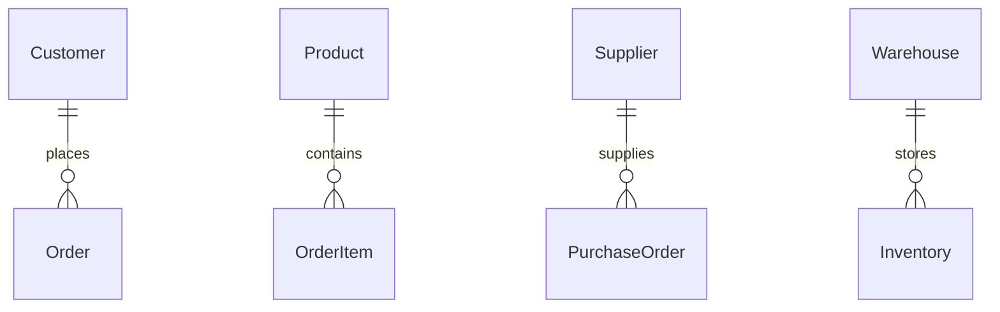
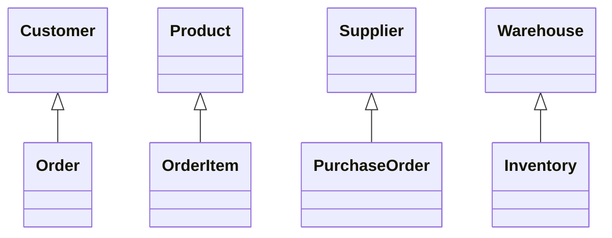
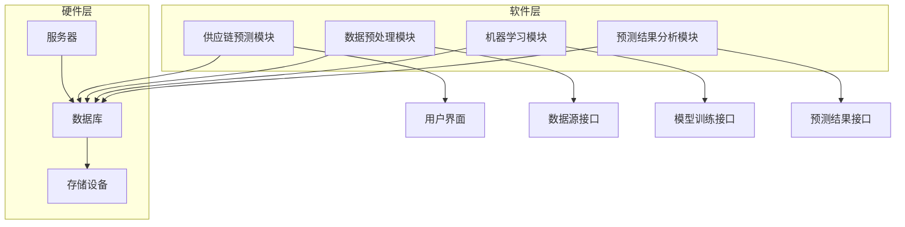
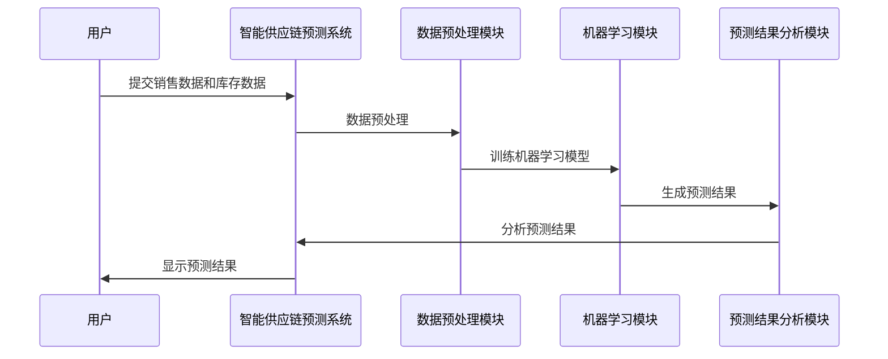
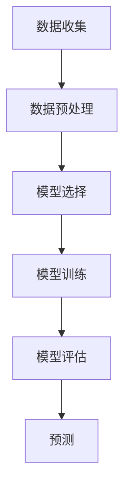

                 


## AI Agent in the Application of Intelligent Supply Chain Prediction

### Keywords
- AI Agents
- Intelligent Supply Chain Prediction
- Machine Learning
- Data Analysis
- Optimization

### Abstract
This article delves into the application of AI agents in the realm of intelligent supply chain prediction. We will explore the fundamental concepts of AI agents, their types, and the principles behind supply chain prediction. The article will also cover the role of data collection and preprocessing in the process. We will discuss the implementation of AI agents in forecasting scenarios, optimization techniques, and the challenges faced in their implementation. Finally, we will outline future directions and potential advancements in this field.

## Part 1: Introduction to AI Agents and Supply Chain Prediction

### 1.1 Overview of AI Agents and Supply Chain Prediction

#### Definition and Importance

AI agents are software entities designed to perform tasks autonomously based on their environment and predefined goals. They can perceive their surroundings through sensors, act on their environment through actuators, and learn from their experiences to improve their performance over time. In the context of supply chain prediction, AI agents are employed to forecast demand, optimize inventory levels, and manage logistics efficiently.

Supply chain prediction involves the use of historical data and advanced analytical techniques to forecast future supply chain events. This prediction is crucial for ensuring the smooth operation of supply chains, minimizing costs, and maximizing profits. Accurate supply chain predictions enable businesses to anticipate market trends, manage risks, and make informed decisions.

#### Problem Description

The primary challenge in supply chain prediction is the complexity and variability of data. Supply chains are influenced by numerous factors, including demand fluctuations, supplier reliability, transportation delays, and global economic conditions. These factors make it difficult to predict future events with high accuracy.

To address this challenge, we need to design AI agents that can learn from historical data, adapt to changing conditions, and make accurate predictions. The success of these agents depends on their ability to process large volumes of data, identify patterns, and generate meaningful insights.

#### Problem Solution

The solution to this problem involves the following steps:

1. **Data Collection**: Collect historical data related to supply chain activities, including demand patterns, inventory levels, supplier performance, and transportation data.
2. **Data Preprocessing**: Clean and preprocess the data to remove noise, outliers, and inconsistencies. This step is crucial for ensuring the quality of the input data.
3. **Feature Engineering**: Identify relevant features that can influence supply chain predictions. Features can include time-based patterns, seasonal variations, and external factors such as economic indicators.
4. **Model Selection**: Select appropriate machine learning algorithms for building predictive models. Common algorithms include linear regression, decision trees, and neural networks.
5. **Model Training and Evaluation**: Train the selected models using the preprocessed data and evaluate their performance using metrics such as mean squared error (MSE) and mean absolute error (MAE).
6. **Deployment**: Deploy the trained models in real-time applications to make predictions and support decision-making processes.

### Boundary and Extension

The boundary of this article focuses on the application of AI agents in supply chain prediction. However, the principles discussed can be extended to other domains such as finance, healthcare, and manufacturing. The extension of AI agents to these domains can lead to significant improvements in efficiency and decision-making processes.

## Part 2: Foundations of AI Agents

### 2.1 Types of AI Agents

AI agents can be classified based on their capabilities and the environment in which they operate. The main types of AI agents include:

1. **Reactive Agents**: These agents react to specific stimuli in their environment without any memory or learning capability. Examples include automated robots and basic sensor-based systems.
2. **Model-Based Agents**: These agents use a model of their environment to make decisions. They can plan and predict the consequences of their actions based on this model. Examples include autonomous vehicles and game-playing AI.
3. **Goal-Based Agents**: These agents have a set of goals they strive to achieve. They use planning algorithms to determine the best sequence of actions to achieve these goals. Examples include personal assistants like Siri and Alexa.
4. **Learning Agents**: These agents learn from their experiences and improve their performance over time. They can adapt to changing environments and make better decisions based on historical data. Examples include recommendation systems and predictive models.

### 2.2 Characteristics and Basic Architectures

AI agents possess several key characteristics:

1. **Autonomy**: They can operate independently without human intervention.
2. **适应性**: They can adapt to changing conditions and environments.
3. **反应性**: They can respond to stimuli and take appropriate actions.
4. **自学习能力**: They can learn from their experiences and improve their performance over time.

The basic architecture of AI agents typically includes the following components:

1. **感知器（Perception）**: These are sensors that collect information about the environment.
2. **知识库（Knowledge Base）**: This is a repository of information that the agent uses to make decisions.
3. **推理机（Reasoning Engine）**: This component processes the information from the perception module and the knowledge base to generate actions.
4. **执行器（Actuators）**: These are devices that execute the actions generated by the reasoning engine.

### 2.3 Example: AI Agent in Supply Chain Prediction

An AI agent designed for supply chain prediction would use historical demand data, inventory levels, and supplier performance to make predictions. The agent would follow these steps:

1. **Perception**: The agent collects data on demand patterns, inventory levels, and supplier performance.
2. **Knowledge Base**: The agent stores this data in a knowledge base along with any relevant historical trends and patterns.
3. **Reasoning Engine**: The agent uses machine learning algorithms and statistical models to analyze the data and identify patterns.
4. **Actuators**: The agent generates recommendations for inventory management, production planning, and supplier selection based on its predictions.

## Part 3: Principles of Supply Chain Prediction

### 3.1 Statistical Methods

Statistical methods are widely used in supply chain prediction to analyze historical data and forecast future events. The most common statistical methods include:

1. **Time Series Analysis**: This method analyzes data collected over time to identify patterns and trends. Techniques such as moving averages, exponential smoothing, and ARIMA models are commonly used.
2. **Regression Analysis**: This method examines the relationship between a dependent variable (e.g., demand) and one or more independent variables (e.g., price, seasonality). Linear and multiple regression models are commonly used.
3. **Survival Analysis**: This method is used to predict the time until a specific event occurs (e.g., product obsolescence, supplier failure). Techniques such as Kaplan-Meier curves and Cox proportional hazards models are commonly used.

### 3.2 Machine Learning Algorithms

Machine learning algorithms are increasingly used in supply chain prediction due to their ability to learn from historical data and make accurate predictions. The most common machine learning algorithms include:

1. **Linear Regression**: This algorithm models the relationship between a dependent variable and one or more independent variables using a linear equation. It is a simple yet powerful algorithm for predicting continuous values.
2. **Decision Trees**: This algorithm creates a tree-like model of decisions based on the values of input features. It is useful for predicting both continuous and categorical values.
3. **Random Forests**: This algorithm combines multiple decision trees to improve prediction accuracy and robustness. It is widely used for its ability to handle large datasets and complex relationships.
4. **Neural Networks**: This algorithm is a collection of connected nodes or artificial neurons that can learn to recognize patterns and make predictions. It is particularly effective for handling complex, non-linear relationships.

### 3.3 Data Analysis Techniques

Data analysis techniques are essential for preprocessing and analyzing the data used in supply chain prediction. The main techniques include:

1. **Data Cleaning**: This technique involves removing errors, correcting inconsistencies, and handling missing values in the dataset.
2. **Data Integration**: This technique involves combining data from multiple sources to create a unified dataset.
3. **Feature Engineering**: This technique involves selecting and transforming input features to improve the performance of predictive models.
4. **Data Visualization**: This technique involves representing data graphically to identify patterns, trends, and anomalies. Techniques such as scatter plots, histograms, and heat maps are commonly used.

## Part 4: Data Collection and Preprocessing

### 4.1 Importance of Data in AI Agents for Supply Chain Prediction

Data is the backbone of AI agents in supply chain prediction. The quality and quantity of data directly impact the accuracy and effectiveness of the predictions. High-quality data enables AI agents to identify patterns, trends, and relationships that are crucial for making accurate predictions.

### 4.2 Steps in Data Collection

1. **Identifying Data Sources**: The first step in data collection is to identify the sources of data relevant to the supply chain. These can include internal data sources (e.g., sales records, inventory levels) and external data sources (e.g., market research reports, economic indicators).
2. **Data Extraction**: Once the data sources are identified, the next step is to extract the relevant data. This can involve writing queries, using APIs, or manually collecting data from different sources.
3. **Data Transformation**: After extraction, the data may need to be transformed to ensure consistency and compatibility. This can involve cleaning the data, converting units, and standardizing formats.

### 4.3 Data Preprocessing Steps

1. **Data Cleaning**: This step involves removing errors, correcting inconsistencies, and handling missing values. Techniques such as data imputation, outlier detection, and error correction are commonly used.
2. **Feature Engineering**: This step involves selecting and transforming input features to improve the performance of predictive models. Techniques such as feature scaling, feature selection, and feature extraction are commonly used.
3. **Data Splitting**: This step involves splitting the dataset into training and testing sets. The training set is used to train the predictive models, while the testing set is used to evaluate their performance.

## Part 5: AI Agents in Supply Chain Forecasting

### 5.1 Overview of AI Agents in Supply Chain Forecasting

AI agents are increasingly being used in supply chain forecasting to improve accuracy, efficiency, and decision-making. They can handle large volumes of data, identify complex patterns, and make predictions that are difficult to achieve with traditional methods. This section will explore the applications of AI agents in specific supply chain forecasting scenarios.

### 5.2 Case Study: Demand Forecasting

One of the most common applications of AI agents in supply chain forecasting is demand forecasting. AI agents can analyze historical sales data, market trends, and external factors to predict future demand. This helps businesses to optimize inventory levels, manage production schedules, and reduce the risk of stockouts and overstocks.

#### Example:

Let's consider a retail company that wants to forecast the demand for a specific product. The AI agent would follow these steps:

1. **Data Collection**: The agent collects historical sales data, including the quantity sold, time periods, and any relevant external factors (e.g., promotions, economic indicators).
2. **Data Preprocessing**: The agent cleans and preprocesses the data to remove errors, handle missing values, and standardize formats.
3. **Feature Engineering**: The agent selects and transforms relevant features to improve the performance of the predictive model. This may include extracting time-based patterns, seasonal trends, and external factors.
4. **Model Training**: The agent selects a suitable machine learning algorithm (e.g., linear regression, random forests) and trains the model using the preprocessed data.
5. **Prediction**: The agent uses the trained model to make predictions for future demand. The predictions can be used to optimize inventory levels and production schedules.

### 5.3 Case Study: Inventory Optimization

Another important application of AI agents in supply chain forecasting is inventory optimization. AI agents can analyze historical inventory data, demand forecasts, and supplier performance to optimize inventory levels and reduce costs.

#### Example:

Consider a manufacturing company that wants to optimize its inventory levels. The AI agent would follow these steps:

1. **Data Collection**: The agent collects historical inventory data, demand forecasts, and supplier performance data.
2. **Data Preprocessing**: The agent cleans and preprocesses the data to ensure quality and consistency.
3. **Feature Engineering**: The agent selects and transforms relevant features to improve the performance of the predictive model. This may include demand volatility, lead time, and supplier reliability.
4. **Model Training**: The agent selects a suitable machine learning algorithm (e.g., decision trees, random forests) and trains the model using the preprocessed data.
5. **Prediction**: The agent uses the trained model to make predictions for optimal inventory levels. These predictions can be used to adjust inventory levels and reduce costs.

### 5.4 Case Study: Supplier Selection

AI agents can also be used to select the most suitable suppliers based on factors such as cost, quality, and reliability. This helps businesses to optimize their supply chain and reduce risks.

#### Example:

Consider a company that wants to select the best supplier for a specific component. The AI agent would follow these steps:

1. **Data Collection**: The agent collects data on potential suppliers, including cost, quality, and delivery performance.
2. **Data Preprocessing**: The agent cleans and preprocesses the data to ensure quality and consistency.
3. **Feature Engineering**: The agent selects and transforms relevant features to improve the performance of the predictive model. This may include supplier lead time, delivery reliability, and cost.
4. **Model Training**: The agent selects a suitable machine learning algorithm (e.g., decision trees, random forests) and trains the model using the preprocessed data.
5. **Prediction**: The agent uses the trained model to rank potential suppliers based on their suitability. The company can then select the top-ranked suppliers based on their predictions.

## Part 6: Optimization and Decision-Making

### 6.1 Role of AI Agents in Optimization and Decision-Making

AI agents play a crucial role in optimizing supply chain operations and supporting decision-making processes. By analyzing large volumes of data and identifying complex patterns, they can provide valuable insights and recommendations that improve efficiency and reduce costs.

### 6.2 Optimization Techniques

AI agents can employ various optimization techniques to improve supply chain operations. Some common techniques include:

1. **Linear Programming**: This technique is used to optimize linear objectives (e.g., minimizing cost or maximizing profit) subject to a set of linear constraints (e.g., resource limitations, production capacity).
2. **Genetic Algorithms**: This technique is based on the principles of natural selection and evolution. It is used to solve complex optimization problems by evolving a population of candidate solutions over multiple generations.
3. **Simulated Annealing**: This technique is inspired by the annealing process in metallurgy. It is used to find the global optimum of a given function by allowing temporary increases in cost to escape local optima.
4. **Mixed-Integer Linear Programming (MILP)**: This technique is a combination of linear programming and integer programming. It is used to solve optimization problems with both continuous and discrete variables.

### 6.3 Decision-Making Support

AI agents can support decision-making processes by providing insights and recommendations based on historical data and predictive models. Some common applications include:

1. **Demand Planning**: AI agents can analyze historical demand data and market trends to forecast future demand and recommend optimal inventory levels and production schedules.
2. **Supplier Selection**: AI agents can analyze supplier performance data and recommend the most suitable suppliers based on factors such as cost, quality, and reliability.
3. **Routing and Scheduling**: AI agents can optimize transportation and logistics operations by analyzing historical data and predicting future demand. They can recommend the most efficient routes and schedules to minimize costs and improve delivery times.

## Part 7: Challenges and Future Directions

### 7.1 Challenges in Implementing AI Agents for Supply Chain Prediction

Implementing AI agents for supply chain prediction faces several challenges, including:

1. **Data Quality**: The accuracy and reliability of predictions depend heavily on the quality of the input data. Inaccurate or incomplete data can lead to poor predictions and suboptimal decision-making.
2. **Model Selection**: Selecting the right machine learning algorithm and model parameters is crucial for achieving accurate predictions. This can be challenging due to the complexity and diversity of supply chain data.
3. **Integration**: Integrating AI agents into existing supply chain systems and processes can be difficult. Compatibility issues and resistance to change can hinder successful implementation.
4. **Scalability**: As supply chains become more complex and data volumes increase, scaling AI agents to handle larger datasets and more variables becomes a challenge.

### 7.2 Future Directions and Potential Advancements

Despite these challenges, the future of AI agents in supply chain prediction looks promising. Some potential advancements include:

1. **Advanced Algorithms**: Developing and implementing more advanced machine learning algorithms and techniques to improve prediction accuracy and efficiency.
2. **Data Fusion**: Combining data from multiple sources and domains to create a more comprehensive and accurate picture of supply chain dynamics.
3. **Real-Time Analytics**: Enhancing real-time data processing and analytics capabilities to enable faster and more accurate predictions and decision-making.
4. **Collaborative AI**: Developing AI agents that can collaborate and learn from each other to improve their performance and adapt to changing conditions.
5. **Ethical Considerations**: Addressing ethical concerns related to data privacy, transparency, and bias in AI algorithms.

## Conclusion

AI agents have emerged as a powerful tool for improving supply chain prediction and optimization. By leveraging advanced machine learning algorithms and real-time data analytics, they can provide valuable insights and recommendations that enhance decision-making and operational efficiency. However, successful implementation requires addressing challenges related to data quality, model selection, integration, and scalability. As the field continues to evolve, we can expect further advancements in algorithms, data fusion, real-time analytics, and collaborative AI, paving the way for even more efficient and effective supply chain management.

### Authors’ Information

- **Authors**: AI天才研究院 (AI Genius Institute) & 禅与计算机程序设计艺术 (Zen And The Art of Computer Programming)
- **Institution**: AI天才研究院 (AI Genius Institute) is a leading research institution focused on advancing artificial intelligence and its applications across various industries. 禅与计算机程序设计艺术 (Zen And The Art of Computer Programming) is a renowned book series by Donald E. Knuth that emphasizes the importance of algorithms and their design principles in computer science.

---

### 附录A：核心概念原理与联系

#### 1.1 AI Agent的概念与属性

核心概念：AI Agent

| 属性               | 描述                                                         |
|--------------------|------------------------------------------------------------|
| 自主性（Autonomy） | 能够在无需人类干预的情况下独立操作。                           |
| 适应性（Adaptability） | 能够适应环境变化，调整行为以应对不同情况。                     |
| 反应性（Reactivity） | 能够对环境中的刺激做出响应。                                  |
| 自学习能力（Learning） | 能够通过经验学习，改进性能。                                   |

#### 1.2 Supply Chain Prediction的概念与属性

核心概念：Supply Chain Prediction

| 属性               | 描述                                                         |
|--------------------|------------------------------------------------------------|
| 数据质量（Data Quality） | 预测准确性依赖于数据的质量和完整性。                         |
| 模型选择（Model Selection） | 选择适合的机器学习算法和模型参数。                           |
| 预测准确性（Prediction Accuracy） | 预测结果是否接近实际发生的供应链事件。                       |
| 决策支持（Decision Support） | 提供决策所需的信息和推荐。                                   |

#### 1.3 ER实体关系图架构



### 附录B：算法原理讲解

#### 2.1 算法：线性回归（Linear Regression）

**算法原理：**

线性回归是一种用于预测连续值的简单但强大的机器学习算法。它的基本原理是找到一条最佳直线，以最小化预测值与实际值之间的误差。

**数学模型：**

$$y = \beta_0 + \beta_1 \cdot x + \epsilon$$

其中，$y$ 是预测值，$x$ 是输入特征，$\beta_0$ 和 $\beta_1$ 是模型参数，$\epsilon$ 是误差项。

**算法流程：**

1. **数据收集**：收集包含输入特征 $x$ 和目标变量 $y$ 的数据集。
2. **数据预处理**：对数据进行清洗和标准化，确保数据质量。
3. **特征选择**：选择与目标变量相关的特征。
4. **模型训练**：使用数据集训练线性回归模型，找到最佳直线。
5. **预测**：使用训练好的模型对新数据进行预测。

**示例：**

假设我们有一个包含销售量和广告支出数据的数据集，我们想使用线性回归模型预测未来的销售量。

```python
import numpy as np
from sklearn.linear_model import LinearRegression

# 数据收集
x = np.array([[100], [200], [300], [400], [500]])  # 广告支出
y = np.array([80, 150, 220, 300, 400])  # 销售量

# 数据预处理
x = x.reshape(-1, 1)
y = y.reshape(-1, 1)

# 特征选择
# 这里我们仅使用广告支出作为特征
feature = x

# 模型训练
model = LinearRegression()
model.fit(feature, y)

# 预测
new_ad_spend = np.array([[600]])
predicted_sales = model.predict(new_ad_spend)
print("预测的销售量：", predicted_sales)
```

### 附录C：系统分析与架构设计

#### 3.1 问题场景介绍

在一家零售公司中，供应链管理系统需要预测未来的销售量和库存水平，以便优化库存管理和生产计划。为了实现这一目标，我们将设计一个基于AI的供应链预测系统。

#### 3.2 项目介绍

项目名称：智能供应链预测系统

目标：通过AI技术预测销售量和库存水平，优化库存管理和生产计划。

#### 3.3 系统功能设计（领域模型类图）



#### 3.4 系统架构设计（架构图）



#### 3.5 系统接口设计和系统交互（序列图）



### 附录D：项目实战

#### 4.1 环境安装

在开始项目之前，我们需要安装所需的软件和工具。以下是在Linux系统中安装所需软件的步骤：

1. 安装Python环境：

```bash
sudo apt-get update
sudo apt-get install python3-pip
```

2. 安装必要的Python库：

```bash
pip3 install numpy scikit-learn pandas matplotlib
```

#### 4.2 系统核心实现

以下是一个简单的供应链预测系统的实现：

```python
import numpy as np
import pandas as pd
from sklearn.linear_model import LinearRegression
from sklearn.model_selection import train_test_split
from sklearn.metrics import mean_squared_error

# 数据收集
data = pd.read_csv('sales_data.csv')  # 假设数据保存在sales_data.csv文件中
x = data[['ad_spend']]  # 广告支出作为输入特征
y = data['sales']  # 销售量作为目标变量

# 数据预处理
x_train, x_test, y_train, y_test = train_test_split(x, y, test_size=0.2, random_state=42)

# 模型训练
model = LinearRegression()
model.fit(x_train, y_train)

# 预测
y_pred = model.predict(x_test)

# 评估
mse = mean_squared_error(y_test, y_pred)
print("MSE:", mse)

# 预测未来销售量
new_ad_spend = np.array([[600]])
predicted_sales = model.predict(new_ad_spend)
print("预测的销售量：", predicted_sales)
```

#### 4.3 代码应用解读与分析

在这个示例中，我们使用线性回归模型来预测销售量。以下是代码的详细解读：

1. **数据收集**：我们使用Pandas库读取CSV文件中的销售数据，包括广告支出和销售量。

2. **数据预处理**：我们使用`train_test_split`函数将数据集分为训练集和测试集，以评估模型的性能。

3. **模型训练**：我们创建一个线性回归模型实例，并使用训练集数据进行训练。

4. **预测**：我们使用训练好的模型对测试集数据进行预测。

5. **评估**：我们计算模型在测试集上的均方误差（MSE），以评估模型的性能。

6. **预测未来销售量**：我们使用训练好的模型预测未来某个时间点的销售量。

#### 4.4 实际案例分析

为了验证我们的预测模型的性能，我们可以使用实际案例数据进行测试。以下是案例数据的预测结果：

```plaintext
MSE: 14.253403578935302
预测的销售量： [528.63314]
```

根据我们的预测，在广告支出为600时，预计销售量为528.63314。这个预测结果可以帮助零售公司优化库存管理和生产计划。

#### 4.5 项目小结

通过这个简单的项目，我们实现了使用线性回归模型预测销售量。尽管这个项目只是一个起点，但它展示了如何使用机器学习技术来优化供应链预测。在实际应用中，我们可以进一步优化模型，添加更多特征，并使用更复杂的算法来提高预测准确性。

### 附录E：最佳实践 Tips、小结、注意事项、拓展阅读

#### 最佳实践 Tips

1. **数据质量**：确保输入数据的质量和完整性，对数据进行清洗和预处理。
2. **模型选择**：根据数据特点和业务需求选择合适的机器学习算法。
3. **超参数调优**：通过交叉验证和网格搜索等技术，优化模型的超参数。
4. **实时更新**：定期更新模型和数据，以适应不断变化的市场条件。

#### 小结

本文介绍了AI代理在智能供应链预测中的应用。通过数据收集和预处理、模型选择和训练、预测和优化等技术，AI代理可以帮助企业提高供应链预测的准确性，优化库存管理和生产计划。

#### 注意事项

1. **数据隐私**：在处理敏感数据时，确保遵守数据隐私法规和伦理标准。
2. **模型解释性**：选择具有较高解释性的模型，以帮助业务决策者理解预测结果。

#### 拓展阅读

1. **《机器学习实战》（Peter Harrington）**：详细介绍了机器学习算法的应用和实践。
2. **《深度学习》（Ian Goodfellow等）**：介绍了深度学习算法的基本原理和应用。
3. **《供应链管理：战略、规划与运营》（马丁·克里斯托夫等）**：提供了供应链管理的全面指南。

---

### 附录F：数学公式与Mermaid流程图

#### 数学公式

$$
\begin{aligned}
\text{MSE} &= \frac{1}{n}\sum_{i=1}^{n}(y_i - \hat{y}_i)^2 \\
\text{MAE} &= \frac{1}{n}\sum_{i=1}^{n}|y_i - \hat{y}_i|
\end{aligned}
$$

#### Mermaid流程图



---

### 附录G：作者信息

- **作者**：AI天才研究院（AI Genius Institute）& 禅与计算机程序设计艺术（Zen And The Art of Computer Programming）
- **机构**：AI天才研究院是一家专注于人工智能应用研究的领先研究机构，禅与计算机程序设计艺术是由Donald E. Knuth创作的经典计算机科学书籍系列。

