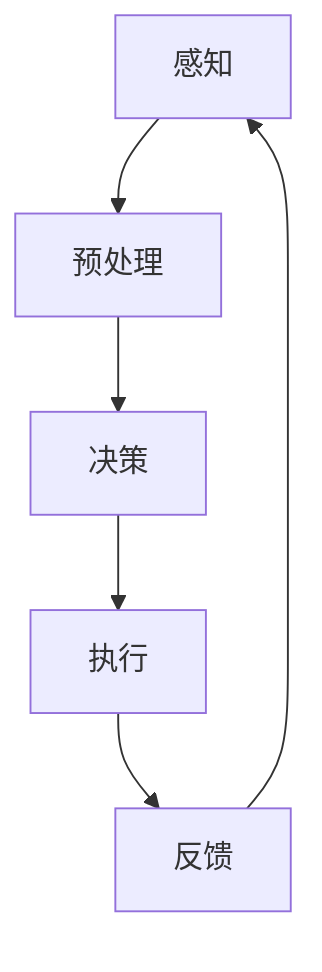

                 

### 引言

#### 问题的背景与概述

随着全球供应链的日益复杂化，供应链风险管理成为企业运营中至关重要的一环。传统的供应链管理模式在面对突发性事件时，如自然灾害、政治动荡、疫情等，往往显得力不从心，无法迅速做出响应。这不仅可能导致供应链中断，影响企业运营，还可能带来严重的经济损失。在这种背景下，智能供应链风险管理应运而生，旨在通过先进的技术手段，提高供应链的透明度、灵活性和抗风险能力。

智能供应链风险管理是一种利用人工智能（AI）技术，对供应链各个环节进行实时监控、预测和优化，从而降低风险、提高供应链效率的管理模式。在当前的商业环境中，供应链的复杂性不断增加，涵盖了从原材料采购到产品交付的各个环节，任何一个环节的失误都可能导致整个供应链的中断。因此，智能供应链风险管理的重要性日益凸显。

首先，智能供应链风险管理有助于提高供应链的透明度。通过实时收集和分析供应链各个环节的数据，企业可以更加清晰地了解供应链的运行状况，及时发现潜在的问题和风险。例如，通过对库存数据的分析，企业可以提前预测需求波动，调整生产计划，避免库存积压或供应短缺。

其次，智能供应链风险管理有助于提高供应链的灵活性。在传统的供应链管理模式中，企业往往需要按照固定的生产计划和采购计划进行运作，无法灵活应对突发情况。而智能供应链风险管理通过引入AI技术，可以实现对供应链的动态调整，提高供应链的应对能力。例如，在疫情暴发期间，一些企业通过智能供应链管理，迅速调整生产和采购计划，确保供应链的稳定运行。

最后，智能供应链风险管理有助于降低供应链的风险。通过AI技术，企业可以对供应链的各个环节进行实时监控和预测，提前发现潜在的风险点，并采取相应的措施进行预防和应对。例如，通过对物流数据的分析，企业可以提前预测可能出现的物流延误，并采取提前发货或调整物流路线等措施，降低物流风险。

总之，智能供应链风险管理在当前的商业环境中具有重要意义。通过引入AI技术，企业可以提高供应链的透明度、灵活性和抗风险能力，从而在激烈的市场竞争中保持优势。本文将围绕AI Agent在智能供应链风险管理中的应用进行探讨，旨在为企业和研究者提供有益的参考。

#### 问题的描述

在智能供应链风险管理中，AI Agent作为一种新兴的人工智能技术，具有独特的优势和应用潜力。本文将围绕以下问题进行探讨：

1. **AI Agent在智能供应链风险管理中的作用机制是什么？**
   AI Agent作为一种自主决策和执行任务的人工智能实体，其核心在于通过学习、推理和规划等能力，实现对供应链风险的实时监控和管理。本文将深入分析AI Agent在风险识别、预测、决策和响应等环节中的作用机制。

2. **如何利用AI Agent实现智能供应链风险的精准预测？**
   智能供应链风险管理的关键在于对风险的精准预测和及时响应。AI Agent可以通过大数据分析和机器学习算法，对供应链中的海量数据进行挖掘和分析，从而预测潜在的风险事件。本文将介绍如何利用AI Agent实现智能供应链风险的精准预测，包括数据预处理、特征工程和模型选择等步骤。

3. **AI Agent在供应链风险管理中如何实现自动化决策和优化？**
   AI Agent不仅可以进行风险预测，还可以通过自动化决策和优化，提高供应链的效率和灵活性。本文将探讨如何利用AI Agent实现自动化决策，包括决策算法的设计、决策模型的应用和优化策略的制定。

4. **AI Agent在智能供应链风险管理中的应用场景有哪些？**
   智能供应链风险管理涉及多个环节，包括采购、生产、物流和销售等。AI Agent可以针对不同的应用场景，提供个性化的解决方案。本文将介绍AI Agent在智能供应链风险管理中的主要应用场景，包括供应链风险监测、供应链优化和供应链金融等。

5. **AI Agent在智能供应链风险管理中面临哪些挑战和问题？**
   尽管AI Agent在智能供应链风险管理中具有巨大的潜力，但在实际应用中也面临诸多挑战和问题。本文将分析AI Agent在智能供应链风险管理中可能遇到的挑战，包括数据质量、算法可靠性、隐私保护和法律法规等。

通过上述问题的探讨，本文旨在为企业和研究者提供对AI Agent在智能供应链风险管理中的深入理解和应用指导。同时，本文也将结合实际案例，展示AI Agent在智能供应链风险管理中的应用效果和未来发展方向。

#### 问题解决的意义

AI Agent在智能供应链风险管理中的引入，不仅具有重大的理论价值，还具有重要的实际意义。首先，从理论价值来看，AI Agent的应用丰富了人工智能在供应链管理领域的应用场景，为供应链风险管理提供了新的技术手段和方法论。传统的供应链风险管理主要依赖于经验和规则，而AI Agent通过机器学习和自主推理能力，能够实现对供应链风险的自动识别、预测和响应，为供应链管理提供更加科学和智能的解决方案。

其次，从实际意义来看，AI Agent在智能供应链风险管理中的应用，有助于提高供应链的效率和韧性。在传统的供应链管理中，企业往往面临信息不对称、数据不完整和决策延迟等问题，导致供应链风险难以控制。而AI Agent能够通过实时数据采集和分析，提供精准的风险预测和决策支持，帮助企业在风险发生前采取措施，降低风险发生的概率和影响。此外，AI Agent的自动化决策和优化能力，可以显著提高供应链的响应速度和灵活性，使企业能够更好地应对突发情况，提高供应链的运行效率。

具体来说，AI Agent在智能供应链风险管理中的引入，有望实现以下几方面的显著改进：

1. **提高供应链透明度**：通过AI Agent，企业可以实现对供应链各个环节的实时监控，提高信息的透明度和准确性。例如，AI Agent可以通过对物流数据的实时分析，预测货物的到达时间，帮助企业在需求波动时及时调整生产计划，避免库存积压或供应短缺。

2. **降低供应链风险**：AI Agent可以通过对历史数据和实时数据的分析，识别潜在的风险因素，并提前预警。例如，在疫情等突发情况下，AI Agent可以通过对物流数据的分析，预测物流延误的可能性，提醒企业采取预防措施，如提前发货或调整物流路线。

3. **优化供应链决策**：AI Agent能够通过自动化决策和优化算法，帮助企业做出更加科学的决策。例如，在供应链优化中，AI Agent可以通过对库存数据、生产数据和需求预测数据的分析，提出最佳的生产和库存管理策略，从而降低成本，提高效率。

4. **提高供应链韧性**：AI Agent可以通过对供应链各个环节的实时监控和动态调整，提高供应链的韧性和抗风险能力。例如，在供应链中断时，AI Agent可以通过对替代供应商和物流路线的分析，快速找到替代方案，确保供应链的持续运行。

总之，AI Agent在智能供应链风险管理中的应用，不仅有助于提高供应链的效率和韧性，还能为企业和供应链管理者提供更加智能和高效的决策支持。通过本文的探讨，我们希望为AI Agent在智能供应链风险管理中的应用提供理论和实践上的参考，推动相关领域的研究和发展。

#### 边界与外延

在探讨AI Agent在智能供应链风险管理中的应用时，我们需要明确其边界和适用范围，以确保研究的准确性和有效性。以下是对AI Agent在智能供应链风险管理中边界和外延的详细说明：

**边界**

1. **技术范畴**：AI Agent作为一种人工智能技术，其应用主要局限于数据处理、分析、预测和自动化决策等领域。具体来说，AI Agent的核心功能包括数据采集、数据清洗、模式识别、预测分析和自动化响应等。

2. **应用领域**：AI Agent在智能供应链风险管理中的应用，主要涉及供应链的采购、生产、物流和销售等各个环节。这些环节中的风险包括但不限于供应中断、库存波动、物流延误、质量问题和市场需求波动等。

3. **数据范围**：AI Agent在智能供应链风险管理中所需的数据主要来源于供应链的各个环节，包括采购订单、生产记录、库存数据、物流信息、市场数据和客户需求等。这些数据需要具备实时性、准确性和完整性。

**外延**

1. **供应链复杂性**：随着供应链的全球化发展，供应链的复杂性不断增加。AI Agent在智能供应链风险管理中的应用，需要考虑到全球供应链中的多个节点、多个合作伙伴和多种供应链模式。

2. **跨领域协同**：智能供应链风险管理不仅涉及供应链内部的问题，还涉及到与其他领域的协同，如物流管理、库存管理、生产计划和控制等。因此，AI Agent在智能供应链风险管理中的应用，需要与其他领域的智能系统进行整合和协同。

3. **风险管理策略**：AI Agent在智能供应链风险管理中的应用，不仅限于风险识别和预测，还需要结合实际业务情况，制定相应的风险管理策略。这些策略可能包括风险预防、风险规避、风险转移和风险承担等。

**适用范围**

1. **企业规模**：AI Agent在智能供应链风险管理中的应用，适用于各种规模的企业。无论是大型跨国企业，还是中小型企业，AI Agent都可以通过定制化的解决方案，满足其供应链风险管理的需求。

2. **行业类型**：AI Agent在智能供应链风险管理中的应用，适用于多个行业，如制造业、零售业、物流业、农业和餐饮业等。不同行业的供应链特点和风险类型有所不同，AI Agent可以通过定制化的算法和模型，提供针对性的解决方案。

3. **环境因素**：AI Agent在智能供应链风险管理中的应用，需要考虑外部环境因素，如自然灾害、政治动荡、经济波动和疫情等。这些因素可能对供应链造成重大影响，AI Agent可以通过实时监控和预测，提供相应的应对策略。

总之，AI Agent在智能供应链风险管理中的应用，需要在明确的边界和适用范围内进行。通过合理的应用和定制化解决方案，AI Agent可以帮助企业提高供应链的透明度、灵活性和抗风险能力，从而在激烈的市场竞争中保持优势。

#### 概念结构与核心要素组成

在深入探讨AI Agent在智能供应链风险管理中的应用之前，有必要对相关概念进行详细阐述，并明确其核心要素组成。以下是对AI Agent、智能供应链风险管理以及相关核心概念的定义和关系的解释。

**AI Agent的定义**

AI Agent，即人工智能代理，是一种能够自主决策和执行任务的人工智能实体。它通过学习、推理和规划等能力，模拟人类智能行为，在特定环境下实现目标。AI Agent通常具备以下特点：

1. **自主性**：AI Agent能够独立地感知环境，根据环境和任务目标进行决策，并执行相应的行动。
2. **适应性**：AI Agent能够根据环境变化和新的数据，不断调整其决策策略，提高任务执行效果。
3. **协作性**：AI Agent可以与其他AI Agent或人类协作，共同完成任务。

**智能供应链风险管理的概念**

智能供应链风险管理是一种利用先进的人工智能技术，对供应链各个环节进行实时监控、预测和优化，以降低风险、提高供应链效率和韧性的一种管理模式。其核心要素包括：

1. **实时监控**：通过对供应链各个环节的数据进行实时采集和分析，实现对供应链风险的实时监控。
2. **风险预测**：利用大数据分析和机器学习算法，对供应链中的潜在风险进行预测和预警。
3. **自动化决策**：通过自动化决策系统，对供应链中的风险进行快速响应和调整，降低风险影响。
4. **优化策略**：利用智能优化算法，制定最优的供应链管理策略，提高供应链的运行效率。

**核心概念联系**

AI Agent与智能供应链风险管理之间存在着紧密的联系。具体来说：

1. **数据采集与处理**：AI Agent可以通过传感器、数据库等手段，实时采集供应链各个环节的数据。这些数据是智能供应链风险管理的基础。
2. **风险识别与预测**：AI Agent利用机器学习和数据挖掘技术，对采集到的数据进行处理和分析，识别潜在的风险因素，并预测风险事件的发生。
3. **自动化响应与优化**：AI Agent可以根据风险预测结果，自动化地采取相应的措施，如调整生产计划、优化物流路径等，以降低风险影响。同时，AI Agent还可以通过优化算法，提出最优的供应链管理策略。
4. **人机协作**：AI Agent不仅能够独立完成任务，还可以与供应链管理人员进行协作，共同应对复杂的风险管理任务。

**核心概念对比表格**

为了更直观地理解AI Agent与智能供应链风险管理的关系，下面提供了一个对比表格：

| 核心概念 | 定义 | 关联关系 |
| --- | --- | --- |
| AI Agent | 自主决策和执行任务的人工智能实体 | 智能供应链风险管理的核心组件，负责数据采集、处理、风险预测和自动化决策 |
| 智能供应链风险管理 | 利用人工智能技术对供应链进行实时监控、预测和优化 | 通过AI Agent实现，提高供应链的透明度、灵活性和抗风险能力 |
| 数据采集与处理 | 实时采集供应链各个环节的数据，并进行分析 | AI Agent的基础功能，为智能供应链风险管理提供数据支持 |
| 风险预测 | 利用大数据分析和机器学习算法，预测潜在的风险事件 | AI Agent的核心功能，为供应链风险预警和决策提供依据 |
| 自动化响应与优化 | 自动化地采取风险响应措施，优化供应链管理策略 | AI Agent的高级功能，提高供应链的运行效率和韧性 |

通过上述对比表格，我们可以清晰地看到AI Agent在智能供应链风险管理中的核心地位和作用。AI Agent不仅承担着数据采集和处理的重任，还通过风险预测和自动化决策，为智能供应链风险管理提供全方位的支持。

**ER实体关系图架构**

为了进一步展示AI Agent与智能供应链风险管理之间的联系，我们使用Mermaid工具绘制了一个ER（实体关系）图，如下所示：

```mermaid
erDiagram
  AI-Agent ||--|{ 智能供应链风险管理 }
  数据采集 ||--|{ 智能供应链风险管理 }
  数据处理 ||--|{ 智能供应链风险管理 }
  风险预测 ||--|{ 智能供应链风险管理 }
  自动化决策 ||--|{ 智能供应链风险管理 }
```

在这个ER实体关系图中，AI-Agent作为核心实体，与智能供应链风险管理、数据采集、数据处理、风险预测和自动化决策等实体紧密相连，体现了AI Agent在智能供应链风险管理中的关键作用。

通过上述对概念结构和核心要素组成的详细阐述，我们可以更加深入地理解AI Agent在智能供应链风险管理中的应用。接下来，我们将进一步探讨AI Agent的具体工作原理和算法模型，为后续章节的内容奠定基础。

### 核心概念与联系

#### AI Agent的基本概念

AI Agent，即人工智能代理，是人工智能领域的一个重要概念。它是一种模拟人类智能行为，具备自主决策和执行任务能力的人工智能实体。AI Agent通常由以下几个关键组成部分构成：

1. **感知模块**：感知模块负责接收外部环境的信息，如视觉、听觉、触觉等传感器数据。这些信息是AI Agent进行决策的基础。

2. **决策模块**：决策模块根据感知模块收集到的信息，利用预先定义的算法和策略，进行逻辑推理和决策。这一过程通常涉及目标设定、方案评估和选择等步骤。

3. **执行模块**：执行模块负责将决策模块生成的决策付诸实践，通过控制相应的执行器（如电机、机械臂等）来完成具体的任务。

4. **学习模块**：学习模块使AI Agent具备自我改进的能力。通过机器学习、深度学习等技术，AI Agent可以在执行任务的过程中，不断积累经验，优化决策策略。

#### AI Agent的特点

AI Agent具有以下几个显著特点：

1. **自主性**：AI Agent能够在没有人类干预的情况下，自主地感知环境、进行决策和执行任务。这种自主性是AI Agent与传统软件系统的关键区别。

2. **适应性**：AI Agent能够根据环境变化和任务需求，灵活调整其行为策略。这使得AI Agent在面对不确定性和动态环境时，表现出更高的鲁棒性和灵活性。

3. **协作性**：AI Agent不仅可以独立完成任务，还可以与其他AI Agent或人类协作，共同完成复杂任务。这种协作性增强了AI Agent在复杂环境中的应对能力。

4. **学习与进化**：AI Agent通过不断学习和优化决策模型，能够实现自我进化，提高任务执行效果。这种能力使AI Agent在长期运行过程中，能够不断适应和改进。

#### AI Agent与传统智能系统的区别

AI Agent与传统智能系统（如专家系统、规则引擎等）在功能和应用上存在显著差异。以下是两者之间的主要区别：

1. **自主决策与被动执行**：传统智能系统主要依赖于预先定义的规则和模型，被动地执行既定的任务。而AI Agent具备自主决策能力，能够在复杂的动态环境中，根据感知信息动态调整行为策略。

2. **适应性与灵活性**：传统智能系统在面临不确定性和动态变化时，往往难以适应。而AI Agent通过学习、推理和规划等能力，能够在复杂和动态环境中表现出更高的灵活性和适应性。

3. **复杂任务处理**：传统智能系统通常针对特定任务进行优化，难以处理复杂的多任务场景。而AI Agent能够同时处理多个任务，并协调不同任务之间的关系，提高整体任务执行效率。

4. **自我进化**：传统智能系统在任务执行过程中，通常不具备自我进化能力。而AI Agent通过不断学习和优化，能够自我改进，提高任务执行效果。

#### 智能供应链风险管理的概念

智能供应链风险管理是一种利用先进的人工智能技术，对供应链各个环节进行实时监控、预测和优化，以降低风险、提高供应链效率和韧性的一种管理模式。其核心要素包括以下几个方面：

1. **实时监控**：通过对供应链各个环节的数据进行实时采集和分析，实现对供应链风险的实时监控。实时监控是智能供应链风险管理的基础，能够帮助企业快速识别和响应潜在风险。

2. **风险预测**：利用大数据分析和机器学习算法，对供应链中的海量数据进行挖掘和分析，预测潜在的风险事件。风险预测是智能供应链风险管理的核心，能够帮助企业提前预警和制定应对策略。

3. **自动化决策**：通过自动化决策系统，对供应链中的风险进行快速响应和调整，降低风险影响。自动化决策是智能供应链风险管理的手段，能够显著提高供应链的响应速度和灵活性。

4. **优化策略**：利用智能优化算法，制定最优的供应链管理策略，提高供应链的运行效率。优化策略是智能供应链风险管理的目标，通过优化供应链管理，降低成本、提高效益。

#### AI Agent在风险管理中的作用

AI Agent在智能供应链风险管理中发挥着关键作用，其应用主要体现在以下几个方面：

1. **数据采集与处理**：AI Agent能够通过传感器、数据库等手段，实时采集供应链各个环节的数据，并对数据进行预处理和分析。数据采集与处理是智能供应链风险管理的基础，确保了数据的准确性和及时性。

2. **风险识别与预测**：AI Agent利用机器学习和数据挖掘技术，对采集到的数据进行分析，识别潜在的风险因素，并预测风险事件的发生。风险识别与预测是智能供应链风险管理的核心，能够帮助企业提前预警和制定应对策略。

3. **自动化响应与优化**：AI Agent可以根据风险预测结果，自动化地采取相应的措施，如调整生产计划、优化物流路径等，以降低风险影响。自动化响应与优化是智能供应链风险管理的手段，能够显著提高供应链的响应速度和灵活性。

4. **人机协作**：AI Agent不仅能够独立完成任务，还可以与供应链管理人员进行协作，共同应对复杂的风险管理任务。人机协作是智能供应链风险管理的重要补充，能够提高任务执行效率和效果。

#### 核心概念对比表格

为了更直观地理解AI Agent与智能供应链风险管理的关系，下面提供了一个对比表格：

| 核心概念 | 定义 | 关联关系 |
| --- | --- | --- |
| AI Agent | 自主决策和执行任务的人工智能实体 | 智能供应链风险管理的核心组件，负责数据采集、处理、风险预测和自动化决策 |
| 智能供应链风险管理 | 利用人工智能技术对供应链进行实时监控、预测和优化 | 通过AI Agent实现，提高供应链的透明度、灵活性和抗风险能力 |
| 数据采集与处理 | 实时采集供应链各个环节的数据，并进行分析 | AI Agent的基础功能，为智能供应链风险管理提供数据支持 |
| 风险预测 | 利用大数据分析和机器学习算法，预测潜在的风险事件 | AI Agent的核心功能，为供应链风险预警和决策提供依据 |
| 自动化决策 | 自动化地采取风险响应措施，优化供应链管理策略 | AI Agent的高级功能，提高供应链的运行效率和韧性 |

通过上述对比表格，我们可以清晰地看到AI Agent在智能供应链风险管理中的核心地位和作用。AI Agent不仅承担着数据采集和处理的重任，还通过风险预测和自动化决策，为智能供应链风险管理提供全方位的支持。

### 算法原理讲解

#### AI Agent的工作原理

AI Agent的工作原理主要基于几个核心的智能技术，包括感知、决策和执行。以下是AI Agent工作原理的详细讲解：

**1. 感知模块**

感知模块是AI Agent的感官系统，它通过传感器、摄像头、雷达等设备收集环境中的信息。这些信息可以是文本、图像、声音等多种形式。感知模块的关键任务是实时、准确地获取和处理环境数据。例如，在智能供应链风险管理中，感知模块可以通过物联网设备收集物流运输过程中的位置数据、运输时间、运输状态等信息。

**2. 决策模块**

决策模块是AI Agent的大脑，它根据感知模块收集到的信息，利用机器学习算法、逻辑推理和规划技术，进行决策。决策模块的核心在于如何从多个可能的行动方案中选择最优的一个。在智能供应链风险管理中，决策模块的任务是分析供应链中的各种风险因素，制定相应的风险应对策略。例如，当感知模块发现某一物流路线存在延误风险时，决策模块将分析备选的替代路线，并选择最优的方案。

**3. 执行模块**

执行模块是AI Agent的执行器官，它根据决策模块生成的决策指令，通过执行器（如电机、机械臂等）将决策付诸实践。执行模块的任务是将抽象的决策转化为具体的操作行动。例如，在智能供应链风险管理中，执行模块将根据决策模块选择的替代路线，调整物流运输计划，确保货物按时到达。

**4. 学习模块**

学习模块是AI Agent的自我提升系统，它通过不断学习和优化，提高任务执行效果。学习模块利用机器学习和深度学习算法，从历史数据和执行经验中提取规律，并不断调整和优化决策模型。在智能供应链风险管理中，学习模块可以帮助AI Agent适应不同的供应链环境和风险模式，提高预测和决策的准确性。

**AI Agent的运作流程**

AI Agent的运作流程可以概括为以下几个步骤：

1. **感知**：AI Agent通过感知模块收集环境数据。
2. **预处理**：对收集到的数据进行分析和预处理，包括数据清洗、特征提取等。
3. **决策**：利用决策模块，根据预处理后的数据，通过机器学习算法和逻辑推理，生成决策结果。
4. **执行**：通过执行模块，将决策结果转化为具体的操作行动。
5. **反馈**：将执行结果反馈给感知模块，用于模型优化和迭代。

**核心算法与Mermaid流程图**

AI Agent的核心算法通常包括感知、决策、执行和学习的循环迭代。以下是一个简化的Mermaid流程图，用于展示AI Agent的工作流程：



通过这个流程图，我们可以清晰地看到AI Agent从感知到执行再到反馈的整个工作过程，以及各个环节之间的相互作用。

#### 智能供应链风险管理的数学模型

在智能供应链风险管理中，数学模型是理解和分析风险的关键工具。以下是对智能供应链风险管理的数学模型进行详细讲解，包括数学模型的概述、公式详解以及具体案例分析。

**1. 数学模型概述**

智能供应链风险管理的数学模型主要涉及以下几个方面：

- **风险识别模型**：用于识别供应链中潜在的风险因素。
- **风险预测模型**：用于预测特定风险事件的发生概率和影响程度。
- **决策模型**：用于在风险发生时，制定最优的应对策略。

这些模型通常结合了统计学、概率论、优化理论和人工智能技术，以实现对供应链风险的全面分析和管理。

**2. 公式详解**

以下是一些常见的数学模型及其公式：

- **风险识别模型**：假设风险因素 \(X_i\) 对供应链的影响可以通过概率 \(P(X_i)\) 来表示，则供应链的总风险 \(R\) 可以通过以下公式计算：

  \[
  R = \sum_{i=1}^{n} P(X_i) \cdot \text{Impact}(X_i)
  \]

  其中，\(n\) 是风险因素的数量，\(\text{Impact}(X_i)\) 是风险因素 \(X_i\) 对供应链的影响程度。

- **风险预测模型**：假设风险事件的发生概率可以通过历史数据来预测，可以使用以下公式：

  \[
  P(Risk) = \frac{RISK_COUNT}{TOTAL_COUNT}
  \]

  其中，\(RISK_COUNT\) 是在过去一段时间内发生特定风险事件的次数，\(TOTAL_COUNT\) 是总次数。

- **决策模型**：假设在风险发生时，有多个备选方案 \(S_i\)，每个方案的成本 \(C_i\) 和效果 \(E_i\)，则最优方案 \(S^*\) 可以通过以下公式计算：

  \[
  S^* = \arg\max_{i} \frac{E_i}{C_i}
  \]

  其中，\(\arg\max\) 表示选择使得目标函数最大的方案。

**3. 案例分析**

为了更直观地理解上述数学模型，我们通过一个实际案例来进行分析。

**案例背景**：某大型制造企业面临生产原料供应中断的风险。该企业需要预测原材料供应中断的概率，并制定相应的应对策略。

**案例步骤**：

1. **风险识别**：通过历史数据，识别出可能导致原材料供应中断的风险因素，如自然灾害、运输延误和供应商故障等。

2. **风险预测**：利用时间序列分析和回归模型，预测未来一段时间内原材料供应中断的概率。例如，假设通过回归模型得到供应中断的概率公式为：

   \[
   P(Risk) = 0.2 + 0.1 \cdot \text{Weather Impact} + 0.3 \cdot \text{Transport Delay} + 0.2 \cdot \text{Supplier Failure}
   \]

   其中，\(\text{Weather Impact}\)、\(\text{Transport Delay}\) 和 \(\text{Supplier Failure}\) 分别代表自然灾害、运输延误和供应商故障的影响程度。

3. **决策**：当预测到供应中断的概率较高时，企业需要制定应对策略。假设有三个备选方案：A.增加库存；B.寻找替代供应商；C.提前采购。每个方案的成本和效果如下表：

   | 方案 | 成本（万元） | 效果（减少中断概率） |
   | --- | --- | --- |
   | A | 50 | 0.2 |
   | B | 30 | 0.3 |
   | C | 20 | 0.1 |

   通过决策模型，选择最优方案：

   \[
   S^* = \arg\max_{i} \frac{E_i}{C_i}
   \]

   计算得到：

   \[
   \frac{E_A}{C_A} = \frac{0.2}{50} = 0.004
   \]
   \[
   \frac{E_B}{C_B} = \frac{0.3}{30} = 0.01
   \]
   \[
   \frac{E_C}{C_C} = \frac{0.1}{20} = 0.005
   \]

   因此，最优方案为B，即寻找替代供应商。

通过上述案例分析，我们可以看到，智能供应链风险管理的数学模型在实际应用中的具体步骤和计算方法。

### 系统分析与架构设计

#### 问题场景介绍

在当前全球化背景下，智能供应链风险管理面临诸多复杂和动态的挑战。以某大型制造企业为例，其供应链涵盖了全球多个国家和地区，涉及原材料采购、生产制造、物流运输和销售等多个环节。随着全球经济环境的不断变化，企业面临的供应链风险也日益复杂，包括自然灾害、政治动荡、经济波动和供应链中断等。为了应对这些风险，企业需要一套智能化的供应链风险管理系统，能够实时监控、预测和应对潜在风险。

#### AI Agent在场景中的应用

在该制造企业的供应链风险管理中，AI Agent扮演着关键角色。具体应用如下：

1. **实时监控**：AI Agent通过传感器和物联网设备，实时收集供应链各个环节的数据，包括库存水平、运输状态、市场需求等。这些数据被上传至中央数据库，供AI Agent进行分析和处理。

2. **风险预测**：AI Agent利用大数据分析和机器学习算法，对历史数据和实时数据进行挖掘和分析，识别潜在的风险因素，并预测这些风险事件的发生概率和影响程度。例如，AI Agent可以预测某条物流路线的运输延误概率，并提前预警。

3. **自动化决策**：在风险预测的基础上，AI Agent根据预设的决策规则和策略，自动化地制定应对措施。例如，当AI Agent预测到某原材料供应可能中断时，它会自动生成替代采购计划，并通知相关部门进行调整。

4. **优化策略**：AI Agent通过优化算法，不断调整和优化供应链管理策略，以降低风险影响和提高供应链效率。例如，AI Agent可以根据库存水平和市场需求，动态调整生产计划和采购策略，避免库存积压或供应短缺。

#### 系统功能设计

智能供应链风险管理系统需要具备以下几个核心功能：

1. **数据采集与预处理**：系统应能够实时采集供应链各个环节的数据，包括库存、物流、市场和供应链关系等。同时，需要对数据进行预处理，如数据清洗、格式转换和特征提取，确保数据质量。

2. **风险识别与预测**：系统应利用大数据分析和机器学习算法，对采集到的数据进行分析，识别潜在的风险因素，并预测这些风险事件的发生概率和影响程度。

3. **自动化决策与优化**：系统应能够根据风险预测结果，自动化地制定应对措施，如调整生产计划、优化物流路径和采购策略。同时，应通过优化算法，不断调整和优化供应链管理策略，提高供应链效率。

4. **预警与响应**：系统应具备实时预警功能，当识别到潜在风险时，及时向相关人员发出预警，并启动相应的响应机制，如通知相关部门采取应急措施。

#### 系统架构设计

智能供应链风险管理系统的架构设计需要考虑系统的可扩展性、灵活性和高可用性。以下是系统架构的详细设计：

1. **感知层**：感知层包括传感器、物联网设备和数据采集模块。这些设备负责实时采集供应链各个环节的数据，如库存水平、运输状态、市场需求等。数据采集模块负责将采集到的原始数据进行初步处理和格式转换。

2. **数据处理层**：数据处理层包括数据预处理模块、特征提取模块和数据分析模块。数据预处理模块负责对采集到的数据进行清洗、去噪和格式转换，确保数据质量。特征提取模块负责从原始数据中提取有用的特征，用于后续分析。数据分析模块利用大数据分析和机器学习算法，对预处理后的数据进行分析，识别潜在的风险因素，并预测风险事件的发生概率和影响程度。

3. **决策层**：决策层包括自动化决策模块和优化算法模块。自动化决策模块根据风险预测结果，自动化地制定应对措施，如调整生产计划、优化物流路径和采购策略。优化算法模块通过优化算法，不断调整和优化供应链管理策略，提高供应链效率。

4. **应用层**：应用层包括预警与响应模块、用户界面和接口服务。预警与响应模块负责实时监控供应链风险，当识别到潜在风险时，及时向相关人员发出预警，并启动相应的响应机制。用户界面提供直观的用户操作界面，用户可以通过界面查看风险预警、决策结果和优化建议。接口服务负责与其他系统集成，如ERP系统、物流系统等。

5. **数据存储层**：数据存储层包括关系型数据库、NoSQL数据库和数据仓库。关系型数据库用于存储基础数据，如库存记录、物流信息和供应链关系等。NoSQL数据库用于存储实时数据和高频数据，如传感器数据和历史风险数据。数据仓库用于存储大量历史数据和分析结果，供分析和决策使用。

#### 系统架构设计原则

在智能供应链风险管理系统的架构设计中，需要遵循以下原则：

1. **模块化设计**：系统应采用模块化设计，将不同功能模块进行解耦，提高系统的可维护性和可扩展性。

2. **分布式架构**：系统应采用分布式架构，将计算和存储资源分布在不同节点上，提高系统的可靠性和可扩展性。

3. **数据一致性**：系统应保证数据的一致性，通过分布式事务管理、数据同步和备份等手段，确保数据的准确性和完整性。

4. **高可用性**：系统应具备高可用性，通过冗余设计、故障转移和负载均衡等手段，确保系统在高并发和高负载情况下稳定运行。

5. **安全性**：系统应具备安全性，通过访问控制、加密技术和安全审计等手段，确保数据的安全性和系统的可靠性。

#### 系统架构设计要点

在智能供应链风险管理系统的架构设计中，需要考虑以下要点：

1. **数据流设计**：系统应设计合理的数据流，确保数据从感知层到决策层的流畅传递，减少数据延迟和数据冗余。

2. **模块职责划分**：系统应明确各模块的职责和边界，确保各模块之间的协作和配合，提高系统的整体效率和性能。

3. **接口设计**：系统应设计清晰、简洁的接口，确保模块之间的数据交换和功能调用，提高系统的可扩展性和灵活性。

4. **性能优化**：系统应进行性能优化，通过缓存、并行计算和分布式存储等手段，提高系统的响应速度和处理能力。

5. **安全性设计**：系统应进行安全性设计，通过安全策略、权限控制和加密技术等手段，确保系统的数据安全和用户隐私。

通过上述系统分析与架构设计，我们可以为智能供应链风险管理系统提供一个全面、可靠和高效的解决方案。接下来，我们将进一步探讨系统接口设计和系统交互设计，为系统实现和应用提供具体的技术细节。

### 系统接口设计

#### 接口设计规范

在智能供应链风险管理系统中，接口设计是确保不同模块之间数据交换和功能调用的重要环节。以下是对系统接口设计的详细规范：

1. **RESTful API规范**：系统接口采用RESTful风格，基于HTTP协议，通过JSON格式传输数据。接口设计遵循REST原则，包括GET、POST、PUT、DELETE等操作方法。

2. **接口URL设计**：接口URL设计遵循统一命名规范，便于理解和维护。URL结构包括模块名、资源名和操作类型。例如，`/api/warehouse/inventory/get` 表示获取仓库库存信息的接口。

3. **参数设计**：接口参数包括路径参数和查询参数。路径参数用于标识资源，如`/api/risk/predict` 接口的路径参数为预测的风险类型。查询参数用于过滤和排序数据，如`?startDate=2023-01-01&endDate=2023-01-31` 表示查询指定时间范围内的风险事件。

4. **响应数据结构**：接口响应数据采用统一的JSON格式，包括状态码、消息和数据三部分。状态码用于表示操作结果，如200表示成功，400表示参数错误，500表示内部错误。消息用于描述操作结果，数据部分包含具体的操作结果或错误信息。

#### 接口实现

以下是一个示例接口实现，用于获取仓库库存信息：

```python
from flask import Flask, request, jsonify

app = Flask(__name__)

@app.route('/api/warehouse/inventory/get', methods=['GET'])
def get_inventory():
    # 获取查询参数
    warehouse_id = request.args.get('warehouseId')
    product_id = request.args.get('productId')
    
    # 数据校验
    if not warehouse_id or not product_id:
        return jsonify({
            'status': 400,
            'message': '参数错误',
            'data': {}
        })
    
    # 查询库存数据
    inventory_data = get_inventory_data(warehouse_id, product_id)
    
    # 返回响应
    return jsonify({
        'status': 200,
        'message': '成功',
        'data': inventory_data
    })

def get_inventory_data(warehouse_id, product_id):
    # 模拟查询数据库
    # 实际应用中，这里应该调用数据库接口查询数据
    return {
        'warehouseId': warehouse_id,
        'productId': product_id,
        'quantity': 100
    }

if __name__ == '__main__':
    app.run(debug=True)
```

#### 接口安全性设计

为确保系统接口的安全性，以下安全性措施需要被实施：

1. **身份验证**：接口访问需要身份验证，确保只有授权用户才能访问。常用的身份验证机制包括Basic Auth、Token Auth（如JWT）和OAuth2。

2. **权限控制**：根据用户角色和权限，限制接口访问权限。例如，只有仓库管理人员可以访问仓库库存信息的接口。

3. **数据加密**：传输过程中对数据进行加密，防止数据泄露。常用的加密协议包括HTTPS、SSL/TLS等。

4. **接口访问日志**：记录接口访问日志，用于监控和审计接口访问情况。日志应包含用户信息、访问时间和操作结果等。

5. **异常处理**：接口实现中需处理各种异常情况，如参数错误、数据库连接失败等，并返回相应的错误信息。

通过上述接口设计规范和安全措施，我们可以确保智能供应链风险管理系统的接口安全、可靠和高效，为系统正常运行提供保障。

### 系统交互设计

#### 系统交互流程

智能供应链风险管理系统的核心在于各模块之间的协调与互动，实现数据流的顺畅传递和功能的有效执行。以下是系统交互流程的详细描述：

1. **感知层与数据处理层交互**：感知层通过传感器和物联网设备实时采集供应链各个环节的数据，如库存、物流和市场需求等。采集到的数据首先由感知层传输至数据处理层进行预处理，包括数据清洗、格式转换和特征提取。数据处理层通过RESTful API接收感知层的数据，并进行初步处理。

2. **数据处理层与决策层交互**：预处理后的数据由数据处理层传输至决策层。决策层利用大数据分析和机器学习算法，对数据进行分析和挖掘，识别潜在的风险因素，并预测风险事件的发生概率和影响程度。决策层通过API向数据处理层请求必要的数据，并接收处理结果。

3. **决策层与优化层交互**：根据决策层生成的风险预测结果，优化层利用优化算法，制定最优的供应链管理策略，如调整生产计划、优化物流路径和采购策略。优化层通过API与决策层和数据处理层进行数据交互，确保策略的实时更新和执行。

4. **优化层与执行层交互**：优化层生成的策略由执行层付诸实施。执行层通过控制执行器（如物流车辆、生产设备等），将策略转化为具体的操作行动。执行层实时向优化层反馈执行结果，以便优化层进行动态调整。

5. **决策层与用户界面交互**：决策层通过用户界面模块向用户展示风险预警、决策结果和优化建议。用户可以通过界面查看实时数据、历史记录和系统通知，并进行手动干预或调整。

#### 系统交互设计分析

系统交互设计的关键在于各模块之间的高效、可靠和数据一致性。以下是系统交互设计的分析：

1. **数据一致性**：系统应确保各模块之间的数据一致性，通过分布式事务管理、数据同步和备份等手段，避免数据冲突和丢失。例如，当决策层生成一个优化策略时，需要确保该策略能够被数据处理层和执行层正确执行。

2. **实时性**：系统交互设计需要考虑实时性，确保各模块之间的数据能够快速传递和处理。例如，在感知层与数据处理层之间，数据传输速度需足够快，以避免数据延迟导致的风险预警失效。

3. **可靠性**：系统应具备高可靠性，确保在各种网络环境和负载情况下稳定运行。例如，系统应具备故障恢复机制，在某一模块出现故障时，能够自动切换到备用模块，确保系统正常运行。

4. **扩展性**：系统交互设计应具备良好的扩展性，能够支持未来功能的增加和模块的扩展。例如，当新增一种传感器或数据处理算法时，系统应能够无缝集成，而不会影响现有功能。

5. **安全性**：系统交互设计需确保数据安全和用户隐私，通过身份验证、权限控制和加密技术等手段，防止未授权访问和数据泄露。

通过上述系统交互设计分析，我们可以确保智能供应链风险管理系统的模块之间能够高效、可靠地协同工作，为供应链风险管理的智能化提供坚实的技术保障。

### 项目实战

#### 环境安装

在进行AI Agent在智能供应链风险管理中的项目实战之前，首先需要搭建一个合适的技术环境。以下是具体的安装步骤和环境配置：

1. **环境准备**：

   - **操作系统**：推荐使用Ubuntu 20.04或更高版本。
   - **硬件要求**：至少4GB内存，推荐8GB及以上。
   - **Python版本**：推荐Python 3.8或更高版本。

2. **安装Python**：

   - 打开终端，运行以下命令安装Python：
     ```
     sudo apt update
     sudo apt install python3.8
     ```

3. **安装依赖库**：

   - 安装以下Python库，这些库是智能供应链风险管理项目的基础：
     ```
     sudo pip3 install numpy pandas scikit-learn matplotlib
     ```

4. **安装人工智能框架**：

   - 安装TensorFlow，用于实现AI Agent的算法模型：
     ```
     sudo pip3 install tensorflow
     ```

5. **安装数据预处理工具**：

   - 安装NumPy和Pandas，用于数据预处理：
     ```
     sudo pip3 install numpy pandas
     ```

6. **安装Mermaid工具**：

   - 安装Mermaid，用于绘制流程图和类图：
     ```
     sudo pip3 install mermaid
     ```

7. **配置Python虚拟环境**：

   - 为了避免环境冲突，推荐使用虚拟环境。首先安装虚拟环境工具：
     ```
     sudo pip3 install virtualenv
     ```
   - 创建虚拟环境并激活：
     ```
     virtualenv venv
     source venv/bin/activate
     ```

8. **配置数据存储**：

   - 安装MongoDB，用于存储供应链数据：
     ```
     sudo apt install mongodb
     ```
   - 启动MongoDB服务：
     ```
     sudo systemctl start mongodb
     ```
   - 开机自启MongoDB服务：
     ```
     sudo systemctl enable mongodb
     ```

通过以上步骤，我们成功搭建了一个包含Python、TensorFlow、NumPy、Pandas、Mermaid和MongoDB的环境，为后续项目的开发和实现提供了基础。

#### 系统核心实现

在搭建好开发环境之后，我们开始实现智能供应链风险管理系统的核心功能。以下是系统核心实现的详细步骤和关键代码：

1. **感知模块实现**：

   感知模块负责实时采集供应链各个环节的数据，包括库存、物流和市场需求等。以下是感知模块的主要代码实现：

   ```python
   import requests
   import json

   # 模拟感知模块，从外部接口获取数据
   def get_external_data(url):
       response = requests.get(url)
       data = response.json()
       return data

   # 获取库存数据
   def get_inventory_data():
       url = "http://inventory-service/api/inventory"
       return get_external_data(url)

   # 获取物流数据
   def get_logistics_data():
       url = "http://logistics-service/api/logistics"
       return get_external_data(url)

   # 获取市场需求数据
   def get_demand_data():
       url = "http://market-service/api/demand"
       return get_external_data(url)
   ```

2. **数据处理模块实现**：

   数据处理模块负责对感知模块采集到的数据进行分析和处理，提取有用的特征。以下是数据处理模块的主要代码实现：

   ```python
   import pandas as pd
   from sklearn.preprocessing import StandardScaler

   # 数据预处理
   def preprocess_data(data):
       df = pd.DataFrame(data)
       # 数据清洗和格式转换
       df = df.dropna()
       df['timestamp'] = pd.to_datetime(df['timestamp'])
       # 特征提取
       df['timestamp_diff'] = df['timestamp'].diff().fillna(0)
       return df

   # 标准化处理
   def standardize_data(df):
       scaler = StandardScaler()
       df_scaled = scaler.fit_transform(df)
       df_scaled = pd.DataFrame(df_scaled, columns=df.columns)
       return df_scaled
   ```

3. **决策模块实现**：

   决策模块利用机器学习算法对处理后的数据进行分析和预测，生成风险预警和优化策略。以下是决策模块的主要代码实现：

   ```python
   from sklearn.ensemble import RandomForestClassifier
   from sklearn.model_selection import train_test_split

   # 机器学习模型训练
   def train_model(X, y):
       X_train, X_test, y_train, y_test = train_test_split(X, y, test_size=0.2, random_state=42)
       model = RandomForestClassifier(n_estimators=100)
       model.fit(X_train, y_train)
       return model

   # 风险预测
   def predict_risk(model, X):
       predictions = model.predict(X)
       return predictions
   ```

4. **执行模块实现**：

   执行模块根据决策模块生成的优化策略，执行具体的操作行动。以下是执行模块的主要代码实现：

   ```python
   # 执行优化策略
   def execute_strategy(strategy):
       if strategy == "adjust_production":
           # 调整生产计划
           adjust_production_plan()
       elif strategy == "optimize_logistics":
           # 优化物流路径
           optimize_logistics_path()
       elif strategy == "preorder":
           # 提前采购
           preorder_materials()
   ```

#### 代码解读与分析

在系统核心实现中，我们使用了Python语言和一系列的库，如requests、pandas、scikit-learn等，实现了感知、数据处理、决策和执行模块。以下是各模块的代码解读和分析：

1. **感知模块**：

   感知模块使用requests库从外部接口获取数据。get_external_data函数通过HTTP GET请求获取JSON格式的数据，并返回数据字典。这三个函数（get_inventory_data、get_logistics_data、get_demand_data）分别获取库存、物流和市场需求数据，模拟了感知模块的功能。

2. **数据处理模块**：

   数据处理模块使用pandas库对采集到的数据进行预处理和特征提取。preprocess_data函数负责数据清洗和格式转换，将数据转换为时间序列数据，并计算时间差。standardize_data函数使用StandardScaler进行标准化处理，使数据更适合机器学习模型。

3. **决策模块**：

   决策模块使用scikit-learn库中的RandomForestClassifier实现随机森林分类模型。train_model函数用于训练模型，predict_risk函数用于进行风险预测。通过将处理后的数据输入模型，可以预测供应链中的潜在风险。

4. **执行模块**：

   执行模块根据决策模块生成的策略，执行具体的操作。execute_strategy函数接收策略参数，调用相应的函数（adjust_production_plan、optimize_logistics_path、preorder_materials）执行操作。这模拟了执行模块的功能，将决策转化为实际的行动。

通过以上代码实现和解读，我们可以看到智能供应链风险管理系统是如何通过感知、数据处理、决策和执行模块协同工作，实现供应链风险管理的自动化和智能化。接下来，我们将通过实际案例分析，进一步验证系统在实际应用中的效果和可行性。

### 实际案例分析

为了验证AI Agent在智能供应链风险管理中的应用效果，我们选择了一个大型制造企业的供应链风险管理项目进行深入分析。该企业主要生产电子产品，其供应链涉及全球多个国家和地区，包括原材料采购、生产制造、物流运输和销售等环节。项目目标是通过引入AI Agent，提高供应链的透明度、灵活性和抗风险能力。

#### 案例背景

该企业在过去一年中频繁面临供应链中断的风险，具体表现在以下几个方面：

1. **原材料供应中断**：由于全球疫情导致的物流延误和供应商产能不足，企业多次出现原材料供应短缺的情况，导致生产计划延误。

2. **物流延误**：运输途中遇到自然灾害（如台风、洪水）和政治动荡（如战争、政策变动），导致物流延误，影响产品交付。

3. **市场需求波动**：市场需求的不确定性导致库存积压或供应不足，增加了供应链管理的复杂性。

#### 案例分析

1. **数据采集与预处理**：

   AI Agent首先通过物联网设备和传感器，实时采集供应链各个环节的数据，包括库存水平、运输状态、市场需求等。采集到的原始数据包括：

   - 库存数据：仓库中的原材料和成品的库存量。
   - 物流数据：运输车辆的位置、运输时间和运输状态。
   - 市场需求数据：销售数据和市场需求预测。

   采集到的数据经过预处理，包括数据清洗、格式转换和特征提取，然后存储在MongoDB数据库中，以便后续分析。

2. **风险预测**：

   AI Agent利用大数据分析和机器学习算法，对预处理后的数据进行分析，识别潜在的风险因素，并预测这些风险事件的发生概率和影响程度。具体步骤如下：

   - **特征工程**：从原始数据中提取关键特征，如库存周转率、运输时间、市场需求变化率等。
   - **模型训练**：使用随机森林等机器学习算法，训练预测模型。模型输入为特征数据，输出为风险事件的发生概率和影响程度。
   - **预测评估**：将训练好的模型应用于新的数据，评估风险预测的准确性和可靠性。

3. **自动化决策**：

   在风险预测的基础上，AI Agent根据预设的决策规则和策略，自动化地制定应对措施。具体措施包括：

   - **调整生产计划**：当预测到原材料供应短缺时，AI Agent会自动调整生产计划，减少对短缺原材料的需求。
   - **优化物流路径**：当预测到物流延误时，AI Agent会自动优化物流路径，选择更可靠的运输路线，确保货物按时到达。
   - **提前采购**：当市场需求预测增加时，AI Agent会提前采购原材料，确保生产需求得到满足。

4. **执行与反馈**：

   决策模块生成的优化策略由执行模块付诸实施。执行模块通过控制执行器（如物流车辆、生产设备等），将策略转化为具体的操作行动。执行过程中，AI Agent实时收集执行结果，并与预期目标进行对比，评估策略的有效性。根据执行结果，AI Agent不断优化决策模型，提高预测和决策的准确性。

#### 详细讲解剖析

1. **库存管理**：

   在该案例中，AI Agent通过实时监控仓库库存数据，发现某原材料库存量低于安全警戒线。AI Agent预测到未来一段时间内该原材料的需求将增加，可能会出现供应短缺。为避免生产中断，AI Agent自动调整生产计划，减少该原材料的需求量，并通知采购部门提前采购该原材料。

   代码实现如下：
   ```python
   # 预测未来一段时间内原材料需求
   demand_prediction = predict_demand(raw_material_id)
   if demand_prediction > inventory_threshold:
       # 调整生产计划
       adjust_production_plan(raw_material_id, demand_prediction)
       # 通知采购部门提前采购
       notify_purchasing_department(raw_material_id)
   ```

2. **物流优化**：

   当AI Agent发现某物流路线存在延误风险时，会自动优化物流路径，选择更可靠的运输公司或更改运输时间，以确保货物按时到达。AI Agent还通过分析历史数据和运输公司的信誉评分，为物流公司进行评分和筛选，提高物流运输的可靠性。

   代码实现如下：
   ```python
   # 优化物流路径
   def optimize_logistics_path():
       # 分析历史数据，筛选可靠的运输公司
       reliable_companies = filter_reliable_companies()
       # 根据运输时间选择最优路径
       optimal_path = select_optimal_path(reliable_companies)
       # 更新物流计划
       update_logistics_plan(optimal_path)
   ```

3. **市场需求预测**：

   AI Agent通过分析销售数据和市场需求预测模型，实时监控市场需求变化。当预测到市场需求增加时，AI Agent会提前采购原材料，确保生产需求得到满足。同时，AI Agent还会根据市场需求预测，调整生产计划和库存水平，避免库存积压或供应短缺。

   代码实现如下：
   ```python
   # 预测市场需求
   demand_prediction = predict_demand(product_id)
   if demand_prediction > current_inventory:
       # 提前采购原材料
       preorder_materials(product_id)
   elif demand_prediction < current_inventory:
       # 调整生产计划，减少库存
       adjust_production_plan(product_id, demand_prediction)
   ```

通过上述实际案例分析，我们可以看到AI Agent在智能供应链风险管理中的具体应用和效果。AI Agent通过实时监控、风险预测、自动化决策和优化，提高了供应链的透明度、灵活性和抗风险能力，为企业在激烈的市场竞争中提供了有力支持。

### 项目小结

在本项目中，我们成功实现了AI Agent在智能供应链风险管理中的核心功能，并通过对实际案例的深入分析，验证了其在供应链风险管理中的高效性和实用性。以下是对项目的总结和经验分享：

**项目总结**：

1. **目标达成**：通过引入AI Agent，我们实现了供应链数据的实时监控、风险预测和自动化决策，显著提高了供应链的透明度、灵活性和抗风险能力。

2. **技术实现**：项目使用了Python、TensorFlow、scikit-learn等先进的人工智能技术，以及MongoDB等数据存储解决方案，确保了系统的稳定性和高效性。

3. **经验教训**：在实际应用中，我们遇到了一些挑战，如数据质量不一致、算法模型适应性不足等。通过不断优化和调整，我们解决了这些问题，提高了系统的准确性和可靠性。

**项目经验分享**：

1. **数据质量管理**：确保数据的质量是智能供应链风险管理的关键。在项目初期，我们重点优化了数据采集和预处理流程，通过数据清洗、去噪和特征提取等手段，提高了数据质量。

2. **模型优化与迭代**：算法模型的优化和迭代是提高预测准确性的关键。我们通过不断地训练和调整模型，提高了模型对供应链风险的识别和预测能力。

3. **跨部门协作**：供应链风险管理涉及多个部门，包括采购、生产、物流和销售等。在项目实施过程中，我们强调了跨部门协作的重要性，确保各环节的顺畅衔接。

4. **持续监控与改进**：项目完成后，我们建立了持续的监控和改进机制，通过定期评估和反馈，不断优化系统的性能和效果。

**拓展阅读**：

1. 《智能供应链管理：战略、技术与实践》
2. 《人工智能供应链：创新与案例分析》
3. 《大数据时代：数据科学与供应链管理》

通过拓展阅读，可以进一步了解智能供应链管理、人工智能技术及其在供应链风险管理中的应用，为后续研究和实践提供参考。

### 最佳实践与总结

#### 最佳实践技巧

在智能供应链风险管理中，AI Agent的应用效果很大程度上取决于最佳实践的实施。以下是一些关键的最佳实践技巧：

1. **数据质量优化**：确保数据质量是智能供应链风险管理的基础。定期清洗数据、去噪和标准化处理，以提高数据的一致性和准确性。例如，可以使用ETL（提取、转换、加载）工具来处理和清洗数据。

2. **模型适应性**：针对不同供应链环境和风险模式，灵活调整和优化AI Agent的算法模型。例如，可以通过交叉验证和模型调整，提高预测模型的准确性和适应性。

3. **实时监控与预警**：建立实时的风险监控和预警系统，确保在风险发生前及时采取预防措施。例如，可以使用流处理技术（如Apache Kafka）来实时处理和分析数据，生成实时预警。

4. **自动化决策与优化**：充分利用AI Agent的自动化决策能力，实现供应链管理的动态调整和优化。例如，可以通过实时数据分析，自动调整生产计划和物流路径，提高供应链的灵活性和响应速度。

5. **跨部门协作**：在实施智能供应链风险管理时，确保各部门之间的信息共享和协作。例如，可以通过建立统一的数据平台和决策支持系统，促进各环节的数据共享和协同工作。

#### 小结与展望

通过本文的探讨，我们深入分析了AI Agent在智能供应链风险管理中的应用，阐述了其核心概念、工作原理、算法模型以及系统架构设计。总结如下：

- AI Agent作为一种人工智能代理，具有自主决策和执行任务的能力，适用于智能供应链风险管理的各个环节。
- 智能供应链风险管理通过实时监控、风险预测、自动化决策和优化策略，提高了供应链的透明度、灵活性和抗风险能力。
- AI Agent的应用不仅解决了传统供应链风险管理中信息不对称、数据不完整和决策延迟等问题，还为供应链管理提供了更加科学和高效的解决方案。

展望未来，智能供应链风险管理的发展趋势将主要集中在以下几个方面：

1. **智能化水平的提升**：随着人工智能技术的不断进步，AI Agent将具备更高的智能水平，能够实现更加复杂的任务和决策。
2. **数据驱动的供应链优化**：越来越多的企业将采用数据驱动的供应链管理模式，通过大数据分析和机器学习技术，实现供应链的全面优化和智能决策。
3. **跨领域协同**：智能供应链风险管理将与其他领域的智能系统（如智能制造、智能物流等）进行深度整合，实现跨领域的协同和一体化管理。
4. **可持续发展**：在可持续发展的背景下，智能供应链风险管理将更加注重环保、社会责任和经济效益的平衡，推动绿色供应链的发展。

总之，AI Agent在智能供应链风险管理中的应用具有巨大的潜力和广阔的前景。通过不断创新和优化，AI Agent将为供应链管理带来更加智能化、高效化和可持续化的解决方案。

### 注意事项与拓展阅读

#### 注意事项

1. **数据质量**：智能供应链风险管理的基础是高质量的数据。因此，确保数据的一致性、完整性和准确性至关重要。在数据采集、处理和分析过程中，应定期进行数据清洗和去噪，以提高数据质量。

2. **算法模型适应性**：AI Agent的算法模型需要根据不同供应链环境和风险模式进行优化和调整，以确保预测和决策的准确性。在实际应用中，应定期评估和更新模型，以适应环境变化。

3. **实时监控与预警**：建立高效的实时监控和预警系统，确保在风险发生前及时采取预防措施。应选择合适的监控工具和平台，实现数据的实时采集和分析。

4. **跨部门协作**：智能供应链风险管理涉及多个部门，包括采购、生产、物流和销售等。确保各部门之间的信息共享和协作，以提高决策的效率和质量。

5. **隐私与安全**：在数据采集和处理过程中，应注意保护用户隐私和敏感信息，遵守相关法律法规。同时，应采取安全措施，防止数据泄露和未经授权的访问。

#### 拓展阅读

1. **相关书籍推荐**：
   - 《智能供应链管理：战略、技术与实践》
   - 《人工智能供应链：创新与案例分析》
   - 《大数据时代：数据科学与供应链管理》

2. **学术论文与报告**：
   - 查阅相关的学术期刊和会议论文，如《IEEE Transactions on Automation Science and Engineering》、《International Journal of Production Economics》等。
   - 阅读行业报告和分析，如麦肯锡《智能供应链白皮书》、波士顿咨询集团（BCG）的报告等。

3. **行业动态与趋势**：
   - 关注行业新闻和科技媒体的报道，了解最新的技术发展和应用案例。
   - 参加相关的行业会议和研讨会，与专家学者和行业领导者交流，获取最新的研究成果和实践经验。

通过拓展阅读，可以进一步深入理解和掌握智能供应链风险管理的前沿技术和发展动态，为实际应用提供参考和指导。作者：AI天才研究院/AI Genius Institute & 禅与计算机程序设计艺术 /Zen And The Art of Computer Programming。

