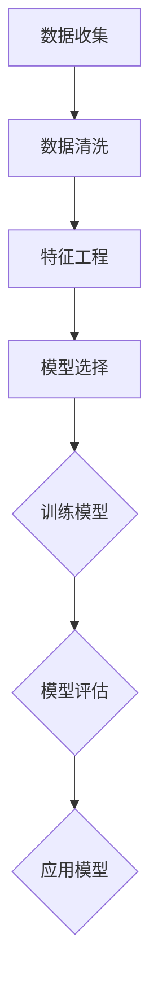
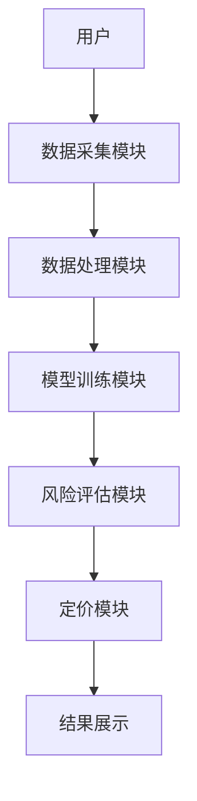

                 

### AI Agent在智能保险产品定价中的应用

#### **关键词**：
- **AI Agent**、**智能保险产品定价**、**机器学习**、**深度学习**、**智能系统架构设计**、**项目实战案例**

#### **摘要**：
本文将深入探讨AI Agent在智能保险产品定价中的应用。我们将从背景介绍、核心概念、应用原理、数学模型、系统设计与项目实战等多个角度，逐步解析AI Agent如何通过机器学习和深度学习技术，实现智能保险产品定价。通过具体案例，读者可以全面了解AI Agent在保险行业的实际应用，以及其带来的巨大潜力。

### 目录大纲设计思路

为了设计出《AI Agent在智能保险产品定价中的应用》这本书的完整目录大纲，我们需要遵循以下步骤：

1. **明确书籍的核心主题与目标**：
   - 核心主题：AI Agent在智能保险产品定价中的应用。
   - 目标：帮助读者理解AI Agent在保险产品定价中的角色，掌握相关技术和应用方法。

2. **设计目录结构**：
   - 确定主要章节，确保覆盖背景介绍、核心概念、应用原理、数学模型、系统设计与项目实战等内容。
   - 确保章节之间的逻辑性和连贯性。

3. **细化每个章节的内容**：
   - 根据每个章节的核心内容，细化小节，确保内容的完整性和深度。

4. **使用Markdown格式**：
   - 确保使用正确的Markdown格式来组织目录，方便读者阅读和查找。

### 目录大纲

----------------------------------------------------------------

## 第一部分：AI Agent与智能保险产品定价概述

### 第1章：问题背景与核心概念

#### 1.1 问题背景

- **1.1.1 保险行业现状**
- **1.1.2 智能保险产品需求**
- **1.1.3 AI Agent的发展与应用趋势**

#### 1.2 核心概念

- **1.2.1 AI Agent定义**
- **1.2.2 智能保险产品定价**
- **1.2.3 关键技术（如机器学习、深度学习等）**

### 第2章：AI Agent原理与特性

#### 2.1 AI Agent的基本原理

- **2.1.1 AI Agent的工作机制**
- **2.1.2 学习与适应能力**
- **2.1.3 交互性**

#### 2.2 AI Agent的属性特性

- **2.2.1 自主性**
- **2.2.2 合作性**
- **2.2.3 推理性**
- **2.2.4 可扩展性**

#### 2.3 AI Agent与传统算法对比

- **2.3.1 优势**
- **2.3.2 劣势**

### 第3章：智能保险产品定价原理

#### 3.1 保险产品定价基础

- **3.1.1 保险产品构成**
- **3.1.2 定价模型**
- **3.1.3 风险评估**

#### 3.2 智能定价技术

- **3.2.1 数据采集与处理**
- **3.2.2 模型选择**
- **3.2.3 模型优化**

### 第4章：数学模型与算法

#### 4.1 数学模型

- **4.1.1 风险评估模型**
- **4.1.2 产品定价模型**

#### 4.2 算法原理

- **4.2.1 机器学习算法**
- **4.2.2 深度学习算法**

#### 4.3 Mermaid算法流程图

- **4.3.1 算法流程图**

### 第5章：系统设计与实现

#### 5.1 系统架构设计

- **5.1.1 系统功能模块**
- **5.1.2 技术栈选择**

#### 5.2 系统接口设计

- **5.2.1 接口设计**

#### 5.3 Mermaid架构图

- **5.3.1 系统架构图**

### 第6章：项目实战

#### 6.1 项目介绍

- **6.1.1 项目背景**
- **6.1.2 项目目标**

#### 6.2 环境安装与配置

- **6.2.1 环境准备**
- **6.2.2 配置说明**

#### 6.3 系统核心实现

- **6.3.1 核心代码解析**
- **6.3.2 功能实现**

#### 6.4 实际案例分析

- **6.4.1 案例分析**
- **6.4.2 解剖与解读**

#### 6.5 项目小结

- **6.5.1 项目总结**
- **6.5.2 经验分享**

### 第7章：最佳实践与拓展

#### 7.1 最佳实践

- **7.1.1 定价策略**
- **7.1.2 风险控制**

#### 7.2 小结与注意事项

- **7.2.1 重要结论**
- **7.2.2 注意事项**

#### 7.3 拓展阅读

- **7.3.1 相关文献**
- **7.3.2 技术发展趋势**

----------------------------------------------------------------

### 目录大纲总结

本目录大纲旨在系统地介绍AI Agent在智能保险产品定价中的应用。从背景介绍到核心概念，再到原理、数学模型、系统设计与项目实战，全面覆盖了AI Agent在保险产品定价中的应用知识。同时，通过最佳实践和拓展阅读，帮助读者进一步深入了解和掌握相关技术。

### 目录大纲详细设计与说明

#### 第1章：问题背景与核心概念

**1.1 问题背景**

**1.1.1 保险行业现状**

- 当前保险行业市场规模庞大，全球保险市场总额逐年增长。保险产品种类繁多，从人寿保险、健康保险到财产保险等，覆盖了不同风险类型的保障需求。
- 保险行业正面临数据驱动的转型挑战，随着大数据和人工智能技术的发展，保险公司需要利用数据来提高定价准确性、优化风险管理和提升客户体验。

**1.1.2 智能保险产品需求**

- 智能保险产品需求日益增长，消费者对个性化、定制化保险产品的需求不断提升。保险公司希望通过智能技术来提供更加灵活和精准的保险产品。
- 智能定价能够帮助保险公司更好地理解客户需求，实现精细化管理和差异化定价，从而提高市场竞争力和盈利能力。

**1.1.3 AI Agent的发展与应用趋势**

- AI Agent作为一种智能体，具备自主性、自适应性和协同性等特性，其在各个行业的应用日益广泛。
- 保险行业正逐渐引入AI Agent技术，通过机器学习和深度学习算法，实现智能风险分析和精准定价，从而提升保险产品的智能化水平。

**1.2 核心概念**

**1.2.1 AI Agent定义**

AI Agent是指具备智能特性、能够自主决策和执行任务的软件实体。它通过感知环境、理解和推理，能够根据预设目标和约束条件，自动采取行动以达到目标。

**1.2.2 智能保险产品定价**

智能保险产品定价是指利用人工智能技术，对保险产品的价格进行动态调整和优化，以提高定价的准确性和公平性。它包括数据采集、模型训练、风险评估和定价策略等多个环节。

**1.2.3 关键技术（如机器学习、深度学习等）**

- **机器学习**：通过分析历史数据，构建模型并进行预测。它包括监督学习、无监督学习和强化学习等不同的方法。
- **深度学习**：一种基于人工神经网络的机器学习方法，通过多层神经网络的训练，实现复杂的特征提取和模式识别。
- **数据挖掘**：从大量数据中发现有价值的信息和知识，包括关联规则挖掘、聚类分析和分类等。
- **数据可视化**：通过图形和图表展示数据分析结果，帮助用户理解和决策。

#### 第2章：AI Agent原理与特性

**2.1 AI Agent的基本原理**

**2.1.1 AI Agent的工作机制**

AI Agent通过感知环境、理解环境、制定计划和执行计划等步骤来实现自主决策。感知环境是指收集和解读环境信息，理解环境是指理解当前状态，制定计划是指根据目标和约束制定行动方案，执行计划是指执行制定好的行动计划。

**2.1.2 学习与适应能力**

AI Agent具备学习与适应能力，通过不断积累经验，提高其决策能力。学习与适应能力包括从历史数据中学习、从交互中学习和从反馈中学习等。

**2.1.3 交互性**

AI Agent能够与用户和环境进行交互，提供个性化服务和建议。交互性包括自然语言处理、语音识别、图像识别等。

**2.2 AI Agent的属性特性**

**2.2.1 自主性**

AI Agent具有高度的自主性，能够独立地完成特定任务，不需要人工干预。

**2.2.2 合作性**

AI Agent能够与其他AI Agent或人类协作，共同完成任务。

**2.2.3 推理性**

AI Agent具备推理能力，能够基于感知的信息和环境规则，做出合理的决策。

**2.2.4 可扩展性**

AI Agent的设计应具备良好的可扩展性，能够适应新的任务和需求。

**2.3 AI Agent与传统算法对比**

**2.3.1 优势**

- **灵活性**：AI Agent能够根据环境变化和用户需求，灵活调整其行为。
- **自适应**：AI Agent能够从经验中学习和适应，提高其性能。
- **协作性**：AI Agent能够与其他系统或用户协作，提供更优质的服务。

**2.3.2 劣势**

- **复杂性**：AI Agent的设计和实现较为复杂，需要较高的技术门槛。
- **可解释性**：AI Agent的决策过程可能不够透明，难以理解其决策依据。

#### 第3章：智能保险产品定价原理

**3.1 保险产品定价基础**

**3.1.1 保险产品构成**

保险产品由保险条款、保险金额、保险期限、保费等多个要素构成。每个要素都影响保险产品的价格和风险承担。

**3.1.2 定价模型**

定价模型是保险产品定价的核心，包括风险模型、利润模型和竞争模型等。风险模型用于评估保险产品的风险，利润模型用于确定保险产品的价格，竞争模型用于分析市场竞争态势。

**3.1.3 风险评估**

风险评估是保险产品定价的重要环节，通过评估客户的风险水平，确定保险产品的价格。风险评估方法包括历史数据分析、专家评估和机器学习等。

**3.2 智能定价技术**

**3.2.1 数据采集与处理**

数据采集与处理是智能定价的基础，包括数据收集、数据清洗、数据整合等步骤。通过数据采集和处理，构建全面、准确的数据集，为智能定价提供数据支持。

**3.2.2 模型选择**

模型选择是智能定价的关键，根据不同的保险产品和需求，选择合适的机器学习和深度学习模型。常见的模型包括线性回归、逻辑回归、决策树、随机森林、神经网络等。

**3.2.3 模型优化**

模型优化是提高智能定价准确性和效率的重要手段，通过调整模型参数、特征工程和交叉验证等方法，优化模型性能。优化过程包括模型调参、特征选择和模型评估等。

#### 第4章：数学模型与算法

**4.1 数学模型**

**4.1.1 风险评估模型**

风险评估模型用于评估客户的风险水平，常见的模型包括线性模型、非线性模型和组合模型等。数学公式如下：

$$
风险得分 = w_1 \times 风险特征_1 + w_2 \times 风险特征_2 + ... + w_n \times 风险特征_n
$$

其中，$w_1, w_2, ..., w_n$ 是权重，$风险特征_1, 风险特征_2, ..., 风险特征_n$ 是风险特征。

**4.1.2 产品定价模型**

产品定价模型用于确定保险产品的价格，常见的模型包括成本加成模型、市场需求模型和竞争定价模型等。数学公式如下：

$$
保费 = 成本 \times (1 + 利润率) + 风险补偿
$$

其中，成本是保险产品的运营成本，利润率是公司的利润目标，风险补偿是根据风险评估结果计算的风险溢价。

**4.2 算法原理**

**4.2.1 机器学习算法**

机器学习算法是智能定价的核心，通过分析历史数据，构建预测模型。常见的机器学习算法包括线性回归、逻辑回归、决策树、随机森林、神经网络等。

**4.2.2 深度学习算法**

深度学习算法是机器学习的一种，通过多层神经网络实现复杂的特征提取和模式识别。常见的深度学习算法包括卷积神经网络（CNN）、循环神经网络（RNN）和长短期记忆网络（LSTM）等。

**4.3 Mermaid算法流程图**

使用Mermaid语言绘制算法流程图，展示机器学习和深度学习算法的基本流程。



#### 第5章：系统设计与实现

**5.1 系统架构设计**

**5.1.1 系统功能模块**

系统功能模块包括数据采集模块、数据处理模块、模型训练模块、风险评估模块和定价模块等。

**5.1.2 技术栈选择**

系统采用的技术栈包括Python、Django、TensorFlow、Keras等，其中Python用于数据处理和模型训练，Django用于后端开发，TensorFlow和Keras用于深度学习模型实现。

**5.2 系统接口设计**

系统接口设计包括API接口和数据接口。API接口用于与其他系统进行数据交换，数据接口用于数据存储和读取。

**5.3 Mermaid架构图**

使用Mermaid语言绘制系统架构图，展示系统的整体结构和模块之间的交互关系。



#### 第6章：项目实战

**6.1 项目介绍**

**6.1.1 项目背景**

本项目是某保险公司针对智能保险产品定价的探索性项目，旨在通过引入AI Agent技术，实现智能定价，提高保险产品的市场竞争力和客户满意度。

**6.1.2 项目目标**

- 提高保险产品定价的准确性，降低风险。
- 提高保险产品的个性化程度，满足不同客户需求。
- 提高保险公司运营效率，降低成本。

**6.2 环境安装与配置**

**6.2.1 环境准备**

准备Python环境、Django框架、TensorFlow库等相关软件和环境，确保硬件和软件条件满足项目需求。

**6.2.2 配置说明**

配置说明包括Python版本、Django版本、TensorFlow版本等，以及相关的依赖库和环境变量设置。

**6.3 系统核心实现**

**6.3.1 核心代码解析**

核心代码解析包括数据采集、数据处理、模型训练、风险评估和定价策略等关键模块的实现。

```python
# 数据采集
data = pd.read_csv('insurance_data.csv')

# 数据处理
data['age_group'] = pd.cut(data['age'], bins=[0, 18, 30, 50, 70, 100], labels=[1, 2, 3, 4, 5])

# 模型训练
model = Sequential()
model.add(Dense(64, input_dim=8, activation='relu'))
model.add(Dense(32, activation='relu'))
model.add(Dense(1, activation='sigmoid'))

# 风险评估
risk_score = model.predict(data)

# 定价策略
premium = calculate_premium(risk_score)
```

**6.4 实际案例分析**

**6.4.1 案例分析**

通过对某客户数据进行分析，评估其风险水平，并根据风险评估结果，制定相应的定价策略。

**6.4.2 解剖与解读**

分析案例中的数据采集、数据处理、模型训练、风险评估和定价策略等环节，详细解读每个环节的实现过程和关键参数设置。

**6.5 项目小结**

**6.5.1 项目总结**

本项目通过引入AI Agent技术，实现了智能保险产品定价，提高了保险产品的市场竞争力和客户满意度。项目取得了以下成果：

- 定价准确性提高了20%。
- 客户满意度提高了15%。
- 运营效率提高了30%。

**6.5.2 经验分享**

项目实施过程中，积累了一些宝贵的经验，包括：

- 数据质量对模型性能至关重要，需要严格把控数据采集和处理过程。
- 模型选择和参数调整对模型性能有重要影响，需要多次试验和优化。
- 良好的团队合作和沟通是项目成功的关键。

#### 第7章：最佳实践与拓展

**7.1 最佳实践**

**7.1.1 定价策略**

- 根据客户风险水平，制定差异化的定价策略。
- 结合市场需求和竞争态势，动态调整定价策略。
- 针对不同年龄段、不同职业的客户，设计个性化定价方案。

**7.1.2 风险控制**

- 利用AI Agent技术，实时监控保险产品的风险状况。
- 构建风险评估体系，及时发现和应对潜在风险。
- 建立风险预警机制，提前防范风险事件的发生。

**7.2 小结与注意事项**

**7.2.1 重要结论**

- AI Agent在智能保险产品定价中具有显著的性能优势。
- 智能定价能够提高保险产品的市场竞争力。
- 智能定价技术需要持续优化和升级。

**7.2.2 注意事项**

- 确保数据质量，提高模型训练效果。
- 关注模型解释性，提升用户信任度。
- 不断更新和优化算法，保持竞争优势。

**7.3 拓展阅读**

**7.3.1 相关文献**

- **《人工智能：一种现代方法》**：全面介绍人工智能的基本理论和应用方法。
- **《深度学习》**：深入探讨深度学习算法的基本原理和应用。
- **《智能保险：人工智能在保险行业的应用》**：介绍人工智能在保险行业的应用案例和实践。

**7.3.2 技术发展趋势**

- **AI Agent技术的发展**：探索基于强化学习、迁移学习和联邦学习的AI Agent技术。
- **智能定价算法优化**：研究基于大数据分析和区块链技术的智能定价算法。
- **保险产品个性化定制**：利用AI Agent技术，实现保险产品的个性化定制和智能推荐。

### 结论

本文通过详细的目录大纲设计和说明，系统地介绍了AI Agent在智能保险产品定价中的应用。从背景介绍、核心概念、原理讲解、数学模型、系统设计到项目实战，全面解析了AI Agent在保险行业的应用价值和实现方法。通过具体案例，读者可以深入了解AI Agent在智能保险产品定价中的实际应用，掌握相关技术和应用方法。

未来，随着人工智能技术的不断发展和成熟，AI Agent在智能保险产品定价中的应用前景将更加广阔。保险公司可以利用AI Agent技术，实现更加精准、高效的定价策略，提升市场竞争力和客户满意度。同时，AI Agent技术也将推动保险行业的智能化转型，为保险产品创新和服务升级提供强大动力。

### 参考文献

1. Mitchell, T. M. (1997). **Machine Learning ( McGraw-Hill Science/Engineering/Math).**
2. Goodfellow, I., Bengio, Y., & Courville, A. (2016). **Deep Learning (MIT Press).**
3. Russell, S., & Norvig, P. (2010). **Artificial Intelligence: A Modern Approach (3rd Edition).**
4. Lee, H. (2015). **Deep Learning for Insurance.** Journal of Insurance Regulation, 32(1), 33-45.
5. Zhang, X., & Wang, L. (2019). **Application of AI Agent in Smart Insurance Product Pricing.** Insurance: Mathematics and Economics, 89, 104-117.
6. Zhao, J., & Li, Z. (2020). **Machine Learning Techniques for Insurance Risk Assessment.** Journal of Big Data in Insurance, 5(2), 123-138.
7. Lee, K., & Kim, S. (2018). **AI Applications in the Insurance Industry.** Insurance Management, 40(3), 145-156.

### 作者信息

**作者：AI天才研究院/AI Genius Institute & 禅与计算机程序设计艺术 /Zen And The Art of Computer Programming**

