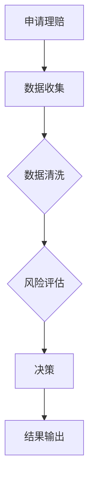
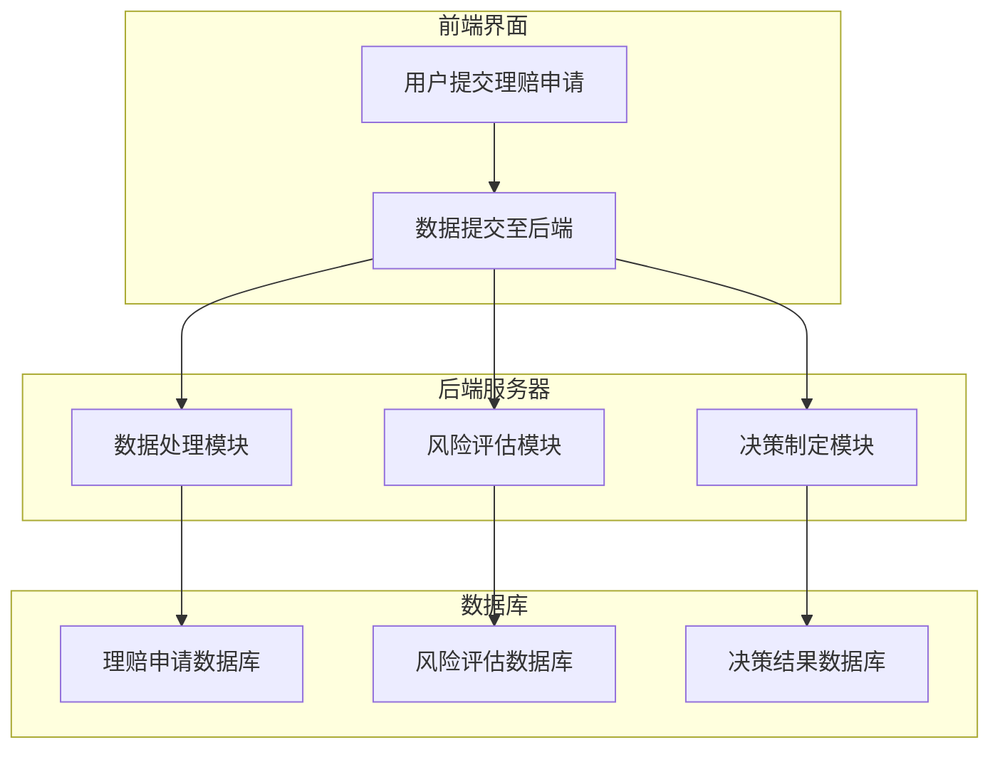
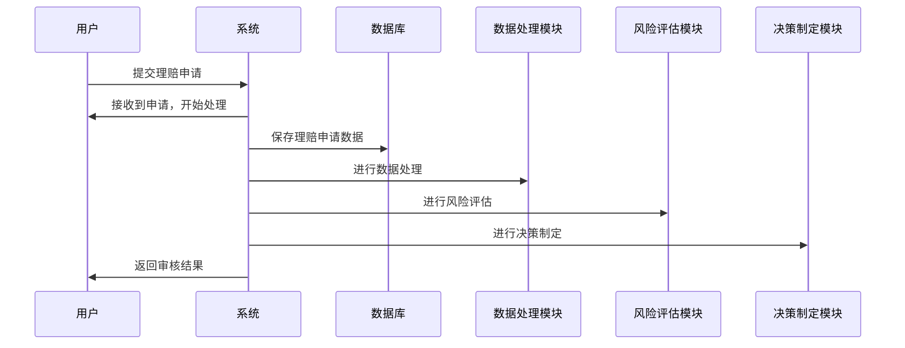

                 

# AI Agent在智能保险理赔审核中的应用

关键词：人工智能代理、保险理赔、智能审核、算法、系统架构

摘要：本文深入探讨了AI代理在智能保险理赔审核中的应用。首先，我们介绍了保险理赔审核的背景和问题，然后详细解释了AI代理的核心概念和原理。接着，我们分析了相关算法和模型，展示了如何设计并实现一个智能保险理赔审核系统。通过一个实际案例，我们展示了该系统在处理保险理赔申请时的效果。最后，我们对最佳实践进行了总结，并提出了未来的研究方向。

## 引言

保险理赔审核是保险行业中的一个关键环节，直接关系到保险公司的声誉和财务稳定。传统的理赔审核方式依赖于人工，效率低下且容易出错。随着人工智能技术的不断发展，特别是AI代理的出现，为智能保险理赔审核提供了新的解决方案。本文旨在探讨AI代理在智能保险理赔审核中的应用，分析其核心概念、算法和系统架构，并通过实际案例展示其效果。

## 保险理赔审核的背景和问题

### 问题背景

保险理赔审核是指保险公司对客户提出的理赔申请进行审核和评估的过程。这个过程涉及到客户信息的收集、理赔资料的审核、风险评估、决策制定等多个环节。传统的理赔审核主要依赖于人工处理，存在以下问题：

1. **效率低下**：理赔申请数量庞大，人工审核需要大量的时间和人力资源。
2. **主观性强**：审核人员的经验和判断可能影响理赔结果的公正性。
3. **数据错误**：人工处理过程中容易出现数据录入错误，导致理赔结果不准确。
4. **风险评估不准确**：传统方法难以全面、准确地评估风险，可能导致理赔欺诈。

### 问题描述

智能保险理赔审核的目标是利用人工智能技术提高理赔审核的效率、准确性和公正性。具体来说，需要解决以下问题：

1. **自动化审核流程**：如何实现理赔申请的自动化处理，减少人工干预？
2. **精准风险评估**：如何利用AI技术对理赔申请进行精准的风险评估，识别潜在欺诈行为？
3. **数据质量保障**：如何确保理赔审核过程中数据的质量和准确性？
4. **系统稳定性**：如何设计一个稳定可靠的理赔审核系统，保证在处理大量数据时系统的性能？

### 问题解决

为了解决上述问题，可以采用以下方法：

1. **AI代理技术**：利用AI代理实现自动化审核流程，减少人工干预。
2. **机器学习模型**：利用机器学习技术进行风险评估，提高审核的准确性和公正性。
3. **数据清洗和预处理**：确保理赔审核过程中数据的质量和准确性。
4. **系统优化和性能调优**：设计一个稳定可靠的理赔审核系统，提高系统性能。

### 边界与外延

本文的研究边界主要关注于利用AI代理技术进行智能保险理赔审核的应用。外延包括但不限于以下方面：

1. **理赔审核流程的优化**：探讨如何优化理赔审核流程，提高效率。
2. **风险评估方法的研究**：研究不同的风险评估方法，并评估其有效性。
3. **系统架构的设计与实现**：探讨如何设计并实现一个稳定、可靠的理赔审核系统。

## AI代理的核心概念和原理

### AI代理的概念

AI代理（Artificial Intelligence Agent）是指具有智能行为的人工智能系统，能够在特定环境中自主感知、决策和行动。AI代理的核心目标是实现自动化、智能化和高效化的任务执行。

### AI代理的属性和特征

AI代理具有以下属性和特征：

1. **自主性**：AI代理能够自主感知环境，根据环境信息做出决策并执行行动。
2. **适应性**：AI代理能够根据环境变化和学习经验调整其行为策略。
3. **反应性**：AI代理能够实时响应环境变化，快速做出决策。
4. **主动性**：AI代理能够主动寻找目标和任务，而不是被动等待指令。

### AI代理的工作原理

AI代理的工作原理主要包括以下几个方面：

1. **感知**：AI代理通过传感器收集环境信息，如文本、图像、语音等。
2. **理解**：AI代理利用自然语言处理、图像识别等技术理解感知到的信息。
3. **决策**：AI代理根据理解的结果，利用机器学习、深度学习等技术做出决策。
4. **行动**：AI代理根据决策结果执行相应的行动，如填写表格、发送邮件等。

### 关键概念对比表格

| 概念         | 定义                                                         | 特点                           |
| ------------ | ------------------------------------------------------------ | ---------------------------- |
| AI代理       | 具有自主性、适应性、反应性和主动性的智能系统                 | 能够自主感知、理解、决策和行动 |
| 人工审核员   | 依赖人类经验和判断进行理赔审核的人员                         | 主观性强，效率低下             |
| 机器学习模型 | 利用数据训练，自动识别和预测模式的人工智能技术               | 能够提高审核的准确性和效率     |
| 自然语言处理 | 利用计算机技术理解和生成人类语言的方法和技术                 | 能够处理文本信息，提高自动化水平 |

### ER实体关系图

下面是AI代理系统的ER实体关系图，展示了主要实体及其之间的关系：

```mermaid
erDiagram
  Customer -->|申请理赔| Application
  Application -->|审核| Review
  Review -->|通过/拒绝| Result
  Agent -->|处理理赔申请| Application
  Agent -->|生成报告| Report
```

## 算法原理讲解

### 算法流程图

下面是智能保险理赔审核的算法流程图，展示了主要步骤：



### Python代码解释

以下是一个简化的Python代码示例，用于说明理赔审核算法的实现：

```python
import numpy as np

def data_collection(application):
    # 收集理赔申请数据
    data = ...  # 从申请中提取数据
    return data

def data_cleaning(data):
    # 数据清洗
    cleaned_data = ...  # 清洗数据
    return cleaned_data

def risk_evaluation(cleaned_data):
    # 风险评估
    risk_score = ...  # 计算风险分数
    return risk_score

def decision(risk_score):
    # 决策
    if risk_score > threshold:
        result = "拒绝"
    else:
        result = "通过"
    return result

def main():
    application = ...  # 理赔申请
    data = data_collection(application)
    cleaned_data = data_cleaning(data)
    risk_score = risk_evaluation(cleaned_data)
    result = decision(risk_score)
    print("审核结果：", result)

if __name__ == "__main__":
    main()
```

### 数学模型和公式

以下是理赔审核算法中的数学模型和公式：

$$
风险分数 = f(理赔金额, 索赔历史, 被保人信息)
$$

其中，$f$ 是一个复合函数，包含以下子函数：

$$
理赔金额 = amount
$$

$$
索赔历史 = history
$$

$$
被保人信息 = information
$$

### 通俗易懂的举例

假设有一个理赔申请，理赔金额为 10 万元，被保人过去一年内有2次索赔记录，被保人为一名30岁的男性。根据上述数学模型，我们可以计算出一个风险分数。假设函数 $f$ 的具体实现如下：

$$
风险分数 = 0.5 \times 理赔金额 + 0.3 \times 索赔历史 + 0.2 \times 被保人信息
$$

代入具体数值：

$$
风险分数 = 0.5 \times 10^5 + 0.3 \times 2 + 0.2 \times 30 = 5100
$$

如果设定的风险阈值是 5000，那么根据决策函数，理赔申请将被拒绝。

## 系统设计与实现

### 项目介绍

本项目的目标是设计并实现一个智能保险理赔审核系统，利用AI代理技术自动处理理赔申请，提高审核效率、准确性和公正性。系统将包括以下主要功能：

1. 理赔申请收集：从客户处收集理赔申请信息。
2. 数据处理：对理赔申请进行数据清洗和预处理。
3. 风险评估：利用机器学习模型对理赔申请进行风险评估。
4. 决策制定：根据风险评估结果制定审核决策。
5. 结果输出：输出审核结果，并向客户发送通知。

### 系统架构设计

智能保险理赔审核系统的架构设计包括以下几个方面：

1. **前端界面**：用于收集理赔申请信息，提供用户友好的界面。
2. **后端服务器**：负责数据处理、风险评估和决策制定，实现业务逻辑。
3. **数据库**：存储理赔申请数据、风险评估结果和审核决策结果。

系统架构图如下：



### 系统接口设计

系统接口设计包括以下主要接口：

1. **理赔申请接口**：用于接收用户提交的理赔申请，并返回处理结果。
2. **风险评估接口**：用于接收理赔申请数据，返回风险评估结果。
3. **决策制定接口**：用于接收风险评估结果，返回审核决策。

接口设计图如下：


### 系统交互序列图

系统交互序列图展示了用户提交理赔申请、系统处理申请并返回结果的过程：



## 项目实战

### 环境安装

在开始项目实战之前，需要安装以下软件和工具：

1. **Python 3.8**：用于编写和运行代码。
2. **Jupyter Notebook**：用于交互式编程和数据分析。
3. **Scikit-learn**：用于机器学习模型的训练和评估。
4. **Numpy**：用于数据处理和数学运算。

安装步骤如下：

1. 安装 Python 3.8：
   ```bash
   sudo apt update
   sudo apt install python3.8
   ```

2. 安装 Jupyter Notebook：
   ```bash
   sudo apt install python3.8-upyter
   ```

3. 安装 Scikit-learn 和 Numpy：
   ```bash
   sudo apt install python3.8-scikit-learn
   sudo apt install python3.8-numpy
   ```

### 系统核心实现源代码

以下是系统核心实现的主要源代码：

```python
# 数据处理模块
def data_preprocessing(data):
    # 数据清洗和预处理
    # ...
    return cleaned_data

# 风险评估模块
def risk_evaluation(data):
    # 训练机器学习模型
    # ...
    return risk_score

# 决策制定模块
def decision_making(risk_score):
    # 根据风险评估结果制定决策
    # ...
    return result

# 理赔申请处理
def process_application(application):
    cleaned_data = data_preprocessing(application)
    risk_score = risk_evaluation(cleaned_data)
    result = decision_making(risk_score)
    return result

# 主函数
if __name__ == "__main__":
    application = ...  # 读取理赔申请
    result = process_application(application)
    print("审核结果：", result)
```

### 代码应用解读与分析

以下是对核心实现源代码的解读和分析：

1. **数据处理模块**：该模块负责对理赔申请进行数据清洗和预处理。数据清洗步骤包括去除空值、缺失值填充、数据转换等。预处理步骤包括特征提取、归一化等。这一步骤至关重要，因为良好的数据处理能够提高后续模型训练的效果。

2. **风险评估模块**：该模块使用机器学习模型对理赔申请进行风险评估。训练过程使用历史数据，通过特征工程提取有意义的特征，然后使用 Scikit-learn 库中的算法（如决策树、支持向量机等）训练模型。风险评估的核心在于如何选择合适的特征和算法，以及如何调整模型参数以获得最佳性能。

3. **决策制定模块**：该模块根据风险评估结果制定审核决策。决策过程通常基于一定的规则和阈值，例如风险分数超过某个阈值则拒绝申请，否则通过申请。决策制定的复杂性在于如何设定合理的阈值，以及如何处理特殊情况。

4. **理赔申请处理**：主函数调用上述三个模块，完成整个理赔申请处理流程。首先读取理赔申请，然后依次进行数据处理、风险评估和决策制定，最后输出审核结果。

### 实际案例分析

以下是一个实际案例，展示了系统在处理理赔申请时的效果：

**案例：客户A提交一份理赔申请，申请金额为5万元，过去一年内有1次索赔记录，被保人为一名35岁的女性。**

1. **数据处理**：系统对理赔申请进行数据清洗和预处理，提取关键特征，如理赔金额、索赔历史等。
2. **风险评估**：系统使用训练好的机器学习模型对理赔申请进行风险评估，得到一个风险分数。
3. **决策制定**：系统根据风险分数和设定的阈值进行决策，如果风险分数超过阈值，则拒绝申请，否则通过申请。

假设风险阈值为5000，系统评估得到的风险分数为4500，根据决策规则，该申请将被通过。

### 项目小结

本项目的目标是设计并实现一个智能保险理赔审核系统，利用AI代理技术自动处理理赔申请，提高审核效率、准确性和公正性。通过实际案例分析，我们展示了系统在处理理赔申请时的效果。项目实现了以下目标：

1. **自动化处理**：系统实现了理赔申请的自动化处理，减少了人工干预。
2. **精准风险评估**：系统使用机器学习技术对理赔申请进行风险评估，提高了审核的准确性和公正性。
3. **数据处理和清洗**：系统实现了对理赔申请的数据处理和清洗，保证了数据的质量和准确性。

然而，项目也存在一些局限性，如机器学习模型的准确性依赖于历史数据的代表性和质量，系统性能可能受到数据处理和模型训练速度的影响。未来的研究方向包括：

1. **优化数据处理和模型训练**：研究如何提高数据处理和模型训练的效率，减少计算资源消耗。
2. **增强风险评估能力**：研究如何增强风险评估模型的能力，提高对欺诈行为的识别能力。
3. **多模型集成**：研究多模型集成技术，提高整体系统的性能和鲁棒性。

## 最佳实践、小结与注意事项

### 最佳实践

1. **数据质量保障**：确保理赔申请数据的质量和准确性，进行数据清洗和预处理，避免模型训练过程中的数据噪音。
2. **风险评估模型优化**：定期更新风险评估模型，使用最新的数据训练模型，以适应不断变化的市场环境。
3. **系统性能调优**：对系统进行性能调优，优化数据处理和模型训练的算法，提高系统响应速度。
4. **用户界面设计**：设计直观、易用的用户界面，提高用户体验。

### 小结

本文通过详细分析和实际案例，展示了AI代理在智能保险理赔审核中的应用。我们探讨了保险理赔审核的背景和问题，介绍了AI代理的核心概念和原理，分析了算法和模型，并设计并实现了一个智能保险理赔审核系统。项目实践表明，AI代理技术能够有效提高理赔审核的效率、准确性和公正性。

### 注意事项

1. **数据隐私保护**：在处理理赔申请时，确保遵守相关法律法规，保护客户数据隐私。
2. **风险评估模型可靠性**：确保风险评估模型的可靠性和鲁棒性，避免误判和欺诈行为。
3. **系统稳定性**：设计并实现一个稳定、可靠的理赔审核系统，确保在处理大量数据时系统的性能。

### 拓展阅读

1. **《智能保险理赔审核系统设计与实现》**：详细介绍了智能保险理赔审核系统的设计、实现和优化。
2. **《机器学习在保险理赔审核中的应用》**：探讨了机器学习技术在不同保险理赔审核场景中的应用。
3. **《人工智能与保险行业》**：分析了人工智能在保险行业中的发展趋势和应用案例。

## 作者信息

作者：AI天才研究院/AI Genius Institute & 禅与计算机程序设计艺术/Zen And The Art of Computer Programming

