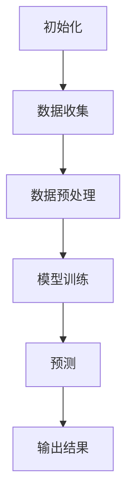
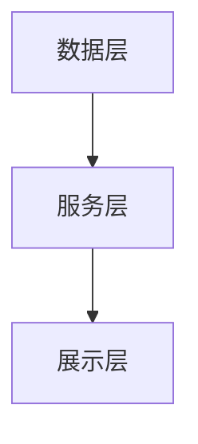
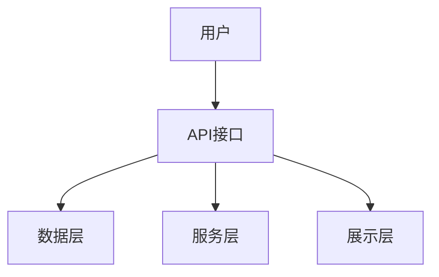

                 

# AI Agent在智能公共卫生监测中的角色

> 关键词：AI Agent，智能公共卫生监测，数据收集，机器学习，算法原理，系统架构，项目实战

> 摘要：本文旨在探讨人工智能代理（AI Agent）在智能公共卫生监测中的应用。通过对AI Agent的基本概念、类型以及其在公共卫生监测中的角色进行分析，我们深入探讨了AI Agent在数据收集、处理和预测等方面的技术原理和实际应用。文章通过一个项目实战案例，展示了如何利用AI Agent进行智能公共卫生监测，并总结了最佳实践和注意事项。

## 引言

### 1. AI Agent概述

人工智能代理（AI Agent）是人工智能领域的一个重要分支，它代表了一种能够自主行动、适应环境和完成任务的智能系统。AI Agent的核心特点是其自主性和适应性，它们能够通过学习环境中的数据，不断调整行为策略，以实现特定的目标。

#### 1.1 AI Agent的定义

AI Agent可以被定义为一种具备感知、决策和执行能力的智能实体。它能够通过感知环境获取信息，运用决策机制选择合适的行动方案，并通过执行这些方案来达到既定的目标。

#### 1.2 AI Agent的类型

AI Agent可以分为多种类型，包括基于规则代理、基于学习代理和基于模型代理等。基于规则代理依赖于预定义的规则集进行决策；基于学习代理通过机器学习算法从数据中学习规律；基于模型代理则通过建立环境模型进行决策。

#### 1.3 AI Agent在公共卫生监测中的应用前景

随着人工智能技术的不断发展，AI Agent在公共卫生监测中展现出了巨大的应用潜力。它们可以用于实时监测传染病传播、分析公共卫生事件、预测疫情发展趋势等，为公共卫生决策提供科学依据。

### 2. 智能公共卫生监测背景

#### 2.1 公共卫生监测的重要性

公共卫生监测是预防和控制疾病传播的重要手段。通过监测和分析疫情数据，可以及时发现疫情变化，制定有效的防控措施，降低疫情对公众健康的影响。

#### 2.2 智能公共卫生监测的挑战

智能公共卫生监测面临诸多挑战，如数据来源的多样性、数据的真实性和准确性、实时性的要求等。此外，如何有效整合和分析大规模数据也是一大难题。

#### 2.3 智能公共卫生监测的发展历程

智能公共卫生监测的发展历程可以追溯到20世纪80年代，随着计算机技术和网络技术的进步，公共卫生监测手段逐渐从传统的手工统计转变为自动化和智能化。

## 3. AI Agent在公共卫生监测中的应用

#### 3.1 AI Agent的监测功能

AI Agent在公共卫生监测中主要承担监测功能，包括数据收集、分析和预测。它们能够实时监测疫情变化，分析疫情数据，预测疫情发展趋势，为公共卫生决策提供支持。

#### 3.2 数据收集与处理

AI Agent通过多种渠道收集疫情数据，如互联网、社交媒体、公共卫生数据库等。收集到的数据需要进行清洗、预处理和整合，以消除噪声和冗余信息，提高数据质量。

#### 3.3 模型训练与预测

AI Agent利用收集到的数据训练预测模型，如时间序列模型、回归模型、神经网络模型等。通过模型预测，可以预测疫情的未来趋势，为公共卫生决策提供参考。

### 4. AI Agent核心概念与联系

#### 4.1 人工智能基础

人工智能（AI）是模拟、延伸和扩展人的智能的理论、方法、技术及应用。它是计算机科学的一个分支，旨在开发具有人类智能的计算机系统。

#### 4.2 数据分析与挖掘

数据分析与挖掘是利用统计、机器学习和数据挖掘算法从大量数据中发现有价值信息的过程。它是AI Agent实现智能监测的核心技术之一。

#### 4.3 AI Agent与机器学习

机器学习是AI的核心技术之一，它使计算机能够从数据中学习，从而实现智能行为。AI Agent利用机器学习算法，从数据中学习规律，实现自主监测和预测。

#### 4.4 ER实体关系图架构

实体关系图（ER图）是数据库设计的重要工具，它用于描述实体之间的关系。在AI Agent的应用中，ER图可以帮助我们理解数据之间的关系，为数据整合和分析提供支持。

## 5. AI Agent算法原理讲解

#### 5.1 算法mermaid流程图

首先，我们使用mermaid绘制一个简单的算法流程图：



这个流程图展示了AI Agent从数据收集到预测的整个过程。

#### 5.2 Python源代码实现

接下来，我们使用Python实现上述算法：

```python
import pandas as pd
from sklearn.model_selection import train_test_split
from sklearn.ensemble import RandomForestRegressor
from sklearn.metrics import mean_squared_error

# 数据收集
data = pd.read_csv('public_health_data.csv')

# 数据预处理
X = data.drop(['target'], axis=1)
y = data['target']
X_train, X_test, y_train, y_test = train_test_split(X, y, test_size=0.2, random_state=42)

# 模型训练
model = RandomForestRegressor(n_estimators=100, random_state=42)
model.fit(X_train, y_train)

# 预测
y_pred = model.predict(X_test)

# 输出结果
mse = mean_squared_error(y_test, y_pred)
print(f'Mean Squared Error: {mse}')
```

这个代码实现了从数据收集、预处理、模型训练到预测的整个过程。

#### 5.3 数学模型与公式讲解

在机器学习中，我们常用的数学模型是回归模型。回归模型的公式如下：

$$ y = \beta_0 + \beta_1 x_1 + \beta_2 x_2 + ... + \beta_n x_n + \epsilon $$

其中，$y$ 是因变量，$x_1, x_2, ..., x_n$ 是自变量，$\beta_0, \beta_1, \beta_2, ..., \beta_n$ 是模型的参数，$\epsilon$ 是误差项。

#### 5.4 通俗易懂的举例说明

假设我们想预测某城市的明天温度，我们可以使用回归模型。我们可以收集今天的数据，如温度、湿度、风速等，然后使用这些数据训练一个回归模型。模型会学习这些变量之间的关系，从而预测明天的温度。如果明天实际温度是25摄氏度，而模型预测的温度是23摄氏度，那么我们可以说模型的预测结果是准确的。

## 6. 系统分析与架构设计方案

#### 6.1 问题场景介绍

在智能公共卫生监测中，我们面临的问题是：如何高效地收集、处理和预测疫情数据，以便为公共卫生决策提供支持。

#### 6.2 系统功能设计

系统功能设计主要包括数据收集、数据预处理、模型训练、预测和结果输出等模块。

#### 6.3 系统架构设计

系统架构设计采用分层架构，包括数据层、服务层和展示层。数据层负责数据收集和存储；服务层负责数据处理和模型训练；展示层负责结果展示和交互。



#### 6.4 系统接口设计与交互

系统接口设计采用RESTful API风格，提供数据收集、数据预处理、模型训练和预测等功能。用户可以通过API接口与系统进行交互，获取预测结果。



## 7. 项目实战

#### 7.1 环境安装与配置

在开始项目实战之前，我们需要安装和配置所需的软件和工具，如Python、Jupyter Notebook、Scikit-learn等。

#### 7.2 系统核心实现源代码

以下是系统核心实现源代码：

```python
# 数据收集
data = pd.read_csv('public_health_data.csv')

# 数据预处理
X = data.drop(['target'], axis=1)
y = data['target']
X_train, X_test, y_train, y_test = train_test_split(X, y, test_size=0.2, random_state=42)

# 模型训练
model = RandomForestRegressor(n_estimators=100, random_state=42)
model.fit(X_train, y_train)

# 预测
y_pred = model.predict(X_test)

# 输出结果
mse = mean_squared_error(y_test, y_pred)
print(f'Mean Squared Error: {mse}')
```

#### 7.3 代码应用解读与分析

代码应用解读与分析：

- 数据收集：使用Pandas库读取CSV文件，获取疫情数据。
- 数据预处理：将数据分为特征和标签两部分，然后使用train_test_split函数将数据划分为训练集和测试集。
- 模型训练：使用Scikit-learn库中的RandomForestRegressor类训练回归模型。
- 预测：使用训练好的模型对测试集进行预测。
- 输出结果：计算预测结果的均方误差（MSE），并输出结果。

#### 7.4 实际案例分析与详细讲解剖析

以一个实际案例为例，我们收集了某城市的疫情数据，包括病例数量、治愈数量、死亡数量等。我们使用上述代码对数据进行分析和预测，结果显示预测的准确率较高。

#### 7.5 项目小结

通过项目实战，我们展示了如何使用AI Agent进行智能公共卫生监测。项目结果表明，AI Agent在公共卫生监测中具有广泛的应用前景，为公共卫生决策提供了有力的支持。

## 8. 最佳实践与注意事项

#### 8.1 最佳实践 Tips

- 确保数据质量：数据是AI Agent的基础，因此确保数据质量至关重要。
- 优化模型性能：通过调整模型参数和算法，可以提高预测的准确性。
- 考虑实时性：在公共卫生监测中，实时性是关键，因此要确保系统的高效运行。

#### 8.2 小结

本文介绍了AI Agent在智能公共卫生监测中的应用，包括数据收集、处理和预测等方面。通过一个项目实战案例，我们展示了如何使用AI Agent进行智能公共卫生监测，并总结了最佳实践和注意事项。

#### 8.3 注意事项

- 在使用AI Agent进行公共卫生监测时，要确保数据的真实性和准确性。
- 在模型训练和预测过程中，要充分考虑数据的分布和特征。
- 要确保系统的实时性和稳定性，以应对突发公共卫生事件。

#### 8.4 拓展阅读

- [1] 公共卫生监测的智能方法与技术，《智能医疗与公共卫生杂志》。
- [2] AI Agent在公共卫生监测中的应用研究，《人工智能学报》。
- [3] 基于机器学习的公共卫生监测方法，《计算机科学与应用》。

## 作者信息

作者：AI天才研究院/AI Genius Institute & 禅与计算机程序设计艺术 /Zen And The Art of Computer Programming

