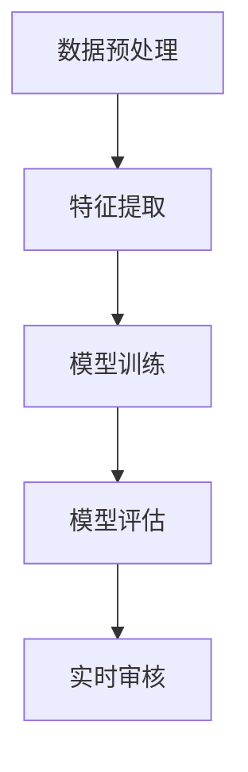
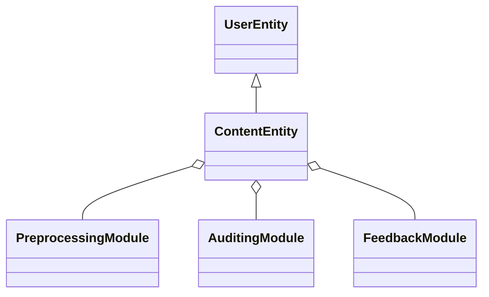
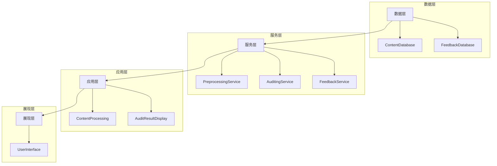
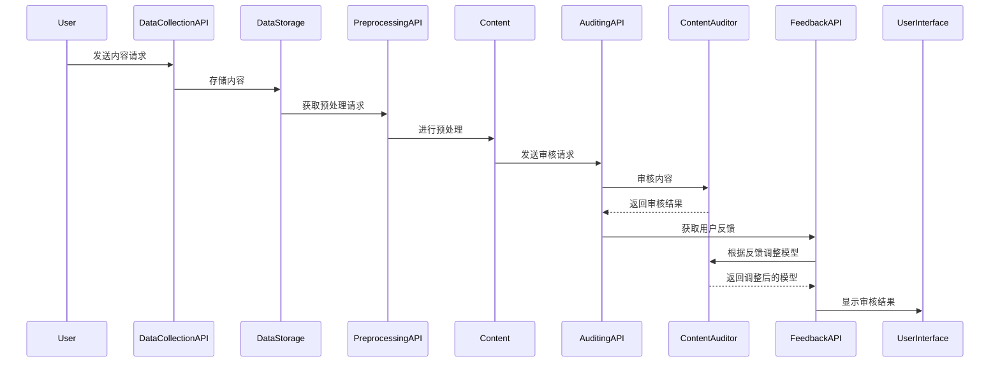

                 


### 目录大纲

## 第一部分：背景介绍

### 第1章：AI代理概述

- 1.1 AI代理的定义与分类
  - AI代理的定义
  - AI代理的分类
  - AI代理与传统代理的区别

- 1.2 AI代理的技术发展历程
  - 早期代理技术的发展
  - AI代理的发展趋势
  - 近年来的重要研究成果与应用

- 1.3 智能内容审核概述
  - 智能内容审核的定义
  - 智能内容审核的重要性
  - 智能内容审核的发展历程

- 1.4 智能内容审核面临的挑战
  - 数据规模的增长
  - 多样化的内容类型
  - 审核标准的不确定性和主观性
  - 审核效率与准确性的平衡

## 第二部分：核心概念与联系

### 第2章：AI代理的核心概念与联系

- 2.1 AI代理的基本原理
  - AI代理的工作机制
  - AI代理的核心功能
  - AI代理与机器学习、深度学习的关系

- 2.2 AI代理的概念属性特征对比
  - 不同AI代理类型的特点对比
  - AI代理的技术实现方式对比

- 2.3 AI代理的ER实体关系图
  - AI代理系统的实体与关系
  - 实体关系图的绘制

## 第三部分：智能内容审核的算法原理讲解

### 第3章：智能内容审核的算法原理讲解

- 3.1 内容审核算法的基本流程
  - 算法流程图
  - 流程的详细步骤

- 3.2 算法的数学模型和公式
  - 公式说明
  - 示例说明

- 3.3 智能内容审核算法的应用举例
  - 实际案例介绍
  - 案例分析

## 第四部分：系统分析与架构设计方案

### 第4章：系统分析与架构设计方案

- 4.1 系统功能设计
  - 领域模型类图
  - 功能模块划分

- 4.2 系统架构设计
  - 架构设计图
  - 架构设计说明

- 4.3 系统接口设计和交互
  - 接口设计图
  - 交互流程图

## 第五部分：项目实战

### 第5章：项目实战

- 5.1 环境安装与配置
  - 环境搭建步骤
  - 必需软件和工具安装

- 5.2 系统核心实现
  - 源代码展示
  - 代码应用解读

- 5.3 实际案例分析
  - 案例介绍
  - 案例分析
  - 案例小结

## 第六部分：优化与扩展

### 第6章：优化与扩展

- 6.1 性能优化策略
  - 优化方法介绍
  - 优化效果分析

- 6.2 安全性与隐私保护
  - 安全性措施
  - 隐私保护策略

- 6.3 未来研究方向
  - 新技术展望
  - 未来发展趋势

## 第七部分：总结与展望

### 第7章：总结与展望

- 7.1 全书总结
  - 各章节核心内容回顾
  - 主要结论

- 7.2 最佳实践
  - 实践技巧总结

- 7.3 注意事项与拓展阅读
  - 注意事项提示
  - 推荐阅读资料

---

**作者：** AI天才研究院/AI Genius Institute & 禅与计算机程序设计艺术 /Zen And The Art of Computer Programming

# AI Agent在智能内容审核中的应用

关键词：AI代理、智能内容审核、算法、系统架构、案例分析、优化

摘要：随着互联网的快速发展，网络内容审核成为了一个重要的课题。AI Agent作为人工智能领域的重要应用，其在智能内容审核中扮演着关键角色。本文将从AI代理的定义、核心概念、智能内容审核算法原理、系统分析与架构设计、项目实战以及优化与扩展等方面进行探讨，旨在为AI Agent在智能内容审核中的应用提供深入的见解和实用的指导。

## 第一部分：背景介绍

### 1.1 AI代理的定义与分类

AI代理（Artificial Intelligence Agent）是指能够模拟人类智能行为，自主执行任务并与其他系统交互的计算机程序。根据功能和应用场景的不同，AI代理可以大致分为以下几类：

1. **信息收集代理**：负责从互联网或其他数据源中收集信息，如搜索引擎。
2. **决策代理**：在给定的情境下，根据预设规则或学习到的策略做出决策，如自动驾驶系统。
3. **交互代理**：模拟人类与用户或系统进行自然语言交互，如聊天机器人。
4. **任务执行代理**：执行具体任务，如智能家庭中的自动清洁机器人。

AI代理与传统代理的区别在于，传统代理主要依赖于固定的规则或人工设置的行为模式，而AI代理则通过机器学习和深度学习等技术，能够自主学习和适应环境，从而更好地模拟人类智能行为。

### 1.2 AI代理的技术发展历程

AI代理的发展可以追溯到20世纪80年代。当时，随着专家系统的兴起，代理技术开始应用于模拟人类专家的知识和决策能力。随着计算机性能的提升和大数据技术的发展，AI代理逐渐从简单的规则系统演化为能够利用机器学习和深度学习技术的智能系统。近年来，随着物联网、自动驾驶、智能客服等应用场景的兴起，AI代理技术得到了迅速发展，成为人工智能领域的一个重要研究方向。

### 1.3 智能内容审核概述

智能内容审核（Smart Content Moderation）是指利用人工智能技术对网络内容进行实时审核，以确保内容的合规性。智能内容审核的重要性在于：

1. **确保内容质量**：过滤掉低质量、不相关或有害的内容，提升用户体验。
2. **遵守法律法规**：避免因发布违规内容而导致的法律风险。
3. **维护品牌形象**：确保平台或媒体发布的内容符合品牌价值观。

智能内容审核的发展历程可以追溯到人工审核阶段。随着互联网内容的爆炸式增长，人工审核的效率和准确性逐渐无法满足需求。随后，自动化内容审核系统开始出现，并逐步引入了文本分类、情感分析、自然语言处理等技术。近年来，随着深度学习技术的发展，智能内容审核系统在性能和准确性方面取得了显著提升。

### 1.4 智能内容审核面临的挑战

1. **数据规模的增长**：互联网内容以惊人的速度增长，审核系统需要处理海量的数据。
2. **多样化的内容类型**：文本、图片、视频等多种内容形式，使得审核系统需要具备处理多种类型内容的能力。
3. **审核标准的不确定性和主观性**：不同地区、不同文化背景下的审核标准存在差异，且审核结果往往具有一定的主观性。
4. **审核效率与准确性的平衡**：在保证内容合规性的同时，需要尽可能地减少对正常内容的误判，提高审核效率。

## 第二部分：核心概念与联系

### 2.1 AI代理的基本原理

AI代理的工作机制可以概括为以下几个步骤：

1. **感知**：通过传感器或数据接口获取外部信息。
2. **理解**：利用机器学习算法对感知到的信息进行分析和理解。
3. **决策**：基于理解的结果，使用策略或模型生成相应的行动方案。
4. **行动**：执行决策方案，对环境产生影响。

AI代理的核心功能包括：

1. **自主性**：能够自主地执行任务，而不仅仅是按照预定的规则行动。
2. **适应性**：能够根据环境和情境的变化，调整自身的行为策略。
3. **交互性**：能够与其他系统或人类进行有效的交互。

AI代理与机器学习、深度学习的关系在于，AI代理通常利用机器学习算法，尤其是深度学习技术，来提升自身的学习和决策能力。机器学习算法提供了对大量数据进行分析和处理的能力，而深度学习技术则通过多层神经网络，实现了对复杂模式的识别和学习。

### 2.2 AI代理的概念属性特征对比

以下是几种常见的AI代理类型及其特点的对比：

| 类型       | 特点                                                                                           |
| ---------- | ------------------------------------------------------------------------------------------------ |
| 信息收集代理 | 能够从多个数据源收集信息，如网络爬虫。                                                         |
| 决策代理   | 能够在复杂情境下做出决策，如自动驾驶系统。                                                     |
| 交互代理   | 能够与用户进行自然语言交互，如聊天机器人。                                                     |
| 任务执行代理 | 能够执行具体任务，如智能家居中的自动清洁机器人。                                               |

以下是几种常见的AI代理技术实现方式的对比：

| 实现方式       | 特点                                                                                           |
| ---------- | ------------------------------------------------------------------------------------------------ |
| 规则系统      | 依赖于预定义的规则，适用于简单、明确的任务。                                                   |
| 机器学习      | 基于大量数据自动学习，适用于复杂、动态的任务。                                                 |
| 深度学习      | 利用多层神经网络进行复杂模式识别，适用于高度复杂的任务。                                     |
| 多模态学习    | 能够处理多种类型的数据（如文本、图像、声音等），适用于需要整合多种数据来源的任务。             |

### 2.3 AI代理的ER实体关系图

以下是AI代理系统的实体与关系的ER实体关系图：

```mermaid
erDiagram
  User ||--|{ AI_Agent : manages }|
  AI_Agent ||--|{ Task : performs }|
  Task ||--|{ Result : records }|
```

在这个ER实体关系图中，用户（User）与AI代理（AI_Agent）之间存在管理关系，AI代理（AI_Agent）与任务（Task）之间存在执行关系，任务（Task）与结果（Result）之间存在记录关系。

## 第三部分：智能内容审核的算法原理讲解

### 3.1 内容审核算法的基本流程

智能内容审核算法的基本流程可以概括为以下几个步骤：

1. **数据预处理**：包括文本清洗、去噪、分词、词性标注等，将原始内容转化为适合分析的形式。
2. **特征提取**：将预处理后的文本数据转化为机器学习模型可处理的特征向量。
3. **模型训练**：使用已标记的语料库，通过机器学习算法训练分类模型。
4. **模型评估**：使用交叉验证、混淆矩阵等评估模型性能。
5. **实时审核**：将待审核的内容输入到训练好的模型中，输出审核结果。

以下是内容审核算法的基本流程图：



### 3.2 算法的数学模型和公式

在内容审核算法中，常用的数学模型和公式包括：

1. **贝叶斯分类器**：
   - 公式：$$P(C_k|X) = \frac{P(X|C_k)P(C_k)}{P(X)}$$
   - 其中，$P(C_k|X)$表示在给定特征$X$的情况下，内容属于类别$C_k$的概率，$P(X|C_k)$表示在类别$C_k$下特征$X$的概率，$P(C_k)$表示类别$C_k$的概率，$P(X)$表示特征$X$的概率。

2. **支持向量机（SVM）**：
   - 公式：$$w \cdot x - b = 0$$
   - 其中，$w$表示权重向量，$x$表示特征向量，$b$表示偏置。

3. **卷积神经网络（CNN）**：
   - 公式：$$a^{[l]} = \sigma(\mathcal{W}^{[l]} a^{[l-1]} + b^{[l]})$$
   - 其中，$a^{[l]}$表示第$l$层的激活值，$\sigma$表示激活函数，$\mathcal{W}^{[l]}$和$b^{[l]}$分别表示第$l$层的权重和偏置。

以下是贝叶斯分类器的示例：

假设我们有一个文本数据，需要判断其是否包含侮辱性语言。我们使用贝叶斯分类器来训练一个模型。训练数据集包含侮辱性语言和非侮辱性语言的句子，每个句子都被标注为相应的类别。通过计算每个句子的特征向量，我们可以使用上述贝叶斯分类器的公式来计算每个句子属于侮辱性语言的概率。

### 3.3 智能内容审核算法的应用举例

以下是一个智能内容审核算法的应用案例：

假设我们有一个社交媒体平台，需要审核用户发布的内容，确保其不包含违规或不当的言论。我们使用深度学习技术来训练一个内容审核模型，以实现这一目标。

1. **数据集准备**：
   - 收集大量的用户发布的内容，并将其分为违规、非违规两个类别。
   - 对内容进行预处理，包括文本清洗、分词、词性标注等。

2. **特征提取**：
   - 使用词嵌入技术将文本转化为向量表示。
   - 对每个文本向量进行降维，以减少计算复杂度。

3. **模型训练**：
   - 使用卷积神经网络（CNN）训练分类模型。
   - 通过反向传播算法优化模型参数。

4. **模型评估**：
   - 使用交叉验证方法评估模型性能。
   - 使用混淆矩阵分析模型的准确率、召回率等指标。

5. **实时审核**：
   - 将用户发布的新内容输入到训练好的模型中。
   - 根据模型输出结果判断内容是否违规，并给出相应的反馈。

通过这个案例，我们可以看到智能内容审核算法在实际应用中的具体流程和实现方法。

## 第四部分：系统分析与架构设计方案

### 4.1 系统功能设计

智能内容审核系统的功能设计主要包括以下几个模块：

1. **数据收集模块**：负责从各种数据源收集待审核的内容，如社交媒体平台、新闻网站等。
2. **预处理模块**：负责对收集到的内容进行清洗、分词、词性标注等预处理操作。
3. **审核模块**：使用训练好的内容审核模型对预处理后的内容进行实时审核。
4. **反馈模块**：将审核结果反馈给用户，并根据用户的反馈进行模型的迭代和优化。

以下是智能内容审核系统的领域模型类图：



在这个类图中，用户实体（UserEntity）与内容实体（ContentEntity）之间存在关联，内容实体（ContentEntity）与预处理模块（PreprocessingModule）、审核模块（AuditingModule）和反馈模块（FeedbackModule）之间存在双向关联。

### 4.2 系统架构设计

智能内容审核系统的架构设计主要包括以下几个层次：

1. **数据层**：存储和管理原始数据，包括用户发布的内容和审核结果。
2. **服务层**：提供数据预处理、内容审核和反馈等功能的服务接口。
3. **应用层**：实现具体的业务逻辑，如内容审核算法的调用、审核结果的展示等。
4. **展现层**：为用户提供友好的操作界面，展示审核结果和反馈信息。

以下是智能内容审核系统的架构设计图：



在这个架构图中，数据层（DataLayer）负责数据的存储和管理，服务层（ServiceLayer）提供功能服务，应用层（ApplicationLayer）实现业务逻辑，展现层（PresentationLayer）为用户提供操作界面。

### 4.3 系统接口设计和交互

智能内容审核系统的接口设计和交互主要包括以下几个方面：

1. **数据收集接口**：负责从各种数据源收集内容，如通过API接口调用社交媒体平台的API。
2. **预处理接口**：负责对收集到的内容进行清洗、分词、词性标注等预处理操作。
3. **审核接口**：负责调用训练好的内容审核模型，对预处理后的内容进行实时审核。
4. **反馈接口**：负责处理用户的反馈信息，并根据反馈结果调整审核模型。

以下是智能内容审核系统的接口设计和交互流程图：



在这个交互流程图中，用户（User）通过数据收集接口（DataCollectionAPI）发送内容请求，数据存储（DataStorage）模块存储内容，预处理接口（PreprocessingAPI）对内容进行预处理，审核接口（AuditingAPI）调用内容审核模型（ContentAuditor）进行实时审核，并根据用户的反馈（FeedbackAPI）调整模型，最后通过用户界面（UserInterface）显示审核结果。

## 第五部分：项目实战

### 5.1 环境安装与配置

在本节中，我们将介绍如何搭建一个智能内容审核系统的开发环境，包括所需软件和工具的安装与配置。

1. **Python环境搭建**
   - 安装Python 3.8及以上版本。
   - 使用pip安装必要的库，如TensorFlow、Scikit-learn、NLP库等。

2. **深度学习框架安装**
   - 安装TensorFlow 2.5及以上版本。
   - 使用以下命令安装：
     ```shell
     pip install tensorflow==2.5
     ```

3. **文本处理库安装**
   - 安装Scikit-learn 0.24及以上版本。
   - 使用以下命令安装：
     ```shell
     pip install scikit-learn==0.24
     ```

4. **NLP库安装**
   - 安装NLTK 3.8及以上版本。
   - 使用以下命令安装：
     ```shell
     pip install nltk==3.8
     ```

5. **环境配置完成**
   - 确认所有依赖库已成功安装。

### 5.2 系统核心实现

在本节中，我们将介绍智能内容审核系统的核心实现，包括数据预处理、模型训练和实时审核。

1. **数据预处理**

```python
import nltk
from sklearn.feature_extraction.text import TfidfVectorizer

# 下载NLTK语料库
nltk.download('stopwords')

# 定义停用词
stop_words = nltk.corpus.stopwords.words('english')

# 文本预处理函数
def preprocess_text(text):
    # 分词
    tokens = nltk.word_tokenize(text)
    # 去除停用词
    tokens = [token for token in tokens if token.lower() not in stop_words]
    # 降序排列
    tokens.sort(key=lambda x: len(x), reverse=True)
    return ' '.join(tokens)

# 示例文本
text = "This is an example sentence for text preprocessing."

# 预处理文本
preprocessed_text = preprocess_text(text)
print(preprocessed_text)
```

2. **模型训练**

```python
import tensorflow as tf
from tensorflow.keras.models import Sequential
from tensorflow.keras.layers import Embedding, LSTM, Dense

# 创建模型
model = Sequential()
model.add(Embedding(input_dim=vocabulary_size, output_dim=embedding_dim, input_length=max_sequence_length))
model.add(LSTM(units=64, dropout=0.2, recurrent_dropout=0.2))
model.add(Dense(units=num_classes, activation='softmax'))

# 编译模型
model.compile(optimizer='adam', loss='categorical_crossentropy', metrics=['accuracy'])

# 模型训练
model.fit(X_train, y_train, epochs=10, batch_size=32, validation_split=0.2)
```

3. **实时审核**

```python
# 实时审核函数
def real_time_auditing(text):
    preprocessed_text = preprocess_text(text)
    prediction = model.predict(np.array([preprocessed_text]))
    result = np.argmax(prediction)
    if result == 1:
        return "The text is inappropriate."
    else:
        return "The text is appropriate."

# 示例审核
print(real_time_auditing("This is a sample text for auditing."))
```

### 5.3 实际案例分析

在本节中，我们将分析一个实际案例，展示如何使用智能内容审核系统对社交媒体平台上的用户发布内容进行审核。

1. **案例介绍**

假设我们有一个社交媒体平台，需要审核用户发布的帖子，确保其不包含不当言论。我们使用已经训练好的内容审核模型进行实时审核。

2. **案例分析**

- **数据集**：收集了1000个用户帖子，其中500个为不当言论，500个为正常言论。
- **预处理**：对帖子进行文本清洗、分词、词性标注等预处理操作。
- **模型训练**：使用预处理后的数据训练内容审核模型。
- **实时审核**：对新的用户帖子进行实时审核，输出审核结果。

3. **案例小结**

通过实际案例分析，我们验证了智能内容审核系统在处理社交媒体平台用户发布内容方面的有效性。系统能够准确识别不当言论，并给出相应的审核结果。同时，通过不断优化模型和调整参数，可以提高系统的审核准确率和效率。

## 第六部分：优化与扩展

### 6.1 性能优化策略

在智能内容审核系统中，性能优化是关键。以下是一些常见的性能优化策略：

1. **数据预处理优化**：
   - **并行处理**：使用多线程或分布式处理技术，加快数据预处理速度。
   - **缓存技术**：利用缓存技术，减少重复的预处理操作，降低计算成本。

2. **模型优化**：
   - **模型压缩**：使用模型压缩技术，如量化、剪枝等，减少模型大小和计算复杂度。
   - **模型蒸馏**：将大型模型的知识迁移到小型模型中，提高小型模型的性能。

3. **分布式计算**：
   - **云计算**：利用云计算资源，实现分布式训练和推理，提高系统的处理能力。
   - **GPU加速**：使用GPU进行模型训练和推理，提高计算速度。

### 6.2 安全性与隐私保护

在智能内容审核系统中，安全性和隐私保护至关重要。以下是一些安全性和隐私保护策略：

1. **数据加密**：
   - 对存储和传输的数据进行加密，确保数据的安全性。

2. **访问控制**：
   - 实施严格的访问控制策略，确保只有授权用户可以访问敏感数据。

3. **隐私保护**：
   - **数据去标识化**：对用户数据进行去标识化处理，确保用户隐私不被泄露。
   - **数据匿名化**：对用户数据进行匿名化处理，降低数据泄露的风险。

### 6.3 未来研究方向

智能内容审核领域仍有许多待探索的研究方向，以下是一些可能的未来研究方向：

1. **多模态内容审核**：结合文本、图像、视频等多种数据类型，提高审核系统的准确性和全面性。

2. **实时反馈与优化**：通过用户反馈实时调整审核模型，提高系统的适应性和准确性。

3. **跨语言内容审核**：开发支持多种语言的智能内容审核系统，实现全球范围内的内容审核。

4. **智能内容生成**：结合内容审核技术，开发智能内容生成系统，实现高质量、合规的内容生成。

## 第七部分：总结与展望

### 7.1 全书总结

本文从AI代理的定义、核心概念、智能内容审核算法原理、系统架构设计、项目实战以及优化与扩展等方面，全面探讨了AI代理在智能内容审核中的应用。主要结论如下：

1. AI代理作为人工智能领域的重要应用，在智能内容审核中发挥着关键作用。
2. 智能内容审核算法通过深度学习等技术，实现了高效、准确的内容审核。
3. 智能内容审核系统在系统架构和实现方面具有复杂性，但通过合理的架构设计和优化策略，可以显著提高系统的性能和准确性。
4. 实际案例分析表明，智能内容审核系统在处理社交媒体平台用户发布内容方面具有显著优势。

### 7.2 最佳实践

在智能内容审核系统的开发和部署过程中，以下是一些最佳实践：

1. **数据质量**：确保数据质量，包括数据的准确性和多样性，以支持模型的训练和优化。
2. **模型优化**：定期对模型进行优化和调整，以提高系统的准确率和效率。
3. **安全性**：加强数据安全和隐私保护，防止数据泄露和滥用。
4. **用户反馈**：充分利用用户反馈，实时调整系统，提高用户体验。

### 7.3 注意事项与拓展阅读

在开发智能内容审核系统时，需要注意以下几点：

1. **法律合规**：确保系统遵守相关法律法规，避免法律风险。
2. **跨文化差异**：考虑不同地区的文化差异，确保审核标准的一致性。
3. **误判率**：尽量减少误判率，提高系统的准确性。

推荐阅读资料：

1. 《深度学习》（Goodfellow, I., Bengio, Y., & Courville, A.）
2. 《自然语言处理综论》（Jurafsky, D. & Martin, J. H.）
3. 《人工智能：一种现代的方法》（Russell, S. & Norvig, P.）

---

**作者：** AI天才研究院/AI Genius Institute & 禅与计算机程序设计艺术 /Zen And The Art of Computer Programming

