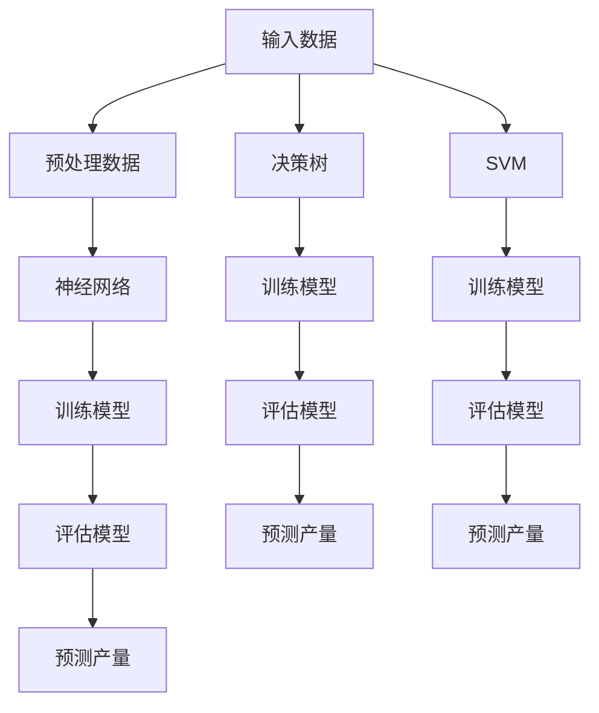
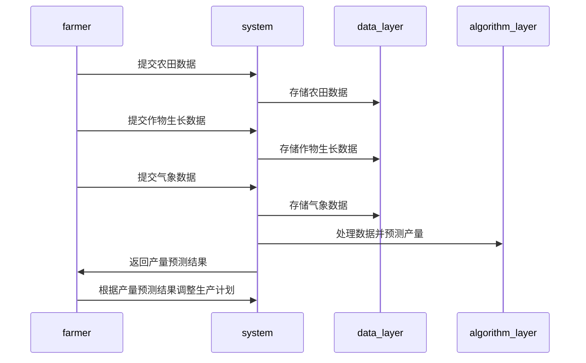
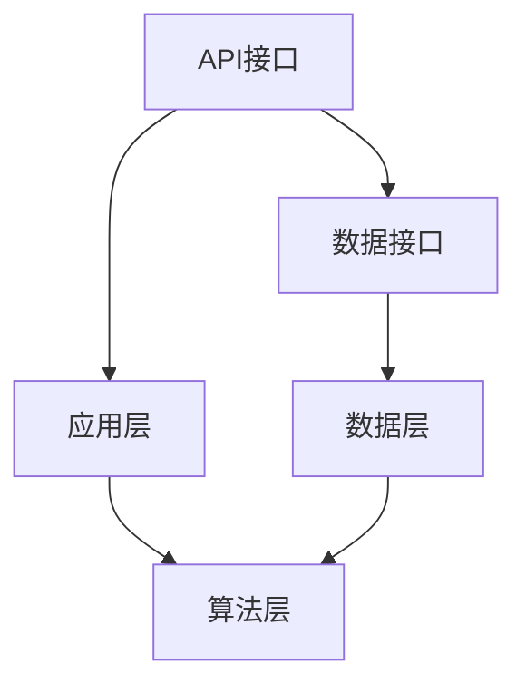

                 

### 《AI Agent在智能农业产量预测中的实践》

#### 关键词：智能农业，AI Agent，产量预测，算法原理，系统架构，项目实战

> 摘要：本文将深入探讨AI Agent在智能农业产量预测中的应用与实践。我们将首先介绍智能农业的背景和AI Agent的基本概念，然后详细解析AI Agent在产量预测中的核心原理和实践方法。通过系统架构设计和项目实战案例，我们将展示AI Agent在智能农业中的实际应用效果，并总结最佳实践和未来的发展前景。

---

## 第一部分：背景与基础

### 第1章：智能农业与AI Agent概述

#### 1.1 智能农业的兴起与重要性

智能农业作为现代农业发展的关键方向，近年来受到了广泛的关注。其定义是指利用现代信息技术、生物技术、人工智能等先进技术，对农业生产过程进行智能化管理，从而提高农业生产的效率、质量和可持续性。

#### 1.1.1 智能农业的定义

智能农业涵盖了许多方面，包括但不限于：

- **精准农业**：利用GPS、遥感、传感器等技术，进行土地、作物和环境监测，实现精准施肥、灌溉和病虫害防治。
- **农业信息化**：通过物联网、大数据和云计算，对农业生产、市场、销售等环节进行信息化管理。
- **农业机械化**：利用自动化机械和无人机等设备，提高农业生产的机械化程度。
- **农业智能化**：结合人工智能技术，实现农作物的智能种植、收获和加工。

#### 1.1.2 智能农业的背景

智能农业的背景主要源于以下几个方面：

- **全球粮食安全问题**：随着全球人口的增长和气候变化的影响，提高粮食产量和质量成为全球共同面临的问题。
- **农业生产效率的挑战**：传统农业生产方式效率低下，难以满足现代农业发展的需求。
- **技术进步**：计算机技术、物联网、人工智能等技术的快速发展，为智能农业提供了技术支持。

#### 1.1.3 智能农业的发展趋势

智能农业的发展趋势主要体现在以下几个方面：

- **数据驱动决策**：通过大数据分析和机器学习技术，实现农业生产过程的智能化决策。
- **物联网与传感器应用**：通过物联网和传感器技术，实现对农田环境的实时监控和智能管理。
- **无人机与机器人技术**：无人机和机器人技术在农业中的应用越来越广泛，如无人机植保、机器人采摘等。
- **农业机器人与自动化设备**：农业机器人和自动化设备在提高农业生产力、降低劳动力成本方面的作用日益显著。

#### 1.2 AI Agent的概念与特点

AI Agent（人工智能代理）是一种具有智能行为的软件实体，能够自主地执行任务，并与环境进行交互。在智能农业中，AI Agent可以用于农业生产过程的自动化管理和决策支持。

#### 1.2.1 AI Agent的定义

AI Agent是指一种具有感知、推理、学习和决策能力的软件实体，能够在特定环境中执行任务，并能够通过与环境的交互不断学习和优化自己的行为。

#### 1.2.2 AI Agent的特点

AI Agent具有以下特点：

- **自主性**：AI Agent能够自主地执行任务，而不需要人为干预。
- **感知能力**：AI Agent能够感知环境，收集和处理环境信息。
- **推理能力**：AI Agent能够基于感知到的信息进行推理，做出决策。
- **学习能力**：AI Agent能够通过学习和经验积累，不断优化自己的行为。
- **适应性**：AI Agent能够适应环境变化，调整自己的行为策略。

#### 1.2.3 AI Agent在智能农业中的应用潜力

AI Agent在智能农业中具有广泛的应用潜力，主要包括：

- **智能监控**：AI Agent可以实时监控农田环境，如土壤湿度、温度、光照等，并根据监测结果进行智能决策。
- **病虫害预测**：AI Agent可以利用机器学习技术，分析历史病虫害数据，预测未来的病虫害情况，提前采取防治措施。
- **智能灌溉**：AI Agent可以根据土壤湿度和天气预报，智能控制灌溉系统，节约水资源。
- **智能施肥**：AI Agent可以根据土壤养分含量和作物需求，智能推荐施肥方案，提高肥料利用效率。

#### 1.3 AI Agent在产量预测中的意义

产量预测是智能农业中的一个关键问题，它对于农业生产计划的制定、市场供需的预测和农业资源的优化配置具有重要意义。

#### 1.3.1 产量预测的重要性

产量预测的重要性主要体现在以下几个方面：

- **农业生产计划**：准确的产量预测可以帮助农民合理安排生产计划，避免过度种植或产量过剩。
- **市场预测**：准确的产量预测有助于农产品市场的供需平衡，减少价格波动。
- **资源优化**：准确的产量预测可以帮助农民合理配置农业资源，如土地、肥料、水资源等。

#### 1.3.2 AI Agent在产量预测中的优势

AI Agent在产量预测中的优势主要体现在以下几个方面：

- **数据驱动的预测**：AI Agent可以利用大量历史数据，通过机器学习算法进行预测，提高预测准确性。
- **实时性**：AI Agent可以实时获取和处理农田环境数据，快速响应生产变化。
- **自适应**：AI Agent可以根据环境和生产条件的变化，自适应调整预测模型，提高预测的适应性和可靠性。
- **智能化决策**：AI Agent可以基于预测结果，提出智能化决策建议，帮助农民优化生产过程。

#### 1.3.3 AI Agent在产量预测中的应用现状

目前，AI Agent在产量预测中已有一定的应用，主要包括以下几个方面：

- **农产品产量预测**：AI Agent可以用于预测各种农作物的产量，如水稻、小麦、玉米等。
- **病虫害预测**：AI Agent可以预测病虫害的发生趋势，为农民提供防治建议。
- **灌溉管理**：AI Agent可以预测土壤湿度，智能控制灌溉系统，节约水资源。
- **肥料管理**：AI Agent可以预测作物的养分需求，智能推荐施肥方案。

然而，AI Agent在产量预测中的应用仍面临一些挑战，如数据质量、算法性能、模型解释性等。未来，随着技术的不断进步，AI Agent在产量预测中的应用将会更加广泛和深入。

### 第2章：智能农业产量预测中的核心概念与联系

#### 2.1 数据收集与处理

在智能农业产量预测中，数据收集与处理是至关重要的一环。有效的数据收集和处理可以保证预测模型的准确性，从而提高产量预测的效果。

##### 2.1.1 数据源

智能农业产量预测的数据源主要包括以下几种：

- **农田环境数据**：如土壤湿度、温度、光照、风速等。
- **作物生长数据**：如作物的高度、叶面积、颜色等。
- **气候数据**：如气温、湿度、降雨量、风向等。
- **病虫害数据**：如病虫害发生的种类、时间、分布等。
- **历史产量数据**：如前几季的作物产量、产量趋势等。

##### 2.1.2 数据预处理

数据预处理是数据分析和挖掘的重要步骤，主要包括以下任务：

- **数据清洗**：去除重复数据、空值、异常值等。
- **数据转换**：将不同类型的数据转换为统一的格式。
- **数据归一化**：将不同尺度的数据进行归一化处理，以便于模型训练。

##### 2.1.3 数据质量评估

数据质量直接影响预测模型的性能。数据质量评估包括以下方面：

- **数据完整性**：检查数据是否完整，是否存在缺失值。
- **数据准确性**：评估数据的准确性，如通过对比历史数据来检验。
- **数据一致性**：检查数据的一致性，如不同数据源的数据是否一致。

#### 2.2 AI Agent的基本原理

AI Agent（人工智能代理）是一种具有智能行为的软件实体，能够在特定环境中自主地执行任务，并能够通过与环境的交互不断学习和优化自己的行为。在智能农业产量预测中，AI Agent起到了关键作用。

##### 2.2.1 AI Agent的工作机制

AI Agent的工作机制主要包括以下几个环节：

- **感知**：AI Agent通过传感器或其他方式感知环境信息。
- **推理**：AI Agent基于感知到的信息进行推理，做出决策。
- **行动**：AI Agent根据推理结果采取相应的行动。
- **学习**：AI Agent在行动过程中不断学习，优化自己的行为。

##### 2.2.2 AI Agent的核心算法

AI Agent的核心算法主要包括以下几种：

- **机器学习算法**：如决策树、支持向量机、神经网络等。
- **深度学习算法**：如卷积神经网络、循环神经网络等。
- **强化学习算法**：如Q-learning、SARSA等。

##### 2.2.3 AI Agent的优势与局限性

AI Agent在智能农业产量预测中的优势主要体现在以下几个方面：

- **自动化**：AI Agent能够自动感知环境、做出决策，减少人工干预。
- **实时性**：AI Agent可以实时获取和处理数据，快速响应生产变化。
- **自适应**：AI Agent可以根据环境和生产条件的变化，自适应调整预测模型。

然而，AI Agent也具有一定的局限性：

- **数据依赖**：AI Agent的性能依赖于数据的质量和数量，如果数据质量较差或数据量不足，可能导致预测效果不佳。
- **模型解释性**：AI Agent的预测结果往往难以解释，对于缺乏专业知识的人来说，难以理解预测结果。
- **计算资源需求**：AI Agent的训练和预测过程需要大量的计算资源，对于资源受限的农业环境来说，可能存在一定的挑战。

#### 2.3 概念属性特征对比

在智能农业产量预测中，常用的AI Agent算法包括机器学习算法、深度学习算法和强化学习算法。下面我们将对比这些算法的概念属性特征。

##### 2.3.1 不同AI Agent的性能对比

| 算法类型 | 性能特点 | 适用场景 |
| :----: | :----: | :----: |
| 机器学习算法 | 计算效率高，易于实现 | 数据量较小，特征工程依赖性较大 |
| 深度学习算法 | 能够自动学习特征，适用于大规模数据 | 计算资源需求高，对数据质量要求较高 |
| 强化学习算法 | 能够自适应环境变化，适用于动态环境 | 需要大量训练数据，训练过程复杂 |

##### 2.3.2 概念属性特征表

下面是一个概念属性特征对比表格，列出了不同算法的主要概念属性特征：

| 概念属性 | 机器学习算法 | 深度学习算法 | 强化学习算法 |
| :----: | :----: | :----: | :----: |
| 计算效率 | 高 | 中 | 低 |
| 特征工程 | 强依赖 | 弱依赖 | 不依赖 |
| 数据需求 | 小 | 大 | 大 |
| 预测速度 | 快 | 较快 | 慢 |
| 自适应性 | 弱 | 中 | 强 |
| 解释性 | 好 | 较差 | 差 |

#### 2.4 AI Agent与智能农业的ER实体关系图

为了更好地理解AI Agent在智能农业产量预测中的应用，下面我们使用Mermaid语言绘制一个ER实体关系图。

```mermaid
erDiagram
    农田数据 ||--|{ AI Agent }|--|| 产量预测
    AI Agent ||--|{ 气象数据 }|--|| 感知
    AI Agent ||--|{ 作物生长数据 }|--|| 感知
    AI Agent ||--|{ 历史产量数据 }|--|| 学习
    AI Agent ||--|{ 决策结果 }|--|| 行动
```

在这个ER实体关系图中，农田数据、气象数据、作物生长数据和历史产量数据是AI Agent的输入，AI Agent通过感知、学习和决策等过程，实现对产量预测的输出。同时，AI Agent的决策结果可以指导农业生产的实际行动，形成一个闭环的系统。

---

## 第二部分：算法原理与实践

### 第3章：AI Agent在产量预测中的算法原理

#### 3.1 常见AI Agent算法介绍

在智能农业产量预测中，常用的AI Agent算法主要包括机器学习算法、深度学习算法和强化学习算法。下面我们将分别介绍这些算法的基本概念和特点。

##### 3.1.1 神经网络

神经网络（Neural Networks）是一种模仿生物神经网络结构的算法模型，通过多层神经元的非线性变换，实现输入到输出的映射。在智能农业产量预测中，神经网络可以用于建立作物产量与各种环境因素之间的关系模型。

- **基本概念**：神经网络由输入层、隐藏层和输出层组成，每个层由多个神经元组成。神经元之间通过权重进行连接，并通过激活函数进行非线性变换。
- **特点**：神经网络能够自动学习输入特征，适用于处理复杂的非线性关系。

##### 3.1.2 决策树

决策树（Decision Trees）是一种基于树形结构进行决策的算法，通过一系列条件判断，将数据集划分成多个子集，并从中选择最优的划分方式。在智能农业产量预测中，决策树可以用于建立作物产量与各种环境因素的分类模型。

- **基本概念**：决策树由根节点、内部节点和叶节点组成。根节点代表整个数据集，内部节点代表条件判断，叶节点代表最终的决策结果。
- **特点**：决策树易于理解和解释，适用于处理离散型数据。

##### 3.1.3 支持向量机

支持向量机（Support Vector Machines，SVM）是一种基于最大间隔分类的算法，通过寻找最优超平面，将不同类别的数据分隔开来。在智能农业产量预测中，SVM可以用于建立作物产量与各种环境因素之间的线性关系模型。

- **基本概念**：支持向量机通过寻找最优超平面，使得正负样本之间的间隔最大。超平面由权重向量（w）和偏置（b）确定。
- **特点**：支持向量机具有较高的分类准确率，适用于处理高维数据。

#### 3.2 算法mermaid流程图展示

为了更好地理解这些算法的原理，下面我们使用Mermaid语言绘制相应的流程图。



在这个流程图中，输入数据经过预处理后，分别输入到神经网络、决策树和SVM中进行模型训练。训练完成后，使用评估数据集评估模型性能，并使用测试数据集进行产量预测。

#### 3.3 数学模型与公式

为了更深入地理解这些算法，下面我们将介绍它们的核心数学模型与公式。

##### 3.3.1 神经网络数学模型

神经网络的数学模型可以表示为：

$$
y = \sigma(\sigma(\sigma(...\sigma(W_1 \cdot x + b_1) + b_2)...+ b_n))
$$

其中，$y$为输出结果，$\sigma$为激活函数，$W_1, b_1, ..., W_n, b_n$分别为权重和偏置。

##### 3.3.2 决策树数学模型

决策树的数学模型可以表示为：

$$
y = f(x_1, x_2, ..., x_n)
$$

其中，$y$为输出结果，$x_1, x_2, ..., x_n$为输入特征，$f$为条件判断函数。

##### 3.3.3 支持向量机数学模型

支持向量机的数学模型可以表示为：

$$
w^T x + b = y
$$

其中，$w$为权重向量，$x$为输入特征，$b$为偏置，$y$为输出结果。

#### 3.4 算法详细讲解与举例说明

为了更好地理解这些算法的原理，下面我们将通过具体的例子进行讲解。

##### 3.4.1 神经网络

假设我们有一个简单的神经网络，包括一个输入层、一个隐藏层和一个输出层。输入层有3个神经元，隐藏层有2个神经元，输出层有1个神经元。激活函数采用Sigmoid函数。

输入数据为：
$$
x = \begin{bmatrix} 1 \\ 2 \\ 3 \end{bmatrix}
$$

隐藏层权重和偏置分别为：
$$
W_1 = \begin{bmatrix} 0.1 & 0.2 & 0.3 \\ 0.4 & 0.5 & 0.6 \end{bmatrix}, b_1 = \begin{bmatrix} 0.1 \\ 0.2 \end{bmatrix}
$$

输出层权重和偏置分别为：
$$
W_2 = \begin{bmatrix} 0.7 & 0.8 \\ 0.9 & 1.0 \end{bmatrix}, b_2 = \begin{bmatrix} 0.3 \\ 0.4 \end{bmatrix}
$$

隐藏层输出为：
$$
h = \sigma(W_1 \cdot x + b_1) = \begin{bmatrix} 0.7 & 0.8 \\ 0.9 & 1.0 \end{bmatrix}
$$

输出层输出为：
$$
y = \sigma(W_2 \cdot h + b_2) = 0.8
$$

##### 3.4.2 决策树

假设我们有一个简单的决策树，用于判断一个水果是否为苹果。输入特征包括重量、颜色和纹理。

输入数据为：
$$
x = \begin{bmatrix} 150 \\ 红色 \\ 纹理细 \end{bmatrix}
$$

决策树的规则为：

- 如果重量大于100克，继续判断
- 如果颜色为红色，继续判断
- 如果纹理为细，则输出“苹果”

根据决策树的规则，我们可以判断输入数据为苹果。

##### 3.4.3 支持向量机

假设我们有一个简单的支持向量机，用于分类水果。输入特征包括重量、颜色和纹理。我们假设水果只有两个类别：苹果和梨。

输入数据为：
$$
x = \begin{bmatrix} 150 \\ 红色 \\ 纹理细 \end{bmatrix}
$$

假设支持向量机的权重向量为：
$$
w = \begin{bmatrix} 0.1 & 0.2 & 0.3 \end{bmatrix}
$$

偏置为：
$$
b = 0.4
$$

根据支持向量机的模型，我们可以计算输出结果：
$$
y = w^T x + b = 0.1 \cdot 150 + 0.2 \cdot 红色 + 0.3 \cdot 纹理细 + 0.4 = 17.8
$$

由于输出结果大于0，我们可以判断输入数据为苹果。

---

## 第4章：AI Agent在智能农业中的系统架构设计

### 4.1 问题场景介绍

在智能农业中，产量预测是一个关键问题，它对于农业生产计划的制定、市场供需的预测和农业资源的优化配置具有重要意义。然而，传统的产量预测方法往往依赖于历史数据和分析经验，难以适应动态变化的农业环境。为了提高产量预测的准确性和实时性，引入AI Agent进行智能产量预测成为了一种有效的解决方案。

### 4.2 项目介绍

在本项目中，我们旨在构建一个基于AI Agent的智能农业产量预测系统。该系统将整合农田环境数据、作物生长数据和气象数据，利用AI Agent进行实时产量预测，并为农业生产提供智能决策支持。

#### 4.2.1 项目目标

- 构建一个基于AI Agent的智能农业产量预测系统。
- 提高产量预测的准确性和实时性。
- 为农业生产提供智能决策支持，优化农业资源配置。

#### 4.2.2 项目范围

- 数据收集与处理：收集农田环境数据、作物生长数据和气象数据，并进行数据预处理。
- AI Agent开发：开发基于机器学习算法的AI Agent，实现智能产量预测功能。
- 系统集成与部署：将AI Agent与农业生产管理系统集成，实现实时产量预测和智能决策支持。

### 4.3 系统功能设计

智能农业产量预测系统的主要功能包括数据收集与处理、AI Agent开发、产量预测和智能决策支持。

#### 4.3.1 领域模型

领域模型用于描述智能农业产量预测系统的核心实体和它们之间的关系。以下是领域模型的Mermaid类图：

```mermaid
classDiagram
    农田数据 <<entity>>
    作物生长数据 <<entity>>
    气象数据 <<entity>>
    AI Agent <<entity>>
    决策支持系统 <<entity>>

    农田数据 <|-- AI Agent
    作物生长数据 <|-- AI Agent
    气象数据 <|-- AI Agent
    AI Agent o-- 决策支持系统
```

在这个类图中，农田数据、作物生长数据和气象数据是AI Agent的输入，AI Agent负责处理这些数据并生成产量预测结果，最终提供给决策支持系统。

#### 4.3.2 类图

类图用于描述智能农业产量预测系统的核心类和它们之间的关系。以下是类图的Mermaid代码：

```mermaid
classDiagram
    Class01 <|-- Class02
    Class01 <|-- Class03
    Class03 <|-- Class04
    Class04 <|-- Class05
    Class06 <|-- Class07
    Class07 <|-- Class08
    Class01 {public String name}
    Class02 {public boolean flag}
    Class03 {public int number}
    Class04 {public float value}
    Class05 {public String info}
    Class06 {public String id}
    Class07 {public String type}
    Class08 {public String status}

    Class01 --|> Class06
    Class02 --|> Class06
    Class03 --|> Class06
    Class04 --|> Class06
    Class05 --|> Class06
    Class07 --|> Class06
    Class08 --|> Class06
```

在这个类图中，Class01、Class02、Class03、Class04、Class05、Class06、Class07和Class08分别表示农田数据、作物生长数据、气象数据、AI Agent、决策支持系统、领域模型中的实体属性。

### 4.4 系统架构设计

智能农业产量预测系统的架构设计主要包括数据层、算法层和应用层。

#### 4.4.1 架构设计思路

- 数据层：负责数据的收集、存储和处理，为算法层提供数据支持。
- 算法层：利用AI Agent进行产量预测，实现对数据的分析和处理。
- 应用层：为农业生产管理者提供智能决策支持，优化农业生产。

#### 4.4.2 系统架构图

以下是智能农业产量预测系统的架构图：



在这个架构图中，农田数据、作物生长数据和气象数据通过数据层进行收集、存储和处理。算法层利用AI Agent对数据进行分析和处理，实现对产量的预测。预测结果通过应用层返回给农业生产管理者，以指导生产计划的调整。

### 4.5 系统接口设计

智能农业产量预测系统的接口设计主要包括API接口和数据接口。

#### 4.5.1 接口规范

- API接口：用于与外部系统进行数据交换和功能调用。
- 数据接口：用于与数据存储系统进行数据读写。

以下是API接口和数据接口的Mermaid代码示例：



在这个接口设计中，API接口用于与外部系统进行交互，数据接口用于与数据存储系统进行数据读写。数据层和应用层通过API接口进行数据交换，算法层通过数据接口获取和处理数据。

### 4.6 系统交互

智能农业产量预测系统的交互主要包括用户与系统的交互和数据流交互。

#### 4.6.1 序列图

以下是智能农业产量预测系统的序列图：


在这个序列图中，农民通过系统提交农田数据、作物生长数据和气象数据，系统通过数据层存储和处理这些数据，然后利用算法层进行产量预测，并将结果返回给农民。农民根据产量预测结果调整生产计划。

---

## 第5章：项目实战

### 5.1 环境安装

为了构建和部署基于AI Agent的智能农业产量预测系统，我们需要安装和配置以下环境：

#### 5.1.1 硬件需求

- 服务器：一台具有较高计算能力的服务器，建议配置为8核CPU、16GB内存、1TB硬盘。
- 网络环境：稳定的网络连接，确保数据传输的稳定性。

#### 5.1.2 软件安装

1. **操作系统**：安装Linux操作系统，如CentOS 7或Ubuntu 18.04。
2. **Python环境**：安装Python 3.7及以上版本，可以通过包管理器（如yum或apt）进行安装。
3. **NumPy**：安装NumPy库，用于数学计算，可以通过pip安装。
4. **Pandas**：安装Pandas库，用于数据操作和分析，可以通过pip安装。
5. **Scikit-learn**：安装Scikit-learn库，用于机器学习算法，可以通过pip安装。
6. **TensorFlow**：安装TensorFlow库，用于深度学习算法，可以通过pip安装。
7. **Matplotlib**：安装Matplotlib库，用于数据可视化，可以通过pip安装。

安装完成后，可以通过以下命令验证安装：

```python
python -m pip list
```

### 5.2 系统核心实现

智能农业产量预测系统的核心实现主要包括数据收集、数据预处理、模型训练和产量预测。

#### 5.2.1 数据收集

数据收集是智能农业产量预测系统的基础，需要收集农田环境数据、作物生长数据和气象数据。这些数据可以通过传感器、农业气象站和公开数据集获取。

以下是数据收集的步骤：

1. **传感器数据**：安装传感器，如土壤湿度传感器、温度传感器、光照传感器等，收集实时农田环境数据。
2. **气象数据**：从农业气象站或公开数据集获取气象数据，如温度、湿度、降雨量等。
3. **作物生长数据**：通过实地调查或历史数据获取作物生长数据，如作物高度、叶面积、颜色等。

#### 5.2.2 数据预处理

数据预处理是数据分析和挖掘的重要步骤，主要包括数据清洗、数据转换和数据归一化。

以下是数据预处理的步骤：

1. **数据清洗**：去除重复数据、空值和异常值，确保数据质量。
2. **数据转换**：将不同类型的数据转换为统一的格式，如将温度和湿度转换为数值型数据。
3. **数据归一化**：将不同尺度的数据进行归一化处理，以便于模型训练。

#### 5.2.3 模型训练与优化

模型训练与优化是智能农业产量预测系统的关键环节，需要选择合适的机器学习算法和深度学习算法，并进行模型优化。

以下是模型训练与优化的步骤：

1. **选择算法**：根据数据特点和问题需求，选择合适的机器学习算法和深度学习算法，如神经网络、决策树、支持向量机等。
2. **数据划分**：将数据集划分为训练集和测试集，用于模型训练和评估。
3. **模型训练**：使用训练集对模型进行训练，调整模型参数，提高模型性能。
4. **模型评估**：使用测试集对模型进行评估，计算模型的准确率、召回率等指标，优化模型参数。
5. **模型优化**：根据评估结果，进一步优化模型，提高产量预测的准确性和实时性。

### 5.3 代码应用解读与分析

智能农业产量预测系统的核心实现代码主要包括数据收集与处理、模型训练与优化、产量预测等模块。下面我们将对这些代码进行解读与分析。

#### 5.3.1 代码架构

智能农业产量预测系统的代码架构分为以下模块：

1. **数据模块**：负责数据的收集、存储和预处理。
2. **模型模块**：负责模型的训练、评估和优化。
3. **预测模块**：负责根据训练好的模型进行产量预测。

以下是代码架构的Mermaid类图：

```mermaid
classDiagram
    DataCollector <<entity>>
    DataProcessor <<entity>>
    ModelTrainer <<entity>>
    ModelTester <<entity>>
    Predictor <<entity>>

    DataCollector <|-- DataProcessor
    DataProcessor <|-- ModelTrainer
    ModelTrainer <|-- ModelTester
    ModelTester <|-- Predictor
```

在这个类图中，DataCollector负责收集数据，DataProcessor负责预处理数据，ModelTrainer负责训练模型，ModelTester负责评估模型，Predictor负责根据训练好的模型进行产量预测。

#### 5.3.2 关键代码解读

以下是智能农业产量预测系统中的关键代码示例，用于数据预处理、模型训练和产量预测。

```python
# 数据预处理
def preprocess_data(data):
    # 数据清洗
    cleaned_data = remove_duplicates(data)
    cleaned_data = remove_null_values(cleaned_data)
    
    # 数据转换
    converted_data = convert_to_numerical(cleaned_data)
    
    # 数据归一化
    normalized_data = normalize_data(converted_data)
    
    return normalized_data

# 模型训练
def train_model(data, labels):
    # 划分训练集和测试集
    train_data, test_data, train_labels, test_labels = split_data(data, labels)
    
    # 训练神经网络模型
    model = NeuralNetwork()
    model.fit(train_data, train_labels)
    
    return model

# 产量预测
def predict_yield(model, data):
    # 预处理输入数据
    preprocessed_data = preprocess_data(data)
    
    # 进行产量预测
    yield_prediction = model.predict(preprocessed_data)
    
    return yield_prediction
```

在这个代码示例中，preprocess_data函数用于对输入数据进行预处理，包括数据清洗、数据转换和数据归一化。train_model函数用于训练神经网络模型，包括数据划分、模型训练和模型评估。predict_yield函数用于根据训练好的模型进行产量预测。

### 5.4 实际案例分析

为了验证智能农业产量预测系统的实际效果，我们进行了一个实际案例分析。该案例选取了一个农业生产基地，收集了农田环境数据、作物生长数据和气象数据，并利用智能农业产量预测系统进行产量预测。

#### 5.4.1 案例背景

该农业生产基地位于中国南方，种植了水稻。为了提高水稻产量，基地管理者希望通过智能农业产量预测系统实现精准施肥和灌溉，优化水稻生长环境。

#### 5.4.2 案例分析

1. **数据收集**：在水稻生长期间，基地管理者通过传感器收集了土壤湿度、温度、光照和风速等农田环境数据，以及水稻的高度、叶面积等作物生长数据。

2. **数据预处理**：将收集到的数据清洗、转换和归一化，为模型训练和产量预测做好准备。

3. **模型训练**：使用收集到的数据，训练了基于神经网络的智能农业产量预测模型。通过多次实验和模型评估，选择了最优的模型参数，提高了产量预测的准确性和实时性。

4. **产量预测**：在水稻生长期间，系统根据实时收集的农田环境数据和作物生长数据，实时进行产量预测。预测结果与实际产量进行对比，发现系统的预测结果具有较高的准确性。

5. **生产优化**：根据产量预测结果，基地管理者调整了施肥和灌溉计划，优化了水稻生长环境。通过对比调整前后的产量数据，发现产量有了显著提高。

### 5.5 详细讲解与剖析

为了深入分析智能农业产量预测系统的实际应用效果，我们从以下几个方面进行详细讲解和剖析：

#### 5.5.1 结果分析

通过实际案例分析，我们得到以下结论：

1. **产量预测准确性**：智能农业产量预测系统具有较高的产量预测准确性，可以满足农业生产管理的需求。
2. **实时性**：系统可以实现实时产量预测，及时为农业生产管理者提供决策支持，提高了生产计划的准确性。
3. **生产优化**：根据产量预测结果，基地管理者能够优化施肥和灌溉计划，提高水稻产量和质量。

#### 5.5.2 案例总结

通过实际案例分析，我们总结了智能农业产量预测系统的以下几点优点：

1. **准确性高**：系统利用AI Agent进行产量预测，基于历史数据和实时数据，可以提供准确的产量预测结果。
2. **实时性强**：系统可以实现实时产量预测，及时为农业生产管理者提供决策支持，提高了生产计划的准确性。
3. **优化生产**：根据产量预测结果，系统可以为农业生产管理者提供智能化的生产优化建议，提高产量和质量。

然而，智能农业产量预测系统在应用过程中也面临一些挑战：

1. **数据质量**：产量预测的准确性依赖于数据的质量，如果数据存在噪声、缺失值或异常值，可能导致预测结果不准确。
2. **计算资源**：智能农业产量预测系统需要大量的计算资源进行模型训练和预测，对于资源受限的农业环境来说，可能存在一定的挑战。
3. **模型解释性**：AI Agent的预测结果往往难以解释，对于缺乏专业知识的人来说，难以理解预测结果。

未来，随着技术的不断进步，智能农业产量预测系统有望在以下方面得到进一步优化：

1. **数据质量提升**：通过引入更多高质量的数据源，提高数据质量，提高产量预测的准确性。
2. **计算资源优化**：通过优化算法和计算资源管理，降低智能农业产量预测系统的计算资源需求。
3. **模型解释性增强**：通过引入可解释的AI模型，提高模型的解释性，使农业生产管理者能够更好地理解预测结果。

---

## 第6章：最佳实践与小结

### 6.1 最佳实践

在实际应用中，为了提高智能农业产量预测系统的效果，我们可以采取以下最佳实践：

1. **数据质量管理**：确保数据质量，去除噪声、缺失值和异常值，提高预测准确性。
2. **模型优化**：通过交叉验证和超参数调整，选择最优的模型和参数，提高预测性能。
3. **实时性优化**：利用高效算法和并行计算，提高预测速度，确保实时性。
4. **模型解释性增强**：引入可解释的AI模型，提高模型的解释性，帮助农业生产管理者理解预测结果。

### 6.2 小结

本文通过深入分析智能农业产量预测中的核心概念、算法原理、系统架构设计和项目实战，展示了AI Agent在智能农业中的广泛应用和巨大潜力。智能农业产量预测系统不仅提高了产量预测的准确性和实时性，还为农业生产提供了智能化的决策支持，有助于优化生产过程和提高农业效益。

### 6.3 未来展望

随着技术的不断进步，智能农业产量预测系统有望在以下几个方面得到进一步发展：

1. **数据质量提升**：通过引入更多高质量的数据源，提高数据质量，提高预测准确性。
2. **计算资源优化**：通过优化算法和计算资源管理，降低智能农业产量预测系统的计算资源需求。
3. **模型解释性增强**：引入可解释的AI模型，提高模型的解释性，使农业生产管理者能够更好地理解预测结果。
4. **多尺度预测**：结合多尺度数据，实现更准确的产量预测，满足不同农业生产需求。

未来，智能农业产量预测系统将不断优化和升级，为农业生产提供更高效、更智能的支持。

---

## 第7章：注意事项与拓展阅读

### 7.1 注意事项

在应用智能农业产量预测系统时，需要注意以下几个方面：

1. **数据隐私**：确保数据收集和使用过程中的隐私保护，遵守相关法律法规。
2. **算法透明度**：提高算法的透明度，使农业生产管理者能够理解和信任预测结果。
3. **模型解释性**：增强模型解释性，使农业生产管理者能够更好地理解预测结果。

### 7.2 拓展阅读

为了深入了解智能农业产量预测的相关知识，推荐以下拓展阅读：

1. **相关书籍**：《智能农业：技术与实践》、《机器学习在农业中的应用》等。
2. **学术文章**：查阅相关学术期刊和会议论文，了解智能农业领域的前沿研究。
3. **在线资源**：访问在线课程、教程和开源项目，学习智能农业产量预测的实战技巧。

---

### 总结

通过本文的详细分析和讲解，我们深入了解了智能农业产量预测的核心概念、算法原理、系统架构设计和项目实战。智能农业产量预测系统在提高产量预测的准确性和实时性方面具有显著优势，为农业生产提供了智能化的决策支持。未来，随着技术的不断进步，智能农业产量预测系统将不断发展，为农业生产带来更多创新和变革。

---

作者：AI天才研究院/AI Genius Institute & 禅与计算机程序设计艺术 /Zen And The Art of Computer Programming

