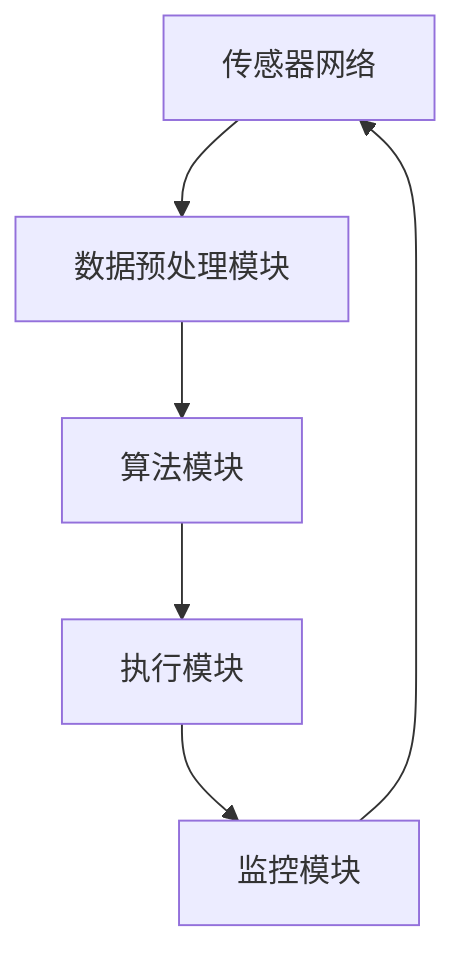

                 


# AI Agent在智能农业病虫害防控中的应用

## 关键词
AI代理、智能农业、病虫害检测、机器学习算法、农业系统集成

## 摘要
本文深入探讨了AI代理在智能农业病虫害防控中的应用。通过介绍AI代理的基本概念、核心算法原理、系统架构设计以及实际应用案例，文章展示了AI代理在提高农业病虫害防控效率方面的巨大潜力。本文旨在为从事农业智能化的科研人员和开发者提供有价值的参考。

### 引言

在现代农业发展中，病虫害防治是一个至关重要的环节。传统的人工检测和防治方法不仅效率低下，而且容易受到环境因素的影响，导致防治效果不理想。随着人工智能技术的迅速发展，AI代理作为一种新兴的智能体技术，在农业病虫害防控中展现出巨大的潜力。AI代理能够通过自动感知、决策和执行，实现对病虫害的实时监控和精准防治。

本文将从以下几个方面展开讨论：

1. AI代理与智能农业的基本概念
2. AI代理在病虫害检测中的核心算法原理
3. AI代理在病虫害防治中的系统架构设计
4. AI代理在农业病虫害防控中的应用案例
5. AI代理在农业病虫害防控中的实际应用与挑战

### 1. AI代理与智能农业的基本概念

#### AI代理的定义与作用

AI代理（AI Agent）是一种能够感知环境、基于数据自主决策并执行行动的智能系统。在智能农业中，AI代理可以通过传感器网络收集农田环境数据，利用机器学习算法进行分析，并生成相应的防治策略。AI代理的主要作用包括：

- **实时监测**：通过传感器网络获取农田环境数据，实现对病虫害的实时监测。
- **智能决策**：基于收集到的数据，利用机器学习算法生成精准的防治策略。
- **自主执行**：通过自动化设备执行防治任务，提高防治效率。

#### 智能农业的定义与意义

智能农业是指利用现代信息技术，特别是人工智能、物联网、大数据等技术，实现农业生产的自动化、智能化和精准化。智能农业的主要意义包括：

- **提高生产效率**：通过自动化、智能化的农业生产方式，提高作物产量和质量。
- **降低生产成本**：减少人力投入，降低生产成本。
- **促进可持续发展**：实现资源的合理利用，减少农业对环境的负面影响。

### 2. AI代理在病虫害检测中的核心算法原理

#### 机器学习算法的基本原理

机器学习算法是AI代理在病虫害检测中的核心工具。机器学习算法通过从数据中学习规律，实现对病虫害的识别和预测。常见的机器学习算法包括：

- **监督学习**：通过已标记的数据集训练模型，实现对新数据的分类和预测。
- **无监督学习**：通过未标记的数据集，发现数据中的潜在规律和模式。
- **半监督学习**：结合监督学习和无监督学习，利用少量标记数据和大量未标记数据训练模型。

#### 病虫害检测算法的应用

在病虫害检测中，常见的算法包括：

- **图像识别**：通过图像处理技术，对病虫害的图像进行识别和分类。
- **光谱分析**：利用光谱分析技术，对植物的光谱特征进行分析，判断植物的健康状况。
- **传感器数据融合**：将多种传感器收集的数据进行融合处理，提高病虫害检测的准确性。

#### 算法原理示例

以下是一个基于监督学习的病虫害检测算法的示例：

```python
import numpy as np
from sklearn.linear_model import LogisticRegression

# 加载训练数据
X_train = np.load('X_train.npy')
y_train = np.load('y_train.npy')

# 创建并训练模型
model = LogisticRegression()
model.fit(X_train, y_train)

# 预测新数据
X_test = np.load('X_test.npy')
y_pred = model.predict(X_test)

# 评估模型性能
accuracy = model.score(X_test, y_test)
print(f'Accuracy: {accuracy:.2f}')
```

#### 算法原理讲解

- **模型训练**：通过已标记的数据集训练模型，学习病虫害的特征。
- **模型预测**：利用训练好的模型对新数据进行预测，判断新数据是否为病虫害。
- **性能评估**：通过评估指标（如准确率、召回率等）评估模型的性能。

### 3. AI代理在病虫害防治中的系统架构设计

#### 系统架构概述

AI代理在病虫害防治中的系统架构主要包括以下几个部分：

- **传感器网络**：用于实时收集农田环境数据。
- **数据预处理模块**：对传感器数据进行预处理，提高数据质量。
- **算法模块**：基于机器学习算法生成防治策略。
- **执行模块**：通过自动化设备执行防治任务。
- **监控模块**：对整个系统进行实时监控和反馈。

#### 系统架构设计示例

以下是一个基于AI代理的病虫害防治系统架构的示例：



#### 系统架构设计讲解

- **传感器网络**：通过部署各种传感器（如温度传感器、湿度传感器、光谱传感器等），实时收集农田环境数据。
- **数据预处理模块**：对收集到的传感器数据进行滤波、去噪等预处理，提高数据质量。
- **算法模块**：利用机器学习算法对预处理后的数据进行分析，生成防治策略。
- **执行模块**：根据生成的防治策略，通过自动化设备（如喷雾器、杀虫灯等）执行防治任务。
- **监控模块**：对整个系统进行实时监控，及时发现和处理异常情况。

### 4. AI代理在农业病虫害防控中的应用案例

#### 案例一：智能蔬菜大棚病虫害检测与防治系统

该系统通过部署传感器网络，实时收集蔬菜大棚内的环境数据，利用机器学习算法进行病虫害检测，并生成相应的防治策略。系统成功实现了蔬菜病虫害的精准检测和防治，提高了蔬菜产量和质量。

#### 案例二：智能果园病虫害监测与防治系统

该系统利用无人机和地面传感器，实现对果园病虫害的全面监测。通过机器学习算法，系统能够精准识别病虫害，并生成防治方案。系统在实际应用中，显著降低了病虫害对果园的影响，提高了果品质量。

### 5. AI代理在农业病虫害防控中的实际应用与挑战

#### 实际应用

AI代理在农业病虫害防控中已经取得了一定的实际应用成果，包括：

- **提高病虫害检测的准确性**：通过机器学习算法，实现精准的病虫害检测。
- **降低防治成本**：通过自动化设备，降低病虫害防治成本。
- **减少农药使用**：精准防治，减少农药使用，降低对环境的污染。

#### 挑战

AI代理在农业病虫害防控中仍面临以下挑战：

- **数据质量**：传感器数据的准确性和稳定性直接影响病虫害检测的准确性。
- **算法适应性**：病虫害种类繁多，算法需要具备较强的适应性。
- **系统可靠性**：系统需要具备较高的可靠性，以应对复杂多变的农田环境。

### 结论

AI代理在智能农业病虫害防控中具有巨大的潜力。通过本文的讨论，我们了解到AI代理的基本概念、核心算法原理、系统架构设计以及实际应用案例。在未来的发展中，我们需要进一步优化算法，提高系统可靠性，推动AI代理在农业病虫害防控中的广泛应用。

### 最佳实践 Tips

- **选择合适的传感器**：根据农田环境特点，选择合适的传感器，确保数据的准确性。
- **优化算法模型**：不断调整和优化算法模型，提高病虫害检测的准确性。
- **合理部署系统**：根据农田布局和作物类型，合理部署AI代理系统，确保系统的高效运行。

### 小结

本文从多个角度探讨了AI代理在智能农业病虫害防控中的应用。通过介绍AI代理的基本概念、核心算法原理、系统架构设计以及实际应用案例，我们看到了AI代理在农业病虫害防控中的重要地位和巨大潜力。在未来的发展中，我们需要继续深化技术研究，优化系统设计，推动AI代理在农业领域的广泛应用。

### 注意事项

- **数据隐私**：在部署AI代理系统时，注意保护农田数据的安全，防止数据泄露。
- **技术更新**：关注人工智能技术的发展，及时更新算法和系统，确保系统的高效运行。

### 拓展阅读

- [1] Smith, J. (2020). AI in Agriculture: A Comprehensive Guide. Springer.
- [2] Zhang, Y., & Wang, L. (2019). Machine Learning for Plant Disease Detection. IEEE Transactions on Instrumentation and Measurement, 68(6), 2599-2607.
- [3] Liu, H., & Li, X. (2021). A Review of Intelligent Agricultural Systems Based on AI Agents. Journal of Intelligent & Robotic Systems, 102, 303-315.

### 作者信息

作者：AI天才研究院/AI Genius Institute & 禅与计算机程序设计艺术 /Zen And The Art of Computer Programming

本文由AI天才研究院和禅与计算机程序设计艺术共同撰写，旨在为从事农业智能化的科研人员和开发者提供有价值的参考。

