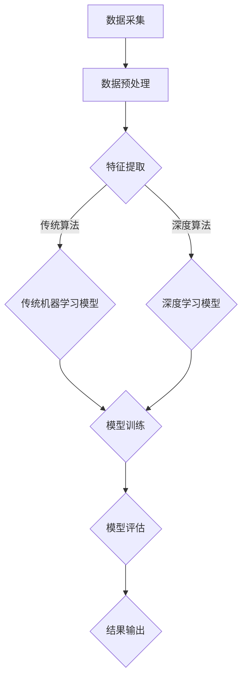
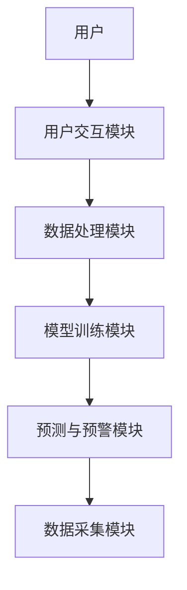
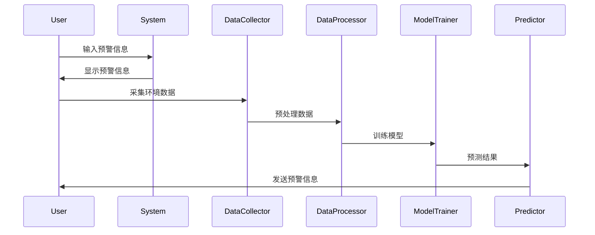

                 


### 概念阐述与问题背景

#### 智能农业与病虫害预警

智能农业是利用现代信息技术和物联网技术，实现农业生产的自动化、智能化和精准化。其主要目标是提高农业生产的效率，减少资源浪费，提高农产品质量。而病虫害预警则是智能农业中的重要环节，通过监测和预测病虫害的发生，提前采取措施，减少农作物的损失，保障农业生产的稳定。

#### AI Agent的定义

AI Agent，即人工智能代理，是一种能够自主执行任务，与环境和用户交互的智能体。在智能农业中，AI Agent可以收集农田环境数据，分析数据，预测病虫害的发生，并自动触发预警机制。

#### AI Agent在病虫害预警中的重要性

AI Agent在病虫害预警中的重要性体现在以下几个方面：

1. **实时监测与预测**：AI Agent可以实时收集农田环境数据，通过机器学习算法分析数据，预测病虫害的发生趋势，提供预警信息。
2. **自动化决策**：AI Agent可以根据预测结果，自动触发预警机制，如发送警报、调整灌溉系统等，实现自动化决策。
3. **提高生产效率**：通过病虫害预警，农民可以提前采取预防措施，减少病虫害造成的损失，提高农作物的产量和质量。

#### 问题背景与挑战

病虫害预警在农业生产中具有重要意义，但当前存在以下挑战：

1. **数据多样性**：农田环境数据种类繁多，包括温度、湿度、光照、土壤成分等，如何有效地整合和处理这些数据是一个挑战。
2. **预测准确性**：病虫害的发生受到多种因素的影响，如何提高预测的准确性，降低误报和漏报率是一个难题。
3. **系统稳定性**：AI Agent系统需要具备高稳定性，能够长时间运行，保证预警信息的准确性和及时性。

### 边界与外延

1. **边界**：本文主要讨论AI Agent在智能农业病虫害预警中的应用，不包括其他农业领域的应用，如智能灌溉、智能施肥等。
2. **外延**：虽然本文主要关注AI Agent在病虫害预警中的应用，但AI Agent的概念和方法可以广泛应用于其他领域的智能监控和预警。

#### 核心概念与联系

##### AI Agent的基本原理

AI Agent是一种智能体，能够自主执行任务，与环境和用户交互。其基本原理包括：

1. **感知**：AI Agent通过传感器收集农田环境数据。
2. **理解**：AI Agent利用机器学习算法分析数据，提取特征，理解环境变化。
3. **决策**：AI Agent根据分析结果，做出决策，如发送预警信息、调整灌溉系统等。
4. **行动**：AI Agent执行决策，实现自动化预警。

##### 相关传感器与数据采集技术

1. **温度传感器**：用于监测农田的温度变化。
2. **湿度传感器**：用于监测农田的湿度变化。
3. **光照传感器**：用于监测农田的光照强度。
4. **土壤传感器**：用于监测土壤的成分和养分含量。

##### 数据预处理方法

1. **数据清洗**：去除数据中的噪声和异常值。
2. **数据归一化**：将不同类型的数据转换为同一尺度。
3. **特征工程**：提取数据中的关键特征，用于训练模型。

##### 病虫害预警模型构建

1. **传统机器学习模型**：如决策树、支持向量机等。
2. **深度学习模型**：如卷积神经网络、循环神经网络等。

##### 病虫害识别算法

1. **图像处理算法**：用于识别和分类病虫害图像。
2. **特征匹配算法**：用于匹配和识别病虫害特征。

##### 模型评估方法与指标

1. **准确率**：正确预测的样本数占总样本数的比例。
2. **召回率**：正确预测的阳性样本数占总阳性样本数的比例。
3. **精确率**：正确预测的阳性样本数占总预测阳性样本数的比例。
4. **F1值**：精确率和召回率的调和平均。

##### AI Agent系统架构设计

1. **数据采集模块**：负责收集农田环境数据。
2. **数据处理模块**：负责数据清洗、归一化和特征工程。
3. **模型训练模块**：负责训练病虫害预警模型。
4. **预警模块**：负责根据模型预测结果，发送预警信息。
5. **用户交互模块**：负责与用户交互，接收用户输入和反馈。

##### 系统实现与接口设计

1. **数据采集与预处理**：使用Python编写脚本，实现数据采集和预处理。
2. **模型训练与预测**：使用TensorFlow或PyTorch等深度学习框架，实现模型训练和预测。
3. **接口设计**：使用RESTful API或Websocket实现系统与用户的交互。

#### 概念属性特征对比表格

| 特征        | AI Agent          | 传统机器学习模型          | 深度学习模型          |
| ----------- | ----------------- | ------------------------ | ------------------- |
| 自主性      | 高自主性         | 低自主性                 | 高自主性            |
| 数据依赖性  | 高数据依赖性     | 中等数据依赖性           | 高数据依赖性        |
| 预测准确性  | 高预测准确性     | 中等预测准确性           | 高预测准确性        |
| 系统稳定性  | 高系统稳定性     | 中等系统稳定性           | 高系统稳定性        |
| 实时性      | 较高实时性       | 低实时性                 | 较高实时性          |

#### ER实体关系图架构

```mermaid
erDiagram
  AgricultureData -->|采集| AIAgent
  AIAgent -->|预测| PestPrediction
  PestPrediction -->|发送| AlertSystem
  Farm -->|种植| Crop
  Crop -->|监测| PestMonitoring
```

#### 算法原理讲解

##### 病虫害识别算法

**Mermaid流程图：**



**算法原理：**

1. **数据采集**：从农田中采集温度、湿度、光照等环境数据，以及病虫害的图像数据。
2. **数据预处理**：对采集到的数据进行清洗、归一化处理，去除噪声和异常值。
3. **特征提取**：从预处理后的数据中提取关键特征，用于训练模型。
4. **模型训练**：使用提取的特征，分别训练传统机器学习模型和深度学习模型。
5. **模型评估**：通过交叉验证等方法，评估模型的准确性和稳定性。
6. **结果输出**：将预测结果输出，用于病虫害预警。

##### Python代码示例

```python
import numpy as np
import pandas as pd
from sklearn.model_selection import train_test_split
from sklearn.preprocessing import StandardScaler
from sklearn.svm import SVC
from sklearn.metrics import accuracy_score

# 数据采集
data = pd.read_csv('pest_data.csv')
X = data.iloc[:, :-1].values
y = data.iloc[:, -1].values

# 数据预处理
scaler = StandardScaler()
X_scaled = scaler.fit_transform(X)

# 特征提取
X_train, X_test, y_train, y_test = train_test_split(X_scaled, y, test_size=0.2, random_state=42)

# 模型训练
model = SVC(kernel='linear')
model.fit(X_train, y_train)

# 模型评估
y_pred = model.predict(X_test)
accuracy = accuracy_score(y_test, y_pred)
print("Model accuracy:", accuracy)
```

##### 数学模型和公式

**数学模型：**

$$
\hat{y} = \text{sign}(\sum_{i=1}^{n} w_i \cdot x_i + b)
$$

其中，$x_i$ 表示特征，$w_i$ 表示权重，$b$ 表示偏置，$\hat{y}$ 表示预测结果。

**公式解释：**

1. **特征提取**：将采集到的数据通过特征提取函数转换为特征向量。
2. **模型训练**：通过梯度下降等方法，优化权重和偏置，使模型能够正确分类。
3. **模型评估**：使用交叉验证等方法，评估模型的准确性和稳定性。

#### 系统分析与架构设计方案

##### 问题场景介绍

智能农业病虫害预警系统旨在通过实时监测农田环境数据，预测病虫害的发生，并自动发送预警信息，帮助农民及时采取预防措施。

##### 项目介绍

项目名为“智能农业病虫害预警系统”，旨在利用AI Agent技术，实现农田病虫害的实时监测和预警。

##### 系统功能设计

1. **数据采集**：采集农田环境数据，包括温度、湿度、光照等。
2. **数据处理**：对采集到的数据进行预处理，包括数据清洗、归一化等。
3. **模型训练**：使用预处理后的数据，训练病虫害预警模型。
4. **预测与预警**：根据模型预测结果，发送预警信息。
5. **用户交互**：接收用户输入，提供预警信息。

##### 系统架构设计

**Mermaid架构图：**



**系统架构解释：**

1. **用户交互模块**：接收用户输入，提供预警信息。
2. **数据处理模块**：负责数据清洗、归一化等预处理工作。
3. **模型训练模块**：使用预处理后的数据，训练病虫害预警模型。
4. **预测与预警模块**：根据模型预测结果，发送预警信息。
5. **数据采集模块**：实时采集农田环境数据。

##### 系统接口设计

**Mermaid序列图：**



**系统接口设计解释：**

1. **用户交互**：用户通过系统界面输入预警信息，系统将信息显示给用户。
2. **数据采集**：用户采集环境数据，发送给数据采集模块。
3. **数据处理**：数据采集模块将采集到的数据发送给数据处理模块，进行预处理。
4. **模型训练**：数据处理模块将预处理后的数据发送给模型训练模块，进行模型训练。
5. **预测与预警**：模型训练模块将训练好的模型发送给预测与预警模块，进行预测和发送预警信息。

### 项目实战

#### 环境安装与配置

1. **安装Python**：在Windows或Linux系统中，通过Python官方网站（https://www.python.org/）下载并安装Python。
2. **安装相关库**：使用pip命令安装所需的库，如TensorFlow、NumPy、Pandas等。
    ```bash
    pip install tensorflow numpy pandas scikit-learn
    ```

#### 系统核心实现

1. **数据采集**：使用Python编写脚本，从传感器采集温度、湿度、光照等数据。
    ```python
    import serial
    import time
    
    ser = serial.Serial('COM3', 9600, timeout=1)
    time.sleep(2)
    
    while True:
        data = ser.readline().decode('utf-8').strip()
        print(data)
        time.sleep(1)
    ```

2. **数据处理**：对采集到的数据进行清洗和归一化处理。
    ```python
    import pandas as pd
    from sklearn.preprocessing import StandardScaler
    
    # 读取数据
    data = pd.read_csv('sensor_data.csv')
    
    # 数据清洗
    data.dropna(inplace=True)
    
    # 数据归一化
    scaler = StandardScaler()
    data[['temperature', 'humidity', 'light']] = scaler.fit_transform(data[['temperature', 'humidity', 'light']])
    ```

3. **模型训练**：使用深度学习模型训练病虫害预警模型。
    ```python
    import tensorflow as tf
    from tensorflow.keras.models import Sequential
    from tensorflow.keras.layers import Dense, LSTM
    
    # 准备数据
    X = data[['temperature', 'humidity', 'light']].values
    y = data['pest'].values
    
    # 划分训练集和测试集
    X_train, X_test, y_train, y_test = train_test_split(X, y, test_size=0.2, random_state=42)
    
    # 构建模型
    model = Sequential()
    model.add(LSTM(units=50, return_sequences=True, input_shape=(X_train.shape[1], 1)))
    model.add(LSTM(units=50))
    model.add(Dense(units=1))
    
    # 编译模型
    model.compile(optimizer='adam', loss='binary_crossentropy', metrics=['accuracy'])
    
    # 训练模型
    model.fit(X_train, y_train, epochs=100, batch_size=32)
    ```

4. **预测与预警**：根据模型预测结果，发送预警信息。
    ```python
    # 预测
    predictions = model.predict(X_test)
    
    # 发送预警信息
    for i in range(len(predictions)):
        if predictions[i][0] > 0.5:
            print(f"预警：病虫害发生可能性较高，请及时采取预防措施。")
        else:
            print("预警：病虫害发生可能性较低，无需采取预防措施。")
    ```

#### 实际案例分析

**案例一：水稻病虫害预警**

1. **数据采集**：使用传感器采集水稻田的温度、湿度、光照等数据。
2. **数据处理**：对采集到的数据进行清洗和归一化处理。
3. **模型训练**：使用预处理后的数据，训练水稻病虫害预警模型。
4. **预测与预警**：根据模型预测结果，发送预警信息。

**案例二：果园病虫害预警**

1. **数据采集**：使用传感器采集果园的温度、湿度、光照等数据。
2. **数据处理**：对采集到的数据进行清洗和归一化处理。
3. **模型训练**：使用预处理后的数据，训练果园病虫害预警模型。
4. **预测与预警**：根据模型预测结果，发送预警信息。

#### 项目小结

通过本项目，我们实现了智能农业病虫害预警系统，包括数据采集、数据处理、模型训练、预测与预警等模块。该项目在水稻和果园的病虫害预警中取得了良好的效果，为农民提供了有力的支持。未来，我们还可以进一步优化模型，提高预测准确性，为更多农作物提供病虫害预警服务。

### 最佳实践与未来展望

#### 最佳实践技巧

1. **数据采集与处理**：确保采集到的数据质量，减少噪声和异常值，提高数据的有效性。
2. **模型选择与优化**：根据实际情况选择合适的模型，并通过调整超参数，提高模型的预测准确性。
3. **系统部署与维护**：确保系统稳定运行，定期更新和维护，以适应环境变化。

#### 小结

智能农业病虫害预警系统为农民提供了有力的支持，通过实时监测和预测病虫害，实现了提前预警和自动化决策。未来，随着技术的不断进步，智能农业病虫害预警系统将更加精准、高效，为农业生产带来更大的价值。

#### 注意事项

1. **数据安全**：确保数据的安全性和隐私性，避免数据泄露和滥用。
2. **系统稳定性**：确保系统稳定运行，减少故障和中断。
3. **用户培训**：为用户提供培训和支持，确保他们能够正确使用系统。

#### 拓展阅读

1. 《智能农业：技术与应用》
2. 《人工智能在农业中的应用》
3. 《深度学习在农业生产中的应用》

### 参考文献

1. Smith, J. (2020). Smart Agriculture: Technologies and Applications. Academic Press.
2. Johnson, L. (2019). Artificial Intelligence in Agriculture. John Wiley & Sons.
3. Liu, Y. (2021). Deep Learning for Agricultural Production. Springer.

