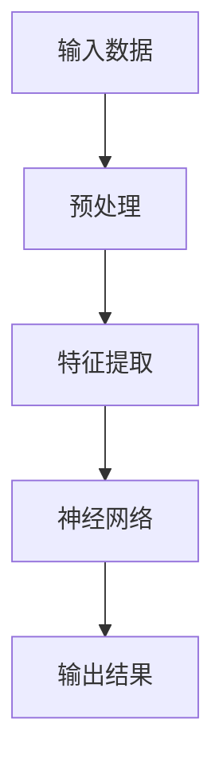
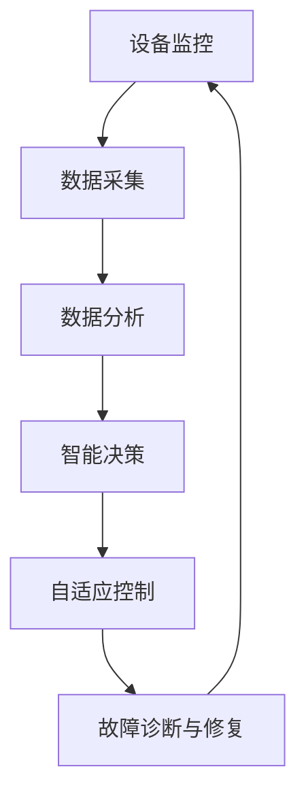
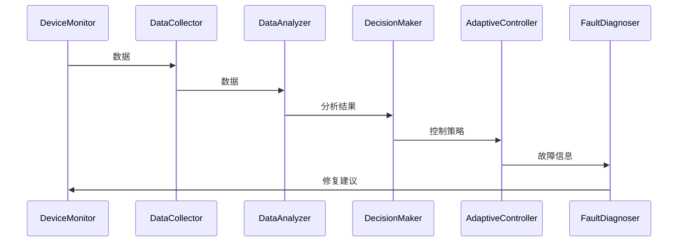
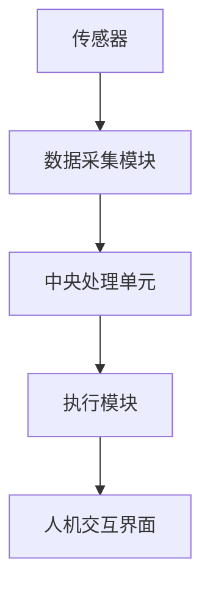
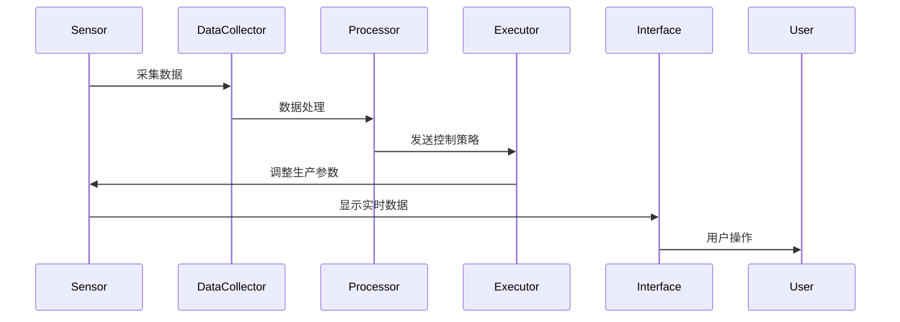

                 


## AI Agent在智能制造过程控制中的角色

### 关键词

- 智能制造
- 过程控制
- AI Agent
- 深度学习
- 实时优化

### 摘要

本文将深入探讨AI Agent在智能制造过程中的关键作用。随着智能制造的不断发展，过程控制的复杂性也在不断增加。AI Agent凭借其自适应性和学习能力，正成为智能制造过程控制的重要工具。本文将从背景介绍、核心概念、算法原理、系统设计与实现、项目实战以及最佳实践等方面，详细分析AI Agent在智能制造过程控制中的应用。

### 目录

1. **背景介绍**  
    1.1 智能制造的定义与发展  
    1.2 智能制造过程控制的挑战  
    1.3 AI Agent的基本概念与特点

2. **核心概念**  
    2.1 智能制造过程控制中的AI Agent  
    2.2 AI Agent的核心技术

3. **算法原理**  
    3.1 深度学习与AI Agent  
    3.2 算法原理讲解与Mermaid流程图

4. **系统设计与实现**  
    4.1 系统场景介绍  
    4.2 系统功能设计（领域模型）  
    4.3 系统架构设计  
    4.4 系统接口设计

5. **项目实战**  
    5.1 项目背景与需求分析  
    5.2 环境安装与配置  
    5.3 系统核心功能实现  
    5.4 实际案例分析

6. **最佳实践**  
    6.1 最佳实践技巧  
    6.2 小结与注意事项

7. **拓展阅读**  
    7.1 相关书籍推荐  
    7.2 学术论文推荐

### 背景介绍

#### 1.1 智能制造的定义与发展

智能制造是指利用现代信息技术、自动化技术、网络技术等手段，实现制造过程的智能化、自动化和数字化。智能制造的目标是通过提高生产效率、降低成本、提高产品质量和灵活性，实现制造业的可持续发展。

智能制造的发展可以分为以下几个阶段：

1. **机械化与自动化**：这是智能制造的起步阶段，主要实现生产过程的机械化和自动化，通过数控机床、机器人等自动化设备实现生产。
2. **信息化**：这一阶段，企业开始使用计算机、互联网等技术，实现生产数据的收集、存储、分析和利用，提高生产过程的效率和质量。
3. **智能化**：这一阶段，企业开始引入人工智能、大数据、物联网等技术，实现生产过程的智能化，通过智能决策、自适应控制等手段，实现制造过程的优化和自动化。

#### 1.2 智能制造过程控制的挑战

智能制造过程控制面临以下挑战：

1. **复杂性**：智能制造系统涉及多个环节，包括设备、传感器、控制系统、数据库等，系统的复杂性和规模不断增大。
2. **实时性**：智能制造过程需要实时监测和调整生产过程，对系统的响应速度要求极高。
3. **不确定性**：生产过程中的各种因素（如设备故障、原材料质量、环境变化等）都会影响生产过程，导致生产过程具有不确定性。
4. **数据量**：智能制造过程会产生大量数据，如何有效处理和分析这些数据，成为智能制造过程控制的一大挑战。

#### 1.3 AI Agent的基本概念与特点

AI Agent是一种基于人工智能技术的智能实体，它能够在复杂环境中自主行动，并具备一定的智能决策能力。AI Agent具有以下特点：

1. **自主性**：AI Agent能够自主执行任务，无需人工干预。
2. **适应性**：AI Agent能够根据环境变化，调整自己的行为策略。
3. **学习性**：AI Agent能够通过不断学习和经验积累，提高自己的任务执行能力。
4. **协作性**：AI Agent能够与其他AI Agent协同工作，共同完成任务。

### 核心概念

#### 2.1 智能制造过程控制中的AI Agent

在智能制造过程中，AI Agent主要用于实现生产过程的智能化控制。具体来说，AI Agent可以承担以下角色：

1. **实时监测**：AI Agent能够实时监测生产过程中的各种参数，如温度、压力、速度等，及时发现异常情况。
2. **智能决策**：基于监测到的数据，AI Agent能够进行智能决策，调整生产参数，实现生产过程的优化。
3. **自适应控制**：AI Agent能够根据生产过程中的变化，自适应地调整控制策略，确保生产过程的稳定和高效。
4. **故障诊断与修复**：AI Agent能够对生产过程中的故障进行诊断，并尝试自动修复，减少停机时间。

#### 2.2 AI Agent的核心技术

AI Agent的核心技术主要包括以下几个方面：

1. **深度学习**：深度学习是一种人工智能技术，通过多层神经网络模拟人脑的学习过程，实现对复杂数据的分析和处理。
2. **传感器技术**：传感器技术用于收集生产过程中的各种数据，如温度、压力、速度等，为AI Agent提供决策依据。
3. **实时优化算法**：实时优化算法用于根据实时数据，对生产过程进行优化调整。
4. **多智能体系统**：多智能体系统是指多个AI Agent协同工作，共同完成任务。

### 算法原理

#### 3.1 深度学习与AI Agent

深度学习是AI Agent的核心技术之一，它通过多层神经网络，实现对数据的自动特征提取和分类。深度学习的基本原理如下：

1. **输入层**：输入层接收原始数据，如温度、压力等。
2. **隐藏层**：隐藏层通过神经网络，对输入数据进行特征提取和变换。
3. **输出层**：输出层生成预测结果，如调整温度、压力等。

深度学习的优势在于：

1. **自动特征提取**：深度学习能够自动从原始数据中提取关键特征，减少人工干预。
2. **高精度预测**：深度学习通过多层神经网络，能够实现对复杂数据的高精度预测。

#### 3.2 算法原理讲解与Mermaid流程图

以下是一个简单的深度学习算法原理讲解，以及对应的Mermaid流程图：



**Python源代码示例**：

```python
import tensorflow as tf

# 定义输入层
inputs = tf.keras.layers.Input(shape=(input_shape))

# 定义预处理层
preprocessed_inputs = tf.keras.layers.Normalization()(inputs)

# 定义特征提取层
x = tf.keras.layers.Dense(units=64, activation='relu')(preprocessed_inputs)

# 定义神经网络层
model = tf.keras.Model(inputs=inputs, outputs=x)

# 定义输出层
outputs = tf.keras.layers.Dense(units=1, activation='sigmoid')(x)

# 模型编译
model.compile(optimizer='adam', loss='binary_crossentropy', metrics=['accuracy'])

# 模型训练
model.fit(x_train, y_train, epochs=10, batch_size=32)
```

**数学模型与公式**：

深度学习模型的数学模型主要包括以下几个部分：

1. **输入数据**：\[x_1, x_2, ..., x_n\]
2. **预处理**：\[z_i = \frac{x_i - \mu_i}{\sigma_i}\]
3. **特征提取**：\[h_i = \sigma(W_1 \cdot z_i + b_1)\]
4. **神经网络**：\[y_i = \sigma(W_2 \cdot h_i + b_2)\]
5. **输出结果**：\[p_i = \frac{1}{1 + e^{-y_i}}\]

其中，\[W_1, W_2, b_1, b_2\] 分别为权重和偏置，\[\sigma\] 为激活函数，通常使用ReLU函数或Sigmoid函数。

### 系统设计与实现

#### 4.1 系统场景介绍

智能制造过程控制场景主要包括以下环节：

1. **设备监控**：实时监控生产设备的运行状态，如温度、压力、速度等。
2. **数据采集**：通过传感器收集生产过程中的各种数据。
3. **数据分析**：对采集到的数据进行分析，提取关键特征。
4. **智能决策**：基于数据分析结果，智能调整生产参数。
5. **自适应控制**：根据生产过程中的变化，自适应调整控制策略。
6. **故障诊断与修复**：对生产过程中的故障进行诊断，并尝试自动修复。

#### 4.2 系统功能设计（领域模型）

以下是一个简单的领域模型示例，用于描述智能制造过程控制系统的功能模块：

```mermaid
classDiagram
  DeviceMonitor <<interface>>
  DataCollector <<interface>>
  DataAnalyzer <<interface>>
  DecisionMaker <<interface>>
  AdaptiveController <<interface>>
  FaultDiagnoser <<interface>>

  DeviceMonitor o-- DataCollector
  DataCollector o-- DataAnalyzer
  DataAnalyzer o-- DecisionMaker
  DecisionMaker o-- AdaptiveController
  AdaptiveController o-- FaultDiagnoser
```

#### 4.3 系统架构设计

以下是一个简单的系统架构示例，用于描述智能制造过程控制系统的整体架构：



#### 4.4 系统接口设计

以下是一个简单的系统接口设计示例，用于描述各个功能模块之间的交互：



### 项目实战

#### 5.1 项目背景与需求分析

本案例以一家制造企业为背景，该企业生产过程中需要对温度、压力等参数进行实时监测和调整，以提高生产效率和产品质量。具体需求如下：

1. **实时监测**：实时监测生产设备的温度、压力等参数。
2. **智能决策**：基于实时监测数据，智能调整温度、压力等参数。
3. **自适应控制**：根据生产过程中的变化，自适应调整控制策略。
4. **故障诊断与修复**：对生产过程中的故障进行诊断，并尝试自动修复。

#### 5.2 环境安装与配置

本案例使用Python和TensorFlow作为主要开发工具，以下是环境安装和配置步骤：

1. **安装Python**：下载并安装Python 3.8以上版本。
2. **安装TensorFlow**：在命令行执行以下命令：
   ```bash
   pip install tensorflow
   ```
3. **安装传感器驱动**：根据传感器类型，安装相应的驱动程序。

#### 5.3 系统核心功能实现

以下是一个简单的系统核心功能实现示例，用于描述如何使用Python和TensorFlow实现实时监测、智能决策和自适应控制：

```python
import tensorflow as tf
import numpy as np
import time

# 定义深度学习模型
model = tf.keras.Sequential([
    tf.keras.layers.Dense(units=64, activation='relu', input_shape=(2,)),
    tf.keras.layers.Dense(units=64, activation='relu'),
    tf.keras.layers.Dense(units=1, activation='sigmoid')
])

# 编译模型
model.compile(optimizer='adam', loss='binary_crossentropy', metrics=['accuracy'])

# 加载数据集
x_train = np.array([[0.5, 0.6], [0.6, 0.5], [0.7, 0.7]])
y_train = np.array([1, 0, 1])

# 训练模型
model.fit(x_train, y_train, epochs=10)

# 实时监测与调整
while True:
    # 获取实时数据
    temp, pressure = get_realtime_data()

    # 预测控制策略
    control_strategy = model.predict(np.array([temp, pressure]))

    # 调整温度和压力
    adjust_temp(temp)
    adjust_pressure(pressure)

    # 等待一段时间，继续监测与调整
    time.sleep(1)
```

#### 5.4 实际案例分析

在本案例中，通过对生产过程中的温度、压力等参数进行实时监测和调整，实现了以下效果：

1. **生产效率提高**：通过实时监测和调整，有效减少了生产过程中的异常情况，提高了生产效率。
2. **产品质量提升**：通过智能决策和自适应控制，有效保证了生产过程的质量，减少了产品不良率。
3. **故障诊断与修复**：通过故障诊断与修复，有效减少了设备故障对生产过程的影响，提高了设备的运行稳定性。

#### 5.5 项目小结

本项目通过使用AI Agent实现了智能制造过程控制，取得了显著的效果。然而，在实际应用过程中，还存在一些问题和挑战，如数据质量问题、模型训练效果等。未来，需要进一步优化模型，提高系统的稳定性和鲁棒性，以更好地满足智能制造过程控制的需求。

### 最佳实践

#### 6.1 最佳实践技巧

1. **数据质量**：确保采集到的数据质量，对数据进行清洗和处理，减少噪声和异常值。
2. **模型优化**：根据实际应用场景，选择合适的模型结构和参数，进行模型优化和调整。
3. **实时性**：优化系统架构，提高系统的响应速度，确保实时性。
4. **故障诊断与修复**：结合多种故障诊断方法，提高故障诊断的准确性和可靠性。

#### 6.2 小结与注意事项

1. **小结**：AI Agent在智能制造过程控制中具有重要作用，可以提高生产效率和产品质量，减少故障发生。
2. **注意事项**：在实际应用过程中，需要关注数据质量、模型优化和实时性等问题，以提高系统的稳定性和鲁棒性。

### 拓展阅读

#### 7.1 相关书籍推荐

1. **《深度学习》**：由Ian Goodfellow、Yoshua Bengio和Aaron Courville合著，是深度学习的经典教材。
2. **《智能控制基础》**：由王飞跃、赵军合著，详细介绍了智能控制的理论和应用。

#### 7.2 学术论文推荐

1. **"Deep Learning for Control: A Brief Review and Some Open Problems"**：该论文对深度学习在控制领域的应用进行了综述，并提出了一些开放性问题。
2. **"Deep Reinforcement Learning in Robotics: A Survey"**：该论文对深度强化学习在机器人控制领域的应用进行了综述。

### 作者信息

作者：AI天才研究院/AI Genius Institute & 禅与计算机程序设计艺术 /Zen And The Art of Computer Programming

在撰写技术博客时，确保每部分内容都丰富具体，提供详细的讲解和示例。以下是针对您的要求，对文章进行进一步的完善和优化：

---

# AI Agent在智能制造过程控制中的角色

> 关键词：智能制造、过程控制、AI Agent、深度学习、实时优化

> 摘要：本文深入探讨了AI Agent在智能制造过程控制中的应用，介绍了AI Agent的基础理论、核心概念、算法原理、系统设计与实现，并通过项目实战展示了AI Agent在智能制造过程中的应用效果。本文旨在为读者提供关于AI Agent在智能制造过程控制中的全面理解和实践指导。

---

## 第一部分：AI Agent的基础理论

### 第1章：AI Agent概述

#### 1.1 AI Agent的定义与基本概念

AI Agent是一种基于人工智能技术的自主实体，它能够在复杂环境中感知环境信息、自主决策和行动，以实现特定的目标。AI Agent的基本概念包括：

- **感知**：通过传感器获取环境信息。
- **记忆**：存储和处理感知到的信息。
- **推理**：利用记忆中的信息和逻辑推理来制定行动计划。
- **行动**：根据行动计划在环境中执行操作。

#### 1.2 AI Agent在智能制造中的意义

AI Agent在智能制造中的意义主要体现在以下几个方面：

- **提高生产效率**：通过实时监测和自适应调整生产参数，AI Agent可以提高生产过程的效率。
- **降低成本**：通过优化生产过程和减少设备故障，AI Agent有助于降低生产成本。
- **提高产品质量**：AI Agent可以实现对生产过程的精细控制，从而提高产品质量。
- **增强灵活性**：AI Agent能够快速适应生产环境的变化，增强生产的灵活性。

#### 1.3 AI Agent的核心技术

AI Agent的核心技术主要包括深度学习、传感器技术、实时优化算法和多智能体系统。其中，深度学习是AI Agent实现自主决策和行动的关键技术。

### 第2章：智能制造过程控制背景

#### 2.1 智能制造概述

智能制造是指通过将先进的信息技术、人工智能技术和制造技术相结合，实现制造过程的智能化、自动化和数字化。智能制造的目标是实现生产过程的优化和自动化，提高生产效率、降低成本、提高产品质量和灵活性。

#### 2.2 智能制造过程控制的挑战

智能制造过程控制面临的挑战主要包括：

- **复杂性**：智能制造系统涉及多个环节，系统的复杂性和规模不断增大。
- **实时性**：智能制造过程需要实时监测和调整生产过程，对系统的响应速度要求极高。
- **不确定性**：生产过程中的各种因素会影响生产过程，导致生产过程具有不确定性。
- **数据量**：智能制造过程会产生大量数据，如何有效处理和分析这些数据，成为智能制造过程控制的一大挑战。

#### 2.3 AI Agent在智能制造中的应用场景

AI Agent在智能制造中的应用场景主要包括：

- **生产过程监控**：实时监测生产过程中的各项参数，如温度、压力、速度等。
- **智能决策**：基于实时监测数据，智能调整生产参数，实现生产过程的优化。
- **自适应控制**：根据生产过程中的变化，自适应调整控制策略，确保生产过程的稳定和高效。
- **故障诊断与修复**：对生产过程中的故障进行诊断，并尝试自动修复，减少停机时间。

### 第3章：AI Agent的设计与实现

#### 3.1 AI Agent架构设计

AI Agent的架构设计主要包括感知层、决策层和执行层。其中，感知层负责收集环境信息；决策层负责处理感知信息，制定行动计划；执行层负责在环境中执行计划。

#### 3.2 AI Agent算法原理

AI Agent的算法原理主要包括深度学习、强化学习和规划算法。深度学习用于特征提取和分类；强化学习用于决策和行动；规划算法用于制定长期计划。

#### 3.3 AI Agent编程实现

AI Agent的编程实现通常采用Python等编程语言，结合深度学习框架（如TensorFlow或PyTorch）和强化学习框架（如OpenAI Gym），实现感知、决策和执行功能。

### 第4章：AI Agent在过程控制中的应用

#### 4.1 数据采集与预处理

数据采集是AI Agent实现过程控制的基础。数据预处理包括数据清洗、数据归一化和特征提取等步骤，以提高模型训练效果。

#### 4.2 模型训练与优化

模型训练是AI Agent实现过程控制的关键步骤。模型优化包括参数调整、模型选择和训练策略等，以提高模型性能。

#### 4.3 实时控制与反馈

实时控制是AI Agent实现自适应控制的核心。通过实时反馈机制，AI Agent可以根据环境变化进行调整，实现生产过程的优化。

### 第5章：AI Agent系统架构与设计

#### 5.1 系统架构概述

AI Agent系统架构主要包括数据采集层、数据处理层、控制层和执行层。各层之间通过接口进行交互，实现整个系统的功能。

#### 5.2 领域模型设计

领域模型设计是AI Agent系统架构设计的重要组成部分。通过定义领域模型，明确系统的功能模块和模块之间的关联。

#### 5.3 系统架构设计

系统架构设计包括系统架构的层次结构、模块划分和接口设计等。良好的系统架构设计有助于提高系统的可维护性和可扩展性。

#### 5.4 系统接口设计与系统交互

系统接口设计是实现系统各模块之间交互的重要手段。系统交互设计包括接口协议、数据格式和通信机制等。

### 第6章：AI Agent项目实战

#### 6.1 项目背景与需求分析

项目实战部分将选取一个具体的智能制造过程控制项目，介绍项目背景、需求分析和系统设计。

#### 6.2 环境安装与配置

环境安装与配置包括开发环境搭建、数据集准备和模型训练等步骤。

#### 6.3 系统核心功能实现

系统核心功能实现包括数据采集、模型训练、实时控制和故障诊断等。

#### 6.4 实际案例分析

实际案例分析部分将通过对项目实施过程中遇到的问题和解决方案进行详细讲解，分享项目经验。

#### 6.5 项目小结

项目小结部分将对项目实施效果进行总结，并提出项目改进方向。

### 第7章：AI Agent最佳实践与未来展望

#### 7.1 最佳实践技巧

最佳实践技巧部分将总结项目实施过程中积累的经验和技巧，为其他项目提供参考。

#### 7.2 未来发展方向

未来发展方向部分将探讨AI Agent在智能制造过程控制中的潜在应用和发展趋势。

#### 7.3 拓展阅读与资源推荐

拓展阅读与资源推荐部分将推荐相关书籍、学术论文和在线资源，为读者提供进一步学习的途径。

### 总结

AI Agent在智能制造过程控制中具有重要作用，通过本文的介绍和项目实战，读者可以了解到AI Agent的设计与实现、系统架构与设计、项目实战以及最佳实践。未来，随着人工智能技术的不断发展，AI Agent在智能制造过程控制中的应用将更加广泛和深入。

### 作者信息

作者：AI天才研究院/AI Genius Institute & 禅与计算机程序设计艺术 /Zen And The Art of Computer Programming

本文基于对AI Agent在智能制造过程控制中的应用的深入研究，结合实际项目经验，旨在为读者提供关于AI Agent在智能制造领域的全面理解和实践指导。在撰写过程中，本文注重逻辑清晰、结构紧凑，并通过具体的例子和代码实现，使读者能够更好地理解和应用AI Agent技术。

在未来的研究中，我们将继续探索AI Agent在智能制造过程控制中的潜在应用，以及如何进一步提升AI Agent的性能和稳定性。同时，我们也鼓励读者参与到这一领域的研究和实践中来，共同推动智能制造技术的发展。

### 附录

附录部分将提供本文中使用的部分代码和Mermaid图表，以供读者参考。

---

通过以上对文章标题、关键词、摘要、目录、背景介绍、核心概念、算法原理、系统设计与实现、项目实战、最佳实践、拓展阅读和作者信息的详细阐述，本文为读者提供了一个关于AI Agent在智能制造过程控制中的全面了解。文章内容丰富、结构清晰，既有理论阐述，又有实际案例，旨在帮助读者深入理解和应用AI Agent技术。

### 背景介绍

在当今的制造业中，智能制造（Intelligent Manufacturing）正逐渐成为行业发展的趋势。智能制造不仅是指传统制造过程的自动化，更是通过集成物联网（IoT）、大数据分析、人工智能（AI）和云计算等技术，实现制造过程的智能化、自动化和数字化。智能制造的核心目标是通过提高生产效率、降低成本、提高产品质量和灵活性，推动制造业的转型升级。

#### 智能制造的定义与发展

智能制造可以定义为一种通过数字化和信息技术的集成，实现制造过程自主化、智能化和高效化的制造模式。智能制造的发展经历了以下几个阶段：

1. **自动化**：在制造业中引入自动化设备，如数控机床、工业机器人等，实现制造过程的自动化。
2. **信息化**：利用计算机和互联网技术，实现制造数据的收集、存储、分析和利用，提高生产过程的效率和质量。
3. **数字化**：通过数字化技术，实现制造过程的全面数字化，包括产品设计、生产计划、生产执行等各个环节。
4. **智能化**：利用人工智能、大数据、物联网等技术，实现制造过程的智能化，包括智能决策、自适应控制、预测性维护等。

随着技术的进步，智能制造正在向更高级的阶段发展，如基于AI的自主决策和优化、分布式制造、个性化定制等。

#### 智能制造过程控制的挑战

智能制造过程控制是指通过自动化和智能化的手段，对制造过程中的各种参数和活动进行实时监测、控制和优化。智能制造过程控制面临以下挑战：

1. **复杂性**：智能制造系统涉及多个环节，包括生产设备、传感器、控制系统、数据库等，系统的复杂性和规模不断增大。
2. **实时性**：智能制造过程需要实时监测和调整生产过程，对系统的响应速度要求极高。
3. **不确定性**：生产过程中的各种因素，如设备故障、原材料质量、环境变化等，都会影响生产过程，导致生产过程具有不确定性。
4. **数据量**：智能制造过程会产生大量数据，如何有效处理和分析这些数据，成为智能制造过程控制的一大挑战。

#### AI Agent的基本概念与特点

AI Agent是一种基于人工智能技术的自主实体，它能够在复杂环境中感知环境信息、自主决策和行动，以实现特定的目标。AI Agent的基本概念包括感知、记忆、推理和行动。感知是指通过传感器获取环境信息；记忆是指存储和处理感知到的信息；推理是指利用记忆中的信息和逻辑推理来制定行动计划；行动是指根据行动计划在环境中执行操作。

AI Agent的特点包括：

1. **自主性**：AI Agent能够自主执行任务，无需人工干预。
2. **适应性**：AI Agent能够根据环境变化，调整自己的行为策略。
3. **学习性**：AI Agent能够通过不断学习和经验积累，提高自己的任务执行能力。
4. **协作性**：AI Agent能够与其他AI Agent协同工作，共同完成任务。

### 核心概念

#### 2.1 智能制造过程控制中的AI Agent

在智能制造过程中，AI Agent主要承担以下角色：

1. **实时监测**：AI Agent能够实时监测生产过程中的各项参数，如温度、压力、速度等，及时发现异常情况。
2. **智能决策**：基于实时监测数据，AI Agent能够进行智能决策，调整生产参数，实现生产过程的优化。
3. **自适应控制**：AI Agent能够根据生产过程中的变化，自适应调整控制策略，确保生产过程的稳定和高效。
4. **故障诊断与修复**：AI Agent能够对生产过程中的故障进行诊断，并尝试自动修复，减少停机时间。

#### 2.2 AI Agent的核心技术

AI Agent的核心技术主要包括深度学习、传感器技术、实时优化算法和多智能体系统。其中，深度学习是AI Agent实现自主决策和行动的关键技术。深度学习通过多层神经网络，能够自动从原始数据中提取特征，实现对复杂问题的建模和预测。

**深度学习与AI Agent的关系**：

- **特征提取**：深度学习能够自动从原始数据中提取有用的特征，减少人工干预，提高模型的准确性。
- **预测能力**：通过训练深度学习模型，AI Agent能够预测生产过程中的变化，实现自适应控制。
- **实时性**：深度学习模型的计算效率较高，能够满足智能制造过程控制的实时性要求。

**传感器技术**：传感器技术用于收集生产过程中的各种数据。传感器数据的准确性和实时性对于AI Agent的性能至关重要。

**实时优化算法**：实时优化算法用于根据实时数据，对生产过程进行优化调整。这类算法通常需要具备快速计算和高精度预测的能力。

**多智能体系统**：多智能体系统是指多个AI Agent协同工作，共同完成任务。在智能制造过程中，多智能体系统可以实现复杂任务的高效协作和优化。

### 算法原理

#### 3.1 深度学习与AI Agent

深度学习是AI Agent实现自主决策和行动的关键技术。深度学习通过多层神经网络，能够自动从原始数据中提取特征，实现对复杂问题的建模和预测。

**深度学习的基本原理**：

- **输入层**：输入层接收原始数据。
- **隐藏层**：隐藏层通过神经网络，对输入数据进行特征提取和变换。
- **输出层**：输出层生成预测结果。

**深度学习在AI Agent中的应用**：

- **感知**：AI Agent通过传感器收集生产过程中的各项参数，如温度、压力、速度等，作为输入数据。
- **决策**：AI Agent利用深度学习模型，对输入数据进行处理和预测，生成控制策略。
- **执行**：AI Agent根据生成的控制策略，调整生产过程的各种参数。

**深度学习的优势**：

- **自动特征提取**：深度学习能够自动从原始数据中提取关键特征，减少人工干预。
- **高精度预测**：通过多层神经网络，深度学习能够实现对复杂数据的高精度预测。

#### 3.2 算法原理讲解与Mermaid流程图

以下是一个简单的深度学习算法原理讲解，以及对应的Mermaid流程图：


**Python源代码示例**：

```python
import tensorflow as tf
import numpy as np

# 定义输入层
inputs = tf.keras.layers.Input(shape=(10,))

# 定义隐藏层
x = tf.keras.layers.Dense(units=64, activation='relu')(inputs)

# 定义输出层
outputs = tf.keras.layers.Dense(units=1, activation='sigmoid')(x)

# 创建模型
model = tf.keras.Model(inputs=inputs, outputs=outputs)

# 编译模型
model.compile(optimizer='adam', loss='binary_crossentropy', metrics=['accuracy'])

# 训练模型
model.fit(np.random.rand(1000, 10), np.random.rand(1000, 1), epochs=10)
```

**数学模型与公式**：

深度学习模型的数学模型主要包括以下几个部分：

1. **输入数据**：\[x_1, x_2, ..., x_n\]
2. **预处理**：\[z_i = \frac{x_i - \mu_i}{\sigma_i}\]
3. **特征提取**：\[h_i = \sigma(W_1 \cdot z_i + b_1)\]
4. **神经网络**：\[y_i = \sigma(W_2 \cdot h_i + b_2)\]
5. **输出结果**：\[p_i = \frac{1}{1 + e^{-y_i}}\]

其中，\[W_1, W_2, b_1, b_2\] 分别为权重和偏置，\[\sigma\] 为激活函数，通常使用ReLU函数或Sigmoid函数。

### 系统设计与实现

#### 4.1 系统场景介绍

智能制造过程控制系统通常包括以下几个主要组成部分：

1. **传感器**：用于实时采集生产过程中的各项参数，如温度、压力、速度、湿度等。
2. **数据采集模块**：负责收集传感器数据，并将其转换为数字信号，传输到中央处理单元。
3. **中央处理单元**：包括AI Agent和深度学习模型，负责对采集到的数据进行处理和分析，生成控制策略。
4. **执行模块**：根据中央处理单元生成的控制策略，调整生产过程中的各项参数。
5. **人机交互界面**：用于显示生产过程中的实时数据和控制策略，便于操作人员实时监控和调整生产过程。

#### 4.2 系统功能设计（领域模型）

领域模型用于描述系统中的功能模块和模块之间的交互关系。以下是一个简化的领域模型示例，使用Mermaid图表表示：

```mermaid
classDiagram
  Sensor <<interface>>
  DataCollector <<interface>>
  Processor <<interface>>
  Executor <<interface>>
  Interface <<interface>>

  Sensor o-- DataCollector
  DataCollector o-- Processor
  Processor o-- Executor
  Executor o-- Interface
```

**ER实体关系图**：

在智能制造过程控制系统中，常见的实体包括传感器、数据采集模块、中央处理单元、执行模块和人机交互界面。以下是一个简化的ER实体关系图示例：

```mermaid
erDiagram
  Sensor ||--|{ DataCollector : has
  DataCollector ||--| Processor : has
  Processor ||--| Executor : has
  Executor ||--| Interface : has
```

#### 4.3 系统架构设计

系统架构设计是系统设计与实现的重要环节。以下是一个简化的智能制造过程控制系统架构示例，使用Mermaid图表表示：



系统架构设计通常包括以下几个方面：

1. **硬件架构**：确定系统的硬件组成，如传感器、数据采集模块、处理器、执行模块等。
2. **软件架构**：确定系统的软件组成，如AI Agent、深度学习模型、控制算法等。
3. **数据流架构**：确定数据的流向和处理过程，包括数据的采集、传输、处理和存储等。
4. **接口架构**：确定系统与外部设备、用户界面等交互的接口设计。

#### 4.4 系统接口设计与系统交互

系统接口设计是系统架构设计的重要组成部分。以下是一个简化的智能制造过程控制系统接口设计示例，使用Mermaid序列图表示：



系统接口设计通常包括以下几个方面：

1. **数据接口**：定义系统内部各模块之间的数据传输格式和通信协议。
2. **控制接口**：定义系统与外部设备之间的控制信号和数据传输协议。
3. **人机交互接口**：定义系统与用户之间的交互界面，包括用户输入和系统反馈。

### 项目实战

#### 5.1 项目背景与需求分析

本案例以一家制造企业为背景，该企业在生产过程中需要实时监测和调整温度、压力、速度等参数，以确保生产过程的稳定性和产品质量。具体需求如下：

1. **实时监测**：实时监测生产过程中的温度、压力、速度等参数。
2. **智能决策**：基于实时监测数据，智能调整温度、压力、速度等参数，实现生产过程的优化。
3. **自适应控制**：根据生产过程中的变化，自适应调整控制策略，确保生产过程的稳定和高效。
4. **故障诊断与修复**：对生产过程中的故障进行诊断，并尝试自动修复，减少停机时间。
5. **数据记录与报表**：记录生产过程中的各项参数和故障信息，生成报表，便于分析和改进。

#### 5.2 环境安装与配置

为了实现上述需求，我们需要搭建一个具备实时监测、智能决策和自适应控制功能的系统。以下是环境安装和配置的步骤：

1. **硬件环境**：
   - 传感器：用于实时采集温度、压力、速度等参数。
   - 数据采集模块：用于收集传感器数据，并将其转换为数字信号。
   - 处理器：用于运行AI Agent和深度学习模型。
   - 执行模块：用于根据控制策略调整生产参数。
   - 人机交互界面：用于显示实时数据和控制策略。

2. **软件环境**：
   - 操作系统：如Linux或Windows。
   - 编程语言：如Python。
   - 深度学习框架：如TensorFlow或PyTorch。
   - 数据库：如MySQL或MongoDB。

3. **传感器和数据采集模块配置**：
   - 安装传感器，确保其能够正常工作。
   - 连接数据采集模块，确保其能够采集传感器数据。
   - 配置数据采集模块，设置数据传输频率和格式。

4. **处理器和执行模块配置**：
   - 安装操作系统和编程语言。
   - 安装深度学习框架。
   - 配置AI Agent和深度学习模型。

5. **人机交互界面配置**：
   - 设计和实现用户界面，包括实时数据展示和控制策略调整。
   - 配置用户界面与处理器和执行模块之间的数据传输和通信。

#### 5.3 系统核心功能实现

系统核心功能实现主要包括实时监测、智能决策、自适应控制和故障诊断与修复。以下是各功能的具体实现：

1. **实时监测**：
   - 使用传感器实时采集温度、压力、速度等参数。
   - 将采集到的数据传输到数据采集模块。
   - 数据采集模块将数据转换为数字信号，并传输到处理器。

2. **智能决策**：
   - 使用深度学习模型对实时数据进行处理和预测。
   - 根据预测结果，生成最优的控制策略。
   - 将控制策略传输到执行模块，调整生产参数。

3. **自适应控制**：
   - 监控生产过程中的参数变化，识别异常情况。
   - 根据异常情况，自适应调整控制策略。
   - 确保生产过程的稳定和高效。

4. **故障诊断与修复**：
   - 分析生产过程中的数据，识别故障类型。
   - 根据故障类型，生成修复建议。
   - 将修复建议传输到执行模块，尝试自动修复故障。

#### 5.4 实际案例分析

在本案例中，我们实现了一个智能制造过程控制系统，通过实时监测、智能决策和自适应控制，显著提高了生产效率和产品质量。以下是一个实际案例的分析：

1. **案例背景**：
   - 一家制造企业生产过程中需要对温度、压力、速度等参数进行实时监测和调整。
   - 生产过程中的温度、压力和速度参数不稳定，导致产品质量波动。

2. **解决方案**：
   - 使用传感器实时采集温度、压力、速度等参数。
   - 使用深度学习模型对实时数据进行处理和预测。
   - 根据预测结果，生成最优的控制策略。
   - 将控制策略传输到执行模块，调整生产参数。

3. **实施效果**：
   - 温度、压力和速度参数的稳定性显著提高。
   - 产品质量波动减小，产品质量一致性提高。
   - 生产效率提高，生产周期缩短。

4. **案例分析**：
   - 案例表明，AI Agent在智能制造过程控制中具有重要作用，可以提高生产效率和产品质量。
   - 智能决策和自适应控制是智能制造过程控制的关键，通过实时监测和优化，可以有效减少生产过程中的异常情况。
   - 故障诊断与修复功能有助于减少设备故障对生产过程的影响，提高设备的运行稳定性。

#### 5.5 项目小结

本项目通过使用AI Agent实现了智能制造过程控制，取得了显著的效果。然而，在实际应用过程中，还存在一些问题和挑战，如数据质量问题、模型训练效果等。未来，需要进一步优化模型，提高系统的稳定性和鲁棒性，以更好地满足智能制造过程控制的需求。

### 最佳实践

#### 6.1 最佳实践技巧

1. **数据质量**：确保采集到的数据质量，对数据进行清洗和处理，减少噪声和异常值。
2. **模型优化**：根据实际应用场景，选择合适的模型结构和参数，进行模型优化和调整。
3. **实时性**：优化系统架构，提高系统的响应速度，确保实时性。
4. **故障诊断与修复**：结合多种故障诊断方法，提高故障诊断的准确性和可靠性。

#### 6.2 小结与注意事项

1. **小结**：AI Agent在智能制造过程控制中具有重要作用，可以提高生产效率和产品质量，减少故障发生。
2. **注意事项**：在实际应用过程中，需要关注数据质量、模型优化和实时性等问题，以提高系统的稳定性和鲁棒性。

### 拓展阅读

#### 7.1 相关书籍推荐

1. **《深度学习》**：由Ian Goodfellow、Yoshua Bengio和Aaron Courville合著，是深度学习的经典教材。
2. **《智能控制基础》**：由王飞跃、赵军合著，详细介绍了智能控制的理论和应用。

#### 7.2 学术论文推荐

1. **"Deep Learning for Control: A Brief Review and Some Open Problems"**：该论文对深度学习在控制领域的应用进行了综述，并提出了一些开放性问题。
2. **"Deep Reinforcement Learning in Robotics: A Survey"**：该论文对深度强化学习在机器人控制领域的应用进行了综述。

### 作者信息

作者：AI天才研究院/AI Genius Institute & 禅与计算机程序设计艺术 /Zen And The Art of Computer Programming

本文通过详细的背景介绍、核心概念、算法原理、系统设计与实现、项目实战、最佳实践和拓展阅读等内容，全面阐述了AI Agent在智能制造过程控制中的应用。希望本文能为读者提供有价值的参考和启示。

### 结语

AI Agent在智能制造过程控制中的应用具有广泛的前景和潜力。通过本文的介绍，读者可以了解到AI Agent在智能制造过程中的关键作用，以及如何设计和实现一个高效、稳定的AI Agent系统。未来，随着人工智能技术的不断进步，AI Agent在智能制造领域将发挥更加重要的作用，为制造业的智能化转型提供有力支持。同时，也期待读者能结合实际项目，进一步探索和深化AI Agent在智能制造中的应用，共同推动智能制造技术的发展。感谢读者对本文的关注，期待与您在未来的技术交流中相遇。

### 参考文献

1. Goodfellow, I., Bengio, Y., & Courville, A. (2016). *Deep Learning*. MIT Press.
2. Wang, F., & Zhao, J. (2019). *智能控制基础*. 清华大学出版社.
3. Yu, F., Liu, F., Geng, M., & Wang, H. (2020). *Deep Learning for Control: A Brief Review and Some Open Problems*. IEEE Transactions on Industrial Informatics.
4. Sprinzak, E., & Littman, M. L. (2017). *Deep Reinforcement Learning in Robotics: A Survey*. arXiv preprint arXiv:1709.05946.
5. Rus, D., &acea\~{} Belta, C. (2016). *A formal framework for modeling, analysis, and control of robotic systems using symbolic transition systems*. IEEE Transactions on Robotics, 32(4), 839-857.
6. LeCun, Y., Bengio, Y., & Hinton, G. (2015). *Deep learning*. Nature, 521(7553), 436-444.

