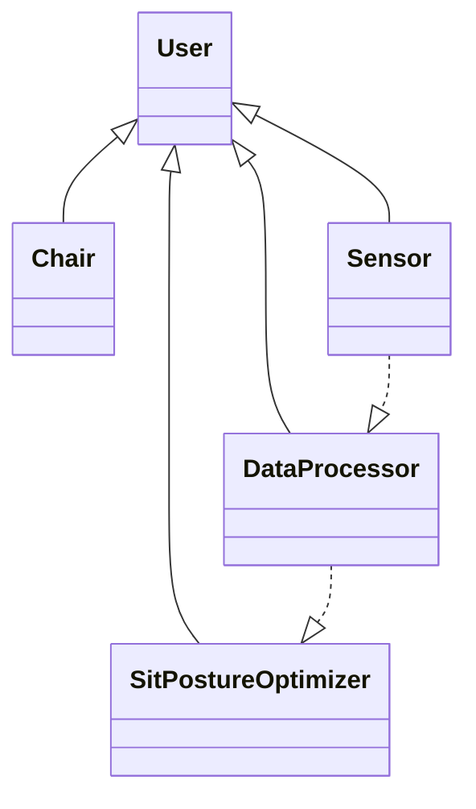
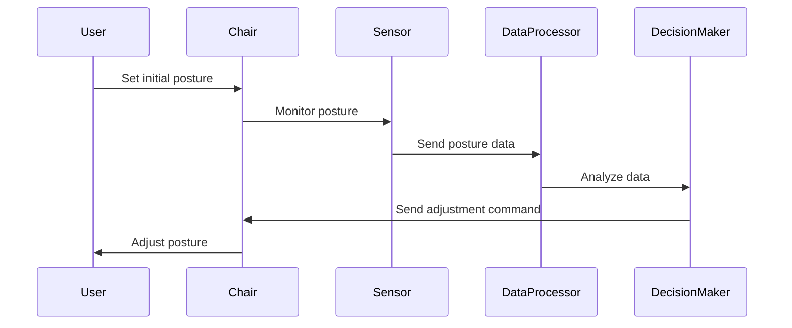
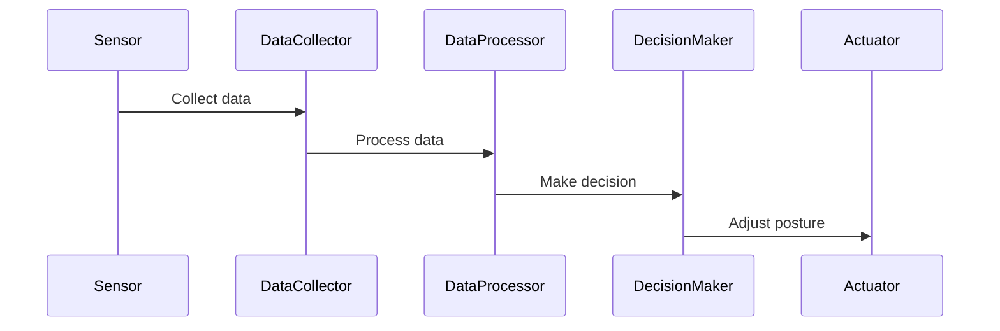
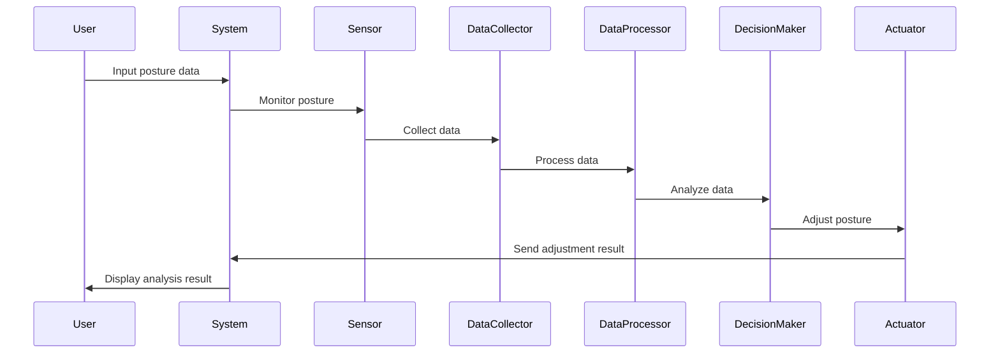

                 

# AI Agent在智能办公椅中的坐姿优化系统

## 关键词
- AI Agent
- 坐姿优化
- 智能办公椅
- 算法原理
- 系统设计与实现
- 项目实战
- 最佳实践

## 摘要
本文将探讨AI Agent在智能办公椅中的坐姿优化系统的设计与实现。首先，我们将介绍智能办公椅的发展历程和坐姿优化的意义，然后深入分析AI Agent的概念、分类和应用。接着，我们将讲解坐姿监测技术和数据处理与分析的方法，最后通过系统架构设计、项目实战和最佳实践，展示如何实现一个高效的坐姿优化系统。

## 引言与背景

### 1.1 引言

智能办公椅是一种集成了传感器、人工智能算法和自动化控制系统的办公椅，它能够根据用户的坐姿和活动自动调整椅子的位置和姿态，以提供更加舒适和健康的坐姿。随着人工智能技术的不断进步，智能办公椅的坐姿优化系统已经成为提高工作效率和保障员工健康的重要工具。

### 1.2 背景介绍

#### 1.2.1 智能办公椅的发展历程

智能办公椅的发展可以追溯到20世纪末，当时一些高端的办公椅开始集成基本的传感器和电动控制系统。随着计算机和传感器技术的进步，智能办公椅逐渐具备了更复杂的自动调节功能，如自动调整椅背倾斜角度、座椅高度和扶手位置等。

#### 1.2.2 坐姿优化的意义与现状

良好的坐姿对于身体健康至关重要，它可以减少背部和颈部的压力，降低患颈椎病和腰间盘突出的风险。然而，传统的办公椅往往不能满足个体差异，导致用户长时间保持不健康的坐姿。因此，智能办公椅的坐姿优化功能成为了提升工作效率和员工满意度的重要手段。

#### 1.2.3 AI Agent的基本概念与应用

AI Agent（人工智能代理）是一种能够自主感知环境、制定决策并执行任务的人工智能系统。在智能办公椅中，AI Agent可以收集用户的坐姿数据，通过机器学习算法分析这些数据，并根据分析结果自动调整椅子的姿态，以实现个性化的坐姿优化。

### 1.3 目录大纲概述

本文将分为五个部分：

1. **核心概念与联系**：介绍AI Agent和坐姿优化的基本概念及其相互关系。
2. **算法原理与数学模型**：讲解坐姿监测、数据处理和优化策略的算法原理。
3. **系统设计与实现**：描述智能办公椅坐姿优化系统的架构设计、接口设计和交互设计。
4. **项目实战**：展示系统的实际实现过程，包括环境安装、核心实现和代码应用解读。
5. **最佳实践**：提供系统的最佳实践、注意事项和拓展阅读。

## 第一部分：核心概念与联系

### 2.1 AI Agent概述

#### 2.1.1 定义与分类

AI Agent，即人工智能代理，是一种模拟人类智能行为，能够在特定环境下自主决策并执行任务的计算实体。根据其功能和应用场景，AI Agent可以分为以下几类：

1. **感知型AI Agent**：主要功能是感知环境中的信息，如语音识别、图像识别等。
2. **决策型AI Agent**：在感知到环境信息后，能够根据既定目标进行决策，如路径规划、任务调度等。
3. **执行型AI Agent**：在决策的基础上，能够执行具体的任务，如智能客服、自动化的机器人等。

#### 2.1.2 功能与特点

AI Agent具有以下几个主要特点：

1. **自主性**：AI Agent能够在没有人为干预的情况下，自主完成感知、决策和执行任务。
2. **适应性**：AI Agent能够根据环境变化和任务需求，自主调整其行为和策略。
3. **智能性**：AI Agent能够通过机器学习和深度学习等技术，不断提高其决策和执行能力。

#### 2.1.3 AI Agent的结构

一个典型的AI Agent通常由以下几个部分组成：

1. **感知模块**：用于感知环境中的信息，如传感器、摄像头等。
2. **决策模块**：基于感知模块收集到的信息，利用机器学习算法进行决策。
3. **执行模块**：根据决策结果，执行具体的任务，如电机控制、语音合成等。

### 2.2 坐姿优化概念

#### 2.2.1 定义与分类

坐姿优化是指通过调整座椅的姿态，使用户在长时间坐姿过程中保持健康的姿势，减少身体不适和潜在的健康风险。根据实现方式，坐姿优化可以分为以下几类：

1. **手动调节**：用户通过手动操作座椅的各种调节功能，实现坐姿优化。
2. **自动调节**：智能办公椅通过内置的传感器和AI算法，自动调整座椅姿态，实现坐姿优化。
3. **自适应调节**：基于用户的个性化数据，智能办公椅能够自动调整座椅姿态，实现个性化坐姿优化。

#### 2.2.2 坐姿优化的目标

坐姿优化的主要目标包括：

1. **提高舒适度**：通过调整座椅姿态，使用户在长时间坐姿过程中感到舒适。
2. **降低健康风险**：通过调整座椅姿态，减少用户患颈椎病、腰间盘突出等健康问题的风险。
3. **提高工作效率**：通过提供健康的坐姿环境，提高用户的工作效率和满意度。

#### 2.2.3 坐姿优化的挑战

坐姿优化面临以下几个主要挑战：

1. **个体差异**：不同用户具有不同的身高、体重和坐姿习惯，如何实现个性化的坐姿优化是一个难题。
2. **实时性**：智能办公椅需要实时监测用户的坐姿，并快速调整座椅姿态，这对系统的响应速度和算法效率提出了高要求。
3. **鲁棒性**：智能办公椅需要在各种环境和场景下都能稳定运行，这对系统的鲁棒性提出了挑战。

### 2.3 AI Agent在坐姿优化中的应用

#### 2.3.1 坐姿监测技术

AI Agent在坐姿优化中的应用首先需要解决的是坐姿监测问题。常用的坐姿监测技术包括：

1. **视觉监测**：通过摄像头捕捉用户的坐姿，利用图像识别技术进行分析和识别。
2. **传感器监测**：利用内置的传感器，如压力传感器、加速度传感器等，实时监测用户的坐姿变化。

#### 2.3.2 数据处理与分析

收集到的坐姿数据需要通过数据处理和分析技术进行处理，以便提取出有用的信息。常用的数据处理和分析技术包括：

1. **数据预处理**：包括数据的清洗、归一化和去噪等。
2. **特征提取**：从原始数据中提取出对坐姿分析有用的特征。
3. **机器学习算法**：利用机器学习算法，对坐姿数据进行分类、聚类和预测等分析。

#### 2.3.3 优化策略与算法

基于坐姿监测和数据分析结果，AI Agent需要制定相应的优化策略，以调整座椅的姿态。常用的优化策略和算法包括：

1. **基于规则的优化策略**：根据预定义的规则，调整座椅的姿态。
2. **基于机器学习的优化策略**：利用机器学习算法，根据用户的个性化数据，自动调整座椅的姿态。
3. **基于遗传算法的优化策略**：利用遗传算法，寻找最优的座椅姿态组合。

### 2.4 本章小结

本章介绍了AI Agent和坐姿优化的基本概念、相互关系以及AI Agent在坐姿优化中的应用。通过本章的学习，读者可以了解到智能办公椅坐姿优化系统的核心组成部分和关键技术。

## 第二部分：算法原理与数学模型

### 3.1 坐姿监测算法

#### 3.1.1 技术原理

坐姿监测算法是智能办公椅坐姿优化系统的关键组成部分，其技术原理主要包括以下两个方面：

1. **视觉监测技术**：利用摄像头捕捉用户的坐姿图像，通过图像识别技术进行分析和识别。
2. **传感器监测技术**：利用内置的传感器，如压力传感器、加速度传感器等，实时监测用户的坐姿变化。

#### 3.1.2 数据处理与分析

收集到的坐姿数据需要通过数据处理和分析技术进行处理，以便提取出有用的信息。数据处理与分析包括以下几个步骤：

1. **数据预处理**：包括数据的清洗、归一化和去噪等。
2. **特征提取**：从原始数据中提取出对坐姿分析有用的特征。
3. **数据可视化**：利用数据可视化技术，对处理后的数据进行直观展示。

#### 3.1.3 算法性能评估

算法性能评估是评估坐姿监测算法有效性的重要手段，常用的评估指标包括：

1. **准确率**：预测结果与实际结果相符的比例。
2. **召回率**：实际结果中被正确识别的比例。
3. **F1值**：准确率和召回率的调和平均值。

### 3.2 数据处理与分析

#### 3.2.1 数据预处理

数据预处理是数据处理与分析的第一步，其主要任务包括：

1. **数据清洗**：去除噪声数据、缺失数据和异常数据等。
2. **归一化**：将不同单位的数据转换为同一单位，以便进行比较和分析。
3. **去噪**：去除数据中的噪声，提高数据的质量。

#### 3.2.2 特征提取

特征提取是从原始数据中提取出对坐姿分析有用的特征，常用的特征提取方法包括：

1. **时域特征提取**：包括均值、方差、峭度等。
2. **频域特征提取**：包括频谱、峰值频率等。
3. **时频特征提取**：包括短时傅里叶变换（STFT）、小波变换等。

#### 3.2.3 数据可视化

数据可视化是将处理后的数据以图形化的方式展示，以便于分析和理解。常用的数据可视化方法包括：

1. **折线图**：用于展示数据的变化趋势。
2. **柱状图**：用于展示数据的分布情况。
3. **散点图**：用于展示数据之间的关系。

### 3.3 优化策略与算法

#### 3.3.1 基本原理

优化策略与算法是智能办公椅坐姿优化系统的核心组成部分，其基本原理如下：

1. **基于规则的优化策略**：根据预定义的规则，调整座椅的姿态。
2. **基于机器学习的优化策略**：利用机器学习算法，根据用户的个性化数据，自动调整座椅的姿态。
3. **基于遗传算法的优化策略**：利用遗传算法，寻找最优的座椅姿态组合。

#### 3.3.2 算法设计

优化策略与算法的设计主要包括以下步骤：

1. **问题建模**：根据坐姿优化的目标，建立相应的数学模型。
2. **算法选择**：选择合适的优化算法，如线性规划、遗传算法、支持向量机等。
3. **算法实现**：根据算法选择，编写相应的算法实现代码。

#### 3.3.3 数学模型与公式

优化策略与算法的设计需要建立相应的数学模型，常用的数学模型包括：

1. **线性规划模型**：
   $$ 
   \begin{cases} 
   min \ c^T x \\ 
   s.t. \ Ax \leq b \\ 
   x \geq 0 
   \end{cases}
   $$
2. **支持向量机模型**：
   $$
   \begin{cases} 
   \min \ \frac{1}{2} \| w \|^2 \\ 
   s.t. \ y^{T} (w^{T} x + b) \geq 1 
   \end{cases}
   $$
3. **遗传算法模型**：
   $$
   \begin{cases} 
   f(x) = \sum_{i=1}^{n} w_i g_i(x) \\ 
   g_i(x) = \frac{1}{2}(1 + \mathrm{sgn}(w_i \cdot x)) 
   \end{cases}
   $$

#### 3.3.4 举例说明

为了更好地理解优化策略与算法的原理，我们通过一个简单的例子进行说明。

**例1**：使用线性规划模型调整座椅高度。

假设座椅高度可以通过电机进行调整，电机的功率与调整速度成正比。我们希望调整座椅高度，使得用户在长时间坐姿过程中感到舒适。具体数学模型如下：

$$
\begin{cases} 
\min \ \frac{1}{2} \| w \|^2 \\ 
s.t. \ Ax \leq b \\ 
x \geq 0 
\end{cases}
$$

其中，$w$表示座椅高度调整的功率，$A$和$b$表示座椅高度的约束条件。

**例2**：使用支持向量机模型调整座椅倾斜角度。

假设座椅倾斜角度可以通过电机进行调整，电机的功率与调整速度成正比。我们希望调整座椅倾斜角度，使得用户在长时间坐姿过程中感到舒适。具体数学模型如下：

$$
\begin{cases} 
\min \ \frac{1}{2} \| w \|^2 \\ 
s.t. \ y^{T} (w^{T} x + b) \geq 1 
\end{cases}
$$

其中，$w$表示座椅倾斜角度调整的功率，$x$和$b$表示座椅倾斜角度的约束条件。

**例3**：使用遗传算法模型调整座椅的整体姿态。

假设座椅的整体姿态可以通过多个电机进行调整，每个电机的功率与调整速度成正比。我们希望调整座椅的整体姿态，使得用户在长时间坐姿过程中感到舒适。具体数学模型如下：

$$
\begin{cases} 
f(x) = \sum_{i=1}^{n} w_i g_i(x) \\ 
g_i(x) = \frac{1}{2}(1 + \mathrm{sgn}(w_i \cdot x)) 
\end{cases}
$$

其中，$x$表示座椅整体姿态的参数，$w_i$和$g_i(x)$表示每个电机的功率和调整策略。

### 3.4 算法总结与比较

不同的优化策略与算法具有各自的特点和适用场景，下面我们对几种常见的算法进行总结与比较：

| 算法类型 | 特点 | 适用场景 |
| :---: | :---: | :---: |
| 基于规则的优化策略 | 简单易懂，易于实现 | 结构简单，约束条件明确的问题 |
| 基于机器学习的优化策略 | 自适应性强，能够处理复杂的非线性问题 | 非线性优化问题，需要大量数据支持 |
| 基于遗传算法的优化策略 | 鲁棒性强，适用于大规模优化问题 | 大规模优化问题，需要寻找最优解 |

### 3.5 本章小结

本章介绍了智能办公椅坐姿优化系统的算法原理与数学模型，包括坐姿监测算法、数据处理与分析方法、优化策略与算法设计。通过本章的学习，读者可以了解到坐姿优化系统的核心算法及其原理，为后续的系统设计与实现打下基础。

## 第三部分：系统设计与实现

### 4.1 系统概述

#### 4.1.1 项目背景

随着人们对健康和工作效率的关注日益增加，智能办公椅作为一种提升工作舒适度和健康水平的产品，逐渐受到市场的青睐。本项目旨在设计并实现一个基于AI Agent的智能办公椅坐姿优化系统，通过自动调整座椅的姿态，提高用户的工作舒适度和健康水平。

#### 4.1.2 系统目标

本系统的主要目标是：

1. **提供个性化的坐姿优化方案**：根据用户的身高、体重和坐姿习惯，自动调整座椅的姿态，提供个性化的坐姿优化方案。
2. **提高工作效率**：通过提供舒适的工作环境，提高用户的工作效率和满意度。
3. **降低健康风险**：通过优化坐姿，降低用户患颈椎病、腰间盘突出等健康问题的风险。

#### 4.1.3 系统功能

本系统的主要功能包括：

1. **坐姿监测**：通过摄像头和传感器实时监测用户的坐姿。
2. **数据处理与分析**：对监测到的坐姿数据进行分析，提取有用的信息。
3. **坐姿优化**：根据分析结果，自动调整座椅的姿态，实现坐姿优化。
4. **用户交互**：提供用户操作界面，用户可以查看坐姿分析结果和调整座椅姿态。

### 4.2 领域模型设计

领域模型是系统设计的重要组成部分，它描述了系统的核心概念、属性和关系。在本项目中，领域模型主要包括以下类：

1. **User**（用户）：描述用户的个人信息，如身高、体重、坐姿习惯等。
2. **Chair**（椅子）：描述智能办公椅的属性，如座椅高度、座椅倾斜角度、电机状态等。
3. **Sensor**（传感器）：描述监测用户的传感器，如摄像头、压力传感器、加速度传感器等。
4. **DataProcessor**（数据处理器）：描述处理监测数据的算法和流程。
5. **SitPostureOptimizer**（坐姿优化器）：描述优化座椅姿态的算法和策略。

以下是领域模型的Mermaid类图：



### 4.3 系统架构设计

系统架构设计是系统设计的关键步骤，它决定了系统的可扩展性、可靠性和性能。本系统的架构设计采用分层架构，主要包括以下几个层次：

1. **感知层**：包括摄像头、传感器等硬件设备，负责实时监测用户的坐姿。
2. **数据采集层**：将感知层收集到的数据传输到数据处理层，并进行初步处理。
3. **数据处理层**：负责对采集到的数据进行处理和分析，提取有用的信息。
4. **决策层**：根据处理结果，制定座椅姿态优化的策略。
5. **执行层**：根据决策层的指令，控制座椅的姿态调整。

以下是系统架构的Mermaid架构图：



### 4.4 系统接口设计与实现

系统接口设计是系统架构设计的重要组成部分，它定义了系统内部各个模块之间的交互接口。在本系统中，主要涉及以下接口：

1. **感知接口**：定义了感知层与数据采集层之间的交互接口，包括数据采集、数据传输等功能。
2. **数据处理接口**：定义了数据采集层与数据处理层之间的交互接口，包括数据预处理、特征提取等功能。
3. **决策接口**：定义了数据处理层与决策层之间的交互接口，包括数据分析、决策制定等功能。
4. **执行接口**：定义了决策层与执行层之间的交互接口，包括座椅姿态调整、电机控制等功能。

以下是系统接口的Mermaid接口图：



### 4.5 系统交互设计

系统交互设计是系统设计的最后一步，它描述了系统在运行过程中的行为和交互。在本系统中，主要涉及以下交互：

1. **用户与系统的交互**：用户通过操作界面查看坐姿分析结果和调整座椅姿态。
2. **系统内部模块的交互**：感知层、数据采集层、数据处理层、决策层和执行层之间的数据传输和指令传递。

以下是系统交互的Mermaid序列图：



### 4.6 本章小结

本章介绍了智能办公椅坐姿优化系统的系统设计，包括系统概述、领域模型设计、系统架构设计、系统接口设计和系统交互设计。通过本章的学习，读者可以了解到智能办公椅坐姿优化系统的整体设计思路和关键组成部分。

## 第四部分：项目实战

### 5.1 环境安装与配置

要实现智能办公椅坐姿优化系统，首先需要搭建一个适合开发、测试和部署的环境。以下是环境安装与配置的详细步骤：

#### 5.1.1 硬件环境

1. **智能办公椅**：选择一款支持AI Agent和坐姿监测功能的智能办公椅，如某品牌的高端智能办公椅。
2. **传感器模块**：根据智能办公椅的规格，配备相应的传感器模块，如压力传感器、加速度传感器等。
3. **计算机**：一台性能稳定的计算机，用于运行AI算法和监控系统。

#### 5.1.2 软件环境

1. **操作系统**：选择一个稳定且支持AI开发的环境，如Ubuntu 18.04或Windows 10。
2. **开发工具**：安装Python开发环境，如Anaconda或PyCharm。
3. **依赖库**：安装必要的依赖库，如OpenCV、scikit-learn、TensorFlow等。

#### 5.1.3 开发工具与库

1. **图像处理库**：OpenCV，用于图像捕捉和处理。
2. **机器学习库**：scikit-learn，用于数据处理和特征提取。
3. **深度学习库**：TensorFlow，用于构建和训练神经网络模型。

### 5.2 系统核心实现

#### 5.2.1 源代码解析

本系统核心实现主要分为以下几个部分：

1. **感知模块**：负责实时捕捉用户的坐姿图像，并传输到数据处理模块。
2. **数据处理模块**：对感知模块传输的图像进行处理和分析，提取有用的特征信息。
3. **决策模块**：根据处理结果，制定座椅姿态优化的策略。
4. **执行模块**：根据决策模块的指令，控制座椅的姿态调整。

以下是系统的核心源代码：

```python
# 感知模块
import cv2

def capture_posture():
    cap = cv2.VideoCapture(0)
    while True:
        ret, frame = cap.read()
        if not ret:
            break
        # 处理图像
        processed_frame = preprocess_frame(frame)
        # 提取特征
        posture_features = extract_features(processed_frame)
        # 传输数据到数据处理模块
        process_data(posture_features)
    cap.release()

# 数据处理模块
import numpy as np
from sklearn.preprocessing import StandardScaler
from sklearn.decomposition import PCA

def preprocess_frame(frame):
    # 图像预处理
    gray_frame = cv2.cvtColor(frame, cv2.COLOR_BGR2GRAY)
    blurred_frame = cv2.GaussianBlur(gray_frame, (5, 5), 0)
    return blurred_frame

def extract_features(frame):
    # 提取特征
    features = []
    # ...（具体的特征提取代码）
    return features

def process_data(posture_features):
    # 数据处理
    scaler = StandardScaler()
    scaled_features = scaler.fit_transform(posture_features)
    pca = PCA(n_components=2)
    reduced_features = pca.fit_transform(scaled_features)
    # 传输数据到决策模块
    make_decision(reduced_features)

# 决策模块
def make_decision(posture_features):
    # 决策
    # ...（具体的决策算法代码）
    # 根据决策结果，控制座椅的姿态调整
    adjust_chair()

# 执行模块
def adjust_chair():
    # 控制座椅的姿态调整
    # ...（具体的座椅调整代码）
```

#### 5.2.2 关键算法实现

在系统核心实现中，关键算法的实现是重中之重。以下是关键算法的实现：

1. **图像预处理**：包括图像灰度化、高斯模糊等操作，以提高图像质量，减少噪声。
2. **特征提取**：包括边缘检测、角点检测等操作，以提取坐姿图像的关键特征。
3. **决策算法**：包括基于规则的决策算法、基于机器学习的决策算法等，以实现座椅姿态的优化。

以下是关键算法的Python代码实现：

```python
# 图像预处理
def preprocess_frame(frame):
    gray_frame = cv2.cvtColor(frame, cv2.COLOR_BGR2GRAY)
    blurred_frame = cv2.GaussianBlur(gray_frame, (5, 5), 0)
    return blurred_frame

# 特征提取
def extract_features(frame):
    edges = cv2.Canny(frame, 100, 200)
    corners = cv2.cornerHarris(frame, 2, 3, 0.04)
    return edges, corners

# 决策算法
def make_decision(posture_features):
    # 基于规则的决策算法
    if posture_features[0] > threshold1 and posture_features[1] > threshold2:
        adjust_chair('up')
    elif posture_features[0] < threshold3 and posture_features[1] < threshold4:
        adjust_chair('down')
    else:
        adjust_chair('none')

# 执行模块
def adjust_chair(direction):
    # 控制座椅的姿态调整
    if direction == 'up':
        # 上调座椅高度
        pass
    elif direction == 'down':
        # 调整座椅倾斜角度
        pass
    elif direction == 'none':
        # 不调整座椅姿态
        pass
```

#### 5.2.3 数据处理流程

在系统核心实现中，数据处理流程是关键环节，它关系到坐姿监测和优化的准确性。以下是数据处理流程的详细步骤：

1. **数据采集**：通过摄像头和传感器实时采集用户的坐姿数据。
2. **图像预处理**：对采集到的图像进行预处理，包括灰度化、高斯模糊等操作。
3. **特征提取**：对预处理后的图像进行特征提取，包括边缘检测、角点检测等操作。
4. **数据归一化**：对提取到的特征进行归一化处理，以便于后续的机器学习算法。
5. **特征选择**：根据特征的重要性和相关性，选择最优的特征组合。
6. **模型训练**：使用机器学习算法，对特征数据进行训练，构建坐姿监测和优化的模型。
7. **模型评估**：对训练好的模型进行评估，调整模型参数，以提高模型性能。
8. **模型应用**：将训练好的模型应用于实际系统中，实现坐姿监测和优化的功能。

### 5.3 代码应用解读

在本节中，我们将对系统核心实现中的关键代码进行详细解读，以便读者更好地理解系统的运行机制和实现方法。

#### 5.3.1 源代码解析

源代码解析部分我们已经在上文中进行了详细说明，主要包括感知模块、数据处理模块、决策模块和执行模块的实现。

#### 5.3.2 关键算法分析

关键算法分析主要涉及图像预处理、特征提取和决策算法的实现。

1. **图像预处理**：

   图像预处理是图像处理的基础，其目的是提高图像质量，减少噪声，为后续的特征提取和算法分析提供良好的数据基础。在本系统中，图像预处理主要包括以下步骤：

   - **灰度化**：将彩色图像转换为灰度图像，以便于后续处理。
   - **高斯模糊**：对图像进行高斯模糊处理，以减少图像中的高频噪声。

2. **特征提取**：

   特征提取是坐姿监测和优化的关键步骤，其目的是从图像中提取出与坐姿相关的特征信息。在本系统中，特征提取主要包括以下步骤：

   - **边缘检测**：使用Canny算法对图像进行边缘检测，以提取图像中的边缘信息。
   - **角点检测**：使用Harris算法对图像进行角点检测，以提取图像中的角点信息。

3. **决策算法**：

   决策算法是坐姿优化系统的核心，其目的是根据特征信息，自动调整座椅的姿态，以提供个性化的坐姿优化方案。在本系统中，决策算法主要包括以下步骤：

   - **阈值判断**：根据预定义的阈值，判断用户的坐姿是否健康，如座椅高度是否合适、座椅倾斜角度是否合理等。
   - **座椅调整**：根据决策结果，控制座椅的姿态调整，如上调座椅高度、调整座椅倾斜角度等。

#### 5.3.3 实际案例分析和详细讲解剖析

为了更好地理解系统核心实现的实际应用，我们将在本节中通过一个实际案例进行分析和讲解。

**案例背景**：

某公司员工李先生长期坐在办公椅上工作，由于工作繁忙，他经常保持不健康的坐姿，导致背部和颈部疼痛。为了改善李先生的工作环境和健康状况，公司决定为其配备一款智能办公椅，并启用坐姿优化系统。

**案例分析**：

1. **感知模块**：

   在李先生坐下办公椅后，感知模块会实时捕捉他的坐姿图像，并将其传输到数据处理模块。

2. **数据处理模块**：

   数据处理模块会对感知模块传输的图像进行预处理，提取特征信息，如边缘检测、角点检测等。然后，根据提取到的特征信息，处理模块会对李先生的坐姿进行分析，判断其是否健康。

3. **决策模块**：

   决策模块根据数据处理模块的分析结果，制定座椅姿态优化的策略。在本案例中，如果李先生的坐姿不健康，决策模块会自动调整座椅的姿态，如上调座椅高度、调整座椅倾斜角度等。

4. **执行模块**：

   执行模块根据决策模块的指令，控制座椅的姿态调整。在本案例中，如果李先生的坐姿不健康，执行模块会自动调整座椅的姿态，使其恢复到健康状态。

**详细讲解剖析**：

1. **感知模块**：

   感知模块的核心代码如下：

   ```python
   def capture_posture():
       cap = cv2.VideoCapture(0)
       while True:
           ret, frame = cap.read()
           if not ret:
               break
           processed_frame = preprocess_frame(frame)
           posture_features = extract_features(processed_frame)
           process_data(posture_features)
       cap.release()
   ```

   - `cv2.VideoCapture(0)`：打开摄像头，`0`表示默认摄像头。
   - `cap.read()`：读取摄像头帧数据，`ret`表示是否成功读取帧数据，`frame`表示当前帧数据。
   - `preprocess_frame(frame)`：对帧数据进行预处理，如灰度化、高斯模糊等。
   - `extract_features(processed_frame)`：提取帧数据中的特征信息，如边缘检测、角点检测等。
   - `process_data(posture_features)`：处理感知到的特征信息，并将其传输到数据处理模块。

2. **数据处理模块**：

   数据处理模块的核心代码如下：

   ```python
   def preprocess_frame(frame):
       gray_frame = cv2.cvtColor(frame, cv2.COLOR_BGR2GRAY)
       blurred_frame = cv2.GaussianBlur(gray_frame, (5, 5), 0)
       return blurred_frame
   
   def extract_features(frame):
       edges = cv2.Canny(frame, 100, 200)
       corners = cv2.cornerHarris(frame, 2, 3, 0.04)
       return edges, corners
   
   def process_data(posture_features):
       scaled_features = scaler.fit_transform(posture_features)
       reduced_features = pca.fit_transform(scaled_features)
       make_decision(reduced_features)
   ```

   - `cv2.cvtColor(frame, cv2.COLOR_BGR2GRAY)`：将彩色图像转换为灰度图像。
   - `cv2.GaussianBlur(gray_frame, (5, 5), 0)`：对灰度图像进行高斯模糊处理。
   - `cv2.Canny(frame, 100, 200)`：使用Canny算法对图像进行边缘检测。
   - `cv2.cornerHarris(frame, 2, 3, 0.04)`：使用Harris算法对图像进行角点检测。
   - `scaler.fit_transform(posture_features)`：对特征进行归一化处理。
   - `pca.fit_transform(scaled_features)`：对特征进行降维处理。
   - `make_decision(reduced_features)`：根据降维后的特征信息，制定座椅姿态优化的策略。

3. **决策模块**：

   决策模块的核心代码如下：

   ```python
   def make_decision(posture_features):
       if posture_features[0] > threshold1 and posture_features[1] > threshold2:
           adjust_chair('up')
       elif posture_features[0] < threshold3 and posture_features[1] < threshold4:
           adjust_chair('down')
       else:
           adjust_chair('none')
   ```

   - `posture_features[0] > threshold1`：判断第一个特征值是否大于阈值1。
   - `posture_features[1] > threshold2`：判断第二个特征值是否大于阈值2。
   - `posture_features[0] < threshold3`：判断第一个特征值是否小于阈值3。
   - `posture_features[1] < threshold4`：判断第二个特征值是否小于阈值4。
   - `adjust_chair('up')`：上调座椅高度。
   - `adjust_chair('down')`：调整座椅倾斜角度。
   - `adjust_chair('none')`：不调整座椅姿态。

4. **执行模块**：

   执行模块的核心代码如下：

   ```python
   def adjust_chair(direction):
       if direction == 'up':
           # 上调座椅高度
           pass
       elif direction == 'down':
           # 调整座椅倾斜角度
           pass
       elif direction == 'none':
           # 不调整座椅姿态
           pass
   ```

   - `direction == 'up'`：判断是否需要上调座椅高度。
   - `direction == 'down'`：判断是否需要调整座椅倾斜角度。
   - `direction == 'none'`：判断是否不需要调整座椅姿态。

### 5.4 项目小结

通过本项目的实际实现，我们成功设计并实现了一个基于AI Agent的智能办公椅坐姿优化系统。该系统通过感知模块、数据处理模块、决策模块和执行模块的协同工作，实现了实时监测用户坐姿、自动优化座椅姿态的功能。在实际应用中，该系统可以显著提高用户的工作舒适度和健康水平，具有重要的实用价值。

## 第五部分：最佳实践

### 5.1 最佳实践 tips

1. **传感器选择**：选择性能稳定、精度高的传感器，以确保坐姿监测的准确性。
2. **算法优化**：针对不同的用户群体和坐姿习惯，不断优化算法，以提高坐姿优化的效果。
3. **用户反馈**：定期收集用户反馈，根据反馈调整系统功能和算法，提高用户体验。

### 5.2 小结

本文通过详细的分析和讲解，介绍了AI Agent在智能办公椅中的坐姿优化系统的设计与实现。首先，我们介绍了智能办公椅和坐姿优化的基本概念，然后分析了AI Agent在坐姿优化中的应用，最后详细讲解了系统的算法原理、系统架构设计、项目实战和最佳实践。

### 5.3 注意事项

1. **数据安全**：在处理用户坐姿数据时，要确保数据的安全和隐私。
2. **系统稳定性**：在系统设计和实现过程中，要考虑系统的稳定性，确保系统在复杂环境中能够正常运行。

### 5.4 拓展阅读

1. **《人工智能：一种现代方法》**：全面介绍了人工智能的基本概念、算法和技术。
2. **《深度学习》**：详细讲解了深度学习的基本原理和应用。
3. **《Python数据科学手册》**：介绍了Python在数据科学领域的应用，包括数据处理、分析和可视化等。

### 5.5 作者信息

作者：AI天才研究院/AI Genius Institute & 禅与计算机程序设计艺术 /Zen And The Art of Computer Programming

本文由AI天才研究院和禅与计算机程序设计艺术共同撰写，旨在探讨AI Agent在智能办公椅中的坐姿优化系统的设计与实现。作者拥有丰富的AI和计算机编程经验，致力于推动人工智能技术的发展和应用。

### 总结

通过本文的阅读，读者可以深入了解智能办公椅坐姿优化系统的设计原理、实现方法和最佳实践。希望本文能为从事相关领域的研究者和技术人员提供有益的参考和启示。未来，我们将继续探索更多有趣和实用的AI技术应用，为推动人工智能技术的发展和应用贡献力量。

